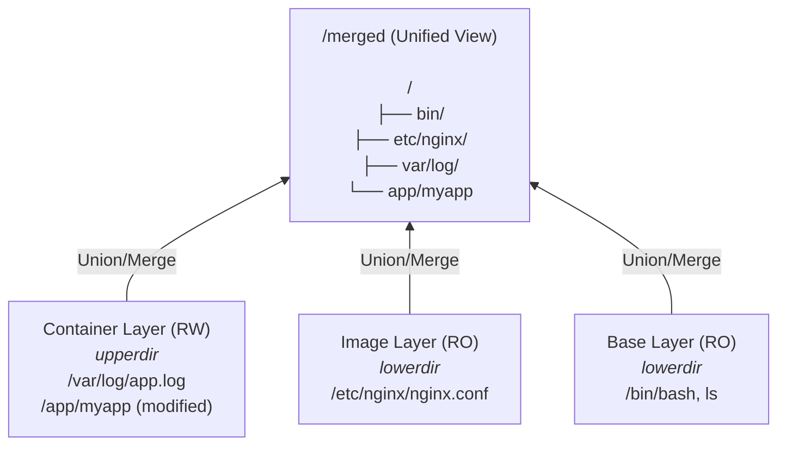
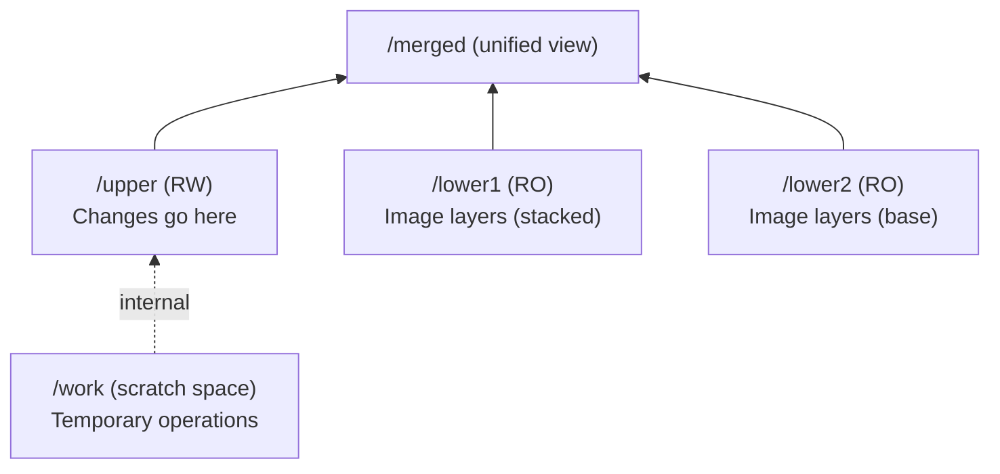
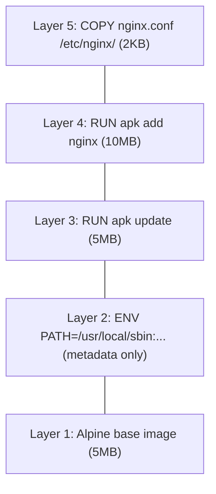
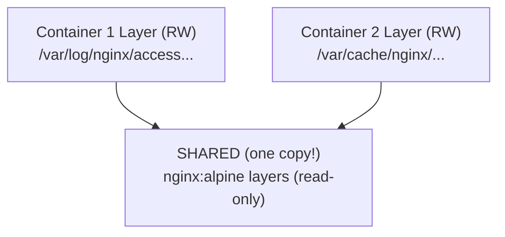
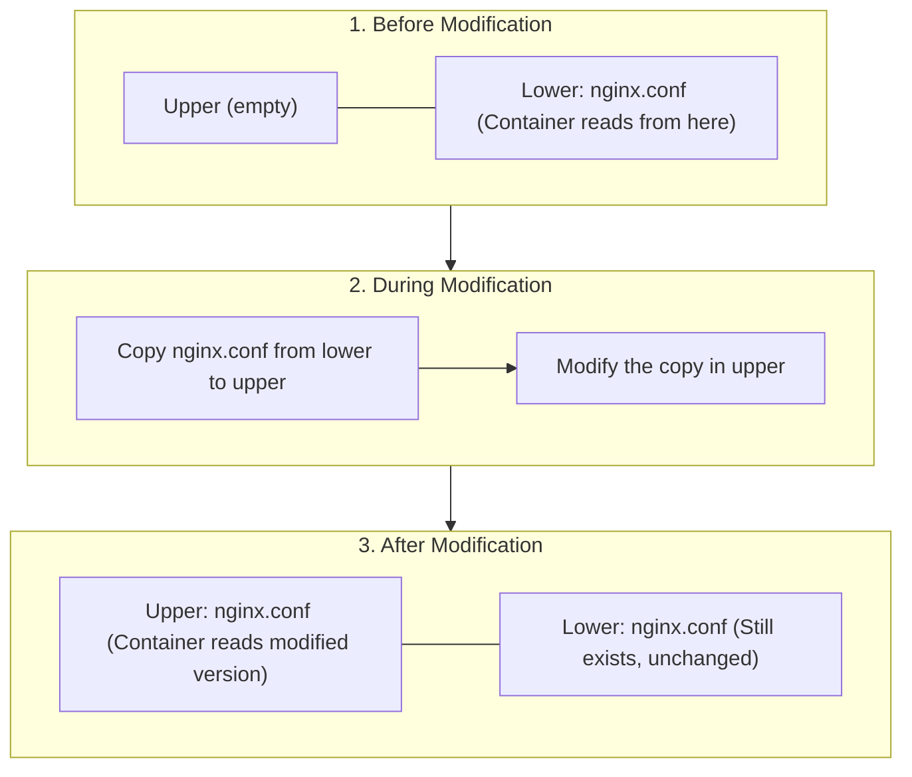

> **Linux Foundations** | Complexity: `[MEDIUM]` | Time: 25-30 min

## Prerequisites

Before starting this module:
- **Required**: [Module 1.3: Filesystem Hierarchy](/linux/foundations/system-essentials/module-1.3-filesystem-hierarchy/)
- **Required**: [Module 2.1: Linux Namespaces](../module-2.1-namespaces/) (mount namespace concept)
- **Helpful**: Understanding of container images

---

## What You'll Be Able to Do

After this module, you will be able to:
- **Explain** how overlay filesystems enable container image layers
- **Trace** a file read/write through the overlay stack (lowerdir, upperdir, merged)
- **Debug** storage issues in containers by inspecting the overlay mount
- **Compare** OverlayFS with other union filesystem implementations and explain why OverlayFS won

---

## Why This Module Matters

Every time you pull a container image, run `docker build`, or start a Kubernetes pod, union filesystems are at work. They make containers efficient by:

- **Sharing common layers** — 100 containers from the same image don't need 100 copies
- **Copy-on-write** — Only changed files use additional storage
- **Fast startup** — No need to copy entire image for each container

Understanding union filesystems helps you:

- **Optimize images** — Know why layer order matters
- **Debug storage issues** — Why is my container using so much space?
- **Understand image caching** — Why did Docker rebuild this layer?
- **Troubleshoot container filesystem problems** — Why can't I see my file?

---

## Did You Know?

- **OverlayFS merged into the Linux kernel in 2014** (kernel 3.18). Before that, containers used AUFS, which never made it into the mainline kernel—Docker had to patch kernels to use it.

- **A single layer can be shared by thousands of containers** — If you run 1000 containers from the same base image, you have ONE copy of the base layer, not 1000. This is why container density is so high.

- **Each Dockerfile instruction creates a layer** — But only instructions that modify the filesystem (RUN, COPY, ADD) create meaningful layers. ENV and LABEL create metadata-only layers.

- **The container's writable layer is ephemeral** — When the container is removed, the layer is gone. This is why volumes exist—to persist data beyond container lifecycle.

---

## What Is a Union Filesystem?

A **union filesystem** merges multiple directories (layers) into a single unified view.

> **Stop and think**: If you delete a file in a container that originated from the base image, how does the filesystem remember it's deleted without actually modifying the read-only base image?



### Key Concepts

| Concept | Description |
|---------|-------------|
| Layer | A directory containing filesystem changes |
| Lower layers | Read-only base layers (image) |
| Upper layer | Read-write container layer |
| Merged view | What the container sees |
| Copy-on-write | Copies file to upper layer when modified |
| Whiteout | Marks deleted files (without removing from lower) |

---

## OverlayFS

**OverlayFS** is the default storage driver for Docker and containerd.

### How OverlayFS Works

```bash
# Mount command:
mount -t overlay overlay -o \
  lowerdir=/lower1:/lower2, \
  upperdir=/upper, \
  workdir=/work \
  /merged
```



### OverlayFS Operations

| Operation | What Happens |
|-----------|--------------|
| **Read** | Return file from highest layer that has it |
| **Write (new file)** | Create in upper layer |
| **Write (existing)** | Copy from lower to upper, then modify (COW) |
| **Delete** | Create "whiteout" file in upper layer |
| **Rename dir** | Complex; may copy entire directory |

### Try This: Create an Overlay Mount

```bash
# Create directories
mkdir -p /tmp/overlay/{lower,upper,work,merged}

# Add some files to lower
echo "base file" > /tmp/overlay/lower/base.txt
echo "will be modified" > /tmp/overlay/lower/modify.txt
echo "will be deleted" > /tmp/overlay/lower/delete.txt

# Mount overlay
sudo mount -t overlay overlay \
    -o lowerdir=/tmp/overlay/lower,upperdir=/tmp/overlay/upper,workdir=/tmp/overlay/work \
    /tmp/overlay/merged

# View merged filesystem
ls /tmp/overlay/merged/
# Shows: base.txt  delete.txt  modify.txt

# Read from lower layer
cat /tmp/overlay/merged/base.txt
# Output: base file

# Create new file (goes to upper)
echo "new file" > /tmp/overlay/merged/new.txt
ls /tmp/overlay/upper/
# Shows: new.txt

# Modify existing (copy-on-write)
echo "modified content" > /tmp/overlay/merged/modify.txt
ls /tmp/overlay/upper/
# Shows: modify.txt  new.txt

# Delete file (creates whiteout)
rm /tmp/overlay/merged/delete.txt
ls -la /tmp/overlay/upper/
# Shows: delete.txt (whiteout character device)

# Original still exists in lower
ls /tmp/overlay/lower/
# Shows: base.txt  delete.txt  modify.txt

# Cleanup
sudo umount /tmp/overlay/merged
rm -rf /tmp/overlay
```

---

## Container Image Layers

> **Pause and predict**: If you change a single line of code in your application, which layers of the Docker image will need to be rebuilt?

### Anatomy of an Image

```bash
docker pull nginx:alpine
```


*Total: ~22MB (but shared with other alpine-based images)*

### Viewing Image Layers

```bash
# See layers
docker history nginx:alpine

# Detailed layer info
docker inspect nginx:alpine | jq '.[0].RootFS.Layers'

# Layer storage location
ls /var/lib/docker/overlay2/
```

### Layer Sharing



100 containers from nginx:alpine = 1 copy of image + 100 thin container layers

---

## Copy-on-Write (COW)

### How COW Works



*(Note: The lower layer is NEVER modified, ensuring other containers can safely use it.)*

### COW Performance Implications

| Operation | Performance |
|-----------|-------------|
| Reading small file | Fast (direct read) |
| Reading large file | Fast (direct read) |
| Writing new small file | Fast (write to upper) |
| Modifying small file | Medium (copy + write) |
| Modifying large file | SLOW (full copy + write) |
| Modifying file frequently | Can be slow (consider volume) |

**Best Practice**: For frequently modified files, use volumes instead of container layer.

---

## Dockerfile Layer Optimization

### Bad: Creates Many Large Layers

```dockerfile
FROM ubuntu:22.04
RUN apt-get update
RUN apt-get install -y python3
RUN apt-get install -y python3-pip
RUN rm -rf /var/lib/apt/lists/*   # Too late! Previous layers have it
```

Each RUN creates a layer. The `rm` in the last layer doesn't reduce image size—the files still exist in earlier layers!

### Good: Single Optimized Layer

```dockerfile
FROM ubuntu:22.04
RUN apt-get update && \
    apt-get install -y python3 python3-pip && \
    rm -rf /var/lib/apt/lists/*   # Same layer, so files are never stored
```

### Layer Ordering Matters

```dockerfile
# BAD: Copy code before installing dependencies
# Every code change invalidates pip install layer
FROM python:3.11
COPY . /app                    # Changes frequently
RUN pip install -r /app/requirements.txt  # Reinstalled every time!

# GOOD: Install dependencies first
FROM python:3.11
COPY requirements.txt /app/    # Changes rarely
RUN pip install -r /app/requirements.txt  # Cached!
COPY . /app                    # Only this layer rebuilds
```

### .dockerignore

```
# .dockerignore
.git
node_modules
__pycache__
*.pyc
.env
*.log
```

---

## Storage Drivers

### Available Drivers

| Driver | Used By | Backing Filesystem |
|--------|---------|-------------------|
| overlay2 | Default | xfs, ext4 |
| btrfs | Some systems | btrfs |
| zfs | Some systems | zfs |
| devicemapper | Legacy RHEL | Any |
| vfs | Testing only | Any |

### Check Your Driver

```bash
# Docker
docker info | grep "Storage Driver"

# containerd
cat /etc/containerd/config.toml | grep snapshotter

# Podman
podman info | grep graphDriverName
```

### Storage Location

```bash
# Docker layer storage
ls /var/lib/docker/overlay2/

# Each directory is a layer
# l/ contains shortened symlinks for path length
# diff/ contains actual layer contents
# merged/ is the union view (for running containers)
# work/ is overlay work directory
```

---

## Troubleshooting Storage

### Container Using Too Much Space

```bash
# Check container sizes
docker ps -s

# SIZE: Virtual = image + writable layer
# SIZE: Actual writable layer

# Find large files in container
docker exec container-id du -sh /* 2>/dev/null | sort -h | tail -10

# Check what's in writable layer
docker diff container-id
# A = Added
# C = Changed
# D = Deleted
```

### Image Layer Analysis

```bash
# See layer sizes
docker history --no-trunc nginx:alpine

# Use dive tool for detailed analysis
# https://github.com/wagoodman/dive
dive nginx:alpine
```

### Disk Full Issues

```bash
# Docker disk usage
docker system df

# Detailed breakdown
docker system df -v

# Clean up
docker system prune        # Remove unused data
docker system prune -a     # Also remove unused images
docker builder prune       # Clear build cache
```

---

## Common Mistakes

| Mistake | Problem | Solution |
|---------|---------|----------|
| Multiple RUN commands | Bloated image | Combine into single RUN |
| rm in separate layer | Files still in earlier layer | Delete in same layer |
| Wrong COPY order | Cache invalidation | Copy dependencies first |
| Writing to container layer | Slow, data lost on restart | Use volumes |
| Not using .dockerignore | Large context, slow builds | Exclude unnecessary files |
| Forgetting layer caching | Slow rebuilds | Order Dockerfile by change frequency |

---

## Quiz

### Question 1
**Scenario**: You are deploying a microservices architecture and you spin up 100 replica pods of your Node.js application using the exact same container image. Your infrastructure team is concerned about storage capacity, assuming each 500MB container will consume 50GB total. Why is their assumption incorrect and what actually happens at the storage level?

<details>
<summary>Show Answer</summary>

Their assumption is incorrect because container runtimes utilize union filesystems to share read-only layers across all instances. When you start 100 containers from the same image, the runtime only keeps a single 500MB copy of the base image on disk. Each of the 100 containers simply gets a thin, empty read-write layer placed on top of those shared read-only layers. Therefore, the total storage consumed initially will be just slightly over 500MB, saving massive amounts of disk space.

</details>

### Question 2
**Scenario**: A developer execs into a running container to troubleshoot an issue and uses `vim` to append a single line to a 2GB log file located in a lower image layer. Suddenly, the monitoring system alerts that the container's disk usage has spiked by 2GB. What specific mechanism caused this storage spike, and what exactly happened under the hood?

<details>
<summary>Show Answer</summary>

The storage spike was caused by the copy-on-write (COW) mechanism inherent to union filesystems. Because the lower layers of a container image are strictly read-only, the runtime cannot modify the 2GB log file in place. Instead, the moment the developer saves the file, the entire 2GB file is copied up from the read-only layer into the container's ephemeral read-write layer. The modification is then applied to this new copy, resulting in an additional 2GB of storage being consumed on the host disk.

</details>

### Question 3
**Scenario**: A junior engineer submits a pull request with the following Dockerfile snippet, claiming they have optimized the image size by cleaning up the apt cache. However, the CI/CD pipeline shows the image size hasn't decreased at all. Why did this optimization fail, and how must the syntax change to actually reduce the image size?

```dockerfile
RUN apt-get update
RUN apt-get install -y curl
RUN rm -rf /var/lib/apt/lists/*
```

<details>
<summary>Show Answer</summary>

The optimization failed because each `RUN` instruction in a Dockerfile creates and commits a brand-new, immutable filesystem layer. By the time the third `RUN` instruction executes the `rm` command, the package cache has already been permanently baked into the layers created by the first two instructions. The `rm` command simply creates a "whiteout" file in the third layer to hide the cache, but the data still exists in the underlying layers and consumes space. To fix this, all three commands must be chained together using `&&` within a single `RUN` instruction so the cache is deleted before the layer is committed.

</details>

### Question 4
**Scenario**: Your team has deployed a stateful database inside a container without configuring any external volume mounts. After a routine node reboot, the container restarts, but the database is completely empty and all customer records are gone. Based on how union filesystems manage the container lifecycle, why did this data loss occur?

<details>
<summary>Show Answer</summary>

The data loss occurred because the container's read-write layer is strictly ephemeral and tightly coupled to the lifecycle of that specific container instance. When the container process terminates or is removed, the union filesystem simply discards the writable upper layer where all the database changes were being stored. A restarted container is actually a brand-new container instance with a fresh, empty read-write layer placed over the original image. To persist data beyond a container's lifecycle, you must bypass the union filesystem entirely by mounting an external volume to the host filesystem.

</details>

### Question 5
**Scenario**: You are designing a high-throughput application that constantly updates millions of small temporary files per second. When running this app locally on your laptop, it performs fine, but inside a container without volumes, the disk I/O latency becomes unacceptably high. Why does the union filesystem cause a performance bottleneck in this specific write-heavy scenario?

<details>
<summary>Show Answer</summary>

The performance bottleneck occurs because union filesystems impose significant overhead for copy-on-write and namespace merging operations. Every time a new file is created or an existing file from a lower layer is modified, the filesystem must intercept the call and manage the allocation in the upper read-write layer. When this happens millions of times per second, the metadata operations and copy overhead overwhelm the storage driver compared to native filesystem speeds. For extremely high-throughput or write-heavy workloads, you must use volume mounts which write directly to the host filesystem, bypassing the overlay driver entirely.

</details>

---

## Hands-On Exercise

### Exploring Union Filesystems

**Objective**: Understand layers, COW, and container storage.

**Environment**: Linux with Docker installed

#### Part 1: Create a Manual Overlay

```bash
# 1. Create directories
mkdir -p /tmp/overlay-test/{lower,upper,work,merged}

# 2. Add content to lower
echo "original file" > /tmp/overlay-test/lower/readme.txt
mkdir /tmp/overlay-test/lower/subdir
echo "nested file" > /tmp/overlay-test/lower/subdir/nested.txt

# 3. Mount overlay
sudo mount -t overlay overlay \
    -o lowerdir=/tmp/overlay-test/lower,upperdir=/tmp/overlay-test/upper,workdir=/tmp/overlay-test/work \
    /tmp/overlay-test/merged

# 4. Explore
ls -la /tmp/overlay-test/merged/

# 5. Create new file
echo "new content" > /tmp/overlay-test/merged/newfile.txt

# 6. Check upper layer
ls /tmp/overlay-test/upper/
# newfile.txt is here!

# 7. Modify existing file
echo "modified" > /tmp/overlay-test/merged/readme.txt
ls /tmp/overlay-test/upper/
# readme.txt copied here (COW)

# 8. Delete a file
rm /tmp/overlay-test/merged/subdir/nested.txt
ls -la /tmp/overlay-test/upper/subdir/
# Whiteout file created

# 9. Cleanup
sudo umount /tmp/overlay-test/merged
rm -rf /tmp/overlay-test
```

#### Part 2: Examine Docker Layers

```bash
# 1. Pull an image
docker pull alpine:3.18

# 2. View layers
docker history alpine:3.18

# 3. Inspect layer IDs
docker inspect alpine:3.18 | jq '.[0].RootFS.Layers'

# 4. Find storage location
docker info | grep "Docker Root Dir"

# 5. List overlay directories
sudo ls /var/lib/docker/overlay2/ | head -10
```

#### Part 3: Container Layer in Action

```bash
# 1. Start container
docker run -d --name test-overlay alpine sleep 3600

# 2. Check initial size
docker ps -s --filter name=test-overlay

# 3. Write to container
docker exec test-overlay sh -c 'dd if=/dev/zero of=/bigfile bs=1M count=50'

# 4. Check size again
docker ps -s --filter name=test-overlay
# SIZE should show ~50MB now

# 5. See what changed
docker diff test-overlay
# Shows: A /bigfile

# 6. Find container layer
CONTAINER_ID=$(docker inspect test-overlay --format '{{.Id}}')
sudo ls /var/lib/docker/overlay2/ | grep -i ${CONTAINER_ID:0:12} || \
    echo "Layer is at: $(docker inspect test-overlay --format '{{.GraphDriver.Data.UpperDir}}')"

# 7. Cleanup
docker rm -f test-overlay
```

#### Part 4: Dockerfile Layer Optimization

```bash
# 1. Create bad Dockerfile
mkdir /tmp/dockerfile-test && cd /tmp/dockerfile-test
cat > Dockerfile.bad << 'EOF'
FROM alpine:3.18
RUN apk update
RUN apk add curl
RUN rm -rf /var/cache/apk/*
EOF

# 2. Build and check size
docker build -f Dockerfile.bad -t bad-layers .
docker images bad-layers

# 3. Create good Dockerfile
cat > Dockerfile.good << 'EOF'
FROM alpine:3.18
RUN apk update && apk add curl && rm -rf /var/cache/apk/*
EOF

# 4. Build and compare
docker build -f Dockerfile.good -t good-layers .
docker images | grep layers
# good-layers should be smaller

# 5. Compare layers
docker history bad-layers
docker history good-layers

# 6. Cleanup
docker rmi bad-layers good-layers
rm -rf /tmp/dockerfile-test
```

### Success Criteria

- [ ] Created manual overlay mount and understood COW
- [ ] Examined Docker image layers
- [ ] Observed container layer growth
- [ ] Compared optimized vs unoptimized Dockerfiles

---

## Key Takeaways

1. **Union filesystems merge layers** — Multiple read-only layers plus one read-write layer

2. **Layer sharing is the magic** — Thousands of containers can share the same base layers

3. **Copy-on-write for efficiency** — Files only copied when modified

4. **Dockerfile order matters** — Put frequently changing content last for cache efficiency

5. **Container layer is ephemeral** — Use volumes for persistent data

---

## What's Next?

Congratulations! You've completed **Container Primitives**. You now understand that containers are:
- Namespaces (isolation)
- Cgroups (limits)
- Capabilities/LSMs (security)
- Union filesystems (efficient storage)

Next, move to **Section 3: Networking** to learn how Linux networking underpins container and Kubernetes networking.

---

## Further Reading

- [OverlayFS Documentation](https://www.kernel.org/doc/html/latest/filesystems/overlayfs.html)
- [Docker Storage Drivers](https://docs.docker.com/storage/storagedriver/)
- [Dockerfile Best Practices](https://docs.docker.com/develop/develop-images/dockerfile_best-practices/)
- [Dive - Image Layer Explorer](https://github.com/wagoodman/dive)