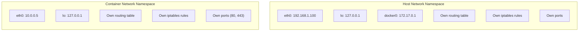
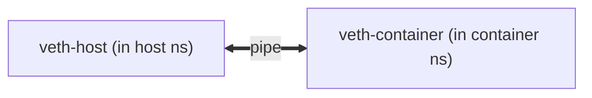
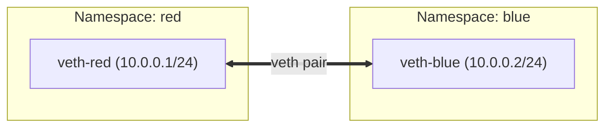
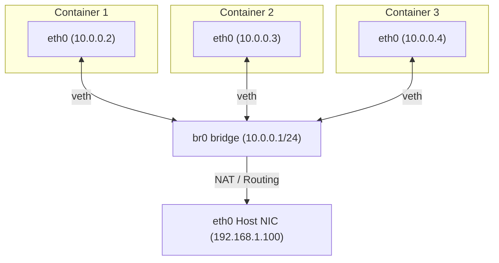
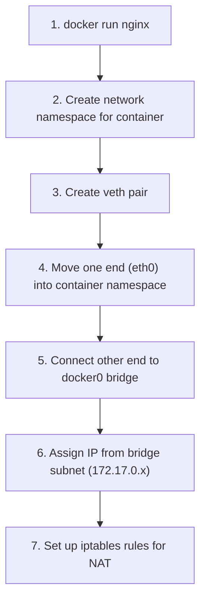
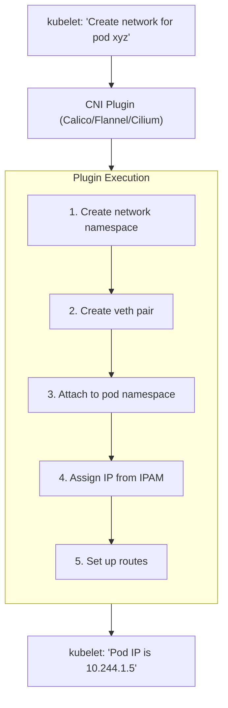
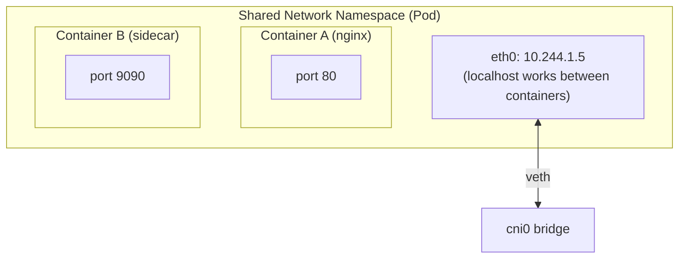
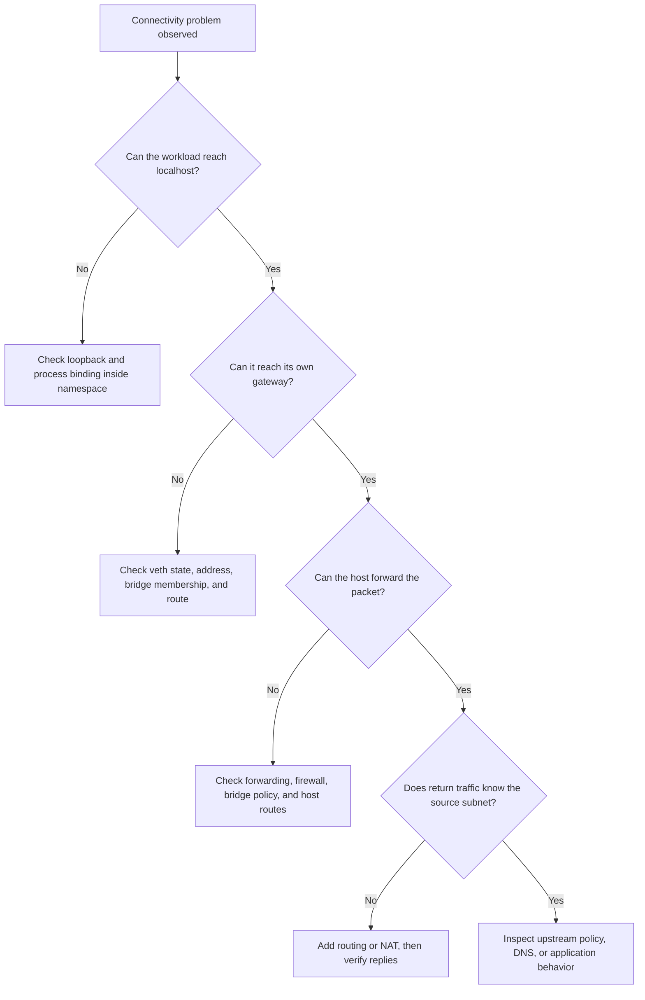

# Module 3.3: Network Namespaces & veth

> **Linux Foundations** | Complexity: `[MEDIUM]` | Time: 30-35 min. This lesson sits between namespace isolation and packet filtering, so treat it as the bridge between container theory and practical node troubleshooting.

## Prerequisites

Before starting this module, make sure you can already read basic interface, address, and route output without needing every field explained from scratch:

- **Required**: [Module 2.1: Linux Namespaces](/linux/foundations/container-primitives/module-2.1-namespaces/)
- **Required**: [Module 3.1: TCP/IP Essentials](../module-3.1-tcp-ip-essentials/)
- **Helpful**: Basic understanding of bridges and switches

## Learning Outcomes

After this module, you will be able to perform measurable troubleshooting and design tasks that map directly to the labs and scenario questions below:

- **Design** a namespace, veth, and bridge topology that gives isolated workloads predictable Layer 2 connectivity.
- **Diagnose** container and pod connectivity by inspecting network namespaces, routes, bridge membership, and NAT behavior.
- **Trace** a packet from one isolated namespace through a veth pair, bridge, routing table, and optional masquerade rule.
- **Evaluate** how Docker and Kubernetes CNI plugins automate the same Linux primitives you can build by hand.

## Why This Module Matters

In 2021, a large online marketplace lost a full regional checkout path after a node image rollout changed container networking behavior in a way that passed application health checks but broke return traffic for pods on a subset of hosts. The application team saw timeouts, the platform team saw healthy kubelets, and the cloud team saw no load balancer errors. Revenue-impacting transactions stalled for nearly an hour because the first responders were looking at service manifests and DNS records while the actual failure lived one layer lower, in the namespace, veth, bridge, route, and NAT wiring on each affected Linux node.

That kind of outage feels confusing because container networking is often presented as a Kubernetes abstraction. A pod has an IP, a Service selects it, and traffic either works or it does not. Underneath that clean model, Linux still has to create an isolated network stack, give it an interface, connect that interface to something outside the namespace, install routes, and sometimes rewrite addresses so replies can find their way back. When any one of those steps is missing, the failure looks like a mysterious application problem until someone can trace the packet through the node.

This module makes the hidden machinery visible. You will create network namespaces, connect them with veth pairs, scale that pattern with a Linux bridge, and map the manual commands to Docker and Kubernetes CNI behavior. Kubernetes 1.35+ still relies on these same kernel building blocks, even when the plugin is Calico, Flannel, Cilium, or another implementation. For Kubernetes examples in this module, assume the standard shortcut `alias k=kubectl`; after that, commands use `k` so your muscle memory matches the rest of the course.

## Network Namespace Recap

A network namespace is an isolated copy of the Linux network stack. That sentence sounds small, but it includes interfaces, IP addresses, loopback behavior, routing tables, neighbor tables, firewall rules, sockets, and port bindings. A process inside one namespace can bind to port 80 while a process in another namespace also binds to port 80, because those sockets are not competing inside the same network stack. The host namespace is just the default namespace where ordinary processes start.

The easiest way to reason about a namespace is to compare it with an apartment inside a larger building. The apartment has its own rooms, locks, and internal wiring, but it still needs a door, hallway, and building entrance to reach the outside world. The namespace gives a process its private network apartment; veth pairs and bridges provide the doors and hallways. Without those external connectors, the namespace is isolated but not useful for most container workloads.


*Note: The host and container have completely separate network stacks, which means the same port can be used in each namespace without either process seeing the other's socket binding.*

The diagram separates the host and container stacks because the kernel treats them as different networking universes. The host can have `eth0`, a Docker bridge, and its own firewall rules, while the container can have a different `eth0`, a separate loopback device, and a route table that does not match the host. When you run a command with `ip netns exec`, you are not asking for a different command syntax; you are asking the same kernel networking tools to inspect a different network universe.

That distinction is what makes namespace debugging feel different from ordinary host networking. On a traditional server, `ip route` usually describes the path for the process you care about because the process and your shell share the same network namespace. With containers, your shell on the node may be looking at the host route table while the failing process uses a separate route table behind a veth. If you forget that split, you can stare at a perfectly valid host default route and still miss that the pod namespace has no default route at all.

Network namespaces also explain why container networking problems often produce mixed signals. A liveness probe that uses `localhost` may pass because it stays inside the pod namespace, while an outbound request fails because it must cross the veth and host forwarding path. A pod-to-pod request may work on the same node through a bridge, while cross-node traffic fails because the overlay or underlay route is missing. The namespace boundary does not tell you everything, but it tells you which view of the network you must inspect first.

```bash
# Create namespace
sudo ip netns add red

# List namespaces
ip netns list

# Execute command in namespace
sudo ip netns exec red ip link

# Delete namespace
sudo ip netns delete red
```

The first surprising detail in a new namespace is that even loopback starts down. That matters because many local tests assume `localhost` is always usable, but a namespace is born with its interfaces administratively down until something brings them up. Container runtimes hide that step, so beginners often forget it during manual labs and then misdiagnose a loopback failure as an IP addressing problem. Good troubleshooting starts by checking link state before chasing routes or firewall rules.

Stop and think: if a network namespace is completely isolated with its own loopback interface, how can a process inside it ever send a packet to a process on the host machine? The answer cannot be "because the host can see everything"; the kernel isolation boundary is real. Some interface must exist on both sides of the boundary, or the packet has no legal path out of the namespace.

In production incidents, namespace awareness gives you a clean first split in the investigation. If traffic fails inside the namespace before it reaches its gateway, inspect the namespace interface, address, neighbor table, and route. If traffic leaves the namespace but fails on the host, inspect the host-side veth, bridge membership, forwarding policy, and NAT. This split keeps you from randomly changing Service objects when the failure is a missing link or a down interface on the node.

## Virtual Ethernet Pairs as the Boundary Connector

A veth pair is two virtual Ethernet interfaces created as a matched pair. Packets transmitted into one end appear on the other end, which makes the pair behave like a short cable whose ends can live in different network namespaces. The pair does not route packets, assign addresses, or perform policy decisions by itself. It simply gives two isolated stacks a shared Layer 2 connection point that higher-level routing and bridging can use.


*Note: Packets transmitted into one veth end come out of the other end, so the pair behaves like a virtual Ethernet cable crossing the namespace boundary.*

Because a veth pair is created as two ends at once, it is a common place for naming confusion. The end you create on the host might later be renamed to `eth0` after it enters the container namespace, while the host-side end might receive a generated name from a runtime. During debugging, the name is less important than the relationship. You are looking for one interface inside the namespace and its peer outside the namespace, then verifying both ends are up and attached to the intended next hop.

```bash
# Create veth pair
sudo ip link add veth-host type veth peer name veth-ns

# They're created together as a pair
ip link show type veth
```

The veth model is intentionally simple, which is why it appears beneath so many container networking designs. Simplicity also creates sharp edges. If you delete either end, the pair disappears. If you move one end into a namespace, commands in the host namespace no longer show that moved interface by its old name. If you attach the host end to the wrong bridge, packets can leave the container and still never reach the intended network.

Pause and predict: after creating `veth-host` and `veth-ns`, what output would you expect from `ip link show type veth` before either end is moved into a namespace? Now predict what changes after `veth-ns` is moved into `red`. The important mental model is that the interface did not vanish from the kernel; it moved into a different namespace, so you must inspect that namespace to see it.

One practical debugging habit is to avoid treating interface names as proof of topology. A host interface named `veth0` might not be connected to the pod you are investigating, especially on busy nodes. Use `ip -d link`, `bridge link show`, runtime metadata, or namespace entry with `nsenter` to correlate the peer relationship. The goal is to prove the path, not to infer it from a friendly-looking name.

The peer relationship is more trustworthy than the name because runtimes optimize for uniqueness and lifecycle management, not human readability. Docker, containerd, and CNI plugins may create names that are truncated, regenerated, or tied to implementation-specific conventions. In a calm lab, `veth-host` and `veth-ns` make the topology obvious. On a real node, you may need to pair runtime metadata with link indexes and bridge output to avoid debugging the wrong cable.

Another useful habit is to think about direction without assuming directionality. A veth pair is full duplex, so either end can transmit and receive. The reason diagrams often label one side "host" and one side "container" is administrative placement, not because the interface itself has a privileged direction. That matters when you inspect captures: a packet may be visible on both ends of the pair, but policy and routing decisions around those ends still belong to their respective namespaces.

Veth pairs also influence failure blast radius. A single broken peer affects only the namespace attached to that peer, while a broken bridge or host route can affect every namespace using that shared path. This is why node triage often starts by comparing one failing pod with one healthy pod on the same node. If both fail at the same gateway or bridge, the shared component is suspicious. If only one fails, inspect that pod's namespace interface and host-side peer first.

## Connecting Namespaces Directly

The smallest useful lab is two namespaces connected by one veth pair. This topology does not need a bridge, a router, or NAT because both endpoints sit on the same subnet across the pair. It is the container-networking equivalent of connecting two laptops with one Ethernet cable and assigning static addresses on both ends. The design is deliberately limited, but it teaches the sequence every larger topology still contains: create isolation, create a connector, move interfaces, assign addresses, bring links up, and test.


*Note: With both veth ends up and addressed in the same prefix, `ping 10.0.0.2` from red works, and `ping 10.0.0.1` from blue works.*

This direct topology is a useful worked example because every command has an obvious purpose. The namespace commands create two isolated stacks. The veth command creates the virtual cable. The `ip link set ... netns` commands put one cable end into each stack. The `ip addr add` commands give the endpoints addresses on the same subnet, and the `ip link set ... up` commands make the kernel willing to transmit frames through them.

```bash
# 1. Create namespaces
sudo ip netns add red
sudo ip netns add blue

# 2. Create veth pair
sudo ip link add veth-red type veth peer name veth-blue

# 3. Move each end to a namespace
sudo ip link set veth-red netns red
sudo ip link set veth-blue netns blue

# 4. Assign IP addresses
sudo ip netns exec red ip addr add 10.0.0.1/24 dev veth-red
sudo ip netns exec blue ip addr add 10.0.0.2/24 dev veth-blue

# 5. Bring interfaces up
sudo ip netns exec red ip link set veth-red up
sudo ip netns exec blue ip link set veth-blue up
sudo ip netns exec red ip link set lo up
sudo ip netns exec blue ip link set lo up

# 6. Test connectivity
sudo ip netns exec red ping -c 2 10.0.0.2

# 7. Cleanup
sudo ip netns delete red
sudo ip netns delete blue
```

When the ping works, the kernel has done several things for you. The `red` namespace sees that `10.0.0.2` is on-link because its interface has `10.0.0.1/24`. It resolves the neighbor, emits an Ethernet frame through `veth-red`, and the frame appears at `veth-blue` inside the `blue` namespace. No host routing table is needed because neither endpoint is using the host as a router in this simple design.

Before running this in a lab, predict what happens if you omit only the two loopback commands. The ping between `10.0.0.1` and `10.0.0.2` can still work because it uses the veth interfaces, but commands that depend on `localhost` inside either namespace will fail or behave strangely. That distinction is valuable during pod debugging because pod-to-pod traffic and localhost sidecar traffic exercise different interfaces in the same namespace.

The weakness of direct veth wiring appears as soon as you add more namespaces. Two endpoints require one pair, but a fully meshed set of many endpoints requires a rapidly growing number of pairs and manual routes. Physical networks solved this problem long ago with switches. Linux gives you the same idea in software through bridges, which let many veth host ends share one Layer 2 segment instead of requiring a dedicated pair for every relationship.

Direct wiring is still worth learning because it removes every optional component. If a direct pair cannot pass traffic after both interfaces are up and addressed correctly, a bridge would not magically solve the underlying issue. You either have the wrong namespace view, a down interface, a bad address or prefix, or a local filtering problem. Once the direct case is clear, a bridge becomes an intentional scaling tool rather than another mysterious object in the path.

This is also where the difference between Layer 2 and Layer 3 becomes operational rather than academic. The veth pair moves Ethernet frames between two endpoints, and the IP addresses plus routes determine which frames should be emitted for a destination. When both addresses share a prefix, the kernel treats the peer as directly reachable. When the destination is outside the prefix, the namespace needs a route to a next hop, which is why bridge-gateway designs add a default route.

The direct namespace lab is a good place to practice negative testing. Bring one interface down, remove one address, or assign mismatched prefixes, then predict the symptom before running `ping`. Each break teaches a different diagnostic signature. A down interface usually fails immediately, a missing address removes the source identity, and a mismatched prefix can make the kernel look for a gateway or reject the route choice. Those signatures later help you read real pod failures quickly.

## Scaling the Pattern with Linux Bridges

A Linux bridge is a software Layer 2 switch. It learns which MAC addresses live behind which attached interfaces and forwards frames accordingly. For container networking, the bridge usually lives in the host namespace, while each container namespace gets one veth end. The host-side veth ends attach to the bridge, so containers can discover each other with ARP and communicate as peers on one subnet without a direct pair between every container.



The bridge often receives an IP address because it acts as the gateway for attached namespaces. That address is not required for pure Layer 2 forwarding between peers on the same bridge, but it becomes important when the namespace needs to route traffic beyond the local subnet. In the diagram, `br0` at `10.0.0.1/24` gives containers a next hop. The host can then forward traffic to another interface and optionally apply NAT for external networks that do not know the container subnet.

```bash
# Create bridge
sudo ip link add br0 type bridge

# Bring it up
sudo ip link set br0 up

# Assign IP (becomes gateway for containers)
sudo ip addr add 10.0.0.1/24 dev br0

# Connect veth to bridge
sudo ip link set veth-host master br0
```

The bridge command sequence is shorter than the concept it represents. Creating the bridge gives the host a virtual switch. Bringing it up allows forwarding. Assigning an IP makes the host reachable as a gateway on that segment. Setting a veth host end as a bridge master plugs that cable into the switch. If any step is omitted, the symptom changes, which is why structured diagnosis beats guesswork.

Stop and think: we have seen namespaces, veth pairs, and bridges. When you run `docker run nginx`, Docker automates all of this in milliseconds. Based on what you have learned, what exact sequence of networking commands do you think the Docker daemon executes behind the scenes to give that Nginx container internet access? The useful answer names both the topology work and the policy work: namespace, veth, bridge attachment, IP assignment, route, forwarding, and NAT.

A bridge also changes how you interpret packet captures. Capturing inside the namespace shows what the workload emits or receives. Capturing on the host-side veth shows frames crossing the namespace boundary. Capturing on the bridge shows switching behavior and ARP. Capturing on the physical NIC shows routed or NATed traffic leaving the node. In a real incident, those capture points tell you where the packet disappeared.

Bridge designs also force you to separate local switching from host routing. Traffic between two namespaces on the same bridge may never need the host to route anything at Layer 3, because the bridge forwards frames within one broadcast domain. Traffic from a namespace to an outside subnet does need the namespace route table to choose the bridge as a gateway and the host to forward the packet onward. If you do not distinguish those cases, you may enable forwarding while the real failure is simply a missing bridge membership.

The bridge has its own observability surface. `bridge link show` tells you which interfaces are enslaved to which bridge, while `ip addr show br0` tells you whether the bridge itself has a gateway address. Neighbor tables show whether ARP resolution is succeeding. Firewall tooling may also affect bridged packets depending on system configuration. A strong diagnosis names which of those surfaces has been proven and which is still an assumption.

Bridge-based designs are common because they create a useful compromise between isolation and shared connectivity. Each namespace keeps its own route table and port space, but all attached namespaces can participate in a common Layer 2 segment. That lets a runtime give every container a private network stack while still allowing ordinary IP communication through a predictable gateway. The tradeoff is that the bridge becomes shared infrastructure, so misconfiguration can affect many workloads at once.

## Docker, CNI, and Kubernetes Use the Same Primitives

Container runtimes do not replace Linux networking; they orchestrate it. Docker's default bridge network is a packaged version of the bridge pattern, with `docker0` as the host-side bridge, veth pairs for each container, container IP assignment from a bridge subnet, and NAT rules for outbound connectivity. The important skill is recognizing the manual pattern when a runtime hides the command sequence behind a friendly CLI.


*Note: The result is a container with network access through the `docker0` bridge, plus host policy that decides whether external traffic can leave and return.*

The Docker flow is not magic, and the host exposes enough evidence to reconstruct it. You can inspect `docker0`, list host-side veth interfaces, check bridge membership, and enter or execute inside the container to inspect its private address and route table. Those observations map directly to the manual lab steps. The runtime may use generated interface names and additional firewall chains, but the primitives remain the same.

```bash
# See docker bridge
ip link show docker0

# See veth interfaces (host side)
ip link show type veth

# See bridge members
bridge link show

# Inside container
docker exec container-id ip addr
docker exec container-id ip route
```

Kubernetes adds a stricter network contract on top of the same primitives. Every pod gets an IP, pods should be able to communicate without NAT across nodes according to the cluster networking model, and containers inside a pod share one network namespace. The kubelet asks a CNI plugin to make that contract true on the node. The plugin may use a bridge, an overlay, direct routing, eBPF programs, or cloud-provider interfaces, but it still has to attach the pod namespace to the node network somehow.



The CNI plugin receives a namespace path and configuration, then performs the node-local networking work. IPAM assigns a pod address from the configured range. The plugin creates or reuses links, sets routes, and reports the result back to kubelet. If that chain fails, the pod can stay in `ContainerCreating` even though the image pulled successfully and the container process has not yet started. The failure is not an application crash; it is a networking setup failure before the workload begins.



The pod diagram explains why sidecars can use localhost. Containers in the same pod are separate processes with separate filesystems and process trees, but they join the same network namespace. They share the same loopback interface, IP address, port space, and routing table. That is why two containers in one pod cannot both bind the same port on the same address, and why a sidecar can often reach the main container through `127.0.0.1` without a Service.

For Kubernetes 1.35+ troubleshooting, start with `k get pod -o wide`, then inspect from inside the pod with `k exec pod-name -- ip addr`, `k exec pod-name -- ip route`, and `k exec pod-name -- cat /etc/resolv.conf`. When you need the node view, use the container runtime to find the process ID and enter the pod network namespace. The point is to compare the workload's view with the host's view, then locate the first place they disagree.

```bash
# Find pod's network namespace
# Get container ID
CONTAINER_ID=$(crictl ps --name nginx -q)

# Get PID
PID=$(crictl inspect $CONTAINER_ID | jq .info.pid)

# Access namespace
sudo nsenter -t $PID -n ip addr

# Or via Kubernetes
kubectl exec pod-name -- ip addr
kubectl exec pod-name -- ip route
kubectl exec pod-name -- cat /etc/resolv.conf
```

A war story from a platform team illustrates the value of this comparison. A pod could resolve DNS and reach its node-local gateway, but external requests timed out only on new nodes. Inside the pod, `ip route` looked normal. On the host, the bridge had the right address, and the veth was attached. The missing piece was an outbound masquerade rule that the node bootstrap script normally installed. Once the team traced the packet from namespace to bridge to host egress, the fix was a one-line NAT rule rather than a long application rollback.

The CNI boundary is important because it defines responsibility during startup. Kubelet is responsible for asking the configured plugin to set up the pod network, but the plugin is responsible for making the namespace reachable according to its configuration. If kubelet reports a CNI error, the pod may not have a stable application process to inspect yet. The useful evidence is in kubelet logs, CNI plugin logs, IPAM state, and node networking state, not in application-level retries.

Kubernetes networking also changes the cost of sloppy assumptions. A single-node lab can hide a missing route because NAT through the host makes outbound access appear to work. A multi-node cluster cannot rely on that shortcut for normal pod-to-pod communication because the Kubernetes network model expects pods to communicate without per-pod NAT across nodes. When a plugin meets that model through overlays or direct routing, the Linux primitive is still present, but the next hop may be a tunnel, eBPF datapath, cloud route, or host bridge depending on implementation.

When you evaluate a CNI plugin, ask what it automates and what it deliberately avoids. A bridge-oriented plugin may be easy to inspect with familiar Linux tools, but it may require overlays or host routes for cross-node traffic. An eBPF-oriented plugin may reduce iptables complexity and improve performance, but it changes where policy and forwarding decisions are visible. The right operational question is not whether one approach is universally better; it is whether your team can diagnose the datapath it has chosen.

## Building a Mini Container Network

The complete mini-network below turns the concepts into a container-like topology: a host bridge named `cni0`, one namespace named `container1`, one veth pair, an address inside the namespace, a default route through the bridge, host forwarding, and a masquerade rule. It is not a full CNI implementation, but it mirrors the minimum useful data path closely enough that later Kubernetes debugging will feel familiar rather than mysterious.

```bash
#!/bin/bash
# Create a container-like network setup

# 1. Create bridge
sudo ip link add cni0 type bridge
sudo ip link set cni0 up
sudo ip addr add 10.244.0.1/24 dev cni0

# 2. Create "container" namespace
sudo ip netns add container1

# 3. Create veth pair
sudo ip link add veth0 type veth peer name eth0

# 4. Move eth0 to container namespace
sudo ip link set eth0 netns container1

# 5. Connect veth0 to bridge
sudo ip link set veth0 master cni0
sudo ip link set veth0 up

# 6. Configure container interface
sudo ip netns exec container1 ip addr add 10.244.0.2/24 dev eth0
sudo ip netns exec container1 ip link set eth0 up
sudo ip netns exec container1 ip link set lo up

# 7. Add default route in container
sudo ip netns exec container1 ip route add default via 10.244.0.1

# 8. Enable forwarding on host
sudo sysctl -w net.ipv4.ip_forward=1

# 9. Add NAT for external access
sudo iptables -t nat -A POSTROUTING -s 10.244.0.0/24 ! -o cni0 -j MASQUERADE

# Test
echo "Testing connectivity..."
sudo ip netns exec container1 ping -c 2 10.244.0.1  # Gateway
sudo ip netns exec container1 ping -c 2 8.8.8.8     # Internet (if NAT works)

# Cleanup (run after testing)
# sudo ip netns delete container1
# sudo ip link delete cni0
# sudo iptables -t nat -D POSTROUTING -s 10.244.0.0/24 ! -o cni0 -j MASQUERADE
```

Read the example as a packet story rather than a script. A packet from `container1` to `8.8.8.8` starts in the namespace, exits through `eth0`, appears on `veth0`, enters `cni0`, uses the namespace default route to choose the bridge as gateway, and then depends on the host to forward it out another interface. The masquerade rule rewrites the source address so the external reply returns to the host, where connection tracking can translate it back to the namespace address.

Which approach would you choose here and why: direct routing for the container subnet, or NAT through the host address? Direct routing preserves pod or container source IPs and can simplify observability, but it requires the rest of the network to know how to reach that subnet. NAT is easier on a single developer machine and many simple node-local designs, but it hides the original source from external systems unless extra tracking or metadata is added.

The same tradeoff appears in Kubernetes plugin design. Some plugins build overlays because the underlay network cannot route pod CIDRs directly. Some rely on cloud routing tables because the environment can advertise pod ranges. Some use eBPF to replace or accelerate parts of the bridge, iptables, or routing path. You do not need to memorize every plugin implementation to debug the first layer; you need to ask which namespace, which interface, which route, and which policy decision handled this packet.

When you run the mini-network, resist the urge to jump straight to the internet ping as the only success signal. A better sequence is namespace interface state, gateway reachability, host forwarding state, and then external reachability. This progression tells you which layer failed. If the gateway ping fails, NAT cannot help. If the gateway ping works but external traffic fails, the namespace wiring is probably adequate and the investigation moves to forwarding, firewall, NAT, or upstream routes.

The cleanup comments in the script matter because manual networking experiments leave real kernel objects behind. A stale namespace can keep an interface name occupied. A stale bridge can retain an address that conflicts with the next run. A stale NAT rule can make a later experiment appear to work for the wrong reason. Production automation has to be just as careful: CNI plugins must clean up links and allocations when pods are deleted, or nodes accumulate confusing leftovers that pollute future diagnostics.

The mini-network also gives you a safe place to learn command ordering. You can create a bridge before the namespace, but the namespace cannot use a route through that bridge until its interface exists, has an address, and is up. You can add a NAT rule before testing the gateway, but that rule will not repair a broken veth. Thinking in dependencies makes the lab easier to debug and mirrors how kubelet waits for CNI setup before reporting a pod IP.

## Patterns & Anti-Patterns

Good namespace networking is less about memorizing commands and more about preserving a few stable design patterns. The same pattern can be implemented manually, by Docker, by containerd plus a CNI plugin, or by a Kubernetes distribution. When the pattern is clear, runtime-specific names become details. When the pattern is unclear, every generated interface looks suspicious and every timeout invites random changes.

| Pattern | When to Use It | Why It Works | Scaling Consideration |
|---------|----------------|--------------|-----------------------|
| Namespace plus one veth pair | Two isolated endpoints need a simple lab connection or a point-to-point test | It proves the boundary connector without bridge or NAT complexity | Does not scale for many endpoints because pair count and routing complexity grow quickly |
| Host bridge with veth members | Many local namespaces need one shared Layer 2 segment | The bridge behaves like a virtual switch and reduces many-to-many wiring | Broadcast, ARP, and bridge policy matter as density grows |
| Bridge as gateway plus NAT | A local namespace subnet needs outbound access through the host | The bridge provides a next hop, and masquerade makes return traffic routable | NAT can hide source identity and complicate policy or logging |
| CNI-managed pod namespace | Kubernetes should own pod lifecycle networking | Kubelet delegates consistent setup and cleanup to the configured plugin | Plugin-specific datapaths differ, so diagnosis must confirm the actual implementation |

The most durable pattern is to separate topology from policy. Topology asks whether the namespace has an interface, whether the peer exists, whether the bridge membership is correct, and whether a route points to a reachable gateway. Policy asks whether forwarding, firewall, NetworkPolicy, or NAT rules allow the packet. Mixing those questions makes investigations noisy. Prove the wire first, then prove the permission.

| Anti-Pattern | What Goes Wrong | Better Alternative |
|--------------|-----------------|--------------------|
| Assuming the host namespace can see the pod view | Commands on the host show different interfaces and routes than commands inside the pod | Enter the target namespace with `ip netns exec` or `nsenter` before drawing conclusions |
| Treating veth names as stable identifiers | Runtime-generated names change and can point to the wrong workload on a busy node | Correlate peer indexes, bridge membership, runtime metadata, and pod PIDs |
| Adding NAT before proving local connectivity | A missing link or route gets hidden behind firewall experiments | Test namespace-to-gateway first, then host forwarding, then external return traffic |
| Debugging Kubernetes Services before pod networking | Service symptoms can be caused by a broken pod namespace path | Confirm pod IP, interface state, route, and node-side veth before changing Service objects |

A practical review technique is to ask someone to narrate the path in one paragraph. If they cannot say where the packet starts, which interface it leaves through, what receives it next, which routing decision happens, and where source translation occurs, the team is not ready to change production policy. That narration does not need vendor-specific detail at first. It needs the Linux primitives in order.

Patterns become especially valuable during handoffs. The application engineer may describe a timeout, the Kubernetes operator may describe a pod IP, and the network engineer may describe a route or firewall rule. The namespace-veth-bridge vocabulary gives all three people a shared map. Without it, each person can be correct inside their own layer while the incident still stalls because nobody has connected the layers into one packet path.

## Decision Framework

Use this framework when you are designing a lab topology or diagnosing a production container-networking failure. The first decision is always scope: is the symptom inside one namespace, between namespaces on one node, across nodes, or beyond the cluster? Each wider scope adds another layer of routing and policy, so solving the smaller scope first prevents you from skipping the actual broken hop.



The framework starts with localhost because pod sidecar communication depends on the shared namespace, not on the bridge. It then moves to the gateway because that proves the veth and bridge path. Only after the namespace can reach the gateway does host forwarding make sense. Finally, external reachability requires either routable source addresses or NAT. This order mirrors the packet path, which keeps the troubleshooting process aligned with how the kernel actually handles traffic.

| Situation | First Tooling Choice | Evidence You Want | Likely Fix Area |
|-----------|----------------------|-------------------|-----------------|
| Sidecar cannot reach main container on localhost | `k exec` or `nsenter` inside the pod namespace | Loopback is up, process listens on expected address, no port conflict | Process binding or shared port-space conflict |
| Pod cannot reach node-local gateway | `ip addr`, `ip route`, `bridge link show` | Pod interface is up, host-side veth is attached to intended bridge, route points to gateway | veth, bridge, or route setup |
| Namespace reaches gateway but not internet | Host forwarding and NAT inspection | Forwarding is enabled, egress route exists, source rewrite or upstream route exists | sysctl, firewall, NAT, or upstream routing |
| Pod stuck during creation | kubelet logs and CNI plugin logs | Error names IPAM, link creation, route setup, or policy setup | CNI configuration, IP pool, node permissions, or plugin health |

For design work, prefer the simplest topology that satisfies the visibility and routing requirements. A direct veth pair is excellent for teaching and narrow tests. A bridge is better for many local endpoints. Direct routing is better when upstream systems need to see original pod or container addresses. NAT is better when you control only the host and need a quick outbound path. Kubernetes CNI choices encode these same tradeoffs at cluster scale.

Use the framework as a loop, not a one-time checklist. After each fix, retest the smallest failing hop before moving outward. If you bring an interface up, test gateway reachability again. If you add NAT, test external return traffic again. If you change a CNI IP pool, create a new pod and confirm both allocation and route setup. This discipline keeps the investigation anchored to evidence instead of hope.

The framework also helps you decide when a problem is no longer about namespaces. Once you have proven the pod namespace, host-side veth, bridge or datapath, host forwarding, and return route, the remaining failure may genuinely live in DNS, TLS, application binding, or upstream policy. That conclusion is stronger when it follows a packet-path proof. You are not ignoring Kubernetes abstractions; you are earning the right to move up the stack.

## Did You Know?

- **Network namespaces were added to Linux in 2006** (kernel 2.6.24), but did not become widely used in everyday operations until Docker popularized containers in 2013.
- **Each pod in Kubernetes has exactly one network namespace** shared by all containers in that pod, which is why containers in a pod can communicate via localhost.
- **veth pairs are like virtual Ethernet cables**: one end goes in the container, the other end connects to a bridge or the host, and a single node can host thousands of them when resources allow.
- **The CNI spec is short compared with what it enables**: a compact plugin contract defines how Kubernetes asks networking providers to wire pod namespaces.

## Common Mistakes

| Mistake | Why It Happens | How to Fix It |
|---------|----------------|---------------|
| Interface not up | New namespace and veth interfaces start down, and runtimes usually hide the activation step | Run `ip link set <if> up` in the correct namespace and verify state before testing routes |
| Missing IP address | The veth exists, so the topology looks present, but Layer 3 has no source address to use | Add the intended address with `ip addr add` in the namespace and confirm the prefix length |
| No route to gateway | The namespace can reach local peers but has no default next hop for external destinations | Add a default route through the bridge or configured gateway, then test the gateway first |
| Bridge not up | Host-side veth interfaces are attached, but the virtual switch is administratively down | Bring the bridge up and confirm membership with `bridge link show` |
| Missing NAT | Private namespace addresses leave the host, but upstream networks do not know how to reply | Add a MASQUERADE rule or install real routes for the namespace subnet |
| Forgot loopback | Sidecar or local health checks fail even though pod-to-gateway traffic works | Bring `lo` up inside the namespace and verify the process binds to the expected local address |
| Inspecting the wrong namespace | Host commands do not show the workload's private route table or loopback state | Use `ip netns exec`, `nsenter`, or `k exec` to inspect from the workload's actual view |
| Changing Kubernetes objects too early | A node-local wiring fault looks like a Service or DNS issue from the application side | Trace namespace, veth, bridge, route, and NAT before editing higher-level manifests |

## Quiz

<details><summary>Question 1: A pod can resolve DNS and can ping its bridge gateway, but it cannot reach an external API. The node itself can reach the same API. Which part of the path do you inspect next, and why?</summary>

The namespace-to-gateway path is already proven, so the next inspection point is host forwarding, egress routing, and NAT or upstream return routing. The packet leaves the pod namespace and reaches the node, but external replies still need a valid path back to the original source. If the pod CIDR is not routed upstream, a MASQUERADE rule or equivalent source translation is required. Changing DNS or the Kubernetes Service would not address this failure because the packet has already moved beyond name resolution and pod-local connectivity.

</details>

<details><summary>Question 2: You manually created two namespaces and a veth pair. Both interfaces have addresses in the same subnet, but ping fails. What checks should you run before adding routes?</summary>

First check that both veth interfaces are up in their respective namespaces, because a down link will prevent frames from moving even when addresses are correct. Then verify that each namespace sees the intended interface and that the prefix length places the peer address on-link. A default route is not required for two directly connected addresses in the same subnet, so adding one too early can distract from the actual Layer 2 or interface-state problem. If those checks pass, inspect neighbor resolution and confirm the veth peer relationship.

</details>

<details><summary>Question 3: Your team needs three local test namespaces to communicate with each other. A teammate suggests creating direct veth pairs between every namespace pair. What design would you choose instead?</summary>

Use a Linux bridge in the host namespace and attach one host-side veth endpoint for each namespace to that bridge. The bridge gives the namespaces a shared Layer 2 segment, which is the software equivalent of plugging several machines into one switch. Direct pairs work for a tiny point-to-point test, but they scale poorly and make troubleshooting harder as endpoints grow. With a bridge, each namespace needs one connector, and the forwarding model matches common container runtime behavior.

</details>

<details><summary>Question 4: A sidecar container cannot reach `http://localhost:80` in the same pod, but another pod can reach the main container through a Service. What does that tell you about the likely failure?</summary>

Because containers in one pod share a network namespace, localhost traffic does not cross the pod veth, bridge, Service, or kube-proxy path. If another pod can reach the main container through a Service, the main container is probably reachable on the pod IP, but it may not be listening on the loopback address or expected port inside the shared namespace. You should inspect process binding, port conflicts, and loopback state from inside the pod. Changing CNI routes would be unlikely to fix localhost communication within the pod namespace.

</details>

<details><summary>Question 5: A pod is stuck in `ContainerCreating`, and kubelet reports that the CNI plugin failed to allocate an address from the node's pod range. Which setup stage failed, and what evidence would confirm it?</summary>

The failure is in the IPAM stage of CNI setup, before the pod can receive a usable network identity. The plugin may have created some resources, but it cannot complete the pod network contract without assigning a unique IP address and returning that result to kubelet. Evidence would include CNI or kubelet logs naming an exhausted range, missing allocation record, or conflicting address. Inspecting application logs will not help because the workload has not reached normal startup yet.

</details>

<details><summary>Question 6: During a node incident, host `ip link` output shows several veth interfaces, but you do not know which one belongs to the failing pod. How do you avoid guessing?</summary>

Enter the pod network namespace or use runtime metadata to correlate the pod process with its interface, then compare peer information and bridge membership from the host. Generated veth names are not stable enough to use as proof on a busy node. The reliable path is to identify the container or pod PID, inspect the namespace interface, and match that interface to the host-side peer. Once the relationship is proven, packet captures and link checks can focus on the correct device.

</details>

<details><summary>Question 7: You are designing a developer lab for namespace networking. When would you choose NAT through the host instead of direct routing for the namespace subnet?</summary>

Choose NAT when the lab host must provide quick outbound access and the upstream network does not know how to route back to the namespace subnet. Masquerade rewrites the source address to the host's egress address, which makes replies return to the host without changing external routers. Direct routing is cleaner when you control the network and want original source visibility, but it requires explicit routes outside the host. For a portable single-machine lab, NAT is usually the practical choice.

</details>

## Hands-On Exercise

### Building Container Networks

**Objective**: Create and connect network namespaces like containers, then diagnose the path using the same sequence you would use on a Kubernetes node.

**Environment**: Use a Linux system with root access, preferably a disposable VM or lab host where creating and deleting namespaces, bridges, and iptables rules is acceptable.

This exercise keeps the original lab commands and adds explicit checkpoints. Run it on a disposable lab machine or VM because it creates namespaces, links, a bridge, and an optional Docker container. If a command fails because an object already exists, clean up the previous attempt before continuing. The goal is not to copy commands blindly; the goal is to narrate what each command changes in the packet path.

#### Task 1: Create Two Connected Namespaces

```bash
# 1. Create namespaces
sudo ip netns add ns1
sudo ip netns add ns2

# 2. Create veth pair
sudo ip link add veth-ns1 type veth peer name veth-ns2

# 3. Move to namespaces
sudo ip link set veth-ns1 netns ns1
sudo ip link set veth-ns2 netns ns2

# 4. Configure IPs
sudo ip netns exec ns1 ip addr add 10.0.0.1/24 dev veth-ns1
sudo ip netns exec ns2 ip addr add 10.0.0.2/24 dev veth-ns2

# 5. Bring up interfaces
sudo ip netns exec ns1 ip link set veth-ns1 up
sudo ip netns exec ns2 ip link set veth-ns2 up
sudo ip netns exec ns1 ip link set lo up
sudo ip netns exec ns2 ip link set lo up

# 6. Test
sudo ip netns exec ns1 ping -c 2 10.0.0.2
```

<details><summary>Solution notes for Task 1</summary>

The successful ping proves that the two isolated namespaces have a working point-to-point Layer 2 connection through the veth pair and compatible Layer 3 addresses. If the ping fails, inspect `sudo ip netns exec ns1 ip addr`, `sudo ip netns exec ns2 ip addr`, and link state before adding routes. No default route is needed for this specific test because both addresses are in the same `/24` subnet.

</details>

#### Task 2: Add a Bridge

```bash
# 1. Create bridge
sudo ip link add br0 type bridge
sudo ip link set br0 up
sudo ip addr add 10.0.0.254/24 dev br0

# 2. Create namespace connected to bridge
sudo ip netns add ns3
sudo ip link add veth-ns3 type veth peer name veth-br
sudo ip link set veth-ns3 netns ns3
sudo ip link set veth-br master br0
sudo ip link set veth-br up

# 3. Configure ns3
sudo ip netns exec ns3 ip addr add 10.0.0.3/24 dev veth-ns3
sudo ip netns exec ns3 ip link set veth-ns3 up
sudo ip netns exec ns3 ip link set lo up
sudo ip netns exec ns3 ip route add default via 10.0.0.254

# 4. Test connectivity
sudo ip netns exec ns3 ping -c 2 10.0.0.254  # Bridge
ping -c 2 10.0.0.3  # From host
```

<details><summary>Solution notes for Task 2</summary>

The first ping proves the namespace can reach its bridge gateway, which validates the namespace interface, host-side veth, bridge membership, and bridge address. The host-to-namespace ping proves traffic can travel in the reverse direction on the same local segment. If the gateway ping fails, check `bridge link show` and confirm `veth-br` is attached to `br0` and up.

</details>

#### Task 3: Inspect Real Container Networks

```bash
# If Docker is installed:
# 1. Check docker0 bridge
ip addr show docker0

# 2. Run a container
docker run -d --name test nginx

# 3. Find veth pair
ip link show type veth

# 4. Check bridge members
bridge link show

# 5. See inside container
docker exec test ip addr
docker exec test ip route

# 6. Cleanup
docker rm -f test
```

<details><summary>Solution notes for Task 3</summary>

The Docker inspection should reveal the same pattern as the manual bridge lab, although names may be generated and firewall rules may be more elaborate. Look for `docker0`, host-side veth interfaces, bridge membership, and the container's internal `eth0` plus default route. The value of this task is correlation: Docker automates the commands, but the topology remains recognizable.

</details>

#### Task 4: Diagnose a Broken Path

Break one thing deliberately by bringing `veth-ns3` down inside `ns3`, then predict which tests should fail. After confirming the failure, bring the interface back up and repeat the gateway test. This task trains you to connect a symptom to a specific missing state instead of changing unrelated routes or firewall rules.

<details><summary>Solution notes for Task 4</summary>

When `veth-ns3` is down, `ns3` should not be able to reach `10.0.0.254` because the namespace cannot transmit frames through its interface. The bridge can still exist and the host-side veth can still be attached, so host-only inspection may look partially correct. Restoring the interface with `sudo ip netns exec ns3 ip link set veth-ns3 up` should make the gateway test work again if the rest of the topology is intact.

</details>

#### Task 5: Cleanup

```bash
sudo ip netns delete ns1
sudo ip netns delete ns2
sudo ip netns delete ns3
sudo ip link delete br0
```

<details><summary>Solution notes for Task 5</summary>

Deleting the namespaces removes the interfaces that live inside them, and deleting the bridge removes the host-side switching object. If cleanup reports that an object does not exist, it was probably already removed by a previous attempt. Confirm with `ip netns list`, `ip link show type bridge`, and `ip link show type veth` before starting another run.

</details>

### Success Criteria

- [ ] Design namespace veth bridge topology for two direct namespaces and one bridge-connected namespace.
- [ ] Diagnose namespace route bridge NAT behavior by proving each hop in order.
- [ ] Trace packet path from namespace interface through veth peer to bridge gateway.
- [ ] Evaluate Docker CNI Kubernetes automation by matching runtime objects to manual primitives.
- [ ] Created and connected two namespaces.
- [ ] Verified ping works between namespaces.
- [ ] Set up a bridge connecting namespaces.
- [ ] Understand the veth + bridge pattern.
- [ ] (Docker) Inspected real container networking.

## Next Module

[Module 3.4: iptables & netfilter](../module-3.4-iptables-netfilter/) shows how Linux filters, forwards, and rewrites packets, which is the foundation for Kubernetes Services, Network Policies, and many node-level troubleshooting workflows.

## Further Reading

- [Linux Network Namespaces](https://man7.org/linux/man-pages/man7/network_namespaces.7.html)
- [CNI Specification](https://github.com/containernetworking/cni/blob/master/SPEC.md)
- [Kubernetes Networking Model](https://kubernetes.io/docs/concepts/cluster-administration/networking/)
- [Container Networking Deep Dive](https://iximiuz.com/en/posts/container-networking-is-simple/)
- [veth Linux manual page](https://man7.org/linux/man-pages/man4/veth.4.html)
- [ip-netns Linux manual page](https://man7.org/linux/man-pages/man8/ip-netns.8.html)
- [ip-link Linux manual page](https://man7.org/linux/man-pages/man8/ip-link.8.html)
- [bridge Linux manual page](https://man7.org/linux/man-pages/man8/bridge.8.html)
- [Kubernetes DNS for Services and Pods](https://kubernetes.io/docs/concepts/services-networking/dns-pod-service/)
- [Kubernetes Network Policies](https://kubernetes.io/docs/concepts/services-networking/network-policies/)
- [Kubernetes Container Runtime Interface](https://kubernetes.io/docs/concepts/architecture/cri/)
- [containerd CNI documentation](https://github.com/containerd/containerd/blob/main/script/setup/install-cni)
