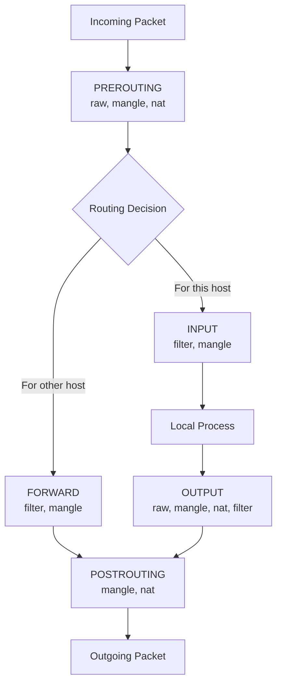
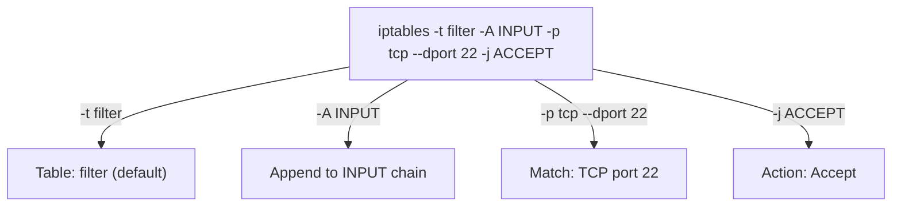
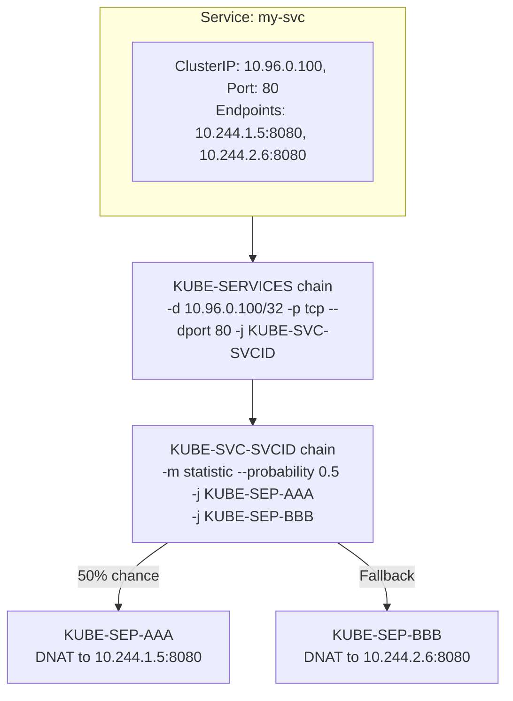
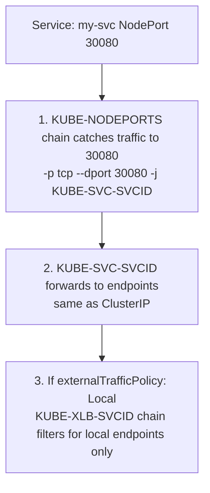
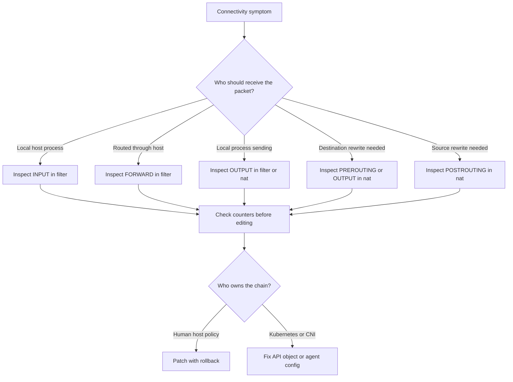

# Module 3.4: iptables & netfilter

Complexity: `[COMPLEX]` | Time: 65-75 min | Track: Linux Foundations networking. This module assumes you already know TCP/IP packet structure, DNS resolution, and Linux network namespaces well enough to recognize when a packet is local, forwarded, or leaving through a host interface.

## Prerequisites

Before starting this module, complete [Module 3.1: TCP/IP Essentials](../module-3.1-tcp-ip-essentials/) and [Module 3.3: Network Namespaces](../module-3.3-network-namespaces/). Basic firewall vocabulary is helpful, but the lesson builds the packet path from first principles so you can reason about Kubernetes nodes instead of memorizing command fragments.

## Learning Outcomes

- **Diagnose** netfilter packet paths by mapping a symptom to the correct table, chain, hook point, counter, and rule order.
- **Implement** iptables filtering, NAT, masquerade, and port-forwarding rules without breaking established traffic or remote access.
- **Trace** how Kubernetes Services, NodePorts, and network policy implementations translate service intent into iptables chains on Kubernetes 1.35+ nodes.
- **Evaluate** when iptables, nftables, IPVS, or eBPF is the right data-plane choice for a cluster size, troubleshooting need, and operational risk.

## Why This Module Matters

During a holiday sale, a regional retailer watched checkout latency climb from a few hundred milliseconds to many seconds after a routine Kubernetes Service rollout. The pods were healthy, DNS resolved, and the load balancer reported open connections, but customers still abandoned carts while engineers bounced between application logs, cloud firewalls, and kube-proxy restarts. The root cause was not in the application at all: the node had accumulated thousands of service and endpoint rules, a stale drop rule sat before the expected accept path, and the only clue was an iptables counter that stopped increasing where it should have climbed. The financial impact was measured in lost orders, refund credits, and emergency consulting time, all because the team treated node packet filtering as invisible plumbing.

That kind of incident is why iptables and netfilter still matter even in clusters that advertise higher-level networking. Kubernetes Services, NodePorts, many network policy engines, container egress NAT, and debugging workflows still rely on the Linux kernel's packet filtering hooks. When traffic disappears, the important question is rarely "what command lists rules?" The useful question is "where was this packet in the kernel when it changed direction, changed address, or stopped moving?"

This module teaches iptables as an operational model rather than a rule cookbook. You will connect the five netfilter hooks to the Linux routing decision, see why source NAT belongs after routing while destination NAT usually belongs before it, and practice reading counters like a timeline of packet decisions. You will also connect that Linux view to Kubernetes 1.35+ behavior, where kube-proxy may still create iptables chains even while the ecosystem increasingly recommends nftables or eBPF for large clusters.

## Netfilter Architecture: The Packet Has a Route Before It Has a Rule

netfilter is the packet inspection framework inside the Linux kernel, and iptables is one user-space tool that asks that framework to install rules. That distinction matters because a command-line rule is not an event loop and it is not a daemon watching packets. Once the rules are loaded, packets move through kernel hook points, and each hook offers selected tables a chance to inspect or alter the packet at that moment in its journey. If you remember only the command syntax, every outage feels like a flat list; if you remember the hook path, you can ask where the packet could still be changed.

The practical mental model starts with the routing decision. An incoming packet first reaches PREROUTING, where Linux has not yet decided whether the packet is for a local socket or should be forwarded elsewhere. After that decision, a packet destined for the local host moves through INPUT, while a packet being routed through the host moves through FORWARD. Packets created by local processes begin at OUTPUT, and packets leaving an interface pass through POSTROUTING. Pause and predict: if a packet is addressed to a local web server and you want to drop it before the application sees it, which filter chain gives you the most direct control?



This flow explains a common debugging trap. Engineers often inspect INPUT when a container cannot reach the internet, because "input" sounds like traffic entering the machine. But a packet leaving a container through a bridge is usually being forwarded through the host, so the filter decision lives in FORWARD and the source translation lives in POSTROUTING. The name of the Linux interface, such as `cni0`, `docker0`, or `eth0`, tells only part of the story; the route type tells you which chain will see the packet.

| Chain | Purpose | When |
|-------|---------|------|
| PREROUTING | Before routing decision | Incoming packets |
| INPUT | For local delivery | Destined for this host |
| FORWARD | For routing | Passing through this host |
| OUTPUT | From local processes | Generated by this host |
| POSTROUTING | After routing | Leaving this host |

The tables are another layer over the same hooks. The filter table decides whether packets are accepted, rejected, or dropped. The nat table changes source or destination addresses, but only for the first packet of a tracked connection because connection tracking remembers the translation afterward. The mangle table adjusts packet metadata such as marks, and the raw table can opt selected traffic out of connection tracking before the conntrack machinery spends work on it. These tables are separated because the kernel needs different decisions at different costs and times, not because administrators enjoy extra nouns.

| Table | Purpose | Chains |
|-------|---------|--------|
| filter | Accept/drop packets | INPUT, FORWARD, OUTPUT |
| nat | Address translation | PREROUTING, OUTPUT, POSTROUTING |
| mangle | Packet modification | All chains |
| raw | Connection tracking exceptions | PREROUTING, OUTPUT |

Think of the hook path like a hospital triage desk followed by specialist rooms. PREROUTING asks where the patient should go, INPUT or FORWARD handles the chosen path, and POSTROUTING handles discharge paperwork before the packet leaves. NAT is not a generic filter bolted to every desk; destination changes need to happen early enough to influence routing, while source changes usually wait until the outgoing interface is known. This ordering is why a masquerade rule in PREROUTING feels intuitive to a beginner but fails the real routing problem it was meant to solve.

Connection tracking is the quiet partner behind many rules in this module. When you allow `ESTABLISHED,RELATED`, you are not matching a port number; you are trusting the kernel's record that this packet belongs to a flow already allowed by an earlier decision. That is what lets a host accept response packets for outbound connections without opening every high-numbered ephemeral port to the internet. It is also why NAT can reverse a translation for return traffic without you writing a mirror rule by hand.

Another useful way to reason about conntrack is to separate policy from memory. The first packet of a connection asks the policy question: should this flow be allowed, translated, marked, or rejected? Later packets can often use the remembered answer, which makes stateful firewalling practical and keeps NAT from requiring symmetrical hand-written rules. When conntrack is full, disabled, or bypassed through the raw table, symptoms become strange because packets that used to inherit a known flow may suddenly look new again. That is why serious troubleshooting includes conntrack capacity, state, and timeouts when counters do not match the story you expected.

> **Stop and think**: If a packet needs to be dropped to block an attacker, in which chain of the `filter` table should you place the rule to drop it as early as possible before it reaches a local process?

In a production incident, this distinction prevents wasted effort. A platform engineer investigating a broken health check should first decide whether the health checker targets a host process, a NodePort, a pod IP, or a Service IP. Each target implies a different route through netfilter and therefore a different first useful chain. Jumping directly to a global `iptables-save | grep DROP` can still help, but it is much slower than asking the packet-path question first and then using counters to confirm the answer.

IPv6 adds one more operational wrinkle because many hosts carry dual-stack traffic even when the incident report mentions only an IPv4 address. Traditional iptables and ip6tables have separate rule sets, while nftables can represent both families more coherently. A Service or firewall policy that works for one family and fails for the other is often not a mysterious application issue; it is a missing parallel data-plane rule. When validating a fix, always identify the address family in the failing connection and avoid assuming that success on `10.0.0.0/24` proves anything about a pod, node, or client using IPv6.

## iptables Rule Evaluation: First Match Wins, but Chains Compose

An iptables rule combines a table, a chain, match conditions, and a target. If you omit the table, iptables uses the filter table, which is why many introductory firewall examples never show `-t filter`. The chain decides the hook context, the match narrows which packets the rule handles, and the target decides what happens next. Some targets terminate evaluation, such as ACCEPT and DROP, while others log and continue, return to a calling chain, or jump to another chain that kube-proxy or a network plugin owns.

```bash
iptables -t <table> -A <chain> <match> -j <target>
```

The syntax looks compact, but it encodes an ordered decision tree. `-A INPUT` appends a rule to the end of INPUT, which means every earlier rule gets first chance at the packet. `-I INPUT 1` inserts at the top, which can save a remote SSH session before a default drop rule. The target is not always the final answer; a jump to a custom chain is a subroutine call, and RETURN sends the packet back to the next rule after the jump that called it.



Rule order is the reason firewall changes deserve the same care as code changes. A broad drop rule above a narrow accept rule will hide the accept rule forever, even if the accept rule is perfectly written. A logging rule with no terminating target can create useful evidence while still letting the next decision happen. Before running a command that appends a rule, ask yourself whether the new rule must beat an existing decision or merely handle traffic nobody else has matched yet.

| Target | Action |
|--------|--------|
| ACCEPT | Allow packet |
| DROP | Silently discard |
| REJECT | Discard with error |
| LOG | Log and continue |
| SNAT | Source NAT |
| DNAT | Destination NAT |
| MASQUERADE | Dynamic SNAT |
| RETURN | Return from chain |

DROP and REJECT are a useful example of operational tradeoff. DROP gives the sender silence, which slows scanners and avoids confirming that a host exists, but it also makes legitimate internal troubleshooting slower because clients wait for timeouts. REJECT sends an error, which is friendlier inside controlled networks but more informative to an external probe. A mature policy often uses both: quiet refusal at the internet edge and explicit refusal where engineers need fast feedback.

Viewing rules should be a low-risk operation, so learn the read-only commands before you learn mutation commands. `-L -n -v` lists rules without DNS lookups and includes packet and byte counters. `iptables-save` prints the rules in a form that can be restored, copied into an incident note, or compared before and after a deployment. Counters are especially valuable because they tell you not only what the policy says, but whether live traffic is touching that policy.

```bash
# List all filter rules
sudo iptables -L -n -v

# List specific chain
sudo iptables -L INPUT -n -v

# List nat table
sudo iptables -t nat -L -n -v

# Show line numbers (useful for deletion)
sudo iptables -L INPUT -n --line-numbers

# Show rules as commands
sudo iptables-save
```

One war story illustrates why the saved format matters. A team allowed an emergency SSH source by appending a rule, verified that the rule existed, and still remained locked out from a maintenance subnet. The problem was a previous reject rule with a broader subnet match above the new rule. `iptables -L` showed both rules, but `iptables-save` made the order and table context obvious enough to spot the mistake during a bridge call.

When deleting rules, prefer deletion by exact specification when you can reproduce the rule safely, and deletion by line number only after listing the chain immediately beforehand. Line numbers are not stable if another automation loop edits the chain between your list and delete commands. Kubernetes and CNI agents may reconcile their own chains continuously, so manual edits inside their managed chains are usually overwritten. Manual rules belong in your own chain or in a host firewall system that is designed to coexist with cluster automation.

It is also worth learning the difference between the legacy and nft-backed iptables frontends on modern distributions. Many systems now ship `iptables-nft`, which accepts much of the familiar iptables syntax but programs nftables rules behind the scenes, while `iptables-legacy` talks to the older kernel interfaces. Mixing the two frontends on the same host can make rules appear to vanish because each command family is looking at a different backend. During a handoff, record the output of `iptables --version` and the distribution firewall service in the incident notes so the next engineer knows which rule universe they are inspecting.

## Practical iptables: Filtering, NAT, and Rule Management

A host firewall usually starts by allowing known safe traffic, preserving established flows, and then dropping the rest. The established-flow rule should come early because response packets from outbound connections need to return even though they target ephemeral ports you did not explicitly open. Loopback should remain open because many local services bind to `127.0.0.1` for control-plane calls. Public services such as SSH, HTTP, and HTTPS can then be allowed intentionally before a final drop rule closes the policy.

```bash
# Accept established connections
sudo iptables -A INPUT -m state --state ESTABLISHED,RELATED -j ACCEPT

# Accept loopback
sudo iptables -A INPUT -i lo -j ACCEPT

# Accept SSH
sudo iptables -A INPUT -p tcp --dport 22 -j ACCEPT

# Accept HTTP/HTTPS
sudo iptables -A INPUT -p tcp --dport 80 -j ACCEPT
sudo iptables -A INPUT -p tcp --dport 443 -j ACCEPT

# Drop everything else
sudo iptables -A INPUT -j DROP
```

Before running rules like these over SSH, pause and predict: what happens if the final drop rule lands before the SSH accept rule, or if the established-flow rule is missing while your shell is already connected? The most likely failure is self-lockout, because the packet carrying your next keystroke may no longer match an allowed path. On a real server, use a console, a temporary rollback tool such as `iptables-apply` where available, or a timed rescue job that restores a saved policy unless you cancel it after verification.

NAT solves a different problem from filtering. A container bridge usually uses private addresses that upstream routers cannot return to directly, so the host must rewrite the source address before the packet leaves the node. MASQUERADE is dynamic source NAT, useful when the outgoing interface address can change. SNAT is more explicit and cheaper when you know the exact egress address. DNAT and REDIRECT change the destination instead, which is why they normally happen before routing or for local output traffic.

```bash
# MASQUERADE: Source NAT for containers (dynamic)
sudo iptables -t nat -A POSTROUTING -s 10.0.0.0/24 -o eth0 -j MASQUERADE

# SNAT: Source NAT with specific IP
sudo iptables -t nat -A POSTROUTING -s 10.0.0.0/24 -o eth0 -j SNAT --to-source 192.168.1.100

# DNAT: Destination NAT (port forwarding)
sudo iptables -t nat -A PREROUTING -p tcp --dport 8080 -j DNAT --to-destination 10.0.0.5:80

# Redirect to local port
sudo iptables -t nat -A PREROUTING -p tcp --dport 80 -j REDIRECT --to-port 8080
```

The masquerade example is the same pattern used by many container hosts. A packet from `10.0.0.5` leaves through `eth0`, and the outside server sees the node address instead of the private container address. conntrack remembers that translation so the reply can be rewritten back to `10.0.0.5` on the way in. If IP forwarding is disabled, however, the NAT rule can be correct and the packet still will not route, which is why NAT and forwarding checks belong together during troubleshooting.

Rule management commands are deceptively powerful because they mutate live kernel state immediately. Insert, append, delete, flush, save, and restore each have a safe use case and a dangerous version. Inserting an SSH rescue rule at position one can save a session, while flushing INPUT on a remote host can remove the only rule that allowed you in. Saving to a persistent path is distribution-specific; a command that works on Debian or Ubuntu may not survive a reboot on another system unless its firewall service imports that file.

```bash
# Insert at position (vs append)
sudo iptables -I INPUT 1 -p tcp --dport 22 -j ACCEPT

# Delete by specification
sudo iptables -D INPUT -p tcp --dport 22 -j ACCEPT

# Delete by line number
sudo iptables -D INPUT 3

# Flush all rules in chain
sudo iptables -F INPUT

# Flush all rules
sudo iptables -F

# Save rules (Debian/Ubuntu)
sudo iptables-save > /etc/iptables/rules.v4

# Restore rules
sudo iptables-restore < /etc/iptables/rules.v4
```

A good worked example is a small jump chain for ICMP logging. Instead of mixing temporary diagnostic rules into INPUT directly, create a custom chain, add the diagnostic behavior there, and link INPUT to it. When the test ends, unlink the chain, flush it, and delete it. This pattern reduces cleanup risk because you can remove the jump from the main chain without hunting individual temporary rules among production policy.

The difference between `-A` and `-I` becomes more important as more tools manage the same host. Docker, kube-proxy, CNI plugins, cloud-init, and host firewall services may all install rules, and not all of them expect humans to edit the same chains. If you must add host-specific policy, place it in a documented chain and hook that chain from a stable point owned by your host configuration, not from a Kubernetes-managed chain that an agent can recreate at any moment.

Persistence deserves the same skepticism as live mutation. A rule added with the iptables command affects the running kernel immediately, but it may vanish at reboot unless a distribution service restores it. The reverse can also happen: you delete a bad rule by hand, the live incident clears, and then the bad persisted policy returns after the next maintenance restart. Treat runtime state and persisted state as two separate layers, and verify both when the fix must survive more than the current shell session.

A safe change plan therefore has four parts. First, capture the existing rules with counters if the incident is active. Second, decide the exact packet path and rule ownership before editing. Third, apply the smallest rule change with a rollback path. Fourth, generate one controlled packet and compare counters rather than relying on hope. This discipline can feel slow in a lab, but it is faster than recovering a locked-out host or explaining why a hand edit disappeared when kube-proxy reconciled its chains.

## Kubernetes and iptables: Services Are Rules Until the Data Plane Changes

Kubernetes gives you a Service object, but the node still needs a data-plane implementation that turns a virtual IP and port into a real endpoint. In iptables mode, kube-proxy watches Services and EndpointSlices, then writes netfilter rules that match the Service IP and select one backend endpoint. This is why a broken Service can look like a Linux firewall problem: at the node level, it often is one, even though the policy was generated from Kubernetes API objects rather than typed by an administrator.

For Kubernetes commands in this module, define the common alias once and use `k` afterward. The alias is only a shell convenience, but it keeps examples close to real operator workflows while still making it clear that the underlying tool is kubectl.

```bash
alias k=kubectl
k version --client
```

kube-proxy's generated chain names are intentionally mechanical. A Service match jumps from a broad service-dispatch chain into a per-Service chain, then into per-endpoint chains that perform destination NAT. With two endpoints, the first endpoint might receive a probabilistic rule and the second becomes the fallback. With more endpoints, kube-proxy adjusts probabilities so the final distribution is roughly even despite sequential rule evaluation.



Pause and predict: if a Service has three ready endpoints and you inspect the generated rules, why would the first rule not simply match all traffic? The answer is that kube-proxy must combine sequential evaluation with probabilistic matching. A packet that misses the first random match falls through to the next candidate, and the probabilities are chosen so each endpoint receives a fair share over many new connections.

```bash
# All service-related rules
sudo iptables -t nat -L KUBE-SERVICES -n

# Find rules for a specific service
sudo iptables-save | grep "my-service"

# Count rules
sudo iptables-save | wc -l
sudo iptables -t nat -L | wc -l
```

NodePort adds another entry point, because traffic may arrive at a node address and high port rather than at a ClusterIP. kube-proxy catches that port in a nodeport chain and sends it through the same kind of per-Service selection. If `externalTrafficPolicy: Local` is set, the rules also need to avoid sending traffic to endpoints on other nodes, because preserving the original client address is more important than global load distribution for that Service.



Network policy adds another layer, and the exact chain names depend on the plugin. Some plugins program iptables chains, some use nftables, and some use eBPF. Calico commonly creates `cali-` chains when using its iptables dataplane, while older Kubernetes policy examples may show `KUBE-NWPLCY` style chains. The lesson is not to memorize one plugin's names, but to recognize that a denied pod-to-pod connection may be blocked in FORWARD by policy-generated rules rather than in an application, a cloud security group, or a Service rule.

```bash
# Network policy rules (typically in KUBE-NWPLCY chains)
sudo iptables -L KUBE-NWPLCY-* -n 2>/dev/null

# Calico uses its own chains
sudo iptables -L cali-* -n 2>/dev/null | head -50
```

To inspect kube-proxy behavior with the alias, use the Kubernetes API for intent and iptables for implementation. The API tells you which Service and endpoints should exist; the node rules tell you whether kube-proxy actually programmed a path. If the API object is right but no matching rule exists, look at kube-proxy health, permissions, node selectors, and EndpointSlice readiness. If the rule exists but the counter stays at zero, the packet may be taking a different node, interface, IP family, or policy path.

```bash
k get configmap kube-proxy -n kube-system -o yaml | grep mode
k logs -n kube-system -l k8s-app=kube-proxy | head -50
k get svc my-service -o wide
k get endpointslice -l kubernetes.io/service-name=my-service
```

Kubernetes 1.35+ makes the data-plane choice more explicit for operators. iptables remains important because many clusters still run it and many troubleshooting skills transfer directly to nftables, but large clusters should evaluate newer options. nftables improves rule-set updates and lookup behavior while staying close to the netfilter model. eBPF approaches can bypass large parts of the traditional rule chain and add richer observability, but they require comfort with a more specialized dataplane and its own failure modes.

A subtle Kubernetes problem appears when the Service object is correct but the packet enters the wrong node. NodePort traffic may arrive on any node, ClusterIP traffic from a pod starts on the pod's node, and external load balancers may preserve or hide the original client address depending on configuration. If you inspect iptables on a node that never saw the packet, every counter will accuse the wrong suspect. During a real trace, identify the client, the node that received the packet, the destination address, and the selected endpoint before declaring that kube-proxy did or did not create the right rules.

Endpoint readiness also changes the generated dataplane. kube-proxy should route only to ready endpoints for normal Services, so a pod can exist and still not appear in the service chain if readiness gates fail or EndpointSlices have not updated. This is a constructive alignment point between Kubernetes control plane and Linux dataplane: the API explains what should be programmed, while iptables shows what was programmed. Debugging becomes much easier when you compare those two views instead of treating them as competing explanations.

## Debugging iptables: Counters Tell You Where the Story Stopped

iptables debugging should start with a hypothesis about the packet path and then use counters to prove or disprove it. A counter that increases on an accept rule but not on a later DNAT rule tells a different story from a counter that never moves in the first matching chain. Resetting counters can be useful in a lab, but on a busy production node it erases historical evidence for other investigators, so prefer taking a snapshot and watching a narrow chain unless you own the incident window.

```bash
# Enable tracing
sudo iptables -t raw -A PREROUTING -p tcp --dport 80 -j TRACE
sudo iptables -t raw -A OUTPUT -p tcp --dport 80 -j TRACE

# View traces
sudo dmesg | grep TRACE

# Or
sudo tail -f /var/log/kern.log | grep TRACE

# Don't forget to remove trace rules when done!
```

TRACE is powerful because it shows rule traversal, but it is also noisy enough to damage your ability to see anything else. On a high-traffic node, tracing a common port can flood kernel logs, increase CPU load, and rotate away useful messages from the incident. Use narrow matches, reproduce once or twice, save the evidence, and remove the trace rules immediately. Stop and think: why is a trace rule in the raw table especially risky if you forget it during peak traffic?

```bash
# Check if traffic is hitting rules
sudo iptables -L INPUT -n -v
# Look at packet/byte counters

# Check NAT
sudo iptables -t nat -L -n -v

# Check for DROP rules
sudo iptables-save | grep DROP

# Watch counters in real-time
watch -n1 'sudo iptables -L INPUT -n -v'
```

The fastest practical workflow is compare, generate traffic, compare again. First capture `iptables-save -c` so packet and byte counters are included. Then run one controlled request from the source that fails, such as a curl from a pod, a connection to a NodePort, or a request to a ClusterIP from the node. Capture the counters again and inspect only the chains that should have seen that packet. This keeps you from treating a large ruleset as a mystery novel you must read from the first page.

```bash
# Reset counters
sudo iptables -Z

# View counters (pkts and bytes columns)
sudo iptables -L -n -v

# Find rules with traffic
sudo iptables-save -c | grep -v "0:0"
```

Counter interpretation has a few traps. NAT counters often count only the first packet of a connection, because the rest of the flow follows conntrack state rather than re-evaluating every NAT decision. A zero counter on a DNAT rule does not always mean no bytes reached the backend; it may mean you are testing an already-established connection. Conversely, a growing DROP counter does not prove that drop is bad; it may be blocking exactly the background scanning traffic your policy was designed to discard.

For Kubernetes Services, combine node-level and cluster-level evidence. If `k get endpointslice` shows no ready endpoints, iptables is not the first problem. If endpoints are ready and kube-proxy logs show successful syncs, inspect the nat table for the Service IP and then inspect filter or policy chains if the packet is forwarded. If NodePort traffic works from the node but not from outside, bring cloud firewall, host routing, reverse path filtering, and `externalTrafficPolicy` into the hypothesis instead of editing random rules.

Reverse path filtering is a good example of a Linux setting that can masquerade as an iptables problem. If a packet arrives on one interface but the kernel believes the best return path uses another interface, strict reverse path checks can drop it before your expected application path becomes visible. This is common in multi-homed nodes, overlay networks, and asymmetric cloud routing designs. When counters do not move in the chains you expect, include routing policy, source validation, and interface selection in the diagnosis rather than endlessly rewriting firewall matches.

Another practical clue is the difference between "no route," "connection refused," and "timeout" at the client. A refusal often means something actively rejected the traffic or no listener accepted it after the packet reached a host. A timeout suggests silence, which may be DROP, an upstream firewall, an asymmetric return path, or a lost route. A no-route error points earlier, often before the packet enters the netfilter path you are inspecting. These client symptoms are imperfect, but they help you choose the first chain and tool instead of starting every incident with the same command.

## iptables vs IPVS vs nftables vs eBPF

iptables is simple to inspect and widely understood, but its classic service implementation scales poorly because many decisions are encoded as sequential rules. IPVS uses kernel load-balancing tables that can provide efficient lookup and multiple scheduling algorithms, but Kubernetes has moved away from recommending it as the long-term direction. nftables keeps the netfilter family model while improving rule representation and update behavior. eBPF solutions such as Cilium can implement service routing and policy with programmable hooks that avoid much of the old linear rule traversal.

| Feature | iptables | IPVS | eBPF (Cilium) |
|---------|----------|------|---------------|
| Rule complexity | O(n) | O(1) hash | O(1) |
| Large clusters | Slow | Fast | Fastest |
| Setup complexity | Simple | Medium | Complex |
| Load balancing | Random | Multiple algos | Multiple algos |
| Connection tracking | conntrack | Built-in | Efficient |

The table is useful, but it should not be treated as a universal ranking. iptables may be perfectly adequate for a small training cluster, a simple lab, or a node where human readability matters more than scaling to thousands of Services. eBPF may be the best fit for a large platform that needs policy, observability, and service routing in one dataplane, but it adds a new operational surface. nftables is attractive when you want to remain close to netfilter semantics while using a more modern ruleset model.

```text
Small cluster (< 100 services): iptables is fine
Medium cluster (100-1000 services): Consider IPVS
Large cluster (1000+ services): nftables or eBPF (Cilium)
Advanced features needed: eBPF (Cilium)
```

The Kubernetes version matters because recommendations change. For Kubernetes 1.35+, operators should be aware that nftables is the preferred direction for kube-proxy scalability and that IPVS mode is deprecated in favor of newer backends. This does not mean every iptables cluster must be rebuilt tomorrow. It means new designs should justify staying on iptables, and existing designs should have a migration plan if service count, node churn, or sync latency becomes painful.

```bash
# Check kube-proxy mode
kubectl get configmap kube-proxy -n kube-system -o yaml | grep mode

# Or check logs
kubectl logs -n kube-system -l k8s-app=kube-proxy | head -50
```

A good decision conversation includes failure modes, not only performance charts. iptables failures are often visible with standard Linux tools, but large rule sets can be slow to update and hard to scan. IPVS can handle lookup efficiently, but it introduces another kernel subsystem and a less direct mapping from Service YAML to rules. eBPF can be extremely powerful, but the team must know how to inspect maps, programs, agent health, and fallback behavior. The right answer is the one your team can operate during an outage at 3 a.m.

Migration planning should include rollback, observability, and training. Moving from iptables to nftables or eBPF is not just a performance toggle; it changes the commands engineers run under pressure and the evidence they collect for post-incident review. A team that relies on iptables counters must learn the equivalent dataplane views before the migration becomes production critical. Pilot the new backend on a node pool with representative Service count, synthetic connection churn, and documented failure drills so the first real incident does not become the first real lesson.

## Patterns & Anti-Patterns

The strongest iptables operators use repeatable patterns that reduce surprise. They decide packet path before editing rules, isolate temporary work in custom chains, protect remote access before adding default drops, and treat Kubernetes-managed chains as generated state. These patterns are boring in the best way: they make the dangerous parts of live firewall work predictable enough to review.

| Pattern | When to Use It | Why It Works | Scaling Considerations |
|---------|----------------|--------------|------------------------|
| Path-first diagnosis | Any connectivity incident | It maps symptoms to INPUT, FORWARD, OUTPUT, PREROUTING, or POSTROUTING before command output distracts you | Works across iptables, nftables, and many eBPF troubleshooting flows |
| Custom diagnostic chains | Temporary logging, tracing, or lab experiments | It keeps experimental rules removable through one jump and one chain cleanup | Document ownership so automation does not remove or duplicate the jump |
| Early established-flow allow | Host firewalls with default deny posture | It preserves return traffic without opening every ephemeral port | Must be paired with sane conntrack capacity and monitoring |
| API intent plus node evidence | Kubernetes Service or policy debugging | It compares desired state with generated data-plane rules | Requires checking the right node, IP family, and endpoint readiness |

Anti-patterns usually come from treating iptables as a flat command list. A team appends a correct rule below an incorrect drop, flushes a chain over SSH, edits a kube-proxy chain by hand, or assumes NAT will work without forwarding. The better alternative is rarely a cleverer command; it is a slower first minute spent identifying ownership, route direction, and rollback.

| Anti-Pattern | What Goes Wrong | Better Alternative |
|--------------|-----------------|--------------------|
| Editing generated Kubernetes chains by hand | kube-proxy or the CNI agent overwrites the edit and the incident returns | Fix the Kubernetes object, plugin policy, or owning agent configuration |
| Appending emergency accepts blindly | Earlier rules still win, so the new rule gives false confidence | Inspect line order and insert only when priority is required |
| Flushing remotely without rollback | The session can die before the policy is repaired | Save rules and use console access or a timed restore guard |
| Treating NAT as filtering | Address translation succeeds but packets still fail FORWARD or routing checks | Verify forwarding, route tables, conntrack, and filter counters together |

## Decision Framework

Use this framework when a packet disappears. Start by naming the source, destination, and whether the host should consume, forward, or originate the packet. Then choose the table that could legally change the thing you care about: filter for allow or deny, nat for address or port rewrite, mangle for marks, and raw for conntrack exceptions. Finally, decide whether the chain is human-owned or generated by Kubernetes, Docker, a CNI plugin, or another agent before you edit anything.



| Situation | First Place to Look | Why | Safer Next Step |
|-----------|---------------------|-----|-----------------|
| SSH to node fails | filter INPUT | The node itself should receive the packet | Check line order and console access before edits |
| Pod cannot reach internet | filter FORWARD and nat POSTROUTING | The host forwards and source-translates pod traffic | Verify `net.ipv4.ip_forward`, route, and masquerade counters |
| ClusterIP does not route | nat service chains and EndpointSlices | kube-proxy turns Service intent into DNAT rules | Compare `k get svc`, `k get endpointslice`, and nat counters |
| NodePort works locally only | nat nodeport chains, host firewall, cloud firewall | External traffic crosses more than Kubernetes rules | Confirm listener path, cloud policy, and `externalTrafficPolicy` |
| NetworkPolicy blocks traffic | plugin-owned filter or eBPF policy state | The CNI implements policy outside application code | Inspect plugin-specific chains, maps, or policy status |

This framework also helps you decide when iptables is not the right abstraction. If the incident is about a single node firewall, iptables counters may answer the question quickly. If the incident is about service scale, kube-proxy sync time, or thousands of virtual IP rules, the answer may be a data-plane migration rather than a better grep. If the incident is about policy intent that differs from node state, the right fix is reconciliation, not a manual edit that disappears on the next agent sync.

For change review, translate every proposed rule into a sentence that includes actor, path, condition, and outcome. For example, "allow established return traffic to local host processes" is much clearer than "add state rule," and "masquerade bridge subnet traffic leaving eth0" is clearer than "fix pod internet." This translation catches many mistakes before execution because missing words reveal missing assumptions. If you cannot say whether the packet is local or forwarded, or whether the rule changes source or destination, you are not ready to mutate the live firewall.

## Did You Know?

- **A busy Kubernetes node can have 10,000+ iptables rules** - Each service creates multiple rules, and Kubernetes 1.35+ operators should evaluate nftables or eBPF when service scale makes linear rule traversal expensive.
- **iptables is just the CLI** - The packet filtering work happens in the kernel's netfilter subsystem, while iptables loads rules into that subsystem from user space.
- **nftables is replacing iptables in many distributions** - RHEL 9 and Debian 11 ship nftables tooling by default, and the `nft` command uses a cleaner ruleset model.
- **Every Kubernetes service creates multiple generated decisions** - A Service needs dispatch rules, per-Service chains, and endpoint rules, so 100 Services with three endpoints each can produce 1,500+ service-related rule entries.

## Common Mistakes

| Mistake | Why It Happens | How to Fix It |
|---------|----------------|---------------|
| Putting a narrow allow below a broad drop | The rule is syntactically correct, but first match wins before the packet reaches it | List with line numbers, insert at the correct priority, and retest counters |
| Forgetting established traffic | Engineers open service ports but forget return packets for outbound flows | Add an early `ESTABLISHED,RELATED` rule and verify conntrack is healthy |
| Flushing rules over SSH | Local lab habits move into remote production work | Use console access, saved rules, and a timed rollback before destructive edits |
| Debugging pod egress in INPUT | The packet is forwarded through the node, not delivered to a host process | Inspect FORWARD, POSTROUTING, route tables, and IP forwarding together |
| Adding NAT without enabling forwarding | Address translation exists, but the kernel still refuses to route packets | Set and persist `net.ipv4.ip_forward=1`, then check filter counters |
| Editing kube-proxy chains manually | Generated chains look like normal rules during an incident | Fix the Service, EndpointSlice, kube-proxy mode, or CNI configuration instead |
| Leaving TRACE rules installed | Temporary diagnostics become high-volume kernel logging | Use narrow matches, capture one reproduction, and delete the trace rules immediately |

## Quiz

<details><summary>Question 1: Your team deploys a default-deny host firewall and immediately loses package downloads from the node, although inbound SSH still works. Which rule do you check first, and why?</summary>

Check for an early `ESTABLISHED,RELATED` accept rule in the filter INPUT chain. Outbound package downloads create return traffic that targets ephemeral local ports, and a default-deny inbound policy can drop those response packets even though the original outbound connection was allowed. The fix is not to open a wide ephemeral port range; it is to let conntrack identify packets that belong to flows the host already initiated. After adding or moving that rule, generate one download attempt and confirm the packet counter increases.

</details>

<details><summary>Question 2: A pod on a bridge network can reach another pod on the same host but cannot reach the internet. You already added a MASQUERADE rule in POSTROUTING. What else must you diagnose?</summary>

Diagnose whether the host is actually forwarding packets and whether the filter FORWARD chain accepts the traffic. MASQUERADE only rewrites the source address after routing has chosen an egress interface; it does not grant permission to route through the host. Check `net.ipv4.ip_forward`, the route table, and FORWARD counters before changing NAT again. If the POSTROUTING counter rises but FORWARD drops also rise, the NAT rule is probably working while filtering is blocking the path.

</details>

<details><summary>Question 3: A Kubernetes ClusterIP Service has ready endpoints, but curl from a node to the Service IP times out. How do you trace the Service without guessing?</summary>

Start with Kubernetes intent, then inspect node implementation. Use `k get svc` and `k get endpointslice` to confirm the Service IP, port, and ready backends, then search the nat table for the Service IP and watch counters on the service-dispatch and per-endpoint chains. If the counters stay at zero, the traffic is not hitting that node path or IP family. If service counters rise but endpoint counters do not, the generated chain order, endpoint readiness, or kube-proxy sync state deserves closer inspection.

</details>

<details><summary>Question 4: Security wants DROP for every blocked connection, but developers want faster failures from internal tooling. How do you evaluate DROP versus REJECT?</summary>

Use DROP where silence is valuable and REJECT where fast feedback is more valuable than hiding the host. External scans often deserve DROP because timeouts slow reconnaissance and reveal less policy detail. Internal developer networks often benefit from REJECT because tools fail immediately and logs show a clear refusal instead of a vague timeout. The important design point is to choose by threat model and troubleshooting need, not by treating one target as universally more secure.

</details>

<details><summary>Question 5: A Service works with two endpoints, but after scaling to three endpoints you see sequential endpoint rules. Why does iptables not send every connection to the first endpoint?</summary>

kube-proxy combines sequential rule evaluation with probabilistic matches. The first endpoint rule matches only a calculated share of new connections, and packets that miss it fall through to later endpoint rules with adjusted probabilities. Over many connections, those probabilities produce an approximately even distribution across ready endpoints. This is why the service chain can be sequential while still behaving like a load balancer instead of a hard-coded first-backend route.

</details>

<details><summary>Question 6: A node with thousands of Services shows high kernel CPU during connection churn. How do you evaluate whether iptables is still the right kube-proxy backend?</summary>

Compare the symptom with the data-plane cost model and the team's operational maturity. Classic iptables service routing uses large generated rule sets, so connection churn can spend more CPU walking rules and syncing updates as service count grows. nftables or eBPF may reduce lookup and update costs, but each option has its own tooling and failure modes. A good recommendation includes measured service count, kube-proxy sync latency, incident evidence, and a migration plan rather than a blanket statement that iptables is obsolete.

</details>

<details><summary>Question 7: During an incident, someone proposes adding TRACE for all TCP port 80 traffic on a busy node. What is the safer diagnostic approach?</summary>

Narrow the match before enabling TRACE, capture one controlled reproduction, and remove the rule immediately. TRACE in the raw table can produce very high log volume because it records traversal through rule evaluation, and a common port on a busy node can flood kernel logs. A safer workflow is to filter by source, destination, interface, or short maintenance window, then save the evidence and delete the diagnostic rule. Counters and targeted `iptables-save -c` snapshots should be tried first when they can answer the question.

</details>

## Hands-On Exercise

This lab turns the mental model into muscle memory. You will inspect existing rules, create a custom diagnostic chain, test NAT syntax, examine Kubernetes-generated rules when a cluster is available, and finish by interpreting counters. Run these commands only on a disposable lab host or training environment, because firewall changes affect live packet handling immediately and can interrupt remote access.

The lab is intentionally progressive. The first part teaches observation, the second part creates a reversible custom chain, the third part changes NAT only for local output, the fourth part connects Kubernetes intent to generated rules, and the fifth part asks you to interpret counters rather than merely collect them. Treat each part as a miniature incident: write down what you expect before running the command, generate one packet, and then decide whether the observed counter movement supports your prediction.

### Setup and Safety

Save the current rules before changing anything, and keep a second terminal or console available if possible. If you are using a Kubernetes lab, define the `k` alias before the Kubernetes section and verify that your context points to the intended cluster. The exercise uses read-only inspection first, then temporary rules that are cleaned up in the same section.

If any command behaves differently from the notes, do not force the environment to match the lesson by deleting unrelated rules. Your host may use nft-backed iptables, a host firewall manager, a different CNI plugin, or an eBPF dataplane that leaves fewer visible iptables rules. The correct learning move is to explain the difference, identify the owner of the visible policy, and keep your edits inside the temporary chain created for the exercise.

```bash
sudo iptables-save > /tmp/iptables-backup.txt
alias k=kubectl
k config current-context
```

### Part 1: Basic iptables

```bash
# 1. View current rules
sudo iptables -L -n -v

# 2. View NAT rules
sudo iptables -t nat -L -n -v

# 3. Save current rules
sudo iptables-save > /tmp/iptables-backup.txt
cat /tmp/iptables-backup.txt
```

<details><summary>Solution notes for Part 1</summary>

The expected result is not a specific rule count; it is a baseline you can compare against later. Identify which chains have nonzero counters, whether the host has custom chains, and whether Kubernetes or a container runtime appears to own generated chains. If you see many `KUBE-` or plugin-specific chains, avoid manual edits inside them.

</details>

### Part 2: Create Simple Rules

```bash
# 1. Create a test chain
sudo iptables -N TEST_CHAIN

# 2. Add rules to chain
sudo iptables -A TEST_CHAIN -p icmp -j LOG --log-prefix "PING: "
sudo iptables -A TEST_CHAIN -p icmp -j ACCEPT

# 3. Link from INPUT
sudo iptables -A INPUT -j TEST_CHAIN

# 4. Test (ping yourself)
ping -c 2 127.0.0.1

# 5. Check logs
sudo dmesg | grep "PING:" | tail -5

# 6. Check counters
sudo iptables -L TEST_CHAIN -n -v

# 7. Cleanup
sudo iptables -D INPUT -j TEST_CHAIN
sudo iptables -F TEST_CHAIN
sudo iptables -X TEST_CHAIN
```

<details><summary>Solution notes for Part 2</summary>

The custom chain should log and accept ICMP packets that reach it from INPUT. The cleanup order matters: first remove the jump from INPUT, then flush the custom chain, then delete the custom chain. If deletion fails, another chain still references it or the chain still contains rules.

</details>

### Part 3: NAT Example

```bash
# 1. Enable forwarding
sudo sysctl -w net.ipv4.ip_forward=1

# 2. View current NAT
sudo iptables -t nat -L -n -v

# 3. Add a port redirect (local)
sudo iptables -t nat -A OUTPUT -p tcp --dport 8888 -j REDIRECT --to-port 80

# 4. Test (if web server on 80)
# curl localhost:8888  # Would go to localhost:80

# 5. Remove rule
sudo iptables -t nat -D OUTPUT -p tcp --dport 8888 -j REDIRECT --to-port 80
```

<details><summary>Solution notes for Part 3</summary>

The redirect rule affects locally generated traffic in OUTPUT, which is different from PREROUTING rules that affect packets arriving from outside. If no web server listens on port 80, the curl test may fail even though the redirect rule matched correctly. Use counters to separate "rule did not match" from "rewritten destination has no listener."

</details>

### Part 4: Kubernetes iptables (if available)

```bash
# 1. Count Kubernetes rules
sudo iptables-save | grep -c KUBE

# 2. View service chains
sudo iptables -t nat -L KUBE-SERVICES -n | head -20

# 3. Trace a specific service
# Find your service's ClusterIP
kubectl get svc my-service -o wide

# Find iptables rules for it
sudo iptables-save | grep <ClusterIP>

# 4. View DNAT rules
sudo iptables -t nat -L -n | grep DNAT | head -10
```

<details><summary>Solution notes for Part 4</summary>

If a cluster is present and kube-proxy uses iptables mode, you should see generated service chains and DNAT rules. If the command returns no `KUBE` rules, your cluster may use nftables, IPVS, eBPF, a different chain prefix, or a node that does not run kube-proxy in the expected mode. Confirm the mode with the Kubernetes API before treating missing chains as an outage.

</details>

### Part 5: Rule Analysis

```bash
# 1. Find busiest rules (most packets)
sudo iptables -L -n -v | sort -k1 -n -r | head -10

# 2. Find all DROP rules
sudo iptables-save | grep DROP

# 3. Count rules by table
echo "filter: $(sudo iptables -L | wc -l)"
echo "nat: $(sudo iptables -t nat -L | wc -l)"
echo "mangle: $(sudo iptables -t mangle -L | wc -l)"
```

<details><summary>Solution notes for Part 5</summary>

The busiest rule is not automatically the broken rule; it is the rule most traffic reaches. Use it as a clue about normal paths, then compare with the specific failed flow. A DROP rule with a high counter may be normal internet noise, while a zero counter on an expected Service rule may be a stronger sign that your traffic is taking another path.

</details>

### Success Criteria

- [ ] Viewed and interpreted filter and nat table output without changing policy.
- [ ] Created, tested, and removed a custom diagnostic chain cleanly.
- [ ] Implemented and removed a NAT redirect while explaining why OUTPUT was the right chain.
- [ ] Traced Kubernetes Service rules or explained why the lab cluster uses a different dataplane.
- [ ] Diagnosed at least one rule by comparing counters before and after a controlled packet test.

## Next Module

[Next Module: Linux Security and Hardening](../../security-hardening/) moves from packet-level controls to process and kernel hardening with AppArmor, SELinux, seccomp, and practical host defense.

## Sources

- [Netfilter Documentation](https://netfilter.org/documentation/)
- [iptables Tutorial](https://www.frozentux.net/iptables-tutorial/iptables-tutorial.html)
- [Kubernetes Network Plugins](https://kubernetes.io/docs/concepts/extend-kubernetes/compute-storage-net/network-plugins/)
- [Life of a Packet in Kubernetes](https://dramasamy.medium.com/life-of-a-packet-in-kubernetes-part-1-f9bc0909e051)
- [iptables man page](https://man7.org/linux/man-pages/man8/iptables.8.html)
- [iptables-extensions man page](https://man7.org/linux/man-pages/man8/iptables-extensions.8.html)
- [Kubernetes Services](https://kubernetes.io/docs/concepts/services-networking/service/)
- [Kubernetes Virtual IPs and Service Proxies](https://kubernetes.io/docs/reference/networking/virtual-ips/)
- [Kubernetes Network Policies](https://kubernetes.io/docs/concepts/services-networking/network-policies/)
- [Kubernetes kube-proxy Configuration API](https://kubernetes.io/docs/reference/config-api/kube-proxy-config.v1alpha1/)
- [nftables Project Documentation](https://wiki.nftables.org/wiki-nftables/index.php/Main_Page)
- [Cilium Kubernetes Networking](https://docs.cilium.io/en/stable/network/kubernetes/)
