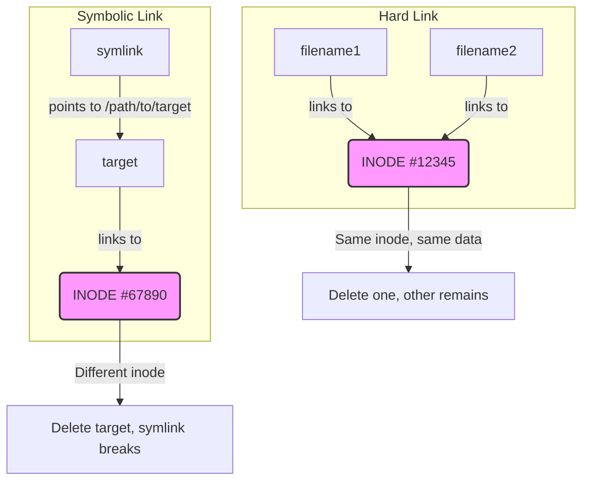

## Prerequisites

Before starting this module, ensure you have a foundational understanding of:
- **Required**: [Module 1.1: Kernel & Architecture](../module-1.1-kernel-architecture/)
- **Helpful**: [Module 1.2: Processes & systemd](../module-1.2-processes-systemd/)

## Learning Outcomes

Upon completing this module, you will be able to:
- **Diagnose** common filesystem-related issues by interpreting the roles of key directories (`/etc`, `/var`, `/proc`, `/sys`, `/dev`).
- **Evaluate** the impact of file placement decisions on system stability and security, particularly concerning persistent data and temporary files.
- **Implement** strategies for locating configuration files, logs, and runtime data effectively across different Linux distributions.
- **Compare and Contrast** the behavior and use cases of hard links versus symbolic links, and their implications in container environments.
- **Debug** mount-related problems and identify the underlying filesystem types and options in complex Linux systems.

## Why This Module Matters

Imagine a scenario: it's Black Friday, and an e-commerce giant's Kubernetes cluster suddenly goes dark. Customers can't place orders, revenue is plummeting, and the operations team is in a frenzy. The root cause? A critical log partition (`/var/log`) on several nodes filled up unexpectedly, causing kubelet to crash and bringing down core services. This single oversight, a lack of understanding of the Linux filesystem hierarchy, cost the company millions in lost sales and reputational damage.

This isn't a hypothetical. Filesystem issues are a leading cause of outages in production systems. On Linux, **everything is a file**—configurations, device drivers, running processes, even network connections. Understanding where these "files" live, how they behave, and how they interact is not just a best practice; it's a critical skill for preventing catastrophic failures and ensuring the resilience of your infrastructure, especially in dynamic environments like Kubernetes where filesystem layers and transient data are omnipresent. A deep dive into the Linux filesystem isn't just theory; it's your first line of defense against real-world incidents.

## Did You Know?

- **The Filesystem Hierarchy Standard (FHS) dates back to 1994** (version 1.0 was released in 1994, with FHS 3.0 from 2015 being the latest). It ensures that binaries, libraries, and configuration files are in predictable locations across all Linux distributions, improving software compatibility.
- **Everything really is a file in Linux** — even hardware devices. Your keyboard might be `/dev/input/event0`, your primary hard drive is typically `/dev/sda`, and your RAM can be accessed (with extreme caution!) via `/dev/mem` for direct memory manipulation by advanced tools.
- **/proc isn't on disk** — It's a virtual filesystem generated by the kernel in real-time. Reading `/proc/meminfo` doesn't access storage; the kernel synthesizes the content dynamically when you request it, providing an always up-to-date view of system state.
- **Container images average over 200MB** but often only contain 20-50MB of unique, application-specific files. The vast majority consists of standard Linux directories and shared libraries, leveraging the same FHS structure you're learning now for efficient layering and deduplication.

## The Filesystem Hierarchy Standard (FHS) Overview

The FHS defines the purpose of each directory at the top level of the filesystem. This standardization is crucial for system administrators, developers, and applications to reliably find files and understand where to place their data.

```
/                           ← Root of everything
├── bin/                    ← Essential command binaries
├── boot/                   ← Boot loader files, kernel
├── dev/                    ← Device files
├── etc/                    ← System configuration
├── home/                   ← User home directories
├── lib/                    ← Essential shared libraries
├── lib64/                  ← 64-bit libraries
├── media/                  ← Removable media mount points
├── mnt/                    ← Temporary mount points
├── opt/                    ← Optional/third-party software
├── proc/                   ← Virtual: process information
├── root/                   ← Root user's home directory
├── run/                    ← Runtime variable data
├── sbin/                   ← System binaries (admin)
├── srv/                    ← Service data
├── sys/                    ← Virtual: kernel/device info
├── tmp/                    ← Temporary files
├── usr/                    ← Secondary hierarchy
│   ├── bin/                ← User commands
│   ├── lib/                ← Libraries
│   ├── local/              ← Locally installed software
│   └── share/              ← Shared data
└── var/                    ← Variable data
    ├── log/                ← Log files
    ├── lib/                ← Persistent program data
    └── run/                ← Runtime data (symlink to /run)
```
> **Pause and predict**: Without looking ahead, which of these directories would you expect to contain files that are most frequently modified during normal system operation? Why?

## Navigating Key Directories

While the root directory structure is vast, some directories are critical for day-to-day operations and troubleshooting. Let's delve deeper into `/etc`, `/var`, `/proc`, `/sys`, and `/dev`.

### /etc — Configuration Central

The `/etc` directory is the nerve center for system-wide configuration files. From user accounts to network settings, almost everything that defines your system's behavior resides here. Understanding its contents is fundamental for any administrator.

```bash
/etc/
├── passwd                  # User accounts
├── shadow                  # Password hashes
├── group                   # Groups
├── hosts                   # Static hostname mappings
├── resolv.conf             # DNS resolver config
├── fstab                   # Filesystem mount table
├── crontab                 # System cron jobs
├── ssh/                    # SSH configuration
│   ├── sshd_config         # SSH server config
│   └── ssh_config          # SSH client config
├── systemd/                # systemd configuration
│   └── system/             # System unit files
├── kubernetes/             # K8s node configuration
│   ├── manifests/          # Static pod manifests
│   ├── pki/                # Certificates
│   └── kubelet.conf        # Kubelet config
└── containerd/             # Container runtime config
    └── config.toml
```

You'll spend a lot of time in `/etc` configuring services.
```bash
# Explore /etc and see some common configuration files
ls /etc | head -20

# Identify file types to understand their purpose (e.g., plain text vs. binary)
file /etc/passwd /etc/ssh/sshd_config /etc/hosts
```

### /var — Variable Data

`/var` (variable) contains data that is expected to change frequently during normal operation. This includes logs, temporary spool files, and application-specific data. If `/var` fills up, it's often an immediate indicator of a problem.

```bash
/var/
├── log/                    # Log files
│   ├── syslog              # System log
│   ├── auth.log            # Authentication log
│   ├── kern.log            # Kernel log
│   ├── containers/         # Container logs
│   └── pods/               # Pod logs (K8s)
├── lib/                    # Persistent application data
│   ├── docker/             # Docker data
│   ├── containerd/         # containerd data
│   ├── kubelet/            # Kubelet data
│   │   └── pods/           # Pod volumes
│   └── etcd/               # etcd database
├── run/                    # Runtime data (→ /run)
├── cache/                  # Application cache
└── tmp/                    # Temporary files (preserved across reboots)
```

Monitoring `/var` is crucial to prevent disk space issues.
```bash
# Check disk usage in /var to find large directories
du -sh /var/* 2>/dev/null | sort -h

# Find log files larger than 10MB that might need attention
find /var/log -type f -size +10M 2>/dev/null
```
> **Stop and think**: What are the potential security implications of sensitive data being written to `/var/log`? How might you mitigate this?

### /proc — Process Pseudo-Filesystem

`/proc` is a fascinating, virtual filesystem. It doesn't store files on disk; instead, the kernel generates its contents dynamically, providing a window into the current state of processes, kernel parameters, and system hardware. Each running process has a directory here named after its PID.

```bash
/proc/
├── 1/                      # PID 1 (init/systemd)
│   ├── cmdline             # Command line
│   ├── cwd                 # Current working directory (symlink)
│   ├── environ             # Environment variables
│   ├── exe                 # Executable (symlink)
│   ├── fd/                 # File descriptors
│   ├── maps                # Memory maps
│   ├── status              # Process status
│   └── ns/                 # Namespaces
├── cpuinfo                 # CPU information
├── meminfo                 # Memory information
├── loadavg                 # Load average
├── uptime                  # System uptime
├── mounts                  # Mounted filesystems
├── net/                    # Network information
│   ├── dev                 # Network device stats
│   ├── tcp                 # TCP connections
│   └── route               # Routing table
└── sys/                    # Kernel parameters (tunable)
    ├── kernel/
    ├── net/
    └── vm/
```

Troubleshooting often involves peeking into `/proc`.
```bash
# Get system information from /proc
cat /proc/cpuinfo | grep "model name" | head -1
cat /proc/meminfo | head -5
cat /proc/loadavg

# Examine your current shell process's information
cat /proc/$$/cmdline | tr '\0' ' '  # Your shell's command line arguments
ls -la /proc/$$/fd                   # List open file descriptors for your shell
cat /proc/$$/status | grep -E "^(Name|State|Pid|PPid|Uid)" # Key process status info
```

### /sys — Kernel Object Pseudo-Filesystem

Similar to `/proc`, `/sys` is another virtual filesystem that exposes kernel objects, devices, and drivers. It offers a structured view of the kernel's device model, allowing you to inspect and sometimes configure hardware-related parameters.

```bash
/sys/
├── block/                  # Block devices (e.g., sda, sdb)
│   └── sda/
│       ├── size            # Size in 512-byte sectors
│       └── queue/          # I/O scheduler settings
├── class/                  # Device classes (e.g., network, block)
│   ├── net/                # Network interfaces
│   └── block/              # Block devices
├── devices/                # Device hierarchy (PCI, USB, etc.)
├── fs/                     # Filesystem info (e.g., cgroup)
│   └── cgroup/             # Cgroup information (control groups for resource management)
└── kernel/                 # Kernel configuration and runtime parameters
    └── mm/                 # Memory management settings
```

This directory is invaluable for understanding hardware configuration and kernel state.
```bash
# List available network interfaces
ls /sys/class/net

# Get the size of your primary block device (e.g., sda or vda for virtual machines)
cat /sys/block/sda/size 2>/dev/null || cat /sys/block/vda/size

# Check the cgroup version your system is using (important for container runtimes)
cat /sys/fs/cgroup/cgroup.controllers 2>/dev/null && echo "cgroup v2" || echo "cgroup v1 or check manually"
```

### /dev — Device Files

`/dev` contains special files that represent hardware devices or pseudo-devices. These are not ordinary files; they are interfaces to device drivers or kernel functions.

```bash
/dev/
├── null                    # Discard all data written (the "black hole")
├── zero                    # Provides an endless stream of zero bytes
├── random                  # Blocking random number generator (cryptographically secure)
├── urandom                 # Non-blocking random number generator (faster, less secure)
├── tty                     # Represents the current terminal
├── stdin                   # Standard input (symbolic link to /proc/self/fd/0)
├── stdout                  # Standard output (symbolic link to /proc/self/fd/1)
├── stderr                  # Standard error (symbolic link to /proc/self/fd/2)
├── sda                     # First SCSI/SATA disk (whole disk)
│   ├── sda1                # First partition on sda
│   └── sda2                # Second partition on sda
├── loop0                   # Loop device (mount file as block device)
└── pts/                    # Pseudo-terminals (for SSH sessions, terminal emulators)
    └── 0                   # First pseudo-terminal slave
```

These devices have classic uses in scripting and operations.
```bash
# Discard unwanted output by redirecting to /dev/null
echo "hello, world!" > /dev/null

# Generate 16 cryptographically secure random bytes and display them in hexadecimal
head -c 16 /dev/urandom | xxd

# Create a 1MB file filled with zeros (useful for testing disk I/O or creating swap files)
dd if=/dev/zero bs=1M count=1 | wc -c  # Counts the bytes written
```

## Inodes: The Real File Identity

While you interact with files using names (like `my_document.txt`), the Linux filesystem tracks files internally using **inodes** (index nodes). An inode is a data structure that stores metadata about a file or directory, but critically, **not its name or actual content**.

### What an Inode Contains

```mermaid
graph TD
    inode_box[INODE] --> file_type[File type (regular, directory, etc.)]
    inode_box --> permissions[Permissions (rwx)]
    inode_box --> owner[Owner (UID)]
    inode_box --> group[Group (GID)]
    inode_box --> size[Size]
    inode_box --> timestamps[Timestamps (atime, mtime, ctime)]
    inode_box --> hard_links[Number of hard links]
    inode_box --> data_pointers[Pointers to data blocks]
    inode_box -- "(NOT the filename!)" --> data_blocks[DATA BLOCKS<br>(actual file content)]
```
The filename is stored in the directory entry that points to the inode. This separation allows for concepts like hard links.

### Viewing Inodes

Every file and directory has a unique inode number within its filesystem.
```bash
# See the inode number of a file using 'ls -li'
ls -li /etc/passwd

# Output example: 123456 -rw-r--r-- 1 root root 2345 Dec 1 /etc/passwd
#         ^^^^^^ = inode number (this number identifies the file to the kernel)

# Get detailed inode information using 'stat'
stat /etc/passwd
```

### Hard Links vs. Symbolic Links

Understanding inodes is key to comprehending the difference between hard and symbolic (or soft) links.



- **Hard Link**: A directory entry that points to an existing inode. Multiple hard links to the same inode mean the file has multiple names. Deleting one hard link only removes that name; the file content (inode and data blocks) persists as long as at least one hard link exists. Hard links can only exist within the same filesystem.
- **Symbolic Link (Soft Link)**: A special file that contains a path to another file or directory. It has its own inode. If the target file is deleted, the symbolic link becomes "broken" (dangling) and points to nothing. Symbolic links can span across different filesystems.

```bash
# Create a simple file
echo "original content" > original.txt

# Create a hard link to original.txt
ln original.txt hardlink.txt

# Create a symbolic link to original.txt
ln -s original.txt symlink.txt

# Compare the inode numbers and file types
ls -li original.txt hardlink.txt symlink.txt

# Modify the file through the hard link
echo "modified via hardlink" >> hardlink.txt
cat original.txt  # Observe: original.txt is also modified!

# Delete the original file
rm original.txt
cat hardlink.txt  # Still works! The inode and data still exist because hardlink.txt references it.
cat symlink.txt   # Broken! The target (original.txt) is gone.
```

### Why Inodes Matter for Containers

Container runtimes like Docker and containerd heavily utilize layering and copy-on-write mechanisms, which are fundamentally built upon inodes and their management.

```
Image Layer 1 (base)
    └── /usr/bin/bash  → inode 1001

Image Layer 2 (app)
    └── /app/myapp     → inode 2001

Container (overlay)
    └── /usr/bin/bash  → references layer 1's inode (efficient!)
    └── /app/myapp     → references layer 2's inode
    └── /app/data      → new inode (container-specific copy-on-write)
```
When you run a container, its filesystem is an overlay of several image layers. If a file exists in a lower layer, the container typically refers to its inode directly. If you modify a file, a new copy is created in the container's writable layer, receiving a new inode. This "copy-on-write" mechanism is highly efficient, saving disk space and speeding up container startup.

## Mount Points and Filesystems

Linux allows you to combine multiple physical or virtual storage devices into a single, cohesive filesystem tree through **mounting**. A mount point is simply a directory where another filesystem is attached.

### Understanding Mounts

Each mounted filesystem has its own inode table and block allocation. The root filesystem (`/`) is always the first to be mounted.

```mermaid
graph TD
    A[/ (root)<br>ext4 on /dev/sda1]
    A --> B[/boot<br>ext4/sda2]
    A --> C[/home<br>xfs /sda3]
    A --> D[/var<br>ext4/sda4]
    C --> E[/home/nfs<br>NFS]
```
In this diagram, the root `/` is on `/dev/sda1`. The `/boot`, `/home`, and `/var` directories are separate filesystems mounted at those locations. `/home/nfs` is an NFS (Network File System) share mounted within `/home`.

### Viewing Mounts

Several commands allow you to inspect currently mounted filesystems.
```bash
# Show all mounts (output can be verbose)
mount | head -20

# 'findmnt' provides a more readable, tree-like view of mounts
findmnt

# Filter 'findmnt' output to show only specific filesystem types
findmnt -t ext4

# Inspect mounts directly from the /proc virtual filesystem
cat /proc/mounts | head -10
```

### /etc/fstab — Persistent Mounts

The `/etc/fstab` file lists filesystems that should be mounted automatically at boot time. Each line describes a single mount point.

```bash
# /etc/fstab format:
# <device>       <mount point>  <type>  <options>        <dump> <fsck>
/dev/sda1        /              ext4    defaults         0      1
/dev/sda2        /boot          ext4    defaults         0      2
/dev/sda3        /home          xfs     defaults         0      2
UUID=abc-123     /data          ext4    defaults,noatime 0      2
192.168.1.10:/   /mnt/nfs       nfs     defaults         0      0
```
- **`<device>`**: The block device, UUID, or network share to mount.
- **`<mount point>`**: The directory where the filesystem will be attached.
- **`<type>`**: The filesystem type (e.g., `ext4`, `xfs`, `nfs`, `tmpfs`).
- **`<options>`**: Mount options (e.g., `defaults`, `rw`, `ro`, `noexec`, `noatime`).
- **`<dump>`**: Used by the `dump` utility; `0` disables it.
- **`<fsck>`**: Specifies the order in which `fsck` checks filesystems at boot (`1` for root, `2` for others, `0` disables).

### Try This: Temporary Mount (RAM Disk)

You can create temporary filesystems, such as `tmpfs`, which resides entirely in RAM. This is useful for very fast temporary storage that doesn't need to persist across reboots.

```bash
# Create a directory to serve as the mount point
mkdir -p /tmp/ramdisk
# Mount a tmpfs filesystem, limiting its size to 100MB
sudo mount -t tmpfs -o size=100M tmpfs /tmp/ramdisk

# Verify the mount and its properties
df -h /tmp/ramdisk
mount | grep ramdisk

# Write a file to the RAM disk
echo "This is in RAM and will vanish on reboot or unmount" > /tmp/ramdisk/test.txt
cat /tmp/ramdisk/test.txt

# Unmount the RAM disk (data will be lost)
sudo umount /tmp/ramdisk
```

## Kubernetes-Relevant Filesystem Paths

In a Kubernetes environment, understanding where crucial components store their data and configurations is vital for administration, troubleshooting, and securing your cluster.

| Path | Purpose |
|------|---------|
| `/etc/kubernetes/` | Contains core Kubernetes configuration files for the node (e.g., Kubelet configuration, API server manifests). |
| `/etc/kubernetes/manifests/` | Location for static pod manifests, which are managed by the Kubelet itself rather than the API server. |
| `/etc/kubernetes/pki/` | Stores PKI (Public Key Infrastructure) certificates and keys necessary for secure communication within the cluster. |
| `/var/lib/kubelet/` | Kubelet's persistent data directory, including its internal state, plugin data, and volume information. |
| `/var/lib/kubelet/pods/` | Subdirectory where Kubelet stores data related to running pods, including mounted volumes and temporary files. |
| `/var/lib/containerd/` | Containerd's data directory, holding image layers, container metadata, and writable container layers. |
| `/var/log/pods/` | Directory where Kubernetes stores symlinks to container logs. Each pod has its own subdirectory. |
| `/var/log/containers/` | Contains actual container log files, often symlinked from `/var/log/pods`. |
| `/run/containerd/` | Location for the containerd socket and runtime-specific data, typically transient. |

```bash
# Check if you're on a Kubernetes node by looking for its configuration directory
ls /etc/kubernetes/ 2>/dev/null || echo "Not a K8s node or directory not found"

# Peek into the Kubelet's pod data directory
ls /var/lib/kubelet/pods/ 2>/dev/null | head -5
```

## Common Mistakes

Navigating the Linux filesystem hierarchy and managing storage can be fraught with subtle errors that lead to major headaches.

| Mistake | Problem | Solution |
|---------|---------|----------|
| Putting persistent data in `/tmp` | Data is lost on reboot or system cleanup, leading to application failure or data corruption. | Use `/var/lib/` for persistent application data or `/home/` for user data. |
| Filling `/var` or `/var/log` partitions | Critical system services (logging, database, web servers) crash due to lack of space, causing system instability or outages. | Regularly monitor disk usage (`df -h`, `du -sh`), implement log rotation (`logrotate`), or use separate partitions for `/var`. |
| Modifying files in `/proc` or `/sys` without understanding | Can lead to immediate kernel panics, system instability, or unexpected behavior. These are runtime interfaces, not configuration files. | Always research `sysctl` parameters (`/proc/sys`) and `/sys` attributes thoroughly before modification. Use `sysctl -w` for changes in `/proc/sys`. |
| Confusion between hard links and symbolic links | Incorrectly assuming deleting a symlink's target won't affect the symlink, or hard-linking across filesystems. | Use `ls -l` to identify link types. Remember: hard links share inodes and must be on the same filesystem; symlinks point to paths and can be broken. Use `rm` carefully. |
| Forgetting mount namespaces in containers | Expecting a container to see the host's `/var/log` directly, when it has its own isolated filesystem view. | Understand that containers operate within their own mount namespaces. Use volume mounts (`-v`) to share host paths with containers explicitly. |
| Running out of inodes | Even with free disk space, you can't create new files, typically due to many tiny files (e.g., session files, package manager caches). | Monitor inode usage (`df -i`). Identify and clean up directories with excessive small files. Reformat filesystem with more inodes if necessary (rare). |

## Quiz

### Question 1 (Scenario-based)
A critical microservice in your Kubernetes cluster is frequently restarting. Upon investigation, you notice that its pod logs are missing after each restart, making debugging impossible. Where would you immediately check on the Kubernetes node, and what is the most likely reason for the log disappearance?

<details>
<summary>Show Answer</summary>
You should immediately check `/var/log/containers/` or `/var/log/pods/` on the Kubernetes node. The most likely reason for log disappearance after restarts is that the container runtime (e.g., containerd) is writing logs to a temporary location or a volume that is not persistent across pod restarts or node reboots. This is common if `logrotate` isn't properly configured or if logs are written directly into the ephemeral container filesystem layer. You'd typically want logs to be written to a persistent volume or handled by a cluster-level logging solution.
</details>

### Question 2 (Scenario-based)
You are trying to diagnose a network performance issue on a Linux server. You suspect high packet loss. Which directories in the Linux filesystem hierarchy would you consult to get real-time network statistics and potentially tune kernel parameters related to networking?

<details>
<summary>Show Answer</summary>
To get real-time network statistics, you would primarily consult `/proc/net/` (e.g., `cat /proc/net/dev` for device stats, `cat /proc/net/tcp` for TCP connections). To potentially tune kernel parameters, you would look at `/proc/sys/net/` or `/sys/class/net/` for device-specific settings. For example, `sysctl -a | grep net` reads parameters from `/proc/sys/net/`.
</details>

### Question 3
Your development team has created a new application that generates large amounts of cached data. They want this data to be very fast to access but do not need it to persist across reboots. Which directory and filesystem type would be ideal for storing this cache?

<details>
<summary>Show Answer</summary>
The ideal location would be a mount point within `/tmp` using a `tmpfs` filesystem type. `/tmp` is designated for temporary files, and `tmpfs` creates a filesystem in RAM, providing extremely fast access. Since `tmpfs` is RAM-based, its contents are automatically cleared on reboot, perfectly matching the requirement for non-persistent data.
</details>

### Question 4
A new junior admin mistakenly creates a symbolic link from `/etc/passwd` to `/home/user/my_passwd` and then accidentally deletes `/etc/passwd`. What is the immediate consequence for `/home/user/my_passwd`, and what is the broader impact on the system?

<details>
<summary>Show Answer</summary>
Immediately, `/home/user/my_passwd` will become a **broken (dangling) symbolic link** because its target file, `/etc/passwd`, no longer exists. The broader impact on the system is catastrophic: `/etc/passwd` is essential for user authentication and system operation. Without it, users will be unable to log in, many system processes will fail, and the system will likely become unusable or unbootable, necessitating recovery from a backup or repair disk.
</details>

### Question 5
You're investigating a report that a containerized application is slowly consuming more and more disk space on the host node, even though the application inside the container isn't explicitly writing large files to persistent volumes. What common filesystem mechanism might be at play, and where would you start looking for evidence of this consumption?

<details>
<summary>Show Answer</summary>
This scenario strongly suggests that the **copy-on-write (CoW) mechanism** of container images is at play. When a container modifies an existing file from its base image layers, a new copy of that file is written to the container's writable layer, consuming host disk space. If the application frequently modifies a few large files, or creates many small temporary files, this can add up. You would start looking for evidence in `/var/lib/containerd/` (for containerd) or `/var/lib/docker/` (for Docker) to inspect the size of the container's writable layers. You'd also check `/var/log/containers` for excessive log output.
</details>

### Question 6 (Scenario-based)
You need to analyze the kernel version and its boot parameters for a remote server, but you only have SSH access and cannot reboot the machine or install new tools. Which virtual filesystem provides this information, and what command would you use?

<details>
<summary>Show Answer</summary>
The `/proc` virtual filesystem provides this information. Specifically, you can find the kernel version in `/proc/version` and kernel boot parameters (cmdline) in `/proc/cmdline`. You would use the `cat` command: `cat /proc/version` and `cat /proc/cmdline`. These files are always available on a running Linux system and do not require additional tools.
</details>

## Hands-On Exercise: Filesystem Deep Dive

**Objective**: Gain practical experience navigating, inspecting, and manipulating files within the Linux filesystem hierarchy.

**Environment**: Any Linux system (e.g., a local VM, cloud instance, or a Docker container with shell access)

### Part 1: Exploring the FHS Core

**Tasks**:
1.  List the contents of the root directory (`/`).
2.  Count the number of items (files and directories) within `/etc`.
3.  Display the first 5 lines of `/etc/passwd` and `/etc/hosts`.
4.  Identify the DNS servers configured on your system.

```bash
# 1. What's in root?
ls -la /

# 2. Find configuration file count in /etc
ls /etc | wc -l
echo "There are $(ls /etc | wc -l) items in /etc"

# 3. Check important config files
head -5 /etc/passwd
head -5 /etc/hosts

# 4. Find your DNS servers
cat /etc/resolv.conf
```

<details>
<summary>Solution: Part 1</summary>
Your output will vary depending on your specific Linux distribution and installed software.
1. `ls -la /` will show directories like `bin`, `boot`, `dev`, `etc`, `home`, `lib`, `mnt`, `opt`, `proc`, `root`, `run`, `sbin`, `srv`, `sys`, `tmp`, `usr`, `var`.
2. The count will vary but typically be in the hundreds.
3. `head -5 /etc/passwd` will show the first few user entries (e.g., `root`, `daemon`, `bin`). `head -5 /etc/hosts` will show local hostname mappings (e.g., `127.0.0.1 localhost`).
4. `cat /etc/resolv.conf` will list `nameserver` entries, which are your configured DNS servers.
</details>

### Part 2: Peeking into Virtual Filesystems (/proc & /sys)

**Tasks**:
1.  Determine the system's uptime, load average, and total memory.
2.  Find the process ID (PID) of your current shell and list its `/proc` entry details.
3.  List the first 5 lines of network device statistics from `/proc`.
4.  List all network interfaces reported by `/sys`.

```bash
# 1. System information from /proc
echo "Uptime: $(cat /proc/uptime | cut -d' ' -f1) seconds"
echo "Load: $(cat /proc/loadavg)"
echo "Memory: $(grep MemTotal /proc/meminfo)"

# 2. Your process's view
echo "My PID: $$" # $$ is a special shell variable holding the current PID
ls /proc/$$/
cat /proc/$$/status | head -10

# 3. Network info from /proc
cat /proc/net/dev | head -5

# 4. Kernel parameters from /sys
ls /sys/class/net/
```

<details>
<summary>Solution: Part 2</summary>
Outputs will be dynamic based on your system's state.
1. Uptime will be in seconds, load average (1, 5, 15 min), and memory will be in kilobytes.
2. `My PID` will show the process ID. `ls /proc/$$/` will list many files and directories related to your shell's state. `cat /proc/$$/status` will show name, state, PID, parent PID, and user ID of your shell.
3. Network device statistics will list interfaces like `lo` (loopback) and `eth0` (or similar) with byte counts.
4. `ls /sys/class/net/` will show directory names for all network interfaces (e.g., `lo`, `eth0`, `docker0`).
</details>

### Part 3: Inodes, Hard Links, and Symbolic Links

**Tasks**:
1.  Create a temporary file named `original.txt` in `/tmp`.
2.  Create a hard link named `hardlink.txt` to `original.txt`.
3.  Create a symbolic link named `symlink.txt` to `original.txt`.
4.  Use `ls -li` to observe the inode numbers of all three files.
5.  Modify `original.txt` through `hardlink.txt`, then verify `original.txt` also changed.
6.  Delete `original.txt` and then attempt to `cat` `hardlink.txt` and `symlink.txt`. Explain the difference in behavior.
7.  Check the inode usage of your root filesystem.

```bash
# 1. Create test files
cd /tmp
echo "original content" > original.txt

# 2. Create hard link
ln original.txt hardlink.txt

# 3. Create symbolic link
ln -s original.txt symlink.txt

# 4. Examine inodes and link types
ls -li original.txt hardlink.txt symlink.txt

# 5. Modify through hard link
echo "modified via hardlink" >> hardlink.txt
cat original.txt  # Observe that original.txt now also contains "modified via hardlink"

# 6. Delete original and observe link behavior
rm original.txt
echo "--- After deleting original.txt ---"
echo "Attempting to cat hardlink.txt:"
cat hardlink.txt   # This should still work!
echo "Attempting to cat symlink.txt:"
cat symlink.txt    # This should fail with "No such file or directory" (broken symlink)

# 7. Check inode usage
df -i / | head -2
```

<details>
<summary>Solution: Part 3</summary>
1-3. Files created in `/tmp`.
4. `ls -li` will show `original.txt` and `hardlink.txt` sharing the **same inode number** but `symlink.txt` having a **different inode number** and a `l` (link) file type, pointing to `original.txt`.
5. `cat original.txt` will show both "original content" and "modified via hardlink".
6. `cat hardlink.txt` will succeed, proving hard links are independent names for the same data. `cat symlink.txt` will fail because its target, `original.txt`, has been deleted, making it a broken link.
7. `df -i /` will show the total, used, and available inodes on your root filesystem.
</details>

### Part 4: Mount Points and Disk Usage

**Tasks**:
1.  Display a tree-like view of all mounted filesystems.
2.  Show human-readable disk space usage for all filesystems.
3.  Identify the 10 largest directories within `/var`.
4.  Display the target, filesystem type, and mount options for your root filesystem.

```bash
# 1. View all mounts
findmnt | head -20

# 2. Human-readable disk space usage
df -h

# 3. Find largest directories in /var (may take a moment)
du -sh /var/* 2>/dev/null | sort -h | tail -10

# 4. Check mount options for root
findmnt -o TARGET,FSTYPE,OPTIONS /
```

<details>
<summary>Solution: Part 4</summary>
1. `findmnt | head -20` will show a hierarchical list of mounted filesystems (e.g., `/`, `/boot`, `/dev`).
2. `df -h` will show disk space usage in human-readable units (e.g., GB, MB) for all mounted filesystems.
3. `du -sh /var/* | sort -h | tail -10` will output the 10 largest subdirectories within `/var`, sorted by size. Common large directories include `/var/log`, `/var/lib/docker`, or `/var/lib/kubelet`.
4. `findmnt -o TARGET,FSTYPE,OPTIONS /` will typically show `/` as the target, `ext4` or `xfs` as the FSTYPE, and options like `rw,relatime` etc.
</details>

### Success Criteria

- [ ] Successfully navigated to and inspected content in `/etc`, `/proc`, `/sys`, and `/dev`.
- [ ] Correctly distinguished between and demonstrated the behavior of hard links and symbolic links.
- [ ] Identified the inode numbers and understood their significance.
- [ ] Verified disk usage and identified the filesystem type and mount options for specific directories.
- [ ] Explained the critical role of `/var` and `/etc` in system operations and Kubernetes.

## Key Takeaways

1.  **Everything is a file** — From hardware devices (`/dev`) to running processes (`/proc`) and kernel parameters (`/sys`), Linux abstracts them as files, providing a unified interface.
2.  **FHS provides predictability** — The Filesystem Hierarchy Standard ensures critical binaries (`/bin`, `/usr/bin`), configurations (`/etc`), and variable data (`/var`) are in consistent locations, simplifying system administration.
3.  **/proc and /sys are virtual** — These pseudo-filesystems are generated dynamically by the kernel, offering real-time insights into system state without consuming disk space. They are indispensable for monitoring and debugging.
4.  **Inodes are the real identity** — Filenames are merely human-readable pointers to inodes. Understanding inodes clarifies how hard links work and how container layers efficiently share data.
5.  **Mounts unify storage** — Filesystems are attached to directories via mount points, consolidating diverse storage (disks, network shares, RAM-disks) into a single logical tree. `fstab` ensures persistence.
6.  **Kubernetes leverages FHS** — Specific paths like `/etc/kubernetes`, `/var/lib/kubelet`, and `/var/log/containers` are critical for K8s component configuration, data storage, and log collection.

## What's Next?

In **Module 1.4: Users & Permissions**, you'll learn how Linux controls who can access files and run commands. This module is essential for understanding system security, administering multi-user environments, and securing your containerized applications within Kubernetes.

## Further Reading

-   [Filesystem Hierarchy Standard](https://refspecs.linuxfoundation.org/FHS_3.0/fhs/index.html) - The official documentation for the FHS.
-   [The /proc Filesystem](https://www.kernel.org/doc/html/latest/filesystems/proc.html) - In-depth kernel documentation on the `/proc` interface.
-   [Linux Filesystem Explained](https://tldp.org/LDP/Linux-Filesystem-Hierarchy/html/) - A classic, comprehensive guide from The Linux Documentation Project.
-   [inode and Links](https://www.howtogeek.com/465350/everything-you-ever-wanted-to-know-about-inodes-on-linux/) - A beginner-friendly explanation of inodes and their role.