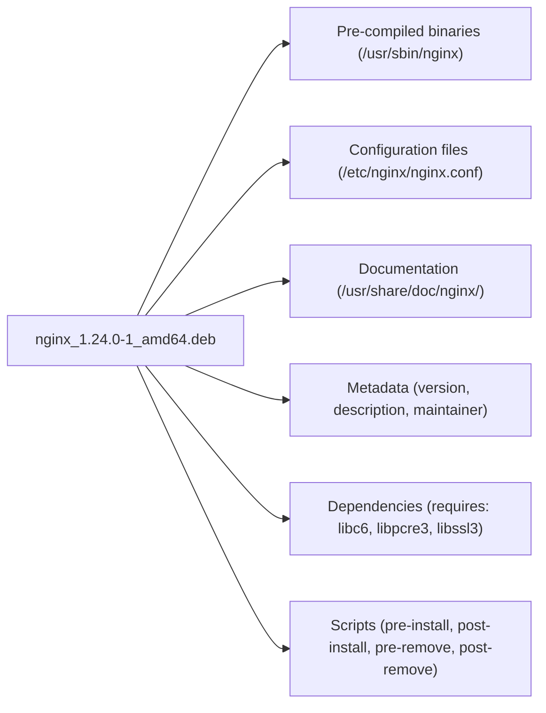

> **Operations — LFCS** | Complexity: `[MEDIUM]` | Time: 40-50 min

## Prerequisites

Before starting this module:
- **Required**: [Module 1.4: Users & Permissions](/linux/foundations/system-essentials/module-1.4-users-permissions/) for UID/GID fundamentals and file ownership
- **Required**: [Module 1.2: Processes & systemd](/linux/foundations/system-essentials/module-1.2-processes-systemd/) for understanding services and system state
- **Helpful**: [Module 4.1: Kernel Hardening](/linux/security/hardening/module-4.1-kernel-hardening/) for security context

---

## What You'll Be Able to Do

After this module, you will be able to:
- **Manage** packages using apt/dnf (install, update, pin, hold) and resolve dependency conflicts
- **Administer** users and groups with proper access controls and password policies
- **Configure** sudo access with fine-grained permissions for different admin roles
- **Audit** installed packages for security vulnerabilities and unnecessary software

---

## Why This Module Matters

Two things happen on every Linux server, every day: software gets installed and people need access. Package management and user administration are the bread and butter of system administration — the skills you will use more often than anything else in your career.

Understanding these skills helps you:

- **Keep systems patched** — Unpatched software is the number one attack vector in production
- **Control access** — The principle of least privilege starts with user accounts and sudo
- **Automate provisioning** — Every Ansible playbook, Dockerfile, and cloud-init script uses package and user commands
- **Pass the LFCS exam** — User management and package management are tested directly

If you have ever SSH'd into a server and typed `apt install` or `useradd`, you have already started. This module makes sure you really understand what those commands do under the hood.

---

## Did You Know?

- **Debian's package archive contains over 60,000 packages** — making it one of the largest curated software collections in the world. Every single one is maintained by a volunteer. The `apt` tool manages the dependency graph between all of them automatically.

- **The `/etc/shadow` file was invented because `/etc/passwd` was world-readable.** In the early days of Unix, password hashes lived in `/etc/passwd` where any user could read (and crack) them. Shadow passwords moved the hashes to a root-only file — a simple fix that dramatically improved security.

- **`visudo` exists because of real disasters.** A single syntax error in `/etc/sudoers` can lock every user out of sudo, including root. `visudo` validates the file before saving. There is no undo if you edit it with a regular editor and make a mistake.

- **RPM was created by Red Hat in 1997** and stands for "Red Hat Package Manager" (later backronymed to "RPM Package Manager," making it a recursive acronym like GNU). The `.rpm` format is still used by RHEL, Fedora, SUSE, and Amazon Linux.

---

## Part 1: Package Management

### What Is a Package?

A package is a compressed archive containing:



Without packages, you would compile every piece of software from source, manually track files, and resolve dependency conflicts by hand. Package managers handle all of this automatically.

### The Two Layers

Every Linux distribution has two layers of package management:

| Layer | Debian/Ubuntu | RHEL/Fedora | Purpose |
|-------|--------------|-------------|---------|
| **Low-level** | `dpkg` | `rpm` | Install/remove individual package files |
| **High-level** | `apt` | `dnf` | Resolve dependencies, download from repositories |

Think of it like this: `dpkg`/`rpm` are like manually installing an app from a downloaded file. `apt`/`dnf` are like an app store that finds, downloads, and installs everything you need automatically.

---

### Debian/Ubuntu: apt and dpkg

> **Stop and think**: If a package manager automatically resolves dependencies for you, where does it get the knowledge of which packages depend on which? Think about what happens when you run `apt update` before reading the next section.

#### Updating Package Lists

```bash
# Refresh the list of available packages from repositories
# This does NOT upgrade anything — it just downloads the latest catalog
sudo apt update

# Output shows which repositories were fetched:
# Hit:1 http://archive.ubuntu.com/ubuntu jammy InRelease
# Get:2 http://archive.ubuntu.com/ubuntu jammy-updates InRelease [119 kB]
# Fetched 2,345 kB in 3s (782 kB/s)
```

Always run `apt update` before installing or upgrading. Without it, you are working from a stale catalog and may install outdated versions.

#### Installing Packages

```bash
# Install a single package
sudo apt install nginx

# Install multiple packages at once
sudo apt install nginx curl vim

# Install without interactive confirmation
sudo apt install -y nginx

# Install a specific version
sudo apt install nginx=1.24.0-1ubuntu1
```

#### Searching and Inspecting

```bash
# Search for packages by name or description
apt search "web server"

# Show detailed info about a package (installed or available)
apt show nginx
# Package: nginx
# Version: 1.24.0-1ubuntu1
# Depends: libc6, libpcre2-8-0, libssl3, zlib1g
# Description: small, powerful, scalable web/proxy server

# List installed packages
apt list --installed

# List installed packages matching a pattern
apt list --installed 2>/dev/null | grep nginx
```

#### Removing Packages

```bash
# Remove the package but keep configuration files
sudo apt remove nginx

# Remove the package AND its configuration files
sudo apt purge nginx

# Remove packages that were installed as dependencies but are no longer needed
sudo apt autoremove

# Nuclear option: purge + autoremove
sudo apt purge -y nginx && sudo apt autoremove -y
```

The difference between `remove` and `purge` matters. If you `remove` nginx and reinstall it later, your old configuration files are still there. If you `purge`, you start fresh.

#### Upgrading

```bash
# Upgrade all packages to their latest versions (safe — never removes packages)
sudo apt upgrade

# Upgrade all packages, allowing removal of packages if needed for dependency resolution
sudo apt full-upgrade

# See what would be upgraded without doing it
apt list --upgradable
```

#### dpkg: Working with .deb Files Directly

Sometimes you download a `.deb` file directly (like from a vendor's website). That is when `dpkg` comes in:

```bash
# Install a .deb file
sudo dpkg -i google-chrome-stable_current_amd64.deb

# If dpkg fails due to missing dependencies, fix them:
sudo apt install -f

# List all installed packages
dpkg -l

# List installed packages matching a pattern
dpkg -l | grep nginx

# Find which package owns a file on your system
dpkg -S /usr/sbin/nginx
# nginx-core: /usr/sbin/nginx

# List all files installed by a package
dpkg -L nginx-core
```

#### Adding Repositories

```bash
# Add a PPA (Ubuntu-specific shortcut)
sudo add-apt-repository ppa:deadsnakes/ppa
sudo apt update

# Add a third-party repository manually
# 1. Download and add the GPG key
curl -fsSL https://packages.example.com/gpg.key | sudo gpg --dearmor -o /usr/share/keyrings/example-archive-keyring.gpg

# 2. Add the repository definition
echo "deb [signed-by=/usr/share/keyrings/example-archive-keyring.gpg] https://packages.example.com/apt stable main" | sudo tee /etc/apt/sources.list.d/example.list

# 3. Update and install
sudo apt update
sudo apt install example-package
```

Repository definitions live in `/etc/apt/sources.list` and `/etc/apt/sources.list.d/`. Use the `.d/` directory for third-party repos — it keeps things organized and easy to remove.

#### Holding Packages

Sometimes you need to prevent a package from being upgraded — for example, if a newer kernel breaks your hardware:

```bash
# Prevent a package from being upgraded
sudo apt-mark hold linux-image-generic

# Show held packages
apt-mark showhold

# Release the hold
sudo apt-mark unhold linux-image-generic
```

---

### RHEL/Fedora: dnf and rpm

#### Installing and Removing

```bash
# Install a package
sudo dnf install nginx

# Install without confirmation
sudo dnf install -y nginx

# Remove a package
sudo dnf remove nginx

# Install a local .rpm file (dnf resolves dependencies, unlike plain rpm)
sudo dnf install ./package-1.0.0.x86_64.rpm
```

#### Searching and Inspecting

```bash
# Search for packages
dnf search "web server"

# Show package details
dnf info nginx

# List all installed packages
dnf list installed

# Find which package provides a file
dnf provides /usr/sbin/nginx
# or for a command you don't have yet:
dnf provides */bin/traceroute
```

#### Updating

```bash
# Update all packages
sudo dnf update

# Update a specific package
sudo dnf update nginx

# Check for available updates
dnf check-update
```

#### rpm: Working with .rpm Files Directly

```bash
# Query all installed packages
rpm -qa

# Query a specific package
rpm -qi nginx
# Name        : nginx
# Version     : 1.24.0
# Release     : 1.el9

# List files in an installed package
rpm -ql nginx

# Find which package owns a file
rpm -qf /usr/sbin/nginx
# nginx-core-1.24.0-1.el9.x86_64

# Verify installed package (checks file integrity)
rpm -V nginx
# S.5....T.  c /etc/nginx/nginx.conf
# (S=size, 5=md5, T=time changed — the config was modified)
```

#### Adding Repositories

```bash
# Add a repository from a URL
sudo dnf config-manager --add-repo https://packages.example.com/example.repo

# List enabled repositories
dnf repolist

# List all repositories (including disabled)
dnf repolist all

# Enable a specific repository
sudo dnf config-manager --set-enabled powertools
```

---

### Comparison Table: apt vs dnf

| Task | Debian/Ubuntu (apt) | RHEL/Fedora (dnf) |
|------|--------------------|--------------------|
| Update package lists | `apt update` | `dnf check-update` |
| Install package | `apt install nginx` | `dnf install nginx` |
| Remove package | `apt remove nginx` | `dnf remove nginx` |
| Purge (remove + config) | `apt purge nginx` | `dnf remove nginx` (removes configs too) |
| Upgrade all | `apt upgrade` | `dnf update` |
| Search | `apt search term` | `dnf search term` |
| Show info | `apt show nginx` | `dnf info nginx` |
| List installed | `apt list --installed` | `dnf list installed` |
| Which package owns file | `dpkg -S /path/to/file` | `rpm -qf /path/to/file` |
| Install local file | `dpkg -i file.deb` | `dnf install ./file.rpm` |
| Hold/exclude from upgrade | `apt-mark hold pkg` | `dnf versionlock add pkg` |
| Clean cache | `apt clean` | `dnf clean all` |

---

### Package Security: Verifying Signatures

Packages are cryptographically signed by their maintainers. Your system verifies these signatures automatically — but you should understand what is happening:

```bash
# --- Debian/Ubuntu ---
# List trusted GPG keys
apt-key list          # deprecated but still works
# Modern approach: keys in /usr/share/keyrings/ or /etc/apt/keyrings/

# Verify a .deb file's signature
dpkg-sig --verify package.deb

# --- RHEL/Fedora ---
# Import a GPG key
sudo rpm --import https://packages.example.com/RPM-GPG-KEY-example

# Verify an RPM's signature
rpm --checksig package.rpm
# package.rpm: digests signatures OK

# Check which keys are trusted
rpm -qa gpg-pubkey*
```

If you ever see a warning like "The following signatures couldn't be verified," stop and investigate. Never blindly add `--nogpgcheck` — that defeats the purpose of signed packages and opens you to supply chain attacks.

---

## Part 2: User & Group Administration

Module 1.4 introduced the concepts of UIDs, GIDs, and file permissions. This section covers the practical administration: creating users, managing groups, configuring sudo access, and understanding the critical files involved.

### The Three Files That Matter

#### /etc/passwd — User Account Database

Every user account is a single line in `/etc/passwd`:

```
username:x:UID:GID:comment:home_directory:login_shell
```

Real example:

```bash
grep "deploy" /etc/passwd
# deploy:x:1001:1001:Deploy User:/home/deploy:/bin/bash
```

Breaking it down:

| Field | Value | Meaning |
|-------|-------|---------|
| `username` | deploy | Login name |
| `x` | x | Password stored in /etc/shadow (not here) |
| `UID` | 1001 | Numeric user ID |
| `GID` | 1001 | Primary group ID |
| `comment` | Deploy User | Full name / description (GECOS field) |
| `home` | /home/deploy | Home directory path |
| `shell` | /bin/bash | Login shell |

```bash
# View the file (it is world-readable — no passwords here)
cat /etc/passwd

# Count total users
wc -l /etc/passwd

# List only human users (UID >= 1000, excluding nobody)
awk -F: '$3 >= 1000 && $3 < 65534 {print $1, $3}' /etc/passwd
```

#### /etc/shadow — Password Hashes

This is the sensitive file. Only root can read it:

```
username:$hashed_password:last_changed:min:max:warn:inactive:expire:reserved
```

Real example:

```bash
sudo grep "deploy" /etc/shadow
# deploy:$6$rounds=656000$randomsalt$longHashHere...:19750:0:99999:7:::
```

| Field | Value | Meaning |
|-------|-------|---------|
| `username` | deploy | Login name |
| `password` | `$6$...` | Hashed password (`$6$` = SHA-512) |
| `last_changed` | 19750 | Days since Jan 1 1970 password was last changed |
| `min` | 0 | Minimum days between password changes |
| `max` | 99999 | Maximum days before password must be changed |
| `warn` | 7 | Days before expiry to warn user |
| `inactive` | (empty) | Days after expiry before account is disabled |
| `expire` | (empty) | Date account expires (days since epoch) |

Password hash prefixes tell you the algorithm:

| Prefix | Algorithm | Status |
|--------|-----------|--------|
| `$1$` | MD5 | Weak — do not use |
| `$5$` | SHA-256 | Acceptable |
| `$6$` | SHA-512 | Current default on most distros |
| `$y$` | yescrypt | Modern default on Debian 12+, Fedora 38+ |
| `!` or `*` | (none) | Account is locked / no password login |

#### /etc/group — Group Database

```
groupname:x:GID:member_list
```

```bash
grep "docker" /etc/group
# docker:x:999:deploy,alice

# List all groups a user belongs to
groups deploy
# deploy : deploy docker sudo

# Same info with GIDs
id deploy
# uid=1001(deploy) gid=1001(deploy) groups=1001(deploy),999(docker),27(sudo)
```

---

### Creating and Managing Users

#### useradd — Create User Accounts

```bash
# Create a user with defaults
sudo useradd alice
# This creates the user but:
#   - No password set (account locked)
#   - Home directory created (if CREATE_HOME=yes in /etc/login.defs)
#   - Shell from /etc/default/useradd

# Create a user with all the options you typically want
sudo useradd -m -s /bin/bash -c "Alice Smith" -G sudo,docker alice
#   -m          Create home directory
#   -s          Set login shell
#   -c          Set comment/full name
#   -G          Add to supplementary groups

# Set password immediately after
sudo passwd alice

# Create a user with a specific UID
sudo useradd -u 2000 -m -s /bin/bash bob

# Create a user with an expiration date
sudo useradd -m -s /bin/bash -e 2026-12-31 contractor
```

#### usermod — Modify Existing Users

```bash
# Add user to a supplementary group (APPEND — critical flag!)
sudo usermod -aG docker alice
#   -a   Append to group list (without -a, it REPLACES all groups!)
#   -G   Supplementary group

# Change login shell
sudo usermod -s /bin/zsh alice

# Lock an account (prefix password hash with !)
sudo usermod -L alice

# Unlock an account
sudo usermod -U alice

# Change home directory and move files
sudo usermod -d /home/newalice -m alice

# Change username
sudo usermod -l newalice alice
```

The `-aG` flag is so important it deserves its own warning: `usermod -G docker alice` (without `-a`) removes alice from every other supplementary group. This has locked people out of sudo access more times than anyone cares to count.

#### userdel — Remove Users

```bash
# Remove user but keep home directory
sudo userdel alice

# Remove user AND their home directory and mail spool
sudo userdel -r alice
```

#### passwd — Manage Passwords

```bash
# Set or change a user's password (interactive)
sudo passwd alice

# Set password non-interactively (useful in scripts)
echo "alice:NewPassword123!" | sudo chpasswd

# Force password change on next login
sudo passwd -e alice

# View password aging information
sudo chage -l alice
# Last password change                : Mar 15, 2026
# Password expires                    : never
# Account expires                     : never

# Set password to expire every 90 days
sudo chage -M 90 alice

# Set account expiration date
sudo chage -E 2026-12-31 contractor
```

---

### Creating and Managing Groups

```bash
# Create a new group
sudo groupadd developers

# Create with a specific GID
sudo groupadd -g 3000 devops

# Add existing user to the group
sudo usermod -aG developers alice

# Remove a user from a group (no direct command — use gpasswd)
sudo gpasswd -d alice developers

# Delete a group
sudo groupdel developers

# Rename a group
sudo groupmod -n dev-team developers
```

---

### System Accounts vs Regular Accounts

| Characteristic | System Account | Regular Account |
|---------------|----------------|-----------------|
| UID range | 1-999 | 1000+ |
| Home directory | Often /var/lib/service or none | /home/username |
| Login shell | `/usr/sbin/nologin` or `/bin/false` | `/bin/bash` or similar |
| Purpose | Run daemons/services | Human users |
| Created by | Package installation | Administrator |
| Example | `www-data`, `mysql`, `postgres` | `alice`, `deploy` |

```bash
# Create a system account (for running a service)
sudo useradd -r -s /usr/sbin/nologin -d /var/lib/myapp -c "MyApp Service" myapp
#   -r   Create a system account (UID < 1000, no aging)
#   -s /usr/sbin/nologin   Prevent interactive login

# Verify it cannot log in
sudo su - myapp
# This account is currently not available.
```

---

### Home Directory Management: /etc/skel

When `useradd -m` creates a home directory, it copies everything from `/etc/skel`:

```bash
# See what's in the skeleton directory
ls -la /etc/skel
# .bash_logout
# .bashrc
# .profile

# Customize the skeleton for new users
sudo cp /path/to/company-bashrc /etc/skel/.bashrc
sudo mkdir /etc/skel/.ssh
sudo touch /etc/skel/.ssh/authorized_keys
sudo chmod 700 /etc/skel/.ssh
sudo chmod 600 /etc/skel/.ssh/authorized_keys

# Now every new user gets these files automatically
sudo useradd -m -s /bin/bash newuser
ls -la /home/newuser/
# drwx------ .ssh/
# -rw-r--r-- .bashrc  (your customized version)
```

This is how organizations standardize user environments across servers. Put your standard shell configuration, SSH directory structure, and any other defaults into `/etc/skel`.

---

### sudo and the sudoers File

#### Why sudo Exists

Running commands as root is dangerous. `sudo` provides:

- **Auditing** — Every sudo command is logged (`/var/log/auth.log` or `journalctl`)
- **Granularity** — Grant specific commands, not full root access
- **Accountability** — You know *who* ran the command, not just "root did something"
- **Time limits** — sudo credentials expire (default 15 minutes)

#### The War Story: Never Edit sudoers with vim

> **Pause and predict**: What would happen if two administrators tried to edit `/etc/sudoers` at the exact same time using a standard text editor? How might the system prevent this race condition?

Here is a story that has happened at countless companies. A junior admin needs to give a developer sudo access. They know the sudoers file is at `/etc/sudoers`, so they do what seems logical:

```bash
sudo vim /etc/sudoers      # DO NOT DO THIS
```

They add a line, but make a tiny typo — maybe a missing comma or an extra space in the wrong place. They save and quit. Vim does not validate sudoers syntax.

Now `sudo` is broken. Every `sudo` command returns:

```
>>> /etc/sudoers: syntax error near line 42 <<<
sudo: parse error in /etc/sudoers near line 42
sudo: no valid sudoers sources found, quitting
```

Nobody can use sudo. Including root (if root login is disabled, which it often is on cloud servers). The only ways to fix this:

1. Boot into single-user/recovery mode (if you have physical/console access)
2. Mount the disk from another instance (in the cloud)
3. Use `pkexec` if PolicyKit is installed (rare lifeline)

The fix was always simple: use `visudo`.

#### visudo — The Only Safe Way

```bash
# Edit the sudoers file safely
sudo visudo

# visudo does two critical things:
# 1. Locks the file so two admins can't edit simultaneously
# 2. Validates syntax before saving — rejects invalid changes

# Edit a specific sudoers drop-in file
sudo visudo -f /etc/sudoers.d/developers
```

If you make a syntax error, `visudo` tells you and asks what to do:

```
>>> /etc/sudoers: syntax error near line 25 <<<
What now? (e)dit, (x)exit without saving, (Q)quit without saving
```

#### sudoers Syntax

```bash
# Basic format:
# WHO  WHERE=(AS_WHOM)  WHAT
# user  host=(runas)    commands

# Give alice full sudo access
alice   ALL=(ALL:ALL) ALL

# Give bob sudo access without password
bob     ALL=(ALL:ALL) NOPASSWD: ALL

# Give the devops group access to restart services only
%devops ALL=(root) /usr/bin/systemctl restart *, /usr/bin/systemctl status *

# Give deploy user access to deploy commands only, no password
deploy  ALL=(root) NOPASSWD: /usr/bin/rsync, /usr/bin/systemctl restart myapp
```

Breaking down `alice ALL=(ALL:ALL) ALL`:

| Part | Meaning |
|------|---------|
| `alice` | This rule applies to user alice |
| First `ALL` | On any host (relevant for shared sudoers via LDAP/NIS) |
| `(ALL:ALL)` | Can run as any user:any group |
| Last `ALL` | Can run any command |

#### /etc/sudoers.d/ — Drop-in Files

Instead of editing the main sudoers file, use drop-in files. This is the modern, recommended approach:

```bash
# Create a file for the developers team
sudo visudo -f /etc/sudoers.d/developers

# Contents:
# %developers ALL=(ALL:ALL) ALL

# Create a file for a specific service account
sudo visudo -f /etc/sudoers.d/deploy

# Contents:
# deploy ALL=(root) NOPASSWD: /usr/bin/systemctl restart myapp, /usr/bin/rsync
```

Rules for drop-in files:
- File names must NOT contain `.` or `~` (they will be silently ignored)
- Files must be owned by root with permissions `0440`
- Always create them with `visudo -f`, which sets correct permissions
- The main `/etc/sudoers` must include: `@includedir /etc/sudoers.d` (or `#includedir` on older systems — the `#` is NOT a comment here)

---

## Common Mistakes

| Mistake | What Happens | Fix |
|---------|-------------|-----|
| `apt install` without `apt update` first | Install outdated or missing package versions | Always run `sudo apt update` before installing |
| `usermod -G` without `-a` | User is removed from ALL other supplementary groups | Always use `usermod -aG group user` |
| Editing `/etc/sudoers` with vim/nano | Syntax error locks out all sudo access | Always use `visudo` |
| Using `apt-key add` for GPG keys | Deprecated; keys trusted for ALL repositories | Use `signed-by` with keyring files in `/usr/share/keyrings/` |
| Deleting a user without `-r` | Orphaned home directory wastes disk and is a security risk | Use `userdel -r` or manually clean up `/home/username` |
| Setting password via command line argument | Password visible in shell history and process list | Use `passwd` interactively or pipe through `chpasswd` |
| Forgetting `nologin` shell for service accounts | Service accounts can be used for interactive login | Create with `useradd -r -s /usr/sbin/nologin` |
| Adding `--nogpgcheck` to silence warnings | Disables cryptographic verification of packages | Import the correct GPG key instead |
| Sudoers drop-in file with `.` in name | File is silently ignored — rule never applies | Name files without dots or tildes (e.g., `developers` not `developers.conf`) |
| Running `apt full-upgrade` without checking | May remove packages to resolve dependencies | Run `apt list --upgradable` first to review changes |

---

## Quiz

**Q1: You are troubleshooting an Nginx server that is failing to start due to a corrupted configuration file you accidentally modified. You decide to reinstall it, so you run `sudo apt remove nginx` followed by `sudo apt install nginx`. However, the server still fails to start with the exact same configuration error. Why did this happen, and what command should you have used instead?**

<details>
<summary>Show Answer</summary>

When you use `apt remove`, the package manager uninstalls the binary files but intentionally leaves all configuration files intact on the disk. This is a safety feature designed to prevent accidental data loss if you briefly uninstall and reinstall a package. Because the corrupted configuration file was left behind, the new installation simply reused it, leading to the same startup error. To completely wipe both the application binaries and its configuration files, you must use the `apt purge` command instead. After purging, a fresh installation will generate the default, uncorrupted configuration files.
</details>

**Q2: You have just inherited a legacy Debian server and found a mysterious custom script that relies on a tool located at `/opt/custom/bin/data-parser`. You want to know if this tool was installed via the package manager or compiled from source by the previous administrator. How can you determine if a package owns this specific file, and why is this method definitive?**

<details>
<summary>Show Answer</summary>

You can determine the file's origin by running `dpkg -S /opt/custom/bin/data-parser`. When a package is installed, the package manager records every single file it extracts into a local database. The `dpkg -S` (or search) command queries this exact database to see if any known package claims ownership of the given path. If the command returns a package name, you know it was installed via `apt` or `dpkg`. If it returns 'no path found', the tool was likely compiled manually, copied directly to the server, or installed via an unmanaged method like a tarball.
</details>

**Q3: During a security audit of your company's Linux servers, you notice that all user password hashes in `/etc/shadow` begin with the `$1$` prefix. Your security compliance tool flags this as a critical vulnerability. What does this prefix indicate about how the passwords are stored, and why is the security tool raising an alarm?**

<details>
<summary>Show Answer</summary>

The `$1$` prefix in the `/etc/shadow` file indicates that the user passwords have been hashed using the MD5 algorithm. This is considered a critical vulnerability because MD5 is an outdated and cryptographically weak algorithm that is highly susceptible to brute-force and dictionary attacks using modern hardware. Attackers can crack MD5 hashes significantly faster than those generated by modern algorithms. To secure the system, you must migrate to a stronger hashing standard, such as SHA-512 (indicated by `$6$`) or yescrypt (indicated by `$y$`), by updating the system's password configuration and forcing users to reset their passwords.
</details>

**Q4: Alice, a developer, submitted a ticket requesting access to run Docker commands on the staging server. A junior administrator ran the command `sudo usermod -G docker alice` to grant her access. Shortly after, Alice reports that while she can now run Docker, she has completely lost her ability to use `sudo` and access the `developers` shared group. What exactly caused this issue, and how should the command have been structured?**

<details>
<summary>Show Answer</summary>

The issue occurred because the `-G` flag, when used without the append modifier, completely replaces the user's existing supplementary group memberships with the new list provided. By running `usermod -G docker alice`, the administrator inadvertently removed Alice from her essential groups, like `sudo` and `developers`, and set her supplementary group solely to `docker`. To safely add a user to a new group without affecting their current memberships, the command must include the `-a` (append) flag. The correct command would have been `sudo usermod -aG docker alice`, which appends the new group to her existing profile.
</details>

**Q5: To grant the web development team access to restart the Nginx service, your colleague used `visudo -f /etc/sudoers.d/web.devs` to create a new configuration file. The syntax inside the file is perfectly valid, but the developers still receive a "permission denied" error when trying to run the command. What is preventing the system from reading this file, and why does this restriction exist?**

<details>
<summary>Show Answer</summary>

The problem stems from the filename `/etc/sudoers.d/web.devs`, which contains a dot character. By design, the `sudo` configuration parser silently ignores any files in the `/etc/sudoers.d/` directory that contain a dot or end with a tilde. This strict naming convention is a safety mechanism implemented to prevent the system from accidentally parsing backup files, package manager artifacts (like `.dpkg-old`), or hidden files that might contain broken or outdated configurations. To resolve the issue, you simply need to rename the file to something without a dot, such as `web-devs`, ensuring the parser reads and applies the rules.
</details>

**Q6: Your production environment relies on a specific, older version of the `postgresql` package due to compatibility issues with a legacy database application. You want to run `sudo apt upgrade` to apply security patches to the rest of the system, but you must guarantee that `postgresql` is absolutely not touched during this process. How can you enforce this restriction, and how does the system track it?**

<details>
<summary>Show Answer</summary>

You can enforce this restriction by placing a 'hold' on the package using the command `sudo apt-mark hold postgresql`. When you issue this command, the package manager flags the package state in its internal database, instructing `apt` to ignore any available updates for it during standard upgrade operations. This ensures your legacy application remains stable while the rest of the system receives critical security patches. When the compatibility issues are finally resolved and you are ready to update the database, you can simply run `sudo apt-mark unhold postgresql` to remove the flag and allow normal upgrades to resume.
</details>

**Q7: Your company has hired twenty new engineers who all need accounts on the primary development server. Security policy mandates that every new user must have a specific, pre-configured `.ssh/config` file and a customized `.bashrc` loaded with company aliases the moment their account is created. How can you automate this process so you don't have to manually copy these files for each of the twenty new users?**

<details>
<summary>Show Answer</summary>

You can automate this process by utilizing the `/etc/skel` (skeleton) directory. When you create a new user account using the `useradd -m` command, the system automatically copies all contents from the `/etc/skel` directory directly into the newly created home directory. By placing the required `.ssh/config` file and the custom `.bashrc` into `/etc/skel` beforehand, you ensure that these files are automatically distributed to every new user upon creation. This guarantees a consistent, policy-compliant environment across the server without requiring any manual post-creation setup.
</details>

---

## Hands-On Exercise: User and Package Administration

**Objective**: Practice the full lifecycle of user management and package operations on a Linux system.

**Environment**: Any Ubuntu/Debian VM, container, or WSL instance with root access.

### Task 1: Package Management

```bash
# Update package lists
sudo apt update

# Install two packages
sudo apt install -y tree jq

# Verify installation
which tree && which jq

# Find which package owns the jq binary
dpkg -S $(which jq)

# List all files installed by the jq package
dpkg -L jq

# Show package information
apt show jq

# Hold jq to prevent upgrades
sudo apt-mark hold jq
apt-mark showhold
# Should show: jq

# Release the hold
sudo apt-mark unhold jq

# Remove jq (keep config) then purge tree (remove everything)
sudo apt remove -y jq
sudo apt purge -y tree
sudo apt autoremove -y
```

### Task 2: User and Group Management

```bash
# Create a group
sudo groupadd -g 3000 webteam

# Create a user with full options
sudo useradd -m -s /bin/bash -c "Test Developer" -G webteam -u 2000 testdev

# Verify the user
id testdev
# uid=2000(testdev) gid=2000(testdev) groups=2000(testdev),3000(webteam)

grep testdev /etc/passwd
# testdev:x:2000:2000:Test Developer:/home/testdev:/bin/bash

# Set a password
echo "testdev:TempPass123!" | sudo chpasswd

# Verify shadow entry exists
sudo grep testdev /etc/shadow | cut -d: -f1-3

# Force password change on next login
sudo passwd -e testdev

# Verify password aging
sudo chage -l testdev
# Last password change: password must be changed

# Create a second user and add to the same group
sudo useradd -m -s /bin/bash -c "Test Operator" testops
sudo usermod -aG webteam testops

# Verify group membership
grep webteam /etc/group
# webteam:x:3000:testdev,testops
```

### Task 3: sudoers Configuration

```bash
# Create a sudoers drop-in file for the webteam group
sudo visudo -f /etc/sudoers.d/webteam

# Add this line (type it in the editor that opens):
# %webteam ALL=(root) /usr/bin/systemctl restart nginx, /usr/bin/systemctl status nginx

# Verify the file was created with correct permissions
ls -la /etc/sudoers.d/webteam
# -r--r----- 1 root root ... /etc/sudoers.d/webteam

# Test: switch to testdev and try allowed vs denied commands
sudo -u testdev sudo -l
# (root) /usr/bin/systemctl restart nginx, /usr/bin/systemctl status nginx
```

### Task 4: Skeleton Directory Customization

```bash
# Add a custom file to /etc/skel
echo "Welcome to the team! Read /wiki for onboarding docs." | sudo tee /etc/skel/WELCOME.txt

# Create a new user and verify they got the file
sudo useradd -m -s /bin/bash skeltest
ls -la /home/skeltest/WELCOME.txt
cat /home/skeltest/WELCOME.txt
# Welcome to the team! Read /wiki for onboarding docs.
```

### Cleanup

```bash
# Remove users
sudo userdel -r testdev
sudo userdel -r testops
sudo userdel -r skeltest

# Remove group
sudo groupdel webteam

# Remove sudoers file
sudo rm /etc/sudoers.d/webteam

# Remove skel customization
sudo rm /etc/skel/WELCOME.txt
```

### Success Criteria

- [ ] Installed and removed packages using `apt`, verified with `dpkg -S`
- [ ] Held and unheld a package with `apt-mark`
- [ ] Created users with specific UID, shell, groups, and home directory
- [ ] Set passwords and configured password aging with `chage`
- [ ] Created a sudoers drop-in file using `visudo -f`
- [ ] Customized `/etc/skel` and verified it works for new users
- [ ] Cleaned up all test users, groups, and files

---

## Next Module

Continue with [Module 8.4: Service Configuration & Scheduling](../module-8.4-scheduling-backups/) to learn about systemd unit files, cron jobs, and timers — the tools that keep Linux services running and tasks executing on schedule.