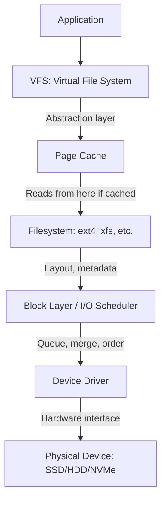
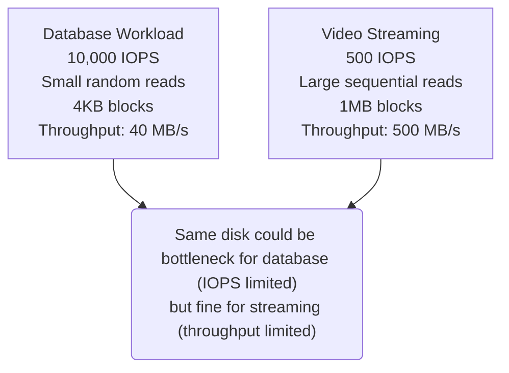

# Module 5.4: I/O Performance

> **Linux Performance** | Complexity: `[MEDIUM]` | Time: 25-30 min. This module assumes you can move around a Linux shell, read command output carefully, and pause long enough to connect symptoms to the layer that produced them.

## Prerequisites

Before starting this module, make sure the earlier performance modules feel familiar enough that you can compare CPU, memory, and storage evidence without treating any one metric as the whole story.

- **Required**: [Module 5.1: USE Method](../module-5.1-use-method/)
- **Required**: [Module 1.3: Filesystem Hierarchy](/linux/foundations/system-essentials/module-1.3-filesystem-hierarchy/)
- **Helpful**: [Module 5.3: Memory Management](../module-5.3-memory-management/) for page cache understanding

## Learning Outcomes

After this module, you will be able to perform the following tasks in a lab or production-style investigation, and each outcome is assessed by the quiz, the hands-on exercise, or both.

- **Measure** disk I/O performance using `iostat`, `iotop`, and `fio` benchmarks.
- **Diagnose** I/O bottlenecks by interpreting `await`, `%util`, and queue depth metrics together.
- **Configure** I/O schedulers and cgroup `blkio` limits for container workloads.
- **Evaluate** storage performance requirements for database, logging, cache, and Kubernetes PersistentVolume workloads.
- **Implement** a repeatable I/O test plan that separates page cache effects from real device behavior.

## Why This Module Matters

At 02:10 on a payroll processing night, a regional payments company watched its checkout latency climb from normal subsecond responses to timeouts that lasted long enough for customers to abandon carts. The on-call engineer saw idle CPUs, plenty of free memory, and application logs that only said database queries were slow. The incident review later traced the outage to a small burst of synchronous audit logging on the same cloud block volume that stored the database write-ahead log, and the team estimated that the hour of degraded service cost more than a senior engineer's annual training budget.

That kind of failure feels unfair when you first meet Linux performance work, because the obvious dashboards can make the machine look healthy. CPU utilization may be low because threads are asleep, memory may look comfortable because the page cache is doing exactly what it should, and the application may only report that file operations are taking too long. I/O diagnosis is therefore a discipline of following latency through layers rather than staring at a single red number.

This module teaches that discipline from the bottom up. You will start with the path a read or write takes through the kernel, then connect that path to practical metrics such as IOPS, throughput, `await`, `%util`, and queue depth. You will also learn when to benchmark with `fio`, when to distrust a warm-cache result, how schedulers and filesystems affect work, and how container or Kubernetes storage choices change the operating envelope in Linux and Kubernetes 1.35 or later.

## I/O Fundamentals

Disk I/O looks simple from an application because the application asks the kernel to read or write bytes and then receives success, failure, or delay. Under that simple call is a layered system that can absorb, reorder, cache, split, merge, throttle, and eventually dispatch work to a physical or virtual device. A useful mental model is an airport security line: the traveler only sees the line they are standing in, but throughput depends on document checks, baggage scanners, staffing, lane layout, and the capacity of the next room.



The Virtual File System gives programs one consistent interface even though ext4, XFS, Btrfs, tmpfs, network filesystems, and container overlay layers behave differently underneath. The page cache then turns many read operations into memory lookups, which is why a second run of the same command can appear magically faster. Below the filesystem, the block layer transforms file-level requests into device-level operations, and the scheduler decides whether requests should be merged, reordered, or passed through with minimal interference.

The most important lesson is that a completed write from the application's point of view is not always the same thing as bytes being durable on the device. Buffered writes can return after data enters the page cache, while the kernel flushes dirty pages later. Synchronous writes, `fsync`, journal commits, and storage barriers are the moments where the application asks for stronger durability, and those moments reveal the real latency of the lower layers.

> **Pause and predict**: If an application writes a 1GB file to disk, but the physical disk's write throughput is only 100MB/s, why might the application report that the write completed in under a second? Consider the layers of the I/O stack and what actually happens when a write system call returns.

When you measure I/O performance, separate operations from bytes. IOPS counts how many individual operations complete per second, which matters when a database performs many small random reads or writes. Throughput counts transferred bytes per second, which matters when a backup job, video service, or image pipeline streams large contiguous files. A device can be excellent at one shape and disappointing at the other, just as a grocery store can move many customers quickly through express lanes but struggle when each customer arrives with a full cart.

| Metric | Definition | Good For |
|--------|------------|----------|
| **IOPS** | I/O Operations Per Second | Small, random I/O |
| **Throughput** | MB/s transferred | Large, sequential I/O |



The diagram is deliberately unfair to anyone who asks, "Is this disk fast?" without naming the workload. The database workload burns through operations because each 4KB request has command overhead, queueing behavior, and latency sensitivity. The video workload consumes far more bytes, but it gives the device large sequential work that hardware and kernels can optimize. Performance engineering starts by describing the shape of demand before judging the storage.

Latency is the other half of the model. Every request has service time, which is time spent on the device, and wait time, which is time spent queued before service. A storage system can have a very fast service time and still deliver poor application latency if too many requests pile up. Conversely, a single slow network-backed operation can create high `await` even when the local queue is almost empty.

```bash
# I/O latency = wait time + service time
#
# Wait time: Time in queue
# Service time: Time device spends on I/O

# Measured with iostat:
iostat -x 1
# await = average total time (wait + service)
# svctm = service time (deprecated/removed in newer iostat)
```

A practical war story illustrates the difference. A team moved a small PostgreSQL database from local SSD to a managed network volume because the cloud console promised enough provisioned IOPS. Bulk report exports still looked fine, but checkout writes became spiky because each commit waited for network round trips and durability acknowledgements. Their old dashboard tracked MB/s, so it missed the latency regression that users actually felt.

Before running any command in a production incident, write down what you expect the metric to prove. If you expect high IOPS with low latency, you are testing whether the device is busy but healthy. If you expect low IOPS with high latency, you are looking for remote storage delays, a failing disk, filesystem stalls, or a workload that is serializing on synchronous writes. That prediction keeps you from changing schedulers or buying storage before you know which layer is responsible.

There is also a durability dimension that does not fit neatly into a speed chart. A cache can make a write look fast by absorbing it, but the application may need stronger guarantees before telling a user that an order, payment, or message is safe. Filesystems, databases, and storage devices all expose different ways to trade latency for durability, and the right answer depends on the cost of losing acknowledged data. When an engineer says, "make it faster," the senior response is to ask which promises must remain true after a crash.

## Measuring I/O Metrics

The core measurement tool for block devices is `iostat -x`, because it shows rates, latency, utilization, and queue behavior in one place. It is tempting to treat `%util` as the main health score, but `%util` only means the device had at least one request in progress during the sampling interval. That definition works reasonably for old single-queue disks, yet it can be misleading for SSDs, NVMe devices, and virtualized storage that handle many operations in parallel.

```bash
# Basic I/O stats
iostat -x 1
# Device         r/s     w/s   rkB/s   wkB/s  %util  await  avgqu-sz
# sda          100.0   200.0  4000.0  8000.0   75.2   12.5      2.3
# nvme0n1      500.0   300.0 20000.0 12000.0   45.0    1.5      0.8

# Key columns:
# r/s, w/s     = Reads/writes per second (IOPS)
# rkB/s, wkB/s = Throughput
# %util        = Percentage of time device was busy
# await        = Average I/O time (ms)
# avgqu-sz     = Average queue size (saturation indicator)
```

Read `iostat` as a cluster of clues. The `r/s` and `w/s` columns describe operation rate, while `rkB/s` and `wkB/s` describe byte throughput. The `await` column tells you the average time an operation spends from submission to completion, including queue wait. The `avgqu-sz` column shows whether requests are backing up, and `%util` tells you whether the device was busy during the interval rather than whether the workload has reached the device's true ceiling.

| Metric | Meaning | Concerning Value |
|--------|---------|-----------------|
| `%util` | Time busy | >80% for HDDs |
| `await` | Total latency | >10ms for SSD, >50ms for HDD |
| `avgqu-sz` | Queue depth | >1 means I/O backing up |
| `r_await/w_await` | Read/write latency separately | Large difference indicates problem |

Those concerning values are starting points, not laws. A busy HDD at 80 percent can become user-visible trouble because it has little parallelism and expensive seeks. A busy NVMe device can show high `%util` while keeping `await` under a millisecond, which means it is working hard but not necessarily hurting callers. The right question is whether latency and queueing are rising relative to the service objective for the application.

> **Pause and predict**: You are monitoring a database server and notice that `await` is consistently high, but `%util` is hovering around 30%. What might this combination of metrics tell you about the storage subsystem's characteristics or the nature of the database's I/O patterns?

The likely answer is that the bottleneck may be outside a simple local saturation story. Low `%util` with high `await` can appear when operations are serialized, when a network volume adds per-request latency, when a filesystem waits on journal commits, or when the sample interval hides short bursts. You would next separate read latency from write latency, inspect queue depth, and compare the application's commit or flush pattern against the storage service's durability behavior.

`iotop` moves the investigation from the device to the process. It answers the incident question, "Who is doing the I/O right now?" rather than "How busy is the block device?" That distinction matters when a database, log shipper, backup process, container runtime, and package manager all share the same disk. The device view tells you there is pressure; the process view tells you who is creating it.

```bash
# Per-process I/O
sudo iotop -o
# Total DISK READ:       10.0 MB/s | Total DISK WRITE:      20.0 MB/s
# TID  PRIO USER     DISK READ  DISK WRITE  SWAPIN      IO%    COMMAND
# 1234 be/4 mysql       5.0 MB/s   15.0 MB/s  0.00%   75.00% mysqld

# -o = Only show processes with I/O
# -a = Accumulated instead of bandwidth
```

Use `iotop -o` during a live incident because it hides quiet processes and reduces noise. Use accumulated mode when a process performs short bursts that disappear before you look. If `iotop` is not installed or the host policy disallows it, `pidstat -d` gives per-process read and write rates from another angle. Either way, you are connecting kernel counters to a command, service, or container owner.

The raw counters live in `/proc/diskstats` and `/sys/block/*/stat`, and they are useful when you need to verify what higher-level tools are calculating. Monitoring agents read these files, take deltas across intervals, and derive rates and latencies. You do not need to memorize every field, but you should recognize that the polished dashboard is not magic; it is arithmetic over kernel counters.

```bash
# Raw stats from kernel
cat /proc/diskstats
# 8  0 sda 123456 789 1234567 12345 234567 890 2345678 23456 0 34567 45678

# Fields (for sda):
# 1: reads completed
# 3: sectors read
# 4: time spent reading (ms)
# 5: writes completed
# 7: sectors written
# 8: time spent writing (ms)

# Per-device stats
cat /sys/block/sda/stat
```

Worked example: imagine an API server where `iostat` shows `w_await` rising from 2ms to 80ms during deployments, while `r_await` remains flat. `iotop` then shows the application writing structured logs and the container runtime writing layer metadata. The diagnosis is not "the disk is slow" in a generic sense; it is "write latency rises when deployment churn and application logging share the same block volume." That statement is specific enough to guide a fix.

Which approach would you choose here and why: lower log verbosity, move logs to a separate volume, provision a higher write-IOPS class, or tune application flush behavior? The best first move depends on whether the writes are required for correctness, whether the volume is throttled, and whether the database or users are competing with operational telemetry. Good I/O work is often a product decision disguised as a kernel problem.

Measurement also needs timing discipline. A one-second interval can hide short bursts or exaggerate a single unlucky operation, while a five-minute average can flatten the exact spike users felt. During an incident, collect a few short interval samples to catch queue behavior, then compare them with application timestamps and longer trend data. The goal is to avoid both traps: reacting to a single noisy sample and ignoring a brief burst that explains the outage.

## Schedulers, Filesystems, and Cache Effects

Schedulers exist because devices are not all shaped the same. On a spinning disk, the physical head must move across platters, so reordering requests can reduce seek time and improve fairness. On an SSD or NVMe device, there is no moving head, and the device firmware already has internal queues and parallelism. On a virtual disk, the guest operating system may be scheduling work that the host or cloud provider will schedule again, which can add overhead without improving placement.

```bash
# Check current scheduler
cat /sys/block/sda/queue/scheduler
# [mq-deadline] kyber bfq none

# Available (bracketed = active):
# mq-deadline - Good for HDDs
# kyber - Good for fast devices (NVMe)
# bfq - Fair queuing (good for desktops)
# none - No scheduling (let device handle it)

# Change scheduler (temporary)
echo mq-deadline | sudo tee /sys/block/sda/queue/scheduler
```

Treat scheduler changes as experiments, not rituals. `mq-deadline` can protect latency and ordering on devices that benefit from host-side scheduling. `bfq` can make interactive desktop workloads feel fairer, but it is rarely the first choice for a production database. `none` is often appropriate for NVMe or virtualized block devices where the lower layer already knows more about parallelism, placement, and hardware topology than the guest kernel.

| Device Type | Recommended Scheduler |
|-------------|----------------------|
| HDD | mq-deadline |
| SSD (SATA) | mq-deadline or none |
| NVMe | none or kyber |
| VM disk | none (host handles it) |

A common scheduler war story starts with a team changing every server to the same setting after one benchmark improves. The database hosts improve because their virtual disks stop paying unnecessary scheduler overhead, but the log aggregation host with older SATA SSDs becomes less predictable during burst writes. The lesson is that the scheduler is part of a workload and device pairing, so a setting that is correct in one place can be a regression in another.

Filesystems add another layer of tradeoffs. ext4 is mature, widely understood, and excellent for general-purpose Linux systems. XFS is strong for large files and high concurrency, which is why it is common in enterprise Linux environments. Btrfs brings snapshots and checksums, but its copy-on-write behavior can be costly for some database patterns unless configured carefully. tmpfs is fastest because it lives in memory, but data disappears when the system restarts.

| Filesystem | Best For | Notes |
|------------|----------|-------|
| **ext4** | General purpose | Default, mature, good for most workloads |
| **XFS** | Large files, high concurrency | Default for RHEL, better parallel writes |
| **Btrfs** | Snapshots, checksums | Copy-on-write, more features, more overhead |
| **tmpfs** | Temp data | RAM-based, very fast, lost on reboot |

Mount options can change how much metadata I/O the filesystem performs. Updating access time on every read is useful for some workloads, but it creates extra writes that many servers do not need. Barriers and flushes protect ordering and durability, but disabling them can convert a power loss or crash into corrupted data. TRIM or discard support helps SSDs manage erased blocks, yet continuous discard can hurt some devices compared with scheduled trimming.

```bash
# View mount options
mount | grep sda
# /dev/sda1 on / type ext4 (rw,relatime,errors=remount-ro)

# Performance-relevant options:
# noatime - Don't update access time (reduces writes)
# nodiratime - Don't update directory access time
# barrier=0 - Disable write barriers (faster, less safe)
# discard - Enable TRIM for SSDs

# Example fstab entry
# /dev/sda1 / ext4 defaults,noatime 0 1
```

The most dangerous line in that command block is `barrier=0`, because it is attractive when someone wants a quick benchmark win. Barriers exist to keep write ordering sane across caches, controllers, and power failures. Disabling them may improve a narrow test, but it weakens the storage contract unless the device, controller, and application have another reliable durability mechanism. In production, speed that survives only until the next crash is not performance engineering.

Space and inode checks belong in I/O investigations because full filesystems create strange symptoms. A volume can have free bytes but no free inodes, which breaks creation of small files. A log directory can grow until the filesystem spends more time on metadata and allocation. A database can slow down when it approaches a cloud volume's burst or throughput limit even though Linux only shows a normal mounted filesystem.

```bash
# Space usage
df -h
# Filesystem      Size  Used Avail Use% Mounted on
# /dev/sda1       100G   60G   40G  60% /

# Inode usage (can exhaust before space)
df -i
# Filesystem      Inodes  IUsed   IFree IUse% Mounted on
# /dev/sda1     6553600 100000 6453600    2% /

# Directory size
du -sh /var/log/
du -sh /var/log/* | sort -rh | head -10
```

The page cache is the reason benchmark results can disagree with production. A read test that repeats the same file may eventually measure RAM speed rather than device speed. That is not a bug; the cache is one of Linux's most important performance features. The bug appears when you use a warm-cache result to size cold-start behavior, recovery time, or a workload whose working set is larger than memory.

Before running this benchmark, what output do you expect if the first read comes from disk and the second read comes from cache? A healthy answer mentions both lower elapsed time and lower block-device read activity on the second pass. If the second pass is not faster, either the working set does not fit in memory, direct I/O bypasses the cache, or another process is evicting pages fast enough to keep the test cold.

Filesystem tuning should therefore start with the workload's access pattern rather than with a list of favorite options. A read-mostly documentation site, an append-heavy log pipeline, a small-file package cache, and a database with its own buffer manager all stress different code paths. The same `noatime` choice may be harmless on one host and irrelevant on another, while copy-on-write snapshots may be valuable for rollback but expensive for write amplification. The correct conversation is about behavior, not preference.

## Container and Kubernetes I/O

Containers do not remove the Linux I/O stack; they add ownership and isolation questions on top of it. A process inside a container still writes to a filesystem, the filesystem still reaches the block layer, and the block device still has queues and latency. The hard part is mapping the noisy process back to a container, a volume, a pod, or a Kubernetes workload owner before you change the wrong limit.

```bash
# View container I/O limits
cat /sys/fs/cgroup/blkio/docker/<container>/blkio.throttle.read_bps_device
cat /sys/fs/cgroup/blkio/docker/<container>/blkio.throttle.write_bps_device

# Format: major:minor bytes_per_second
# 8:0 10485760  = sda limited to 10MB/s

# I/O stats
cat /sys/fs/cgroup/blkio/docker/<container>/blkio.io_service_bytes
```

The exact cgroup paths differ between cgroup v1, cgroup v2, Docker, containerd, and the host distribution, but the principle is stable. Limits attach I/O policy to a control group, and the kernel accounts work against that group. If a container is throttled, the application may report slow writes even while the device itself looks underused, because the queue is not at the device; it is at the policy boundary.

```bash
# Run with I/O limits
docker run -d \
  --device-read-bps /dev/sda:10mb \
  --device-write-bps /dev/sda:10mb \
  --device-read-iops /dev/sda:1000 \
  --device-write-iops /dev/sda:1000 \
  nginx

# Check I/O stats
docker stats --format "{{.Name}}: BlockIO: {{.BlockIO}}"
```

I/O limits are useful when one workload must not starve another, but they can also hide the real capacity of the system. A team may see low host utilization and assume the storage class is oversized, while a tenant sees painful latency because the tenant is hitting a bytes-per-second throttle. The operational question is not only "How fast is the disk?" It is also "Which control group is allowed to use the disk, at what rate, and during which burst?"

In Kubernetes 1.35 and later, this module uses the standard short alias `k`, introduced as `alias k=kubectl`, whenever a Kubernetes command is needed; for example, `k get pvc` inspects claims without spelling out the full client name. Kubernetes storage performance usually starts with the StorageClass and the provisioned volume type, then moves to the pod's access pattern, filesystem, node placement, and cloud provider limits. The Linux skills still apply, but the ownership chain is longer.

```yaml
# StorageClass with I/O parameters targeting v1.35+ best practices
apiVersion: storage.k8s.io/v1
kind: StorageClass
metadata:
  name: fast-storage
provisioner: ebs.csi.aws.com
parameters:
  type: gp3
  iops: "3000"
  throughput: "125"
---
# Pod using PVC
apiVersion: v1
kind: Pod
metadata:
  name: io-test-pod
spec:
  containers:
  - name: app
    image: nginx:latest
    volumeMounts:
    - name: data
      mountPath: /data
  volumes:
  - name: data
    persistentVolumeClaim:
      claimName: my-pvc
```

A Kubernetes war story: an operations team moved a write-heavy queue worker to a PersistentVolume backed by a general-purpose cloud disk and kept the same pod resource requests. CPU and memory graphs stayed calm, but queue lag grew after the daily reporting job started. The fix was not a CPU request change; it was separating the queue data from report exports and choosing a volume class with explicit IOPS and throughput guarantees.

When you evaluate a Kubernetes storage problem, follow the path from pod to node to volume. Check whether many pods share a node-local device, whether the CSI driver provisions the expected class, whether the workload is mounted through a network filesystem, and whether the application uses many small synchronous writes. If `k get pvc` says the claim is bound, that only proves scheduling and provisioning worked; it does not prove the workload has the latency budget it needs.

Kubernetes also changes who owns the fix. A platform team may own the StorageClass, an application team may own batching or logging behavior, and an infrastructure team may own cloud volume limits. Good incident notes name all three boundaries so the action item lands with the group that can change the cause. Otherwise, the next review becomes a loop of "the pod was slow" and "the node looked healthy" without anyone connecting the policy, workload, and device.

## Troubleshooting I/O Incidents

Troubleshooting I/O works best when you classify the symptom before collecting more data. High `%util` asks whether the device is busy and which process is driving it. High `await` asks whether requests are slow because they wait in a queue or because the device and backing service are slow. High iowait asks why CPUs are idle while tasks sleep in uninterruptible I/O states. Each symptom points to a different next command.

```bash
# Disk is busy - find who's using it
sudo iotop -o

# Or check with pidstat
pidstat -d 1
# UID   PID   kB_rd/s  kB_wr/s  Command
#   0  1234    5000.0   2000.0  mysqld

# Check for unnecessary I/O
# - Logging too much?
# - Sync writes that could be async?
# - Reading same data repeatedly (caching issue)?
```

High utilization with acceptable latency can be normal during backups, compaction, or batch jobs. High utilization with rising latency is different because callers are now paying the queueing cost. The next step is to identify whether the traffic is expected, whether it is mixed with user-facing work, and whether the workload is reads, writes, metadata, or flushes. You should avoid changing the storage layer before you know which traffic class is responsible.

```bash
# Long I/O times - check queue
iostat -x 1
# If avgqu-sz > 1, requests are queuing
# If avgqu-sz ~ 0 but await high, device is slow

# For HDDs: Could be fragmentation, failing disk
# For network storage: Network latency
# For cloud: Throttling, noisy neighbors

# Check for disk errors
dmesg | grep -i "error\|fault\|reset" | grep -i sd
smartctl -a /dev/sda | grep -i error
```

High `await` with a growing queue suggests saturation or contention. High `await` with a small queue suggests each operation is intrinsically slow, which is common with network-backed disks, degraded hardware, forced flushes, or storage throttling. That distinction is why `avgqu-sz` belongs beside `await` in your mental model. Latency without queueing is a service-time problem; latency with queueing is often a demand problem.

```bash
# Check what's waiting
ps aux | awk '$8 ~ /D/ {print}'
# D state = Uninterruptible sleep (waiting for I/O)

# Or
top
# Look for processes in 'D' state

# Check if it's read or write
iostat -x 1
# r_await vs w_await shows which is slow
```

High iowait scares people because it appears in CPU tools, but it is not a CPU shortage. It means the CPU had nothing runnable to do because tasks were waiting for I/O. If the run queue is low, adding CPU will not help. If many processes are in `D` state, you need to identify the filesystem, block device, or network storage dependency those processes are waiting on.

Benchmarking belongs after the first diagnosis, not before it. A benchmark gives you a controlled comparison against an expected workload shape, but it can also damage a production host or produce irrelevant numbers. `dd` is useful for a quick sequential sanity check, while `fio` lets you specify random or sequential access, block size, direct I/O, queue depth, runtime, and concurrency. Those parameters should mirror the workload you are trying to understand.

```bash
# Test sequential write (be careful with of=)
dd if=/dev/zero of=/tmp/testfile bs=1G count=1 conv=fdatasync

# Test sequential read
dd if=/tmp/testfile of=/dev/null bs=1M

# Better tool: fio
fio --name=randread --ioengine=libaio --direct=1 \
    --bs=4k --iodepth=32 --rw=randread \
    --size=1G --numjobs=1 --runtime=60 --filename=/tmp/fiotest

# Clean up
rm /tmp/testfile /tmp/fiotest
```

`fio --direct=1` is especially useful because it reduces page cache distortion for device-focused tests. That does not make direct I/O the only valid measurement; many real applications benefit from the page cache and should be measured with it. The point is to know which path you are measuring. If you benchmark cached reads and later size a cold recovery path from that result, the number will mislead you.

The best incident notes turn raw metrics into a causal sentence. "At 13:05, `w_await` rose above 70ms while `avgqu-sz` exceeded 8 on the database volume; `iotop` showed backup compression writing to the same device; moving backups to a separate volume removed queueing." That sentence names time, symptom, queue behavior, owner, and fix. It is far more useful than "disk was slow," which cannot be tested or prevented.

When the evidence is still ambiguous, choose the next command by elimination. If process-level writers are quiet, inspect filesystem and mount behavior. If local block metrics are quiet but the application waits on file operations, inspect network storage, remote database calls, or cgroup throttles. If the benchmark is healthy but production is slow, compare block size, concurrency, cache state, and durability requirements. This narrowing process is slower than guessing, but it leaves a trail that another engineer can audit.

## Patterns & Anti-Patterns

Pattern one is to measure from both ends of the stack. Start with the user-visible symptom, such as checkout latency or queue lag, and pair it with kernel metrics from `iostat`, process metrics from `iotop` or `pidstat`, and application evidence such as commit latency. This works because storage problems often hide behind idle CPU, and a single layer rarely proves causality by itself.

Pattern two is to size storage by workload shape. Databases, log pipelines, cache warmups, backup exports, and object processing jobs ask for different mixes of IOPS, throughput, latency, and durability. A storage class that is perfect for sequential export may be poor for random synchronous writes. Scaling this pattern means publishing storage profiles for teams, not making every service rediscover the same tradeoff during an incident.

Pattern three is to separate critical writes from noisy operational writes. Audit logs, debug logs, container image pulls, backup snapshots, and database journals should not compete blindly if the business path depends on predictable write latency. Separation can mean different volumes, different nodes, different cgroup limits, or a storage class with explicit guarantees. The right separation depends on how much latency variance the application can tolerate.

Pattern four is to benchmark with a written hypothesis. Before running `fio`, decide whether you are testing random read IOPS, sequential throughput, flush latency, queue-depth scaling, or cache behavior. Then record the command and the reason for each parameter. This makes the benchmark repeatable and prevents teams from comparing a cached sequential test against a production random-write problem.

An anti-pattern is treating `%util` as a universal saturation gauge. Teams fall into it because `%util` looks like CPU utilization, but modern storage can be busy and healthy at the same time. The better alternative is to read `%util` alongside `await`, queue depth, device type, and application latency. Busy is not the same word as slow.

Another anti-pattern is changing mount options or schedulers globally because a blog post recommended it. This happens when engineers want a fast lever during an incident, and storage settings look simple from the outside. The better alternative is to test one workload and one device class at a time, keep rollback notes, and avoid weakening durability settings unless the data owner explicitly accepts the risk.

A third anti-pattern is benchmarking only the happy path. A single warm-cache read or an empty-volume write can make a system look far stronger than it is during startup, recovery, compaction, or failover. The better alternative is to test cold and warm paths separately, include realistic concurrency, and run long enough to cross cloud burst-credit or cache-warmup boundaries.

A fourth anti-pattern is ignoring control groups in container investigations. Host metrics can show spare capacity while a container is throttled, or a noisy container can consume enough block bandwidth to hurt neighbors. The better alternative is to map process IDs to containers or pods, inspect cgroup I/O policy, and connect Kubernetes volume choices to node-level device behavior.

A final anti-pattern is treating storage as only an infrastructure purchase. More expensive disks help when the workload genuinely needs more IOPS, throughput, or lower service time, but they do not fix unnecessary synchronous logging, accidental cache bypassing, or a design that serializes every request on a single file. The better alternative is to combine code review, workload shaping, and storage selection. Often the cheapest performance win is removing avoidable I/O before scaling the remaining work.

## Decision Framework

Use this framework when someone says the system is slow and storage might be involved. First, check whether the user-facing symptom is latency, throughput, startup time, queue lag, or error rate. Different symptoms need different evidence. A streaming job that misses a throughput target and an API that stalls on commits can both be I/O problems, but they will not be fixed by the same knob.

Second, decide whether the problem is likely read-heavy, write-heavy, metadata-heavy, or flush-heavy. Read-heavy workloads may improve with cache, indexing, or layout changes. Write-heavy workloads may need separate volumes, batching, asynchronous paths, or stronger provisioned write performance. Metadata-heavy workloads often suffer from many small files, directory scans, inode pressure, or overlay filesystem overhead. Flush-heavy workloads need careful durability analysis rather than blind buffering.

Third, compare device pressure with application pain. If latency is low and the application is healthy, high `%util` may simply mean the device is doing useful work. If application latency is high and `await` is high, move to queue depth and per-process ownership. If application latency is high but block metrics are quiet, the problem may sit in a network filesystem, application lock, database wait, cgroup throttle, or remote storage control plane.

Fourth, choose the least risky intervention that matches the evidence. If one process is writing unnecessary debug logs, reduce or redirect that traffic before buying storage. If a database and backup job compete for write latency, separate their volumes or schedules. If a Kubernetes workload needs predictable IOPS, choose a StorageClass that encodes that requirement instead of hoping the default class will behave under load.

Fifth, verify the fix with the same metrics that proved the problem. If the problem was `w_await` and queue depth during deployment, the fix should reduce `w_await` and queue depth during deployment. If the problem was cold cache startup, the fix should improve cold startup, not merely a warm repeated read. This closes the loop and prevents a comforting but unrelated graph from becoming the success criterion.

Finally, document the new operating limit. Storage fixes are often capacity decisions, and capacity decisions expire as traffic grows. Record the workload shape, the observed limit, the benchmark command, the production metric, and the reason for the chosen storage class or scheduler. Future engineers can then evaluate change rather than reconstruct intent during the next incident.

This framework also helps you decide when not to tune Linux. If the application performs one remote object-store request for every user request, local scheduler changes will not address the dominant wait. If the database is missing an index and scans a large table repeatedly, the storage graph is showing a symptom of a data access design. If a backup job can move to a quieter window, scheduling may beat hardware upgrades. The best storage engineers are comfortable saying that the fix belongs one layer higher.

## Did You Know?

- **SSDs and HDDs need different I/O schedulers**: HDDs benefit from elevator algorithms that sort I/O by location, while SSDs and NVMe devices usually care more about queueing and parallelism than physical order.
- **iowait is a CPU state, not a disk speed measurement**: high iowait means the CPU was idle while tasks waited for I/O, so a CPU upgrade can leave the actual latency unchanged.
- **Page cache can make a disk benchmark accidentally measure RAM**: repeated reads of the same file may avoid the block device entirely unless you design the test to separate warm-cache and cold-cache behavior.
- **Network filesystems and cloud block devices add remote behavior to local commands**: a normal `read` or `fsync` may wait on a network path, a storage service, throttling policy, or a durability acknowledgement outside the host.

## Common Mistakes

| Mistake | Why It Happens | How to Fix It |
|---------|----------------|---------------|
| Ignoring iowait context | CPU tools show `%wa`, so the team assumes the CPU is the bottleneck. | Check `iostat`, `iotop`, and `D` state processes before adding CPU capacity. |
| Treating `%util` as capacity | The metric looks like CPU utilization, but storage devices can process parallel queues. | Read `%util` with `await`, `avgqu-sz`, device type, and application latency. |
| Choosing the wrong scheduler | A setting that helped one device is copied to every host. | Match scheduler experiments to HDD, SSD, NVMe, or VM disk behavior and record rollback steps. |
| Adding sync writes everywhere | Developers use flushes for safety without measuring the latency cost. | Keep durability where it matters, batch where safe, and measure `w_await` around commits. |
| Not monitoring queue depth | Dashboards show throughput but hide the line of waiting requests. | Add `avgqu-sz` or equivalent queue-depth panels beside latency and IOPS graphs. |
| Placing log files on slow shared disks | Operational logs are treated as harmless background traffic. | Separate log volumes, reduce noisy logs, or apply cgroup limits to protect critical paths. |
| Forgetting SSD maintenance | TRIM and discard policy are left to defaults that may not match the device. | Use the distribution's recommended scheduled trim or discard configuration for the storage type. |

## Quiz

<details>
<summary>Your team sees `%util` at 99 percent on an NVMe array, but `await` stays below 1ms and queue depth is small. What should you conclude?</summary>

The array is busy, but the evidence does not show a user-visible storage bottleneck. `%util` only says the device had work in progress during the interval, and NVMe devices can handle many parallel operations while maintaining low latency. You should keep watching application latency and queue depth, but you should not panic or change schedulers based only on `%util`. The correct conclusion is that the device is active and currently serving requests quickly.

</details>

<details>
<summary>A read-heavy analytics service shows high disk reads for ten minutes after startup, then almost no reads while queries get faster. Which Linux component explains this?</summary>

The page cache explains the change. During the first pass, the service reads data from the block device, so `iostat` shows real device activity. Once the hot working set is in memory, repeated reads can be served from RAM, which reduces physical disk reads and improves latency. The lesson is to distinguish cold-cache behavior from warm-cache behavior before sizing the storage layer.

</details>

<details>
<summary>An older HDD server shows `avgqu-sz` spikes above 15 and `await` above 200ms during user complaints, while `%util` averages 60 percent. What is the likely bottleneck?</summary>

The workload is overwhelming the mechanical disk during bursts, even if the average busy percentage does not reach 100 percent. HDDs have limited parallelism because seek time and rotational delay dominate random access. A queue depth above 15 means requests are waiting in line, and `await` includes that waiting time. You should identify the writer or reader causing bursts, then reduce contention, move the workload, or use storage with better random I/O performance.

</details>

<details>
<summary>A cloud database VM uses a virtual NVMe block device and the guest scheduler is `mq-deadline`. Should you consider changing it, and why?</summary>

You should consider testing `none`, because the cloud provider and virtualized storage layer often already handle scheduling below the guest. Keeping an extra guest scheduler can add overhead without improving physical placement, especially when there is no HDD head movement for the guest to optimize. The decision still needs measurement, so compare latency and throughput under the database's real workload before making it standard. The reasoned goal is to remove unnecessary scheduling, not to follow a universal rule.

</details>

<details>
<summary>A production API has high iowait and many processes in `D` state, but CPU usage is otherwise idle. How do you find the process driving disk pressure?</summary>

Use per-process I/O tools such as `sudo iotop -o` or `pidstat -d 1` rather than CPU-only tools. High iowait tells you tasks are waiting for I/O, but it does not identify who is reading or writing. Per-process disk rates connect the block-device symptom to a command, service, or container. After that, compare read and write latency in `iostat` so the fix targets the correct direction of traffic.

</details>

<details>
<summary>A containerized worker is slow even though host `iostat` shows spare capacity. What container-specific I/O issue should you check?</summary>

Check whether the worker's cgroup has a `blkio` or cgroup v2 I/O throttle that limits bytes per second or IOPS. Host capacity can look available while one control group is intentionally constrained. You should inspect container runtime settings, cgroup files, and any Kubernetes storage or policy layer that applies to the workload. The fix may be a limit change or workload separation, not a faster disk.

</details>

<details>
<summary>You run `fio` without direct I/O against the same file several times and get excellent read numbers. Why might that benchmark be misleading?</summary>

The repeated test may be measuring page cache performance instead of the physical device. Linux keeps recently read file data in memory, so later reads can avoid block-device access entirely. That result is useful if your real workload benefits from a warm cache, but it is misleading for cold starts, restores, or working sets larger than memory. A repeatable test plan should measure cached and direct or cold-cache behavior separately.

</details>

## Hands-On Exercise

### Analyzing I/O Performance

**Objective**: Use Linux tools to analyze disk I/O behavior, connect device metrics to process-level evidence, and explain which layer you would investigate next based on the results.

**Environment**: Linux system with root access. If you use a Kubernetes cluster for the optional storage check, assume Kubernetes 1.35 or later and the `k` alias described earlier.

This lab is deliberately progressive. You first identify devices, then read live metrics, then generate controlled work, then connect the work back to a process. The goal is not to create the fastest benchmark number. The goal is to build a repeatable habit for separating throughput, latency, queueing, cache effects, and ownership.

### Task 1: Capture baseline device and filesystem state

Run the inventory commands before creating artificial load. Write down the device names, mount points, current utilization, free space, and inode usage. This baseline gives you a way to distinguish your test from existing background activity, and it also catches simple problems such as a nearly full filesystem before you chase scheduler settings.

```bash
# 1. Check disk devices
lsblk
df -h

# 2. Current I/O stats
iostat -x 1 3

# 3. Understand the output
# %util = busy time
# await = average latency
# r/s, w/s = IOPS
# rkB/s, wkB/s = throughput
```

<details>
<summary>Solution guidance</summary>

Record the device that backs the filesystem you will test, such as `sda`, `vda`, or `nvme0n1`. Keep the three `iostat` samples because the first sample may include counters since boot, while later samples show interval behavior. Your notes should include whether the system was already doing meaningful reads or writes before you generated load.

</details>

### Task 2: Inspect scheduler and queue configuration

Check the active scheduler and queue depth for the test device. Do not change the scheduler yet. The point is to learn what the host is using, connect the setting to the device type, and decide what you would test if a scheduler change became part of a controlled experiment.

```bash
# 1. Check current scheduler
cat /sys/block/sda/queue/scheduler 2>/dev/null || \
cat /sys/block/vda/queue/scheduler 2>/dev/null || \
echo "Check your disk name with lsblk"

# 2. List available schedulers
# Bracketed one is active

# 3. Check queue depth
cat /sys/block/sda/queue/nr_requests 2>/dev/null
```

<details>
<summary>Solution guidance</summary>

The bracketed scheduler is active. If the command falls through to the message, use the device name from `lsblk` and repeat the path manually. For an NVMe or virtual disk, seeing `none` is common; for an HDD, `mq-deadline` is often reasonable. Queue depth is not a target by itself, but it helps explain whether the kernel can hold many outstanding requests.

</details>

### Task 3: Generate write and read load, then compare cache behavior

Create a test file, observe write behavior, clear caches only on a safe lab host, and then read the file back. Watch how `await`, `%util`, and throughput move while the commands run. The important comparison is between the first physical operation and any repeated read that may come from cache.

```bash
# 1. Create test file (adjust size for your system)
dd if=/dev/zero of=/tmp/iotest bs=1M count=500 2>&1

# 2. Monitor I/O during write
# In another terminal:
iostat -x 1 10

# 3. Test read
echo 3 | sudo tee /proc/sys/vm/drop_caches  # Clear cache
dd if=/tmp/iotest of=/dev/null bs=1M 2>&1

# 4. Clean up
rm /tmp/iotest
```

<details>
<summary>Solution guidance</summary>

During the write, expect write throughput and possibly `w_await` to rise on the backing device. After dropping caches, the read should produce real block-device reads. If you repeat the read without dropping caches, you may see faster completion and less device activity because the data is warm in memory. Do not run cache-dropping commands on a production host, because they can disturb unrelated services.

</details>

### Task 4: Map I/O to processes

Use per-process tools while the system is active. If the host is quiet, rerun a safe test command in another terminal and watch which process appears. Your goal is to connect the device-level symptom to a command name or PID, because incident fixes usually need an owner.

```bash
# 1. Find I/O consumers
sudo iotop -o -b -n 3

# 2. Or with pidstat
pidstat -d 1 5

# 3. Check processes waiting for I/O
ps aux | awk '$8 ~ /D/ {print $2, $11}'
```

<details>
<summary>Solution guidance</summary>

`iotop -o` should show only processes doing I/O during the sample, while `pidstat -d` reports read and write rates by PID. A process in `D` state is waiting in uninterruptible sleep, often on I/O. Seeing a process in `D` does not prove it is the top writer, so use the rate tools and the wait-state view together.

</details>

### Task 5: Check filesystem pressure and recent activity

Inspect mount options, byte usage, inode usage, large directories, and recently modified log files. This task connects performance to operations hygiene. A slow application may be suffering because logs fill a volume, a directory contains too many small files, or a mount option creates extra metadata writes.

```bash
# 1. Mount options
mount | grep "^/dev"

# 2. Space usage
df -h
df -i  # Inodes

# 3. Large directories
sudo du -sh /var/* 2>/dev/null | sort -rh | head -10

# 4. Recently accessed files
find /var/log -type f -mmin -5 2>/dev/null
```

<details>
<summary>Solution guidance</summary>

Look for filesystems near capacity, inode exhaustion, unexpectedly large log directories, and mount options such as `relatime`, `noatime`, or `discard`. None of those facts alone proves a bottleneck, but they explain why a host may generate more metadata or write traffic than expected. Add the findings to the same notes as your `iostat` output.

</details>

### Task 6: Observe container I/O when Docker is available

Run a small container that writes repeatedly, watch container-level counters, and then confirm the host sees the work. This task demonstrates that container I/O still reaches the host block layer, even when the process namespace and runtime make ownership less obvious.

```bash
# 1. Run container generating I/O
docker run -d --name io-test alpine sh -c "while true; do dd if=/dev/zero of=/tmp/test bs=1M count=10 2>/dev/null; sleep 1; done"

# 2. Monitor container I/O
docker stats --no-stream io-test

# 3. Check from host
sudo iotop -o

# 4. Clean up
docker rm -f io-test
```

<details>
<summary>Solution guidance</summary>

`docker stats` should show Block I/O counters for the container, and the host should show related write activity while the loop runs. If Docker is unavailable, describe how you would perform the same mapping with your runtime or with Kubernetes pod ownership. The expected conclusion is that container boundaries change accounting and policy, not the existence of physical I/O.

</details>

### Success Criteria

- [ ] Identified disk devices and current utilization.
- [ ] Measured `iostat` output for utilization, latency, and queue depth.
- [ ] Observed I/O during file operations and explained cache effects.
- [ ] Found per-process I/O consumers with `iotop` or `pidstat`.
- [ ] Checked filesystem mount options, byte usage, and inode usage.
- [ ] Configured the investigation notes to include scheduler and cgroup `blkio` evidence for container workloads.
- [ ] Evaluated whether a database, logging, cache, or Kubernetes PersistentVolume workload needs IOPS, throughput, or latency guarantees.

## Next Module

Next, continue to [Module 6.1: Systematic Troubleshooting](/linux/operations/troubleshooting/module-6.1-systematic-troubleshooting/) to turn these I/O observations into a repeatable incident workflow that works across CPU, memory, network, storage, and application layers.

## Sources

- [Linux Block I/O Layer](https://www.kernel.org/doc/Documentation/block/)
- [Linux block stat documentation](https://www.kernel.org/doc/Documentation/block/stat.txt)
- [Linux kernel multi-queue block layer](https://docs.kernel.org/block/blk-mq.html)
- [Linux kernel admin guide for devices](https://www.kernel.org/doc/html/latest/admin-guide/devices.html)
- [fio - Flexible I/O Tester](https://fio.readthedocs.io/)
- [fio command reference](https://fio.readthedocs.io/en/latest/fio_doc.html)
- [Brendan Gregg's I/O Analysis](https://www.brendangregg.com/linuxperf.html)
- [I/O Schedulers](https://wiki.archlinux.org/title/Improving_performance#Storage_devices)
- [Docker run reference for device read and write limits](https://docs.docker.com/engine/reference/commandline/run/)
- [Kubernetes StorageClasses](https://kubernetes.io/docs/concepts/storage/storage-classes/)
- [Kubernetes Persistent Volumes](https://kubernetes.io/docs/concepts/storage/persistent-volumes/)
- [Amazon EBS volume types](https://docs.aws.amazon.com/ebs/latest/userguide/ebs-volume-types.html)
