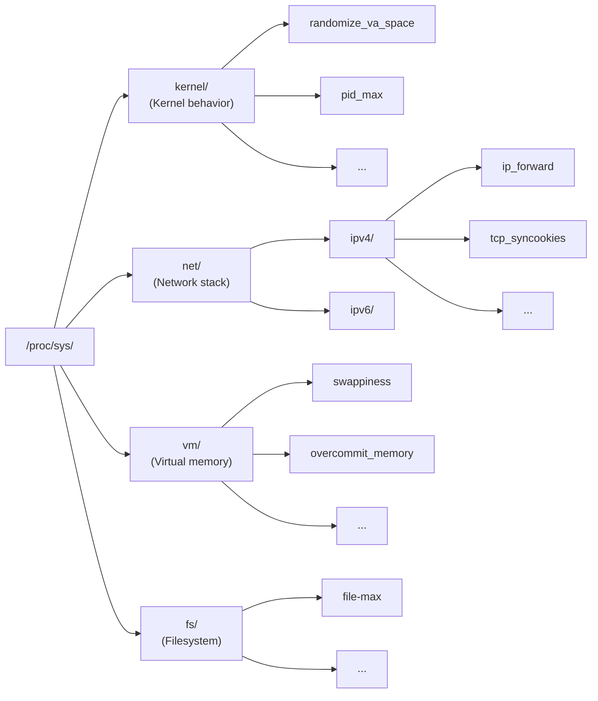

# Module 4.1: Kernel Hardening & sysctl

> **Linux Security** | Complexity: `[MEDIUM]` | Time: 25-30 min, focused on practical kernel controls for production Linux and Kubernetes nodes.

## Prerequisites

Before starting this module, make sure you can already inspect Linux processes, reason about basic packet flow, and explain why security controls must match the role of the host:
- **Required**: [Module 1.1: Kernel & Architecture](/linux/foundations/system-essentials/module-1.1-kernel-architecture/)
- **Required**: [Module 3.1: TCP/IP Essentials](/linux/foundations/networking/module-3.1-tcp-ip-essentials/)
- **Helpful**: Understanding of basic security concepts

## Learning Outcomes

After this module, you will be able to make and defend kernel-hardening decisions using live evidence from the host rather than relying on memorized benchmark lines:
- **Implement** a persistent sysctl baseline that hardens network, memory, and filesystem behavior without breaking required services.
- **Evaluate** CIS benchmark recommendations against real node roles, especially when a rule conflicts with Kubernetes networking requirements.
- **Diagnose** Kubernetes node communication failures caused by kernel hardening settings such as IP forwarding, bridge netfilter, and reverse path filtering.
- **Audit** a running system's kernel security posture with sysctl, `/proc`, AIDE, and package verification evidence.

## Why This Module Matters

On October 21, 2016, Dyn's managed DNS platform was hit by the Mirai botnet, and the outage rippled into major websites because a network control plane dependency was suddenly unreachable. That incident was not solved by a single sysctl flag, but it is the kind of event that makes kernel hardening practical rather than academic. When hosts accept spoofed routes, answer broadcast probes, keep weak TCP defaults, or expose kernel internals to untrusted processes, they become easier to abuse during the first minutes of an incident, when responders have the least time and the worst visibility.

A Kubernetes platform team sees the same lesson at a smaller scale. A worker node is not just a Linux server running containers; it is also a packet forwarder, a bridge participant, a conntrack consumer, a process scheduler, and a shared memory boundary for workloads from different teams. If a hardening script blindly disables IP forwarding, pods lose cross-node traffic. If the team leaves pointer exposure and unrestricted tracing enabled, a compromised workload gains better reconnaissance inside the node. The financial impact usually shows up as missed SLOs, wasted incident hours, emergency consulting, SLA credits, and delayed releases, even when no public breach headline appears.

This module teaches you to treat sysctl as an operating decision system, not a bag of magic numbers. You will learn why a setting exists, what attack or failure mode it changes, where Kubernetes 1.35+ needs exceptions, and how to verify the result without trusting a compliance scanner blindly. The goal is not to memorize every Linux tunable; the goal is to build the judgment to harden a node, explain the tradeoff, and diagnose the fallout when a kernel-level control changes production behavior.

The practical discipline is to connect three questions every time you touch the kernel: what risk is reduced, what legitimate behavior might change, and what evidence proves the final state. That discipline prevents two common extremes. One team leaves permissive defaults because it fears outages, while another team pastes every benchmark recommendation into production and creates outages in the name of security. Kernel hardening works best in the middle, where controls are strict, exceptions are narrow, and verification is routine.

## sysctl Basics

### The Fortress Control Room

Think of the Linux kernel as a large fortress, and `sysctl` as the control room where you set standing orders for gates, roads, watchtowers, and storage rooms. The default Linux posture is intentionally general purpose because the same kernel might run a laptop, a router, a database server, or a Kubernetes node. Compatibility is useful, but compatibility also means the kernel may accept routing hints, expose diagnostics, or allow runtime behaviors that are convenient during troubleshooting and risky on a hostile network.

Hardening starts by separating a setting from the reason behind it. Setting `net.ipv4.conf.all.accept_redirects = 0` is not a charm against attackers; it tells the host to stop accepting ICMP messages that claim a better route exists through another gateway. Setting `kernel.randomize_va_space = 2` does not fix memory corruption bugs; it makes exploit reliability worse by changing where memory regions appear. A mature operator can read a benchmark recommendation and explain both the protection and the operational cost.

The kernel presents many tunables through `/proc/sys`, and `sysctl` is the friendly front door into that tree. A dotted key such as `net.ipv4.ip_forward` maps to a virtual file at `/proc/sys/net/ipv4/ip_forward`, so the command-line tool and the filesystem view are two ways to inspect the same live kernel state. That dual view matters during incidents because some tools call `sysctl`, while others read `/proc` directly, and you need to recognize that they are reporting one underlying value.



The diagram is deliberately broad because hardening is not limited to the `kernel.*` namespace. Network controls live under `net.*`, filesystem protections live under `fs.*`, memory pressure controls live under `vm.*`, and some container-relevant bridge behavior appears under `net.bridge.*` after the right kernel module is loaded. A hardened baseline is usually a small, reviewed subset from this enormous surface, not the output of `sysctl -a` pasted into a file.

`sysctl -w` is useful for experiments and emergency mitigation because it updates the running kernel immediately. The cost is that the change is volatile, so it disappears at the next reboot unless a configuration file under `/etc/sysctl.d/` or another loaded path declares the same value. That distinction is one of the most common operational failures in hardening work: the team fixes the live incident, reboots during patching, and silently returns to the vulnerable default.

```bash
# View a parameter
sysctl kernel.randomize_va_space
# Or
cat /proc/sys/kernel/randomize_va_space

# View all parameters
sysctl -a

# Set temporarily (lost at reboot)
sudo sysctl -w net.ipv4.ip_forward=0

# Set permanently
echo "net.ipv4.ip_forward = 0" | sudo tee /etc/sysctl.d/99-security.conf
sudo sysctl -p /etc/sysctl.d/99-security.conf

# Reload all sysctl files
sudo sysctl --system
```

Pause and predict: if you run `sudo sysctl -w net.ipv4.tcp_syncookies=1` during an attack and later find no matching line in `/etc/sysctl.d/`, what will a reboot do to your mitigation, and how would you prove the change is now persistent rather than just active in memory?

Use the command sequence as a diagnostic pattern, not just as a setup recipe. First read the current value, then decide whether the running value is wrong for the host role, then change it temporarily only if you understand the blast radius, and finally persist it in a named file that future operators can audit. That order leaves a trail of evidence and avoids the false confidence that comes from applying a command without checking whether the kernel accepted it.

## Network Hardening

### IP Forwarding

Network hardening is where sysctl work most often collides with platform reality. A conventional server should not route packets between interfaces because that behavior can turn a compromised host into a pivot point. A Kubernetes worker, however, routinely handles packets that originate in pods and leave through host interfaces, so a blanket rule that disables forwarding can break the very traffic the node exists to carry.

The right question is not whether IP forwarding is good or bad. The right question is whether this host is intentionally acting as a router, and whether firewall policy, CNI behavior, and observability match that role. A hardened laptop and a hardened Kubernetes worker can have different values for `net.ipv4.ip_forward`, and both can be correct when the decision is documented and verified.

> **Stop and think**: If you apply a strict CIS baseline that sets `net.ipv4.ip_forward = 0` to a Kubernetes worker node, what specific cluster network traffic will break immediately, and which team would notice first?

```bash
# Should be 0 on non-routers (1 needed for containers/K8s)
sysctl net.ipv4.ip_forward

# Disable (if not needed)
net.ipv4.ip_forward = 0
net.ipv6.conf.all.forwarding = 0

# On Kubernetes nodes, forwarding MUST be enabled
# But should be combined with proper firewall rules
```

For a non-router, forwarding disabled means packets not destined for the host are dropped instead of being relayed onward. That closes an entire class of accidental routing problems and makes network segmentation easier to reason about. For a Kubernetes node, the same drop can isolate pods because the host participates in pod-to-service, pod-to-pod, overlay, bridge, or routed traffic paths depending on the CNI plugin.

The practical review is role-based. A bastion host, CI runner, database server, and developer workstation normally keep forwarding disabled unless a documented network design says otherwise. A Kubernetes worker normally keeps IPv4 forwarding enabled, and then relies on CNI policy, host firewall rules, kube-proxy or replacement dataplanes, and route controls to make that forwarding safe. You are not weakening hardening when you make a justified exception; you are hardening the actual system instead of an imaginary one.

### ICMP Hardening

ICMP is valuable for diagnostics, path discovery, and network control messages, but some ICMP behaviors were designed for friendlier networks than the ones production hosts now inhabit. Broadcast echo handling can help amplification attacks. Redirect acceptance can let a nearby attacker influence routing. Redirect sending can cause a server to participate in route advice it should never provide.

```bash
# Ignore ICMP broadcasts (prevent Smurf attacks)
net.ipv4.icmp_echo_ignore_broadcasts = 1

# Ignore bogus ICMP errors
net.ipv4.icmp_ignore_bogus_error_responses = 1

# Don't accept ICMP redirects (prevent MITM)
net.ipv4.conf.all.accept_redirects = 0
net.ipv4.conf.default.accept_redirects = 0
net.ipv6.conf.all.accept_redirects = 0
net.ipv6.conf.default.accept_redirects = 0

# Don't send ICMP redirects
net.ipv4.conf.all.send_redirects = 0
net.ipv4.conf.default.send_redirects = 0
```

The `all` and `default` keys are easy to misread. The `all` value applies across existing interfaces in a combined way, while `default` influences settings inherited by interfaces created later. Container hosts create and destroy interfaces during normal operation, so setting only a current interface can leave future interfaces with weaker behavior. A baseline should usually configure both the aggregate and the default path, then verify the live per-interface values after the network stack has settled.

Redirects deserve special caution because their legitimate use is narrow on managed hosts. In a simple LAN, a router can tell a client that another router is a better next hop. In a production server subnet, the host should usually learn routes from controlled configuration, DHCP, routing daemons, or cloud metadata, not from unsolicited packet advice. Disabling redirect acceptance makes that trust boundary explicit.

### Source Routing & Spoofing

Source routing lets a sender request a path through the network, which is rarely something a hardened server should honor. Reverse path filtering checks whether the return path for a packet's source address makes sense through the interface where the packet arrived. Together, source route rejection, reverse path filtering, and martian logging reduce the chance that spoofed or strangely routed packets pass unnoticed.

```bash
# Disable source routing (attacker-controlled routing)
net.ipv4.conf.all.accept_source_route = 0
net.ipv4.conf.default.accept_source_route = 0
net.ipv6.conf.all.accept_source_route = 0
net.ipv6.conf.default.accept_source_route = 0

# Enable reverse path filtering (anti-spoofing)
net.ipv4.conf.all.rp_filter = 1
net.ipv4.conf.default.rp_filter = 1

# Log spoofed packets
net.ipv4.conf.all.log_martians = 1
net.ipv4.conf.default.log_martians = 1
```

Reverse path filtering is powerful, but it is not free. Strict filtering can break asymmetric routing, multi-homed servers, certain overlay networks, and environments where packets legitimately enter through one interface and leave through another. That is why a Kubernetes team should validate `rp_filter` against its CNI plugin and routing model rather than blindly copying a workstation rule into a worker-node image.

Before running this in a cluster image pipeline, what output do you expect from each current interface under `/proc/sys/net/ipv4/conf/*/rp_filter`, and how would a multi-homed node change your decision? Thinking through that answer before changing the setting helps you catch designs where strict anti-spoofing is correct on one interface and harmful on another.

Martian logging is a visibility control as much as a prevention control. It can reveal spoofed source addresses, impossible routes, or misconfigured upstream devices, but it can also generate noise under attack or during a network migration. Enable it where logs are collected and reviewed, then make sure the team knows what a normal volume looks like so that a real anomaly is not lost in routine chatter.

### TCP SYN Protection

TCP uses a handshake before a connection is established, and that handshake requires the server to remember half-open state after receiving a SYN. A SYN flood abuses that memory by sending many SYN packets without completing the final ACK. SYN cookies let the server encode enough state into the SYN-ACK sequence number that it can avoid storing every half-open connection during pressure.

```bash
# Enable SYN cookies (prevent SYN flood attacks)
net.ipv4.tcp_syncookies = 1

# Reduce SYN-ACK retries
net.ipv4.tcp_synack_retries = 2

# Reduce orphaned connection timeout
net.ipv4.tcp_fin_timeout = 15

# Limit connection tracking
net.netfilter.nf_conntrack_max = 1000000
```

SYN cookies are not a complete DDoS strategy because bandwidth, application capacity, load balancer behavior, and upstream filtering still matter. They are a kernel-level guardrail that keeps one specific resource exhaustion path from being trivially reliable. The setting is especially relevant on internet-facing hosts and load balancer nodes, but Kubernetes workers can still benefit because node-local services, ingress components, and host networking workloads can be exposed in ways that surprise the platform team.

Connection tracking limits deserve the same capacity-minded review. A high value such as `net.netfilter.nf_conntrack_max = 1000000` can be appropriate for a busy node with enough memory, but it is not a universal trophy number. If the table is too small, legitimate traffic fails under load. If it is too large for the node, memory pressure becomes its own reliability risk. Hardening and sizing meet at this point, so you should pair sysctl review with observed traffic patterns.

## Memory and Filesystem Protection

### ASLR (Address Space Layout Randomization)

Memory protections reduce exploit reliability after a vulnerability already exists. That framing matters because operators sometimes expect ASLR, stack protector, pointer restrictions, or `ptrace` policy to make vulnerable software safe. They do not. They add uncertainty, boundaries, and information hiding so an attacker has fewer stable assumptions while trying to turn a bug into code execution or data theft.

ASLR changes where process memory regions appear, including stacks, heaps, libraries, and memory mappings. If an attacker knows a buffer overflow exists but cannot predict the address of useful code or data, the exploit becomes harder to automate. Full randomization is not magic, but disabling it gives attackers a simpler target and makes older exploit techniques more reliable.

> **Pause and predict**: An attacker discovers a buffer overflow vulnerability in a containerized web server. If `kernel.randomize_va_space` is set to `2`, how does this setting specifically frustrate their attempt to execute a return-to-libc attack?

```bash
# Check current setting
sysctl kernel.randomize_va_space

# Values:
# 0 = Disabled (INSECURE!)
# 1 = Conservative randomization
# 2 = Full randomization (recommended)

# Enable full ASLR
kernel.randomize_va_space = 2
```

Stack protector is related, but it is not a sysctl setting. It is usually a compiler hardening feature that places a canary value near sensitive stack data and checks whether the value changed before returning from a function. That means you audit it differently: sysctl can show ASLR state, while stack protector evidence comes from build flags, binary inspection, distribution defaults, and package provenance.

The operational lesson is to avoid mixing controls into one vague phrase such as "memory hardening is on." ASLR is a runtime kernel behavior. Stack protector is a compile-time binary property. Non-executable memory, control-flow protections, seccomp, and mandatory access control are additional layers with different evidence. A good hardening report names each control, its source of truth, and the failure mode it reduces.

### Memory Protections

`ptrace` is a legitimate debugging mechanism and a dangerous cross-process inspection primitive. Debuggers, tracers, and profilers use it to observe or manipulate another process, but the same capability can reveal secrets in memory or alter execution. In shared environments, the question becomes whether one workload should ever be able to inspect another workload's process state just because the Linux permission model would otherwise allow it.

```bash
# Restrict ptrace (prevent debugging other processes)
kernel.yama.ptrace_scope = 1
# 0 = Classic ptrace (anyone can trace)
# 1 = Restricted (only parent can trace)
# 2 = Admin only
# 3 = No ptrace

# Restrict access to kernel pointers
kernel.kptr_restrict = 2
# 0 = No restrictions
# 1 = Hide from non-root
# 2 = Hide from everyone

# Restrict dmesg access
kernel.dmesg_restrict = 1

# Restrict perf events
kernel.perf_event_paranoid = 3
```

The tradeoff is troubleshooting friction. A developer who is used to attaching `strace` to a live process may suddenly see "Operation not permitted" after `kernel.yama.ptrace_scope` is raised. That failure is not automatically a bug in the node; it may be the hardening control doing exactly what it was designed to do. Production teams need a documented break-glass workflow for debugging without leaving broad tracing enabled all the time.

Kernel pointer restriction and dmesg restriction are information-disclosure controls. Kernel addresses can help bypass address randomization, and unrestricted kernel logs can reveal device details, memory addresses, or security-relevant errors to users who do not need them. The best analogy is a building directory: it is not the same as a door key, but it helps an intruder plan where to go next.

Performance event restrictions create another tension. Profiling tools are valuable for latency and CPU analysis, especially on Kubernetes nodes where noisy workloads can hurt neighbors. At the same time, low-level performance events can leak information across boundaries on some systems. Treat `kernel.perf_event_paranoid` as a policy decision that should be paired with approved profiling workflows, not as a random number copied from a benchmark.

### Disable Magic SysRq

Magic SysRq exists for recovery and debugging. It can sync disks, remount filesystems, dump state, or trigger kernel actions from a keyboard sequence or proc interface, depending on configuration. On a lab machine, that can be useful. On a production server with physical or console access concerns, broad SysRq access can become an emergency control path that bypasses normal operational checks.

```bash
# SysRq key allows keyboard-triggered kernel commands
# Useful for debugging, dangerous if physical access
kernel.sysrq = 0
# 0 = Disabled
# 1 = All functions enabled
# See Documentation/admin-guide/sysrq.rst for bitmask values
```

Disabling SysRq is straightforward when the team has other recovery options, such as out-of-band management, serial console access with audit trails, rescue images, and tested reboot procedures. If a specialized environment depends on particular SysRq functions, use the documented bitmask rather than enabling every function casually. The important part is to make the recovery path intentional, reviewed, and visible to operators.

### Filesystem Security

Shared writable directories create classic link attacks. A malicious user can place a symlink or hardlink in a sticky directory such as `/tmp` and hope that a privileged process follows it while writing, changing ownership, or truncating data. Filesystem protected link controls make those attacks harder by adding ownership and directory checks before the kernel allows risky link traversal.

> **Stop and think**: In a shared temporary directory like `/tmp`, how do `fs.protected_symlinks` and `fs.protected_hardlinks` prevent a malicious user from tricking a privileged process into overwriting critical system files?

```bash
# Protect hardlinks and symlinks
fs.protected_hardlinks = 1
fs.protected_symlinks = 1

# Protect FIFOs and regular files in sticky directories
fs.protected_fifos = 2
fs.protected_regular = 2

# Increase file descriptor limit
fs.file-max = 2097152
```

These filesystem controls are usually low-friction on modern distributions because they target behavior that well-written applications should not depend on. The exceptions tend to be older scripts, unusual package installers, or software that performs unsafe temporary-file handling. If a legacy workload breaks after enabling the protections, the fix should usually be to repair the workload's file handling rather than to remove the kernel guard for the whole host.

`fs.file-max` is different because it is primarily a capacity limit. Raising it can prevent file descriptor exhaustion on busy nodes, but it does not automatically harden the system. Include it in the same review only when the node's workload profile justifies the setting, and remember that per-process limits, service manager limits, and application pooling behavior can still cap effective file usage even when the kernel-wide maximum is high.

## System Integrity Verification

Runtime kernel settings are only part of the story. A node can have excellent sysctl values and still be compromised if important binaries, configuration files, or package-owned paths have changed unexpectedly. Integrity verification tools give you a second line of evidence: not "what does the kernel allow right now," but "does the filesystem still match a known-good baseline or package database?"

Beyond runtime kernel settings, you need to verify that system files haven't been tampered with. AIDE (Advanced Intrusion Detection Environment) and `rpm -V` detect unauthorized changes to critical files.

### AIDE (Advanced Intrusion Detection Environment)

AIDE creates a database of file checksums, permissions, and timestamps, then compares the current state against that baseline. The baseline is only meaningful if you create it when the system is trusted, store it carefully, and update it after legitimate changes through a controlled process. If you initialize AIDE after an attacker has modified the system, you have merely taught the tool to trust the wrong state.

```bash
# Install AIDE
sudo apt install -y aide      # Debian/Ubuntu
sudo dnf install -y aide       # RHEL/Rocky

# Initialize the database (takes a few minutes — scans all configured paths)
sudo aideinit                  # Debian/Ubuntu
sudo aide --init               # RHEL/Rocky

# The new database is created at /var/lib/aide/aide.db.new
# Move it into place as the reference baseline
sudo cp /var/lib/aide/aide.db.new /var/lib/aide/aide.db

# Check system integrity against the baseline
sudo aide --check
# Output shows any files that changed: added, removed, or modified

# After legitimate changes (patching, config updates), update the baseline
sudo aide --update
sudo cp /var/lib/aide/aide.db.new /var/lib/aide/aide.db
```

AIDE output requires judgment because not every change is malicious. Package updates, certificate rotations, log policy changes, and administrator edits can all produce differences. The operational pattern is to compare AIDE findings with change records, package manager history, deployment logs, and incident timelines. A suspicious binary change with no corresponding package update is very different from an expected configuration change during a planned maintenance window.

### Package Verification with rpm -V

On RPM-based systems (RHEL, Rocky, Fedora), you can verify installed packages against their original checksums. This is especially useful when you suspect a package-owned binary or library changed, because the package database gives you a quick comparison point. It is not a full incident-response platform, but it can help you decide whether to isolate a host, reinstall a package, or collect deeper forensic evidence.

```bash
# Verify a specific package
rpm -V openssh-server
# No output = everything matches
# Output shows what changed:
#   S = file Size differs
#   5 = MD5 checksum differs
#   T = modification Time differs
#   c = config file

# Verify ALL installed packages (takes time)
rpm -Va

# Example output:
# S.5....T.  c /etc/ssh/sshd_config    <- config was modified (expected)
# ..5....T.    /usr/bin/ssh             <- binary changed (suspicious!)
```

> **Exam tip**: AIDE questions on the LFCS typically involve initializing a baseline and running a check. Remember the workflow: `aide --init`, move the database, then `aide --check`. On RPM systems, `rpm -V` is a quick way to verify individual packages.

The strongest hardening programs connect these checks to response playbooks. If AIDE reports a modified SSH binary and `rpm -V` confirms a checksum mismatch, the team should not merely restore a file and move on. They should preserve evidence, rotate relevant credentials, inspect lateral movement paths, and rebuild the node from trusted artifacts when compromise cannot be ruled out. Kernel hardening reduces attack paths; integrity verification helps you notice when a path may already have been used.

## Kubernetes Node Hardening

### Required for Kubernetes

Kubernetes changes the hardening conversation because the Linux host is part of the cluster dataplane. A worker node forwards pod traffic, handles bridge or virtual interface behavior, participates in service routing, and consumes conntrack entries under load. A baseline that is correct for a standalone server can be wrong for a node, so you must evaluate each control against the node role before treating a scanner failure as a defect.

When you use Kubernetes commands in this curriculum, define the shortcut once with `alias k=kubectl`; the examples in this module focus on host-level Linux controls, but the project convention matters when you later validate Kubernetes 1.35+ node behavior with `k`. The alias is not a security feature. It is an operational habit that keeps exam and lab commands concise while making it clear that Kubernetes validation is separate from sysctl inspection.

```bash
# These MUST be enabled for Kubernetes to work

# IP forwarding (for pod networking)
net.ipv4.ip_forward = 1

# Bridge netfilter (for iptables on bridges)
net.bridge.bridge-nf-call-iptables = 1
net.bridge.bridge-nf-call-ip6tables = 1

# Load br_netfilter module first
modprobe br_netfilter
```

Bridge netfilter settings are a good example of dependency order. If the `br_netfilter` module is not loaded, the corresponding sysctl keys may not exist yet, and a configuration reload can appear to fail or skip the setting. A node bootstrap process should load required modules before applying the sysctl file, then verify that the expected keys exist and hold the intended values.

### Recommended for Kubernetes Nodes

The best Kubernetes baseline is conservative where the node does not need legacy trust and explicit where the node does need routing behavior. Disable redirects and source routing, enable SYN cookies, protect filesystem links, restrict kernel information exposure, and keep the pod-network requirements that the CNI expects. That combination is more useful than simply labeling a benchmark as passed or failed.

```bash
# /etc/sysctl.d/99-kubernetes-hardening.conf

# Network security (compatible with K8s)
net.ipv4.conf.all.send_redirects = 0
net.ipv4.conf.default.send_redirects = 0
net.ipv4.conf.all.accept_source_route = 0
net.ipv4.conf.default.accept_source_route = 0
net.ipv4.conf.all.log_martians = 1
net.ipv4.tcp_syncookies = 1

# Memory protection
kernel.randomize_va_space = 2
kernel.yama.ptrace_scope = 1
kernel.kptr_restrict = 1
kernel.dmesg_restrict = 1

# Filesystem protection
fs.protected_hardlinks = 1
fs.protected_symlinks = 1

# Connection tracking for high pod counts
net.netfilter.nf_conntrack_max = 1000000
```

Notice that `kernel.kptr_restrict = 1` appears here rather than the stricter value shown earlier. That can be a defensible Kubernetes choice when privileged node diagnostics need root-only visibility while ordinary users and workloads remain restricted. The point is not that one value is universally better; the point is that production hardening often uses a stricter default for general servers and a carefully justified exception for platform operations.

### CIS Benchmark Compliance

CIS benchmark rules are valuable because they make common hardening expectations explicit, measurable, and reviewable. They are not a substitute for architecture knowledge. Some rules include phrases such as "unless routing is required," and a Kubernetes worker is exactly the kind of host where routing may be required. Your job is to document that exception, keep compensating controls in place, and verify the final risk posture.

```bash
# Key CIS Benchmark sysctl requirements:

# 3.1.1 - Disable IP forwarding (unless routing needed)
# 3.1.2 - Disable packet redirect sending
# 3.2.1 - Disable source routed packets
# 3.2.2 - Disable ICMP redirects
# 3.2.3 - Disable secure ICMP redirects
# 3.2.4 - Log suspicious packets
# 3.2.7 - Enable reverse path filtering
# 3.2.8 - Enable TCP SYN cookies
# 3.2.9 - Disable IPv6 router advertisements

# Verify compliance
grep -r "." /proc/sys/net/ipv4/conf/*/accept_redirects
```

Which approach would you choose here and why: forcing every CIS value exactly as written, or creating a node-role exception file that preserves Kubernetes forwarding while enforcing redirect, source-routing, SYN, memory, and filesystem protections? A senior reviewer will expect you to defend the choice with traffic flow evidence, not with a vague statement that Kubernetes is special.

Compliance review should end with a machine-readable baseline and a human-readable rationale. The machine-readable baseline gives automation a source of truth. The rationale explains why a node violates a generic rule, which compensating controls exist, and how the team will detect drift. That is the difference between hardening as a one-time script and hardening as an operating practice.

## Applying sysctl Settings

### Persistent Configuration

Persistent configuration is where hardening becomes reproducible. A running value proves only that the current kernel has a setting at this moment. A file under `/etc/sysctl.d/` proves that the team has declared an intended value that boot and reload processes can apply again. The file name should communicate ownership and precedence, such as `99-hardening.conf` for a late security baseline that overrides distribution defaults.

```bash
# Create configuration file
cat <<EOF | sudo tee /etc/sysctl.d/99-hardening.conf
# Network hardening
net.ipv4.conf.all.send_redirects = 0
net.ipv4.conf.default.send_redirects = 0
net.ipv4.conf.all.accept_redirects = 0
net.ipv4.conf.default.accept_redirects = 0
net.ipv4.conf.all.accept_source_route = 0
net.ipv4.conf.default.accept_source_route = 0
net.ipv4.conf.all.log_martians = 1
net.ipv4.tcp_syncookies = 1

# Memory protection
kernel.randomize_va_space = 2
kernel.yama.ptrace_scope = 1
kernel.kptr_restrict = 1

# Filesystem
fs.protected_hardlinks = 1
fs.protected_symlinks = 1
EOF

# Apply
sudo sysctl --system

# Verify
sysctl kernel.randomize_va_space
```

The apply step should be paired with verification because configuration files can contain unknown keys, module-dependent keys, syntax errors, or values overwritten later by another file. Treat `sudo sysctl --system` as a reload request, not as proof of final state. The proof is the value read back from the running kernel and, ideally, an automated audit that checks every setting your baseline claims to manage.

### Loading Order

Loading order explains why two correct-looking files can produce a surprising final value. Later files override earlier files, and distribution-provided paths can interact with local administrator paths. If a baseline works during manual testing but changes after package updates or image rebuilds, inspect the full set of sysctl files and verify which declaration wins.

```
/run/sysctl.d/*.conf
/etc/sysctl.d/*.conf
/usr/local/lib/sysctl.d/*.conf
/usr/lib/sysctl.d/*.conf
/lib/sysctl.d/*.conf
/etc/sysctl.conf

(Later files override earlier ones)
```

The safest operational pattern is to keep your security baseline small, named, version-controlled, and reviewed. Avoid scattering related settings across many files because that makes precedence and ownership harder to understand. If a platform team needs a Kubernetes exception, place it deliberately in the same baseline or in a clearly named node-role file, then test the final state after all configuration layers have loaded.

## Patterns & Anti-Patterns

Pattern one is role-based baselining. Start with a small set of controls that apply to every Linux host, then layer exceptions for routers, Kubernetes workers, load balancers, and specialized appliances. This works because sysctl settings express kernel behavior, and kernel behavior must match the job the host performs. It also scales well because reviewers can ask "which role owns this exception?" instead of arguing about every host from scratch.

Pattern two is verify-after-apply automation. Every baseline should have a companion audit that reads live values from `sysctl` or `/proc`, reports pass or fail, and can be run after boot, image build, patching, and incident mitigation. This works because many sysctl mistakes are silent until a reboot or interface creation event changes the state. The scaling concern is noise, so the audit should check the settings the team actually owns rather than dumping thousands of kernel parameters.

Pattern three is exception documentation tied to compensating controls. Kubernetes nodes may need IP forwarding, high conntrack capacity, and bridge netfilter behavior, while ordinary servers should not. A documented exception should name the reason, the owner, the validation command, and the control that limits the added risk. That turns "we failed CIS" into "we intentionally diverged from a generic rule because this node routes pod traffic, and here is how we constrain it."

Anti-pattern one is compliance-copy hardening. Teams fall into it because scanner output feels objective and scripts are easy to run. The failure appears later when a node loses pod networking, a debugging workflow breaks during an outage, or a setting never survived reboot. The better alternative is to treat benchmarks as review inputs, then produce a role-specific baseline with verification evidence.

Anti-pattern two is emergency-only sysctl work. During an attack, an operator changes a live value with `sysctl -w`, the immediate symptom improves, and the team forgets to persist the fix. The next reboot quietly removes the mitigation. The better alternative is to pair every emergency runtime change with a follow-up file change, a reload, a read-back check, and an incident note explaining why the value changed.

Anti-pattern three is broad diagnostic exposure for convenience. Leaving unrestricted `ptrace`, kernel pointer visibility, or dmesg access makes troubleshooting easier for trusted administrators, but it also gives compromised workloads more information. The better alternative is to restrict the default posture and maintain an approved break-glass path for deeper debugging. That path can include temporary access, audit logging, and restoration checks after the diagnostic window closes.

## Decision Framework

Start each sysctl decision with the host role. If the host is a workstation, database server, CI runner, or application server, assume it should not forward packets, accept redirects, accept source routes, or expose kernel diagnostics broadly. If the host is a Kubernetes 1.35+ worker, load balancer, router, or network appliance, identify the traffic path that requires different behavior before changing a value. Role first prevents both under-hardening and accidental outages.

Next, identify the failure mode the setting addresses. Redirect controls address route manipulation. SYN cookies address half-open TCP state exhaustion. ASLR and pointer restrictions address exploit reliability and information disclosure. Filesystem link protections address unsafe shared-directory behavior. If you cannot describe the failure mode in one or two sentences, you are not ready to declare the setting mandatory.

Then check compatibility and evidence. Some values can be applied broadly with little risk, such as protected symlinks on modern systems. Others interact with routing topology, CNI plugins, debugging workflows, or kernel modules. Evidence can include `/proc` reads, CNI documentation, node traffic tests, package verification, and audit output. The decision should be supported by observed behavior, not just by a benchmark line.

After compatibility, choose persistence and ownership. Temporary `sysctl -w` changes belong in incident notes and should be converted into configuration files if they remain necessary. Persistent files should live in a path and naming scheme that the team understands. Ownership matters because someone must review future changes, update exceptions, and explain why a node role differs from a generic security profile.

Finally, validate the result after a reboot or node replacement. Hardening that works only on a single hand-tuned host does not protect a fleet. For Kubernetes, validate both the Linux values and the cluster behavior that depends on them: pod-to-pod traffic, service routing, ingress behavior, node logs, and expected debugging workflows. A correct sysctl baseline is one that survives lifecycle events and still lets the platform do its job.

A useful review question is whether the decision would still make sense to someone reading the host image six months later. If the answer depends on tribal memory, improve the baseline name, add a comment, or write a short exception note. Hardening decisions age badly when they are invisible, especially in fleets where image rebuilds, kernel updates, CNI upgrades, and new workload patterns change the assumptions under old settings.

## Did You Know?

- **The Linux kernel exposes over 1,000 sysctl parameters** - most are safe defaults for ordinary use, but a much smaller set controls security-sensitive network, memory, filesystem, and diagnostic behavior.
- **ASLR has been enabled by default in mainstream Linux distributions since the mid-2000s** - disabling it with `kernel.randomize_va_space=0` removes an important exploit-reliability barrier.
- **IP forwarding is intentionally disabled on many non-router systems** - enabling it without a routing design and firewall policy can turn a normal server into an unexpected transit point.
- **`sysctl -w` changes runtime state only** - files under `/etc/sysctl.d/` or related systemd-sysctl paths are what make a setting return after reboot.

## Common Mistakes

| Mistake | Why It Happens | How to Fix It |
|---------|----------------|---------------|
| Disabling ASLR | A legacy-compatibility fear gets repeated without evidence, or a troubleshooting change is left behind | Keep `kernel.randomize_va_space=2`, test the specific legacy application, and document any narrow exception |
| Enabling IP forwarding on a workstation | The host inherited a router or Kubernetes baseline even though it does not intentionally route traffic | Set forwarding to `0` on non-routers and review firewall rules for any host that must forward |
| Forgetting persistence | `sysctl -w` fixed the immediate incident, so nobody added the setting to `/etc/sysctl.d/` | Write the value to a named config file, reload with `sysctl --system`, and read the value back |
| Breaking Kubernetes networking | A strict benchmark script disabled forwarding or bridge netfilter behavior required by the CNI | Keep required Kubernetes settings, document the exception, and validate pod-to-pod and service traffic |
| Verifying only one interface | The audit checked `all` but missed `default` or per-interface values created later | Check aggregate, default, and live interface paths under `/proc/sys/net/ipv4/conf/` |
| Treating scanner output as design | The team assumes every benchmark line applies equally to every host role | Evaluate the rule, identify role-specific exceptions, and record compensating controls |
| Leaving diagnostics wide open | Debugging convenience wins over least privilege after an outage | Restrict ptrace, dmesg, perf, and pointer visibility by default, then use a temporary break-glass workflow |

## Quiz

<details><summary>Your team applies a strict CIS script to a Kubernetes worker, and pods on that node can no longer reach pods on other nodes. What do you check first, and why?</summary>

Start with `net.ipv4.ip_forward` because Kubernetes workers commonly need the host kernel to forward pod traffic between virtual and physical network paths. A generic server baseline may set it to `0`, which is sensible for non-routers but harmful for a node that intentionally routes pod traffic. You should also check bridge netfilter settings and whether `br_netfilter` is loaded, because service and policy behavior can depend on bridged traffic passing through netfilter hooks. The reasoning is role-based: the same control can be correct on a workstation and wrong on a Kubernetes worker.

</details>

<details><summary>A scanner flags `kernel.randomize_va_space=0`, and an application owner says ASLR is optional because containers isolate the workload. How do you evaluate that claim?</summary>

Containers do not remove the need for process memory hardening because a vulnerable process can still be exploited inside its own container boundary. ASLR makes return-oriented and return-to-libc style exploitation less reliable by moving memory regions away from predictable addresses. You should set `kernel.randomize_va_space=2` unless there is a specific, tested legacy failure, and that exception should be narrow and documented. The key point is that ASLR reduces exploit reliability after a software bug exists; it is not replaced by container packaging.

</details>

<details><summary>During a SYN flood, you see many incoming SYN packets and few completed handshakes. Which setting do you verify, and what does it change about server state?</summary>

Verify `net.ipv4.tcp_syncookies=1`. Without SYN cookies, the server can allocate state for many half-open connections and exhaust queues or memory while waiting for ACKs that never arrive. With SYN cookies under pressure, the server encodes enough information in the SYN-ACK sequence number to reconstruct state only when a legitimate client completes the handshake. This does not solve upstream bandwidth exhaustion, but it reduces one kernel-level state exhaustion path.

</details>

<details><summary>A developer cannot attach `strace` to a production process after a hardening rollout. Which control is likely involved, and how should the team respond?</summary>

The likely control is `kernel.yama.ptrace_scope`, which restricts which processes can trace other processes. That restriction is valuable because unrestricted tracing can expose secrets in memory or allow process manipulation across workload boundaries. The response should not be to disable the control permanently; the team should use a documented break-glass workflow with temporary access, logging, and restoration checks. This preserves production security while still allowing deeper diagnostics when they are justified.

</details>

<details><summary>An incident responder runs `sudo sysctl -w net.ipv4.tcp_syncookies=1`, but the same weakness returns after the next patch reboot. What failed operationally?</summary>

The responder changed only the live kernel value and did not persist the setting in a sysctl configuration file. Runtime changes made with `sysctl -w` disappear when the kernel boots again and reloads configuration from disk. The correct procedure is to add the value to a reviewed file such as `/etc/sysctl.d/99-hardening.conf`, run `sudo sysctl --system`, and read the value back. The incident record should also explain why the setting changed so future reviewers understand the intent.

</details>

<details><summary>A RHEL node shows `..5....T. /usr/bin/ssh` from `rpm -V`, while AIDE reports the same binary changed. What conclusion is reasonable, and what should happen next?</summary>

That evidence suggests a package-owned binary no longer matches the package database and the integrity baseline, which is suspicious unless a documented package update or approved replacement explains it. The team should treat the host as potentially compromised, preserve evidence, and compare the finding with package manager logs and change records. Reinstalling the package may restore the file, but it does not answer how the change happened. For a high-risk binary such as SSH, rebuilding the node from trusted artifacts is often safer than trying to clean it in place.

</details>

<details><summary>You are asked to evaluate a benchmark rule that disables reverse path filtering exceptions on every interface. What makes this a design decision instead of a simple pass or fail?</summary>

Reverse path filtering blocks packets whose source address does not make sense for the interface where they arrived, which is useful against spoofing. The complication is that asymmetric routing, multi-homed hosts, and some overlay networks can have legitimate traffic patterns that strict filtering rejects. You should inspect the node role, routing table, CNI behavior, and per-interface values before deciding. The final answer should document whether strict filtering is safe everywhere, safe only on selected interfaces, or replaced by another anti-spoofing control.

</details>

## Hands-On Exercise

This exercise has you audit a Linux host, apply a persistent hardening file, test visible effects, and compare your result with a small CIS-style audit. Run it on a disposable lab machine, not on a production node, because network and tracing controls can affect connectivity and debugging. If you adapt the commands for Kubernetes, keep the node-role exceptions from this module in mind before changing forwarding or bridge behavior.

### Setup

You need a Linux system with root access and permission to change sysctl values. A throwaway VM, lab instance, or Killercoda environment is ideal because you can reboot, reload, and inspect without risking shared workloads. Record the original values before changing anything so that you can explain what the hardening file actually changed.

### Task 1: Audit Current Settings

Read the current kernel values and classify each one as acceptable, suspicious, or role-dependent. Your goal is not to pass a script yet; your goal is to build a small evidence set that explains the host's current posture.

```bash
# 1. Check ASLR
sysctl kernel.randomize_va_space

# 2. Check IP forwarding
sysctl net.ipv4.ip_forward
sysctl net.ipv6.conf.all.forwarding

# 3. Check ICMP settings
sysctl net.ipv4.conf.all.accept_redirects
sysctl net.ipv4.conf.all.send_redirects

# 4. Check source routing
sysctl net.ipv4.conf.all.accept_source_route

# 5. Check SYN cookies
sysctl net.ipv4.tcp_syncookies

# 6. Check ptrace restrictions
sysctl kernel.yama.ptrace_scope

# 7. Check filesystem protections
sysctl fs.protected_hardlinks
sysctl fs.protected_symlinks
```

<details><summary>Solution guidance for Task 1</summary>

Expected secure values include ASLR set to `2`, redirects and source routing disabled, SYN cookies enabled, and filesystem link protections enabled. IP forwarding depends on the host role: it should usually be `0` on a normal server and `1` on a Kubernetes worker or another intentional router. If a key is missing, check kernel module dependencies or distribution support rather than assuming the system is safe.

</details>

### Task 2: Create Hardening Config

Create a persistent configuration file and apply it with the system loader. Read the output carefully, because unknown keys or module-dependent settings can appear during reload.

```bash
# 1. Create hardening file
cat <<'EOF' | sudo tee /etc/sysctl.d/99-security-hardening.conf
# Security hardening settings

# Memory protection
kernel.randomize_va_space = 2
kernel.yama.ptrace_scope = 1
kernel.kptr_restrict = 1

# ICMP hardening
net.ipv4.icmp_echo_ignore_broadcasts = 1
net.ipv4.icmp_ignore_bogus_error_responses = 1

# Disable ICMP redirects
net.ipv4.conf.all.accept_redirects = 0
net.ipv4.conf.default.accept_redirects = 0
net.ipv4.conf.all.send_redirects = 0
net.ipv4.conf.default.send_redirects = 0

# Disable source routing
net.ipv4.conf.all.accept_source_route = 0
net.ipv4.conf.default.accept_source_route = 0

# Enable reverse path filtering
net.ipv4.conf.all.rp_filter = 1
net.ipv4.conf.default.rp_filter = 1

# Log suspicious packets
net.ipv4.conf.all.log_martians = 1

# TCP hardening
net.ipv4.tcp_syncookies = 1

# Filesystem protection
fs.protected_hardlinks = 1
fs.protected_symlinks = 1
EOF

# 2. Apply settings
sudo sysctl --system

# 3. Verify
sysctl kernel.randomize_va_space
sysctl net.ipv4.tcp_syncookies
```

<details><summary>Solution guidance for Task 2</summary>

The reload should apply the values from `/etc/sysctl.d/99-security-hardening.conf`, and the read-back commands should show ASLR at `2` and SYN cookies at `1`. If your environment is a Kubernetes worker, review IP forwarding separately before adding any forwarding rule to this file. A clean implementation includes the file, the reload output, and the final read-back evidence.

</details>

### Task 3: Test Impact

Run a few visible checks that connect the settings to behavior. These tests are intentionally simple; they help you see that hardening changes can affect process layout, kernel logs, and debugging permissions.

```bash
# 1. Test ASLR (run multiple times)
cat /proc/self/maps | grep stack
# Address should be different each time

# 2. Check for martian logging
sudo dmesg | grep martian

# 3. Test ptrace restriction (as non-root)
strace -p 1 2>&1 | head -3
# Should fail with permission error
```

<details><summary>Solution guidance for Task 3</summary>

The stack mapping should vary between runs when ASLR is active, although exact formatting differs by distribution. Martian logs may be empty on a quiet lab system, which is not a failure by itself. The `strace` test should fail for an unprivileged user when ptrace restrictions are active, and that failure is useful evidence that the control is affecting cross-process debugging.

</details>

### Task 4: Compare with CIS Benchmark

Create a small audit script that checks representative settings and reports pass or fail. This is not a complete CIS scanner, but it demonstrates how to turn a baseline into repeatable evidence.

```bash
# Create a simple audit script
cat <<'EOF' > /tmp/audit-sysctl.sh
#!/bin/bash
echo "=== CIS Benchmark Sysctl Audit ==="

check() {
    current=$(sysctl -n $1 2>/dev/null)
    if [ "$current" = "$2" ]; then
        echo "[PASS] $1 = $current"
    else
        echo "[FAIL] $1 = $current (expected $2)"
    fi
}

check "kernel.randomize_va_space" "2"
check "net.ipv4.conf.all.accept_redirects" "0"
check "net.ipv4.conf.all.send_redirects" "0"
check "net.ipv4.conf.all.accept_source_route" "0"
check "net.ipv4.tcp_syncookies" "1"
check "fs.protected_hardlinks" "1"
check "fs.protected_symlinks" "1"
EOF

chmod +x /tmp/audit-sysctl.sh
/tmp/audit-sysctl.sh
```

<details><summary>Solution guidance for Task 4</summary>

Each expected value should report pass if the hardening file loaded correctly. If a value fails, read it directly with `sysctl`, inspect other sysctl files for overrides, and confirm whether the value is role-dependent. Do not force a Kubernetes exception into a generic audit without noting why the exception exists.

</details>

### Task 5: Write the Operational Decision

Summarize your baseline in a short note that another operator could review during an incident. Include the host role, the values you changed, any role-dependent exception, and the commands you used to verify the final state. The skill you are practicing is not only applying settings; it is making kernel hardening explainable.

<details><summary>Solution guidance for Task 5</summary>

A good note states whether the host is a normal server or Kubernetes node, names the sysctl file you created, lists the settings that changed, and explains any forwarding decision. It should also include read-back evidence from `sysctl` and the output of the audit script. If the host is a Kubernetes worker, the note should explicitly say why IP forwarding remains enabled and which controls reduce the added risk.

</details>

### Success Criteria

- [ ] Audited current kernel parameters and recorded the original values.
- [ ] Created persistent hardening configuration in `/etc/sysctl.d/`.
- [ ] Verified settings were applied with read-back commands.
- [ ] Explained the purpose and tradeoff of key network, memory, and filesystem parameters.
- [ ] Ran a basic CIS-style compliance check and interpreted any failure.
- [ ] Documented whether Kubernetes node-role exceptions are needed.

## Next Module

Next up: [Module 4.2: AppArmor Profiles](/linux/security/hardening/module-4.2-apparmor-profiles/) shows how mandatory access control constrains what applications can do after the kernel and node baseline are in place.

## Sources

- [Linux Kernel sysctl Documentation](https://www.kernel.org/doc/Documentation/admin-guide/sysctl/)
- [CIS Benchmark for Linux](https://www.cisecurity.org/benchmark/distribution_independent_linux)
- [NSA Linux Hardening Guide](https://media.defense.gov/2020/Aug/18/2002479461/-1/-1/0/HARDENING_YOUR_SYSTEMS.PDF)
- [Red Hat Security Hardening](https://access.redhat.com/documentation/en-us/red_hat_enterprise_linux/8/html/security_hardening/)
- [Linux kernel IP sysctl documentation](https://docs.kernel.org/networking/ip-sysctl.html)
- [Linux kernel Magic SysRq documentation](https://docs.kernel.org/admin-guide/sysrq.html)
- [Linux kernel sysctl admin guide](https://docs.kernel.org/admin-guide/sysctl/index.html)
- [Kubernetes install tools: Linux sysctl bridge prerequisites](https://kubernetes.io/docs/setup/production-environment/tools/kubeadm/install-kubeadm/)
- [Kubernetes networking concepts](https://kubernetes.io/docs/concepts/cluster-administration/networking/)
- [AIDE manual](https://aide.github.io/doc/)
- [Red Hat rpm verify documentation](https://docs.redhat.com/en/documentation/red_hat_enterprise_linux/9/html/managing_software_with_the_dnf_tool/verifying-installed-packages_using-appstream)
