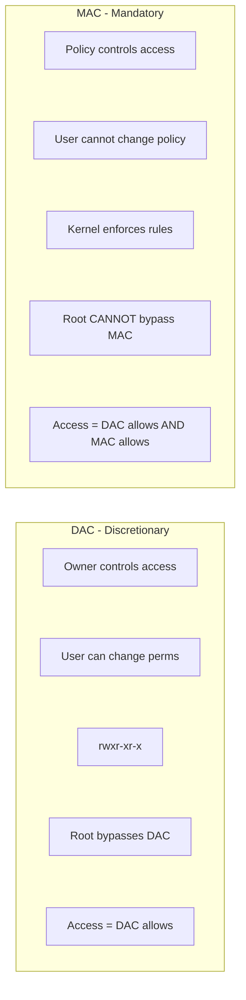
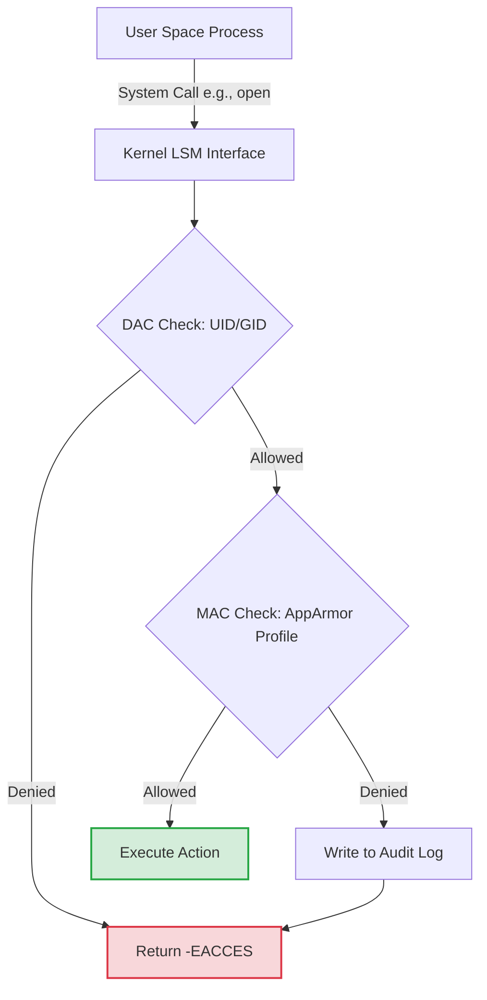

# Module 4.2: AppArmor Profiles

> **Linux Security** | Complexity: `[MEDIUM]` | Time: 30-35 min | Focus: kernel-enforced process confinement for hosts, containers, and Kubernetes workloads.

## Prerequisites

Before starting this module, make sure the following foundations are familiar enough that the AppArmor examples can build on them rather than re-teach them:
- **Required**: [Module 2.3: Capabilities & LSMs](/linux/foundations/container-primitives/module-2.3-capabilities-lsms/)
- **Required**: [Module 1.4: Users & Permissions](/linux/foundations/system-essentials/module-1.4-users-permissions/)
- **Helpful**: Basic understanding of system calls and reverse proxy architecture

## Learning Outcomes

After completing this module, you will be able to perform these tasks under realistic operating constraints:
- **Design** custom Mandatory Access Control policies that severely restrict a compromised container's blast radius.
- **Diagnose** silent application failures by tracing AppArmor kernel security denials through audit logs and `dmesg`.
- **Implement** AppArmor profiles across a Kubernetes 1.35 cluster using node-loaded policies and Pod `securityContext` fields.
- **Evaluate** path-based AppArmor confinement against label-based SELinux enforcement when choosing a Linux hardening strategy.

## Why This Module Matters

In 2019, a major financial institution disclosed a breach affecting more than 100 million customer records after an attacker abused a Server-Side Request Forgery flaw in a web application firewall acting as a reverse proxy. The public enforcement record described an $80 million regulatory penalty, and the civil settlement that followed added another $190 million of direct cost before the internal remediation program, legal work, and reputational damage were counted. The detail that matters for this module is not the brand name; it is the shape of the failure, because a network-facing helper process had enough ambient authority to reach a cloud metadata endpoint and turn one application bug into a credential theft path.

AppArmor would not have made the vulnerable proxy correct, and it would not have replaced input validation, network egress controls, or least-privilege IAM. What it could have done is add a kernel-enforced boundary around the exploited process after the application layer had already failed. A profile that allowed the reverse proxy to read its configuration, serve TLS files, write its logs, and bind its listening port could still deny unexpected file reads, shell execution, metadata probing helpers, mount operations, and ptrace attempts, so the attacker would have needed a second containment bypass instead of receiving the full authority of the process.

That distinction is why Mandatory Access Control belongs in a cloud-native hardening course rather than only in an operating-system security reference. Containers already reduce some blast radius through namespaces, cgroups, capabilities, seccomp, and runtime defaults, but they still execute on the host kernel and still make system calls that the kernel must decide to allow or reject. AppArmor gives you a path-based policy language for that decision, and Kubernetes 1.35 gives you a native way to request those profiles from pods once the profiles exist on the worker nodes.

Throughout this module, treat AppArmor as a seatbelt for software that is already running with other controls. It is not a magic shield, and a sloppy profile can be either too weak to matter or too strict to run the workload, but a carefully designed profile turns "the process was compromised" into a smaller operational problem. The goal is to design profiles with enough precision to be useful, diagnose denials without guessing, implement them consistently in Kubernetes, and evaluate when AppArmor is the right MAC tool compared with SELinux.

The module deliberately uses a reverse proxy, a small shell script, Docker, and Kubernetes because those are the places where AppArmor decisions become visible to platform engineers. You will see the same pattern in each setting: define the expected behavior, attach a profile, observe the kernel decision, and tighten only the rule that the evidence supports. That habit prevents two common extremes, where a team either trusts a default profile without knowing what it blocks or abandons confinement the first time an application exposes a missing rule.

## The Philosophy of Containment: DAC vs MAC

Traditional Linux permissions are discretionary because the owner of a file can usually decide who gets access, and because privileged users can change ownership, permissions, or process identity. That model is useful for normal administration, but it is a poor final boundary after an attacker takes over a process with broad access. If a web service runs as a user that can read a directory, write logs, and execute helper programs, normal DAC checks often cannot tell the difference between legitimate service behavior and attacker behavior happening through the same UID.

Mandatory Access Control changes the question from "does this user own the object?" to "does the system policy allow this process to perform this action on this object?" AppArmor implements that decision through the Linux Security Module interface, so the kernel evaluates a profile in addition to ordinary DAC permissions. A process must pass both gates, which means a compromised process cannot simply `chmod` its way out of the policy or rely on UID 0 to bypass the rule set.

Here is the traditional representation of this security model:



The diagram can make MAC look like a second permission table, but the operational behavior is more interesting. AppArmor attaches a profile to a task, and that profile follows the task as it opens files, maps libraries, binds sockets, and executes child processes. When the process asks the kernel for an operation, the kernel checks the path, requested permission, capability, network family, and execute transition against the compiled policy before returning success or a denial to the application.

Below is the modern architectural flow of how the Linux kernel processes these requests:



The important design habit is to think in terms of expected process behavior rather than expected user identity. A reverse proxy should read a small set of configuration files, TLS material, web roots, shared libraries, resolver data, and runtime files; it should not read `/etc/shadow`, attach to another process, mount filesystems, or launch a general shell. AppArmor lets you encode that expectation close to the kernel, where an application exploit has much less room to negotiate.

This process-centered view also explains why AppArmor can be valuable even when services already run as non-root users. A non-root process may still have access to application secrets, writable cache directories, service account tokens, mounted volumes, or local network sockets that matter during an intrusion. MAC policy lets you describe the subset of those resources the process should use during normal operation, so a compromised process cannot automatically use every permission that its Unix identity, container filesystem, or mounted volume happens to expose.

| Mode | Behavior | Use Case |
|------|----------|----------|
| **Enforce** | Blocks and logs violations | Production environments requiring strict security |
| **Complain** | Logs but allows violations | Testing, development, and building baseline profiles |
| **Unconfined** | No restrictions applied | Disabled state; process relies entirely on DAC |

Those modes are more than administration labels. Enforce mode is the state you want for production controls because it changes system behavior, while complain mode is the state you use to learn what the application really does without breaking it during observation. Unconfined is not a tuning mode; it is a deliberate decision to rely on the other layers only, and that decision should be visible in reviews because it removes one kernel boundary from the workload.

Pause and predict: if DAC allows a process to read `/etc/hostname` but the AppArmor profile has no matching read rule for that path, what result should the application see? The correct mental model is that DAC success only lets the request reach the MAC decision, and AppArmor can still return `EACCES`, so the application experiences a permission error even though ownership and mode bits look correct.

## Interrogating the Kernel

Before writing or debugging a profile, verify what the kernel is actually enforcing on the node in front of you. AppArmor is not a YAML feature, a Docker setting, or a Kubernetes-only knob; it is a kernel LSM, and the profile must be loaded into the host kernel before a runtime can attach it to a process. When a pod fails with a profile error, the fastest path to clarity is often a node-level status check rather than another pass through the manifest.

You can query the active AppArmor state loaded into the kernel using the `aa-status` command. This reads directly from `/sys/kernel/security/apparmor/`, which means it reports what the kernel knows now rather than what a file on disk claims should be loaded. In Kubernetes examples, KubeDojo uses `k` as the shorthand for `kubectl`; define it once with `alias k=kubectl`, then commands such as `k get pods` and `k describe pod` are easier to read during incident response.

```bash
# Check if AppArmor is enabled
sudo aa-status

# Sample output:
# apparmor module is loaded.
# 42 profiles are loaded.
# 38 profiles are in enforce mode.
#    /usr/sbin/cups-browsed
#    /usr/bin/evince
#    docker-default
# 4 profiles are in complain mode.
#    /usr/sbin/rsyslogd
# 12 processes have profiles defined.
# 10 processes are in enforce mode.
# 2 processes are in complain mode.

# Check specific process
ps auxZ | grep nginx
```

That first command tells you whether you are debugging AppArmor at all, how many profiles are loaded, and whether those profiles are enforcing or only observing. The process label command helps you avoid a common false assumption: a profile file can exist in `/etc/apparmor.d/` while the running process is unconfined, or the process can be confined by a runtime-generated profile whose name does not match the file you expected. Good incident handling starts by separating "file exists" from "kernel is enforcing."

Profiles are stored as plain text files on the disk before being compiled by the parser and loaded into the kernel cache. That separation matters because editing a file is not enough; the parser must reload the policy, and existing processes may need to restart or re-exec before the new attachment behavior is visible. On a single host this is easy to remember, but in a cluster it becomes a distribution problem because every eligible node needs the same profile name loaded before pods can depend on it.

```bash
# Profile files
/etc/apparmor.d/           # Main profiles
/etc/apparmor.d/tunables/  # Variables
/etc/apparmor.d/abstractions/  # Reusable includes

# Cache (compiled profiles)
/var/cache/apparmor/
```

A useful war story is the deployment that "worked on two nodes" and failed on the third after a routine rollout. The manifest was identical, the image digest was identical, and the team spent an hour inspecting registry credentials before checking `aa-status` on the failing node. The profile file had been copied by hand during testing but never included in the node bootstrap process, so Kubernetes asked for a `Localhost` profile that the scheduled worker had never loaded.

Before running this in your own environment, what output do you expect if AppArmor is compiled into the kernel but the service has not loaded any profiles? You should expect the module to report as loaded while profile counts are low or zero, which points you toward the profile lifecycle rather than toward kernel support or application permissions.

## Anatomy of an AppArmor Profile

AppArmor profiles are path-based, which means they restrict access based on the absolute path names visible to the process at the time of mediation. That choice makes profiles approachable for operators who think in filesystem layouts, but it also creates responsibilities around globbing, bind mounts, symlinks, and container root filesystems. SELinux takes a different label-based approach, attaching security context to objects and processes, so the right MAC system often depends on the distribution, operational model, and team familiarity.

A typical profile defines the executable it governs, imports common abstractions, and then strictly whitelists permitted paths and capabilities. The profile below is intentionally small enough to read, but it includes the pieces you will see repeatedly: tunables, abstractions, file rules, network rules, capabilities, explicit denies, and execute transitions. Treat it as a vocabulary map before treating it as a production profile, because real workloads need careful observation before you know every path they touch.

```text
#include <tunables/global>

profile my-app /path/to/executable flags=(attach_disconnected) {
  #include <abstractions/base>

  # File access rules
  /etc/myapp/** r,           # Read config
  /var/log/myapp/** rw,      # Read/write logs
  /var/run/myapp.pid w,      # Write PID file

  # Network access
  network inet tcp,          # TCP allowed
  network inet udp,          # UDP allowed

  # Capabilities
  capability net_bind_service,  # Bind ports < 1024

  # Deny rules (explicit)
  deny /etc/shadow r,        # Cannot read shadow

  # Execute other programs
  /usr/bin/ls ix,            # Inherit this profile
  /usr/bin/id px,            # Use /usr/bin/id's profile
}
```

Default-deny policy is the reason this style works. Once a process is confined, an omitted permission is not treated as a harmless gap; it becomes a denial when the process attempts that action. You add rules for what the service needs to perform its legitimate role, then use explicit denies for sensitive areas where you want the profile to remain resistant even if a future maintainer adds an overly broad read glob during troubleshooting.

| Flag | Meaning |
|------|---------|
| `r` | Read data from the file |
| `w` | Write data to the file |
| `a` | Append data only (cannot overwrite existing content) |
| `x` | Execute the file as a new process |
| `m` | Memory map the file as executable (required for shared libraries) |
| `k` | Lock the file |
| `l` | Create a hard link to the file |

The `m` permission is easy to miss because application developers rarely talk about memory-mapping shared libraries during normal feature work. If a binary can be read but its required libraries cannot be mapped executable, the failure can look like a broken package or missing dependency rather than a security denial. That is why generated profiles commonly include library read-map rules and why production profile reviews should include startup paths as well as request-handling paths.

| Mode | Meaning |
|------|---------|
| `ix` | Inherit current profile: The child process runs under the exact same restrictions as the parent. |
| `px` | Switch to target's profile: The child process transitions to its own dedicated profile. If missing, execution fails gracefully. |
| `Px` | Switch to target's profile (enforce): Strict transition. If the target profile is missing, execution is aggressively blocked. |
| `ux` | Unconfined: The child process escapes AppArmor and runs with no MAC restrictions. |
| `Ux` | Unconfined (enforce): Strict unconfined execution. |

Execute modes are where many profiles become either useful or decorative. If a web service can execute `/bin/sh` with an unconfined transition, a remote code execution bug may quickly become an interactive shell with fewer MAC constraints than the original service. If the same service has no rule for shell execution, or only permits tightly scoped helper binaries under inherited confinement, the exploit chain has to stay inside the small behavior budget you allowed.

Because writing out every single file path would be impossible, AppArmor utilizes powerful globbing mechanisms.

```text
/path/to/file     # Exact file
/path/to/dir/     # Directory only
/path/to/dir/*    # Files in directory
/path/to/dir/**   # Files in directory and subdirs
/path/to/dir/file{1,2,3}  # file1, file2, file3
```

Globs are a policy language, not just a convenience feature, so their precision changes the blast radius. A single asterisk usually matches entries directly inside one directory, while a double asterisk reaches recursively into children. If you grant `/var/www/html/* rw,`, a compromised process can write files directly under that directory, but it cannot automatically write `/var/www/html/admin/.htaccess`; changing the rule to `/**` would make that nested path part of the allowed surface.

The everyday analogy is a hotel keycard. A card that opens room 512 does not open every room on the fifth floor, and a card that opens the housekeeping closet does not open the manager's office unless someone encoded that permission. AppArmor path rules should feel the same way: grant the exact rooms the process needs, make recursive access a conscious decision, and assume that every extra hallway becomes part of an attacker's movement plan.

Path-based policy also requires you to understand how the application sees the filesystem. In a container, `/app/config.yaml` may be a projected file, a bind mount, or part of the image layer, while the host path that backs it may look completely different. AppArmor mediates based on the names presented in the relevant namespace and profile attachment context, so profile testing must use the same runtime shape as production. Testing a binary directly on the host can reveal useful library and execution needs, but it does not prove that the containerized path layout is covered.

## Managing the Profile Lifecycle

Managing AppArmor involves compiling plaintext rules into kernel policy, usually with `apparmor_parser`. This lifecycle has three separate states that teams often blur together: a profile can be present on disk, loaded into the kernel, and attached to a running process. A reliable rollout handles all three, because a profile file that was never parsed protects nothing, and a parsed profile that no process uses may only provide a false sense of completion.

```bash
# Load a profile (enforce mode)
sudo apparmor_parser -r /etc/apparmor.d/usr.sbin.nginx

# Load in complain mode
sudo apparmor_parser -C /etc/apparmor.d/usr.sbin.nginx

# Remove a profile
sudo apparmor_parser -R /etc/apparmor.d/usr.sbin.nginx

# Reload all profiles
sudo systemctl reload apparmor
```

The safest profile-building sequence is observe, constrain, test, and then enforce. Start in complain mode when the service behavior is not fully mapped, drive realistic traffic through the service, review the logs, and add only the rules that match legitimate behavior. Moving straight from an empty profile to enforce mode can be appropriate for a small lab script, but it is risky for a production workload that opens dynamic files, resolves names, rotates logs, or spawns helper processes.

During incident response or application debugging, you may need to temporarily toggle the enforcement mode of a running profile to see if it resolves a service outage. That does not mean complain mode is a permanent fix; it is a diagnostic lever that restores service while preserving evidence about what would have been denied. Write down when you used it, collect the audit lines, and return to enforce mode after the missing rule is understood.

```bash
# Set to complain mode
sudo aa-complain /path/to/profile
# or
sudo aa-complain /usr/sbin/nginx

# Set to enforce mode
sudo aa-enforce /path/to/profile
# or
sudo aa-enforce /usr/sbin/nginx

# Disable profile (unconfined)
sudo aa-disable /path/to/profile
```

Writing profiles from scratch is error-prone because the application may touch resolver configuration, certificate stores, locale data, shared libraries, PID files, sockets, and temporary directories before it ever reaches your business logic. The standard workflow is to use generation tools that monitor a process, log the actions it attempts, and suggest rules based on those observations. The tool still needs human judgment, because "the process tried it once" is not the same as "the process should always be allowed to do it."

```bash
# Generate profile for a program
sudo aa-genprof /usr/bin/myapp

# Interactive: Run the program, aa-genprof logs events
# Then mark events as allowed/denied to build profile

# Auto-generate from logs
sudo aa-logprof
```

Which approach would you choose here and why: a hand-written deny-first profile for a tiny backup helper, or complain-mode generation for a complex ingress controller? The principled answer is to hand-write when the behavior is small and stable, but to observe when the service has many dependencies, because generated suggestions reduce accidental outages while still requiring you to reject permissions that represent exploit behavior rather than business behavior.

## Real-World Scenario: Securing the Nginx Ingress

Return to the reverse proxy scenario and design for the process role rather than for the incident headline. Nginx needs to bind ports, read its configuration, read TLS certificates, read web content, write logs, create runtime files, use shared libraries, and keep worker processes under the same confinement. It does not need to read password databases, inspect arbitrary process memory, mount filesystems, or execute a shell because a request body contained a clever payload.

```text
#include <tunables/global>

profile nginx /usr/sbin/nginx flags=(attach_disconnected,mediate_deleted) {
  #include <abstractions/base>
  #include <abstractions/nameservice>

  # Capabilities
  capability dac_override,
  capability net_bind_service,
  capability setgid,
  capability setuid,

  # Network
  network inet tcp,
  network inet6 tcp,

  # Binary and libraries
  /usr/sbin/nginx mr,
  /lib/** mr,
  /usr/lib/** mr,

  # Configuration
  /etc/nginx/** r,
  /etc/ssl/** r,

  # Web content
  /var/www/** r,
  /srv/www/** r,

  # Logs
  /var/log/nginx/** rw,

  # Runtime
  /run/nginx.pid rw,
  /run/nginx/ rw,

  # Temp files
  /tmp/** rw,
  /var/lib/nginx/** rw,

  # Workers
  /usr/sbin/nginx ix,

  # Deny sensitive files
  deny /etc/shadow r,
  deny /etc/gshadow r,
}
```

Notice the explicit `deny` rules at the bottom. AppArmor is already default-deny, but explicit denies communicate intent and can override an overly broad whitelist that a future maintainer adds during a rushed fix. In a profile review, those deny lines are signposts saying that credential databases must remain out of scope even if the service is later allowed broader read access for a legitimate content directory.

There is a tradeoff hiding in this example. The profile allows recursive reads of `/var/www/**` because a static site can have nested directories, but it allows writes only where runtime behavior requires writes. If the application later grows an upload feature, the right response is not to make the entire content root writable; create a specific upload path, constrain it, and make the application architecture match the confinement boundary.

A practical production team once discovered this distinction during a certificate rotation incident. The profile allowed `/etc/ssl/** r,` but the automation wrote a temporary file under a different staging directory before atomically moving it into place, so Nginx reloads failed only during rotation. The fix was not to unconfine Nginx; the fix was to decide whether Nginx should read the staging path, then encode that path explicitly or change the rotation workflow so runtime reads stayed inside the approved certificate directory.

## AppArmor in Containerized Environments

Applying AppArmor to containers requires understanding how the container runtime interacts with the host kernel. Docker, containerd, and CRI-O do not create a separate AppArmor universe inside each container; they ask the host kernel to attach an existing or runtime-provided profile to the container process. That means profile support depends on the node operating system, kernel configuration, runtime integration, and the profile name requested at container creation time.

When you launch a standard Docker container on a host with AppArmor enabled, the Docker daemon automatically applies a built-in profile named `docker-default`. That profile blocks a useful set of high-risk behaviors such as many mount operations and process tracing patterns, which is why even simple containers often have more MAC protection than their command line suggests. The default is not tailored to your application, but it is a valuable floor compared with running unconfined.

```bash
# Check container's AppArmor profile
docker inspect <container> | jq '.[0].AppArmorProfile'
# Output: "docker-default"

# Run with custom profile
docker run --security-opt apparmor=my-profile nginx

# Run without AppArmor (dangerous!)
docker run --security-opt apparmor=unconfined nginx
```

If you need to define a custom profile for a highly restricted microservice, it typically looks like this:

```text
#include <tunables/global>

profile my-container-profile flags=(attach_disconnected,mediate_deleted) {
  #include <abstractions/base>

  network inet tcp,
  network inet udp,

  # Container filesystem
  / r,
  /** r,
  /app/** rw,
  /tmp/** rw,

  # Deny dangerous operations
  deny mount,
  deny umount,
  deny ptrace,
  deny /proc/*/mem rw,
  deny /proc/sysrq-trigger rw,

  # Capabilities
  capability chown,
  capability dac_override,
  capability setuid,
  capability setgid,
}
```

This container example is intentionally more permissive for reads than the Nginx host profile because container filesystems often include application dependencies in many paths. That does not make broad reads free; it means you should pair AppArmor with read-only root filesystems, dropped Linux capabilities, seccomp, non-root users, and narrow writable mounts. Defense in depth works when each layer removes a different class of mistake rather than when one layer tries to express the entire security model alone.

In Kubernetes 1.35, AppArmor is integrated natively via the `securityContext.appArmorProfile` field, replacing the older beta annotation style. The API field tells the kubelet which profile source to request from the runtime, but it does not distribute local profiles to nodes. If a pod requests a `Localhost` profile, every node that might run the pod must already have that profile loaded into the kernel under the requested name.

```yaml
apiVersion: v1
kind: Pod
metadata:
  name: my-pod
spec:
  containers:
  - name: my-container
    image: nginx
    securityContext:
      appArmorProfile:
        type: Localhost
        localhostProfile: my-profile
```

A common snippet you will see in production YAML manifests looks exactly like this:

```yaml
    securityContext:
      appArmorProfile:
        type: Localhost
        localhostProfile: <profile-name>
```

| Type | Meaning |
|-------|---------|
| `RuntimeDefault` | Uses the underlying Container Runtime's default, such as `docker-default` or a containerd equivalent. |
| `Localhost` | Informs the kubelet to request a specific profile named in `localhostProfile` previously loaded into the host node's kernel. |
| `Unconfined` | Strips all MAC protection. Highly dangerous; essentially runs the container with raw DAC limitations. |

`RuntimeDefault` is the best baseline when the team has not built a workload-specific policy yet, because it preserves the runtime's general hardening without requiring node-local profile distribution. `Localhost` is the right choice when you have a tested custom profile and a deployment mechanism that keeps nodes consistent. `Unconfined` should require a written exception, because it removes MAC enforcement and usually signals that the team is working around a broken profile instead of diagnosing it.

Because Kubernetes `securityContext` instructs the kubelet to apply a `Localhost` profile, that exact profile must already exist and be compiled in the kernel of the worker node where the pod lands.

```bash
# Profile must exist on the node at /etc/apparmor.d/
# Load it:
sudo apparmor_parser -r /etc/apparmor.d/my-profile

# Or use DaemonSet to deploy profiles to all nodes
```

Here is how you apply it to a restricted Nginx deployment:

```yaml
apiVersion: v1
kind: Pod
metadata:
  name: restricted-nginx
spec:
  containers:
  - name: nginx
    image: nginx:alpine
    ports:
    - containerPort: 80
    securityContext:
      appArmorProfile:
        type: Localhost
        localhostProfile: k8s-nginx
```

Pause and predict: if you deploy the `restricted-nginx` pod above, but the `k8s-nginx` profile has not been loaded via `apparmor_parser` on the scheduled node, what happens to the pod? The kubelet asks the runtime to create the container with that profile, the runtime asks the kernel to attach a profile name the kernel does not know, and container creation fails until the profile exists on that node; `k describe pod restricted-nginx` is where you would expect to see the scheduling and container creation symptoms.

The most reliable cluster pattern is to treat profiles as node configuration, not as an incidental side effect of application deployment. Some teams bake profiles into immutable node images, some deploy them through privileged node agents, and some use distribution-specific security profile operators. The key is that application rollout should not be the first time a worker learns about the profile name, because a rolling deployment can otherwise become a scheduling lottery.

When validating a Kubernetes rollout, check both the API object and the node state. The pod spec can prove that the workload requested `Localhost`, but only the node can prove that the named policy is loaded and attachable. A good release runbook therefore includes a preflight that confirms profile presence before the deployment update, then a workload check that confirms the pod is not stuck during container creation. This keeps AppArmor errors out of the vague bucket of "Kubernetes problems" and ties them to the exact node-level prerequisite.

```bash
# Define the kubectl shorthand used in KubeDojo examples
alias k=kubectl

# Confirm the pod requests the expected AppArmor profile
k get pod restricted-nginx -o yaml | grep -A4 appArmorProfile
```

After applying a manifest, inspect the pod events instead of relying only on phase. A pod can remain pending or fail container creation for many reasons, and profile attachment failures are usually visible in the event stream before application logs exist. That matters because there may be no container to `exec` into and no workload log to tail when the runtime refuses to start the process.

```bash
# Inspect profile attachment errors after a rollout
k describe pod restricted-nginx
```

## Auditing, Debugging, and Incident Response

When an application behaves erratically, such as failing to start, silently dropping uploads, or crashing when writing temporary files, AppArmor should be on your shortlist after ordinary application logs and DAC permissions. The failure mode is often deceptive because the application receives a normal permission error from the kernel, while the root cause lives in the audit stream. A disciplined debugging workflow follows the denied operation, requested mask, profile name, process command, and path rather than guessing which rule "looks missing."

```bash
# Check dmesg
sudo dmesg | grep -i apparmor

# Check audit log
sudo cat /var/log/audit/audit.log | grep apparmor

# Check syslog
sudo grep apparmor /var/log/syslog

# Sample denial:
# audit: type=1400 audit(...): apparmor="DENIED" operation="open"
#   profile="docker-default" name="/etc/shadow" pid=1234
#   comm="cat" requested_mask="r" denied_mask="r"
```

If the `auditd` daemon is not installed, the kernel falls back to the standard kernel ring buffer and syslog, which you can query precisely like this:

```bash
sudo dmesg | grep -i apparmor
sudo grep apparmor /var/log/syslog
```

The audit line is a compact incident report. `profile` tells you which policy made the decision, `operation` tells you which kernel action was attempted, `name` tells you the mediated path, `comm` identifies the process name, and `requested_mask` tells you the permission the application wanted. If the path is surprising, ask whether the application really needs it; if the permission is surprising, ask whether the profile is preventing exploit behavior rather than legitimate behavior.

You must learn to map application-level symptoms to kernel-level MAC denials:

```bash
# Issue: Container can't write to /app/data
# Check: Profile allows /app/** but not write

# Issue: Network connection refused
# Check: Profile has network rules

# Issue: Exec fails
# Check: Profile has execute permission for binary

# Generate missing rules from logs
sudo aa-logprof
```

If you identify a missing rule via the logs, you do not necessarily have to write it manually. You can trigger the log profiling tool to parse the recent denials and interactively suggest rules to append to your profile. Accept suggestions that match the service role, reject suggestions that represent exploratory attacker behavior or overly broad access, and reload the profile after edits so the kernel receives the updated policy.

```bash
sudo aa-logprof
```

If you are dealing with an urgent production outage and cannot immediately determine which rule is missing, you can drop the profile into complain mode to restore service while you analyze the logs. This is an availability tactic, not a security conclusion. The right follow-up is to replay the failing path, collect the would-have-denied events, add the narrow rule, reload the profile, and return the workload to enforce mode.

```bash
sudo aa-complain /etc/apparmor.d/my-profile
```

A strong diagnosis compares three sources of truth: the application error, the profile rule, and the kernel denial. If all three agree that `/var/log/test-app.log` needs `w`, the fix is narrow and defensible. If the application says "database connection failed" but the kernel denial says `/bin/sh` execution was blocked, the profile may have stopped a startup script, a migration helper, or an exploit attempt, and you should investigate the control flow before adding execution rights.

During an incident, resist the temptation to paste the largest possible allow rule just because service health is red. A broad rule might restore traffic, but it also destroys the evidence that tells you whether the denied action was legitimate. A better emergency procedure is to switch to complain mode only long enough to collect high-quality events, keep the changed mode visible in the incident timeline, and convert the observed denial into a narrow rule after the service path is understood. This preserves availability without silently turning a containment control into documentation.

Denial triage also benefits from grouping events by profile and process command rather than by path alone. The same path may be touched by the main service, a log rotation helper, a package hook, and a readiness probe, and each caller may deserve a different policy response. If the main service attempts the write, the profile may need a narrow permission; if an unexpected shell attempts it, the profile may be doing exactly what it was designed to do.

## Patterns & Anti-Patterns

Good AppArmor work starts from the application contract and then uses kernel evidence to tighten or correct that contract. The most successful teams do not treat profiles as static files copied from the internet; they version them, test them, ship them through the same review process as deployment manifests, and keep their allowed paths close to the actual runtime topology. That discipline matters most in Kubernetes, where the same YAML can land on many nodes and every node must have a consistent policy state.

| Pattern | When to Use | Why It Works | Scaling Considerations |
|---------|-------------|--------------|------------------------|
| Observe in complain mode, enforce after traffic replay | New or poorly documented services | Captures real dependency paths without breaking startup | Requires representative tests and log retention |
| Keep writable paths few and explicit | Web servers, agents, and batch jobs | Converts compromise into a smaller file-write surface | Needs coordination with application directory layout |
| Distribute profiles as node configuration | Kubernetes `Localhost` profiles | Prevents pod startup failures caused by missing kernel policy | Needs image baking, node automation, or a profile operator |
| Pair AppArmor with seccomp and dropped capabilities | Container workloads with internet exposure | Each control blocks a different escape or abuse path | Requires compatibility testing across runtime upgrades |

The matching anti-patterns are usually born from production pressure. A profile breaks a deployment, someone switches to unconfined to restore service, and the exception becomes permanent because no one captures the denial evidence. Another team allows `/** rw,` for a short migration and forgets to remove it, turning the profile into a checkbox that adds complexity without meaningful containment. Strong review practices catch these shortcuts before they become standard operating procedure.

| Anti-Pattern | What Goes Wrong | Better Alternative |
|--------------|-----------------|--------------------|
| Using `Unconfined` as the default | Removes MAC enforcement and hides policy defects | Start with `RuntimeDefault`, then build custom profiles where risk justifies it |
| Granting broad recursive writes | Lets an exploited process rewrite configuration, content, or secrets | Create dedicated writable directories and keep the rest read-only |
| Loading profiles by hand on select nodes | Pods fail depending on where they schedule | Automate profile distribution and verify with `aa-status` |
| Accepting every `aa-logprof` suggestion | Turns observed attacker behavior into allowed behavior | Review each suggested rule against the service contract |

The pattern underneath all of this is intentional narrowing. You are not trying to make AppArmor express every business rule, and you are not trying to make a profile so tight that normal operations become fragile. You are defining the kernel-level envelope inside which the service is allowed to fail, be exploited, rotate logs, reload certificates, and restart workers without crossing into unrelated host authority.

## Decision Framework

Choosing an AppArmor strategy is a risk and operations decision. A low-risk internal batch job may be well served by `RuntimeDefault` plus dropped capabilities, while an internet-facing reverse proxy that terminates TLS and processes untrusted traffic deserves a custom profile. The decision should account for exploit exposure, node operating system, team skill, deployment automation, and the cost of a false denial during normal service.

| Decision Point | Choose `RuntimeDefault` | Choose Custom `Localhost` AppArmor | Choose SELinux-Focused Hardening |
|----------------|-------------------------|------------------------------------|----------------------------------|
| Distribution | Heterogeneous containers with no app-specific profile yet | Ubuntu or Debian nodes where you can load named profiles reliably | Red Hat family systems with mature label policy tooling |
| Workload Risk | Moderate risk and good runtime defaults | Internet-facing or sensitive service with known behavior | Multi-tenant host policy needing label consistency |
| Operational Cost | Lowest, mostly runtime managed | Medium, requires profile lifecycle automation | Medium to high, requires label and policy expertise |
| Failure Mode | Less precise confinement | Pod startup fails if profile is missing on node | Mislabeling can deny legitimate access broadly |

Use this framework before writing YAML. First ask whether the workload is on an AppArmor-enabled distribution and whether the runtime can attach profiles. Then decide whether the generic runtime profile is enough for the risk. If not, confirm that you can distribute and reload profiles on every node before you update the pod spec; otherwise, a correct manifest will still fail at runtime because the kernel cannot attach a policy it has never seen.

For Kubernetes 1.35 clusters, a practical rule is simple: use `RuntimeDefault` as the baseline, use `Localhost` only when you own the node profile lifecycle, and avoid `Unconfined` unless you have a documented exception with compensating controls. When a team asks for custom AppArmor without node automation, the honest engineering response is to build the distribution path first. Policy that only exists on one engineer's test node is not a cluster control.

The AppArmor-versus-SELinux decision should also consider how your organization debugs failures. AppArmor denials often point at recognizable paths, which can be easier for application teams to reason about during the first month of adoption. SELinux denials often point at labels and types, which can be more powerful across large fleets once the labeling model is understood. Neither approach removes the need for evidence-based policy review, but choosing the model your operators can explain under pressure is part of the security design, not a training afterthought.

## Did You Know?

- **Mainline Kernel Integration:** Linus Torvalds merged AppArmor into the mainline Linux kernel in version 2.6.36 in October 2010, ending a long debate over competing security module approaches.
- **Docker's Silent Shield:** Docker's default AppArmor profile blocks many privileged mount and process-tracing paths, giving ordinary containers a MAC baseline even when users never mention AppArmor directly.
- **High-Performance Parsing:** AppArmor policies are compiled into a deterministic finite automaton, so path mediation can be evaluated quickly in the kernel rather than interpreted as slow text rules.
- **Ubuntu's Adoption Path:** Canonical acquired Immunix in 2005, and Ubuntu later made AppArmor a default MAC system for the distribution family that many Kubernetes labs still use.

## Common Mistakes

The table below is deliberately operational. Each mistake has a symptom, a reason engineers fall into it, and a fix that preserves the containment goal instead of bypassing AppArmor because it became inconvenient.

| Mistake | Why It Happens | How to Fix It |
|---------|----------------|---------------|
| **Profile not loaded on node** | Kubelet throws a `CreateContainerError` because the kernel rejects the unknown profile name. | Use a privileged DaemonSet, node image, or profile operator to sync and `apparmor_parser -r` profiles across all eligible nodes before deploying workloads. |
| **Invalid Kubernetes `securityContext`** | The API server rejects the manifest because `appArmorProfile` is strictly typed in Kubernetes 1.35. | Use the native fields `type: Localhost` and `localhostProfile: name` instead of deprecated beta annotations. |
| **Using `Unconfined` blindly** | Container runs with no MAC protection, often because a profile blocked startup during a rushed rollout. | Use `RuntimeDefault` at minimum, then build a complain-mode profile and fix the denied paths deliberately. |
| **Profile too restrictive at startup** | The application cannot access shared libraries, resolver files, PID paths, or temporary directories. | Observe in complain mode, run realistic startup and traffic tests, then add the narrow rules shown in audit logs. |
| **Not checking denials** | DAC permissions look correct, so the team debugs ownership while the kernel is denying the request. | Search `dmesg`, `/var/log/audit/audit.log`, and syslog for `apparmor="DENIED"` with the exact profile and path. |
| **Hardcoding brittle paths** | Containers mount volumes or rotate files through staging paths that differ across environments. | Use explicit application paths for stable directories and validate mount layout during deployment tests. |
| **Missing execute transitions** | A service receives a request but fails when it tries to spawn a worker, helper, or script. | Add the correct `ix` or `px` transition only for the required binary, and avoid `ux` unless there is a documented exception. |
| **Confusing `*` with `**`** | A rule allows direct children but not nested cache, upload, or content directories. | Use `*` for one directory level and `**` only when recursive access is required by the service contract. |

## Quiz

Use these scenarios to test whether you can connect AppArmor symptoms to design, diagnosis, Kubernetes implementation, and MAC tradeoffs. Each answer explains the reasoning because a correct fix without the mental model is hard to reproduce under incident pressure.

<details>
<summary><b>Question 1: Scenario - The Silent Logger</b><br>You deployed a custom Mandatory Access Control profile for a Node.js microservice. The service starts and handles HTTP traffic, but no application logs appear in `/var/log/nodejs/`. DAC write permissions are correct. What AppArmor rule configuration is likely causing this, and how do you verify?</summary>

The profile probably lacks `w` permission for the logging path, or it allows only read access such as `/var/log/nodejs/** r,`. AppArmor is default-deny once a profile is attached, so DAC success only proves that the ordinary ownership check passed; it does not prove the MAC check allowed the write. Verify by searching `sudo dmesg | grep -i apparmor` or the audit log for `DENIED`, the service profile name, the log path, and `requested_mask="w"`. The narrow fix is to add write access for the specific log file or directory the service owns, reload the profile, and retest the logging path.
</details>

<details>
<summary><b>Question 2: Scenario - The Stuck Pod</b><br>You update a Kubernetes 1.35 Deployment to use `appArmorProfile.type: Localhost` with `localhostProfile: strict-backend`. The pod image, secrets, and service account are valid, but the pod fails during container creation. What architectural disconnect caused the failure?</summary>

The manifest only tells the kubelet which profile name to request; it does not place or load the profile on the worker node. If `strict-backend` is not loaded in the scheduled node's kernel, the runtime cannot attach it, so container creation fails even though the YAML is syntactically valid. The fix is to distribute the profile to every eligible node and run `apparmor_parser -r` before scheduling pods that depend on it. After the profile is present, `k describe pod` should stop showing the profile attachment error.
</details>

<details>
<summary><b>Question 3: Scenario - The Trapped Attacker</b><br>An attacker exploits remote code execution in a web service and tries to execute `/bin/bash`. The initial exploit reaches the process, but the shell never starts. Which execute-mode design produced this defensive result?</summary>

The profile either omitted an execute rule for `/bin/bash` or explicitly denied shell execution, so the `execve` attempt failed under AppArmor. Execute transitions are not inherited automatically for arbitrary binaries; the profile must allow an execution mode such as `ix` or `px` for the target. This is a strong containment outcome because the application bug still exists, but the attacker cannot move from code execution inside the service into a general-purpose shell. A reviewer should confirm that only required helper binaries have execute rules and that none use unconfined transitions without justification.
</details>

<details>
<summary><b>Question 4: Scenario - The Symlink Bypass Attempt</b><br>Your profile contains `deny /etc/shadow r,` but also has a broad read rule for application content. An attacker creates `/tmp/shadow_link` pointing to `/etc/shadow` and tries to read through the link. Should the read succeed?</summary>

The read should be denied because AppArmor mediates the resolved path rather than blindly trusting the link name as harmless application content. When the process opens the symlink, the kernel resolves the target and evaluates the resulting access against the compiled profile. The explicit deny for `/etc/shadow` wins over attempts to disguise the path through a writable location. This is also why explicit deny rules are useful signposts in profiles that otherwise contain broad read rules for legitimate content trees.
</details>

<details>
<summary><b>Question 5: Scenario - The Empty Profiler</b><br>A service is failing with a suspected AppArmor denial. You run `sudo aa-logprof`, but it reports no new events. Assuming a denial really happened, what should you check next?</summary>

`aa-logprof` depends on recorded audit events, so an empty result often means the relevant denial was not written where the tool can parse it or has already rotated away. Check whether `auditd` is running, whether the event is visible in `dmesg` or syslog, and whether the profile includes deny rules that suppress noisy audit output. You should also reproduce the failure after starting log collection so the denial is fresh. Once you have the event, compare the requested mask and path with the service contract before accepting any generated rule.
</details>

<details>
<summary><b>Question 6: Scenario - Precision Globbing</b><br>A backup agent must recursively read `/var/www/html/`, but it may write only the final archive directly under `/backup/` and must not create nested backup directories. Which glob choices enforce that design?</summary>

Use `/var/www/html/** r,` for recursive reads because the agent needs to traverse all nested content. Use `/backup/* w,` for the archive output because a single asterisk limits writes to direct children of `/backup/`. Avoid `/backup/** w,` because it would allow nested writes that the service contract explicitly forbids. This answer demonstrates profile design rather than recall: the glob shape should match the data movement you are willing to permit after compromise.
</details>

<details>
<summary><b>Question 7: Scenario - Choosing the MAC Tool</b><br>Your platform team runs Ubuntu worker nodes for most clusters but also maintains a Red Hat estate where SELinux labels are already part of provisioning. How would you evaluate AppArmor versus SELinux for new hardening work?</summary>

Choose the control that fits the node operating system and operational model rather than forcing one policy language everywhere. AppArmor is a natural fit for Ubuntu and Debian nodes where path-based profiles align with application layouts and Kubernetes can request native `appArmorProfile` settings. SELinux is often the better fit on Red Hat family systems where label management, policy tooling, and distribution defaults are already mature. The evaluation should include team expertise, automation, failure modes, and whether path rules or labels better represent the assets being protected.
</details>

## Hands-On Exercise: The Confinement Challenge

**Objective**: Create, test, debug, and apply AppArmor profiles using kernel logging tools to diagnose an intentionally broken profile. The exercise starts with a small script because the behavior is visible, then connects that diagnosis habit back to containers and Kubernetes-style profile attachment.

**Environment**: An Ubuntu or Debian system with AppArmor enabled. If you are doing this on a Kubernetes node, use a disposable lab machine rather than a production worker, because the exercise creates and removes a local profile.

### Part 1: Establish the Baseline

First, interrogate the kernel to understand the current MAC state of your environment. Do this before writing policy so you can separate "AppArmor is unavailable" from "my profile is wrong" later in the exercise.

```bash
# 1. Verify AppArmor is running
sudo aa-status

# 2. List loaded profiles
sudo aa-status | grep "profiles are loaded"

# 3. Check a running process
ps auxZ | head -10
```

### Part 2: Construct the Vulnerable Target

We will simulate a vulnerable script that attempts to access sensitive system files and writes output to a temporary directory. Depending on your current user privileges, the read of `/etc/shadow` may fail through standard DAC, but the profile will still demonstrate how MAC adds a separate denial path.

```bash
# 1. Create a test script
cat > /tmp/test-app.sh << 'EOF'
#!/bin/bash
echo "Reading /etc/hostname:"
cat /etc/hostname
echo "Reading /etc/shadow:"
cat /etc/shadow 2>&1
echo "Writing to /tmp:"
echo "test" > /tmp/test-output.txt
echo "Done"
EOF
chmod +x /tmp/test-app.sh

# 2. Run without AppArmor
/tmp/test-app.sh
```

### Part 3: Apply the Kernel Cage

Now define a strict profile that intentionally restricts the application, explicitly denying access to shadow files while allowing the script, shell, hostname read, and temporary write path. This profile is intentionally small so the denial is easy to reason about from the audit line.

```bash
# 3. Create AppArmor profile
sudo tee /etc/apparmor.d/tmp.test-app.sh << 'EOF'
#include <tunables/global>

profile test-app /tmp/test-app.sh {
  #include <abstractions/base>
  #include <abstractions/bash>

  /tmp/test-app.sh r,
  /bin/bash ix,
  /bin/cat ix,
  /usr/bin/cat ix,

  # Allow hostname, deny shadow
  /etc/hostname r,
  deny /etc/shadow r,

  # Allow /tmp writes
  /tmp/** rw,
}
EOF

# 4. Load the profile
sudo apparmor_parser -r /etc/apparmor.d/tmp.test-app.sh

# 5. Test again
/tmp/test-app.sh
# shadow should be denied now

# 6. Check denial in logs
sudo dmesg | tail -5 | grep apparmor
```

### Part 4: The Debugging Workflow (Complain Mode)

When building complex profiles, strict enforcement often breaks applications before you have enough evidence. Use complain mode to observe what would have been blocked while letting the process continue, then return to enforce mode after you understand the rule change.

```bash
# 1. Set to complain mode
sudo aa-complain /etc/apparmor.d/tmp.test-app.sh

# 2. Run script
/tmp/test-app.sh
# Everything works now

# 3. Check logs for what would have been denied
sudo dmesg | grep "ALLOWED" | tail -5

# 4. Set back to enforce
sudo aa-enforce /etc/apparmor.d/tmp.test-app.sh
```

### Part 5: Container Validation (Docker Default)

If you have Docker installed on your host, observe how the runtime automatically applies the default baseline profile to contain behavior. This step is optional, but it helps connect the host-level policy language to the container defaults you inherit in many development environments.

```bash
# 1. Check default profile
docker run --rm alpine cat /proc/1/attr/current
# Should show: docker-default

# 2. Run unconfined (compare)
docker run --rm --security-opt apparmor=unconfined alpine cat /proc/1/attr/current
# Shows: unconfined

# 3. Test restriction
docker run --rm alpine cat /etc/shadow
# Fails due to docker-default profile

docker run --rm --security-opt apparmor=unconfined alpine cat /etc/shadow
# May work (if root)
```

### Part 6: The Challenge - Fix the Broken Profile

Scenario: you deployed the `test-app` profile, but a developer reports that the script fails to write a new backup log to `/var/log/test-app.log`. Your objective is to modify the script, reproduce the denial, use the kernel evidence to identify the missing permission, and update the profile without weakening unrelated paths.

1. Modify `/tmp/test-app.sh` to add the line `echo "backup" > /var/log/test-app.log` and run it as root.
2. Execute the script and confirm that it fails with permission denied.
3. Use `dmesg`, the audit log, or syslog to identify the missing permission and path.
4. Update the profile, reload it, and run the script again.

<details>
<summary><b>View the Solution Guide</b></summary>

Update the script and run it so the kernel records the denial. Check the recent denial with `sudo dmesg | grep DENIED`; you should see `requested_mask="w"` on `name="/var/log/test-app.log"`. Add `/var/log/test-app.log w,` before the closing brace in `/etc/apparmor.d/tmp.test-app.sh`, or run `sudo aa-logprof` and accept only that narrow write rule. Reload with `sudo apparmor_parser -r /etc/apparmor.d/tmp.test-app.sh`, then rerun the script and confirm the backup log write succeeds.
</details>

### Cleanup

Restore your system to its original state after the exercise. Cleaning up matters because a stale test profile can confuse later diagnostics if another process happens to use the same path or profile name.

```bash
sudo aa-disable /etc/apparmor.d/tmp.test-app.sh
sudo rm /etc/apparmor.d/tmp.test-app.sh
rm /tmp/test-app.sh /tmp/test-output.txt
```

### Success Criteria Checklist

- [ ] Verified AppArmor kernel module status and listed loaded profiles.
- [ ] Successfully compiled and loaded a custom profile using `apparmor_parser`.
- [ ] Toggled between enforce and complain modes to observe application behavior.
- [ ] Traced kernel enforcement actions via `dmesg` audit streams.
- [ ] Successfully diagnosed and repaired a broken profile using kernel diagnostics.
- [ ] Evaluated default container restrictions via Docker execution.

## Next Module

Next, move to **[Module 4.3: SELinux Contexts](/linux/security/hardening/module-4.3-selinux/)**, where you will compare AppArmor's path-based confinement with SELinux labels, booleans, and context transitions on systems that use a different MAC model.

## Sources

- [Linux kernel AppArmor documentation](https://docs.kernel.org/admin-guide/LSM/apparmor.html)
- [AppArmor project documentation](https://apparmor.net/)
- [Ubuntu AppArmor documentation](https://documentation.ubuntu.com/server/how-to/security/apparmor/)
- [Ubuntu AppArmor profiles reference](https://documentation.ubuntu.com/server/explanation/intro-to/apparmor/)
- [Kubernetes AppArmor tutorial](https://kubernetes.io/docs/tutorials/security/apparmor/)
- [Kubernetes security context documentation](https://kubernetes.io/docs/tasks/configure-pod-container/security-context/)
- [Kubernetes Linux kernel security constraints](https://kubernetes.io/docs/concepts/security/linux-kernel-security-constraints/)
- [Docker AppArmor security profiles](https://docs.docker.com/engine/security/apparmor/)
- [Docker run security options](https://docs.docker.com/reference/cli/docker/container/run/)
- [containerd CRI configuration documentation](https://github.com/containerd/containerd/blob/main/docs/cri/config.md)
- [Linux audit project documentation](https://github.com/linux-audit/audit-documentation)
