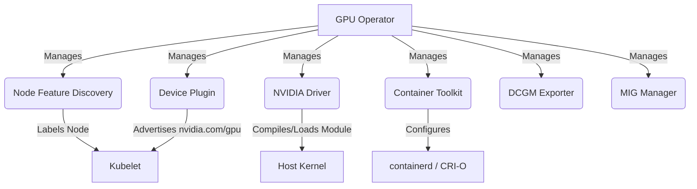

> **Complexity**: `[COMPLEX]`
>
> **Time to Complete**: 75-95 minutes
>
> **Prerequisites**: Kubernetes scheduling, DaemonSets, node labels, taints and tolerations, container runtimes, Prometheus basics
>
> **Track**: On-Premises AI/ML Infrastructure

---

## Learning Outcomes

By the end of this module, you will be able to:

- Design an on-premises GPU node architecture that connects host drivers, container runtimes, device plugins, operators, monitoring, and Kubernetes scheduling.
- Evaluate accelerator placement strategies for heterogeneous fleets using taints, tolerations, Node Feature Discovery labels, node affinity, MIG, Time-Slicing, and Dynamic Resource Allocation.
- Debug GPU scheduling failures by separating API admission errors, scheduler placement failures, kubelet allocation failures, runtime injection problems, and host driver faults.
- Compare legacy device plugin allocation with Kubernetes Dynamic Resource Allocation and justify when each model is appropriate for senior platform design.
- Implement and validate a GPU Operator Time-Slicing configuration while explaining the operational risks it introduces.

## Why This Module Matters

Hypothetical scenario: an on-premises AI platform team has already finished the expensive work. The GPU servers are racked, the power and cooling upgrades are complete, the procurement review is over, and the finance team expects a credible utilization story. Then training jobs start missing their scheduled windows even though dashboards show installed accelerator capacity, notebooks compete with multi-day training jobs, and a small inference pod lands on premium hardware because the manifest only requested `nvidia.com/gpu: 1`. The hardware is not the first failure. The platform contract around the hardware is the failure.

Kubernetes does not treat a GPU like CPU. CPU requests can be fractional, throttled, and overcommitted within well-known scheduler and cgroup semantics, but a legacy GPU request is an exclusive integer claim unless the platform deliberately exposes a different sharing or partitioning model. A successful GPU workload also depends on host kernel drivers, container runtime integration, device plugin registration, kubelet allocation, node labels, taints, telemetry, and application image compatibility. Each layer can be correct in isolation while the complete path still fails for the workload.

This module teaches the boundaries between those layers. You will begin with the classic device plugin model, where a node-local plugin advertises an extended resource such as `nvidia.com/gpu` to the kubelet. You will then add the operational pieces that make the model production-grade: the NVIDIA GPU Operator, Node Feature Discovery, scheduling policy, MIG, Time-Slicing, DCGM Exporter, and vendor alternatives such as AMD ROCm and Intel Gaudi. Finally, you will compare that mature integer-resource model with Kubernetes Dynamic Resource Allocation, which is stable in Kubernetes v1.35 and gives platform teams a richer way to request devices through claims and attributes.

The goal is not to memorize one chart value or one Helm flag. The goal is to reason from a symptom to the failing layer. When a pod is pending, you should know whether to inspect admission errors, scheduler events, taints, node labels, allocatable resources, MIG profiles, or quota. When a pod is scheduled but stuck in `ContainerCreating`, you should shift away from scheduler theory and inspect kubelet allocation, runtime injection, CDI, device plugin logs, and host driver state. That diagnostic discipline is what separates a cluster that merely contains accelerators from a platform that safely operates accelerated compute.

## Foundations of Accelerated Computing in Kubernetes

A Kubernetes cluster does not automatically understand every device attached to a server. The kubelet has native knowledge of CPU, memory, ephemeral storage, pods, and operating-system-level capacity, but it does not ship with built-in logic for every GPU, FPGA, AI accelerator, SmartNIC, or vendor-specific PCIe device. That design keeps Kubernetes extensible. Instead of requiring every hardware vendor to merge device-specific code into Kubernetes core, the platform provides extension points that translate host hardware into scheduler-visible resources.

For classic GPU scheduling, the key extension point is the device plugin framework. A device plugin runs on each node that owns the hardware, discovers devices, reports device health, registers a resource name with the kubelet, and participates in allocation when the kubelet prepares a container that requested that resource. The scheduler does not talk directly to a physical GPU or a vendor driver. It consumes node status published by the kubelet, and that status includes extended resources such as `nvidia.com/gpu`, `amd.com/gpu`, or `habana.ai/gaudi`.

```text
+----------------------+       +----------------------+       +----------------------+
| Physical GPU Node    |       | Kubelet              |       | Kubernetes API       |
|                      |       |                      |       |                      |
| PCIe GPUs            |-----> | Device Plugin        |-----> | Node Status          |
| Kernel Driver        |       | /var/lib/kubelet/... |       | Capacity             |
| Container Runtime    |       | Health + Allocation  |       | Allocatable          |
+----------------------+       +----------------------+       +----------------------+
                                                                     |
                                                                     v
                                                            +------------------+
                                                            | Scheduler        |
                                                            | Matches Pods to  |
                                                            | nodes with free  |
                                                            | extended resource|
                                                            +------------------+
```

That indirection is powerful because Kubernetes can schedule workloads without learning vendor-specific driver APIs, but it also hides details that matter in production. A request for `nvidia.com/gpu: 1` does not say which GPU model is required, how much VRAM the workload needs, whether hardware isolation is required, whether the workload can share a physical device, or whether a specific interconnect topology is needed. It only says that the container needs one integer unit of the advertised extended resource, so platform engineers must design the surrounding policy.

The surrounding policy is where most production quality lives. Device plugins expose capacity, Node Feature Discovery exposes hardware labels, taints repel generic workloads, affinity selects suitable hardware, quotas constrain tenants, operators reconcile driver and runtime components, MIG and Time-Slicing change what one schedulable unit means, and Dynamic Resource Allocation can model richer device selection through claims. The scheduler can only honor the intent that the platform and workload authors actually declare.

### Resource Semantics and Capacity Handling

Device plugin resource names follow the extended resource naming pattern `vendor-domain/resource`. The domain prefix prevents collisions between vendors and platform-specific resources, which matters in heterogeneous clusters where NVIDIA, AMD, Intel, or internal accelerator drivers might all be present. A pod that requests a legacy extended resource must request a whole number. CPU can be fractional and memory can use quantities such as `512Mi`, but an extended device resource such as `nvidia.com/gpu` cannot be requested as `0.5` in the legacy model.

```yaml
apiVersion: v1
kind: Pod
metadata:
  name: cuda-vector-add
spec:
  restartPolicy: Never
  containers:
    - name: cuda-vector-add
      image: nvcr.io/nvidia/k8s/cuda-sample:vectoradd-cuda12.5.0
      resources:
        limits:
          nvidia.com/gpu: 1
```

The following manifest is intentionally invalid for the legacy extended resource model. It is useful as a teaching example because it exposes a common misconception: fractional GPU scheduling is not created by writing a decimal into the pod specification. If a team wants several pods to share a physical device, the platform must expose a different schedulable abstraction through Time-Slicing, MIG-backed resources, or a DRA-capable driver.

```yaml
apiVersion: v1
kind: Pod
metadata:
  name: invalid-fractional-gpu
spec:
  restartPolicy: Never
  containers:
    - name: app
      image: nvcr.io/nvidia/k8s/cuda-sample:vectoradd-cuda12.5.0
      resources:
        limits:
          nvidia.com/gpu: 0.5
```

Pause and predict: a node has four installed GPUs, and one physical GPU fails after the device plugin has registered all devices. What should `Capacity` and `Allocatable` show after kubelet receives the health update? The expected answer is that total `Capacity` can remain at the installed or reported count while `Allocatable` drops for new scheduling decisions. This is why a capacity-only dashboard can look healthy while the scheduler has already stopped using a failed accelerator.

```bash
kubectl describe node <gpu-node-name>
```

Many Kubernetes operators use short interactive shell shortcuts for `kubectl`, but curriculum examples and operational runbooks should use the full binary name so copy-paste commands work in non-interactive shells and CI jobs. This module keeps all runnable shell examples explicit for that reason.

### Where GPU Requests Fit in Pod Scheduling

A GPU request usually appears under container `resources.limits`. For extended resources, Kubernetes expects requests and limits to match, and common GPU manifests specify only the limit because Kubernetes treats the extended resource limit as the request as well. The scheduler then filters nodes against ordinary resources, extended resource availability, labels, taints, affinity, topology spread constraints, priority, and other scheduling policy. A pod that requests one GPU but lacks a matching toleration will not land on a tainted GPU node, and a pod that requests one GPU with the wrong product label will remain pending even while other GPU nodes are idle.

```text
+-------------------------------+
| Pod submitted                 |
| resources.limits includes GPU |
+---------------+---------------+
                |
                v
+-------------------------------+
| API admission                 |
| Is the resource quantity valid?|
+---------------+---------------+
                |
                v
+-------------------------------+
| Scheduler filtering           |
| Node has allocatable GPU?     |
| Node labels match?            |
| Taints tolerated?             |
+---------------+---------------+
                |
                v
+-------------------------------+
| Kubelet local allocation      |
| Device plugin assigns device  |
| Runtime injects device access |
+---------------+---------------+
                |
                v
+-------------------------------+
| Container starts              |
| Driver and libraries must work|
+-------------------------------+
```

Use that path as your first debugging tool. If the API server rejects the manifest, do not inspect driver logs; fix the invalid resource request or schema error. If the pod is pending, inspect pod events and scheduler constraints. If the pod is assigned but stuck in `ContainerCreating`, inspect kubelet, the device plugin, CDI or runtime configuration, and driver state. If the container starts but the application cannot see CUDA or ROCm, inspect image compatibility, runtime injection, library paths, and the application framework.

## Device Plugin and Runtime Integration

The device plugin framework is stable and widely used because it lets vendors integrate special hardware without patching Kubernetes core. The kubelet exposes a registration service over a UNIX socket, and a device plugin connects to that socket to register the resource it manages. The canonical kubelet socket path sits under the node filesystem path shown below, and plugins commonly create their own sockets in the same directory so kubelet can call plugin methods for device listing, health watching, and allocation.

```text
/var/lib/kubelet/device-plugins/kubelet.sock
```

This explains why most device plugins run as privileged DaemonSets. They need host access, a mount of the kubelet device plugin directory, and often access to device files under `/dev`. Some vendors also need host PID visibility, driver libraries, firmware utilities, or runtime configuration paths. A simplified DaemonSet mount looks like the example below; the placeholder image is not meant to be applied, but the hostPath and local-agent pattern are the protected idea.

```yaml
apiVersion: apps/v1
kind: DaemonSet
metadata:
  name: example-device-plugin
  namespace: kube-system
spec:
  selector:
    matchLabels:
      app: example-device-plugin
  template:
    metadata:
      labels:
        app: example-device-plugin
    spec:
      containers:
        - name: plugin
          image: registry.example.com/example-device-plugin:v1.0.0
          securityContext:
            privileged: true
          volumeMounts:
            - name: device-plugin
              mountPath: /var/lib/kubelet/device-plugins
      volumes:
        - name: device-plugin
          hostPath:
            path: /var/lib/kubelet/device-plugins
            type: Directory
```

After registration, the plugin streams device health through `ListAndWatch`, kubelet publishes healthy resource counts in node status, and the scheduler uses that status for placement. When kubelet admits a container that requested the resource on that node, it calls the plugin allocation endpoint. The plugin responds with the device files, environment variables, mounts, annotations, or CDI device references needed by the container runtime. The API server does not know the low-level character device names, and the scheduler does not know the CUDA library path. That local allocation boundary is why scheduling success does not prove runtime success.

The Container Device Interface, usually shortened to CDI, standardizes how devices are described for OCI runtimes. Historically, device injection relied on runtime hooks, wrapper runtimes, bind mounts, custom environment variables, and vendor-specific configuration. CDI moves more of that contract into a specification that describes device nodes, mounts, hooks, and environment requirements. `DevicePluginCDIDevices` became generally available in Kubernetes v1.31, allowing device plugins to return CDI device references instead of relying only on legacy runtime mutation paths.

NVIDIA GPU Operator v26.3 also documents an NRI plugin path when CDI is enabled. NRI, the Node Resource Interface, lets plugins participate in OCI-compatible runtime lifecycle events, but its compatibility matrix is narrower than basic GPU Operator deployment. NVIDIA documents that the NRI plugin requires supported containerd versions and is not supported with CRI-O. Before running this in a mixed-runtime estate, what output do you expect from a node inventory that includes both containerd and CRI-O nodes? You should expect the runtime family to become a rollout gate, not a minor implementation detail.

```bash
kubectl describe pod <pod-name> -n <namespace>
kubectl logs daemonset/nvidia-device-plugin-daemonset -n gpu-operator
kubectl get events -n <namespace> --sort-by=.lastTimestamp
```

Those commands map to the boundary between scheduling and local allocation. Pod events tell you whether the scheduler found a node. Device plugin logs tell you whether the node-local plugin could discover and allocate devices. Kubelet and runtime logs, collected through the host logging system, tell you whether device injection and container creation completed. A pod stuck in `ContainerCreating` has already passed scheduler placement, so continuing to tweak node affinity is usually working on the wrong layer.

## Operator-Driven GPU Management

You can deploy a GPU device plugin by hand, and in a small lab that may be enough. In production, hand assembly becomes fragile because a GPU node needs a compatible kernel driver, container runtime configuration, device plugin, hardware labels, health checks, telemetry, validators, and sometimes MIG management. The NVIDIA GPU Operator packages those responsibilities into Kubernetes control loops. When a GPU node joins, Node Feature Discovery and GPU Feature Discovery identify hardware, and operator-managed components reconcile drivers, runtime integration, device plugins, DCGM Exporter, MIG Manager, and validators as needed.



Read the diagram from bottom to top as well as top to bottom. The operator manages Kubernetes operands, those operands mutate host state, host state affects kubelet registration and runtime behavior, kubelet publishes allocatable GPU resources, and the scheduler consumes that published state. A broken host kernel module can look like a scheduling shortage, a broken runtime configuration can look like a pod startup problem, and a missing NFD label can look like bad placement. The operator reduces toil, but it does not remove the need to understand the layers.

| Component | Function in the Cluster | Practitioner Notes |
| :--- | :--- | :--- |
| **Node Feature Discovery (NFD)** | Detects PCIe devices and kernel features, applying labels like `feature.node.kubernetes.io/pci-10de.present=true`. | The Operator relies on NFD labels to determine which nodes require the GPU stack. |
| **NVIDIA Driver** | Compiles and loads the `nvidia` kernel module via a DaemonSet. | Requires host headers to be present or accessible. Can conflict with pre-installed host drivers such as `nouveau`. |
| **Container Toolkit** | Configures `containerd` or `CRI-O` for NVIDIA device access, or works with CDI/NRI paths in modern deployments. | Runtime compatibility must be validated before enabling advanced injection modes. |
| **Device Plugin** | Registers `nvidia.com/gpu` resources with the kubelet. | Fails if the driver is not loaded or if device discovery cannot see healthy GPUs. |
| **DCGM Exporter** | Exposes GPU metrics such as temperature, power draw, memory usage, and SM utilization in Prometheus format. | High-cardinality metric source. Scrape and label design matter in large clusters. |
| **MIG Manager** | Reconfigures supported GPUs into smaller hardware instances based on configured profiles. | Changing profiles can require draining workloads and coordinating with node maintenance. |

Treat that table as a failure map rather than a checklist. If NFD is broken, the operator may not target nodes correctly. If the driver is broken, the device plugin cannot discover usable GPUs. If the runtime injection path is broken, pods may be scheduled but unable to start. If DCGM Exporter is broken, workloads can run while the platform is blind to thermal pressure, memory saturation, ECC errors, and utilization. If MIG Manager is misconfigured, allocatable resources may not match tenant expectations.

GPU operations also have a tighter compatibility surface than ordinary stateless workloads. A web container can often move from one patched node to another without caring about the host kernel version, but a GPU driver is a kernel module, the runtime must expose device files and libraries correctly, and monitoring libraries expect compatible management interfaces. NVIDIA GPU Operator uses calendar-style versioning such as `26.3.0`, and each release has a component matrix. For GPU Operator v26.3.0, the documented matrix includes NVIDIA Container Toolkit 1.19.0 and NVIDIA Kubernetes Device Plugin 0.19.0, so overriding one image independently can create unsupported combinations.

```bash
kubectl get nodes -o wide
kubectl get nodes -L nvidia.com/gpu.present
kubectl get pods -n gpu-operator
kubectl get clusterpolicy cluster-policy -o yaml
```

The driver strategy deserves explicit design review because it controls how nodes recover after OS patching. Dynamic compilation lets the driver container build the module on the node, which can be flexible across kernel versions but depends on matching kernel headers, compiler tooling, package availability, and host/kernel alignment. Pre-compiled drivers make node boot more deterministic when the platform uses immutable images or tightly controlled OS versions, but they create a release engineering duty for every approved kernel build. Host-installed drivers may fit organizations with existing bare-metal operations teams, but ownership boundaries must be written down before rollback is needed.

| Driver Strategy | Best Fit | Operational Risk | Senior Review Question |
| :--- | :--- | :--- | :--- |
| Dynamic compilation | Dev/test, varied kernels, small fleets | Kernel headers or compiler dependencies missing after OS patch | Can a freshly patched node compile the driver without internet access? |
| Pre-compiled driver | Immutable OS images, regulated change windows, large fleets | Artifact maintenance for each kernel build | Is every approved kernel tied to a tested driver image? |
| Host-installed driver | Existing bare-metal operations team owns drivers | Drift between host lifecycle and Kubernetes operator lifecycle | Who owns rollback when the host driver and operator disagree? |

## Advanced Workload Placement

GPU hardware is too expensive to schedule casually. A generic CPU workload should not occupy a GPU node just because the node has free CPU, and a small inference service should not consume a high-memory training accelerator if cheaper hardware is available. A distributed training job may also need compatible interconnect topology, not just a free device count. The first scheduling control is a taint, which repels pods unless they explicitly tolerate it. Taints protect the hardware pool from accidental placement.

```bash
kubectl taint nodes gpu-node-1 nvidia.com/gpu=present:NoSchedule
```

```yaml
apiVersion: v1
kind: Pod
metadata:
  name: gpu-workload
spec:
  restartPolicy: Never
  tolerations:
    - key: "nvidia.com/gpu"
      operator: "Exists"
      effect: "NoSchedule"
  containers:
    - name: cuda-vector-add
      image: nvcr.io/nvidia/k8s/cuda-sample:vectoradd-cuda12.5.0
      resources:
        limits:
          nvidia.com/gpu: 1
```

The toleration allows the pod to enter the hardware zone; it does not choose the right accelerator. For that, you need labels and affinity. Manual labels rot when hardware is replaced, node images are reused, or accelerators move between server models. Node Feature Discovery solves part of this by discovering host features and applying labels automatically, while GPU-specific discovery can add labels for product names, MIG capability, GPU count, and driver stack.

```text
nvidia.com/gpu.product=NVIDIA-A100-SXM4-40GB
```

```yaml
apiVersion: v1
kind: Pod
metadata:
  name: a100-training-job
spec:
  restartPolicy: Never
  tolerations:
    - key: "nvidia.com/gpu"
      operator: "Exists"
      effect: "NoSchedule"
  affinity:
    nodeAffinity:
      requiredDuringSchedulingIgnoredDuringExecution:
        nodeSelectorTerms:
          - matchExpressions:
              - key: nvidia.com/gpu.product
                operator: In
                values:
                  - NVIDIA-A100-SXM4-40GB
  containers:
    - name: trainer
      image: nvcr.io/nvidia/k8s/cuda-sample:vectoradd-cuda12.5.0
      resources:
        limits:
          nvidia.com/gpu: 1
```

Pause and predict: if a cluster contains both A100 nodes and H100 nodes, and a deployment requests only `nvidia.com/gpu: 1` without node affinity, how does the scheduler decide where to place it? The scheduler filters nodes that can satisfy the declared constraints; it does not understand accelerator cost, memory size, generation, or business priority unless those ideas are expressed through labels, affinity, quotas, admission policy, queueing systems, or a higher-level workload platform.

```text
+-------------------------------------------------------------+
| Workload intent                                             |
| "I need an isolated high-memory accelerator for training."   |
+-------------------------+-----------------------------------+
                          |
                          v
+-------------------------------------------------------------+
| Admission policy                                           |
| Reject missing GPU class, tenant, or cost label.            |
+-------------------------+-----------------------------------+
                          |
                          v
+-------------------------------------------------------------+
| Scheduler constraints                                      |
| Toleration + affinity + resource request + priority.        |
+-------------------------+-----------------------------------+
                          |
                          v
+-------------------------------------------------------------+
| Node-local allocation                                      |
| Device plugin, MIG profile, CDI/runtime injection.          |
+-------------------------+-----------------------------------+
                          |
                          v
+-------------------------------------------------------------+
| Runtime and observability                                  |
| Driver, libraries, DCGM metrics, workload logs.             |
+-------------------------------------------------------------+
```

Production placement is layered, not a single YAML field. Taints protect the pool, tolerations admit legitimate GPU workloads, labels describe hardware, affinity selects required properties, resource requests reserve allocatable units, priority influences preemption, quotas constrain tenants, and admission policy rejects underspecified manifests. A beginner asks why the pod is pending. A senior engineer asks which layer rejected the workload and whether that rejection was intentional.

## GPU Sharing, Partitioning, and Telemetry

Modern accelerators are powerful enough that many workloads do not need an entire physical device, which creates a utilization problem. If every notebook, small batch job, and inference test receives exclusive access to a data center GPU, the platform wastes money. Sharing a GPU is not like sharing CPU, however, because the isolation boundary matters. A trusted debugging notebook has different requirements from a regulated tenant workload, and a batch inference job with predictable memory use has different requirements from an experimental training script.

Time-Slicing allows multiple pods to share a physical GPU by advertising multiple schedulable replicas. If a node has one physical GPU and the device plugin advertises ten replicas, Kubernetes can schedule up to ten pods that each request `nvidia.com/gpu: 1`. The API still sees integer resources; the sharing happens below the scheduler abstraction. That makes Time-Slicing useful for trusted workloads with modest and predictable usage, but it is not strong isolation and does not provide hardware-level memory separation.

```yaml
apiVersion: v1
kind: ConfigMap
metadata:
  name: time-slicing-config
  namespace: gpu-operator
data:
  any: |-
    version: v1
    flags:
      migStrategy: none
    sharing:
      timeSlicing:
        resources:
        - name: nvidia.com/gpu
          replicas: 4
```

MIG, or Multi-Instance GPU, solves a different problem on supported NVIDIA data center GPUs. It partitions a physical GPU into hardware-isolated instances with dedicated slices of compute and memory resources. From the platform perspective, MIG changes the allocatable resource surface because the node can advertise specific profile sizes rather than only full GPUs. That stronger isolation comes with operational weight: profiles must be planned, profile changes can require draining workloads, and driver lifecycle issues can affect the available partitioning modes.

| Requirement | Time-Slicing | MIG |
| :--- | :--- | :--- |
| Higher scheduling density | Strong fit | Possible, but profile-dependent |
| Hardware memory isolation | No | Yes |
| Trusted single-team workloads | Good fit | Often more isolation than needed |
| Untrusted multi-tenant workloads | Poor fit | Better fit |
| Simple configuration | Easier | More complex |
| Precise QoS boundary | Weak | Strong |

Sourced compatibility note: NVIDIA has documented driver and operator constraints around MIG mode, device plugin configuration, and runtime integration, so mixed partitioning choices belong in the same change plan as driver upgrades and node maintenance. Treat MIG profile changes as platform changes, not tenant-level tuning. A practical tenant contract might expose bronze shared GPU replicas for notebooks, silver MIG-backed isolated slices for inference, and gold full GPUs or DRA-selected devices for training workloads with stronger requirements.

```text
Bronze: shared GPU replicas for notebooks and tests.
Silver: MIG-backed isolated slices for inference services.
Gold: full GPUs or DRA-selected devices for training and regulated workloads.
```

Accelerator telemetry closes the loop because the expensive failure modes are often invisible from ordinary pod metrics. A pod can be Running while GPU utilization is zero, a node can be Ready while one device is unhealthy, and a model can be slow because GPU memory bandwidth is saturated rather than because CPU is throttled. NVIDIA DCGM Exporter publishes GPU metrics such as temperature, power draw, memory usage, memory bandwidth, SM utilization, ECC errors, and per-process usage in Prometheus format.

```yaml
apiVersion: monitoring.coreos.com/v1
kind: ServiceMonitor
metadata:
  name: dcgm-exporter
  namespace: gpu-operator
spec:
  selector:
    matchLabels:
      app: nvidia-dcgm-exporter
  endpoints:
    - port: metrics
      interval: 15s
```

A short scrape interval gives better incident visibility, but it also increases metric volume. In Time-Slicing environments, process-level metrics can create high cardinality because many pods share the same physical GPU. A useful GPU dashboard separates at least four questions: whether the node advertises expected allocatable capacity, whether assigned workloads are using the device, whether the hardware is healthy, and whether the platform is wasting capacity. Low utilization is not automatically bad; it can mean expected idle time, bad placement, data pipeline bottlenecks, failed injection, or oversized allocations.

## Alternative Ecosystems and Dynamic Resource Allocation

NVIDIA dominates many Kubernetes GPU examples, but on-premises AI infrastructure is increasingly heterogeneous. Supply constraints, cost, power efficiency, workload framework support, procurement relationships, and existing data center standards can all drive a platform toward AMD ROCm, Intel Gaudi, or multiple accelerator families. The Kubernetes pattern remains familiar: a node needs host drivers, a device plugin or DRA driver advertises resources, runtime integration exposes devices, an exporter publishes telemetry, and labels plus policy steer workloads. The vendor details change, and those details matter.

AMD ROCm is the software stack for AMD Instinct accelerators, and the Kubernetes resource name is commonly `amd.com/gpu`. AMD provides a device plugin and GPU Operator, while some on-premises teams still split responsibilities between host image pipelines for drivers and Kubernetes manifests for the device plugin. Intel Gaudi accelerators commonly expose `habana.ai/gaudi`, and scale-out training can shift complexity toward RoCEv2 networking, NIC firmware, lossless Ethernet behavior, and topology-aware placement. The accelerator is never the whole platform; the host, runtime, scheduler, network, telemetry, and tenant contract are part of the product.

| Ecosystem | Common Resource Name | Kubernetes Integration Pattern | Senior Design Concern |
| :--- | :--- | :--- | :--- |
| NVIDIA | `nvidia.com/gpu` | GPU Operator, device plugin, CDI, DCGM Exporter, MIG Manager | Driver/runtime matrix, MIG strategy, telemetry cardinality |
| AMD ROCm | `amd.com/gpu` | AMD device plugin, AMD GPU Operator or host-managed drivers, AMD telemetry exporter | ROCm framework compatibility and image supply chain |
| Intel Gaudi | `habana.ai/gaudi` | Habana device plugin and vendor runtime stack | RoCEv2 fabric, scale-out training topology, framework support |

The legacy device plugin framework remains simple and durable, but heterogeneous AI clusters expose its limits. A workload can request `nvidia.com/gpu: 1`, yet that request does not naturally express an 80GB memory requirement, a tensor core generation, a hardware isolation requirement, a topology relationship between two devices, or an auditable claim object. Platform teams can work around those gaps with node labels, affinity, admission controllers, queueing systems, and naming conventions, and those workarounds are sometimes enough. They can also become brittle as the fleet grows.

Dynamic Resource Allocation is Kubernetes' newer model for requesting and allocating devices. In Kubernetes v1.35, DRA is stable and enabled by default, with APIs in `resource.k8s.io/v1`. The core objects are `DeviceClass`, `ResourceSlice`, `ResourceClaim`, and `ResourceClaimTemplate`. A DRA driver publishes available devices through ResourceSlices, an administrator defines DeviceClasses, and workloads request devices through claims. The model is intentionally similar to storage: instead of asking for one anonymous disk, a workload asks for a claim with class and properties.

```text
+---------------------+       +---------------------+
| DRA Driver          |       | Cluster Admin       |
| Publishes           |       | Defines             |
| ResourceSlices      |       | DeviceClasses       |
+----------+----------+       +----------+----------+
           |                             |
           v                             v
+---------------------------------------------------+
| Kubernetes resource.k8s.io/v1 APIs                |
| DeviceClass + ResourceSlice + ResourceClaim       |
+--------------------------+------------------------+
                           |
                           v
+---------------------------------------------------+
| Scheduler allocates matching device and selects   |
| a node that can provide it                        |
+--------------------------+------------------------+
                           |
                           v
+---------------------------------------------------+
| Kubelet and DRA driver prepare device access      |
| for the pod on the selected node                  |
+---------------------------------------------------+
```

| Design Question | Legacy Device Plugin | Dynamic Resource Allocation |
| :--- | :--- | :--- |
| How does a workload ask for a device? | Integer extended resource such as `nvidia.com/gpu: 1`. | ResourceClaim or ResourceClaimTemplate referencing a DeviceClass. |
| How are device attributes selected? | Usually node labels, affinity, resource names, and admission policy. | Claim selectors and driver-published attributes, including CEL where supported. |
| How visible is allocation intent? | Mostly inside Pod resource requests and node assignment. | Separate ResourceClaim objects make device intent more explicit. |
| How mature is ecosystem support? | Broad and established. | Stable in Kubernetes v1.35, but vendor driver maturity varies. |
| Best fit | Standard GPU scheduling, established operator workflows, simpler fleets. | Heterogeneous fleets, rich device attributes, future-facing platform APIs. |

Do not turn DRA into an ideology. Use the legacy model where the vendor operator and tenant requirements are already satisfied, and use DRA where claim-based device selection, richer attributes, or cleaner platform APIs justify the new driver dependency. Decision prompt: your platform has older 16GB inference GPUs and newer 80GB training GPUs. Would you start with node affinity on product labels, DRA claims, or both? A pragmatic transition often uses both: legacy resources for today's supported path, admission policy to protect premium hardware, and DRA where the driver can publish the attributes the platform wants tenants to request.

```yaml
apiVersion: resource.k8s.io/v1
kind: DeviceClass
metadata:
  name: high-memory-gpu
spec:
  selectors:
    - cel:
        expression: "device.driver == 'gpu.example.com' && device.attributes['gpu.example.com'].memoryGiB >= 80"
```

```yaml
apiVersion: resource.k8s.io/v1
kind: ResourceClaimTemplate
metadata:
  name: high-memory-gpu-claim
spec:
  spec:
    devices:
      requests:
        - name: gpu
          deviceClassName: high-memory-gpu
```

```yaml
apiVersion: v1
kind: Pod
metadata:
  name: dra-training-pod
spec:
  restartPolicy: Never
  resourceClaims:
    - name: training-gpu
      resourceClaimTemplateName: high-memory-gpu-claim
  containers:
    - name: trainer
      image: registry.k8s.io/pause:3.10
      resources:
        claims:
          - name: training-gpu
```

Those manifests show the shape of the contract, not a universal working vendor deployment. They require a DRA-capable driver that publishes matching device data. Without that driver, the objects can exist but will not provide GPU access. That is the right mental model: DRA is not just YAML; it is an API contract among the workload, scheduler, kubelet, and device driver.

## Worked Example: Debugging a Pending GPU Training Pod

Exercise scenario: a team submits a training pod to an on-premises Kubernetes v1.35 cluster, and the pod remains pending for fifteen minutes. The cluster has GPU nodes, and the team says, “Kubernetes is broken because there are free GPUs.” You are the platform engineer on call, and your job is to separate capacity, taints, affinity, driver health, and manifest intent before changing anything. The original pod manifest selects an H100 product label and requests one NVIDIA GPU.

```yaml
apiVersion: v1
kind: Pod
metadata:
  name: image-classifier-train
  namespace: ml-team-a
spec:
  restartPolicy: Never
  affinity:
    nodeAffinity:
      requiredDuringSchedulingIgnoredDuringExecution:
        nodeSelectorTerms:
          - matchExpressions:
              - key: nvidia.com/gpu.product
                operator: In
                values:
                  - NVIDIA-H100-80GB-HBM3
  containers:
    - name: trainer
      image: nvcr.io/nvidia/k8s/cuda-sample:vectoradd-cuda12.5.0
      resources:
        limits:
          nvidia.com/gpu: 1
```

The visible free GPU node is named `gpu-a100-1`. Its node description shows a GPU taint, an A100 product label, and four allocatable NVIDIA GPUs. This state is important because it proves the driver and device plugin are advertising capacity on at least one node, but it does not prove the submitted pod is allowed to use that node.

```text
Taints:             nvidia.com/gpu=present:NoSchedule
Labels:             nvidia.com/gpu.product=NVIDIA-A100-SXM4-40GB
Capacity:
  nvidia.com/gpu:   4
Allocatable:
  nvidia.com/gpu:   4
```

Start with the scheduler explanation rather than restarting the operator. `kubectl describe pod` usually gives the fastest signal because it names the constraints the scheduler could not satisfy. In this example, the event says one node had an untolerated taint, one node did not match affinity, and other nodes lacked free GPU capacity. That is enough to avoid a blind driver investigation.

```bash
kubectl describe pod image-classifier-train -n ml-team-a
```

```text
Warning  FailedScheduling  default-scheduler  0/6 nodes are available:
1 node(s) had untolerated taint {nvidia.com/gpu: present},
1 node(s) didn't match Pod's node affinity/selector,
4 node(s) didn't have free nvidia.com/gpu.
```

Now separate intent from accident. If the model truly requires an 80GB H100, the A100 node is not an acceptable target, and adding a toleration would still not make the workload correct. If the H100 selector was copied from another job and the workload can run on A100, the affinity is too narrow and the pod also needs a toleration. The team confirms that A100 is acceptable and this is a legitimate GPU workload, so the corrected manifest expresses both requirements.

```yaml
apiVersion: v1
kind: Pod
metadata:
  name: image-classifier-train
  namespace: ml-team-a
spec:
  restartPolicy: Never
  tolerations:
    - key: "nvidia.com/gpu"
      operator: "Exists"
      effect: "NoSchedule"
  affinity:
    nodeAffinity:
      requiredDuringSchedulingIgnoredDuringExecution:
        nodeSelectorTerms:
          - matchExpressions:
              - key: nvidia.com/gpu.product
                operator: In
                values:
                  - NVIDIA-A100-SXM4-40GB
  containers:
    - name: trainer
      image: nvcr.io/nvidia/k8s/cuda-sample:vectoradd-cuda12.5.0
      resources:
        limits:
          nvidia.com/gpu: 1
```

```bash
kubectl apply -f image-classifier-train.yaml
kubectl get pod image-classifier-train -n ml-team-a -o wide
```

If the pod moves from `Pending` to `ContainerCreating`, the scheduler problem is resolved and the failure stage has changed. Do not keep changing affinity after node assignment. Inspect logs and events to verify device access, and move to runtime injection or driver compatibility only if the workload reaches the node and still cannot start or see the GPU.

```bash
kubectl logs image-classifier-train -n ml-team-a
kubectl logs daemonset/nvidia-device-plugin-daemonset -n gpu-operator
kubectl get events -n ml-team-a --sort-by=.lastTimestamp
```

The incident note should not say only “GPU scheduling failed.” A useful note says the pod had two unsatisfied scheduler constraints: it lacked a toleration for the GPU node taint, and it selected an H100 product label while available capacity was on an A100 node. After confirming workload intent with the tenant, the manifest was corrected to tolerate the GPU taint and select the intended product class. That language points toward durable follow-up, such as templates or admission policy that reject GPU pods without a hardware class and toleration.

## Patterns & Anti-Patterns

| Pattern | When to Use It | Why It Works | Scaling Consideration |
| :--- | :--- | :--- | :--- |
| Tainted GPU pools with required tolerations | Any shared cluster where non-GPU workloads could otherwise land on accelerator nodes | Protects scarce hardware from accidental CPU-only placement | Pair with admission policy so legitimate GPU workloads include the toleration consistently |
| Hardware labels plus affinity | Heterogeneous fleets with different GPU generations, memory sizes, or vendors | Separates “needs a GPU” from “needs this kind of GPU” | Prefer discovered labels over hand-maintained labels, and document supported workload classes |
| Operator-managed driver and runtime stack | Production fleets where nodes are replaced, patched, or drained regularly | Reconciliation reduces drift across driver, toolkit, device plugin, telemetry, and validators | Version matrices become part of release planning, especially across runtime families |
| Claim-based DRA for rich device selection | Workloads need attributes that opaque integer resources cannot express | ResourceClaims make device intent visible and scheduler-aware where drivers support it | Migrate by workload class; do not strand stable legacy workloads without a driver-backed reason |

| Anti-Pattern | What Goes Wrong | Better Alternative |
| :--- | :--- | :--- |
| Generic `nvidia.com/gpu: 1` for every workload | Premium accelerators become interchangeable with cheaper devices, creating cost and performance mistakes | Require a workload class, product label, DeviceClass, or queue policy that expresses hardware intent |
| Time-Slicing as a tenant isolation feature | One workload can consume shared memory or disrupt neighbors because Time-Slicing is not hardware isolation | Use MIG or full-device allocation for untrusted or regulated tenants |
| Capacity-only health dashboards | Failed devices can disappear from `Allocatable` while total `Capacity` still looks normal | Alert on allocatable counts, device health, and inventory-to-usable-resource mismatches |
| Runtime feature enablement without inventory | CDI or NRI paths can fail in clusters whose runtimes do not meet vendor support requirements | Gate advanced runtime integration by runtime family and version before rollout |

## Decision Framework

Use the decision process below when designing an on-premises accelerated node pool. Start with the tenant promise, not the YAML field. If workloads are untrusted or regulated, prefer full devices or MIG-backed hardware partitioning. If workloads are trusted and profiled, Time-Slicing can improve utilization. If workloads need a specific model, memory size, generation, or topology, express that through labels and affinity today, and consider DRA claims where a capable driver is available. If the fleet is homogeneous and the vendor operator path already meets requirements, the legacy device plugin model may be the simplest reliable answer.

| Decision Point | Prefer This | Avoid This |
| :--- | :--- | :--- |
| Need basic proven scheduling for one vendor | Legacy device plugin plus operator | Premature DRA migration without driver support |
| Need hardware memory isolation | MIG or full GPU allocation | Time-Slicing as an isolation boundary |
| Need notebook density for trusted users | Time-Slicing with monitoring and quotas | Fractional legacy resource requests |
| Need rich attributes such as memory and generation | DRA claims where supported, or strict labels and admission policy | Bare `nvidia.com/gpu: 1` requests on premium pools |
| Need predictable node recovery after OS patches | Pre-compiled drivers tied to node image lifecycle | Dynamic compilation without kernel header preflight |

```text
Start
  |
  v
Is the tenant boundary untrusted or regulated?
  |-- yes --> Full GPU or MIG-backed isolated slice
  |
  |-- no --> Is density more important than isolation?
               |-- yes --> Time-Slicing with quotas and telemetry
               |
               |-- no --> Does workload require specific attributes?
                            |-- yes --> Labels/affinity now, DRA where driver supports it
                            |
                            |-- no --> Legacy device plugin request with pool protection
```

## Did You Know?

1. Kubernetes Dynamic Resource Allocation is stable in Kubernetes v1.35 and enabled by default, but useful device allocation still depends on a DRA-capable driver publishing device data.
2. The NVIDIA GPU Operator uses calendar-style versioning such as `26.3.0`, which helps operators connect a release to a documented component matrix.
3. `DevicePluginCDIDevices` became generally available in Kubernetes v1.31, allowing device plugins to return CDI device references for runtime injection.
4. In the legacy device plugin model, an unhealthy device decreases node `Allocatable` but does not decrease total node `Capacity`.

## Common Mistakes

| Mistake | Why It Happens | How to Fix It |
| :--- | :--- | :--- |
| **Fractional GPU Requests** | Teams treat extended resources like CPU and write values such as `nvidia.com/gpu: 0.5`, but legacy extended resources must be whole integers. | Configure Time-Slicing, MIG, or DRA-backed claims so the platform exposes the right schedulable unit, then request an integer or claim. |
| **Ignoring the `nouveau` Driver** | The open-source host driver can bind to NVIDIA hardware before the NVIDIA driver loads, preventing the expected driver stack from owning the device. | Blacklist `nouveau` in the host image or use an approved node image where the GPU Operator driver path is validated. |
| **Missing Privileged Mounts** | A manually deployed device plugin cannot register with kubelet if it cannot access `/var/lib/kubelet/device-plugins/kubelet.sock`. | Run the plugin through the vendor-supported DaemonSet or verify privileged access and the required hostPath mount. |
| **Capacity vs. Allocatable Confusion** | A failed GPU may leave `Capacity` unchanged while `Allocatable` drops, so capacity-only alerts miss degraded nodes. | Alert on allocatable GPU count and on mismatches between expected hardware inventory and usable resources. |
| **Using Time-Slicing for Untrusted Tenants** | Time-Slicing improves density but does not provide hardware memory isolation, so one workload can disrupt others sharing the device. | Use MIG or full-device allocation for untrusted or regulated workloads that require isolation. |
| **Overfitting Node Affinity** | A copied product label can make pods pending even when suitable GPU capacity exists under a different label. | Treat affinity as a requirement, review workload intent, and use admission policy or templates for common classes. |
| **Enabling NRI on CRI-O** | GPU Operator v26.3 NRI plugin support is documented for supported containerd versions and is not supported with CRI-O. | Gate NRI enablement by runtime inventory; keep CRI-O clusters on supported non-NRI paths. |
| **Letting DCGM Metrics Explode** | Per-process and per-pod GPU metrics can create high Prometheus cardinality in shared GPU environments. | Tune DCGM Exporter metrics and scrape intervals around the operational questions the platform actually needs to answer. |

## Quiz

**Question 1:** Your team deploys a GPU notebook service on a node pool protected by the taint `nvidia.com/gpu=present:NoSchedule`. The pod requests `nvidia.com/gpu: 1`, the node has one allocatable GPU, and the pod has no tolerations. What should you change first, and why?

A) Add a matching toleration, because the scheduler must be allowed to place the pod on tainted GPU nodes.
B) Restart the device plugin, because allocatable GPU capacity should bypass taints.
C) Change the request to `nvidia.com/gpu: 0.5`, because notebooks need only half a device.
D) Remove the taint from every GPU node, because taints are incompatible with extended resources.

<details>
<summary>View Answer</summary>

**Correct Answer: A**. The pod already requests an integer GPU resource, and the node has allocatable capacity, so the blocking scheduler constraint is the taint. A GPU taint is a deliberate protection mechanism that prevents ordinary workloads from landing on expensive hardware. Restarting the plugin does not bypass taints, fractional legacy GPU requests are invalid, and removing the taint weakens the node pool boundary for every workload.

</details>

**Question 2:** A training pod requests `nvidia.com/gpu: 1` and uses node affinity for `nvidia.com/gpu.product=NVIDIA-H100-80GB-HBM3`. The only free GPU node is labeled `nvidia.com/gpu.product=NVIDIA-A100-SXM4-40GB`, and the data science team confirms the job was tested on A100. What is the best fix?

A) Delete the device plugin DaemonSet so the scheduler recalculates GPU capacity.
B) Change the affinity to the accepted product class and keep the GPU request.
C) Remove the GPU request and rely only on the product label.
D) Add a ServiceMonitor for DCGM Exporter.

<details>
<summary>View Answer</summary>

**Correct Answer: B**. The scheduler is honoring the manifest by refusing a node that does not match the declared product label. If A100 is acceptable, the affinity should express that accepted class while the GPU request remains in place to reserve the device unit. Deleting the device plugin damages capacity advertisement, relying only on a label does not allocate a GPU, and telemetry does not fix placement intent.

</details>

**Question 3:** After an operating system patch, GPU nodes rejoin as Ready but no longer advertise `nvidia.com/gpu`. The GPU Operator uses dynamic driver compilation, and the driver pod is in `CrashLoopBackOff`. Which investigation path best matches the symptom?

A) Check whether matching kernel headers and build dependencies exist for the new kernel.
B) Increase the DCGM Exporter scrape interval.
C) Replace node affinity with DRA claims.
D) Remove all GPU taints from the node pool.

<details>
<summary>View Answer</summary>

**Correct Answer: A**. Dynamic driver compilation depends on the running kernel and matching build inputs. If the OS patch changed the kernel but the corresponding headers are missing or incompatible, the driver module cannot compile, and the device plugin cannot discover healthy GPUs. Scrape intervals, DRA objects, and taints do not repair a missing kernel module.

</details>

**Question 4:** A platform team wants several trusted developer notebooks to share one physical GPU during office hours. The workloads come from the same team, memory use is predictable, and strict tenant isolation is not required. Which approach is most appropriate?

A) Time-Slicing with a clear replica count and monitoring for VRAM pressure.
B) MIG only, because Time-Slicing always provides stronger isolation.
C) A fractional request such as `nvidia.com/gpu: 0.25`.
D) No resource request, because notebooks can discover GPUs automatically.

<details>
<summary>View Answer</summary>

**Correct Answer: A**. Time-Slicing is useful when density is the goal and workloads are trusted and profiled. It still needs monitoring because VRAM is not hardware-isolated between replicas. MIG provides stronger isolation but may be more operationally complex than needed, fractional extended resource requests are invalid, and omitting the request prevents reliable scheduling and allocation.

</details>

**Question 5:** A regulated tenant wants workloads from different business units to share an accelerator node, but each workload must have hardware-guaranteed memory and compute isolation. Which design should you recommend?

A) Time-Slicing with more replicas.
B) MIG-backed slices on supported hardware, or full-device allocation if MIG profiles do not match.
C) A lower Prometheus scrape interval.
D) A node selector without a GPU resource request.

<details>
<summary>View Answer</summary>

**Correct Answer: B**. MIG provides hardware-level partitioning on supported NVIDIA GPUs, and full-device allocation is the fallback when the required profile does not exist. Time-Slicing multiplexes access but does not create a hardware memory boundary. Monitoring is valuable but cannot create isolation, and a node selector chooses a node without allocating a device.

</details>

**Question 6:** Your Kubernetes v1.35 cluster has a DRA-capable accelerator driver. A workload needs at least 80GB of device memory and a specific accelerator generation, while the old template only requests `nvidia.com/gpu: 1`. What is the strongest reason to consider DRA for this workload class?

A) DRA lets the workload express device attributes through claims rather than relying only on opaque integer counts and node labels.
B) DRA automatically makes every old device plugin obsolete.
C) DRA removes the need for host drivers.
D) DRA allows fractional legacy extended resource requests.

<details>
<summary>View Answer</summary>

**Correct Answer: A**. DRA is valuable when device attributes matter because a ResourceClaim can select devices from a DeviceClass using driver-published attributes. The legacy integer request only asks for a count and leaves richer intent to labels or policy. DRA does not remove drivers, does not obsolete every established operator workflow, and does not change legacy extended resource quantity rules.

</details>

**Question 7:** A GPU node has four installed GPUs, one device fails, and the device plugin reports it unhealthy. New pods stop scheduling to the failed device, but your dashboard still shows four GPUs under total capacity. What alerting improvement should you make?

A) Alert on `Allocatable` GPU count and on differences between expected capacity and allocatable resources.
B) Alert only on total `Capacity`, because it always reflects usable devices.
C) Disable device health reporting so the node remains schedulable.
D) Increase the pod CPU request for GPU workloads.

<details>
<summary>View Answer</summary>

**Correct Answer: A**. Kubernetes can keep total capacity unchanged while reducing allocatable count for unhealthy devices, and new scheduling decisions rely on allocatable resources. A capacity-only dashboard can therefore hide degraded nodes. Disabling health reporting makes scheduling less safe, and CPU requests do not describe GPU device health.

</details>

**Question 8:** Staging runs a supported containerd version, production runs CRI-O, and the platform team wants to enable the NVIDIA GPU Operator v26.3 NRI plugin everywhere to simplify runtime injection. What deployment decision avoids a production compatibility failure?

A) Enable NRI only where the documented runtime compatibility contract is satisfied, and keep it disabled on the CRI-O production cluster.
B) Enable NRI globally because all OCI runtimes support the same NRI path.
C) Disable CDI because NRI does not require it.
D) Replace DCGM Exporter with NRI.

<details>
<summary>View Answer</summary>

**Correct Answer: A**. NVIDIA documents NRI plugin support for supported containerd versions with CDI and does not support it with CRI-O in that operator release. A runtime-aware rollout prevents a staging-only success from becoming a production outage. CDI and NRI are runtime integration mechanisms, while DCGM Exporter is telemetry and cannot replace either path.

</details>

## Hands-On Exercise: Configuring Time-Slicing

This lab configures the NVIDIA GPU Operator for Time-Slicing. You can apply the operator configuration objects on a non-GPU test cluster by disabling driver and toolkit management, but capacity verification requires real NVIDIA GPU hardware. The purpose is to practice the operator configuration path, not to pretend that Time-Slicing creates isolated hardware. Keep the production lesson in mind: every command changes a platform contract about what one requested GPU unit means.

### Task 1: Install the NVIDIA GPU Operator

Add the NVIDIA Helm repository and install the operator into its own namespace. This lab disables driver and toolkit management so control plane pieces can run in clusters without physical GPUs. On a real GPU cluster, do not blindly disable those components unless your host image already provides the required driver and runtime integration.

```bash
helm repo add nvidia https://helm.ngc.nvidia.com/nvidia
helm repo update

helm install gpu-operator nvidia/gpu-operator \
  -n gpu-operator --create-namespace \
  --set driver.enabled=false \
  --set toolkit.enabled=false
```

```bash
kubectl get pods -n gpu-operator
```

<details>
<summary>Solution Details</summary>

The operator deployment should become Running. Some hardware-specific operands may not become meaningful on a non-GPU cluster, and that is acceptable for the configuration portion of this lab. On a real GPU cluster, failed driver, validator, or device plugin pods must be investigated before declaring the stack ready.

</details>

### Task 2: Create the Time-Slicing ConfigMap

Create a ConfigMap that instructs the device plugin to advertise ten replicas for the `nvidia.com/gpu` resource. This does not create hardware isolation. It changes the scheduling abstraction so Kubernetes sees more logical allocation units than physical devices.

```bash
cat <<EOF | kubectl apply -f -
apiVersion: v1
kind: ConfigMap
metadata:
  name: time-slicing-config
  namespace: gpu-operator
data:
  any: |-
    version: v1
    flags:
      migStrategy: none
    sharing:
      timeSlicing:
        resources:
        - name: nvidia.com/gpu
          replicas: 10
EOF
```

```bash
kubectl get configmap time-slicing-config -n gpu-operator -o yaml
```

<details>
<summary>Solution Details</summary>

The ConfigMap should contain a key named `any`. The `ClusterPolicy` patch in the next task references that key as the default configuration. If the key names do not match, the device plugin will not use the expected Time-Slicing configuration.

</details>

### Task 3: Apply the Configuration via ClusterPolicy

The GPU Operator manages the stack through a `ClusterPolicy`. Patch the device plugin configuration so it references the Time-Slicing ConfigMap, then inspect the resulting object rather than assuming the patch was accepted.

```bash
kubectl patch clusterpolicy cluster-policy --type='json' -p='[{
  "op": "replace",
  "path": "/spec/devicePlugin/config",
  "value": {
    "name": "time-slicing-config",
    "default": "any"
  }
}]'
```

```bash
kubectl get clusterpolicy cluster-policy -o yaml
```

<details>
<summary>Solution Details</summary>

Inspect the `spec.devicePlugin.config` path. It should reference `time-slicing-config` and the `any` default. If the patch fails because the path does not exist in your installed chart version, inspect the current `ClusterPolicy` schema and apply the equivalent supported field for that release.

</details>

### Task 4: Restart the Device Plugin on a GPU Cluster

If you are running on a real GPU cluster, restart the device plugin DaemonSet so it reloads configuration. This is also a reminder that node-local agents turn cluster policy into kubelet-visible resources; a ConfigMap sitting in the API is not useful until the component that consumes it has reconciled the change.

```bash
kubectl rollout restart daemonset nvidia-device-plugin-daemonset -n gpu-operator
kubectl rollout status daemonset nvidia-device-plugin-daemonset -n gpu-operator
```

<details>
<summary>Solution Details</summary>

The DaemonSet should roll out successfully. If it does not, inspect the logs because parsing errors usually indicate malformed ConfigMap content or a mismatch between the `ClusterPolicy` reference and the ConfigMap key.

```bash
kubectl logs daemonset/nvidia-device-plugin-daemonset -n gpu-operator
```

</details>

### Task 5: Verify Advertised Capacity on a Real GPU Node

On a node with one physical GPU and `replicas: 10`, the advertised logical capacity can show ten `nvidia.com/gpu` units. Use `kubectl describe node` to inspect the result, and compare `Capacity` with `Allocatable` rather than trusting one line in isolation.

```bash
kubectl describe node <your-gpu-node-name>
```

```bash
kubectl describe node <your-gpu-node-name> | sed -n '/Capacity:/,/Allocatable:/p'
kubectl describe node <your-gpu-node-name> | sed -n '/Allocatable:/,/System Info:/p'
```

<details>
<summary>Solution Details</summary>

Look for `nvidia.com/gpu: 10` in the relevant resource sections on a single-GPU node configured with ten replicas. On nodes with multiple physical GPUs, the advertised count depends on the number of physical devices and the replica configuration. Remember that Time-Slicing changes schedulable units, not physical isolation.

</details>

### Task 6: Run a Small GPU Workload on a Real GPU Cluster

Apply a CUDA sample pod that requests one logical GPU unit. If it completes, inspect the logs. If it fails, classify the failure stage before changing the manifest: pending means scheduler constraints, `ContainerCreating` means local allocation or runtime injection, and application-level CUDA errors mean the container started but the GPU user-space path still failed.

```bash
cat <<EOF | kubectl apply -f -
apiVersion: v1
kind: Pod
metadata:
  name: gpu-timeslicing-check
spec:
  restartPolicy: Never
  tolerations:
    - key: "nvidia.com/gpu"
      operator: "Exists"
      effect: "NoSchedule"
  containers:
    - name: cuda-vector-add
      image: nvcr.io/nvidia/k8s/cuda-sample:vectoradd-cuda12.5.0
      resources:
        limits:
          nvidia.com/gpu: 1
EOF
```

```bash
kubectl get pod gpu-timeslicing-check -w
```

```bash
kubectl logs gpu-timeslicing-check
```

```bash
kubectl delete pod gpu-timeslicing-check
```

<details>
<summary>Solution Details</summary>

A successful sample should run to completion and report a passing CUDA vector addition test. If the pod is pending, inspect taints, affinity, and allocatable GPU count. If it is stuck in `ContainerCreating`, inspect the device plugin, CDI or runtime injection, and driver stack. If it starts but cannot access CUDA, inspect image compatibility and runtime configuration.

</details>

<details>
<summary>Success Checklist</summary>

- [ ] You can design a GPU node architecture by naming the driver, runtime, device plugin, kubelet, scheduler, operator, and monitoring responsibilities.
- [ ] You can evaluate placement strategy by explaining how taints, tolerations, labels, affinity, MIG, Time-Slicing, and DRA affect a workload.
- [ ] You can debug GPU scheduling failures by separating API admission, scheduler filtering, kubelet allocation, runtime injection, and driver faults.
- [ ] You can compare legacy device plugin allocation with DRA and explain when each model is the better platform contract.
- [ ] You can implement and validate Time-Slicing through a ConfigMap, `ClusterPolicy` patch, DaemonSet restart, node capacity check, and test workload.
- [ ] Operator Helm chart deployed into the `gpu-operator` namespace.
- [ ] Time-Slicing ConfigMap exists in the `gpu-operator` namespace.
- [ ] `ClusterPolicy` references the ConfigMap and the correct default key.
- [ ] Device plugin DaemonSet restarted successfully on a real GPU cluster.
- [ ] Real GPU node advertises the expected logical `nvidia.com/gpu` capacity.
- [ ] Test workload requests an integer GPU unit and either completes successfully or fails at a clearly identified layer.
- [ ] You can explain why Time-Slicing does not provide hardware memory isolation.

</details>

### Troubleshooting

If capacity does not update, inspect the device plugin logs and the current `ClusterPolicy` before changing workload manifests. If the pod is pending, inspect scheduling events. If the pod is assigned but does not start, inspect runtime and device allocation symptoms. The point of the lab is not only to make a sample run; it is to practice moving to the correct layer as the symptom changes.

```bash
kubectl logs daemonset/nvidia-device-plugin-daemonset -n gpu-operator
```

```bash
kubectl get clusterpolicy cluster-policy -o yaml
```

```bash
kubectl describe pod gpu-timeslicing-check
kubectl get events --sort-by=.lastTimestamp
```

```bash
kubectl describe pod gpu-timeslicing-check
kubectl logs daemonset/nvidia-device-plugin-daemonset -n gpu-operator
```

## Sources

- https://v1-35.docs.kubernetes.io/docs/concepts/extend-kubernetes/compute-storage-net/device-plugins/
- https://v1-35.docs.kubernetes.io/docs/concepts/scheduling-eviction/dynamic-resource-allocation/
- https://v1-35.docs.kubernetes.io/docs/concepts/configuration/manage-resources-containers/#extended-resources
- https://v1-35.docs.kubernetes.io/docs/concepts/scheduling-eviction/taint-and-toleration/
- https://kubernetes-sigs.github.io/node-feature-discovery/stable/usage/features.html
- https://docs.nvidia.com/datacenter/cloud-native/gpu-operator/26.3/getting-started.html
- https://docs.nvidia.com/datacenter/cloud-native/gpu-operator/26.3/platform-support.html
- https://docs.nvidia.com/datacenter/cloud-native/gpu-operator/26.3/cdi.html
- https://github.com/NVIDIA/k8s-device-plugin
- https://docs.nvidia.com/datacenter/cloud-native/gpu-operator/26.3/gpu-operator-mig.html
- https://docs.nvidia.com/datacenter/cloud-native/gpu-telemetry/latest/dcgm-exporter.html
- https://instinct.docs.amd.com/projects/gpu-operator/en/main/device_plugin/device-plugin.html
- https://docs.habana.ai/en/latest/Orchestration/Gaudi_Kubernetes/index.html

## Next Module

Now that you can reason about GPU node provisioning, device plugin allocation, Time-Slicing, MIG, telemetry, and DRA, continue to **[Module 9.2: Advanced Topology and RDMA Fabrics](/on-premises/ai-ml-infrastructure/module-9.2-advanced-topology-rdma-fabrics/)**. The next module moves from single-node accelerator operations to multi-node training fabrics, covering InfiniBand, RoCEv2, topology-aware placement, and the network constraints that decide whether large AI training jobs scale cleanly or stall under communication overhead.
