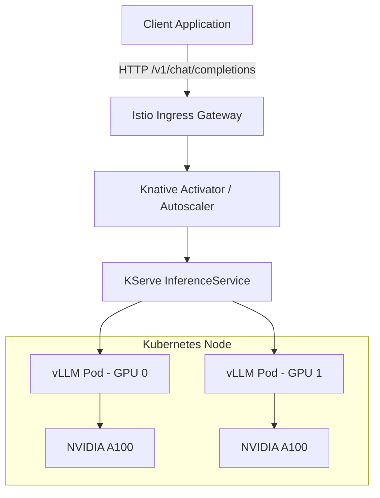

> **Complexity**: Advanced
>
> **Time to Complete**: 90-120 minutes
>
> **Prerequisites**: Kubernetes workloads, Services, resource requests and limits, GPU scheduling basics, Prometheus metrics, container logs, and basic LLM terminology

---

## Learning Outcomes

By the end of this module, you will be able to:

- **Design** private LLM serving deployments that match model size, context length, GPU memory, and traffic patterns.
- **Configure** vLLM runtime parameters for KV cache sizing, continuous batching, quantization, and OpenAI-compatible serving on Kubernetes.
- **Compare** vLLM, TGI, Ollama, KServe, NIM, and Triton against throughput, observability, multi-GPU, and support constraints.
- **Debug** GPU scheduling, startup, NCCL, context-length, and autoscaling failures using Kubernetes events, logs, and serving metrics.
- **Evaluate** when to split workloads, quantize weights, add replicas, or change tensor parallelism to improve latency and reliability.

## Why This Module Matters

Hypothetical scenario: a healthcare platform team moves a clinical summarization assistant from a public model API to an internal Kubernetes platform because prompts may contain regulated records, audit trails must stay local, and finance wants GPU spend to be visible before the endpoint becomes a critical workflow. The first smoke test looks successful because a short prompt returns a plausible answer, the pod is `Running`, and the application can reach an OpenAI-compatible route. The trouble starts when production traffic mixes short chat prompts, long transcripts, retries from impatient clients, and background summarization jobs that all share the same GPU-backed serving engine.

The platform team quickly learns that private LLM serving is not just a Deployment manifest with a GPU limit. Model weights must fit in VRAM, the KV cache must have enough headroom for active prompts, the scheduler must keep the GPU busy without starving short requests, and the API must behave the way application teams expect during streaming, overload, and rollout. Kubernetes can tell you that a pod is healthy while the model service is still unusable because queue time, time to first token, and KV cache pressure are hidden inside the inference runtime.

This module treats private LLM serving as an infrastructure product. You will connect the physics of prefill and decode to runtime flags, compare engines such as vLLM and TGI, reason about quantization and tensor parallelism, and work through a slow vLLM deployment where the correct answer is not simply "add more GPU." By the end, you should be able to defend a serving design using evidence: model memory, context policy, request shape, observability, isolation, and Kubernetes failure signals.

## The Serving Stack at a Glance

A private LLM deployment has more moving parts than a normal stateless web service because the container does not only execute application code. It loads model weights, reserves GPU memory, tokenizes prompts, batches active sequences, streams output tokens, and exposes engine metrics while Kubernetes schedules and restarts the pod around it. Kubernetes understands pods, Services, resources, probes, and events; the inference engine understands token counts, KV cache pages, queue length, and decoding loops. A useful operating model separates the route, serving abstraction, engine, and hardware layers so you can identify which part is actually failing.

```text
+-----------------------------------------------------------------------+
|                         Client Applications                           |
|  chat UI | agents | batch jobs | RAG service | internal tools          |
+-----------------------------------+-----------------------------------+
                                    |
                                    v
+-----------------------------------------------------------------------+
|                         API and Routing Layer                         |
|  Gateway API | Ingress | Service | auth proxy | rate limiter           |
+-----------------------------------+-----------------------------------+
                                    |
                                    v
+-----------------------------------------------------------------------+
|                       Model Serving Orchestrator                      |
|  KServe | Knative | raw Deployment | custom controller                |
+-----------------------------------+-----------------------------------+
                                    |
                                    v
+-----------------------------------------------------------------------+
|                         Inference Engine                              |
|  vLLM | TGI | Triton backend | NIM | Ollama for smaller use cases     |
|  batching | KV cache | token streaming | model loading | metrics       |
+-----------------------------------+-----------------------------------+
                                    |
                                    v
+-----------------------------------------------------------------------+
|                         Hardware and Runtime                          |
|  GPU | VRAM | HBM bandwidth | NVLink | NCCL | node CPU | local cache   |
+-----------------------------------------------------------------------+
```

Each layer produces different evidence when it breaks. A Gateway issue may surface as `503` responses, a Service selector mismatch may produce no endpoints, a scheduler issue may leave the pod in `Pending`, a gated model may fail during download, and a GPU memory issue may crash only after the container starts loading weights. A workload-mixing issue can be more subtle: the endpoint returns good answers under light traffic, then short chat requests wait behind long prompts because the engine has filled active batch slots and KV cache pages.

The operator's job is to keep the API view and the engine view connected. The API view tells you whether clients can send the request shape they expect, including streaming chat completions and status codes during overload. The engine view tells you whether the deployment can survive representative token counts, concurrent users, and rollout conditions. Before running any command in this module, keep that split in mind: a working HTTP route is necessary, but it is not proof that the service has enough inference capacity.

## The Physics of LLM Inference

LLM inference has two phases that stress hardware differently. During prefill, the model processes the input prompt and builds attention state for the sequence; this phase is often compute-heavy because the GPU can run large matrix operations over the prompt. During decode, the model emits output tokens one at a time; this phase repeatedly reads weights and attention state from high-bandwidth GPU memory, so memory bandwidth and cache management dominate more often than raw floating-point peak. If you tune a serving stack without separating these phases, you will misread both latency and utilization.

1. **Prefill phase, also called time to first token or TTFT:** The model processes the prompt all at once and prepares the first generated token. Long documents, large retrieved contexts, and verbose chat history increase prefill work and KV cache allocation.
2. **Decode phase, often measured as time per output token or TPOT:** The model generates one token after another autoregressively. Long answers, code generation, and batch jobs keep decode running long after the first token appears.

A short prompt with a long answer stresses decode, a long document with a short answer stresses prefill and cache capacity, and a chatbot with many concurrent users stresses the scheduler that decides which sequences enter each iteration. The same GPU can therefore feel fast for one workload and slow for another. Pause and predict: if two users share the same model and one sends a long transcript while the other asks a short operational question, which latency metric will reveal the short user's pain first, TTFT or total request duration?

A single request moves through the serving engine in stages, and each stage gives you a different place to look during debugging. Tokenization and HTTP handling can bottleneck on CPU, prefill can bottleneck on compute and prompt size, decode can bottleneck on memory bandwidth, and streaming can expose network or client timeout behavior. The application sees one API call, but the engine sees token IDs, active sequences, cache pages, scheduling iterations, and output limits.

```text
+----------------+     +----------------+     +-----------------------+
| HTTP Request   | --> | Tokenization   | --> | Prefill Prompt        |
| messages/json  |     | text -> ids    |     | compute attention     |
+----------------+     +----------------+     +-----------------------+
                                                        |
                                                        v
+----------------+     +----------------+     +-----------------------+
| HTTP Stream    | <-- | Detokenization | <-- | Decode Next Tokens    |
| chunks/json    |     | ids -> text    |     | one step at a time    |
+----------------+     +----------------+     +-----------------------+
```

Traditional static batching wastes GPU work when sequence lengths vary because the batch behaves like a group reservation: if one request finishes early, its slot can sit idle until the longest request completes. Modern LLM engines use continuous batching, also called in-flight batching, so finished sequences can leave and new sequences can enter between decoding iterations. This keeps memory bandwidth busier and improves throughput under mixed traffic, but it also means the runtime needs a careful way to remember the attention state for sequences that are still active.

PagedAttention solves the cache-fragmentation problem by treating the KV cache more like virtual memory than one giant contiguous buffer per request. The engine divides cache memory into fixed-size blocks, maps each active sequence to the blocks it needs, and returns blocks when a sequence completes or is evicted. This is the mechanism that lets continuous batching admit new work without constantly copying huge cache regions, and it is why context length policy has a direct effect on how many users the endpoint can serve.

```text
+----------------------+        +--------------------------------------+
| Active Requests      |        | KV Cache Pages in GPU Memory         |
+----------------------+        +--------------------------------------+
| request-a: 280 toks  | -----> | page 01 | page 02 | page 03          |
| request-b: 920 toks  | -----> | page 08 | page 11 | page 12 | page 14|
| request-c: 64 toks   | -----> | page 05                              |
| request-d: 410 toks  | -----> | page 06 | page 07 | page 19          |
+----------------------+        +--------------------------------------+
```

The page mapping matters operationally because every context-length decision becomes a cache-admission decision. If the cache has enough free pages, the engine can admit more active sequences; if it is nearly full, new requests wait; if one large request consumes too many pages, short requests can suffer even when their own prompts are tiny. Before increasing `--max-model-len`, ask what behavior you want when users send prompts near that limit, because the model's theoretical maximum context length is not automatically your production policy.

Before writing a Deployment manifest, estimate four numbers: model weight memory, KV cache memory, runtime overhead, and CPU plus system RAM required to feed the GPU. Weight memory is roughly `parameter_count * bytes_per_parameter`, but exact values depend on architecture, quantization format, metadata, loaded adapters, and runtime kernels. Startup proves that weights and initialization fit; serving proves that weights, runtime overhead, and cache fit together under representative prompt lengths.

```text
parameter_count * bytes_per_parameter
```

```text
8B model in FP16  ~= 16 GB for weights
8B model in 4-bit ~= 4-6 GB for weights, depending on format and metadata
70B model in FP16 ~= 140 GB for weights
70B model in 4-bit ~= 35-45 GB for weights, depending on format and metadata
```

The KV cache depends on layer count, hidden size, active sequences, context length, cache dtype, and batching strategy, which makes it workload-dependent rather than a fixed property of the model. This is why a model can start cleanly and still fail during normal usage. If the deployment barely fits at startup, long prompts and concurrent users may push the endpoint into queue growth, request rejection, or CUDA out-of-memory errors even though the Kubernetes pod originally looked healthy.

Latency metrics should separate user experience from engine mechanics. Average response time is too blunt because a streaming chat service may feel responsive when TTFT is low even if total generation lasts many seconds, while a batch summarizer may care more about aggregate tokens per second and completion deadlines. Use a small set of metrics that explain where time is spent and whether the serving engine is saturated.

| Metric | What It Means | Why It Matters |
| :--- | :--- | :--- |
| TTFT | Time to first token | Determines how quickly users feel the model responded |
| TPOT | Time per output token | Determines streaming speed after generation starts |
| End-to-end latency | Total request duration | Matters for non-streaming calls and batch jobs |
| Tokens per second | Aggregate generated token throughput | Shows fleet capacity |
| Queue time | Time spent waiting before execution | Reveals saturation before hard failures |
| KV cache usage | Portion of cache pages in use | Predicts admission pressure and OOM risk |
| Error rate | Failed or rejected requests | Reveals overload, auth, routing, or runtime failures |

Do not tune only for maximum tokens per second. A batch summarization service may accept higher TTFT in exchange for efficient throughput, while an interactive chat service should protect short prompts from waiting behind long documents. The same model and GPU can be configured differently for each class of work, so the right question is not "is the model fast?" but "is this endpoint tuned for this request shape and service objective?"

## Inference Engine Landscape

The inference engine dictates container flags, model formats, metrics, request APIs, multi-GPU behavior, and many failure modes. vLLM is commonly chosen for high-throughput GPU serving, continuous batching, PagedAttention, and OpenAI-compatible API serving. Text Generation Inference, or TGI, is common where Hugging Face model lifecycle and production server features are already part of the platform. Ollama is useful for local development, edge-style experiments, and small internal tools, but it is rarely the first choice for a shared high-concurrency enterprise endpoint.

| Feature / Engine | vLLM | Text Generation Inference (TGI) | Ollama |
| :--- | :--- | :--- | :--- |
| **Primary Use Case** | High-throughput production serving | Production serving (Hugging Face ecosystem) | Local dev, edge, simple low-scale deployments |
| **KV Cache Mgmt** | PagedAttention | PagedAttention | Static / Basic |
| **Quantization** | AWQ, GPTQ, FP8, Marlin | AWQ, GPTQ, EETQ, BitsAndBytes | GGUF |
| **API Format** | OpenAI Compatible API | Custom REST, OpenAI wrapper available | Custom REST, OpenAI compatible API |
| **Multi-GPU** | Tensor Parallelism (Ray/NCCL) | Tensor Parallelism (NCCL) | Limited/Basic |
| **Metrics** | Prometheus endpoint built-in | Prometheus endpoint built-in | None native (requires exporters) |

Commercial serving paths also appear in private Kubernetes environments. NVIDIA NIM packages optimized containers and supported model paths for teams that value vendor-tested runtime packaging, while NVIDIA Triton Inference Server can be useful when the platform already standardizes on multi-backend inference and TensorRT-LLM style optimization. These options can reduce operational ambiguity, but they do not remove the need to set context policy, provision GPUs, observe latency, and test the real workload.

| Constraint | Good Fit | Why |
| :--- | :--- | :--- |
| Many concurrent chat requests | vLLM | Continuous batching and OpenAI-compatible API are strong defaults |
| Hugging Face model lifecycle | TGI | Tight ecosystem integration and production-ready serving patterns |
| Local developer testing | Ollama | Simple model pull and local API experience |
| Enterprise vendor support | NIM or Triton | Packaged runtime and platform support can reduce operational burden |
| Multi-model inference platform | KServe plus selected runtimes | Controller layer can standardize routing and rollout patterns |
| Highest control over manifests | Raw Deployments | Fewer abstractions, but more platform work |

A senior operator should be able to explain the engine choice without leaning on popularity. A defensible answer includes model support, quantization support, batching behavior, API contract, metrics, GPU topology, operational skill, support model, and failure behavior under overload. Which approach would you choose for a regulated internal chat endpoint that must preserve OpenAI-style client compatibility but also provide Prometheus metrics and strong GPU utilization, and what evidence would you gather before committing?

Many private deployments expose OpenAI-compatible endpoints because application teams already have SDKs, proxies, and request schemas built around `/v1/chat/completions`. Compatibility lowers migration friction, but it is not the same as operational equivalence. Two endpoints may accept the same JSON shape while behaving very differently under streaming, long prompts, client retries, server-side limits, and queue saturation.

```bash
curl -X POST http://127.0.0.1:8080/v1/chat/completions \
  -H "Content-Type: application/json" \
  -d '{
    "model": "casperhansen/llama-3-8b-instruct-awq",
    "messages": [
      {"role": "system", "content": "You answer with concise Kubernetes guidance."},
      {"role": "user", "content": "Explain why a DaemonSet is useful for node agents."}
    ],
    "max_tokens": 120,
    "temperature": 0.2
  }'
```

The API request above is intentionally simple, but production readiness depends on what happens around it. Does the endpoint stream promptly when the prompt is long, does it reject requests with a clear error when limits are exceeded, does it expose metrics that distinguish queue time from generation time, and does it apply authentication before expensive work begins? Treat OpenAI compatibility as the interface contract, then test the runtime as the capacity contract.

## Quantization and Multi-GPU Capacity Planning

Quantization is one of the primary levers for private LLM serving because it reduces the precision of model weights, lowers VRAM requirements, and can improve decode speed by reducing memory movement. It is not a free upgrade. The wrong format can reduce answer quality, disable optimized kernels, slow inference, or force you into an engine that does not match the rest of the platform. Start with the operational question: what answer quality, context length, throughput, and hardware budget does this endpoint actually require?

| Format | Typical Memory Reduction | Production Serving Fit | What to Validate |
| :--- | :--- | :--- | :--- |
| FP16/BF16 | None | Highest quality baseline | Whether the model and KV cache fit |
| AWQ | High | Strong GPU serving fit | Model quality on domain prompts |
| GPTQ | High | Good when engine kernels are optimized | Decode speed and compatibility |
| FP8 | Medium to high | Strong on supported accelerators | Hardware support and quality |
| GGUF | Variable | Good local and CPU fit | Whether GPU serving goals still hold |

FP16 and BF16 are the easiest baselines to reason about because they avoid many quantization-specific quality and kernel questions, but they consume the most memory. AWQ and GPTQ are common 4-bit approaches for GPU serving when pre-quantized artifacts and optimized kernels exist. FP8 can be strong on hardware that supports it well. GGUF is excellent in llama.cpp and Ollama-style workflows, especially for local and CPU-oriented usage, but it should not be assumed to be the right artifact for a high-concurrency GPU endpoint.

Representative evaluation matters more than generic benchmark confidence. A coding assistant, legal summarizer, and clinical note assistant can react differently to the same quantization level because the errors that matter are domain-specific. Build a small evaluation set before declaring a quantized model production-ready, and include prompts that resemble your actual failures: long context, terse questions, structured output, domain vocabulary, and safety-sensitive edge cases.

Before running this, what output do you expect from a one-GPU endpoint if an 8B FP16 model narrowly fits but the service also needs a 4096-token context window and multiple concurrent chat users? A practical first test is an AWQ artifact served by the target engine, because quantized weights free memory for KV cache pages while preserving a useful GPU serving path. You would still cap context length, benchmark quality, and verify latency rather than relying on the hope that most users will send short prompts.

When a model exceeds the memory of one GPU, you need a splitting strategy rather than more replicas of a pod that cannot load. Tensor parallelism slices matrix operations across multiple GPUs and is usually the first approach to evaluate on a single node with fast GPU interconnect, such as NVLink. Pipeline parallelism slices model layers across stages and can be necessary for very large models, but it introduces pipeline bubbles and network sensitivity that must be measured carefully.

GPU topology turns a simple "four GPU node" statement into an engineering question. Four GPUs connected with high-bandwidth interconnect behave differently from four GPUs that communicate only over PCIe, and a dual-socket host can add non-uniform memory effects that matter under load. Kubernetes schedules extended resources such as `nvidia.com/gpu`; it does not automatically prove that the selected GPUs have the topology your tensor-parallel runtime expects.

```bash
kubectl describe node <gpu-node-name>
```

Look for allocatable GPU count, device plugin health, and labels added by the GPU operator or GPU Feature Discovery. A basic node selector may be enough for a lab, but production pools usually distinguish GPU model, memory size, interconnect class, and placement policy. The goal is to prevent a model from landing on a node class that technically advertises a GPU but cannot run the model reliably.

```yaml
nodeSelector:
  nvidia.com/gpu.present: "true"
```

NCCL, the NVIDIA Collective Communications Library, becomes part of your serving reliability story when tensor-parallel workers need to coordinate across GPUs. NCCL failures often look like random model crashes unless you connect them to shared memory, topology, CPU contention, and timeout behavior. The default container shared memory allocation can be too small, so multi-GPU inference commonly mounts a memory-backed `emptyDir` at `/dev/shm`.

```yaml
volumeMounts:
- mountPath: /dev/shm
  name: dshm
volumes:
- name: dshm
  emptyDir:
    medium: Memory
    sizeLimit: 2Gi
```

The `2Gi` value is a starting point from the preserved lab pattern, not a universal truth. Larger models, more workers, and heavier traffic may need more shared memory, while smaller single-GPU deployments may not be sensitive to it. Measure under representative load before turning a copied value into a platform standard.

## Orchestrating with KServe and Kubernetes

Running raw Deployments of vLLM is a useful first step because it exposes the mechanics: resource requests, model loading, cache volumes, service routing, probes, and logs. Production teams often need a higher-level serving abstraction once they operate multiple models, rollout patterns, autoscaling policies, traffic splits, and governance rules. KServe can provide that Kubernetes-native abstraction through custom resources, but it does not remove the physics of model memory, cache pressure, or request shape.

KServe is useful when the organization wants a standard API for model serving across runtimes and model types. It can integrate with Knative Serving for request-based routing and autoscaling, or run in modes that behave more like conventional Kubernetes Deployments depending on installation and runtime choices. The important point is that the controller organizes serving resources; the selected runtime still needs enough GPU memory, a sane context limit, a useful metrics path, and an authentication boundary.



Autoscaling is where many private LLM designs become misleading. CPU and container memory are weak demand signals because an LLM container may allocate most of its GPU memory during startup before it receives any traffic. CPU can be busy with tokenization and HTTP handling while the GPU is underfed, or CPU can look moderate while the engine scheduler queue and KV cache are saturated. Better scaling signals are closer to inference pressure: concurrency, queue length, TTFT tail latency, request rejection, timeout rate, tokens per second per replica, and cache usage.

Knative can help with concurrency-based scaling, and KServe can help standardize the lifecycle, but engine-specific metrics may require Prometheus Adapter or another custom metrics path. Be cautious with scale-to-zero for large model endpoints because cold starts can include image pull, model weight download, cache warmup, GPU initialization, and readiness. For interactive chat, a minimum replica count is often part of the user experience contract even if scale-to-zero looks attractive on a cost spreadsheet.

One of the most important senior-level serving decisions is workload segmentation. A single endpoint is simpler for consumers, but it can produce head-of-line blocking when interactive chat and long batch summarization share the same engine. Long prompts consume KV cache pages and active batch slots, so a short chat request can wait behind work that has a completely different service objective. Isolation is often cheaper than trying to tune one endpoint for incompatible request shapes.

```text
+-------------------+        +----------------------------+
| Chat Clients      | -----> | low-latency vLLM endpoint  |
| short prompts     |        | small max tokens           |
| strict TTFT SLO   |        | lower context cap          |
+-------------------+        +----------------------------+

+-------------------+        +----------------------------+
| Batch Jobs        | -----> | throughput vLLM endpoint   |
| long documents    |        | larger context cap         |
| relaxed latency   |        | tuned for batch efficiency |
+-------------------+        +----------------------------+
```

Separate serving pools also create cleaner ownership boundaries. Chat can use lower context caps, lower maximum output tokens, strict TTFT alerts, and possibly more warm replicas. Batch summarization can accept higher queue time, larger context windows, throughput-oriented batching, and different cost allocation. The split should be visible in routing, quotas, dashboards, and runbooks so application teams know which endpoint they are consuming and why.

## Worked Example: Debugging a Slow and Unstable vLLM Deployment

Exercise scenario: a platform team deploys an internal assistant on a single GPU node using an 8B AWQ model. Smoke tests pass, but during a demo some users wait more than 20 seconds for the first token and a few requests fail with server errors. The pod does not always restart, CPU usage is moderate, and container memory looks high all the time, so the team is unsure whether to add replicas, lower context length, split workloads, or change the model.

The first step is to avoid treating `Running` as proof of serving health. Kubernetes status can rule out a crash loop, but it cannot tell you whether the engine queue is saturated. Start with pod state, then immediately move to logs and metrics that expose scheduler and cache behavior.

```bash
kubectl get pods -l app=vllm
```

```text
NAME                              READY   STATUS    RESTARTS   AGE
vllm-llama3-8b-6d789c9d6c-x2mps   1/1     Running   0          2h
```

The pod is running, which rules out a simple crash loop, but it does not explain why users are waiting. The next evidence source is the engine log, because queue growth and cache pressure are runtime symptoms rather than Kubernetes scheduling symptoms. A healthy pod can still be a saturated serving system.

```bash
kubectl logs deployment/vllm-llama3-8b --tail=80
```

```text
INFO engine.py: Waiting requests in scheduler queue: 36
INFO metrics.py: GPU KV cache usage: 0.93
INFO engine.py: Avg prompt tokens: 6800
INFO engine.py: Avg generation tokens: 220
WARNING server.py: Request timeout while waiting for scheduling
```

This evidence points away from a generic networking problem. The scheduler queue is growing, KV cache usage is high, and average prompt length is far larger than the team expected for chat. A short manual request is useful because it tests whether small work can bypass the congestion or whether it waits behind the same saturated engine.

```bash
curl -s -X POST http://127.0.0.1:8080/v1/chat/completions \
  -H "Content-Type: application/json" \
  -d '{
    "model": "casperhansen/llama-3-8b-instruct-awq",
    "messages": [
      {"role": "user", "content": "Say ready in one word."}
    ],
    "max_tokens": 8,
    "temperature": 0
  }'
```

If the short request waits, the likely problem is admission and scheduling rather than prompt quality. The runtime has too many active tokens relative to the available KV cache, so a tiny request still waits for capacity. This is the key diagnostic shift: the pod is healthy, the Service can route, the model can answer, but the endpoint violates the chat SLO because its runtime configuration allows request shapes that consume too much cache.

```yaml
args:
- "--gpu-memory-utilization"
- "0.92"
- "--max-model-len"
- "32768"
```

The model can accept long context, but the service probably should not allow that context for an interactive assistant. A high context cap allows a few large prompts to consume cache pages and batch slots, which blocks short requests even if most users send normal chat messages. The immediate stabilization fix is to lower the chat endpoint context cap; the durable architecture is to route long document summarization to a separate deployment tuned for throughput.

| Option | Effect | Risk |
| :--- | :--- | :--- |
| Add replicas | More total capacity | May be expensive and slow if model loading takes time |
| Lower `--max-model-len` | Prevents large prompts from consuming too much cache | May reject or truncate some workflows |
| Split batch and chat endpoints | Isolates workload classes | Requires routing and product agreement |

For the chat endpoint, a focused change is to cap context length to a value aligned with the product's actual usage. The number below is not a universal recommendation; it is a defensible policy for an endpoint whose primary goal is short interactive chat. Long documents should go to a different endpoint with explicit limits and a different latency objective.

```yaml
args:
- "--max-model-len"
- "4096"
```

After rollout, verify behavior with signals that connect to the root cause. The expected outcome is not low GPU memory usage, because model-serving runtimes often reserve memory by design. The expected outcome is a shorter scheduler queue, lower sustained KV cache pressure, improved TTFT for short requests, and controlled rejection or routing for oversized prompts.

```bash
kubectl rollout status deployment/vllm-llama3-8b
```

```bash
kubectl logs deployment/vllm-llama3-8b --tail=80
```

```bash
curl -s -w "\nHTTP %{http_code}\n" -X POST http://127.0.0.1:8080/v1/chat/completions \
  -H "Content-Type: application/json" \
  -d '{
    "model": "casperhansen/llama-3-8b-instruct-awq",
    "messages": [
      {"role": "user", "content": "Say ready in one word."}
    ],
    "max_tokens": 8,
    "temperature": 0
  }'
```

The lesson is that the fix came from matching evidence to inference mechanics. Kubernetes said the pod was alive, the engine metrics said the service was saturated, and the runtime config allowed request shapes that violated the chat SLO. Adding replicas might help later, but the first correction is to control context length and separate incompatible workload classes.

## Production Deployment Design

A production-grade private LLM endpoint needs a deployment contract, not just a working container. The contract should name the model and revision, quantization format, maximum context length, maximum output tokens, GPU type and count, scaling strategy, request timeout, authentication path, logging policy, metrics, alerts, rollout plan, rollback plan, and model-loading strategy. Without that contract, each rollout becomes a new experiment and each incident starts with rediscovering what the endpoint was supposed to guarantee.

Model loading can dominate startup time. If every pod downloads weights from the public internet during rollout, startup becomes slow, fragile, and dependent on external authentication and network conditions. Private environments often prefer internal registries, node-local caches, or pre-approved mirrors so model artifacts can be scanned, versioned, pinned, and reproduced.

| Pattern | Description | Tradeoff |
| :--- | :--- | :--- |
| Hub download at startup | Container downloads model from Hugging Face or internal hub | Simple, but startup depends on network and auth |
| Pre-baked image | Model weights are included in the image | Faster startup, but images become very large |
| Node-local cache | Weights are cached on local disk or persistent volume | Good balance, but requires cache management |
| Internal model registry | Runtime pulls from approved internal storage | Strong governance, but more platform work |

Some models require license acceptance or access tokens, and those credentials should never appear directly in manifests. Use Kubernetes Secrets, restrict who can read them, and keep logs from printing environment variables or request bodies. Model access is part of supply-chain security because a model name without a pinned revision is not a stable production artifact.

```bash
kubectl create secret generic hf-token-secret \
  --from-literal=token="$HUGGING_FACE_HUB_TOKEN"
```

GPU resources are expressed as extended resources, and for NVIDIA clusters the common key is `nvidia.com/gpu`. In many common configurations, requests and limits for extended resources should match, and the device plugin advertises what is allocatable. If no GPU is available, the pod remains `Pending`, which is a scheduling problem rather than a model-serving problem.

```yaml
resources:
  limits:
    nvidia.com/gpu: "1"
    memory: "32Gi"
    cpu: "4"
  requests:
    nvidia.com/gpu: "1"
    memory: "16Gi"
    cpu: "2"
```

CPU is not optional just because inference runs on a GPU. The CPU handles HTTP parsing, tokenization, scheduling logic, streaming responses, metrics export, and background cache work. If CPU is under-provisioned, the GPU can wait for work and utilization graphs become confusing: the expensive accelerator is present, but the serving pipeline is underfed.

Health checks deserve care because naive probes can lie or cause harm. A TCP probe may pass before weights are loaded, while a heavy generation request used as a readiness probe can waste capacity and overload a cold service. Prefer runtime health or metadata endpoints when available, and make readiness prove that the server is ready without forcing the kubelet to generate tokens on every probe interval.

The raw Deployment below is intentionally explicit. It preserves the operational controls you need to reason about: model identifier, quantization, GPU memory planning, context cap, service port, GPU resource request, cache volume, shared memory, and Prometheus annotations. Once you understand this shape, a KServe abstraction becomes easier to review because you know which constraints still have to surface somewhere.

```yaml
apiVersion: apps/v1
kind: Deployment
metadata:
  name: vllm-llama3-8b
  namespace: default
  labels:
    app: vllm
spec:
  replicas: 1
  selector:
    matchLabels:
      app: vllm
  template:
    metadata:
      labels:
        app: vllm
      annotations:
        prometheus.io/scrape: "true"
        prometheus.io/port: "8000"
        prometheus.io/path: "/metrics"
    spec:
      containers:
      - name: vllm
        image: vllm/vllm-openai:v0.5.0.post1
        command: ["python3", "-m", "vllm.entrypoints.openai.api_server"]
        args:
        - "--model"
        - "casperhansen/llama-3-8b-instruct-awq"
        - "--quantization"
        - "awq"
        - "--gpu-memory-utilization"
        - "0.85"
        - "--max-model-len"
        - "4096"
        - "--port"
        - "8000"
        env:
        - name: HUGGING_FACE_HUB_TOKEN
          valueFrom:
            secretKeyRef:
              name: hf-token-secret
              key: token
              optional: true
        ports:
        - containerPort: 8000
          name: http
        resources:
          limits:
            nvidia.com/gpu: "1"
            memory: "32Gi"
            cpu: "4"
          requests:
            nvidia.com/gpu: "1"
            memory: "16Gi"
            cpu: "2"
        volumeMounts:
        - mountPath: /root/.cache/huggingface
          name: cache-volume
        - mountPath: /dev/shm
          name: dshm
      volumes:
      - name: cache-volume
        emptyDir: {}
      - name: dshm
        emptyDir:
          medium: Memory
          sizeLimit: 2Gi
```

The `python3` command in the manifest is the runtime command expected inside the container image, which is different from repository scripts in this project that must use `.venv/bin/python`. The context cap is one of the most important arguments because it turns model capability into endpoint policy. Do not blindly use the maximum advertised context length unless you have verified the cache, latency, and overload behavior for that request shape.

| Argument | Purpose | Operational Risk If Wrong |
| :--- | :--- | :--- |
| `--model` | Selects model weights | Wrong model, gated access failure, unexpected memory use |
| `--quantization` | Matches model artifact format | Load failure or slow kernels |
| `--gpu-memory-utilization` | Controls memory planning | Startup OOM or poor throughput |
| `--max-model-len` | Caps context length | Context OOM or rejected valid workloads |
| `--port` | Exposes HTTP server | Service cannot route if mismatched |

The Service gives the cluster a stable name and hides pod churn from clients. If the selector does not match the pod labels, the Service will have no endpoints and the failure looks like networking even though it is really a label mismatch. Verify the routing object before spending time on model logs.

```yaml
apiVersion: v1
kind: Service
metadata:
  name: vllm-service
  namespace: default
spec:
  selector:
    app: vllm
  ports:
  - protocol: TCP
    port: 80
    targetPort: 8000
```

```bash
kubectl get endpoints vllm-service
```

```bash
kubectl get endpointslices -l kubernetes.io/service-name=vllm-service
```

A KServe deployment is more abstract, and the exact fields depend on your installed KServe version, runtime, and deployment mode. Treat the following YAML as a shape rather than a universal manifest. The key lesson is that KServe organizes serving resources, but it does not remove the need to request GPUs, choose a runtime, set limits, and validate the selected version's supported fields.

```yaml
apiVersion: serving.kserve.io/v1beta1
kind: InferenceService
metadata:
  name: private-chat
  namespace: default
spec:
  predictor:
    model:
      modelFormat:
        name: huggingface
      args:
      - --model_name=casperhansen/llama-3-8b-instruct-awq
      resources:
        limits:
          nvidia.com/gpu: "1"
          cpu: "4"
          memory: "32Gi"
        requests:
          nvidia.com/gpu: "1"
          cpu: "2"
          memory: "16Gi"
```

## Observability, Security, and Governance

A private LLM service needs metrics before it needs heroic debugging. Use three dashboards as a minimum: Kubernetes health for pod status, restarts, scheduling failures, CPU, memory, and node conditions; GPU health for memory, utilization, temperature, power, and device errors; and serving health for request rate, error rate, TTFT, TPOT, queue length, KV cache pressure, and tokens per second. The dashboards should answer both "is the pod alive?" and "is the model service meeting its contract?"

vLLM exposes Prometheus metrics from the serving endpoint, but names can vary by version, so inspect `/metrics` in your deployment rather than relying on memory. Look for request success and failure, prompt tokens, generation tokens, time to first token, time per output token, scheduler queue, GPU cache usage, running requests, and waiting requests. Tie alerts to user impact instead of firing on normal memory reservation.

```bash
kubectl port-forward svc/vllm-service 8080:80
```

```bash
curl -s http://127.0.0.1:8080/metrics | head -80
```

Good alerts combine symptoms. p95 TTFT above the chat SLO for several minutes, scheduler queue growth, error-rate spikes, pod restart loops after rollout, and high KV cache usage while queue length rises are all stronger than GPU memory alone. GPU memory can be high when the service is idle because the runtime has intentionally reserved memory for weights and cache planning, so memory only becomes actionable when paired with latency, queue, or error evidence.

Logs should answer operational questions without leaking prompt content. You need to know whether the model loaded, authorization failed, context limits were hit, CUDA or NCCL errors occurred, and scheduler queues are growing. You generally should not log raw prompts for internal assistants because prompts may contain secrets, customer data, source code, or regulated records; separate operational metadata from user content and define retention rules before production traffic arrives.

Private serving does not automatically mean secure serving. It means the organization controls the environment and therefore owns the controls. Put the endpoint behind an internal Gateway or Ingress, require authentication, use namespace and NetworkPolicy boundaries where appropriate, restrict Secret access, and avoid exposing the model Service to every namespace by accident. A plain ClusterIP Service can be reachable from many in-cluster clients unless policy says otherwise.

Treat models like dependencies rather than blobs. Track source, license, revision or digest, quantization process, evaluation results, approval owner, deployment date, rollback option, and known limitations. A manifest that references only a model name can silently pull different tokenizer or weight files in a later rollout, which makes audit and rollback difficult. Pin revisions or serve approved artifacts from an internal registry when reproducibility matters.

Data handling is part of the serving design because LLM prompts can contain secrets, personal data, source code, and regulated records. Decide what is logged, what is stored, who can query traces, and how long request metadata is retained. Private infrastructure reduces third-party exposure, but it does not remove internal governance duties, and it can make internal misuse easier if network and authorization boundaries are weak.

## Patterns & Anti-Patterns

Patterns are useful only when they name the constraint they solve. In private LLM serving, the strongest patterns usually reduce ambiguity: isolate workload classes, make context length a policy, pin artifacts, and scale on signals that represent inference pressure. These choices may look less convenient than one shared endpoint, but they give operators clearer runbooks and users more predictable behavior.

| Pattern | When to Use It | Why It Works | Scaling Consideration |
| :--- | :--- | :--- | :--- |
| Separate chat and batch serving pools | Request shapes and SLOs differ | Prevents long prompts from blocking interactive users | Route by product workflow and enforce endpoint-specific limits |
| Pin model revisions and quantization artifacts | Production must be reproducible | Avoids silent model or tokenizer drift during rollout | Store approved artifacts in an internal registry or cache |
| Scale on queue, concurrency, and TTFT | CPU and memory do not explain demand | Measures user-visible saturation earlier | Use custom metrics when engine metrics are not native HPA inputs |
| Start with raw Deployment before abstraction | Team is learning a new runtime | Exposes resource and runtime mechanics clearly | Move to KServe after controls and observability are understood |

Anti-patterns tend to come from treating LLM endpoints like ordinary stateless services. A web service that uses more memory under load may scale acceptably on memory, but an LLM runtime can reserve memory before traffic. A normal API may tolerate one shared route, but mixed prompt lengths can create head-of-line blocking. A normal dependency upgrade may be easy to roll back, but a model artifact can change output quality, tokenizer behavior, and memory footprint at the same time.

| Anti-Pattern | What Goes Wrong | Better Alternative |
| :--- | :--- | :--- |
| One endpoint for every request shape | Batch jobs consume cache and delay chat | Split endpoints by SLO, context cap, and output limits |
| Maximum context by default | A few large prompts reduce fleet capacity | Set endpoint-specific context policy and reject or route oversized work |
| Memory-only autoscaling | Runtime reservation looks like load | Use queue length, concurrency, TTFT, errors, and cache pressure |
| Unpinned model names | Rollouts are hard to reproduce | Pin revisions, digests, or approved internal artifacts |
| Heavy readiness generation | Probes waste GPU capacity | Use lightweight health or metadata endpoints when available |

## Decision Framework

Use the decision framework to turn an ambiguous serving request into concrete engineering choices. Start with the workload rather than the tool: identify whether the endpoint is interactive, batch, retrieval-augmented, code-oriented, or multi-tenant; estimate prompt and output token ranges; define the latency objective; then choose model size, quantization, engine, topology, and orchestration. The order matters because a model that fits your favorite engine may still be wrong for the product's request shape.

```text
Start
  |
  v
Is the workload interactive with strict TTFT?
  |-- yes --> cap context, protect short prompts, prefer warm replicas
  |-- no  --> optimize throughput, batch efficiency, and completion deadline
  |
  v
Does the model plus KV cache fit on one GPU?
  |-- yes --> single-GPU deployment, benchmark CPU and cache pressure
  |-- no  --> evaluate quantization, then tensor parallelism on fast interconnect
  |
  v
Do teams need standardized model lifecycle?
  |-- yes --> evaluate KServe plus approved runtimes
  |-- no  --> raw Deployment may be clearer for the first production endpoint
  |
  v
Can metrics explain queue, TTFT, TPOT, cache, and errors?
  |-- yes --> set alerts and rollout gates
  |-- no  --> add observability before accepting production traffic
```

| Decision | Choose This When | Avoid This When |
| :--- | :--- | :--- |
| vLLM raw Deployment | You need direct runtime control and OpenAI-compatible serving | The platform needs standardized multi-model lifecycle immediately |
| TGI | Hugging Face lifecycle and TGI features fit the model path | Required model or quantization format is not supported well |
| KServe | Multiple teams need a consistent serving API | The team has not validated runtime limits and metrics yet |
| Quantized 8B model | Hardware budget is tight and quality is acceptable | Domain evaluation shows unacceptable degradation |
| Tensor parallelism | One model needs multiple GPUs on a fast interconnect | Topology is weak or operational skill is not ready |
| Workload split | Chat and batch have different token shapes | Traffic is tiny and operational simplicity matters more |

The framework is not a substitute for measurement. It helps you decide what to measure and how to interpret the result. A strong production review should include a small load test with representative prompt lengths, a startup and rollout test, a failure-mode test for missing model access, and a dashboard check that proves the team can see queue, cache, and latency symptoms before users report them.

## Did You Know?

1. LLM decode can be memory-bandwidth-bound, so a GPU may show modest compute utilization while still being the limiting resource for output token speed.
2. vLLM's `--gpu-memory-utilization` default has historically been documented as `0.9`, which is a planning limit for the vLLM instance rather than a guarantee that every model will start.
3. TGI exposes Prometheus metrics such as queue duration, generated tokens, input length, and request duration, which makes it possible to separate demand from generation speed.
4. Kubernetes device plugins advertise GPUs as extended resources such as `nvidia.com/gpu`, so a pod can be `Pending` for GPU capacity reasons even when CPU and memory are available.

## Common Mistakes

| Mistake | Why It Happens | How to Fix It |
| :--- | :--- | :--- |
| Scaling on container memory alone | LLM runtimes may reserve memory at startup, so memory looks high even when idle | Scale on queue length, concurrency, TTFT, and KV cache pressure |
| Setting context length to the model maximum | The maximum looks like a capability to expose, but a few long prompts can consume cache and block short requests | Set endpoint-specific context caps and split workloads |
| Using one endpoint for chat and batch summarization | A single route is simpler for consumers and demos | Use separate serving pools with different limits and SLOs |
| Ignoring CPU requests | Teams focus on the expensive GPU and forget tokenization and HTTP handling | Benchmark CPU settings and provision enough cores |
| Forgetting `/dev/shm` for multi-GPU serving | Single-GPU smoke tests do not exercise NCCL communication paths | Mount a memory-backed `emptyDir` sized for the workload |
| Treating OpenAI-compatible API as full operational equivalence | The same request format hides different latency, limits, and metrics behavior | Validate streaming, errors, metrics, and overload behavior |
| Pulling unpinned model revisions at startup | Model names feel stable during early experiments | Pin model revisions or serve from an approved internal registry |
| Raising `gpu-memory-utilization` without testing startup | More reserved memory looks like more throughput | Increase gradually and verify model load plus representative traffic |

## Quiz

<details>
<summary>1. Your team deploys a private chat assistant on a single GPU. The pod is `Running`, GPU memory is high, and short chat prompts wait behind long document prompts. Which change best addresses the root cause while preserving chat latency?</summary>

A) Increase the chat client's HTTP timeout and keep one shared endpoint.
B) Split chat and document summarization into separate serving deployments with different context and output limits.
C) Disable streaming so every user receives complete answers at the same time.
D) Remove the Service and connect clients directly to the pod IP.

**Correct answer: B.** The symptom is head-of-line blocking caused by mixed request shapes, so option B isolates chat from long document work and lets each endpoint enforce a different policy. Option A hides the user-visible pain without reducing cache pressure. Option C makes perceived latency worse and does not change scheduling. Option D bypasses stable service routing and does nothing about the saturated engine.

</details>

<details>
<summary>2. A vLLM pod crashes during startup after you change `--gpu-memory-utilization` from `0.85` to `0.98`. No user traffic has reached the pod. What should you check first?</summary>

A) Whether the runtime has enough unreserved GPU memory for CUDA, PyTorch, kernels, and model initialization overhead.
B) Whether the external DNS record points to the Service.
C) Whether the chat prompt template includes a system message.
D) Whether the Knative autoscaler has already reached maximum replicas.

**Correct answer: A.** The failure happens before traffic, so option A matches the startup phase and the memory-planning change. Option B would affect routing after the server is ready, not CUDA initialization. Option C affects answer style, not model load. Option D is not relevant until requests are flowing and autoscaling decisions are being made.

</details>

<details>
<summary>3. A platform team wants to serve a 70B model on a node with multiple GPUs connected by high-bandwidth interconnect. The model is too large for one GPU. Which approach should they evaluate first for efficient single-node serving?</summary>

A) Tensor parallelism with a tensor parallel size matching the intended GPU count.
B) A Kubernetes Service with more ports.
C) A larger `/tmp` directory in the container.
D) More replicas of a pod that still requests only one GPU and loads the full model.

**Correct answer: A.** Tensor parallelism is designed to split model operations across GPUs, so option A addresses the memory and compute constraint. Option B changes routing, not model placement. Option C may help unrelated scratch-space issues but does not split weights. Option D repeats a pod shape that still cannot load the model.

</details>

<details>
<summary>4. Your observability dashboard shows p95 TTFT increasing, scheduler queue length growing, and KV cache usage staying high. CPU is only moderate. What is the best interpretation?</summary>

A) The service is probably saturated at the inference scheduler or cache level, even though CPU is not maxed.
B) Kubernetes must have scheduled the pod onto a CPU-only node.
C) The model quality has degraded because quantization changed the vocabulary.
D) The Service selector is broken.

**Correct answer: A.** TTFT growth plus queue growth means requests wait before execution, and high KV cache usage explains why admission is constrained. Option B is unlikely because the model is running and exposing engine metrics. Option C invents a quality explanation for a latency symptom. Option D would usually produce routing failures or no endpoints rather than a growing engine queue.

</details>

<details>
<summary>5. A developer asks to use a GGUF model artifact because it worked well on their laptop with Ollama. The production target is high-concurrency GPU serving on Kubernetes. What is the most useful response?</summary>

A) Accept GGUF because every quantized format behaves the same once it is on a GPU.
B) Reject all quantization and require FP16 for every private model.
C) Evaluate a GPU-serving-oriented format such as AWQ, GPTQ, or FP8 with the selected engine before choosing the artifact.
D) Move Kubernetes to a different namespace.

**Correct answer: C.** Option C respects the developer's evidence while testing the artifact against the actual production engine and workload. Option A ignores kernel and runtime differences between formats. Option B may waste hardware and is not justified without quality evidence. Option D changes nothing about model format or serving performance.

</details>

<details>
<summary>6. A KServe InferenceService wraps a vLLM runtime. The application team asks why autoscaling should not use normal container memory utilization. What is the best explanation?</summary>

A) Kubernetes cannot observe any memory metrics for pods that use GPUs.
B) LLM runtimes often allocate large memory regions at startup, so memory utilization is not a reliable measure of live request pressure.
C) Autoscaling is impossible for all private LLM workloads.
D) Container memory only matters for CPU-only models.

**Correct answer: B.** Option B explains why memory can look high before demand arrives and why queue, concurrency, TTFT, errors, and cache pressure are better signals. Option A is too broad because Kubernetes and GPU exporters can expose memory-related metrics. Option C is false; autoscaling is possible with the right signals and cold-start expectations. Option D ignores the real system RAM and runtime needs of GPU-backed pods.

</details>

<details>
<summary>7. A multi-GPU vLLM pod fails under load with NCCL timeout messages. The model loads successfully, and single-GPU tests worked earlier. Which manifest issue should you investigate early?</summary>

A) Whether a memory-backed `/dev/shm` volume is mounted and sized appropriately.
B) Whether the Service uses port `80`.
C) Whether the pod label is alphabetically first in the namespace.
D) Whether the model temperature is set to zero.

**Correct answer: A.** NCCL depends on reliable communication between GPU workers, and shared memory is a common container-level requirement for multi-GPU inference. Option B can affect routing but not NCCL synchronization under load. Option C is irrelevant to Kubernetes scheduling and runtime communication. Option D affects sampling randomness, not GPU worker coordination.

</details>

## Hands-On Exercise: Deploy and Validate a Quantized vLLM Endpoint

In this lab, you will deploy a 4-bit AWQ quantized Llama 3 8B model using vLLM on a Kubernetes cluster running version 1.35 or newer with an NVIDIA GPU node. You will verify GPU capacity, create the optional model-access Secret, deploy vLLM, create a Service, call the OpenAI-compatible endpoint, inspect logs and metrics, and reason about context limits. The lab uses full `kubectl` commands so each block can be copied into a non-interactive shell or runbook.

### Prerequisites

You need a Kubernetes cluster with at least one schedulable NVIDIA GPU node, the NVIDIA GPU Operator or equivalent driver and device-plugin setup, `kubectl` configured for the target cluster, network access to the model source or an internal mirror, and permission to create Deployments, Services, Secrets, and port-forwards in the namespace. If your organization blocks public model downloads, use an approved internal model registry and adapt only the model reference, not the operational checks.

```bash
kubectl version
```

```bash
kubectl get nodes
```

```bash
kubectl describe nodes | grep -A5 -B2 "nvidia.com/gpu"
```

### Success Criteria

- [ ] The GPU node advertises `nvidia.com/gpu` capacity.
- [ ] The vLLM Deployment is created successfully.
- [ ] The vLLM pod reaches `Running` and `Ready`.
- [ ] The Service has at least one endpoint or EndpointSlice backing it.
- [ ] The logs show that the model server is listening on port `8000`.
- [ ] A local port-forward reaches the Service.
- [ ] A chat completion request returns JSON containing a generated assistant message.
- [ ] You can identify one metric or log signal that would help detect overload.

### Step 1: Create an Optional Hugging Face Secret

If your model requires a token, create a Secret and verify only the Secret object, not the token value. Skip this step for public models that do not require authentication, but keep the pattern in mind for production because model access is usually governed by license and approval rules.

```bash
kubectl create secret generic hf-token-secret \
  --from-literal=token="$HUGGING_FACE_HUB_TOKEN"
```

```bash
kubectl get secret hf-token-secret
```

### Step 2: Create the vLLM Deployment

Create a file named `vllm-deployment.yaml` with the preserved deployment shape below. Before applying it, inspect the model identifier, quantization flag, GPU memory utilization, context cap, cache volume, and `/dev/shm` mount because each item maps to a failure mode you learned earlier.

```yaml
apiVersion: apps/v1
kind: Deployment
metadata:
  name: vllm-llama3-8b
  namespace: default
  labels:
    app: vllm
spec:
  replicas: 1
  selector:
    matchLabels:
      app: vllm
  template:
    metadata:
      labels:
        app: vllm
      annotations:
        prometheus.io/scrape: "true"
        prometheus.io/port: "8000"
        prometheus.io/path: "/metrics"
    spec:
      containers:
      - name: vllm
        image: vllm/vllm-openai:v0.5.0.post1
        command: ["python3", "-m", "vllm.entrypoints.openai.api_server"]
        args:
        - "--model"
        - "casperhansen/llama-3-8b-instruct-awq"
        - "--quantization"
        - "awq"
        - "--gpu-memory-utilization"
        - "0.85"
        - "--max-model-len"
        - "4096"
        - "--port"
        - "8000"
        env:
        - name: HUGGING_FACE_HUB_TOKEN
          valueFrom:
            secretKeyRef:
              name: hf-token-secret
              key: token
              optional: true
        ports:
        - containerPort: 8000
          name: http
        resources:
          limits:
            nvidia.com/gpu: "1"
            memory: "32Gi"
            cpu: "4"
          requests:
            nvidia.com/gpu: "1"
            memory: "16Gi"
            cpu: "2"
        volumeMounts:
        - mountPath: /root/.cache/huggingface
          name: cache-volume
        - mountPath: /dev/shm
          name: dshm
      volumes:
      - name: cache-volume
        emptyDir: {}
      - name: dshm
        emptyDir:
          medium: Memory
          sizeLimit: 2Gi
```

Apply the manifest and then watch rollout status. If the rollout takes time, inspect the pod and events instead of repeatedly changing the manifest, because model download and initialization can be slow while still healthy.

```bash
kubectl apply -f vllm-deployment.yaml
```

```bash
kubectl rollout status deployment/vllm-llama3-8b
```

```bash
kubectl get pods -l app=vllm
```

```bash
kubectl describe pod -l app=vllm
```

### Step 3: Create the Service

Create `vllm-service.yaml`, apply it, and then verify that Service routing has backing endpoints. If endpoints are missing, compare the Service selector with the pod labels before investigating GPU or model logs, because a selector mismatch is a routing problem.

```yaml
apiVersion: v1
kind: Service
metadata:
  name: vllm-service
  namespace: default
spec:
  selector:
    app: vllm
  ports:
  - protocol: TCP
    port: 80
    targetPort: 8000
```

```bash
kubectl apply -f vllm-service.yaml
```

```bash
kubectl get svc vllm-service
```

```bash
kubectl get endpoints vllm-service
```

```bash
kubectl get endpointslices -l kubernetes.io/service-name=vllm-service
```

```bash
kubectl get pod -l app=vllm --show-labels
```

### Step 4: Inspect Startup Logs

Downloading model weights can take time, so use logs to distinguish normal startup from authorization failure, unsupported quantization, CUDA out-of-memory, or runtime crashes. You are looking for evidence that the server started and is listening on `0.0.0.0:8000`, plus any warnings that explain degraded behavior.

```bash
kubectl logs -f deployment/vllm-llama3-8b
```

If logs show authorization failure, revisit the Secret and model license. If logs show CUDA out-of-memory during startup, lower `--gpu-memory-utilization`, reduce `--max-model-len`, choose a smaller model, or move to a GPU with more VRAM. If logs show unsupported quantization, confirm that the model artifact and engine support the selected format.

### Step 5: Test the OpenAI-Compatible Endpoint

Port-forward the Service in one terminal, then send the chat completion request from another terminal. The exact response wording is not important; the validation is that the endpoint accepts the OpenAI-style request and returns generated assistant content in JSON.

```bash
kubectl port-forward svc/vllm-service 8080:80
```

```bash
curl -s -X POST http://127.0.0.1:8080/v1/chat/completions \
  -H "Content-Type: application/json" \
  -d '{
    "model": "casperhansen/llama-3-8b-instruct-awq",
    "messages": [
      {"role": "system", "content": "You are a Kubernetes expert."},
      {"role": "user", "content": "Explain what a DaemonSet is in one sentence."}
    ],
    "max_tokens": 100,
    "temperature": 0.2
  }'
```

Expected result: the response is JSON and contains an assistant message in a field such as `choices[0].message.content`. If the request fails, check the endpoint path, model name in the request body, port-forward state, and logs while the request is in flight.

### Step 6: Inspect Metrics

While the port-forward is still running, request metrics and identify at least one signal related to request activity, token activity, cache usage, or queue state. Do not choose a metric only because it exists; choose one that connects to user impact, such as TTFT and queue length for chat or tokens per second and error rate for batch summarization.

```bash
curl -s http://127.0.0.1:8080/metrics | head -80
```

### Step 7: Run a Context-Limit Experiment

Send a request that asks for more output tokens than the smoke test, then reason about what would happen if many users submitted longer prompts at the same time. You do not need to overload the cluster; the goal is to connect request shape to cache pressure and to practice predicting which metrics would move first.

```bash
curl -s -X POST http://127.0.0.1:8080/v1/chat/completions \
  -H "Content-Type: application/json" \
  -d '{
    "model": "casperhansen/llama-3-8b-instruct-awq",
    "messages": [
      {"role": "user", "content": "Write a concise checklist for debugging a Kubernetes pod stuck in Pending."}
    ],
    "max_tokens": 300,
    "temperature": 0.2
  }'
```

### Troubleshooting the Lab

If the pod is stuck in `Pending`, the cluster may not have an available GPU or the node labels and taints may not match the workload. Check events for insufficient `nvidia.com/gpu`, then confirm that the device plugin or GPU operator components are running before changing model flags.

```bash
kubectl describe pod -l app=vllm
```

```bash
kubectl get pods -A | grep -i nvidia
```

If the container restarts with `OOMKilled`, separate system RAM pressure from GPU initialization failure by reading pod events and previous logs. Try lowering `--gpu-memory-utilization` to `0.75`, reducing context length, choosing a smaller model, or moving to a larger GPU class if the model still fails.

```bash
kubectl describe pod -l app=vllm
```

```bash
kubectl logs deployment/vllm-llama3-8b --previous
```

If the Service does not route, check labels and selectors before changing the Deployment. A Service selector must match the pod labels exactly, and EndpointSlice output is often the fastest way to confirm whether routing has a backend.

```bash
kubectl get pods --show-labels
```

```bash
kubectl describe svc vllm-service
```

If multi-GPU experiments show NCCL errors, confirm `/dev/shm` is mounted, inspect GPU topology, and look for CPU contention before changing timeout variables. Environment-variable tuning can hide a symptom, but shared memory and topology are the first evidence to collect.

## Sources

- https://docs.vllm.ai/en/v0.7.2/serving/openai_compatible_server.html
- https://docs.vllm.ai/en/v0.4.2/
- https://docs.vllm.ai/en/v0.7.2/features/quantization/
- https://huggingface.co/docs/text-generation-inference/en/index
- https://huggingface.co/docs/text-generation-inference/en/conceptual/quantization
- https://huggingface.co/docs/text-generation-inference/en/reference/metrics
- https://huggingface.co/docs/text-generation-inference/en/reference/launcher
- https://kserve.github.io/website/docs/concepts/resources
- https://kserve.github.io/website/docs/model-serving/node-scheduling/isvc-node-scheduling
- https://kubernetes.io/docs/concepts/extend-kubernetes/compute-storage-net/device-plugins/
- https://kubernetes.io/docs/concepts/configuration/manage-resources-containers/#extended-resources
- https://knative.dev/docs/serving/autoscaling/
- https://knative.dev/docs/serving/autoscaling/concurrency/
- https://docs.nvidia.com/datacenter/cloud-native/gpu-operator/latest/index.html
- https://docs.nvidia.com/deeplearning/nccl/user-guide/docs/overview.html

## Next Module

Next: [Module 9.4: Private MLOps Platform](./module-9.4-private-mlops-platform/) introduces model registry, approval, rollout, and lifecycle practices for private AI platforms.
