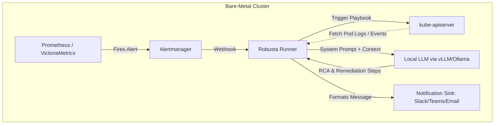
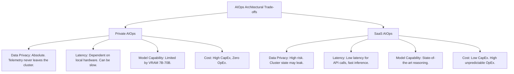

> **Complexity**: `[COMPLEX]`
>
> **Time to Complete**: 90-120 minutes
>
> **Prerequisites**: Kubernetes observability fundamentals, Prometheus alerting, Alertmanager routing, Helm, basic RBAC, and comfort reading Pod logs.
>
> **Environment Target**: Kubernetes v1.35+ on bare metal or an equivalent local cluster.
>
> **Lab Footprint**: A local cluster with at least 8 GiB of available memory.
>
> **Operational Focus**: Private anomaly detection, local LLM incident triage, predictive scaling, and guarded remediation.

## Learning Outcomes

By the end of this module, you will be able to perform the same design, evaluation, and guardrail decisions that a platform engineer makes before trusting private AIOps in production:

- **Design** a private AIOps architecture that keeps metrics, logs, events, and incident context inside the cluster boundary.
- **Compare** static alert thresholds, statistical baselines, and model-based anomaly detection for bare-metal Kubernetes workloads.
- **Configure** Robusta to enrich Prometheus alerts with Kubernetes context and a local OpenAI-compatible LLM endpoint.
- **Evaluate** predictive scaling decisions against reactive HPA behavior, resource limits, and dirty historical data.

<ul>
<li><strong>Implement</strong> human-in-the-loop guardrails that prevent automated remediation from turning a local incident into a wider outage.</li>
<li><strong>Diagnose</strong> latency, timeout, and resource-isolation failures when local inference runs beside production workloads.</li>
</ul>

## Why This Module Matters

<p>Hypothetical scenario: a platform team in a regulated manufacturing company receives a severe incident report at 02:13.</p>
<p>A critical internal API is returning intermittent errors.</p>
<p>The on-call engineer opens the alert, copies recent logs, pastes a stack trace into a public AI assistant, and asks for a root cause.</p>
<p>The assistant gives a useful answer.</p>
<p>The incident is resolved faster than usual.</p>
<p>The security team is not relieved.</p>
<p>The copied logs contained customer identifiers, private service names, internal hostnames, and a database error that exposed part of the schema.</p>
<p>The team did not intend to leak sensitive operational data.</p>
<p>They were trying to recover service.</p>
<p>This is the central tension of AIOps.</p>
<p>AI-assisted investigation can shorten mean time to understanding.</p>
<p>It can summarize noisy alerts, correlate events, and propose the next command to run.</p>
<p>It can also export the exact data that regulated teams are forbidden to send outside their environment.</p>
<p>Bare-metal Kubernetes makes this tension sharper.</p>
<p>The cluster often exists because the organization needs control over hardware, networking, compliance boundaries, latency, or data residency.</p>
<p>Sending Alertmanager payloads, Pod logs, and incident timelines to an external SaaS API can violate the same constraints that justified bare metal in the first place.</p>
<p>Private AIOps changes the shape of the system.</p>
<p>Instead of sending operational data to an external intelligence service, the team brings the intelligence to the operational data.</p>
<p>Prometheus, Alertmanager, Robusta, local LLM endpoints, and guarded automation run inside the same trust boundary as the workloads they inspect.</p>
<p>That shift does not make the system automatically safe.</p>
<p>A private model can still hallucinate.</p>
<p>A statistical alert can still flap.</p>
<p>A predictive scaler can still overreact to a past load test.</p>
<p>A remediation playbook can still delete the wrong thing if it is granted too much access.</p>
<p>The goal of this module is not to make AI sound magical.</p>
<p>The goal is to teach a disciplined architecture for using AI and anomaly detection without weakening the reliability and security posture of the cluster.</p>

## 1. Private AIOps as a Control Loop

AIOps is easiest to understand as a control loop. The system observes the cluster. It detects that something is unusual. It gathers context. It proposes or performs a response. It measures whether the response helped. A private AIOps system runs that loop inside the organization's infrastructure boundary. That boundary matters because incident context is often more sensitive than application code. An alert can include tenant names. A log line can include request IDs.

A Kubernetes event can reveal node names, image registries, namespace structures, or secret-related failure modes. A traceback can expose internal package names and feature flags. Private AIOps does not remove the need for careful data handling. It gives the platform team a chance to enforce that handling locally. The first design decision is the boundary. A weak boundary says, "The LLM endpoint is local, but any component may call out to the internet." A stronger boundary says, "Telemetry, enrichment, inference, and notification all have explicit egress rules." A production boundary usually adds audit logging, prompt redaction, network policy, and read-only Kubernetes access for the triage engine. The basic architecture has four responsibilities. Telemetry storage keeps the historical signal. Alerting decides when a human or automation should care. Context enrichment gathers the evidence an engineer would normally collect by hand. Inference and automation turn that evidence into a readable diagnosis or a constrained action. The components are replaceable. Prometheus could be VictoriaMetrics; Robusta could be a custom controller; Ollama could be vLLM; Slack could be email or an internal incident portal. The control-loop responsibilities stay the same.



A private design starts with a negative rule. The LLM should not be the first component to see raw cluster data. The enrichment layer should decide what evidence is relevant before building the prompt. That reduces token usage. It also reduces accidental exposure inside the prompt history, logs, and notification sinks. A useful mental model is "read many things, write almost nothing." The AIOps runner may read alerts, Pod status, recent events, selected logs, and rollout history. It should not normally create, delete, patch, cordon, drain, or roll back resources. Those state-changing privileges belong behind explicit approval.

The local LLM endpoint should also be treated as an internal service, not a trusted brain. It receives structured evidence and returns a recommendation. The recommendation is evidence for the operator, not an instruction that the cluster must obey. A good incident message separates facts from inference. Facts include the alert labels, namespace, deployment name, recent events, container restart count, and last log lines. Inference includes the model's suspected root cause. Recommended actions include commands the human can run. This separation makes hallucinations easier to spot.

If the model says "the database is down" but the facts only show an image pull error, the operator can reject the inference. The architecture must also protect the rest of the cluster from the AIOps workload. Local inference is compute-heavy. A CPU-only model may take tens of seconds to summarize one alert; a GPU model may starve other jobs if scheduling is not isolated. A runner that fetches too many logs can overload the API server; an Alertmanager route that sends every warning to the LLM can create a feedback loop during an outage; the first private AIOps rule is therefore capacity-aware design.

- Put the AI backend on dedicated nodes when possible.
- Set requests and limits.
- Use NetworkPolicy.
- Use alert routing to select only alerts that benefit from enrichment.
- Use timeouts and fallbacks.
- Never make incident delivery depend solely on AI completion.

:::tip
Running local LLMs and ML models requires dedicated GPU resources or significant CPU overhead.
On bare metal, isolate these workloads using node selectors, taints, tolerations, and resource quotas so they do not starve control plane add-ons or production workloads.
:::

A minimal private AIOps deployment should answer these questions before it is accepted into production:

- What data enters the prompt?
- Where are prompts logged?
- Which service account reads cluster context?
- Can the runner write to the Kubernetes API?
- What happens if the LLM endpoint is slow?
- What happens if the LLM endpoint is wrong?
- What happens if one alert storm triggers hundreds of inference requests?
- What human approval step exists before remediation changes cluster state?

**Active learning prompt:** Before reading further, sketch the trust boundary for your own cluster and mark every place where alert payloads, logs, prompts, responses, and notifications could be stored or forwarded.

Put Prometheus, Alertmanager, Robusta, the LLM endpoint, notification sinks, and the Kubernetes API server on the diagram; draw one line for allowed data flow and one line for blocked egress. If you cannot say where prompts are stored, your private AIOps design is incomplete.

## 2. Telemetry and Anomaly Detection

AIOps is only as good as the telemetry it can reason over. The model may write the most visible text, but the metrics and events determine whether the diagnosis is grounded. If the metrics are sparse, stale, mislabeled, or missing workload context, the AIOps layer will create confident summaries from weak evidence. A private AIOps stack usually starts with Prometheus or VictoriaMetrics. Prometheus is excellent for scraping metrics and evaluating rules.

The retention and density trade-offs should be explicit:

- VictoriaMetrics is often used when teams need longer retention, lower storage cost, or larger query volume.
- Thanos and Cortex-style architectures extend Prometheus by adding long-term storage and distributed query capabilities.
- The important design point is that anomaly detection needs history.
- A static alert may only need the last five minutes.
- A baseline alert may need days or weeks.
- A predictive scaler may need enough clean data to understand seasonality.
- The amount of history changes the architecture.
- Single-node Prometheus can evaluate simple alerts efficiently.
- It may struggle when rules repeatedly compute week-long standard deviations across high-cardinality series.
- Long windows require more samples to be scanned.
- More samples require more memory, more CPU, and more query time.

A private AIOps design should therefore separate critical alerting from expensive analysis where possible. Critical alerts should remain simple, fast, and reliable. Analysis jobs can run on a slower path if they do not block paging. Static thresholds are still useful. They are appropriate when the failure boundary is known.

Use the alerting style that matches the failure pattern:

- A node filesystem that is 98 percent full is a problem regardless of seasonality.
- A Pod restarting continuously is a problem regardless of traffic pattern.
- An API returning many 5xx responses is a problem when users are affected.
- Anomaly detection is useful when "normal" changes with time.
- Batch jobs may spike CPU at night.
- An internal portal may be quiet on weekends.
- A retail service may have predictable traffic peaks.
- A training pipeline may use a node pool heavily during planned windows.

In those cases, a fixed threshold either pages too often or misses important deviations. Prometheus gives you enough statistical tools to build a first useful baseline. You can compare the current metric to its historical average. You can divide that difference by historical standard deviation. The result is a Z-score. A Z-score around zero means the metric is near its baseline. A high positive score means the metric is unusually high compared with its own history. The following rule records a CPU anomaly score and alerts when the score stays high.

```yaml
# prometheus-rules.yaml
groups:
- name: node-anomaly-detection
  rules:
  - record: node:cpu_usage:z_score
    expr: >
      (
        instance:node_cpu_utilisation:rate1m
        -
        avg_over_time(instance:node_cpu_utilisation:rate1m[1w])
      )
      /
      stddev_over_time(instance:node_cpu_utilisation:rate1m[1w])

  - alert: NodeCPUUsageAnomaly
    expr: node:cpu_usage:z_score > 3
    for: 15m
    labels:
      severity: warning
    annotations:
      summary: "Anomalous CPU usage detected on {{ $labels.instance }}"

```

This is a useful first version; it is not a complete production rule; the denominator can approach zero when a metric is nearly flat; that means a tiny change can create a huge Z-score. A development node that idles for days may suddenly run a cron job and look statistically extreme; the alert fires even though nothing is wrong; a production-ready version adds an absolute floor. The floor says, "Only alert on unusual behavior when the workload is doing enough work for the anomaly to matter; "

```yaml
# prometheus-rules-hardened.yaml
groups:
- name: node-anomaly-detection
  rules:
  - record: node:cpu_usage:avg_1w
    expr: avg_over_time(instance:node_cpu_utilisation:rate1m[1w])

  - record: node:cpu_usage:stddev_1w
    expr: stddev_over_time(instance:node_cpu_utilisation:rate1m[1w])

  - record: node:cpu_usage:z_score
    expr: >
      (
        instance:node_cpu_utilisation:rate1m
        -
        node:cpu_usage:avg_1w
      )
      /
      clamp_min(node:cpu_usage:stddev_1w, 0.05)

  - alert: NodeCPUUsageAnomaly
    expr: >
      node:cpu_usage:z_score > 3
      and
      instance:node_cpu_utilisation:rate1m > 0.25
    for: 15m
    labels:
      severity: warning
    annotations:
      summary: "Anomalous CPU usage detected on {{ $labels.instance }}"
      runbook_url: "https://runbooks.internal.example/node-cpu-anomaly"

```

The key function is `clamp_min`; it prevents division by a near-zero standard deviation; the second condition prevents alerts when absolute usage is too low to matter; this pattern is not limited to CPU. You can use it for latency, request rate, queue depth, error rate, and saturation metrics; you must adjust the floor to the metric; a queue depth floor might be `10`; an error rate floor might be based on request volume. A latency floor might require enough requests to make the histogram meaningful.

**Worked example:** A team has an internal API with steady weekday traffic, so the engineer can compare current latency against a meaningful historical baseline instead of reacting to a single isolated sample.

The p99 latency normally sits near 180 milliseconds during office hours; at 09:40, p99 rises to 620 milliseconds; a static alert at 500 milliseconds would fire. A baseline alert also fires because the increase is unusual for that service at that time; the engineer checks request rate and sees no traffic increase; the engineer checks error rate and sees elevated timeouts; the likely cause is not more traffic. The likely cause is a downstream dependency or resource saturation; the AIOps enrichment should therefore gather dependency error logs, recent deployment events, and node pressure signals; this is how anomaly detection improves triage; it narrows the next evidence to collect.

It does not declare root cause alone; model-based anomaly tools can add more sophistication; openSearch anomaly detection can analyze log-derived streams. VictoriaMetrics `vmanomaly` can query historical time series, run a model, and write an anomaly score back; netdata-style local ML can train close to the source of the metric. These tools are useful when the pattern is too complex for a simple PromQL baseline; they also add operational cost; you must run more services; you must manage model schedules; you must decide which data is clean enough for training.

You must explain false positives to on-call engineers; you must decide whether the tool is available in your license and deployment model. A typical `vmanomaly` configuration defines a model, a reader query, and a writer endpoint; notice that the model produces another metric. The rest of the observability stack can alert on that metric like any other signal.

```yaml
# vmanomaly-config.yaml
models:
  prophet_model:
    class: "prophet"
    args:
      interval_width: 0.98

reader:
  datasource_url: "http://victoria-metrics:8428"
  queries:
    ingress_latency: "histogram_quantile(0.99, sum(rate(nginx_ingress_controller_request_duration_seconds_bucket[5m])) by (le, ingress))"

writer:
  datasource_url: "http://victoria-metrics:8428"

```

You then alert on the resulting metric, which keeps the model output inside the same Prometheus-style workflow that operators already know how to route, silence, graph, and review.

```yaml
# vmanomaly-alert.yaml
groups:
- name: ingress-anomaly-detection
  rules:
  - alert: IngressLatencyAnomaly
    expr: anomaly_score{model="prophet_model", query_name="ingress_latency"} > 1.0
    for: 5m
    labels:
      severity: warning
    annotations:
      summary: "Ingress latency is outside the model confidence boundary"

```

A model score is not automatically better than a PromQL rule; it is better only if it reduces false positives, catches meaningful anomalies earlier, and stays explainable enough for operators to trust; that trust is built through review. For every new anomaly detector, capture examples of true positives, false positives, and missed incidents; use those examples to decide whether the detector pages, opens a ticket, annotates a dashboard, or only enriches existing alerts. A private AIOps stack should also protect the API server; context enrichment often uses the Kubernetes API to fetch objects, events, and logs; during a cluster-wide incident, hundreds of alerts may fire.

If every alert triggers unbounded `kubectl logs` and `kubectl describe` equivalents, the enrichment layer can become part of the outage; use rate limits; group alerts; cache repeated lookups for a short period. Prefer label selectors that target one workload instead of scanning all namespaces; give Robusta or any custom runner a read-only service account with limited scope.

**Stop and think:** Why is `avg_over_time` combined with `stddev_over_time` expensive when the window is long?

Single-node Prometheus must read many samples for each series in the window; if the series has high cardinality, the query may become slow or memory-intensive. Long-term query systems reduce this pain by distributing storage and query work, but they do not make high-cardinality analysis free.

## 3. AI-Augmented Incident Response with Robusta

Alert enrichment is the most practical first use case for private AIOps; it gives engineers faster context without handing control of the cluster to a model; it also creates clear success criteria. A good enriched alert should help the on-call engineer decide the next command faster than the raw alert; robusta is useful because it already sits in the alert path; it can receive Alertmanager webhooks; it can fetch Kubernetes context.

It can run playbooks; it can send messages to sinks; it can call an OpenAI-compatible endpoint when configured to do so; a local LLM endpoint is usually served by Ollama or vLLM; ollama is simple for labs and smaller environments. vLLM is often preferred for higher throughput and GPU-backed serving; both can expose an API shape that many OpenAI-compatible clients understand; the compatibility layer is an interface choice, not a privacy guarantee.

The privacy guarantee comes from network design, endpoint placement, prompt handling, and egress control; the triage path should be intentionally narrow; alertmanager sends selected alerts to Robusta; robusta gathers bounded context; robusta builds a prompt with clear instructions. The local LLM returns a diagnosis and suggested investigation steps; robusta posts the result to a sink; the human decides whether to act; the prompt should ask for evidence-based output; a weak prompt asks, "What is wrong? " A better prompt asks the model to separate observed facts, likely causes, uncertainty, and next commands; that structure makes the answer easier to review under pressure.

The model should not be asked to invent commands beyond the evidence; it should be told to avoid destructive commands unless the prompt explicitly permits a suggestion; here is a production-oriented Robusta values fragment; it points Robusta at a local service. It also disables any cloud platform dependency and uses a sink that can be replaced with your internal incident channel.

```yaml
# robusta-values.yaml
globalConfig:
  cluster_name: "private-aiops-lab"
  chat_gpt_api_key: "dummy-key"
  chat_gpt_endpoint: "http://ollama.monitoring.svc.cluster.local:11434/v1"
  chat_gpt_model: "llama3.2:1b"

sinksConfig:
  - stdout_sink:
      name: main_stdout_sink

enablePlatform: false
enablePrometheusStack: false

customPlaybooks:
  - triggers:
      - on_prometheus_alert: {}
    actions:
      - ask_chat_gpt:
          prompt: |
            You are assisting a Kubernetes on-call engineer.
            Use only the alert and Kubernetes context provided.
            Return four sections:
            1. Observed facts.
            2. Most likely root cause.
            3. What evidence would confirm or reject this cause.
            4. Exactly two read-only kubectl commands to run next.
            Do not recommend deleting, patching, scaling, cordoning, draining, or rolling back resources.

```

The dummy API key is not a secret; some OpenAI-compatible client libraries require a string during initialization even when the local endpoint ignores it; the endpoint must remain internal; a `ClusterIP` Service is the normal shape. An Ingress is usually unnecessary and risky; if another namespace needs access, use NetworkPolicy to allow only that source; a local LLM service should have explicit resources; for a small lab model, CPU inference may be tolerable.

For production triage, slow inference can break the incident path; alertmanager and HTTP clients have timeouts; if the model takes longer than the timeout, the alert may arrive without AI enrichment or may produce a gateway timeout in the runner logs. That is acceptable if the base alert still reaches the human; it is unacceptable if AI enrichment is required for delivery; the Robusta service account should begin read-only. A minimal role can allow reads for Pods, Events, ReplicaSets, Deployments, StatefulSets, DaemonSets, Jobs, and Namespaces; logs are accessed through the `pods/log` subresource; do not grant wildcard verbs; do not grant wildcard resources. Do not grant cluster-admin because "it is only an internal tool; "

```yaml
# robusta-readonly-rbac.yaml
apiVersion: v1
kind: ServiceAccount
metadata:
  name: robusta-runner-readonly
  namespace: monitoring
---
apiVersion: rbac.authorization.k8s.io/v1
kind: ClusterRole
metadata:
  name: robusta-runner-readonly
rules:
- apiGroups: [""]
  resources: ["pods", "pods/log", "events", "namespaces", "services", "nodes"]
  verbs: ["get", "list", "watch"]
- apiGroups: ["apps"]
  resources: ["deployments", "replicasets", "statefulsets", "daemonsets"]
  verbs: ["get", "list", "watch"]
- apiGroups: ["batch"]
  resources: ["jobs", "cronjobs"]
  verbs: ["get", "list", "watch"]
---
apiVersion: rbac.authorization.k8s.io/v1
kind: ClusterRoleBinding
metadata:
  name: robusta-runner-readonly
roleRef:
  apiGroup: rbac.authorization.k8s.io
  kind: ClusterRole
  name: robusta-runner-readonly
subjects:
- kind: ServiceAccount
  name: robusta-runner-readonly
  namespace: monitoring

```

The prompt also needs a data budget; do not paste the last 10,000 log lines into a model because an alert fired; gather recent logs from the affected container; prefer the previous container logs when the Pod is restarting. Include recent Events for the namespace and object; include rollout history for the owning Deployment if available; redact obvious secrets; limit environment variables; avoid including entire ConfigMaps unless the runbook says they are safe; a useful enriched alert might look like this.

```text
Alert: KubePodCrashLooping
Namespace: payments
Workload: deployment/payment-api
Observed facts:
- Container payment-api restarted 6 times in 12 minutes.
- Last log line: "DATABASE_URL is required".
- Recent event: Back-off restarting failed container.
- Deployment revision changed 18 minutes ago.

Likely cause:
- The new rollout is missing a required database configuration value.

Evidence to confirm:
- Compare the current Deployment environment with the previous revision.
- Check whether the referenced Secret or ConfigMap exists.

Read-only commands:
- kubectl describe pod -n payments -l app=payment-api
- kubectl logs -n payments deploy/payment-api --previous

```

The model did not fix the cluster; it made the next investigation step obvious; that is a successful private AIOps interaction.

**Active learning prompt:** Imagine the same alert includes a log line containing a temporary access token, and trace where that token could persist after enrichment even if the inference endpoint is local.

Where could that token be stored after enrichment; consider Robusta logs, LLM server logs, notification sink history, alert archives, and debugging traces. Then decide which component should redact the token and which component should verify redaction.

## 4. Predictive Scaling Without Losing Control

Horizontal Pod Autoscaler is reactive; it observes current metrics; it changes replica count after those metrics cross a target; that design is reliable and simple; it also creates a delay. New Pods take time to schedule, pull images, start, warm caches, and pass readiness checks; for spiky workloads, the user-facing problem may happen before reactive scaling catches up; predictive scaling tries to move earlier. It uses historical patterns or external forecasts to scale before load arrives; a batch queue might scale workers before the daily file drop; a customer portal might scale before business hours; a streaming job might scale before an expected event.

This is useful only when the future resembles the clean parts of the past; predictive scaling becomes dangerous when the past contains incidents; a DDoS event can look like a seasonal spike; a load test can look like normal demand. A failed dependency can distort latency and queue depth; a data migration can create unusual traffic; if the model trains on those windows without labels, it may reproduce bad decisions later.

The safest design treats prediction as an advisory signal with hard bounds; reactive HPA remains the fallback; the predictive system writes a custom or external metric; the autoscaler uses that metric only within `minReplicas` and `maxReplicas`. The maximum is a capacity decision, not a model decision; a model may request more; the cluster should refuse. A common pattern is to expose a predicted request rate or desired replica count through the Kubernetes custom metrics API; kEDA can consume external metrics.

A custom controller can also compute a desired replica count and patch an HPA-like object; the implementation varies; the operational questions remain the same; what data trained the model; how are incident windows excluded; how often is the forecast updated? What happens when the forecast service is down; what is the maximum replica count; which workloads are allowed to use prediction; who approves a prediction model change; the following table helps compare scaling behaviors.

| Scaling Mode | Signal Used | Strength | Failure Mode | Guardrail |
| :--- | :--- | :--- | :--- | :--- |
| Reactive HPA | Current CPU, memory, or custom metric | Simple and predictable | Scales after users already feel the load | Tune readiness, stabilization windows, and resource requests |
| Scheduled scaling | Known calendar windows | Easy to reason about | Misses unexpected spikes | Keep reactive HPA active as fallback |
| Predictive scaling | Historical metrics and forecast model | Scales before expected load | Repeats dirty historical anomalies | Cap `maxReplicas` and exclude incident windows |
| Event-driven scaling | Queue depth or event backlog | Tracks real work directly | Bad metric adapters can stall scaling | Monitor adapter health and use fallback thresholds |

A worked scaling example shows the difference; a payment API normally receives 300 requests per second; at 09:00, traffic usually rises to 900 requests per second within ten minutes. Each Pod can handle 150 requests per second while staying under the latency objective; reactive HPA sees CPU rise after traffic begins; it scales from 3 Pods to 6 Pods; some users see elevated latency during the rollout. Scheduled scaling raises the Deployment to 6 Pods at 08:55; latency stays stable if the traffic pattern occurs; predictive scaling forecasts 900 requests per second based on recent weekdays; it recommends 6 Pods at 08:52.

That is useful when the forecast is clean; now add a past incident; last week at 09:00, a load test drove traffic to 2,400 requests per second. If the model treats that load test as normal seasonality, it may request 16 Pods today; if `maxReplicas` is 16 and the cluster has spare capacity, this may only waste resources. If many workloads do the same thing, the cluster may starve critical services; if `maxReplicas` is capped near the known legitimate peak, the bad forecast is contained.

> **Pause and predict**: If you apply a Holt-Winters predictive scaling model to a deployment that suffered a massive DDoS attack exactly one week ago, how will the autoscaler behave today, assuming it uses a standard 7-day seasonality window?
>
> The model may treat the DDoS traffic as a recurring seasonal spike and scale up aggressively today.
> That behavior can waste capacity or starve other workloads.
> The fix is not "never predict."
> The fix is to label and exclude dirty windows, bound replica counts, and keep a reactive fallback.

Predictive scaling also needs scale-down discipline; scaling down too quickly can create oscillation; a forecast may dip briefly and then recover. If Pods are terminated during the dip, the workload may need to scale up again minutes later; use stabilization windows; protect long-lived connections; respect PodDisruptionBudgets. Avoid using predictive scaling for workloads with expensive warm-up unless you have tested the full lifecycle; bare-metal clusters make these trade-offs concrete; there is no cloud autoscaling group that quietly adds more nodes.

If the model asks for too many Pods, they compete for fixed CPU, memory, GPU, storage, and network capacity; predictive scaling must therefore be integrated with cluster capacity planning; the model should know the workload; the platform should know the node pool. The SRE should know the blast radius.

## 5. Self-Healing Workflows and Guardrails

Self-healing is the most attractive and most dangerous part of AIOps; the promise is simple; the system detects an issue; it diagnoses the cause; it applies the fix; the service recovers before a human is paged; some remediation is safe. Restarting a known deadlocked sidecar in a noncritical namespace may be acceptable; deleting a stuck Job Pod may be acceptable; annotating an incident ticket is safe. Opening a pull request to adjust a limit is safe if reviewed; other remediation is dangerous; rolling back a Deployment can discard an emergency fix; cordoning a node can move pressure to weaker nodes; draining a node can violate disruption budgets.

Deleting Pods can erase evidence; scaling a workload can starve another workload; patching NetworkPolicy can open access accidentally; the difference is not whether a human likes automation; the difference is blast radius, reversibility, confidence, and approval. A private AIOps system should classify actions into tiers; read-only actions gather evidence; suggestion actions produce commands for a human; low-risk actions make reversible changes inside a small scope; high-risk actions require explicit approval; emergency actions require a separate incident process. Robusta allows playbooks to react to alerts; that flexibility is powerful; it should be constrained by RBAC and policy.

A playbook that only enriches an alert can run with read permissions; a playbook that rolls back a Deployment needs write permissions. Those permissions should not live in the same runner that processes arbitrary alerts.

```yaml
# Example Robusta custom playbook trigger
customPlaybooks:
  - triggers:
      - on_prometheus_alert:
          alert_name: HighErrorRate
    actions:
      - custom_rollback_action:
          namespace: "{{ alert.labels.namespace }}"
          deployment: "{{ alert.labels.deployment }}"

```

The example is intentionally short; it shows the shape of a state-changing playbook; it should not be copied into production without approval controls. A safer production design inserts an approval service between the recommendation and the write action; robusta posts an incident message with an "Approve rollback" action; the approval service receives the click. The service validates the namespace, deployment, alert name, time window, and actor; the service checks an allowlist; the service records an audit event; only then does it use a separate write-capable service account.

The write-capable token is not mounted into the LLM-facing runner; this split is important; it prevents prompt injection or model hallucination from directly reaching the Kubernetes API with write privileges; it also gives the organization an audit trail. A human can explain why an action was approved; a reviewer can see whether the action matched policy. An incident commander can stop the automation path if the situation changes; a guardrail policy should include at least these rules; the LLM-facing component is read-only; the model never receives long-lived write credentials.

The model may suggest commands but may not execute them; every state-changing action has an allowlist; every state-changing action has a rate limit; every state-changing action writes an audit event; every rollback includes the previous and target revision. Every node action respects PodDisruptionBudgets and maintenance policy; every automated path has a disable switch; rate limiting deserves special attention. Imagine a node-level anomaly detector fires for all nodes in a rack; a naive remediation loop cordons the first node; workloads move; the second node now looks pressured; the loop cordons it too.

Within minutes, the cluster has cordoned most of the available capacity; the original failure was a rack-level network issue; the automation converted it into a scheduling outage; a better design makes one change and then waits; it measures whether the signal improves. It refuses to act again until the cluster stabilizes or a human approves escalation; self-healing also needs evidence preservation. Before deleting or restarting anything, collect logs, events, object specs, and relevant metrics; if the action fails, the team needs evidence. If the action works, the team still needs to learn why the incident happened; aIOps should improve post-incident learning, not erase it.

**Active learning prompt:** Your team wants the LLM to restart Pods automatically when it sees `CrashLoopBackOff`, so evaluate the blast radius, evidence quality, controller ownership, and approval path before allowing that action.

Decide whether that should be allowed; then list the evidence you would require before approving it; for example, ask whether the Pod is controlled by a Deployment, whether it already restarted, whether a rollout just happened, and whether logs show configuration failure. If the restart only repeats the same crash, it is not remediation; it is noise.

## 6. Operating the Private AIOps Stack

Private AIOps is a system you operate, not a feature you install; it needs health checks; it needs capacity planning; it needs model evaluation; it needs prompt review; it needs access control; it needs incident drills. The most useful operational dashboard separates the pipeline into stages; alert received; context gathered; prompt built; lLM request started; lLM response returned; sink delivery succeeded; optional approval requested; optional action executed; optional verification completed; each stage should expose latency and failure counts. That lets you see where the system is weak; if context gathering is slow, reduce API calls or cache lookups.

If LLM requests time out, reduce prompt size or improve serving capacity; if sinks fail, decouple notification from enrichment. If approvals are never used, the action may not be trusted or may not solve a real problem; a private stack also needs prompt governance; prompts are operational code; they encode policy; they decide what evidence is included. They decide what actions are allowed; they can drift; review prompts like you review runbooks; store them in version control; test them against past incidents.

Reject prompts that ask the model to infer facts not present in the evidence; reject prompts that encourage destructive commands by default; model choice should be empirical; a larger model is not automatically better for incident triage. A smaller model with a precise prompt may produce better structured summaries; a larger model may require GPU capacity that your cluster cannot spare; evaluate on a set of real or sanitized incidents; score whether the model identifies the relevant signal.

Score whether it separates fact from speculation; score whether its commands are safe and useful; score latency; score cost in local resources; the trade-off between local and SaaS AIOps is not only privacy; it includes capability, latency, cost, operability, and accountability.



The diagram is deliberately blunt; in practice, many organizations use a hybrid approach; highly sensitive clusters use private inference; lower-risk environments may use SaaS tools with redaction. Some teams use SaaS for documentation assistance but private AIOps for live telemetry; the architecture should follow data classification.

| Feature | Private AIOps (Local LLM / vmanomaly) | SaaS AIOps (Datadog / OpenAI) |
| :--- | :--- | :--- |
| **Data Privacy** | Absolute. Telemetry never leaves the cluster. | High risk. Cluster state and secrets may leak in prompts. |
| **Latency** | Dependent on local GPU/CPU hardware. Can be slow. | Low latency for API calls, fast inference. |
| **Model Capability** | Limited by local VRAM (typically 7B-70B parameter models). | State-of-the-art reasoning (GPT-4, Claude 3.5 Sonnet). |
| **Cost** | High CapEx (GPUs, power, cooling). Zero OpEx. | Low CapEx. High, unpredictable OpEx based on token usage. |

A more operational comparison adds failure ownership, because the important question during an incident is not only which architecture is private, but who debugs each weak link when it fails.

| Decision Area | Private Choice | SaaS Choice | Senior Operator Question |
| :--- | :--- | :--- | :--- |
| Incident data | Kept inside cluster or private network | Sent to provider API | What data class appears in prompts and logs? |
| Model serving | Owned by platform team | Owned by provider | Who debugs latency during an outage? |
| Updates | Controlled locally | Provider-controlled | Can behavior change without your review? |
| Availability | Depends on local capacity | Depends on internet and provider | What happens during network isolation? |
| Audit | Internal logs and policy | Provider logs plus internal records | Can you prove who saw incident context? |

The implementation roadmap should be gradual; start with read-only enrichment; measure whether engineers find the summaries useful; add statistical anomaly rules for a small set of noisy alerts; compare alert quality before and after; introduce local LLM serving with limited traffic. Add prompt redaction and request logging; only then consider approval-based remediation; keep automated writes rare; a mature private AIOps stack has an evaluation loop. After every incident, ask whether the alert fired at the right time; ask whether enrichment included the right evidence; ask whether the model made a useful inference; ask whether any suggested command was unsafe.

Ask whether the human needed information that was missing; turn those answers into better rules, prompts, runbooks, and guardrails. That is how private AIOps becomes engineering practice instead of an impressive demo.

## Patterns & Anti-Patterns

Private AIOps works best when teams treat it as an observability control loop with explicit contracts rather than as a model bolted onto an alert stream. The durable pattern is to keep the LLM-facing path read-only, keep the evidence small and structured, and make every recommendation point back to observable facts. This pattern scales because each component has a bounded responsibility: Prometheus evaluates fast signals, Robusta gathers selected context, the local model summarizes that context, and humans or approved services decide whether cluster state should change. Another strong pattern is to separate fast paging from slower enrichment.

A severe alert should reach the on-call engineer even when the local model is cold, the GPU queue is full, or Robusta is backing off because the API server is under pressure. The enriched summary can arrive seconds later as additional evidence, which keeps the incident path reliable while still giving the operator a useful triage assistant. When teams make enrichment optional and observable, they can measure model usefulness without making alert delivery depend on inference latency. The third pattern is to treat predictive and anomaly models as advisory signals that must be bounded by capacity policy.

Statistical baselines are excellent at saying, "this metric is unusual compared with itself," but they do not know whether a rack has enough spare CPU, whether the traffic came from a load test, or whether the service owner already planned a migration. A senior operator therefore adds floors, caps, dirty-window labels, fallback HPA behavior, and change review around every model-driven scaling decision. The most common anti-pattern is granting the AIOps runner broad write permissions because a demo looks useful.

That shortcut couples prompt quality, model behavior, and Kubernetes write access into one failure domain, which is exactly the coupling a private system is supposed to avoid. A better design uses one read-only runner for enrichment, a separate approval service for state-changing actions, a narrow write-capable service account, and an audit record that includes the actor, alert, namespace, workload, and policy decision. A second anti-pattern is feeding raw telemetry into prompts without a data budget.

Teams often assume local inference removes the need for redaction, yet prompts, model server logs, Robusta debug output, and notification sinks can retain sensitive operational details long after the incident ends. The safer alternative is to collect only the evidence needed for the alert class, redact known secret shapes before prompt construction, cap log lines, and verify where prompts and responses are stored. A third anti-pattern is training on whatever history happens to exist; predictive scaling and anomaly detection both become brittle when load tests, dependency outages, migrations, and attack traffic are treated as normal seasonality.

The better habit is to maintain an incident calendar beside the metrics, exclude dirty windows from training or forecasting, and keep a review loop where false positives, true positives, and missed incidents are labeled after each event.

## Decision Framework

Start the decision with data classification rather than tooling preference; if the alert context contains customer identifiers, internal hostnames, schema fragments, tenant names, or regulated workload details, the default design should keep telemetry, prompts, model serving, and notifications inside the approved boundary. If the data class is lower risk, a SaaS assistant may be acceptable for documentation or runbook drafting, but live incident telemetry still needs a deliberate exception rather than an accidental copy-paste path.

Next decide whether the use case needs explanation, prediction, or action; explanation use cases, such as summarizing a CrashLooping Pod, usually fit read-only Robusta enrichment because the model can improve triage without touching cluster state. Prediction use cases, such as scaling before a daily traffic surge, require historical quality checks, hard replica bounds, and a reactive fallback. Action use cases, such as rollbacks or node operations, require approval, allowlists, audit events, and independent write credentials; then choose the narrowest signal that solves the operational problem.

A static threshold is still the right answer when the failure boundary is obvious, such as a full filesystem or a sustained high error rate. A PromQL baseline is useful when normal behavior changes by hour, day, or workload, but the metric remains explainable. A model-based detector is worth the extra operational burden only when it catches meaningful incidents earlier or reduces enough false positives to justify the new service, training data, and evaluation process; finally design the failure mode before you design the success demo.

If the LLM endpoint is unavailable, the base alert should still be delivered; if the API server is slow, enrichment should rate-limit and degrade; if the model invents a root cause, the message should expose the observed facts so the operator can reject the inference. A private AIOps rollout is ready for production only when the team can describe what happens when each component is slow, wrong, overloaded, or isolated from the network.

## Did You Know?

- **Prometheus was the second project to graduate from the CNCF**, which is why many Kubernetes observability designs still treat Prometheus-style metrics and alert rules as the default operational language.
- **OpenAI-compatible APIs are interfaces, not privacy controls**, so a local endpoint is private only when network policy, logging, egress control, and prompt handling keep the data inside the intended boundary.
- **Anomaly detection often fails because of dirty history**, since load tests, migrations, outages, and attacks can be misread as normal seasonality unless the training window is labeled or filtered.
- **Read-only AIOps can still create risk**, because copied logs, model prompts, sink messages, and runner debug output may retain sensitive incident data even when no Kubernetes write action is performed.

## Common Mistakes

| Mistake | Why It Happens | Fix |
| :--- | :--- | :--- |
| **Exposing the local LLM endpoint externally** | Local LLM services are often deployed quickly for testing and may not include strong authentication by default. | Keep the service as `ClusterIP`, restrict access with NetworkPolicy, and block unnecessary egress. |
| **Piping LLM output directly to `kubectl`** | Teams want faster remediation and mistake a confident answer for a verified answer. | Keep the LLM-facing runner read-only and require approval for state-changing actions. |
| **Running inference beside critical workloads without isolation** | The model is treated like a normal web service even though it consumes heavy CPU, memory, or GPU. | Use dedicated nodes, requests, limits, taints, tolerations, and priority classes. |
| **Using Z-scores on flat baseline metrics** | Near-zero standard deviation turns tiny changes into huge anomaly scores. | Add `clamp_min()` and an absolute traffic or utilization floor. |
| **Training predictive scaling on incident windows** | Historical data includes load tests, attacks, failed dependencies, or migrations. | Label and exclude dirty windows before training or forecasting. |
| **Letting AI enrichment block alert delivery** | Alert routing waits for a slow model response before notifying humans. | Deliver the base alert first or set strict timeouts with graceful fallback. |
| **Granting broad RBAC to the AIOps runner** | The runner needs many read operations, so teams accidentally grant wildcard write access. | Start with read-only verbs and split write actions into a separate approval service. |
| **Treating prompts as informal configuration** | Prompt changes are made directly in Helm values without review. | Version prompts, test them against incident examples, and review them like runbooks. |

## Quiz

<details>
<summary>1. Your platform team deploys Robusta with a local Ollama endpoint. During a security review, the reviewer asks why the system is considered private if Robusta still sends full Pod logs to the LLM service. What should you evaluate first?</summary>

You should evaluate the data path and storage points, not just the endpoint location; a local endpoint helps only if the logs, prompts, model server logs, runner logs, and notification sink all stay inside the approved trust boundary. You should check whether Robusta limits log collection, whether secrets are redacted before prompt construction, whether Ollama logs prompts, whether egress is blocked, and whether only approved namespaces can call the LLM service. The correct engineering response is to map where the incident data flows and where it is retained; a private hostname alone does not prove private handling.

</details>

<details>
<summary>2. A PromQL Z-score alert works well for a busy production API but flaps constantly for a quiet internal service. The metric is nearly zero most of the day. How should you redesign the alert?</summary>

You should keep the baseline idea but add safeguards for low-volume behavior; the main flaw is that standard deviation approaches zero when the metric is flat; dividing by that tiny value makes minor changes look statistically extreme. Use `clamp_min()` on the standard deviation and add an absolute floor such as minimum request rate, minimum CPU usage, or minimum error count. The alert should fire only when the anomaly is both statistically unusual and operationally meaningful.

</details>

<details>
<summary>3. A predictive scaler requests maximum replicas every Monday morning after a large load test happened the previous Monday. Users are not actually arriving at that volume. What went wrong, and what guardrail should have limited the damage?</summary>

The model treated a dirty historical window as a normal seasonal pattern; the load test should have been labeled and excluded from training or forecasting. The immediate guardrail should be a strict `maxReplicas` value based on known legitimate peak capacity and cluster limits; reactive HPA should remain available as a fallback. The senior-level lesson is that predictive scaling decisions must be bounded by capacity policy, not trusted as pure truth.

</details>

<details>
<summary>4. Robusta enrichment is useful during small incidents, but during a cluster-wide outage the API server becomes slower. Robusta is fetching logs, events, and object details for hundreds of alerts. What design change would reduce the risk?</summary>

You should reduce the enrichment blast radius; group alerts before enrichment; rate-limit Kubernetes API calls; cache repeated lookups for a short period; fetch bounded logs only for selected high-value alerts. Use label selectors that target the affected workload instead of broad namespace scans; the key is to make enrichment degrade gracefully during an outage instead of becoming another load source on the API server.

</details>

<details>
<summary>5. Your team wants the local LLM to execute `kubectl rollout undo` automatically whenever it sees a high error rate after a Deployment change. What safer design should you propose?</summary>

You should propose a human-in-the-loop approval path; the LLM-facing component should remain read-only; it may suggest a rollback and include the evidence, such as a recent rollout, rising error rate, and affected Deployment. An approval service should validate the namespace, workload, alert, actor, and allowed action before using a separate write-capable service account; the action should be audited and rate-limited. This design preserves speed while preventing hallucinated or overly broad write actions.

</details>

<details>
<summary>6. A local 7B model runs on CPU-only nodes. Alert messages arrive, but AI summaries are often missing and Robusta logs show timeout errors. What is the most likely cause, and what should you change first?</summary>

The likely cause is inference latency; cPU-only generation can take longer than Alertmanager, Robusta, or proxy timeouts; the first change is to make alert delivery independent from AI completion so humans still receive the base alert. Then reduce prompt size, use a smaller model, add GPU-backed serving, or route only selected alerts to the model; the operational goal is graceful degradation; the incident path must not depend on slow inference.

</details>

<details>
<summary>7. A model-generated incident summary says the database is down, but the included facts only show an image pull error for the affected Pod. How should an operator respond?</summary>

The operator should reject or at least distrust the model's root-cause inference; the facts do not support the conclusion. An image pull error points toward registry access, image name, tag, credentials, or node pull behavior; a database outage would need evidence from application logs, connection errors, dependency metrics, or database health checks. A well-designed AIOps message separates observed facts from inference so this kind of mismatch is visible.

</details>

<details>
<summary>8. Your organization wants to introduce private AIOps across all production namespaces at once. The proposed rollout includes anomaly detection, LLM summaries, predictive scaling, and automatic remediation in the first release. How should you reshape the rollout?</summary>

You should split the rollout into controlled stages; start with read-only alert enrichment for a small set of high-value alerts; measure usefulness, latency, false summaries, and data-handling behavior. Add statistical anomaly rules to selected noisy alerts and compare alert quality; introduce predictive scaling only for workloads with clean history and strict replica bounds; keep automatic remediation behind explicit approval and limited allowlists. This staged approach reduces blast radius and gives the team evidence before expanding capability.

</details>

## Hands-On Exercise: AI-Enriched Alerting with Robusta and a Local LLM

In this lab, you will build the safest first slice of private AIOps; you will deploy a local Ollama endpoint. You will configure Robusta to send selected Prometheus alerts to that endpoint; you will trigger a failing Pod. You will inspect whether the enriched alert separates observed facts from suggested next steps; you will keep remediation manual. You will use `kubectl` directly throughout the lab so every command remains copy-pasteable in non-interactive shells.

### Lab Scenario

Your organization runs an internal cluster where incident data must stay local; the on-call team wants AI-assisted summaries for `CrashLoopBackOff` alerts. The security team will approve the first rollout only if the AIOps runner is read-only and the LLM endpoint is not exposed outside the cluster; your task is to build that design and verify it.

### Prerequisites

- A Kubernetes v1.35+ cluster such as `kind`, `minikube`, or a nonproduction bare-metal test cluster.
- `kubectl` installed and configured.
- `helm` installed.
- `kube-prometheus-stack` installed in the `monitoring` namespace.
- At least 8 GiB of available memory for the lab cluster.
- Permission to create resources in the `monitoring` namespace.

### Task 1: Create the Monitoring Namespace if Needed

Start by checking whether the monitoring namespace already exists, because reusing the expected namespace keeps the Prometheus, Robusta, and Ollama service names consistent throughout the lab.

```bash
kubectl get namespace monitoring

```

If the namespace does not exist, create it explicitly and keep the command visible in your notes so the rest of the exercise has a clear installation boundary.

```bash
kubectl create namespace monitoring

```

Before creating any monitoring components, verify that your current Kubernetes context points to the intended nonproduction cluster and that the nodes are healthy enough for the lab workload.

```bash
kubectl cluster-info
kubectl get nodes

```

Success criteria for this task are the checks that prove the preceding step is safe, scoped, and ready for the next dependency:

- [ ] You verified the active cluster context.
- [ ] The `monitoring` namespace exists.
- [ ] You are not running the lab against a production cluster.

### Task 2: Deploy the Local Inference Endpoint

Create `ollama.yaml` with a Deployment and internal Service so the inference endpoint is reachable inside the cluster without exposing it through an Ingress or external load balancer.

```yaml
apiVersion: apps/v1
kind: Deployment
metadata:
  name: ollama
  namespace: monitoring
  labels:
    app: ollama
spec:
  replicas: 1
  selector:
    matchLabels:
      app: ollama
  template:
    metadata:
      labels:
        app: ollama
    spec:
      containers:
      - name: ollama
        image: ollama/ollama:0.5.4
        ports:
        - containerPort: 11434
          name: http
        resources:
          requests:
            cpu: "1"
            memory: "3Gi"
          limits:
            cpu: "4"
            memory: "8Gi"
---
apiVersion: v1
kind: Service
metadata:
  name: ollama
  namespace: monitoring
  labels:
    app: ollama
spec:
  type: ClusterIP
  selector:
    app: ollama
  ports:
  - name: http
    port: 11434
    targetPort: http

```

Apply the manifest and watch for validation errors immediately, because YAML mistakes in the inference service are easier to fix before Robusta depends on the endpoint.

```bash
kubectl apply -f ollama.yaml

```

Wait for the Ollama Pod to become ready before pulling the model, since the pull command runs inside the container and depends on the server process being available.

```bash
kubectl wait --for=condition=ready pod -l app=ollama -n monitoring --timeout=180s

```

Pull a small model for the lab so the exercise can run on modest local hardware while still using the same OpenAI-compatible request path as a larger deployment.

```bash
kubectl exec -n monitoring deploy/ollama -- ollama pull llama3.2:1b

```

Confirm that the Service is internal, because the privacy claim in this module depends on keeping prompt traffic inside the cluster networking boundary unless policy explicitly says otherwise.

```bash
kubectl get service ollama -n monitoring

```

Expected service type for the inference endpoint:

```text
TYPE        CLUSTER-IP
ClusterIP   <cluster-ip>

```

Success criteria for this task:

- [ ] Ollama is running in the `monitoring` namespace.
- [ ] The `ollama` Service is `ClusterIP`.
- [ ] The `llama3.2:1b` model is available inside the Pod.
- [ ] No Ingress or external LoadBalancer exposes the LLM endpoint.

### Task 3: Add a Read-Only RBAC Boundary

Create `robusta-readonly-rbac.yaml` to give the runner enough visibility for triage while proving that the same identity cannot delete Pods or patch workload controllers.

```yaml
apiVersion: v1
kind: ServiceAccount
metadata:
  name: robusta-runner-readonly
  namespace: monitoring
---
apiVersion: rbac.authorization.k8s.io/v1
kind: ClusterRole
metadata:
  name: robusta-runner-readonly
rules:
- apiGroups: [""]
  resources: ["pods", "pods/log", "events", "namespaces", "services", "nodes"]
  verbs: ["get", "list", "watch"]
- apiGroups: ["apps"]
  resources: ["deployments", "replicasets", "statefulsets", "daemonsets"]
  verbs: ["get", "list", "watch"]
- apiGroups: ["batch"]
  resources: ["jobs", "cronjobs"]
  verbs: ["get", "list", "watch"]
---
apiVersion: rbac.authorization.k8s.io/v1
kind: ClusterRoleBinding
metadata:
  name: robusta-runner-readonly
roleRef:
  apiGroup: rbac.authorization.k8s.io
  kind: ClusterRole
  name: robusta-runner-readonly
subjects:
- kind: ServiceAccount
  name: robusta-runner-readonly
  namespace: monitoring

```

Apply the file and treat any RBAC error as a design signal, because private AIOps should fail closed when the intended permissions are not installed correctly.

```bash
kubectl apply -f robusta-readonly-rbac.yaml

```

Verify permissions with impersonation checks so you test the actual service account boundary rather than assuming the manifest says what the API server enforces.

```bash
kubectl auth can-i get pods --as=system:serviceaccount:monitoring:robusta-runner-readonly -A
kubectl auth can-i delete pods --as=system:serviceaccount:monitoring:robusta-runner-readonly -A
kubectl auth can-i patch deployments --as=system:serviceaccount:monitoring:robusta-runner-readonly -A

```

Expected authorization result for the read-only runner:

```text
yes
no
no

```

Success criteria for this task:

- [ ] The Robusta service account can read Pods.
- [ ] The Robusta service account cannot delete Pods.
- [ ] The Robusta service account cannot patch Deployments.
- [ ] You can explain why read-only access is the correct starting point.

### Task 4: Configure Robusta for Local AI Enrichment

Create `robusta-values.yaml` with the local endpoint, read-only service account, and prompt constraints that keep the generated response focused on observed facts and safe next checks.

```yaml
globalConfig:
  cluster_name: "private-aiops-lab"
  chat_gpt_endpoint: "http://ollama.monitoring.svc.cluster.local:11434/v1"
  chat_gpt_model: "llama3.2:1b"
  chat_gpt_api_key: "dummy-key"

sinksConfig:
  - stdout_sink:
      name: main_stdout_sink

enablePlatform: false
enablePrometheusStack: false

runner:
  serviceAccount:
    create: false
    name: robusta-runner-readonly

customPlaybooks:
  - triggers:
      - on_prometheus_alert: {}
    actions:
      - ask_chat_gpt:
          prompt: |
            You are assisting a Kubernetes on-call engineer.
            Use only the alert and Kubernetes context provided.
            Return four sections:
            1. Observed facts.
            2. Most likely root cause.
            3. Evidence that would confirm or reject this cause.
            4. Exactly two read-only kubectl commands to run next.
            Do not recommend deleting, patching, scaling, cordoning, draining, or rolling back resources.

```

Install Robusta with Helm and keep the values file under review, because the endpoint, sink, prompt, and service account together define the operational behavior of the enrichment path.

```bash
helm repo add robusta https://robusta-charts.storage.googleapis.com
helm repo update
helm upgrade --install robusta robusta/robusta -f robusta-values.yaml -n monitoring

```

Verify the runner Pod before routing alerts to it, since Alertmanager should not depend on a receiver that is still pulling images or failing startup checks.

```bash
kubectl get pods -n monitoring -l app=robusta-runner

```

Success criteria for this task:

- [ ] Robusta is installed in `monitoring`.
- [ ] The runner reaches `Ready`.
- [ ] Robusta points to the in-cluster Ollama endpoint.
- [ ] Robusta is configured with a read-only service account.
- [ ] The prompt forbids destructive commands.

### Task 5: Route Alertmanager Webhooks to Robusta

Create or update your `kube-prometheus-stack` values file with this routing shape, and remember that the example sends alerts to Robusta through internal cluster DNS rather than through a public webhook.

```yaml
# prometheus-values.yaml
alertmanager:
  config:
    route:
      receiver: "robusta"
      group_by: ["alertname", "namespace"]
      group_wait: 10s
      group_interval: 1m
      repeat_interval: 4h
    receivers:
    - name: "robusta"
      webhook_configs:
      - url: "http://robusta-runner.monitoring.svc.cluster.local/api/alerts"
        send_resolved: true

```

Apply the Alertmanager update carefully, because a malformed route can interrupt alert delivery even when the Robusta and Ollama components are working correctly.

```bash
helm upgrade kube-prometheus-stack prometheus-community/kube-prometheus-stack -f prometheus-values.yaml -n monitoring

```

Check that Alertmanager is healthy after the change, then confirm that the configured receiver still points at the internal Robusta service rather than an external endpoint.

```bash
kubectl get pods -n monitoring -l app.kubernetes.io/name=alertmanager

```

Success criteria for this task:

- [ ] Alertmanager is configured to send alerts to Robusta.
- [ ] The Robusta webhook URL uses the internal cluster DNS name.
- [ ] Alertmanager Pods remain healthy after the configuration change.

### Task 6: Trigger a CrashLooping Workload

Create `crashing-pod.yaml` with an intentionally failing container, because the lab needs a simple, explainable failure before you judge whether the model summary is grounded.

```yaml
apiVersion: v1
kind: Pod
metadata:
  name: failing-app
  namespace: default
  labels:
    app: failing
spec:
  containers:
  - name: app
    image: busybox:1.36
    command:
    - "/bin/sh"
    - "-c"
    - "echo 'Connecting to database...'; echo 'DATABASE_URL is required'; sleep 2; exit 1"

```

Apply the file and treat any RBAC error as a design signal, because private AIOps should fail closed when the intended permissions are not installed correctly.

```bash
kubectl apply -f crashing-pod.yaml

```

Watch the Pod enter a restart loop and stop the watch once the failure is visible, because the goal is to generate evidence rather than leave your terminal blocked.

```bash
kubectl get pod failing-app -n default --watch

```

In another terminal, inspect the evidence manually before reading the AI summary so you have a baseline for detecting hallucinated facts or unsafe recommendations.

```bash
kubectl describe pod failing-app -n default
kubectl logs failing-app -n default --previous

```

Success criteria for this task:

- [ ] The Pod enters `CrashLoopBackOff`.
- [ ] The previous logs include `DATABASE_URL is required`.
- [ ] You can identify the likely cause without AI assistance.
- [ ] You have a baseline for judging the model output.

### Task 7: Inspect the AI-Enriched Alert

Wait for Prometheus and Alertmanager to route the alert; this may take several minutes depending on your rule intervals; tail Robusta logs.

```bash
kubectl logs -f deploy/robusta-runner -n monitoring

```

Look for an entry shaped like this, then compare the model output against the manual evidence instead of accepting the summary just because it is fluent.

```text
[INFO] Triggering playbook ask_chat_gpt for alert KubePodCrashLooping
[INFO] Querying LLM endpoint http://ollama.monitoring.svc.cluster.local:11434/v1
[STDOUT_SINK] Alert: KubePodCrashLooping in default
Observed facts:
- Pod failing-app is restarting.
- Previous logs contain DATABASE_URL is required.
Most likely root cause:
- The application is missing required database configuration.
Read-only commands:
- kubectl describe pod failing-app -n default
- kubectl logs failing-app -n default --previous

```

Evaluate the output; do not only check whether text exists; check whether the model separates observed facts from inference; check whether the commands are read-only; check whether the diagnosis matches the manual evidence. Check whether the model invented facts that were not provided; success criteria:

- [ ] Robusta receives the alert.
- [ ] Robusta calls the local LLM endpoint.
- [ ] The enriched output appears in Robusta logs.
- [ ] The model identifies the missing configuration as the likely cause.
- [ ] The suggested commands are read-only.
- [ ] The model does not recommend deleting, patching, scaling, cordoning, draining, or rolling back resources.

### Task 8: Add a NetworkPolicy Boundary

If your cluster uses a CNI that enforces NetworkPolicy, add a policy that allows only selected monitoring Pods to reach Ollama; create `ollama-network-policy; yaml`.

```yaml
apiVersion: networking.k8s.io/v1
kind: NetworkPolicy
metadata:
  name: ollama-allow-robusta-only
  namespace: monitoring
spec:
  podSelector:
    matchLabels:
      app: ollama
  policyTypes:
  - Ingress
  ingress:
  - from:
    - podSelector:
        matchLabels:
          app: robusta-runner
    ports:
    - protocol: TCP
      port: 11434

```

Apply the file and treat any RBAC error as a design signal, because private AIOps should fail closed when the intended permissions are not installed correctly.

```bash
kubectl apply -f ollama-network-policy.yaml

```

Verify that the policy exists, and separately confirm whether your local CNI enforces NetworkPolicy because some lightweight clusters accept the object without enforcing traffic isolation.

```bash
kubectl get networkpolicy -n monitoring ollama-allow-robusta-only

```

Success criteria for this task:

- [ ] A NetworkPolicy protects the Ollama Pod.
- [ ] Only the intended monitoring client can reach the inference endpoint.
- [ ] You understand whether your local CNI enforces NetworkPolicy.

### Task 9: Clean Up the Lab

Delete the failing Pod first so the alert stops firing and the rest of the cleanup does not hide whether the workload itself was removed successfully.

```bash
kubectl delete pod failing-app -n default

```

Optional cleanup for the lab components removes Robusta, the NetworkPolicy, RBAC, and Ollama resources while leaving your written observations available for later review.

```bash
helm uninstall robusta -n monitoring
kubectl delete -f ollama-network-policy.yaml --ignore-not-found
kubectl delete -f robusta-readonly-rbac.yaml --ignore-not-found
kubectl delete -f ollama.yaml --ignore-not-found

```

Success criteria for this task:

- [ ] The failing workload is removed.
- [ ] Optional lab components are removed if you no longer need them.
- [ ] You retained notes about model quality, latency, and safety.

### Lab Reflection

Answer these questions before considering the design production-ready, because a private AIOps rollout is acceptable only when the team can explain data handling, failure modes, and approval boundaries.

- [ ] Which fields from the alert were sent to the model?
- [ ] Which logs were sent to the model?
- [ ] Where are prompts and responses stored?
- [ ] What happens when the LLM endpoint is unavailable?
- [ ] What happens when the LLM endpoint is slow?
- [ ] Which service account can write to the Kubernetes API?
- [ ] Which suggested action would require human approval?
- [ ] Which alert types are worth enriching, and which should stay simple?
- [ ] How would you detect that the model started hallucinating unsafe commands?
- [ ] How would you test the prompt against a past incident?

## Sources

- [Prometheus query functions](https://prometheus.io/docs/prometheus/latest/querying/functions/)
- [Prometheus alerting rules](https://prometheus.io/docs/prometheus/latest/configuration/alerting_rules/)
- [Alertmanager configuration](https://prometheus.io/docs/alerting/latest/configuration/)
- [Kubernetes RBAC reference](https://kubernetes.io/docs/reference/access-authn-authz/rbac/)
- [Kubernetes NetworkPolicy concept](https://kubernetes.io/docs/concepts/services-networking/network-policies/)
- [Kubernetes Horizontal Pod Autoscaling](https://kubernetes.io/docs/tasks/run-application/horizontal-pod-autoscale/)
- [Kubernetes PodDisruptionBudget documentation](https://kubernetes.io/docs/tasks/run-application/configure-pdb/)
- [Robusta Helm chart installation](https://docs.robusta.dev/master/setup-robusta/installation/standalone-installation.html)
- [Robusta Prometheus alert trigger documentation](https://docs.robusta.dev/master/playbook-reference/triggers/prometheus.html)
- [VictoriaMetrics anomaly detection](https://docs.victoriametrics.com/anomaly-detection/)
- [vLLM OpenAI-compatible server](https://docs.vllm.ai/en/latest/serving/openai_compatible_server.html)
- [Ollama API documentation](https://github.com/ollama/ollama/blob/main/docs/api.md)

## Next Module

Ready to take your bare-metal clusters to the next level; in the next module, [Module 9; 6: Edge Inference and Hardware Acceleration](/on-premises/ai-ml-infrastructure/module-9. 6-edge-inference), you will explore how to configure SR-IOV, MIG, and optimized scheduling to get reliable inference performance from local hardware.
