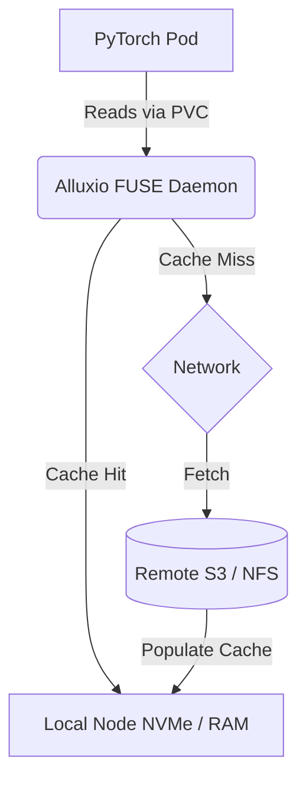

> **Complexity**: Complex
>
> **Time to Complete**: 90-120 minutes
>
> **Prerequisites**: Kubernetes storage primitives, CSI basics, Linux filesystems, GPU training concepts, and basic Helm usage.

---

## Learning Outcomes

* **Calculate** storage bandwidth and metadata pressure needed to prevent GPU starvation during distributed AI training.
* **Design** tiered storage topologies that combine local NVMe, distributed caches, remote object storage, and parallel file systems.
* **Implement** a Kubernetes-native data cache with Fluid and Alluxio, then validate cache binding, warmup, and consumption.
* **Compare** NFS-over-RDMA, BeeGFS, Lustre, local NVMe, and cloud block storage for AI workload tradeoffs.
* **Diagnose** checkpoint storms, POSIX metadata bottlenecks, and GPUDirect Storage placement issues that waste CPU or GPU time.

## Why This Module Matters

Hypothetical scenario: a platform team installs a new bare-metal Kubernetes cluster for computer vision training. The GPU nodes are expensive, the network fabric is fast, and the model code has already been tuned by the ML engineers. The first training run still shows disappointing utilization because each worker repeatedly opens millions of tiny images from shared storage, and the file system spends more time answering metadata questions than delivering bytes. The storage tier has turned into the throttle for the whole system.

That failure mode feels counterintuitive because storage performance is often discussed as a single throughput number. AI training does not consume storage as a simple stream of large files, and it does not behave like a database with a compact working set. The same job may need high sequential read bandwidth for shards, high write bandwidth for checkpoints, high metadata rates for small files, and low CPU overhead so data movement does not steal cycles from augmentation, tokenization, and GPU feeding. A design that looks oversized on a vendor throughput chart can still starve GPUs if it ignores those access patterns.

This module teaches storage as a data path, not as a brand choice. You will learn how to estimate the pressure that training jobs create, when Kubernetes local volumes are appropriate, why distributed caches change the economics of repeated epochs, and how GPUDirect Storage and RDMA reduce CPU involvement. You will also build a small Fluid and Alluxio cache so the control-plane pieces become concrete rather than abstract names in an architecture diagram.

## Start With the Data Path, Not the Product

High-performance AI storage begins with a simple question: where does a training sample travel before the GPU can use it? A sample might start in object storage, pass through a gateway or parallel file system client, land in a kernel page cache, move through a Python data loader, get decoded or tokenized on the CPU, and finally cross PCIe into GPU memory. Each hop has its own throughput limit, queue depth, latency behavior, and failure mode. When a GPU waits for input, the visible symptom is low utilization, but the cause may be a metadata server, a FUSE process, a slow checkpoint writer, or a NUMA mismatch between a GPU and a NIC.

The first mistake is treating storage as a single bandwidth pool. Large language model pretraining often reads big token shards sequentially, while image training may read huge numbers of small files in randomized order, and reinforcement learning pipelines may write bursts of replay data. Checkpoints are different again because they create synchronized write spikes from multiple ranks. Good storage architecture separates these phases so the read path, write path, metadata path, and cache path can be tuned independently.

Training also repeats itself in a way that normal web workloads rarely do. An epoch walks through a dataset, and the next epoch often reads the same bytes again in a different order. If the dataset is remote and unchanged, repeatedly paying the full network and metadata cost is wasteful. A tiered design uses remote storage for durability, a parallel file system or object API for shared access, local NVMe or memory for hot reads, and a cache controller to keep those layers coordinated with Kubernetes scheduling.

Pause and predict: if a worker reads a million small JPEG files over a fast network and the link remains mostly idle, which component should you inspect before buying a bigger switch? The most likely answer is the metadata service, because every `stat()`, `open()`, and `close()` is a separate operation that can become serialized through file-system locks and directory structures. The GPU sees an empty batch queue, but the storage team sees CPU saturation on metadata handling rather than network saturation on bulk transfer.

The operational model is easier to reason about when you split the workload into three pressure types. The first is sustained read bandwidth, which determines whether data arrives quickly enough during the steady state of training. The second is metadata operations per second, which determines whether small files can be discovered and opened without overwhelming directory and inode services. The third is burst write bandwidth, which determines whether checkpoint events block progress or destabilize the shared storage system.

```
Training process
  |
  |  sample request
  v
+------------------+      metadata       +------------------+
| Data loader      | ------------------> | Metadata service |
| workers          | <------------------ | path, inode, ACL |
+------------------+                     +------------------+
  |
  |  byte stream
  v
+------------------+      objects        +------------------+
| Cache or client  | ------------------> | Storage targets  |
| FUSE/kernel/RDMA | <------------------ | NVMe/HDD/object  |
+------------------+                     +------------------+
  |
  |  decoded tensors
  v
+------------------+
| GPU memory       |
+------------------+
```

Use a back-of-the-envelope estimate before you choose any implementation. If each GPU consumes 700 MiB/s of preprocessed data and you run 64 GPUs, the cluster needs roughly 44 GiB/s of delivered read bandwidth before overhead. If the dataset is made of 50 KiB files, that same byte rate implies hundreds of thousands of file opens per second, which is a very different design target. The calculation does not have to be perfect; it needs to expose whether your bottleneck will probably be bytes, file operations, CPU copies, or synchronized writes.

The estimate should include the data loader, not only the storage device. A PyTorch job may launch several workers per process, each worker may prefetch several batches, and each batch may require decoding, resizing, tokenization, or compression work before tensors are ready. If preprocessing is slow, a faster file system will not fix the queue feeding the GPU. If preprocessing is fast but file opens are slow, increasing data-loader workers can make the metadata problem worse because more workers generate more concurrent lookups.

You can usually tell which side you are on by comparing queue and system metrics during a steady epoch. If storage bandwidth is low, metadata CPU is high, and data-loader workers spend time blocked in I/O, the file system path is suspect. If storage bandwidth is high but CPU is saturated in image decoding or tokenization, the bottleneck sits above storage. If both look healthy but GPUs still wait, inspect the framework's prefetch settings, batch collation behavior, and whether distributed workers are accidentally reading the same shards.

Checkpoint traffic deserves its own calculation because it is bursty and synchronized by default. A model with large optimizer state can write hundreds of GiB at a checkpoint boundary, and every distributed rank may try to write at the same moment. If each rank writes directly to a shared path, the storage system receives a thundering herd of large writes plus metadata updates for new checkpoint files. A better design stages, aggregates, or staggers checkpoint writes so training progress does not pause behind a storage traffic jam.

Before running a benchmark, decide what output would convince you that the storage tier is healthy. GPU utilization alone is not enough because it lags behind the cause. Useful signals include data-loader queue depth, per-rank batch latency, metadata server CPU, file-open rate, read bandwidth per node, checkpoint duration, retransmits on the storage fabric, and CPU time spent in kernel or FUSE paths. When these signals are collected together, the storage conversation becomes an engineering diagnosis rather than a debate about product names.

A useful benchmark has two phases: cold access and warm access. Cold access tells you the cost of fetching from the upstream system, building kernel cache, filling a distributed cache, or opening files for the first time. Warm access tells you what the training job experiences once locality is established. If you report only the better number, you may hide a first-epoch delay that wastes scheduled GPU time; if you report only the cold number, you may reject a cache design that is excellent for long multi-epoch training runs.

## Kubernetes Storage Primitives for AI Workloads

Kubernetes does not make disks fast by itself. It provides an API for binding pods to volumes, isolating workloads, and letting storage drivers integrate with scheduling. The Container Storage Interface matters because it lets storage vendors and open source projects ship drivers outside the core Kubernetes release cycle. FlexVolume has been deprecated since Kubernetes 1.23, and modern high-performance integrations should be evaluated through CSI behavior, topology support, snapshots, access modes, and operational maturity.

PersistentVolumes and PersistentVolumeClaims are useful for AI jobs because they make storage visible to schedulers and controllers. However, the access mode and binding mode determine whether the abstraction protects you or misleads you. `ReadWriteOnce` limits a volume to a single node, not a single pod, which can still allow multiple pods on that node to write the same checkpoint path. `ReadWriteOncePod`, stable since Kubernetes 1.29 for CSI volumes, is a stronger option when only one pod should write a checkpoint PVC.

Local persistent volumes are attractive for AI because NVMe devices sit close to the CPU, PCIe fabric, and GPUs. They can deliver very high IOPS and low latency, but they are not portable network disks. Kubernetes local volumes in Kubernetes 1.35 use `kubernetes.io/no-provisioner`, and local storage classes should use `WaitForFirstConsumer` so binding happens after the scheduler knows where the consuming pod can run. That delay is important because the volume physically exists on one node, and binding too early can trap a claim on a node that cannot satisfy the pod's other constraints.

Avoid `hostPath` as the production answer for local AI storage. It is convenient during a quick experiment because it exposes a node path directly into a pod, but it bypasses most of the lifecycle and scheduling protections that make Kubernetes useful. A pod using `hostPath` can become coupled to undocumented node layout, inconsistent permissions, and hidden cleanup behavior. Local PVs still require operational discipline, yet they make the topology explicit enough for schedulers and humans to reason about placement.

Ephemeral storage has a different role. CSI ephemeral volumes and generic ephemeral volumes can be useful for scratch data, temporary preprocessing, and test jobs where losing the data is acceptable. They are not a durable checkpoint layer, and Kubernetes local ephemeral storage should not be treated as having guaranteed IOPS or survival across node failure. If a training run cannot be restarted from a remote checkpoint, the data does not belong only in ephemeral space.

Volume snapshots and volume group snapshots become relevant when training state spans several volumes. A single-volume snapshot can be consistent for one PVC, but a distributed job may store rank-local state, optimizer shards, and metadata across multiple claims. Kubernetes Volume Group Snapshots moved through beta evolution after their alpha introduction, and the key architectural idea is point-in-time consistency across related volumes when the CSI driver supports it. Without that consistency, restoring a checkpoint can produce torn state where different pieces represent different training moments.

Cloud block storage changes the cost model but not the physics. AWS gp3 volumes provide baseline IOPS and throughput, and higher limits must be explicitly provisioned within provider constraints. Those volumes can be useful for single-node caches or moderate workloads, but a multi-node GPU training job can quickly exceed the per-volume and per-node attachment model. Bare-metal local NVMe avoids cloud block latency, yet it shifts responsibility for failure handling, inventory, replacement, formatting, and topology-aware scheduling back to the platform team.

The platform contract should say which data is allowed to disappear. A local cache can be rebuilt from an object store, so its loss is an availability and performance event rather than a data-loss event. A checkpoint that exists only on a node-local disk is different because the next failure may erase the only recoverable state. Clear labels, StorageClasses, and documentation help, but the stronger control is designing the workflow so unique state is copied or committed to durable storage before the job is considered safe.

Kubernetes scheduling also needs enough information to avoid accidental cross-traffic. A pod requesting a GPU, a local cache volume, and a high-speed NIC should not land wherever a generic CPU workload would land. Node labels, topology keys, device plugins, and storage class binding modes need to describe the physical shape of the server. Otherwise the scheduler may satisfy each request independently while creating a data path that crosses sockets or misses the intended NVMe tier.

| Workload need | Kubernetes primitive | Why it fits | Main caution |
| :--- | :--- | :--- | :--- |
| Durable shared dataset | CSI-backed RWX volume or object-backed cache | Many pods can read a common source of truth. | Metadata and FUSE overhead can dominate small-file workloads. |
| Exclusive checkpoint writer | CSI PVC with ReadWriteOncePod | Prevents accidental multi-pod writes to the same state. | Requires driver support and Kubernetes 1.29+ behavior. |
| Node-local hot cache | Local PV with WaitForFirstConsumer | Keeps reads near GPUs and respects node topology. | Data is tied to hardware and needs rebuild or refill logic. |
| Temporary preprocessing scratch | Generic ephemeral volume | Lifecycle follows the pod and avoids manual cleanup. | Not durable, not an IOPS guarantee, and unsuitable for unique checkpoints. |

Which approach would you choose here and why: one team wants the fastest possible scratch area for decoded samples, while another wants a durable checkpoint target that survives node loss? The first case usually fits ephemeral or local cache space because the data can be regenerated. The second needs a durable CSI-backed target, object storage, or a parallel file system with checkpoint discipline because unique model state must outlive any single node.

## Parallel File Systems, RDMA, and GPUDirect Storage

Parallel file systems exist because one server cannot satisfy every metadata and data request in a large training cluster. Systems such as Lustre and BeeGFS split metadata from object storage so clients can locate files through metadata services and then read or write data across multiple storage targets. This architecture can scale large sequential reads and writes by adding targets, but it does not automatically fix every AI access pattern. Millions of tiny files can still pound metadata services, and strict POSIX behavior can add lock and consistency overhead that the training phase may not need.

POSIX semantics are useful because applications can rely on familiar file behavior, permissions, atomicity, and directory visibility. The cost is that distributed systems must coordinate those promises across many clients. During read-heavy training, strict access-time updates, directory consistency, and lock checks can consume resources without improving the model's result. Many AI platforms therefore relax the path by converting data into shards, reading from object APIs, or using caches that present a file-like interface while avoiding repeated remote metadata work.

NFS-over-RDMA addresses a different bottleneck. Traditional NFS over TCP requires the kernel networking stack to process packets, copy data, handle interrupts, and move bytes toward user space. At high line rates, those CPU costs become visible even if the storage system can deliver data. RDMA lets capable NICs move data more directly between endpoints, reducing CPU involvement and interrupt pressure. It can improve an NFS architecture, but it does not turn a single metadata service into an infinitely scalable namespace.

GPUDirect Storage pushes the CPU-bypass idea closer to the accelerator. Standard file I/O usually moves data through host memory before it reaches GPU memory, which consumes CPU cycles and memory bandwidth. NVIDIA documents GPUDirect Storage as a direct DMA path between storage and GPU memory for supported stacks, reducing bounce buffering and lowering CPU utilization. The catch is that GDS is not just a software switch; it depends on supported drivers, filesystems, kernel modules, and physical topology.

Topology matters because PCIe and NUMA placement shape the real path. If a NIC, NVMe device, and GPU are attached near the same CPU socket and PCIe switch, direct transfers can avoid expensive cross-socket movement. If they sit on different NUMA nodes, the data path may traverse an inter-socket link and lose much of the expected benefit. Kubernetes scheduling must therefore consider GPU, NIC, and storage locality together, especially on dense servers with multiple accelerators and several NVMe devices.

| Feature | Lustre | BeeGFS | WekaFS (Commercial) |
| :--- | :--- | :--- | :--- |
| **Architecture** | MDS (Metadata) + OST (Object) | Metadata Nodes + Storage Nodes | Distributed, NVMe-native, custom protocol |
| **Complexity** | Extremely High | Moderate | Low (Turnkey, but closed source) |
| **POSIX Support** | Strict | Strict | Strict |
| **Small File Perf** | Poor to Moderate | Good | Excellent |
| **Kubernetes CSI** | `intel/lustre-csi-driver` | `beegfs/beegfs-csi-driver` | `weka/csi-wekafs` |

The table is a starting point, not a universal ranking. Lustre can deliver enormous throughput in environments with storage engineering expertise, but it rewards careful tuning and operational maturity. BeeGFS is often easier for on-premises AI teams to adopt because metadata and storage services are simpler to reason about, though it still needs hardware isolation and monitoring. Commercial systems can reduce operational burden, but they introduce procurement, licensing, and vendor dependency that must be weighed against internal expertise.

Metadata placement is one of the most practical design decisions. Do not place metadata services on the same physical NVMe devices that serve large object data if the workload includes millions of samples. Metadata IOPS can starve sequential object reads, and sequential reads can add latency to metadata operations. Dedicated high-endurance NVMe for metadata, plus dataset sharding to reduce file-open rates, gives the file system a much better chance of keeping GPUs fed.

Read and write size configuration also matters with NFS. If a Kubernetes mount uses small default `rsize` and `wsize` values, large checkpoint files may be broken into too many operations. Explicitly setting larger transfer sizes, such as 1 MiB where the stack supports it, reduces command amplification. The setting will not repair a weak architecture, but it prevents a well-built path from being quietly limited by conservative defaults.

RDMA and GDS should be introduced after basic storage hygiene, not before it. If a dataset is still stored as millions of tiny files, direct memory paths will not remove the metadata work required to find and open those files. If checkpoint writers are uncoordinated, faster data movement can make the burst sharper rather than safer. Use direct paths when the byte movement itself is the bottleneck and the rest of the pipeline has already been shaped into large, predictable transfers.

Operationally, direct data paths add a validation burden that normal file mounts do not have. Kernel modules, driver versions, firmware, PCIe topology, switch settings, and filesystem support all become part of the storage SLO. That does not make RDMA or GDS fragile by definition, but it means the platform team needs an acceptance test that proves the intended path is active. A benchmark that silently falls back to the normal CPU-copy path can create false confidence until the cluster is under real load.

## Tiering, Caching, and Dataset Format

Caching is not a shortcut around storage design; it is a way to align repeated training behavior with hardware locality. Remote object storage or a centralized file system remains the source of truth, while local NVMe or memory serves hot data close to compute. The first epoch may still pay remote read cost, but later epochs can reuse cached bytes. That changes the scaling curve because adding compute nodes also adds cache capacity and aggregate local read bandwidth.

Fluid is a CNCF open source data orchestration project that exposes dataset caching through Kubernetes APIs. It can manage cache engines such as Alluxio and present the result through a PVC-like interface to workloads. The useful idea is that platform teams can describe the dataset and runtime separately from each training pod. The cache lifecycle becomes a controller-managed resource rather than a collection of hand-built node scripts.

Alluxio supplies a distributed cache layer that can sit between compute pods and upstream storage. In a Kubernetes deployment, workers run near compute nodes, and the application mounts a FUSE path that looks like a filesystem. On a cache hit, reads can be served from local memory or local SSD; on a miss, the cache fetches from the upstream system and populates the local tier. The design is especially useful when the dataset is reused across many epochs or jobs.



The cache diagram hides an important tradeoff. FUSE gives user-space systems a flexible way to present file semantics, but it also introduces kernel-to-user-space context switches. For many workloads, the locality benefit is larger than the FUSE cost because the alternative is repeated remote reads and metadata lookups. For extremely high per-node throughput, a kernel-space client, object-storage SDK path, or GDS-capable stack may be required to avoid FUSE becoming the next bottleneck.

Dataset format can be more important than the storage product. A directory of millions of individual images creates one metadata operation pattern, while a set of tar shards creates a very different one. Formats such as WebDataset for PyTorch and TFRecord for TensorFlow pack many samples into sequential files. That turns random file-open storms into larger streaming reads, which parallel file systems, object stores, and caches can handle more efficiently.

The conversion is not just about speed. Sharded datasets are easier to distribute across workers, easier to checksum, and easier to prefetch. They also reduce inode pressure on local caches, which matters when a cache disk is sized by capacity but formatted with too few inodes for a tiny-file workload. The tradeoff is that debugging individual samples and making small updates can become less convenient, so the data engineering pipeline must own shard creation, manifests, validation, and versioning.

Pause and predict: what happens if you add a cache in front of a tiny-file dataset but never convert the dataset into shards? The first epoch still creates a metadata storm against the upstream system, and the cache may reproduce the tiny-file inode pressure locally. Later epochs may improve if the cache survives and has enough inode capacity, but the architecture remains fragile. Sharding and caching solve different parts of the same bottleneck, and the strongest design usually uses both.

Warmup is the final piece of cache planning. Waiting for the first training epoch to populate the cache means the most visible run starts slowly and may time out in surprising places. A warmup job can preload data before the expensive GPU job starts, turning remote storage cost into a planned preparation phase. In production, teams often pair warmup with dataset version labels so old cache contents do not masquerade as the data a new experiment expected.

Cache invalidation should be tied to dataset identity rather than directory names alone. If two experiments use the same path but different object versions, a path-based cache can serve stale data unless the platform includes version labels, checksums, or immutable dataset manifests. Immutable shard names make this easier because a new dataset version produces new object names and a new cache population. Mutable paths are convenient for humans, but they are risky for repeatable training unless the cache controller has a reliable freshness signal.

Eviction policy is another design choice that affects training behavior. A cache that evicts files in the middle of an epoch can create unpredictable latency spikes when the same samples are needed again. A cache that never evicts may fill local disks and block new jobs from starting. Good platforms expose cache capacity, hit rate, eviction count, and warmup status to job admission logic so a scheduler can decide whether a job is ready for GPUs or still waiting on data locality.

## Checkpoints, Consistency, and Failure Recovery

Checkpointing is the write-heavy mirror image of dataset reading. During training, the application periodically records model weights, optimizer state, scheduler state, and sometimes data-loader progress so the job can resume after interruption. The checkpoint must be durable enough to survive node loss and consistent enough that all ranks agree on what was saved. A fast training pipeline that corrupts checkpoints is not successful; it only fails later.

Distributed checkpointing can overload storage because ranks often reach the save boundary together. If every rank writes a large object to the same shared system at once, storage targets receive a burst of data, metadata creation, permission checks, and possible directory updates. The fix is architectural, not cosmetic. Rank-zero aggregation, sharded checkpoint formats, staged writes to local NVMe followed by controlled upload, and checkpoint staggering all reduce the thundering herd effect.

Consistency should be matched to the restore model. If the framework restores from a directory of shard files, it needs a manifest or atomic marker that says which set is complete. Writing directly into the final path can expose partial checkpoints to monitoring, cleanup jobs, or accidental restarts. A safer pattern writes to a temporary path, verifies sizes and checksums, then publishes a small completion marker or performs an atomic rename where the filesystem semantics support it.

Kubernetes access modes provide a guardrail but not a full checkpointing strategy. `ReadWriteOncePod` helps prevent accidental concurrent writers to one PVC, yet it does not decide how a framework should aggregate distributed state. Volume snapshots can provide point-in-time protection for a PVC, while volume group snapshots help when several PVCs must be captured together. The application still needs to write recoverable state in a format that the storage system can preserve without ambiguity.

Failure recovery should be tested with the same seriousness as throughput. Kill a worker during a checkpoint, interrupt the upload path, fill a cache disk, and restart from the last published checkpoint. These tests reveal whether the system has durable state, whether cleanup code deletes useful data, and whether the scheduler can place a replacement pod where the needed storage exists. Storage architecture is only proven when it survives an interrupted training run.

The restore path should be part of the training contract, not a separate disaster-recovery document nobody reads during an incident. A good checkpoint directory includes enough metadata to identify the model version, training step, framework version, shard layout, and completion status. It should be possible for an operator to list available checkpoints and know which one is safe to use. If a restart script has to guess from file modification times or partial directory contents, the storage design is inviting silent corruption.

Checkpoint frequency is a tradeoff between lost work and storage pressure. Saving too rarely increases the amount of compute lost after a failure, while saving too often can reduce throughput or crowd out dataset reads. The right interval depends on failure rate, checkpoint size, write bandwidth, and the cost of GPU time. Mature teams revisit the interval after changing model size or storage layout because a checkpoint policy that worked for one generation of models may be harmful for the next.

## Patterns & Anti-Patterns

The most reliable AI storage designs make locality explicit. They do not hope that kernel caches, lucky scheduling, or oversized arrays will hide every mismatch. They separate durable truth from hot working data, reduce metadata operations through dataset packaging, and place cache or storage clients near the GPUs that consume the bytes. That structure makes performance easier to reason about because each tier has a clear job.

| Pattern | Use When | Why It Works | Scaling Consideration |
| :--- | :--- | :--- | :--- |
| Sharded datasets plus distributed cache | A dataset is reused across epochs or jobs. | Shards reduce metadata pressure, and cache hits move reads near compute. | Version shards and warm caches before reserving large GPU pools. |
| Local NVMe cache with topology-aware binding | Nodes have fast disks and jobs can tolerate refill after node loss. | `WaitForFirstConsumer` aligns pods with physical storage locality. | Track cache capacity, inode usage, and eviction behavior per node. |
| Dedicated checkpoint path | Checkpoints are large or frequent. | Separating writes protects read traffic and makes durability policies clearer. | Use staging, manifests, and restore tests under interrupted writes. |
| RDMA or GDS for CPU-bound data movement | CPU is saturated moving bytes rather than preprocessing data. | Direct transfer paths reduce kernel copies and host memory pressure. | Validate driver, filesystem, NUMA, and NIC/GPU placement together. |

Anti-patterns usually come from optimizing the first successful demo instead of the first sustained training run. A single pod can read from `hostPath`, a small NFS server, or an unsharded directory without exposing the future bottleneck. The design fails later when parallelism multiplies metadata operations, checkpoint writers synchronize, and caches fill with tiny files. Treat early experiments as evidence about function, not evidence about scale.

| Anti-pattern | What Goes Wrong | Better Alternative |
| :--- | :--- | :--- |
| Putting every dataset file directly on shared POSIX storage | Metadata services become the bottleneck before bandwidth is used. | Convert to WebDataset or TFRecord shards and serve through a cache or object path. |
| Using one shared PVC for all checkpoint writers | Ranks can overwrite each other or create synchronized write storms. | Use sharded checkpoint formats, rank coordination, and `ReadWriteOncePod` where exclusive writing is required. |
| Treating local cache as durable storage | Node failure or eviction can remove the only copy of important state. | Keep source-of-truth data and checkpoints on durable remote storage. |
| Buying faster storage without measuring data-loader behavior | The real bottleneck may be CPU decoding, FUSE, or metadata operations. | Collect queue depth, file-open rate, iowait, CPU copy time, and per-node bandwidth first. |

## Decision Framework

Choose the storage path by starting with the access pattern and failure requirement. If data is unique and must survive node loss, it belongs on durable storage or in an object store, even if a cache accelerates reads. If data is reproducible and repeatedly read, it can live in a local or distributed cache backed by a durable source. If the workload is bottlenecked by CPU copies rather than media speed, the next step may be RDMA or GDS instead of another disk shelf.

```
Is the data unique training state?
  |
  +-- yes --> Durable checkpoint path
  |          + exclusive writer controls
  |          + staging and restore tests
  |
  +-- no --> Is it read repeatedly across epochs?
             |
             +-- yes --> Shard dataset + distributed cache
             |          + local NVMe or memory tier
             |          + warmup before GPU reservation
             |
             +-- no --> Shared filesystem or object read path
                        + benchmark metadata and throughput
```

When comparing storage options, avoid asking which one is fastest in isolation. Ask which one matches the workload phase and the team that must operate it. A small team may get better results from a simpler BeeGFS deployment plus disciplined sharding than from a peak-throughput Lustre design that nobody can tune. A team with strict recovery goals may prefer durable object-backed checkpoints even if local NVMe staging makes writes faster.

| Decision Point | Choose This | Avoid This |
| :--- | :--- | :--- |
| Millions of small samples | Convert to shards before scaling workers. | Assuming a faster network fixes metadata operations. |
| Repeated epochs over stable data | Use Fluid/Alluxio or a similar cache with warmup. | Pulling every epoch from remote storage. |
| Large synchronized checkpoints | Stage, aggregate, shard, or stagger writes. | Letting every rank write large files at the same instant. |
| CPU saturated by I/O copies | Evaluate RDMA, GDS, and topology placement. | Adding disks while ignoring kernel and memory-copy overhead. |
| Local NVMe available on workers | Use local PVs with `WaitForFirstConsumer`. | Production `hostPath` dependencies hidden in pod specs. |

The framework should lead to a measurable plan. For a new AI platform, define expected bytes per GPU, expected file-open rate, cache hit-rate target after warmup, maximum acceptable checkpoint duration, and recovery-time objective after node loss. Those numbers give storage engineers, platform engineers, and ML engineers a common language. Without them, every incident becomes a vague complaint that storage is slow.

The decision is not permanent. Teams often begin with a simple shared filesystem and later add sharding, then caching, then direct data paths as scale exposes each limit. That progression is healthy when each step is driven by measurement and does not strand the previous investment. A parallel file system can remain the durable namespace while a cache absorbs repeated reads, and an object store can remain the source of truth while local NVMe handles hot epochs.

When you review an architecture proposal, ask what happens during the second epoch, during a checkpoint, during a node failure, and during a dataset update. Those four moments reveal most hidden assumptions. The second epoch tests cache locality, the checkpoint tests write coordination, node failure tests durability boundaries, and dataset update tests cache freshness. A design that answers all four clearly is usually much stronger than one that shows only a peak throughput benchmark.

## Did You Know?

* Did you know that FlexVolume was deprecated in Kubernetes 1.23 in favor of the Container Storage Interface?
* Did you know that AWS gp3 volumes provide a 3,000 IOPS baseline and can be provisioned higher for workloads that need more performance?
* Did you know that `ReadWriteOncePod` became stable in Kubernetes 1.29 for CSI volumes, giving a stronger single-pod write guard than node-level `ReadWriteOnce`?
* Did you know that Volume Group Snapshots moved to a newer beta API in Kubernetes 1.34, helping CSI drivers protect related volumes together?

## Common Mistakes

| Mistake | Why it happens | How to fix it |
| :--- | :--- | :--- |
| Using `hostPath` for multi-node training | Easy to test on a single node but fails at scale because scheduling, cleanup, and permissions are hidden outside the Kubernetes storage model. | Use local storage classes with `WaitForFirstConsumer`, explicit node topology, and durable remote storage for source data. |
| Expecting SLA performance from ephemeral storage | Teams see local disk and assume it has the same durability and IOPS promises as a managed volume. | Use ephemeral storage only for scratch data, and put unique checkpoints on a durable CSI or object-backed target. |
| Inode Exhaustion on Local Caches | Engineers size local NVMe by GiB and forget that millions of tiny files can exhaust inodes before capacity. | Format cache drives deliberately, monitor inode use, and prefer WebDataset or TFRecord shards. |
| Thundering Herd Checkpoints | Distributed ranks reach the checkpoint boundary together and all write large files to the same storage tier. | Implement checkpoint staggering, sharded checkpoint formats, or rank coordination that publishes only complete checkpoints. |
| Assuming gp3 guarantees top-end IOPS | The word provisioned is missed, so baseline behavior is mistaken for an automatically higher limit. | Size and provision IOPS and throughput explicitly, then account for node attachment and workload concurrency limits. |
| FUSE Overhead Bottlenecks | A cache solves remote reads but exposes a new ceiling through kernel-to-userspace context switching. | Measure per-node throughput and evaluate kernel clients, object SDK paths, RDMA, or GDS for extreme cases. |
| Ignoring GDS driver requirements | A team enables GPU workloads but does not validate the storage, driver, filesystem, and kernel module requirements for direct paths. | Verify GPU Operator, NVIDIA driver, `nvidia-fs`, filesystem support, and NUMA placement before relying on GDS. |

## Quiz

<details>
<summary>1. Your team trains on 14 million individual 50 KiB images. GPU utilization averages 35%, worker nodes show high `iowait`, and network traffic to NFS stays far below link capacity. What should you diagnose first, and what architectural fix is most likely to help?</summary>

A) Diagnose network saturation and upgrade the switch fabric.
B) Diagnose metadata pressure from file opens and convert the dataset into sequential shards.
C) Diagnose GPU thermal throttling and reduce batch size.
D) Diagnose checkpoint write latency and lower checkpoint frequency.

**Correct answer: B.** The low network use plus high `iowait` points toward metadata and small-file overhead, not raw bandwidth. Sequential shards such as WebDataset or TFRecord reduce millions of open and close operations into larger streaming reads. A is wrong because the link is not saturated, C does not match the storage symptoms, and D focuses on writes rather than the read path described.
</details>

<details>
<summary>2. You have bare-metal GPU nodes with local NVMe and a slower centralized object store. The same dataset is reused across many epochs, and the team wants reads to become local after warmup. Which design best matches the requirement?</summary>

A) Fluid managing an AlluxioRuntime with a local memory or SSD tier.
B) A single `hostPath` path manually created on one node.
C) A dynamically provisioned cloud block volume attached to every node.
D) A strict POSIX lock manager in front of object storage.

**Correct answer: A.** Fluid and Alluxio provide a Kubernetes-native cache that can fetch from an upstream source and serve later reads from a local tier. B is not portable or controller-managed, C does not fit a bare-metal distributed cache, and D adds coordination overhead without creating local cache locality. The key requirement is repeated reads from nearby storage after a planned warmup.
</details>

<details>
<summary>3. A training job writes checkpoints every few hours, and failures happen exactly when all ranks save state. The shared filesystem shows a sudden write spike and many new files at the checkpoint boundary. What should you change first?</summary>

A) Disable all checkpointing because storage cannot support AI workloads.
B) Move unique checkpoints to ephemeral storage on each node.
C) Coordinate checkpoint writes with staging, sharding, aggregation, or staggering.
D) Convert the image dataset to tar shards.

**Correct answer: C.** The symptom is a synchronized checkpoint storm, so the fix is to reduce simultaneous writes and publish only complete recoverable state. A removes resilience, B risks losing the only copy of model state, and D helps read-side metadata pressure but does not address the write spike. Checkpoint design must be tested with interrupted writes and restores.
</details>

<details>
<summary>4. A pod using a cache-backed PVC improves after the first epoch, but per-node throughput still stops below the hardware limit while CPU time rises in context switching. Which limitation should you investigate?</summary>

A) FUSE overhead in the cache mount path.
B) `ReadWriteOncePod` preventing reads from the cache.
C) Volume group snapshots creating torn checkpoint state.
D) The object store refusing all sequential reads.

**Correct answer: A.** FUSE can introduce kernel-to-user-space transitions that become visible at high throughput. The cache may still be worthwhile because it removes remote reads, but extreme per-node performance can require a kernel client, object SDK path, RDMA, or GDS. B confuses an access mode with read throughput, C is a snapshot consistency topic, and D is not implied by a cache hit path.
</details>

<details>
<summary>5. You need a local NVMe PVC on Kubernetes 1.35, and the pod must schedule only where the physical disk exists. Which storage-class behavior is the safest fit?</summary>

A) Use `kubernetes.io/no-provisioner` with `WaitForFirstConsumer`.
B) Use immediate binding with an arbitrary dynamic provisioner.
C) Use `hostPath` and rely on node names in documentation.
D) Use FlexVolume because it is newer than CSI.

**Correct answer: A.** Local volumes in Kubernetes 1.35 use the no-provisioner model, and `WaitForFirstConsumer` lets scheduling consider the pod and volume topology together. B can bind too early or imply dynamic local provisioning that Kubernetes does not provide. C hides lifecycle and topology in a pod spec, and D is wrong because FlexVolume is deprecated in favor of CSI.
</details>

<details>
<summary>6. CPU utilization is high because the host copies data through kernel buffers and system memory before tensors reach GPU memory. The NIC, NVMe, and GPU support direct paths and can be placed on the same NUMA node. Which technology should you evaluate?</summary>

A) GPUDirect Storage with verified driver, filesystem, and topology support.
B) A larger NFS `wsize` for checkpoint files only.
C) A stricter distributed lock manager for all reads.
D) A generic ephemeral volume for durable model state.

**Correct answer: A.** GPUDirect Storage is designed to reduce CPU bounce buffering by enabling direct DMA paths between supported storage and GPU memory. B may help write sizing but does not solve host copy overhead for reads, C adds overhead, and D is not durable state management. The important caveat is that hardware placement and software support must be validated together.
</details>

<details>
<summary>7. A security review finds that two pods on the same node can write the same checkpoint PVC, even though the claim uses `ReadWriteOnce`. Which access mode should you consider when the CSI driver and Kubernetes version support it?</summary>

A) ReadOnlyMany
B) ReadWriteMany
C) ReadWriteOncePod
D) Immediate

**Correct answer: C.** `ReadWriteOncePod` restricts the PVC to a single pod, which is stronger than node-level `ReadWriteOnce` for checkpoint writers. A prevents writing, B allows many writers and can worsen corruption risk, and D is a volume binding mode rather than an access mode. This guardrail should be paired with application-level checkpoint coordination.
</details>

## Hands-On Exercise: Distributed Caching with Fluid and Alluxio

This lab demonstrates how to decouple an AI workload from slow remote storage by deploying Fluid and configuring an Alluxio cache that uses local memory for the tutorial environment. In production, the same control-plane pattern usually points at bare-metal NVMe or a carefully sized SSD tier rather than a tiny memory quota. The goal is not to benchmark your laptop; the goal is to see how Dataset, Runtime, DataLoad, PVC, and workload consumption fit together.

The lab uses a public Apache archive URL as a harmless upstream data source. That keeps the exercise self-contained while preserving the architecture you would use for an object bucket, NFS export, or other remote source. Read each manifest before applying it, because the most valuable skill is recognizing which object describes durable data, which object describes the cache engine, and which workload consumes the mounted result.

### Prerequisites

* A Kubernetes cluster (1.32+). `kind` or `minikube` is sufficient.
* `kubectl` and `helm` installed.
* At least 4GB of RAM and 10GB of disk space available to the cluster nodes.

### Task 1: Install Fluid

Fluid is deployed through Helm and installs controllers, CRDs, and CSI components into the cluster. The controllers reconcile Dataset and Runtime objects, while the node plugin is responsible for mounting the cache-backed volume into pods. Treat this as the data orchestration control plane; the training pod should not need to know how the upstream source was fetched or cached.

```bash
# Add the Fluid Helm repository
helm repo add fluid https://fluid-cloudnative.github.io/charts
helm repo update

# Install Fluid into the fluid-system namespace
helm upgrade --install fluid fluid/fluid \
  --namespace fluid-system \
  --create-namespace \
  --set runtime.alluxio.enabled=true
```

<details>
<summary>Solution & Verification</summary>

Verify the controllers:
```bash
kubectl get pods -n fluid-system
```

Expected Output:
```text
NAME                                         READY   STATUS    RESTARTS   AGE
alluxioruntime-controller-5b9c5f...          1/1     Running   0          2m
csi-nodeplugin-fluid-xxx                     2/2     Running   0          2m
dataset-controller-6d7f8c...                 1/1     Running   0          2m
fluid-webhook-5f8d9b...                      1/1     Running   0          2m
```
</details>

### Task 2: Create a Dataset and Runtime

The Dataset object names the upstream source, while the AlluxioRuntime object tells Fluid how much cache capacity to allocate and which tier to use. In this tutorial, the cache uses `/dev/shm` so a local test cluster can run without extra disks. On real AI nodes, you would usually substitute a local NVMe path, set quotas based on dataset size and concurrency, and monitor both bytes and inodes.

Create a file named `dataset-alluxio.yaml`:

```yaml
apiVersion: data.fluid.io/v1alpha1
kind: Dataset
metadata:
  name: ai-training-data
spec:
  mounts:
    - mountPoint: https://archive.apache.org/dist/spark/
      name: spark
---
apiVersion: data.fluid.io/v1alpha1
kind: AlluxioRuntime
metadata:
  name: ai-training-data
spec:
  replicas: 1
  tieredstore:
    levels:
      - mediumtype: MEM
        path: /dev/shm
        quota: 2Gi
        high: "0.95"
        low: "0.7"
```

<details>
<summary>Solution & Verification</summary>

Apply the configuration:
```bash
kubectl apply -f dataset-alluxio.yaml
```
</details>

### Task 3: Verify the Dataset and Cache

Fluid provisions the Alluxio master and worker pods from the runtime definition, then exposes a PVC that training pods can mount. This is the key Kubernetes integration point: the application sees a familiar volume, while the controller stack handles the cache engine behind it. If binding fails, inspect the Fluid controllers and Alluxio pods before blaming the training container.

<details>
<summary>Solution & Verification</summary>

```bash
kubectl get dataset ai-training-data
```

Expected Output:
```text
NAME               UFS TOTAL SIZE   CACHED   CACHE CAPACITY   CACHED PERCENTAGE   PHASE   AGE
ai-training-data   [Calculating]    0.00B    2.00GiB          0.0%                Bound   2m
```

```bash
kubectl get pvc ai-training-data
```

Expected Output:
```text
NAME               STATUS   VOLUME             CAPACITY   ACCESS MODES   STORAGECLASS   AGE
ai-training-data   Bound    ai-training-data   100Pi      ROX            fluid          2m
```
</details>

### Task 4: Preload the Cache

Warmup lets you move the first remote read into a planned preparation step instead of making the first GPU epoch pay the full miss cost. In a production pipeline, this step is often triggered after dataset validation and before a job reserves a large accelerator pool. The small DataLoad object below asks Fluid to load the dataset into the configured cache.

Create `dataload.yaml`:

```yaml
apiVersion: data.fluid.io/v1alpha1
kind: DataLoad
metadata:
  name: ai-data-warmup
spec:
  dataset:
    name: ai-training-data
    namespace: default
```

<details>
<summary>Solution & Verification</summary>

```bash
kubectl apply -f dataload.yaml
```

```bash
kubectl get dataload ai-data-warmup
```
Wait until the PHASE transitions from Loading to Complete.
</details>

### Task 5: Consume the Cached Data

The consuming pod mounts the generated PVC and reads from `/data` as if it were a normal filesystem. The first copy may still populate missing data, while the second copy demonstrates the intended cache-hit behavior. In a real training job, the same pattern would feed a data loader rather than copying a directory for demonstration.

Create `training-pod.yaml`:

```yaml
apiVersion: v1
kind: Pod
metadata:
  name: ml-training-job
spec:
  restartPolicy: Never
  containers:
    - name: trainer
      image: ubuntu:22.04
      command: ["/bin/bash", "-c"]
      args: 
        - |
          echo "Starting epoch 1..."
          time cp -r /data/spark/spark-3.4.1 /tmp/
          echo "Starting epoch 2 (Should be instant)..."
          time cp -r /data/spark/spark-3.4.1 /tmp/run2/
          sleep 3600
      volumeMounts:
        - mountPath: /data
          name: training-data-vol
  volumes:
    - name: training-data-vol
      persistentVolumeClaim:
        claimName: ai-training-data
```

<details>
<summary>Solution & Verification</summary>

```bash
kubectl apply -f training-pod.yaml
kubectl logs -f ml-training-job
```
Notice that the filesystem operations within `/data` behave like local I/O, entirely abstracting the remote HTTPS source and accelerating access via the node's local memory/SSD.
</details>

### Troubleshooting the Fluid Lab

If your Dataset stays in the `NotBound` phase for more than a few minutes, check the logs of the `alluxioruntime-controller` pod in the `fluid-system` namespace. The most common causes are image pull failures, insufficient resources for the Alluxio pods, or a node plugin that is not healthy on the scheduled node. The controller events usually tell you whether the problem is cache runtime startup, CSI mounting, or upstream access.

If a pod fails to mount the PVC, ensure the `csi-nodeplugin-fluid` DaemonSet is running on the node where the pod was scheduled. The kubelet relies on this CSI plugin to mount the FUSE filesystem, so a healthy Dataset alone is not enough. If the mount succeeds but reads are slow, inspect whether warmup completed and whether the requested path is actually present in the cached namespace.

### Success Criteria

- [ ] Fluid components are running in the `fluid-system` namespace.
- [ ] Dataset is bound and a PVC named `ai-training-data` is generated.
- [ ] DataLoad warmup completes successfully.
- [ ] Training pod logs show the second copy running faster than the first copy.
- [ ] You can explain which object represents the source dataset, which object represents the cache runtime, and which object consumes the cache.

## Sources

- [Kubernetes CSI volumes](https://kubernetes.io/docs/concepts/storage/volumes/#csi)
- [Kubernetes local volumes](https://kubernetes.io/docs/concepts/storage/volumes/#local)
- [Kubernetes StorageClass volume binding mode](https://kubernetes.io/docs/concepts/storage/storage-classes/#volume-binding-mode)
- [Kubernetes PersistentVolume access modes](https://kubernetes.io/docs/concepts/storage/persistent-volumes/#access-modes)
- [Kubernetes volume snapshots](https://kubernetes.io/docs/concepts/storage/volume-snapshots/)
- [Kubernetes generic ephemeral volumes](https://kubernetes.io/docs/concepts/storage/ephemeral-volumes/)
- [Kubernetes dynamic volume provisioning](https://kubernetes.io/docs/concepts/storage/dynamic-provisioning/)
- [NVIDIA GPUDirect Storage overview](https://docs.nvidia.com/gpudirect-storage/overview-guide/)
- [NVIDIA GPU Operator GPUDirect Storage](https://docs.nvidia.com/datacenter/cloud-native/gpu-operator/latest/gpu-operator-gds.html)
- [Fluid project repository](https://github.com/fluid-cloudnative/fluid)
- [Fluid Helm chart repository](https://fluid-cloudnative.github.io/charts)
- [Alluxio on Kubernetes documentation](https://documentation.alluxio.io/os/user/stable/en/kubernetes/Running-Alluxio-On-Kubernetes.html)
- [BeeGFS CSI driver](https://github.com/ThinkParQ/beegfs-csi-driver)
- [Apache archive source used in the lab](https://archive.apache.org/dist/spark/)

## Next Module

Ready to move from storage architectures to advanced scheduling? Continue with [GPU Scheduling](/platform/toolkits/data-ai-platforms/ml-platforms/module-9.7-gpu-scheduling/), where you will coordinate placement, queueing, and accelerator-aware scheduling patterns for large AI workloads.
