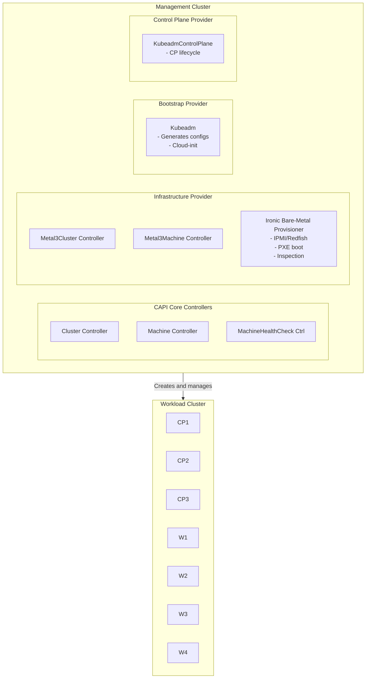
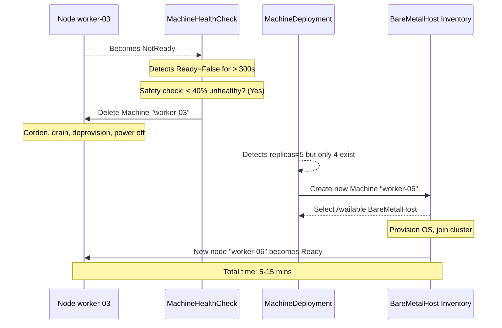
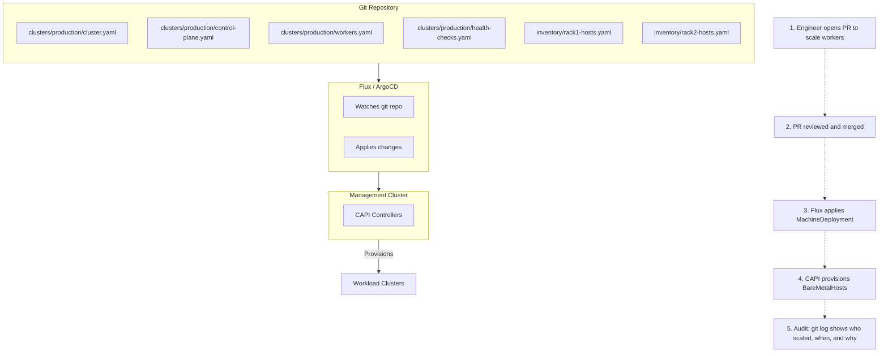

> **Complexity**: `[ADVANCED]` | Time: 50 minutes
>
> **Prerequisites**: [Module 5.2: Multi-Cluster Control Planes](../module-5.2-multi-cluster-control-planes/), [Module 2.4: Declarative Bare Metal](../../provisioning/module-2.4-declarative-bare-metal/)

---

## Why This Module Matters

At Deutsche Telekom, managing the underlying infrastructure for edge computing meant operating thousands of distributed Kubernetes clusters across remote cell towers and localized data centers. Prior to adopting declarative infrastructure, their legacy provisioning model required an engineer to manually trigger PXE boots, install operating systems, execute kubeadm bootstrap commands, and configure overlay networks. This imperative workflow meant that provisioning a single remote cluster consumed three full days of engineering effort. When a critical node suffered a hardware failure at a remote edge site, the replacement process demanded up to eight hours of downtime and remote hands to physically identify the server, reconfigure BIOS parameters, reinstall the system, and rejoin the degraded cluster. Such delays incurred massive service degradation costs, frequently exceeding tens of thousands of dollars per incident in SLA penalties and lost operational efficiency.

The organization transformed its infrastructure lifecycle by adopting Cluster API (CAPI) paired with the Metal3 infrastructure provider (CAPM3). By treating bare-metal Kubernetes clusters as declarative resources—identical in concept to native Kubernetes Deployments or Services—the operations team defined their desired target state in Git. Once applied, CAPI and Metal3 handled the complex orchestration of communicating with Baseboard Management Controllers (BMCs) to power on servers, push operating system images, and orchestrate cluster joins autonomously.

The results of this transformation were immediate and profound. The laborious three-day cluster provisioning cycle was reduced to an unattended forty-five-minute operation. More importantly, node failures now trigger autonomous remediation. A dedicated controller detects the unhealthy node, evicts the workload, deprovisions the failed server, and dynamically provisions a replacement from an available pool of spare hardware. The multi-hour outage window shrank to fifteen minutes, eliminating the need for remote hands and drastically cutting the financial impact of hardware degradation. 

---

## What You'll Be Able to Do

After completing this module, you will be able to:

1. **Implement** Cluster API with the Metal3 provider to declaratively provision bare-metal Kubernetes clusters.
2. **Design** a multi-cluster lifecycle pipeline that orchestrates provisioning and zero-downtime chained upgrades through GitOps.
3. **Evaluate** the state transitions of BareMetalHost resources during hardware inspection, provisioning, and decommissioning.
4. **Diagnose** node failures and configure MachineHealthChecks to enforce automatic infrastructure remediation safely.
5. **Compare** the provisioning capabilities, network prerequisites, and operational overhead of bare-metal environments against hypervisor-backed virtualized infrastructure.

---

## What You'll Learn

- The overarching architecture of Cluster API and the organizational structure of Kubernetes SIG Cluster Lifecycle.
- The distinctions between Infrastructure Providers, Bootstrap Providers, and Control Plane Providers.
- The mechanics of CAPM3 (Metal3) and its integration with OpenStack Ironic for out-of-band hardware management.
- Techniques for managing a BareMetalHost inventory and understanding its internal state machine.
- Strategies for configuring MachineHealthCheck controllers to perform automatic node remediation without risking cascading failures.
- Designing GitOps-driven cluster lifecycle workflows utilizing Flux or ArgoCD with safe pruning policies.
- Declarative operations for scaling workloads and executing chained Kubernetes version upgrades.

---

## 1. Cluster API Architecture & Ecosystem

Cluster API (CAPI) is not a standalone CNCF project; rather, it is a formal subproject of the Kubernetes SIG Cluster Lifecycle. Its fundamental mission is to bring declarative, Kubernetes-style APIs to the creation, configuration, and management of clusters themselves. By extending the Kubernetes controller pattern, CAPI allows platform engineers to manage the lifecycle of entire fleets of clusters with the same tooling used to manage application pods.

The architectural paradigm relies on a strict separation of concerns between a Management Cluster and multiple Workload Clusters. The Management Cluster is a dedicated Kubernetes environment that runs the CAPI core controllers and provider-specific Custom Resource Definitions (CRDs). It is strictly responsible for managing the state of other clusters and should never host end-user application workloads. The Workload Clusters are the downstream environments created and operated by the Management Cluster.

### The Provider Model

Cluster API separates its operational logic into distinct provider categories:

1. **Infrastructure Providers**: These controllers interact with underlying cloud or hardware APIs to provision computational resources, networks, and load balancers. Examples include Metal3 for bare metal, AWS (CAPA), and vSphere (CAPV).
2. **Bootstrap Providers**: These controllers are responsible for turning a newly provisioned server into a Kubernetes node. They generate the necessary `cloud-init` or Ignition scripts containing the certificates and join commands. 
3. **Control Plane Providers**: These controllers manage the complex lifecycle of the Kubernetes control plane, handling etcd quorum, certificate rotation, and safely rolling out minor version upgrades across control plane nodes.

The default and built-in implementation for both the bootstrap and control-plane roles is Kubeadm (officially known as CABPK for the bootstrap provider, and KubeadmControlPlane for the control plane provider).

### Architectural Diagram



### Tooling and API Evolution

The official command-line utility for initializing management clusters, upgrading providers, and moving resources between clusters is `clusterctl`. Because Cluster API heavily utilizes mutating and validating webhooks, `cert-manager` (specifically supporting the `cert-manager.io/v1` API) is a strict, required prerequisite. When running `clusterctl init`, the CLI will automatically detect if cert-manager is absent and install version v1.20.0 by default to ensure webhooks function correctly.

As the project matures, API versions transition through standard Kubernetes deprecation cycles. The CAPI v1beta2 API was introduced and promoted to the official storage version in CAPI v1.11 (released in August 2025). Consequently, the older v1beta1 API will be completely unserved and removed from the API server in CAPI v1.14, targeting August 2026. The latest stable CAPI release as of April 2026 is v1.12.x (with v1.12.0 having shipped on January 27, 2026, followed by patch releases such as v1.12.2). The v1.13 minor release is scheduled for April 2026.

CAPI maintains a strict version support policy: only the two most recent minor releases are actively supported at any given time. Older releases become unsupported immediately upon the release of a new minor version. Within the v1.12 release, the management cluster can run Kubernetes v1.31.x through v1.34.x, while workload clusters can run Kubernetes v1.29.x through v1.34.x.

One of the most significant operational improvements introduced in CAPI v1.12 is support for in-place updates and chained upgrades. Chained upgrades allow platform engineers to declare a target Kubernetes version that spans multiple minor releases; CAPI will automatically compute and execute the intermediate upgrade steps required to safely reach the destination without violating Kubeadm version skew policies. Additionally, ClusterClass—a mechanism for templating managed topologies—remains classified as an experimental feature in CAPI v1.12 and strictly requires the `ClusterTopology` feature gate to be enabled on the management cluster.

---

## 2. Metal3 and Bare Metal Provisioning

Metal3 (pronounced "metal-cubed") serves as the Cluster API infrastructure provider for bare-metal servers. The project was initially accepted into the CNCF Sandbox in September 2020. Due to massive ecosystem adoption, Metal3.io subsequently became a CNCF Incubating project on August 27, 2025, supported by 57 active contributing organizations.

The current release series for the Metal3 provider is CAPM3 v1.12.x, which is explicitly versioned to track the upstream CAPI release cycle. Like CAPI, CAPM3 strictly maintains support for only the two most recent minor releases.

### The Bare Metal Operator and Ironic

Metal3 does not reinvent hardware provisioning; instead, it leverages OpenStack Ironic as its underlying bare metal provisioning engine. Ironic runs seamlessly inside a container within the Metal3 deployment. The Bare Metal Operator (BMO) acts as the bridge between Kubernetes CRDs and Ironic's declarative API. The BMO operates on its own semantic versioning cycle, with BMO v0.12.x currently serving as the stable release.

Ironic provides native out-of-band management support via both IPMI and Redfish protocols. Modern environments heavily favor Redfish, which offers advanced capabilities such as virtual media boot, BIOS settings configuration, and RAID management over a RESTful HTTPS API.

> **Pause and predict**: What would happen if you registered a BareMetalHost with incorrect BMC credentials? At what stage of the lifecycle would the failure be detected?

To manage bare-metal servers, you register them in your management cluster as `BareMetalHost` (BMH) resources using the API group `metal3.io/v1alpha1`.

```yaml
# Register a bare-metal server
apiVersion: metal3.io/v1alpha1
kind: BareMetalHost
metadata:
  name: server-rack1-u10
  namespace: metal3
spec:
  online: true
  bootMACAddress: "aa:bb:cc:dd:ee:01"
  bmc:
    address: "ipmi://192.168.1.10"      # Or redfish://
    credentialsName: server-rack1-u10-bmc
    disableCertificateVerification: true
  rootDeviceHints:
    deviceName: "/dev/nvme0n1"           # Install OS here
  hardwareProfile: "unknown"              # Let Ironic inspect
```

```yaml
# BMC credentials
apiVersion: v1
kind: Secret
metadata:
  name: server-rack1-u10-bmc
  namespace: metal3
type: Opaque
stringData:
  username: admin
  password: "CHANGE_ME_IN_VAULT"
```

### The Provisioning State Machine

The BareMetalHost resource is governed by a rigorous state machine managed by the Bare Metal Operator:

1. **Registering**: The BMH is created. BMO verifies the syntax and attempts to authenticate against the BMC using the provided credentials.
2. **Inspecting**: Ironic boots an ephemeral inspection ramdisk on the server to dynamically inventory CPU, RAM, disks, and network interfaces.
3. **Available**: The server successfully passed inspection and is powered off. This is the stable idle state awaiting a machine claim from CAPI.
4. **Provisioning**: A Cluster API Machine claims the host. Ironic powers on the server, instructs it to PXE boot, writes the operating system image to the root device, and injects the cloud-init configuration.
5. **Provisioned**: The operating system boots from local disk, cloud-init executes the Kubeadm join sequence, and the node successfully registers with the workload cluster.
6. **Deprovisioning**: The Cluster API Machine is deleted. The BMO instructs Ironic to securely wipe the local disks and scrub configuration data.
7. **Deleting**: The resource is being removed from the Kubernetes API.
8. **Error**: If any of the above processing states encounter an unrecoverable failure, the host transitions into an error state requiring human intervention.

*Note on Ironic Versions:* Some unofficial community guides suggest that the minimum OpenStack Ironic API version required for Metal3 integration is 1.81 (which corresponds to the OpenStack 2023.1 'Antelope' release). However, administrators must exercise caution, as this specific version requirement is not corroborated by the authoritative Metal3 or Ironic documentation as of this writing. Always validate compatibility empirically before executing infrastructure upgrades.

In addition to hardware provisioning, Metal3 ships an IP Address Manager (IPAM) component that manages static IP allocations for bare-metal nodes via CRDs (such as IPPool and IPClaim) under the API group `ipam.metal3.io/v1alpha1`.

For organizations evaluating alternatives, Tinkerbell offers its own Cluster API Provider (CAPT) as a different bare-metal infrastructure backend. Its latest tagged release is v0.6.4.

---

## 3. Declarative Cluster Creation

Creating a cluster with CAPM3 requires linking the core CAPI resources to their infrastructure-specific counterparts. The Cluster resource references a KubeadmControlPlane and a Metal3Cluster. The MachineDeployment references a Metal3MachineTemplate and a KubeadmConfigTemplate.

```yaml
# 1. Cluster definition
apiVersion: cluster.x-k8s.io/v1beta1
kind: Cluster
metadata:
  name: production
  namespace: clusters
spec:
  clusterNetwork:
    pods:
      cidrBlocks: ["10.244.0.0/16"]
    services:
      cidrBlocks: ["10.96.0.0/12"]
  controlPlaneRef:
    apiVersion: controlplane.cluster.x-k8s.io/v1beta1
    kind: KubeadmControlPlane
    name: production-cp
  infrastructureRef:
    apiVersion: infrastructure.cluster.x-k8s.io/v1beta1
    kind: Metal3Cluster
    name: production
```

```yaml
# 2. Metal3 cluster config
apiVersion: infrastructure.cluster.x-k8s.io/v1beta1
kind: Metal3Cluster
metadata:
  name: production
  namespace: clusters
spec:
  controlPlaneEndpoint:
    host: 10.0.0.100
    port: 6443
  noCloudProvider: true
```

```yaml
# 3. Control plane (3 nodes, auto-managed)
apiVersion: controlplane.cluster.x-k8s.io/v1beta1
kind: KubeadmControlPlane
metadata:
  name: production-cp
  namespace: clusters
spec:
  replicas: 3
  version: v1.34.0
  machineTemplate:
    infrastructureRef:
      apiVersion: infrastructure.cluster.x-k8s.io/v1beta1
      kind: Metal3MachineTemplate
      name: production-cp
  kubeadmConfigSpec:
    initConfiguration:
      nodeRegistration:
        kubeletExtraArgs:
          node-labels: "node-role.kubernetes.io/control-plane="
    joinConfiguration:
      nodeRegistration:
        kubeletExtraArgs:
          node-labels: "node-role.kubernetes.io/control-plane="
```

```yaml
# 4. Machine template for control plane
apiVersion: infrastructure.cluster.x-k8s.io/v1beta1
kind: Metal3MachineTemplate
metadata:
  name: production-cp
  namespace: clusters
spec:
  template:
    spec:
      image:
        url: "http://10.0.0.50/ubuntu-22.04-k8s.qcow2"
        checksum: "sha256:abc123..."
        checksumType: sha256
        format: qcow2
      hostSelector:
        matchLabels:
          role: control-plane
```

```yaml
# 5. Worker MachineDeployment
apiVersion: cluster.x-k8s.io/v1beta1
kind: MachineDeployment
metadata:
  name: production-workers
  namespace: clusters
spec:
  clusterName: production
  replicas: 5
  selector:
    matchLabels:
      cluster.x-k8s.io/cluster-name: production
  template:
    metadata:
      labels:
        cluster.x-k8s.io/cluster-name: production
    spec:
      clusterName: production
      version: v1.34.0
      bootstrap:
        configRef:
          apiVersion: bootstrap.cluster.x-k8s.io/v1beta1
          kind: KubeadmConfigTemplate
          name: production-workers
      infrastructureRef:
        apiVersion: infrastructure.cluster.x-k8s.io/v1beta1
        kind: Metal3MachineTemplate
        name: production-workers
```

### Comparing Bare Metal to vSphere

Organizations frequently operate a mix of bare-metal infrastructure and hypervisor-backed virtual machines. Cluster API Provider vSphere (CAPV) is the analog to CAPM3 for VMware environments. CAPV utilizes `VSphereCluster` and `VSphereMachineTemplate` CRDs to define virtual machine specifications.

| Dimension | CAPM3 (Bare Metal) | CAPV (vSphere) |
|-----------|-------------------|----------------|
| Provision time | 5-15 minutes | 2-5 minutes |
| Prerequisites | Ironic, DHCP, PXE, BMC | vCenter, templates |
| Node pool | BareMetalHost inventory (fixed) | Unlimited (VM clone) |
| Rollback | Wipe + reprovision | VM snapshot/rollback |
| Best for | Maximum perf, no hypervisor tax | Flexibility, fast iteration |

---

> **Stop and think**: The MachineHealthCheck has a `maxUnhealthy` field set to 40%. Why is this safety valve critical for bare-metal environments? What would happen if it were set to 100% and a network switch failed, making 6 out of 10 nodes appear NotReady?

## 4. MachineHealthCheck & Automatic Remediation

The capability to self-heal underlying infrastructure is one of the most powerful features provided by Cluster API. The `MachineHealthCheck` (MHC) controller constantly monitors the health conditions of Kubernetes nodes. If a node remains in a `NotReady` state for a configured duration, the MHC safely assumes the node is irrecoverable and orchestrates its replacement.

```yaml
apiVersion: cluster.x-k8s.io/v1beta1
kind: MachineHealthCheck
metadata:
  name: production-worker-health
  namespace: clusters
spec:
  clusterName: production
  selector:
    matchLabels:
      cluster.x-k8s.io/deployment-name: production-workers
  unhealthyConditions:
    - type: Ready
      status: "False"
      timeout: 300s       # Node NotReady for 5 minutes
    - type: Ready
      status: "Unknown"
      timeout: 300s       # Node unreachable for 5 minutes
  maxUnhealthy: "40%"     # Safety: do not remediate if > 40% nodes are unhealthy
  nodeStartupTimeout: 600s # New nodes must be Ready within 10 minutes
```

### Remediation Flow



It is absolutely vital to maintain spare capacity in your bare-metal inventory. If the MachineHealthCheck triggers a remediation event but all BareMetalHosts are currently allocated, the replacement Machine will remain in a Pending state indefinitely, leaving your cluster permanently degraded until physical hardware is procured.

---

> **Pause and predict**: If you store Cluster API manifests in Git and use Flux to sync them, what would happen if someone accidentally deleted the `clusters/production/` directory from the Git repository with `prune: true` enabled in Flux?

## 5. GitOps-Driven Cluster Management

By treating infrastructure strictly as code, organizations can manage multi-cluster environments using GitOps methodologies. Changes to hardware allocation, node scaling, and Kubernetes minor version upgrades are proposed via Pull Requests. Once approved by senior engineers, continuous deployment tools like Flux or ArgoCD synchronize the manifests to the Management Cluster, which then reconciles the downstream Workload Clusters.



Because pruning in Flux deletes cluster definitions if they are removed from the repository, potentially destroying your infrastructure, it is critical to disable pruning for CAPI Kustomizations. Always append `prune: false` to ensure that an accidental `git rm` command does not result in the catastrophic deprovisioning of all bare-metal nodes in production.

---

## Did You Know?

- **The latest stable Cluster API release, v1.12.0, was shipped on January 27, 2026, and officially introduced chained upgrades.** This enables engineers to perform multi-version jumps by allowing the controller to calculate and execute intermediate upgrade steps securely.
- **Metal3.io was officially accepted as a CNCF Incubating project on August 27, 2025.** At the time of incubation, the project boasted contributions from 57 active organizations, highlighting the massive industry demand for declarative bare-metal provisioning.
- **The Cluster API v1beta1 API version will be completely unserved from the API server starting in CAPI v1.14, targeting August 2026.** All manifests must be migrated to the newer v1beta2 storage format before executing this platform upgrade.
- **Metal3 uses OpenStack Ironic without requiring a full OpenStack deployment.** Ironic runs seamlessly inside a container, giving you bare-metal provisioning capabilities without Nova, Neutron, Keystone, or any other OpenStack service.
- **Cluster API applies the Kubernetes controller pattern to infrastructure.** Just as a Deployment controller ensures the right number of pods exist, the MachineDeployment controller ensures the right number of nodes exist.
- **CAPM3 can manage servers from any vendor**—Dell iDRAC, HPE iLO, Supermicro IPMI, Lenovo XClarity—as long as they support IPMI or Redfish. Redfish is replacing IPMI, which sends credentials in plaintext over UDP.
- **Deutsche Telekom operates one of the largest known bare-metal Cluster API deployments in existence.** Their Das Schiff platform utilizes CAPI to autonomously manage thousands of distributed Kubernetes clusters located at remote edge locations and cell towers worldwide.

---

## Common Mistakes

| Mistake | Problem | Solution |
|---------|---------|----------|
| No spare BareMetalHosts | MachineHealthCheck creates replacement Machine but no host is available | Keep 10-15% of inventory as spare (e.g., 2 spares for 15 servers) |
| BMC credentials in plain Secrets | IPMI/Redfish credentials exposed in etcd | Use SealedSecrets or SOPS encryption for BMC credentials |
| Pruning enabled in GitOps | Flux deletes cluster resources if removed from git | Set `prune: false` for cluster Kustomizations |
| `maxUnhealthy` threshold at 100% | Cascading failure: MHC replaces all nodes simultaneously during network partition | Set `maxUnhealthy` to 30-40% to prevent mass remediation |
| Unversioned OS images | Cannot reproduce node state, drift between nodes | Version OS images, store in HTTP server, reference by checksum |
| Skipping hardware inspection | CAPI provisions a server with bad RAM or failed disk | Let Ironic inspect all hosts before marking them Available |
| Imperative manual modifications | Drift between desired state (git) and actual state | All changes via git PRs, never `kubectl edit` on CAPI resources |
| Missing cert-manager prerequisite | CAPI initialization fails or webhooks crash | Ensure cert-manager v1.20.0 is installed before bootstrapping |

---

## Quiz

### Question 1
You operate a data center with 20 bare-metal servers and need to deploy three independent Kubernetes clusters (dev: 3 nodes, staging: 5 nodes, production: 9 nodes). To ensure high availability and resilient operations, how many BareMetalHosts should you register into your inventory, and how many should be strictly labeled as spare?

<details>
<summary>Answer</summary>

**Register all 20 servers. Keep 3 as spares.**

Allocation breakdown:
- Dev cluster: 1 CP + 2 workers = 3 nodes
- Staging cluster: 1 CP + 4 workers = 5 nodes (control plane nodes must always be an odd number to maintain etcd quorum; 2 CP nodes are worse than 1 because a single failure loses quorum).
- Production cluster: 3 CP + 6 workers = 9 nodes
- Total active allocation: 17 nodes.
- Spare allocation: 3 nodes (representing 15% of total hardware).

**Why maintaining 3 spares matters**:
1. **MachineHealthCheck remediation**: When a production worker suffers a hardware failure, the MHC requires an `Available` BareMetalHost to provision as a replacement. Without spares, the replacement Machine remains stuck in `Pending` indefinitely.
2. **Concurrent failures**: In the event of a localized power supply failure affecting two nodes, you require multiple spares to immediately restore full cluster capacity.
3. **Dynamic Scaling**: If production requires temporary horizontal expansion to handle seasonal traffic bursts, the spares provide immediate capacity without impacting development environments.

```yaml
# Label spares for easy identification
apiVersion: metal3.io/v1alpha1
kind: BareMetalHost
metadata:
  name: spare-01
  labels:
    role: spare
spec:
  online: false  # Keep powered off until needed
```
</details>

### Question 2
Your production MachineHealthCheck is configured with `maxUnhealthy: 40%` covering a fleet of 10 worker nodes. A severe network switch failure occurs, isolating exactly 5 nodes simultaneously. How does the MachineHealthCheck controller respond to this event?

<details>
<summary>Answer</summary>

**The MachineHealthCheck will NOT remediate any nodes.** Because 5 out of 10 nodes represents 50% of the fleet, the condition explicitly exceeds the `maxUnhealthy: 40%` circuit breaker threshold.

**This is the exact intended safeguard behavior.** The threshold prevents catastrophic cascading failures caused by infrastructure anomalies. A switch failure is an environmental network issue, not an underlying host degradation. Attempting to deprovision and reinstall the operating systems on half of your production fleet would severely worsen the outage. You must troubleshoot the infrastructure failure (such as an invalid image, network anomaly, or bad drive) and apply a fix. Once the network connectivity is restored, the nodes will organically return to a `Ready` state.

**What you should do**:
1. Check the management cluster for MachineHealthCheck events:
   ```bash
   kubectl describe machinehealthcheck production-worker-health -n clusters
   # Events: "Remediation is not allowed, total unhealthy: 50%, max: 40%"
   ```
2. Investigate the infrastructure issue (switch, power, network)
3. Fix the root cause
4. Nodes recover automatically

**If it were a single node failure** (1 of 10 = 10% < 40%), MHC would remediate: delete the Machine, deprovision the BareMetalHost, and create a replacement.
</details>

### Question 3
You merge a Git pull request to upgrade a production workload cluster from Kubernetes v1.33.0 to v1.34.0. Describe the sequence of actions initiated by the KubeadmControlPlane controller. Furthermore, what happens to the older v1.33.0 nodes if the first newly provisioned v1.34.0 control plane node fails to start?

<details>
<summary>Answer</summary>

**Upgrade process execution:**
1. CAPI provisions a fresh Machine running v1.34.0, leaving existing nodes untouched.
2. The BareMetalHost is acquired, OS is imaged, and Kubeadm is executed to join the node to the existing cluster logic.
3. The controller rigorously waits for the new node to broadcast a `Ready` condition and verifies that etcd quorum has expanded successfully.
4. Only after validation succeeds does CAPI safely cordon, drain, and terminate one of the legacy v1.33.0 control plane nodes.
5. This sequence loops iteratively for each replica.
6. After all control plane nodes are successfully upgraded, the MachineDeployment orchestrates a similar rolling upgrade across all worker nodes.

**If the new node fails to start:**
The controller detects that the newly provisioned node has not reached a `Ready` state within the `nodeStartupTimeout` window. The rolling upgrade sequence immediately halts. No legacy nodes are evicted or deleted, ensuring the cluster remains functional and actively servicing workloads on the v1.33.0 infrastructure. Administrators must investigate the failure, resolve the provisioning blocker, and allow CAPI to resume.

```bash
# Monitor upgrade progress
kubectl get machines -n clusters -l cluster.x-k8s.io/cluster-name=production
# NAME              PHASE         VERSION
# production-cp-1   Running       v1.33.0   (old, will be removed last)
# production-cp-2   Running       v1.33.0
# production-cp-3   Running       v1.33.0
# production-cp-4   Provisioning  v1.34.0   (new, being created)
```
</details>

### Question 4
A junior platform engineer accidentally executes a `git rm -r clusters/production/` command against the GitOps repository. If the management cluster is utilizing Flux for synchronization with `prune: true` configured on the Customization, what is the consequence?

<details>
<summary>Answer</summary>

**The entire production cluster will be autonomously and irrevocably destroyed.**

Flux pruning logic dictates that if a manifested resource is discovered within the live cluster but is absent from the authoritative Git tree, the resource must be deleted. While this is acceptable for stateless application Pods, deleting CAPI resources (such as `Cluster`, `KubeadmControlPlane`, and `MachineDeployment`) triggers immediate infrastructure deprovisioning cascades. The Bare Metal Operator will acquire the deletion signal, wipe the attached storage drives, and forcibly power off every physical server attached to that cluster. To prevent this, administrators must ensure `prune: false` is configured for CAPI Kustomizations.

**With `prune: false`:**
1. Engineer accidentally deletes files from git
2. Flux does NOT delete the cluster resources
3. Cluster continues running
4. Engineer restores the files in a follow-up commit
5. No impact

**Additional safety measures**:
```yaml
# Add finalizer protection to critical resources
metadata:
  annotations:
    kustomize.toolkit.fluxcd.io/prune: "disabled"
```
</details>


---

## Hands-On Exercise: Explore Cluster API with Docker Provider

Before attempting bare-metal provisioning on complex hardware, engineers commonly test CAPI architecture utilizing the Docker provider (CAPD). This provider spins up discrete Docker containers that simulate distinct infrastructure "machines."

### Execution Steps

```bash
# Install clusterctl and create management cluster
curl -L https://github.com/kubernetes-sigs/cluster-api/releases/latest/download/clusterctl-linux-amd64 -o clusterctl
chmod +x clusterctl && sudo mv clusterctl /usr/local/bin/
kind create cluster --name capi-mgmt

# Initialize CAPI with Docker provider
export CLUSTER_TOPOLOGY=true
clusterctl init --infrastructure docker

# Generate and create a workload cluster
clusterctl generate cluster dev-cluster \
  --infrastructure docker \
  --kubernetes-version v1.33.0 \
  --control-plane-machine-count 1 \
  --worker-machine-count 2 > dev-cluster.yaml
kubectl apply -f dev-cluster.yaml

# Watch provisioning and get kubeconfig
kubectl get cluster,machines -A
kubectl wait cluster/dev-cluster --for=condition=Ready --timeout=300s
clusterctl get kubeconfig dev-cluster > dev-cluster.kubeconfig

# Scale the workload cluster
kubectl patch machinedeployment dev-cluster-md-0 \
  --type merge -p '{"spec":{"replicas":3}}'

# Verify the scaling operation
kubectl get machines -A

# Cleanup
kubectl delete cluster dev-cluster
kind delete cluster --name capi-mgmt
```

### Success Criteria

- [ ] Evaluated prerequisites and successfully provisioned the upstream management cluster using `kind`.
- [ ] Triggered workload cluster provisioning and validated the existence of exactly one Control Plane and two Worker nodes.
- [ ] Issued a declarative patch to seamlessly scale the `MachineDeployment` from two to three workers.
- [ ] Monitored the internal CAPI event loop and observed Machine lifecycles transition from `Pending` to `Provisioning` to `Running`.
- [ ] Safely deprovisioned both the workload infrastructure and the management environment.

---

## Next Module

You have completed the Multi-Cluster & Platform section. Please proceed to [Module 6.1: Physical Security & Air-Gapped Environments](/on-premises/security/module-6.1-air-gapped/) to learn how to lock down on-premises Kubernetes environments and establish robust physical network security boundaries.