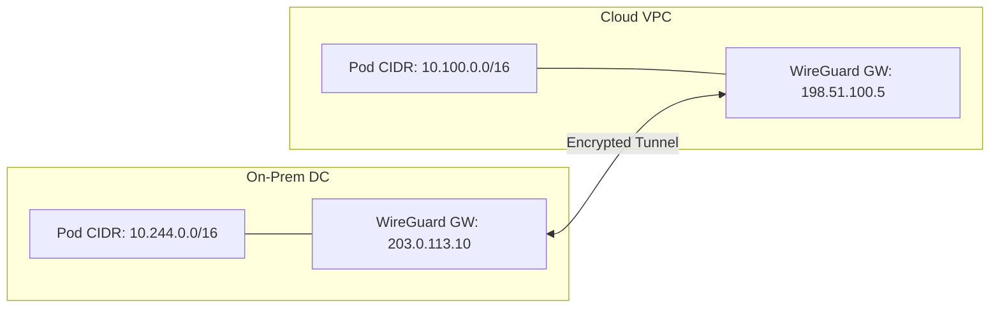
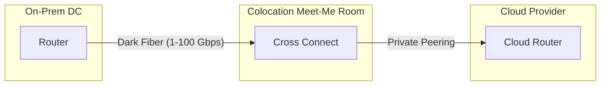
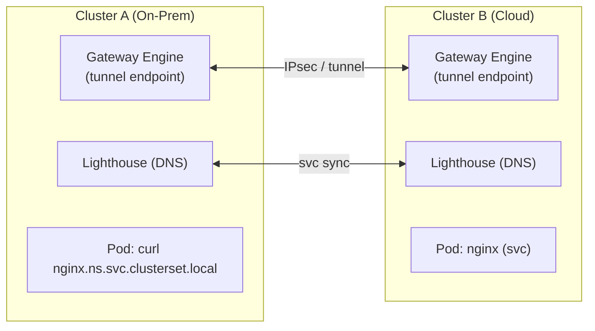
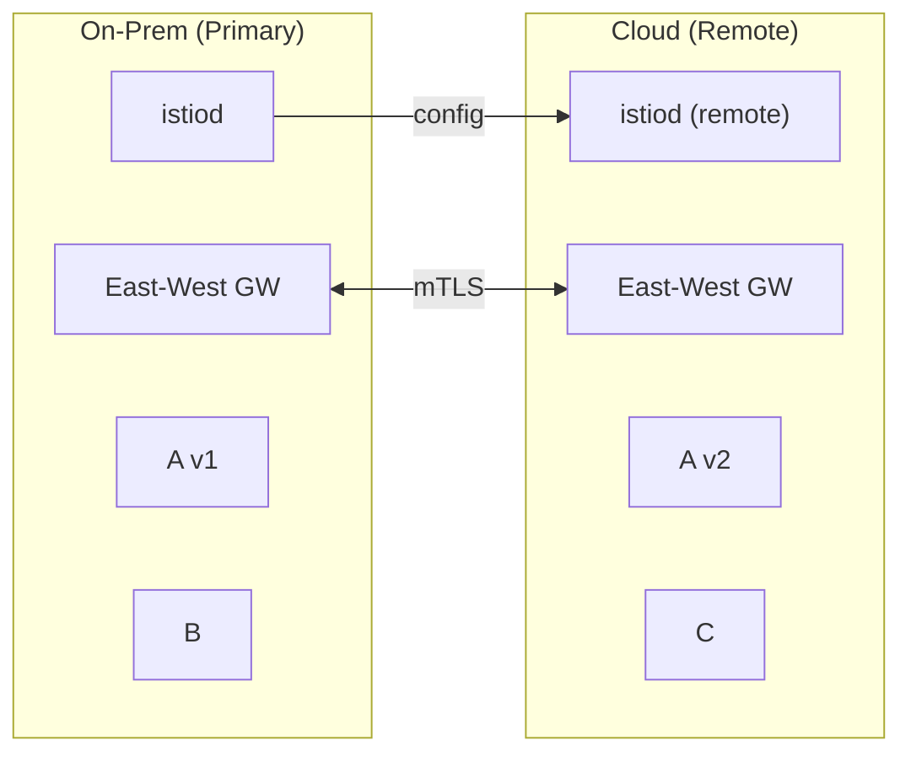
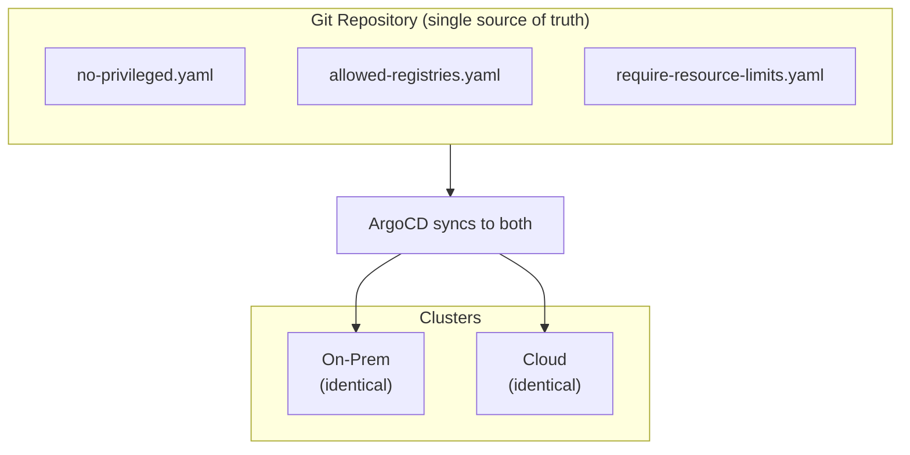

> **Complexity**: `[ADVANCED]` | Time: 60 minutes
>
> **Prerequisites**: [Datacenter Networking](/on-premises/networking/module-3.1-datacenter-networking/), [Module 8.1: Multi-Site & Disaster Recovery](/on-premises/resilience/module-8.1-multi-site-dr/)

---

## Why This Module Matters

A global retail company ran customer-facing applications on AWS EKS but kept inventory management on-premises due to latency requirements -- warehouse scanners needed sub-5ms response times. For two years, their cloud and on-prem clusters operated as isolated islands with separate CI/CD pipelines, monitoring, service discovery, and network policies.

When a product launch required real-time inventory checks from the cloud storefront to the on-prem API, the team patched together public internet endpoints and manual firewall rules. It took six weeks and was fragile -- response times varied 40-400ms. During Black Friday, a BGP route leak by an upstream ISP made the endpoint unreachable for 45 minutes. The storefront showed "out of stock" for items sitting in warehouses.

The company then invested three months in proper hybrid connectivity: a dedicated interconnect, WireGuard tunnels, Submariner for cross-cluster service discovery, and Istio for unified traffic management. The next Black Friday ran without incident. Inventory API latency was a consistent 8ms. This architectural transformation underscores why robust hybrid connectivity design is a core requirement rather than an operational afterthought.

---

## What You'll Be Able to Do

After completing this module, you will be able to:

1. **Implement** hybrid connectivity between on-premises and cloud Kubernetes clusters using dedicated interconnects and encrypted tunnels.
2. **Configure** Submariner or Cilium ClusterMesh for cross-cluster service discovery and pod-to-pod communication.
3. **Design** network architectures that provide consistent latency between on-premises and cloud workloads with proper failover mechanisms.
4. **Troubleshoot** hybrid connectivity issues including BGP route leaks, tunnel MTU problems, and cross-cluster DNS resolution failures.
5. **Evaluate** diverse service mesh topologies to securely route traffic across multicloud boundaries.

---

## What You'll Learn

- VPN tunnel options for on-prem to cloud (WireGuard and IPsec).
- Dedicated interconnect services (Direct Connect, ExpressRoute, Cloud Interconnect).
- Submariner for multi-cluster Kubernetes networking.
- Istio service mesh spanning cloud and on-prem clusters.
- Consistent policy enforcement with OPA/Gatekeeper across environments.

---

## Foundation: VPN Tunnels and Capabilities

When establishing hybrid cloud connectivity, the first layer of defense and routing often relies on encrypted VPN tunnels. Tunnels bridge disparate networks securely over the public internet. 



Comparing protocol choices is necessary to optimize throughput and limit protocol overhead:

| Factor | WireGuard | IPsec (IKEv2) |
|--------|-----------|---------------|
| **Code complexity** | ~4,000 lines | ~400,000 lines |
| **Performance** | 1.0-3.0 Gbps per core | 0.5-1.60 Gbps per core |
| **Latency overhead** | ~0.5ms | ~1-2ms |
| **Configuration** | Simple (key pair, endpoint, allowed IPs) | Complex (certs, proposals, policies) |
| **Cloud native support** | Manual setup | Native (AWS/Azure VPN Gateway) |
| **Key rotation** | Built-in (every 2 minutes) | Manual or via IKE rekey |

> **Pause and predict**: WireGuard uses ~4,000 lines of code while IPsec uses ~400,000. Both encrypt traffic. Why would the smaller codebase matter for a security-critical component like a VPN tunnel?

Beyond the software choices, cloud providers apply hard bandwidth caps on managed VPN instances:
- **AWS Site-to-Site VPN** supports a maximum tunnel bandwidth of 5 Gbps (upgraded from the previous 1.25 Gbps limit) for workloads requiring high throughput. Each connection consists of two IPsec tunnels for high availability. Note that AWS Transit Gateway VPN attachments remain limited to 1.25 Gbps per VPN connection.
- **Azure Virtual WAN** Site-to-Site VPN gateway aggregate throughput is 20 Gbps, delivering 2 Gbps per VPN connection (with 1 Gbps per tunnel). Be mindful that single TCP flows exceeding 1.50 Gbps may degrade.
- **GCP HA VPN** tunnels support a maximum throughput of approximately 3 Gbps (250,000 packets per second) per tunnel. While community documentation cites GCP HA VPN provides a 99.99% SLA when configured with two HA VPN gateways and four tunnels, always verify this against official Google SLA records before production commitments.

### Implementing Encrypted Tunnels

This configuration creates an encrypted tunnel between the on-premises gateway and a cloud-side gateway. The `AllowedIPs` field acts as both an access control list and a routing table -- only traffic destined for the specified CIDRs enters the tunnel.

```bash
# On the on-prem gateway node
apt-get install -y wireguard
wg genkey | tee /etc/wireguard/private.key | wg pubkey > /etc/wireguard/public.key

cat > /etc/wireguard/wg0.conf <<EOF
[Interface]
Address = 10.200.0.1/24
ListenPort = 51820
PrivateKey = $(cat /etc/wireguard/private.key)
PostUp = iptables -A FORWARD -i wg0 -j ACCEPT; iptables -A FORWARD -o wg0 -j ACCEPT
PostDown = iptables -D FORWARD -i wg0 -j ACCEPT; iptables -D FORWARD -o wg0 -j ACCEPT

[Peer]
PublicKey = <CLOUD_GATEWAY_PUBLIC_KEY>
Endpoint = 198.51.100.5:51820
AllowedIPs = 10.100.0.0/16, 172.20.0.0/16
PersistentKeepalive = 25
EOF

systemctl enable --now wg-quick@wg0

# Add routes for cross-cluster communication
ip route add 10.100.0.0/16 via 10.200.0.1 dev wg0
ip route add 172.20.0.0/16 via 10.200.0.1 dev wg0
```

Network constraints: Proper tunnel performance requires strict MTU considerations. AWS Site-to-Site VPN MTU is restricted to 1446 bytes (MSS 1406 bytes). Internal AWS Transit Gateway MTU for inter-VPC and Direct Connect traffic is much larger at 8500 bytes. 

---

## Dedicated Interconnects

VPN tunnels run over the public internet. Dedicated interconnects provide private, low-latency connections.



| Feature | AWS Direct Connect | Azure ExpressRoute | GCP Cloud Interconnect |
|---------|-------------------|-------------------|----------------------|
| **Bandwidth** | 1, 10, 100 Gbps | 50 Mbps - 100 Gbps | 10, 100 Gbps |
| **Latency** | <5ms typical | <5ms typical | <5ms typical |
| **Setup time** | 2-4 weeks | 2-4 weeks | 1-3 weeks |
| **Monthly cost (10G)** | ~$2,200/port | ~$5,000/port | ~$1,700/port |

**Use interconnect** when: >1 Gbps sustained traffic, <5ms latency required, or compliance demands a private path. **Use VPN** for <100 Mbps, non-critical, or DR-only traffic.

**AWS Direct Connect Architecture**
AWS Direct Connect dedicated connections are available at 1 Gbps, 10 Gbps, 100 Gbps, and 400 Gbps port speeds over single-mode fiber, while hosted connections (via APN partners) range from 50 Mbps to 25 Gbps. 
Data transfer inbound into AWS is charged at $0.00/GB in all locations.
AWS Direct Connect supports MACsec encryption on 10 Gbps, 100 Gbps, and 400 Gbps dedicated connections at select PoPs. For AWS Direct Connect 100 Gbps and 400 Gbps connections, the only supported MACsec cipher suite is GCM-AES-XPN-256, which uses Extended Packet Numbering (XPN).
AWS Direct Connect SiteLink enables private, low-latency connectivity between any two Direct Connect PoPs, routing traffic over the AWS backbone without transiting an AWS Region. AWS Transit Gateway supports a maximum burst bandwidth of 50 Gbps per VPC, Direct Connect gateway, or peered Transit Gateway connection.

**Azure ExpressRoute Characteristics**
Azure ExpressRoute standard circuits offer bandwidths from 50 Mbps up to 10 Gbps; ExpressRoute Direct offers 10, 100, and potentially 400 Gbps port speeds (Microsoft documentation lists 400 Gbps, though it requires specific subscription enrollment and is limited in regional availability). 
Circuits come in three SKUs: Local (same-region VNETs), Standard (same geopolitical region), and Premium (global VNET access). Azure ExpressRoute Global Reach allows linking two ExpressRoute circuits to create a private network between on-premises sites; data transfer is billed separately and is not covered by the Unlimited Data plan. Azure Virtual WAN virtual hub router supports an aggregate throughput of up to 50 Gbps by default with 2 routing infrastructure units (3 Gbps, 2,000 VMs). Azure Virtual WAN Point-to-Site VPN gateway aggregate throughput scales up to 200 Gbps.

**Google Cloud Interconnect Topologies**
GCP Dedicated Interconnect links are available at 10 Gbps or 100 Gbps; up to 8 links can be bundled in a Link Aggregation Group (LAG) for up to 800 Gbps. GCP Partner Interconnect VLAN attachments support capacities from 50 Mbps up to 50 Gbps. The GCP Network Connectivity Center (NCC) provides a hub-and-spoke architecture for connecting on-premises and cloud networks with BGP route exchange support.

### Multi-Cloud Interconnectivity
Direct, backbone-to-backbone multicloud connectivity eliminates intermediary colocation complexity. AWS Interconnect – multicloud (in partnership with Google Cloud) entered preview in November 2025, offering 1 Gbps connections during preview at no cost across five AWS–GCP region pairs. It targets 100 Gbps at general availability. While Azure is announced as a future partner, it has no firm GA date as of early 2026. Correspondingly, GCP Cross-Cloud Interconnect supports direct private connections to AWS through this same partnership, but the Azure topology remains ambiguously documented and lacks a confirmed deployment timeline.

---

## Submariner: Multi-Cluster Networking

Submariner connects Kubernetes clusters so pods and services in one cluster can reach those in another, handling cross-cluster DNS, encrypted tunnels, and service discovery. It is a CNCF Sandbox project that enables Layer 3 cross-cluster pod and service connectivity for Kubernetes; it is CNI-agnostic. Note: Validate any third-party claims that Submariner has graduated to Incubating status, as CNCF official landscape metrics classify it under Sandbox.



> **Stop and think**: Submariner requires non-overlapping pod and service CIDRs between clusters. Both your on-prem and EKS clusters use the default 10.244.0.0/16 pod CIDR. What are your options, and which one avoids rebuilding either cluster?

**Requirements**: non-overlapping pod/service CIDRs, gateway nodes with routable IPs, UDP ports 500 and 4500 open, supported CNIs (Calico, Flannel, Canal, OVN-Kubernetes).

### Install Submariner

The latest stable Submariner release is v0.23.1, released on March 12, 2026.

Submariner uses a broker (deployed on one cluster) for service discovery metadata exchange. Each cluster then joins the broker, establishing encrypted tunnels for pod-to-pod traffic and a Lighthouse DNS service for cross-cluster name resolution.

```bash
# Install subctl
curl -Ls https://raw.githubusercontent.com/submariner-io/submariner/master/scripts/get-submariner.sh | VERSION=v0.23.1 bash

# Deploy broker and join clusters
kubectl config use-context on-prem-cluster
subctl deploy-broker
subctl join broker-info.subm --clusterid on-prem --natt=false --cable-driver libreswan

kubectl config use-context cloud-cluster
subctl join broker-info.subm --clusterid cloud --natt=true --cable-driver libreswan

# Export a service for cross-cluster access
subctl export service nginx-service -n production

# From the other cluster, reach it via:
#   nginx-service.production.svc.clusterset.local
subctl show all
```

---

## Alternative CNIs and Meshes: Cilium and Linkerd

If a standalone tunnel manager does not align with your architectural goals, full ecosystem meshes offer embedded solutions.

Cilium ClusterMesh is included in Cilium's stable release (v1.19.x) and provides pod-to-pod and service connectivity across clusters using BGP or tunneling. While unofficial sources frequently cite a maximum cluster limit of 255 for Cilium ClusterMesh, you must independently verify this via official documentation boundaries.

Linkerd multi-cluster connectivity has been available since Linkerd 2.8 (June 2020), supporting hierarchical (gateway-based), flat (pod-to-pod), and federated service models. As of February 2024, the Linkerd open-source project no longer publishes stable release artifacts; Buoyant provides stable release artifacts (Buoyant Enterprise for Linkerd).

---

## Unified Service Mesh with Istio

Istio adds traffic management, observability, and mTLS security across clusters. Istio supports two primary multi-cluster deployment models: multi-primary (shared control plane per cluster) and primary-remote (remote clusters share a control plane from a primary cluster). Istio Ambient mesh multi-cluster support (multi-network topology) reached beta status in March 2026; single-network multicluster remains alpha. Istio's latest stable release is v1.29.1 (March 10, 2026).


*svc-A traffic: 80% on-prem (v1), 20% cloud (v2)*

A shared root CA is required for cross-cluster mTLS. Without it, sidecars in different clusters cannot verify each other's certificates and all cross-cluster traffic fails with 503 errors even though network connectivity works.

> **Pause and predict**: Istio uses mTLS between sidecars in different clusters. Why does each cluster need a certificate derived from the same root CA? What symptom would you see if the root CAs were different?

### Setting Up Multi-Cluster Istio

The shared root CA is the foundation of cross-cluster mTLS. Each cluster gets its own intermediate CA (derived from the shared root), so certificates can be validated across cluster boundaries.

```bash
# 1. Generate a shared root CA
mkdir -p certs
openssl req -new -x509 -nodes -days 3650 \
  -keyout certs/root-key.pem -out certs/root-cert.pem \
  -subj "/O=KubeDojo/CN=Root CA"

# 2. Create per-cluster intermediate CAs from the shared root
for CLUSTER in on-prem cloud; do
  openssl genrsa -out certs/${CLUSTER}-ca-key.pem 4096
  openssl req -new -key certs/${CLUSTER}-ca-key.pem \
    -out certs/${CLUSTER}-ca-csr.pem -subj "/O=KubeDojo/CN=${CLUSTER} CA"
  openssl x509 -req -days 3650 -CA certs/root-cert.pem -CAkey certs/root-key.pem \
    -set_serial "0x$(openssl rand -hex 8)" \
    -in certs/${CLUSTER}-ca-csr.pem -out certs/${CLUSTER}-ca-cert.pem
done

# 3. Install Istio on the primary cluster with the shared CA
kubectl create namespace istio-system
kubectl create secret generic cacerts -n istio-system \
  --from-file=ca-cert.pem=certs/on-prem-ca-cert.pem \
  --from-file=ca-key.pem=certs/on-prem-ca-key.pem \
  --from-file=root-cert.pem=certs/root-cert.pem \
  --from-file=cert-chain.pem=certs/on-prem-ca-cert.pem

istioctl install -y -f - <<EOF
apiVersion: install.istio.io/v1alpha1
kind: IstioOperator
spec:
  values:
    global:
      meshID: kubedojo-mesh
      multiCluster:
        clusterName: on-prem
      network: on-prem-network
EOF
```

### Cross-Cluster Traffic Routing

```yaml
# VirtualService for weighted routing between on-prem and cloud
apiVersion: networking.istio.io/v1
kind: VirtualService
metadata:
  name: svc-a
  namespace: production
spec:
  hosts:
  - svc-a.production.svc.cluster.local
  http:
  - route:
    - destination:
        host: svc-a.production.svc.cluster.local
        subset: on-prem
      weight: 80
    - destination:
        host: svc-a.production.svc.cluster.local
        subset: cloud
      weight: 20
```

---

## Consistent Policy with OPA/Gatekeeper

When workloads span environments, policy drift is inevitable without enforcement.
- Consistent policy enforcement with OPA/Gatekeeper across environments establishes a standardized security posture across your entire fleet, neutralizing deviations applied manually by local administrators.



```yaml
# ConstraintTemplate: enforce allowed image registries
apiVersion: templates.gatekeeper.sh/v1
kind: ConstraintTemplate
metadata:
  name: k8sallowedregistries
spec:
  crd:
    spec:
      names:
        kind: K8sAllowedRegistries
      validation:
        openAPIV3Schema:
          type: object
          properties:
            registries:
              type: array
              items:
                type: string
  targets:
  - target: admission.k8s.gatekeeper.sh
    rego: |
      package k8sallowedregistries
      violation[{"msg": msg}] {
        container := input.review.object.spec.containers[_]
        not startswith(container.image, input.parameters.registries[_])
        msg := sprintf("Container '%v' uses image '%v' from unauthorized registry",
          [container.name, container.image])
      }
```

```yaml
apiVersion: constraints.gatekeeper.sh/v1beta1
kind: K8sAllowedRegistries
metadata:
  name: allowed-registries
spec:
  enforcementAction: deny
  match:
    kinds:
    - apiGroups: [""]
      kinds: ["Pod"]
  parameters:
    registries:
    - "registry.internal.example.com/"
    - "gcr.io/distroless/"
    - "registry.k8s.io/"
```

Sync policies to all clusters via ArgoCD Applications pointing to the same Git repository.

---

## Did You Know?

1. **WireGuard is in the Linux kernel since 5.6** (March 2020). Linus Torvalds called it a "work of art" compared to IPsec. At ~4,000 lines of code versus IPsec's ~400,000, its attack surface is dramatically smaller.
2. **AWS Direct Connect locations are not AWS datacenters.** They are colocation facilities (Equinix, CoreSite). Your router connects to an AWS router via a physical fiber patch cable in a shared "meet-me room."
3. **AWS Interconnect – multicloud preview launched in November 2025.** By providing native 1 Gbps multicloud tunnels directly over the backbone, it proves native cloud-to-cloud integrations are expanding.
4. **Submariner's name references submarine cables** connecting continents. Created by Rancher Labs (now SUSE), it is a CNCF Sandbox project supporting both IPsec and WireGuard as cable drivers. It was officially accepted into the CNCF on April 28, 2021.
5. **Istio's latest stable v1.29.1** (released March 10, 2026) natively understands locality. Its locality-aware load balancing prefers local endpoints over remote ones automatically, reducing cross-cluster traffic by 60-80% in typical deployments.

---

## Common Mistakes

| Mistake | Why It Happens | What To Do Instead |
|---------|---------------|-------------------|
| Overlapping pod CIDRs | Default CNIs use 10.244.0.0/16 | Plan unique CIDRs per cluster before deployment |
| Single VPN gateway | "We'll add HA later" | Deploy gateways in active-passive pairs from day one |
| Ignoring MTU in tunnels | Encapsulation adds 50-70 bytes | Set MTU to 1400 on tunnel interfaces |
| No encryption between clusters | "Private network" | Always encrypt; even private networks can be compromised |
| No shared root CA for Istio | Each cluster auto-generates its own | Create shared root CA before installing Istio |
| Manual per-cluster policies | "Only two clusters" | Use GitOps; drift begins with the first manual change |

---

## Quiz

### Question 1
Your on-premises Kubernetes cluster uses pod CIDR 10.244.0.0/16. Your EKS cluster also uses the default 10.244.0.0/16. You connect them via WireGuard and developers report that cross-cluster service calls randomly fail. What is happening and how do you fix it?

<details>
<summary>Answer</summary>

**The CIDR overlap causes routing ambiguity.** When a pod on the on-prem cluster sends traffic to 10.244.50.3 (intending to reach a pod on the EKS cluster), the local routing table matches it to the local pod CIDR and routes it locally -- it never enters the WireGuard tunnel. The same happens in reverse. Cross-cluster traffic is essentially impossible because both clusters claim ownership of the same IP range.

**Fix options (in order of preference):**

1. **Rebuild one cluster with a different CIDR** (e.g., 10.100.0.0/16 for EKS). This is the cleanest solution but requires recreating the cluster and migrating workloads. For EKS, this means creating a new cluster with `--kubernetes-network-config serviceIpv4Cidr` and a custom VPC CNI configuration.

2. **Use Submariner with Globalnet**, which assigns virtual global IPs from a non-overlapping range (e.g., 242.0.0.0/8). Submariner handles the NAT transparently, and cross-cluster DNS resolves to global IPs. This avoids rebuilding either cluster but adds complexity.

3. **NAT at the gateway** (fragile, last resort). Configure SNAT/DNAT rules on the WireGuard gateways to translate pod IPs. This breaks source IP visibility, complicates network policy enforcement, and is operationally painful to maintain.

**Prevention**: Always plan unique pod and service CIDRs across all clusters before deployment. Document them in a central IPAM registry.
</details>

### Question 2
Your on-premises to cloud VPN tunnel has 50ms RTT and 200 Mbps bandwidth. The database team wants to set up PostgreSQL streaming replication from the on-premises primary to a cloud replica for disaster recovery. What concerns should you raise, and what would you recommend instead?

<details>
<summary>Answer</summary>

**Three critical concerns:**

1. **Bandwidth saturation**: A write-heavy PostgreSQL database generating 50-100 MB/s of WAL (Write-Ahead Log) data would consume 400-800 Mbps -- far exceeding the 200 Mbps tunnel capacity. Replication lag would grow unbounded until the tunnel is upgraded or write volume decreases. This means the DR replica is perpetually behind, defeating the purpose.

2. **Latency impact on synchronous replication**: Synchronous replication adds the full 50ms RTT to every transaction commit. For a workload doing 1,000 transactions/second, this adds 50 seconds of cumulative latency per second -- transactions would queue up, causing application timeouts. Synchronous replication at 50ms RTT is impractical for any write-intensive workload.

3. **VPN reliability**: VPN tunnels over the public internet have variable latency (50ms average but 200ms+ during congestion). Reconnections after tunnel drops cause replication lag spikes and potentially require WAL replay to catch up.

**Recommendations**: Upgrade to a Direct Connect or ExpressRoute (1-10 Gbps, <5ms latency) if synchronous replication is needed. If budget does not allow a dedicated interconnect, use asynchronous replication (accepting RPO of seconds to minutes) or consider logical replication (lower bandwidth, replicates only specific tables).
</details>

### Question 3
Submariner is deployed between your on-premises and cloud clusters. A developer runs `curl nginx.production.svc.clusterset.local` from a pod on the on-premises cluster and gets a DNS resolution error. The nginx service is running fine on the cloud cluster. Walk through your debugging process.

<details>
<summary>Answer</summary>

**Systematic debugging from network layer up to DNS:**

1. **Check Submariner components are Running**: `kubectl get pods -n submariner-operator`. If the gateway engine or Lighthouse pods are in CrashLoopBackOff, the tunnel or DNS integration is broken.

2. **Verify ServiceExport and ServiceImport**: On the cloud cluster, check `kubectl get serviceexport nginx -n production`. On the on-premises cluster, check `kubectl get serviceimport -n submariner-operator`. If the ServiceImport does not exist, Submariner has not synced the service metadata across clusters.

3. **Check Lighthouse DNS integration**: Verify the CoreDNS configmap includes the Lighthouse plugin: `kubectl get cm coredns -n kube-system -o yaml | grep lighthouse`. If missing, Lighthouse did not inject itself into CoreDNS configuration.

4. **Check tunnel connectivity**: Run `subctl show connections` -- the status should show "connected" for the remote cluster. If "connecting" or "error," check firewall rules for UDP ports 500 and 4500 (IPsec) or the WireGuard port.

5. **Test DNS directly**: `kubectl exec -it test-pod -- nslookup nginx.production.svc.clusterset.local`. If this returns NXDOMAIN, the issue is DNS. If it resolves but curl fails, the issue is network connectivity through the tunnel.

6. **Check for CIDR overlap**: If Globalnet is not enabled and pod CIDRs overlap, traffic cannot be routed correctly even if the tunnel is up.
</details>

### Question 4
Your multi-cluster Istio mesh has perfect network connectivity (pods can ping each other across clusters), but all Istio-managed HTTP cross-cluster requests fail with 503 errors. What architectural misconfiguration causes this symptom, and how must the control plane be rebuilt to fix it?

<details>
<summary>Answer</summary>

Istio uses mTLS between all sidecars. Cross-cluster, sidecar A presents a cert signed by Cluster A's CA. Sidecar B must verify that cert. Without a shared root CA, Cluster B does not trust Cluster A's CA, so the TLS handshake fails. Symptoms: `ping` works but Istio services return 503. Fix: generate one root CA, derive per-cluster intermediate CAs, distribute root-cert.pem to all clusters before installing Istio.
</details>

### Question 5
You are deploying AWS Direct Connect for a workload requiring 100 Gbps. The security team approved MACsec with the standard GCM-AES-256 cipher suite. However, the AWS API rejects this configuration. What limitation of standard MACsec did the security team miss, and how must you adjust the connection parameters?

<details>
<summary>Answer</summary>

**You must configure GCM-AES-XPN-256 with Extended Packet Numbering (XPN).** For 100 Gbps and 400 Gbps dedicated connections, standard MACsec packet numbering spaces exhaust too quickly due to the massive throughput. XPN expands the packet numbering space to prevent rapid exhaustion, ensuring the encryption remains secure and performant at extreme speeds.
</details>

### Question 6
An architect proposes using Azure ExpressRoute Global Reach to route data between a datacenter in London and a datacenter in Tokyo. The company has the "Unlimited Data plan" for ExpressRoute. Why might the CFO be surprised by the next Azure bill?

<details>
<summary>Answer</summary>

**Global Reach data transfer is billed separately and is explicitly excluded from the Unlimited Data plan.** Zone 1 data transfer costs $0.02/GB inbound and $0.02/GB outbound. The architect successfully created a functional private network, but the high volume of cross-datacenter replication traffic will generate significant unbudgeted per-GB charges entirely outside the unlimited tier.
</details>

### Question 7
Your team wants to deploy a multi-cluster Istio mesh spanning an on-premises datacenter and a public cloud region, but they lack a direct dedicated interconnect and cannot ensure a single flat network. Which Istio deployment model should they adopt?

<details>
<summary>Answer</summary>

**They should adopt a multi-network primary-remote or multi-primary deployment model utilizing East-West Gateways.** Because they lack a flat network, pods cannot route directly to pods across the boundary. East-West Gateways bridge the gap by securely tunneling mTLS traffic over the public internet or VPN, allowing services to communicate seamlessly despite existing on completely separate underlying networks.
</details>

### Question 8
You are evaluating Linkerd for your hybrid cluster topology. You want to utilize the latest stable features, but your security team insists on pulling artifacts directly from the open-source project's release page. Why will this create a deployment blocker?

<details>
<summary>Answer</summary>

**As of February 2024, the open-source Linkerd project no longer publishes stable release artifacts.** To get stable releases (like 2.19.x), you must obtain them through Buoyant (Buoyant Enterprise for Linkerd). Relying strictly on the open-source release page means you can only access weekly edge releases, which most security and operations teams automatically reject for production environments due to stability risks.
</details>

---

## Hands-On Exercise: Cross-Cluster Service Discovery

**Objective**: Connect two kind clusters with Submariner and access a service across clusters.

```bash
# 1. Create clusters with unique CIDRs
cat <<EOF | kind create cluster --name cluster-a --config -
kind: Cluster
apiVersion: kind.x-k8s.io/v1alpha4
networking:
  podSubnet: "10.10.0.0/16"
  serviceSubnet: "10.110.0.0/16"
nodes:
- role: control-plane
- role: worker
EOF

cat <<EOF | kind create cluster --name cluster-b --config -
kind: Cluster
apiVersion: kind.x-k8s.io/v1alpha4
networking:
  podSubnet: "10.20.0.0/16"
  serviceSubnet: "10.120.0.0/16"
nodes:
- role: control-plane
- role: worker
EOF

# 2. Deploy Submariner
curl -Ls https://raw.githubusercontent.com/submariner-io/submariner/master/scripts/get-submariner.sh | VERSION=v0.23.1 bash
kubectl config use-context kind-cluster-a
subctl deploy-broker
subctl join broker-info.subm --clusterid cluster-a --natt=false
kubectl config use-context kind-cluster-b
subctl join broker-info.subm --clusterid cluster-b --natt=false

# Verify Submariner connectivity before proceeding
kubectl config use-context kind-cluster-a
subctl show connections

# 3. Deploy and export a service on cluster-b
kubectl create namespace web
kubectl create deployment nginx --image=nginx:1.27 -n web --replicas=2
kubectl expose deployment nginx -n web --port=80
subctl export service nginx -n web

# 4. Test from cluster-a
kubectl config use-context kind-cluster-a
kubectl run test --rm -it --image=curlimages/curl --restart=Never -- \
  curl -s http://nginx.web.svc.clusterset.local
```

### Success Criteria
- [ ] Two kind clusters with non-overlapping CIDRs
- [ ] Submariner broker deployed and both clusters joined
- [ ] nginx service exported from cluster-b
- [ ] curl from cluster-a reaches nginx on cluster-b
- [ ] `subctl show connections` shows "connected"

---

## Next Module

Continue to [Module 8.3: Cloud Repatriation & Migration](/on-premises/resilience/module-8.3-cloud-repatriation/) to learn how to move workloads from cloud to on-premises, translating cloud services to their on-prem equivalents.