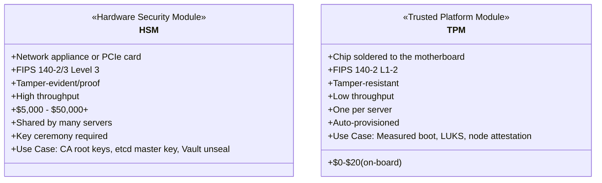
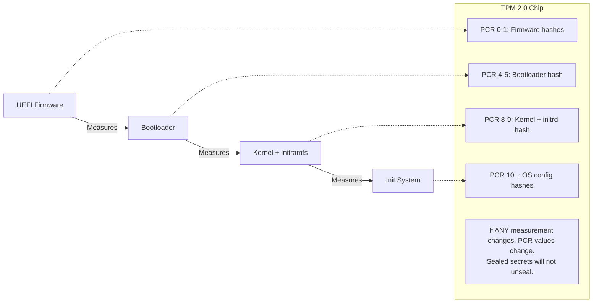
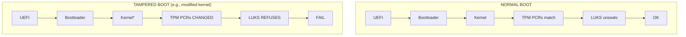

> **Complexity**: `[ADVANCED]` | Time: 60 minutes
>
> **Prerequisites**: [Physical Security & Air-Gapped Environments](../module-6.1-air-gapped/), [CKS](/k8s/cks/)

---

## What You'll Be Able to Do

After completing this module, you will be able to:

1. **Implement** HSM-backed encryption for etcd secrets using PKCS#11 integration
2. **Configure** TPM-based measured boot with LUKS auto-unlock, and **design** remote node attestation to verify bare-metal server integrity
3. **Design** a key management architecture where master encryption keys never exist outside hardware security boundaries
4. **Evaluate** HSM deployment models (network HSM, PCIe HSM, cloud HSM) based on performance, compliance, and cost requirements

---

## Why This Module Matters

A common failure mode in self-managed Kubernetes is storing the etcd encryption key alongside the data it protects or in broadly accessible backup systems; if an attacker obtains both, etcd backups can expose every Secret in the cluster.

The root cause was not a Kubernetes vulnerability. It was a key management failure. The encryption key that protected everything was itself unprotected. On AWS, you would use KMS -- a [hardware-backed key service where the master key is generally kept within the HSM boundary](https://docs.aws.amazon.com/kms/latest/developerguide/data-protection.html). On-premises, you need the same capability, but you must build it yourself using Hardware Security Modules (HSMs) and Trusted Platform Modules (TPMs). These are not optional luxuries for regulated environments -- they are the foundation that makes all other encryption meaningful.

> **The Vault Door Analogy**
>
> Encrypting etcd without an HSM is like putting a combination lock on a bank vault but writing the combination on a Post-it note stuck to the door. The lock is real, the vault is real, but the security is theater. An HSM is a second vault -- one that holds the combination. The combination never leaves the vault; the vault performs the unlock operation internally. Even the vault manufacturer cannot extract the key once it is generated inside the HSM.

---

## What You'll Learn

- What HSMs and TPMs are and how they differ
- How TPM enables measured boot and secure boot for Kubernetes nodes
- Configuring HashiCorp Vault with an HSM backend via PKCS#11
- Replacing cloud KMS for Kubernetes encryption at rest
- Disk encryption with LUKS + TPM auto-unlock
- Key lifecycle management in on-premises environments

---

## HSM vs TPM: Understanding the Hardware



### HSM Form Factors

| Form Factor | Example | Throughput | Cost | Use Case |
|-------------|---------|------------|------|----------|
| Network appliance | Enterprise HSM appliances | High throughput | High cost | Enterprise PKI, payment processing |
| PCIe card | PCIe HSMs | Moderate to high throughput | Lower cost than network appliances | Single server, Vault backend |
| USB token | USB HSMs | Lower throughput | Much lower cost | Small deployments, dev/test |
| Cloud HSM | AWS CloudHSM, Azure Cloud HSM, Google Cloud HSM | Varies | Varies | Hybrid environments |

For hybrid deployments using cloud providers as a trust anchor, verify current validation limits: [AWS CloudHSM `hsm2m.medium` is FIPS 140-3 Level 3 certified (the legacy `hsm1.medium` was archived to historical status January 4, 2026)](https://docs.aws.amazon.com/cloudhsm/latest/userguide/fips-validation.html). Note that while AWS CloudHSM charges per HSM per hour, third-party sources conflict on the exact rate, so verify directly at aws.amazon.com/cloudhsm/pricing/. Azure's modern offering is Azure Cloud HSM, utilizing [Marvell LiquidSecurity HSMs validated to FIPS 140-3 Level 3](https://learn.microsoft.com/en-us/azure/cloud-hsm/service-limits), [which succeeds the legacy Azure Dedicated HSM](https://learn.microsoft.com/en-us/azure/dedicated-hsm/overview). [Google Cloud HSM is backed by FIPS 140-2 Level 3 validated hardware](https://docs.cloud.google.com/kms/docs/hsm).

---

## TPM for Measured Boot

Measured boot uses the TPM to create a chain of trust from firmware to the running OS. Each stage measures (hashes) the next stage before executing it, storing the measurement in TPM Platform Configuration Registers (PCRs). [TPM 2.0 is standardized as ISO/IEC 11889:2015](https://www.iso.org/standard/66510.html), with the TCG PC Client Platform Profile mandating SHA-1 and SHA-256 PCR banks, each containing 24 registers (PCR 0–23).



> **Pause and predict**: If an attacker replaces the kernel on a Kubernetes node, which PCR values will change? How does the TPM detect this without any network connectivity or external verification service?

### Verifying TPM and Measured Boot on Kubernetes Nodes

These commands check whether TPM 2.0 hardware is present and read the Platform Configuration Registers that store the hash chain from boot. Modern Linux distributions commonly expose TPM device nodes such as `/dev/tpm0` and often `/dev/tpmrm0`; verify exact kernel and user-space package details against your distribution documentation and upstream release notes.

```bash
# Check if TPM 2.0 is available
ls -la /dev/tpm0 /dev/tpmrm0

# Read PCR values to verify measured boot is active
# Note: tpm2-tools latest stable release is version 5.7 (April 2024)
tpm2_pcrread sha256:0,1,4,7,8,9

# Expected output (values will differ per system):
#   sha256:
#     0 : 0x3DCB05B32D60C4...   (firmware)
#     1 : 0xA4B7C3E9F1D2...     (firmware config)
#     4 : 0x7B1C8E2F5A9D...     (bootloader)
#     7 : 0xE5F6A7B8C9D0...     (Secure Boot policy)
#     8 : 0x1A2B3C4D5E6F...     (kernel)
#     9 : 0x9F8E7D6C5B4A...     (initramfs)

# If PCR[0] is all zeros, measured boot is not active
# Common cause: TPM not enabled in BIOS

# Verify Secure Boot status
mokutil --sb-state
# Expected: SecureBoot enabled
```

### Enabling TPM in a Talos Linux Cluster

Talos Linux (used for immutable Kubernetes nodes) has built-in TPM support:

```yaml
# talos-machine-config.yaml
machine:
  install:
    disk: /dev/sda
    bootloader: true
    wipe: false
  systemDiskEncryption:
    ephemeral:
      provider: luks2
      keys:
        - tpm: {}          # Seal LUKS key to TPM PCRs
          slot: 0
    state:
      provider: luks2
      keys:
        - tpm: {}
          slot: 0
```

---

## HashiCorp Vault with HSM Backend (PKCS#11)

Vault is the standard secrets manager for Kubernetes. In cloud environments, Vault uses cloud KMS for auto-unseal. On-premises, you replace cloud KMS with an HSM via the PKCS#11 interface. [PKCS#11 Specification v3.1 is the current OASIS Standard, with v3.2 published as a Committee Specification in November 2025](https://docs.oasis-open.org/pkcs11/pkcs11-spec/v3.1/os/pkcs11-spec-v3.1-os.html). Note that [HashiCorp Vault PKCS#11 HSM auto-unseal requires Vault Enterprise](https://developer.hashicorp.com/vault/docs/configuration/seal/pkcs11); the open-source community Vault does not support it (though the OpenBao fork recently added support).

### Architecture

```mermaid
flowchart LR
    subgraph Kubernetes Cluster
        V[Vault Pod<br/>PKCS#11 lib client]
        E[etcd<br/>Vault storage]
        V --> E
    end
    
    subgraph HSM Appliance
        M[Master Key<br/>Never leaves the HSM]
        API[PKCS#11 API]
        API --- M
    end
    
    V <-->|mTLS| API
    
    note[Auto-unseal: HSM unwraps the Vault master key at startup.<br/>No Shamir shares needed.]
    HSM Appliance -.-> note
```

> **Stop and think**: Without HSM auto-unseal, Vault requires multiple keyholders to perform a "key ceremony" every time Vault restarts. In a Kubernetes environment where pods can be rescheduled at any time, why is this operationally untenable?

### Configure Vault with HSM Auto-Unseal

The following Vault configuration uses PKCS#11 to communicate with an HSM for automatic unsealing. The `seal "pkcs11"` stanza replaces cloud KMS -- the master key is protected by the HSM instead of being stored in plaintext outside the hardware boundary.

```hcl
# vault-config.hcl
storage "raft" {
  path = "/vault/data"
  node_id = "vault-0"
}

listener "tcp" {
  address     = "0.0.0.0:8200"
  tls_cert_file = "/vault/tls/tls.crt"
  tls_key_file  = "/vault/tls/tls.key"
}

# HSM seal configuration (replaces cloud KMS)
seal "pkcs11" {
  lib            = "/usr/lib/softhsm/libsofthsm2.so"  # Path to PKCS#11 library
  slot           = "0"                                   # HSM slot number
  pin            = "env://VAULT_HSM_PIN"                # PIN from environment
  key_label      = "vault-master-key"                   # Label of the key in HSM
  hmac_key_label = "vault-hmac-key"                     # Label for HMAC key
  mechanism      = "0x0001"                             # CKM_RSA_PKCS
  generate_key   = "true"                               # Generate key if not exists
}

api_addr = "https://vault.vault.svc:8200"
cluster_addr = "https://vault-0.vault-internal.vault.svc:8201"
```

### Deploy Vault with HSM on Kubernetes

Deploy Vault as a 3-replica StatefulSet using the Vault Helm chart. Key configuration points:

- Use `hashicorp/vault-enterprise` image (PKCS#11 seal requires Enterprise)
- Mount the HSM client library from the host (`/usr/lib/softhsm` or vendor path) as a read-only volume
- Inject the HSM PIN from a Kubernetes Secret via environment variable
- Mount TLS certificates for the Vault API endpoint
- Use Raft storage with a PVC per replica (10Gi recommended)

### Using YubiHSM 2 for Smaller Deployments

For smaller deployments, a USB HSM such as YubiHSM 2 can provide hardware-backed key storage at far lower cost than a network appliance, but you should verify current certifications and pricing directly with the vendor. Install the YubiHSM connector on the Vault node, generate an RSA key via `yubihsm-shell`, and configure Vault's seal stanza to use the YubiHSM PKCS#11 library (`yubihsm_pkcs11.so`). The configuration is identical to the network HSM case -- only the `lib` path changes.

---

## Replacing Cloud KMS for Kubernetes Encryption at Rest

In cloud environments, you configure Kubernetes to use cloud KMS for encrypting Secrets in etcd. On-premises, you use Vault with HSM as the KMS provider.

### Kubernetes KMS v2 Provider with Vault

```yaml
# kms-vault-plugin-config.yaml
# This runs on every control plane node
apiVersion: apiserver.config.k8s.io/v1
kind: EncryptionConfiguration
resources:
  - resources:
      - secrets
      - configmaps
    providers:
      - kms:
          apiVersion: v2
          name: vault-kms
          endpoint: unix:///var/run/kms-vault/kms.sock
          timeout: 10s
      - identity: {}    # Fallback: unencrypted (for migration)
```

```bash
# Install the KMS plugin on control plane nodes
# The plugin translates Kubernetes KMS gRPC calls to Vault API calls

# Start the KMS plugin
kms-vault-provider \
  --listen unix:///var/run/kms-vault/kms.sock \
  --vault-addr https://vault.vault.svc:8200 \
  --vault-token-path /var/run/secrets/vault/token \
  --transit-key kubernetes-secrets \
  --transit-mount transit/

# Configure kube-apiserver to use the plugin
# Add to kube-apiserver flags:
#   --encryption-provider-config=/etc/kubernetes/encryption-config.yaml
```

---

## Disk Encryption with LUKS + TPM

Every Kubernetes node should have encrypted disks. LUKS (Linux Unified Key Setup) provides disk encryption, and TPM can automatically unseal the disk at boot -- but only if the boot chain is unmodified.

> **Pause and predict**: LUKS encryption with TPM auto-unlock means the disk decrypts automatically at boot. If someone steals the entire server (disk + TPM together), does the encryption still protect the data? Why or why not?

### Setting Up LUKS with TPM Auto-Unlock

The `systemd-cryptenroll` command seals the LUKS decryption key to specific TPM PCR values. The key is only released when the boot chain matches the expected measurements -- a modified kernel or bootloader will cause the unlock to fail.

```bash
# Create a temporary keyfile for non-interactive execution
echo "TempSecurePass123" > /tmp/luks-key

# Encrypt a data partition with LUKS2
cryptsetup luksFormat --batch-mode --type luks2 /dev/sdb /tmp/luks-key

# Add a TPM-sealed key (systemd-cryptenroll)
systemd-cryptenroll /dev/sdb \
  --unlock-key-file=/tmp/luks-key \
  --tpm2-device=auto \
  --tpm2-pcrs=0+1+4+7+8    # Seal to firmware + bootloader + Secure Boot + kernel

# Clean up
rm -f /tmp/luks-key

# Configure auto-unlock at boot via /etc/crypttab
echo "k8s-data /dev/sdb - tpm2-device=auto" >> /etc/crypttab

# Test: reboot and verify automatic unlock
systemctl daemon-reload
systemctl restart systemd-cryptsetup@k8s-data

# Verify the volume is unlocked
lsblk -f
# Expected: k8s-data (crypt) mounted and active
```

### What Happens on Tamper



*A modified kernel produces a different PCR value than the one the key was sealed to, so the TPM does not release the key, the disk stays encrypted, and the node fails to boot until an operator intervenes.*

### Remote Node Attestation

While LUKS auto-unlock protects data at rest, it does not prevent a booted (but later compromised) node from joining the Kubernetes cluster. To verify bare-metal server integrity before or during cluster admission, you must implement remote node attestation using the TPM:

- **Keylime**: [A CNCF project providing scalable remote boot attestation and runtime integrity measurement using TPM hardware. (Note: Keylime entered CNCF as a Sandbox project in September 2020; its current 2026 maturity level should be verified directly on the CNCF project page)](https://www.cncf.io/projects/keylime/).
- **SPIRE (SPIFFE)**: [Includes a built-in `tpm_devid` node attestor for TPM 2.0 + DevID certificate-based node attestation](https://github.com/spiffe/spire/blob/main/doc/spire_agent.md). [The community `bloomberg/spire-tpm-plugin` also provides agent and server plugins enabling TPM 2.0 node attestation via TPM credential activation](https://github.com/bloomberg/spire-tpm-plugin).
- **Cloud integration**: For hybrid clusters using managed control planes like AKS, [Trusted Launch integrates a vTPM (TPM 2.0 compliant) for remote attestation of AKS node VMs](https://learn.microsoft.com/en-us/azure/aks/use-trusted-launch), ensuring secure boot across environments.

---

## Did You Know?

- **FIPS 140-3 replaced FIPS 140-2 in 2019** but transition was delayed. [FIPS 140-2 module certificates are moved to the CMVP historical list on September 21, 2026](https://csrc.nist.gov/Projects/cryptographic-module-validation-program/FAQs); FIPS 140-3 introduces updated non-invasive security requirements, and NIST CMVP transition and procurement guidance should be checked directly for the exact compliance implications in your environment.
- **cert-manager** standard issuer workflows do not provide first-class native HSM/PKCS#11-backed CA key storage, so HSM-backed CA designs still require additional components or custom integration choices.
- **The current TCG TPM 2.0 Library Specification** (version 185) was published in March 2026. The TCG continues to publish independent revisions to adapt to modern security contexts, while the ISO standard remains anchored to the ISO/IEC 11889:2015 edition. Features introduced in intermediate revisions (like 1.59's Authentication Countdown Timer) enhance recovery in compromised states.
- **The Shamir's Secret Sharing scheme** used by Vault's default seal was invented by Adi Shamir in 1979 -- [the same Shamir as in RSA (Rivest-Shamir-Adleman)](https://spectrum.ieee.org/amp/the-future-of-cybersecurity-is-the-quantum-random-number-generator-2650277204). With HSM auto-unseal, Shamir shares are replaced by a single HSM-protected key, eliminating the "key ceremony" problem of gathering multiple keyholders.
- **[TPM 2.0 was mandated by Microsoft for Windows 11](https://learn.microsoft.com/en-us/windows/whats-new/windows-11-requirements)**, which dramatically accelerated TPM adoption in server hardware. Before Windows 11, TPM deployment on server and PC hardware was less uniform; today, TPM 2.0 support is far more common and is often treated as a baseline security feature.

---

## Common Mistakes

| Mistake | Problem | Solution |
|---------|---------|----------|
| Storing HSM PIN in a ConfigMap | PIN exposed to anyone with RBAC read | Use a Kubernetes Secret with strict RBAC, or inject via init container |
| Single HSM with no HA | HSM failure = Vault cannot unseal = cluster-wide secret outage | Deploy HSM in HA pair (active/standby) or use multiple USB HSMs |
| Sealing LUKS to PCR[7] only | Only measures Secure Boot policy, not actual kernel | Seal to PCRs 0+1+4+7+8 (firmware, config, bootloader, SB, kernel) |
| Not rotating HSM keys | Compromised key has unlimited lifetime | Define key rotation policy (annually or per compliance requirement) |
| Running Vault without HSM seal | Vault unseal keys are Shamir shares stored by humans | Use HSM auto-unseal; eliminate human key management |
| Ignoring TPM event log | Cannot detect what changed when PCR mismatch occurs | Ship TPM event logs to SIEM; review on boot failures |
| HSM on same network as workloads | Compromised pod could attempt HSM operations | Isolate HSM on dedicated management VLAN |
| No HSM backup strategy | HSM hardware failure = permanent key loss | Use HSM key export (wrapped) to backup HSM or secure offline storage |

---

## Quiz

### Question 1
Scenario: Your production Vault cluster uses HSM auto-unseal. The HSM appliance suffers a total hardware failure at 2 AM. What happens to running workloads, and what is your immediate recovery plan?

<details>
<summary>Answer</summary>

**Immediate impact on running workloads: None.**
Running pods that already have their secrets (injected via Vault Agent or CSI driver) will continue operating normally because Kubernetes does not continuously re-fetch secrets. Secrets are cached in pod memory or tmpfs volumes, meaning existing workloads remain stable despite the HSM failure. However, new pods requiring Vault secrets will fail to start due to init container timeouts, and automated secret rotation policies will halt. Most critically, if a Vault pod restarts, it will be unable to unseal since it cannot communicate with the HSM to unwrap its master key. To recover, if an HA HSM pair is not available, you must rely on HSM backups to provision a replacement, as the Vault recovery keys generated during initialization cannot unseal the cluster.
</details>

### Question 2
Scenario: A rogue datacenter technician steals a physical node (disk, motherboard, and TPM chip together) from your on-premises cluster. Explain why TPM-sealed LUKS encryption prevents a "stolen disk" attack but fails to protect the data in this "stolen server" attack.

<details>
<summary>Answer</summary>

**Stolen disk vs Stolen server:**
When an attacker steals only the disk and connects it to a different machine, the new machine has a different TPM (or no TPM) with different PCR values. Because the LUKS key was sealed specifically to the original server's TPM PCRs, the new TPM will refuse to unseal the key, leaving the disk fully encrypted and protecting your data. Conversely, if an attacker steals the entire server (disk, motherboard, and TPM chip together), the exact same firmware, bootloader, and kernel will load upon power-on. This causes the PCR values to perfectly match what the TPM expects, prompting the TPM to automatically release the LUKS key and grant the attacker full access. To mitigate the stolen server scenario, you must implement a boot-time PIN, Network-Bound Disk Encryption (NBDE) via Tang, or remote attestation via Keylime to halt the boot process if the node leaves your physical datacenter.
</details>

### Question 3
Scenario: Your organization is migrating from AWS to on-premises. The security team mandates that the etcd master encryption key must be protected by hardware and must never be exposed directly to the Kubernetes control plane. How do you configure Kubernetes to satisfy this requirement while maintaining automatic encryption of Secrets?

<details>
<summary>Answer</summary>

**Architecture: Kubernetes KMS v2 Provider with Vault + HSM.**
To satisfy this requirement, you must configure the Kubernetes API server to use the KMS v2 provider pointing to a Vault instance backed by an HSM. When a Secret is created, the API server sends the data encryption key (DEK) to Vault's Transit secrets engine via the KMS plugin. Vault encrypts this DEK using its internal key encryption key (KEK), which is itself securely wrapped by the HSM via the PKCS#11 interface. Because the master key is hardware-protected by the HSM and is not exposed directly to the Kubernetes control plane, this architecture fulfills the strict security mandate while maintaining automatic encryption of etcd Secrets. This setup effectively mirrors cloud-native KMS behavior while retaining complete on-premises data sovereignty.
</details>

### Question 4
Scenario: A junior engineer proposes deploying SoftHSM to production to save the $50,000 cost of a hardware appliance, arguing that it implements the identical PKCS#11 API and passes all functional integration tests. Based on physical security and compliance guarantees, what are the primary reasons you must reject this proposal?

<details>
<summary>Answer</summary>

**Why SoftHSM is unacceptable for production:**
SoftHSM is purely a software implementation of the PKCS#11 interface that stores keys in standard filesystem files, making them vulnerable to native extraction by anyone with root access or a disk image. While it perfectly mimics the API of a real HSM for integration testing, it fundamentally lacks the tamper-proof hardware boundaries required to protect keys from physical or memory-level attacks. Furthermore, SoftHSM keys reside in process memory, leaving them exposed to memory dumps and cold boot attacks, whereas real HSMs process keys entirely within isolated security co-processors. Finally, regulated industries require FIPS 140-2 or 140-3 certification, which SoftHSM cannot achieve without a physical hardware boundary, and it cannot provide the immutable, tamper-evident audit logs of cryptographic operations that enterprise compliance demands.
</details>

---

## Hands-On Exercise: Set Up Vault with SoftHSM Auto-Unseal

**Task**: Configure a development Vault instance using SoftHSM to simulate HSM auto-unseal.

### Prerequisites
- A Linux machine or VM (Ubuntu 22.04 recommended)
- Vault binary installed

### Steps

1. **Install SoftHSM**:
   ```bash
   apt-get install -y softhsm2

   # Initialize a token
   softhsm2-util --init-token --slot 0 \
     --label "vault-hsm" \
     --pin 1234 --so-pin 0000

   # Verify
   softhsm2-util --show-slots
   ```

2. **Start Vault with PKCS#11 seal**:
   ```bash
   cat > /tmp/vault-config.hcl <<'EOF'
   storage "file" {
     path = "/tmp/vault-data"
   }
   listener "tcp" {
     address     = "127.0.0.1:8200"
     tls_disable = true
   }
   seal "pkcs11" {
     lib            = "/usr/lib/softhsm/libsofthsm2.so"
     slot           = "0"
     pin            = "1234"
     key_label      = "vault-key"
     hmac_key_label = "vault-hmac"
     generate_key   = "true"
   }
   EOF

   mkdir -p /tmp/vault-data
   vault server -config=/tmp/vault-config.hcl &

   # Verify Vault started (checkpoint)
   sleep 2
   VAULT_ADDR="http://127.0.0.1:8200" vault status || true
   ```

3. **Initialize and verify auto-unseal**:
   ```bash
   export VAULT_ADDR="http://127.0.0.1:8200"
   vault operator init -recovery-shares=1 -recovery-threshold=1

   # Note: with HSM seal, Vault uses "recovery keys" instead of "unseal keys"
   # The HSM handles unsealing automatically

   vault status
   # Sealed: false  (auto-unsealed via SoftHSM)
   ```

4. **Test auto-unseal by restarting Vault**:
   ```bash
   kill %1        # Stop Vault
   vault server -config=/tmp/vault-config.hcl &

   sleep 2
   vault status
   # Sealed: false  (auto-unsealed again without manual intervention)
   ```

### Success Criteria
- [ ] SoftHSM token initialized with a PIN
- [ ] Vault starts with PKCS#11 seal configuration
- [ ] `vault operator init` uses recovery keys (not unseal keys)
- [ ] Vault auto-unseals on restart without manual intervention
- [ ] Understand why this setup is for development only

---

## Key Takeaways

1. **HSMs protect the keys that protect everything else** -- without them, encryption at rest is security theater
2. **TPM provides measured boot** -- a tampered kernel or bootloader changes PCR values, preventing disk unlock
3. **Vault + HSM replaces cloud KMS** -- PKCS#11 is the standard interface
4. **LUKS + TPM encrypts node disks** but protect against stolen servers with PIN or NBDE (Tang)
5. **SoftHSM for dev, real HSM for production** -- the API is the same, the security guarantees are not

---

## Next Module

Continue to [Module 6.3: Enterprise Identity (AD/LDAP/OIDC)](../module-6.3-enterprise-identity/) to learn how to integrate Kubernetes authentication with your organization's existing identity systems.

## Sources

- [docs.aws.amazon.com: data protection.html](https://docs.aws.amazon.com/kms/latest/developerguide/data-protection.html) — AWS KMS documentation directly states that KMS key material is protected by HSMs and plaintext key material never leaves the HSM boundary.
- [docs.aws.amazon.com: fips validation.html](https://docs.aws.amazon.com/cloudhsm/latest/userguide/fips-validation.html) — AWS CloudHSM compliance documentation directly covers the hsm1.medium historical date and the current FIPS validation state.
- [learn.microsoft.com: overview](https://learn.microsoft.com/en-us/azure/dedicated-hsm/overview) — Microsoft Learn explicitly describes Azure Cloud HSM as the successor to Azure Dedicated HSM.
- [learn.microsoft.com: service limits](https://learn.microsoft.com/en-us/azure/cloud-hsm/service-limits) — Microsoft Learn service-limits documentation directly names the Marvell LiquidSecurity hardware and its FIPS validation level.
- [docs.cloud.google.com: hsm](https://docs.cloud.google.com/kms/docs/hsm) — Google Cloud documentation directly states that Cloud HSM uses FIPS 140-2 Level 3 certified HSMs.
- [iso.org: 66510.html](https://www.iso.org/standard/66510.html) — The ISO page directly identifies ISO/IEC 11889-1:2015 as the TPM architecture standard.
- [PKCS #11 Specification Version 3.1](https://docs.oasis-open.org/pkcs11/pkcs11-spec/v3.1/os/pkcs11-spec-v3.1-os.html) — Normative API specification for HSM/token interaction; supports terminology and integration claims around PKCS#11-backed key storage and cryptographic operations.
- [developer.hashicorp.com: pkcs11](https://developer.hashicorp.com/vault/docs/configuration/seal/pkcs11) — HashiCorp's PKCS#11 seal configuration page explicitly states that auto-unseal and seal wrapping for PKCS#11 require Vault Enterprise.
- [cncf.io: keylime](https://www.cncf.io/projects/keylime/) — The CNCF project page directly states Keylime's Sandbox acceptance date and describes its TPM-based attestation purpose.
- [github.com: spire agent.md](https://github.com/spiffe/spire/blob/main/doc/spire_agent.md) — SPIRE's official GitHub configuration reference lists `tpm_devid` as a built-in node attestor.
- [github.com: spire tpm plugin](https://github.com/bloomberg/spire-tpm-plugin) — The repository README directly describes TPM credential activation as the attestation mechanism.
- [learn.microsoft.com: use trusted launch](https://learn.microsoft.com/en-us/azure/aks/use-trusted-launch) — Microsoft Learn directly states that Trusted Launch provides a TPM 2.0-compliant vTPM and measured-boot-based attestation.
- [csrc.nist.gov: FAQs](https://csrc.nist.gov/Projects/cryptographic-module-validation-program/FAQs) — The CMVP FAQ directly gives the active-list deadline and the switch to FIPS 140-3-only active validations.
- [spectrum.ieee.org: the future of cybersecurity is the quantum random number generator 2650277204](https://spectrum.ieee.org/amp/the-future-of-cybersecurity-is-the-quantum-random-number-generator-2650277204) — The IEEE Spectrum article explicitly identifies RSA as named for Rivest, Shamir, and Adleman.
- [learn.microsoft.com: windows 11 requirements](https://learn.microsoft.com/en-us/windows/whats-new/windows-11-requirements) — Microsoft's Windows 11 requirements page directly lists TPM version 2.0 as a minimum hardware requirement.
- [Encrypting Confidential Data at Rest](https://kubernetes.io/docs/tasks/administer-cluster/encrypt-data/) — Authoritative Kubernetes guidance for etcd encryption at rest and KMS provider integration points.
