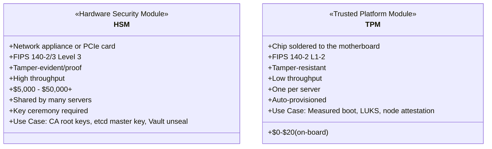
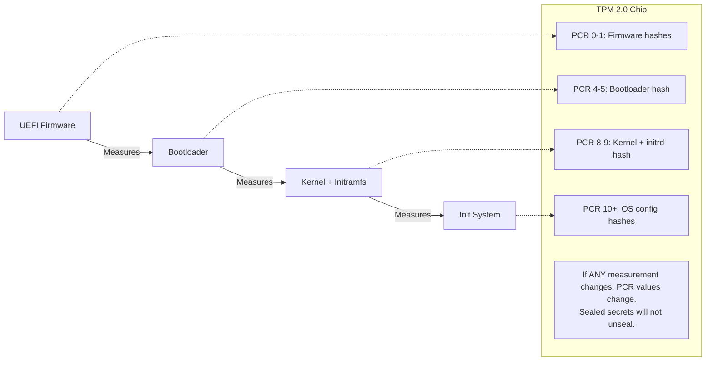
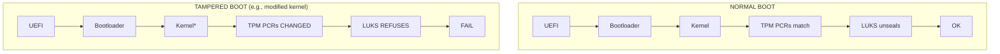

> **Complexity**: `[ADVANCED]` | Time: 60 minutes
>
> **Prerequisites**: [Physical Security & Air-Gapped Environments](../module-6.1-air-gapped/), [CKS](/k8s/cks/)

---

## What You'll Be Able to Do

After completing this module, you will be able to:

1. **Implement** HSM-backed encryption for etcd secrets using PKCS#11 integration
2. **Configure** TPM-based measured boot with LUKS auto-unlock, and **design** remote node attestation to verify bare-metal server integrity
3. **Design** a key management architecture where master encryption keys never exist outside hardware security boundaries
4. **Evaluate** HSM deployment models (network HSM, PCIe HSM, cloud HSM) based on performance, compliance, and cost requirements

---

## Why This Module Matters

In 2021, a fintech company running Kubernetes on-premises stored their etcd encryption key in a Kubernetes Secret. That Secret was base64-encoded (not encrypted) and backed up nightly to an NFS share. A contractor with read access to the NFS share decoded the Secret, extracted the etcd encryption key, and used it to decrypt a backup of etcd -- which contained every Secret in the cluster: database passwords, API keys, TLS certificates, and service account tokens for 340 microservices. The breach was not detected for 11 weeks.

The root cause was not a Kubernetes vulnerability. It was a key management failure. The encryption key that protected everything was itself unprotected. On AWS, you would use KMS -- a hardware-backed key service where the master key never leaves the HSM. On-premises, you need the same capability, but you must build it yourself using Hardware Security Modules (HSMs) and Trusted Platform Modules (TPMs). These are not optional luxuries for regulated environments -- they are the foundation that makes all other encryption meaningful.

> **The Vault Door Analogy**
>
> Encrypting etcd without an HSM is like putting a combination lock on a bank vault but writing the combination on a Post-it note stuck to the door. The lock is real, the vault is real, but the security is theater. An HSM is a second vault -- one that holds the combination. The combination never leaves the vault; the vault performs the unlock operation internally. Even the vault manufacturer cannot extract the key once it is generated inside the HSM.

---

## What You'll Learn

- What HSMs and TPMs are and how they differ
- How TPM enables measured boot and secure boot for Kubernetes nodes
- Configuring HashiCorp Vault with an HSM backend via PKCS#11
- Replacing cloud KMS for Kubernetes encryption at rest
- Disk encryption with LUKS + TPM auto-unlock
- Key lifecycle management in on-premises environments

---

## HSM vs TPM: Understanding the Hardware



### HSM Form Factors

| Form Factor | Example | Throughput | Cost | Use Case |
|-------------|---------|------------|------|----------|
| Network appliance | Thales Luna, Entrust nShield | 10,000+ ops/sec | $20K-$100K | Enterprise PKI, payment processing |
| PCIe card | Thales Luna PCIe, Utimaco | 5,000+ ops/sec | $5K-$30K | Single server, Vault backend |
| USB token | YubiHSM 2 | 50 ops/sec | $650 | Small deployments, dev/test |
| Cloud HSM | AWS CloudHSM, Azure Cloud HSM, Google Cloud HSM | Varies | Varies | Hybrid environments |

For hybrid deployments using cloud providers as a trust anchor, verify current validation limits: AWS CloudHSM `hsm2m.medium` is FIPS 140-3 Level 3 certified (the legacy `hsm1.medium` was archived to historical status January 4, 2026). Azure's modern offering is Azure Cloud HSM, utilizing Marvell LiquidSecurity HSMs validated to FIPS 140-3 Level 3, which succeeds the legacy Azure Dedicated HSM. Google Cloud HSM is backed by FIPS 140-2 Level 3 validated hardware.

---

## TPM for Measured Boot

Measured boot uses the TPM to create a chain of trust from firmware to the running OS. Each stage measures (hashes) the next stage before executing it, storing the measurement in TPM Platform Configuration Registers (PCRs). TPM 2.0 is standardized as ISO/IEC 11889:2015, with the TCG PC Client Platform Profile mandating SHA-1 and SHA-256 PCR banks, each containing 24 registers (PCR 0–23).



> **Pause and predict**: If an attacker replaces the kernel on a Kubernetes node, which PCR values will change? How does the TPM detect this without any network connectivity or external verification service?

### Verifying TPM and Measured Boot on Kubernetes Nodes

These commands check whether TPM 2.0 hardware is present and read the Platform Configuration Registers that store the hash chain from boot. Linux TPM 2.0 driver support stabilized from kernel 4.9, with the `/dev/tpmrm0` resource-manager interface available from kernel 4.12.

```bash
# Check if TPM 2.0 is available
ls -la /dev/tpm0 /dev/tpmrm0

# Read PCR values to verify measured boot is active
# Note: tpm2-tools latest stable release is version 5.7 (April 2024)
tpm2_pcrread sha256:0,1,4,7,8,9

# Expected output (values will differ per system):
#   sha256:
#     0 : 0x3DCB05B32D60C4...   (firmware)
#     1 : 0xA4B7C3E9F1D2...     (firmware config)
#     4 : 0x7B1C8E2F5A9D...     (bootloader)
#     7 : 0xE5F6A7B8C9D0...     (Secure Boot policy)
#     8 : 0x1A2B3C4D5E6F...     (kernel)
#     9 : 0x9F8E7D6C5B4A...     (initramfs)

# If PCR[0] is all zeros, measured boot is not active
# Common cause: TPM not enabled in BIOS

# Verify Secure Boot status
mokutil --sb-state
# Expected: SecureBoot enabled
```

### Enabling TPM in a Talos Linux Cluster

Talos Linux (used for immutable Kubernetes nodes) has built-in TPM support:

```yaml
# talos-machine-config.yaml
machine:
  install:
    disk: /dev/sda
    bootloader: true
    wipe: false
  systemDiskEncryption:
    ephemeral:
      provider: luks2
      keys:
        - tpm: {}          # Seal LUKS key to TPM PCRs
          slot: 0
    state:
      provider: luks2
      keys:
        - tpm: {}
          slot: 0
```

---

## HashiCorp Vault with HSM Backend (PKCS#11)

Vault is the standard secrets manager for Kubernetes. In cloud environments, Vault uses cloud KMS for auto-unseal. On-premises, you replace cloud KMS with an HSM via the PKCS#11 interface. PKCS#11 Specification v3.1 is the current OASIS Standard, with v3.2 published as a Committee Specification in November 2025. Note that HashiCorp Vault PKCS#11 HSM auto-unseal requires Vault Enterprise; the open-source community Vault does not support it (though the OpenBao fork recently added support).

### Architecture

```mermaid
flowchart LR
    subgraph Kubernetes Cluster
        V[Vault Pod<br/>PKCS#11 lib client]
        E[etcd<br/>Vault storage]
        V --> E
    end
    
    subgraph HSM Appliance
        M[Master Key<br/>Never leaves the HSM]
        API[PKCS#11 API]
        API --- M
    end
    
    V <-->|mTLS| API
    
    note[Auto-unseal: HSM unwraps the Vault master key at startup.<br/>No Shamir shares needed.]
    HSM Appliance -.-> note
```

> **Stop and think**: Without HSM auto-unseal, Vault requires multiple keyholders to perform a "key ceremony" every time Vault restarts. In a Kubernetes environment where pods can be rescheduled at any time, why is this operationally untenable?

### Configure Vault with HSM Auto-Unseal

The following Vault configuration uses PKCS#11 to communicate with an HSM for automatic unsealing. The `seal "pkcs11"` stanza replaces cloud KMS -- the master key never leaves the HSM boundary.

```hcl
# vault-config.hcl
storage "raft" {
  path = "/vault/data"
  node_id = "vault-0"
}

listener "tcp" {
  address     = "0.0.0.0:8200"
  tls_cert_file = "/vault/tls/tls.crt"
  tls_key_file  = "/vault/tls/tls.key"
}

# HSM seal configuration (replaces cloud KMS)
seal "pkcs11" {
  lib            = "/usr/lib/softhsm/libsofthsm2.so"  # Path to PKCS#11 library
  slot           = "0"                                   # HSM slot number
  pin            = "env://VAULT_HSM_PIN"                # PIN from environment
  key_label      = "vault-master-key"                   # Label of the key in HSM
  hmac_key_label = "vault-hmac-key"                     # Label for HMAC key
  mechanism      = "0x0001"                             # CKM_RSA_PKCS
  generate_key   = "true"                               # Generate key if not exists
}

api_addr = "https://vault.vault.svc:8200"
cluster_addr = "https://vault-0.vault-internal.vault.svc:8201"
```

### Deploy Vault with HSM on Kubernetes

Deploy Vault as a 3-replica StatefulSet using the Vault Helm chart. Key configuration points:

- Use `hashicorp/vault-enterprise` image (PKCS#11 seal requires Enterprise)
- Mount the HSM client library from the host (`/usr/lib/softhsm` or vendor path) as a read-only volume
- Inject the HSM PIN from a Kubernetes Secret via environment variable
- Mount TLS certificates for the Vault API endpoint
- Use Raft storage with a PVC per replica (10Gi recommended)

### Using YubiHSM 2 for Smaller Deployments

For clusters where a $50,000 network HSM is overkill, the YubiHSM 2 ($650) provides FIPS 140-2 Level 3 security in a USB form factor. Install the YubiHSM connector on the Vault node, generate an RSA key via `yubihsm-shell`, and configure Vault's seal stanza to use the YubiHSM PKCS#11 library (`yubihsm_pkcs11.so`). The configuration is identical to the network HSM case -- only the `lib` path changes.

---

## Replacing Cloud KMS for Kubernetes Encryption at Rest

In cloud environments, you configure Kubernetes to use cloud KMS for encrypting Secrets in etcd. On-premises, you use Vault with HSM as the KMS provider.

### Kubernetes KMS v2 Provider with Vault

```yaml
# kms-vault-plugin-config.yaml
# This runs on every control plane node
apiVersion: apiserver.config.k8s.io/v1
kind: EncryptionConfiguration
resources:
  - resources:
      - secrets
      - configmaps
    providers:
      - kms:
          apiVersion: v2
          name: vault-kms
          endpoint: unix:///var/run/kms-vault/kms.sock
          timeout: 10s
      - identity: {}    # Fallback: unencrypted (for migration)
```

```bash
# Install the KMS plugin on control plane nodes
# The plugin translates Kubernetes KMS gRPC calls to Vault API calls

# Start the KMS plugin
kms-vault-provider \
  --listen unix:///var/run/kms-vault/kms.sock \
  --vault-addr https://vault.vault.svc:8200 \
  --vault-token-path /var/run/secrets/vault/token \
  --transit-key kubernetes-secrets \
  --transit-mount transit/

# Configure kube-apiserver to use the plugin
# Add to kube-apiserver flags:
#   --encryption-provider-config=/etc/kubernetes/encryption-config.yaml
```

---

## Disk Encryption with LUKS + TPM

Every Kubernetes node should have encrypted disks. LUKS (Linux Unified Key Setup) provides disk encryption, and TPM can automatically unseal the disk at boot -- but only if the boot chain is unmodified.

> **Pause and predict**: LUKS encryption with TPM auto-unlock means the disk decrypts automatically at boot. If someone steals the entire server (disk + TPM together), does the encryption still protect the data? Why or why not?

### Setting Up LUKS with TPM Auto-Unlock

The `systemd-cryptenroll` command seals the LUKS decryption key to specific TPM PCR values. The key is only released when the boot chain matches the expected measurements -- a modified kernel or bootloader will cause the unlock to fail.

```bash
# Create a temporary keyfile for non-interactive execution
echo "TempSecurePass123" > /tmp/luks-key

# Encrypt a data partition with LUKS2
cryptsetup luksFormat --batch-mode --type luks2 /dev/sdb /tmp/luks-key

# Add a TPM-sealed key (systemd-cryptenroll)
systemd-cryptenroll /dev/sdb \
  --unlock-key-file=/tmp/luks-key \
  --tpm2-device=auto \
  --tpm2-pcrs=0+1+4+7+8    # Seal to firmware + bootloader + Secure Boot + kernel

# Clean up
rm -f /tmp/luks-key

# Configure auto-unlock at boot via /etc/crypttab
echo "k8s-data /dev/sdb - tpm2-device=auto" >> /etc/crypttab

# Test: reboot and verify automatic unlock
systemctl daemon-reload
systemctl restart systemd-cryptsetup@k8s-data

# Verify the volume is unlocked
lsblk -f
# Expected: k8s-data (crypt) mounted and active
```

### What Happens on Tamper



*The modified kernel produces a different hash in PCR[8]. The LUKS key was sealed to the original PCR[8] value. The TPM will not release the key. The disk stays encrypted. The node fails to boot. An alert is generated.*

### Remote Node Attestation

While LUKS auto-unlock protects data at rest, it does not prevent a booted (but later compromised) node from joining the Kubernetes cluster. To verify bare-metal server integrity before or during cluster admission, you must implement remote node attestation using the TPM:

- **Keylime**: A CNCF project providing scalable remote boot attestation and runtime integrity measurement using TPM hardware.
- **SPIRE (SPIFFE)**: Includes a built-in `tpm_devid` node attestor for TPM 2.0 + DevID certificate-based node attestation. The community `bloomberg/spire-tpm-plugin` also provides agent and server plugins enabling TPM 2.0 node attestation via TPM credential activation.
- **Cloud integration**: For hybrid clusters using managed control planes like AKS, Trusted Launch integrates a vTPM (TPM 2.0 compliant) for remote attestation of AKS node VMs, ensuring secure boot across environments.

---

## Did You Know?

- **FIPS 140-3 replaced FIPS 140-2 in 2019** but transition was delayed. FIPS 140-2 module certificates are moved to the CMVP historical list on September 21, 2026; after that date all new federal procurements require FIPS 140-3. The new standard adds physical security testing against fault injection attacks.
- **cert-manager** csi-driver v0.12.0 was released in February 2026, but native HSM/PKCS#11 key storage is still not implemented in the standard cert-manager CA issuer. Backing CA keys with an HSM remains an open architectural challenge in standard Kubernetes deployments.
- **The current TCG TPM 2.0 Library Specification** (version 185) was published in March 2026. The TCG continues to publish independent revisions to adapt to modern security contexts, while the ISO standard remains anchored to the ISO/IEC 11889:2015 edition. Features introduced in intermediate revisions (like 1.59's Authentication Countdown Timer) enhance recovery in compromised states.
- **The Shamir's Secret Sharing scheme** used by Vault's default seal was invented by Adi Shamir in 1979 -- the same Shamir as in RSA (Rivest-Shamir-Adleman). With HSM auto-unseal, Shamir shares are replaced by a single HSM-protected key, eliminating the "key ceremony" problem of gathering multiple keyholders.
- **TPM 2.0 was mandated by Microsoft for Windows 11**, which dramatically accelerated TPM adoption in server hardware. Before 2021, many server vendors shipped TPM as a $50 add-on module. Now it is a non-negotiable standard on virtually all enterprise servers.

---

## Common Mistakes

| Mistake | Problem | Solution |
|---------|---------|----------|
| Storing HSM PIN in a ConfigMap | PIN exposed to anyone with RBAC read | Use a Kubernetes Secret with strict RBAC, or inject via init container |
| Single HSM with no HA | HSM failure = Vault cannot unseal = cluster-wide secret outage | Deploy HSM in HA pair (active/standby) or use multiple USB HSMs |
| Sealing LUKS to PCR[7] only | Only measures Secure Boot policy, not actual kernel | Seal to PCRs 0+1+4+7+8 (firmware, config, bootloader, SB, kernel) |
| Not rotating HSM keys | Compromised key has unlimited lifetime | Define key rotation policy (annually or per compliance requirement) |
| Running Vault without HSM seal | Vault unseal keys are Shamir shares stored by humans | Use HSM auto-unseal; eliminate human key management |
| Ignoring TPM event log | Cannot detect what changed when PCR mismatch occurs | Ship TPM event logs to SIEM; review on boot failures |
| HSM on same network as workloads | Compromised pod could attempt HSM operations | Isolate HSM on dedicated management VLAN |
| No HSM backup strategy | HSM hardware failure = permanent key loss | Use HSM key export (wrapped) to backup HSM or secure offline storage |

---

## Quiz

### Question 1
Scenario: Your production Vault cluster uses HSM auto-unseal. The HSM appliance suffers a total hardware failure at 2 AM. What happens to running workloads, and what is your immediate recovery plan?

<details>
<summary>Answer</summary>

**Immediate impact on running workloads: None.**
Running pods that already have their secrets (injected via Vault Agent or CSI driver) will continue operating normally. Kubernetes does not re-fetch secrets continuously; they are cached in pod memory or tmpfs volumes, so existing workloads remain stable despite the HSM failure.

**What breaks:**
1. New pods cannot start if they require secrets from Vault (Vault Agent sidecar init will timeout).
2. Secret rotation stops -- any automated rotation policies will fail.
3. If a Vault pod restarts, it cannot unseal because the HSM is unavailable to perform the unseal operation.

**Recovery plan:**
1. **Short-term (minutes)**: If you have an HSM HA pair, the standby HSM takes over automatically. Vault auto-unseal retries and succeeds.
2. **If no HA HSM**: Vault pods that are already running and unsealed continue serving requests. Do not restart them. Contact the HSM vendor for emergency replacement.
3. **Disaster recovery**: If all Vault pods restart before the HSM is restored, you cannot unseal Vault. Recovery keys generated during `vault operator init` with HSM auto-unseal are for recovery operations (e.g., generating a new root token) -- they **cannot** be used to unseal Vault. You must either restore the HSM, provision a replacement HSM with the same key material (from HSM backups), or migrate the seal type.
</details>

### Question 2
Scenario: A rogue datacenter technician steals a physical node (disk, motherboard, and TPM chip together) from your on-premises cluster. Explain why TPM-sealed LUKS encryption prevents a "stolen disk" attack but fails to protect the data in this "stolen server" attack.

<details>
<summary>Answer</summary>

**Stolen disk scenario:**
An attacker removes the disk from the server. They connect it to a different machine, which has a different TPM with different PCR values (or no TPM at all). Because the LUKS key was sealed specifically to the original server's TPM PCRs, the TPM on the new machine cannot unseal the key. The disk remains encrypted and unreadable, effectively defeating the attack.

**Stolen server scenario:**
An attacker steals the entire server -- disk, motherboard, and TPM chip together. On normal power-on, the exact same firmware runs, the same bootloader loads, and the identical kernel starts. Consequently, the PCR values perfectly match what the TPM expects. The TPM then automatically releases the LUKS key, decrypting the disk and granting the attacker full access.

**Mitigations for stolen server:**
1. **PIN + TPM**: Require a boot-time PIN in addition to TPM (`systemd-cryptenroll --tpm2-with-pin=yes`). The attacker needs both the server and the secret PIN.
2. **Network-bound disk encryption (NBDE)**: Use Clevis + Tang. The LUKS key is sealed to a network server (Tang) that is only reachable on the internal datacenter network. A stolen server outside the network cannot reach Tang and cannot unseal.
3. **Remote attestation**: The server must attest to a central service (like Keylime) before the OS fully boots. If attestation fails (wrong network, unexpected location), the boot process halts.
</details>

### Question 3
Scenario: Your organization is migrating from AWS to on-premises. The security team mandates that the etcd master encryption key must be protected by hardware and must never be exposed directly to the Kubernetes control plane. How do you configure Kubernetes to satisfy this requirement while maintaining automatic encryption of Secrets?

<details>
<summary>Answer</summary>

**Architecture: Kubernetes KMS v2 Provider with Vault + HSM.**

The envelope encryption chain functions identically to cloud KMS providers:
1. **Kubernetes API server** receives a request to create a Secret.
2. The API server calls the **KMS v2 plugin** via a Unix socket (gRPC).
3. The KMS plugin calls **Vault's Transit secrets engine** to encrypt the data encryption key (DEK).
4. Vault's Transit engine uses a key encryption key (KEK) stored within Vault.
5. Vault's seal wraps the KEK using the **HSM** via PKCS#11. The HSM master key never leaves the hardware boundary.
6. The encrypted DEK and encrypted Secret are ultimately stored in **etcd**.

This effectively replicates the AWS KMS architecture on-premises. The key advantage over cloud KMS is data sovereignty: you physically own the HSM, and the key material resides entirely in your datacenter, ensuring no third party can be compelled to provide access to your keys.
</details>

### Question 4
Scenario: A junior engineer proposes deploying SoftHSM to production to save the $50,000 cost of a hardware appliance, arguing that it implements the identical PKCS#11 API and passes all functional integration tests. Based on physical security and compliance guarantees, what are the primary reasons you must reject this proposal?

<details>
<summary>Answer</summary>

**SoftHSM is purely a software implementation of the PKCS#11 interface.** It stores keys in files on the filesystem, protected only by standard OS file permissions. While it implements the exact same API as a real HSM, making it ideal for development and testing integrations, it lacks any of the structural security guarantees required for production.

**Why it is unacceptable for production:**
1. **No hardware protection**: Keys are stored in regular files. Anyone with root access (or a disk image) can extract them natively. A real HSM stores keys in tamper-proof hardware, and attempting to physically extract them triggers immediate key destruction.
2. **No FIPS certification**: SoftHSM cannot be FIPS 140-2/3 certified because it fundamentally lacks hardware security boundaries. Regulated industries strictly require FIPS-certified hardware for cryptographic key storage.
3. **Keys in memory**: SoftHSM keys exist in process memory, leaving them highly vulnerable to memory dumps, cold boot attacks, and swap file extraction. Physical HSMs isolate keys within dedicated security processors where memory is cleared upon tamper detection.
4. **No hardware audit trail**: SoftHSM does not generate a secure hardware audit log. HSMs produce immutable, tamper-evident logs of every single cryptographic operation performed.
</details>

---

## Hands-On Exercise: Set Up Vault with SoftHSM Auto-Unseal

**Task**: Configure a development Vault instance using SoftHSM to simulate HSM auto-unseal.

### Prerequisites
- A Linux machine or VM (Ubuntu 22.04 recommended)
- Vault binary installed

### Steps

1. **Install SoftHSM**:
   ```bash
   apt-get install -y softhsm2

   # Initialize a token
   softhsm2-util --init-token --slot 0 \
     --label "vault-hsm" \
     --pin 1234 --so-pin 0000

   # Verify
   softhsm2-util --show-slots
   ```

2. **Start Vault with PKCS#11 seal**:
   ```bash
   cat > /tmp/vault-config.hcl <<'EOF'
   storage "file" {
     path = "/tmp/vault-data"
   }
   listener "tcp" {
     address     = "127.0.0.1:8200"
     tls_disable = true
   }
   seal "pkcs11" {
     lib            = "/usr/lib/softhsm/libsofthsm2.so"
     slot           = "0"
     pin            = "1234"
     key_label      = "vault-key"
     hmac_key_label = "vault-hmac"
     generate_key   = "true"
   }
   EOF

   mkdir -p /tmp/vault-data
   vault server -config=/tmp/vault-config.hcl &

   # Verify Vault started (checkpoint)
   sleep 2
   VAULT_ADDR="http://127.0.0.1:8200" vault status || true
   ```

3. **Initialize and verify auto-unseal**:
   ```bash
   export VAULT_ADDR="http://127.0.0.1:8200"
   vault operator init -recovery-shares=1 -recovery-threshold=1

   # Note: with HSM seal, Vault uses "recovery keys" instead of "unseal keys"
   # The HSM handles unsealing automatically

   vault status
   # Sealed: false  (auto-unsealed via SoftHSM)
   ```

4. **Test auto-unseal by restarting Vault**:
   ```bash
   kill %1        # Stop Vault
   vault server -config=/tmp/vault-config.hcl &

   sleep 2
   vault status
   # Sealed: false  (auto-unsealed again without manual intervention)
   ```

### Success Criteria
- [ ] SoftHSM token initialized with a PIN
- [ ] Vault starts with PKCS#11 seal configuration
- [ ] `vault operator init` uses recovery keys (not unseal keys)
- [ ] Vault auto-unseals on restart without manual intervention
- [ ] Understand why this setup is for development only

---

## Key Takeaways

1. **HSMs protect the keys that protect everything else** -- without them, encryption at rest is security theater
2. **TPM provides measured boot** -- a tampered kernel or bootloader changes PCR values, preventing disk unlock
3. **Vault + HSM replaces cloud KMS** -- PKCS#11 is the standard interface
4. **LUKS + TPM encrypts node disks** but protect against stolen servers with PIN or NBDE (Tang)
5. **SoftHSM for dev, real HSM for production** -- the API is the same, the security guarantees are not

---

## Next Module

Continue to [Module 6.3: Enterprise Identity (AD/LDAP/OIDC)](../module-6.3-enterprise-identity/) to learn how to integrate Kubernetes authentication with your organization's existing identity systems.