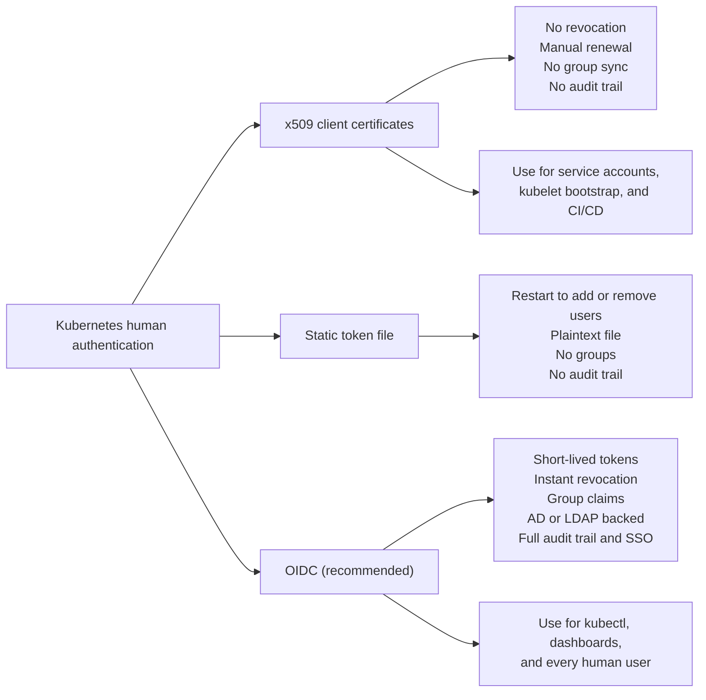
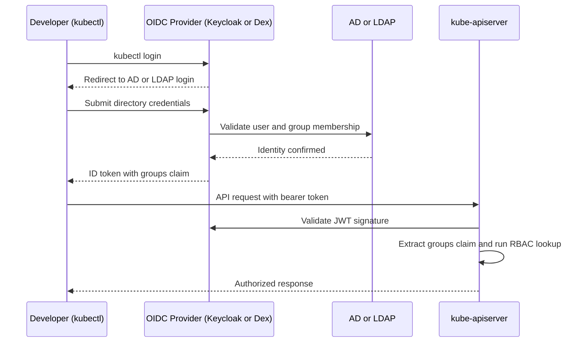

> **Complexity**: `[MEDIUM]` | Time: 60 minutes
>
> **Prerequisites**: [Kubernetes Basics](/prerequisites/kubernetes-basics/), [CKA](/k8s/cka/), [CKS](/k8s/cks/)

## What You'll Be Able to Do

After completing this module, you will be able to:

1. **Implement** OIDC-based authentication for Kubernetes (targeting v1.35 and newer) by integrating with Active Directory, LDAP, or enterprise identity providers.
2. **Configure** Keycloak or Dex as an OIDC broker that maps AD/LDAP groups to Kubernetes RBAC roles.
3. **Design** a zero-touch access lifecycle where employee onboarding, role changes, and offboarding propagate automatically to cluster access.
4. **Evaluate** authentication strategies (x509 certificates vs. OIDC tokens vs. webhook tokens) for security, revocability, and operational overhead.
5. **Diagnose** identity federation issues using advanced logging, token inspection, and API server structured authentication configurations.

## Why This Module Matters

At a major logistics company with 2,400 employees, the infrastructure team deployed an on-premises Kubernetes environment to power their core routing applications. Initially, the platform team created individual kubeconfig files for each developer—over 180 in total—relying entirely on x509 client certificates signed directly by the cluster's Certificate Authority (CA). Within six months, the system became completely unmanageable. When a senior developer abruptly left the company, their certificate could not be easily revoked because Kubernetes has no native certificate revocation list (CRL) mechanism. When developers moved between teams, an administrator had to manually generate a new certificate with updated group memberships. The platform team found themselves spending over 15 hours every single week purely on access management tasks, leading to delayed deployments and security vulnerabilities.

However, the company's Active Directory (AD) already contained a pristine, single source of truth for every employee, team, and role. HR updated this directory on every hire, termination, and internal transfer. The fix was straightforward and transformative: integrate the Kubernetes clusters directly with AD via OpenID Connect (OIDC). They deployed Keycloak as an OIDC identity provider fronting their Active Directory, mapped the corporate AD groups directly to Kubernetes RBAC roles, and permanently deleted all 180 static client certificates. 

Now, when an employee leaves the company, HR disables their Active Directory account. Because the Kubernetes API server relies on short-lived tokens from the OIDC provider, the terminated employee's cluster access is revoked within minutes—automatically, and with absolutely zero platform team involvement. The 15 hours per week spent on manual access management dropped to zero, and the security posture of the platform improved immensely.

> **The Hotel Key Card Analogy**
>
> Client certificates are like physical keys — once cut, you cannot un-cut them. If someone leaves, you must change all the locks. OIDC tokens are like hotel key cards — the front desk (your identity provider) can deactivate any card instantly. Expired cards stop working automatically. You never need to change a lock. Every enterprise already has a "front desk" (Active Directory). The question is whether your Kubernetes cluster uses it.

## What You'll Learn

- Why x509 client certificates are a fundamentally flawed fit for enterprise Kubernetes human authentication.
- The deep mechanics of integrating LDAP and Active Directory with Kubernetes.
- Deploying and configuring Keycloak as a highly available, on-premises OIDC provider.
- Configuring Dex and Pinniped as lightweight OIDC connectors for multi-cluster environments.
- Mapping corporate AD/LDAP groups to Kubernetes RBAC seamlessly.
- Transitioning to the new Structured Authentication Configuration in modern Kubernetes releases.
- Setting up Single Sign-On (SSO) for the Kubernetes dashboard, Grafana, and other operational tools using OAuth2 Proxy.

## Authentication Options for On-Premises Kubernetes

Before diving into implementations, it is essential to understand the landscape of Kubernetes human authentication. Kubernetes provides several mechanisms for authenticating users, but not all of them are suitable for enterprise environments.



Kubernetes v1.35 ('Timbernetes'), released December 17, 2025, continued the long-standing architectural philosophy of not including a built-in user database. With Kubernetes v1.36 scheduled for release on April 22, 2026, the API server trusts external identity providers entirely. There is no `kubectl create user` command. Users exist only in the identity provider (AD, LDAP, OIDC) and are referenced in RBAC bindings by name or group.

## Understanding LDAP and Active Directory Protocols

To connect Kubernetes to an enterprise directory, you must understand the underlying protocols.

Active Directory communicates using the Lightweight Directory Access Protocol (LDAP). The LDAPv3 protocol is defined in RFC 4511, published June 2006, titled 'Lightweight Directory Access Protocol (LDAP): The Protocol'. 

Standard LDAP uses port 389. This connection can be unencrypted, or it can be upgraded to an encrypted state using StartTLS. LDAP StartTLS upgrades a plaintext TCP/389 connection to TLS in-band and is defined in RFC 4513. Conversely, LDAPS (LDAP over SSL/TLS from connection start) uses port 636 and wraps the entire session in TLS before any LDAP traffic is transmitted.

For large Active Directory forests, the Active Directory Global Catalog is highly relevant. It is accessible on port 3268 (LDAP) and port 3269 (LDAPS).

Active Directory also imposes specific schema constraints. For example, the Active Directory `sAMAccountName` attribute is widely cited as being limited to 20 characters (note that this specific limit is often encountered in practice, though its strict presence in authoritative schema specs remains unverified). 

## The OpenID Connect (OIDC) Bridge

Because Kubernetes does not natively speak LDAP, an intermediary must translate between LDAP/AD and the Kubernetes API server. This intermediary uses OpenID Connect (OIDC).

OpenID Connect Core 1.0 is a Final specification published by the OpenID Foundation, not an IETF RFC. It was officially published as an ISO standard (ISO/IEC 26131:2024) in 2024. 

The OIDC Discovery endpoint is critically important. It is served at `/.well-known/openid-configuration` on the issuer domain, per OpenID Connect Discovery 1.0. Client libraries (including the Kubernetes API server) use this endpoint to discover authorization, token, userinfo, and JWKS (JSON Web Key Set) endpoints. For identity providers not hosting discovery at the standard path, Kubernetes Structured Authentication Configuration supports non-standard discovery endpoints via the `issuer.discoveryURL` field.

For security reasons, Kubernetes OIDC only accepts the HTTPS scheme for the `--oidc-issuer-url` (or equivalent AuthenticationConfiguration `issuer.url`).

The standard flow involves the developer, the OIDC provider, the directory, and the API server:



## Option 1: Keycloak as an Enterprise Identity Broker

Keycloak is a powerful, full-featured open-source identity provider. The Keycloak latest stable release is 26.6.0, released April 8, 2026. 

Keycloak supports LDAP and Active Directory user federation deeply, including password validation via LDAP/AD protocols and LDAP password policy enforcement. Furthermore, Keycloak supports federated client authentication where Kubernetes Service Account tokens (via TokenRequest API or Token Volume Projection) can be used as client credentials.

### Deploy Keycloak on Kubernetes

Deploy Keycloak as a highly-available Deployment. Below is a foundational configuration snippet for Keycloak:

```bash
# Keycloak start arguments:
keycloak start \
  --hostname=keycloak.example.com \
  --https-certificate-file=/tls/tls.crt \
  --https-certificate-key-file=/tls/tls.key \
  --db=postgres \
  --db-url=jdbc:postgresql://postgres.identity.svc.cluster.local:5432/keycloak \
  --health-enabled=true
```

After Keycloak is running, configure AD federation through the Admin Console or CLI:

1. **Create a realm** named `kubernetes`
2. **Add User Federation** > LDAP provider with these settings:

| Setting | Value |
|---------|-------|
| Vendor | Active Directory |
| Connection URL | `ldaps://dc01.example.com:636` |
| Bind DN | `CN=svc-keycloak,OU=Service Accounts,DC=corp,DC=internal` |
| Users DN | `OU=Users,DC=corp,DC=internal` |
| Username attribute | `sAMAccountName` |
| Edit mode | READ_ONLY |
| Full sync period | 3600 seconds |
| Changed sync period | 60 seconds |

3. **Add a group mapper** pointing to `OU=K8s Groups,DC=corp,DC=internal`
4. **Create an OIDC client** named `kubernetes` (public client, redirect to `http://127.0.0.1:8000/*`)
5. **Add a "groups" protocol mapper** to include group memberships in the ID token `groups` claim

> **Pause and predict**: Keycloak requires PostgreSQL, 512MB-2GB RAM, and Java expertise to operate. Under what circumstances would this overhead be justified over the simpler Dex alternative?

## Option 2: Dex and Pinniped for Lightweight Identity

If you do not need a full identity suite with its own user interfaces and MFA management, lighter alternatives exist.

Dex (dexidp/dex) is an OpenID Connect identity and OAuth 2.0 provider with pluggable connectors, commonly used to federate Kubernetes authentication to upstream identity providers (LDAP, AD, GitHub, etc.). The Dex latest stable release is v2.45.1, released March 3, 2026.

Here is how Dex is typically configured for AD federation:

```yaml
# dex-config.yaml (key sections)
issuer: https://dex.example.com
storage:
  type: kubernetes
  config:
    inCluster: true
connectors:
- type: ldap
  id: active-directory
  name: "Corporate AD"
  config:
    host: dc01.example.com:636
    rootCA: /certs/ad-ca.crt
    bindDN: CN=svc-dex,OU=Service Accounts,DC=corp,DC=internal
    bindPW: $DEX_LDAP_BIND_PW
    userSearch:
      baseDN: OU=Users,DC=corp,DC=internal
      filter: "(objectClass=person)"
      username: sAMAccountName
    groupSearch:
      baseDN: OU=K8s Groups,DC=corp,DC=internal
      filter: "(objectClass=group)"
      userMatchers:
      - userAttr: DN
        groupAttr: member
      nameAttr: cn
staticClients:
- id: kubernetes
  redirectURIs: ["http://127.0.0.1:8000/callback"]
  name: Kubernetes
  secret: $DEX_CLIENT_SECRET
```

### Pinniped

Another modern tool is Pinniped. The Pinniped architecture consists of two components: the Supervisor (acts as an OIDC server / identity hub) and the Concierge (runs per-cluster, handles credential exchange). The Pinniped latest stable release is v0.45.0, released March 30, 2026. While widely used, its exact CNCF maturity level as of April 2026 remains unverified in independent audits.

### Dex vs Keycloak Decision Matrix

| Criteria | Keycloak | Dex |
|----------|----------|-----|
| Complexity | High (Java, needs PostgreSQL) | Low (single Go binary) |
| Features | MFA, user mgmt, admin UI, fine-grained authz | OIDC proxy only |
| AD/LDAP | Full federation with sync | LDAP connector (query-on-login) |
| Resource usage | 512MB-2GB RAM | 50-100MB RAM |
| Admin interface | Full web UI | None (YAML config only) |
| Best for | Large enterprises, multiple apps needing SSO | Kubernetes-only OIDC |
| SAML support | Yes (SP and IdP) | No |

> **Stop and think**: The API server validates OIDC tokens locally using cached JWKS public keys. What happens to existing kubectl sessions if Keycloak goes down for 30 minutes? How does this differ from webhook-based authentication?

## Microsoft Entra ID (Formerly Azure AD) Integration

Many enterprises have moved their directories to the cloud. Microsoft Azure Active Directory (Azure AD) was officially renamed to Microsoft Entra ID on July 11, 2023.

If you integrate Kubernetes with Entra ID, the Microsoft Entra ID OIDC discovery document URL format for tenant-specific apps is: `https://login.microsoftonline.com/{tenant}/v2.0/.well-known/openid-configuration`. You would supply this as the issuer URL to your cluster.

## Configuring the Kubernetes API Server

Historically, configuring OIDC required adding specific flags to the `kube-apiserver`. 

Regardless of whether you use Keycloak or Dex, the API server configuration is the same. These flags tell the API server where to find the OIDC provider's signing keys and which JWT claims to extract for username and group information.

Kubernetes kube-apiserver legacy OIDC flags are: `--oidc-issuer-url` (HTTPS only), `--oidc-client-id`, `--oidc-username-claim` (default: sub), `--oidc-groups-claim`, `--oidc-ca-file`, `--oidc-username-prefix`, and `--oidc-groups-prefix`. 

The default Kubernetes OIDC username claim (`--oidc-username-claim` default) is `sub`, which is intended to be a unique and stable identifier for the end user. OIDC groups from an IdP are mapped to Kubernetes RBAC group subjects; the `--oidc-groups-prefix` (e.g., 'oidc:') is prepended to all group names in RoleBindings/ClusterRoleBindings.

```yaml
# Add these flags to kube-apiserver (in /etc/kubernetes/manifests/kube-apiserver.yaml)
spec:
  containers:
  - command:
    - kube-apiserver
    # ... existing flags ...
    - --oidc-issuer-url=https://keycloak.example.com/realms/kubernetes
    - --oidc-client-id=kubernetes
    - --oidc-username-claim=preferred_username
    - --oidc-username-prefix="oidc:"
    - --oidc-groups-claim=groups
    - --oidc-groups-prefix="oidc:"
    - --oidc-ca-file=/etc/kubernetes/pki/oidc-ca.crt
```

### Important Parameters Explained

```text
--oidc-issuer-url      The OIDC provider's issuer URL. The API server
                       fetches /.well-known/openid-configuration from here
                       to discover the JWKS endpoint for token validation.

--oidc-client-id       Must match the client ID configured in Keycloak/Dex.

--oidc-username-claim  Which JWT claim to use as the Kubernetes username.
                       "preferred_username" maps to the AD sAMAccountName.

--oidc-username-prefix  Prefix added to all OIDC usernames to avoid
                       collisions with other auth methods. "oidc:" means
                       AD user "jsmith" becomes "oidc:jsmith" in RBAC.

--oidc-groups-claim    Which JWT claim contains group memberships.
                       Must match the claim name configured in Keycloak/Dex.

--oidc-groups-prefix   Prefix for OIDC groups. "oidc:" means AD group
                       "k8s-admins" becomes "oidc:k8s-admins" in RBAC.
```

### The Transition to Structured Authentication Configuration

Modern clusters (v1.35+) are shifting toward Structured Authentication Configuration. 

Kubernetes Structured Authentication Configuration (`AuthenticationConfiguration`) reached Alpha in v1.29 and reached Beta in v1.30. According to KEP-3331, it reached Stable in v1.34, although some technical blogs describe it as graduating to GA in v1.35. While unverified from official changelogs, several sources state that legacy `--oidc-*` flags were deprecated starting in v1.30.

This new method uses a YAML configuration file rather than command-line flags. The `--authentication-config` flag is mutually exclusive with the legacy `--oidc-*` kube-apiserver flags; using both causes an immediate startup failure.

Key advantages of the new configuration:
- AuthenticationConfiguration supports configuring multiple simultaneous JWT/OIDC issuers, unlike the legacy `--oidc-*` flags which support only a single issuer.
- AuthenticationConfiguration supports hot-reload: changes to the config file are applied without restarting the kube-apiserver.
- AuthenticationConfiguration supports CEL (Common Expression Language) for claim validation rules and claim mapping expressions.

## RBAC Mapping to Corporate Groups

The real power of OIDC is mapping existing AD groups directly to Kubernetes RBAC:

### Active Directory Group Structure

```text
OU=K8s Groups,DC=corp,DC=internal
├── CN=k8s-cluster-admins       --> cluster-admin ClusterRole
├── CN=k8s-platform-team        --> platform-admin ClusterRole (custom)
├── CN=k8s-dev-frontend          --> edit Role in frontend-* namespaces
├── CN=k8s-dev-backend           --> edit Role in backend-* namespaces
├── CN=k8s-dev-data              --> edit Role in data-* namespaces
├── CN=k8s-sre                   --> view ClusterRole + debug permissions
└── CN=k8s-readonly              --> view ClusterRole (all namespaces)
```

> **Pause and predict**: What would happen if you forgot to set `--oidc-groups-prefix` and someone in your organization created an AD group named `system:masters`?

### RBAC Bindings

These bindings map AD groups (with the `oidc:` prefix) to Kubernetes ClusterRoles and Roles. When a user authenticates via OIDC, the API server extracts their group memberships from the JWT token and matches them against these bindings.

```yaml
# cluster-admins -- full cluster access
apiVersion: rbac.authorization.k8s.io/v1
kind: ClusterRoleBinding
metadata:
  name: oidc-cluster-admins
roleRef:
  apiGroup: rbac.authorization.k8s.io
  kind: ClusterRole
  name: cluster-admin
subjects:
- kind: Group
  name: "oidc:k8s-cluster-admins"
  apiGroup: rbac.authorization.k8s.io
```

```yaml
# Frontend developers -- edit access to frontend namespaces only
apiVersion: rbac.authorization.k8s.io/v1
kind: RoleBinding
metadata:
  name: oidc-frontend-devs
  namespace: frontend-app
roleRef:
  apiGroup: rbac.authorization.k8s.io
  kind: ClusterRole
  name: edit
subjects:
- kind: Group
  name: "oidc:k8s-dev-frontend"
  apiGroup: rbac.authorization.k8s.io
```

```yaml
# Read-only access for all authenticated users (optional)
apiVersion: rbac.authorization.k8s.io/v1
kind: ClusterRoleBinding
metadata:
  name: oidc-readonly
roleRef:
  apiGroup: rbac.authorization.k8s.io
  kind: ClusterRole
  name: view
subjects:
- kind: Group
  name: "oidc:k8s-readonly"
  apiGroup: rbac.authorization.k8s.io
```

## Configuring kubectl for OIDC Login

Developers need a way to authenticate via OIDC from the command line. The `kubelogin` plugin handles this beautifully:

```bash
# Install kubelogin (kubectl oidc-login plugin)
kubectl krew install oidc-login

# Configure kubeconfig for OIDC authentication
kubectl config set-credentials oidc-user \
  --exec-api-version=client.authentication.k8s.io/v1beta1 \
  --exec-command=kubectl \
  --exec-arg=oidc-login \
  --exec-arg=get-token \
  --exec-arg=--oidc-issuer-url=https://keycloak.example.com/realms/kubernetes \
  --exec-arg=--oidc-client-id=kubernetes \
  --exec-arg=--oidc-extra-scope=groups

# Set context to use OIDC user
kubectl config set-context oidc-context \
  --cluster=on-prem-cluster \
  --user=oidc-user
kubectl config use-context oidc-context

# First kubectl command triggers browser login
kubectl get pods -n frontend-app
# Browser opens -> AD login page -> redirect back -> token cached
```

## SSO for Kubernetes Dashboard and Tools

Once OIDC is configured centrally, you can extend Single Sign-On (SSO) to other web-based Kubernetes operational tools. 

### OAuth2 Proxy for Web UIs

For tools without native OIDC support, you can deploy `oauth2-proxy` as a secure reverse proxy that handles authentication on behalf of the application. The oauth2-proxy was accepted into the CNCF at the Sandbox maturity level on October 2, 2025. Its latest stable release is v7.15.1, released March 23, 2026.

Deploy it in the same namespace as the target tool, configure it with the OIDC issuer URL and client credentials, and point it upstream to the tool's internal service.

```bash
# Key oauth2-proxy flags for Kubernetes Dashboard:
# --provider=oidc
# --oidc-issuer-url=https://keycloak.example.com/realms/kubernetes
# --upstream=http://kubernetes-dashboard.kubernetes-dashboard.svc.cluster.local:8080
# --pass-access-token=true  (forward token to backend)
# --scope=openid profile email groups
```

### Tools That Support OIDC Natively

Many modern tools natively integrate with your OIDC provider, allowing you to standardize on one centralized authentication authority. For example, Grafana uses the `auth.generic_oauth` directive in its configuration.

| Tool | OIDC Support | Configuration |
|------|-------------|---------------|
| Kubernetes Dashboard | Via oauth2-proxy | See above |
| Grafana | Native OIDC | `auth.generic_oauth` in grafana.ini |
| ArgoCD | Native OIDC/Dex | Built-in Dex or external OIDC |
| Harbor | Native OIDC | Admin > Configuration > Authentication |
| Vault | Native OIDC | `vault auth enable oidc` |
| Gitea | Native OAuth2 | Admin > Authentication Sources |

## Did You Know?

- **Kubernetes v1.35 ('Timbernetes') was released December 17, 2025.** Even as the project grows massively, it maintains the architectural decision to never include an internal user database—deferring identity entirely to external providers.
- **OpenID Connect Core 1.0 was published as an ISO standard (ISO/IEC 26131:2024) in 2024.** This formally cements OIDC as a globally recognized protocol for identity federation beyond internet engineering circles.
- **Microsoft Azure Active Directory (Azure AD) was officially renamed to Microsoft Entra ID on July 11, 2023.** This caused a major terminology shift across enterprise identity integrations.
- **The `--oidc-groups-prefix` flag was added in earlier Kubernetes releases to prevent privilege escalation.** Without it, an AD group named "system:masters" would inadvertently grant true cluster-admin access. The prefix ensures OIDC groups cannot collide with Kubernetes system groups.

## Common Mistakes

| Mistake | Problem | Solution |
|---------|---------|----------|
| No OIDC username prefix | OIDC user "admin" collides with built-in admin | Always set `--oidc-username-prefix` (e.g., "oidc:") |
| No OIDC groups prefix | AD group could match "system:masters" | Always set `--oidc-groups-prefix` |
| Long-lived OIDC tokens | Terminated employee retains access until token expires | Set token lifetime to 15-60 minutes in Keycloak |
| LDAP bind account with write access | Compromised Keycloak/Dex could modify AD | Use a read-only service account for LDAP bind |
| Not testing group sync | Users authenticate but have no permissions | Verify group claims in JWT: `kubectl oidc-login get-token --oidc-issuer-url=... --oidc-client-id=kubernetes | jq -r '.status.token' | cut -d. -f2 | base64 -d | jq .groups` |
| Skipping MFA for cluster-admin | Single factor for highest privilege access | Require MFA in Keycloak for k8s-cluster-admins group |
| Hardcoded service account tokens for CI/CD | CI/CD uses human auth flow | Use Kubernetes service accounts with bound tokens for CI/CD |
| Single OIDC provider, no failover | Keycloak outage = nobody can authenticate | Deploy Keycloak HA (2+ replicas) with shared PostgreSQL |

## Quiz

### Question 1
A developer reports that `kubectl get pods` returns "Forbidden" even though they are in the correct AD group. How do you troubleshoot?

<details>
<summary>Answer</summary>

**Systematic troubleshooting steps:**

1. **Verify the JWT token contains the expected groups claim:**
   ```bash
   kubectl oidc-login get-token \
     --oidc-issuer-url=https://keycloak.example.com/realms/kubernetes \
     --oidc-client-id=kubernetes \
     | jq -r '.status.token' | cut -d. -f2 | base64 -d | jq .
   ```
   The output of `oidc-login get-token` is an ExecCredential JSON object; extract the token from `.status.token` first, then decode the JWT payload. Check that the `groups` field contains the expected group name.

2. **Check the group name matches exactly (including prefix).** If `--oidc-groups-prefix=oidc:` is set, the RoleBinding must reference `oidc:k8s-dev-frontend`, not `k8s-dev-frontend`.

3. **Verify the RoleBinding exists in the correct namespace:**
   ```bash
   kubectl get rolebindings -n frontend-app -o yaml
   ```

4. **Check if Keycloak group sync has run.** If the user was just added to the AD group, Keycloak may not have synced yet (default: every 60 seconds for changed sync).

5. **Verify the API server OIDC flags** are correct -- especially `--oidc-groups-claim` must match the claim name in the JWT (e.g., "groups").

6. **Use `kubectl auth can-i` with impersonation to test:**
   ```bash
   kubectl auth can-i get pods -n frontend-app \
     --as=oidc:jsmith --as-group=oidc:k8s-dev-frontend
   ```

Most common cause: the group name in the RoleBinding does not match the claim value (case sensitivity, missing prefix, or wrong claim name).
</details>

### Question 2
Why should you use Keycloak or Dex instead of configuring the API server to query LDAP directly?

<details>
<summary>Answer</summary>

**Kubernetes does not support LDAP authentication natively.** The API server only supports these authentication methods: x509 certificates, bearer tokens, OIDC, and webhook token authentication. There is no `--ldap-url` flag.

**Keycloak/Dex serve as the translation layer** between LDAP/AD and OIDC:

1. **Protocol translation**: AD speaks LDAP. Kubernetes speaks OIDC. Keycloak/Dex bridge the gap.

2. **Token management**: LDAP has no concept of short-lived tokens. OIDC provides JWTs with expiry, refresh tokens, and scopes. Keycloak creates and manages these tokens.

3. **Group claims**: LDAP group membership must be queried with a separate LDAP search. OIDC embeds group memberships directly in the JWT, so the API server does not need to query anything at authentication time.

4. **MFA**: LDAP provides only username/password. Keycloak adds MFA (TOTP, WebAuthn, SMS) on top of LDAP authentication.

5. **Centralization**: Multiple clusters can share a single Keycloak/Dex instance. Each cluster only needs the OIDC issuer URL -- no LDAP connection details on every API server.

6. **Security**: LDAP credentials would need to be stored on every control plane node. With OIDC, only the public signing key (JWKS) is needed on the API server -- no secrets.
</details>

### Question 3
You have 5 Kubernetes clusters. How do you manage RBAC consistently across all of them using AD groups?

<details>
<summary>Answer</summary>

**Use a single OIDC provider (Keycloak) with GitOps-managed RBAC:**

1. **Single Keycloak instance** (HA) serves all 5 clusters. Each cluster's API server points to the same `--oidc-issuer-url`.

2. **Consistent AD group naming** convention: `k8s-{cluster}-{role}` for cluster-specific access (e.g., `k8s-prod-admin`), `k8s-all-{role}` for cross-cluster access (e.g., `k8s-all-readonly`).

3. **RBAC manifests in Git** managed by Flux/ArgoCD with Kustomize overlays: a `base/` directory for cross-cluster bindings and per-cluster overlays for cluster-specific admin/dev roles.

4. **Automate group creation** in AD using a script that reads the cluster inventory. When a new cluster is added, create `k8s-{newcluster}-admin`, `k8s-{newcluster}-dev`, etc.

5. **Audit**: Periodically compare AD group memberships against RBAC bindings to detect drift.
</details>

### Question 4
What happens to existing kubectl sessions when an employee is terminated and their AD account is disabled?

<details>
<summary>Answer</summary>

**The answer depends on the OIDC token lifetime:**

1. **Active sessions with valid tokens continue working** until the token expires. If the token lifetime is 60 minutes, the terminated employee could have up to 60 minutes of continued access.

2. **When the token expires**, kubectl attempts to refresh it. The refresh token is sent to Keycloak, which queries AD. AD returns "account disabled." Keycloak refuses to issue a new token. kubectl shows an authentication error.

3. **Mitigation strategies:**

   - **Short token lifetime (15 min)**: Reduces the window of exposure but increases authentication frequency for all users.

   - **Revocation endpoint**: Keycloak supports token revocation, but the Kubernetes API server does not check revocation lists (it validates tokens locally using JWKS). This means Keycloak revocation only affects token refresh, not already-issued tokens.

   - **Webhook token authentication**: For immediate revocation, use a webhook authenticator instead of or alongside OIDC. The webhook checks token validity with the IdP on every request. This adds latency but enables instant revocation.

   - **Network-level**: Revoke the employee's VPN access. If they cannot reach the API server, the token is useless.

**Practical recommendation**: 15-30 minute token lifetime combined with VPN revocation as part of the HR offboarding process.
</details>

### Question 5
If you are upgrading to Kubernetes v1.35 and decide to implement the `AuthenticationConfiguration` YAML file while accidentally leaving the `--oidc-issuer-url` flag configured in your manifests, what happens?

<details>
<summary>Answer</summary>

The kube-apiserver will report a misconfiguration and exit immediately upon startup. The new `--authentication-config` flag is mutually exclusive with all legacy `--oidc-*` kube-apiserver flags. You cannot mix them; you must fully migrate all your OIDC parameters into the new structured configuration file.
</details>

### Question 6
Your security team mandates that all internal traffic to the legacy corporate directory must be fully encrypted from the moment the connection is established. Which protocol and port should your OIDC broker (like Dex or Keycloak) be configured to use?

<details>
<summary>Answer</summary>

You must configure the broker to use LDAPS on port 636. While standard LDAP (port 389) can be upgraded to an encrypted state using StartTLS, the initial negotiation occurs in plaintext. LDAPS initiates the TLS handshake immediately upon the TCP connection being established, meeting the strict requirement for full encryption from the very first byte.
</details>

### Question 7
You are configuring an internal Kubernetes cluster to federate with Microsoft Entra ID. Your cluster needs to discover the Entra ID authorization endpoints automatically. Which URL format should you provide to the Kubernetes API server?

<details>
<summary>Answer</summary>

You should provide the issuer URL, which Kubernetes will append with `/.well-known/openid-configuration` to fetch the metadata. For Entra ID tenant-specific apps, the discovery document is located at `https://login.microsoftonline.com/{tenant}/v2.0/.well-known/openid-configuration`. Therefore, the issuer URL you configure in the cluster is `https://login.microsoftonline.com/{tenant}/v2.0/`.
</details>

### Question 8
In a multi-tenant environment running Kubernetes v1.35, you need to authenticate users from both an internal Keycloak server and a partner's Okta instance simultaneously. How can you accomplish this natively?

<details>
<summary>Answer</summary>

You must use the Structured Authentication Configuration feature. Unlike the legacy `--oidc-*` command-line flags which support only a single issuer, the `AuthenticationConfiguration` YAML allows you to define an array of `jwt` authenticators. You can configure one entry for Keycloak and another entry for Okta simultaneously, and even use CEL to write complex validation rules for each.
</details>

## Hands-On Exercise: Configure OIDC Authentication with Dex

**Task**: Set up Dex as an OIDC provider for a local Kubernetes cluster using a static user (simulating AD), and explore the AuthenticationConfiguration.

### Steps

1. **Create a kind cluster with OIDC flags** -- configure `kube-apiserver` with `--oidc-issuer-url`, `--oidc-client-id=kubernetes`, `--oidc-username-claim=email`, `--oidc-groups-claim=groups`, and both prefix flags set to `oidc:`. Alternatively, use an `AuthenticationConfiguration` file mapped to the API server container.

2. **Deploy Dex with a static user** (simulates AD) -- configure a `staticPasswords` entry for `jane@corp.internal` and a `staticClients` entry for the `kubernetes` client ID.

3. **Create RBAC binding for the static user**:
   ```bash
   kubectl create clusterrolebinding oidc-jane-admin \
     --clusterrole=view \
     --user="oidc:jane@corp.internal"
   ```

4. **Test with kubelogin**:
   ```bash
   kubectl oidc-login get-token \
     --oidc-issuer-url=https://dex.identity.svc.cluster.local:5556 \
     --oidc-client-id=kubernetes
   ```

5. **Examine the Token**: Decode the resulting JWT to confirm that the `groups` and `email` claims map correctly to the attributes defined in your Dex static user configuration.

6. **Implement an OAuth2 Proxy**: Deploy a sample web service (e.g., an Nginx welcome page) alongside `oauth2-proxy`. Configure `oauth2-proxy` to use the Dex issuer and verify that accessing the web service redirects you to the Dex login page.

### Success Criteria
- [ ] Kind cluster created with OIDC API server flags or Structured Authentication config.
- [ ] Dex deployed and accessible.
- [ ] Static user can obtain a JWT token.
- [ ] RBAC binding grants correct permissions to the OIDC user.
- [ ] `kubectl auth can-i` confirms permissions match expectations.
- [ ] OAuth2-proxy successfully intercepts traffic and routes to Dex for authorization.

## Key Takeaways

1. **OIDC is the only viable authentication for enterprise Kubernetes** -- x509 certificates cannot be revoked and static tokens are a security anti-pattern.
2. **Keycloak for full enterprise SSO**, Dex for lightweight Kubernetes-only OIDC, and tools like Pinniped for advanced multi-cluster federation.
3. **Map AD groups to RBAC** and let HR manage Kubernetes access through existing processes to establish a zero-touch lifecycle.
4. **Always use username and group prefixes** to prevent privilege escalation via name collision.
5. **Short token lifetimes** (15-30 min) limit the window when a terminated employee retains access.
6. **Modernise with Structured Authentication**: Transition to `AuthenticationConfiguration` in Kubernetes v1.35 to support multiple IdPs, hot-reloading, and CEL-based validation.

## Next Module

Continue to [Module 6.4: Compliance for Regulated Industries](../module-6.4-compliance/) to learn how to map regulatory frameworks like HIPAA, SOC 2, and PCI DSS to your on-premises Kubernetes infrastructure.