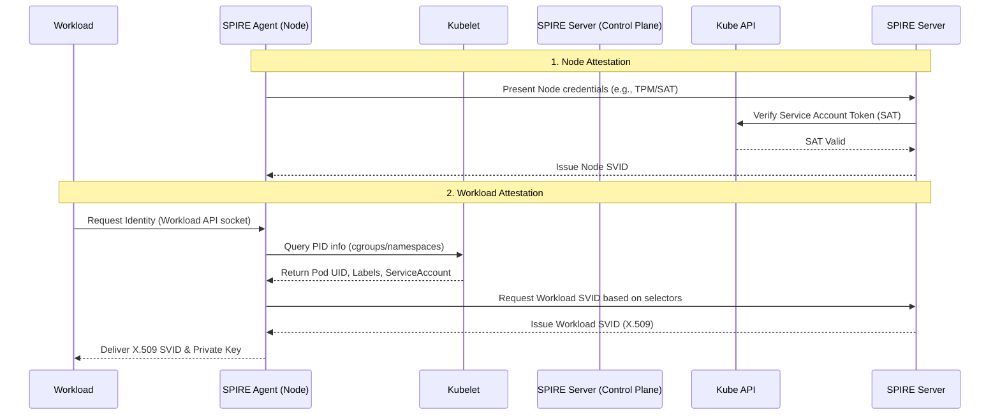

# Zero Trust Architecture

## Why This Module Matters

In early 2024, the healthcare sector witnessed one of the most devastating cyberattacks in history: the UnitedHealth Group (Change Healthcare) breach. The intrusion began simply enough—attackers from the ALPHV/BlackCat ransomware gang compromised credentials on a remote access portal that lacked multi-factor authentication. However, the catastrophic damage was not caused by the initial entry, but by the network architecture that awaited the attackers once inside. Because the internal infrastructure operated on a legacy, perimeter-based implicit trust model, the attackers were able to move laterally with absolute impunity.

Once past the perimeter, the attackers freely navigated the internal network, discovering data stores, compromising domain controllers, and mapping service-to-service communications that blindly trusted any request originating from an internal IP address. They exfiltrated the highly sensitive health data of millions of patients and systematically deployed ransomware across thousands of mission-critical systems. The financial impact was staggering, with UnitedHealth Group estimating the immediate response costs to be in excess of $872 million, not accounting for the ensuing regulatory fines, class-action lawsuits, and long-term reputational damage.

If a Zero Trust Architecture (ZTA) had been enforced internally—with strict cryptographic microsegmentation, mandatory mutual TLS (mTLS), and continuous identity-based access controls for every workload—the breach would have played out entirely differently. The blast radius would have been surgically contained to the single compromised entry point, as the attackers would lack the cryptographic ServiceAccount tokens (SVIDs) required to authenticate to any adjacent internal service. Zero Trust transforms the internal network from a soft, vulnerable underbelly into a hostile, mathematically enforced fortress, ensuring that a single breach never results in total systemic collapse.

## Learning Outcomes

* **Design** a comprehensive zero-trust network topology using default-deny network policies at both L4 and L7.
* **Implement** cryptographic workload identity issuance using SPIFFE and SPIRE across a bare-metal environment.
* **Enforce** strict mutual TLS (mTLS) across all inter-service communication using an advanced service mesh or eBPF data plane.
* **Diagnose** identity verification, certificate rotation, and probe failures in highly segmented cloud-native environments.
* **Compare** standard Kubernetes NetworkPolicies, eBPF-based CiliumNetworkPolicies, and Service Mesh AuthorizationPolicies.
* **Evaluate** cluster compliance against federal zero-trust mandates (NIST, CISA, and DoD).

## Theory: The Assume-Breach Posture on Bare Metal

Traditional bare-metal environments often rely on perimeter security—hardware firewalls, VLAN segregation, and DMZs. Once an attacker breaches the perimeter, lateral movement is trivial because the internal network is highly trusted. Zero Trust Architecture (ZTA) inverts this model: **trust nothing, verify everything, assume the network is already hostile.**

The foundational principles of this approach were pioneered long before Kubernetes existed. Google's BeyondCorp initiative (enterprise Zero Trust for user and device access) began as an internal project around 2011 and was documented in a series of research papers published between 2014 and 2018 in USENIX ;login:. Building upon this success for human access, Google later published a 'BeyondProd' whitepaper extending Zero Trust principles from user/device access (BeyondCorp) to cloud-native workload and service identity.

In a Kubernetes environment, you control the underlying compute nodes, but you must treat the internal pod overlay network as untrusted. By default, in the absence of any NetworkPolicy, all pods in a Kubernetes cluster can communicate with each other on any port. This implicit-trust posture directly contradicts Zero Trust. Furthermore, Kubernetes NetworkPolicy resources operate only at Layer 3 and Layer 4 (IP addresses and ports); they cannot enforce Layer 7 policies such as HTTP method, URL path, or request headers.

To achieve a true assume-breach posture, you must implement identity-based authentication, cryptographic microsegmentation, encryption in transit, and continuous verification. IP addresses are ephemeral, easily spoofed, and entirely inadequate for authorization.

> **Pause and predict**: If standard Kubernetes networking allows all pod-to-pod communication by default, what happens to existing network flows the moment you apply an empty `podSelector: {}` ingress NetworkPolicy to a namespace? 

## Theory: Government Standards and Maturity Models

Zero Trust is not merely an industry buzzword; it is a strictly defined architectural paradigm backed by rigorous federal standards. The term 'Zero Trust' was coined by John Kindervag at Forrester Research in 2010 in a report titled 'No More Chewy Centers: Introducing the Zero Trust Model of Information Security', introducing the phrase 'never trust, always verify'. Today, this concept is legally mandated for US federal systems.

US Executive Order 14028 'Improving the Nation's Cybersecurity' was signed by President Biden on May 12, 2021, directing federal agencies to adopt Zero Trust Architecture. This was followed by OMB Memorandum M-22-09 'Moving the U.S. Government Towards Zero Trust Cybersecurity Principles', issued January 26, 2022, requiring federal agencies to meet specific ZT objectives by the end of FY2024 (September 30, 2024).

### NIST SP 800-207

NIST Special Publication 800-207 'Zero Trust Architecture' was finalized on August 11, 2020 and is the primary NIST ZTA standard. It defines three core ZTA logical components: Policy Engine (PE), Policy Administrator (PA), and Policy Enforcement Point (PEP). 

NIST SP 800-207 defines exactly seven tenets of Zero Trust Architecture:
1. All data sources and computing services are resources.
2. All communication is secured regardless of network location.
3. Access is granted on a per-session basis with least privilege.
4. Access is determined by dynamic policy including observable state of client identity/application and requesting asset.
5. The enterprise monitors and measures the integrity and security posture of all owned and associated assets.
6. All resource authentication and authorization are dynamic and strictly enforced before access is allowed.
7. The enterprise collects as much information as possible about the current state of assets, network infrastructure and communications and uses it to improve its security posture.

NIST SP 800-207A 'A Zero Trust Architecture Model for Access Control in Cloud-Native Applications in Multi-Location Environments' was subsequently published September 13, 2023 to address Kubernetes and service meshes directly.

### CISA and DoD Maturity Models

CISA Zero Trust Maturity Model Version 2.0 was published April 11, 2023 and is the current version as of April 2026. CISA ZTMM v2.0 is organized around five pillars: Identity, Devices, Networks, Applications and Workloads, and Data. It includes three cross-cutting capabilities that span all pillars: Visibility and Analytics, Automation and Orchestration, and Governance. Furthermore, CISA ZTMM v2.0 defines four maturity stages: Traditional, Initial, Advanced, and Optimal.

Similarly, the DoD Zero Trust Reference Architecture Version 2.0 was published in September 2022. The DoD Zero Trust Strategy defines 91 'target level' capability outcomes (FY2027 deadline) and 61 additional 'advanced level' capability outcomes (FY2032 deadline) for IT systems. As of April 12, 2026, while the community anticipates the DoD Zero Trust Strategy 2.0 and early 2026 timelines were discussed by DefenseScoop in late 2025, no authoritative source confirms the document was published, and the expected release remains unverified.

## Theory: Workload Identity (SPIFFE/SPIRE)

The Secure Production Identity Framework for Everyone (SPIFFE) defines a standard for securely identifying software systems. SPIRE (the SPIFFE Runtime Environment) is the CNCF reference implementation consisting of a central Server and an Agent running on every node. Both SPIFFE and SPIRE both achieved CNCF Graduated project status in August 2022 (SPIRE: August 22, 2022; SPIFFE: August 23, 2022). The latest stable release of SPIRE (SPIFFE Runtime Environment) is v1.14.1, released January 15, 2026.

SPIRE issues an SVID (SPIFFE Verifiable Identity Document), which serves as the workload's passport. A SPIFFE Verifiable Identity Document (SVID) can be encoded as either an X.509 certificate (X.509-SVID) or a JWT token (JWT-SVID).

### Attestation Flow

SPIRE issues identities through a highly secure, two-step attestation process that does not rely on easily spoofed API tokens.



### Production Implementation Details

* **Trust Domain:** The logical boundary of your SPIFFE identities (e.g., `spiffe://cluster-main.prod.internal`).
* **SPIFFE ID:** A URI identifying the workload (e.g., `spiffe://cluster-main.prod.internal/ns/backend/sa/api-server`).
* **Workload API:** A local Unix Domain Socket mounted into the pod. The workload (or its proxy, such as Envoy) connects to this socket to retrieve its SVID, meaning no sensitive private keys are ever stored in the Kubernetes API or etcd.

## Theory: Network Microsegmentation

Standard Kubernetes `NetworkPolicy` operates purely at OSI Layers 3 and 4, acting as a basic firewall. In a ZT architecture, L3/L4 filtering is necessary to drop bulk malicious traffic early, but it is deeply insufficient. Advanced CNIs (like Cilium) and Service Meshes (like Istio or Linkerd) provide the necessary L7 filtering and identity-based enforcement.

Cilium achieved CNCF Graduated project status on October 11, 2023. The current stable Cilium release is v1.19.2, released March 23, 2026; v1.20.0 is in pre-release. Cilium enforces identity-based (not IP-address-based) network security policies using eBPF in the Linux kernel; identities are derived from Kubernetes labels and are consistent across pod restarts. Furthermore, Cilium v1.19 introduced strict enforcement modes for both IPsec and WireGuard node-to-node encryption, dropping unencrypted inter-node traffic in strict mode rather than allowing it as best-effort.

### Policy Engine Comparison

| Feature | Standard K8s `NetworkPolicy` | Cilium `CiliumNetworkPolicy` (eBPF) | Istio `AuthorizationPolicy` (Sidecar/Ambient) |
| :--- | :--- | :--- | :--- |
| **Enforcement Point** | iptables / CNI dataplane | eBPF in kernel | Envoy Proxy (Userspace) / zTunnel |
| **Identity Basis** | IP Addresses (via labels) | IP Addresses & eBPF identity | Cryptographic (SPIFFE/mTLS) |
| **OSI Layers** | L3 / L4 | L3 / L4 / L7 (DNS, HTTP) | L7 (HTTP, gRPC) |
| **Egress FQDN Filtering**| No | Yes (via DNS proxy) | Yes (via sidecar) |
| **Performance Overhead**| Moderate (iptables rules scale poorly) | Very Low (O(1) hash maps in kernel) | Moderate (Userspace context switching) |

```mermaid
flowchart TD
    subgraph K8s["Standard K8s NetworkPolicy"]
        direction TB
        K1["Enforcement: iptables / CNI dataplane"]
        K2["Identity Basis: IP Addresses (via labels)"]
        K3["OSI Layers: L3 / L4"]
        K4["Egress FQDN Filtering: No"]
        K5["Performance Overhead: Moderate (iptables rules scale poorly)"]
    end
    subgraph Cilium["Cilium CiliumNetworkPolicy (eBPF)"]
        direction TB
        C1["Enforcement: eBPF in kernel"]
        C2["Identity Basis: IP Addresses & eBPF identity"]
        C3["OSI Layers: L3 / L4 / L7 (DNS, HTTP)"]
        C4["Egress FQDN Filtering: Yes (via DNS proxy)"]
        C5["Performance Overhead: Very Low (O(1) hash maps in kernel)"]
    end
    subgraph Istio["Istio AuthorizationPolicy (Sidecar/Ambient)"]
        direction TB
        I1["Enforcement: Envoy Proxy (Userspace) / zTunnel"]
        I2["Identity Basis: Cryptographic (SPIFFE/mTLS)"]
        I3["OSI Layers: L7 (HTTP, gRPC)"]
        I4["Egress FQDN Filtering: Yes (via sidecar)"]
        I5["Performance Overhead: Moderate (Userspace context switching)"]
    end
```



### Implementing Default Deny

A true Zero Trust posture must start with a default deny configuration at the namespace level. This ensures that any pod created without an explicit allow rule is immediately isolated.

```yaml
apiVersion: networking.k8s.io/v1
kind: NetworkPolicy
metadata:
  name: default-deny-all
  namespace: secure-workloads
spec:
  podSelector: {}
  policyTypes:
  - Ingress
  - Egress
```

> **Stop and think**: Why is an IP address considered completely inadequate for identity in a Zero Trust, cloud-native architecture? Consider the lifecycle of a Kubernetes pod when answering.

## Theory: mTLS Everywhere and Service Mesh

Microsegmentation restricts *where* traffic can go, but mTLS ensures that traffic is encrypted and that the *identity* of both the sender and receiver is cryptographically verified before a single byte of application data is exchanged.

Linkerd was the first service mesh to achieve CNCF Graduated status, graduating on July 28, 2021. The current stable Linkerd release is 2.18, released May 9, 2025. Istio achieved CNCF Graduated project status on July 12, 2023. The current latest stable Istio release is v1.29.0, released February 16, 2026, supporting Kubernetes 1.31–1.35. Additionally, Istio's ambient (sidecar-less) data plane mode reached General Availability (GA) with the v1.24 release in November 2024.

When strict mTLS is enforced, the proxy intercepts the inbound connection, performs the TLS handshake using its SVID, verifies the client's SVID against the trust bundle, and only forwards the traffic to the application container over localhost if authorization policies pass. 

### Istio PeerAuthentication (Strict mTLS)

Enforcing mTLS requires migrating the mesh from `PERMISSIVE` mode (which accepts both plaintext and mTLS to allow legacy migrations) to `STRICT` mode.

```yaml
apiVersion: security.istio.io/v1
kind: PeerAuthentication
metadata:
  name: default-strict-mtls
  namespace: istio-system
spec:
  mtls:
    mode: STRICT
```

### The Kubelet Health Check Problem

When `STRICT` mTLS is enabled, the API server/kubelet cannot perform TCP or HTTP readiness/liveness probes directly against the pod's IP. The kubelet does not possess a mesh-issued client certificate, so the proxy rejects the plaintext health check probe.

**The Fix:** Modern meshes handle this via probe rewriting. The mutating admission webhook changes the pod specification so the probe points to the sidecar proxy's specific probe port (e.g., 15020 in Istio). The sidecar receives the plaintext probe, performs the actual health check against the application container via localhost, and returns the result to the kubelet. Ensure `sidecar.istio.io/rewriteAppHTTPProbers: "true"` is active (default in recent Istio versions).

## Theory: Continuous Verification and Admission Control

Zero Trust assumes the network is compromised, but it also assumes the API server orchestration can be manipulated. Continuous verification requires policies that block insecure configurations from ever entering etcd.

Open Policy Agent (OPA) achieved CNCF Graduated project status on January 29, 2021. OPA Gatekeeper (the Kubernetes ValidatingAdmissionWebhook for OPA) latest release is v3.22.0, published March 2026.

Using OPA Gatekeeper or Kyverno, you enforce the ZTA baseline:
1. **Require Service Accounts:** No pod may use the `default` service account.
2. **Require Network Policies:** No namespace may be created without a default-deny NetworkPolicy.
3. **Restrict Capabilities:** Drop `ALL` Linux capabilities; explicitly allow only necessary ones (e.g., `NET_ADMIN` for specific CNI agents).
4. **Enforce Image Signatures:** Verify container image signatures (e.g., Sigstore/Cosign) to ensure only CI/CD-approved binaries run on the metal.

## Did You Know?

* **Origin of ZT:** The term 'Zero Trust' was coined by John Kindervag at Forrester Research in 2010 in a report titled 'No More Chewy Centers: Introducing the Zero Trust Model of Information Security'.
* **First to Graduate:** Linkerd was the first service mesh to achieve CNCF Graduated status, graduating on July 28, 2021.
* **Ambient GA:** Istio's ambient (sidecar-less) data plane mode reached General Availability (GA) with the v1.24 release in November 2024.
* **Executive Action:** US Executive Order 14028 'Improving the Nation's Cybersecurity' was signed by President Biden on May 12, 2021, directing federal agencies to adopt Zero Trust Architecture.

## Common Mistakes

| Mistake | Why | Fix |
|---|---|---|
| **Forgetting to allow UDP 53 egress** | A default-deny egress NetworkPolicy blocks CoreDNS resolution. | Explicitly allow egress to the `kube-system` namespace on port 53. |
| **Relying purely on NetworkPolicies** | NetworkPolicy only filters L3/L4, allowing malicious HTTP methods. | Use an AuthorizationPolicy in a service mesh for L7 control. |
| **Ignoring clock skew on nodes** | SPIFFE certificates have short TTLs and fail validation immediately if clocks drift. | Configure `chronyd`/`ntpd` on all bare-metal worker nodes. |
| **Using the `default` ServiceAccount** | Identity is derived from the ServiceAccount; sharing it creates a massive blast radius. | Assign a unique, least-privilege ServiceAccount to every workload. |
| **Running mesh in PERMISSIVE mode** | PERMISSIVE mode allows plaintext fallback, completely defeating ZTA encryption goals. | Set PeerAuthentication to `STRICT` across all production namespaces. |
| **Leaving headless services out of mesh** | Headless services bypass the VIP and fail L7 proxy interception natively. | Ensure clients use the full FQDN and ports are explicitly named. |
| **Omitting health probe rewriting** | The proxy rejects plaintext kubelet health probes under strict mTLS. | Enable probe rewriting via the mutating admission webhook. |

## Hands-On Exercise

In this lab, you will progressively deploy a microservices application, enforce a default-deny network posture, enable strict mTLS, and write cryptographic authorization policies using Istio.

### Prerequisites
* `kind` cluster running Kubernetes v1.35+.
* `istioctl` CLI installed (v1.29+).
* `kubectl` configured and ready.

### Step 1: Initialize Cluster and Service Mesh

Create a bare-metal equivalent local cluster and install Istio with the minimal profile.

<details><summary>Solution: Initialize Cluster</summary>

```bash
# Create cluster
kind create cluster --name zt-lab

# Install Istio (Minimal profile installs only istiod and CRDs)
istioctl install --set profile=minimal -y

# Label the default namespace for proxy injection
kubectl label namespace default istio-injection=enabled
```

*Verification:*
```bash
kubectl get pods -n istio-system
# Expected output: istiod-<hash>  1/1  Running
```

</details>

### Step 2: Deploy Workloads

Deploy a `sleep` pod (client) and an `httpbin` pod (server). We assign them distinct ServiceAccounts. Identity in the mesh is bound strictly to the ServiceAccount. Create the workloads manifest and apply it.

<details><summary>Solution: Deploy Workloads</summary>

```bash
cat << 'EOF' > lab-workloads.yaml
apiVersion: v1
kind: ServiceAccount
metadata:
  name: sleep
---
apiVersion: apps/v1
kind: Deployment
metadata:
  name: sleep
spec:
  replicas: 1
  selector:
    matchLabels:
      app: sleep
  template:
    metadata:
      labels:
        app: sleep
    spec:
      serviceAccountName: sleep
      containers:
      - name: sleep
        image: curlimages/curl
        command: ["/bin/sleep", "3650d"]
---
apiVersion: v1
kind: ServiceAccount
metadata:
  name: httpbin
---
apiVersion: v1
kind: Service
metadata:
  name: httpbin
  labels:
    app: httpbin
spec:
  ports:
  - name: http
    port: 8000
    targetPort: 80
  selector:
    app: httpbin
---
apiVersion: apps/v1
kind: Deployment
metadata:
  name: httpbin
spec:
  replicas: 1
  selector:
    matchLabels:
      app: httpbin
  template:
    metadata:
      labels:
        app: httpbin
    spec:
      serviceAccountName: httpbin
      containers:
      - image: docker.io/kennethreitz/httpbin
        name: httpbin
        ports:
        - containerPort: 80
EOF

kubectl apply -f lab-workloads.yaml
kubectl wait --for=condition=ready pod -l app=httpbin --timeout=60s
kubectl wait --for=condition=ready pod -l app=sleep --timeout=60s
```

Verify baseline connectivity. This will succeed because Istio defaults to PERMISSIVE mTLS and no AuthorizationPolicies exist yet.
```bash
kubectl exec deploy/sleep -- curl -s -o /dev/null -w "%{http_code}" httpbin.default.svc.cluster.local:8000/headers
# Expected output: 200
```

</details>

### Step 3: Enforce Strict mTLS

Lock down the namespace to strictly require mutual TLS for all connections.

<details><summary>Solution: Strict mTLS</summary>

```bash
cat << 'EOF' > mtls-strict.yaml
apiVersion: security.istio.io/v1
kind: PeerAuthentication
metadata:
  name: default-strict
  namespace: default
spec:
  mtls:
    mode: STRICT
EOF

kubectl apply -f mtls-strict.yaml
```

If you attempt to call `httpbin` from a pod outside the mesh, it will immediately fail. Connections between `sleep` and `httpbin` succeed because the sidecar Envoy proxies handle the mTLS transparently.

</details>

### Step 4: Implement Default Deny (L7 Authorization)

Create an `AuthorizationPolicy` that denies all access by default across the namespace.

<details><summary>Solution: Default Deny</summary>

```bash
cat << 'EOF' > default-deny.yaml
apiVersion: security.istio.io/v1
kind: AuthorizationPolicy
metadata:
  name: allow-nothing
  namespace: default
spec:
  {} # Empty spec means deny all
EOF

kubectl apply -f default-deny.yaml
```

Verify failure. The request is now blocked by the sidecar proxy at the receiving end because no policy allows it.

```bash
kubectl exec deploy/sleep -- curl -s -o /dev/null -w "%{http_code}" httpbin.default.svc.cluster.local:8000/headers
# Expected output: 403
```

</details>

### Step 5: Implement Cryptographic Microsegmentation

Create a policy that explicitly allows the `sleep` ServiceAccount to execute HTTP GET requests against `httpbin`.

<details><summary>Solution: Allow Policy</summary>

```bash
cat << 'EOF' > allow-sleep-to-httpbin.yaml
apiVersion: security.istio.io/v1
kind: AuthorizationPolicy
metadata:
  name: allow-sleep-to-httpbin
  namespace: default
spec:
  selector:
    matchLabels:
      app: httpbin
  action: ALLOW
  rules:
  - from:
    - source:
        principals: ["cluster.local/ns/default/sa/sleep"]
    to:
    - operation:
        methods: ["GET"]
EOF

kubectl apply -f allow-sleep-to-httpbin.yaml
```

Verify successful access and verify that other HTTP methods are strictly blocked.

```bash
kubectl exec deploy/sleep -- curl -s -o /dev/null -w "%{http_code}" httpbin.default.svc.cluster.local:8000/headers
# Expected output: 200

kubectl exec deploy/sleep -- curl -X POST -s -o /dev/null -w "%{http_code}" httpbin.default.svc.cluster.local:8000/post
# Expected output: 403
```

</details>

### Troubleshooting the Lab

* **`curl: (56) Recv failure: Connection reset by peer`**: Occurs if `STRICT` mTLS is applied but the calling pod does not have a sidecar proxy injected. Ensure `istio-injection=enabled` is on the namespace.
* **`RBAC: access denied` / 403**: The `AuthorizationPolicy` did not match. Verify that the `principals` string exactly matches the source ServiceAccount SPIFFE ID format (`cluster.local/ns/<namespace>/sa/<sa-name>`).

## Practitioner Gotchas

### 1. SPIFFE Clock Skew Outages
**Context:** SVID X.509 certificates generated by SPIRE or a Service Mesh control plane have very short validity windows (often 1 to 12 hours) to minimize the blast radius of a compromised private key. 
**The Fix:** If the system clock on a worker node drifts ahead or behind the control plane node by more than the tolerance window, TLS handshakes will fail instantly with `certificate has expired` or `certificate is not yet valid`. On bare metal, reliable `chronyd` or `ntpd` daemons configured to local, highly available Stratum 2/3 servers are a strict prerequisite for ZTA.

### 2. Egress Deny Blocking Cloud Metadata and DNS
**Context:** When applying a strict L3/L4 egress deny `NetworkPolicy` to a namespace, all outbound packets drop. Teams often remember to whitelist their database IPs but forget fundamental infrastructure protocols.
**The Fix:** Always explicitly allow UDP/TCP port 53 egress to the `kube-system` namespace. Furthermore, if you are migrating bare-metal workloads that expect cloud metadata APIs (e.g., 169.254.169.254) for on-prem IAM emulation (like Kiam/kiam-server), you must explicitly allow routing to those metadata addresses.

### 3. StatefulSet Pod Identity Collisions
**Context:** Service Meshes assign cryptographic identity based on the Kubernetes ServiceAccount. For a Deployment, this is fine. For legacy distributed databases running as a StatefulSet (e.g., Zookeeper, Cassandra), peer nodes may require distinct identities to form a quorum securely. 
**The Fix:** If every pod in the StatefulSet shares the same ServiceAccount, they share the same SPIFFE ID. If application-level RBAC requires distinct identities per replica (e.g., `zk-0` vs `zk-1`), you cannot rely solely on the ServiceAccount identity. You must either map identities via exact Pod IP (anti-pattern in ZT) or use custom SPIRE workload attestors that issue unique SVIDs based on the pod's specific hostname/label.

### 4. Headless Services Bypassing Mesh Routing
**Context:** Headless services (ClusterIP: None) return pod IPs directly via DNS instead of a virtual IP. Sidecar proxies rely on Virtual IP capture (iptables) to determine the logical destination service. 
**The Fix:** When sending traffic to a headless service in a strictly mTLS-enforced mesh environment, the proxy might forward the traffic as raw TCP rather than L7 HTTP, bypassing L7 `AuthorizationPolicies`. Ensure clients use the FQDN of the specific pod (e.g., `pod-0.service.namespace.svc.cluster.local`) and configure the mesh explicitly to recognize the headless service ports as HTTP/gRPC (e.g., naming ports `http-db` instead of just `db` in the Service spec).

## Quiz

**1. You apply a strict `NetworkPolicy` to the `payments` namespace that drops all Ingress and Egress traffic. You then add an Egress rule allowing traffic to the `database` namespace on port 5432. The application begins logging "Temporary failure in name resolution." What is the cause?**
A) The application does not have a valid SPIFFE ID.
B) The policy blocked UDP port 53 traffic to the `kube-system` namespace, breaking DNS resolution.
C) The database is enforcing mTLS but the pod is sending plaintext traffic.
D) The NetworkPolicy must be applied to the `default` namespace to take effect.

<details><summary>Answer</summary>B is correct. Egress default-deny policies block all outbound traffic, including the essential DNS queries to CoreDNS.</details>

**2. A bare-metal node running a SPIRE Agent experiences a hardware clock failure, causing its local time to drift 45 minutes into the future. SVID TTLs are set to 1 hour. What is the immediate operational impact?**
A) The Kubernetes API server will evict all pods on the node.
B) The SPIRE Agent will request a certificate revocation from the SPIRE Server.
C) New mTLS connections initiated by workloads on this node will fail because peers will reject the future-dated SVIDs.
D) NetworkPolicies will drop traffic from this node at layer 4.

<details><summary>Answer</summary>C is correct. Cryptographic identity relies entirely on valid temporal boundaries. Time drift breaks certificate validation.</details>

**3. In a Zero Trust architecture utilizing a service mesh, why is standard Kubernetes `NetworkPolicy` still considered a necessary layer of defense alongside mesh `AuthorizationPolicy`?**
A) AuthorizationPolicy cannot filter traffic between different namespaces.
B) NetworkPolicy enforces rules in the kernel (iptables/eBPF), stopping malicious traffic before it reaches the userspace sidecar proxy.
C) AuthorizationPolicy only works on external ingress traffic, not pod-to-pod traffic.
D) NetworkPolicy replaces the need for mutual TLS.

<details><summary>Answer</summary>B is correct. Defense in depth. NetworkPolicies operate at L3/L4 and drop unwanted packets at the host level before they consume compute resources in the userspace proxy.</details>

**4. A developer configures an Istio `AuthorizationPolicy` for the `frontend` app that allows GET requests from the identity `cluster.local/ns/backend/sa/api-worker`. However, the requests are rejected with a HTTP 403 Forbidden. Which of the following is the most likely cause?**
A) The `api-worker` deployment is running without an injected sidecar proxy, so it cannot present the required cryptographic identity.
B) The `frontend` pod's readiness probe is failing.
C) The `AuthorizationPolicy` was applied in the `istio-system` namespace instead of the `backend` namespace.
D) eBPF must be enabled in the kernel to parse the SPIFFE ID.

<details><summary>Answer</summary>A is correct. If the calling pod lacks a sidecar, it cannot perform an mTLS handshake and present the `api-worker` SPIFFE identity required by the receiving sidecar.</details>

**5. An attacker gains read-only access to a node's filesystem but cannot execute processes within the target workload's namespace. The attacker attempts to request a workload SVID from the SPIRE Agent's local Unix Domain Socket using a custom script. Why will this attack fail to obtain the target workload's identity?**
A) The SPIRE Agent requires a password generated by the SPIRE Server.
B) The SPIRE Agent interrogates the Linux kernel for the caller's PID and cgroup, which will map to the attacker's script rather than the target workload.
C) The workload must present a Kubernetes Secret, which the attacker cannot read without API server access.
D) The SPIRE Agent validates the source IP address of the request against the pod IP.

<details><summary>Answer</summary>B is correct. This is Workload Attestation. The Agent intercepts the request on the local unix socket and asks the kernel and kubelet for the caller's PID/cgroup to securely identify the pod.</details>

**6. A federal agency is assessing its Kubernetes environment against the CISA Zero Trust Maturity Model (ZTMM) v2.0. They have fully automated SPIFFE-based workload identity but still rely on static IP whitelists for their database firewalls. Which ZTMM pillar is currently lagging in maturity?**
A) Identity
B) Devices
C) Networks
D) Governance

<details><summary>Answer</summary>C is correct. While their Identity pillar is highly mature (automated, cryptographic), relying on static IP whitelists for firewalls indicates a traditional or initial maturity stage within the Networks pillar.</details>

**7. A platform team wants to ensure that no developer can deploy a pod using the `default` ServiceAccount, as this violates their Zero Trust least-privilege policy. Which mechanism should they implement to proactively enforce this rule before the pod is ever scheduled on a node?**
A) An Istio `AuthorizationPolicy` that drops all traffic to the `default` ServiceAccount.
B) A SPIRE Server attestation rule that refuses to issue SVIDs to the `default` ServiceAccount.
C) An OPA Gatekeeper ValidatingAdmissionWebhook that intercepts and rejects the Pod creation request at the Kubernetes API server.
D) A CiliumNetworkPolicy that drops eBPF packets originating from the `default` ServiceAccount.

<details><summary>Answer</summary>C is correct. Gatekeeper operates as a ValidatingAdmissionWebhook, ensuring that resources entering the cluster comply with your Zero Trust policies before they are ever scheduled.</details>

**8. A developer notices that after migrating to Cilium v1.19 with strict encryption mode enabled, legacy pods that fail to negotiate an IPsec/WireGuard handshake are suddenly completely disconnected. Why did this happen?**
A) The SPIRE server revoked their certificates.
B) Cilium v1.19 introduced strict enforcement modes for encryption, actively dropping unencrypted inter-node traffic rather than falling back to best-effort plaintext.
C) iptables rules hit their maximum limit.
D) Istio's ambient mode conflicts with Cilium's default CNI settings.

<details><summary>Answer</summary>B is correct. Cilium v1.19's strict enforcement explicitly shifts from a permissive fallback model to a hard drop for unencrypted traffic, aligning directly with Zero Trust principles.</details>

## Further Reading

* [SPIFFE Concept Documentation](https://spiffe.io/docs/latest/spiffe-about/spiffe-concepts/)
* [Istio Security Architecture: Identity and Authorization](https://istio.io/latest/docs/concepts/security/)
* [Cilium eBPF Datapath and Network Policies](https://docs.cilium.io/en/stable/network/concepts/)
* [NIST Special Publication 800-207: Zero Trust Architecture](https://csrc.nist.gov/pubs/sp/800/207/final)