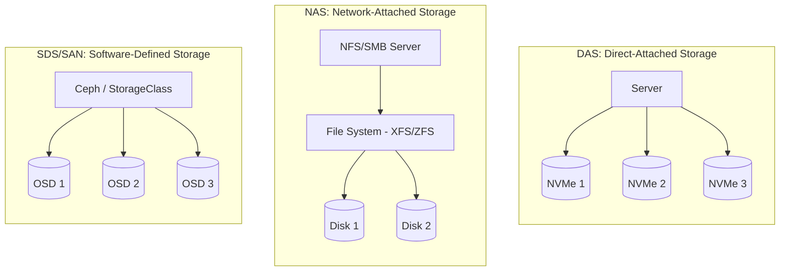
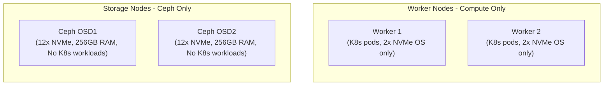
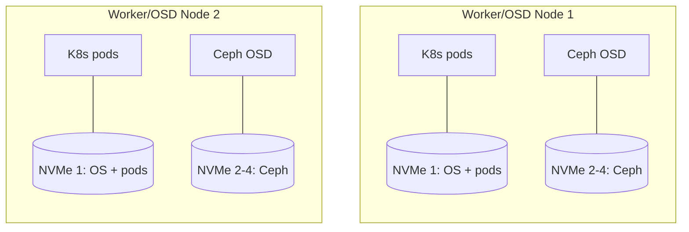

> **Complexity**: `[MEDIUM]` | Time: 45 minutes
>
> **Prerequisites**: [Module 1.2: Server Sizing](../planning/module-1.2-server-sizing/), [CKA: Storage](../../k8s/cka/part4-storage/)

---

## Why This Module Matters

A data analytics company deployed a 40-node Kubernetes cluster on bare metal with local SATA SSDs in each server. For the first six months, everything worked. Then they deployed Apache Kafka, which needed persistent storage that survived node rescheduling. When a worker node failed, Kafka brokers were rescheduled to new nodes — but their data was on the dead node's local SSDs. They lost 4 hours of event data and spent 3 days manually rebalancing partitions.

They then deployed Ceph via Rook on the same SSDs. Performance dropped 60%. Ceph's replication tripled the write load on drives that were already serving application I/O. The OSD processes competed with Kubernetes workloads for CPU and memory. Their monitoring showed that Ceph rebalancing after a node failure consumed 80% of cluster I/O bandwidth for 4 hours, making all applications sluggish.

The fix was dedicating 6 servers as Ceph OSD nodes with NVMe drives, separated from the Kubernetes worker nodes. Storage traffic ran on a dedicated VLAN with jumbo frames. The lesson: **storage architecture decisions must be made before you buy hardware, not after you deploy workloads.**

---

## What You'll Be Able to Do

After completing this module, you will be able to:

1. **Design** storage architectures that separate compute and storage tiers with dedicated networks and hardware
2. **Evaluate** distributed storage (Ceph, Longhorn) vs. local storage vs. external SAN/NAS for specific workload requirements
3. **Plan** storage hardware procurement including drive types (NVMe, SSD, HDD), RAID configurations, and capacity projections
4. **Diagnose** storage performance bottlenecks caused by I/O contention, replication overhead, and network saturation

---

## What You'll Learn

- Direct-Attached Storage (DAS) vs Network-Attached Storage (NAS) vs SAN
- NVMe vs SSD vs HDD tiering for Kubernetes workloads
- etcd storage requirements (the most demanding component)
- When to use local storage vs distributed storage
- Dedicated storage nodes vs hyper-converged (storage on worker nodes)
- IOPS, throughput, and latency benchmarking
- PersistentVolume access modes including RWOP (ReadWriteOncePod), CSI migrations, and modern K8s storage APIs like VolumeAttributesClass and OCI image volumes

---

## Storage Options for On-Premises K8s

### Modern Kubernetes Storage Architecture (v1.35+)
As of Kubernetes v1.35, the storage landscape for on-premises clusters relies heavily on the **Container Storage Interface (CSI)** (currently at spec v1.12.0). When architecting storage, keep these native capabilities in mind:

- **CSI is Mandatory**: In-tree plugins for storage systems like CephFS and Ceph RBD were permanently removed from the core in v1.31. The legacy FlexVolume API is fully deprecated. You must use CSI drivers (which have been GA since v1.13).
- **Access Modes**: In addition to standard access modes (RWO, ROX, RWX), modern CSI drivers support **ReadWriteOncePod (RWOP)** (GA in v1.29), guaranteeing that only a single Pod cluster-wide can read or write to the volume.
- **Volume Binding**: For bare-metal, always set your `StorageClass` (API `storage.k8s.io/v1`) to use `volumeBindingMode: WaitForFirstConsumer`. This ensures the PV is provisioned in the same availability zone as the scheduled Pod. The default is `Immediate`, which can cause topology mismatches.
- **Volume Modes and Protection**: Kubernetes supports `Filesystem` (default) and raw `Block` volume modes (GA since v1.18). It also features built-in Storage Object in Use Protection, preventing the deletion of PVCs and PVs actively bound or in use by a Pod.
- **Reclaim Policies**: The default policy for dynamic provisioning is `Delete`. Use `Retain` if data preservation is required. 
- **Advanced Features**: Newer stable features include Volume Expansion (GA in v1.24), CSI Storage Capacity Tracking (GA in v1.24), Generic Ephemeral Volumes (GA in v1.23), Volume Snapshots (GA in v1.20), Volume Populators (GA in v1.33), VolumeAttributesClass for modifying attributes without recreation (GA in v1.34), and OCI image volumes (GA in v1.35). *(Note: Volume Group Snapshots remain in beta as of v1.34, and CSI Volume Health Monitoring is still alpha).*
- **Cloud/Legacy Migration**: The in-tree CSI migration framework reached GA in v1.25, transparently redirecting legacy calls. Note that legacy cloud plugins for AWS EBS were removed entirely (unverified sources point to v1.27, but the specific removal release lacks official changelog confirmation). The `Recycle` reclaim policy is fully deprecated and unsupported by CSI (GitHub issue #59060 confirms deprecation, though the exact version—rumored to be v1.11—remains unverified in authoritative release notes).

### The Three Storage Models



**DAS (Direct-Attached Storage)**
- **Pros:** Lowest latency (no network hop), highest IOPS (direct PCIe).
- **Cons:** Data lost if node fails (no replication), cannot move PVs between nodes.
- **Best for:** etcd, databases with app-level replication.

**NAS (Network-Attached Storage)**
- **Pros:** Shared access (ReadWriteMany), simple to set up (NFS CSI driver).
- **Cons:** Higher latency (network + file protocol overhead), single point of failure (unless HA NFS).
- **Best for:** Shared data, ML datasets, media files.

**SDS/SAN (Software-Defined / Storage Area Network)** (e.g., Ceph, Longhorn)
- **Pros:** Replicated (survives node failures), PVs can be accessed from any node, self-healing (auto-rebalances).
- **Cons:** Higher latency than DAS (network + replication), requires dedicated storage nodes (or hyper-converged).
- **Best for:** General-purpose PVs, databases without replication.

> **Pause and predict**: You need to provide storage for three workloads: (1) PostgreSQL with streaming replication, (2) a shared ML training dataset read by 8 pods simultaneously, and (3) etcd. Before looking at the decision matrix below, assign each workload to DAS, NAS, or SDS and explain your reasoning.

### Decision Matrix

| Workload | Storage Type | Why |
|----------|-------------|-----|
| **etcd** | DAS (NVMe) | Requires <10ms p99 fsync; network storage too slow |
| **PostgreSQL** (with streaming replication) | DAS (NVMe) | App handles replication; local NVMe gives best latency |
| **PostgreSQL** (single instance) | Ceph RBD | Needs to survive node failure; no app-level replication |
| **Kafka** | DAS or Ceph | Kafka replicates data; DAS is faster but Ceph is safer |
| **Prometheus TSDB** | DAS (NVMe) | Write-heavy, latency-sensitive; Thanos handles replication |
| **ML training data** | NFS / CephFS | Large datasets, read-heavy, shared access needed |
| **CI/CD workspace** | DAS (SSD) | Ephemeral, high IOPS for builds, data is disposable |
| **Container images** | Ceph RBD or NFS | Harbor/registry storage, moderate IOPS, shared access |
| **Backup targets** | NFS / HDD | Large capacity, low IOPS, cost-optimized |

---

## Storage Tiers

| Tier | Tech | IOPS | Latency | $/TB | Use |
|---|---|---|---|---|---|
| **0** | NVMe Gen5 (PCIe 5.0) | 1M+ | <100μs | $300 | etcd, hot databases |
| **1** | NVMe Gen4 (PCIe 4.0) | 500K+ | <200μs | $150 | App data, Ceph OSD |
| **2** | SATA SSD (enterprise) | 50-100K | 1-5ms | $80 | Logs, bulk storage |
| **3** | HDD SAS (10K/15K RPM) | 100-200 | 5-15ms | $20 | Backup, cold storage |

**CRITICAL RULES:**
- **etcd**: Tier 0 or 1 ONLY (SATA SSD will cause elections).
- **Ceph OSD**: Tier 1 minimum (SATA SSD limits throughput).
- **Ceph WAL/DB**: Tier 0 on a separate device from OSD data to prevent write-ahead log I/O from competing with application data I/O.
- **Backup**: Tier 3 is fine (prioritize capacity over speed).

### RAID and Capacity Projections

When planning storage procurement:
- **RAID Configurations**: Do NOT use hardware RAID for distributed storage like Ceph or software-defined local storage. These systems expect raw HBAs in IT mode. For standalone databases on DAS, use software RAID 1 or 10 to provide local drive redundancy, since there is no distributed storage layer to protect against a single disk failure.
- **Capacity Projections**: Account for replication overhead. A 100TB raw Ceph cluster with a replication factor of 3 yields ~33TB usable. Plan for a 70% maximum fill rate; exceeding this severely impacts rebalancing during node failures.

---

> **Stop and think**: A team proposes running Ceph OSD processes on the same servers as their Kubernetes worker pods to save money on hardware. Their cluster is 40 nodes running a mix of web services and a PostgreSQL database. What happens to PostgreSQL I/O latency when a Ceph OSD node fails and triggers data rebalancing? Would your recommendation change if the cluster had 200 nodes?

## Dedicated Storage Nodes vs Hyper-Converged

### Dedicated Storage Nodes



**Dedicated Storage Nodes**
- **Pros:** No resource contention (storage doesn't compete with pods), storage can have different hardware (more drives, less CPU), storage failures don't affect compute.
- **Cons:** More servers needed (higher cost), network is the bottleneck (all I/O crosses the network).
- **Best for:** > 100 nodes, high I/O workloads, regulated environments.

### Hyper-Converged (Storage on Worker Nodes)



**Hyper-Converged (Storage on Worker Nodes)**
- **Pros:** Fewer servers (lower CapEx), data locality (pods can read from local OSD).
- **Cons:** Resource contention (OSD competes with pods for CPU/RAM), node failure loses both compute AND storage, harder to size (need enough CPU/RAM for both).
- **Best for:** < 50 nodes, budget-constrained, moderate I/O workloads.

---

> **Pause and predict**: Your vendor claims their enterprise SATA SSD delivers "100K IOPS." Based on the storage tier guide above, would this drive be suitable for etcd? What specific metric would you benchmark to verify, and what threshold would you consider a pass or fail?

## Benchmarking Storage

Always benchmark before deploying workloads. The three tests below cover the three most important storage patterns for Kubernetes: sequential writes (log files, WAL), random reads (database queries), and fsync-heavy writes (etcd). Running all three tells you which storage tier your hardware actually belongs to, regardless of what the vendor's datasheet claims:

```bash
# Install fio
apt-get install -y fio
fio --version  # Verify installation

# Test sequential write throughput (simulates log writes)
fio --name=seq-write \
    --rw=write --bs=128k --direct=1 \
    --size=4g --numjobs=4 --runtime=60 \
    --group_reporting --filename=/data/fio-test

# Test random read IOPS (simulates database reads)
fio --name=rand-read \
    --rw=randread --bs=4k --direct=1 \
    --size=4g --numjobs=8 --runtime=60 \
    --group_reporting --filename=/data/fio-test

# Test etcd-like workload (sequential write with fdatasync)
fio --name=etcd-wal \
    --rw=write --bs=2300 --fdatasync=1 \
    --size=22m --runtime=60 --time_based \
    --filename=/data/etcd-test

# Expected results by storage type:
# NVMe Gen4: seq write ~3 GB/s, rand read ~500K IOPS, fsync ~0.1ms
# SATA SSD:  seq write ~500 MB/s, rand read ~80K IOPS, fsync ~2-5ms
# HDD SAS:   seq write ~200 MB/s, rand read ~200 IOPS, fsync ~5-15ms
```

---

## Did You Know?

- **Ceph was started at UC Santa Cruz** by Sage Weil in 2004 and formalized in his PhD thesis in 2007. It became the storage backbone for most OpenStack deployments and is now the default distributed storage for on-premises Kubernetes via Rook.
- **NVMe drives can fail faster under sustained write loads** than SATA SSDs because they have higher write amplification at full speed. Enterprise NVMe drives (like Samsung PM9A3) have much higher endurance (DWPD — Drive Writes Per Day) than consumer NVMe. Always use enterprise-grade drives for Ceph OSDs.
- **A single NVMe drive provides more IOPS than an entire SAN array from 10 years ago.** A Samsung PM9A3 (3.84TB) delivers 1M random read IOPS. A mid-range EMC VNX from 2014 delivered ~200K IOPS from 120 spinning disks. Modern on-prem storage can outperform legacy enterprise storage at 1/10th the cost.
- **Kubernetes persistent volumes are statically provisioned by default** — you create a PV manually and a PVC claims it. Dynamic provisioning (via StorageClass + CSI driver) is essential for on-prem. Without it, every PV request becomes a manual ticket.

---

## Common Mistakes

| Mistake | Problem | Solution |
|---------|---------|----------|
| SATA SSD for etcd | Leader elections under load | NVMe only for etcd (Tier 0 or 1) |
| Hyper-converged without resource limits | Ceph OSD steals CPU/RAM from pods | Use cgroup limits: `2 cores + 4GB per OSD` |
| No separate storage network | Ceph replication competes with pod traffic | Dedicated VLAN with jumbo frames for storage |
| Single replication factor | Data loss on node failure | Ceph replication factor 3 (tolerates 1 failure) |
| Ceph on worker nodes at scale | Rebalancing kills application performance | Dedicated storage nodes above 100 nodes |
| Not benchmarking before deploy | Discover performance issues in production | fio benchmark on every storage tier before use |
| Mixing drive types in one pool | Inconsistent performance across PVs | Separate storage classes per tier |
| No monitoring for disk health | Drives fail silently until data loss | smartctl monitoring + Prometheus alerts |

---

## Quiz

### Question 1
You are designing the storage backend for a PostgreSQL database cluster deployed on Kubernetes. The database is configured with streaming replication across 3 Pods. The operations team is debating whether to use local NVMe drives directly attached to the worker nodes (DAS) or provision volumes from the central Ceph RBD cluster. Which option should you choose and why?

<details>
<summary>Answer</summary>

**Local NVMe (DAS).**

When an application like PostgreSQL handles its own data replication, using a distributed storage backend like Ceph introduces massive inefficiency. Ceph replicates data (typically 3x) at the block level, and PostgreSQL replicates it again at the application level, resulting in 9 copies of every write across the network. This "double replication" wastes storage capacity and significantly degrades write latency. By using local NVMe drives (accessed via `local-path-provisioner` or `TopoLVM`), the database gets direct PCIe access with sub-millisecond latency. High availability is still maintained because if a node fails, PostgreSQL's own clustering logic will promote one of the remaining replicas. Use Ceph RBD only for single-instance, non-replicated databases that truly need to survive node failures transparently.
</details>

### Question 2
A developer accidentally deployed a workload that crashed a physical Kubernetes worker node, which also happened to host several Ceph OSDs in a hyper-converged setup. The Ceph cluster immediately began rebalancing data, consuming 80% of the cluster's network I/O bandwidth and causing severe latency spikes for all other applications. How do you prevent this rebalancing process from impacting application performance in the future?

<details>
<summary>Answer</summary>

**Implement a dedicated storage network and limit Ceph recovery bandwidth.**

By default, Ceph prioritizes data safety and will attempt to rebuild missing replicas as quickly as possible, which can easily saturate a shared network. The most robust architectural fix is to separate application traffic from storage traffic by assigning Ceph to a dedicated VLAN with jumbo frames. Additionally, you should configure Ceph to throttle its recovery operations:

```bash
# Set recovery limits (Ceph CLI)
ceph config set osd osd_recovery_max_active 1          # default 3
ceph config set osd osd_recovery_sleep 0.5              # 500ms sleep between ops
ceph config set osd osd_max_backfills 1                 # default 1
ceph config set osd osd_recovery_op_priority 1          # lowest priority (default 3)

# Set client I/O priority higher than recovery
ceph config set osd osd_client_op_priority 63           # highest priority
```

Finally, scaling out with more OSDs to reduce per-drive rebalance load, using faster NVMe drives for OSDs, and maintaining spare cluster capacity ensures that when rebalancing does occur, it completes rapidly without causing a bottleneck.
</details>

### Question 3
You are tasked with purchasing hardware for a new dedicated on-premises Ceph cluster that will provide persistent volumes to your Kubernetes environment. The finance department asks if they can approve only two dedicated storage nodes to save costs while still meeting the requirement for a replication factor of 3. What do you tell them and why?

<details>
<summary>Answer</summary>

**You must reject the proposal and require a minimum of 3 OSD nodes.**

Ceph requires failure domains to safely distribute data replicas. With a replication factor of 3, Ceph is configured to place one copy of each object on three distinct nodes to ensure data survives a node failure. If you only provide two nodes, the CRUSH algorithm cannot satisfy the rule to place three replicas across three different nodes, meaning it will either degrade safety by placing two copies on a single node or refuse to write data entirely. A 3-node cluster allows one node to fail while preserving two copies of the data, which is sufficient to maintain availability. However, for a production environment, 5 or more nodes are highly recommended so that you can tolerate a failure, perform rolling maintenance, and have enough spare capacity to rebalance the data automatically.
</details>

### Question 4
You are troubleshooting an on-premises Kubernetes cluster where the API server becomes periodically unresponsive under heavy load. The logs reveal frequent etcd leader elections. The underlying hardware uses enterprise SATA SSDs. What is the root cause of this instability and how do you permanently resolve it?

<details>
<summary>Answer</summary>

**The root cause is high fsync latency from the SATA SSDs.**

etcd relies on the Raft consensus algorithm, which strictly requires the leader to successfully synchronize (fsync) the Write-Ahead Log (WAL) to disk on every single write operation before acknowledging it. SATA SSDs generally exhibit an fsync latency of 2-10ms, but under heavy I/O load, this can spike beyond 50ms. Because etcd's default heartbeat interval is 100ms, a slow disk prevents the leader from sending heartbeats in time, causing followers to declare the leader dead and trigger an election, during which the cluster API becomes read-only and unresponsive. The permanent fix is to replace the SATA SSDs with NVMe drives for the etcd data directory (or move etcd to Tier 0/1 storage), as NVMe drives consistently provide sub-millisecond fsync latencies.

**Verification**:
```bash
# Before (SATA SSD):
etcdctl check perf
# ... PASS: Throughput is ... FAIL: Slowest request took ...

# After (NVMe):
etcdctl check perf
# ... PASS: Throughput is ... PASS: Slowest request took ...
```
</details>

---

## Hands-On Exercise: Benchmark Storage Tiers

**Task**: Benchmark different storage types and compare performance.

```bash
# Create a test directory
mkdir -p /mnt/storage-benchmark
# NOTE: Run benchmarks on the target storage device mount point.
# /tmp is often tmpfs (RAM disk) which gives misleading results.

# Test 1: Sequential write throughput
echo "=== Sequential Write ==="
fio --name=seq-write --rw=write --bs=128k --direct=1 \
    --size=1g --numjobs=1 --runtime=30 --time_based \
    --group_reporting --filename=/mnt/storage-benchmark/seq-test

# Test 2: Random read IOPS
echo "=== Random Read IOPS ==="
fio --name=rand-read --rw=randread --bs=4k --direct=1 \
    --size=1g --numjobs=4 --runtime=30 --time_based \
    --group_reporting --filename=/mnt/storage-benchmark/iops-test

# Test 3: etcd WAL simulation
echo "=== etcd WAL (fdatasync) ==="
fio --name=etcd-wal --rw=write --bs=2300 --fdatasync=1 \
    --size=22m --runtime=30 --time_based \
    --filename=/mnt/storage-benchmark/etcd-test

# Record results and compare against the tier guide above
# NVMe should show: >1 GB/s seq, >100K IOPS rand, <1ms fdatasync
# SATA SSD: ~400 MB/s seq, ~50K IOPS rand, ~2-5ms fdatasync

# Cleanup
rm -rf /mnt/storage-benchmark
```

### Success Criteria
- [ ] Sequential write throughput measured (MB/s)
- [ ] Random read IOPS measured
- [ ] fsync latency measured (p99)
- [ ] Results compared against tier guide
- [ ] Storage tier identified for the tested device

---

## Next Module

Continue to [Module 4.2: Software-Defined Storage (Ceph/Rook)](../module-4.2-ceph-rook/) to learn how to deploy and operate Ceph as distributed storage for Kubernetes.