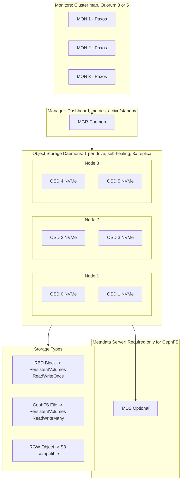
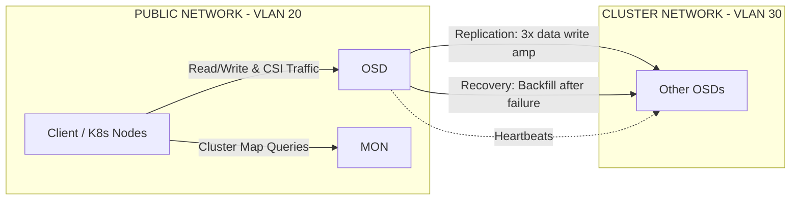

> **Complexity**: `[COMPLEX]` | Time: 60 minutes
>
> **Prerequisites**: [Module 4.1: Storage Architecture](../module-4.1-storage-architecture/), [Rook/Ceph Toolkit](../../platform/toolkits/infrastructure-networking/storage/module-16.1-rook-ceph/)

---

## Why This Module Matters

In 2017, GitLab suffered a catastrophic outage when an engineer accidentally executed `rm -rf` on their primary database server. Because their architecture relied heavily on local storage and had silent failures in their snapshot pipelines, they permanently lost nearly 300GB of production data and faced 18 hours of grueling downtime. The incident severely damaged their reputation and caused significant financial impact. If their critical databases had been backed by a robust, software-defined distributed storage system capable of instantaneous block-level snapshots and cross-node replication, recovery would have been a simple command taking mere seconds.

Software-defined storage (SDS) is the backbone of resilient infrastructure. Ceph is the undisputed dominant distributed storage system for on-premises Kubernetes environments. It transforms a scattered collection of local disks across multiple servers into a unified, highly replicated, self-healing storage pool that Kubernetes can dynamically consume via the Container Storage Interface (CSI). When a physical disk fails, Ceph automatically redistributes the data. When an entire node goes offline, Ceph continues serving requests from replicas located on surviving nodes. When you add new servers to the rack, Ceph rebalances the cluster automatically, distributing the I/O load transparently.

But Ceph is not a simple black box. It operates its own daemons, utilizes its own distributed consensus protocol, demands strict networking topologies, and exhibits unique failure modes. Running Ceph poorly is often worse than not running it at all—a misconfigured Ceph cluster can amplify failures, saturate your network, and bring down your entire environment. Rook is the Kubernetes operator that manages Ceph, turning a complex, multi-day manual deployment into declarative YAML. Understanding what Rook does under the hood, and how Ceph manages data, is essential for engineering resilient, production-grade storage architectures.

---

## What You'll Be Able to Do

After completing this module, you will be able to:

1. **Design** a production-grade Ceph cluster architecture incorporating dedicated public and cluster networks to isolate replication traffic.
2. **Implement** Rook-Ceph operators and CephCluster Custom Resource Definitions (CRDs), ensuring optimal OSD placement and host-level failure domain configurations.
3. **Compare** and select appropriate Ceph CSI drivers (RBD, CephFS, NFS) based on application access modes and specific performance requirements.
4. **Diagnose** Ceph cluster health issues, including Placement Group (PG) degradation and slow OSD recovery, using the Rook toolbox.
5. **Evaluate** storage node topologies and upgrade paths to prevent quorum loss and maintain compatibility across Kubernetes and Ceph versions.

---

## What You'll Learn

- The evolution of Rook within the CNCF ecosystem and the Ceph release lifecycle.
- Ceph architecture components (MON, OSD, MDS, MGR, RADOS) and how they interact.
- Rook operator deployment, prerequisites, and the `CephCluster` CRD structure.
- Storage classes for block (RBD), filesystem (CephFS), and object (RGW) provisioners.
- Performance tuning strategies for on-premises workloads, including network separation.
- Monitoring, alerting, and failure recovery procedures for Ceph health.

---

## The Evolution of Rook and Ceph

Before diving into the architecture, it is important to understand the lifecycle of the tools managing your data. 

Rook is a premier CNCF project that has reached the highest level of maturity. Rook was accepted to the CNCF on 2018-01-29 and moved to incubation on 2018-09-25. It officially moved to Graduated maturity on 2020-10-07, cementing its place as the standard for Kubernetes-native storage orchestration.

Ceph itself follows a strict release lifecycle using marine animal names. Staying on supported versions is a hard requirement for production clusters, as archived Ceph releases are explicitly not maintained and no longer receive bug fixes or backports. As of our current timeline:
- The **Tentacle** release is part of the active release train, with its latest version being 20.2.1 and an initial release date of 2026-04-06.
- The **Squid** release is also active, with its latest version at 19.2.3 and an expected end-of-life (EOL) of 2026-09-19.
- The **Reef** release remains active but is nearing the end of its cycle. Its latest release, 18.2.8, is expected to be the eighth and final backport release in Reef, with an EOL of 2026-03-31.

Rook's upgrade procedures are strictly sequential. Rook 1.19 upgrade documentation defines support for upgrading from 1.18.x to 1.19.x and explicitly states that upgrades are only supported between official releases. Rook marks master/unreleased builds as unsupported—you should never run a master build in production or attempt to skip minor versions during an upgrade.

---

## Ceph Architecture

Ceph is a distributed storage system composed of several specialized daemons that work together to provide object, block, and file storage. At its core, Rook/Ceph exposes block, object, and file storage to applications.

### Legacy ASCII Architecture Representation

The original documentation utilized an ASCII diagram to represent this architecture. The technical representation is preserved below:

```text
┌─────────────────────────────────────────────────────────────┐
│                    CEPH ARCHITECTURE                         │
│                                                               │
│  ┌──────────┐  ┌──────────┐  ┌──────────┐                  │
│  │  MON 1   │  │  MON 2   │  │  MON 3   │  Monitors        │
│  │ (Paxos)  │  │ (Paxos)  │  │ (Paxos)  │  - Cluster map   │
│  └──────────┘  └──────────┘  └──────────┘  - Quorum (odd #) │
│                                              - 3 or 5 MONs   │
│  ┌──────────┐                                                │
│  │  MGR     │  Manager                                       │
│  │          │  - Dashboard, metrics, modules                 │
│  │          │  - Active/standby HA                           │
│  └──────────┘                                                │
│                                                               │
│  ┌──────┐ ┌──────┐ ┌──────┐ ┌──────┐ ┌──────┐ ┌──────┐   │
│  │OSD 0 │ │OSD 1 │ │OSD 2 │ │OSD 3 │ │OSD 4 │ │OSD 5 │   │
│  │NVMe  │ │NVMe  │ │NVMe  │ │NVMe  │ │NVMe  │ │NVMe  │   │
│  │Node 1│ │Node 1│ │Node 2│ │Node 2│ │Node 3│ │Node 3│   │
│  └──────┘ └──────┘ └──────┘ └──────┘ └──────┘ └──────┘   │
│                                                               │
│  Object Storage Daemons (OSDs):                              │
│  - One per physical drive                                    │
│  - Stores data as objects in a flat namespace                │
│  - Replicates data to other OSDs (default 3x)               │
│  - Self-heals: rebuilds replicas when an OSD fails          │
│                                                               │
│  ┌──────────┐  (Optional)                                    │
│  │  MDS     │  Metadata Server                               │
│  │          │  - Required only for CephFS                    │
│  │          │  - Manages file/directory namespace             │
│  └──────────┘                                                │
│                                                               │
│  Storage Types:                                              │
│  RBD (Block)  → PersistentVolumes (ReadWriteOnce)           │
│  CephFS (File)→ PersistentVolumes (ReadWriteMany)           │
│  RGW (Object) → S3-compatible object storage                │
│                                                               │
└─────────────────────────────────────────────────────────────┘
```

### Modern Mermaid Architecture Representation

Here is the exact same architectural layout translated into a native Mermaid diagram for better maintainability:



### Ceph Networking

A proper Ceph deployment relies heavily on network segregation. Because data replication multiplies the amount of traffic flowing across the network, failing to separate client traffic from replication traffic can cause storage operations to saturate your interfaces and impact your application pods.

#### Legacy ASCII Network Design

```text
┌─────────────────────────────────────────────────────────────┐
│           CEPH NETWORK DESIGN                                │
│                                                               │
│  PUBLIC NETWORK (VLAN 20 or 30):                            │
│  ├── Client → OSD communication (read/write data)           │
│  ├── MON communication (cluster map queries)                │
│  └── K8s nodes → Ceph (CSI driver traffic)                  │
│                                                               │
│  CLUSTER NETWORK (VLAN 30, separate from public):           │
│  ├── OSD → OSD replication (write amplification: 3x data)   │
│  ├── OSD → OSD recovery (backfill after failure)            │
│  └── Heartbeat between OSDs                                  │
│                                                               │
│  WHY SEPARATE:                                               │
│  Replication traffic = 2x the client write traffic           │
│  Recovery traffic = can saturate the network for hours       │
│  Separating prevents storage operations from impacting pods │
│                                                               │
│  RECOMMENDED:                                                │
│  Public: 25GbE (shared with K8s node network)               │
│  Cluster: 25GbE (dedicated, same bond, different VLAN)      │
│  MTU: 9000 (jumbo frames) on both networks                  │
│                                                               │
└─────────────────────────────────────────────────────────────┘
```

#### Modern Mermaid Network Design



---

## Prerequisites and Integration

Before deploying Rook and Ceph, you must ensure your environment meets strict prerequisites.

### Hardware and OS Requirements
- **CPU:** Rook currently supports only amd64/x86_64 and arm64 CPU architectures.
- **Kernel Versions:** Rook requires kernel/RBD support. It recommends kernel minimums of 5.4+ for expanded RBD image features, and 4.17+ for CephFS RWX PVC size enforcement. Running older kernels can lead to degraded features or failed quota enforcement.
- **Local Storage:** Rook requires at least one local storage source such as raw devices/partitions, LVM logical volumes without filesystem, or block PVCs for Ceph OSD use. You cannot use a formatted filesystem partition for an OSD.

### Kubernetes Compatibility
Rook's compatibility matrix shifts with each release. For example, Rook v1.18 documentation still references Kubernetes support as v1.29 through v1.34. However, the subsequent Rook v1.19 introduces a minimum supported Kubernetes version of v1.30 and a minimum supported Ceph version of v19.2.0. Looking at the broader picture, Rook latest-release documentation lists Kubernetes support as v1.30 through v1.35. Always verify your control plane version before initiating a Rook upgrade.

### CSI Drivers
Rook acts as the bridge between Kubernetes and Ceph by integrating Container Storage Interface (CSI) drivers. Specifically, Rook integrates three CSI drivers: RBD (block), CephFS (file), and NFS (experimental). Within Rook, the RBD and CephFS CSI drivers are enabled automatically by the operator, while NFS is disabled by default. When planning upgrades, note that the Rook Ceph CSI support policy in the latest docs is to support only the two most recent ceph-csi versions.

---

## Deploying Ceph with Rook

### Step 1: Install Rook Operator

To begin, install the Rook operator. Note the explicit enablement of the RBD and CephFS CSI drivers.

```bash
# Add Rook Helm repo
helm repo add rook-release https://rook.github.io/charts
helm repo update

# Install Rook operator
helm install rook-ceph rook-release/rook-ceph \
  --namespace rook-ceph --create-namespace \
  --set csi.enableRBDDriver=true \
  --set csi.enableCephFSDriver=true

# Wait for operator
kubectl -n rook-ceph wait --for=condition=Ready pod \
  -l app=rook-ceph-operator --timeout=300s
```

> **Pause and predict**: The CephCluster definition below explicitly lists which devices on which nodes to use as OSDs, rather than setting `useAllDevices: true`. Why is explicit device listing safer? What could go wrong with `useAllDevices: true` on a server that has both OS drives and data drives?

### Step 2: Create CephCluster

The CephCluster CRD below configures a production-grade Ceph deployment. Notice three critical design decisions: (1) `allowMultiplePerNode: false` for MONs ensures that a single node failure cannot lose quorum, (2) `provider: host` for networking bypasses container networking overhead for storage I/O, and (3) resource limits on OSDs prevent them from consuming all CPU and memory during recovery operations.

```yaml
apiVersion: ceph.rook.io/v1
kind: CephCluster
metadata:
  name: rook-ceph
  namespace: rook-ceph
spec:
  cephVersion:
    image: quay.io/ceph/ceph:v19.2
  dataDirHostPath: /var/lib/rook

  mon:
    count: 3
    allowMultiplePerNode: false  # 1 MON per node (HA)

  mgr:
    count: 2
    allowMultiplePerNode: false

  dashboard:
    enabled: true
    ssl: true

  network:
    provider: host  # Use host networking for best performance
    # Or specify Multus for dedicated storage network:
    # provider: multus
    # selectors:
    #   public: rook-ceph/public-net
    #   cluster: rook-ceph/cluster-net

  storage:
    useAllNodes: false
    useAllDevices: false
    nodes:
      - name: "storage-01"
        devices:
          - name: "nvme0n1"
          - name: "nvme1n1"
          - name: "nvme2n1"
          - name: "nvme3n1"
      - name: "storage-02"
        devices:
          - name: "nvme0n1"
          - name: "nvme1n1"
          - name: "nvme2n1"
          - name: "nvme3n1"
      - name: "storage-03"
        devices:
          - name: "nvme0n1"
          - name: "nvme1n1"
          - name: "nvme2n1"
          - name: "nvme3n1"

  resources:
    osd:
      limits:
        cpu: "2"
        memory: "4Gi"
      requests:
        cpu: "1"
        memory: "2Gi"

  placement:
    mon:
      nodeAffinity:
        requiredDuringSchedulingIgnoredDuringExecution:
          nodeSelectorTerms:
            - matchExpressions:
                - key: role
                  operator: In
                  values: ["storage"]
```

> **Stop and think**: The CephBlockPool below sets `failureDomain: host` with `replicated.size: 3`. This means each block is copied to 3 different servers. If you accidentally set `failureDomain: osd` instead of `host`, two replicas could land on different drives of the same server. What happens when that server loses power?

### Step 3: Create StorageClasses

To expose the storage to Kubernetes, you must define StorageClasses for Block and Filesystem storage. These have been separated into distinct YAML blocks to ensure clean validation when applying to your cluster.

```yaml
# Block storage (RBD) — most common for databases, stateful apps
apiVersion: ceph.rook.io/v1
kind: CephBlockPool
metadata:
  name: replicated-pool
  namespace: rook-ceph
spec:
  failureDomain: host  # Replicate across hosts, not just OSDs
  replicated:
    size: 3             # 3 copies of every block
    requireSafeReplicaSize: true
```

```yaml
apiVersion: storage.k8s.io/v1
kind: StorageClass
metadata:
  name: ceph-block
provisioner: rook-ceph.rbd.csi.ceph.com
parameters:
  clusterID: rook-ceph
  pool: replicated-pool
  imageFormat: "2"
  imageFeatures: layering,fast-diff,object-map,deep-flatten,exclusive-lock
  csi.storage.k8s.io/provisioner-secret-name: rook-csi-rbd-provisioner
  csi.storage.k8s.io/provisioner-secret-namespace: rook-ceph
  csi.storage.k8s.io/node-stage-secret-name: rook-csi-rbd-node
  csi.storage.k8s.io/node-stage-secret-namespace: rook-ceph
  csi.storage.k8s.io/fstype: ext4
reclaimPolicy: Delete
allowVolumeExpansion: true
```

```yaml
# Filesystem storage (CephFS) — for shared access (ReadWriteMany)
apiVersion: ceph.rook.io/v1
kind: CephFilesystem
metadata:
  name: shared-fs
  namespace: rook-ceph
spec:
  metadataPool:
    replicated:
      size: 3
  dataPools:
    - name: data0
      replicated:
        size: 3
  metadataServer:
    activeCount: 1
    activeStandby: true
```

```yaml
apiVersion: storage.k8s.io/v1
kind: StorageClass
metadata:
  name: ceph-filesystem
provisioner: rook-ceph.cephfs.csi.ceph.com
parameters:
  clusterID: rook-ceph
  fsName: shared-fs
  pool: shared-fs-data0
  csi.storage.k8s.io/provisioner-secret-name: rook-csi-cephfs-provisioner
  csi.storage.k8s.io/provisioner-secret-namespace: rook-ceph
  csi.storage.k8s.io/node-stage-secret-name: rook-csi-cephfs-node
  csi.storage.k8s.io/node-stage-secret-namespace: rook-ceph
reclaimPolicy: Delete
allowVolumeExpansion: true
```

### Step 4: Verify Ceph Health

```bash
# Deploy the Rook toolbox
kubectl apply -f https://raw.githubusercontent.com/rook/rook/release-1.19/deploy/examples/toolbox.yaml
kubectl -n rook-ceph wait --for=condition=Ready pod -l app=rook-ceph-tools --timeout=300s

# Check Ceph cluster status
kubectl -n rook-ceph exec deploy/rook-ceph-tools -- ceph status
#   cluster:
#     id:     a1b2c3d4-...
#     health: HEALTH_OK
#
#   services:
#     mon: 3 daemons, quorum a,b,c
#     mgr: a(active), standbys: b
#     osd: 12 osds: 12 up, 12 in
#
#   data:
#     pools:   2 pools, 128 pgs
#     objects: 1.23k objects, 4.5 GiB
#     usage:   15 GiB used, 45 TiB / 45 TiB avail

# Check OSD status
kubectl -n rook-ceph exec deploy/rook-ceph-tools -- ceph osd tree
# ID  CLASS  WEIGHT   TYPE NAME           STATUS  REWEIGHT
# -1         45.00000 root default
# -3         15.00000     host storage-01
#  0    ssd   3.75000         osd.0           up   1.00000
#  1    ssd   3.75000         osd.1           up   1.00000
#  2    ssd   3.75000         osd.2           up   1.00000
#  3    ssd   3.75000         osd.3           up   1.00000
# ...

# Check pool IOPS
kubectl -n rook-ceph exec deploy/rook-ceph-tools -- ceph osd pool stats
```

---

> **Pause and predict**: After a storage node failure, Ceph starts rebuilding data replicas on surviving nodes. This recovery traffic can consume 80% of available I/O bandwidth. Your production database is on the same Ceph cluster. How would you balance the trade-off between fast recovery (data safety) and application performance?

## Performance Tuning

### Key Tuning Parameters

The tuning parameters below control the tension between recovery speed and client I/O performance. Setting `osd_recovery_max_active` to 1 means only one recovery operation per OSD runs at a time -- slower recovery, but application latency stays predictable. Setting it to 3 recovers faster but can spike I/O latency by 5-10x during the recovery window:

```bash
# Inside rook-ceph-tools pod:

# Increase OSD recovery speed (at cost of client I/O)
ceph config set osd osd_recovery_max_active 3
ceph config set osd osd_recovery_sleep 0

# Or throttle recovery to protect client I/O
ceph config set osd osd_recovery_max_active 1
ceph config set osd osd_recovery_sleep 0.5

# Enable RBD caching for read-heavy workloads
ceph config set client rbd_cache true
ceph config set client rbd_cache_size 134217728  # 128MB

# Set scrub schedule (background data integrity check)
ceph config set osd osd_scrub_begin_hour 2   # Start at 2 AM
ceph config set osd osd_scrub_end_hour 6     # End at 6 AM

# Monitor PG (Placement Group) count — critical for performance
# Rule of thumb: total PGs = (OSDs * 100) / replication_factor
# 12 OSDs, replication 3: (12 * 100) / 3 = 400 PGs per pool
# Round to nearest power of 2: 512
```

---

## Did You Know?

- **Ceph's CRUSH algorithm** (Controlled Replication Under Scalable Hashing) determines where data is stored without a central lookup table. This means Ceph can scale to thousands of OSDs without a metadata bottleneck — any client can calculate the location of any object independently.

- **Ceph monitors use Paxos consensus**, not Raft. Paxos predates Raft by 20 years (1989 vs 2013) and is mathematically equivalent but harder to implement. The Ceph team chose Paxos because Raft did not exist when Ceph was designed.

- **A single Ceph cluster can scale to exabytes.** CERN runs one of the largest Ceph deployments: 30+ PB across thousands of OSDs, storing physics experiment data from the Large Hadron Collider.

- **BlueStore replaced FileStore as the default OSD backend** in Ceph Luminous (2017). BlueStore writes directly to raw block devices, bypassing the Linux filesystem entirely. This eliminates the double-write penalty that FileStore suffered and improves write performance by 2x.

- Rook is a fully matured CNCF project; it was accepted to the CNCF on **2018-01-29**, moved to incubation on **2018-09-25**, and achieved Graduated maturity on **2020-10-07**.

- The Ceph **Tentacle** release train was initially released on **2026-04-06** and represents the leading edge of active Ceph development (latest version **20.2.1**).

- The Ceph **Squid** release train remains highly active with its latest stable release at **19.2.3**, and is expected to reach its end-of-life on **2026-09-19**.

- The Ceph **Reef** release train's latest version is **18.2.8**, which serves as its eighth and expected final backport release, leading up to its EOL on **2026-03-31**.

---

## Common Mistakes

| Mistake | Problem | Solution |
|---------|---------|----------|
| Too few PGs | Uneven data distribution, hotspots | Calculate PGs: (OSDs × 100) / replication_factor |
| No cluster network | Replication competes with client I/O | Separate public and cluster networks |
| MONs on OSD nodes | MON fails when OSD saturates CPU/RAM | Dedicated MON nodes (or on K8s control plane nodes) |
| No resource limits on OSDs | OSD consumes all node RAM during recovery | Set CPU/memory limits in CephCluster spec |
| Replication factor 2 | Single failure = data at risk during rebuild | Always use replication factor 3 |
| Not monitoring disk health | Drive fails silently, OSD goes down | smartmontools + Prometheus SMART exporter |
| Scrubbing during peak hours | Background scrub competes with workload I/O | Schedule scrubs for off-peak hours |
| Using `useAllDevices: true` | Accidentally formats OS drives as OSDs | Explicitly list devices per node |

---

## Quiz

### Question 1
You have 12 NVMe drives across 3 storage nodes (4 per node). What replication factor and failure domain should you use?

<details>
<summary>Answer</summary>

**Replication factor 3, failure domain `host`.**

- Each object is replicated to 3 different OSDs on 3 different hosts
- If an entire host fails (all 4 OSDs), 2 copies remain on the other 2 hosts
- Recovery redistributes the lost replicas using the 8 surviving OSDs
- Failure domain `host` ensures no two replicas of the same object are on the same server

**Do NOT use failure domain `osd`** (default if not specified) — this would allow 2 replicas on the same host, meaning a host failure could lose 2 of 3 copies.

```yaml
spec:
  failureDomain: host  # Not "osd"
  replicated:
    size: 3
```
</details>

### Question 2
Your Ceph cluster shows `HEALTH_WARN: 1 osds down`. What is the immediate impact and what should you do?

<details>
<summary>Answer</summary>

**Immediate impact**: Minimal. With replication factor 3, all data has 2 remaining copies. No data is lost and all volumes are accessible. However, those placement groups that had replicas on the failed OSD now have only 2 copies instead of 3 (degraded).

**What happens automatically**:
1. Ceph marks the OSD as `down` and starts a timer
2. After 10 minutes (default `mon_osd_down_out_interval`), Ceph marks the OSD as `out`
3. Ceph begins redistributing data to rebuild the third copy on surviving OSDs
4. Recovery time depends on data size and network speed (~100GB/min on 25GbE)

**What you should do**:
1. Check which OSD and which node: `ceph osd tree`
2. Check if the node is reachable (is this a disk failure or a node failure?)
3. If disk failure: replace the drive, then `ceph osd purge <id> --yes-i-really-mean-it` and let Rook redeploy
4. If node failure: fix the node; when it comes back, the OSD will rejoin automatically
5. Monitor recovery: `ceph -w` (watch recovery progress)
</details>

### Question 3
When should you use CephFS (ReadWriteMany) instead of RBD (ReadWriteOnce)?

<details>
<summary>Answer</summary>

**Use RBD (block)** for:
- Databases (PostgreSQL, MySQL, MongoDB) — need consistent block I/O
- Single-pod workloads that need persistent storage
- Any workload where only one pod writes at a time
- Best performance (direct block device, no filesystem overhead)

**Use CephFS (filesystem)** for:
- Shared data that multiple pods read/write simultaneously
- ML training datasets (multiple training pods read the same data)
- CMS content directories (multiple web servers serve the same files)
- Log aggregation (multiple pods write to a shared directory)
- Any workload that needs `ReadWriteMany` access mode

**Do NOT use CephFS for databases** — the POSIX filesystem layer adds latency and doesn't provide the consistency guarantees that databases expect from block devices.

```yaml
# RBD PVC
accessModes: ["ReadWriteOnce"]
storageClassName: ceph-block

# CephFS PVC
accessModes: ["ReadWriteMany"]
storageClassName: ceph-filesystem
```
</details>

---

## Hands-On Exercise: Deploy Rook-Ceph in Kind

This exercise walks you through creating a local test environment and deploying Rook-Ceph using a PVC-backed storage mechanism.

> **Note**: Rook removed support for directory-backed OSDs in v1.4. This exercise
> uses PVC-based OSDs with Kind's default `standard` StorageClass (local-path
> provisioner), which is the recommended approach for test clusters.

### Step-by-Step Progressive Tasks

**Task 1: Bootstrap the Kind Cluster**
<details>
<summary>Solution</summary>

```bash
cat <<EOF | kind create cluster --config=-
kind: Cluster
apiVersion: kind.x-k8s.io/v1alpha4
nodes:
  - role: control-plane
  - role: worker
  - role: worker
  - role: worker
EOF
```
</details>

**Task 2: Install the Rook Operator**
<details>
<summary>Solution</summary>

```bash
helm repo add rook-release https://rook.github.io/charts
helm install rook-ceph rook-release/rook-ceph \
  --namespace rook-ceph --create-namespace
kubectl -n rook-ceph wait --for=condition=Ready pod \
  -l app=rook-ceph-operator --timeout=300s
```
</details>

**Task 3: Deploy the CephCluster Custom Resource**
<details>
<summary>Solution</summary>

```bash
kubectl apply -f - <<EOF
apiVersion: ceph.rook.io/v1
kind: CephCluster
metadata:
  name: rook-ceph
  namespace: rook-ceph
spec:
  cephVersion:
    image: quay.io/ceph/ceph:v19.2
    allowUnsupported: true
  dataDirHostPath: /var/lib/rook
  mon:
    count: 1
    allowMultiplePerNode: true
  mgr:
    count: 1
    allowMultiplePerNode: true
  dashboard:
    enabled: false
  crashCollector:
    disable: true
  storage:
    storageClassDeviceSets:
      - name: set1
        count: 3
        portable: true
        volumeClaimTemplates:
          - metadata:
              name: data
            spec:
              resources:
                requests:
                  storage: 5Gi
              storageClassName: standard
              volumeMode: Block
              accessModes:
                - ReadWriteOnce
  resources:
    mon:
      limits:
        memory: "512Mi"
      requests:
        memory: "256Mi"
    osd:
      limits:
        memory: "1Gi"
      requests:
        memory: "512Mi"
EOF
```
</details>

**Task 4: Monitor and Validate Cluster Health**
<details>
<summary>Solution</summary>

```bash
kubectl -n rook-ceph wait --for=condition=Ready cephcluster/rook-ceph --timeout=600s
kubectl apply -f https://raw.githubusercontent.com/rook/rook/release-1.19/deploy/examples/toolbox.yaml
kubectl -n rook-ceph wait --for=condition=Ready pod -l app=rook-ceph-tools --timeout=300s
kubectl -n rook-ceph exec deploy/rook-ceph-tools -- ceph status
```
</details>

**Task 5: Create a PVC and Verify Binding**
<details>
<summary>Solution</summary>

```bash
kubectl apply -f https://raw.githubusercontent.com/rook/rook/release-1.19/deploy/examples/csi/rbd/storageclass-test.yaml
kubectl apply -f - <<EOF
apiVersion: v1
kind: PersistentVolumeClaim
metadata:
  name: test-pvc
spec:
  accessModes: ["ReadWriteOnce"]
  storageClassName: rook-ceph-block
  resources:
    requests:
      storage: 1Gi
EOF
kubectl get pvc test-pvc
```
</details>

### Complete Script Reference

If you prefer to run the entire sequence non-interactively, here is the complete reference script:

```bash
# Create a kind cluster with 3 worker nodes
cat <<EOF | kind create cluster --config=-
kind: Cluster
apiVersion: kind.x-k8s.io/v1alpha4
nodes:
  - role: control-plane
  - role: worker
  - role: worker
  - role: worker
EOF

# Install Rook operator
helm repo add rook-release https://rook.github.io/charts
helm install rook-ceph rook-release/rook-ceph \
  --namespace rook-ceph --create-namespace

# Wait for operator
kubectl -n rook-ceph wait --for=condition=Ready pod \
  -l app=rook-ceph-operator --timeout=300s

# Deploy a test CephCluster using PVC-based OSDs
# This uses Kind's default StorageClass to back each OSD with a PVC
kubectl apply -f - <<EOF
apiVersion: ceph.rook.io/v1
kind: CephCluster
metadata:
  name: rook-ceph
  namespace: rook-ceph
spec:
  cephVersion:
    image: quay.io/ceph/ceph:v19.2
    allowUnsupported: true
  dataDirHostPath: /var/lib/rook
  mon:
    count: 1
    allowMultiplePerNode: true
  mgr:
    count: 1
    allowMultiplePerNode: true
  dashboard:
    enabled: false
  crashCollector:
    disable: true
  storage:
    storageClassDeviceSets:
      - name: set1
        count: 3
        portable: true
        volumeClaimTemplates:
          - metadata:
              name: data
            spec:
              resources:
                requests:
                  storage: 5Gi
              storageClassName: standard
              volumeMode: Block
              accessModes:
                - ReadWriteOnce
  resources:
    mon:
      limits:
        memory: "512Mi"
      requests:
        memory: "256Mi"
    osd:
      limits:
        memory: "1Gi"
      requests:
        memory: "512Mi"
EOF

# Wait for Ceph to be healthy (takes 3-5 minutes)
kubectl -n rook-ceph wait --for=condition=Ready cephcluster/rook-ceph --timeout=600s

# Deploy toolbox for ceph commands
kubectl apply -f https://raw.githubusercontent.com/rook/rook/release-1.19/deploy/examples/toolbox.yaml
kubectl -n rook-ceph wait --for=condition=Ready pod -l app=rook-ceph-tools --timeout=300s

# Check Ceph health
kubectl -n rook-ceph exec deploy/rook-ceph-tools -- ceph status

# Create a block pool and storage class
kubectl apply -f https://raw.githubusercontent.com/rook/rook/release-1.19/deploy/examples/csi/rbd/storageclass-test.yaml

# Create a test PVC
kubectl apply -f - <<EOF
apiVersion: v1
kind: PersistentVolumeClaim
metadata:
  name: test-pvc
spec:
  accessModes: ["ReadWriteOnce"]
  storageClassName: rook-ceph-block
  resources:
    requests:
      storage: 1Gi
EOF

# Verify PVC is bound
kubectl get pvc test-pvc
# NAME       STATUS   VOLUME   CAPACITY   ACCESS MODES   STORAGECLASS
# test-pvc   Bound    pvc-...  1Gi        RWO            rook-ceph-block

# Cleanup
kubectl delete pvc test-pvc
kind delete cluster
```

### Success Criteria
- [ ] Rook operator deployed and running
- [ ] CephCluster healthy (HEALTH_OK)
- [ ] Block pool and StorageClass created
- [ ] PVC bound successfully
- [ ] `ceph status` shows healthy cluster

---

## Next Module

Continue to [Module 4.3: Local Storage & Alternatives](../module-4.3-local-storage/) to learn about lightweight storage options that do not require a distributed storage system, perfect for ephemeral edge caches or simple bare-metal database nodes.