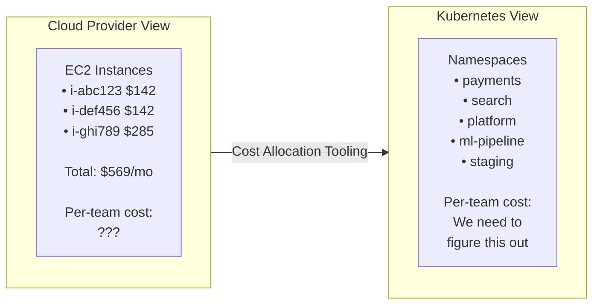
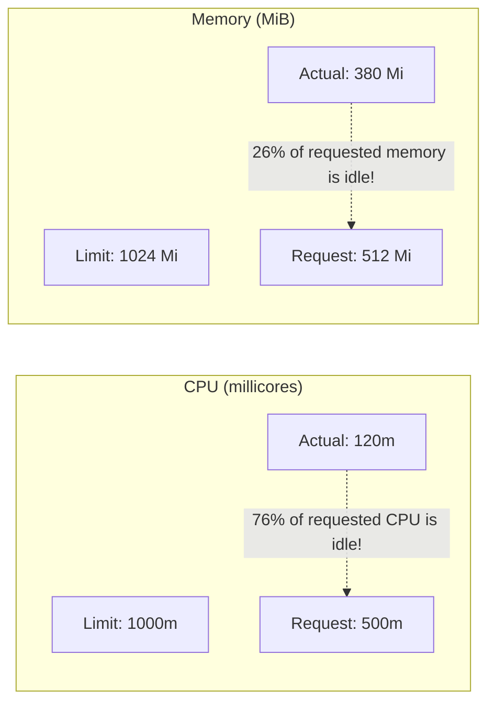
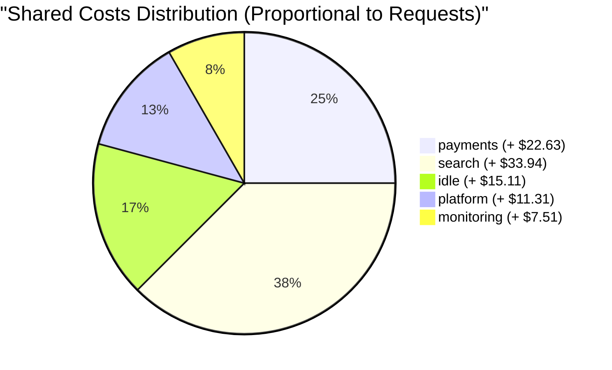
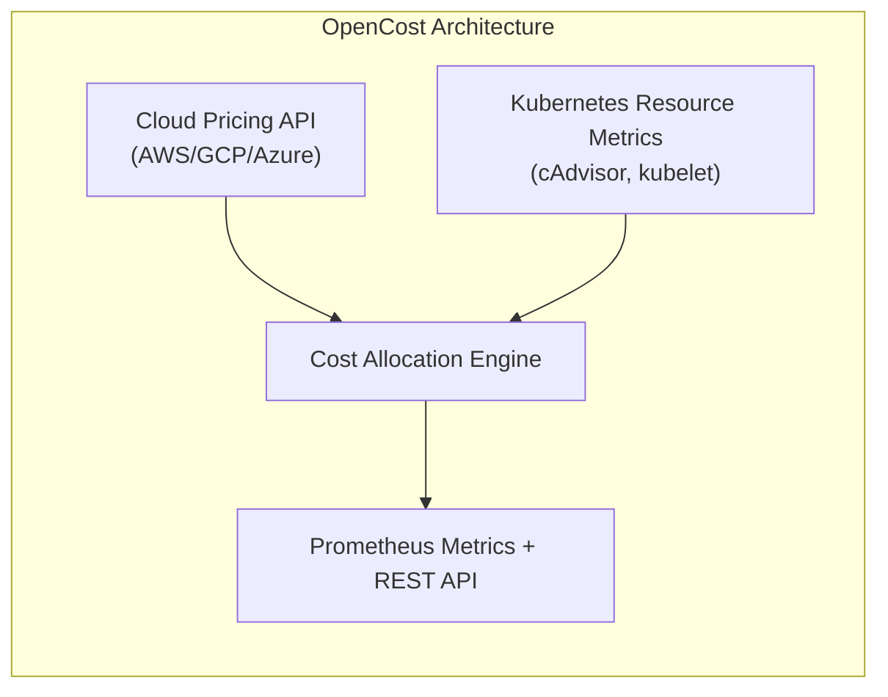
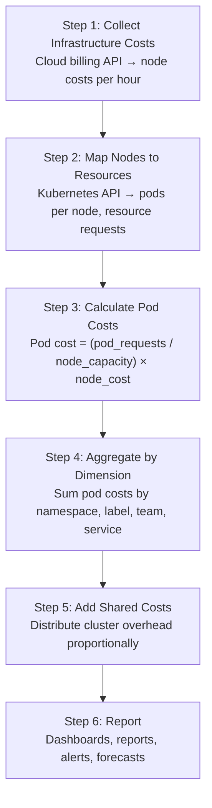

> **Discipline Module** | Complexity: `[MEDIUM]` | Time: 2.5h

## Prerequisites

Before starting this module:
- **Required**: [Module 1.1: FinOps Fundamentals](../module-1.1-finops-fundamentals/) — FinOps lifecycle, pricing models, tagging
- **Required**: Kubernetes basics — Pods, Deployments, Namespaces, Services
- **Required**: Understanding of resource requests and limits
- **Recommended**: Access to a local Kubernetes cluster (kind or minikube)
- **Recommended**: `kubectl` familiarity

---

## What You'll Be Able to Do

After completing this module, you will be able to:

- **Implement Kubernetes cost allocation using namespace labels, resource quotas, and tools like Kubecost**
- **Design chargeback and showback models that attribute cluster costs to teams and applications**
- **Build cost allocation dashboards that give engineering teams visibility into their Kubernetes spending**
- **Evaluate cost allocation accuracy across shared resources — control plane, networking, storage — in multi-tenant clusters**

## Why This Module Matters

Your cloud bill says you spent $83,000 on Kubernetes last month. Great. But *which team* spent it? *Which microservice*? Is the staging namespace costing more than production? Is anyone using the resources they requested?

Traditional cloud cost tools see Kubernetes as a black box. They can tell you the cost of the EC2 instances running your cluster, but not the cost of individual workloads *inside* that cluster. It's like knowing your electricity bill but not knowing which appliance uses the most power.

**This is the Kubernetes cost visibility problem.**

In a multi-tenant Kubernetes cluster shared by 12 teams running 200 microservices, you need to answer:
- What does each team's workloads actually cost?
- How much are we overpaying for resources nobody uses?
- Should we charge team X for their resource consumption?
- Are our namespace quotas aligned with actual business value?

Without solving this, FinOps stops at the infrastructure layer and never reaches the teams that actually make spending decisions. This module teaches you how to see inside the Kubernetes black box.

---

## Did You Know?

- **Studies from the CNCF and Datadog show that the average Kubernetes cluster runs at 13-18% CPU utilization** — meaning over 80% of requested compute capacity sits idle. In dollar terms, a cluster costing $50,000/month might have $40,000+ in wasted resources. The gap between what teams *request* and what they *use* is the single largest source of Kubernetes cost waste.

- **OpenCost, the CNCF project for Kubernetes cost monitoring, was originally built by Kubecost** and donated to the CNCF in 2022. It provides a vendor-neutral, open-source specification for measuring Kubernetes costs that works across AWS, GCP, Azure, and on-premises clusters.

- **A 2024 Flexera State of the Cloud survey found that 28% of cloud spend goes to Kubernetes**, yet only 31% of organizations have any Kubernetes-specific cost visibility tooling in place. The gap between spending and visibility is enormous.

---

## The Kubernetes Cost Challenge

### Why Cloud Bills Don't Show Kubernetes Costs

When you run Kubernetes on cloud infrastructure, the cloud provider bills you for:
- **Compute**: EC2 instances (nodes), Fargate vCPU/memory
- **Storage**: EBS volumes, EFS, S3
- **Networking**: Load balancers, NAT gateways, data transfer

None of these line items mention Pods, Deployments, or namespaces. The cloud provider doesn't know (or care) that node `ip-10-0-1-42` is running 23 Pods from 7 different teams.



### The Cost Model

To allocate Kubernetes costs, you need to:

1. **Know the cost of each node** (from your cloud bill)
2. **Know what each Pod requests** (from Kubernetes resource requests)
3. **Divide node cost proportionally** across Pods

This sounds simple. It's not.

---

## Requests vs Limits vs Actual Usage

Understanding the difference between these three values is critical for Kubernetes cost allocation.

### Resource Requests

The **minimum** resources guaranteed to a Pod. The scheduler uses requests to decide which node a Pod runs on.

```yaml
apiVersion: v1
kind: Pod
metadata:
  name: payment-api
  namespace: payments
spec:
  containers:
  - name: api
    image: payments/api:v2.4
    resources:
      requests:
        cpu: "500m"      # Guarantee me 0.5 CPU cores
        memory: "512Mi"  # Guarantee me 512 MB RAM
```

**For cost allocation**: Requests represent what you've *reserved*. Even if your Pod only uses 50m CPU, you're blocking 500m on the node. It's like reserving a table at a restaurant — you pay whether you eat or not.

> **Stop and think**: If a Pod requests 4 CPU cores but only uses 0.5 cores on average, what happens to the remaining 3.5 cores on that node? From the Kubernetes scheduler's perspective, those 3.5 cores are strictly reserved and unavailable to other workloads, even while they sit completely idle.

### Resource Limits

The **maximum** resources a Pod can use. If a Pod exceeds its CPU limit, it gets throttled. If it exceeds its memory limit, it gets OOM-killed.

```yaml
      resources:
        requests:
          cpu: "500m"
          memory: "512Mi"
        limits:
          cpu: "1000m"    # Can burst up to 1 CPU core
          memory: "1Gi"   # Hard ceiling: OOM-killed above 1 GB
```

**For cost allocation**: Limits represent *potential* burst usage. Some cost models charge based on limits because that's the maximum infrastructure impact.

### Actual Usage

What the Pod *really* uses, as measured by cAdvisor and the metrics server.



### Which Value Should You Use for Cost Allocation?

| Method | Basis | Pros | Cons |
|--------|-------|------|------|
| Request-based | What's reserved | Simple, stable, predictable | Penalizes over-provisioning |
| Usage-based | What's consumed | Reflects actual consumption | Volatile, hard to budget |
| Max(request, usage) | Higher of the two | Fair for burst workloads | Complex to explain |
| Weighted blend | 80% request + 20% usage | Balanced, incentivizes rightsizing | Arbitrary weights |

> **Pause and predict**: If you implemented a purely usage-based cost model, how would developers react? Would they care about their requests anymore? They likely wouldn't, resulting in massively over-provisioned clusters where teams request 10 CPUs "just in case" since they are only billed for the 0.5 CPUs they actually use.

**Industry standard**: Most organizations start with **request-based allocation** because it's simple and incentivizes teams to rightsize their requests. If you request 4 CPU but use 0.3, you pay for 4 — which motivates you to reduce your request.

---

## Multi-Tenant Cost Attribution

### Namespace-Based Allocation

The simplest model: one namespace per team (or per service).

**Cluster**: 3 nodes × m6i.xlarge ($0.192/hr) = $420.48/month
**Total cluster resources**: 12 vCPU, 48 GB RAM

| Namespace | CPU Req | Memory Req | Allocated $ |
|-----------|---------|------------|-------------|
| payments | 3.0 CPU | 12 GB | $105.12/mo |
| search | 4.5 CPU | 16 GB | $152.26/mo |
| platform | 1.5 CPU | 8 GB | $68.81/mo |
| monitoring| 1.0 CPU | 4 GB | $38.02/mo |
| idle/unused| 2.0 CPU | 8 GB | $56.27/mo |
| **Total** | **12.0 CPU**| **48 GB** | **$420.48/mo** |

### Label-Based Allocation

For more granularity, use Kubernetes labels to track costs at the service, feature, or team level — even within a shared namespace.

```yaml
apiVersion: apps/v1
kind: Deployment
metadata:
  name: checkout-service
  namespace: payments
  labels:
    app: checkout
    team: payments
    cost-center: "CC-4521"
    feature: "checkout-v2"
spec:
  replicas: 3
  template:
    metadata:
      labels:
        app: checkout
        team: payments
        cost-center: "CC-4521"
```

### Handling Shared Costs

Some costs don't belong to any single team:

| Shared Cost | Examples | Allocation Strategy |
|-------------|----------|-------------------|
| Cluster overhead | kube-system, control plane | Proportional to each team's requests |
| Monitoring | Prometheus, Grafana | Even split or proportional |
| Networking | NAT Gateway, load balancers | Proportional to data transfer |
| Platform team | CI/CD, service mesh | Even split across consuming teams |
| Idle resources | Unallocated node capacity | Proportional or "tax" model |

**Shared Cost Allocation Example:**
- Cluster cost: $420.48/mo
- kube-system overhead: $38.50/mo
- Monitoring stack: $52.00/mo
- **Shared costs total: $90.50/mo**



---

## Showback vs Chargeback

Two models for communicating costs to teams:

### Showback

**"Here's what you cost"** — informational only. No money actually changes hands between departments.

```text
Monthly Cost Report — Payments Team
──────────────────────────────────────
Namespace: payments
Period: March 2026

Compute (CPU):         $72.40
Compute (Memory):      $32.72
Storage (PVCs):        $18.90
Network (LB):          $12.00
Shared costs:          $22.63
──────────────────────────────────────
Total:                $158.65

Optimization Opportunities:
• checkout-api: CPU request 500m, usage avg 85m (-83%)
• payment-worker: 2 idle replicas during off-peak
• staging env: Running 24/7, used only business hours

Estimated savings if optimized: $41/mo
```

**Pros**: Low friction, educational, non-threatening
**Cons**: No financial consequence, easy to ignore

### Chargeback

**"Here's your bill"** — costs are deducted from the team's budget or charged to their cost center.

```text
Internal Invoice — Payments Team (CC-4521)
──────────────────────────────────────
Billing Period: March 2026

Line Items:
  Kubernetes compute (requests-based):    $105.12
  Persistent volume claims (gp3):         $18.90
  Load balancer (ALB shared):             $12.00
  Shared platform overhead (25%):         $22.63
  ──────────────────────────────────────
  Subtotal:                              $158.65

Adjustments:
  Spot savings credit:                   -$14.20
  ──────────────────────────────────────
  Total charged to CC-4521:              $144.45
```

**Pros**: Real financial accountability, teams optimize proactively
**Cons**: High friction, requires accurate data, can create perverse incentives

> **Stop and think**: Why might implementing chargeback on day one of a FinOps initiative cause massive cultural resistance among engineering teams? If teams have never seen their costs before and suddenly face budget cuts based on un-optimized legacy configurations or missing labels, they will likely distrust the data and fight the FinOps program instead of collaborating.

### Choosing a Model

| Factor | Start with Showback | Move to Chargeback |
|--------|--------------------|--------------------|
| Data quality | Tagging < 85% | Tagging > 95% |
| Cultural readiness | Teams new to FinOps | Teams understand cloud costs |
| Cost accuracy | Within 20% | Within 5% |
| Organization size | < 10 teams | > 10 teams |
| Cloud maturity | 1-2 years cloud | 3+ years cloud |

**Best practice**: Start with showback. Build trust in the data. Move to chargeback when teams accept the numbers as accurate and fair.

---

## Kubernetes Cost Tooling

### OpenCost

OpenCost is a CNCF project for Kubernetes cost monitoring. It provides a standard specification for measuring and allocating Kubernetes costs.

**Architecture**:



**Key features**:
- Real-time cost allocation by namespace, deployment, pod, label
- Cloud provider pricing integration (on-demand, spot, RI rates)
- Support for CPU, memory, GPU, storage, and network costs
- Prometheus metrics export for alerting and dashboards
- Open-source, vendor-neutral (CNCF project)

### Kubecost

Kubecost is a commercial product (with a free tier) built on top of OpenCost. It adds:

- **Savings recommendations**: Specific rightsizing suggestions per workload
- **Unified multi-cluster view**: Aggregate costs across clusters
- **Alerting**: Budget alerts, anomaly detection
- **Request sizing recommendations**: Based on actual usage patterns
- **Network cost monitoring**: Pod-to-pod, cross-zone, internet egress
- **Governance policies**: Enforce cost limits per namespace

### CAST AI, Spot.io, and Others

| Tool | Focus | Pricing | Best For |
|------|-------|---------|----------|
| OpenCost | Cost monitoring (open-source) | Free | Teams wanting CNCF-native visibility |
| Kubecost | Cost management + optimization | Free tier + paid | Full-featured cost platform |
| CAST AI | Automated optimization | Per-node pricing | Hands-off cluster optimization |
| Spot.io (NetApp) | Spot management + cost | Per managed node | Heavy Spot instance users |
| Vantage | Multi-cloud cost platform | Free tier + paid | Multi-cloud visibility |
| Infracost | IaC cost estimation | Free + paid | Terraform cost in CI/CD |

---

## Cost Allocation in Practice

### The Cost Allocation Pipeline



### Cost Allocation Formula

For a request-based model:

```text
Pod CPU cost = (pod_cpu_request / node_total_cpu) × node_cost × cpu_weight

Pod Memory cost = (pod_memory_request / node_total_memory) × node_cost × memory_weight

Where:
  cpu_weight = 0.65  (CPU is typically 65% of instance cost)
  memory_weight = 0.35 (Memory is typically 35%)

Example:
  Node: m6i.xlarge (4 vCPU, 16 GB) = $0.192/hr = $140.16/mo
  Pod requests: 500m CPU, 2 GB memory

  CPU cost = (0.5 / 4) × $140.16 × 0.65 = $11.39/mo
  Mem cost = (2 / 16) × $140.16 × 0.35 = $6.13/mo

  Total pod cost = $17.52/mo
```

### Handling GPUs

GPU workloads require special handling because GPU costs dominate the node price:

```text
GPU Node: p3.2xlarge (8 vCPU, 61 GB, 1× V100 GPU) = $3.06/hr

Cost weights for GPU nodes:
  cpu_weight = 0.08
  memory_weight = 0.05
  gpu_weight = 0.87    ← GPU dominates the cost

Pod requesting 1 GPU:
  GPU cost = (1/1) × $2,233/mo × 0.87 = $1,943/mo
  CPU cost = (2/8) × $2,233/mo × 0.08 = $44.66/mo
  Mem cost = (8/61) × $2,233/mo × 0.05 = $14.64/mo
  Total: ~$2,002/mo
```

---

## Common Mistakes

| Mistake | Why It Happens | How to Fix It |
|---------|---------------|---------------|
| Ignoring idle resources in allocation | Only counting allocated pods | Include idle/unallocated capacity as a visible cost |
| No namespace resource quotas | Teams request unlimited resources | Set quotas per namespace, review quarterly |
| Charging by node count per team | Simplistic model | Use request-based proportional allocation |
| Ignoring memory in cost model | CPU-only focus | Weight CPU and memory appropriately (65/35 or measure) |
| Not accounting for DaemonSets | DaemonSets run on every node | Allocate DaemonSet cost as shared overhead |
| Using only cloud-level tagging | Misses intra-cluster detail | Combine cloud tags with Kubernetes labels |
| Quarterly cost reviews | Too infrequent to catch waste | Weekly automated reports, monthly deep reviews |
| Perfectionism in cost model | Waiting for 100% accuracy | Start with 80% accuracy, iterate |

---

## Quiz

### Question 1
**Scenario**: Your team deployed a new `recommendation-engine` Pod. The deployment manifest requests 1 CPU and 4 GB of memory. However, after running in production for a week, you observe it consistently uses only 200m CPU and 1.5 GB memory. In a request-based cost model, how much does this Pod "cost" relative to its actual usage, and how should your team respond?

<details>
<summary>Show Answer</summary>

The Pod is charged for its **requests** (1 CPU, 4 GB), not its actual usage (200m, 1.5 GB). This means you are paying for 1 CPU while using 200m (80% waste), and paying for 4 GB while using 1.5 GB (62.5% waste). In a request-based model, this allocation is completely intentional, as it reflects the resources you have reserved on the node that cannot be used by other workloads. By charging based on requests, the organization incentivizes teams to rightsize their deployments. To optimize costs, your team should update the resource requests closer to the actual usage—perhaps 300m CPU and 2 GB memory to allow for a small safety buffer—which would significantly reduce the financial chargeback for this workload.
</details>

### Question 2
**Scenario**: You are the FinOps liaison for the `payments` team. The shared cluster consists of 3 nodes costing $150/month each ($450 total). Your `payments` namespace currently requests 40% of the total cluster CPU capacity and 30% of the total memory. If the organization's cost allocation model uses a 65/35 weight split between CPU and memory, what will your team's monthly chargeback be?

<details>
<summary>Show Answer</summary>

The payments team would be allocated **$164.25/month** out of the total $450 cluster cost, which represents about 36.5% of the overall cluster expense. Here is why: the model splits the node cost into compute and memory components based on the 65/35 weighting. The total CPU cost for the cluster is $450 × 0.65 = $292.50, and the payments team's 40% share of that is $117.00. The total memory cost is $450 × 0.35 = $157.50, and their 30% share equals $47.25. Combining the two ($117.00 + $47.25) gives the final monthly cost. This weighted approach ensures that workloads heavily leaning on either CPU or memory pay a fair proportion of the underlying infrastructure cost.
</details>

### Question 3
**Scenario**: Your company is migrating to a large multi-tenant Kubernetes cluster. The CFO wants to immediately start billing each engineering team's cost center for their Kubernetes usage (a "chargeback" model) to enforce cost discipline. You advocate for starting with a "showback" model instead. What is the fundamental difference between these two approaches, and why is starting with showback the better strategy?

<details>
<summary>Show Answer</summary>

The fundamental difference is that **showback** is purely informational, whereas **chargeback** involves actual financial transactions where money is deducted from a team's budget. Showback says, "here is what your team's workloads cost," aiming to build awareness without financial penalties. You should start with showback because it builds trust in the new cost data, allows teams time to fix missing namespace tags, and gives them a grace period to rightsize their resource requests. If you implement chargeback on day one with inaccurate tags or vastly over-provisioned legacy requests, teams will feel unfairly penalized and resist the FinOps initiative. Chargeback should only be introduced once data accuracy exceeds 95% and teams understand how to optimize their deployments.
</details>

### Question 4
**Scenario**: An engineering manager looks at the AWS Cost Explorer and sees that EC2 instances tagged with `k8s-cluster: prod` cost $12,000 last month. They ask you to break down how much of that $12,000 was spent by the `frontend` team versus the `data-science` team. Why can't you answer this question using just the cloud provider's billing tools?

<details>
<summary>Show Answer</summary>

Cloud provider billing tools lack visibility into the internal orchestration layer of Kubernetes. They track infrastructure resources like EC2 instances, EBS volumes, and load balancers, but they cannot see the Namespaces, Deployments, or Pods running inside those instances. Because a single EC2 worker node might simultaneously host Pods from the `frontend` team, the `data-science` team, and system-level daemonsets, the node's hourly cost cannot be natively divided by the cloud provider. To solve this, you must deploy Kubernetes-native cost tooling, such as OpenCost, which correlates the cloud pricing data for the node with the internal Kubernetes metrics for pod resource requests to accurately attribute costs to specific teams.
</details>

### Question 5
**Scenario**: After setting up OpenCost, you notice that 20% of your total cluster spend comes from the `kube-system` namespace, the Prometheus monitoring stack, and unallocated idle node capacity. The finance team wants to completely exclude these costs from the team reports since "they aren't business features." How should you handle these shared costs in your allocation model, and why?

<details>
<summary>Show Answer</summary>

You should never hide shared costs; instead, they must be explicitly allocated and visible to the individual teams. The most common and fair strategy is proportional allocation, where the shared overhead is distributed based on each team's percentage of total resource requests. Hiding these costs creates a false sense of the true cost of running a service, which can lead to poor business decisions when evaluating the profitability of a product feature. By displaying the shared platform tax on their showback reports, teams gain a realistic understanding of the infrastructure burden. It also incentivizes teams to work collaboratively with the platform engineering group to optimize global tooling like logging and monitoring.
</details>

---

## Hands-On Exercise: OpenCost in a Local Cluster

Deploy OpenCost to a local Kubernetes cluster and generate a cost allocation report.

### Prerequisites

- `kind` or `minikube` installed
- `kubectl` configured
- `helm` v3 installed

### Step 1: Create a Cluster

```bash
# Create a kind cluster with enough resources
cat > /tmp/kind-finops.yaml << 'EOF'
kind: Cluster
apiVersion: kind.x-k8s.io/v1alpha4
nodes:
- role: control-plane
- role: worker
- role: worker
EOF

kind create cluster --name finops-lab --config /tmp/kind-finops.yaml
```

### Step 2: Deploy Sample Workloads

Create workloads that simulate multi-tenant usage:

```bash
# Create namespaces for different teams
kubectl create namespace payments
kubectl create namespace search
kubectl create namespace ml-pipeline
kubectl create namespace staging

# Payments team workloads
kubectl apply -f - << 'EOF'
apiVersion: apps/v1
kind: Deployment
metadata:
  name: payment-api
  namespace: payments
  labels:
    app: payment-api
    team: payments
    cost-center: "CC-4521"
spec:
  replicas: 3
  selector:
    matchLabels:
      app: payment-api
  template:
    metadata:
      labels:
        app: payment-api
        team: payments
        cost-center: "CC-4521"
    spec:
      containers:
      - name: api
        image: nginx:alpine
        resources:
          requests:
            cpu: "200m"
            memory: "256Mi"
          limits:
            cpu: "500m"
            memory: "512Mi"
---
apiVersion: apps/v1
kind: Deployment
metadata:
  name: payment-worker
  namespace: payments
  labels:
    app: payment-worker
    team: payments
    cost-center: "CC-4521"
spec:
  replicas: 2
  selector:
    matchLabels:
      app: payment-worker
  template:
    metadata:
      labels:
        app: payment-worker
        team: payments
        cost-center: "CC-4521"
    spec:
      containers:
      - name: worker
        image: nginx:alpine
        resources:
          requests:
            cpu: "100m"
            memory: "128Mi"
          limits:
            cpu: "300m"
            memory: "256Mi"
EOF

# Search team workloads
kubectl apply -f - << 'EOF'
apiVersion: apps/v1
kind: Deployment
metadata:
  name: search-api
  namespace: search
  labels:
    app: search-api
    team: search
    cost-center: "CC-7803"
spec:
  replicas: 4
  selector:
    matchLabels:
      app: search-api
  template:
    metadata:
      labels:
        app: search-api
        team: search
        cost-center: "CC-7803"
    spec:
      containers:
      - name: api
        image: nginx:alpine
        resources:
          requests:
            cpu: "300m"
            memory: "512Mi"
          limits:
            cpu: "800m"
            memory: "1Gi"
---
apiVersion: apps/v1
kind: Deployment
metadata:
  name: search-indexer
  namespace: search
  labels:
    app: search-indexer
    team: search
    cost-center: "CC-7803"
spec:
  replicas: 2
  selector:
    matchLabels:
      app: search-indexer
  template:
    metadata:
      labels:
        app: search-indexer
        team: search
        cost-center: "CC-7803"
    spec:
      containers:
      - name: indexer
        image: nginx:alpine
        resources:
          requests:
            cpu: "500m"
            memory: "1Gi"
          limits:
            cpu: "1000m"
            memory: "2Gi"
EOF

# ML pipeline workload (over-provisioned)
kubectl apply -f - << 'EOF'
apiVersion: apps/v1
kind: Deployment
metadata:
  name: ml-trainer
  namespace: ml-pipeline
  labels:
    app: ml-trainer
    team: ml
    cost-center: "CC-9102"
spec:
  replicas: 1
  selector:
    matchLabels:
      app: ml-trainer
  template:
    metadata:
      labels:
        app: ml-trainer
        team: ml
        cost-center: "CC-9102"
    spec:
      containers:
      - name: trainer
        image: nginx:alpine
        resources:
          requests:
            cpu: "2000m"
            memory: "4Gi"
          limits:
            cpu: "4000m"
            memory: "8Gi"
EOF

# Staging workload (running 24/7 — waste candidate)
kubectl apply -f - << 'EOF'
apiVersion: apps/v1
kind: Deployment
metadata:
  name: staging-full-stack
  namespace: staging
  labels:
    app: staging-full-stack
    team: platform
    cost-center: "CC-3300"
spec:
  replicas: 3
  selector:
    matchLabels:
      app: staging-full-stack
  template:
    metadata:
      labels:
        app: staging-full-stack
        team: platform
        cost-center: "CC-3300"
    spec:
      containers:
      - name: app
        image: nginx:alpine
        resources:
          requests:
            cpu: "250m"
            memory: "256Mi"
          limits:
            cpu: "500m"
            memory: "512Mi"
EOF

echo "Workloads deployed. Waiting for pods..."
kubectl get pods -A --field-selector=status.phase=Running | grep -v kube-system
```

### Step 3: Deploy Prometheus + OpenCost

```bash
# Add Helm repos
helm repo add prometheus-community https://prometheus-community.github.io/helm-charts
helm repo add opencost https://opencost.github.io/opencost-helm-chart
helm repo update

# Install Prometheus (OpenCost dependency)
helm install prometheus prometheus-community/prometheus \
  --namespace opencost-system \
  --create-namespace \
  --set server.persistentVolume.enabled=false \
  --set alertmanager.enabled=false \
  --set kube-state-metrics.enabled=true \
  --set prometheus-node-exporter.enabled=true \
  --set prometheus-pushgateway.enabled=false

# Install OpenCost
helm install opencost opencost/opencost \
  --namespace opencost-system \
  --set opencost.prometheus.internal.serviceName=prometheus-server \
  --set opencost.prometheus.internal.namespaceName=opencost-system \
  --set opencost.ui.enabled=true

echo "Waiting for OpenCost to be ready..."
kubectl rollout status deployment/opencost -n opencost-system --timeout=120s
```

### Step 4: Query Cost Allocation

```bash
# Port-forward to OpenCost API
kubectl port-forward -n opencost-system svc/opencost 9003:9003 &
sleep 5

# Query cost allocation by namespace (last 1 hour window)
curl -s "http://localhost:9003/allocation/compute?window=1h&aggregate=namespace" | \
  python3 -m json.tool

# Query cost allocation by label (team)
curl -s "http://localhost:9003/allocation/compute?window=1h&aggregate=label:team" | \
  python3 -m json.tool
```

### Step 5: Generate a Cost Report

```bash
cat > /tmp/cost_report.sh << 'SCRIPT'
#!/bin/bash
echo "============================================"
echo "  Kubernetes Cost Allocation Report"
echo "  Cluster: finops-lab"
echo "  Date: $(date +%Y-%m-%d)"
echo "============================================"
echo ""

# Get resource requests by namespace
echo "--- Resource Requests by Namespace ---"
for ns in payments search ml-pipeline staging; do
  cpu=$(kubectl get pods -n "$ns" -o json | \
    python3 -c "
import json,sys
data=json.load(sys.stdin)
total=0
for pod in data.get('items',[]):
  for c in pod['spec']['containers']:
    req=c.get('resources',{}).get('requests',{}).get('cpu','0')
    if 'm' in req: total+=int(req.replace('m',''))
    else: total+=int(float(req)*1000)
print(total)" 2>/dev/null || echo "0")

  mem=$(kubectl get pods -n "$ns" -o json | \
    python3 -c "
import json,sys
data=json.load(sys.stdin)
total=0
for pod in data.get('items',[]):
  for c in pod['spec']['containers']:
    req=c.get('resources',{}).get('requests',{}).get('memory','0')
    if 'Gi' in req: total+=int(req.replace('Gi',''))*1024
    elif 'Mi' in req: total+=int(req.replace('Mi',''))
print(total)" 2>/dev/null || echo "0")

  printf "  %-15s CPU: %6sm  Memory: %6s Mi\n" "$ns" "$cpu" "$mem"
done

echo ""
echo "--- Cost Estimation (assuming \$0.05/CPU-hr, \$0.007/GB-hr) ---"
for ns in payments search ml-pipeline staging; do
  cpu=$(kubectl get pods -n "$ns" -o json | \
    python3 -c "
import json,sys
data=json.load(sys.stdin)
total=0
for pod in data.get('items',[]):
  for c in pod['spec']['containers']:
    req=c.get('resources',{}).get('requests',{}).get('cpu','0')
    if 'm' in req: total+=int(req.replace('m',''))
    else: total+=int(float(req)*1000)
print(total)" 2>/dev/null || echo "0")

  mem=$(kubectl get pods -n "$ns" -o json | \
    python3 -c "
import json,sys
data=json.load(sys.stdin)
total=0
for pod in data.get('items',[]):
  for c in pod['spec']['containers']:
    req=c.get('resources',{}).get('requests',{}).get('memory','0')
    if 'Gi' in req: total+=int(req.replace('Gi',''))*1024
    elif 'Mi' in req: total+=int(req.replace('Mi',''))
print(total)" 2>/dev/null || echo "0")

  cpu_cost=$(echo "scale=2; $cpu / 1000 * 0.05 * 730" | bc)
  mem_cost=$(echo "scale=2; $mem / 1024 * 0.007 * 730" | bc)
  total_cost=$(echo "scale=2; $cpu_cost + $mem_cost" | bc)

  printf "  %-15s CPU: \$%7s  Memory: \$%7s  Total: \$%7s/mo\n" \
    "$ns" "$cpu_cost" "$mem_cost" "$total_cost"
done

echo ""
echo "--- Optimization Flags ---"
echo "  ml-pipeline: 2000m CPU requested for 1 replica — verify utilization"
echo "  staging: 3 replicas running 24/7 — consider business-hours scheduling"
echo "  search: 4 search-api replicas — check if HPA could reduce baseline"
SCRIPT

chmod +x /tmp/cost_report.sh
bash /tmp/cost_report.sh
```

### Step 6: Cleanup

```bash
kind delete cluster --name finops-lab
```

### Success Criteria

You've completed this exercise when you:
- [ ] Created a multi-namespace Kubernetes cluster with labeled workloads
- [ ] Deployed Prometheus and OpenCost
- [ ] Queried OpenCost API for namespace-level cost allocation
- [ ] Generated a cost report showing per-namespace resource requests and estimated costs
- [ ] Identified at least 2 optimization opportunities (ML over-provisioning, staging 24/7)

---

## Key Takeaways

1. **Cloud bills can't see inside Kubernetes** — you need tools like OpenCost/Kubecost to allocate cluster costs to teams and services
2. **Requests drive cost allocation** — what you *reserve* is what you pay for, not what you *use*
3. **The request-usage gap is the biggest savings opportunity** — most clusters run at 13-18% utilization
4. **Start with showback, graduate to chargeback** — build trust in data before charging teams
5. **Shared costs must be visible** — hiding kube-system and monitoring costs creates mistrust

---

## Further Reading

**Projects**:
- **OpenCost** — opencost.io (CNCF project, open-source Kubernetes cost monitoring)
- **Kubecost** — kubecost.com (commercial Kubernetes cost management)

**Articles**:
- **"Kubernetes Cost Monitoring with OpenCost"** — CNCF blog
- **"Understanding Kubernetes Resource Requests and Limits"** — learnk8s.io
- **"The Definitive Guide to Kubernetes Cost Allocation"** — Kubecost blog

**Talks**:
- **"Real World Cost Optimization in Kubernetes"** — KubeCon EU (YouTube)
- **"OpenCost: The Open Source Standard for K8s Cost"** — CNCF webinar

---

## Summary

Kubernetes cost allocation is the critical bridge between cloud bills and team accountability. By combining cloud pricing data with Kubernetes resource metrics, tools like OpenCost can attribute every dollar to a namespace, deployment, or label. The key is choosing the right allocation model (request-based is the industry standard), making shared costs transparent, and starting with showback before graduating to chargeback. Once teams can see what they spend, they naturally optimize.

---

## Next Module

Continue to [Module 1.3: Workload Rightsizing & Optimization](../module-1.3-rightsizing/) to learn how to identify and fix over-provisioned workloads.

---

*"You can't optimize what you can't measure."* — Peter Drucker (paraphrased)