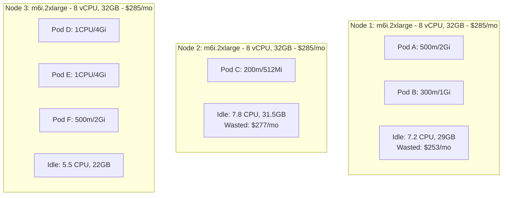
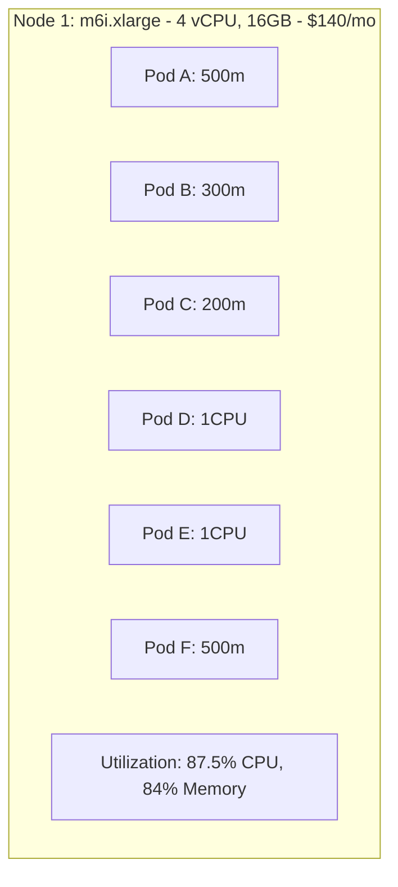
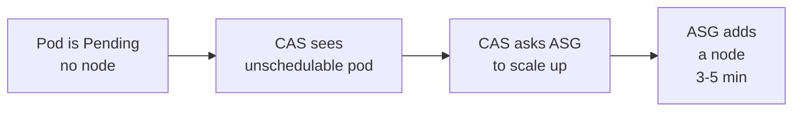
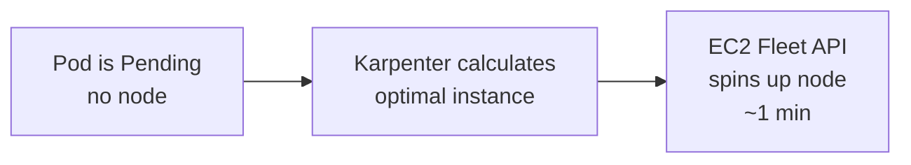

> **Discipline Module** | Complexity: `[COMPLEX]` | Time: 3h

## Prerequisites

Before starting this module:
- **Required**: [Module 1.3: Workload Rightsizing](../module-1.3-rightsizing/) — VPA, rightsizing workflows
- **Required**: Understanding of Kubernetes node pools and autoscaling
- **Required**: Familiarity with Karpenter or Cluster Autoscaler concepts
- **Recommended**: AWS experience (Karpenter examples use AWS terminology)
- **Recommended**: Understanding of EC2 instance types and pricing

---

## What You'll Be Able to Do

After completing this module, you will be able to:

- **Implement spot instance strategies for Kubernetes workloads with proper fault tolerance and interruption handling**
- **Design node pool architectures that mix instance types for optimal price-performance**
- **Configure cluster autoscaler policies that balance cost efficiency with workload availability requirements**
- **Evaluate compute pricing models — on-demand, reserved, spot, savings plans — for your workload patterns**

## Why This Module Matters

Module 1.3 taught you to rightsize individual workloads — giving each Pod exactly the resources it needs. But even with perfectly rightsized Pods, your cluster can still waste enormous amounts of money if the *nodes* underneath those Pods are inefficient.

Consider this scenario:

**Before Node Optimization:**


Total: 3 nodes × $285 = $855/mo
Utilization: ~15% CPU, ~14% memory

After optimization (consolidation + right-sized nodes):

**After Node Optimization:**


Total: 1 node × $140 = $140/mo
Savings: $715/mo (84% reduction)

This module covers the tools and strategies that make this consolidation happen automatically: **Karpenter, Cluster Autoscaler, Spot instances, bin-packing, and ARM migration**.

---

## Did You Know?

- **Karpenter can provision a new node in under 60 seconds** — compared to Cluster Autoscaler's typical 3-5 minutes. Karpenter talks directly to the EC2 API instead of going through Auto Scaling Groups, eliminating an entire layer of indirection.

- **AWS reports that customers using Graviton (ARM) instances save an average of 20% on compute costs** while getting up to 40% better price-performance. Since most containerized workloads are already compiled for multiple architectures (via multi-arch images), migrating to ARM is often as simple as changing a node selector.

- **Spot instance interruption rates vary dramatically by instance type.** While the average across all types is roughly 5-7% per month, some instance families (like older m5 types) see rates below 2%, while GPU instances can exceed 15%. Diversifying across multiple instance types and availability zones is the key to reliable Spot usage.

---

## Cluster Autoscaler vs Karpenter

### Cluster Autoscaler (CAS)

The original Kubernetes node autoscaler. Works with cloud provider Auto Scaling Groups (ASGs).

**Cluster Autoscaler Workflow:**



**How it works**:
1. Pods become `Pending` because no node has enough capacity
2. CAS detects pending pods and calculates which node group could fit them
3. CAS increases the desired count of the matching ASG
4. ASG launches a new EC2 instance
5. The instance joins the cluster and the pod is scheduled

**Limitations**:
- Must pre-define node groups (ASGs) with fixed instance types
- Can't mix instance types within a node group (without managed node groups)
- Slow: ASG → EC2 → kubelet bootstrap → ready = 3-5 minutes
- Scale-down is conservative (10+ minutes by default)
- No built-in Spot diversification

### Karpenter

The next-generation Kubernetes node provisioner. Replaces ASGs entirely.

**Karpenter Workflow:**



> **Stop and think**: How does the provisioning speed of Karpenter compared to Cluster Autoscaler change your approach to capacity planning and over-provisioning?

**How it works**:
1. Pods become `Pending`
2. Karpenter evaluates all pending pods' requirements (CPU, memory, GPU, architecture, topology)
3. Karpenter selects the optimal instance type from a pool of candidates
4. Karpenter calls the EC2 Fleet API directly (bypassing ASGs)
5. Node joins the cluster in ~60 seconds

**Advantages over CAS**:
- No pre-defined node groups needed
- Selects from hundreds of instance types automatically
- Bin-packs pods onto right-sized nodes
- Built-in Spot diversification and fallback
- Faster provisioning (EC2 Fleet API vs ASG)
- Native consolidation (replaces under-utilized nodes)

### Comparison

| Feature | Cluster Autoscaler | Karpenter |
|---------|-------------------|-----------|
| Node provisioning | Via ASGs (pre-defined) | Direct EC2 API (dynamic) |
| Instance selection | Fixed per node group | Dynamic, any compatible type |
| Provisioning speed | 3-5 minutes | ~60 seconds |
| Spot support | Manual ASG config | Built-in with fallback |
| Bin-packing | Basic (fits into existing groups) | Advanced (picks optimal size) |
| Consolidation | Scale-down only | Replace + consolidate |
| Multi-arch (ARM) | Separate node groups | Automatic with constraints |
| Cloud support | AWS, GCP, Azure | AWS (native), Azure (beta) |
| Maturity | Mature, battle-tested | Rapidly maturing (CNCF Sandbox) |

### When to Use Each

| Scenario | Recommendation |
|----------|---------------|
| AWS EKS cluster | Karpenter (first choice) |
| GKE cluster | Cluster Autoscaler (GKE Autopilot handles it) |
| AKS cluster | Cluster Autoscaler or Karpenter (Azure preview) |
| On-premises | Cluster Autoscaler (if supported by your platform) |
| Need maximum cost optimization | Karpenter (better bin-packing and Spot) |
| Want simplicity and stability | Cluster Autoscaler (simpler to understand) |

---

## Karpenter Deep Dive

### NodePool Configuration

Karpenter uses `NodePool` resources (formerly Provisioners) to define what kinds of nodes it can create:

```yaml
apiVersion: karpenter.sh/v1
kind: NodePool
metadata:
  name: default
spec:
  template:
    metadata:
      labels:
        team: shared
    spec:
      requirements:
        # Instance categories
        - key: karpenter.k8s.aws/instance-category
          operator: In
          values: ["c", "m", "r"]     # Compute, General, Memory optimized

        # Instance sizes (avoid tiny and huge)
        - key: karpenter.k8s.aws/instance-size
          operator: In
          values: ["medium", "large", "xlarge", "2xlarge"]

        # Capacity type — prefer Spot, fall back to On-Demand
        - key: karpenter.sh/capacity-type