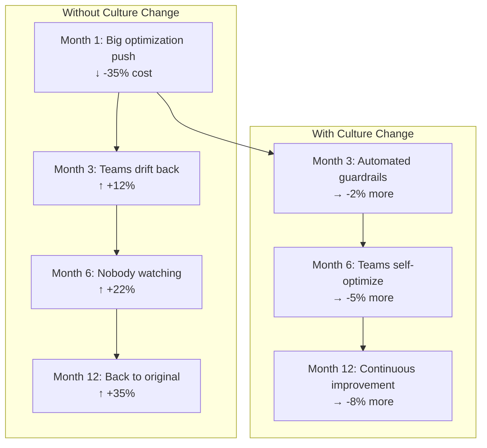
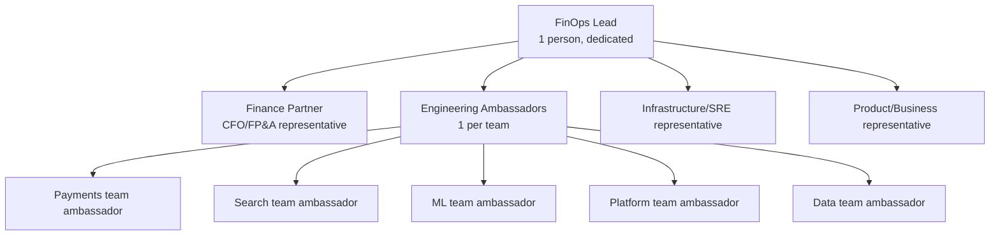
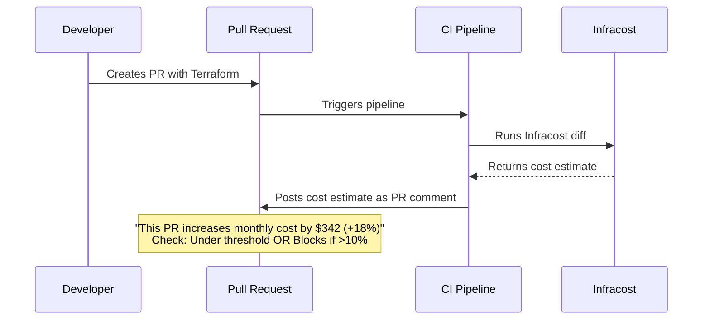
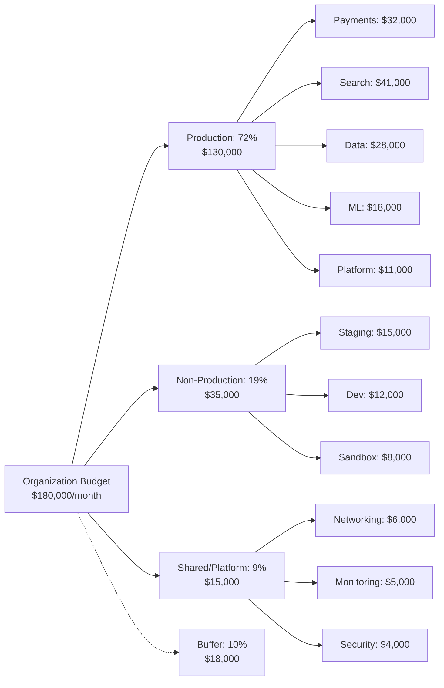

> **Discipline Module** | Complexity: `[MEDIUM]` | Time: 2h

## Prerequisites

Before starting this module:
- **Required**: [Module 1.5: Storage & Network Cost Management](../module-1.5-storage-network-costs/) — Completing the technical FinOps modules
- **Required**: Understanding of CI/CD pipelines (GitHub Actions, GitLab CI, or similar)
- **Required**: Basic Terraform familiarity (for Infracost exercise)
- **Recommended**: Experience with Infrastructure as Code workflows
- **Recommended**: Involvement in team budgeting or capacity planning

---

## What You'll Be Able to Do

After completing this module, you will be able to:

- **Lead organizational change that embeds cost awareness into engineering culture and daily practices**
- **Design gamification and incentive programs that motivate teams to optimize cloud spending**
- **Build cost review processes that integrate with sprint planning and architecture decision records**
- **Implement cost anomaly detection that alerts teams to unexpected spending changes before they compound**

## Why This Module Matters

You've learned the technical side of FinOps: cost allocation, rightsizing, compute optimization, storage and network management. Impressive. But here's the uncomfortable truth:

**Technical optimization without cultural change is temporary.**

You can rightsize every workload, migrate every volume to gp3, and add VPC endpoints everywhere — and six months later, costs will be right back where they started. Why? Because the *behaviors* that created the waste haven't changed. Developers will still over-provision. Teams will still spin up resources without tags. Nobody will look at the dashboards you built.

FinOps is 30% technology and 70% culture. This module covers the 70%.



> **Pause and predict**: If you ask an engineer to choose between shipping a feature a week early or saving $500 a month in cloud costs, which will they choose? How does a FinOps guild change this calculation?

---

## Did You Know?

- **The FinOps Foundation's 2024 survey found that the #1 challenge for FinOps practitioners is "getting engineers to take action"** — not tooling, not data quality, not executive support. 73% of respondents cited cultural adoption as harder than technical implementation.

- **Spotify runs a "Cost Insights" plugin in their internal developer portal (Backstage)** that shows every team their cloud costs alongside their service catalog. Engineers see cost data every time they open their service page — no separate dashboard required. This passive visibility has been credited with a 19% reduction in organic cost growth.

- **Etsy gamified cloud cost optimization by creating a "Cloud Leaderboard"** showing which teams had the best cost-per-request metrics. Teams competed to optimize, and the program saved over $2 million in its first year. The leaderboard cost nothing to build — it was just a Grafana dashboard.

---

## Building a FinOps Guild

### What Is a FinOps Guild?

A FinOps guild (or community of practice) is a cross-functional group that drives cost awareness across the organization. Unlike a centralized FinOps team that *does* the work, a guild *enables* others to do the work.



### Roles and Responsibilities

| Role | Responsibility | Time Commitment |
|------|---------------|-----------------|
| **FinOps Lead** | Own the practice, tooling, dashboards, reporting | Full-time or 50% |
| **Finance Partner** | Translate cloud costs to business metrics, budgeting | 4-6 hours/month |
| **Engineering Ambassadors** | Champion cost awareness in their team, review reports | 2-3 hours/month |
| **Infra/SRE Rep** | Technical optimization, tooling, automation | 8-10 hours/month |
| **Product Rep** | Connect cost to product value, prioritize optimization | 2-3 hours/month |

### Starting a Guild from Scratch

**Month 1: Foundation**
- Identify FinOps lead (can be part-time initially)
- Recruit one ambassador per engineering team
- Deploy basic cost visibility (OpenCost or Kubecost free tier)
- Send first monthly cost report (showback)

**Month 2-3: Awareness**
- Run first cost optimization sprint (pick top 5 waste items)
- Create team-level dashboards
- Start weekly Slack cost updates
- Celebrate wins publicly (people love seeing "Team X saved $800/month")

**Month 4-6: Habits**
- Integrate cost into sprint planning ("this feature will cost ~$X/month")
- Launch cost anomaly alerts
- Begin chargeback conversations
- Train ambassadors on cost optimization techniques

---

## Cost in CI/CD: Shift-Left FinOps

> **Stop and think**: Why is catching a $500/month architectural mistake in a pull request exponentially more valuable than catching it on a cloud bill 30 days later?

The cheapest time to catch a cost problem is before it's deployed. Infracost integrates into your Terraform/OpenTofu CI pipeline to estimate the cost of infrastructure changes *before they're applied*.

### How Infracost Works



### Infracost PR Comment Example

```markdown
## 💰 Infracost Cost Estimate

| Project | Previous | New | Diff |
|---------|----------|-----|------|
| production/eks | $1,847/mo | $2,189/mo | +$342 (+18.5%) |

### Cost Breakdown

| Resource | Monthly Cost | Change |
|----------|-------------|--------|
| aws_eks_node_group.workers | $1,420 → $1,762 | +$342 |
| (added 2× m6i.xlarge nodes) | | |

### Details
- Node group scaled from 5 to 7 instances
- Instance type: m6i.xlarge ($140.16/mo each)
- Consider: Could Karpenter autoscaling handle this instead?

⚠️ **This PR exceeds the 10% cost increase threshold.**
Approval from @finops-team required.
```

### GitHub Actions: Infracost with Cost Threshold

```yaml
# .github/workflows/infracost.yml
name: Infracost Cost Check

on:
  pull_request:
    paths:
      - 'terraform/**'
      - '*.tf'

permissions:
  contents: read
  pull-requests: write

jobs:
  infracost:
    runs-on: ubuntu-latest
    name: Infracost Cost Estimate

    steps:
      - name: Checkout base branch
        uses: actions/checkout@v4
        with:
          ref: ${{ github.event.pull_request.base.sha }}

      - name: Setup Infracost
        uses: infracost/actions/setup@v3
        with:
          api-key: ${{ secrets.INFRACOST_API_KEY }}

      - name: Generate base cost
        run: |
          infracost breakdown \
            --path=terraform/ \
            --format=json \
            --out-file=/tmp/infracost-base.json

      - name: Checkout PR branch
        uses: actions/checkout@v4

      - name: Generate PR cost diff
        run: |
          infracost diff \
            --path=terraform/ \
            --compare-to=/tmp/infracost-base.json \
            --format=json \
            --out-file=/tmp/infracost-diff.json

      - name: Post PR comment
        uses: infracost/actions/comment@v3
        with:
          path: /tmp/infracost-diff.json
          behavior: update

      - name: Check cost threshold
        run: |
          # Extract the cost difference (positive = increase, negative = decrease)
          DIFF=$(cat /tmp/infracost-diff.json | \
            jq -r '.diffTotalMonthlyCost // "0"')
          BASE=$(cat /tmp/infracost-diff.json | \
            jq -r '.pastTotalMonthlyCost // "1"')

          # Only check increases (skip if cost decreased)
          if [ "$(echo "$DIFF <= 0" | bc)" -eq 1 ]; then
            echo "Cost change: \$${DIFF}/mo (decrease or zero). No threshold check needed."
            exit 0
          fi

          # Calculate percentage increase
          if [ "$(echo "$BASE > 0" | bc)" -eq 1 ]; then
            PCT=$(echo "scale=1; ($DIFF / $BASE) * 100" | bc)
          else
            PCT="0"
          fi

          echo "Cost increase: ${PCT}%"

          # Fail if cost increase exceeds 10%
          THRESHOLD=10
          if [ "$(echo "$PCT > $THRESHOLD" | bc)" -eq 1 ]; then
            echo "::error::Cost increase of ${PCT}% exceeds ${THRESHOLD}% threshold"
            echo "This PR requires FinOps team approval."
            exit 1
          fi

          echo "Cost change within threshold."
```

### GitLab CI Alternative

```yaml
# .gitlab-ci.yml
infracost:
  stage: validate
  image: infracost/infracost:ci-latest
  script:
    - git checkout $CI_MERGE_REQUEST_TARGET_BRANCH_NAME
    - infracost breakdown --path=terraform/ --format=json --out-file=base.json
    - git checkout $CI_COMMIT_SHA
    - infracost diff --path=terraform/ --compare-to=base.json --format=json --out-file=diff.json
    - infracost comment gitlab --path=diff.json --gitlab-token=$GITLAB_TOKEN --repo=$CI_PROJECT_PATH --merge-request=$CI_MERGE_REQUEST_IID --behavior=update
  rules:
    - if: '$CI_PIPELINE_SOURCE == "merge_request_event"'
      changes:
        - terraform/**/*
```

---

## Cost Anomaly Detection

Anomaly detection catches unexpected cost spikes before they become budget-busting surprises.

### Types of Anomalies

| Anomaly Type | Example | Detection Method |
|-------------|---------|-----------------|
| **Spike** | Cost jumps 40% day-over-day | Threshold alerting |
| **Trend** | Gradual 5% weekly increase for 6 weeks | Trend analysis |
| **New resource** | Unfamiliar service appears on bill | Service allowlist |
| **Rate change** | RI expires, On-Demand kicks in | Commitment monitoring |
| **Data transfer** | Cross-region traffic surge | Network flow analysis |

### AWS Cost Anomaly Detection

```hcl
# Terraform: AWS Cost Anomaly Detection
resource "aws_ce_anomaly_monitor" "service_monitor" {
  name              = "service-cost-monitor"
  monitor_type      = "DIMENSIONAL"
  monitor_dimension = "SERVICE"
}

resource "aws_ce_anomaly_monitor" "team_monitor" {
  name         = "team-cost-monitor"
  monitor_type = "CUSTOM"
  monitor_specification = jsonencode({
    And = null
    Or  = null
    Not = null
    Tags = {
      Key          = "team"
      Values       = []
      MatchOptions = ["ABSENT"]
    }
  })
}

resource "aws_ce_anomaly_subscription" "alerts" {
  name = "cost-anomaly-alerts"
  frequency = "DAILY"

  monitor_arn_list = [
    aws_ce_anomaly_monitor.service_monitor.arn,
    aws_ce_anomaly_monitor.team_monitor.arn,
  ]

  subscriber {
    type    = "EMAIL"
    address = "finops-team@company.com"
  }

  subscriber {
    type    = "SNS"
    address = aws_sns_topic.cost_alerts.arn
  }

  threshold_expression {
    dimension {
      key           = "ANOMALY_TOTAL_IMPACT_ABSOLUTE"
      values        = ["100"]        # Alert if impact > $100
      match_options = ["GREATER_THAN_OR_EQUAL"]
    }
  }
}
```

### Prometheus-Based Anomaly Alerting (Kubernetes)

```yaml
# PrometheusRule for cost anomaly alerts
apiVersion: monitoring.coreos.com/v1
kind: PrometheusRule
metadata:
  name: finops-anomaly-alerts
  namespace: monitoring
spec:
  groups:
  - name: finops.anomalies
    rules:
    # Alert when namespace cost increases >30% vs 7-day average
    - alert: CostAnomalySpike
      expr: |
        (
          sum by (namespace) (
            kubecost_allocation_cpu_cost + kubecost_allocation_memory_cost
          )
          /
          avg_over_time(
            (sum by (namespace) (
              kubecost_allocation_cpu_cost + kubecost_allocation_memory_cost
            ))[7d:1h]
          )
        ) > 1.3
      for: 2h
      labels:
        severity: warning
        team: finops
      annotations:
        summary: "Cost anomaly: {{ $labels.namespace }} cost increased >30%"
        description: "Namespace {{ $labels.namespace }} cost is {{ $value | humanize }}x its 7-day average."

    # Alert when new untagged resources appear
    - alert: UntaggedResourcesGrowing
      expr: |
        count(kube_pod_labels{label_team=""}) > 10
      for: 1h
      labels:
        severity: warning
      annotations:
        summary: "{{ $value }} pods running without team label"
```

---

## Gamification and Incentives

Making cost optimization fun and competitive is surprisingly effective.

### The Cloud Cost Leaderboard

> **Monthly Cloud Efficiency Leaderboard**
> 
> **Team Rankings (Cost per 1K Requests)**
> 1. **Search Team**: $0.031/1K req (↓ 22% vs last mo)
> 2. **Payments Team**: $0.044/1K req (↓ 15% vs last mo)
> 3. **Platform Team**: $0.052/1K req (↓ 8% vs last mo)
> 4. **ML Pipeline**: $0.189/1K req (↓ 3% vs last mo)
> 5. **Data Team**: $0.210/1K req (↑ 5% vs last mo)
> 
> **Biggest Improver**: Search Team (-22%!)
> **Most Improved Resource**: `search-indexer` rightsizing
> 
> **Total org savings this month**: $4,280

### Gamification Ideas That Work

| Idea | How It Works | Cost to Implement |
|------|-------------|-------------------|
| **Efficiency Leaderboard** | Rank teams by cost-per-unit metric monthly | Grafana dashboard (free) |
| **Savings Spotlight** | Feature one team's optimization in company Slack | 5 minutes/week |
| **Cost Champion Badge** | Badge on internal profile for completing FinOps training | Internal tool update |
| **Optimization Bounty** | $50 gift card for each $500+/month savings identified | Minimal vs savings |
| **Waste Hunter Week** | Dedicated week where teams compete to find/fix waste | Team time only |
| **CFO Shoutout** | CFO mentions top saver in all-hands | Free, high impact |

### What NOT to Do

| Anti-pattern | Why It Fails |
|-------------|-------------|
| Publicly shame high-spending teams | Creates resentment, hides real costs |
| Reward absolute spend reduction | Penalizes growing teams, incentivizes under-investing |
| Individual bonuses for savings | Creates perverse incentives (cut needed resources) |
| Mandatory cost reports without context | Information without action = noise |
| Punishing cost overruns | Teams stop experimenting, innovation dies |

---

## Budgeting and Forecasting

### Setting Cloud Budgets



### Budget Alerts

```hcl
# Terraform: AWS Budget with alerts at multiple thresholds
resource "aws_budgets_budget" "team_payments" {
  name         = "payments-team-monthly"
  budget_type  = "COST"
  limit_amount = "32000"
  limit_unit   = "USD"
  time_unit    = "MONTHLY"

  cost_filter {
    name   = "TagKeyValue"
    values = ["user:team$payments"]
  }

  notification {
    comparison_operator       = "GREATER_THAN"
    threshold                 = 75
    threshold_type            = "PERCENTAGE"
    notification_type         = "FORECASTED"
    subscriber_email_addresses = ["payments-lead@company.com"]
  }

  notification {
    comparison_operator       = "GREATER_THAN"
    threshold                 = 90
    threshold_type            = "PERCENTAGE"
    notification_type         = "ACTUAL"
    subscriber_email_addresses = [
      "payments-lead@company.com",
      "finops@company.com"
    ]
  }

  notification {
    comparison_operator       = "GREATER_THAN"
    threshold                 = 100
    threshold_type            = "PERCENTAGE"
    notification_type         = "ACTUAL"
    subscriber_email_addresses = [
      "payments-lead@company.com",
      "finops@company.com",
      "vp-engineering@company.com"
    ]
  }
}
```

### Forecasting Techniques

| Technique | Accuracy | Complexity | Best For |
|-----------|----------|-----------|----------|
| **Linear extrapolation** | Low-medium | Simple | Stable, predictable workloads |
| **Moving average** | Medium | Simple | Gradually changing workloads |
| **Seasonal decomposition** | High | Medium | Workloads with weekly/monthly patterns |
| **ML-based (Prophet, etc.)** | High | Complex | Large datasets with multiple signals |
| **Commitment-adjusted** | High | Medium | Incorporating RI/SP changes |

---

## Communicating with Finance

### Speak Their Language

Engineers think in CPU cores and gigabytes. Finance thinks in dollars, margins, and ROI. You need to translate.

| Engineering Metric | Finance Translation |
|-------------------|-------------------|
| "We need 20 more CPU cores" | "We need $1,400/month more compute to handle 30% growth" |
| "Our p99 latency improved 40ms" | "Response time improvement retains ~2% more users ($50K ARR)" |
| "We rightsized 30 pods" | "We reduced infrastructure cost by $2,100/month without service impact" |
| "We migrated to Spot" | "We reduced compute costs 65% with <0.1% availability impact" |
| "Our cluster utilization is 18%" | "We're paying for 5.5x more capacity than we use — $110K annual waste" |

### The Monthly FinOps Business Review

> **Monthly FinOps Review — March 2026**
> 
> **Executive Summary:**
> - Total cloud spend: $172,400 (budget: $180,000) ✅ Under budget
> - Month-over-month change: +3.2% ($5,400)
> - Cost per customer: $0.68 (target: <$0.75) ✅ Target met
> - Savings realized this month: $8,300
> 
> **Key Wins:**
> - Payments team rightsizing: -$2,800/month (ongoing)
> - gp2 → gp3 migration: -$1,400/month (one-time, permanent)
> - Spot adoption for CI/CD: -$4,100/month (ongoing)
> 
> **Risks:**
> - ML training costs growing 12% month-over-month (investigating)
> - Untagged resources: $7,200/month (down from $9,800 — improving)
> 
> **Next Month Focus:**
> - Complete cross-AZ traffic optimization (est. -$3,000/month)
> - Begin Reserved Instance planning for Q3 commitments
> - Launch team cost dashboards in Backstage

### Finance Report Template

| KPI | This Month | Last Month | Trend |
|-----|------------|------------|-------|
| Total cloud spend | $172,400 | $167,000 | ↑ |
| Budget variance | -$7,600 | -$11,200 | ↑ |
| Cost per customer | $0.68 | $0.71 | ↓ |
| Revenue per customer | $4.20 | $4.15 | ↑ |
| Infra as % of revenue | 16.2% | 17.1% | ↓ |
| Savings this month | $8,300 | $5,100 | ↑ |
| RI/SP utilization | 87% | 82% | ↑ |
| Tagging compliance | 91% | 88% | ↑ |
| Waste (est.) | $22,100 | $29,400 | ↓ |

---

## Common Mistakes

| Mistake | Why It Happens | How to Fix It |
|---------|---------------|---------------|
| Making FinOps = cost cutting | Pressure from leadership | Frame as "cost efficiency" and unit economics, not austerity |
| No engineering buy-in | FinOps imposed top-down | Start with showback, empower teams with data |
| Overcomplicating cost models | Perfectionism in allocation | 80% accuracy is fine to start; iterate |
| Ignoring non-production costs | "It's just dev" | Dev/staging can be 20-30% of total spend |
| No automation in CI/CD | Manual reviews don't scale | Deploy Infracost and automate cost checks |
| Annual budgets for cloud | CapEx thinking applied to OpEx | Monthly budgets with quarterly re-forecasting |
| FinOps team owns all optimization | Bottleneck, single point of failure | Decentralize with ambassadors, centralize tooling |
| No celebration of wins | Optimization feels like a chore | Public recognition, leaderboards, CFO shoutouts |

---

## Quiz

### Question 1
You are the newly appointed FinOps Lead at a mid-sized SaaS company. The company ran a huge optimization push six months ago, but since then, costs have crept back up. You notice engineers never look at the cost dashboards you built in Grafana. How should you change your approach to ensure long-term cost awareness?

<details>
<summary>Show Answer</summary>

Passive dashboards require engineers to actively interrupt their workflow to seek out cost data, which rarely happens in practice. To change this behavior, you must bring the cost data directly to where engineers already work, such as embedding it in CI/CD pipeline PR comments or a developer portal (like Backstage). Additionally, introducing gamification like a team leaderboard taps into engineering competitiveness, making cost optimization a visible and social effort. Finally, shifting from a centralized team model to a guild model ensures that every engineering team has a local ambassador who champions these metrics. By making cost data unavoidable and actionable, you integrate it into the daily engineering culture rather than treating it as a separate chore.
</details>

### Question 2
A developer on the payments team opens a PR that adds 3 new `c6i.2xlarge` EC2 instances to a Terraform module. Infracost, running in your CI pipeline, estimates a $420/month increase (+18% for that module). Your organization's policy blocks PRs with a >10% cost increase. The developer complains that this is blocking an urgent feature launch. How should you handle this situation?

<details>
<summary>Show Answer</summary>

The automated block is functioning exactly as intended: it is designed to create a mandatory conversation, not to act as a permanent hard stop. Growth naturally requires spending, but the FinOps review ensures that this spending is intentional and optimized before resources are provisioned. You should engage with the developer to understand the architectural requirements and explore if cheaper alternatives like ARM-based Graviton instances or spot instances could meet their needs. If the instances are justified and optimized, you should approve the exception and document the rationale for the monthly business review. This process reinforces cost-conscious engineering without stalling necessary product delivery.
</details>

### Question 3
Your infrastructure team just completed a major initiative, migrating 40 stateless background worker pods to spot instances. When presenting this achievement to the CFO, how should you frame the update to ensure its business value is understood?

<details>
<summary>Show Answer</summary>

You must translate the technical achievement into financial and business impact because a CFO thinks in terms of risk, annualized savings, and margins, not pods or spot markets. Instead of discussing the underlying Kubernetes mechanics, you should state: 'We reduced our annual compute run rate by $74,400 by safely utilizing discounted spare capacity, all while maintaining our 99.97% service availability SLA.' This framing highlights the dollar amount over a long-term horizon, reassures them that customer experience (risk) was not compromised, and emphasizes that the optimization requires no ongoing engineering effort. By speaking the language of finance, you clearly demonstrate how the engineering team is directly improving the company's unit economics.
</details>

### Question 4
Your CTO wants to improve cloud cost efficiency and proposes hiring three dedicated FinOps engineers to form a central team that will handle all optimization tasks. You advocate for building a 'FinOps Guild' instead, with only one dedicated lead and ambassadors from each engineering team. Why is the guild model more effective for long-term cultural change?

<details>
<summary>Show Answer</summary>

A centralized FinOps team that executes all optimizations often becomes a bottleneck and inadvertently signals to developers that cost management is someone else's problem. When a separate team is responsible for cost, product engineers continue to prioritize speed over efficiency, leading to a constant game of catch-up where the FinOps team cleans up after the fact. In contrast, a guild model decentralizes ownership by embedding ambassadors directly within the engineering teams, fostering local accountability and cost awareness at the point of creation. The single dedicated FinOps lead focuses on providing the centralized tooling and visibility that the teams need to make their own informed decisions. This approach scales much better because it changes the engineering culture from the ground up rather than imposing optimization from the top down.
</details>

### Question 5
You want to introduce a 'Cloud Efficiency Leaderboard' to gamify cost optimization among your five engineering teams. The finance department suggests ranking the teams by 'Total Dollars Saved' this month. Why is this a dangerous metric, and what should you use instead?

<details>
<summary>Show Answer</summary>

Ranking teams by absolute 'Total Dollars Saved' or 'Lowest Total Spend' creates perverse incentives because it inherently penalizes rapidly growing teams while rewarding stagnant ones. A team supporting a highly successful, fast-growing product line will naturally spend more and might struggle to find massive absolute savings, whereas an over-provisioned legacy team could easily slash thousands of dollars. Instead, you should gamify efficiency metrics like 'Cost per 1,000 requests' or 'Cost per customer served' to ensure you are measuring the true business value of the infrastructure. Using unit economics ensures that teams are encouraged to architect their systems efficiently and scale responsibly, rather than simply starving their applications of necessary resources to win a contest.
</details>

---

## Hands-On Exercise: Infracost in a Terraform Pipeline

Set up Infracost to estimate costs of Terraform changes and enforce a cost threshold.

### Step 1: Install Infracost

```bash
# macOS
brew install infracost

# Linux
curl -fsSL https://raw.githubusercontent.com/infracost/infracost/master/scripts/install.sh | sh

# Verify installation
infracost --version
```

### Step 2: Register for API Key

```bash
# Register for a free API key (required for pricing data)
infracost auth login

# Or set manually if you already have one
# export INFRACOST_API_KEY="ico-your-key-here"
```

### Step 3: Create Sample Terraform

```bash
mkdir -p ~/finops-infracost-lab && cd ~/finops-infracost-lab

cat > main.tf << 'EOF'
terraform {
  required_providers {
    aws = {
      source  = "hashicorp/aws"
      version = "~> 5.0"
    }
  }
}

provider "aws" {
  region = "us-east-1"
}

# Base infrastructure — current state
resource "aws_instance" "api_server" {
  count         = 3
  ami           = "ami-0c55b159cbfafe1f0"
  instance_type = "m6i.large"

  tags = {
    Name        = "api-server-${count.index}"
    team        = "payments"
    environment = "production"
  }
}

resource "aws_instance" "worker" {
  count         = 2
  ami           = "ami-0c55b159cbfafe1f0"
  instance_type = "c6i.xlarge"

  tags = {
    Name        = "worker-${count.index}"
    team        = "payments"
    environment = "production"
  }
}

resource "aws_db_instance" "database" {
  allocated_storage    = 100
  engine               = "postgres"
  engine_version       = "15.4"
  instance_class       = "db.r6g.large"
  db_name              = "payments"
  skip_final_snapshot  = true

  tags = {
    team        = "payments"
    environment = "production"
  }
}

resource "aws_ebs_volume" "data" {
  count             = 3
  availability_zone = "us-east-1a"
  size              = 200
  type              = "gp3"

  tags = {
    team        = "payments"
    environment = "production"
  }
}
EOF

echo "Base Terraform configuration created."
```

### Step 4: Generate Base Cost Estimate

```bash
cd ~/finops-infracost-lab

# Generate baseline cost estimate
infracost breakdown --path=. --format=table

# Save JSON for later comparison
infracost breakdown --path=. --format=json --out-file=/tmp/base-cost.json

echo ""
echo "Base cost estimate generated."
```

### Step 5: Make a Cost-Increasing Change

```bash
cd ~/finops-infracost-lab

# Simulate a PR that adds more infrastructure
cat > scaling_change.tf << 'EOF'
# New resources added in this "PR"
resource "aws_instance" "search_server" {
  count         = 4
  ami           = "ami-0c55b159cbfafe1f0"
  instance_type = "c6i.2xlarge"

  tags = {
    Name        = "search-server-${count.index}"
    team        = "search"
    environment = "production"
  }
}

resource "aws_elasticache_cluster" "search_cache" {
  cluster_id           = "search-cache"
  engine               = "redis"
  node_type            = "cache.r6g.large"
  num_cache_nodes      = 3
  parameter_group_name = "default.redis7"
}

resource "aws_nat_gateway" "main" {
  allocation_id = "eipalloc-placeholder"
  subnet_id     = "subnet-placeholder"

  tags = {
    Name = "main-nat"
  }
}
EOF

echo "Scaling change created (simulating a PR)."
```

### Step 6: Generate Cost Diff

```bash
cd ~/finops-infracost-lab

# Generate diff against baseline
infracost diff --path=. --compare-to=/tmp/base-cost.json --format=table

# Save JSON diff
infracost diff --path=. --compare-to=/tmp/base-cost.json --format=json --out-file=/tmp/cost-diff.json
```

### Step 7: Enforce Cost Threshold

```bash
cat > ~/finops-infracost-lab/check_threshold.sh << 'SCRIPT'
#!/bin/bash
THRESHOLD_PCT=10
DIFF_FILE="/tmp/cost-diff.json"

if [ ! -f "$DIFF_FILE" ]; then
  echo "ERROR: Diff file not found. Run infracost diff first."
  exit 1
fi

# Extract costs
PAST_COST=$(cat "$DIFF_FILE" | python3 -c "
import json, sys
data = json.load(sys.stdin)
past = data.get('pastTotalMonthlyCost', '0')
print(past if past else '0')
" 2>/dev/null)

NEW_COST=$(cat "$DIFF_FILE" | python3 -c "
import json, sys
data = json.load(sys.stdin)
new = data.get('totalMonthlyCost', '0')
print(new if new else '0')
" 2>/dev/null)

DIFF_COST=$(cat "$DIFF_FILE" | python3 -c "
import json, sys
data = json.load(sys.stdin)
diff = data.get('diffTotalMonthlyCost', '0')
print(diff if diff else '0')
" 2>/dev/null)

echo "============================================"
echo "  Cost Threshold Check"
echo "============================================"
echo ""
echo "Previous monthly cost: \$$PAST_COST"
echo "New monthly cost:      \$$NEW_COST"
echo "Difference:            \$$DIFF_COST"

if [ "$(echo "$PAST_COST > 0" | bc)" -eq 1 ]; then
  PCT=$(echo "scale=1; ($DIFF_COST / $PAST_COST) * 100" | bc 2>/dev/null)
  echo "Percentage change:     ${PCT}%"
  echo "Threshold:             ${THRESHOLD_PCT}%"
  echo ""

  if [ "$(echo "$PCT > $THRESHOLD_PCT" | bc)" -eq 1 ]; then
    echo "❌ FAILED: Cost increase of ${PCT}% exceeds ${THRESHOLD_PCT}% threshold."
    echo ""
    echo "Actions required:"
    echo "  1. Review if all new resources are necessary"
    echo "  2. Check for cheaper alternatives (Spot, ARM, smaller instances)"
    echo "  3. Get FinOps team approval before merging"
    exit 1
  else
    echo "✅ PASSED: Cost change within acceptable threshold."
  fi
else
  echo "No base cost for comparison (new infrastructure)."
  echo "✅ PASSED: New infrastructure, no threshold to compare."
fi
SCRIPT

chmod +x ~/finops-infracost-lab/check_threshold.sh
bash ~/finops-infracost-lab/check_threshold.sh
```

### Step 8: Cleanup

```bash
rm -rf ~/finops-infracost-lab
```

### Success Criteria

You've completed this exercise when you:
- [ ] Installed Infracost and obtained an API key
- [ ] Created a base Terraform configuration with cost estimate
- [ ] Added new resources simulating a cost-increasing PR
- [ ] Generated a cost diff showing the increase
- [ ] Ran the threshold check script and saw it fail (>10% increase)
- [ ] Understood how this integrates into GitHub Actions or GitLab CI

---

## Key Takeaways

1. **FinOps is 70% culture, 30% technology** — tools without behavior change produce temporary savings
2. **Build a guild, not a team** — decentralize ownership, centralize tooling
3. **Shift cost left into CI/CD** — Infracost catches expensive changes before deployment
4. **Gamification works** — leaderboards and recognition drive optimization naturally
5. **Speak finance's language** — dollars, margins, and ROI, not CPU cores and gigabytes
6. **Automate everything** — anomaly detection, budget alerts, and cost thresholds prevent surprises

---

## Further Reading

**Books**:
- **"Cloud FinOps"** — J.R. Storment & Mike Fuller (O'Reilly, 2nd edition)
- **"Team Topologies"** — Matthew Skelton & Manuel Pais (for org design that supports FinOps)

**Tools**:
- **Infracost** — infracost.io (cost estimation for Terraform in CI/CD)
- **Backstage Cost Insights** — backstage.io/docs/features/cost-insights (developer portal cost plugin)
- **AWS Cost Anomaly Detection** — docs.aws.amazon.com/cost-management

**Talks**:
- **"Building a FinOps Culture"** — FinOps X Conference (YouTube)
- **"How We Saved $5M with Cloud Cost Engineering"** — Spotify, QCon (YouTube)
- **"Infracost: Cloud Cost Estimates for Terraform"** — HashiConf (YouTube)

---

## Summary

Technical FinOps without cultural FinOps is a project. Technical FinOps *with* cultural FinOps is a practice. By building a FinOps guild with engineering ambassadors, embedding cost into CI/CD pipelines via Infracost, automating anomaly detection and budget alerts, gamifying optimization through leaderboards, and communicating in finance's language, organizations transform cloud cost management from a periodic cleanup into a continuous, self-sustaining discipline. The result: costs stay optimized not because someone is watching, but because everyone is.

---

## Next Steps

You've completed the FinOps discipline track. To continue your learning:

- **Review the FinOps modules** for a summary of all topics and additional resources
- **Apply what you've learned** — start with Module 1.1's exercise on your own cloud bill
- **Join the FinOps Foundation** at finops.org for community, certifications, and frameworks
- **Explore related disciplines**: [SRE](/platform/disciplines/core-platform/sre/), [Platform Engineering](/platform/disciplines/core-platform/platform-engineering/), [GitOps](/platform/disciplines/delivery-automation/gitops/)

---

*"Culture eats cost optimization for breakfast."* — Adapted from Peter Drucker