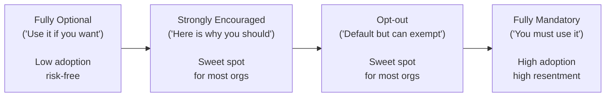
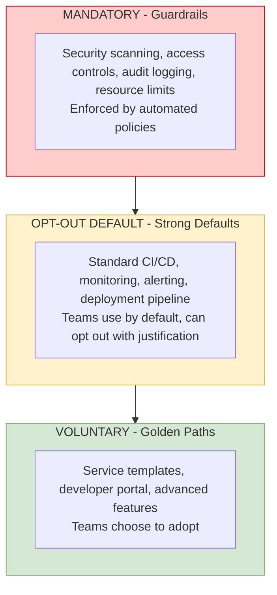
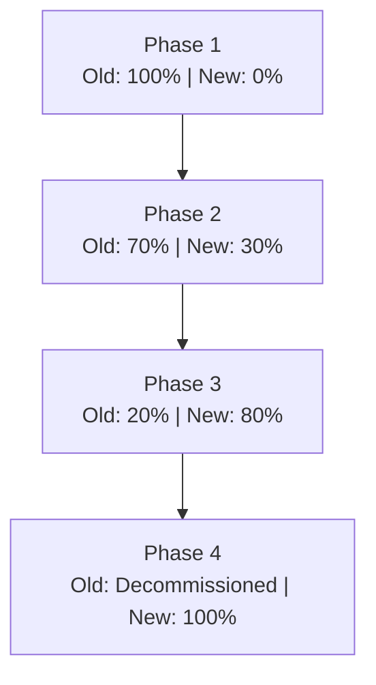
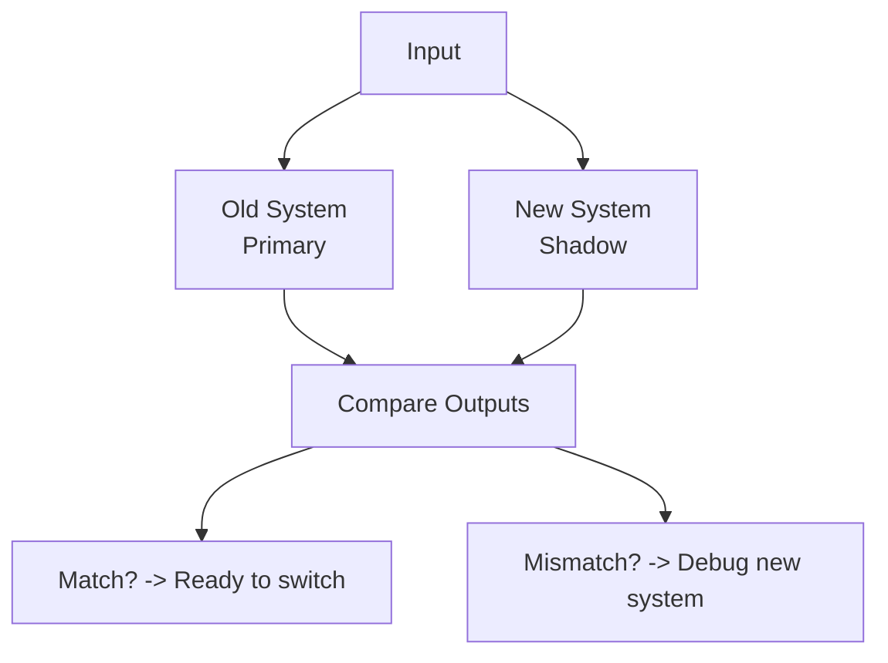
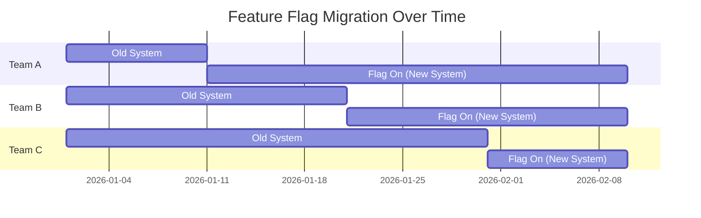

> **Discipline Module** | Complexity: `[ADVANCED]` | Time: 55-65 min

## Prerequisites

Before starting this module:
- **Required**: [Module 1.3: Platform as Product](/platform/disciplines/core-platform/leadership/module-1.3-platform-as-product/) — Product management, user research, roadmapping
- **Required**: [Module 1.2: Developer Experience Strategy](/platform/disciplines/core-platform/leadership/module-1.2-developer-experience/) — DX measurement, golden paths
- **Recommended**: [SRE: Toil and Automation](/platform/disciplines/core-platform/sre/module-1.4-toil-automation/) — Understanding repetitive work and automation ROI
- **Recommended**: Experience with organizational change or system migrations

---

## What You'll Be Able to Do

After completing this module, you will be able to:

- **Design migration strategies that move teams to the platform incrementally with minimal disruption**
- **Implement adoption tracking dashboards that identify teams struggling with platform onboarding**
- **Build champion programs that turn early adopters into advocates who accelerate platform adoption**
- **Lead organizational change management for platform migrations spanning hundreds of services**

## Why This Module Matters

In 2020, a healthcare technology company mandated that all 35 development teams migrate to their new Kubernetes-based platform within 6 months. They sent an email, set a deadline, and waited.

At the 6-month mark, 8 teams had migrated. The other 27 had not started. Some cited competing priorities. Some were afraid of breaking production during migration. Some had tried and hit blockers that were never resolved. Three teams had quietly built their own deployment systems to avoid the mandate entirely.

The platform team was furious. "We built exactly what they asked for. Why won't they use it?"

The answer was simple: **building a platform and getting people to use it are completely different skills.** The platform was technically sound. The migration strategy was not a strategy at all — it was a deadline with no plan, no support, and no understanding of what migration actually costs the migrating team.

This module teaches you how to drive adoption and manage migrations without mandates, ultimatums, or organizational warfare. You will learn patterns that work and patterns that create resentment.

---

## Did You Know?

> Geoffrey Moore's "Crossing the Chasm" — the seminal book about technology adoption — applies directly to internal platforms. The gap between early adopters (enthusiastic teams who try anything new) and the early majority (pragmatic teams who wait for proof) is where most platform adoption stalls. If you only reach the enthusiasts, you have not succeeded.

> A 2023 survey by the Platform Engineering Community found that **62% of platform teams cite adoption as their biggest challenge** — more than technical complexity (41%), funding (38%), or staffing (35%). Building the platform is the easy part.

> The "strangler fig" pattern — gradually replacing a legacy system by routing traffic to the new system piece by piece — was named by Martin Fowler after the strangler fig tree, which grows around an existing tree and eventually replaces it entirely. It is the safest migration pattern because the old system remains functional throughout.

> Research on organizational change (Kotter, 1995) found that **70% of major change initiatives fail**, usually because leaders underestimate the effort required to change habits. Platform migrations are change initiatives, not technical projects. Treat them accordingly.

---

> **Stop and think**: If you were forced to migrate to a new tool with a tight deadline and no support, how would you react? How would that impact your trust in the tool creators?

## Adoption Models: Voluntary vs Mandatory

### The Adoption Spectrum



### When Each Model Is Appropriate

| Model | When to Use | Risks |
|-------|-------------|-------|
| **Fully optional** | New features, experimental capabilities | Low adoption, may never reach critical mass |
| **Strongly encouraged** | Core platform services, golden paths | Some teams will ignore encouragement |
| **Opt-out default** | Security/compliance features, standard tooling | Resentment from teams that want exceptions |
| **Fully mandatory** | Regulatory requirements, security baselines | High resentment, shadow IT, reduced trust |

### The Hybrid Approach (Recommended)

Most successful platforms use a layered model:



---

> **Pause and predict**: If a "Big Bang" migration fails, what is the immediate impact on the organization? Why might a phased approach mitigate this?

## Migration Patterns

### Pattern 1: Strangler Fig

**How it works**: Gradually route functionality from the old system to the new system. The old system continues to work but handles less and less until it can be decommissioned.



**When to use**: Most migrations. Lowest risk. Allows learning and adjustment during migration.

**Platform example**: Migrating from Jenkins to a new CI system. Start by running both in parallel. New services use the new system. Existing services migrate one at a time. Jenkins is decommissioned when the last service migrates.

**Key success factor**: The old system must continue to work reliably while migration is in progress. Do not neglect maintenance of the old system just because you are excited about the new one.

### Pattern 2: Parallel Run

**How it works**: Both systems run simultaneously with the same inputs. Compare outputs to verify the new system is correct before switching.



**When to use**: Critical systems where correctness must be verified. Payment processing, data pipelines, authentication.

**Platform example**: Migrating from one monitoring system to another. Run both in parallel. Alert when they disagree. Switch to the new system only when they agree for 30 days.

**Key success factor**: The comparison mechanism must be automated. Manual comparison does not scale.

### Pattern 3: Big Bang

**How it works**: Switch everyone to the new system at once on a specific date.

**When to use**: Almost never. Only when:
- The old system is being decommissioned by a vendor
- Regulatory deadline requires it
- The systems are incompatible and cannot run in parallel
- The migration is simple enough that risk is low

**Risks**: Everything breaks at once. Rollback is difficult or impossible. Every team's workflow is disrupted simultaneously.

**If you must do a big bang**:
- Practice with a full rehearsal in a staging environment
- Have a detailed rollback plan
- Schedule during lowest-traffic period
- Staff extra support for the first week
- Communicate obsessively (daily countdown, what to expect, who to contact)

### Pattern 4: Feature Flag Migration

**How it works**: Use feature flags to gradually shift teams from old to new system. Each team (or percentage of traffic) can be individually toggled.



**When to use**: Platform services that can be toggled per-team. Deployment pipelines, monitoring integrations, DNS routing.

**Key success factor**: Robust feature flag infrastructure. The ability to quickly toggle back if problems arise.

---

> **Stop and think**: When a team says "we don't have time to migrate," what underlying concerns might they actually be expressing?

## Dealing with Holdouts and Legacy Teams

### Why Teams Resist Migration

Understanding resistance is the first step to overcoming it. Common reasons:

| Reason | What They Say | What They Mean |
|--------|--------------|----------------|
| **Risk** | "We can't afford downtime" | "I don't trust the new system" |
| **Effort** | "We don't have capacity" | "This is not my team's priority" |
| **Comfort** | "Our current setup works fine" | "I don't want to learn something new" |
| **Bad experience** | "We tried last time and it broke" | "I don't trust your team" |
| **Legitimate concern** | "Our use case is unique" | "Your platform genuinely doesn't support our needs" |
| **Political** | "We need to evaluate options" | "I want to build my own thing" |

### Strategies for Each Type of Resistance

**For risk-averse teams**:
- Offer to do the migration for them (white-glove service)
- Start with a non-critical service as proof
- Provide an instant rollback mechanism
- Share data from other teams' migrations (incidents, downtime)

**For capacity-constrained teams**:
- Build migration tooling that minimizes their effort
- Offer embedded platform engineer support for 1-2 weeks
- Time migration around their lower-pressure periods
- Quantify the ongoing cost of NOT migrating (maintenance burden on old system)

**For comfortable teams**:
- Show them what they are missing (faster deploys, better monitoring)
- Create FOMO through internal marketing (success stories from other teams)
- Do not force them — they will come around when peers demonstrate value

**For teams with bad past experiences**:
- Acknowledge the past failure honestly
- Explain what is different this time (specific changes)
- Offer a trial period with explicit opt-out
- Build trust through small wins before asking for the big migration

**For teams with legitimate concerns**:
- Listen. They may be right.
- Add their use case to the platform roadmap if it affects multiple teams
- If their needs are truly unique, agree on a supported exception path
- Do not pretend the platform supports something it does not

**For politically resistant teams**:
- Escalate to leadership only as a last resort
- Focus on making the platform so good that resistance looks unreasonable
- Find an ally on the resistant team (there is usually one person who wants to migrate)
- Be patient — political resistance dissolves when peer teams succeed visibly

---

> **Pause and predict**: How might offering to pay the AWS bill for teams on the new platform influence their desire to migrate?

## Incentive Design for Adoption

### The Carrot Is Better Than the Stick

Mandates create compliance. Incentives create adoption. The difference matters.

| Approach | Short-term Effect | Long-term Effect |
|----------|-------------------|-----------------|
| **Mandate** | High compliance | Resentment, shadow IT, loss of trust |
| **Deadline** | Urgency | Rushed migrations, quality issues |
| **Incentive** | Moderate initial adoption | Sustained adoption, goodwill |
| **Social proof** | Moderate adoption | Organic growth, peer influence |
| **Making it easy** | High adoption | Permanent behavior change |

### Effective Incentives for Platform Adoption

| Incentive | How It Works | Example |
|-----------|-------------|---------|
| **Reduced toil** | Migrated teams get automation that non-migrated teams don't | "On the new platform, deploys are 1 click. On the old, it's still 12 steps." |
| **Better support** | Platform team prioritizes support for teams on the platform | "Teams on the platform get SLA-backed support. Old system is best-effort." |
| **Featured in demos** | Public recognition for early adopters | Monthly demo day showcases teams using new capabilities |
| **Priority access** | Early adopters get first access to new features | Beta program for platform features |
| **Budget relief** | Old infrastructure costs charged to teams that stay on it | "The old CI system costs $X/month. Migrated teams don't pay." |
| **Removal of friction** | Migrate for them where possible | Automated migration tooling that does 80% of the work |

### The Sunset Strategy

If you need teams off the old system, sunset it gradually:

```
Month 0:  Announce sunset timeline. New system available.
          "Old system supported until Month 12."

Month 3:  Reduce support for old system.
          "Old system: community support only. No SLA."

Month 6:  Stop adding features to old system.
          "No new integrations for old CI. All new work on new CI."

Month 9:  Begin decomissioning old system infrastructure.
          "Old system: read-only access to build history."

Month 12: Decommission old system.
          "Old system offline. Migration assistance available."
```

**Critical rule**: Never decommission the old system before you have migrated (or explicitly exempted) every team. Surprise decommissions destroy trust permanently.

---

## Communication Strategies for Platform Changes

### The Communication Matrix

Different changes require different communication strategies:

| Change Type | Audience | Channel | Timing | Tone |
|------------|----------|---------|--------|------|
| **Breaking change** | All platform users | Email + Slack + meeting | 4+ weeks advance | Serious, detailed |
| **New feature** | All platform users | Slack + changelog + demo | At launch | Excited, practical |
| **Deprecation** | Affected teams directly | Email + Slack DM | 8+ weeks advance | Empathetic, helpful |
| **Incident** | All platform users | Slack #incidents | Real-time | Factual, calm |
| **Roadmap update** | All platform users | Monthly newsletter | Monthly | Strategic, transparent |
| **Migration guide** | Migrating teams | Documentation + workshop | As needed | Step-by-step, supportive |

### The Breaking Change Protocol

Breaking changes are where platform teams lose the most trust. Follow this protocol:

```
Breaking Change Communication Plan
════════════════════════════════════

Week -8: Discovery
  [ ] Identify all affected teams and services
  [ ] Quantify migration effort per team
  [ ] Create migration guide and tooling
  [ ] Identify highest-risk teams

Week -6: Announcement
  [ ] Email to all platform users with:
      - What is changing
      - Why it is changing
      - Who is affected
      - What they need to do
      - Timeline
      - Where to get help
  [ ] Slack announcement in #platform
  [ ] Offer 1:1 meetings with high-risk teams

Week -4: Support
  [ ] Workshop for teams that need help
  [ ] Migration office hours (weekly)
  [ ] Track migration progress per team
  [ ] Identify and unblock stuck teams

Week -2: Final push
  [ ] Contact non-migrated teams directly
  [ ] Offer white-glove migration assistance
  [ ] Confirm rollback plan if needed

Week 0: Change goes live
  [ ] Monitor for issues
  [ ] Rapid response team on standby
  [ ] Post-change verification with affected teams

Week +1: Retrospective
  [ ] Survey affected teams
  [ ] Document lessons learned
  [ ] Update communication template
```

### Managing Organizational Resistance

When resistance is not about technology but about organizational dynamics:

**The ADKAR Model** (a change management framework):

| Stage | Question | Platform Application |
|-------|----------|---------------------|
| **A**wareness | "Do they know why we're changing?" | Explain the business case, not just the tech |
| **D**esire | "Do they want to change?" | Show personal benefit, not just org benefit |
| **K**nowledge | "Do they know how to change?" | Training, documentation, support |
| **A**bility | "Can they actually do it?" | Time, tools, migration assistance |
| **R**einforcement | "Will they stick with it?" | Celebrate wins, remove old system |

**Most platform teams skip Awareness and Desire**, jumping straight to Knowledge ("here's the docs") and Ability ("here's the migration tool"). But if people do not understand why they are changing and do not want to change, knowledge and ability are irrelevant.

---

## Hands-On Exercises

### Exercise 1: Migration Strategy Design (45 min)

Design a migration strategy for a realistic scenario:

**Scenario**: Your organization has 20 development teams using Jenkins (self-hosted). You have built a new CI/CD platform based on GitHub Actions + ArgoCD. You need to migrate all 20 teams.

**Step 1**: Choose a migration pattern
```
Selected pattern: [ ] Strangler Fig  [ ] Parallel Run
                  [ ] Big Bang       [ ] Feature Flag
Justification:
```

**Step 2**: Design the migration timeline
```
Phase 1 (Month 1-2): _______________
  Teams: [which teams and why?]
  Success criteria: _______________

Phase 2 (Month 3-4): _______________
  Teams: [which teams and why?]
  Success criteria: _______________

Phase 3 (Month 5-6): _______________
  Teams: [which teams and why?]
  Success criteria: _______________

Sunset (Month 7-9): _______________
  Old system: _______________
```

**Step 3**: Identify risks
```
Risk 1: _______________
  Mitigation: _______________

Risk 2: _______________
  Mitigation: _______________

Risk 3: _______________
  Mitigation: _______________
```

**Step 4**: Design the communication plan using the breaking change protocol above.

### Exercise 2: Resistance Role Play (30 min)

Practice handling the 6 types of resistance. For each scenario, write your response:

**Scenario A** (risk-averse): "We handle patient data. We can't afford any downtime during migration."
Your response: _______________

**Scenario B** (capacity-constrained): "We're 3 weeks from our product launch. We can't migrate now."
Your response: _______________

**Scenario C** (comfortable): "Our setup works fine. We've been using it for 3 years."
Your response: _______________

**Scenario D** (bad experience): "Last time we migrated to your platform, we had 4 hours of downtime."
Your response: _______________

**Scenario E** (legitimate concern): "We use custom build steps that your new platform doesn't support."
Your response: _______________

**Scenario F** (political): "We've evaluated GitHub Actions and we prefer GitLab CI. We want to use our own."
Your response: _______________

For each response, check:
- [ ] Did you acknowledge their concern?
- [ ] Did you avoid dismissing their feelings?
- [ ] Did you offer a concrete next step?
- [ ] Did you avoid using authority or mandates?

### Exercise 3: Adoption Metrics Dashboard (30 min)

Design a dashboard that tracks platform adoption:

```
PLATFORM ADOPTION DASHBOARD - [Platform Name]
═══════════════════════════════════════════════

Overall Adoption
  Teams on platform: ___/___  (___%)
  Services on platform: ___/___  (___%)
  Deploys via platform (last 30d): ___/___  (___%)

Adoption Trend (weekly)
  Week 1: ___%
  Week 2: ___%
  Week 3: ___%
  Week 4: ___%
  Trend: [ ] Growing  [ ] Flat  [ ] Declining

Migration Health
  Teams migrated this month: ___
  Teams in-progress: ___
  Teams blocked: ___
  Average migration time: ___ days

Adoption by Team
  ┌────────────────┬──────────┬──────────┬──────────┐
  │ Team           │ Status   │ Services │ Blockers │
  ├────────────────┼──────────┼──────────┼──────────┤
  │                │          │          │          │
  └────────────────┴──────────┴──────────┴──────────┘

Satisfaction (migrated teams)
  Overall: ___/5
  Migration experience: ___/5
  Platform reliability: ___/5
  Support quality: ___/5
```

Identify which metrics you would check daily vs weekly vs monthly.

### Exercise 4: ADKAR Assessment (20 min)

For your current or planned platform migration, assess each ADKAR stage:

```
ADKAR Assessment - [Migration Name]
═════════════════════════════════════

AWARENESS (Do teams know why we're changing?)
  Score (1-5): ___
  Evidence: _______________
  Gap: _______________
  Action: _______________

DESIRE (Do teams want to change?)
  Score (1-5): ___
  Evidence: _______________
  Gap: _______________
  Action: _______________

KNOWLEDGE (Do teams know how to change?)
  Score (1-5): ___
  Evidence: _______________
  Gap: _______________
  Action: _______________

ABILITY (Can teams actually do it?)
  Score (1-5): ___
  Evidence: _______________
  Gap: _______________
  Action: _______________

REINFORCEMENT (Will teams stick with it?)
  Score (1-5): ___
  Evidence: _______________
  Gap: _______________
  Action: _______________

Weakest stage: _______________
Priority action: _______________
```

---

## War Story: The Migration That Almost Killed the Platform Team

**Company**: Online marketplace, ~250 engineers, Series E

**Situation**: The platform team had built a new deployment system to replace a 5-year-old homegrown tool called "Ship" that everyone loved but nobody could maintain (the original author had left 2 years ago). The new system was objectively better: faster, more reliable, better monitoring, and built on standard tools (ArgoCD + Kustomize) instead of custom scripts.

**The plan**: Migrate all 18 teams in 4 months. Mandatory.

**What happened**:

**Month 1**: Platform team sent the migration guide (a 23-page document) and a deadline. Three enthusiastic teams migrated in week 1. Two hit blockers (missing features they used in Ship) and filed bugs. One team's migration caused a 2-hour production outage because the new system handled database migrations differently.

**Month 2**: Word of the outage spread. Six teams that had planned to migrate paused "until it's stable." The two teams with blockers were angry — they had migrated in good faith and were now stuck. The platform team was heads-down fixing bugs and had no time for communication.

**Month 3**: Engineering leadership asked for a status update. 5 teams migrated (28%), 2 stuck with blockers, 11 had not started. The CTO was unhappy. The platform team's morale was low. Two platform engineers updated their LinkedIn profiles.

**The pivot**:

The engineering director stepped in and made three changes:

1. **Paused the mandate**: "Nobody is forced to migrate until we fix the blockers and provide proper support."
2. **Assigned a migration buddy**: Each migrating team got a platform engineer embedded for 1 week.
3. **Built automated migration tooling**: A script that converted Ship configs to ArgoCD configs, handling 90% of the work automatically.

**Month 4-5** (after pivot):
- Fixed all blockers from the stuck teams
- Migration buddies helped 6 more teams migrate with zero incidents
- Automated tooling reduced migration effort from 2 weeks to 2 days
- Published success metrics from migrated teams: 60% faster deploys, 40% fewer incidents

**Month 6**: 15 out of 18 teams migrated (83%). The remaining 3 had legitimate edge cases that the platform team was working to support.

**Month 8**: 18/18 teams migrated. Ship was decommissioned. Developer satisfaction with deployment tools: 4.1/5 (up from 3.2/5).

**Business impact**: The 2-month delay cost approximately $400K in engineering time and one platform engineer who left during Month 3. But the forced pause and pivot saved the platform program from failure.

**Lessons**:
1. **Mandates without support are empty threats**: A deadline without migration tooling, embedded support, and fixed blockers is just a date on a calendar
2. **First migrations set the tone**: The outage in Month 1 poisoned adoption for months. Invest heavily in making early migrations flawless
3. **Communication vacuum fills with fear**: When the platform team went silent in Month 2, developers filled the silence with worst-case assumptions
4. **Automated migration tooling is not optional**: If migration takes 2 weeks of developer effort, most teams will not do it voluntarily
5. **Pause and fix is better than push through**: The 2-month pause felt like failure in the moment but saved the program

---

## Knowledge Check

### Question 1
**Scenario**: Your platform team needs to migrate 50 development teams from a legacy on-premise logging stack to a new cloud-native observability platform. The legacy system frequently drops logs, and the new system has a fundamentally different query language. You want to minimize risk while ensuring teams can learn the new system incrementally. Which migration pattern should you select, and how would you apply it here?

<details>
<summary>Show Answer</summary>

You should select the Strangler Fig pattern for this scenario. This approach allows you to gradually route functionality—such as onboarding one service or team at a time to the new observability platform—while the legacy system remains functional for the rest. By doing this, you drastically reduce the risk of a widespread outage if the new system experiences issues under load. Furthermore, teams can learn the new query language incrementally rather than being forced into a disruptive "Big Bang" switch, allowing your platform team to gather feedback and refine training materials as the migration progresses.

</details>

### Question 2
**Scenario**: You are meeting with the lead of the payment processing team to discuss their migration to the new standard CI/CD pipeline. The lead crosses their arms and says, "We tried migrating to your beta pipeline last year, and it caused a 4-hour production outage during our busiest period. We cannot afford that risk again." What is your immediate response strategy to rebuild trust?

<details>
<summary>Show Answer</summary>

You must first honestly acknowledge the past failure and validate their concern without being defensive, as dismissing their experience will instantly destroy any remaining trust. Next, clearly articulate exactly what technical and procedural safeguards have changed since that incident, providing concrete evidence that the platform is now stable. You should then offer a low-risk trial, such as migrating a non-critical internal service first, coupled with a guaranteed, instant rollback path. Finally, provide them with dedicated, white-glove support (like an embedded platform engineer) during their migration to demonstrate your commitment to their success and safety.

</details>

### Question 3
**Scenario**: The CTO wants to send a company-wide email stating that all teams MUST adopt the new internal developer portal within 30 days. You advise against a "fully mandatory" approach, suggesting instead a "strongly encouraged" model with incentives. How do you justify this recommendation to the CTO?

<details>
<summary>Show Answer</summary>

A "strongly encouraged" model preserves team autonomy while motivating adoption through clear incentives, whereas strict mandates typically breed resentment and malicious compliance. When you mandate adoption without considering the specific context or workload of individual teams, developers often resort to building "shadow IT" to bypass poorly fitting tools. Furthermore, if teams adopt the platform voluntarily because of its merits (such as reduced toil or better support), their adoption serves as a genuine signal of the platform's quality. In contrast, 100% mandated compliance provides zero useful feedback about whether the platform actually solves real developer problems. Mandatory policies should be strictly reserved for non-negotiable security and compliance guardrails.

</details>

### Question 4
**Scenario**: You have provided excellent documentation, automated migration scripts, and dedicated office hours for the move to a new Kubernetes ingress controller. Despite this "perfect" technical execution, teams are ignoring your emails and delaying the work indefinitely. Using the ADKAR model, identify the likely root cause of this resistance and explain how to address it.

<details>
<summary>Show Answer</summary>

The root cause is likely a complete lack of Awareness and Desire, which are the stages platform teams most frequently skip when rolling out changes. By jumping straight into Knowledge (documentation) and Ability (migration scripts), you have provided the "how" without ever establishing the "why." Developers currently view the migration as an arbitrary burden imposed on them by the platform team rather than a solution to their problems. To fix this, you must pause the technical push and clearly communicate the business case and personal benefits for the migrating teams, ensuring they understand the necessity of the change and actually want to adopt it before you hand them the tools.

</details>

### Question 5
**Scenario**: The legacy Jenkins server is scheduled for decommissioning in two months. Three teams have flatly refused to migrate, citing complex legacy build steps that the new GitHub Actions platform does not natively support. The platform engineers are demanding that these teams figure it out or face the deadline. How do you resolve this standoff?

<details>
<summary>Show Answer</summary>

You must first sit down with each of the three teams to deeply understand their specific blockers, distinguishing between legitimate capability gaps and mere organizational inertia. In this case, since they have complex legacy build steps that the new platform lacks, this is a legitimate technical concern that your team failed to account for. You should explicitly extend the sunset timeline for these specific teams while your platform engineers build the missing capabilities or design a supported workaround. Forcing a hard decommissioning deadline when the new platform lacks necessary features will break their builds, halt product delivery, and permanently destroy the platform team's credibility across the engineering organization.

</details>

### Question 6
**Scenario**: Your internal platform has successfully captured the 60% of teams that were eager "early adopters." However, adoption has completely stalled for the remaining 40%, which consist of pragmatic teams with 3+ years of custom, heavily entrenched infrastructure. How do you alter your adoption strategy to cross this chasm?

<details>
<summary>Show Answer</summary>

You must shift your strategy from marketing new features to aggressively lowering the switching costs for these deeply entrenched teams. Begin by heavily investing in automated migration tooling specifically designed to translate their custom legacy configurations into the new platform's format, turning a multi-week chore into a multi-day task. Additionally, you should offer an incremental migration path—such as allowing them to adopt the platform's CI and monitoring while temporarily keeping their bespoke deployment pipeline—so they do not face an all-or-nothing risk. Finally, make the invisible costs of their custom setup visible by quantifying their maintenance burden and security risks, contrasting that with the guaranteed support SLAs they would receive on the unified platform.

</details>

### Question 7
**Scenario**: Your company processes millions of financial transactions daily. You have built a robust, Kubernetes-native transaction routing service (v1.35) that needs to replace a brittle legacy monolith. A single dropped transaction costs thousands of dollars. Describe the safest migration pattern for this transition and explain why it minimizes risk.

<details>
<summary>Show Answer</summary>

The safest approach for this high-stakes transition is the Strangler Fig pattern, where you gradually route small, carefully controlled percentages of traffic from the legacy monolith to the new Kubernetes service. This pattern minimizes risk because the old system remains fully operational and acts as a safety net; if the new service exhibits unexpected latency or errors, traffic can be instantly routed back. Furthermore, this incremental shift allows your team to discover edge cases and performance bottlenecks under manageable loads, rather than causing a catastrophic system-wide outage. By migrating piece by piece, you build organizational confidence through demonstrated stability, avoiding the severe disruptions typical of a "Big Bang" release.

</details>

### Question 8
**Scenario**: To accelerate the move to ArgoCD, your team spent three weeks building an advanced, automated CLI migration tool. You announced it in Slack with great fanfare. Two months later, telemetry shows that only 3 out of 45 teams have ever executed the tool. What are the potential reasons for this failure, and how should you investigate?

<details>
<summary>Show Answer</summary>

The failure could stem from several distinct issues ranging from poor discoverability to a lack of underlying trust in the automation. Teams might not know the tool exists if they missed the single Slack announcement, or they might actively distrust it because they fear a "black box" script will silently corrupt their production configurations. It is also possible the tool fails on edge cases specific to their legacy setups, or that it has a terrible developer experience that causes teams to abandon it after the first error message. To investigate, you should immediately check the tool's usage analytics to see if teams are abandoning it mid-run, and proactively interview the non-adopting teams to uncover whether the problem is a lack of awareness, a lack of trust, or a technical mismatch.

</details>

---

## Summary

Platform adoption and migration are organizational change challenges, not technical challenges. The technology is the easy part. The hard part is getting people to change their workflows, trust a new system, and invest time in migration.

Key principles:
- **Voluntary beats mandatory**: Incentives create real adoption; mandates create compliance theater
- **Strangler fig is your friend**: Gradual migration beats big bang in almost every case
- **Reduce migration cost obsessively**: If migration is easy, people will do it. If it is hard, they will not.
- **Understand resistance**: There are 6 types, and each needs a different response
- **Communicate proactively**: Silence breeds fear and rumors
- **ADKAR before technical**: Awareness and Desire before Knowledge and Ability
- **Early migrations set the tone**: Invest disproportionately in making the first migrations flawless

---

## What's Next

Continue to [Module 1.5: Scaling Platform Organizations](/platform/disciplines/core-platform/leadership/module-1.5-scaling-platform-org/) to learn how to grow from a single platform team to a platform organization.

---

*"You can build the best platform in the world, but if nobody migrates to it, you've built nothing."*