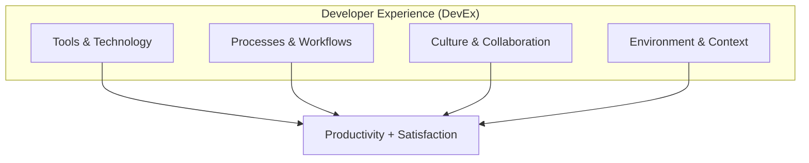

> **Discipline Module** | Complexity: `[MEDIUM]` | Time: 40-50 min

## Prerequisites

Before starting this module:
- **Required**: [Module 2.1: What is Platform Engineering?](../module-2.1-what-is-platform-engineering/) — Platform foundations
- **Recommended**: [Systems Thinking Track](/platform/foundations/systems-thinking/) — Understanding feedback loops
- **Helpful**: Experience working on software development teams

---

## What You'll Be Able to Do

After completing this module, you will be able to:

- **Measure developer experience using quantitative metrics like time-to-first-deploy and cognitive load**
- **Design developer workflows that minimize context switching and manual configuration**
- **Implement developer satisfaction surveys that drive platform improvement priorities**
- **Analyze friction points in the developer journey to identify high-impact platform investments**

## Why This Module Matters

Platform Engineering exists to improve developer experience. But what *is* developer experience? How do you measure it? How do you improve it?

Without understanding DevEx:
- You'll build platforms that look good but don't help
- You'll optimize the wrong things
- You'll measure vanity metrics instead of impact
- You'll miss the real problems

**Developer experience is your platform's success metric.** If DevEx improves, your platform is working. If it doesn't, your platform is failing—no matter how technically impressive it is.

This module teaches you to measure, understand, and systematically improve developer experience.

---

> **Stop and think**: What is the single most frustrating part of your current daily development workflow? Does it stem from a lack of tools, overly complex processes, or communication breakdowns?

## What is Developer Experience?

### Definition

Developer Experience (DevEx or DX) encompasses everything that influences how developers feel about and perform their work:



### The Three Dimensions

Research from DX research (including work by Storey, Forsgren, and others) identifies three core dimensions:

**1. Feedback Loops**
How quickly do developers get information about their code?

```
Fast feedback loops:
- Instant IDE autocomplete
- Sub-second test runs
- 2-minute CI pipeline
- Same-day code review

Slow feedback loops:
- Wait for nightly build
- Tests take 45 minutes
- PR sits for days
- "Ship it and see"
```

**2. Cognitive Load**
How much mental effort is required to do the work?

```
Low cognitive load:
- Clear, well-documented APIs
- Consistent patterns
- Good error messages
- Familiar tools

High cognitive load:
- 15 different config formats
- Tribal knowledge required
- Cryptic error messages
- New tool every quarter
```

**3. Flow State**
How often can developers achieve uninterrupted, focused work?

```
Flow-enabling:
- Async communication defaults
- Blocked time for focus
- Minimal context switching
- Clear priorities

Flow-breaking:
- Constant meetings
- Slack pings every hour
- Unclear requirements
- Interrupt-driven work
```

---

> **Pause and predict**: Before reading about the SPACE framework, consider how you might measure developer productivity without just counting lines of code or the number of commits. What other dimensions of a developer's day matter?

## The SPACE Framework

The SPACE framework (from GitHub, Microsoft Research, and University of Victoria) provides a more comprehensive model for measuring developer productivity.

### S - Satisfaction and Well-being

**What it measures**: How developers feel about their work, tools, and team

**Example metrics**:
- Developer satisfaction surveys (NPS, CSAT)
- Burnout indicators
- Retention rates
- Would you recommend working here?

**Why it matters**: Satisfied developers are more productive, stay longer, and produce better work.

### P - Performance

**What it measures**: Outcomes of developer work

**Example metrics**:
- Code review quality
- Customer satisfaction with features
- Reliability of shipped code
- Absence of bugs

**Why it matters**: Ultimately, developer work should produce valuable outcomes.

### A - Activity

**What it measures**: Volume of work done

**Example metrics**:
- Commits per day
- PRs merged
- Tickets closed
- Lines of code (use cautiously!)

**Why it matters**: Activity can indicate engagement, but is easily gamed. Use with other dimensions.

### C - Communication and Collaboration

**What it measures**: How well developers work together

**Example metrics**:
- PR review turnaround time
- Meeting effectiveness
- Knowledge sharing
- Documentation quality

**Why it matters**: Modern software development is collaborative. Poor collaboration = poor DevEx.

### E - Efficiency and Flow

**What it measures**: Ability to do work with minimal friction

**Example metrics**:
- Time in flow state
- Wait time in processes
- Context switches per day
- Build/test time

**Why it matters**: Friction and interruptions directly impact productivity and satisfaction.

### Using SPACE

**Key principles**:
1. **Use multiple dimensions**: No single metric captures DevEx
2. **Balance perceptual and non-perceptual**: Surveys + system data
3. **Tailor to your context**: Not all metrics apply everywhere
4. **Avoid gaming**: When metrics become targets, they cease to be good metrics

```
Bad: "We'll measure commits per day to track productivity"
     (Developers make tiny commits to game the metric)

Good: "We'll combine satisfaction surveys, PR cycle time,
      and deployment frequency to understand DevEx"
```

---

## Try This: Quick DevEx Assessment

Rate your team's developer experience (1-5):

```markdown
## Feedback Loops
- [ ] How fast is your CI pipeline? ___ min
      (1=60+ min, 2=30-60, 3=15-30, 4=5-15, 5=<5)
- [ ] How quickly are PRs reviewed? ___
      (1=days, 2=24h+, 3=same day, 4=<4h, 5=<1h)
- [ ] How fast do tests run locally? ___
      (1=30+ min, 2=10-30, 3=5-10, 4=1-5, 5=<1)

Feedback Score: ___/15

## Cognitive Load
- [ ] How easy is it to set up the dev environment? ___
      (1=days, 2=hours+docs, 3=hour, 4=minutes, 5=one command)
- [ ] How consistent are your tools/processes? ___
      (1=chaos, 2=varies by team, 3=mostly consistent, 4=standard, 5=golden path)
- [ ] How good is your documentation? ___
      (1=none, 2=outdated, 3=exists, 4=good, 5=excellent)

Cognitive Load Score: ___/15

## Flow State
- [ ] How many meetings per day? ___
      (1=5+, 2=4, 3=3, 4=2, 5=0-1)
- [ ] How often are you interrupted? ___
      (1=constantly, 2=hourly, 3=few times/day, 4=rarely, 5=almost never)
- [ ] How clear are your priorities? ___
      (1=chaos, 2=changes weekly, 3=mostly clear, 4=clear, 5=crystal)

Flow Score: ___/15

Total DevEx Score: ___/45
```

---

## Measuring Developer Experience

### Quantitative Metrics

**CI/CD Metrics**:
```yaml
ci_metrics:
  build_time:
    target: "<10 minutes"
    measure: "Average CI pipeline duration"

  deployment_frequency:
    target: "Multiple per day"
    measure: "Deploys per team per day"

  lead_time:
    target: "<1 day"
    measure: "Commit to production time"

  failure_rate:
    target: "<15%"
    measure: "% of deployments that fail"

  recovery_time:
    target: "<1 hour"
    measure: "Time to recover from failures"
```

**Development Environment Metrics**:
```yaml
dev_env_metrics:
  setup_time:
    target: "<30 minutes"
    measure: "Time for new developer to run code"

  test_execution:
    target: "<5 minutes"
    measure: "Time to run full test suite locally"

  environment_parity:
    target: "100%"
    measure: "% of prod-like behavior in dev"
```

**Collaboration Metrics**:
```yaml
collaboration_metrics:
  pr_review_time:
    target: "<4 hours"
    measure: "Time to first review"

  pr_cycle_time:
    target: "<24 hours"
    measure: "Open to merged time"

  knowledge_sharing:
    target: "Weekly"
    measure: "Docs/talks/demos created"
```

### Qualitative Metrics

**Developer Surveys**:
```yaml
survey_questions:
  satisfaction:
    - "How satisfied are you with your development tools? (1-5)"
    - "How likely would you recommend our platform to a friend? (NPS)"
    - "What's the biggest friction in your daily work?"

  cognitive_load:
    - "How often do you feel overwhelmed by complexity? (1-5)"
    - "How easy is it to understand our codebase? (1-5)"
    - "How often do you need to ask for help with tools? (1-5)"

  flow_state:
    - "How often can you focus without interruption? (1-5)"
    - "How clear are your daily priorities? (1-5)"
    - "How often do you achieve 'flow state'? (1-5)"
```

**User Research Methods**:
- **Interviews**: Deep-dive conversations with developers
- **Diary studies**: Developers log friction points over time
- **Shadowing**: Watch developers work, observe pain points
- **Usability tests**: Watch developers use your platform

### The DevEx Dashboard

Combine metrics into a single view:

```mermaid
graph TB
    subgraph "DevEx Dashboard"
        direction TB
        subgraph "Satisfaction"
            direction TB
            S1["NPS: 42 (+5)"]
            S2["CSAT: 4.1/5"]
        end
        subgraph "CI/CD Performance"
            direction TB
            C1["Build Time: 8.2 min (↓ 2.1)"]
            C2["Deploy Freq: 12/day (↑ 3)"]
            C3["Lead Time: 4.2h (↓ 1.8h)"]
        end
        subgraph "Flow State"
            direction TB
            F1["Meetings: 2.1/d"]
            F2["Focus Time: 4h"]
            F3["Interrupts: 3/d"]
        end
        subgraph "Collaboration"
            direction TB
            CO1["PR Review: 2.8h (↓ 1.2h)"]
            CO2["PR Cycle: 18h (↓ 6h)"]
            CO3["Docs Updated: 15 this week"]
        end
        subgraph "Top Pain Points (from surveys)"
            direction TB
            P1["1. Environment setup takes too long (mentioned 12x)"]
            P2["2. Tests are flaky (mentioned 9x)"]
            P3["3. Documentation is outdated (mentioned 7x)"]
        end
    end
```



---

## Did You Know?

1. **Google's research found that "psychological safety"** is the #1 predictor of high-performing teams—more important than tools, processes, or individual skill.

2. **The term "developer experience"** gained prominence around 2010, partly inspired by "user experience" (UX). Just as UX focuses on end users, DevEx focuses on developers as users of tools and platforms.

3. **Stack Overflow's 2023 survey found** that 90% of developers use Stack Overflow weekly. Your internal documentation competes with the entire internet—it better be good.

4. **Microsoft research shows developers spend 64% of their time on non-coding tasks**—meetings, documentation, waiting for builds. DevEx improvements often target this "invisible" time rather than writing code.

---

## War Story: The Metric That Backfired

A platform team I worked with wanted to improve DevEx. They chose to measure "deployment frequency"—how often teams deployed.

**The Hypothesis**: More deployments = faster feedback = better DevEx

**The Implementation**:
- Dashboard showing deploys per team
- Weekly report to leadership
- "Leaderboard" of most-deploying teams

**What Happened**:

Month 1: Deployments increased 50%
Month 2: Deployments increased another 30%
Month 3: Incidents increased 200%

**The Problem**:

Teams started gaming the metric:
- Splitting changes into tiny PRs
- Deploying incomplete features behind flags (but still deploying)
- Skipping tests to deploy faster
- Deploying to hit the number, not to deliver value

**The Root Cause**:

The team measured *activity* without measuring *outcomes* or *satisfaction*.

**The Fix**:

Replaced single metric with SPACE-inspired dashboard:
- Deployment frequency (activity) — still tracked, but not incentivized
- Change failure rate (performance) — added accountability
- Lead time (efficiency) — measured actual speed
- Developer satisfaction (satisfaction) — quarterly surveys

**Results**:

After switching to balanced metrics:
- Deployments: normalized to sustainable rate
- Incidents: decreased 60%
- Developer satisfaction: increased 25%
- Actual lead time: improved despite fewer deployments

**The Lesson**: Any single metric can be gamed. Measure multiple dimensions. Include satisfaction—it's harder to fake.

---

> **Stop and think**: Recall a recent task that took much longer than expected not because the coding was hard, but because the setup or tooling was confusing. That is extraneous cognitive load.

## Cognitive Load Deep Dive

Cognitive load is the #1 thing platforms can address. Let's go deeper.

### Types of Cognitive Load

**Intrinsic Load**: Complexity inherent to the problem
- Can't eliminate
- Can support with better tools
- Example: Understanding business logic

**Extraneous Load**: Complexity from tools and processes
- CAN eliminate with better platforms
- This is your target
- Example: Understanding deployment YAML

**Germane Load**: Effort that builds understanding
- Good cognitive load
- Learning that sticks
- Example: Learning a new architecture pattern

```
Platform Engineering Focus:

Intrinsic Load → Support it (good docs, examples)
Extraneous Load → ELIMINATE IT (self-service, abstraction)
Germane Load → Invest in it (training, golden paths)
```

### Cognitive Load in Practice

**Before platform**:
```
Developer task: Deploy a new microservice

Required knowledge:
- Docker (build, push, registry auth)
- Kubernetes (deployment, service, ingress, configmap, secret)
- Helm (charts, values, releases)
- GitOps (ArgoCD app, sync waves, health checks)
- Networking (service mesh, load balancing)
- Observability (metrics, logs, traces config)
- Security (policies, RBAC, secrets management)

Estimated learning: 2-4 weeks
Estimated deploy: 2-3 days
```

**After platform**:
```
Developer task: Deploy a new microservice

Required knowledge:
- Write a service.yaml with app name and port
- git push

Platform handles:
- All the infrastructure complexity

Estimated learning: 1 hour
Estimated deploy: 10 minutes
```

### Measuring Cognitive Load

**Direct measurement** (surveys):
```
"On a scale of 1-5, how mentally demanding was [task]?"
"How confident did you feel doing [task]?"
"How much of [task] required knowledge outside your domain?"
```

**Proxy measurements**:
- Time to first PR for new developers
- Questions in Slack about basic tasks
- Number of tools required for common workflows
- Documentation page views (high views = high confusion)

### Reducing Cognitive Load

**Strategy 1: Abstraction**
```yaml
# Before: Developer writes 200 lines of K8s YAML
# After: Developer writes 10 lines
apiVersion: platform/v1
kind: Service
metadata:
  name: my-service
spec:
  image: my-service
  port: 8080
  replicas: 3
  # Platform generates all the K8s resources
```

**Strategy 2: Golden Paths**
```
Instead of: "Here are 15 ways to deploy"
Do: "Here's THE way to deploy, optimized for our org"
```

**Strategy 3: Sensible Defaults**
```yaml
# Don't make developers choose everything
defaults:
  resources:
    memory: "512Mi"
    cpu: "500m"
  replicas: 3
  monitoring: enabled
  logging: enabled
# Developers only override what they need
```

**Strategy 4: Contextual Help**
```
When developer encounters error:
- Bad: "Error: ETCD_TIMEOUT"
- Good: "Database connection failed.
        Common fixes:
        1. Check VPN connection
        2. Verify db-creds secret exists
        3. See: docs/troubleshooting/db-connection"
```

---

> **Pause and predict**: If you mapped your own onboarding experience at your current company, at which stage would you find the most significant delays or extraneous cognitive load?

## Developer Journey Mapping

Map the developer's journey to find improvement opportunities.

### The Developer Journey


### Mapping Exercise

For each stage, identify:

```markdown
## Journey Stage: [Name]

### Current Experience
- What do developers do today?
- How long does it take?
- What tools are involved?
- What frustrations exist?

### Pain Points
1. _________________
2. _________________
3. _________________

### Platform Opportunities
- What could the platform improve?
- Self-service possibilities?
- Automation opportunities?
- Abstraction opportunities?

### Success Metrics
- Time: Current ___ → Target ___
- Satisfaction: Current ___ → Target ___
- Self-service rate: Current ___ → Target ___
```

---

## Common Mistakes

| Mistake | Problem | Solution |
|---------|---------|----------|
| Measuring only activity | Gaming, missing quality | Use SPACE, include satisfaction |
| Ignoring satisfaction | Build unused platforms | Survey regularly, act on feedback |
| Optimizing for power users | Leave average developers behind | Design for the middle, extend for advanced |
| One-size-fits-all | Different teams have different needs | Customizable golden paths |
| Copying big tech metrics | Different scale, different problems | Start with YOUR pain points |
| Annual surveys only | Stale data, slow response | Continuous lightweight feedback |

---

## Quiz: Check Your Understanding

### Question 1
*Scenario*: Your platform team notices that the core monolith's CI pipeline takes 45 minutes to complete. Developers frequently complain that they lose their train of thought while waiting, leading them to context-switch to emails or Slack. Based on the SPACE framework, which dimensions are most directly impacted by this slow pipeline, and why?

<details>
<summary>Show Answer</summary>

**Answer**: The primary dimensions impacted are Efficiency and Flow, as well as Satisfaction. When a CI pipeline takes 45 minutes, it introduces massive wait times that completely break a developer's flow state, forcing them into disruptive context switching. This context switching requires high cognitive effort to re-engage with the original task later, directly reducing efficiency. Furthermore, the constant waiting breeds frustration and damages satisfaction, because developers feel their time is being wasted by inadequate tooling. Ultimately, this can also artificially lower the Activity dimension, as developers might batch their commits to avoid waiting for the pipeline multiple times.

</details>

### Question 2
*Scenario*: In your quarterly review, you observe that deployment frequency and lead time are both meeting your aggressive targets (multiple deploys per day, under 2 hours lead time). However, the latest developer survey shows a 20% drop in overall satisfaction, with comments mentioning burnout and constant fire-fighting. What is the most likely cause of this discrepancy, and how should you address it?

<details>
<summary>Show Answer</summary>

**Answer**: The most likely cause is that the team is optimizing for activity and system performance metrics at the expense of developer well-being and actual quality. When deployment frequency becomes a rigid target, teams often game the metric by pushing smaller, riskier, or incomplete changes, which leads to increased production incidents and operational fire-fighting. This directly causes burnout and lowers satisfaction, because developers are forced to maintain an unsustainable pace of work while constantly reacting to broken systems. To address this, you must look at the SPACE framework holistically by correlating deployment frequency with the change failure rate and incorporating qualitative feedback to ensure the high deployment rate isn't masking a toxic, interrupt-driven environment.

</details>

### Question 3
*Scenario*: You are designing a new self-service deployment portal. Junior developers need a simple way to get a web service running without learning Kubernetes, while the data science team needs fine-grained control over GPU node scheduling and custom sidecars. How can you design the platform to reduce cognitive load for the juniors without blocking the data science team?

<details>
<summary>Show Answer</summary>

**Answer**: You should implement a strategy of progressive disclosure utilizing golden paths and sensible defaults. By providing a default, highly abstracted service template, junior developers experience minimal extraneous cognitive load because the platform automatically handles complex Kubernetes configurations like ingresses and resource limits behind the scenes. However, this golden path must include an escape hatch or extension points that allow advanced users, like the data science team, to override defaults and inject custom configurations such as specific GPU node selectors or sidecars. This layered approach ensures that the platform is accessible and frictionless for standard use cases while remaining flexible enough to support complex, specialized requirements without forcing everyone to learn the underlying complexity.

</details>

### Question 4
*Scenario*: Your team has gathered DevEx survey results showing three major complaints: 1) The VPN disconnects randomly, 2) The local development environment takes two days to set up, and 3) The internal wiki search is terrible. You only have the capacity to tackle one issue this quarter. How do you systematically decide which initiative will provide the highest return on investment for the platform?

<details>
<summary>Show Answer</summary>

**Answer**: You should evaluate these initiatives using a prioritization framework that balances Impact, Reach, Confidence, and Effort across your entire engineering organization. The local development setup time has a high impact but might only reach new hires or developers switching machines, making its overall organizational reach lower at any given time. Conversely, a disconnecting VPN likely impacts 100 percent of the engineering organization on a daily basis, severely breaking flow state and causing widespread frustration for every single developer. By calculating the total ROI—where a high-reach, high-impact issue like the VPN affects daily productivity for everyone—you can systematically justify prioritizing it over localized or less frequent friction points, even if the VPN fix requires moderate effort.

</details>

---

## Hands-On Exercise: DevEx Improvement Plan

Create a 90-day DevEx improvement plan.

### Part 1: Current State (Week 1)

```markdown
## DevEx Assessment

### Quantitative Metrics
| Metric | Current Value | Target | Gap |
|--------|--------------|--------|-----|
| CI build time | ___ min | <10 min | |
| PR review time | ___ hours | <4 hours | |
| Deploy frequency | ___/day | | |
| Onboarding time | ___ days | <1 day | |
| Test run time | ___ min | <5 min | |

### Qualitative Assessment
Survey results (n=___):
- Overall satisfaction: ___/5
- Top pain point #1: _________________
- Top pain point #2: _________________
- Top pain point #3: _________________

### Developer Interviews
Key quotes:
- "_________________"
- "_________________"
- "_________________"
```

### Part 2: Prioritization (Week 2)

```markdown
## Opportunity Ranking

| Pain Point | Impact | Reach | Effort | Priority |
|------------|--------|-------|--------|----------|
| | | | | |
| | | | | |
| | | | | |

## Selected Focus
Top priority for this quarter: _________________

Rationale:
- Impact: _________________
- Why now: _________________
- Success looks like: _________________
```

### Part 3: 90-Day Plan (Weeks 3-12)

```markdown
## 90-Day DevEx Improvement Plan

### Days 1-30: Foundation
Goal: _________________

Actions:
- [ ] Week 1-2: _________________
- [ ] Week 3-4: _________________

Success criteria:
- _________________

### Days 31-60: Implementation
Goal: _________________

Actions:
- [ ] Week 5-6: _________________
- [ ] Week 7-8: _________________

Success criteria:
- _________________

### Days 61-90: Adoption
Goal: _________________

Actions:
- [ ] Week 9-10: _________________
- [ ] Week 11-12: _________________

Success criteria:
- _________________

## Metrics to Track
Weekly:
- _________________
- _________________

Monthly:
- _________________
- _________________
```

### Success Criteria
- [ ] Assessed current DevEx with quantitative and qualitative data
- [ ] Prioritized pain points with clear rationale
- [ ] Created specific 90-day plan with milestones
- [ ] Defined measurable success criteria

---

## Key Takeaways

1. **DevEx has three dimensions**: Feedback loops, cognitive load, flow state
2. **Use SPACE framework**: Satisfaction, Performance, Activity, Communication, Efficiency
3. **Never use single metrics**: They get gamed; combine multiple dimensions
4. **Cognitive load is your target**: Platforms reduce extraneous cognitive load
5. **Map the developer journey**: Find friction at each stage
6. **Measure continuously**: Annual surveys aren't enough

---

## Further Reading

**Research**:
- **"The SPACE of Developer Productivity"** — Forsgren, Storey, et al.
- **"DevEx: What Actually Drives Productivity"** — ACM Queue
- **Google's "Project Aristotle"** — Team effectiveness research

**Books**:
- **"Accelerate"** — Forsgren, Humble, Kim
- **"A Philosophy of Software Design"** — John Ousterhout (cognitive load)
- **"Team Topologies"** — Skelton & Pais

**Tools**:
- **DX (getdx.com)** — DevEx measurement platform
- **Pluralsight Flow** — Engineering metrics
- **LinearB** — Developer productivity analytics

---

## Summary

Developer Experience is what Platform Engineering optimizes for. It encompasses:
- **Feedback loops**: How fast developers get information
- **Cognitive load**: How much mental effort is required
- **Flow state**: How often developers can focus

Measure DevEx using:
- **SPACE framework**: Multiple dimensions, not single metrics
- **Surveys + system data**: Perceptual and behavioral
- **Continuous measurement**: Not just annual surveys

Improve DevEx by:
- **Reducing cognitive load**: Abstraction, defaults, golden paths
- **Speeding feedback**: Faster CI, quicker reviews
- **Enabling flow**: Fewer interruptions, clearer priorities

The goal isn't to build cool platforms—it's to make developers more productive and happier.

---

## Next Module

Continue to [Module 2.3: Internal Developer Platforms (IDPs)](../module-2.3-internal-developer-platforms/) to learn the components and architecture of Internal Developer Platforms.

---

*"The best developer experience is the one developers don't notice—because nothing gets in their way."* — DevEx Wisdom