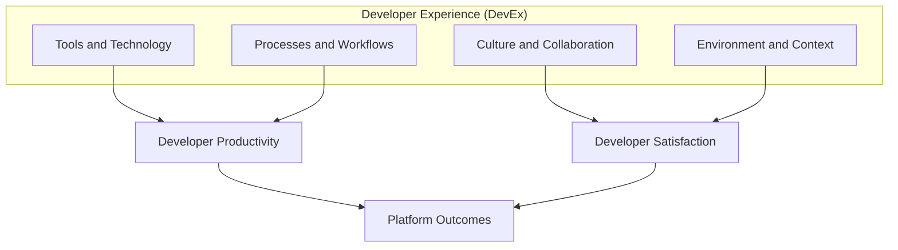

> **Discipline Module** | Complexity: `[MEDIUM]` | Time: 50-60 min

## Prerequisites

Before starting this module, you should be comfortable with the platform engineering purpose introduced in [Module 2.1: What is Platform Engineering?](../module-2.1-what-is-platform-engineering/). You do not need to have operated a mature internal developer platform before, but you should have enough software delivery experience to recognize common sources of friction such as slow CI, confusing deployment steps, unclear ownership, and repeated handoffs.

Recommended background includes basic familiarity with systems thinking, because developer experience is not a single tool problem. A slow pull request review process may look like a people issue, a CI issue, or a planning issue depending on where you enter the system. This module treats DevEx as an operating model: you will learn to observe the whole developer journey, decide where friction is most expensive, and design platform improvements that reduce work without hiding essential responsibility.

---

## Learning Outcomes

After completing this module, you will be able to:

- **Analyze** developer workflows to separate feedback-loop delays, cognitive-load problems, and flow-state interruptions.
- **Design** a balanced DevEx measurement model using SPACE, journey mapping, and qualitative research instead of relying on a single productivity metric.
- **Evaluate** platform improvement opportunities by comparing impact, reach, confidence, effort, and second-order risks.
- **Implement** a lightweight DevEx survey and dashboard that combine system metrics with developer sentiment.
- **Debug** a failing platform initiative by identifying when metrics, incentives, or abstractions are creating worse developer outcomes.

---

## Why This Module Matters

A staff engineer joins a growing company and tries to ship a small change on her first week. The code change takes twenty minutes, but the development environment takes two days to run, the service catalog has three conflicting ownership entries, the pull request template points to a stale checklist, and the deployment instructions require a permission that nobody remembers how to request. By Friday she has learned the real system: not the architecture diagram, but the hidden maze of waiting, guessing, asking, retrying, and apologizing.

That experience is not just annoying. It is organizational waste that compounds every day. When experienced engineers spend their attention decoding deployment rituals, they are not improving reliability or product quality. When new engineers learn that progress depends on private Slack knowledge, onboarding slows and psychological safety erodes. When platform teams celebrate new capabilities without measuring whether developers can actually use them, they can accidentally add another layer of complexity to the system they meant to simplify.

Developer Experience, often shortened to DevEx or DX, is the discipline of making software delivery understandable, fast, safe, and satisfying for the people who build and operate software. It is not the same as making developers happy at all costs. Good DevEx removes accidental friction while preserving the productive friction that keeps systems reliable, secure, and maintainable. A strong platform does not promise that every hard thing becomes easy; it promises that developers spend their effort on the hard things that matter.

---

## Core Concept 1: DevEx Is the Operating Signal for Platform Engineering

Developer experience is the lived experience of moving an idea through the software delivery system. It includes tools, processes, culture, documentation, autonomy, architecture, feedback, and the emotional cost of doing normal work. If platform engineering is the practice of building paved roads for internal teams, DevEx is how you know whether the road actually helps people travel faster, safer, and with less confusion.

A useful definition needs to be broader than tool satisfaction and narrower than general employee happiness. If a developer likes a tool because it hides all production risk, that is not necessarily good DevEx. If a developer dislikes an approval step because it catches dangerous changes, removing the step may improve sentiment while damaging the business. The platform engineer's job is to understand the workflow well enough to distinguish accidental friction from necessary control.



Think of DevEx as the cockpit instrumentation for the platform. A pilot does not fly by looking at only airspeed, altitude, or fuel; each signal matters because it explains a different part of the flight. A platform team that tracks only deployment frequency may miss burnout. A team that tracks only satisfaction may miss reliability damage. A team that tracks only ticket volume may reward developers for avoiding the platform entirely.

The three practical dimensions you will use throughout this module are feedback loops, cognitive load, and flow state. They overlap, but separating them helps you choose the right intervention. A slow test suite is primarily a feedback-loop problem, but it also increases context switching. A confusing service template is primarily a cognitive-load problem, but it can also reduce satisfaction and lead to operational mistakes.

```text
Developer work system

  ┌──────────────────────┐
  │ Feedback loops       │
  │ "How fast do I know?"│
  └──────────┬───────────┘
             │
             ▼
  ┌──────────────────────┐
  │ Cognitive load       │
  │ "How much must I     │
  │ keep in my head?"    │
  └──────────┬───────────┘
             │
             ▼
  ┌──────────────────────┐
  │ Flow state           │
  │ "Can I stay focused  │
  │ long enough to ship?"│
  └──────────┬───────────┘
             │
             ▼
  ┌──────────────────────┐
  │ Better platform      │
  │ decisions            │
  └──────────────────────┘
```

Feedback loops describe how quickly developers learn whether their work is correct, safe, and useful. Fast feedback includes local tests that run in seconds, CI failures that point to the broken step, preview environments that appear automatically, and code reviews that happen while the author still remembers the context. Slow feedback creates queueing, batching, and risky guessing.

Cognitive load describes the mental effort required to perform a task. Some load is intrinsic, such as understanding a domain model or a distributed transaction boundary. Some load is extraneous, such as memorizing which deployment repository owns which environment or which YAML field must be copied from an old service. Platform teams should not try to remove all complexity; they should remove the complexity that does not teach the developer anything useful about the product or system.

Flow state describes the ability to work with sustained attention. It is easy to underestimate because many organizations normalize interruption as collaboration. A developer who waits half an hour for CI may fill the gap with messages, meetings, or a second ticket, but the hidden cost appears when they return to the original problem and reload the mental context. DevEx work often improves flow by shortening waits, clarifying ownership, and making routine paths predictable.

> **Active learning prompt**: Pick one recent task that took longer than expected. Classify the biggest source of delay as feedback loop, cognitive load, or flow state. If you cannot choose one, identify which problem appeared first and which problems were downstream effects.

A beginner mistake is to treat DevEx as a mood survey. A senior mistake is to treat DevEx as a dashboard. Both are incomplete. The best platform teams use developer sentiment to discover where pain exists, system metrics to understand how often it happens, and direct observation to learn what the workflow actually feels like in practice.

---

## Core Concept 2: The SPACE Framework Prevents Single-Metric Thinking

The SPACE framework gives you a structured way to measure developer productivity without collapsing it into one easy but misleading number. The letters stand for Satisfaction and well-being, Performance, Activity, Communication and collaboration, and Efficiency and flow. The value of SPACE is not that every organization must use the same metrics; the value is that it forces you to balance different types of evidence.

A single metric becomes dangerous when it turns into a target. If leadership rewards commits per developer, developers can create more commits without delivering more value. If leadership rewards deployment frequency, teams can deploy smaller changes while increasing operational load. If leadership rewards ticket closure, teams can split work into easy tickets and avoid deep reliability problems. SPACE reduces this risk by asking whether speed, quality, collaboration, and human sustainability are moving together.

| SPACE Dimension | What It Explains | Example Signals | Misuse Risk |
|---|---|---|---|
| Satisfaction and well-being | Whether developers can sustain the work without frustration or burnout | DevEx survey score, burnout signal, platform NPS, qualitative comments | Treating happiness as a substitute for delivery outcomes |
| Performance | Whether developer work produces valuable, reliable outcomes | Change failure rate, defect escape rate, customer impact, incident reduction | Blaming teams for outcomes caused by platform constraints |
| Activity | How much visible work is moving through the system | Pull requests merged, deploys completed, tickets closed, docs updated | Rewarding volume even when value or quality declines |
| Communication and collaboration | Whether teams can coordinate without excessive waiting or private knowledge | Review turnaround, ownership clarity, documentation freshness, handoff count | Measuring messages instead of useful coordination |
| Efficiency and flow | Whether developers can progress with minimal waiting and context switching | Lead time, CI duration, time to first deploy, interruption frequency | Ignoring safety controls that intentionally slow risky changes |

A strong measurement model chooses two or three dimensions for a specific question rather than trying to turn SPACE into a giant dashboard. If the question is "Why are teams avoiding the internal developer platform?", useful signals might include satisfaction survey comments, platform task completion time, and failed self-service attempts. If the question is "Did the new deployment template improve delivery?", useful signals might include lead time, change failure rate, and support tickets for deployment help.

```yaml
devex_measurement_model:
  question: "Is the new service template reducing delivery friction?"
  satisfaction:
    metric: "template ease-of-use score"
    collection: "monthly two-question pulse survey"
  efficiency_and_flow:
    metric: "time from repository creation to first staging deploy"
    collection: "platform event logs"
  communication_and_collaboration:
    metric: "deployment-help requests per new service"
    collection: "support channel tagging"
  performance:
    metric: "change failure rate for services using the template"
    collection: "deployment and incident records"
```

The YAML above is not a universal dashboard. It is a measurement model tied to one decision. This distinction matters because platform teams often drown in metrics that do not guide action. A metric should help you decide whether to continue, stop, redesign, or investigate. If nobody can say what decision a metric informs, the metric is probably dashboard decoration.

A worked example makes the idea concrete. Imagine a platform team sees that deployment frequency rose after launching a self-service deploy button. Leadership is pleased, but developers report higher stress and on-call pages increase. A single-metric interpretation says the platform succeeded because deploys increased. A SPACE interpretation says the platform improved Activity but may have harmed Satisfaction, Performance, and Flow.

```text
Worked example: balanced interpretation

Observed change:
  Deployment frequency increased from weekly to daily.

Additional evidence:
  Change failure rate increased.
  On-call interruptions increased.
  Developers report pressure to deploy before checks finish.

Interpretation:
  The platform reduced one delivery barrier but weakened the safety system.

Better next action:
  Keep self-service deployment, add safer defaults, improve rollback visibility,
  and measure whether failure rate and satisfaction recover.
```

> **Pause and predict**: Suppose your organization celebrates a reduction in average pull request size. What good behavior might that reflect, and what unhealthy behavior might it hide? Write both interpretations before you choose a metric to pair with it.

SPACE also helps platform teams communicate with executives without oversimplifying. Leaders often want a single answer to "Are developers more productive?" A mature platform team can answer with a concise story: "Lead time improved, deployment support tickets dropped, satisfaction rose among service teams, but change failure rate is flat; the next investment is safer release automation rather than more workflow speed." That story is more useful than a productivity score because it connects evidence to action.

---

## Core Concept 3: Cognitive Load Is Where Platforms Usually Create Leverage

Cognitive load is the mental effort required to complete a task. For platform engineering, cognitive load is often the highest-leverage target because it explains why smart developers make avoidable mistakes in routine workflows. When a developer must understand container registries, Kubernetes Services, Ingress behavior, service mesh routing, secrets injection, CI syntax, and deployment approvals just to expose an HTTP endpoint, the platform has pushed infrastructure complexity onto the application team.

Not all cognitive load is bad. Intrinsic load belongs to the work itself, such as understanding payment rules, user privacy constraints, or data consistency requirements. Germane load helps developers build useful mental models, such as learning why idempotent operations make retries safer. Extraneous load is the waste category: confusing naming, inconsistent templates, undocumented permissions, noisy errors, and tool-specific rituals that do not improve the product.

| Cognitive Load Type | Platform Interpretation | Example | Platform Response |
|---|---|---|---|
| Intrinsic load | The real complexity of the domain or system | A checkout service must preserve money movement correctness during retries | Support with diagrams, examples, test environments, and expert review |
| Extraneous load | Complexity introduced by poor tools or process design | A developer copies six manifests because no service template exists | Remove through abstraction, defaults, automation, and clearer errors |
| Germane load | Effort that builds lasting understanding | A developer learns how rollout health checks protect users | Invest through guided docs, explanations, and progressive disclosure |

The goal is not to hide the platform so completely that developers cannot reason about production. The goal is to reveal the right level of detail at the right time. A junior developer creating a standard web service should not need to write a complete Kubernetes Deployment, Service, Ingress, HorizontalPodAutoscaler, NetworkPolicy, and observability configuration by hand. A senior developer debugging a latency spike should be able to inspect the generated resources, override defaults, and understand the operational consequences.

```text
Progressive disclosure for service deployment

  ┌────────────────────────────────────────────────────────────┐
  │ Level 1: Golden path                                       │
  │ Developer provides name, image, port, and owner.           │
  │ Platform generates safe defaults for common services.      │
  └───────────────────────────┬────────────────────────────────┘
                              │
                              ▼
  ┌────────────────────────────────────────────────────────────┐
  │ Level 2: Managed overrides                                 │
  │ Developer adjusts replicas, resources, routes, and alerts. │
  │ Platform validates choices and explains rejected changes.  │
  └───────────────────────────┬────────────────────────────────┘
                              │
                              ▼
  ┌────────────────────────────────────────────────────────────┐
  │ Level 3: Expert extension                                  │
  │ Developer uses approved extension points for unusual needs.│
  │ Platform records ownership and preserves guardrails.       │
  └────────────────────────────────────────────────────────────┘
```

Consider the difference between a raw deployment workflow and a platform workflow. In the raw workflow, every developer must learn the same infrastructure details before they can deliver a simple service. In the platform workflow, the platform team encodes organizational standards once and exposes a smaller contract to product teams. That contract should be easy to use, but it should also be honest about what is happening underneath.

```yaml
apiVersion: platform.kubedojo.io/v1
kind: WebService
metadata:
  name: checkout-api
  owner: payments
spec:
  image: registry.example.com/payments/checkout-api:1.8.3
  port: 8080
  replicas: 3
  health:
    path: /healthz
  exposure:
    internal: true
```

The manifest above is intentionally small, but it is not magic. A healthy platform would generate Kubernetes resources, attach baseline metrics, configure logs, apply network policies, enforce resource defaults, and create a deployment record. Developers still need to understand the service contract: image, port, health endpoint, owner, and exposure. They do not need to remember every low-level field on every routine change.

Error messages are another cognitive-load multiplier. A platform that says `ETCD_TIMEOUT` forces the developer to translate an infrastructure symptom into a next action. A platform that says "The deployment status could not be confirmed because the cluster API did not respond within thirty seconds; your previous version is still serving traffic; retry or check cluster status here" reduces ambiguity and prevents unnecessary escalation.

```text
Poor error message:
  Error: DEPLOYMENT_FAILED

Better error message:
  Deployment did not complete because readiness checks failed for checkout-api.
  Last failing check: GET /healthz returned HTTP 503 for two minutes.
  Current user impact: previous version is still serving traffic.
  Next steps:
    1. Inspect application logs for startup failures.
    2. Verify the database migration completed.
    3. Retry after fixing the health endpoint or rollback from the release page.
```

A common senior-level trap is over-abstraction. If the platform exposes only a shiny button and hides every underlying decision, developers may become faster on sunny-day paths and helpless during incidents. Good DevEx includes inspectability. A golden path should make the common path simple, but it should also preserve enough visibility for debugging, learning, and ownership.

---

## Core Concept 4: Journey Mapping Finds Friction Where Dashboards Miss It

Developer journey mapping turns DevEx from a vague sentiment into an observable sequence of work. Instead of asking "Do developers like the platform?", you ask "What happens from idea to production, where does the developer wait, what knowledge is required, who must approve, and what signals tell the developer whether they are safe to continue?" The journey map exposes hidden queues that aggregate metrics often miss.

```mermaid
graph TD
    subgraph "Day 1: Onboarding"
        A[Account setup] --> B[Development environment]
        B --> C[First code running]
        C --> D[First reviewed contribution]
    end
    subgraph "Daily: Development Loop"
        E[Write code] --> F[Test locally]
        F --> G[Create pull request]
        G --> H[Receive CI feedback]
        H --> I[Code review]
        I --> J[Merge]
    end
    subgraph "Weekly: Release Loop"
        K[Deploy to staging] --> L[Validate in staging]
        L --> M[Deploy to production]
        M --> N[Observe behavior]
    end
    subgraph "Periodic: Operations"
        O[Debug incident] --> P[Change capacity]
        P --> Q[Rotate secret]
        Q --> R[Update dependency]
    end
```



A journey map should capture time, emotion, handoffs, tools, and failure modes. Time tells you where work waits. Emotion tells you where developers feel confused, anxious, or unsupported. Handoffs reveal coordination load. Tools reveal context switching. Failure modes reveal where the workflow lacks clear recovery paths. Together, these details produce better platform decisions than a survey score alone.

| Journey Stage | What To Observe | Useful Question | Platform Opportunity |
|---|---|---|---|
| Onboarding | Time until a developer can run and change a real service | Where does the new developer need private help? | One-command setup, access automation, verified docs |
| Local development | Test speed, environment parity, dependency setup | What differs between local and shared environments? | Dev containers, service mocks, local orchestration |
| Pull request | CI duration, flake rate, review wait time | Which failures are actionable and which are noise? | Faster pipelines, better failure messages, ownership routing |
| Deployment | Approval steps, rollback clarity, environment confidence | What must the developer know before pushing safely? | Self-service releases, policy-as-code, preview environments |
| Operations | Observability, runbook quality, escalation path | How quickly can the owner form a correct hypothesis? | Service dashboards, alert context, incident templates |

A good interview technique is to ask a developer to narrate a real task instead of asking for abstract opinions. "Show me the last time you created a service" produces more useful evidence than "Is service creation easy?" Watch for repeated tab switching, copied commands from private notes, waiting for access, uncertainty about status, and moments where the developer says "I just know to do this." Those moments are platform opportunities.

```text
Journey map note format

Stage:
  Pull request validation

Observed behavior:
  Developer pushes commit, waits eleven minutes, receives a generic CI failure,
  opens the logs, searches for the failing job name, and asks in Slack whether
  the failure is a known flaky test.

Friction:
  Slow feedback loop, poor error diagnosis, hidden tribal knowledge.

Platform hypothesis:
  Tag known flaky tests, summarize likely failure causes, and route ownership
  for common CI failures directly in the pull request.

Success signal:
  Fewer CI-help messages, lower retry rate, shorter time from first failed CI
  run to corrected commit.
```

> **Active learning prompt**: Choose one workflow from your team, such as creating a new service, rotating a secret, or debugging a failed deployment. Write the journey as five to seven stages, then mark each stage with one dominant friction type: waiting, confusion, handoff, rework, or interruption.

Journey mapping also protects platform teams from solving the loudest problem instead of the most important problem. A senior engineer may complain loudly about a missing advanced override, while dozens of engineers quietly lose hours every month setting up local dependencies. The right decision depends on reach and impact, not volume alone. Pair the map with usage data and interviews from different experience levels.

---

## Core Concept 5: Prioritizing DevEx Work Requires Product Thinking

Platform teams often have more possible DevEx improvements than they can deliver. Faster CI, better documentation, service templates, local environments, preview deployments, dependency update automation, secrets workflows, and observability defaults may all be legitimate needs. Prioritization is where platform engineering becomes product work: you must decide whose problem matters most now, how confident you are, and what trade-off you are accepting.

A practical prioritization model combines impact, reach, confidence, and effort. Impact asks how much pain the problem causes when it occurs. Reach asks how many developers or workflows experience it. Confidence asks how strong your evidence is. Effort asks what it costs to improve, including maintenance. A small improvement with broad reach can beat a dramatic improvement for one specialized team.

| Candidate Improvement | Impact | Reach | Confidence | Effort | Decision Notes |
|---|---|---|---|---|---|
| Reduce CI duration for core services | High | High | High | Medium | Strong candidate because it improves feedback and flow across many teams |
| Add GPU scheduling override to service portal | High | Low | Medium | Medium | Valuable for one team, but not the default platform priority unless strategic |
| Rewrite all docs from scratch | Medium | Medium | Low | High | Too broad; start with docs tied to top failed workflows |
| Automate access requests for new hires | High | Medium | High | Low | High return because onboarding pain is repeated and measurable |

Prioritization also requires second-order thinking. If you reduce deployment friction without improving rollback and observability, you may increase production risk. If you add flexible configuration too early, you may create a support burden and weaken standards. If you optimize for expert teams, you may abandon the majority of developers who need the golden path. A platform improvement is only good if it improves the whole delivery system.

The following worked example shows how a platform team might decide between three survey complaints. Developers report that the VPN disconnects, local setup takes two days, and wiki search is poor. All three matter, but they do not have the same reach, failure frequency, or coupling to delivery work.

```text
Worked example: choosing one quarterly DevEx investment

Complaint A:
  VPN disconnects randomly during the workday.
Evidence:
  Support tickets from many teams, frequent Slack mentions, failed deploy sessions.
Assessment:
  High reach, high flow impact, medium effort, strong confidence.

Complaint B:
  Local setup takes two days for new hires.
Evidence:
  Onboarding interviews, time-to-first-commit data, repeated access issues.
Assessment:
  Medium reach during normal months, very high impact for new hires, low-to-medium effort.

Complaint C:
  Internal wiki search is poor.
Evidence:
  Survey comments, high page views, many duplicate questions.
Assessment:
  Broad reach, medium impact, uncertain effort because content ownership is unclear.

Decision:
  Fix VPN reliability first if it disrupts daily work for most engineers, while scoping
  a smaller onboarding automation change that can ship in parallel if capacity allows.
```

The decision above is not universal. During a hiring surge, onboarding automation might become the top investment. During an incident-heavy quarter, release safety might beat both. Senior platform engineers do not memorize priority rules; they make the evidence and trade-offs visible so the organization can choose intentionally.

```yaml
priority_scorecard:
  candidate: "automate new service creation"
  impact:
    score: 5
    evidence: "developers spend half a day copying manifests and requesting reviews"
  reach:
    score: 4
    evidence: "eight product teams create or modify services monthly"
  confidence:
    score: 4
    evidence: "journey map observed across three teams and platform logs confirm usage"
  effort:
    score: 3
    evidence: "requires template generator, policy validation, and docs maintenance"
  risks:
    - "over-abstraction could hide rollout behavior"
    - "template ownership must be clear after launch"
  next_decision: "build limited beta for standard HTTP services"
```

A platform team should treat DevEx improvements as hypotheses. "If we add a service template, time to first staging deploy will drop and deployment-help requests will decrease without increasing change failure rate." That sentence defines the target workflow, the expected benefit, and the guardrail. Without a hypothesis, the team may ship a feature and then struggle to prove whether it mattered.

---

## Core Concept 6: DevEx Dashboards Must Drive Decisions, Not Decoration

A DevEx dashboard should make a platform team's operating questions visible. It should show whether developers can move work safely and sustainably, where friction is increasing, and whether recent interventions had the intended effect. It should not be a collection of every number that an engineering analytics tool can export. A dashboard without decision ownership becomes wallpaper.

```mermaid
graph TB
    subgraph "DevEx Dashboard"
        direction TB
        subgraph "Satisfaction"
            direction TB
            S1["Platform NPS: +32"]
            S2["Tooling CSAT: 4.1/5"]
            S3["Burnout risk: watch"]
        end
        subgraph "Feedback Loops"
            direction TB
            F1["Median CI time: 8.2 min"]
            F2["PR first review: 3.4 h"]
            F3["Failed deploy diagnosis: 12 min"]
        end
        subgraph "Cognitive Load"
            direction TB
            C1["Time to first staging deploy: 2.3 h"]
            C2["Support requests per new service: 1.6"]
            C3["Top confusion: ownership metadata"]
        end
        subgraph "Flow and Outcomes"
            direction TB
            O1["Lead time: 6.5 h"]
            O2["Change failure rate: 8 percent"]
            O3["After-hours pages: down"]
        end
    end
```



Good dashboards combine perceptual and behavioral data. Perceptual data comes from surveys, interviews, and diary studies; it tells you how developers experience the system. Behavioral data comes from CI, source control, deployment, incident, and support systems; it tells you what happened. When the two disagree, investigate rather than choosing the more convenient signal.

For example, a platform team may see stable lead time but falling satisfaction. That can happen when developers hit targets only through overtime, constant interruptions, or manual heroics. Another team may see low satisfaction after adding stricter deployment policies, but change failure rate drops and incident severity improves. That does not mean the policy is automatically good; it means the next question is whether the safety control can be made easier to use without losing protection.

```yaml
survey_questions:
  task_specific:
    - "In the last two weeks, which delivery task took more effort than it should have?"
    - "What information did you need but could not find without asking another person?"
    - "Which platform error message was hardest to act on?"
  rating_questions:
    - "I can deploy a routine change without private help. 1-5"
    - "CI failures usually tell me what to do next. 1-5"
    - "The platform helps me understand production impact before release. 1-5"
  open_text:
    - "What is one platform improvement that would save you the most time next month?"
```

Survey design matters because vague questions produce vague answers. "Are you productive?" invites interpretation. "In the last two weeks, could you deploy a routine change without private help?" produces a more actionable signal. Short pulse surveys can run monthly or quarterly, but they must be paired with visible follow-up. If developers provide feedback and nothing changes, survey participation becomes another form of friction.

A healthy DevEx dashboard has owners and review rituals. The platform team should know which metric changed, why it matters, who will investigate, and when a decision will be made. The dashboard should also include guardrails so that speed improvements do not hide reliability or well-being damage. The most valuable dashboard is not the one with the most panels; it is the one that changes what the team does next.

---

## Did You Know?

1. Google's Project Aristotle research helped popularize psychological safety as a key contributor to effective teams, which matters for DevEx because developers need to report friction and failure honestly before a platform team can improve the system.

2. The SPACE framework was created to push organizations away from one-dimensional productivity measurement, especially metrics that confuse visible activity with valuable engineering outcomes.

3. Developer portals and internal developer platforms often fail when they are launched as catalogs of tools rather than designed as task-oriented workflows that help developers complete real jobs.

4. Cognitive load is not only a beginner problem; senior engineers also lose effectiveness when platform workflows force them to remember incidental details that should be encoded in defaults, validation, or documentation.

---

## Common Mistakes

| Mistake | Why It Hurts DevEx | Better Practice |
|---|---|---|
| Measuring only deployment frequency | Teams can increase deploy count while increasing incidents, burnout, or unfinished work | Pair deployment frequency with change failure rate, lead time, and developer sentiment |
| Treating surveys as the whole truth | Survey comments reveal pain but not always frequency, cause, or business impact | Combine surveys with logs, journey mapping, interviews, and workflow observation |
| Hiding every platform detail | Developers move faster on simple paths but lack enough understanding to debug incidents | Use progressive disclosure with inspectable generated resources and clear extension points |
| Optimizing for the loudest team | Platform capacity goes to whoever complains best instead of where the organization loses most time | Prioritize with impact, reach, confidence, effort, and strategic importance |
| Copying another company's metrics | Metrics from a larger or different organization may reward behavior that does not fit your context | Start from your developer journey and choose signals tied to local decisions |
| Launching a golden path without ownership | Templates drift, defaults become stale, and developers lose trust after the first broken experience | Assign lifecycle ownership, support expectations, versioning, and feedback channels |
| Asking vague survey questions | Developers provide broad complaints that are hard to convert into platform work | Ask task-specific questions about recent workflows, missing information, and failed self-service |
| Improving speed without safety guardrails | Faster workflows can increase production risk when rollback, validation, or observability lag behind | Measure speed with reliability and well-being guardrails before declaring success |

---

## Quiz

### Question 1

Your platform team reduces the average CI pipeline duration for a core service from forty minutes to ten minutes. Two months later, developers say they still feel blocked because failed jobs often end with generic errors and nobody knows which team owns the flaky tests. Which DevEx dimensions improved, which remain unhealthy, and what should the next platform investment target?

<details>
<summary>Show answer</summary>

The feedback-loop duration improved because developers receive a result much faster than before. However, cognitive load and collaboration remain unhealthy because the result is not actionable and ownership is unclear. The next investment should focus on failure diagnosis, flaky-test ownership, and routing, not merely further reducing raw runtime. A good follow-up metric would combine time to first CI result with time from failed CI to corrected commit, retry rate, and support requests about test failures.

</details>

### Question 2

Leadership wants a developer productivity dashboard and proposes ranking teams by pull requests merged per engineer. You have access to deployment data, incident data, surveys, and code review timestamps. How would you redesign the measurement approach using SPACE, and how would you explain the risk of the original metric?

<details>
<summary>Show answer</summary>

Ranking teams by pull requests merged measures Activity while ignoring value, complexity, quality, collaboration, and sustainability. It can encourage small low-value changes, discourage deep work, and create unhealthy competition. A better SPACE-based dashboard would include satisfaction or burnout signals, performance signals such as change failure rate or customer-impacting defects, collaboration signals such as review turnaround and ownership clarity, and efficiency signals such as lead time or CI duration. Activity can remain as context, but it should not be the target or ranking mechanism.

</details>

### Question 3

A junior product team uses the platform's default web service template successfully, but a data science team needs GPU node scheduling and a custom sidecar. The platform team is debating whether to expose every Kubernetes field in the template. What design should you recommend, and what risk are you avoiding?

<details>
<summary>Show answer</summary>

Recommend progressive disclosure rather than exposing every low-level field to every user. The default golden path should keep routine services simple with safe defaults, while approved extension points allow advanced teams to request GPU scheduling and custom sidecars with validation and ownership. This avoids forcing all developers to carry Kubernetes complexity for uncommon cases. It also avoids the opposite risk of over-abstraction, where advanced teams bypass the platform because it blocks legitimate needs.

</details>

### Question 4

A DevEx survey shows that developers dislike a new production approval step. At the same time, change failure rate has dropped and incident severity has improved since the step was introduced. How should a platform engineer evaluate whether to remove, keep, or redesign the approval?

<details>
<summary>Show answer</summary>

The platform engineer should not remove the approval solely because satisfaction dropped, and should not keep it unchanged solely because reliability improved. The right analysis asks what safety function the approval provides, where it creates friction, and whether that safety can be preserved with a better workflow. Options might include policy-as-code checks, risk-based approvals, clearer release evidence, or automatic approval for low-risk changes. The decision should balance satisfaction, flow, and performance rather than treating any one signal as absolute.

</details>

### Question 5

During journey mapping, you observe that new engineers complete account setup quickly but still take three days to make a first meaningful contribution. They spend most of the time asking which repository owns which service, which environment variables are required, and whether local failures are expected. What type of problem is this, and which platform interventions would be most appropriate?

<details>
<summary>Show answer</summary>

This is primarily a cognitive-load and discoverability problem, not an account-provisioning problem. The access workflow may be healthy, but the development journey still depends on hidden knowledge. Appropriate interventions include a reliable service catalog with ownership metadata, verified local setup documentation, generated environment examples, known-failure notes, and a guided first-contribution path for common services. Success should be measured by time to first meaningful contribution, number of private-help requests, and survey confidence for onboarding tasks.

</details>

### Question 6

A platform team launches a self-service deployment button and celebrates because support tickets about deployments drop sharply. Three months later, incident reviews show that developers often deploy without understanding whether the new version is healthy, and rollbacks are delayed because the deployment page hides generated Kubernetes resources. What went wrong, and how should the platform be changed?

<details>
<summary>Show answer</summary>

The platform reduced one visible support burden but over-abstracted the release workflow. Developers could initiate deployment more easily, but they lacked inspectability and operational feedback. The platform should add health status, rollout events, links to generated resources, rollback guidance, and clear explanations of what safety checks passed or failed. The team should measure deployment support tickets alongside change failure rate, rollback time, and developer confidence in diagnosing release problems.

</details>

### Question 7

Your team has capacity for one quarterly DevEx project. Survey comments mention poor wiki search, slow CI, and confusing incident runbooks. Platform logs show that slow CI affects six high-traffic services daily, while incident runbooks affect fewer engineers but are used during severe outages. How would you decide what to prioritize without ignoring either problem?

<details>
<summary>Show answer</summary>

Use a prioritization model that makes impact, reach, confidence, effort, and risk explicit. Slow CI likely has high reach and frequent flow impact, making it a strong candidate for routine productivity improvement. Confusing incident runbooks may have lower reach but very high severity when used, so they may deserve priority if reliability risk is unacceptable. A mature decision could fund the CI work as the main quarterly project while scheduling a smaller targeted runbook improvement for the most critical services. The key is to avoid choosing purely by comment volume or purely by usage frequency.

</details>

---

## Hands-On Exercise: Build a DevEx Improvement Plan

In this exercise, you will create a practical DevEx improvement plan for one real or realistic engineering organization. Choose a team you know well enough to reason about, or invent a scenario with clear constraints. The goal is not to produce a beautiful dashboard; the goal is to connect developer pain, workflow evidence, platform intervention, and success measurement.

### Step 1: Define the workflow you will study

Choose one workflow that matters to software delivery. Good options include creating a new service, running a local environment, opening a pull request, deploying to staging, deploying to production, debugging a failed deployment, rotating a secret, or onboarding a new engineer. Avoid choosing "developer productivity" as a whole because that scope is too broad to measure well.

```markdown
## Workflow Selection

Workflow:
Primary developer persona:
Teams affected:
Why this workflow matters:
Current business or reliability pressure:
```

### Step 2: Map the current developer journey

Write the workflow as a sequence of stages and annotate each stage with the dominant source of friction. Include waiting, confusion, handoff, rework, interruption, or risk uncertainty. If you can, use evidence from logs, surveys, interviews, or direct observation rather than relying only on opinion.

```markdown
## Developer Journey Map

| Stage | Developer Action | Friction Type | Evidence | Current Time or Frequency |
|---|---|---|---|---|
| 1 | | | | |
| 2 | | | | |
| 3 | | | | |
| 4 | | | | |
| 5 | | | | |
```

### Step 3: Choose balanced DevEx metrics

Select a small set of metrics that represent at least three SPACE dimensions. Include at least one perceptual signal, such as a survey question, and at least one behavioral signal, such as CI duration or deployment events. Add one guardrail metric so that improving speed does not hide reliability or well-being damage.

```yaml
devex_metrics:
  satisfaction:
    metric: ""
    baseline: ""
    target: ""
  efficiency_and_flow:
    metric: ""
    baseline: ""
    target: ""
  communication_and_collaboration:
    metric: ""
    baseline: ""
    target: ""
  performance_guardrail:
    metric: ""
    baseline: ""
    target: ""
```

### Step 4: Prioritize improvement candidates

List three possible platform improvements for the workflow. Score each one by impact, reach, confidence, and effort. Then choose one improvement and explain why it is the right first move. A strong answer names what you are deliberately not doing yet and why that trade-off is acceptable.

```markdown
## Opportunity Ranking

| Improvement Candidate | Impact | Reach | Confidence | Effort | Decision |
|---|---|---|---|---|---|
| | | | | | |
| | | | | | |
| | | | | | |

Selected improvement:
Rationale:
Risks and guardrails:
Deferred improvements:
```

### Step 5: Design the first iteration

Describe the first version of the platform change. Keep it small enough to ship and measure within a quarter. Include the user-facing workflow, the operational owner, the support model, and how developers can give feedback. If the design uses abstraction, state what remains visible to developers for debugging.

```markdown
## First Iteration Design

User-facing change:
Platform responsibilities:
Developer responsibilities:
Visible debugging information:
Support and ownership model:
Feedback channel:
Rollout plan:
```

### Step 6: Create a thirty, sixty, and ninety day plan

Turn the design into a sequence of delivery and adoption work. The first month should validate the problem and ship a limited improvement. The second month should expand safely. The third month should evaluate adoption, improve documentation, and decide whether to continue, pivot, or stop.

```markdown
## 90-Day DevEx Plan

### Days 1-30: Validate and pilot
Actions:
- [ ] Interview at least three developers who recently used the workflow.
- [ ] Capture baseline metrics for the selected SPACE dimensions.
- [ ] Ship a limited pilot for one team or one service type.
- [ ] Define rollback or fallback behavior for the platform change.

Success criteria:
- [ ] Baseline is documented and visible to stakeholders.
- [ ] Pilot users can complete the workflow without private help.
- [ ] No guardrail metric worsens beyond the agreed threshold.

### Days 31-60: Expand and harden
Actions:
- [ ] Add validation, error messages, or documentation based on pilot feedback.
- [ ] Expand to additional teams or workflow variants.
- [ ] Review support requests and update the golden path.
- [ ] Confirm ownership for ongoing maintenance.

Success criteria:
- [ ] Target metric moves in the expected direction for early adopters.
- [ ] Support requests become more specific and less repetitive.
- [ ] Developers can inspect enough detail to debug common failures.

### Days 61-90: Measure and decide
Actions:
- [ ] Compare baseline and current metrics across all selected dimensions.
- [ ] Run a short pulse survey focused on the changed workflow.
- [ ] Check reliability, burnout, or operational guardrails.
- [ ] Decide whether to continue, pivot, scale, or stop.

Success criteria:
- [ ] Evidence supports a clear decision about the next quarter.
- [ ] Documentation and ownership are current.
- [ ] Stakeholders understand the trade-offs and remaining gaps.
```

### Step 7: Review your plan for constructive alignment

Before you call the plan done, check whether the problem, teaching, intervention, and assessment line up. If you identified cognitive load as the main problem, your solution should reduce mental effort and your metrics should measure task clarity or self-service success. If you identified feedback delay, your solution should shorten or improve feedback and your metrics should capture the time to useful information.

### Success Criteria

- [ ] The selected workflow is specific enough to observe and measure.
- [ ] The journey map identifies at least five stages and names friction types.
- [ ] Metrics cover at least three SPACE dimensions.
- [ ] The plan includes both developer sentiment and system behavior.
- [ ] The chosen improvement is justified with impact, reach, confidence, and effort.
- [ ] The design includes guardrails so speed does not hide reliability or well-being damage.
- [ ] The ninety day plan includes measurable checkpoints and a decision point.

---

## Next Module

Continue to [Module 2.3: Internal Developer Platforms (IDPs)](../module-2.3-internal-developer-platforms/) to learn how DevEx goals become concrete platform capabilities, service catalogs, templates, workflows, and golden paths.
