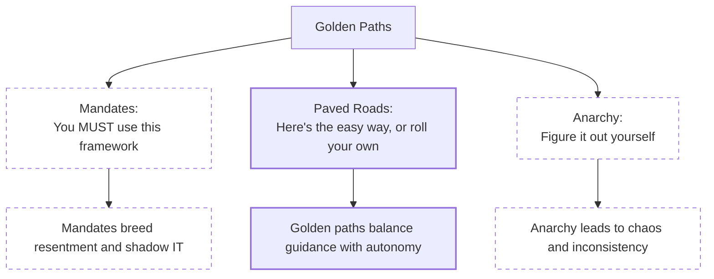
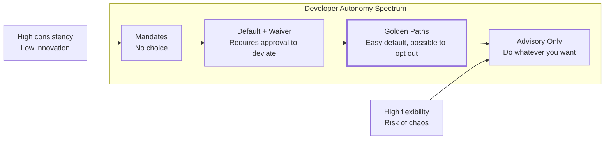
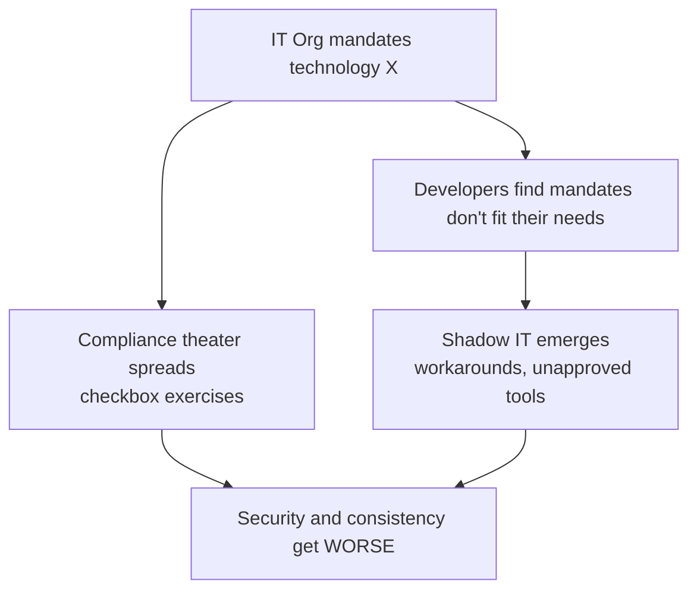
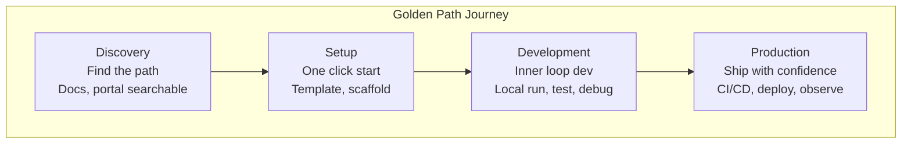
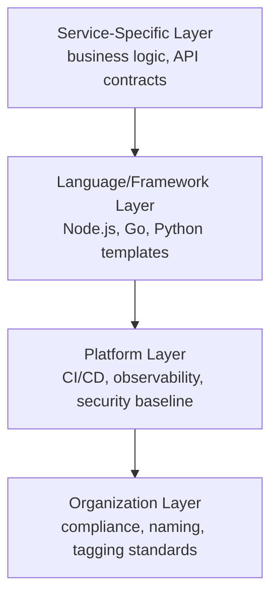
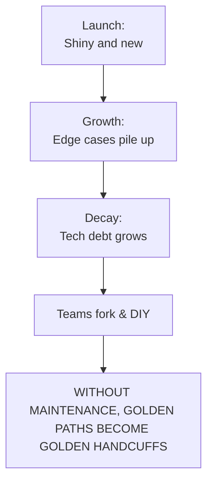

> **Discipline Module** | Complexity: `[MEDIUM]` | Time: 40-50 min

## Prerequisites

Before starting this module, you should:

- Complete [Module 2.1: What is Platform Engineering?](../module-2.1-what-is-platform-engineering/) - Platform foundations
- Complete [Module 2.2: Developer Experience](../module-2.2-developer-experience/) - Cognitive load concepts
- Complete [Module 2.3: Internal Developer Platforms](../module-2.3-internal-developer-platforms/) - IDP components
- Understand template engines (Helm, Cookiecutter, or similar)

## What You'll Be Able to Do

After completing this module, you will be able to:

- **Design golden paths that accelerate common development workflows without restricting flexibility**
- **Implement project scaffolding templates that embed security, observability, and deployment best practices**
- **Evaluate golden path adoption metrics to determine which paths deliver the most developer value**
- **Build escape hatches that let advanced teams customize golden paths for edge cases**

## Why This Module Matters

Every organization has standards. The question is whether those standards are:
- **Documented somewhere** nobody reads
- **Encoded in templates** that nobody uses
- **Embedded in paths** that make doing the right thing the easy thing

Golden paths transform "you should do X" into "here's how to do X in 5 minutes." They're not about restricting developers—they're about accelerating them while ensuring quality, security, and consistency.

This module teaches you to design golden paths that developers actually want to use.

## Did You Know?

- **Spotify coined "Golden Paths"** in 2020 to describe their paved roads approach—paths that are well-lit, well-maintained, and lead somewhere good
- **Netflix's "Paved Road"** handles 90% of use cases, freeing platform teams to support the genuinely unique 10%
- **Organizations with mature golden paths** report 60-80% reduction in time-to-production for new services
- **The best golden paths are invisible**—developers don't realize they're using a curated experience because it just feels natural

---

## What is a Golden Path?

### Definition

A **golden path** (also called paved road, happy path, or blessed path) is:

> A well-supported, opinionated route to accomplishing a common task that encodes organizational best practices while remaining optional.

Key characteristics:

| Characteristic | Description |
|---------------|-------------|
| **Opinionated** | Makes decisions so developers don't have to |
| **Supported** | Platform team maintains and evolves it |
| **Optional** | Developers can deviate if they have good reason |
| **Complete** | Handles the full journey, not just setup |
| **Discoverable** | Easy to find when you need it |

### What Golden Paths Are NOT



### The Spectrum of Developer Freedom



Golden paths sit in the sweet spot: **making the right thing easy without making the wrong thing impossible**.

> **Stop and think**: Look at the tools your team uses daily. How many of them were mandated from the top down, and how many grew organically because they were simply the easiest path to production?

---

## Golden Paths vs Mandates

### Why Mandates Fail



Real-world mandate failures:

| Mandate | Intent | Reality |
|---------|--------|---------|
| "Everyone must use Java" | Consistency | Python scripts everywhere, JavaScript "exceptions" |
| "All deployments through Jenkins" | Control | Teams running kubectl directly |
| "No cloud services" | Security | Spreadsheets with customer data on Google Sheets |
| "Use approved vendors only" | Cost control | Shadow SaaS subscriptions on expense reports |

### The Golden Path Alternative

Instead of: **"You must use PostgreSQL"**

Try: **"Here's a golden path for PostgreSQL that gives you:"**
- Pre-configured connection pooling
- Automatic backups
- Monitoring dashboards
- Easy migration paths
- Same-day provisioning

And then: **"If PostgreSQL doesn't fit, here's the process to request a different database"**

The difference:
- Mandate says "NO" until you prove you need something else
- Golden path says "YES, here's the easy way" with an option to customize

### When Mandates ARE Appropriate

Golden paths aren't universal. Some things require mandates:

| Domain | Why Mandate? | Example |
|--------|-------------|---------|
| **Security** | Legal/compliance requirements | "Secrets must be encrypted at rest" |
| **Legal** | Regulatory obligations | "PII handling follows GDPR processes" |
| **Financial** | Cost/liability | "Cloud spend must have cost allocation tags" |
| **Safety** | Critical systems | "Production changes require two approvals" |

The key: **Mandate the outcomes, golden-path the implementation**.

```text
Example:
  Mandate:      "All services must have authentication"
  Golden Path:  "Here's our auth sidecar that adds OAuth2 in 5 minutes"
```

---

## Anatomy of a Great Golden Path

### The Golden Path Journey



### Essential Elements

Every complete golden path includes:

```yaml
Golden Path: "Create a new microservice"

Discovery:
  - Searchable in developer portal
  - Clear description of what it provides
  - Honest about what it DOESN'T support

Setup:
  - One-command or one-click initialization
  - Sensible defaults (can override)
  - Integrated with existing tools

Development:
  - Local development environment
  - Hot reload / fast feedback
  - Testing framework configured
  - Documentation generated

Deployment:
  - CI/CD pipeline pre-configured
  - Environments (dev/staging/prod) set up
  - Feature flags ready

Operations:
  - Logging configured
  - Metrics exported
  - Alerts templated
  - Runbooks linked

Day 2+:
  - Upgrade path documented
  - Migration guides available
  - Deprecation warnings automated
```

### The 5-Minute Rule

A golden path fails if the developer can't get to "hello world in production" within a reasonable time:

| Stage | Target Time | What This Means |
|-------|-------------|-----------------|
| **Discovery** | < 1 minute | Find the path in portal/docs |
| **Setup** | < 5 minutes | Scaffold, credentials, access |
| **First deployment** | < 15 minutes | Running in dev environment |
| **Production-ready** | < 1 day | Full path to prod |

If any stage takes longer, you'll lose developers to "I'll just do it myself."

---

## Designing Golden Paths

> **Pause and predict**: Before you design a new golden path, what metric would most clearly indicate that developers are struggling with the current process?

### Step 1: Identify the Journey

Start by mapping what developers actually do today:

**User Research: "How do teams currently deploy a new service?"**

**Team A: 2 weeks**
- **Week 1**: Request infrastructure ticket -> Wait -> Get rejected -> Re-request with different details -> Wait -> Approved
- **Week 2**: Copy another service's config -> Modify -> Debug for days -> Ask around for help -> Finally deploy

**Team B: 3 days**
- **Day 1**: Know the right people -> Get access faster
- **Day 2**: Copy from a known-good template
- **Day 3**: Debug environment differences -> Deploy

**Team C: 4 hours**
- Use internal template -> One command -> Deployed

*The goal: Make Team C's experience the default.*

### Step 2: Define Opinions

The power of golden paths is in the decisions they make:

```yaml
# Example: Node.js Service Golden Path Opinions

Runtime:
  decision: Node.js 20 LTS
  why: Security updates, team familiarity, ecosystem
  override: Must justify in ADR

Framework:
  decision: Express.js with TypeScript
  why: Mature, well-understood, types catch errors
  override: Allowed with team approval

Database:
  decision: PostgreSQL via platform service
  why: ACID compliance, operational familiarity
  override: Request through data architecture review

Authentication:
  decision: Platform OAuth2 sidecar
  why: Consistent security, centrally managed
  override: Security team approval required

Observability:
  decision: OpenTelemetry + platform dashboards
  why: Vendor-neutral, integrated with existing tools
  override: Additional tools allowed, base required

Deployment:
  decision: Kubernetes v1.35 via ArgoCD
  why: GitOps, consistent with org standard
  override: Not negotiable for production workloads
```

### Step 3: Make It Concrete

Transform opinions into runnable templates:

```bash
# The golden path in action
$ platform create service \
    --name order-service \
    --type nodejs-api \
    --team team-orders

Creating new Node.js API service: order-service
[OK] Created GitHub repository: org/order-service
[OK] Applied Node.js template
[OK] Configured CI/CD pipelines
[OK] Set up dev/staging/prod environments
[OK] Registered in service catalog
[OK] Created initial monitoring dashboards
[OK] Added to team-orders ownership

Service ready! Next steps:
   cd order-service
   npm install
   npm run dev          # Local development
   git push             # Triggers CI/CD
```

### What Gets Generated

```text
order-service/
├── src/
│   ├── index.ts              # Entry point with health checks
│   ├── routes/               # API routes (example included)
│   └── middleware/           # Auth, logging pre-configured
├── test/
│   ├── unit/                 # Jest configured
│   └── integration/          # Test containers ready
├── deploy/
│   ├── kubernetes/           # K8s manifests
│   │   ├── base/            # Kustomize base
│   │   └── overlays/        # Per-environment
│   └── argocd/              # GitOps config
├── .github/
│   └── workflows/           # CI/CD pipelines
├── docs/
│   ├── api.md               # Generated from code
│   └── runbook.md           # Operational playbook
├── catalog-info.yaml        # Backstage integration
├── package.json             # Dependencies locked
├── tsconfig.json            # TypeScript config
├── jest.config.js           # Test config
└── README.md                # How to develop locally
```

---

## Template Design Patterns

### Pattern 1: Layered Templates



This layering allows:
- Organization layer: Update compliance requirements everywhere
- Platform layer: Upgrade CI/CD without touching app code
- Language layer: Different stacks, same operational model
- Service layer: Business-specific customization

### Pattern 2: Composition Over Inheritance

Instead of one massive template, compose from building blocks:

```yaml
# Backstage template.yaml
apiVersion: scaffolder.backstage.io/v1beta3
kind: Template
metadata:
  name: nodejs-microservice
  title: Node.js Microservice
spec:
  parameters:
    - title: Service Details
      properties:
        name:
          type: string
        description:
          type: string
        owner:
          type: string
          ui:field: OwnerPicker

    - title: Components
      properties:
        database:
          type: string
          enum:
            - none
            - postgresql
            - mongodb
        cache:
          type: string
          enum:
            - none
            - redis
        queue:
          type: string
          enum:
            - none
            - rabbitmq
            - kafka

  steps:
    # Base service
    - id: fetch-base
      action: fetch:template
      input:
        url: ./skeleton/nodejs-base

    # Conditionally add database
    - id: fetch-database
      if: ${{ parameters.database != 'none' }}
      action: fetch:template
      input:
        url: ./skeleton/database-${{ parameters.database }}

    # Conditionally add cache
    - id: fetch-cache
      if: ${{ parameters.cache != 'none' }}
      action: fetch:template
      input:
        url: ./skeleton/cache-${{ parameters.cache }}
```

### Pattern 3: Escape Hatches

Always provide ways to customize:

```yaml
# platform.yaml - service configuration

# Use all defaults
service:
  name: order-service
  type: nodejs-api

---

# Override specific defaults
service:
  name: order-service
  type: nodejs-api

  # Override: need more memory for image processing
  resources:
    memory: 1Gi  # default is 256Mi

  # Override: custom health check
  health:
    path: /api/health  # default is /health

  # Override: additional environment
  env:
    - name: FEATURE_NEW_UI
      value: "true"

---

# Escape hatch: bring your own Dockerfile
service:
  name: special-service
  type: custom  # No template, minimal scaffolding

  dockerfile: ./Dockerfile.custom
  # Platform still provides:
  # - CI/CD pipeline
  # - Kubernetes deployment
  # - Monitoring integration
```

### Pattern 4: Progressive Disclosure

Start simple, reveal complexity only when needed:

**Level 0: Zero Config**
```bash
$ platform deploy ./
# Uses conventions: Dockerfile, main branch, auto-scaling
```

**Level 1: Basic Config**
```yaml
# platform.yaml
service:
  name: my-service
  replicas: 3
```

**Level 2: Custom Behavior**
```yaml
# platform.yaml
service:
  name: my-service
  replicas: 3
  scaling:
    min: 2
    max: 10
    metrics:
      - type: cpu
        target: 70
```

**Level 3: Full Control**
```yaml
# platform.yaml
service:
  name: my-service
  kubernetes:
    deployment:
      spec:
        # Full Kubernetes spec access
        containers:
          - name: app
            resources:
              requests:
                memory: "512Mi"
```

---

## Maintaining Golden Paths

### The Maintenance Challenge



### Maintenance Practices

**1. Version Your Paths**

```yaml
# Template versioning
templates/
├── nodejs-api/
│   ├── v1/          # Original, deprecated
│   ├── v2/          # Current default
│   └── v3/          # Beta, opt-in
└── catalog.yaml

# catalog.yaml
templates:
  - name: nodejs-api
    versions:
      - version: v1
        status: deprecated
        sunset: 2024-06-01
        migration: docs/migrations/v1-to-v2.md
      - version: v2
        status: current
        default: true
      - version: v3
        status: beta
        features: [arm64-support, otel-v2]
```

**2. Track Adoption**

```sql
-- Golden path adoption metrics

-- How many services use each path?
SELECT
  template_name,
  template_version,
  COUNT(*) as services,
  COUNT(*) * 100.0 / SUM(COUNT(*)) OVER () as percentage
FROM services
GROUP BY template_name, template_version
ORDER BY services DESC;

-- Template drift: services that modified template files
SELECT
  service_name,
  modified_files,
  last_template_update
FROM services
WHERE template_drift_score > 0.3  -- 30%+ files modified
ORDER BY template_drift_score DESC;
```

**3. Automated Upgrades**

```yaml
# Renovate-style template updates
# .github/workflows/template-upgrade.yaml

name: Template Upgrade Check

on:
  schedule:
    - cron: '0 0 * * 1'  # Weekly

jobs:
  check-updates:
    runs-on: ubuntu-latest
    steps:
      - uses: platform/template-checker @scripts/v1_pipeline.py
        with:
          current-template: nodejs-api-v2

      - name: Create upgrade PR
        if: steps.checker.outputs.update-available
        uses: platform/template-upgrader @scripts/v1_pipeline.py
        with:
          target-version: ${{ steps.checker.outputs.latest }}
          auto-merge: false  # Human review required
```

**4. Feedback Loops**

```yaml
# Embedded feedback collection
# Every golden path includes:

post_scaffold_survey:
  trigger: 7_days_after_creation
  questions:
    - "How easy was it to get started? (1-5)"
    - "What took longer than expected?"
    - "What's missing?"

nps_survey:
  trigger: 30_days_after_creation
  question: "How likely are you to recommend this golden path?"

exit_interview:
  trigger: service_deleted_or_archived
  questions:
    - "Why did you stop using this service/template?"
    - "What would have made you stay?"
```

### War Story: The Abandoned Path

> **"Why Did Nobody Use Our Perfect Template?"**
>
> A platform team spent 3 months building the "ultimate" microservice template. It had everything: 15 integrations, comprehensive testing, full observability. Launch day came with great fanfare.
>
> Six months later, adoption was 12%. Most teams were still copying from a 2-year-old service called "order-service-old".
>
> **Why?**
>
> The team investigated:
> - Template took 45 minutes to scaffold (too many prompts)
> - Local development required 8 services running
> - "Hello world" was buried under generated code
> - Documentation assumed expert knowledge
>
> Meanwhile, order-service-old:
> - Zero configuration
> - Copy-paste in 5 minutes
> - Everyone knew how it worked
>
> **The fix:**
> 1. Created "lite" version with minimal setup
> 2. Made integrations opt-in, not default
> 3. Added progressive complexity levels
> 4. Ran the 5-minute test with real developers
>
> Adoption jumped to 67% in 3 months.
>
> **Lesson**: The best template you ship beats the perfect template in development.

---

## Common Mistakes

| Mistake | Why It Happens | Better Approach |
|---------|---------------|-----------------|
| **Too many options** | Trying to support every use case | Start with 80% case, add options later |
| **No escape hatch** | Fear of "doing it wrong" | Trust developers, provide escape routes |
| **One-size-fits-all** | Efficiency mindset | Different paths for different needs |
| **Set and forget** | Launch fatigue | Budget ongoing maintenance from day 1 |
| **Building in isolation** | "We know best" | Co-create with developer users |
| **Mandating the path** | Control instinct | Make it so good mandate isn't needed |
| **Ignoring existing patterns** | Greenfield thinking | Pave the cowpaths first |
| **Perfect before shipping** | Perfectionism | Ship MVP, iterate based on feedback |

---

## Golden Path Metrics

### Measuring Success

```yaml
Adoption Metrics:
  - percentage_of_services_on_golden_path
  - time_from_discovery_to_first_deploy
  - golden_path_vs_custom_ratio

Satisfaction Metrics:
  - developer_nps_for_golden_path
  - support_tickets_per_service
  - time_to_productive (first meaningful change)

Quality Metrics:
  - security_findings_golden_vs_custom
  - incident_rate_golden_vs_custom
  - mttr_golden_vs_custom

Maintenance Metrics:
  - template_drift_score
  - upgrade_adoption_rate
  - deprecation_compliance
```

### Example Dashboard

**Adoption Rate**: 73%
**Time to First Deploy**: 18 min (Down from 2hr)
**Developer NPS**: +42 (Up from +28)

**Template Versions**
- v3 (current): 156
- v2 (supported): 82
- v1 (deprecated): 23
- custom: 45

**Services by Path**
- nodejs-api: 180
- go-service: 95
- python-ml: 45
- static-site: 35
- custom: 45

**Recent Feedback**
- "Database setup was confusing" - team-payments (3 days ago)
- "Love the new debugging tools!" - team-search (5 days ago)
- "Need ARM64 support" - team-ml (1 week ago)

---

## Quiz

Test your understanding of golden paths:

**Question 1**: Your platform team is rolling out a new standardized CI/CD pipeline. The CIO wants to require all teams to use it by Q3, but your team advocates for a golden path approach instead. How would the rollout and enforcement differ under a golden path strategy?

<details>
<summary>Show Answer</summary>

Under a golden path strategy, the platform team would provide the CI/CD pipeline as a supported, easy route while allowing developers to opt out and manage their own pipelines if they have a valid business reason. Mandates require compliance and prohibit alternatives, essentially saying "NO" by default. The golden path says "YES, here's the easy way," but relies on the pipeline being so valuable and seamless that developers actively choose to use it rather than being forced to. This builds developer trust and focuses the platform team on delivering a product that solves real friction, rather than acting as compliance enforcers.
</details>

**Question 2**: A platform engineering team releases a new microservice golden path. It includes twenty configuration prompts covering networking, storage, security, and alerting, and it takes around 45 minutes to scaffold. Adoption is extremely low. What core principle was violated, and how should it be addressed?

<details>
<summary>Show Answer</summary>

This golden path clearly violates the 5-minute rule, which states that developers must be able to go from discovery to a deployed "hello world" quickly. Because the template attempts to capture too many configuration prompts upfront, developers suffer from decision fatigue and abandon the process. Additionally, the lack of sensible defaults means every user pays the cognitive cost of configuring edge cases they might not even need. To fix this, the team should implement progressive disclosure by offering a minimal default path and making advanced options discoverable only when required.
</details>

**Question 3**: Your organization handles sensitive financial transactions. The security team wants to implement a new encryption standard for all data at rest. Should this be implemented as a golden path or a mandate, and why?

<details>
<summary>Show Answer</summary>

This requirement must be implemented as a mandate because it addresses a fundamental security and compliance obligation. Golden paths are designed to be optional, giving developers the autonomy to diverge if they maintain their own solutions, which is unacceptable for non-negotiable legal or regulatory requirements like financial data encryption. However, the best approach is to mandate the outcome while golden-pathing the implementation. You enforce the rule that all data must be encrypted, but you provide a frictionless golden path—such as a pre-configured storage module or a sidecar—that automatically handles the encryption, making compliance the easiest choice.
</details>

**Question 4**: Your platform team deployed a highly successful golden path for Python microservices 18 months ago. Recently, you notice that new teams are forking the template repository and manually modifying it rather than using the centralized updates. What is the most likely cause of this behavior, and how should you respond?

<details>
<summary>Show Answer</summary>

This pattern is a classic symptom of golden path decay, which occurs when a template fails to keep pace with evolving developer needs or accumulates unhandled edge cases. Over time, as new integrations or dependencies are required, teams find it easier to fork the repository than to work within a constrained or outdated path. To address this, the platform team must establish a feedback loop to understand why developers are diverging and identify the unmet needs. They should then version the templates, automate the upgrade process, and ensure that the golden path is treated as an actively maintained product rather than a set-and-forget project.
</details>

**Question 5**: You are designing a golden path for provisioning cloud databases. A senior engineer argues that if you allow teams to bring their own custom database configurations, it defeats the entire purpose of standardization. Why should you insist on including "escape hatches" in your design?

<details>
<summary>Show Answer</summary>

You must include escape hatches because no single template can ever accommodate one hundred percent of a large organization's use cases. If you lock developers into a rigid structure without a way out, teams with legitimate edge cases will abandon the platform entirely, leading to shadow IT and fragmented tooling. Escape hatches build developer trust by acknowledging their expertise and providing a documented, supported way to bypass defaults while still benefiting from baseline platform services like monitoring and deployment. Tracking how often these escape hatches are used also provides critical data for evolving the standard golden path in the future.
</details>

---

## Hands-On Exercise

### Scenario

Your organization has the following situation:
- 150 microservices across 20 teams
- 5 different ways services are currently created
- Common complaints: "takes forever to deploy new services", "every service is different"
- Security findings: 40% of services missing basic authentication

### Your Task

Design a golden path for creating new microservices.

### Part 1: Journey Mapping (10 minutes)

Document the current journey for creating a new service:

```markdown
## Current State: New Service Creation

### The Happy Path (best case today)
1. [What happens?]
2. [How long?]
3. [Who's involved?]

### The Typical Path (most common)
1. [What happens?]
2. [How long?]
3. [What goes wrong?]

### Key Pain Points
- [ ]
- [ ]
- [ ]

### Why 40% Are Missing Auth
- [ ]
```

### Part 2: Define Opinions (10 minutes)

Document the decisions your golden path will make:

```markdown
## Golden Path Opinions

### Non-Negotiable (mandated outcomes)
| Requirement | Reason |
|-------------|--------|
| [e.g., Authentication] | [e.g., Security compliance] |

### Strong Defaults (can override with justification)
| Decision | Default | Override Process |
|----------|---------|------------------|
| [e.g., Language] | [e.g., Go] | [e.g., Team lead approval] |

### Preferences (easily overridable)
| Decision | Default | How to Override |
|----------|---------|-----------------|
| [e.g., Port] | [e.g., 8080] | [e.g., Set in config] |
```

### Part 3: Template Sketch (15 minutes)

Design what the template provides:

```markdown
## Golden Path: New Microservice

### Usage
$ [command to create service]

### What Gets Generated
[Directory structure]

### Built-in Capabilities
- [ ] Authentication: [how?]
- [ ] Observability: [what?]
- [ ] CI/CD: [pipeline?]
- [ ] Local dev: [how to run?]

### Escape Hatches
- [ ] Custom [X]: [how?]
```

### Part 4: Success Criteria (5 minutes)

Define how you'll measure success:

```markdown
## Success Metrics

### Adoption Target
- [ ] [X]% of new services on golden path within [Y] months

### Developer Experience
- [ ] Time to first deploy: [target]
- [ ] Developer NPS: [target]

### Quality Impact
- [ ] Services missing auth: [target reduction]
```

### Reflection Questions

After completing the exercise:

1. What decisions were hardest to make? Why?
2. Where did you need to balance standardization vs. flexibility?
3. How would you handle teams that refuse to adopt the path?
4. What maintenance would this golden path require?

---

## Summary

Golden paths succeed by making the right thing the easy thing:

```text
KEY PRINCIPLES:
  1. OPINIONATED but not MANDATORY
     Make decisions so developers don't have to

  2. COMPLETE journey, not just SETUP
     Discovery -> Development -> Production -> Day 2+

  3. ESCAPE HATCHES for legitimate needs
     Trust developers to know when they need to deviate

  4. MAINTAINED actively, not launched and forgotten
     Version, measure, gather feedback, iterate

  5. CO-CREATED with developers, not imposed on them
     The best paths pave existing cowpaths
```

The test of a great golden path: **developers choose it because it's better, not because they have to**.

---

## Further Reading

### Articles
- [Spotify's Golden Path to Kubernetes](https://engineering.atspotify.com/2020/08/how-we-use-golden-paths-to-solve-fragmentation-in-our-software-ecosystem/)
- [Netflix Paved Road](https://netflixtechblog.com/full-cycle-developers-at-netflix-a08c31f83249)
- [How to Build a Platform Team](https://martinfowler.com/articles/platform-teams-stuff-done.html)

### Books
- *Team Topologies* - Matthew Skelton & Manuel Pais
- *Building Evolutionary Architectures* - Neal Ford, Rebecca Parsons, Patrick Kua

### Talks
- "Paved Paths at Scale" - KubeCon
- "Building Golden Paths" - PlatformCon 2023

---

## Next Module

Continue to [Module 2.5: Self-Service Infrastructure](../module-2.5-self-service-infrastructure/) to learn how to empower developers with on-demand infrastructure while maintaining control and governance.