# Module 2.5: Self-Service Infrastructure

> **Discipline Module** | Complexity: `[COMPLEX]` | Time: 50-60 min

## Prerequisites

Before starting this module, you should be comfortable with the platform engineering foundations introduced earlier in this track, especially the idea that a platform is a product with internal customers rather than a pile of shared scripts.

You should complete [Module 2.1: What is Platform Engineering?](../module-2.1-what-is-platform-engineering/) before this lesson, because self-service infrastructure only makes sense when you understand the platform team's product responsibility.

You should complete [Module 2.3: Internal Developer Platforms](../module-2.3-internal-developer-platforms/) before this lesson, because the self-service workflows in this module usually appear inside an IDP, CLI, API, or GitOps interface.

You should complete [Module 2.4: Golden Paths](../module-2.4-golden-paths/) before this lesson, because self-service infrastructure is one of the most important places where golden paths become executable.

You should understand basic infrastructure-as-code concepts from Terraform, OpenTofu, Pulumi, CloudFormation, Bicep, Crossplane, or a similar tool, because the module assumes you know that infrastructure can be declared and reconciled.

You should be familiar with Kubernetes Custom Resources at a conceptual level, because several examples use Kubernetes-style APIs to model cloud resources even when the final infrastructure runs outside Kubernetes.

## Learning Outcomes

After completing this module, you will be able to:

- **Design** a self-service infrastructure workflow that balances developer autonomy, organizational control, provisioning speed, and operational safety.
- **Evaluate** infrastructure abstractions and choose which provider details to hide, expose, default, or route through an exception process.
- **Implement** guardrail patterns that enforce cost, security, ownership, lifecycle, and compliance requirements without recreating a slow ticket queue.
- **Debug** a self-service workflow that provisions successfully on Day 0 but fails during scaling, backup, restore, ownership, or decommissioning.
- **Compare** Crossplane, Terraform-based GitOps, and internal platform APIs for a team's specific operating model, skills, and risk profile.

## Why This Module Matters

A payments company migrated from a private data center to public cloud and expected product teams to ship faster immediately. Instead, every database still required a ticket, every ticket required two approvals, every approval waited for a weekly operations review, and every follow-up change restarted the queue. Developers had cloud accounts, but they did not have a safe path to use them.

The platform team saw the symptoms in every incident review. Teams created temporary cloud resources by hand because the official process was too slow, then forgot to delete them because the official inventory was incomplete. Security found unencrypted databases that were created during emergencies. Finance found development environments running through weekends and holidays. Operations found that "standard database" meant something different for each team.

Self-service infrastructure fixes the workflow, not merely the tooling. A good platform gives developers a fast, obvious way to request the thing they actually need, while the platform injects secure defaults, cost controls, ownership metadata, audit trails, and lifecycle operations. The developer experiences autonomy; the organization still gets governance.

The senior-level skill is not knowing which portal, controller, or provisioning engine is fashionable. The senior-level skill is deciding where choice helps developers, where choice creates risk, and how the platform turns those decisions into repeatable workflows. By the end of this module, you should be able to design self-service that makes the right thing faster than the risky thing.

## Core Content

## 1. From Ticket Queue to Product Workflow

Self-service infrastructure starts with a simple observation: most infrastructure requests are not unique architecture decisions. Many requests are repeated patterns such as "give my service a development PostgreSQL database," "create a staging queue," or "increase cache size before a launch." When every repeated pattern becomes a ticket, the organization pays senior engineering time for low-variation work.

The platform team's job is to separate common intent from exceptional risk. Common intent should flow through an automated path with clear defaults and fast feedback. Exceptional risk should still receive human review, but the review should be attached to the risky dimension, not to the entire category of infrastructure. This distinction prevents "everything needs approval" from becoming the default answer.

A ticket queue often feels controlled because a human is present, but it can hide more risk than it removes. Manual provisioning encourages copy-paste changes, incomplete audit trails, missed cleanup steps, and inconsistent defaults between teams. A request might be approved, yet still produce an unencrypted database or an ownerless resource because approval and enforcement are different controls.

Self-service infrastructure turns the request into a product workflow. The user chooses an approved resource type, supplies a small amount of intent, sees estimated cost and policy feedback, and receives a tracked resource with lifecycle operations. The platform validates the request before provisioning, records the decision, and keeps enough state to support Day 2 operations later.

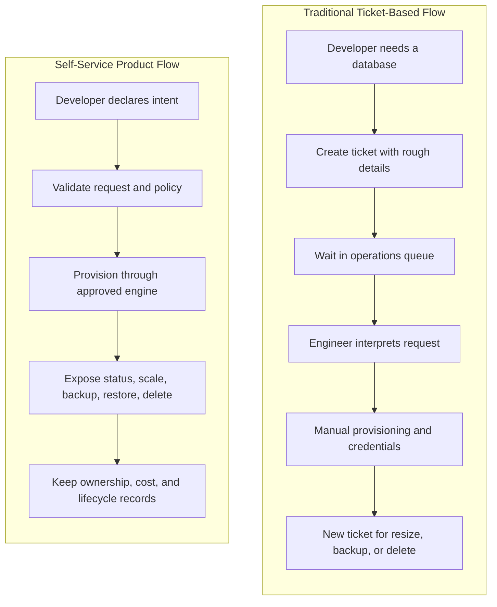

The difference is not merely speed. The self-service flow creates a system of record for what exists, why it exists, who owns it, which controls applied, and which operations are allowed next. That system of record is what lets a platform team improve reliability, security, and cost over time.

A beginner might describe self-service as "developers click a button to create cloud resources." A practitioner should describe it as "developers express bounded intent through an interface whose control plane validates, provisions, records, and operates infrastructure across its lifecycle." The second definition is longer because the hard parts are not the button.

The basic sequence is request, validate, decide, provision, observe, and operate. The request captures intent. Validation checks shape, policy, ownership, quota, cost, and environment constraints. The decision step chooses auto-approval, human approval, denial, or exception routing. Provisioning calls a tool such as Crossplane, Terraform, OpenTofu, Pulumi, CloudFormation, Bicep, or an internal API. Observation reports status and failure reasons. Operation keeps the resource useful after creation.

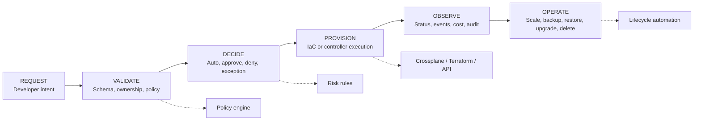

A useful mental model is the self-service triangle: speed, control, and autonomy. Speed means a standard request completes quickly enough that developers do not route around the platform. Control means security, compliance, cost, and operational constraints are actually enforced. Autonomy means developers can make normal changes without waiting for an operations team to interpret their intent.

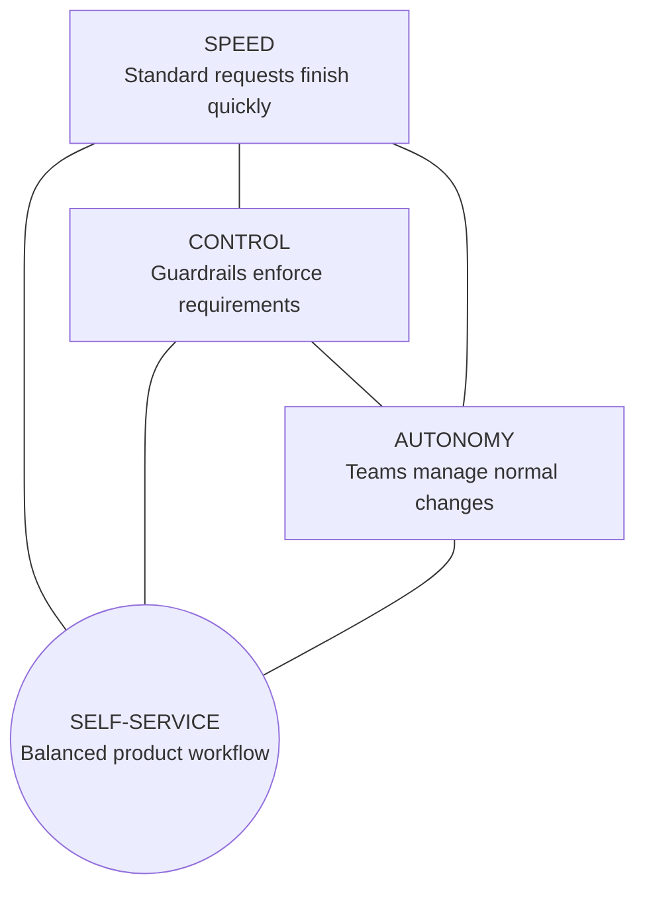

If one corner dominates, the platform fails in a predictable way. Too much control recreates the ticket queue, even if the ticket now appears inside a portal. Too much autonomy creates cloud sprawl, inconsistent security, and invisible operational risk. Too much speed without lifecycle design produces resources quickly, but then strands teams when they need to resize, restore, or delete safely.

A platform team should therefore measure self-service by flow and outcomes, not by the existence of an interface. A portal that creates a ticket is not self-service. A CLI that creates insecure resources is not good self-service. A GitOps repository that requires a platform engineer to approve every standard development database is automated bureaucracy, not an enabling platform.

**Active learning prompt:** Think about a resource your organization provisions often, such as a database, queue, object bucket, namespace, or service account. If a developer requested it today, which parts of the workflow are genuinely about risk, and which parts are waiting caused by unclear ownership or manual handoff?

The first design decision is choosing the unit of self-service. A unit should be meaningful to the developer, enforceable by the platform, and operable after creation. "RDS instance" may be too provider-specific for many teams. "Database" may be a better unit if the platform can map size, environment, networking, backup, encryption, and credentials into approved defaults.

The second design decision is choosing where the self-service contract lives. It might live as a Kubernetes Custom Resource, an OpenAPI endpoint, a Terraform module with validated variables, a Backstage template, a CLI command, or a GitOps directory structure. The interface can vary, but the contract must remain explicit. Developers need to know what inputs they own, what defaults the platform owns, and what happens when a request is denied.

The third design decision is choosing the feedback loop. A mature self-service system gives immediate feedback for invalid names, missing owners, invalid sizes, over-budget requests, unsupported regions, or blocked environments. A weak system accepts the request, disappears into an asynchronous job, and fails hours later with a provider error that only the platform team can interpret.

Feedback quality matters because it determines whether developers learn the platform's rules or fear them. A denial that says "policy failed" is not useful. A denial that says "production databases require backups enabled and an owner group that exists in the identity system" teaches the platform contract and gives the user a path forward.

A worked example makes the difference concrete. Suppose the legacy process asks developers to file a ticket with free-form text like "Need Postgres for orders service in staging." Operations then asks follow-up questions about size, backup retention, network access, owner, cost center, and expected lifetime. The self-service design should turn those repeated follow-up questions into a typed contract.

```yaml
apiVersion: platform.example.com/v1alpha1
kind: DatabaseRequest
metadata:
  name: orders-db
  namespace: team-orders
  labels:
    platform.example.com/team: orders
    platform.example.com/cost-center: cc-1024
spec:
  engine: postgresql
  environment: staging
  size: medium
  dataClass: internal
  ownerGroup: team-orders
  lifetime:
    expiresAfterDays: 90
  backup:
    retentionDays: 7
```

This request is small, but it carries enough intent for the platform to act. The developer did not choose a subnet group, storage encryption flag, IAM policy, parameter group, provider-specific instance class, or backup window. The platform can derive those values from environment, data classification, team ownership, and the approved size catalog.

The platform can also reject the request before any cloud resource exists. If the owner group is missing, the denial should happen during validation. If the cost center is unknown, the denial should happen before provisioning. If staging resources must expire, the request should require a lifetime value or default one. These checks turn governance from a review meeting into executable product behavior.

A good self-service workflow also makes waiting visible when waiting is unavoidable. Production databases with sensitive data may need approval from a service owner or data steward. That does not mean every production database needs a weekly committee. The workflow should show who needs to approve, why approval is required, what evidence is attached, and what service-level objective applies to the decision.

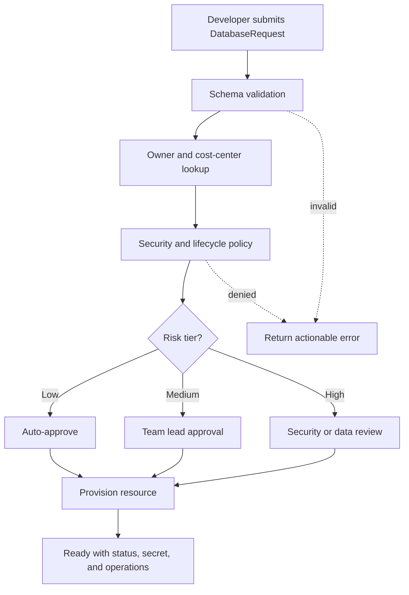

Notice that the approval step is based on risk tier, not on the mere fact that infrastructure is being created. A development PostgreSQL database with internal data, short lifetime, small size, and known owner should not wait for a human. A production database containing regulated data, large monthly cost, and public network exposure should not be created in seconds without review.

The beginner-level takeaway is that self-service means removing manual handoffs from standard work. The practitioner-level takeaway is that standard work must be deliberately defined. The senior-level takeaway is that the platform must encode risk decisions so the fast path remains trustworthy and the exception path remains usable.

## 2. Designing the Right Abstraction

An abstraction is not a wrapper around a cloud API. An abstraction is a product decision about what the developer should think about and what the platform should own. If the abstraction exposes every provider field, it saves little cognitive load. If it hides every meaningful decision, developers will route around it when real workloads do not fit.

The best infrastructure abstractions expose intent, constraints, and safe variation. Intent says what the developer needs, such as a relational database for an orders service. Constraints say what matters about the resource, such as environment, data classification, lifetime, and expected usage tier. Safe variation lets teams choose within approved boundaries, such as small, medium, or large sizes with documented cost and performance trade-offs.

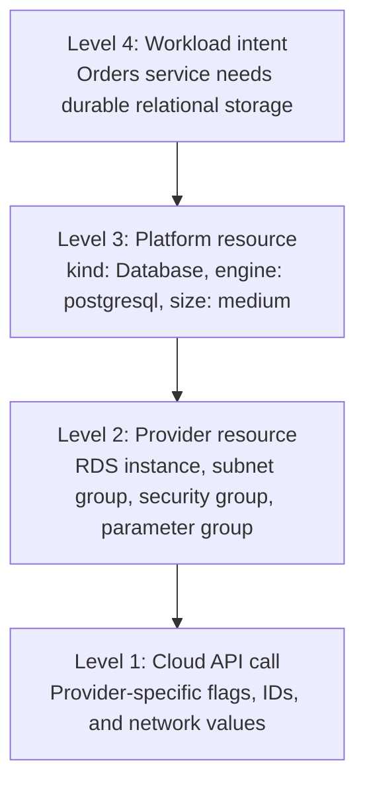

A Level 1 abstraction is essentially the cloud provider API. It is powerful, but it pushes every provider-specific detail onto the developer. A Level 2 abstraction uses infrastructure-as-code modules but may still expose many provider concepts. A Level 3 abstraction introduces a platform-owned resource type such as `Database`, `Cache`, or `Queue`. A Level 4 abstraction lets developers express workload intent and lets the platform choose the backing resource class.

Most organizations should start with Level 3 for infrastructure self-service. It is concrete enough to operate and debug, but simple enough to reduce repeated decision-making. Level 4 can be powerful later, but it requires strong workload metadata, capacity models, and trust in platform choices. If the platform chooses too much too early, teams may feel they lost control.

A strong abstraction begins with the failure modes of the old process. If databases are missing encryption, encryption must become a platform-owned default, not a user-controlled checkbox. If resources are orphaned, ownership must become required metadata. If developers oversize resources because they cannot estimate provider classes, size should become a catalog choice with cost shown at request time. If changes are hard, lifecycle operations must be part of the same contract.

The following input is intentionally specific because vague exercises produce vague designs. Imagine your organization currently uses a legacy cloud configuration like this for development and staging databases.

```yaml
# legacy-cloud-request.yaml
requestId: REQ-1842
requester: maya.chen@example.com
team: checkout
application: checkout-api
environment: development
cloudProvider: aws
region: us-east-1
resource:
  service: rds
  engine: postgres
  engineVersion: "15.5"
  instanceClass: db.t3.large
  allocatedStorageGb: 200
  storageEncrypted: false
  publiclyAccessible: false
  backupRetentionDays: 0
  deletionProtection: false
  subnetGroupName: shared-public-subnets
  securityGroupIds:
    - sg-legacy-open-dev
tags:
  cost-center: ""
  owner: ""
  expires-after: ""
notes: "Temporary database for checkout feature testing. Please create today if possible."
```

This legacy request contains enough information to create a resource, but it is a poor developer contract. The requester had to know provider fields, but still left out ownership and cost accountability. The instance class and storage are probably oversized for development. Encryption is disabled. Backups are disabled. The subnet group name conflicts with the likely intent because a development database should not land in shared public subnets.

A platform abstraction should transform this request into a smaller, safer declaration. The developer should identify the application, environment, data class, owner group, expected size, and lifetime. The platform should derive the cloud account, region, subnet group, encryption setting, backup defaults, provider class, credential delivery, monitoring, and allowed operations.

```yaml
apiVersion: platform.example.com/v1alpha1
kind: Database
metadata:
  name: checkout-dev-db
  namespace: team-checkout
  labels:
    platform.example.com/team: checkout
    platform.example.com/cost-center: cc-checkout
spec:
  engine: postgresql
  environment: development
  size: small
  dataClass: internal
  ownerGroup: team-checkout
  lifetime:
    expiresAfterDays: 30
```

The revised request is not merely shorter. It is better aligned with the work the developer is trying to do. The platform can now enforce encryption, pick private subnets, apply a development backup policy, create credentials in the team's namespace, attach monitoring, and schedule expiry warnings. The developer does not need provider trivia to get a compliant resource.

**Worked example:** Converting the legacy request should produce a set of explicit platform decisions, not just a prettier YAML file. The platform changes `storageEncrypted: false` into an always-on default because encryption is a compliance requirement. It changes `db.t3.large` into `size: small` because development databases start from a cost-aware catalog. It replaces empty ownership tags with `ownerGroup` and `cost-center` labels because lifecycle and showback depend on them. It replaces `backupRetentionDays: 0` with an environment default because development may need short retention while production needs longer retention.

| Legacy field | Platform decision | Reasoning |
|--------------|-------------------|-----------|
| `instanceClass: db.t3.large` | Replace with `size: small` | Developers choose capacity tier, while the platform maps tiers to provider classes and cost ranges. |
| `storageEncrypted: false` | Force encryption on | Security requirements should not rely on requesters remembering a provider flag. |
| `backupRetentionDays: 0` | Default by environment | Development can use short retention, while production requires stronger recovery controls. |
| `subnetGroupName: shared-public-subnets` | Derive private subnet group | Network placement is an organizational control, not a developer convenience field. |
| Empty owner and cost tags | Require owner group and cost center | Support, cleanup, audit, and showback all fail without ownership metadata. |

A size catalog should be understandable before it is precise. Developers rarely know whether they need `db.m6g.large` or `db.r6g.xlarge` during the first request. They can usually estimate whether they are testing locally, serving normal production traffic, or preparing for a launch event. The catalog should map those choices to provider details, cost ranges, and approval behavior.

| Size | Intended use | Default provider class | Approximate monthly cost | Approval behavior |
|------|--------------|------------------------|--------------------------|-------------------|
| `small` | Development, test, low traffic services | `db.t4g.micro` or equivalent | Low | Auto-approved when within quota. |
| `medium` | Staging and ordinary production services | `db.t4g.medium` or equivalent | Moderate | Auto-approved outside sensitive data cases. |
| `large` | High traffic services with clear owners | `db.m6g.large` or equivalent | Higher | Requires service owner approval in production. |
| `xlarge` | Exceptional load, launch events, migrations | Platform-selected class | Significant | Requires time-bound exception and review. |

T-shirt sizing is useful only when the platform owns the mapping and revisits it. If `medium` stays mapped to an obsolete instance class for years, the abstraction becomes a cost leak. If developers cannot see approximate cost, they cannot make responsible choices. If there is no exception path, teams will either misuse the largest standard size or bypass the platform.

**Active learning prompt:** Before reading further, decide what should happen when a team requests an `xlarge` production database for a two-day launch event. Should the platform deny it, approve it forever, approve it with an expiry, or route it through review? Write down the operational consequence of your choice.

The best answer is usually a time-bound exception. The platform should support a request that says "large capacity is needed until a specific date for a specific reason." The exception should create an audit record, notify approvers, and schedule a review or automatic downsize. This preserves autonomy during legitimate events while preventing temporary capacity from becoming permanent waste.

```yaml
apiVersion: platform.example.com/v1alpha1
kind: Database
metadata:
  name: checkout-launch-db
  namespace: team-checkout
  labels:
    platform.example.com/team: checkout
    platform.example.com/cost-center: cc-checkout
spec:
  engine: postgresql
  environment: production
  size: xlarge
  dataClass: confidential
  ownerGroup: team-checkout
  exception:
    reason: "Two-day launch campaign with expected traffic spike"
    expiresOn: "2026-05-15"
    requestedBy: maya.chen@example.com
```

A simplified abstraction should still expose meaningful operational choices. For a database, developers may need engine, environment, size, data classification, owner group, lifetime for non-production, and backup retention within allowed bounds. They usually should not choose raw subnet IDs, encryption flags, provider credentials, security group IDs, monitoring agents, audit log destinations, or IAM policies.

The platform should also document ownership boundaries. Developers own the resource name, application association, environment, intended size, data classification, and lifecycle intent. The platform owns provider mapping, secure defaults, network placement, observability integration, backup implementation, secret delivery, policy enforcement, and emergency controls. Ambiguity here becomes support tickets later.

Abstraction design also needs an escape hatch. An escape hatch is not an unguarded bypass. It is a documented path for valid cases that do not fit the default contract. It should ask for why, until when, who approves, what risk is accepted, and how the resource returns to the standard path. Without an escape hatch, teams create shadow infrastructure.

The senior design question is not "how few fields can we expose?" It is "which fields produce better decisions when the developer controls them, and which fields produce better outcomes when the platform controls them?" This question should be answered resource by resource, because a database, Kubernetes namespace, object bucket, and message queue have different risk surfaces.

## 3. Control Plane Architecture and Guardrails

A self-service platform has a control plane even if nobody calls it that. The control plane receives requests, validates contracts, evaluates policy, makes approval decisions, invokes provisioning engines, records state, and exposes status. The developer interface might be a portal, CLI, API, or Git repository, but the control plane is where product behavior becomes enforceable.

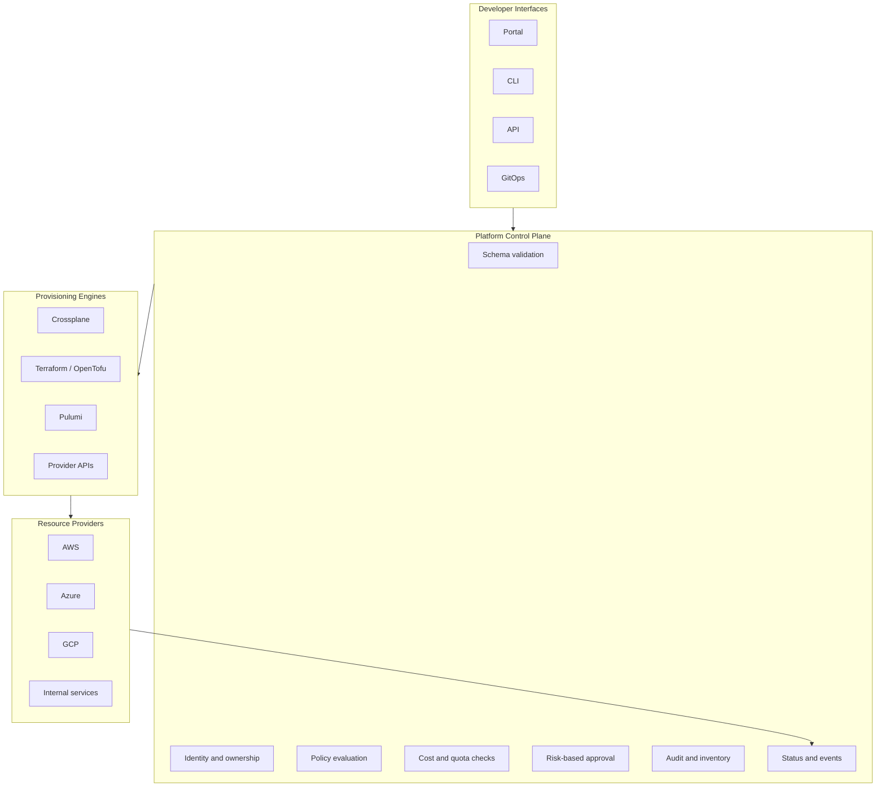

The interface should be optimized for the user's workflow. A portal is useful for discovery, guided forms, cost preview, and occasional users. A CLI is useful for repeated actions and local development. An API is useful for automation and integration. GitOps is useful when teams want change review, version history, and reconciliation. Mature platforms often support more than one interface backed by the same contract.

The contract should not change depending on interface. If a portal, CLI, API, and GitOps workflow create different versions of a "standard database," the platform is not coherent. The interface may differ, but validation, policy, approval, provisioning, audit, and lifecycle behavior should converge on the same resource model.

```bash
platform database create checkout-dev-db \
  --team checkout \
  --environment development \
  --engine postgresql \
  --size small \
  --data-class internal \
  --expires-after-days 30
```

The CLI command above should result in the same resource contract as a YAML request. It can be wrapped by a portal form or generated by a Backstage template, but the platform should store a normalized representation. Normalization prevents interface drift and makes policy easier to reason about.

```yaml
apiVersion: platform.example.com/v1alpha1
kind: Database
metadata:
  name: checkout-dev-db
  namespace: team-checkout
  labels:
    platform.example.com/team: checkout
    platform.example.com/cost-center: cc-checkout
spec:
  engine: postgresql
  environment: development
  size: small
  dataClass: internal
  ownerGroup: team-checkout
  lifetime:
    expiresAfterDays: 30
```

Guardrails are the mechanism that keeps self-service from becoming unmanaged cloud access. A guardrail is a control that guides, blocks, warns, records, or corrects behavior. Guardrails should be designed as part of the product experience, because a confusing guardrail feels like arbitrary bureaucracy even when the policy is reasonable.

There are four useful guardrail categories: preventive, detective, corrective, and advisory. Preventive guardrails stop invalid or dangerous requests before they create resources. Detective guardrails find problems after creation, such as drift or unused resources. Corrective guardrails fix known issues automatically, such as deleting expired development environments after warning. Advisory guardrails inform users without blocking, such as suggesting a smaller size.

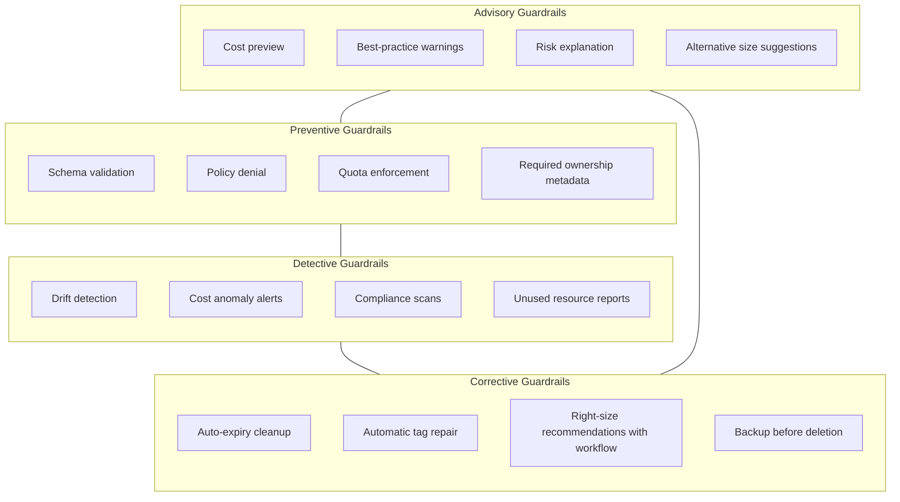

Preventive controls are strongest when the rule is clear and the consequences of violation are high. Encryption for databases is a good preventive rule because the requirement is known before provisioning. Required ownership is another good preventive rule because an ownerless resource creates operational risk immediately. Production public exposure is often preventive because the blast radius is high.

Detective controls are useful when the rule depends on runtime behavior or cannot be fully known at request time. A database that has no connections for a month may be orphaned, but it was not necessarily wrong to create it. A resource that drifts from its declared configuration may need investigation. A cost spike may be legitimate during an incident. Detective controls should create visibility and workflow, not just alerts.

Corrective controls are appropriate when the platform can safely repair or clean up a known condition. Non-production resources with explicit expiry dates can be backed up and removed after warnings. Missing optional tags can sometimes be repaired from inventory data. A stale DNS entry can be removed after dependency checks. Corrective controls need careful safeguards because automated cleanup can cause outages if ownership and dependency data are poor.

Advisory controls are valuable when a hard block would be too disruptive. If a team requests `large` for development, the platform can show expected cost and suggest `small` before allowing the request. If a team chooses a short backup retention for staging, the platform can warn about restore limitations. Advisory controls teach without stopping flow.

A policy matrix helps convert vague governance goals into implementable behavior.

| Requirement | Best guardrail type | Example platform behavior | Why this type fits |
|-------------|--------------------|---------------------------|--------------------|
| Every database must be encrypted | Preventive | Deny requests that would produce unencrypted storage | The rule is mandatory and known before creation. |
| Development resources should not live forever | Corrective | Require expiry, warn owner, back up, then delete after grace period | The resource may be valid temporarily, so lifecycle automation fits. |
| Teams should avoid oversized staging databases | Advisory plus detective | Show cost at request time and report low utilization later | Usage may justify size, so guidance and evidence are better than a universal block. |
| Manual provider console changes should not persist | Detective plus corrective | Detect drift, notify owner, reconcile or open repair workflow | Drift appears after creation and may need context before correction. |

Policy should be close to the request path. If cost center is required, validate it before provisioning. If production databases need backup, enforce it in the resource schema or policy engine. If public access is forbidden, the platform should never generate a public network configuration for the standard database resource. Do not rely on a later spreadsheet review to catch design-time decisions.

OPA and Gatekeeper are common for Kubernetes admission policy, but the principle is broader than one tool. The same rule can live in a platform API, Terraform policy check, Crossplane function, Conftest test, admission controller, or internal rules engine. Tool choice matters less than whether the rule executes consistently at the right point in the workflow.

```yaml
apiVersion: platform.example.com/v1alpha1
kind: DatabasePolicy
metadata:
  name: database-standard-guardrails
spec:
  rules:
    - name: require-owner-group
      type: preventive
      match:
        kind: Database
      require:
        fields:
          - spec.ownerGroup
          - metadata.labels.platform.example.com/cost-center
      message: "Databases require an owner group and cost-center label for support, audit, and cleanup."

    - name: enforce-production-backup
      type: preventive
      match:
        kind: Database
        environment: production
      require:
        backupRetentionDaysAtLeast: 14
      message: "Production databases require at least fourteen days of backup retention."

    - name: require-non-production-expiry
      type: preventive
      match:
        kind: Database
        environments:
          - development
          - staging
      require:
        expiresAfterDaysAtMost: 90
      message: "Non-production databases require an expiry date no more than ninety days away."
```

The policy example is intentionally platform-owned rather than provider-owned. It describes the product contract in terms that developers and reviewers can understand. The provisioning engine can then translate these decisions into provider flags, backup plans, tags, schedules, and alerts.

Cost guardrails deserve special attention because they are both financial and behavioral controls. If developers do not see cost, they cannot optimize for it. If cost controls only appear after the monthly bill, they feel punitive. A good self-service workflow shows estimated monthly cost before creation, attributes cost to teams after creation, and highlights idle or oversized resources with enough context to act.

```yaml
apiVersion: platform.example.com/v1alpha1
kind: BudgetPolicy
metadata:
  name: checkout-team-budget
spec:
  target:
    team: checkout
  monthly:
    softLimitUsd: 5000
    hardLimitUsd: 7500
  actions:
    onRequest:
      showEstimatedCost: true
      requireCostCenter: true
    onSoftLimit:
      notifyChannels:
        - "#team-checkout"
        - "#platform-finops"
    onHardLimit:
      blockNewNonProductionResources: true
      allowExceptions:
        - incident-response
        - approved-launch-event
```

A quota is not the same as a budget. A budget limits money. A quota limits count, capacity, or rate. A team might be under budget but still create too many databases for the support model. Another team might have few resources but high cost because those resources are large. Both controls are useful when the platform explains them clearly.

```yaml
apiVersion: platform.example.com/v1alpha1
kind: ResourceQuota
metadata:
  name: checkout-database-quota
spec:
  team: checkout
  databases:
    development:
      count: 5
      maxSize: medium
    staging:
      count: 3
      maxSize: large
    production:
      count: 4
      maxSize: large
  exceptionPolicy:
    requireReason: true
    requireExpiry: true
    approverGroups:
      - platform-engineering
      - checkout-leads
```

Approval policies should be narrow, explicit, and measurable. A manual approval that exists because "production is scary" will become slow and inconsistent. A manual approval that exists because "confidential production data with size `large` or above requires data steward review" is easier to automate, explain, and improve.

```yaml
apiVersion: platform.example.com/v1alpha1
kind: ApprovalPolicy
metadata:
  name: database-risk-approval
spec:
  rules:
    - name: development-standard
      when:
        environment: development
        sizeIn:
          - small
          - medium
      decision: autoApprove

    - name: production-standard-internal
      when:
        environment: production
        dataClassIn:
          - public
          - internal
        sizeIn:
          - small
          - medium
      decision: autoApprove

    - name: confidential-production
      when:
        environment: production
        dataClassIn:
          - confidential
          - regulated
      decision:
        requireApprovalFrom:
          - data-stewards
          - service-owners

    - name: exceptional-capacity
      when:
        sizeIn:
          - xlarge
      decision:
        requireApprovalFrom:
          - platform-engineering
        requireExpiry: true
```

**Active learning prompt:** Your compliance team asks for approval on every production database, including small internal ones. What evidence would you collect over one quarter to decide whether that approval is reducing risk or simply adding delay?

The answer should include more than approval count. You would compare denied requests, changed requests, policy violations prevented, incidents avoided, lead time impact, approver response time, and developer bypass behavior. If approvals rarely change outcomes but add days of delay, policy should move from human review to preventive automation. If approvals catch real data classification mistakes, the workflow should improve classification prompts and keep review for that risk.

A platform control plane should also make failures debuggable. Provisioning can fail because the request is invalid, policy denied it, quota is exhausted, an approval is pending, the provisioning engine failed, the provider API failed, or a dependency is unavailable. These are different failures with different owners. A generic "failed" status creates support load.

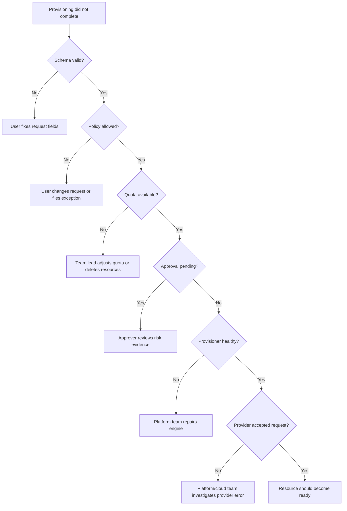

This diagnostic tree matters because self-service does not mean "developers are on their own." It means the platform can tell the right person what needs action. Developers should fix bad inputs. Approvers should make risk decisions. Platform engineers should fix engine failures. Cloud administrators should handle provider limits and account-level issues. Status design routes work to the right owner.

## 4. Provisioning Engines and Implementation Approaches

A self-service platform needs a provisioning engine, but the engine is not the product. Crossplane, Terraform, OpenTofu, Pulumi, CloudFormation, Bicep, and internal APIs can all be valid choices. The right choice depends on your existing skills, desired reconciliation model, approval workflow, audit needs, and how much infrastructure should appear as Kubernetes-style resources.

Crossplane is compelling when the organization already operates Kubernetes well and wants infrastructure resources to behave like Kubernetes APIs. Developers can create claims, controllers reconcile desired state, and status appears on resources. Crossplane also supports composition, which lets platform teams expose a simplified resource while mapping it to provider resources behind the scenes.

```yaml
apiVersion: apiextensions.crossplane.io/v1
kind: CompositeResourceDefinition
metadata:
  name: xdatabases.platform.example.com
spec:
  group: platform.example.com
  names:
    kind: XDatabase
    plural: xdatabases
  claimNames:
    kind: Database
    plural: databases
  versions:
    - name: v1alpha1
      served: true
      referenceable: true
      schema:
        openAPIV3Schema:
          type: object
          required:
            - spec
          properties:
            spec:
              type: object
              required:
                - engine
                - environment
                - size
                - ownerGroup
              properties:
                engine:
                  type: string
                  enum:
                    - postgresql
                    - mysql
                environment:
                  type: string
                  enum:
                    - development
                    - staging
                    - production
                size:
                  type: string
                  enum:
                    - small
                    - medium
                    - large
                    - xlarge
                ownerGroup:
                  type: string
                dataClass:
                  type: string
                  enum:
                    - public
                    - internal
                    - confidential
                    - regulated
            status:
              type: object
              properties:
                phase:
                  type: string
                endpoint:
                  type: string
                secretRef:
                  type: string
```

The Crossplane model is strongest when reconciliation is desired. If a provider resource drifts, the controller can move it back toward declared state. If a request changes size, the controller can apply that change through a managed workflow. If status changes, Kubernetes-native tools can observe it. The trade-off is that platform engineers must understand Crossplane providers, compositions, controller behavior, and Kubernetes operational failure modes.

Terraform or OpenTofu with a GitOps workflow is compelling when the organization already has strong module discipline and change review in Git. Developers propose changes to a repository, policy checks run in CI, plans are visible, and approved changes apply through an automation system such as Atlantis, Spacelift, env0, Terraform Cloud, or a custom pipeline. The audit story is strong because Git records intent and review.

```hcl
variable "name" {
  type = string
}

variable "team" {
  type = string
}

variable "environment" {
  type = string
  validation {
    condition     = contains(["development", "staging", "production"], var.environment)
    error_message = "Environment must be development, staging, or production."
  }
}

variable "size" {
  type = string
  validation {
    condition     = contains(["small", "medium", "large"], var.size)
    error_message = "Size must be small, medium, or large for the standard module."
  }
}

locals {
  database_size_map = {
    small  = "db.t4g.micro"
    medium = "db.t4g.medium"
    large  = "db.m6g.large"
  }

  backup_retention_days = {
    development = 1
    staging     = 7
    production  = 14
  }
}
```

The Terraform-based model is strongest when Git review is part of the culture and teams can tolerate asynchronous apply behavior. It is weaker when developers need instant interactive operations, rich status, or non-engineers need a guided experience. A portal can still generate pull requests, but then the user experience inherits Git review latency.

An internal platform API is compelling when the organization needs tight product control, custom workflows, integration with identity and business systems, or resource operations that do not map cleanly to declarative infrastructure. The API can expose a small contract, run policy decisions, enqueue provisioning jobs, and present status in a portal. It can call Terraform, Crossplane, Pulumi, provider APIs, or internal services behind the scenes.

```python
from enum import StrEnum
from pydantic import BaseModel, Field


class Environment(StrEnum):
    DEVELOPMENT = "development"
    STAGING = "staging"
    PRODUCTION = "production"


class DatabaseSize(StrEnum):
    SMALL = "small"
    MEDIUM = "medium"
    LARGE = "large"


class DatabaseRequest(BaseModel):
    name: str = Field(min_length=3, max_length=40, pattern=r"^[a-z0-9-]+$")
    team: str = Field(min_length=2, max_length=40)
    environment: Environment
    size: DatabaseSize
    engine: str = Field(pattern=r"^(postgresql|mysql)$")
    owner_group: str = Field(min_length=2, max_length=80)
    cost_center: str = Field(min_length=2, max_length=80)
    expires_after_days: int | None = Field(default=None, ge=1, le=90)


def requires_expiry(request: DatabaseRequest) -> bool:
    return request.environment in {
        Environment.DEVELOPMENT,
        Environment.STAGING,
    }


def validate_lifecycle(request: DatabaseRequest) -> None:
    if requires_expiry(request) and request.expires_after_days is None:
        raise ValueError("Non-production databases require expires_after_days.")
```

This Python snippet is not a complete service, but it shows a real validation boundary. A production-grade API would add authentication, authorization, policy evaluation, quota checks, idempotency keys, audit logs, asynchronous job state, and secure secret delivery. The design pressure is to avoid hiding critical behavior in one opaque service that only the platform team can debug.

A comparison table helps choose an implementation path.

| Approach | Strong fit | Main risk | Senior design question |
|----------|------------|-----------|------------------------|
| Crossplane | Kubernetes-native platform teams that want reconciliation and resource status | Kubernetes control plane complexity spreads into cloud provisioning | Can the team operate controller failures and provider drift confidently? |
| Terraform or OpenTofu with GitOps | Organizations with strong Git review and mature IaC modules | Pull request latency can become the new ticket queue | Which requests should bypass human review through automated policy? |
| Pulumi | Teams that prefer general-purpose languages for infrastructure abstractions | Application logic and infrastructure logic can become tangled | How will the platform keep contracts stable across language ecosystems? |
| Internal API | Organizations needing custom UX, identity integration, and workflow orchestration | The API can become a bespoke provisioning monolith | Which behavior belongs in the API, and which belongs in reusable engines? |

The most common implementation mistake is treating the first engine as permanent strategy. A platform may start with Terraform modules because that is what exists, then add a portal that generates pull requests, then introduce Crossplane for Kubernetes-native resources, then expose lifecycle operations through an API. This is acceptable if the platform contract remains stable and the engine choices stay behind it.

A self-service control plane should expose the resource status independently of engine internals. Developers need to know whether the resource is pending approval, provisioning, ready, degraded, updating, deleting, or failed. They should not need to understand provider plugin logs for normal troubleshooting. Engine details can be available for platform engineers, but the product surface should speak in lifecycle states.

```yaml
apiVersion: platform.example.com/v1alpha1
kind: DatabaseStatus
metadata:
  name: checkout-dev-db
spec:
  resourceRef:
    kind: Database
    name: checkout-dev-db
status:
  phase: Ready
  endpoint: checkout-dev-db.dev.internal.example.com
  secretRef:
    namespace: team-checkout
    name: checkout-dev-db-credentials
  cost:
    estimatedMonthlyUsd: 18
  operations:
    canScale: true
    canBackup: true
    canRestore: true
    canDelete: true
  conditions:
    - type: PolicyValidated
      status: "True"
      reason: AllRequiredPoliciesPassed
    - type: Provisioned
      status: "True"
      reason: ProviderResourceReady
```

Day 0 provisioning is only the first operation. A developer who can create a database in five minutes but needs tickets to resize, restore, upgrade, rotate credentials, inspect status, or decommission has only partial self-service. Day 2 operations should be designed before the launch of Day 0 provisioning, because the resource lifecycle begins immediately after creation.

```mermaid
flowchart LR
    subgraph Day0["Day 0: Provision"]
        direction TB
        D0A["Create resource"]
        D0B["Apply defaults"]
        D0C["Deliver credentials"]
    end

    subgraph Day1["Day 1: Connect"]
        direction TB
        D1A["Connect application"]
        D1B["Verify monitoring"]
        D1C["Test backup"]
    end

    subgraph Day2["Day 2+: Operate"]
        direction TB
        D2A["Scale"]
        D2B["Backup and restore"]
        D2C["Upgrade"]
        D2D["Rotate credentials"]
        D2E["Delete safely"]
    end

    Day0 --> Day1 --> Day2
```

Day 2 operations should be policy-aware. Scaling a development database from `small` to `medium` may be auto-approved. Scaling a production database from `large` to `xlarge` may require a time-bound exception. Restoring a backup into a development environment may require data masking if the source contains regulated data. Deleting a production database should require dependency checks, final backup, and typed confirmation.

```bash
platform database status checkout-dev-db --team checkout
platform database scale checkout-dev-db --team checkout --size medium
platform database backup create checkout-dev-db --team checkout --name before-load-test
platform database restore checkout-dev-db --team checkout --from before-load-test --target checkout-dev-restore
platform database rotate-credentials checkout-dev-db --team checkout
platform database delete checkout-dev-db --team checkout --final-backup true
```

The commands should be boring, but the behavior behind them should be careful. A scale operation should verify quota and maintenance windows. A restore operation should protect production data from leaking into lower environments. A credential rotation should notify dependent services or integrate with secret sync. A delete operation should detect active connections, create a final backup when appropriate, update inventory, and stop cost allocation.

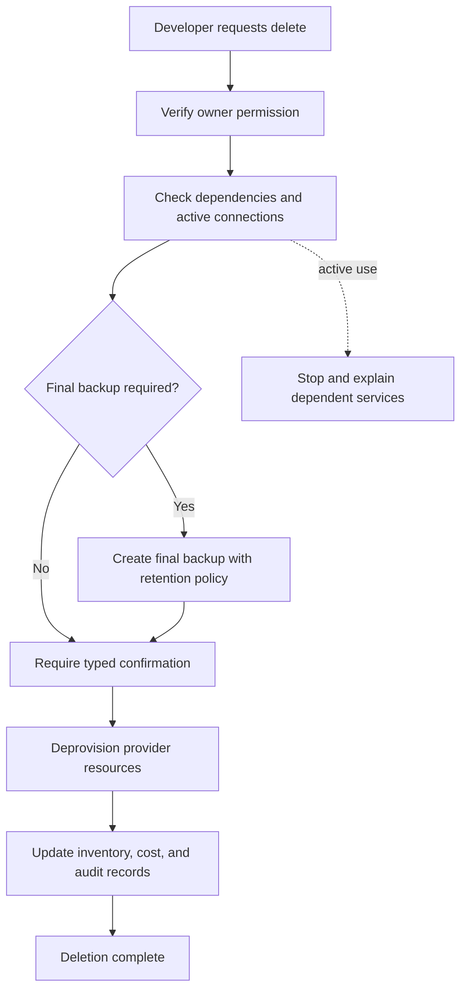

A platform team should treat every lifecycle operation as a chance to reduce future support load. If backup creation is self-service, fewer release windows require platform intervention. If restore is self-service and safe, teams can test recovery instead of merely trusting backups. If deletion is self-service and guarded, stale resources disappear sooner. These operations are where self-service becomes operating leverage.

## 5. Adoption, Metrics, and Failure Modes

Self-service infrastructure succeeds when teams choose it because it is the easiest reliable path. Mandates can force initial usage, but sustained adoption depends on trust, speed, capability, and support quality. If the platform is slower than tickets, narrower than real needs, or hard to debug, teams will create unofficial paths.

Adoption should begin with a high-volume, low-risk resource. Development PostgreSQL databases are a common starting point because the request pattern is frequent, the controls are understandable, and the business impact of mistakes can be contained. Starting with a highly sensitive production data platform may teach the team important lessons, but it also increases approval pressure and slows feedback.

The first release should focus on a narrow golden path with strong instrumentation. The platform team should measure request count, lead time, policy denials, approval wait time, provisioning failures, support tickets, cost per team, resource age, and cleanup rate. These metrics show whether the platform is reducing friction or simply moving friction into another interface.

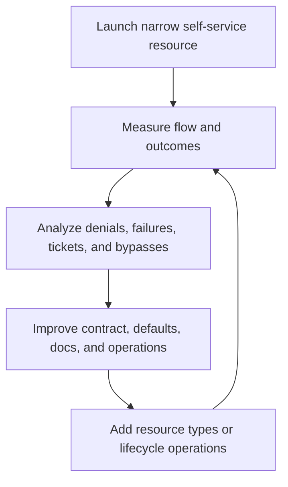

A useful adoption dashboard separates product metrics from infrastructure metrics. Product metrics answer whether developers can complete work. Infrastructure metrics answer whether the underlying engine is healthy. If the provisioning engine is healthy but developers still file tickets, the product contract may be incomplete. If developers submit valid requests but provisioning fails, the engine or provider integration needs work.

| Metric | What it reveals | Example target for standard requests |
|--------|-----------------|--------------------------------------|
| Request-to-ready lead time | Whether self-service is actually faster than tickets | Under fifteen minutes for development databases. |
| Policy denial rate with reason | Whether rules are clear or requests are confusing | Denials decrease as forms, templates, and error messages improve. |
| Approval wait time | Whether human review is becoming a bottleneck | Low-risk requests should not wait for humans. |
| Day 2 ticket rate | Whether lifecycle operations are missing | Resize, backup, restore, and delete tickets should fall over time. |
| Orphan cleanup rate | Whether lifecycle metadata is working | Expired non-production resources are warned, backed up, and removed. |

A common failure mode is launching a portal without changing the underlying process. Developers fill out a nicer form, but a platform engineer still manually provisions the resource. This can improve intake quality, yet it is not true self-service. It may be a useful transition step, but the platform team should name it honestly and continue toward automated validation and provisioning.

Another failure mode is exposing raw Terraform as the self-service interface. This can work for infrastructure-savvy teams, but it does not automatically produce a platform product. If every team copies a module and edits provider details, the organization still has inconsistent defaults, uneven security, and limited lifecycle support. The platform should offer modules as implementation building blocks, not as the whole developer experience.

A third failure mode is hiding too much. If developers cannot choose size, environment, data classification, or lifetime, they will request exceptions constantly. Excessive hiding makes the platform feel paternalistic and brittle. The right abstraction leaves meaningful intent visible while removing low-value provider mechanics.

A fourth failure mode is missing ownership. Every resource should have an owner group, application association, cost center, environment, and lifecycle policy. Ownership is not bureaucracy; it is the link between infrastructure and accountability. Without ownership, incident responders do not know whom to page, finance does not know whom to charge, and cleanup automation does not know whom to warn.

A fifth failure mode is treating governance as a one-time launch checklist. Cloud provider features change, security requirements evolve, costs shift, and teams discover new usage patterns. Guardrails should be reviewed with evidence. A rule that blocks valid work should be refined. A rule that never triggers may be unnecessary. A missing rule that appears in incidents should become part of the platform contract.

The best platform teams use support requests as product discovery. Every ticket asking for a resize operation is evidence that resize might belong in self-service. Every ticket asking "what is the status?" is evidence that status reporting is weak. Every repeated exception request is evidence that the abstraction may be too narrow or the approval policy too coarse.

**Active learning prompt:** Imagine your platform receives twenty support tickets in a month for database restores. Ten are routine staging restores before test runs, six are production restore drills, and four are emergency recovery requests. Which restore workflows should become self-service first, and which should retain stronger review?

Routine staging restores are the best first self-service candidate because they are frequent, lower risk, and easy to standardize. Production restore drills may become self-service after controls such as approval, audit, destination validation, and data handling are well understood. Emergency production recovery should be streamlined and rehearsed, but it may still need incident-command controls because the blast radius is high.

Self-service infrastructure should also fit the organization's incident model. During incidents, teams need fast, safe operations under stress. If the platform has never tested scale, restore, credential rotation, or failover workflows, the incident will expose that weakness. Game days and recovery drills should include the platform's self-service operations, not only application behavior.

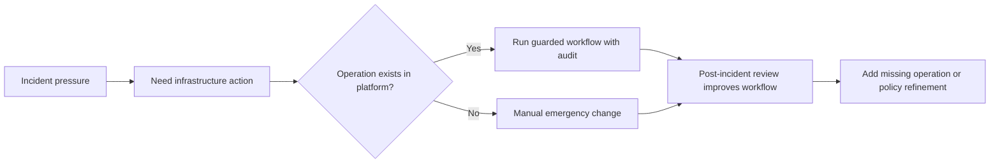

Mature self-service systems make the safe path the path of least resistance. Developers should not need to ask where to create a database, how to name it, what tags to apply, which subnet to choose, whether backups are required, or how to delete it. Those decisions should be encoded in the workflow, explained when relevant, and visible enough to debug.

Senior practitioners also design for migration. Existing resources may predate the platform, and forcing every team to recreate them is risky. A platform can support import, adoption, or shadow inventory. Import brings a resource under platform management. Adoption attaches ownership and lifecycle metadata without changing everything immediately. Shadow inventory tracks resources while the team plans migration.

```yaml
apiVersion: platform.example.com/v1alpha1
kind: DatabaseAdoption
metadata:
  name: checkout-legacy-db-adoption
  namespace: team-checkout
spec:
  providerResourceId: arn:aws:rds:us-east-1:123456789012:db:checkout-legacy-dev
  desiredPlatformName: checkout-dev-db
  ownerGroup: team-checkout
  costCenter: cc-checkout
  migrationMode: adopt-metadata-first
  targetState:
    encryptionRequired: true
    backupRetentionDays: 7
    expiresAfterDays: 60
```

Migration design matters because many platform efforts fail by ignoring the messy middle. A new golden path is valuable, but the organization still carries old resources, old scripts, old modules, and old exceptions. The platform should create a path from legacy to standard without pretending the world is greenfield.

A practical migration sequence starts with inventory, then ownership, then policy visibility, then low-risk remediation, then managed provisioning for new resources, then gradual adoption or replacement of old resources. This sequence reduces surprise. Teams first learn what exists and who owns it, then see where it violates standards, then fix the easiest issues, then move future work onto the platform.

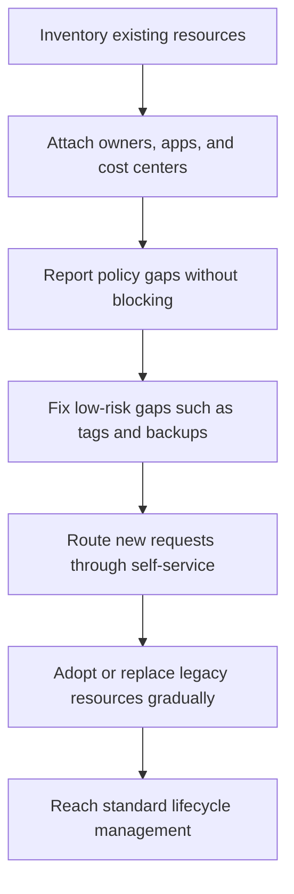

The migration path should include explicit communication about what changes for developers. They need to know which new requests must use the platform, which existing resources will be imported, which exceptions are allowed temporarily, and which manual workflows will be retired. Ambiguous migration rules create political resistance and technical drift.

A senior platform engineer should be comfortable saying no to premature breadth. A platform that supports databases deeply may create more value than a portal that offers databases, queues, buckets, caches, namespaces, certificates, and service accounts shallowly. Depth means policy, status, lifecycle operations, documentation, metrics, and support readiness. Breadth without depth recreates tickets across more categories.

The final design principle is reversibility. A self-service workflow should make it possible to change size mappings, backup policies, approval thresholds, and provider implementations without breaking every developer contract. The public contract should be stable, while implementation details evolve behind it. This is why the platform resource matters more than the engine-specific resource.

## Did You Know?

- **Self-service is older than cloud portals:** Mainframe, database, and enterprise IT teams used request catalogs long before public cloud, but modern platforms add automated validation, provisioning, lifecycle operations, and policy-as-code.
- **Cost visibility changes behavior:** Teams make better sizing decisions when estimated monthly cost appears at request time, because the trade-off becomes part of the engineering decision instead of a surprise in finance reports.
- **Kubernetes-style APIs can manage non-Kubernetes infrastructure:** Tools such as Crossplane use Custom Resources and controllers to reconcile cloud databases, networks, queues, and other provider resources from a Kubernetes control plane.
- **The fastest request is not always the best request:** A five-minute provisioning path that cannot restore, resize, audit, or delete safely often creates more operational toil than a slightly slower workflow with complete lifecycle support.

## Common Mistakes

| Mistake | Why It Happens | Better Approach |
|---------|----------------|-----------------|
| Building a portal that still creates tickets | The team improves intake before changing provisioning and approval mechanics | Treat the portal as a transition step, then automate validation, provisioning, status, and lifecycle operations. |
| Exposing raw cloud provider fields as the developer contract | Platform engineers copy the provider API because it is familiar and complete | Expose intent, environment, size, data class, ownership, and lifecycle while the platform owns provider details. |
| Blocking every production request manually | Compliance pressure turns human approval into the default control | Use preventive policy for known rules and reserve approval for meaningful risk dimensions such as regulated data or exceptional capacity. |
| Launching Day 0 provisioning without Day 2 operations | Creating resources feels like the visible win, while operations are deferred | Design scale, backup, restore, credential rotation, status, and deletion workflows before broad rollout. |
| Treating cost controls as after-the-fact reporting | Finance sees the bill late and platform teams react with spreadsheets | Show cost at request time, enforce ownership, set budgets and quotas, and automate cleanup for expired resources. |
| Forgetting migration of existing resources | The new platform is designed as if every resource will be created fresh | Inventory legacy resources, attach owners, report policy gaps, remediate gradually, and support adoption workflows. |
| Providing no exception path | The platform tries to keep the contract simple by denying uncommon cases | Create time-bound, auditable exceptions with approvers, expiry, and a path back to the standard workflow. |
| Measuring only resource creation count | A high number of created resources looks like adoption even when support tickets rise | Measure request-to-ready time, denial reasons, approval latency, Day 2 ticket rate, cleanup rate, and developer satisfaction. |

## Quiz

Test your ability to apply self-service infrastructure design principles to realistic platform scenarios.

**Question 1:** Your team launches a database portal that creates development PostgreSQL instances in ten minutes, but every request still lands in a queue where a platform engineer manually copies values into Terraform. Developers say the form is nicer than the old ticket, but lead time barely changed. What is the main design flaw, and what should you change first?

<details>
<summary>Show Answer</summary>

The design flaw is that the portal improved request intake without automating the control plane. It is still a ticket workflow with a better front end, because validation, provisioning, and status depend on manual interpretation. The first change should be to define a typed platform contract for the standard development database and automate validation plus provisioning for low-risk requests. Human review can remain for exceptions, but the common path should move from request form to policy check to provisioning engine without manual copying.
</details>

**Question 2:** A product team requests a production `xlarge` database for a marketing event that lasts three days. Your current size catalog allows only `small`, `medium`, and `large`, so the portal denies the request. The team threatens to create the database directly in the cloud console. How should you redesign the abstraction without turning the standard path into unlimited access?

<details>
<summary>Show Answer</summary>

Add an explicit exception path for exceptional capacity rather than expanding the standard path into unlimited choices. The request should capture reason, expected duration, owner, cost center, data classification, and expiry date. It should route to the appropriate approvers and create a scheduled review or downsize action after the event. This preserves the simplicity of the standard size catalog while giving legitimate high-capacity cases a safe, auditable path.
</details>

**Question 3:** Security discovers that several databases created through older scripts are unencrypted, but all databases created through the new platform are encrypted by default. Leadership asks whether to add a nightly scanner or a preventive policy. Which controls should you use for new requests and for legacy resources?

<details>
<summary>Show Answer</summary>

Use a preventive control for new requests and detective remediation for legacy resources. New platform requests should never allow unencrypted databases because encryption is a known mandatory requirement that can be enforced before provisioning. Legacy resources already exist, so a scanner or inventory report should detect violations, attach owners, prioritize remediation, and track progress. The platform should avoid relying only on nightly detection for new resources because that permits avoidable non-compliance.
</details>

**Question 4:** Developers can create databases quickly, but support tickets increased because teams need help resizing, creating backups, restoring test data, and deleting stale resources. The platform team argues that self-service is successful because provisioning is fast. How would you evaluate that claim?

<details>
<summary>Show Answer</summary>

The claim is incomplete because it measures only Day 0 provisioning. A self-service infrastructure product must cover the lifecycle operations that developers need after creation. You should evaluate request-to-ready time alongside Day 2 ticket rate, restore success, scale workflow latency, deletion safety, orphan cleanup, and status clarity. If tickets moved from "create database" to "operate database," the platform improved one stage but did not deliver complete self-service.
</details>

**Question 5:** Your Terraform GitOps workflow requires pull request approval for every database change. The audit trail is excellent, but development database requests wait two days because approvers batch reviews. Developers start using shared databases to avoid waiting. What should you change without losing auditability?

<details>
<summary>Show Answer</summary>

Move low-risk standard changes to automated approval while keeping Git history and policy checks. Development databases within quota, with known owner, cost center, expiry, and approved size should pass through validation and apply automatically. Higher-risk changes can still require review. This preserves auditability because the request, policy result, and apply record remain versioned, but it removes human approval from work where humans rarely change the outcome.
</details>

**Question 6:** A platform engineer wants the `Database` resource to expose subnet IDs, security group IDs, storage IOPS, backup windows, encryption flags, parameter groups, and provider instance class. Their argument is that advanced teams need flexibility. How would you push the design toward a better abstraction?

<details>
<summary>Show Answer</summary>

Separate standard intent from exceptional provider detail. The standard `Database` resource should expose values developers can reason about safely, such as engine, environment, size, owner, data class, and lifecycle. The platform should own networking, encryption, baseline backups, monitoring, and provider mappings. Advanced needs should use documented overrides or exception workflows with review, not a default contract that forces every team to understand provider internals. This reduces cognitive load while preserving flexibility for justified cases.
</details>

**Question 7:** Finance reports that non-production cloud costs keep rising even though every new resource has a cost-center label. The platform shows cost at request time, but old development databases remain active for months. Which guardrails are missing, and how should they work together?

<details>
<summary>Show Answer</summary>

The platform has ownership and advisory cost visibility, but it is missing lifecycle guardrails. Non-production resources should require an expiry date or receive a default time-to-live. The platform should notify owners before expiry, allow approved extensions, create a final backup when appropriate, and delete resources after the grace period. Detective reports can identify idle resources, but corrective cleanup is needed to prevent old development databases from accumulating indefinitely.
</details>

## Hands-On Exercise

### Scenario

You are the platform engineer assigned to replace a legacy ticket-based database process with a self-service workflow. The existing process takes five business days on average, and most tickets are routine development or staging PostgreSQL requests. Security found that some databases are not encrypted, finance found orphaned non-production databases, and developers complain that they cannot see status or resize without filing another ticket.

Use this specific legacy input as the request you are migrating. Do not design from a blank page; your job is to convert this unsafe provider-shaped request into a platform-shaped self-service contract.

```yaml
# input/legacy-cloud-request.yaml
requestId: REQ-1842
requester: maya.chen@example.com
team: checkout
application: checkout-api
environment: development
cloudProvider: aws
region: us-east-1
resource:
  service: rds
  engine: postgres
  engineVersion: "15.5"
  instanceClass: db.t3.large
  allocatedStorageGb: 200
  storageEncrypted: false
  publiclyAccessible: false
  backupRetentionDays: 0
  deletionProtection: false
  subnetGroupName: shared-public-subnets
  securityGroupIds:
    - sg-legacy-open-dev
tags:
  cost-center: ""
  owner: ""
  expires-after: ""
notes: "Temporary database for checkout feature testing. Please create today if possible."
```

### Part 1: Translate the Legacy Request into a Platform Resource

Create a `Database` resource that captures developer intent while removing unsafe provider details. Your design should include the resource name, team namespace, engine, environment, size, data classification, owner group, cost center, and non-production lifetime. Choose a smaller default size unless you can justify the legacy `db.t3.large` request with evidence.

```yaml
apiVersion: platform.example.com/v1alpha1
kind: Database
metadata:
  name: checkout-dev-db
  namespace: team-checkout
  labels:
    platform.example.com/team: checkout
    platform.example.com/cost-center: cc-checkout
spec:
  engine: postgresql
  environment: development
  size: small
  dataClass: internal
  ownerGroup: team-checkout
  lifetime:
    expiresAfterDays: 30
```

Document the decisions behind your resource. Explain which legacy fields you removed, which fields became platform defaults, which fields became required developer inputs, and which fields should be visible in status rather than request input.

### Part 2: Define the Guardrails

Write policy behavior for the new workflow. Your guardrails should close the known gaps: missing encryption, missing ownership, orphaned non-production resources, oversized development databases, and unclear approval behavior. You can express the policy in YAML, a table, or structured prose, but it must be specific enough that an engineer could implement it.

```yaml
apiVersion: platform.example.com/v1alpha1
kind: DatabaseSelfServicePolicy
metadata:
  name: database-standard-policy
spec:
  preventive:
    - name: require-owner-and-cost-center
      appliesTo: all
      behavior: deny
      message: "ownerGroup and cost-center are required before provisioning."
    - name: enforce-encryption
      appliesTo: all
      behavior: force-default
      value: storageEncrypted=true
    - name: require-non-production-expiry
      appliesTo:
        environments:
          - development
          - staging
      behavior: deny-if-missing
      maximumExpiresAfterDays: 90
  advisory:
    - name: warn-on-large-development-size
      appliesTo:
        environment: development
        sizes:
          - large
      behavior: warn-with-cost-and-smaller-option
  approval:
    - name: standard-development
      condition: "environment == development && size in [small, medium]"
      decision: autoApprove
    - name: exceptional-development-capacity
      condition: "environment == development && size == large"
      decision: requireTeamLeadApproval
```

Explain why each guardrail belongs in its chosen category. For example, encryption should be preventive or forced by default because the platform already knows the requirement before creation. Oversized development databases can start as advisory plus approval because there may be legitimate load testing needs.

### Part 3: Design the Request Lifecycle

Describe the request lifecycle from submission to readiness. Include validation, policy evaluation, approval decision, provisioning, status updates, credential delivery, and audit logging. Your lifecycle should make it clear where the developer receives feedback when something fails.

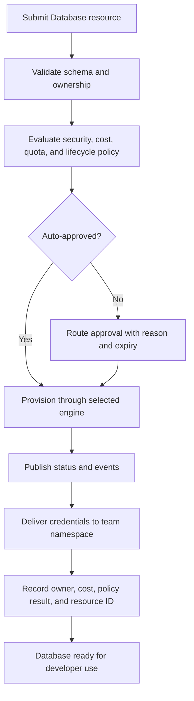

Write the status states you would expose to developers. Include at least `PendingValidation`, `Denied`, `PendingApproval`, `Provisioning`, `Ready`, `Updating`, `Degraded`, and `Deleting`. For each state, describe what action the developer, approver, or platform team should take.

### Part 4: Add Day 2 Operations

Design the self-service operations developers can perform after the database is ready. Include status inspection, scaling, backup creation, restore into a new target, credential rotation, and guarded deletion. Each operation should state whether it is auto-approved, policy-checked, or approval-gated.

```bash
platform database status checkout-dev-db --team checkout
platform database scale checkout-dev-db --team checkout --size medium
platform database backup create checkout-dev-db --team checkout --name before-schema-change
platform database restore checkout-dev-db --team checkout --from before-schema-change --target checkout-dev-restore
platform database rotate-credentials checkout-dev-db --team checkout
platform database delete checkout-dev-db --team checkout --final-backup true
```

Explain deletion safeguards in detail. A strong answer includes owner permission checks, active connection checks, dependency checks, final backup behavior, typed confirmation, audit updates, and cost allocation cleanup. Deletion is where many self-service systems reveal whether lifecycle design was real or superficial.

### Part 5: Choose an Implementation Approach

Choose Crossplane, Terraform or OpenTofu with GitOps, Pulumi, an internal platform API, or a hybrid approach for the first release. Justify the choice using your organization's assumed skills, audit requirements, desired user experience, and operational maturity. Do not choose a tool only because it is popular.

Your answer should include one paragraph explaining why your chosen approach fits the initial database workflow. It should also include one paragraph naming the biggest risk of your choice and how you would mitigate it. For example, Crossplane requires controller operational skill, while Terraform GitOps can recreate approval latency if every pull request waits for a human.

### Success Criteria

Your completed design should satisfy all of the following:

- [ ] The standard development database request can be approved and provisioned in under fifteen minutes without manual platform engineering work.
- [ ] The new `Database` contract removes unsafe provider-shaped details from the developer request while preserving meaningful developer intent.
- [ ] Encryption is enforced for every database, closing the security gap in the legacy request.
- [ ] Ownership, cost center, environment, and lifecycle metadata are required before provisioning.
- [ ] Non-production databases have expiry behavior that warns owners, allows controlled extension, and prevents indefinite orphaning.
- [ ] Oversized or exceptional capacity requests have a documented approval or exception path rather than an unmanaged bypass.
- [ ] Developers can inspect status, scale, back up, restore, rotate credentials, and delete with appropriate safeguards.
- [ ] The design explains which implementation approach you chose and why it fits the team's operating model.
- [ ] The design includes clear failure feedback for invalid requests, policy denials, approval waits, provisioning failures, and provider errors.

## Next Module

Continue to [Module 2.6: Platform Maturity](../module-2.6-platform-maturity/) to learn how to assess platform maturity, identify capability gaps, and plan an evidence-based roadmap for improvement.
