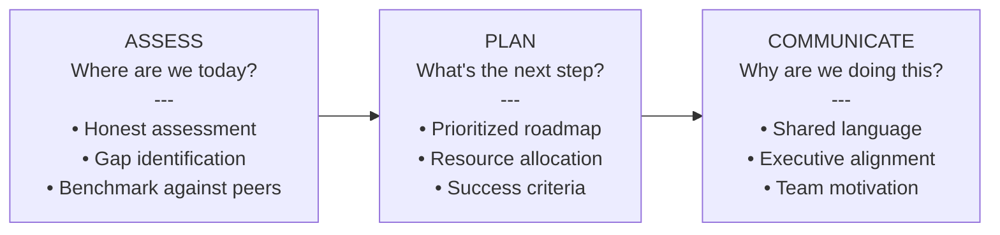
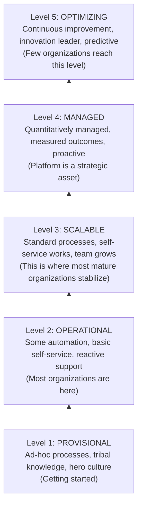
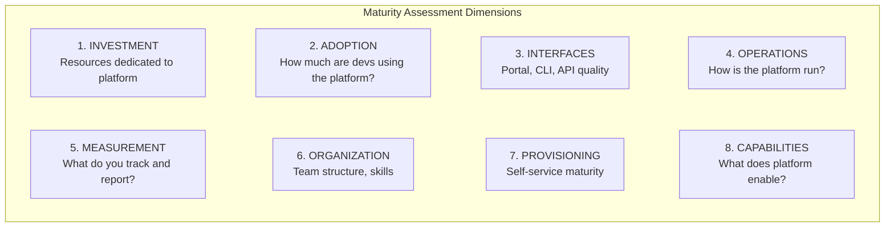
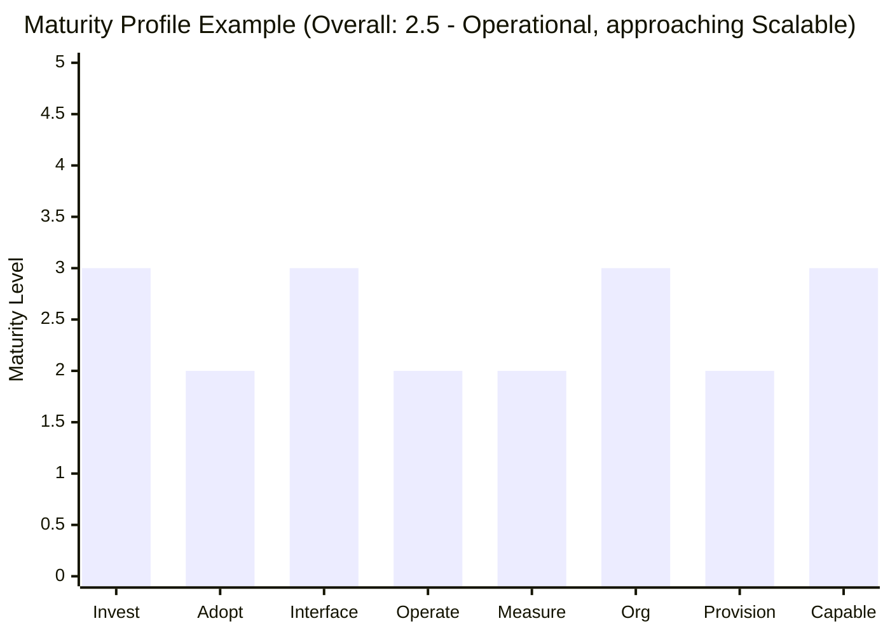
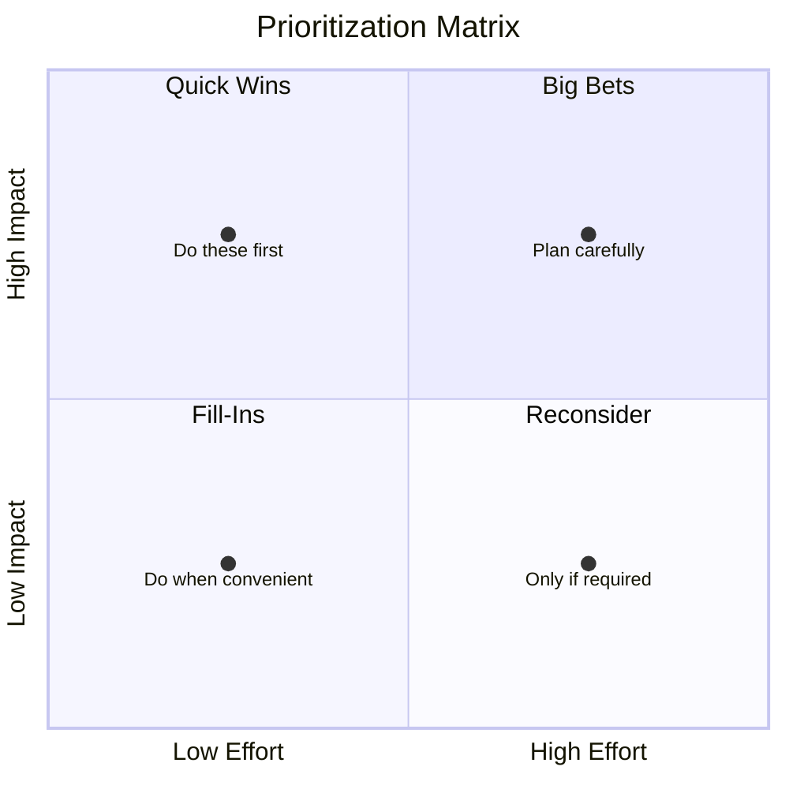
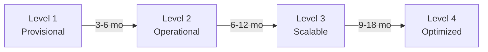
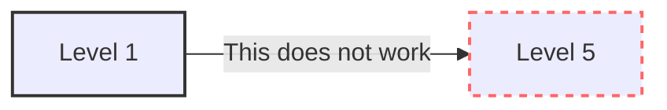

> **Discipline Module** | Complexity: `[MEDIUM]` | Time: 45-55 min

## Prerequisites

Before starting this module, you should:

- Complete [Module 2.1: What is Platform Engineering?](../module-2.1-what-is-platform-engineering/) - Platform foundations
- Complete [Module 2.2: Developer Experience](../module-2.2-developer-experience/) - DevEx measurement
- Complete [Module 2.3: Internal Developer Platforms](../module-2.3-internal-developer-platforms/) - IDP components
- Complete [Module 2.4: Golden Paths](../module-2.4-golden-paths/) - Template design
- Complete [Module 2.5: Self-Service Infrastructure](../module-2.5-self-service-infrastructure/) - Self-service patterns
- Have read or worked with a platform team

## What You'll Be Able to Do

After completing this module, you will be able to:

- **Evaluate your platform's maturity level across adoption, capabilities, and operational excellence**
- **Design a platform roadmap that moves from reactive tooling to proactive product thinking**
- **Implement platform health metrics that track reliability, adoption, and developer satisfaction**
- **Build a continuous improvement process that evolves the platform based on user feedback and data**

## Why This Module Matters

Building a platform is a journey, not a destination. Without a maturity model:
- Teams don't know where they are
- Leadership doesn't know where to invest
- Progress is invisible and unmeasurable
- Platform efforts stall at "good enough"

Maturity models provide a map. They show where you are, where you could be, and what steps get you there. This module gives you the tools to assess your platform and plan improvements.

## Did You Know?

1. **Most organizations overestimate their platform maturity** by 1-2 levels when self-assessing—external benchmarking reveals gaps.

2. **Spotify's platform took 7 years** to reach what they consider "mature"—rushing maturity leads to fragile foundations.

3. **The CNCF Platform Maturity Model** identifies that 60% of organizations are at "Provisional" or lower levels.

4. **The "J-curve" of platform investment** is real: productivity often dips during initial platform rollout before rising—set expectations accordingly with stakeholders.

---

## Platform Maturity Models

### Why Maturity Models?



> **Pause and predict**: Which level do you think the vast majority of enterprise organizations currently occupy?

### The Five Levels



---

## Level Characteristics

### Level 1: Provisional

**"We have some tools, but no platform"**

```yaml
Characteristics:
  process: Ad-hoc, varies by team
  automation: Minimal, scripts in personal repos
  documentation: Outdated or nonexistent
  support: Heroes who "know how things work"
  self-service: None, everything requires assistance

Symptoms:
  - "Ask John, he knows how to deploy"
  - "Every team does it differently"
  - "We'd love to standardize, but no time"
  - "It works on my machine"
  - New team members take months to be productive

Typical Metrics:
  - Time to first deploy: Weeks
  - Deployment frequency: Monthly or less
  - Support ticket volume: High
  - Developer satisfaction: Low
```

**Example Organization at Level 1:**

> "Our infrastructure is a collection of Terraform scripts in various team repos. Some teams use Jenkins, some use GitHub Actions, some deploy manually. When someone needs a database, they file a ticket and wait. Our 'platform team' is actually two people who firefight all day."

### Level 2: Operational

**"We have a platform, but it's basic"**

```yaml
Characteristics:
  process: Defined for some workflows
  automation: CI/CD exists, some infrastructure automation
  documentation: Exists but often stale
  support: Dedicated team, still reactive
  self-service: Limited (e.g., deploy existing apps)

Symptoms:
  - "We have a deploy pipeline, but setting up new services is manual"
  - "Documentation exists, but I usually ask Slack"
  - "Our golden path works for 60% of cases"
  - "Platform team is always behind on requests"

Typical Metrics:
  - Time to first deploy: Days
  - Deployment frequency: Weekly
  - Support ticket volume: Medium (still growing)
  - Developer satisfaction: Mixed
```

**Example Organization at Level 2:**

> "We have ArgoCD for deployments and a service template that works well for our main stack. But anything non-standard—a new database, a different language, unusual requirements—becomes a multi-week project. Our platform team has a backlog of 50+ tickets."

### Level 3: Scalable

**"Self-service works, developers are productive"**

```yaml
Characteristics:
  process: Standardized, documented, followed
  automation: Comprehensive, most things self-service
  documentation: Current, discoverable, useful
  support: Proactive, focused on enablement
  self-service: Works for 80%+ of cases

Symptoms:
  - "New developers deploy on day one"
  - "I can get what I need without filing a ticket"
  - "The platform team is building features, not firefighting"
  - "We measure platform adoption and satisfaction"

Typical Metrics:
  - Time to first deploy: Hours
  - Deployment frequency: Daily
  - Support ticket volume: Low (decreasing)
  - Developer satisfaction: Good (measured regularly)
```

**Example Organization at Level 3:**

> "Our developer portal lets teams create new services in minutes with all the observability, security, and deployment automation included. The platform team spends most of their time on improvements and new capabilities. Tickets are for genuine edge cases."

### Level 4: Managed

**"Platform is a strategic asset, quantitatively managed"**

```yaml
Characteristics:
  process: Optimized, data-driven decisions
  automation: Proactive, self-healing, intelligent
  documentation: Generated, always current
  support: Minimal needed, excellent when required
  self-service: Comprehensive with intelligent guardrails

Symptoms:
  - "We know exactly how the platform impacts business metrics"
  - "Platform improvements are prioritized by measured impact"
  - "Guardrails prevent problems before they happen"
  - "We predict capacity needs before teams ask"

Typical Metrics:
  - Time to first deploy: Minutes
  - Deployment frequency: Continuous
  - Support ticket volume: Minimal
  - Developer satisfaction: High (with specific improvement targets)
  - Platform ROI: Clearly demonstrated
```

**Example Organization at Level 4:**

> "We correlate platform adoption with engineering velocity at the team level. When a team's deployment frequency drops, our analytics flag it and suggest interventions. Cost per deployment has decreased 70% since platform launch. Leadership sees the platform as a competitive advantage."

### Level 5: Optimizing

**"Continuous improvement, industry leader"**

```yaml
Characteristics:
  process: Continuously improving, innovative
  automation: AI/ML-assisted, predictive
  documentation: Self-maintaining, contextual
  support: Self-service handles everything routine
  self-service: Anticipates needs

Symptoms:
  - "We contribute to open source platform tooling"
  - "Other companies benchmark against us"
  - "Platform suggests optimizations proactively"
  - "We experiment with new capabilities continuously"

Typical Metrics:
  - Industry-leading developer productivity
  - Platform attracts talent (employer brand value)
  - Open source contributions, speaking engagements
  - Continuous measurable improvement
```

**Example Organization at Level 5:**

> "Our platform uses ML to predict infrastructure needs before teams request them. We open-sourced our developer portal extensions and have a community of external contributors. Engineers join our company specifically because of our platform. Deployment is so seamless it's invisible."

---

## Assessment Dimensions

### The Eight Dimensions



### Dimension 1: Investment

| Level | Investment Characteristics |
|-------|---------------------------|
| **1** | No dedicated platform team; infrastructure work is side project |
| **2** | Small team (1-3 people), often shared with other responsibilities |
| **3** | Dedicated platform team with clear mandate and budget |
| **4** | Platform organization with multiple teams, product managers |
| **5** | Platform as business unit with strategic investment |

### Dimension 2: Adoption

| Level | Adoption Characteristics |
|-------|-------------------------|
| **1** | Voluntary, inconsistent use; shadow IT common |
| **2** | Some teams adopt, others resist; fragmented |
| **3** | Majority (>70%) of teams use platform for standard workloads |
| **4** | Default path for all new work; exceptions tracked and managed |
| **5** | Universal adoption; platform is how work gets done |

### Dimension 3: Interfaces

| Level | Interface Characteristics |
|-------|-------------------------|
| **1** | Wikis, shared scripts, tribal knowledge |
| **2** | Basic portal or CLI; documentation scattered |
| **3** | Integrated developer portal; CLI, API, and UI options |
| **4** | Context-aware interfaces; intelligent assistance |
| **5** | Predictive interfaces; invisible integration |

### Dimension 4: Operations

| Level | Operations Characteristics |
|-------|--------------------------|
| **1** | Reactive firefighting; no SLOs |
| **2** | Some monitoring; SLOs exist but aren't managed |
| **3** | Proactive monitoring; SLOs tracked and reported |
| **4** | Self-healing; SLOs managed as contracts |
| **5** | Predictive; problems prevented before impact |

### Dimension 5: Measurement

| Level | Measurement Characteristics |
|-------|----------------------------|
| **1** | No metrics; success is anecdotal |
| **2** | Basic metrics (uptime, ticket count) |
| **3** | Comprehensive metrics; dashboards; regular reviews |
| **4** | Business impact metrics; ROI demonstrated |
| **5** | Predictive analytics; continuous optimization |

### Dimension 6: Organization

| Level | Organization Characteristics |
|-------|-----------------------------|
| **1** | No clear ownership; individuals heroically fill gaps |
| **2** | Named team, unclear mandate, borrowed resources |
| **3** | Dedicated team with product mindset; clear charter |
| **4** | Platform organization with multiple specialized teams |
| **5** | Platform as center of excellence; influences org strategy |

### Dimension 7: Provisioning

| Level | Provisioning Characteristics |
|-------|----------------------------|
| **1** | Manual, ticket-based for everything |
| **2** | Some automation; tickets for non-standard needs |
| **3** | Self-service for standard cases; guardrails in place |
| **4** | Comprehensive self-service; intelligent defaults |
| **5** | Anticipatory, predictive provisioning |

### Dimension 8: Capabilities

| Level | Capability Breadth |
|-------|-------------------|
| **1** | Basic CI/CD, maybe container orchestration |
| **2** | CI/CD, basic observability, simple deployment |
| **3** | Full software lifecycle; security, compliance integrated |
| **4** | Complete platform; covers development to production |
| **5** | Comprehensive + emerging capabilities (ML, edge, etc.) |

---

## Self-Assessment

### Assessment Questionnaire

Rate your platform on each dimension (1-5):

```
DIMENSION 1: INVESTMENT
─────────────────────────────────────────────────────────────────
[ ] (1) No dedicated resources
[ ] (2) Part-time or small team (1-3 FTE)
[ ] (3) Dedicated team (4-10 FTE)
[ ] (4) Multiple teams, PM, clear roadmap
[ ] (5) Strategic investment, executive sponsor

DIMENSION 2: ADOPTION
─────────────────────────────────────────────────────────────────
[ ] (1) <25% of teams use platform capabilities
[ ] (2) 25-50% adoption, significant shadow IT
[ ] (3) 50-75% adoption for standard workloads
[ ] (4) 75-90% adoption, exceptions documented
[ ] (5) >90% adoption, platform is default

DIMENSION 3: INTERFACES
─────────────────────────────────────────────────────────────────
[ ] (1) Wiki/docs only, no tooling
[ ] (2) Basic CLI or simple UI
[ ] (3) Developer portal with catalog, templates
[ ] (4) Integrated experience across tools
[ ] (5) Intelligent, context-aware interfaces

DIMENSION 4: OPERATIONS
─────────────────────────────────────────────────────────────────
[ ] (1) Reactive, frequent outages, no SLOs
[ ] (2) Some monitoring, informal SLOs
[ ] (3) Comprehensive monitoring, SLOs tracked
[ ] (4) Proactive, self-healing, SLOs managed
[ ] (5) Predictive, problems prevented

DIMENSION 5: MEASUREMENT
─────────────────────────────────────────────────────────────────
[ ] (1) No metrics, anecdotal success
[ ] (2) Basic operational metrics (uptime)
[ ] (3) Comprehensive metrics, regular reporting
[ ] (4) Business impact metrics, ROI clear
[ ] (5) Predictive analytics, continuous optimization

DIMENSION 6: ORGANIZATION
─────────────────────────────────────────────────────────────────
[ ] (1) Ad-hoc, no clear ownership
[ ] (2) Named team, unclear mandate
[ ] (3) Dedicated team, product mindset
[ ] (4) Platform organization, specialized teams
[ ] (5) Center of excellence, strategic influence

DIMENSION 7: PROVISIONING
─────────────────────────────────────────────────────────────────
[ ] (1) All manual, ticket-based
[ ] (2) Some automation, many manual steps
[ ] (3) Self-service for 70%+ cases
[ ] (4) Comprehensive self-service, guardrails
[ ] (5) Anticipatory, predictive provisioning

DIMENSION 8: CAPABILITIES
─────────────────────────────────────────────────────────────────
[ ] (1) Basic CI/CD only
[ ] (2) CI/CD + basic observability
[ ] (3) Full lifecycle (dev to prod)
[ ] (4) Complete platform capabilities
[ ] (5) Comprehensive + emerging tech
```

### Calculating Your Score

```
Overall Maturity = Average of all dimension scores

Example:
  Investment:    3
  Adoption:      2
  Interfaces:    3
  Operations:    2
  Measurement:   2
  Organization:  3
  Provisioning:  2
  Capabilities:  3
  ─────────────────
  Total:        20
  Average:      2.5 → Level 2 (Operational)
```

### Interpreting Results



**Interpretation:**
You've built good foundations but haven't achieved widespread adoption. Focus heavily on making self-service intuitive and measuring your true outcomes to justify your engineering investments.

---

## Building a Roadmap

### Level-to-Level Transitions

**Level 1 → Level 2: "From Chaos to Order"**

```yaml
Focus Areas:
  - Establish dedicated platform ownership
  - Document existing processes and tools
  - Create first golden path for common workload
  - Implement basic CI/CD for platform team

Key Milestones:
  - Week 4: Platform team formed and chartered
  - Week 8: First workflow documented end-to-end
  - Week 12: First golden path launched (pilot team)
  - Week 16: Basic metrics collection started

Success Criteria:
  - At least 2 teams using golden path
  - 50% reduction in "I don't know how to deploy" questions
  - Platform team spending <30% time on firefighting
```

**Level 2 → Level 3: "From Basic to Scalable"**

```yaml
Focus Areas:
  - Developer portal with service catalog
  - Self-service infrastructure provisioning
  - Comprehensive golden paths (multiple workload types)
  - SLOs defined and tracked

Key Milestones:
  - Month 2: Developer portal MVP launched
  - Month 4: Self-service database provisioning
  - Month 6: 3+ golden paths covering 70% of new services
  - Month 9: Platform NPS measured and reported

Success Criteria:
  - 70%+ of new services use golden paths
  - Time to first deploy < 1 day
  - Support ticket volume decreasing month-over-month
  - Platform team backlog manageable (not growing)
```

**Level 3 → Level 4: "From Scalable to Managed"**

```yaml
Focus Areas:
  - Business impact measurement (not just platform metrics)
  - Intelligent guardrails and policy automation
  - Platform as product with roadmap and releases
  - Proactive capacity planning

Key Milestones:
  - Month 3: ROI model established and baseline measured
  - Month 6: Policy-as-code for major compliance requirements
  - Month 9: Platform roadmap aligned with business objectives
  - Month 12: Demonstrated reduction in engineering toil

Success Criteria:
  - Platform ROI demonstrable in business terms
  - Security/compliance violations prevented (not detected)
  - Platform improvements prioritized by measured impact
  - Executive sponsorship with budget commitments
```

### Prioritization Framework

Not all dimensions are equal. Prioritize based on:



> **Stop and think**: If your platform has an excellent interface but zero adoption, should your next quarter focus on building more capabilities or driving developer engagement?

### Example Roadmap

**CURRENT STATE:** Level 2.3 (Operational)
**TARGET STATE:** Level 3.5 (Strong Scalable)
**TIMELINE:** 12 months

#### Q1: Foundation Improvements
* **Launch developer portal with service catalog**
  * *Impact:* Interfaces 2→3, Adoption +10%
* **Implement self-service database provisioning**
  * *Impact:* Provisioning 2→3
* **Establish platform SLOs**
  * *Impact:* Operations 2→3

#### Q2: Golden Path Expansion
* **Add 2 new golden paths (Go service, frontend app)**
  * *Impact:* Capabilities 3→4, Adoption +15%
* **Implement cost visibility per team**
  * *Impact:* Measurement 2→3
* **Policy-as-code for security baseline**
  * *Impact:* Operations 3→4

#### Q3: Adoption Push
* **Migration support for legacy services**
  * *Impact:* Adoption +20%
* **Advanced observability integration**
  * *Impact:* Capabilities 3→4
* **Developer NPS survey and action plan**
  * *Impact:* Measurement 3→4

#### Q4: Optimization
* **Platform ROI reporting**
  * *Impact:* Measurement 3→4
* **Self-healing infrastructure**
  * *Impact:* Operations 3→4
* **Intelligent provisioning defaults**
  * *Impact:* Provisioning 3→4

**PROJECTED END STATE:**
Overall: 2.3 → 3.75 (Strong Level 3, approaching Level 4)

---

## Transitioning Between Maturity Levels

Knowing your current level is step one. Knowing how to move up is where organizations get stuck. Each transition has specific readiness signals, common blockers, and realistic timelines.

> **Pause and predict**: What is typically the biggest organizational blocker when transitioning from a Level 2 (Operational) to a Level 3 (Scalable) platform?

### Transition Readiness Checklist

**Provisional (Level 1) to Operational (Level 2)**

Timeline expectation: 3-6 months

```text
Readiness signals (you're ready to move when):
  [x] A dedicated platform owner or team exists (even 1-2 people)
  [x] At least one workflow is documented end-to-end
  [x] One golden path exists and a pilot team is using it
  [x] Basic CI/CD pipeline runs without manual intervention
  [x] You can answer "how do we deploy?" without naming a specific person

Common blockers at this transition:
  [-] No executive sponsor — platform work competes with feature work
  [-] Hero culture — "John is faster than any tool" resistance
  [-] Scope creep — trying to solve everything at once instead of one golden path
  [-] No time allocated — platform work treated as side project

Key metrics indicating readiness:
  • At least 2 teams use the golden path for new services
  • "How do I deploy?" questions reduced by 50%
  • Platform team spends <40% of time on firefighting
```

**Operational (Level 2) to Scalable (Level 3)**

Timeline expectation: 6-12 months

```text
Readiness signals (you're ready to move when):
  [x] >60% of teams voluntarily use the platform for standard workloads
  [x] Developer portal exists with a service catalog
  [x] Self-service works for the 3 most common provisioning requests
  [x] Platform SLOs are defined and tracked monthly
  [x] Support ticket volume is stable or declining (not growing with adoption)
  [x] New developers can deploy on their first week

Common blockers at this transition:
  [-] Golden paths only cover one stack — teams with different needs bypass the platform
  [-] No migration path for existing services — only new services can adopt
  [-] Platform team is still reactive — backlog grows faster than capacity
  [-] Measurement gap — nobody tracks adoption or satisfaction systematically

Key metrics indicating readiness:
  • >80% of new services created via golden paths
  • Time to first deploy < 1 day
  • Support ticket volume decreasing month-over-month
  • Platform NPS measured and trending positive (>+20)
```

**Scalable (Level 3) to Optimized (Level 4)**

Timeline expectation: 9-18 months

```text
Readiness signals (you're ready to move when):
  [x] >80% of all teams (not just new services) use the platform voluntarily
  [x] Platform ROI is quantifiable — you can state cost savings or velocity gains
  [x] Security and compliance policies are enforced via guardrails, not tickets
  [x] Platform improvements are prioritized by measured developer impact
  [x] Executive sponsor actively advocates for platform investment
  [x] Platform team operates as a product team with a roadmap and release cycle

Common blockers at this transition:
  [-] ROI is assumed, not measured — leadership patience runs out
  [-] Legacy services remain off-platform — creates two worlds to support
  [-] Guardrails feel like gates — developers see the platform as bureaucracy
  [-] Organization structure hasn't evolved — one small team can't manage a strategic asset

Key metrics indicating readiness:
  • Platform ROI demonstrated in business terms (dollars saved, velocity gained)
  • Security/compliance violations prevented proactively (not detected after the fact)
  • Deployment frequency is continuous for platform-adopting teams
  • Platform team spends >70% of time on improvements, <30% on support
```

### Transition Timeline Summary



> **Tip**: Don't treat these transitions as gates you pass through once. It's normal to slide back a level during periods of rapid growth or team turnover. Re-assess quarterly, and treat regression as a signal to reinvest — not as failure.

---

## Anti-Patterns and Pitfalls

### Anti-Pattern 1: Maturity Theater

**[ANTI-PATTERN]: MATURITY THEATER**

"We're Level 4!" (based on one dimension being strong)

**Actually:**
```yaml
  Investment:    4  # This one dimension inflates perception
  Adoption:      2
  Interfaces:    2
  Operations:    2
  Measurement:   1
  Organization:  2
  Provisioning:  2
  Capabilities:  2
  ─────────────────
  Reality:       Level 2.1
```

**[FIX]:** Use the full assessment, be honest about gaps

### Anti-Pattern 2: Skipping Levels

**[ANTI-PATTERN]: SKIPPING LEVELS**

"Let's go straight to ML-driven platform optimization!"



**Problems:**
- Foundations aren't solid
- Advanced features built on shaky base
- Teams can't use sophisticated capabilities

**[FIX]:** Sequential improvement with solid foundations

### Anti-Pattern 3: Metric Myopia

**[ANTI-PATTERN]: METRIC MYOPIA**

"Our Platform NPS is 45!"

**But:**
- Only 30% of developers surveyed responded
- Heavy users are satisfied; non-users aren't asked
- Satisfaction doesn't mean productivity improved

**[FIX]:** Multiple metrics, include business outcomes

### Anti-Pattern 4: Dimension Imbalance

**[ANTI-PATTERN]: DIMENSION IMBALANCE**

**Your Platform Profile:**
- Investment: Level 4
- Interfaces: Level 4
- Capabilities: Level 4
- Adoption: Level 1
- Measurement: Level 1

**Problem:** Beautiful platform nobody uses or measures.

**[FIX]:** Balance investment across dimensions

---

## War Story: The Beautiful Platform Nobody Used

> **"We Built It, But They Didn't Come"**
>
> A well-funded fintech invested heavily in their internal platform. After 18 months:
> - Kubernetes cluster with ArgoCD
> - Crossplane for infrastructure provisioning
> - Backstage developer portal with 20+ templates
> - Custom CLI with intelligent defaults
> - Total investment: 12 engineers for 18 months
>
> Adoption after launch: **8%**
>
> Why?
>
> 1. **Built in isolation**: Platform team never asked developers what they needed
> 2. **Big bang launch**: 18 months of work, released all at once
> 3. **No migration path**: Legacy services couldn't adopt without rewrite
> 4. **Assumed "build it and they will come"**: No adoption campaign
> 5. **Measured activity, not outcome**: "We shipped 20 templates" (not "20 teams adopted")
>
> **The Recovery (took another 12 months):**
>
> 1. **Embedded platform engineers** with struggling teams to understand blockers
> 2. **Created migration tools** for existing services (not just new services)
> 3. **Identified quick wins**: "What can we solve in the first week?"
> 4. **Built adoption metrics**: Track usage, not just availability
> 5. **Celebrated early adopters**: Made successful teams visible
>
> Results after recovery:
> - Adoption grew to 67% in 12 months
> - Platform NPS went from -20 to +35
> - Time to first deploy improved 10x
>
> **Lesson**: Platform maturity isn't just technical—adoption and measurement dimensions are equally important.

---

## Metrics That Matter

### Lagging Indicators (Outcomes)

```yaml
Developer Productivity:
  - Deployment frequency per team
  - Lead time for changes
  - Time to first production deploy (new services)
  - Developer NPS / satisfaction score

Platform Health:
  - Platform availability (SLO attainment)
  - Support ticket volume trend
  - Mean time to resolve platform issues
  - Security finding count (platform-related)

Business Impact:
  - Engineering velocity improvement
  - Cost per deployment
  - Time saved per developer per week
  - Incident rate (platform vs non-platform services)
```

### Leading Indicators (Predictors)

```yaml
Adoption Signals:
  - Golden path usage rate (new services)
  - Self-service success rate (no tickets needed)
  - Template version currency (% on latest)
  - Documentation engagement

Engagement Signals:
  - Portal daily active users
  - CLI usage frequency
  - Feedback submission rate
  - Platform team consultation requests

Risk Signals:
  - Shadow IT emergence
  - "Escape hatch" usage rate
  - Policy violation attempts
  - Support ticket sentiment
```

### Maturity Dashboard Example

**Overall Maturity:** 3.2 (Scalable) | **Target:** 4.0 by Q4

#### Dimension Scores
| Dimension | Score | Trend (6mo) |
|---|---|---|
| **Investment** | 3.0 | `->` Stable |
| **Adoption** | 3.5 | `^` Improving |
| **Interfaces** | 3.5 | `^` Improving |
| **Operations** | 3.0 | `->` Stable |
| **Measurement** | 2.5 | `^` Improving |
| **Organization** | 3.0 | `->` Stable |
| **Provisioning** | 4.0 | `^` Improved |
| **Capabilities** | 3.0 | `->` Stable |

#### Key Metrics
- **Golden Path Adoption:** 78% (Target: 85%) `[NEEDS WORK]`
- **Time to First Deploy:** 4h (Target: <2h) `[NEEDS WORK]`
- **Developer NPS:** +32 (Target: +40) `[NEEDS WORK]`
- **Support Tickets/Week:** 23 (Target: <15) `[NEEDS WORK]`

#### Roadmap Progress (Q3 Initiatives: 80% complete)
- `[x]` Self-service secrets management
- `[x]` Cost allocation dashboard
- `[-]` Developer portal v2.0 (in progress)
- `[ ]` Policy-as-code expansion

---

## Common Mistakes

| Mistake | Why It Happens | Better Approach |
|---------|---------------|-----------------|
| **Optimizing for one dimension** | Easy to measure or fund | Balance across all dimensions |
| **Skipping levels** | Impatience, executive pressure | Build solid foundations first |
| **Self-assessment bias** | Optimism, lack of benchmarking | External assessment, peer comparison |
| **All-or-nothing adoption** | "Everyone must use platform" | Start with willing teams, prove value |
| **Technical metrics only** | Easier to measure | Include adoption, satisfaction, business impact |
| **Roadmap without milestones** | Vision without checkpoints | Quarterly milestones, measurable outcomes |
| **Building without users** | "We know what they need" | Co-create with developers |

---

## Quiz

Test your understanding of platform maturity:

**Question 1**: You are the newly hired Platform Product Manager at FinBank. You review the current internal developer platform (IDP) and find it has a highly sophisticated portal with automated ArgoCD deployments. However, your metrics show only 20% of the engineering teams are using it, with the rest relying on custom Jenkins pipelines. Based on the platform maturity dimensions, what is the likely overall maturity level of this platform and why?

<details>
<summary>Show Answer</summary>

Despite the high scores in Interfaces and Capabilities, the overall maturity is likely Level 2 (Operational). The low adoption rate of 20% indicates that the platform's overall maturity is severely constrained by its weakest critical dimension, which is developer usage. A platform that nobody uses cannot be considered mature, regardless of how technically sophisticated its underlying tooling might be. This scenario is a classic example of the 'Beautiful Platform Nobody Used' anti-pattern. The organization must pause new feature development and focus heavily on adoption drivers like understanding developer blockers, providing clear migration paths, and actively supporting early adopters.
</details>

**Question 2**: StartupX just secured Series B funding and wants to aggressively mature their platform. The CTO suggests skipping basic self-service provisioning (Level 3) and going straight to building an AI-assisted predictive infrastructure engine (Level 5) to save time. What is the danger of this approach?

<details>
<summary>Show Answer</summary>

Skipping levels creates highly fragile foundations that cannot sustain advanced capabilities. By attempting to build an AI-assisted predictive infrastructure engine (Level 5) before establishing reliable self-service provisioning (Level 3), the startup risks creating a complex system that lacks stable underlying data and processes. This approach inevitably leads to accumulating technical debt, high support burdens, and severe developer frustration when basic needs remain unmet. To ensure long-term success, organizations must build sequentially, proving value and stabilizing at each maturity stage before moving to the next.
</details>

**Question 3**: During a quarterly review, the VP of Engineering points out that the platform's 'Deployment Frequency' (a lagging indicator) has increased, and suggests stopping tracking 'Portal Daily Active Users' (a leading indicator) to save on telemetry costs. Why should you push back on this suggestion?

<details>
<summary>Show Answer</summary>

You should push back because tracking only lagging indicators like Deployment Frequency tells you what has already happened, but offers no insight into future trends. Leading indicators, such as Portal Daily Active Users, provide critical early warnings about developer engagement and platform adoption before a drop-off impacts the overall deployment frequency. If developers stop using the portal today, deployment frequency will not drop until weeks or months later, at which point the damage to productivity has already been done. Maintaining visibility into both types of metrics ensures you can proactively manage platform health and validate that your leading behaviors are effectively driving the desired outcomes.
</details>

**Question 4**: Your platform team at RetailCorp has a dedicated budget, an experienced Product Manager, and 8 engineers (Level 4 Investment/Org). However, your recent assessment shows only 15% adoption (Level 2) and you have no clear ROI metrics (Level 2). Your manager wants to spend the next quarter building a new multi-cloud deployment capability. What should you recommend the team do instead?

<details>
<summary>Show Answer</summary>

You should strongly recommend pausing the multi-cloud deployment initiative and instead refocus the team's efforts entirely on driving adoption and establishing solid metrics. This situation represents the 'Dimension Imbalance' anti-pattern, where high investment in organization and capabilities is completely wasted if the platform is not being utilized or measured. The team's next quarter should be spent embedding with engineering teams to uncover why the adoption is only 15%, creating smooth migration paths for existing workloads, and implementing a baseline ROI tracking model. Once you have balanced your dimensions and proven that the existing capabilities bring measurable value, you can then justify expanding into new areas like multi-cloud.
</details>

**Question 5**: You are defending your platform team's budget for the next fiscal year. The CFO is frustrated that after 6 months of work (currently at Level 2 maturity), you cannot provide a clear dollar-value return on investment (ROI) for the platform. At what maturity level should the CFO expect to see clearly demonstrable ROI, and why is it difficult to provide at Level 2?

<details>
<summary>Show Answer</summary>

The CFO should expect to see clearly demonstrable ROI when the platform reaches Level 4 (Managed), although early measurable value starts appearing at Level 3. At Level 2, platform capabilities are still basic, self-service is limited, and most importantly, adoption across the organization is likely inconsistent or fragmented. Because not enough teams are using the platform as their default path, the aggregate time saved or velocity gained cannot yet offset the heavy initial investment required to build the platform. It is critical to set expectations with leadership early on that the platform journey follows a 'J-curve,' where significant ROI requires reaching a critical mass of adoption and operational stability before the financial benefits become undeniable.
</details>

---

## Hands-On Exercise

### Assess Your Platform (Or a Known Platform)

Using the assessment framework, evaluate a platform you work with or know about.

### Part 1: Score Each Dimension (15 minutes)

```
Your Assessment:

DIMENSION 1: INVESTMENT
Score: ___ / 5
Evidence: _______________________________________________

DIMENSION 2: ADOPTION
Score: ___ / 5
Evidence: _______________________________________________

DIMENSION 3: INTERFACES
Score: ___ / 5
Evidence: _______________________________________________

DIMENSION 4: OPERATIONS
Score: ___ / 5
Evidence: _______________________________________________

DIMENSION 5: MEASUREMENT
Score: ___ / 5
Evidence: _______________________________________________

DIMENSION 6: ORGANIZATION
Score: ___ / 5
Evidence: _______________________________________________

DIMENSION 7: PROVISIONING
Score: ___ / 5
Evidence: _______________________________________________

DIMENSION 8: CAPABILITIES
Score: ___ / 5
Evidence: _______________________________________________

Overall Average: ___ → Level ___
```

### Part 2: Identify Gaps (10 minutes)

```
Top 3 Weakest Dimensions:
1. _______________________________________________
   Why it's weak: _________________________________

2. _______________________________________________
   Why it's weak: _________________________________

3. _______________________________________________
   Why it's weak: _________________________________

What's the constraint?
[ ] Funding/resources
[ ] Skills/knowledge
[ ] Organizational support
[ ] Technical debt
[ ] Adoption resistance
[ ] Other: _________________________________________
```

### Part 3: Create Improvement Plan (15 minutes)

```
Target State: Level ___ (from current Level ___)
Timeframe: ___ months

QUICK WINS (< 1 month)
─────────────────────────────────────────────────────────────────
1. Action: _______________________________________________
   Impact: _______________________________________________
   Owner: _______________________________________________

2. Action: _______________________________________________
   Impact: _______________________________________________
   Owner: _______________________________________________

MEDIUM-TERM (1-3 months)
─────────────────────────────────────────────────────────────────
1. Initiative: _______________________________________________
   Success Criteria: ________________________________________
   Resources Needed: ________________________________________

2. Initiative: _______________________________________________
   Success Criteria: ________________________________________
   Resources Needed: ________________________________________

KEY METRICS TO TRACK
─────────────────────────────────────────────────────────────────
Leading:
  - _______________________________________________
  - _______________________________________________

Lagging:
  - _______________________________________________
  - _______________________________________________
```

### Success Criteria

Your assessment should:
- [ ] Have evidence for each dimension score
- [ ] Identify specific, addressable gaps
- [ ] Include actionable quick wins
- [ ] Define measurable success criteria
- [ ] Be honest about constraints

---

## Summary

Platform maturity is a journey:

> **1. ASSESS HONESTLY**
> Use all 8 dimensions, not just comfortable ones.
>
> **2. BUILD FOUNDATIONS FIRST**
> Don't skip levels—Level 3 fundamentals enable Level 4+.
>
> **3. BALANCE DIMENSIONS**
> Investment without adoption is waste. Capabilities without measurement is hope.
>
> **4. MEASURE WHAT MATTERS**
> Leading indicators for early warning. Lagging indicators for proving value.
>
> **5. ROADMAP INCREMENTALLY**
> Quarterly milestones, not yearly moonshots. Quick wins build momentum and prove value.

The goal isn't reaching Level 5—it's continuous improvement that delivers measurable value. Most organizations thrive at Level 3-4 without needing to optimize further.

---

## Further Reading

### Maturity Models
- [CNCF Platform Maturity Model](https://tag-app-delivery.cncf.io/whitepapers/platform-eng-maturity-model/)
- [Thoughtworks Platform Maturity](https://www.thoughtworks.com/insights/articles/platform-teams-maturity-model)
- [Gartner DevOps Maturity Model](https://www.gartner.com/en/documents/3982729)

### Assessment Tools
- [DORA Metrics](https://dora.dev/quickcheck/) - DevOps Research and Assessment
- [Accelerate](https://itrevolution.com/product/accelerate/) - Book on measuring DevOps

### Articles
- [Measuring Developer Productivity](https://martinfowler.com/articles/measuring-developer-productivity-humans.html)
- [Platform as a Product](https://teamtopologies.com/key-concepts-content/what-is-platform-as-a-product)

---

## Track Complete!

Congratulations! You've completed the Platform Engineering Discipline track.

You now understand:
- What platform engineering is and why it matters
- How to measure and improve developer experience
- Internal Developer Platform architecture and components
- Golden path design and maintenance
- Self-service infrastructure patterns
- Platform maturity assessment and roadmaps

### Where to Go Next

**Apply what you've learned:**
- [GitOps Tools Toolkit](/platform/toolkits/cicd-delivery/gitops-deployments/) - ArgoCD, Flux deep dive
- [Platforms Toolkit](/platform/toolkits/infrastructure-networking/platforms/) - Backstage, Crossplane hands-on

**Related disciplines:**
- [SRE Discipline](/platform/disciplines/core-platform/sre/) - Reliability practices for platforms
- [GitOps Discipline](/platform/disciplines/delivery-automation/gitops/) - GitOps patterns for platform delivery
- [DevSecOps Discipline](/platform/disciplines/reliability-security/devsecops/) - Security in platform workflows

**Foundations to review:**
- [Systems Thinking](/platform/foundations/systems-thinking/) - Feedback loops in platforms
- [Reliability Engineering](/platform/foundations/reliability-engineering/) - Platform reliability

---