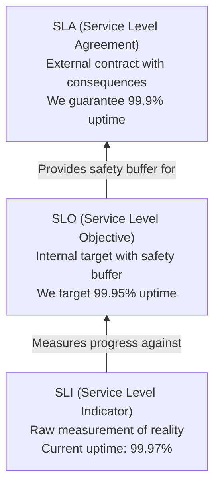
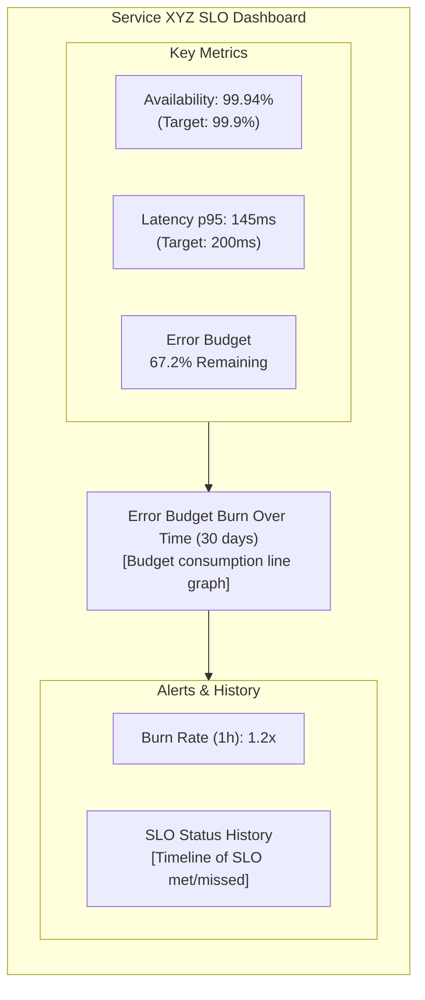

> **Discipline Module** | Complexity: `[MEDIUM]` | Time: 35-40 min

## Prerequisites

Before starting this module:
- **Required**: [Module 1.1: What is SRE?](../module-1.1-what-is-sre/) — Understanding SRE fundamentals
- **Required**: [Reliability Engineering Track](/platform/foundations/reliability-engineering/) — Reliability concepts
- **Recommended**: [Observability Theory Track](/platform/foundations/observability-theory/) — Metrics and measurement

---

## What You'll Be Able to Do

After completing this module, you will be able to:

- **Design meaningful SLIs and SLOs that reflect actual user experience**
- **Implement SLO monitoring using Prometheus recording rules and multi-window burn rates**
- **Evaluate whether current service reliability meets business requirements using SLO data**
- **Build SLO dashboards that drive operational decisions across engineering teams**

## Why This Module Matters

How reliable is your service?

Without SLOs, the answer is usually: "Umm... it's usually up?" or "Pretty good, I think?"

That's not good enough. Vague reliability leads to:
- **Endless debates**: "Is this reliable enough?" "Depends on who you ask"
- **Wrong priorities**: Spending weeks on 99.99% when users need 99%
- **Alert fatigue**: Alerting on everything because we don't know what matters
- **No accountability**: No one owns reliability because it's not defined

**Service Level Objectives (SLOs) fix this.** They turn vague feelings into measurable targets.

After this module, you'll be able to define, measure, and use SLOs to make reliability concrete and actionable.

---

## The SLI/SLO/SLA Hierarchy

These terms get confused constantly. Let's be precise:

### SLI: Service Level Indicator

**What you measure.** A quantitative metric of service behavior.

Examples:
- Request latency (milliseconds)
- Error rate (percentage)
- Throughput (requests/second)
- Availability (percentage of successful requests)

An SLI is a **number** that describes something about your service.

### SLO: Service Level Objective

**What you target.** An internal goal for an SLI.

Examples:
- "99.9% of requests should complete successfully"
- "95% of requests should complete in under 200ms"
- "The homepage should be available 99.95% of the time"

An SLO is a **threshold** that defines "good enough."

### SLA: Service Level Agreement

**What you promise externally.** A legal contract with consequences for failure.

Examples:
- "We guarantee 99.9% uptime or refund 10% of monthly fee"
- "Support tickets will be acknowledged within 4 hours"
- "Data loss will result in $X per GB penalty"

An SLA is a **contract** with customers, often less aggressive than internal SLOs.

### The Relationship

> **Stop and think**: What happens to your on-call engineers if your SLA is stricter than your SLO?



**Key insight**: Your SLO should be **stricter than your SLA**. This gives you a safety buffer — you'll know you're in trouble before customers do.

---

## Choosing Good SLIs

Not all metrics make good SLIs. Here's how to choose:

### The User Perspective Test

**Good SLIs measure what users care about.** Ask: "Would a user notice if this metric got worse?"

| Metric | User Cares? | Good SLI? |
|--------|-------------|-----------|
| Page load time | Yes | Yes |
| CPU utilization | No (usually) | No |
| Error rate | Yes | Yes |
| Memory usage | No | No |
| Request latency | Yes | Yes |
| Pod restart count | No | No |

### Categories of Good SLIs

**1. Availability**: Did the request succeed?
```
Availability = Successful requests / Total requests

"99.9% of requests return a non-5xx response"
```

**2. Latency**: How long did it take?
```
Latency = Time from request received to response sent

"95% of requests complete in under 200ms"
"99% of requests complete in under 500ms"
```

**3. Quality**: Was the response good?
```
Quality = Requests with full/correct data / Total requests

"99% of responses include all required data"
```

**4. Freshness**: How recent is the data?
```
Freshness = Time since last successful data update

"Data is never more than 5 minutes stale"
```

**5. Coverage**: Did we process everything?
```
Coverage = Items processed / Items received

"99.9% of events are processed within 10 seconds"
```

### The Four Golden Signals (from Google)

A useful framework for choosing SLIs:

| Signal | What It Measures | Example SLI |
|--------|------------------|-------------|
| **Latency** | Time to serve requests | p95 response time |
| **Traffic** | Demand on system | Requests per second |
| **Errors** | Request failure rate | % returning 5xx |
| **Saturation** | How "full" the system is | Memory/CPU utilization |

For most services, **latency**, **errors**, and **availability** are the core SLIs.

---

## Try This: Identify SLIs for a Service

Pick a service you work on or use. For each SLI category, identify what you would measure:

```
Service: ________________

Availability SLI:
  What counts as "success"? ________________
  How do you measure it? ________________

Latency SLI:
  What operation are you timing? ________________
  At what percentile? ________________

Quality SLI (if applicable):
  What defines a "good" response? ________________
  How do you know if it's degraded? ________________
```

---

## Setting Realistic SLOs

> **Pause and predict**: If your service relies on a third-party API that guarantees 99.9% uptime, what is the maximum SLO you can realistically promise to your users without building complex fallbacks?

An SLO is useless if it's not realistic. Too aggressive, and you'll never meet it. Too lax, and it doesn't drive improvement.

### Start With User Expectations

What do users actually need?

| Service Type | User Expectation | Reasonable SLO |
|--------------|------------------|----------------|
| E-commerce checkout | "It should work" | 99.9% availability |
| Internal dashboard | "It's usually up" | 99.5% availability |
| Batch processing | "Done by morning" | 95% complete by 6am |
| Real-time trading | "Instant" | 99.9% under 10ms |
| Blog | "Can read articles" | 99% availability |

### Consider What's Achievable

Your SLO should be achievable with current systems:

| Component | Typical Availability |
|-----------|---------------------|
| Single server | 99% (3.6 days downtime/year) |
| Replicated service | 99.9% (8.7 hours/year) |
| Multi-region active-active | 99.99% (52 minutes/year) |
| Well-architected critical system | 99.95-99.99% |

If your infrastructure can only deliver 99.9%, don't set a 99.99% SLO.

### The "Do We Have Budget" Test

Good SLO level = users are happy, AND you have some error budget to spend.

```
Too High (99.99%):
  - Users don't notice the difference from 99.9%
  - No room for experimentation
  - Constant firefighting
  - Team burnout

Too Low (99%):
  - Users complain
  - Too much downtime
  - No pressure to improve

Just Right (99.9%):
  - Users satisfied
  - Room to deploy/experiment
  - Motivation to improve
```

### Multi-Window SLOs

One SLO window isn't enough. Use multiple:

```yaml
availability:
  slo_target: 99.9%

  windows:
    - period: 30d  # Monthly (primary)
      target: 99.9%

    - period: 7d   # Weekly (early warning)
      target: 99.95%

    - period: 1d   # Daily (fast feedback)
      target: 99.99%
```

Why multiple windows?
- **Long window (30d)**: Shows overall reliability
- **Medium window (7d)**: Early warning of trends
- **Short window (1d)**: Fast feedback on recent changes

---

## SLO Math

> **Stop and think**: If a team regularly ends the month with 90% of their error budget remaining, what does this suggest about their deployment frequency or risk tolerance?

### Converting Between Formats

| SLO | Downtime/Year | Downtime/Month | Downtime/Day |
|-----|---------------|----------------|--------------|
| 99% | 3.65 days | 7.3 hours | 14.4 min |
| 99.9% | 8.76 hours | 43.8 min | 1.44 min |
| 99.95% | 4.38 hours | 21.9 min | 43.2 sec |
| 99.99% | 52.6 min | 4.38 min | 8.64 sec |
| 99.999% | 5.26 min | 26.3 sec | 0.86 sec |

### Error Budget Calculation

```
Error Budget = 1 - SLO Target

For 99.9% SLO over 30 days:
  Error budget = 1 - 0.999 = 0.001 = 0.1%

  In time: 30 days × 24 hours × 0.1% = 43.2 minutes
  In requests: If 1M requests/month, 1000 can fail
```

### Composite SLOs

When multiple SLIs matter, combine them:

```
User Journey SLO = Availability AND Latency

Example:
  Availability: 99.9% of requests succeed
  Latency: 95% of requests under 200ms

  Combined: A request is "good" if it:
    - Returns successfully (non-5xx), AND
    - Completes in under 200ms

  Combined SLO: 99% of requests are "good"
```

---

## Did You Know?

1. **Google's SRE book recommends starting with achievable SLOs**, then tightening them over time. It's better to consistently meet a 99% SLO than constantly fail a 99.9% SLO.

2. **SLOs should be reviewed quarterly**, not set in stone. As your system and users evolve, your SLOs should too.

3. **Many teams track "SLO burn rate"** — how fast you're consuming your error budget. Burn rate of 1 means you'll exactly exhaust budget. Above 1 means you're in trouble.

4. **The concept of "nines" (99.9%, 99.99%) comes from telephony**. The Bell System historically promised "five nines" (99.999%) availability for phone service, allowing only 5.26 minutes of downtime per year—a standard that influenced modern SLO culture in tech.

---

## War Story: The SLO That Changed Everything

A team I worked with had constant reliability debates:

**Before SLOs:**
- "The site was slow yesterday" — "No it wasn't" — "I have screenshots!"
- Alerts for everything: CPU, memory, disk, every error
- 500 alerts/week, 95% ignored
- No way to prioritize improvements

**The change:**
They defined one SLO: "99.9% of homepage requests succeed with latency under 500ms."

**After SLOs:**
- No more debates: The dashboard showed reality
- Alerts only on SLO burn rate: 3 alerts/week, all actionable
- Clear prioritization: "This will save 0.1% of error budget"
- Shared understanding: Everyone knew what "reliable" meant

**The magic**: The number didn't matter as much as **having a number everyone agreed on**.

---

## SLO-Based Alerting

Traditional alerting is symptom-based: "CPU is high!" "Memory is low!" "This error happened!"

SLO-based alerting is user-impact-based: "We're burning error budget too fast."

### Burn Rate Alerting

```
Burn Rate = Actual error rate / Allowed error rate

Example (99.9% SLO over 30 days):
  Allowed error rate: 0.1%

  If current error rate is 0.2%:
    Burn rate = 0.2% / 0.1% = 2

  Interpretation: At this rate, we'll exhaust
  30-day budget in 15 days
```

### Multi-Window Burn Rate

Alert on both **fast burn** and **slow burn**:

```yaml
alerts:
  # Fast burn: Page immediately
  - name: HighBurnRate5m
    condition: burn_rate_5m > 14
    severity: critical
    message: "Exhausting monthly budget in ~5 hours"

  # Medium burn: Alert within hours
  - name: MediumBurnRate1h
    condition: burn_rate_1h > 6
    severity: warning
    message: "Exhausting monthly budget in ~5 days"

  # Slow burn: Alert within day
  - name: SlowBurnRate6h
    condition: burn_rate_6h > 3
    severity: info
    message: "Budget consumption elevated"
```

### Why This Is Better

| Traditional Alerting | SLO-Based Alerting |
|---------------------|-------------------|
| "Error rate > 1%" | "Burning budget 3x normal" |
| Alert on symptoms | Alert on user impact |
| Hundreds of alerts | Few, actionable alerts |
| Unclear severity | Clear: how fast burning budget |
| Can't prioritize | Prioritize by budget impact |

---

## DORA Metrics: Measuring Delivery Performance

> **Pause and predict**: Which DORA metric is most directly impacted when an organization adopts an aggressively strict SLO without improving their automated testing?

While SLOs measure **service reliability**, DORA metrics measure **delivery performance** — how effectively your team ships software. Developed by the DevOps Research and Assessment (DORA) team (now part of Google Cloud), these four key metrics distinguish elite performers from the rest.

### The Four Key Metrics

| Metric | What It Measures | Elite Performance | Low Performance |
|--------|------------------|-------------------|-----------------|
| **Deployment Frequency** | How often you deploy to production | On-demand (multiple/day) | Monthly or less |
| **Lead Time for Changes** | Time from commit to production | Less than 1 hour | More than 6 months |
| **Change Failure Rate** | % of deployments causing failures | 0-15% | 46-60% |
| **Mean Time to Recovery (MTTR)** | How fast you restore service | Less than 1 hour | More than 6 months |

### How SLOs and DORA Metrics Connect

SLOs and DORA metrics are complementary lenses on the same system:

- **Deployment Frequency** is enabled by **error budgets** — teams with budget remaining can deploy confidently
- **Lead Time** improves when platforms reduce toil and friction (see [Module 1.4: Toil](../module-1.4-toil-automation/))
- **Change Failure Rate** directly consumes your **error budget** — every failed deployment burns SLO margin
- **MTTR** maps to how fast you detect (via SLO-based alerting) and recover from incidents

### Measuring DORA Metrics

Start with what you have — most CI/CD systems already capture the raw data:

```yaml
dora_metrics:
  deployment_frequency:
    source: "CI/CD pipeline logs"
    query: "Count of successful production deployments per day"

  lead_time_for_changes:
    source: "Git + CI/CD timestamps"
    query: "Time from first commit to production deploy (median)"

  change_failure_rate:
    source: "Deployments + incident tracking"
    query: "Deployments causing incidents / Total deployments"

  mean_time_to_recovery:
    source: "Incident tracking system"
    query: "Median time from incident start to resolution"
```

### DORA and Platform Maturity

DORA metrics are a leading indicator of platform engineering maturity. Teams using well-built internal platforms consistently score higher across all four metrics because the platform removes friction from the delivery pipeline. If your DORA numbers are stagnant, it often signals that toil, manual processes, or missing self-service capabilities are the bottleneck — not the developers themselves.

> **Further reading**: The annual *Accelerate State of DevOps Report* (dora.dev) provides updated benchmarks and research.

---

## Implementing SLOs in Kubernetes

### Using Prometheus for SLIs

**Availability SLI:**
```yaml
# Successful requests / Total requests
- record: sli:http_requests:availability:ratio_rate5m
  expr: |
    sum(rate(http_requests_total{status!~"5.."}[5m]))
    /
    sum(rate(http_requests_total[5m]))
```

**Latency SLI (p95):**
```yaml
- record: sli:http_request_duration:p95_rate5m
  expr: |
    histogram_quantile(0.95,
      sum(rate(http_request_duration_seconds_bucket[5m])) by (le)
    )
```

### SLO Recording Rules

```yaml
# 30-day error budget remaining
- record: slo:error_budget_remaining:ratio
  expr: |
    1 - (
      (1 - sli:http_requests:availability:ratio_rate30d)
      /
      (1 - 0.999)  # 99.9% SLO target
    )
```

### SLO Dashboard (Grafana)

Essential panels for an SLO dashboard:



---

## Common Mistakes

| Mistake | Problem | Solution |
|---------|---------|----------|
| SLO = SLA | No buffer for safety | SLO should be stricter than SLA |
| Too many SLIs | Analysis paralysis | Start with 3-5 core SLIs |
| CPU/Memory as SLIs | Users don't care about these | Use user-facing metrics |
| 99.99% everywhere | Unachievable, expensive | Match SLO to user needs |
| Never reviewing SLOs | Out of date with reality | Review quarterly |
| SLOs without dashboards | Can't see if you're meeting them | Build dashboards first |
| Alert on every violation | Alert fatigue | Alert on burn rate |

---

## Quiz: Check Your Understanding

### Question 1
You are launching a new payment processing service. The sales team wants to guarantee 99.99% uptime in customer contracts. Your engineering team measures current uptime at 99.95%, and has set an internal goal of 99.9%. Identify which of these numbers represents the SLI, SLO, and SLA, and evaluate if this is a healthy setup.

<details>
<summary>Show Answer</summary>

The SLI is 99.95% (the measured reality). The SLO is 99.9% (the internal goal). The SLA is 99.99% (the external contract). This is an extremely unhealthy setup. WHY? The SLA (99.99%) is stricter than both the SLO (99.9%) and the actual SLI (99.95%). This means you will consistently violate your customer contracts and incur penalties before your internal alarms even trigger. A healthy setup requires the SLI to be higher than the SLO, and the SLO to be higher than the SLA, providing a safety buffer to fix issues before customers are impacted.

</details>

### Question 2
Your team has configured an alert that triggers whenever the checkout service's CPU utilization exceeds 85% for more than 5 minutes. Last night, the alert woke up the on-call engineer three times, but customer support reported zero complaints about checkout failures or slowness. Explain why this happened and what kind of metric should be used instead.

<details>
<summary>Show Answer</summary>

This happened because CPU utilization is a system metric, not a user-centric Service Level Indicator (SLI). WHY? High CPU utilization often indicates that a system is efficiently processing a high volume of requests, which is exactly what it is designed to do. As long as the system is still responding quickly and successfully, the user experience is unaffected. Relying on system metrics leads to alert fatigue and wakes engineers up for non-issues. Instead, the team should use an SLI based on the user's perspective, such as request latency or error rate, which directly measure if the service is actually failing or slowing down.

</details>

### Question 3
Your team manages an API with a 30-day SLO of 99.9% availability. After a recent deployment, you notice the error rate has stabilized at 0.5%. Calculate the current burn rate and determine how long your error budget will last if this error rate continues.

<details>
<summary>Show Answer</summary>

The burn rate is 5x, meaning your entire 30-day error budget will be exhausted in just 6 days. WHY? To calculate the burn rate, you first determine the allowed error rate, which is 100% - 99.9% = 0.1%. Then, you divide the actual error rate by the allowed error rate: 0.5% / 0.1% = 5. A burn rate of 5 means you are consuming your error budget five times faster than permitted. Since the budget is designed to last 30 days, dividing 30 by 5 reveals that the budget will run out in 6 days, necessitating immediate intervention to fix the errors before the SLO is permanently breached for the month.

</details>

### Question 4
A cloud provider offers a database service with a guaranteed SLA of 99.9% uptime. The internal engineering team sets their SLO to exactly 99.9% as well. During a partial network outage, the service drops to 99.85% uptime. Explain the consequences of this decision and how the team should have configured their targets.

<details>
<summary>Show Answer</summary>

By setting the SLO equal to the SLA, the engineering team eliminated any safety margin, resulting in an immediate SLA violation and likely financial penalties. WHY? When the SLO matches the SLA, an internal breach simultaneously becomes a customer-facing breach. The team has no early warning system and zero time to react, debug, or mitigate the issue before it impacts users and violates contractual obligations. To prevent this, the team should have configured a stricter SLO—such as 99.95% or 99.99%. This stricter internal target would trigger alerts sooner, giving engineers a crucial buffer window to identify and resolve the network outage before the uptime drops below the 99.9% SLA threshold.

</details>

---

## Hands-On Exercise: Define SLOs for a Service

Design SLOs for a user-facing web service.

### The Service

An e-commerce product page that:
- Displays product details
- Shows pricing and availability
- Handles 100,000 requests/day
- Is business-critical (lost views = lost sales)

### Your Task

**1. Define SLIs**

```yaml
availability:
  description: # What counts as success?
  measurement: # How to measure it?

latency:
  description: # What are you timing?
  measurement: # At what percentile?

quality:
  description: # What makes a "good" response?
  measurement: # How to detect degradation?
```

**2. Set SLO Targets**

```yaml
slos:
  - name: availability
    target: # Your target (justify why)
    window: 30d

  - name: latency_p95
    target: # Your target in ms
    window: 30d

  - name: latency_p99
    target: # Your target in ms
    window: 30d
```

**3. Calculate Error Budget**

```
For your availability SLO:

Monthly error budget (time):
  30 days × 24 hours × (1 - target) = ___ minutes

Monthly error budget (requests):
  100,000/day × 30 days × (1 - target) = ___ requests
```

**4. Define Alerting Thresholds**

```yaml
alerts:
  critical:
    burn_rate: # What burn rate pages you?
    window: # Over what window?

  warning:
    burn_rate: # What burn rate warns you?
    window: # Over what window?
```

### Success Criteria

- [ ] Defined 3 SLIs that users care about
- [ ] Set realistic targets with justification
- [ ] Calculated error budget correctly
- [ ] Created tiered alerting (critical/warning)

### Example Solution

<details>
<summary>Show Example</summary>

```yaml
slis:
  availability:
    description: Request returns 2xx/3xx status
    measurement: |
      sum(rate(http_requests_total{status=~"2..|3.."}[5m]))
      / sum(rate(http_requests_total[5m]))

  latency_p95:
    description: 95th percentile response time
    measurement: |
      histogram_quantile(0.95,
        sum(rate(http_request_duration_seconds_bucket[5m])) by (le))

  quality:
    description: Response includes product data
    measurement: |
      sum(rate(product_responses_total{complete="true"}[5m]))
      / sum(rate(product_responses_total[5m]))

slos:
  - name: availability
    target: 99.9%  # Business-critical, but not life-safety
    window: 30d
    justification: "Lost views = lost sales, but brief outages recoverable"

  - name: latency_p95
    target: 200ms  # Fast enough for good UX
    window: 30d
    justification: "Studies show <200ms feels instant"

  - name: latency_p99
    target: 1000ms  # Tail latency bound
    window: 30d
    justification: "Even worst case should be tolerable"

error_budget:
  availability_99.9:
    monthly_time: 43.2 minutes
    monthly_requests: 3,000 failed requests

alerts:
  critical:  # Page on-call
    burn_rate: 14.4  # Budget gone in 2 hours
    window: 5m

  warning:  # Slack notification
    burn_rate: 6  # Budget gone in 5 days
    window: 1h
```

</details>

---

## Key Takeaways

1. **SLI → SLO → SLA**: Metrics, targets, and contracts (in that order)
2. **User-centric SLIs**: Measure what users experience, not internal metrics
3. **Realistic SLOs**: Achievable targets that match user needs
4. **Error budgets**: Quantify acceptable unreliability
5. **Burn rate alerting**: Alert on budget consumption, not symptoms

---

## Further Reading

**Books**:
- **"Implementing Service Level Objectives"** — Alex Hidalgo (the definitive SLO guide)
- **"Site Reliability Engineering"** — Chapter 4: Service Level Objectives

**Articles**:
- **"SLIs, SLOs, SLAs, oh my!"** — Google Cloud blog
- **"Alerting on SLOs"** — Google SRE book, Chapter 5

**Tools**:
- **Sloth**: SLO generator for Prometheus (github.com/slok/sloth)
- **OpenSLO**: Open specification for SLOs (openslo.com)
- **Google SLO Generator**: For Google Cloud services

---

## Summary

SLOs transform reliability from "we try to be reliable" into "we're 99.94% reliable against our 99.9% target." They:

- Define what "good enough" means
- Create shared understanding across teams
- Enable data-driven decisions
- Provide error budgets for calculated risk
- Focus alerting on user impact

Without SLOs, reliability is a feeling. With SLOs, it's a fact.

---

## Next Module

Continue to [Module 1.3: Error Budgets](../module-1.3-error-budgets/) to learn how to use SLOs to balance reliability with velocity.

---

*"SLOs are the fundamental measure of what your service promises, and what your users can expect."* — Alex Hidalgo