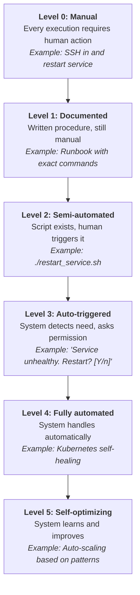
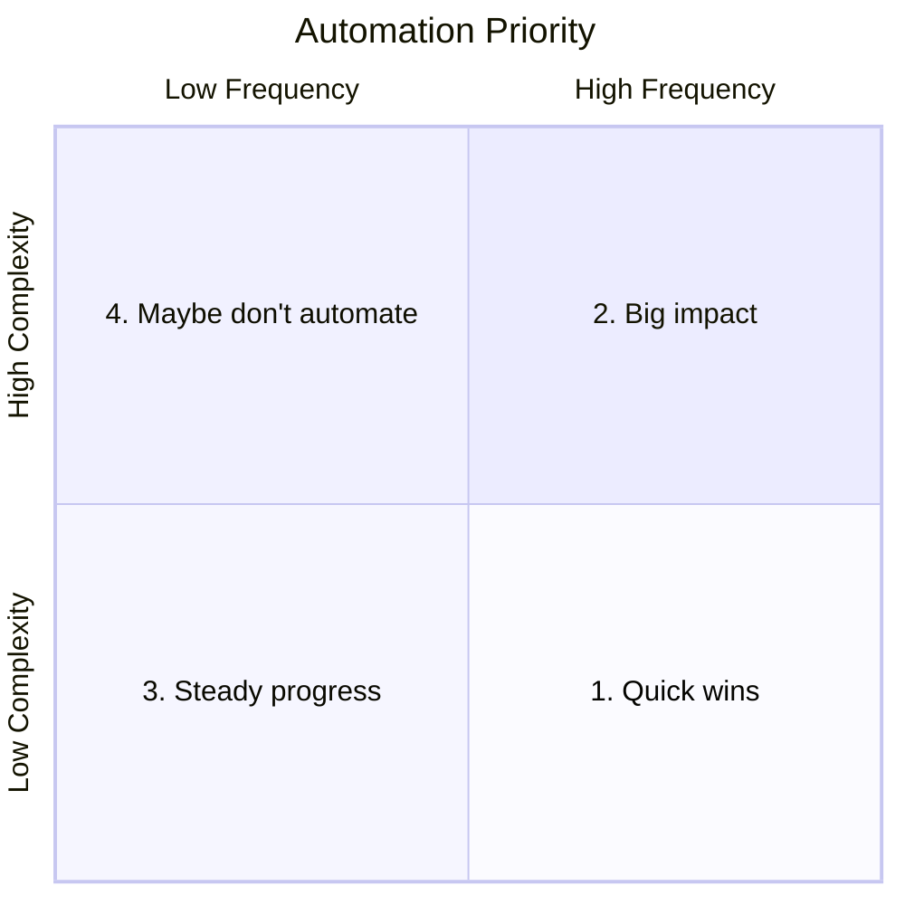

> **Discipline Module** | Complexity: `[MEDIUM]` | Time: 30-35 min

## Prerequisites

Before starting this module:
- **Required**: [Module 1.1: What is SRE?](../module-1.1-what-is-sre/) — Understanding SRE fundamentals
- **Recommended**: [Systems Thinking Track](/platform/foundations/systems-thinking/) — Understanding system leverage
- **Helpful**: Some experience with scripting or automation

---

## What You'll Be Able to Do

After completing this module, you will be able to:

- **Evaluate operational tasks against the SRE toil taxonomy to prioritize automation**
- **Design automation strategies that eliminate the highest-impact toil first**
- **Implement self-healing systems that resolve common incidents without human intervention**
- **Measure toil reduction over time and build a business case for continued automation investment**

## Why This Module Matters

You're drowning in repetitive work. Every day:
- Reset user passwords (again)
- Restart that flaky service (again)
- Run the same diagnostic commands (again)
- Provision resources manually (again)

This work keeps the lights on, but it's eating your time. You never get to the projects that would make things better.

**This is toil.** And SRE has a systematic approach to eliminating it.

This module teaches you to identify toil, measure it, and eliminate it through automation — freeing you to work on things that actually matter.

---

## What Is Toil?

> **Stop and think**: Think about the most annoying task you performed this week. Did it require you to make a creative decision, or were you just acting as a human script runner? If it's the latter, you were performing toil.

Toil is work that:
- **Manual**: Requires human hands
- **Repetitive**: Done over and over
- **Automatable**: Could be done by machines
- **Tactical**: Reactive, not strategic
- **Devoid of value**: Doesn't improve the system
- **Scales with load**: More traffic = more toil

### The Toil Test

Ask these questions about any task:

| Question | "Yes" Points to Toil |
|----------|---------------------|
| Could a script do this? | ✓ |
| Do I do this frequently? | ✓ |
| Does it require human judgment? | ✗ (not toil) |
| Does it permanently improve things? | ✗ (not toil) |
| Does it scale linearly with growth? | ✓ |
| Is it the same every time? | ✓ |

### Toil vs. Not Toil

| Task | Is It Toil? | Why |
|------|-------------|-----|
| Restarting pods manually | Yes | Repetitive, automatable |
| Responding to pages | Depends | Investigation isn't, remediation might be |
| Writing postmortems | No | Requires judgment, creates permanent value |
| Provisioning users | Yes | Same steps each time, automatable |
| Capacity planning | No | Requires analysis and judgment |
| Running backups manually | Yes | Repetitive, should be automated |
| Designing new system | No | Creative, strategic work |

### Overhead vs. Toil

Not all operational work is toil:

**Overhead** (necessary, not toil):
- Team meetings
- Code reviews
- Planning sessions
- Training and learning
- Interviews

**Toil** (should be eliminated):
- Manual deployments
- Repetitive tickets
- Manual scaling
- Routine restarts
- Manual monitoring checks

---

## The 50% Rule

> **Pause and predict**: If a team spends 90% of their time resolving tickets manually, what happens to the reliability of the system over the next year?

Google's SRE teams have a hard rule:

> **No more than 50% of SRE time should be spent on toil.**

The other 50%+ goes to engineering projects that:
- Reduce future toil
- Improve system reliability
- Build better tools
- Automate repetitive tasks

### Why 50%?

- **Less than 50%**: Allows toil to be addressed, not just managed
- **More than 50%**: The team becomes glorified ops, not engineers
- **Way more**: Indicates systemic problems — either too much toil or understaffed

### When Toil Exceeds 50%

If your team's toil exceeds 50%, something must change:

1. **Automate aggressively**: Invest in eliminating top toil sources
2. **Push back on service**: Service may need reliability improvements
3. **Increase staffing**: More people until automation catches up
4. **Transfer service**: Hand back to developers if too toil-heavy

The 50% rule is a **forcing function** that ensures SRE remains an engineering discipline.

---

## Try This: Toil Audit

List your top 5 repetitive tasks this week:

```
Task 1: ________________
  Time spent: ___ hours
  Frequency: ___/week
  Could be automated? Y/N

Task 2: ________________
  Time spent: ___ hours
  Frequency: ___/week
  Could be automated? Y/N

Task 3: ________________
  Time spent: ___ hours
  Frequency: ___/week
  Could be automated? Y/N

Task 4: ________________
  Time spent: ___ hours
  Frequency: ___/week
  Could be automated? Y/N

Task 5: ________________
  Time spent: ___ hours
  Frequency: ___/week
  Could be automated? Y/N

Total toil time: ___ hours/week
Percentage of work week: ___%
```

---

## Measuring Toil

You can't reduce what you don't measure.

### Toil Measurement Framework

```yaml
toil_tracking:
  categories:
    - name: "User management"
      tasks:
        - "Password resets"
        - "Account provisioning"
        - "Access revocations"

    - name: "Incident response"
      tasks:
        - "Alert investigation"
        - "Service restarts"
        - "Failover execution"

    - name: "Deployments"
      tasks:
        - "Manual deployment steps"
        - "Rollback execution"
        - "Config updates"

    - name: "Maintenance"
      tasks:
        - "Certificate renewals"
        - "Capacity adjustments"
        - "Backup verification"

  tracking_method:
    - Tool: Time tracking software
    - Cadence: Weekly review
    - Metrics:
      - Hours per category
      - Trend over time
      - Percentage of work
```

### Key Metrics

| Metric | What It Tells You |
|--------|-------------------|
| **Toil percentage** | How much time goes to repetitive work |
| **Toil per team member** | Individual burden distribution |
| **Toil trend** | Is it getting better or worse? |
| **Toil per incident** | How much manual work per incident? |
| **Time to automate** | ROI of automation efforts |

### Simple Tracking

Start simple — a shared spreadsheet:

| Week | Category | Task | Time (hrs) | Automatable? |
|------|----------|------|------------|--------------|
| 1 | Users | Password resets | 2 | Yes |
| 1 | Deploy | Manual deploy | 4 | Yes |
| 1 | Incident | Service restart | 1 | Yes |
| 1 | Meetings | Team sync | 3 | No |

---

## Automation Strategies

> **Stop and think**: Is it possible to over-automate? Think about a scenario where automating a task might actually be a bad idea.

### The Automation Hierarchy

Not everything should be automated the same way:



### When to Automate

The ROI calculation:

```
Automation ROI = (Time saved per occurrence × Occurrences) - Development time

Example:
  Task: Manual deployment
  Time per deployment: 30 minutes
  Deployments per month: 40
  Automation development time: 20 hours

  Monthly savings: 40 × 0.5 hours = 20 hours
  Payback period: 20 hours / 20 hours = 1 month

  Verdict: Definitely automate
```

XKCD's classic chart helps decide:

| How often? | Time saved | Automation worth it if takes... |
|------------|------------|--------------------------------|
| 50x/day | 5 min | Up to 6 weeks |
| Daily | 5 min | Up to 4 days |
| Weekly | 5 min | Up to 1 day |
| Monthly | 30 min | Up to 4 hours |
| Yearly | 1 hour | Up to 30 minutes |

### What to Automate First

Prioritize by combining frequency and complexity:

1. **High frequency, low complexity**: Quick wins (Do these first)
2. **High frequency, high complexity**: Big impact (Major engineering projects)
3. **Low frequency, low complexity**: Steady progress (Good for onboarding or slow days)
4. **Low frequency, high complexity**: Maybe don't automate (Negative ROI)



---

## Did You Know?

1. **Google targets under 2 minutes of toil per on-call incident**. If remediation takes longer, it's a sign automation is needed.

2. **The term "toil" was deliberately chosen** by Google SREs because it implies unpleasant, grinding work — not all operational work, just the tedious kind.

3. **Some teams measure "toil velocity"** — how fast toil is increasing. A positive toil velocity is a warning sign that the system is outgrowing its automation.

4. **XKCD's "Is It Worth the Time?" chart** (xkcd.com/1205) became a cult classic among SREs for calculating automation ROI. The comic shows exactly how much time you can spend automating a task based on how often you do it and how much time it saves—printed on countless office walls.

---

## War Story: The Automation That Saved the Team

A team I worked with had a toil problem:

**The Situation:**
- 6-person SRE team
- 2 critical services
- Toil consuming 80% of time
- No time for improvements
- Team morale: terrible

**The Toil Audit:**

| Category | Hours/week | % of Time |
|---|---|---|
| Manual deploys | 40 | 28% |
| Incident response | 35 | 24% |
| User provisioning | 20 | 14% |
| Log investigation | 15 | 10% |
| Certificate mgmt | 8 | 5% |
| Total toil | 118/145 | 81% |

**The 90-Day Plan:**

Week 1-4: Automate deploys
- Built CI/CD pipeline
- Savings: 35 hours/week

Week 5-8: Auto-remediation
- Kubernetes for self-healing
- Auto-scaling policies
- Savings: 25 hours/week

Week 9-12: Self-service
- User provisioning portal
- Self-service log access
- Savings: 30 hours/week

**The Result:**
```
Before:
  Toil: 81%
  Project time: 19%
  Team morale: 2/10

After 90 days:
  Toil: 28%
  Project time: 72%
  Team morale: 8/10
```

**Key lesson**: The team wasn't bad at their jobs — they were drowning in toil. Automation gave them their time back.

---

## Automation Patterns

### Pattern 1: Runbook to Script

Transform documentation into code:

```bash
# Before: Runbook
# "To restart the payment service:
# 1. SSH to payment-prod
# 2. Run: sudo systemctl restart payment
# 3. Verify: curl localhost:8080/health
# 4. Check logs: tail -f /var/log/payment/app.log"

# After: Script
#!/bin/bash
set -e

echo "Restarting payment service..."
kubectl rollout restart deployment/payment -n production

echo "Waiting for rollout..."
kubectl rollout status deployment/payment -n production

echo "Verifying health..."
kubectl exec -n production deploy/payment -- curl -s localhost:8080/health

echo "Service restarted successfully"
```

### Pattern 2: Chatbot Operations

Let chat trigger safe operations:

```
User: /restart payment-service production
Bot: ⚠️ Restart payment-service in production?
     This will cause ~30s of degraded service.
     [Confirm] [Cancel]

User: [Confirm]
Bot: ✅ Restarting payment-service...
     - Old pods terminating
     - New pods starting
     - Health check passed
     Restart complete! (took 45s)
```

### Pattern 3: Self-Healing

Let the system fix itself:

```yaml
# Kubernetes liveness probe
livenessProbe:
  httpGet:
    path: /health
    port: 8080
  initialDelaySeconds: 30
  periodSeconds: 10
  failureThreshold: 3  # Restart after 3 failures

# Result: Kubernetes automatically restarts
# unhealthy pods — no human needed
```

### Pattern 4: Policy-Based Automation

Define policies, let systems enforce them:

```yaml
# OPA policy for auto-scaling
package autoscaling

default scale_up = false

scale_up {
    input.cpu_utilization > 80
    input.pending_requests > 100
    input.current_replicas < input.max_replicas
}

# Result: System scales up automatically
# when conditions are met
```

---

## Common Mistakes

| Mistake | Problem | Solution |
|---------|---------|----------|
| Automate everything immediately | Wastes time on low-value automation | Prioritize by frequency × time |
| Automate before understanding | Script breaks in edge cases | Document first, understand, then automate |
| No monitoring of automation | Automated tasks fail silently | Add alerting to automation |
| Over-complex automation | Hard to maintain, breaks often | Simple, readable automation |
| Not tracking toil | Can't prove improvements | Measure before and after |
| Hero culture | Individual carries toil burden | Distribute and automate together |

---

## Quiz: Check Your Understanding

### Question 1
**Scenario:**
You are an SRE reviewing the weekly task list. One task involves writing a detailed postmortem for a recent database outage, which takes 4 hours. Another task is manually running a database backup verification script every morning, which takes 15 minutes. How do you classify these tasks, and why?

<details>
<summary>Show Answer</summary>

The backup verification is toil, while the postmortem is not.

Toil is defined by work that is manual, repetitive, automatable, and devoid of enduring value, scaling linearly with the system's growth. Verifying backups every morning fits this definition perfectly because it could be automated and requires no special human judgment. In contrast, writing a postmortem requires deep analysis, human judgment, and produces lasting value by improving system reliability. Therefore, the postmortem is considered engineering or operational overhead, not toil.
</details>

### Question 2
**Scenario:**
Your SRE team has been tracking its time and discovers that over the last quarter, the team spent 70% of its hours executing manual user provisioning, responding to routine paging alerts, and manually scaling infrastructure. The team is proud they kept the system running, but management is concerned. How should this situation be handled according to SRE principles?

<details>
<summary>Show Answer</summary>

The team has exceeded the 50% limit for toil and must take immediate action to reduce it.

Google's SRE model strictly limits toil to 50% of an engineer's time to ensure that at least half of their time is dedicated to engineering projects that permanently improve the system. When toil exceeds 50%, the team is trapped in a reactive operations mode and cannot build the automation needed to scale. To fix this, the team should push back on service levels, heavily prioritize automation projects, request additional staffing, or temporarily hand operational responsibilities back to the development team until the toil is manageable.
</details>

### Question 3
**Scenario:**
You manage a legacy reporting service that requires a manual cache clearing process every Friday afternoon. The process takes you 30 minutes to perform safely. You estimate it would take you 20 hours to write, test, and safely deploy a fully automated script to handle this. Using ROI principles, should you prioritize automating this task right now?

<details>
<summary>Show Answer</summary>

Yes, you should prioritize automating this task because the payback period is reasonable and it eliminates a recurring interruption.

The manual task costs you 2 hours per month (30 minutes × 4 weeks). If you invest 20 hours to automate it, the automation will pay for itself in exactly 10 months (20 hours / 2 hours per month). In SRE, calculating the Return on Investment (ROI) for automation helps prioritize engineering effort. Since this task is highly repetitive and the payback period is less than a year, automating it is a sound engineering decision that will permanently free up your Friday afternoons for higher-value work.
</details>

### Question 4
**Scenario:**
Your team currently handles high CPU alerts by manually SSHing into a server and running a script named `./scale_up.sh`. You want to improve this process. First, you configure an alert system that prompts you in Slack: "High CPU detected. Run scale_up.sh? [Y/n]". Later, you replace this entirely with a Kubernetes HorizontalPodAutoscaler that automatically adds pods when CPU hits 80%. Describe the transitions in automation levels that occurred here.

<details>
<summary>Show Answer</summary>

The process transitioned from Level 2 (Semi-automated) to Level 3 (Auto-triggered), and finally to Level 4 (Fully automated).

Initially, the human had to decide when to run the script and trigger it manually, which corresponds to Level 2. By moving the trigger to Slack, where the system detects the issue and asks for human permission, the automation reached Level 3. Finally, implementing the HorizontalPodAutoscaler removed the human from the loop entirely, allowing the system to detect and remediate the issue on its own, achieving Level 4. This progression demonstrates the ideal path for eliminating toil, moving from human-initiated actions to true self-healing systems.
</details>

---

## Hands-On Exercise: Toil Reduction Plan

Create a 30-day toil reduction plan.

### Part 1: Toil Audit (15 min)

List all repetitive tasks from the past week:

| Task | Time/occurrence | Frequency | Weekly Hours | Automatable? |
|------|-----------------|-----------|--------------|--------------|
| 1.   |                 |           |              |              |
| 2.   |                 |           |              |              |
| 3.   |                 |           |              |              |
| 4.   |                 |           |              |              |
| 5.   |                 |           |              |              |

Total weekly toil: ___ hours
Percentage of work week (40h): ___%

### Part 2: Prioritization (10 min)

Score each task:

| Task | Frequency Score (1-5, 5=daily) | Time Score (1-5, 5=long) | Complexity Score (1-5, 5=simple) | Total |
|------|--------------------------------|--------------------------|----------------------------------|-------|
| 1.   |                                |                          |                                  |       |
| 2.   |                                |                          |                                  |       |
| 3.   |                                |                          |                                  |       |

Priority order (highest total first):
1. _______________
2. _______________
3. _______________

### Part 3: 30-Day Plan (15 min)

For your top priority item:

```markdown
## Automation Plan: [Task Name]

### Current State
- Time per occurrence:
- Frequency:
- Total monthly time:
- Current automation level:

### Target State
- Automation level after:
- Expected time savings:
- Monitoring added:

### Implementation
Week 1:
  - [ ] Document current process
  - [ ] Identify edge cases

Week 2:
  - [ ] Write automation script/config
  - [ ] Test in non-production

Week 3:
  - [ ] Deploy with monitoring
  - [ ] Run in parallel with manual process

Week 4:
  - [ ] Remove manual process
  - [ ] Measure actual savings

### Success Metrics
- Time savings achieved: ___
- Errors reduced: ___
- Team satisfaction: ___
```

### Success Criteria

- [ ] Audited at least 5 tasks
- [ ] Calculated total toil percentage
- [ ] Prioritized using scoring
- [ ] Created detailed plan for #1 priority
- [ ] Defined success metrics

---

## Key Takeaways

1. **Toil is repetitive work that doesn't add lasting value** — identify it
2. **The 50% rule** ensures time for engineering, not just operations
3. **Measure toil** before and after — you can't improve what you don't track
4. **Prioritize automation** by frequency × time × simplicity
5. **Progress through automation levels** — from manual to self-healing

---

## Further Reading

**Books**:
- **"Site Reliability Engineering"** — Chapter 5: Eliminating Toil
- **"The Site Reliability Workbook"** — Chapter 6: Eliminating Toil

**Articles**:
- **"Identifying and Tracking Toil"** — Google Cloud blog
- **"Toil: A Word Every Engineer Should Know"** — Medium

**Tools**:
- **Ansible**: Automation platform
- **Terraform**: Infrastructure as code
- **Kubernetes Operators**: Custom automation

---

## Summary

Toil is the repetitive, automatable work that eats your time without making things better. Left unchecked, it consumes all your time and prevents improvement.

SRE's approach:
- **Measure** toil systematically
- **Limit** toil to 50% of time
- **Automate** strategically (ROI-based)
- **Progress** through automation levels

The goal isn't to eliminate all operational work — it's to eliminate the grinding, repetitive parts so you can focus on work that matters.

---

## Next Module

Continue to [Module 1.5: Incident Management](../module-1.5-incident-management/) to learn how to respond effectively when things go wrong.

---

*"If a human is required to take action because of an alert, that's usually a bug."* — Google SRE Proverb