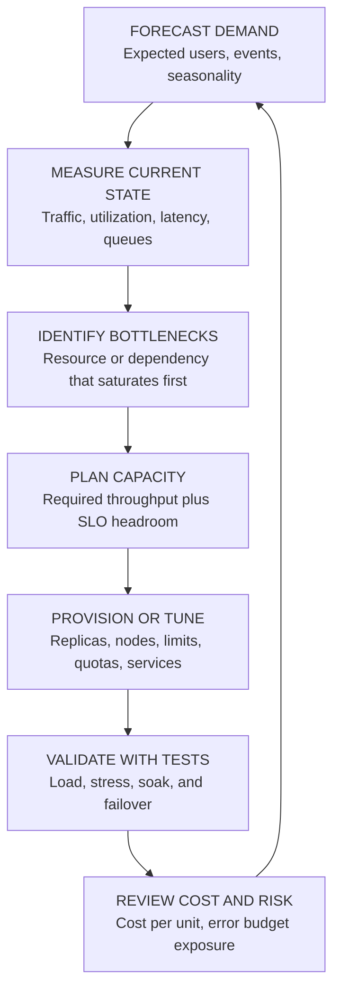
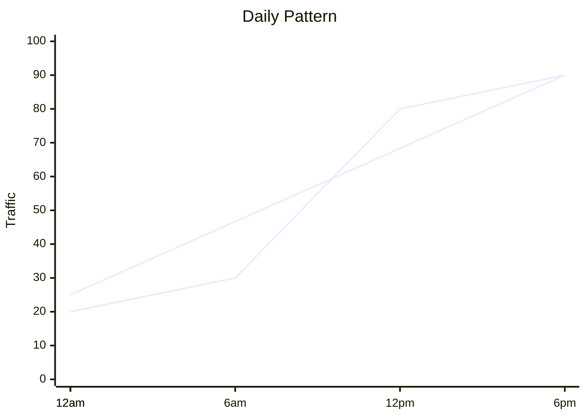
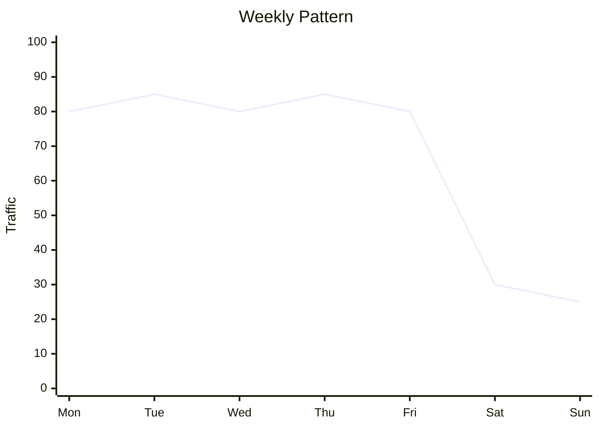
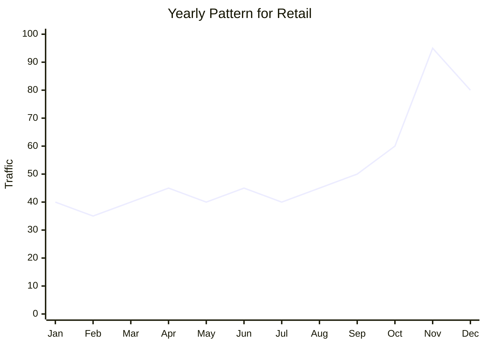
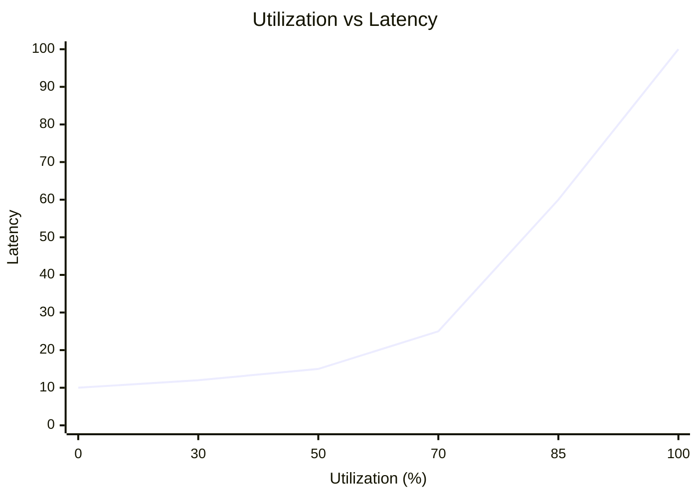
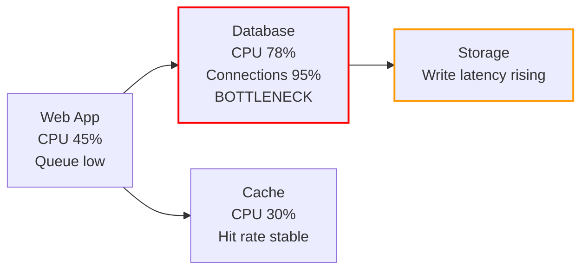
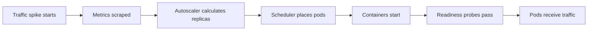
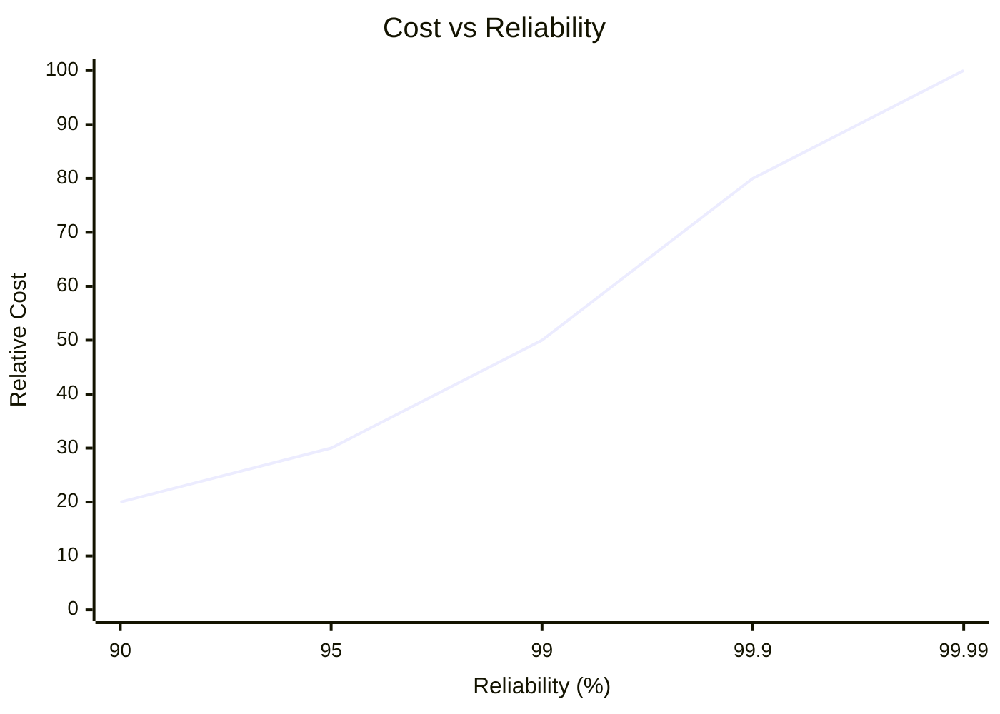

> **Discipline Module** | Complexity: `[COMPLEX]` | Time: 50-60 min

## Prerequisites

Before starting this module, make sure you can already read service-level indicators, interpret latency and error-rate graphs, and explain why an SLO is a business promise rather than just an engineering target. Capacity planning turns those promises into resource decisions, so it builds directly on the earlier SRE modules instead of replacing them.

| Prerequisite | Why It Matters |
|--------------|----------------|
| [Module 1.2: SLOs](../module-1.2-slos/) | Capacity decisions must protect a concrete reliability target, not an abstract sense of "healthy." |
| [Module 1.3: Error Budgets](../module-1.3-error-budgets/) | The acceptable amount of risk changes how much headroom you keep and how aggressively you scale. |
| [Module 1.4: Toil and Automation](../module-1.4-toil-automation/) | Manual capacity work becomes toil when the same decisions repeat every week. |
| [Observability Theory Track](/platform/foundations/observability-theory/) | Forecasts are only useful when current measurements are trustworthy. |
| Basic Kubernetes and cloud infrastructure experience | The examples use replicas, autoscaling, node capacity, and managed-service limits. |

---

## Learning Outcomes

After completing this module, you will be able to:

- **Design** a capacity model that combines historical traffic, business events, SLO targets, and infrastructure limits into a defensible forecast.
- **Analyze** utilization, queueing, latency, and dependency metrics to identify which resource will constrain throughput first.
- **Evaluate** manual, scheduled, reactive, and predictive scaling strategies against reliability, cost, and operational-risk trade-offs.
- **Implement** load-testing and validation plans that prove capacity assumptions before production users discover the limit.
- **Optimize** capacity plans by connecting cloud cost to units of work such as requests, checkouts, jobs, or active users.

## Why This Module Matters

At 09:00, a retail company's checkout service is quiet. By 10:10, a celebrity has posted a discount link, marketing has doubled its ad spend, and thousands of users are refreshing carts at the same time. The dashboards still look acceptable for a few minutes because average CPU is only catching up to reality, but queue depth is climbing, database connections are nearly exhausted, and every retry makes the system busier. The incident commander does not need a bigger dashboard at that moment; she needs capacity that was planned before the event.

Capacity planning is the SRE practice of deciding how much system you need before demand forces the answer. It is not guessing, and it is not buying the largest instance because outages are embarrassing. A good plan connects expected demand, measured system behavior, lead time, SLO risk, and cost into a decision that can be explained to engineering and business stakeholders.

The beginner mistake is to treat capacity as "more replicas." The senior-level view is broader: every service has a limiting resource, every scaling action has a delay, every forecast carries uncertainty, and every extra unit of headroom has a price. The goal is not perfect prediction. The goal is to make uncertainty explicit early enough that you can test, provision, and adapt without gambling with users.

---

## What Is Capacity Planning?

Capacity planning is the process of ensuring a service can meet future demand while staying inside reliability and cost boundaries. It answers four practical questions: what demand should we expect, what limit will we hit first, how much headroom do we need, and when must we act so capacity is ready before users are affected.

A capacity plan is strongest when it is anchored in the service's SLO. If the checkout API promises 99.9% of requests under 300 ms, then "enough capacity" means enough CPU, memory, connections, queues, network, storage, and downstream quota to keep that promise during expected peaks. A service can look inexpensive while quietly burning error budget, or look reliable while wasting money on unused resources. SRE capacity planning forces those trade-offs into the open.

The planning cycle is iterative because demand, code, dependencies, and infrastructure all change. A forecast from January is not a guarantee for July after a new feature doubles database writes per request. Each cycle should refresh the model, compare it with production measurements, find the newest bottleneck, provision or tune resources, and validate the result under controlled load.



The important habit is to separate current load from current capacity. Current load is what users are asking the system to do now. Current capacity is the highest load the system can handle while still meeting its SLO. The difference between the two is headroom, and headroom is what gives autoscalers, humans, and dependent systems time to react.

| Term | Practical Meaning | Example |
|------|-------------------|---------|
| Load | The work arriving at the system | 1,200 requests per second during daily peak |
| Capacity | The work the system can handle within SLO | 1,800 requests per second at p95 latency under 300 ms |
| Headroom | Capacity that remains unused during normal peak | 600 requests per second, or 33% of capacity |
| Bottleneck | The first component that prevents more throughput | Database connection pool saturates before API CPU |
| Lead time | Time required to make new capacity usable | Five minutes for pods, two weeks for vendor quota |
| Safety margin | Extra capacity held for forecast uncertainty | Planning for 30% above expected event demand |

### Worked Example: From Traffic to Capacity

Imagine a team owns an internal package-search API. The service currently peaks at 900 requests per second, and load testing shows it can handle 1,350 requests per second before p95 latency breaks the SLO. Product expects organic traffic to grow 8% per month, and a new IDE integration is expected to add a 60% event spike in month four. The team wants 30% headroom after forecast demand, not before it.

```text
Current peak load:                  900 RPS
Measured SLO-safe capacity:       1,350 RPS
Current headroom:                   450 RPS
Current headroom percentage:         33%

Organic growth after 4 months:
900 * (1.08 ^ 4) = 1,224 RPS

Month 4 launch impact:
1,224 * 1.60 = 1,958 RPS expected peak

Capacity required with 30% headroom:
1,958 * 1.30 = 2,545 RPS required capacity
```

The worked example shows why a system that looks healthy today can still be under-planned. The team has 33% current headroom, which sounds comfortable, but the month-four forecast requires almost twice the current measured capacity. If the lead time to increase database throughput is one month, waiting until dashboards show sustained high utilization is already too late.

> **Active learning prompt:** Before reading further, decide which number you would take to a planning meeting: current peak load, current capacity, forecast peak, or required capacity with headroom. Explain why the other three numbers are still useful but insufficient by themselves.

---

## Forecast Demand Before You Buy Capacity

Demand forecasting is the bridge between business plans and infrastructure plans. Engineering teams often have detailed graphs of last week's traffic but weak visibility into the campaign, launch, migration, compliance deadline, or customer onboarding event that will change next month's load. A useful forecast combines observed history with explicit business input and then labels uncertainty instead of hiding it.

Organic growth is usually the easiest part because it appears in historical traffic. It may still be misleading if the product recently changed pricing, added a new client, or shifted traffic from one API version to another. Event-driven demand is less frequent but more dangerous because it can arrive faster than reactive scaling. Viral growth is the hardest case; it cannot be scheduled, so the plan must rely on elastic infrastructure, fast startup times, rate limits, graceful degradation, and larger baseline headroom.

| Demand Type | Signal to Gather | Planning Response |
|-------------|------------------|-------------------|
| Organic growth | Month-over-month traffic, active users, request mix | Forecast with trends and review monthly |
| Event-driven spike | Launch calendar, marketing plan, seasonal business cycle | Pre-scale, load test, and staff the event |
| Viral or external spike | Social mentions, partner integrations, breaking news exposure | Keep elastic buffer and protect dependencies |
| Migration-driven demand | Customers moving from old system to new system | Model overlap and rollback traffic explicitly |
| Batch or scheduled demand | Jobs, reports, backups, billing runs | Stagger schedules and reserve off-peak capacity |

### Historical Trend Analysis

Historical trend analysis starts with production measurements and projects them forward. This method works best when the service is mature, request behavior is stable, and growth is gradual. It works poorly when upcoming business events will change user behavior or when a new feature changes the amount of backend work per request.

```text
Month     Peak Traffic (RPS)     Growth
Jan       820                    -
Feb       875                    6.7%
Mar       930                    6.3%
Apr       995                    7.0%
May       1,060                  6.5%

Average monthly growth: about 6.6%

Six-month organic forecast:
1,060 * (1.066 ^ 6) = about 1,555 RPS
```

The calculation is simple, but the interpretation takes judgment. If the request mix changes from mostly reads to many writes, the same RPS may consume more CPU, database I/O, or lock time. A mature capacity model therefore tracks units of work, not just request count. For an API this might mean separating search, checkout, login, write, and export endpoints because each endpoint stresses different resources.

### Business-Input Forecasting

Business-input forecasting asks stakeholders what will change the demand curve. This is not a ceremonial meeting; it is part of the reliability system. SREs should ask for launch dates, expected user cohorts, marketing size, regional rollouts, partner commitments, and success criteria. When business estimates are uncertain, capture ranges rather than forcing false precision.

```text
Questions to ask before a major launch:

What customer segment is being targeted?
How many users or accounts are expected in the first week?
Will traffic arrive gradually or at a published launch time?
Does the feature change read/write ratio or payload size?
Are any external vendors, payment systems, or identity providers involved?
What business loss occurs if we throttle, queue, or disable the feature?
```

A senior capacity plan often has multiple scenarios. A conservative plan might model expected, high, and extreme demand, then define which actions are justified for each. That keeps the team from arguing about a single magic forecast number and instead focuses the discussion on thresholds, triggers, and acceptable risk.

| Scenario | Demand Assumption | Capacity Action | Business Discussion |
|----------|-------------------|-----------------|--------------------|
| Expected | Forecast peak plus normal headroom | Standard pre-scale and monitoring | Budgeted operational cost |
| High | Forecast peak plus stronger adoption | Extra replicas, larger database tier, vendor quota increase | Temporary event spend |
| Extreme | Viral or partner-amplified spike | Rate limits, queueing, graceful degradation, incident staffing | Protect core transactions first |

### Capacity Modeling from First Principles

First-principles modeling is useful when a service is new or historical data does not represent the future. Instead of extrapolating traffic, you estimate user behavior and convert it into work. This method exposes assumptions clearly, which makes it easier to revise the model after real production data arrives.

```text
Assumptions:
Each active user opens 3 sessions per day.
Each session performs 12 API calls.
Peak hour receives 18% of daily calls.
The peak minute is 2.5 times the average minute in the peak hour.

For 600,000 active users:
Daily calls = 600,000 * 3 * 12 = 21,600,000 calls

Peak hour calls = 21,600,000 * 0.18 = 3,888,000 calls

Average RPS during peak hour = 3,888,000 / 3,600 = 1,080 RPS

Peak-minute adjusted RPS = 1,080 * 2.5 = 2,700 RPS
```

This model is not "true" just because the arithmetic is neat. Its value is that every assumption is visible. If analytics later shows five sessions per day instead of three, you can update the model and immediately see the capacity impact. If the peak-minute multiplier is higher in one region, you can plan regional capacity differently instead of averaging away the risk.

### Seasonality and Shape of Load

Seasonality matters because systems fail at peaks, not averages. A service with the same daily request count can be easy or hard to run depending on whether traffic is smooth or concentrated. Capacity planning should look at daily, weekly, monthly, and yearly shapes, then identify which peaks align with business-critical workflows.







> **Active learning prompt:** A service has low weekend traffic but runs heavy reporting jobs every Sunday night. Would you plan capacity from the weekday user peak, the reporting window, or both? Write down which resource each window is likely to stress before you continue.

---

## Measure Current Capacity and Find the Bottleneck

A forecast tells you expected demand, but only measurement tells you how the current system behaves under load. The most common capacity mistake is to watch one resource, usually CPU, and assume it represents the whole service. Real systems saturate through connection pools, memory pressure, queue depth, disk latency, lock contention, downstream quotas, network bandwidth, garbage collection, or retry amplification.

Capacity measurement should use golden signals and resource signals together. Latency and errors tell you whether users are suffering. Utilization, saturation, and queueing tell you why the system is approaching a limit. Throughput tells you whether extra load is becoming completed work or just more waiting.

| Metric | What It Measures | Warning Sign | Capacity Interpretation |
|--------|------------------|--------------|-------------------------|
| CPU utilization | Processing capacity | Sustained usage above about 70% | Little room remains for spikes or inefficient code paths |
| Memory utilization | Working set and cache pressure | OOM kills, swap, or pressure eviction | Requests may fail suddenly rather than slow gradually |
| Disk I/O latency | Storage throughput and wait time | Rising read/write latency under load | Databases and queues may become the bottleneck |
| Network I/O | Bandwidth and packet handling | Drops, retransmits, or near-limit bandwidth | More replicas may not help if the network is saturated |
| Request latency | User-visible response time | p95 or p99 trend rises with load | Queueing or dependency saturation is beginning |
| Queue depth | Backlog of unfinished work | Queue grows faster than workers drain it | Arrival rate exceeds service rate |
| Error rate | Failed work | Errors rise as traffic increases | Capacity limit has become user-visible |
| Dependency quota | External or managed-service limit | Throttling, 429s, connection refusal | Your service capacity is capped outside your pods |

### The Utilization Sweet Spot

Sustained utilization near 100% is not efficient when the service has latency SLOs. As utilization rises, each new request is more likely to wait behind existing work. Queueing theory explains the shape: the system may look stable for a while, then latency accelerates rapidly near saturation. This is why many teams target sustained utilization around 60-70% for latency-sensitive services and use higher targets only for batch or interruptible workloads.



The exact threshold depends on workload shape and scaling speed. A stateless API with fast pod startup, good caching, and no slow dependencies might safely run tighter. A payment service with external vendors, strict latency SLOs, and slow warm-up needs more headroom because one dependency wobble can consume the remaining margin.

| Workload Type | Typical Headroom Bias | Reason |
|---------------|----------------------|--------|
| User-facing checkout or login | Larger headroom | Failures are immediately visible and business-critical |
| Internal read-heavy API | Moderate headroom | Can often tolerate short latency increases |
| Batch processing | Smaller headroom | Work can queue if deadlines are still met |
| Streaming ingestion | Larger burst buffer | Backpressure can cascade into producers |
| Machine-learning training jobs | Cost-optimized capacity | Reliability target is often completion time, not request latency |

### Bottleneck Analysis

The bottleneck question is: which resource fails first as load increases? The answer is rarely visible from one dashboard panel. You find it by increasing load gradually, watching every tier, and looking for the first saturation signal that correlates with latency or errors.



If the API tier is at 45% CPU and the database connection pool is at 95%, adding API replicas can make the incident worse. More replicas may open more database connections, increase contention, and produce more retries. The correct capacity action is to relieve the constrained tier: tune queries, add indexes, increase connection pool discipline, scale the database, shard workload, cache safely, or reduce write amplification.

```text
Bottleneck investigation sequence:

1. Increase load gradually while holding the software version constant.
2. Watch throughput, latency, errors, saturation, and queue depth at each tier.
3. Mark the first resource that saturates before user-visible failure.
4. Change one capacity variable at a time and retest.
5. Record the new limiting resource, because fixing one bottleneck reveals the next.
```

> **Active learning prompt:** Your API CPU is 55%, Redis CPU is 35%, PostgreSQL has 92% connection usage, and p99 latency rises only on endpoints that write orders. Predict what happens if you double API replicas without changing database limits. Then identify one measurement that would confirm your prediction.

---

## Build a Capacity Model

A capacity model turns observed behavior and forecast demand into decisions. It should be simple enough for another engineer to audit, but detailed enough to show different work types and limiting resources. The model should include current peak, measured capacity, forecast demand, headroom target, scaling lead time, and known external limits.

Start with a service map. The map does not need to be beautiful; it needs to show where work goes and where queues or quotas exist. Static architecture diagrams are useful here because they force the team to name each capacity boundary.

```text
+------------------+       +------------------+       +------------------+
|  Users / Clients | ----> |  API Gateway     | ----> |  Orders API      |
|  Peak requests   |       |  Rate limits     |       |  CPU + workers   |
+------------------+       +------------------+       +------------------+
                                      |                         |
                                      v                         v
                           +------------------+       +------------------+
                           |  Auth Provider   |       |  PostgreSQL      |
                           |  Vendor quota    |       |  Connections/I/O |
                           +------------------+       +------------------+
                                                                |
                                                                v
                                                     +------------------+
                                                     |  Payment Vendor  |
                                                     |  QPS contract    |
                                                     +------------------+
```

A useful model distinguishes capacity units. For example, one request per second is not one equal unit of work if login requests call an identity provider, search requests use cache-heavy reads, and checkout requests write to the database and payment gateway. Senior teams often model the top few traffic classes separately and then combine them into total resource demand.

| Traffic Class | Current Peak | Forecast Multiplier | Limiting Resource | Notes |
|---------------|--------------|---------------------|-------------------|-------|
| Product search | 700 RPS | 1.4x | Cache memory and API CPU | Mostly read-heavy |
| Cart update | 250 RPS | 1.8x | Database writes | Sensitive to lock contention |
| Checkout | 120 RPS | 2.5x | Payment vendor QPS | Business-critical |
| Login | 180 RPS | 1.5x | Auth provider quota | Can block all user flows |

### Example Model for a Launch

Suppose a product launch is expected to double total traffic, but checkout traffic is expected to grow more than browsing because the campaign targets high-intent users. The team measures current SLO-safe capacity for each limiting resource and compares it with forecast demand plus 30% headroom.

| Traffic Class | Forecast Peak | Required with 30% Headroom | Current SLO-Safe Capacity | Gap |
|---------------|---------------|-----------------------------|---------------------------|-----|
| Product search | 980 RPS | 1,274 RPS | 1,600 RPS | No immediate gap |
| Cart update | 450 RPS | 585 RPS | 520 RPS | Add database write capacity |
| Checkout | 300 RPS | 390 RPS | 260 RPS | Increase vendor quota and test |
| Login | 270 RPS | 351 RPS | 400 RPS | Watch auth latency during event |

The table changes the conversation. The service does not need a blanket doubling of every component. Search has enough room, cart updates need database attention, checkout is externally constrained, and login is close enough to require event monitoring. This is how capacity planning avoids both outages and waste.

### Lead Time and Trigger Points

Capacity is only useful if it arrives before demand. Kubernetes pods may start in seconds, but nodes, database storage, managed-service limits, procurement approvals, and vendor contracts can take much longer. Your plan should define trigger points that fire earlier than the final danger zone.

| Capacity Change | Typical Lead Time | Trigger Point |
|-----------------|-------------------|---------------|
| Add pod replicas | Seconds to minutes | Forecast peak approaches autoscaler max |
| Add Kubernetes nodes | Minutes | Cluster allocatable CPU or memory below buffer |
| Increase database tier | Hours to days | Forecast writes exceed tested database capacity |
| Raise vendor quota | Days to weeks | Event forecast exceeds contract limit |
| Redesign hot path | Weeks to months | Load test shows architectural bottleneck |
| Negotiate budget | Weeks | Required event spend exceeds existing allocation |

A trigger point should be observable and action-oriented. "CPU is high" is vague. "Sustained checkout p95 above 240 ms while database connections exceed 80% at 70% of forecast event load" is specific enough to drive a decision. Good triggers also include rollback or mitigation actions, because some capacity changes introduce their own risks.

---

## Choose a Provisioning Strategy

Provisioning strategy is where reliability goals, cost limits, and operational maturity meet. There is no universally best strategy. Manual provisioning can be appropriate for stable systems with long lead times. Scheduled scaling is excellent for known traffic shapes. Reactive autoscaling is the default for many Kubernetes services. Predictive scaling is useful when historical patterns are strong and the business cost of lag is high.

| Strategy | Pros | Cons | Best For |
|----------|------|------|----------|
| Manual provisioning | Full review and cost control | Slow reaction and high toil | Stable, slow-growth services |
| Scheduled scaling | Ready before known peaks | Misses unexpected spikes | Business-hours or seasonal demand |
| Reactive autoscaling | Handles variable demand automatically | Lags behind sudden spikes | General stateless services |
| Predictive autoscaling | Scales before demand arrives | Needs good data and tuning | Large-scale predictable traffic |
| Queue-based scaling | Matches workers to backlog | Users may wait if queues grow | Asynchronous jobs and ingestion |
| Graceful degradation | Preserves core flows under stress | Requires product decisions ahead of time | Critical services with optional features |

### Manual Provisioning

Manual provisioning is not automatically bad. It can be the right choice when resources are expensive, changes are risky, or growth is slow. The problem appears when manual work is the only path during a fast-moving incident. If every capacity increase requires a ticket, approval, deployment, and hand verification, the lead time may exceed the time between warning and user impact.

```text
Manual capacity path:

1. Utilization or forecast crosses a trigger.
2. Engineer opens a capacity request with model evidence.
3. Owner approves spend or risk.
4. Infrastructure change is applied.
5. Load or canary validation confirms SLO-safe capacity.
6. The capacity model is updated with new measurements.
```

Manual provisioning should still be tested and documented. A runbook that says "increase the database tier" is incomplete unless it includes expected downtime, backup status, rollback options, connection behavior, and post-change verification.

### Scheduled Scaling

Scheduled scaling is powerful when traffic follows a clock or calendar. It also protects against autoscaling lag by making capacity ready before users arrive. The risk is that schedules become stale after usage patterns change, so they should be reviewed against actual traffic.

```yaml
scaling_schedule:
  - name: business-hours
    cron: "0 8 * * MON-FRI"
    replicas: 12

  - name: overnight
    cron: "0 20 * * MON-FRI"
    replicas: 4

  - name: launch-event
    cron: "0 7 14 8 *"
    replicas: 40

  - name: post-event-reduction
    cron: "0 3 15 8 *"
    replicas: 10
```

### Reactive Autoscaling

Reactive autoscaling responds to measured demand. In Kubernetes 1.35+, the Horizontal Pod Autoscaler can scale workloads based on CPU, memory, or custom metrics through the autoscaling API. The example below uses CPU because it is common and easy to understand, but production teams often add request rate, queue depth, or business metrics when CPU is not the actual bottleneck.

```yaml
apiVersion: autoscaling/v2
kind: HorizontalPodAutoscaler
metadata:
  name: orders-api-hpa
spec:
  scaleTargetRef:
    apiVersion: apps/v1
    kind: Deployment
    name: orders-api
  minReplicas: 4
  maxReplicas: 60
  metrics:
    - type: Resource
      resource:
        name: cpu
        target:
          type: Utilization
          averageUtilization: 65
  behavior:
    scaleUp:
      stabilizationWindowSeconds: 60
      policies:
        - type: Percent
          value: 100
          periodSeconds: 60
        - type: Pods
          value: 8
          periodSeconds: 60
      selectPolicy: Max
    scaleDown:
      stabilizationWindowSeconds: 300
      policies:
        - type: Percent
          value: 10
          periodSeconds: 60
```

Reactive scaling has delay. Metrics must be scraped, the controller must calculate desired replicas, the scheduler must place pods, images may need to be pulled, readiness probes must pass, and application caches may need to warm. If traffic doubles in less time than that chain requires, the service can fail even though autoscaling is configured.



### Predictive Scaling and Graceful Degradation

Predictive scaling uses historical patterns, calendars, and leading indicators to add capacity before demand arrives. It is most useful when the pattern is stable enough to forecast and the cost of being late is high. The failure mode is overconfidence: a prediction system that silently drifts can waste money or miss a new traffic shape.

Graceful degradation is the capacity strategy for the moment when demand exceeds available resources anyway. Instead of letting every feature fail equally, the service preserves critical paths and sheds optional work. A checkout service might disable recommendations, defer analytics writes, reduce image processing, or queue non-urgent email while keeping payment flow available.

| Degradation Choice | Protects | Trade-Off |
|--------------------|----------|-----------|
| Disable recommendations | Checkout latency and database reads | Lower personalization quality |
| Queue analytics writes | Request path latency | Delayed reporting |
| Rate-limit expensive search | Database and cache stability | Some users receive throttling |
| Serve cached responses | API availability | Data may be slightly stale |
| Reject low-priority batch jobs | Interactive user flows | Background work finishes later |

---

## Validate Capacity with Load Testing

You cannot trust capacity you have not tested. Dashboards from normal production traffic show how the service behaves under current conditions, not where it breaks. Load testing creates controlled pressure so the team can measure throughput, latency, errors, saturation, queueing, and recovery behavior before a real event forces the experiment.

Load tests should have a question. "Run k6" is not a question. "Can checkout sustain 390 RPS for thirty minutes with p95 under 300 ms while payment vendor latency doubles?" is a question. The sharper the question, the easier it is to choose traffic shape, duration, stopping conditions, and success criteria.

| Test Type | Purpose | Typical Duration | What You Learn |
|-----------|---------|------------------|----------------|
| Smoke test | Confirm the test path works | Minutes | Environment and script are valid |
| Load test | Validate expected production load | 30-60 minutes | SLO-safe capacity at planned demand |
| Stress test | Push beyond expected demand | Until controlled failure | Breaking point and first bottleneck |
| Spike test | Simulate sudden traffic arrival | Minutes | Autoscaling lag and burst behavior |
| Soak test | Hold sustained pressure | Hours to days | Memory leaks, slow queues, degradation |
| Failover test | Remove or impair a dependency | Scenario-dependent | Capacity under partial failure |

### Load Testing Checklist

A responsible load test protects production and produces evidence. The checklist matters because a poorly designed test can either hurt users or create false confidence. If you test only the API tier while dependencies are mocked, you have measured API compute, not end-to-end service capacity.

```yaml
load_test_checklist:
  before:
    - "Define the capacity question and SLO thresholds."
    - "Confirm the test environment matches production limits that matter."
    - "Notify stakeholders and on-call engineers."
    - "Verify dashboards, alerts, and logs are working."
    - "Set stopping conditions for user impact or dependency risk."
    - "Prepare rollback and traffic-shaping controls."

  during:
    - "Increase load in planned stages."
    - "Monitor throughput, p95, p99, errors, saturation, and queues."
    - "Watch dependent services and external quotas."
    - "Record the exact time each bottleneck signal appears."
    - "Stop if production users or shared dependencies are harmed."

  after:
    - "Compare results with the forecast and previous tests."
    - "Identify the first limiting resource."
    - "Document the new SLO-safe capacity."
    - "Create follow-up work for gaps."
    - "Update autoscaler limits, runbooks, and capacity models."
```

### Example: Runnable k6 Load Test

The following k6 script is runnable after installing k6 and setting `TARGET_URL`. It ramps traffic in stages, checks status codes, and fails the run if latency or error thresholds exceed the plan. The endpoint is intentionally configurable so the same script can test staging, a dedicated performance environment, or a controlled production route.

```javascript
import http from 'k6/http';
import { check, sleep } from 'k6';

export const options = {
  stages: [
    { duration: '2m', target: 100 },
    { duration: '5m', target: 100 },
    { duration: '2m', target: 250 },
    { duration: '10m', target: 250 },
    { duration: '2m', target: 0 },
  ],
  thresholds: {
    http_req_duration: ['p(95)<300', 'p(99)<750'],
    http_req_failed: ['rate<0.01'],
  },
};

const targetUrl = __ENV.TARGET_URL || 'https://example.com/health';

export default function () {
  const res = http.get(targetUrl);
  check(res, {
    'status is 200': (r) => r.status === 200,
    'response time under 300ms': (r) => r.timings.duration < 300,
  });
  sleep(1);
}
```

```bash
TARGET_URL="https://staging.example.com/products" k6 run load-test.js
```

A test result should update the capacity model, not live as an isolated report. If the service passed 250 virtual users but database write latency began rising at the end, the next model should record both the pass and the emerging bottleneck. Capacity planning improves when each validation run reduces uncertainty.

---

## Control Cost Without Undermining Reliability

Capacity planning is also cost planning. Over-provisioning may hide reliability risk for a while, but it teaches the organization to solve every uncertainty with spend. Under-provisioning saves money until the service misses its SLO at the worst possible time. The SRE skill is to spend deliberately where reliability requires it and remove waste where it does not.



The curve is steep because the last increments of reliability require redundancy, faster recovery, better testing, stronger observability, and more idle headroom. That does not mean high reliability is wrong. It means the service tier, customer impact, revenue exposure, and error budget should justify the capacity spend.

| Cost Metric | Formula | Why It Helps |
|-------------|---------|--------------|
| Cost per request | Monthly service cost / successful requests | Shows whether efficiency changes as traffic grows |
| Cost per checkout | Monthly service cost / completed checkouts | Connects spend to business value |
| Cost per active user | Monthly service cost / active users | Useful for product-level planning |
| Cost per job | Batch platform cost / completed jobs | Helps tune worker capacity and scheduling |
| Idle capacity cost | Unused provisioned capacity * unit price | Makes headroom trade-offs explicit |
| Error-budget risk cost | Estimated impact of capacity-related failures | Balances reliability investment against outage risk |

### Right-Sizing and Resource Requests

In Kubernetes, capacity planning must include resource requests and limits because the scheduler uses requests to place pods. If requests are too high, nodes appear full while real utilization is low. If requests are too low, the cluster overcommits and pods fight under load. Limits add another layer: CPU limits can throttle latency-sensitive services, while missing memory limits can let one pod pressure a node.

| Signal | Likely Meaning | Action |
|--------|----------------|--------|
| CPU usage far below request | Over-requested CPU | Lower requests or consolidate workloads after testing |
| CPU throttling with latency spikes | Limit too tight or bursty workload | Revisit CPU limits and autoscaling target |
| Memory usage near limit | OOM risk | Increase limit, reduce footprint, or split workload |
| Node allocatable exhausted but utilization low | Requests too conservative | Audit requests against measured usage |
| Frequent scale-up and scale-down | Autoscaler instability | Tune thresholds and stabilization windows |

Right-sizing should be done with evidence, not by blindly cutting requests. The safe pattern is to examine percentile usage over representative periods, account for peak and startup behavior, adjust a small group, and watch latency and eviction signals. Cost savings that create retry storms are not savings.

### Purchasing and Placement Choices

Different infrastructure options fit different parts of the capacity model. Predictable baseline demand can often use committed or reserved capacity. Spiky stateless workloads may fit autoscaling nodes. Interruptible capacity is attractive for batch and redundant workers but risky for single points of failure.

| Workload | Suitable Capacity Option | Caution |
|----------|--------------------------|---------|
| Steady baseline API | Reserved or committed capacity | Do not reserve for unproven demand |
| Stateless burst workers | Autoscaled on-demand nodes | Startup time must fit the spike shape |
| Batch processing | Spot or preemptible instances | Jobs must tolerate interruption |
| Stateful database | Managed scaling or planned tier changes | Test failover and storage behavior |
| Critical low-latency path | Dedicated headroom | Cost must be tied to SLO and business impact |

Scaling down is part of the plan. Many teams automate scale-up because outages are visible, then leave scale-down manual because waste is quieter. A complete capacity plan defines when temporary event capacity expires, how quickly autoscalers reduce load, and which dashboards show cost returning to baseline.

```yaml
event_capacity_policy:
  event_name: product-launch
  pre_scale_start: "2026-08-14T07:00:00Z"
  planned_peak_end: "2026-08-15T03:00:00Z"
  scale_down_review: "2026-08-15T06:00:00Z"
  temporary_max_replicas: 60
  normal_max_replicas: 24
  required_checks:
    - "p95 latency below SLO for 2 hours"
    - "queue depth back to baseline"
    - "error rate below alert threshold"
    - "business owner confirms campaign traffic ended"
```

---

## Automate Alerts, Decisions, and Runbooks

Capacity alerts should fire when action is still possible. A page at 99% CPU often arrives too late, while a ticket when forecast demand crosses tested capacity gives the team time to plan. The best alert depends on lead time: fast autoscaling can use near-real-time signals, but database tier changes and vendor quotas need early warning from forecasts.

Alerting on symptoms and causes together prevents confusion. A high-CPU alert with no latency impact may be a warning. High latency with rising queue depth and saturated workers is user-impacting capacity pressure. Forecasted event demand above vendor quota is not an incident yet, but it should create tracked work before the deadline.

| Alert Type | Example Condition | Response |
|------------|------------------|----------|
| Early warning | Forecast demand exceeds 75% of tested capacity in thirty days | Plan capacity change |
| Autoscaler pressure | HPA at max replicas for fifteen minutes | Raise max, reduce load, or fix bottleneck |
| Saturation | Queue depth grows for ten minutes while workers are busy | Add workers or shed load |
| SLO impact | p95 latency violates SLO during high utilization | Incident response and mitigation |
| Cost drift | Cost per request rises 25% week over week | Investigate over-provisioning or inefficient code |
| External quota | Vendor throttling begins before service saturation | Raise quota or reduce dependent calls |

When using Kubernetes commands in exercises or operations, this project often uses the alias `k` for `kubectl` after explaining it once. For example, an operator might inspect an autoscaler with `k describe hpa orders-api-hpa`, then compare desired replicas, current metrics, and scaling events. The command is not the lesson; the lesson is to connect the controller's decision with the capacity model.

```bash
kubectl describe hpa orders-api-hpa
kubectl top pods -l app=orders-api
kubectl get events --sort-by=.lastTimestamp
```

Runbooks should encode decision logic, not just commands. A useful capacity runbook tells the responder how to decide whether to scale replicas, raise node capacity, protect a dependency, enable degradation, or escalate to a vendor. It also states what not to do, such as adding API replicas when the database is already the bottleneck.

```text
Capacity runbook decision flow:

If user latency is healthy and forecast crosses threshold:
  Open planned capacity work and schedule validation.

If latency is rising and API CPU is saturated:
  Increase replicas or reduce CPU-heavy optional work.

If latency is rising and database connections are saturated:
  Do not add API replicas until connection behavior is controlled.

If external quota is throttling:
  Enable graceful degradation and contact vendor escalation path.

If autoscaler is at max replicas:
  Check node capacity, startup failures, and bottleneck tier before raising max.
```

---

## Did You Know?

1. Netflix has publicly discussed pre-scaling and resilience preparation around major release events because popular premieres can create demand that is both predictable in timing and uncertain in magnitude.

2. The thundering herd problem can turn a recovery into a second outage when many clients retry at once, so capacity planning often includes retry budgets, jitter, backoff, and load shedding.

3. In many cloud environments, the slowest capacity change is not adding pods; it is raising managed-service limits, database throughput, network quotas, or third-party vendor capacity.

4. Queue depth is often a better early warning than CPU for worker systems because it shows that arrivals are exceeding completions before every worker is visibly saturated.

---

## Common Mistakes

| Mistake | Why It Fails | Better Practice |
|---------|--------------|-----------------|
| Planning from average traffic | Peaks, not averages, break SLOs and trigger incidents | Use peak windows, percentiles, and event scenarios |
| Watching only CPU | The first limit may be memory, connections, I/O, queues, or vendor quota | Monitor every tier and correlate saturation with latency |
| Adding replicas to the wrong tier | More callers can overload the constrained dependency faster | Identify the bottleneck before scaling |
| Trusting autoscaling without measuring lag | Pods, nodes, readiness, and warm-up all take time | Test spike behavior and pre-scale known events |
| Forgetting scale-down | Temporary event capacity becomes permanent waste | Define expiry checks and cost alerts |
| Load testing unrealistic paths | Mocked or narrow tests miss real dependency limits | Use representative user journeys and request mixes |
| Treating forecasts as exact | False precision hides uncertainty and risk | Model expected, high, and extreme scenarios |
| Ignoring business priority | All requests fail together when capacity runs out | Design graceful degradation for less critical work |

---

## Quiz: Capacity Planning Scenarios

### Question 1

Your checkout API currently peaks at 800 RPS and load testing shows SLO-safe capacity at 1,200 RPS. Product expects 10% monthly organic growth and a campaign in three months that will multiply checkout traffic by 1.8 during launch week. The team wants 30% headroom during the event. What capacity target should you plan for, and why is current headroom not enough evidence?

<details>
<summary>Show Answer</summary>

The three-month organic forecast is `800 * (1.10 ^ 3)`, which is about 1,065 RPS. Applying the campaign multiplier gives about 1,917 RPS, and adding 30% headroom gives a required capacity target of about 2,492 RPS. Current headroom is only the difference between today's peak and today's measured capacity, so it does not include future growth or event demand. The plan should raise tested checkout capacity before the campaign and validate it with a load test that reflects the campaign request mix.

</details>

### Question 2

A team sees p95 latency rising during peak traffic. API pods are at 52% CPU, Redis is stable, PostgreSQL connection usage is 96%, and adding API replicas during the last incident made errors worse. What should the team investigate first, and what action should they avoid?

<details>
<summary>Show Answer</summary>

The team should investigate PostgreSQL connection saturation first because it is the clearest bottleneck signal and it correlates with rising latency. They should avoid blindly adding more API replicas because additional replicas may open more connections and increase pressure on the already constrained database. Better next steps include reviewing pool settings, query latency, lock contention, database tier capacity, and whether request paths can reduce or defer database work.

</details>

### Question 3

Your HPA scales on CPU at 70%, but a viral spike doubled traffic in one minute. New pods took four minutes to become ready, and users saw errors before the autoscaler caught up. How would you redesign the capacity strategy for the next similar risk?

<details>
<summary>Show Answer</summary>

The failure was caused by autoscaling lag being longer than the spike's arrival time. The redesign should combine more baseline headroom, faster startup or pre-warmed capacity, a lower or better scaling signal, and protection mechanisms such as rate limits or graceful degradation. If the spike is predictable, scheduled or predictive pre-scaling should add replicas and nodes before demand arrives. The team should also load test spike behavior specifically, not just steady-state load.

</details>

### Question 4

A batch processing platform runs cheaply on spot instances, but month-end reports must finish by 06:00 for finance users. During the last month-end run, spot interruptions delayed completion even though average compute cost was low. How should the capacity model change?

<details>
<summary>Show Answer</summary>

The model should include deadline reliability, interruption rate, queue backlog, and a baseline of non-interruptible capacity for critical windows. Spot instances can remain useful for flexible work, but the month-end deadline needs enough stable capacity to complete required jobs even when interruptions occur. The team should model cost per completed report and deadline miss risk, then reserve or schedule reliable workers for the month-end period.

</details>

### Question 5

A service team load tests only the `/health` endpoint and proves it can serve 10,000 RPS with excellent latency. The next production event still fails on checkout. What was wrong with the validation approach?

<details>
<summary>Show Answer</summary>

The test validated a cheap endpoint rather than the real user journey that stresses checkout dependencies. A health endpoint may avoid authentication, database writes, payment vendor calls, inventory locks, and message queues, so it cannot prove checkout capacity. The team should build a representative load test with realistic request mix, data setup, dependency behavior, and SLO thresholds for the critical transaction.

</details>

### Question 6

Cloud cost for a search API rose 35% while successful requests increased only 8%. Latency is healthy, CPU usage is consistently below requests, and the autoscaler rarely scales down after business hours. What should you evaluate before cutting resources?

<details>
<summary>Show Answer</summary>

The team should evaluate request sizing, autoscaler scale-down behavior, actual percentile usage, and business-hour traffic shape before cutting resources. The signals suggest over-requested CPU or stale scale-down policy, but resource cuts should be tested because search latency may depend on cache warmth or burst behavior. A safe plan would adjust requests or scale-down windows gradually, watch p95 and p99 latency, and track cost per request after the change.

</details>

### Question 7

A payment vendor contract allows 350 requests per second, but your Black Friday capacity model shows checkout may need 420 payment calls per second with headroom. Engineering can scale the API to 600 RPS. What should the capacity plan say?

<details>
<summary>Show Answer</summary>

The plan should identify the payment vendor quota as the limiting capacity, regardless of API replica capacity. Engineering should request a quota increase early, reduce payment call amplification if possible, and define graceful degradation or queueing behavior if the vendor limit remains. Scaling the API alone would not solve the bottleneck and could increase retries against the vendor. The load test should include vendor-like limits or a realistic simulator so the team can verify behavior before the event.

</details>

---

## Hands-On Exercise: Build a Capacity Plan

In this exercise, you will create a capacity plan for a service with organic growth, event spikes, autoscaling, cost pressure, and validation requirements. Use a spreadsheet, markdown document, or notebook, but keep the assumptions visible so another engineer can review the plan. The purpose is not to produce a perfect forecast; it is to practice making capacity decisions from explicit evidence.

### Scenario

You operate an API service that handles product browsing and checkout for a growing platform. Current peak traffic is 1,000 RPS, and the current measured SLO-safe capacity is 1,500 RPS. Organic growth is expected to be 10% month over month. A major product launch in month three is expected to double traffic during the launch window. A Black Friday event in month five is expected to produce four times the organic peak for that month. The business wants 30% headroom for user-facing traffic.

| Input | Value |
|-------|-------|
| Current peak traffic | 1,000 RPS |
| Current SLO-safe capacity | 1,500 RPS |
| Organic growth | 10% month over month |
| Launch event | Month 3, 2x organic traffic |
| Black Friday event | Month 5, 4x organic traffic |
| Required headroom | 30% above expected traffic |
| Capacity unit cost | $0.10 per 100 RPS per hour |

### Part 1: Demand Forecast

Calculate organic traffic for each month, then apply the event multiplier where relevant. Treat month one as the current 1,000 RPS baseline unless your instructor gives a different starting point. Show the formula you used so the reviewer can see whether event demand was applied before or after organic growth.

| Month | Organic Peak Traffic | Event Multiplier | Total Expected Traffic |
|-------|----------------------|------------------|------------------------|
| 1 | 1,000 RPS | 1x | |
| 2 | | 1x | |
| 3 | | 2x launch | |
| 4 | | 1x | |
| 5 | | 4x Black Friday | |
| 6 | | 1x | |

### Part 2: Capacity Requirement

For each month, multiply expected traffic by 1.3 to include 30% headroom. Compare required capacity with the current SLO-safe capacity of 1,500 RPS and mark the first month where capacity is insufficient. Explain whether that gap can be solved by replicas alone or whether dependencies must be tested.

| Month | Expected Traffic | Required Capacity with 30% Headroom | Current Capacity | Capacity Gap |
|-------|------------------|--------------------------------------|------------------|--------------|
| 1 | | | 1,500 RPS | |
| 2 | | | 1,500 RPS | |
| 3 | | | 1,500 RPS | |
| 4 | | | 1,500 RPS | |
| 5 | | | 1,500 RPS | |
| 6 | | | 1,500 RPS | |

### Part 3: Bottleneck Hypothesis

Create a short service map and choose the most likely first bottleneck. Do not assume the API pods are the bottleneck just because they are visible. Consider database writes, cache hit rate, external payment calls, node capacity, and request startup behavior.

```text
+------------------+       +------------------+       +------------------+
|  Customers       | ----> |  API Service     | ----> |  Database        |
|  Forecast RPS    |       |  Replicas/CPU    |       |  Writes/locks    |
+------------------+       +------------------+       +------------------+
                                      |
                                      v
                           +------------------+
                           |  Payment Vendor  |
                           |  QPS quota       |
                           +------------------+
```

Write your hypothesis in this form: "At month five load, the first bottleneck will probably be ______ because ______. I will confirm this by measuring ______ during a staged load test."

### Part 4: Scaling Plan

Design a scaling plan that includes normal autoscaling and event pre-scaling. Your plan should include minimum replicas, maximum replicas, scale-up threshold, scale-down behavior, and the load level you will test before each event. If you choose a CPU target, explain why CPU is a good enough signal or name the custom metric you would prefer.

| Setting | Your Decision | Reason |
|---------|---------------|--------|
| Minimum replicas | | |
| Maximum replicas | | |
| Scale-up signal | | |
| Scale-up threshold | | |
| Scale-down window | | |
| Node capacity buffer | | |
| Dependency quota action | | |

| Event | Month | Pre-Scale Target | Validation Test |
|-------|-------|------------------|-----------------|
| Product launch | 3 | | |
| Black Friday | 5 | | |

### Part 5: Cost Estimate

Estimate monthly cost using the simplified rate of `$0.10 per 100 RPS capacity per hour` and 720 hours per month. This simplified model intentionally ignores reserved discounts, spot pricing, and regional differences so you can focus on the relationship between capacity and cost. After calculating the table, write one paragraph explaining whether the cost is justified by SLO and business risk.

| Month | Planned Capacity | Hours | Estimated Cost |
|-------|------------------|-------|----------------|
| 1 | | 720 | |
| 2 | | 720 | |
| 3 | | 720 | |
| 4 | | 720 | |
| 5 | | 720 | |
| 6 | | 720 | |

### Part 6: Validation and Runbook

Write the validation plan for the two major events. Each test should include the target load, duration, stopping conditions, dashboards to watch, and the first action if a bottleneck appears. Include at least one graceful-degradation option for Black Friday in case demand exceeds the extreme scenario.

```markdown
## Validation Plan

### Product Launch Test
- Target load:
- Duration:
- Success criteria:
- Stop conditions:
- Bottleneck signals:
- Follow-up action:

### Black Friday Test
- Target load:
- Duration:
- Success criteria:
- Stop conditions:
- Bottleneck signals:
- Graceful degradation option:
```

### Success Criteria

- [ ] Forecast includes organic growth for all six months.
- [ ] Event multipliers are applied to the correct months.
- [ ] Required capacity includes 30% headroom after forecast demand.
- [ ] The first capacity gap is identified and explained.
- [ ] Bottleneck hypothesis names a specific resource or dependency.
- [ ] Autoscaling plan includes scale-up and scale-down behavior.
- [ ] Event pre-scaling is scheduled before launch and Black Friday.
- [ ] Load tests validate SLO-safe capacity, not only raw throughput.
- [ ] Cost estimate ties capacity spend to business and reliability risk.
- [ ] Runbook includes at least one graceful-degradation action.

---

## Key Takeaways

Capacity planning is a reliability practice, a cost practice, and a communication practice. The engineering work is to measure limits, forecast demand, validate assumptions, and automate repeatable decisions. The communication work is to make uncertainty, lead time, and business risk visible before the service is under pressure.

A strong capacity plan starts with the SLO, not with infrastructure inventory. It asks what user promise must hold, what demand is expected, which component limits throughput, how much headroom is needed, and when action must happen. It then proves the answer through load tests and updates the model when reality disagrees.

The senior habit is to plan for behavior, not components. More replicas, bigger nodes, and larger databases are tools. They are not the plan. The plan is the chain of evidence that shows the service can absorb expected demand, fail gracefully under unexpected demand, and return to efficient cost when the event is over.

## Next Module

Continue with [Platform Engineering Discipline](/platform/disciplines/core-platform/platform-engineering/) to learn how SRE practices become reusable internal platforms for many teams.
