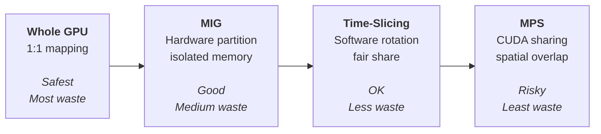
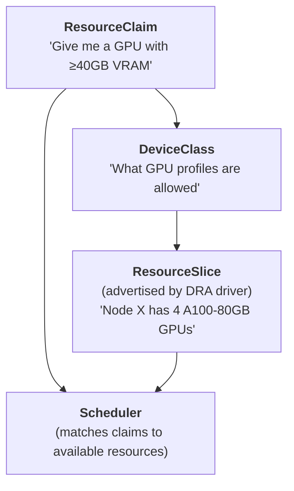
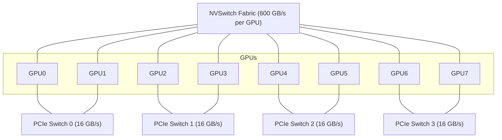

```mermaid
gantt
    title GPU Time-Slicing
    dateFormat  X
    axisFormat %s

    section GPU0
    Pod A (10ms) :a1, 0, 1
    Pod B (10ms) :b1, after a1, 1
    Pod C (10ms) :c1, after b1, 1
    Pod A (10ms) :a2, after c1, 1
    Pod B (10ms) :b2, after a2, 1
    Pod C (10ms) :c2, after b2, 1
```

> **Discipline Module** | Complexity: `[COMPLEX]` | Time: 4 hours

## Prerequisites

Before starting this module:
- **Required**: [Module 1.1: GPU Provisioning & Device Plugins](../module-1.1-gpu-provisioning/) — GPU Operator, Device Plugin API, DCGM
- **Required**: Understanding of Kubernetes scheduling (affinity, taints, tolerations, topology)
- **Recommended**: Familiarity with NVIDIA GPU architectures (Ampere, Hopper)
- **Recommended**: Access to a cluster with at least one A100 or H100 GPU (for MIG exercises)

---

## What You'll Be Able to Do

After completing this module, you will be able to:

- **Implement GPU scheduling policies using resource quotas, priorities, and preemption rules**
- **Design multi-tenant GPU sharing strategies — time-slicing, MIG, MPS — for cluster efficiency**
- **Configure fractional GPU allocation to maximize utilization across training and inference workloads**
- **Build scheduling workflows that prevent GPU starvation while maintaining fair resource distribution**

## Why This Module Matters

Here is the dirty secret of GPU computing: **most GPUs in Kubernetes clusters are criminally underutilized**.

Industry surveys consistently report average GPU utilization between 15% and 35%. That means for every dollar you spend on GPUs, 65 to 85 cents is wasted on silicon doing nothing.

Why? Because Module 1.1 taught you to allocate **whole GPUs**. A small inference model that needs 2GB of VRAM gets an entire 80GB A100. A Jupyter notebook running exploratory code gets a $30,000 GPU that sits idle 90% of the time.

This module teaches you the four strategies to fix this:

1. **Multi-Instance GPU (MIG)** — hardware-level partitioning
2. **Time-Slicing** — software-level sharing via the device plugin
3. **Multi-Process Service (MPS)** — CUDA-level sharing for concurrent kernels
4. **Dynamic Resource Allocation (DRA)** — the next-generation Kubernetes API

And then it goes deeper: **topology-aware scheduling** ensures that multi-GPU workloads get GPUs connected by the fastest interconnects, not random GPUs separated by slow PCIe hops.

Master these techniques and you will 3-5x the effective capacity of your GPU fleet without buying a single new card.

---

## The GPU Underutilization Problem

### Measuring the Waste

Let us quantify the problem with a realistic scenario:

```
Cluster: 8 nodes x 4 A100-80GB GPUs = 32 GPUs total
Cost: $3.06/GPU/hr x 32 GPUs x 730 hr/month = $71,482/month

Workloads:
  - 4 training jobs using 4 GPUs each (fully utilizing GPUs)     → 16 GPUs
  - 12 inference services using 1 GPU each (avg 15% utilization)  → 12 GPUs
  - 8 Jupyter notebooks using 1 GPU each (avg 5% utilization)     →  8 GPUs

Total allocated: 36 GPUs (exceeds capacity — 4 workloads queued!)
Effective utilization: (16×95% + 12×15% + 8×5%) / 36 = 48%
Money wasted: ~$37,000/month
```

The cluster is **oversubscribed** (36 requests for 32 GPUs) while simultaneously being **underutilized** (48% average). Notebooks and inference services each hold a full 80GB GPU hostage for trivial workloads.

### The Sharing Spectrum

Each sharing strategy trades off isolation for efficiency:



---

## Strategy 1: Multi-Instance GPU (MIG)

### What MIG Is

MIG is a **hardware-level** GPU partitioning technology available on NVIDIA A100, A30, H100, and newer GPUs. It physically divides a single GPU into up to 7 independent instances, each with:

- **Dedicated compute resources** (Streaming Multiprocessors)
- **Dedicated memory** (separate memory controllers and VRAM)
- **Dedicated L2 cache**
- **Separate error containment** (a fault in one instance doesn't affect others)

This is not time-sharing. Each MIG instance is a genuinely isolated mini-GPU with guaranteed resources.

### MIG Profiles

An A100-80GB supports these partition profiles:

| Profile | GPU Slices | Memory | Typical Use Case |
|---------|-----------|---------|------------------|
| `7g.80gb` | 7/7 (full GPU) | 80 GB | Large training |
| `4g.40gb` | 4/7 | 40 GB | Medium training, large inference |
| `3g.40gb` | 3/7 | 40 GB | Medium inference |
| `2g.20gb` | 2/7 | 20 GB | Small inference |
| `1g.10gb` | 1/7 | 10 GB | Notebooks, small inference |
| `1g.10gb+me` | 1/7 + media engine | 10 GB | Video transcoding |
| `1g.20gb` | 1/7 | 20 GB | Memory-heavy small workloads |

An H100-80GB supports similar profiles with higher compute per slice due to Hopper's architecture improvements.

### Valid MIG Combinations

You cannot combine profiles arbitrarily. Each GPU has 7 compute slices and 8 memory slices. Valid combinations for A100-80GB include:

```
Option A: 7 x 1g.10gb   (7 small instances — max density)
Option B: 3 x 2g.20gb + 1 x 1g.10gb
Option C: 2 x 3g.40gb   (leave 1 slice unused)
Option D: 1 x 4g.40gb + 1 x 3g.40gb
Option E: 1 x 7g.80gb   (full GPU — no partitioning)
```

### Configuring MIG with the GPU Operator

The GPU Operator supports two MIG strategies:

**Single strategy** — all GPUs on a node use the same MIG profile:

```yaml
apiVersion: nvidia.com/v1
kind: ClusterPolicy
metadata:
  name: cluster-policy
spec:
  mig:
    strategy: single
```

**Mixed strategy** — different GPUs on the same node can have different profiles:

```yaml
apiVersion: nvidia.com/v1
kind: ClusterPolicy
metadata:
  name: cluster-policy
spec:
  mig:
    strategy: mixed
```

Configure MIG profiles via a ConfigMap:

```yaml
apiVersion: v1
kind: ConfigMap
metadata:
  name: mig-parted-config
  namespace: gpu-operator
data:
  config.yaml: |
    version: v1
    mig-configs:
      # All GPUs split into 7 small instances
      all-1g.10gb:
        - devices: all
          mig-enabled: true
          mig-devices:
            "1g.10gb": 7

      # All GPUs split into balanced mix
      all-balanced:
        - devices: all
          mig-enabled: true
          mig-devices:
            "3g.40gb": 1
            "2g.20gb": 1
            "1g.10gb": 2

      # First GPU full, rest partitioned
      mixed-workload:
        - devices: [0]
          mig-enabled: false
        - devices: [1,2,3]
          mig-enabled: true
          mig-devices:
            "2g.20gb": 3
            "1g.10gb": 1
```

Apply a MIG configuration by labeling the node:

```bash
# Apply the "all-balanced" configuration
kubectl label node gpu-worker-01 nvidia.com/mig.config=all-balanced --overwrite

# The GPU Operator will:
# 1. Drain GPU workloads from the node
# 2. Disable MIG mode
# 3. Enable MIG mode with new profiles
# 4. Restart the device plugin
# 5. Advertise new MIG resources

# Watch the process
kubectl -n gpu-operator logs -f -l app=nvidia-mig-manager
```

### Requesting MIG Devices in Pods

With MIG enabled, the device plugin advertises MIG instances as separate resource types:

```bash
kubectl describe node gpu-worker-01 | grep nvidia.com
# nvidia.com/gpu:                    0     (whole GPUs no longer available)
# nvidia.com/mig-1g.10gb:           7
# nvidia.com/mig-2g.20gb:           3
# nvidia.com/mig-3g.40gb:           1
```

Request a specific MIG instance:

```yaml
apiVersion: v1
kind: Pod
metadata:
  name: inference-small
spec:
  containers:
    - name: model
      image: nvcr.io/nvidia/tritonserver:24.09-py3
      resources:
        limits:
          nvidia.com/mig-1g.10gb: 1    # Request one 1g.10gb MIG instance
```

---

## Strategy 2: GPU Time-Slicing

> **Stop and think**: If time-slicing provides no memory isolation, what happens if one Jupyter notebook allocates 95% of the VRAM on a shared GPU?

### What Time-Slicing Is

Time-slicing configures the NVIDIA device plugin to advertise **more GPU resources than physically exist**. Each container gets the full GPU for a time slice, then is preempted for the next container. It is essentially round-robin scheduling at the GPU driver level.



### Key Characteristics

| Property | Behavior |
|----------|----------|
| Compute isolation | **None** — all containers share all SMs |
| Memory isolation | **None** — all containers share all VRAM |
| Overcommit factor | Configurable (e.g., 4x means 4 virtual GPUs per physical GPU) |
| Context switching | ~1ms overhead per switch |
| Failure blast radius | One container's OOM kills all containers on that GPU |
| GPU support | Any NVIDIA GPU (no hardware requirement) |

### When to Use Time-Slicing

Time-slicing is ideal for:
- **Development environments** (Jupyter notebooks, interactive debugging)
- **Low-priority batch jobs** that tolerate latency
- **Multiple small inference models** that individually use <20% of GPU

Time-slicing is terrible for:
- **Training** (context switch overhead destroys throughput)
- **Latency-sensitive inference** (unpredictable latency spikes during context switches)
- **Memory-hungry workloads** (no memory isolation = OOM kills everything)

### Configuring Time-Slicing

Create a device plugin ConfigMap:

```yaml
apiVersion: v1
kind: ConfigMap
metadata:
  name: device-plugin-config
  namespace: gpu-operator
data:
  default: |
    version: v1
    flags:
      migStrategy: none
    sharing:
      timeSlicing:
        renameByDefault: true        # Rename nvidia.com/gpu to nvidia.com/gpu.shared
        failRequestsGreaterThanOne: true  # Prevent requesting >1 shared GPU
        resources:
          - name: nvidia.com/gpu
            replicas: 4              # Each physical GPU appears as 4 virtual GPUs
```

Apply via the ClusterPolicy:

```yaml
apiVersion: nvidia.com/v1
kind: ClusterPolicy
metadata:
  name: cluster-policy
spec:
  devicePlugin:
    config:
      name: device-plugin-config
      default: default
```

After applying, your node advertises 4x the physical GPUs:

```bash
kubectl describe node gpu-worker-01 | grep nvidia.com/gpu
# nvidia.com/gpu.shared: 16    (4 physical GPUs x 4 replicas)
```

Pods request the shared resource:

```yaml
apiVersion: v1
kind: Pod
metadata:
  name: notebook-user-alice
spec:
  containers:
    - name: jupyter
      image: jupyter/tensorflow-notebook:latest
      resources:
        limits:
          nvidia.com/gpu.shared: 1   # Gets 1/4 of a physical GPU (time-sliced)
```

### Per-Node Configuration

Different nodes can have different time-slicing configs. Label nodes and create multiple configs:

```yaml
apiVersion: v1
kind: ConfigMap
metadata:
  name: device-plugin-config
  namespace: gpu-operator
data:
  # For training nodes — no sharing
  training: |
    version: v1
    sharing:
      timeSlicing:
        resources:
          - name: nvidia.com/gpu
            replicas: 1
  # For inference nodes — 4x sharing
  inference: |
    version: v1
    sharing:
      timeSlicing:
        renameByDefault: true
        resources:
          - name: nvidia.com/gpu
            replicas: 4
  # For dev nodes — 8x sharing (many small notebooks)
  development: |
    version: v1
    sharing:
      timeSlicing:
        renameByDefault: true
        failRequestsGreaterThanOne: true
        resources:
          - name: nvidia.com/gpu
            replicas: 8
```

```bash
# Label nodes with their intended use
kubectl label node gpu-train-01 nvidia.com/device-plugin.config=training
kubectl label node gpu-infer-01 nvidia.com/device-plugin.config=inference
kubectl label node gpu-dev-01 nvidia.com/device-plugin.config=development
```

---

## Strategy 3: Multi-Process Service (MPS)

> **Pause and predict**: Which workload type would benefit most from MPS over time-slicing?

### What MPS Is

NVIDIA Multi-Process Service (MPS) allows multiple CUDA processes to **simultaneously** execute kernels on the same GPU. Unlike time-slicing (which round-robins entire contexts), MPS merges CUDA contexts into a single shared context, enabling true spatial sharing of the GPU's streaming multiprocessors.



### MPS vs Time-Slicing

```mermaid
gantt
    title Time-Slicing vs MPS
    dateFormat X
    axisFormat %s

    section Time-Slicing
    Pod A (Entire GPU) :a1, 0, 10
    Pod B (Entire GPU) :b1, after a1, 10
    Pod A (Entire GPU) :a2, after b1, 10

    section MPS
    Pod A (Shared SMs) :a3, 0, 30
    Pod B (Shared SMs) :b2, 0, 30
```

| Property | Time-Slicing | MPS |
|----------|-------------|-----|
| Compute sharing | Temporal (round-robin) | Spatial (simultaneous) |
| Context overhead | ~1ms per switch | Near zero |
| Memory isolation | None | Configurable per-client limits |
| Max clients | Limited by driver | 48 clients per GPU |
| Failure isolation | None | Partial (client failures can be contained) |
| Best for | Interactive, bursty workloads | Steady-state inference |

### Configuring MPS with the GPU Operator

The GPU Operator supports MPS sharing starting from v24.6.0:

```yaml
apiVersion: v1
kind: ConfigMap
metadata:
  name: device-plugin-config
  namespace: gpu-operator
data:
  mps-config: |
    version: v1
    sharing:
      mps:
        renameByDefault: true
        failRequestsGreaterThanOne: true
        resources:
          - name: nvidia.com/gpu
            replicas: 8
            devices: all
```

MPS is particularly effective for inference workloads where:
- Multiple small models run simultaneously
- Each model uses a small fraction of GPU compute
- Latency consistency matters more than maximum throughput
- You want higher aggregate throughput than time-slicing provides

---

## Strategy 4: Dynamic Resource Allocation (DRA)

### The Next Generation

Dynamic Resource Allocation (DRA) is a Kubernetes API (beta in 1.32) that reimagines how devices are managed. Instead of the Device Plugin API's simple "advertise N identical devices" model, DRA introduces:

- **Structured parameters**: Pods describe device requirements (memory, compute), not just counts
- **Claim-based allocation**: Similar to PersistentVolumeClaims for storage
- **Admin-defined classes**: DeviceClasses define pools and policies
- **Scheduler integration**: The scheduler understands device topology

### DRA Architecture



### DRA Example

```yaml
# Define a GPU class
apiVersion: resource.k8s.io/v1beta1
kind: DeviceClass
metadata:
  name: gpu-large
spec:
  selectors:
    - cel:
        expression: "device.driver == 'gpu.nvidia.com' && device.attributes['memory'] >= 40000"
---
# Claim a GPU
apiVersion: resource.k8s.io/v1beta1
kind: ResourceClaim
metadata:
  name: training-gpu
  namespace: ml-team
spec:
  devices:
    requests:
      - name: gpu
        deviceClassName: gpu-large
        count: 1
---
# Use the claim in a Pod
apiVersion: v1
kind: Pod
metadata:
  name: training-job
  namespace: ml-team
spec:
  containers:
    - name: trainer
      image: pytorch/pytorch:2.4.0-cuda12.4-cudnn9-runtime
      resources:
        claims:
          - name: gpu
  resourceClaims:
    - name: gpu
      resourceClaimName: training-gpu
```

### DRA vs Device Plugin API

| Feature | Device Plugin API | DRA |
|---------|------------------|-----|
| Resource model | Count-based (`nvidia.com/gpu: 1`) | Attribute-based (memory, compute, model) |
| Fractional allocation | No (requires MIG/time-slicing hacks) | Yes (native) |
| Topology awareness | No | Yes (built-in) |
| Admin policies | None | DeviceClasses define allowed configs |
| API maturity | Stable (v1) | Beta (v1beta1 in K8s 1.32) |
| NVIDIA support | Full | nvidia-dra-driver available |

DRA is the future of GPU scheduling in Kubernetes. As it matures, expect it to replace the combination of Device Plugin + time-slicing + MIG management with a single, unified API.

---

## Topology-Aware GPU Scheduling

### Why Topology Matters

Not all GPU-to-GPU connections are equal. In a multi-GPU node, the bandwidth between GPUs depends on the physical interconnect:



For multi-GPU training, if two GPUs communicate over NVLink (600 GB/s), training runs ~30x faster than if they communicate over PCIe (16 GB/s). **Wrong GPU placement can slow training by an order of magnitude.**

### Checking GPU Topology

```bash
# Inside a GPU node, run nvidia-smi topo
nvidia-smi topo -m

#         GPU0  GPU1  GPU2  GPU3  GPU4  GPU5  GPU6  GPU7
# GPU0     X    NV12  NV12  NV12  NV12  NV12  NV12  NV12
# GPU1    NV12   X    NV12  NV12  NV12  NV12  NV12  NV12
# GPU2    NV12  NV12   X    NV12  NV12  NV12  NV12  NV12
# ...
#
# Legend:
#   NV12 = NVLink 12 hops (NVSwitch)
#   PIX  = Same PCIe switch
#   PXB  = Different PCIe switches, same CPU
#   SYS  = Different NUMA nodes (crosses CPU socket)
```

### The Topology Manager

Kubernetes includes a **Topology Manager** (stable since 1.27) that aligns resource allocations with NUMA topology. Enable it in kubelet config:

```yaml
# /var/lib/kubelet/config.yaml
apiVersion: kubelet.config.k8s.io/v1beta1
kind: KubeletConfiguration
topologyManagerPolicy: best-effort    # or: restricted, single-numa-node
topologyManagerScope: pod             # or: container
```

Policies:
- **`none`**: No topology alignment (default)
- **`best-effort`**: Prefer aligned resources but don't reject if impossible
- **`restricted`**: Reject pods that can't be aligned
- **`single-numa-node`**: All resources must come from one NUMA node

For GPU-intensive workloads, use `restricted` or `single-numa-node` to ensure GPUs share the same NUMA node and PCIe complex:

```yaml
apiVersion: v1
kind: Pod
metadata:
  name: multi-gpu-training
spec:
  containers:
    - name: trainer
      image: nvcr.io/nvidia/pytorch:24.09-py3
      resources:
        limits:
          nvidia.com/gpu: 4
          cpu: "32"
          memory: 128Gi
      # The Topology Manager ensures these 4 GPUs
      # are on the same NUMA node / PCIe complex
```

### GKE and EKS Topology Features

Cloud providers offer additional topology awareness:

**GKE**: Compact Placement Policies ensure VMs (and their GPUs) are physically close:

```bash
gcloud compute resource-policies create group-placement training-compact \
  --collocation=COLLOCATED \
  --vm-count=8

gcloud container node-pools create gpu-training \
  --cluster=ml-cluster \
  --machine-type=a2-megagpu-16g \
  --num-nodes=8 \
  --placement-policy=training-compact
```

**EKS**: EFA (Elastic Fabric Adapter) placement groups:

```yaml
apiVersion: karpenter.sh/v1
kind: NodePool
metadata:
  name: gpu-training
spec:
  template:
    spec:
      requirements:
        - key: node.kubernetes.io/instance-type
          operator: In
          values: ["p5.48xlarge"]
      kubelet:
        topologyManagerPolicy: restricted
```

---

## Did You Know?

1. **MIG was born from frustration at NVIDIA's own data centers**. Before MIG, NVIDIA's internal AI platform team reported that A100 GPUs sitting idle in inference clusters had an average utilization of 12%. MIG was designed specifically to solve this problem, and it reduced their GPU fleet requirements by 40%.

2. **The theoretical maximum GPU sharing via time-slicing is not infinite** — the NVIDIA driver limits the number of concurrent CUDA contexts per GPU to around 32. Beyond that, you get `CUDA_ERROR_OUT_OF_MEMORY` even if the GPU has free VRAM, because each context consumes a fixed overhead of 300-500MB.

3. **NVLink 4.0 in the H100 provides 900 GB/s bidirectional bandwidth** — that is faster than the memory bandwidth of most CPUs. For comparison, a high-end DDR5 system tops out around 90 GB/s. This is why topology-aware scheduling matters so much: the difference between NVLink and PCIe is a 50x bandwidth gap.

---

## War Story: The Training Job That Took 3x Longer

An ML team at a fintech company submitted a 4-GPU training job to their Kubernetes cluster. The job usually took 8 hours on their bare-metal test machine. On Kubernetes, it took 26 hours.

The platform team investigated. `nvidia-smi topo -m` revealed the problem: the 4 GPUs assigned to the Pod were spread across two NUMA nodes and connected only via PCIe (16 GB/s) instead of NVLink (600 GB/s).

The fix:

1. Enabled `topologyManagerPolicy: restricted` on GPU nodes
2. Set `topologyManagerScope: pod` to align all GPU allocations
3. Added `nodeAffinity` to target DGX nodes with NVSwitch

Result: the same 4-GPU training job ran in 7.5 hours — slightly faster than bare metal due to better NCCL tuning.

**Lesson**: Allocating the right number of GPUs is necessary but not sufficient. You must allocate the right **topology** of GPUs.

---

## Common Mistakes

| Mistake | Problem | Solution |
|---------|---------|----------|
| Using time-slicing for training | Context switches destroy throughput; 30-50% overhead | Use whole GPUs or MIG for training workloads |
| MIG on non-supported GPUs | MIG only works on A100, A30, H100, H200 | Use time-slicing on older GPUs (T4, V100) |
| Ignoring topology for multi-GPU jobs | GPUs on different NUMA nodes communicate via slow PCIe | Enable Topology Manager with `restricted` policy |
| Setting replicas too high | Time-slicing 16x means each container gets 1/16 of GPU time — unusably slow | Keep replicas at 2-4x for time-slicing; 4-8x for MPS |
| Mixing MIG sizes on a node without mixed strategy | Device plugin cannot handle heterogeneous MIG configs with single strategy | Use `mig.strategy: mixed` or dedicate each node to one profile |
| Not renaming shared resources | Users request `nvidia.com/gpu: 1` thinking they get a whole GPU | Set `renameByDefault: true` so shared GPUs appear as `nvidia.com/gpu.shared` |
| Changing MIG config on live nodes | Reconfiguration requires draining workloads; surprise evictions | Always cordon/drain before changing MIG profiles; use maintenance windows |

---

## Quiz: Check Your Understanding

### Question 1
Your company has 10 A100-80GB GPUs. The data science director demands support for: 4 critical, long-running training jobs that maximize GPU compute; 20 lightweight inference models that require strict latency guarantees and ~10GB VRAM each; and 30 interactive Jupyter notebooks used sporadically by interns. How would you partition this fleet to satisfy all constraints efficiently?

<details>
<summary>Show Answer</summary>

You must tailor the partitioning strategy to the specific isolation and compute needs of each workload. First, dedicate 4 full GPUs to the 4 training jobs (no sharing), as training requires maximum compute and memory bandwidth without context-switching overhead.

Next, configure 3 GPUs with the MIG `1g.10gb` profile. This yields 21 hardware-isolated instances (7 per GPU), providing the 20 inference models with the strict latency guarantees and dedicated VRAM they require, with 1 spare instance. Finally, configure the remaining 3 GPUs with time-slicing set to `replicas: 10`. This creates 30 virtual GPUs for the interns' notebooks, which is acceptable since interactive work is bursty and tolerates the lack of memory isolation and occasional latency spikes.
</details>

### Question 2
You are tasked with providing GPU access to two different groups: a data science team running exploratory Jupyter notebooks, and a production engineering team deploying latency-sensitive inference services. The data science team frequently writes unoptimized code that leaks memory. How would you provision GPUs for these two teams, and why?

<details>
<summary>Show Answer</summary>

For the production engineering team, you should use **MIG (Multi-Instance GPU)**. MIG provides hardware-level isolation for both compute and memory. This ensures their latency-sensitive inference services have guaranteed resources and are completely protected from other workloads on the same physical GPU.

For the data science team, you should use **Time-Slicing** (or isolated full GPUs if budget allows). Time-slicing allows many notebooks to share a single GPU by rotating compute access. However, it provides zero memory isolation. Since the data science team frequently leaks memory, placing them on time-sliced GPUs means they will likely cause Out-Of-Memory (OOM) crashes that affect other notebooks sharing that specific GPU. By keeping them isolated from the production team, their memory leaks only impact their own exploratory environments, not the critical inference services.
</details>

### Question 3
Your platform team currently relies on a fragile web of node selectors, taints, and labels to ensure specific Pods land on nodes with exactly 40GB of VRAM and NVLink support. How will transitioning to the Dynamic Resource Allocation (DRA) API change how your engineers request these GPUs?

<details>
<summary>Show Answer</summary>

Transitioning to DRA eliminates the need for node-level labeling hacks by moving device selection to the API level. Instead of requesting a generic `nvidia.com/gpu: 1` and hoping node selectors match the right hardware, engineers will create a `ResourceClaim` that specifies exactly what they need using structured attributes. 

The claim can explicitly state requirements like "I need a GPU with >= 40GB VRAM and NVLink enabled." The Kubernetes scheduler, working with the DRA driver, natively understands these attributes and handles the complex topology and placement logic automatically. This abstracts the hardware details away from the Pod specification and allows the platform team to define robust `DeviceClass` policies, resulting in a cleaner and more reliable scheduling workflow.
</details>

### Question 4
Your team purchased a cheaper 4-GPU server to run distributed training. When running a 4-GPU data-parallel PyTorch job on this server, the training takes twice as long as it does on a cloud instance with identical GPUs. You run `nvidia-smi topo -m` and see `PIX` between some pairs and `SYS` between others. Why is the job running so slowly, and how can Kubernetes help fix this?

<details>
<summary>Show Answer</summary>

The job is running slowly because the GPUs are communicating across inefficient pathways. In data-parallel training, GPUs must constantly synchronize gradients using all-reduce operations. The `SYS` topology indicates that some GPUs are on completely different NUMA nodes, meaning their communication must cross the CPU socket at roughly 16 GB/s, which introduces massive latency. The `PIX` links are better (same PCIe switch) but still bottlenecked compared to NVLink.

Because the synchronization is only as fast as its slowest link, the `SYS` connections are crippling the entire training job. To fix this, you should enable the Kubernetes Topology Manager with a `restricted` or `single-numa-node` policy. This forces the scheduler to allocate GPUs that share the same NUMA node and PCIe complex (avoiding `SYS` links), drastically reducing the communication overhead and speeding up the training.
</details>

### Question 5
You configured time-slicing with `replicas: 8` on a T4 GPU (16GB VRAM) to save money. An engineer reports that their inference service runs perfectly when it is the only Pod on the node, but it crashes with an OOM (Out Of Memory) error during peak hours when 6 other team members are running workloads on the same GPU. Why did this happen, and what are two ways to fix it?

<details>
<summary>Show Answer</summary>

This happened because time-slicing provides no memory isolation. Even though the GPU compute is time-sliced into 8 virtual pieces, all 8 workloads share the exact same 16GB VRAM pool. When the engineer's service ran alone, it had access to the full 16GB. However, during peak hours, the combined memory allocations of all 7 active workloads exceeded the 16GB physical limit, triggering an OOM crash that likely killed multiple processes.

To fix this, you must limit how much memory each workload can allocate. One approach is to reduce the time-slicing `replicas` to 4, guaranteeing that if each workload uses up to 4GB, the VRAM won't overflow. Alternatively, you can have the engineers set framework-specific limits in their code (like `CUDA_MEM_FRACTION` in PyTorch or TensorFlow) to restrict each Pod to a safe percentage of the GPU's memory. Switching to MPS (Multi-Process Service) with explicit memory limits would also solve the problem.
</details>

---

## Hands-On Exercise: GPU Time-Slicing with Multiple Inference Workloads

### Objective

Configure GPU time-slicing on a node, deploy multiple inference workloads sharing a single GPU, and observe the sharing behavior through metrics.

### Environment

- Kubernetes cluster with at least one GPU node (any NVIDIA GPU: T4, A10, A100, etc.)
- GPU Operator installed (from Module 1.1 exercise)
- Prometheus + Grafana (from Module 1.1 exercise)

### Step 1: Configure Time-Slicing

```bash
# Create device plugin configuration with 4x time-slicing
cat <<'EOF' | kubectl apply -f -
apiVersion: v1
kind: ConfigMap
metadata:
  name: device-plugin-config
  namespace: gpu-operator
data:
  timeslice-4: |
    version: v1
    sharing:
      timeSlicing:
        renameByDefault: true
        failRequestsGreaterThanOne: true
        resources:
          - name: nvidia.com/gpu
            replicas: 4
EOF

# Label your GPU node to use the time-slicing config
GPU_NODE=$(kubectl get nodes -l nvidia.com/gpu.present=true -o jsonpath='{.items[0].metadata.name}')
kubectl label node $GPU_NODE nvidia.com/device-plugin.config=timeslice-4 --overwrite

# Update the ClusterPolicy to reference the ConfigMap
kubectl patch clusterpolicy cluster-policy --type=merge -p '{
  "spec": {
    "devicePlugin": {
      "config": {
        "name": "device-plugin-config",
        "default": "timeslice-4"
      }
    }
  }
}'

# Wait for the device plugin to restart
sleep 30
kubectl -n gpu-operator rollout status daemonset nvidia-device-plugin-daemonset

# Verify: node should now advertise 4x GPUs (e.g., 4 physical -> 16 shared)
kubectl describe node $GPU_NODE | grep nvidia.com/gpu
```

### Step 2: Deploy Multiple Inference Workloads

```bash
# Create a namespace
kubectl create namespace inference-test

# Deploy 3 inference workloads sharing the same GPU
for i in 1 2 3; do
cat <<EOF | kubectl apply -f -
apiVersion: apps/v1
kind: Deployment
metadata:
  name: inference-worker-$i
  namespace: inference-test
spec:
  replicas: 1
  selector:
    matchLabels:
      app: inference-worker-$i
  template:
    metadata:
      labels:
        app: inference-worker-$i
    spec:
      containers:
        - name: gpu-workload
          image: nvcr.io/nvidia/cuda:12.5.0-base-ubuntu22.04
          command: ["bash", "-c"]
          args:
            - |
              # Simulate inference workload — periodic GPU compute bursts
              apt-get update -qq && apt-get install -y -qq cuda-demo-suite-12-5 2>/dev/null
              while true; do
                /usr/local/cuda-12.5/extras/demo_suite/deviceQuery
                sleep $((RANDOM % 5 + 1))
              done
          resources:
            limits:
              nvidia.com/gpu.shared: 1
EOF
done

# Verify all 3 are running
kubectl -n inference-test get pods -o wide
```

### Step 3: Observe GPU Sharing

```bash
# Check that all 3 pods see the same physical GPU
for pod in $(kubectl -n inference-test get pods -o name); do
  echo "--- $pod ---"
  kubectl -n inference-test exec $pod -- nvidia-smi --query-gpu=gpu_name,gpu_uuid,memory.total --format=csv,noheader 2>/dev/null
done

# All pods should show the same GPU UUID — confirming they share one physical GPU

# Check GPU utilization (it should be higher than any single workload)
kubectl -n inference-test exec $(kubectl -n inference-test get pods -o name | head -1) -- \
  nvidia-smi --query-gpu=utilization.gpu,utilization.memory,memory.used --format=csv
```

### Step 4: Observe via DCGM Metrics

```bash
# Port-forward Prometheus
kubectl port-forward -n monitoring svc/kube-prometheus-prometheus 9090:9090 &

# Check GPU utilization — should reflect combined workload
curl -s 'http://localhost:9090/api/v1/query?query=DCGM_FI_DEV_GPU_UTIL' | \
  jq '.data.result[] | {gpu: .metric.gpu, utilization: .value[1]}'

# Check memory usage — all 3 workloads share the same VRAM
curl -s 'http://localhost:9090/api/v1/query?query=DCGM_FI_DEV_FB_USED' | \
  jq '.data.result[] | {gpu: .metric.gpu, vram_mib: .value[1]}'
```

### Step 5: Test the Limits

```bash
# Try to deploy a 4th workload (should succeed — 4 replicas configured)
cat <<'EOF' | kubectl apply -f -
apiVersion: v1
kind: Pod
metadata:
  name: inference-worker-4
  namespace: inference-test
spec:
  containers:
    - name: test
      image: nvcr.io/nvidia/cuda:12.5.0-base-ubuntu22.04
      command: ["sleep", "3600"]
      resources:
        limits:
          nvidia.com/gpu.shared: 1
EOF

# Try a 5th workload (should be Pending — only 4 replicas per GPU)
cat <<'EOF' | kubectl apply -f -
apiVersion: v1
kind: Pod
metadata:
  name: inference-worker-5
  namespace: inference-test
spec:
  containers:
    - name: test
      image: nvcr.io/nvidia/cuda:12.5.0-base-ubuntu22.04
      command: ["sleep", "3600"]
      resources:
        limits:
          nvidia.com/gpu.shared: 1
EOF

# Check: the 5th pod should be Pending
kubectl -n inference-test get pods
kubectl -n inference-test describe pod inference-worker-5 | grep -A 5 Events
```

### Step 6: Cleanup

```bash
kubectl delete namespace inference-test
# Optionally revert time-slicing:
# kubectl label node $GPU_NODE nvidia.com/device-plugin.config- --overwrite
```

### Success Criteria

You have completed this exercise when:
- [ ] Node advertises 4x the physical GPU count as `nvidia.com/gpu.shared`
- [ ] 3 inference workloads are Running, each requesting `nvidia.com/gpu.shared: 1`
- [ ] All 3 pods report the same GPU UUID (confirming they share one physical GPU)
- [ ] A 4th pod runs successfully (4 replicas per GPU)
- [ ] A 5th pod is Pending with "Insufficient nvidia.com/gpu.shared" event
- [ ] DCGM metrics show combined utilization from all shared workloads

---

## Key Takeaways

1. **GPU underutilization is the norm** — average 15-35% across the industry. Sharing strategies can 3-5x your effective GPU capacity
2. **MIG provides hardware-level isolation** — the gold standard for production inference on A100/H100, with dedicated memory and compute per instance
3. **Time-slicing is the easiest sharing method** — works on any NVIDIA GPU, but offers no memory isolation and adds context-switch overhead
4. **MPS enables true spatial sharing** — multiple processes execute simultaneously on the same GPU, ideal for many small inference models
5. **DRA is the future** — attribute-based GPU allocation will eventually replace the combination of Device Plugin + time-slicing + MIG hacks
6. **Topology awareness is critical for multi-GPU jobs** — wrong GPU placement can cause 3-30x slowdowns due to PCIe vs NVLink bandwidth differences
7. **Match the sharing strategy to the workload** — training gets whole GPUs, inference gets MIG, development gets time-slicing

---

## Further Reading

**Documentation**:
- **NVIDIA MIG User Guide**: docs.nvidia.com/datacenter/tesla/mig-user-guide/
- **GPU Time-Slicing**: docs.nvidia.com/datacenter/cloud-native/gpu-operator/latest/gpu-sharing.html
- **Kubernetes DRA**: kubernetes.io/docs/concepts/scheduling-eviction/dynamic-resource-allocation/
- **Topology Manager**: kubernetes.io/docs/tasks/administer-cluster/topology-manager/

**Talks**:
- **"GPU Sharing in Kubernetes"** — NVIDIA, KubeCon NA 2024
- **"Dynamic Resource Allocation Deep Dive"** — Patrick Ohly, Intel, KubeCon EU 2024

**Papers**:
- **"Gandiva: Introspective Cluster Scheduling for Deep Learning"** — Microsoft Research (time-slicing analysis)

---

## Summary

GPU sharing is the single highest-leverage optimization a platform team can make. By matching the right sharing strategy to each workload type — MIG for production inference, time-slicing for development, MPS for high-concurrency inference, whole GPUs for training — you multiply the effective capacity of your cluster without additional hardware. Combine this with topology-aware scheduling for multi-GPU jobs, and you have a GPU platform that is both efficient and performant.

---

## Next Module

Continue to [Module 1.3: Distributed Training Infrastructure](../module-1.3-distributed-training/) to learn how to run training jobs across multiple nodes using InfiniBand, NCCL, and Kubernetes operators.

---

*"The fastest way to double your GPU fleet is to actually use the GPUs you already have."* — Overheard at a GPU cloud startup
---