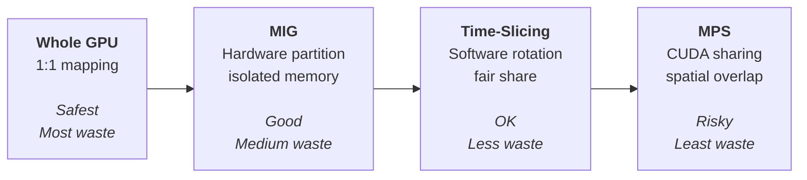
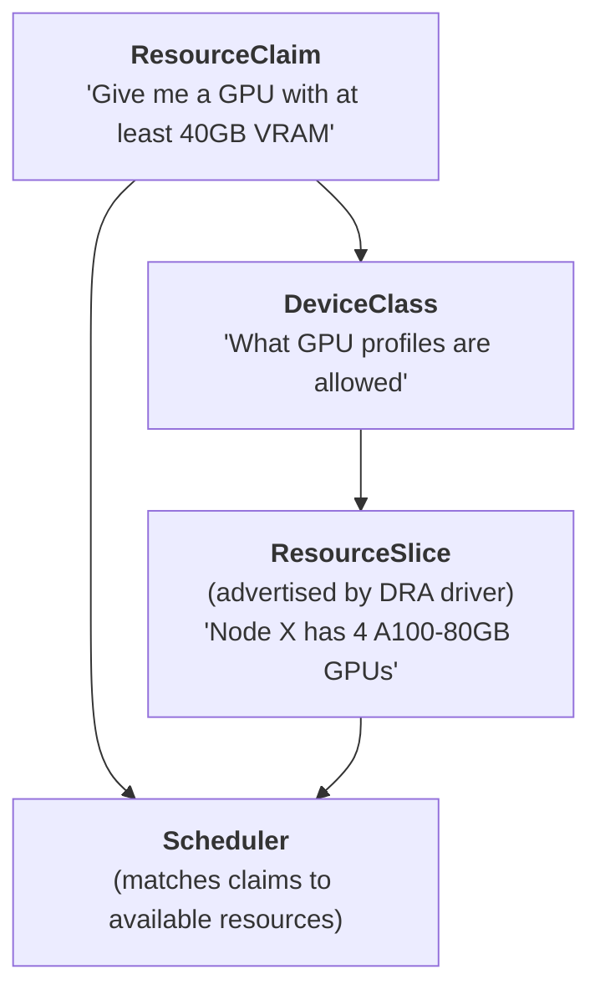
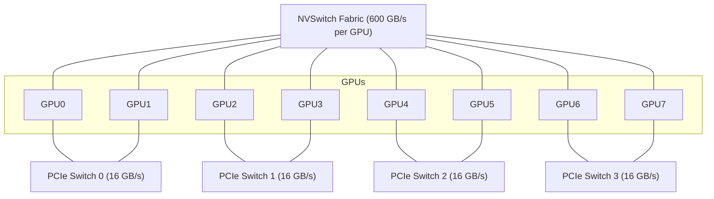
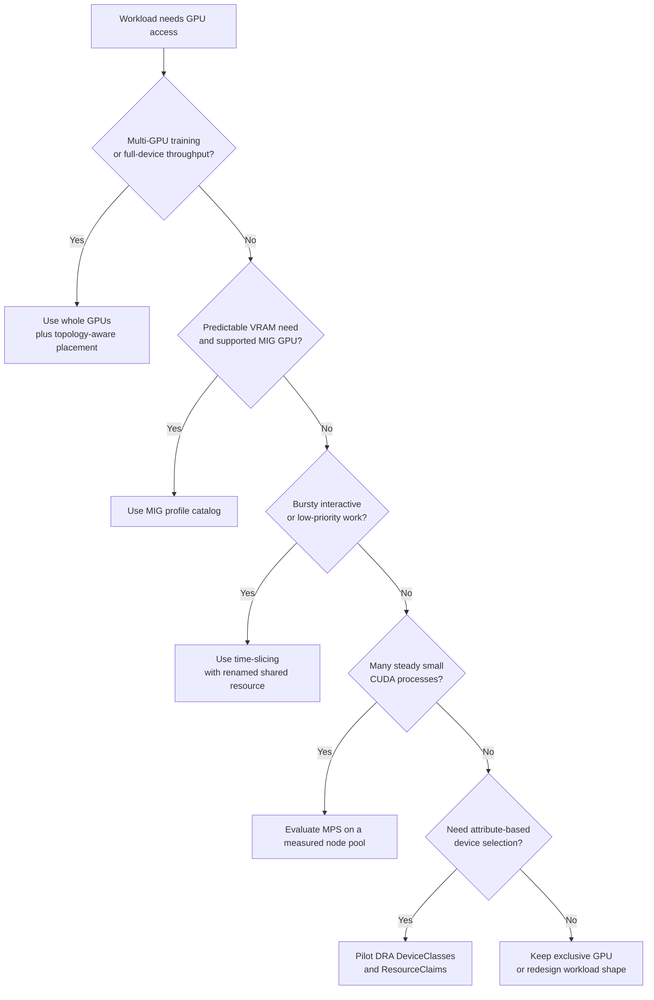

> **Complexity**: `[COMPLEX]`
>
> **Time to Complete**: 4 hours
>
> **Prerequisites**: [Module 1.1: GPU Provisioning & Device Plugins](../module-1.1-gpu-provisioning/), Kubernetes scheduling fundamentals, taints and tolerations, node affinity, topology awareness, and basic NVIDIA GPU architecture terms such as A100, H100, CUDA, and VRAM.

---

## What You'll Be Able to Do

After completing this module, you will be able to:

- **Implement** GPU scheduling policies using resource quotas, priority classes, preemption rules, and renamed shared resources so teams can consume GPUs predictably.
- **Design** multi-tenant GPU sharing strategies that choose between whole GPUs, MIG, time-slicing, MPS, and Dynamic Resource Allocation based on isolation and efficiency needs.
- **Configure** fractional GPU allocation for development, inference, and batch workloads without hiding the operational risks of memory sharing and noisy neighbors.
- **Diagnose** topology, starvation, and placement problems in multi-GPU Kubernetes clusters using `nvidia-smi`, Kubernetes events, and scheduler signals.
- **Evaluate** when Kubernetes 1.35 Dynamic Resource Allocation should replace older device-plugin patterns for attribute-based GPU requests.

## Why This Module Matters

Hypothetical scenario: your platform team has eight nodes, each with four A100-80GB GPUs, and every team insists its workload is different enough to deserve exclusive hardware. Four training jobs need stable multi-GPU throughput, a dozen inference services need predictable latency, and a group of researchers wants notebook access for experiments that run in short bursts. The scheduler sees only extended resources such as `nvidia.com/gpu`, so a small notebook can reserve the same kind of object as a distributed training job. The result is the uncomfortable combination every GPU platform eventually discovers: the cluster is fully allocated, the queue is growing, and the expensive accelerators are idle much of the day.

Module 1.1 showed how to expose GPUs to Kubernetes with the NVIDIA GPU Operator, device plugins, labels, health checks, and DCGM metrics. That is the foundation, but it is not yet a platform. A platform must decide who gets a whole GPU, who gets a hardware partition, who can tolerate time-sharing, and which workloads should be kept away from each other even when the utilization dashboard argues for consolidation. GPU scheduling is therefore not only a YAML exercise; it is a set of policy decisions about isolation, fairness, latency, throughput, blast radius, and operational recovery.

In this module, you will move from "a Pod can request a GPU" to "a cluster can allocate the right GPU shape for the right workload." You will compare Multi-Instance GPU, time-slicing, Multi-Process Service, Dynamic Resource Allocation, and topology-aware placement. You will also practice the day-two work: naming shared resources clearly, detecting overcommit failure modes, preserving multi-GPU locality, and using checklist-driven validation before a configuration reaches production users.

## From Whole GPUs to Shared Capacity

Whole-GPU allocation is the safest starting point because it gives each workload exclusive access to the device, its memory, its context, and its performance envelope. That simplicity is why the Kubernetes Device Plugin API represents GPUs as integer extended resources, but it also creates a blunt scheduling model. If a model server uses 6 GiB of VRAM on an 80 GiB accelerator, Kubernetes still treats that allocation as one full `nvidia.com/gpu`. The scheduler has done exactly what you asked, even though the platform has stranded most of the device.

The basic waste pattern is easiest to see when you separate allocation from utilization. Allocation answers "who owns the resource right now," while utilization answers "how much useful work is the device performing." A cluster can be over-allocated and underutilized at the same time because reservations are coarse and demand is bursty. That is the reason GPU sharing is a platform discipline rather than a simple cost optimization: the scheduler needs better resource shapes, and the platform needs guardrails so density does not turn into instability.

```
Cluster: 8 nodes x 4 A100-80GB GPUs = 32 GPUs total
Cost: $3.06/GPU/hr x 32 GPUs x 730 hr/month = $71,482/month

Workloads:
  - 4 training jobs using 4 GPUs each (fully utilizing GPUs)     -> 16 GPUs
  - 12 inference services using 1 GPU each (avg 15% utilization) -> 12 GPUs
  - 8 Jupyter notebooks using 1 GPU each (avg 5% utilization)    ->  8 GPUs

Total allocated: 36 GPUs (exceeds capacity, so 4 workloads queue)
Effective utilization: (16x95% + 12x15% + 8x5%) / 36 = 48%
Money wasted: ~$37,000/month
```

The important lesson in that model is not the exact cost number, because every cloud contract and hardware purchase looks different. The lesson is that "allocated" is not the same as "busy." When teams use a full accelerator as the scheduling unit for every workload class, the queue grows even while the devices have idle compute, free memory, and unserved demand. GPU sharing exists to create smaller or more flexible scheduling units, but every sharing method gives up some isolation in exchange.

The platform consequence is that GPU scheduling has to be designed around workload intent, not only around hardware inventory. A batch training job, an online model server, and a notebook all say "I need a GPU," but they mean different things by performance, interruption tolerance, memory safety, and fairness. If you expose only one generic resource, users encode those differences with tribal knowledge and Slack messages. If you expose intentional resource classes, the scheduler becomes an enforcement point for decisions the team has already made.



Read that spectrum from left to right as increasing efficiency and decreasing isolation. Whole GPUs are easiest to reason about and best for large training, but they waste capacity on small services. MIG creates hardware-backed slices that behave like smaller GPUs, which makes it a strong default for production inference on supported devices. Time-slicing and MPS can push density further, but they require honest communication with users because memory, latency, and failure behavior no longer look like exclusive hardware.

The shape you choose also changes how incidents are investigated. On an exclusive GPU, a memory error or utilization drop usually belongs to one workload owner. On a MIG node, you must inspect both the physical device and the affected profile instance. On a time-sliced or MPS node, several tenants may be involved in the same symptom, so Kubernetes events, per-Pod resource names, and DCGM labels need to be correlated. Good naming and observability are not polish; they are what make shared accelerators supportable.

Pause and predict: if your cluster has plenty of free GPU memory but users still complain that Pods are Pending, which Kubernetes object would you inspect first: a DCGM metric, a Pod event, or a node capacity field? The best answer is the Pod event, because scheduling failure is about requested resources and advertised capacity before it is about utilization. Metrics explain whether the platform is efficient; scheduler events explain why a particular Pod could not be placed.

## Hardware Isolation with Multi-Instance GPU

Multi-Instance GPU, usually shortened to MIG, is the cleanest way to turn one supported NVIDIA accelerator into multiple smaller Kubernetes resources. On A100, A30, H100, H200, and later supported GPUs, MIG partitions the hardware into independent GPU instances with dedicated compute slices, memory slices, L2 cache capacity, and error containment. This is not a scheduler illusion. A Pod assigned to one MIG instance cannot see or allocate the memory assigned to another instance, which is why MIG is so attractive for production inference and managed notebook environments.

MIG works best when workload shapes are predictable. If your inference services usually need about 10 GiB or 20 GiB of VRAM, standard profiles let you pack them tightly without turning the node into an overcommit experiment. If your training jobs sometimes need a full 80 GiB device and sometimes need four GPUs at once, MIG can become a constraint because a partitioned GPU is no longer available as an unpartitioned whole GPU until the node is reconfigured. The operational question is therefore not "is MIG good," but "which nodes should be profile-stable enough for MIG to pay off."

Think of MIG as apartment walls rather than a room-booking calendar. Tenants in different apartments can run at the same time, have dedicated space, and cannot casually use each other's storage. That isolation is exactly why production inference teams like MIG, but it also means the building layout has to be chosen before tenants arrive. If the layout is wrong, moving walls requires a maintenance activity. The same is true for repartitioning a GPU: it is feasible, but it should be planned.

| Profile | GPU Slices | Memory | Typical Use Case |
|---------|-----------|---------|------------------|
| `7g.80gb` | 7/7 (full GPU) | 80 GB | Large training |
| `4g.40gb` | 4/7 | 40 GB | Medium training, large inference |
| `3g.40gb` | 3/7 | 40 GB | Medium inference |
| `2g.20gb` | 2/7 | 20 GB | Small inference |
| `1g.10gb` | 1/7 | 10 GB | Notebooks, small inference |
| `1g.10gb+me` | 1/7 + media engine | 10 GB | Video transcoding |
| `1g.20gb` | 1/7 | 20 GB | Memory-heavy small workloads |

The profile names are compact, but they carry policy meaning. A `1g.10gb` instance says the workload gets one GPU slice and 10 GB of device memory on an A100-80GB, while `7g.80gb` represents the full device shape. A profile is not just a memory quota; it determines compute capacity, memory bandwidth, cache share, and the number of instances you can place on the card. Treat profile selection as part of your service tier, not as an afterthought in a deployment template.

That service-tier framing helps with capacity planning. If a tenant asks for ten small inference slots, you can translate that request into two A100 cards configured with `1g.10gb` profiles plus spare room, or into a different profile if the model needs more memory. If another tenant asks for sporadic experiments, you can steer them away from the production MIG pool and toward a shared development tier. The resource name becomes a product boundary: it tells users what they are buying from the platform.

```
Option A: 7 x 1g.10gb   (7 small instances, max density)
Option B: 3 x 2g.20gb + 1 x 1g.10gb
Option C: 2 x 3g.40gb   (leave 1 slice unused)
Option D: 1 x 4g.40gb + 1 x 3g.40gb
Option E: 1 x 7g.80gb   (full GPU, no partitioning)
```

Those combinations also show a practical constraint that surprises new platform owners: MIG profiles do not compose like arbitrary fractions in a spreadsheet. The GPU has a finite layout of compute and memory slices, and only valid combinations can be created. If a team asks for one odd-sized profile on every node, that request might strand slices that no other workload can use. Good platform design therefore publishes a small catalog of supported profiles instead of accepting every possible shape.

The catalog should be small enough that operators can explain it under pressure. A common pattern is to offer one dense small-inference shape, one medium shape, and an unpartitioned training pool, then add more profiles only when measured demand justifies the operational cost. This is similar to offering a few VM instance sizes rather than letting every team choose arbitrary CPU and memory combinations. Standardization sacrifices some theoretical packing efficiency, but it improves documentation, alerting, quota design, and on-call diagnosis.

The NVIDIA GPU Operator exposes two broad MIG strategies. A single strategy keeps the node simpler because all GPUs use the same mode, which is helpful when you dedicate a node pool to one profile family. A mixed strategy allows different GPUs on the same node to use different profiles, which improves packing flexibility but also increases operational complexity. The choice should match how stable your workload mix is and how much scheduling entropy your support team can tolerate.

```yaml
apiVersion: nvidia.com/v1
kind: ClusterPolicy
metadata:
  name: cluster-policy
spec:
  mig:
    strategy: single
```

```yaml
apiVersion: nvidia.com/v1
kind: ClusterPolicy
metadata:
  name: cluster-policy
spec:
  mig:
    strategy: mixed
```

The MIG Manager component uses a configuration file to describe named layouts. Keeping these layouts in a ConfigMap gives operators a reviewable object that can be tied to maintenance windows, node labels, and rollout automation. The example below preserves three useful patterns: dense small instances, a balanced layout for mixed inference sizes, and a node shape that leaves one GPU unpartitioned while partitioning the rest. In production, you would usually bind these names to node pools and capacity planning documents so teams know which resource names are available.

```yaml
apiVersion: v1
kind: ConfigMap
metadata:
  name: mig-parted-config
  namespace: gpu-operator
data:
  config.yaml: |
    version: v1
    mig-configs:
      # All GPUs split into 7 small instances
      all-1g.10gb:
        - devices: all
          mig-enabled: true
          mig-devices:
            "1g.10gb": 7

      # All GPUs split into balanced mix
      all-balanced:
        - devices: all
          mig-enabled: true
          mig-devices:
            "3g.40gb": 1
            "2g.20gb": 1
            "1g.10gb": 2

      # First GPU full, rest partitioned
      mixed-workload:
        - devices: [0]
          mig-enabled: false
        - devices: [1,2,3]
          mig-enabled: true
          mig-devices:
            "2g.20gb": 3
            "1g.10gb": 1
```

Changing a node's MIG layout is disruptive because workloads using the device must leave before the hardware profile changes. The label command is simple, but the procedure around it matters more than the command. A safe runbook cordons the node, drains GPU workloads that can move, verifies there are no important local artifacts, applies the label, watches the MIG Manager, and then confirms the device plugin advertises the expected resources. If your platform reconfigures MIG profiles casually during business hours, users will experience surprise evictions and Pending Pods.

MIG reconfiguration should also be treated as a capacity event. When one node leaves service for repartitioning, the remaining pool must absorb both new scheduling demand and any workloads evicted from the changing node. If the platform has only one node with a particular profile, the maintenance window is effectively a service outage for that resource class. Mature teams model this before applying labels, then use PodDisruptionBudgets, queue controls, and tenant communication to keep the change predictable.

```bash
# Apply the "all-balanced" configuration
kubectl label node gpu-worker-01 nvidia.com/mig.config=all-balanced --overwrite

# The GPU Operator will:
# 1. Drain GPU workloads from the node
# 2. Disable MIG mode
# 3. Enable MIG mode with new profiles
# 4. Restart the device plugin
# 5. Advertise new MIG resources

# Watch the process
kubectl -n gpu-operator logs -f -l app=nvidia-mig-manager
```

After the node is reconfigured, Kubernetes sees MIG instances as separate extended resources. This is an important usability boundary. Users should request the profile they actually need, such as `nvidia.com/mig-1g.10gb`, rather than requesting a generic full GPU and relying on a node selector to make the placement work. The resource name becomes a contract between the platform team and the workload owner.

```bash
kubectl describe node gpu-worker-01 | grep nvidia.com
# nvidia.com/gpu:                    0     (whole GPUs no longer available)
# nvidia.com/mig-1g.10gb:           7
# nvidia.com/mig-2g.20gb:           3
# nvidia.com/mig-3g.40gb:           1
```

```yaml
apiVersion: v1
kind: Pod
metadata:
  name: inference-small
spec:
  containers:
    - name: model
      image: nvcr.io/nvidia/tritonserver:24.09-py3
      resources:
        limits:
          nvidia.com/mig-1g.10gb: 1    # Request one 1g.10gb MIG instance
```

Before running this in a shared cluster, what output do you expect from `kubectl describe node` after a full node moves into MIG mode? You should expect whole-GPU capacity to disappear or become unavailable for that node, and you should expect profile-specific resources to appear instead. If both whole GPUs and MIG profiles appear in a way you did not plan, stop and inspect the operator strategy before letting tenants schedule new workloads.

## Software Sharing with Time-Slicing and MPS

Time-slicing solves a different problem than MIG. It is useful when workloads are bursty, interactive, or low priority, and the platform would rather give several users occasional access to one GPU than leave the device exclusive to one mostly idle process. The NVIDIA device plugin advertises more schedulable GPU resources than physically exist, and the driver interleaves access among containers. From the Kubernetes scheduler's point of view, a node has more extended resources; from the device's point of view, several processes are taking turns on the same hardware.

This distinction creates a common communication trap. Users see a Pod transition to Running and assume the platform has delivered a private accelerator, because that is how whole-GPU scheduling behaved in the previous module. In reality, time-slicing gives them admission to a shared rotation. The workload may run well when neighbors are idle and slow down when neighbors become active. That variability is acceptable for development, but it must be documented before the first user files a performance ticket.

```mermaid
gantt
    title GPU Time-Slicing
    dateFormat  X
    axisFormat %s

    section GPU0
    Pod A (10ms) :a1, 0, 1
    Pod B (10ms) :b1, after a1, 1
    Pod C (10ms) :c1, after b1, 1
    Pod A (10ms) :a2, after c1, 1
    Pod B (10ms) :b2, after a2, 1
    Pod C (10ms) :c2, after b2, 1
```



The danger is that time-slicing is scheduling overcommit, not memory partitioning. Each container can still see the physical GPU and compete for the same VRAM pool unless the application or framework limits itself. That makes time-slicing a poor fit for untrusted production services with strict latency or memory guarantees. It can be an excellent fit for notebooks, tutorials, occasional debugging sessions, and low-priority batch work where users understand they are sharing.

The memory point deserves extra attention because Kubernetes resource limits do not automatically limit GPU memory the way they limit container memory. A Pod with one shared GPU replica can still allocate a large portion of VRAM if the application asks for it and the driver allows it. Framework-level settings, model-server configuration, and workload conventions become part of the safety story. If you cannot trust tenants to respect those limits, choose MIG or exclusive devices instead of pretending a scheduler replica is a memory boundary.

| Property | Behavior |
|----------|----------|
| Compute isolation | **None**: all containers share all SMs |
| Memory isolation | **None**: all containers share all VRAM |
| Overcommit factor | Configurable (for example, 4x means 4 virtual GPUs per physical GPU) |
| Context switching | About 1ms overhead per switch |
| Failure blast radius | One container's OOM can affect all containers on that GPU |
| GPU support | Any NVIDIA GPU supported by the device plugin |

The most important configuration choice is whether shared resources are renamed. If you leave shared devices advertised as `nvidia.com/gpu`, users may believe they are receiving exclusive devices because the resource name looks identical to the whole-GPU path. Setting `renameByDefault: true` exposes `nvidia.com/gpu.shared`, which is honest and operationally useful. A user who requests a shared resource has made an explicit choice, and your dashboards can separate exclusive and shared consumption.

```yaml
apiVersion: v1
kind: ConfigMap
metadata:
  name: device-plugin-config
  namespace: gpu-operator
data:
  default: |
    version: v1
    flags:
      migStrategy: none
    sharing:
      timeSlicing:
        renameByDefault: true        # Rename nvidia.com/gpu to nvidia.com/gpu.shared
        failRequestsGreaterThanOne: true  # Prevent requesting >1 shared GPU
        resources:
          - name: nvidia.com/gpu
            replicas: 4              # Each physical GPU appears as 4 virtual GPUs
```

The ClusterPolicy connects the device plugin to that ConfigMap. This is the point where a small configuration review can prevent a large platform problem. Check that `failRequestsGreaterThanOne` is enabled unless you have a deliberate reason to let a Pod request several shared replicas, because multiple shared replicas do not guarantee a proportional share of compute. They mainly consume scheduler inventory and confuse fairness.

```yaml
apiVersion: nvidia.com/v1
kind: ClusterPolicy
metadata:
  name: cluster-policy
spec:
  devicePlugin:
    config:
      name: device-plugin-config
      default: default
```

```bash
kubectl describe node gpu-worker-01 | grep nvidia.com/gpu
# nvidia.com/gpu.shared: 16    (4 physical GPUs x 4 replicas)
```

```yaml
apiVersion: v1
kind: Pod
metadata:
  name: notebook-user-alice
spec:
  containers:
    - name: jupyter
      image: jupyter/tensorflow-notebook:latest
      resources:
        limits:
          nvidia.com/gpu.shared: 1   # Gets 1/4 of a physical GPU (time-sliced)
```

Per-node configuration is how you avoid pretending every workload class has the same risk profile. Training nodes can keep exclusive GPUs, inference nodes can use moderate sharing, and development nodes can carry higher oversubscription because users expect occasional slowness. The device plugin config name becomes a scheduling tier. Pair it with taints, labels, ResourceQuotas, and user-facing documentation so a namespace cannot accidentally land on a tier it was not designed for.

A useful rollout pattern is to make the safest behavior the default and require explicit opt-in for sharing. New namespaces can receive quota for exclusive GPUs or MIG profiles first, while shared development access is granted to teams that acknowledge the tradeoffs. That sounds bureaucratic, but it prevents a quiet migration where old manifests suddenly receive weaker isolation because an operator changed device plugin configuration. Platform changes should be visible in resource names, quotas, and release notes.

```yaml
apiVersion: v1
kind: ConfigMap
metadata:
  name: device-plugin-config
  namespace: gpu-operator
data:
  # For training nodes: no sharing
  training: |
    version: v1
    sharing:
      timeSlicing:
        resources:
          - name: nvidia.com/gpu
            replicas: 1
  # For inference nodes: 4x sharing
  inference: |
    version: v1
    sharing:
      timeSlicing:
        renameByDefault: true
        resources:
          - name: nvidia.com/gpu
            replicas: 4
  # For dev nodes: 8x sharing (many small notebooks)
  development: |
    version: v1
    sharing:
      timeSlicing:
        renameByDefault: true
        failRequestsGreaterThanOne: true
        resources:
          - name: nvidia.com/gpu
            replicas: 8
```

```bash
# Label nodes with their intended use
kubectl label node gpu-train-01 nvidia.com/device-plugin.config=training
kubectl label node gpu-infer-01 nvidia.com/device-plugin.config=inference
kubectl label node gpu-dev-01 nvidia.com/device-plugin.config=development
```

NVIDIA Multi-Process Service, or MPS, offers another software-sharing model. Instead of rotating whole CUDA contexts, MPS lets multiple CUDA processes execute kernels concurrently through a shared server process. That can reduce context-switch overhead and improve aggregate throughput for many small, steady inference workloads. It is not a universal upgrade over time-slicing, because it still requires compatibility checks, careful memory limits, and a workload profile that benefits from concurrent kernel execution.

MPS is easiest to justify when you have measured evidence that individual processes leave meaningful GPU execution resources idle while running continuously. If traffic arrives in occasional bursts, time-slicing may be simpler and good enough. If each process already saturates the device, MPS only adds contention. Run a pilot with representative models, compare latency percentiles and throughput under load, and record the failure behavior before making MPS a shared production tier.

```mermaid
gantt
    title Time-Slicing vs MPS
    dateFormat X
    axisFormat %s

    section Time-Slicing
    Pod A (Entire GPU) :a1, 0, 10
    Pod B (Entire GPU) :b1, after a1, 10
    Pod A (Entire GPU) :a2, after b1, 10

    section MPS
    Pod A (Shared SMs) :a3, 0, 30
    Pod B (Shared SMs) :b2, 0, 30
```



| Property | Time-Slicing | MPS |
|----------|-------------|-----|
| Compute sharing | Temporal (round-robin) | Spatial (simultaneous) |
| Context overhead | About 1ms per switch | Near zero |
| Memory isolation | None | Configurable per-client limits |
| Max clients | Limited by driver | 48 clients per GPU |
| Failure isolation | None | Partial (client failures can be contained) |
| Best for | Interactive, bursty workloads | Steady-state inference |

The practical decision is to start with workload behavior rather than with a feature preference. If a user launches a notebook, pauses, runs a cell, and then reads output for several minutes, time-slicing is usually good enough. If a fleet of small inference servers continuously sends kernels but each service leaves most SMs unused, MPS may produce better aggregate throughput and less jitter. If either workload can allocate most of VRAM unpredictably, neither software-sharing option is a substitute for MIG or whole-GPU placement.

The GPU Operator supports MPS sharing starting from v24.6.0:

```yaml
apiVersion: v1
kind: ConfigMap
metadata:
  name: device-plugin-config
  namespace: gpu-operator
data:
  mps-config: |
    version: v1
    sharing:
      mps:
        renameByDefault: true
        failRequestsGreaterThanOne: true
        resources:
          - name: nvidia.com/gpu
            replicas: 8
            devices: all
```

Which approach would you choose here and why: four production inference services with fixed 8 GiB memory footprints on an H100, or twenty exploratory notebooks on older T4 nodes? The first case points toward MIG if the device supports it, because production memory isolation and predictable latency are more valuable than maximum density. The second case points toward time-slicing, because the workloads are interactive, bursty, and less likely to justify hardware partitioning.

## Dynamic Resource Allocation and Topology

Dynamic Resource Allocation is the Kubernetes 1.35 stable direction for expressing device needs as claims rather than as simple integer counts. The older device-plugin model is easy to schedule but weak at describing attributes: a Pod asks for `nvidia.com/gpu: 1`, then node labels, affinity, and human convention do the rest. DRA introduces DeviceClasses, ResourceClaims, ResourceClaimTemplates, ResourceSlices, and scheduler integration so workloads can request devices through structured objects. It is conceptually similar to how storage moved from "mount something on this node" to PersistentVolumeClaims with classes and binding rules.



DRA does not remove the need for platform policy; it gives you a better place to express that policy. DeviceClasses can define which device drivers and attributes are eligible, ResourceSlices describe the available devices, and ResourceClaims let workload authors request the class without encoding every node detail in a Pod spec. That shift is especially helpful when a cluster contains several GPU generations, several MIG profile families, or devices attached to different interconnect topologies. The scheduler can reason about the claim instead of treating hardware requirements as scattered labels.

The adoption path should be incremental because DRA changes both user workflow and operator mental models. A team that understands `resources.limits.nvidia.com/gpu: 1` will need to learn claims, classes, and how those claims bind to Pods. Operators will need dashboards and runbooks that explain why a ResourceClaim is pending or allocated. Start where the old model is visibly painful, such as a heterogeneous training pool where label combinations have become fragile, and keep the first DeviceClasses narrow.

```yaml
# Define a GPU class
apiVersion: resource.k8s.io/v1
kind: DeviceClass
metadata:
  name: gpu-large
spec:
  selectors:
    - cel:
        expression: "device.driver == 'gpu.nvidia.com' && device.attributes['memory'] >= 40000"
---
# Claim a GPU
apiVersion: resource.k8s.io/v1
kind: ResourceClaim
metadata:
  name: training-gpu
  namespace: ml-team
spec:
  devices:
    requests:
      - name: gpu
        deviceClassName: gpu-large
        count: 1
---
# Use the claim in a Pod
apiVersion: v1
kind: Pod
metadata:
  name: training-job
  namespace: ml-team
spec:
  containers:
    - name: trainer
      image: pytorch/pytorch:2.4.0-cuda12.4-cudnn9-runtime
      resources:
        claims:
          - name: gpu
  resourceClaims:
    - name: gpu
      resourceClaimName: training-gpu
```

| Feature | Device Plugin API | DRA |
|---------|------------------|-----|
| Resource model | Count-based (`nvidia.com/gpu: 1`) | Attribute-based using claims and classes |
| Fractional allocation | Indirect through MIG, time-slicing, or MPS | Expressed through driver-supported DRA models |
| Topology awareness | Mostly external labels and kubelet hints | Integrated with ResourceSlices and scheduler decisions |
| Admin policies | Convention, admission, quotas, and node pools | DeviceClasses define allowed device sets |
| API maturity | Stable device plugin pattern | Stable DRA feature in Kubernetes 1.35 |
| NVIDIA support | Mature GPU Operator and device plugin | NVIDIA DRA driver available for modern clusters |

Topology is the other half of advanced GPU scheduling. Multi-GPU training does not only need the correct count of devices; it needs devices that communicate efficiently with each other and with local CPU and memory. On one server, two GPUs might share an NVSwitch fabric, while another pair might communicate across PCIe switches or even across CPU sockets. For collective operations such as gradient all-reduce, those differences can dominate runtime.

This is why GPU scheduling cannot be separated from node qualification. Two servers may advertise the same number of GPUs and the same GPU model while offering very different communication paths between devices. If you place them in the same pool with the same labels, the scheduler treats them as interchangeable, and users experience unexplained runtime variance. A disciplined platform records topology during provisioning and only groups nodes together when their performance-relevant characteristics match the promises made to tenants.



The `nvidia-smi topo -m` command gives you the fast first look. It will not make a scheduling decision for Kubernetes by itself, but it tells you whether the hardware layout matches the assumptions in your node pool design. A topology-aware platform records this output during node qualification, labels nodes by hardware family, uses kubelet Topology Manager where appropriate, and avoids mixing very different interconnect layouts behind one generic GPU resource name.

When you debug a slow training job, topology checks should happen before deep framework tuning. It is tempting to start with batch size, dataloader workers, NCCL environment variables, or image versions because those are familiar to ML engineers. Those knobs matter, but they cannot overcome a placement decision that sends gradient traffic over a weak path. First prove that the job received the intended hardware arrangement, then tune the training stack inside that known-good envelope.

```bash
# Inside a GPU node, run nvidia-smi topo
nvidia-smi topo -m

#         GPU0  GPU1  GPU2  GPU3  GPU4  GPU5  GPU6  GPU7
# GPU0     X    NV12  NV12  NV12  NV12  NV12  NV12  NV12
# GPU1    NV12   X    NV12  NV12  NV12  NV12  NV12  NV12
# GPU2    NV12  NV12   X    NV12  NV12  NV12  NV12  NV12
# ...
#
# Legend:
#   NV12 = NVLink 12 hops (NVSwitch)
#   PIX  = Same PCIe switch
#   PXB  = Different PCIe switches, same CPU
#   SYS  = Different NUMA nodes (crosses CPU socket)
```

Kubernetes Topology Manager is a kubelet component, stable since v1.27, that coordinates topology hints from CPU Manager, Memory Manager, and device plugins. For GPU-heavy nodes, `restricted` and `single-numa-node` policies can prevent Pods from being admitted when the node cannot provide aligned resources. This does not magically understand every NVLink detail, but it is a valuable guardrail for NUMA placement and PCIe locality.

Topology Manager is also an admission mechanism, which means its failures can appear after the scheduler has selected a node. A Pod may be assigned to a node and then rejected by kubelet because the local resource hints cannot satisfy the policy. That can feel strange if you expect all scheduling failures to happen in the central scheduler. Teach operators to inspect both scheduler events and kubelet admission messages when diagnosing topology-sensitive workloads.

```yaml
apiVersion: kubelet.config.k8s.io/v1beta1
kind: KubeletConfiguration
topologyManagerPolicy: best-effort    # or: restricted, single-numa-node
topologyManagerScope: pod             # or: container
```

The policy should match the workload. `best-effort` improves placement when possible but admits Pods even when alignment is weak, which is reasonable for development and lower-priority inference. `restricted` rejects Pods that cannot be aligned, which is appropriate when bad placement silently wastes expensive training time. `single-numa-node` is the strictest shape and should be tested carefully because it can reduce schedulable capacity if CPU, memory, and devices cannot all line up.

```yaml
apiVersion: v1
kind: Pod
metadata:
  name: multi-gpu-training
spec:
  containers:
    - name: trainer
      image: nvcr.io/nvidia/pytorch:24.09-py3
      resources:
        limits:
          nvidia.com/gpu: 4
          cpu: "32"
          memory: 128Gi
      # The Topology Manager ensures these 4 GPUs
      # are on the same NUMA node / PCIe complex when policy allows it.
```

Cloud providers add another layer because node placement and network placement matter for multi-node training. GKE compact placement policies can keep VMs physically close, while EKS users often combine GPU node pools with placement groups and Elastic Fabric Adapter for high-performance networking. Those provider features do not replace Kubernetes scheduling, but they influence the hardware envelope Kubernetes is scheduling inside. If the node pool is physically scattered, the scheduler cannot recover the lost interconnect locality at Pod placement time.

For multi-node jobs, think in two rings of topology. The inner ring is inside one node: GPU-to-GPU, GPU-to-CPU, NUMA locality, and PCIe layout. The outer ring is between nodes: rack placement, network adapter type, fabric bandwidth, and congestion. Kubernetes can help express both rings through node pools, labels, claims, and operators, but the platform team still has to design the underlying capacity. Scheduling policy is only as strong as the hardware pool it selects from.

```bash
gcloud compute resource-policies create group-placement training-compact \
  --collocation=COLLOCATED \
  --vm-count=8

gcloud container node-pools create gpu-training \
  --cluster=ml-cluster \
  --machine-type=a2-megagpu-16g \
  --num-nodes=8 \
  --placement-policy=training-compact
```

```yaml
apiVersion: karpenter.sh/v1
kind: NodePool
metadata:
  name: gpu-training
spec:
  template:
    spec:
      requirements:
        - key: node.kubernetes.io/instance-type
          operator: In
          values: ["p5.48xlarge"]
      kubelet:
        topologyManagerPolicy: restricted
```

Exercise scenario: a four-GPU PyTorch job usually finishes in one evening on a validated NVSwitch node, but it takes much longer after moving into a general GPU node pool. The first checks are not the Python training loop or the container image. Inspect the Pod events, confirm which node was chosen, run `nvidia-smi topo -m` on that node, and compare the assigned GPU locality with the node pool's intended topology policy. Only after placement is verified should you tune NCCL, batch size, or framework settings.

## Operating a Fair Multi-Tenant GPU Platform

Advanced GPU scheduling fails when it is treated as a bag of independent features. MIG, time-slicing, MPS, DRA, quotas, preemption, topology policy, and node pool design must fit into one operating model. The platform should publish resource classes such as exclusive training GPUs, MIG inference profiles, shared development GPUs, and topology-aligned multi-GPU nodes. Each class should include eligibility, expected isolation, allowed namespaces, quota rules, and the support response when a workload misbehaves.

Fairness starts with names and quotas. A namespace that can request unlimited `nvidia.com/gpu.shared` will eventually consume every shared slot, even if each slot maps to a tiny fraction of real capacity. A team that can request `nvidia.com/mig-1g.10gb` but not `nvidia.com/gpu` cannot accidentally starve training jobs. PriorityClasses and preemption can protect urgent workloads, but they should be reserved for clear service tiers because preemption is disruptive. The goal is to make the scheduler enforce policy before humans have to negotiate every incident.

Quota design should follow the resource catalog. For example, a research namespace might receive generous `nvidia.com/gpu.shared` quota, a small number of `nvidia.com/mig-1g.10gb` instances, and no full-GPU quota. A training namespace might receive full GPUs and access to topology-aligned nodes, but no shared development replicas. Those boundaries reduce accidental misuse and make capacity conversations concrete. When a team asks for more, they are asking for a named service tier with known tradeoffs.

Observability must also reflect the sharing model. DCGM metrics show device utilization, memory use, temperature, health, and error conditions, but they do not automatically explain tenant fairness. Combine DCGM with Kubernetes data: which Pod requested which resource name, which namespace owns it, which node profile is active, and whether a Pending Pod is blocked by capacity, affinity, taints, topology admission, or quota. A useful GPU dashboard separates exclusive, MIG, time-sliced, and MPS capacity instead of presenting one blended utilization line.

Alerting should be similarly specific. "GPU utilization is low" is rarely actionable by itself, because low utilization may be normal for a development pool or a symptom of poor packing in a production pool. Better alerts connect symptoms to policy: shared pool VRAM pressure is high, MIG profile capacity is exhausted, full-GPU training queue time is rising, or topology admission is rejecting Pods on a specific node family. Those alerts lead directly to an operator decision instead of a dashboard hunt.

When a platform introduces sharing, the rollout should be conservative. Start with a development node pool, rename shared resources, document the lack of memory isolation, and create a rollback path to exclusive GPU advertising. Then add MIG for stable inference profiles, because it provides a cleaner production story. MPS can follow when you have measured steady-state inference workloads that benefit from concurrent kernels. DRA should be piloted where claim-based device selection removes real label sprawl or makes topology decisions more explicit.

The rollout should include a user migration plan. Existing manifests that request `nvidia.com/gpu` should not silently start landing on weaker isolation, and new manifests should include comments or templates that explain the requested resource. Give teams examples for each supported tier, publish expected failure modes, and show how to read Pending Pod events. The goal is not to make every user a GPU expert, but to make the platform behavior legible enough that users choose the right class most of the time.

## Patterns & Anti-Patterns

The strongest pattern is to separate GPU pools by risk profile before you optimize density. Keep exclusive or topology-aligned nodes for distributed training, MIG nodes for production inference with predictable memory sizes, shared nodes for development, and experimental nodes for MPS or DRA pilots. This keeps failure modes local. If a shared development GPU runs out of memory, production inference should not notice. If a multi-GPU training pool has strict topology admission, notebook users should not compete for those nodes.

This separation does not require a different physical cluster for every class. It can be implemented with node pools, taints, labels, quotas, admission policy, and clear resource names inside one cluster. The important part is that each class has a support contract. When a notebook runs slowly on a shared GPU, the answer can be "that is expected for this tier." When a production inference Pod on MIG loses isolation, the answer should be "that is a platform incident."

| Pattern | When to Use It | Why It Works | Scaling Consideration |
|---------|----------------|--------------|-----------------------|
| Dedicated training pool | Large training jobs need full GPUs and stable topology | Avoids context switching, MIG fragmentation, and noisy neighbors | Pair with queueing, PriorityClasses, and topology-aware node labels |
| MIG inference catalog | Services have known VRAM footprints and need isolation | Hardware partitions provide predictable memory and compute slices | Limit the number of supported profiles to avoid stranded slices |
| Renamed shared development GPUs | Notebook and debugging workloads are bursty | Users explicitly request `nvidia.com/gpu.shared` and accept shared behavior | Use quotas and moderate replica counts so one namespace cannot consume all slots |
| DRA pilot for heterogeneous nodes | Teams need attributes such as model, memory, or topology | Claims and classes replace fragile label combinations | Keep old device-plugin paths until DRA driver behavior is operationally proven |

The most damaging anti-pattern is presenting all GPU shapes as if they are equivalent. A shared virtual GPU, a MIG slice, and a full H100 are not interchangeable, even if each appears as one schedulable unit. Hiding that distinction creates support incidents because users cannot reason about performance or isolation. The better alternative is to expose honest resource names, publish examples, and make admission policies reject requests that do not match the namespace's intended tier.

Another common anti-pattern is optimizing only for the aggregate utilization number. A cluster that drives utilization higher by mixing incompatible tenants may look cheaper for a week and then become more expensive through missed deadlines, incident response, and user workarounds. Healthy GPU platforms optimize for useful utilization: devices should be busy doing work that meets the workload's reliability and performance requirements. Capacity that is dense but unpredictable is not truly efficient.

| Anti-Pattern | What Goes Wrong | Better Alternative |
|--------------|-----------------|--------------------|
| One generic GPU node pool | Training, inference, and notebooks fight for unrelated placement needs | Split pools by workload class and publish the supported resource names |
| High time-slicing replicas by default | Pods schedule easily but latency and memory failures become unpredictable | Start with 2x or 4x sharing and increase only after measuring workload behavior |
| Frequent MIG reconfiguration | Repartitioning drains nodes and surprises tenants with evictions | Treat MIG changes as maintenance and keep stable node profiles |
| Topology as an afterthought | Multi-GPU jobs receive devices with poor locality and waste training time | Validate node topology and enable restrictive kubelet policy where appropriate |

## Decision Framework

Start every GPU scheduling decision with three questions: how much isolation does the workload need, how predictable is its memory footprint, and how sensitive is it to latency or interconnect bandwidth? A production model serving user traffic should not share unbounded memory with a notebook. A training job that synchronizes gradients across four devices should not land on a topology that forces slow cross-socket communication. A student notebook that runs occasional cells should not block an 80 GiB accelerator for a week.

Those questions are deliberately workload-centered. Platform teams sometimes begin with the feature they want to exercise, such as "we should use MPS" or "we should adopt DRA," then search for a workload that justifies it. That reverses the design process. Start with the workload's failure modes, then choose the simplest mechanism that protects against the important failures. If whole GPUs solve the problem cleanly and capacity is sufficient, that may be the right answer even in an advanced module.



| Requirement | Prefer | Avoid | Reason |
|-------------|--------|-------|--------|
| Highest training throughput | Whole GPU with topology policy | Time-slicing or MPS | Training is sensitive to context overhead and GPU-to-GPU bandwidth |
| Production inference with fixed memory | MIG | Unnamed shared GPUs | MIG gives hardware isolation and predictable resource names |
| Many exploratory notebooks | Time-slicing | Full GPU per notebook | Bursty users benefit from access more than exclusive performance |
| Many small steady CUDA services | MPS pilot | Blind time-slicing | Concurrent kernels may improve aggregate utilization when memory is controlled |
| Heterogeneous hardware requests | DRA | Fragile node selector chains | Claims and DeviceClasses express device requirements more directly |

Use this framework as a review tool rather than as a rigid checklist. Some clusters will not have MIG-capable hardware, some teams will prefer queueing over sharing, and some regulated environments will choose isolation over utilization. The mature decision is the one that states its tradeoff clearly. "We use whole GPUs for this tenant because the operational blast radius of sharing is unacceptable" is just as valid as "we time-slice this development pool because queue time matters more than consistent latency."

Revisit the decision whenever demand changes. A notebook tier that begins as a small convenience can become a major capacity consumer after a successful training program. An inference service that once fit a `1g.10gb` MIG profile may need a larger profile after model growth. A DRA pilot may become the standard once claim-based workflows are familiar. GPU scheduling is not a one-time architecture diagram; it is an operating loop that connects workload evidence back to the resource catalog.

## Did You Know?

1. **Kubernetes Dynamic Resource Allocation reached stable status in Kubernetes 1.35.** That matters because DRA moves device selection toward claims, classes, and scheduler-visible attributes instead of relying only on extended resource counts and node labels.
2. **An A100-80GB can expose seven `1g.10gb` MIG instances from one physical GPU.** That turns one expensive accelerator into several hardware-isolated scheduling units when the workload profile fits the memory and compute shape.
3. **NVIDIA GPU time-slicing intentionally provides no memory or fault isolation between replicas.** It improves access for bursty workloads, but a process that consumes too much VRAM can still affect its neighbors on the same physical device.
4. **Topology Manager has been stable since Kubernetes 1.27, but it is a kubelet admission feature rather than a global optimizer.** It can reject poorly aligned Pods on a node, yet you still need correct node pools, labels, and scheduling policy.

## Common Mistakes

| Mistake | Why It Happens | How to Fix It |
|---------|----------------|---------------|
| Using time-slicing for training | Teams see higher advertised capacity and ignore context-switch overhead, memory contention, and collective communication needs | Use whole GPUs for training, and combine them with topology-aware node pools and kubelet Topology Manager policy |
| Enabling MIG on unsupported GPUs | Operators assume every NVIDIA accelerator supports the same partitioning features | Check the NVIDIA MIG support matrix, then use time-slicing or exclusive allocation on older devices such as T4 or V100 |
| Ignoring topology for multi-GPU jobs | The scheduler satisfies the GPU count while the hardware path between devices is slow | Validate `nvidia-smi topo -m`, label node pools by interconnect family, and use `restricted` or `single-numa-node` where appropriate |
| Setting replicas too high | Shared capacity looks attractive during planning, but each workload receives less time and competes for the same VRAM | Start with conservative replicas such as 2x or 4x, measure latency and memory pressure, then raise density only with evidence |
| Mixing MIG sizes without a profile catalog | Every team asks for a custom shape, leaving unusable slices on the card | Publish a small set of approved MIG profiles and require teams to fit one of those service tiers |
| Not renaming shared resources | Users request `nvidia.com/gpu: 1` and assume they received exclusive hardware | Set `renameByDefault: true` so shared allocations appear as `nvidia.com/gpu.shared` or another explicit resource name |
| Changing MIG config on live nodes | The label change looks harmless, but repartitioning requires workload drain and device plugin refresh | Treat MIG changes as maintenance, cordon and drain deliberately, and verify advertised resources before reopening the node |

## Quiz

<details>
<summary>Question 1: Hypothetical scenario: a training namespace is Pending even though DCGM shows several GPUs below 20% utilization. What do you check first, and why?</summary>

Start with the Pod events and the node's advertised resources, not with the utilization graph. Kubernetes schedules against requested resources such as `nvidia.com/gpu`, `nvidia.com/mig-1g.10gb`, or `nvidia.com/gpu.shared`, so low utilization does not prove that the requested resource shape exists. If events show insufficient GPUs, inspect whether the node is partitioned into MIG profiles, whether shared resources were renamed, and whether quota or affinity blocks the namespace. DCGM helps explain efficiency after placement, but scheduler events explain why placement failed.
</details>

<details>
<summary>Question 2: Your team must design a multi-tenant GPU sharing strategy for production inference, notebooks, and four-GPU training. Which allocation model belongs to each class?</summary>

Use whole GPUs with topology-aware placement for four-GPU training because throughput and interconnect locality matter more than packing density. Use MIG for production inference when the GPU generation supports it and model memory footprints fit the catalog, because MIG gives hardware memory isolation and predictable resource names. Use time-slicing for notebooks because they are bursty and can tolerate slower or less predictable execution. Do not put all three classes behind the same `nvidia.com/gpu` request, because that hides the tradeoffs users need to understand.
</details>

<details>
<summary>Question 3: A namespace can request two `nvidia.com/gpu.shared` replicas on a time-sliced node, but latency becomes worse instead of better. What likely happened?</summary>

Multiple time-sliced replicas do not guarantee twice the compute share, especially when the replicas point at the same physical device. The Pod may simply consume more scheduler inventory while still competing in the same rotation and sharing the same VRAM pool. The safer configuration is `failRequestsGreaterThanOne: true`, plus application-level concurrency and memory limits. If the workload truly needs stronger guarantees, move it to MIG or an exclusive GPU rather than trying to buy performance with more shared replicas.
</details>

<details>
<summary>Question 4: You configure an A100 node with `all-1g.10gb`, then a user complains that a full-GPU training job no longer schedules there. Is that a bug?</summary>

It is expected behavior. Once the node is partitioned into MIG instances, the device plugin advertises profile-specific resources rather than a full `nvidia.com/gpu` on that device. A full-GPU job should target an unpartitioned training pool or a profile such as `7g.80gb` if that is how your platform represents the full device. The fix is not to weaken the job request, but to route the workload to a node pool whose advertised resources match the training requirement.
</details>

<details>
<summary>Question 5: A four-GPU job lands on a cheaper server and runs far slower than on a validated training node. How do you diagnose the topology problem?</summary>

First identify the node selected for the Pod, then inspect GPU topology on that node with `nvidia-smi topo -m`. Look for whether the assigned GPUs communicate through NVLink or NVSwitch, through the same PCIe switch, or across CPU sockets. Then compare kubelet Topology Manager policy, node labels, and affinity rules with the intended training pool design. If the job requires fast collectives, enforce a stricter topology policy or move it to a node family built for multi-GPU training.
</details>

<details>
<summary>Question 6: Your platform is considering Kubernetes 1.35 DRA because GPU node labels have become hard to maintain. What problem should DRA solve before you adopt it?</summary>

DRA should solve a real device-selection problem, such as requesting a class of GPU by driver, memory, topology, or other attributes without encoding those requirements in fragile node selectors. It is not a magic utilization feature and it does not remove the need for quotas, admission control, or driver-specific validation. A good pilot starts with one DeviceClass and one workload family where ResourceClaims make the request clearer than the existing labels. Keep the device-plugin path available until the DRA driver and operational runbooks are proven.
</details>

## Hands-On Exercise: GPU Time-Slicing with Multiple Inference Workloads

In this exercise, you will configure GPU time-slicing on one node, deploy several small inference-like workloads, and observe how the shared resource behaves. The lab is intentionally focused on time-slicing because it works on many NVIDIA GPU generations and makes the isolation tradeoff visible. If you are using a production cluster, run this only in a maintenance-safe development pool, because changing device plugin configuration can affect how new Pods are scheduled.

### Setup

You need a Kubernetes cluster with at least one NVIDIA GPU node, the NVIDIA GPU Operator installed from Module 1.1, `kubectl` configured for the cluster, and permission to modify the GPU Operator `ClusterPolicy`. Prometheus and DCGM metrics are useful for the observation task, but the scheduling tasks still work without a full monitoring stack. If your organization requires change windows for GPU node configuration, treat this exercise as an exercise scenario and run it in a disposable lab cluster.

### Task 1: Configure Time-Slicing

Create a device plugin configuration that advertises four shared replicas per physical GPU, then label one GPU node to use that configuration. Before applying the label, predict how the node capacity should change: if one node has four physical GPUs, you should expect sixteen `nvidia.com/gpu.shared` resources after the device plugin restarts.

```bash
# Create device plugin configuration with 4x time-slicing
cat <<'EOF' | kubectl apply -f -
apiVersion: v1
kind: ConfigMap
metadata:
  name: device-plugin-config
  namespace: gpu-operator
data:
  timeslice-4: |
    version: v1
    sharing:
      timeSlicing:
        renameByDefault: true
        failRequestsGreaterThanOne: true
        resources:
          - name: nvidia.com/gpu
            replicas: 4
EOF

# Label your GPU node to use the time-slicing config
GPU_NODE=$(kubectl get nodes -l nvidia.com/gpu.present=true -o jsonpath='{.items[0].metadata.name}')
kubectl label node $GPU_NODE nvidia.com/device-plugin.config=timeslice-4 --overwrite

# Update the ClusterPolicy to reference the ConfigMap
kubectl patch clusterpolicy cluster-policy --type=merge -p '{
  "spec": {
    "devicePlugin": {
      "config": {
        "name": "device-plugin-config",
        "default": "timeslice-4"
      }
    }
  }
}'

# Wait for the device plugin to restart
sleep 30
kubectl -n gpu-operator rollout status daemonset nvidia-device-plugin-daemonset

# Verify: node should now advertise 4x GPUs (for example, 4 physical -> 16 shared)
kubectl describe node $GPU_NODE | grep nvidia.com/gpu
```

<details>
<summary>Solution notes for Task 1</summary>

The critical success signal is that the node advertises `nvidia.com/gpu.shared` rather than only `nvidia.com/gpu`. If the old resource name remains, inspect whether `renameByDefault` was applied and whether the device plugin picked up the intended config key. If the DaemonSet does not restart or node capacity does not change, check the GPU Operator logs and confirm the `ClusterPolicy` references the ConfigMap name and default key correctly.
</details>

### Task 2: Deploy Multiple Inference Workloads

Deploy three small workloads that each request one shared GPU resource. These containers are simple demonstration workloads, not production inference servers, because the goal is to observe scheduling and device visibility. In a real inference deployment, you would use your model server image and set explicit CPU, memory, and application-level GPU memory limits.

```bash
# Create a namespace
kubectl create namespace inference-test

# Deploy 3 inference workloads sharing the same GPU
for i in 1 2 3; do
cat <<EOF | kubectl apply -f -
apiVersion: apps/v1
kind: Deployment
metadata:
  name: inference-worker-$i
  namespace: inference-test
spec:
  replicas: 1
  selector:
    matchLabels:
      app: inference-worker-$i
  template:
    metadata:
      labels:
        app: inference-worker-$i
    spec:
      containers:
        - name: gpu-workload
          image: nvcr.io/nvidia/cuda:12.5.0-base-ubuntu22.04
          command: ["bash", "-c"]
          args:
            - |
              # Simulate inference workload with periodic GPU compute bursts.
              apt-get update -qq && apt-get install -y -qq cuda-demo-suite-12-5 2>/dev/null
              while true; do
                /usr/local/cuda-12.5/extras/demo_suite/deviceQuery
                sleep $((RANDOM % 5 + 1))
              done
          resources:
            limits:
              nvidia.com/gpu.shared: 1
EOF
done

# Verify all 3 are running
kubectl -n inference-test get pods -o wide
```

<details>
<summary>Solution notes for Task 2</summary>

All three Pods should reach Running if the node has at least three shared replicas available and no taints, quotas, or image-pull issues block placement. If a Pod remains Pending, use `kubectl -n inference-test describe pod <pod-name>` and read the scheduler events. Do not assume a GPU problem until the event confirms insufficient shared GPU capacity or a relevant placement constraint.
</details>

### Task 3: Observe GPU Sharing

Now verify that the Pods are sharing the same physical device. The exact output depends on your node and driver, but the GPU UUID is the key comparison. If all three Pods report the same UUID, they are not isolated hardware partitions; they are time-sharing one physical accelerator through the shared resource.

```bash
# Check that all 3 pods see the same physical GPU
for pod in $(kubectl -n inference-test get pods -o name); do
  echo "--- $pod ---"
  kubectl -n inference-test exec $pod -- nvidia-smi --query-gpu=gpu_name,gpu_uuid,memory.total --format=csv,noheader 2>/dev/null
done

# All pods should show the same GPU UUID, confirming they share one physical GPU.

# Check GPU utilization. It should be higher than any single workload.
kubectl -n inference-test exec $(kubectl -n inference-test get pods -o name | head -1) -- \
  nvidia-smi --query-gpu=utilization.gpu,utilization.memory,memory.used --format=csv
```

<details>
<summary>Solution notes for Task 3</summary>

Matching UUIDs confirm that time-slicing is providing shared access to one physical device. If the UUIDs differ, your cluster may have enough shared replicas across several physical GPUs, and the scheduler spread the Pods. That is not necessarily wrong, but it changes what you are observing. Use node capacity and Pod placement to decide whether the lab is showing one-device sharing or multi-device scheduling.
</details>

### Task 4: Observe DCGM Metrics

Metrics make the sharing tradeoff visible. GPU utilization can rise as more workloads run, but memory remains a shared physical pool. This is why time-slicing should be paired with user education and application-level memory controls. A dashboard that shows only aggregate utilization can make sharing look successful even while one tenant is close to pushing others into an OOM failure.

```bash
# Port-forward Prometheus
kubectl port-forward -n monitoring svc/kube-prometheus-prometheus 9090:9090 &

# Check GPU utilization. This should reflect combined workload activity.
curl -s 'http://127.0.0.1:9090/api/v1/query?query=DCGM_FI_DEV_GPU_UTIL' | \
  jq '.data.result[] | {gpu: .metric.gpu, utilization: .value[1]}'

# Check memory usage. All shared workloads consume from the same VRAM pool.
curl -s 'http://127.0.0.1:9090/api/v1/query?query=DCGM_FI_DEV_FB_USED' | \
  jq '.data.result[] | {gpu: .metric.gpu, vram_mib: .value[1]}'
```

<details>
<summary>Solution notes for Task 4</summary>

If Prometheus is not installed in your lab, use `nvidia-smi` from one of the Pods or from the node to observe memory and utilization instead. The conceptual result is the same: shared workloads appear against the same physical GPU. The platform decision is whether the improved access is worth the weaker isolation for that workload class.
</details>

### Task 5: Test the Limits

Finally, prove that the scheduler enforces the advertised shared-resource count. With four replicas configured, a fourth workload should schedule if enough capacity remains. A fifth workload should remain Pending on a single-GPU node because there are no more `nvidia.com/gpu.shared` replicas to allocate. If your node has more than one physical GPU, adjust the expected count to match the node capacity.

```bash
# Try to deploy a 4th workload. This should succeed when 4 replicas are available.
cat <<'EOF' | kubectl apply -f -
apiVersion: v1
kind: Pod
metadata:
  name: inference-worker-4
  namespace: inference-test
spec:
  containers:
    - name: test
      image: nvcr.io/nvidia/cuda:12.5.0-base-ubuntu22.04
      command: ["sleep", "3600"]
      resources:
        limits:
          nvidia.com/gpu.shared: 1
EOF

# Try a 5th workload. On a single physical GPU with 4 replicas, this should be Pending.
cat <<'EOF' | kubectl apply -f -
apiVersion: v1
kind: Pod
metadata:
  name: inference-worker-5
  namespace: inference-test
spec:
  containers:
    - name: test
      image: nvcr.io/nvidia/cuda:12.5.0-base-ubuntu22.04
      command: ["sleep", "3600"]
      resources:
        limits:
          nvidia.com/gpu.shared: 1
EOF

# Check: the 5th pod should be Pending when no shared replica remains.
kubectl -n inference-test get pods
kubectl -n inference-test describe pod inference-worker-5 | grep -A 5 Events
```

<details>
<summary>Solution notes for Task 5</summary>

The expected failure is a scheduler event that references insufficient `nvidia.com/gpu.shared`. That event proves the resource name and advertised capacity are controlling placement. If the fifth Pod runs on a larger node, count the total shared replicas across physical GPUs and adjust the test. The point is to verify that Kubernetes enforces the advertised resource count even though each replica is backed by software sharing.
</details>

### Task 6: Cleanup

Clean up the test namespace and decide whether to leave the device plugin configuration in place. In a real cluster, do not leave shared GPU advertising enabled unless your team has documented the tier, quotas, expected behavior, and rollback path.

```bash
kubectl delete namespace inference-test
# Optionally revert time-slicing:
# kubectl label node $GPU_NODE nvidia.com/device-plugin.config- --overwrite
```

<details>
<summary>Solution notes for Task 6</summary>

Deleting the namespace removes the demonstration workloads, but it does not remove the device plugin configuration or node label. If this was a temporary exercise, remove the node label or return the node to its original device plugin config. Then re-check node capacity so future workloads do not accidentally land on a sharing tier.
</details>

### Success Criteria

- [ ] Node advertises 4x the physical GPU count as `nvidia.com/gpu.shared`.
- [ ] Three inference workloads are Running, each requesting `nvidia.com/gpu.shared: 1`.
- [ ] All three Pods report the same GPU UUID when they share one physical GPU.
- [ ] A fourth Pod runs successfully when four shared replicas are available.
- [ ] A fifth Pod is Pending with an "Insufficient nvidia.com/gpu.shared" event on a single-GPU, four-replica node.
- [ ] DCGM or `nvidia-smi` metrics show combined utilization and shared VRAM pressure from the workloads.

## Sources

- [NVIDIA Multi-Instance GPU User Guide](https://docs.nvidia.com/datacenter/tesla/mig-user-guide/)
- [NVIDIA GPU Operator GPU sharing documentation](https://docs.nvidia.com/datacenter/cloud-native/gpu-operator/latest/gpu-sharing.html)
- [NVIDIA Kubernetes device plugin](https://github.com/NVIDIA/k8s-device-plugin)
- [NVIDIA GPU Operator](https://github.com/NVIDIA/gpu-operator)
- [NVIDIA mig-parted](https://github.com/NVIDIA/mig-parted)
- [NVIDIA DRA driver for GPUs](https://github.com/NVIDIA/k8s-dra-driver)
- [Kubernetes Dynamic Resource Allocation](https://kubernetes.io/docs/concepts/scheduling-eviction/dynamic-resource-allocation/)
- [Kubernetes DRA cluster setup](https://kubernetes.io/docs/tasks/configure-pod-container/assign-resources/set-up-dra-cluster/)
- [Kubernetes v1.35 API reference](https://kubernetes.io/docs/reference/generated/kubernetes-api/v1.35/)
- [Kubernetes Topology Manager](https://kubernetes.io/docs/tasks/administer-cluster/topology-manager/)
- [Google Cloud compact placement policies](https://cloud.google.com/compute/docs/instances/use-compact-placement-policies)
- [Amazon EKS Elastic Fabric Adapter guidance](https://docs.aws.amazon.com/eks/latest/userguide/node-efa.html)

## Next Module

Continue to [Module 1.3: Distributed Training Infrastructure](../module-1.3-distributed-training/) to learn how multi-node training combines Kubernetes scheduling, NCCL, high-performance networking, and workload operators.
