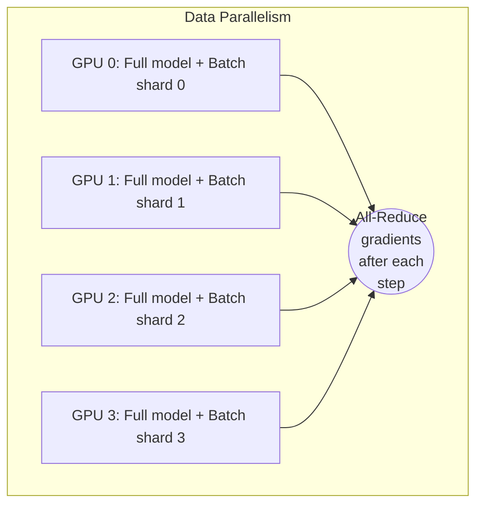
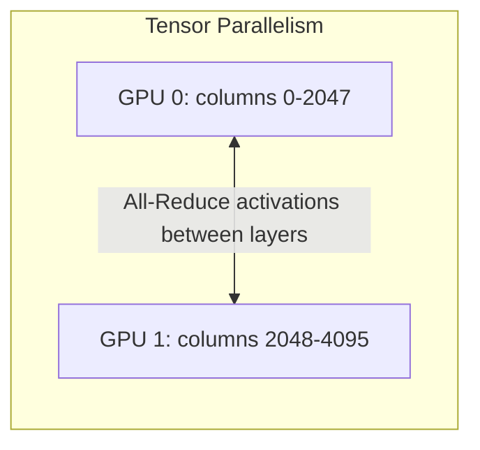
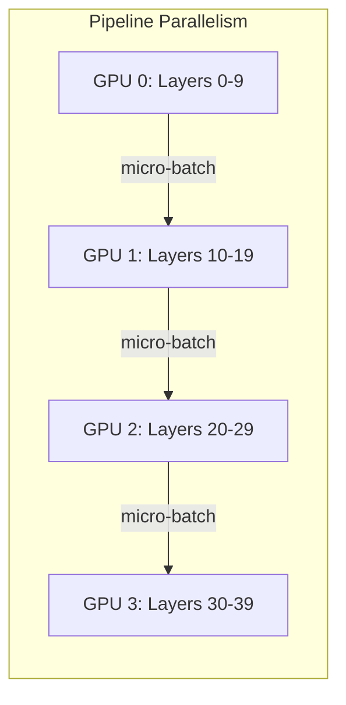
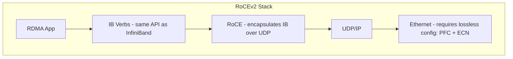
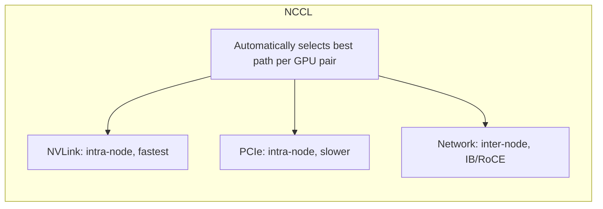
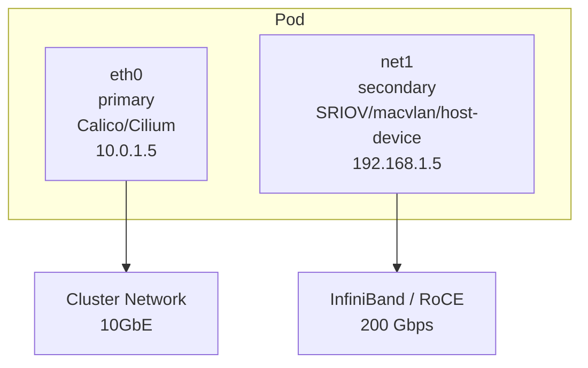
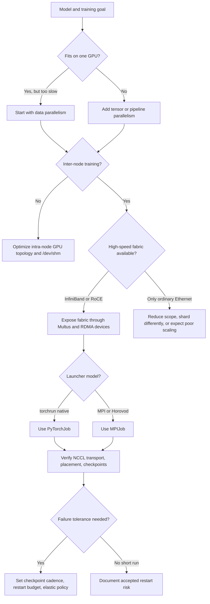

> **Complexity**: `[COMPLEX]`
>
> **Time to Complete**: 5 hours
>
> **Prerequisites**: [Module 1.2: Advanced GPU Scheduling & Sharing](../module-1.2-gpu-scheduling/), Kubernetes Services and CNI fundamentals, basic neural network training concepts, and familiarity with PyTorch or TensorFlow distributed APIs. A cluster with at least 2 GPU nodes is recommended for the hands-on exercise.

---

## What You'll Be Able to Do

After completing this module, you will be able to:

- **Design** a distributed training topology that matches model size, GPU count, network fabric, and Kubernetes placement constraints.
- **Configure** NCCL, RDMA, GPUDirect RDMA, and Multus so training pods use the intended high-speed data path instead of silently falling back to TCP.
- **Implement** multi-node PyTorch and MPI-style training jobs with Kubeflow Training Operator primitives, shared memory, checkpoint storage, and Kubernetes 1.35 scheduling controls.
- **Diagnose** NCCL timeouts, low GPU utilization, OOM restarts, missing secondary interfaces, and straggler nodes by reading logs, pod state, and topology signals.
- **Evaluate** failure recovery choices, including checkpoint cadence, restart budgets, elastic training, and placement policies for long-running training jobs.

## Why This Module Matters

Hypothetical scenario: your platform team has just reserved a short training window on a costly GPU cluster, and the ML team expects a multi-node fine-tuning run to finish overnight. The job starts cleanly, all pods reach `Running`, and every GPU appears allocated, but utilization stays near idle because the workers are spending most of each step waiting for gradient synchronization. Nothing looks broken from a normal Kubernetes dashboard, yet the cluster is burning time because distributed training is a tightly coupled system where scheduling, network interfaces, collective communication, shared memory, and checkpoint storage all have to line up at once.

Distributed training infrastructure is different from ordinary batch infrastructure because the slowest rank controls the whole job. A web service can survive one pod responding a little slowly, but an all-reduce cannot move to the next optimizer step until every participant has contributed its gradients. When a single pod lands on the wrong rack, chooses `eth0` instead of the high-speed fabric, loses access to `/dev/shm`, or restarts without a usable checkpoint, the failure is multiplied by every GPU in the job. The operational stakes are therefore not just correctness; they are throughput, cost, deadline risk, and developer trust.

This module teaches the infrastructure side of that problem. You will connect the parallelism choices used by frameworks such as PyTorch DDP, Horovod, and DeepSpeed to concrete Kubernetes objects: secondary networks, RDMA drivers, NCCL environment variables, Training Operator CRDs, topology spread constraints, and checkpoint volumes. The goal is not to memorize every flag, because real clusters vary, but to learn the reasoning loop: predict the expected data path, configure Kubernetes to expose it, verify that NCCL actually used it, and design recovery so a long run can survive real node failures.

## Distributed Training Fundamentals

The first decision in a distributed training design is whether the model fits on one accelerator and whether one accelerator can finish the job in useful time. If the model fits but training is too slow, data parallelism is often the simplest starting point: each GPU keeps a full copy of the model, processes a different shard of the batch, and synchronizes gradients after each step. If the model does not fit, the platform has to support tensor or pipeline parallelism as well, which increases communication complexity because activations and layer partitions now move between GPUs during the forward and backward passes.

> **Pause and predict**: If a single GPU would take decades to train a model, which limit matters first when you add more GPUs: arithmetic throughput, gradient synchronization bandwidth, or checkpoint write speed?

A single high-end GPU can perform enormous BF16 compute, but the training budget for a large model is larger still. Using the earlier sizing estimate from this module, a single A100-class GPU processing roughly 300 TFLOPS would need about 67 years for 6.4 x 10^23 floating point operations. With 2,048 GPUs at only half of ideal scaling efficiency, the same rough workload becomes a multi-week run, which is why the design question shifts from "can one GPU train this" to "can thousands of GPUs behave like one reliable training machine."

```
6.4 × 10^23 FLOPS / (300 × 10^12 FLOPS/s)
= 2.1 × 10^9 seconds
= ~67 years on a single GPU
```

```
67 years / (2,048 × 0.50)
= 24 days
```

The math is useful because it sets expectations before any Kubernetes YAML appears. Perfect scaling is not realistic: each additional worker adds coordination cost, and the all-reduce phase eventually dominates the step time if the network cannot keep up. A platform engineer therefore has to reason about both compute and communication, much like planning a kitchen where adding more chefs helps only until everyone blocks the same narrow doorway.

That expectation-setting step also prevents a common budgeting mistake. GPU count is easy to quote because it appears directly in cloud reservations and capacity dashboards, but useful training throughput is the product of GPU count, per-GPU compute efficiency, communication efficiency, input pipeline health, and recovery overhead. A cluster that is 90 percent efficient for one-node jobs can fall below 30 percent efficiency when the workload crosses racks or uses the wrong interface. The platform review should therefore ask for a scaling curve, not only a requested GPU total.

```mermaid
graph TD
    subgraph Distributed_Training [Distributed Training]
        DP[<b>Data Parallel</b><br>Same model on every GPU.<br>Different data.<br>Sync gradients after each step.<br>Scales to many GPUs easily.]
        MP[<b>Model Parallel (Tensor)</b><br>Split layers across GPUs.<br>Each GPU has part of each layer.<br>Forward/backward require all-to-all comms.]
        PP[<b>Pipeline Parallel</b><br>Split layers into stages.<br>Micro-batches flow through stages.<br>Reduces memory per stage.]
    end
```

Data parallelism remains the operational baseline because its Kubernetes shape is understandable: schedule identical workers, give each worker the same image and checkpoint storage, set rank and world-size metadata, and ensure every rank can reach every other rank. The hard part is that the synchronization is collective, not point-to-point in the application sense. A slow or disconnected rank does not just hurt its own progress; it blocks the entire group until the collective operation completes or times out.



Tensor parallelism is used when a layer is too large or too expensive for one GPU to process alone. Instead of each worker holding a full independent copy of the layer, the layer is partitioned across GPUs, and intermediate results must be exchanged during the computation. This makes topology more important because a tensor-parallel group usually wants the fastest local links available, such as NVLink within a node, before crossing an inter-node fabric.



Pipeline parallelism splits the model by layers and sends micro-batches through the stages. It reduces per-GPU memory pressure, but it introduces scheduling bubbles and dependencies between adjacent stages. The platform impact is that failures, stragglers, and uneven placement now affect not only gradient synchronization but also the flow of micro-batches through the pipeline.



Large production runs often combine the three approaches into 3D parallelism: data parallel groups across many nodes, tensor parallel groups inside fast local GPU islands, and pipeline stages across groups of layers. Kubernetes does not understand this structure automatically, so the platform must expose enough topology information and scheduling control for the training launcher to create the intended rank layout. When the rank layout and physical layout disagree, the framework can still run, but the job pays for every accidental cross-rack hop and every slow collective path.

Think of rank layout as the seating chart for the training job. Tensor-parallel ranks should sit close together because they talk frequently during layer computation, pipeline neighbors should have predictable links because micro-batches flow between them, and data-parallel groups need enough bandwidth for gradient synchronization. If the launcher assigns these roles without seeing the physical topology, it may put the most chatty ranks on the most distant links. Kubernetes labels, node pools, and placement policies are how the platform translates physical topology into something the launcher can safely consume.

> **Stop and think**: How much bandwidth is required to synchronize 140 GB of gradients across a cluster every second, and what happens if the fabric provides only a small fraction of that?

For data parallel training, every rank computes gradients and then participates in an all-reduce so the model copies stay consistent. For a 70 billion parameter model using BF16 gradients, a single gradient tensor can be about 140 GB before accounting for optimizer state or sharding. Ring all-reduce moves roughly twice that volume across the group, so a target of one training step per second implies hundreds of gigabytes per second of bidirectional fabric capacity at the cluster level.

```
Gradient size per step: 70 × 10^9 × 2 bytes = 140 GB
All-Reduce data volume: 2 × 140 GB × (N-1)/N ≈ 280 GB (ring all-reduce)
Training steps per second target: 1 step/s
Required network bandwidth: 280 GB/s bidirectional across the cluster
```

This is the reason distributed training is a networking problem disguised as a compute problem. Standard pod networking is excellent for service traffic, DNS, metrics, API calls, and many batch jobs, but a 10 to 25 Gbps path is not remotely comparable to the needs of large all-reduce operations. The platform must provide a separate data path with the right hardware, kernel modules, device plugins, pod annotations, and framework environment variables, then verify that the training job actually uses that path.

The same calculation also explains why small smoke tests can be misleading. A two-rank MNIST job may complete over ordinary sockets because its gradients are tiny, while a larger language-model job can become unusable on the same path. That does not make the smoke test worthless; it proves the operator, image, rendezvous, and basic training script can work. It simply cannot prove that the production path is fast enough unless the test also exercises realistic message sizes, rank counts, and the intended high-speed fabric.

## High-Speed Networking, RDMA, and NCCL

InfiniBand and RoCE exist because ordinary TCP/IP networking spends too much time copying data, interrupting CPUs, and traversing kernel paths for tightly coupled compute. InfiniBand is a specialized fabric with native RDMA semantics, while RoCE carries RDMA over Ethernet and depends on a carefully configured lossless Ethernet environment. The practical distinction for a Kubernetes platform team is that InfiniBand often gives the cleanest high-performance path, while RoCE can fit existing Ethernet operations but requires switch-level PFC and ECN discipline.

| Property | InfiniBand HDR | InfiniBand NDR | Ethernet (25GbE) |
|----------|---------------|----------------|-------------------|
| Bandwidth per port | 200 Gbps | 400 Gbps | 25 Gbps |
| Latency | ~0.6 μs | ~0.5 μs | ~10-25 μs |
| Protocol | Native IB verbs | Native IB verbs | TCP/IP |
| RDMA | Yes (native) | Yes (native) | No (requires RoCE) |
| CPU overhead | Near zero | Near zero | Significant |
| Cost | $$$$ | $$$$$ | $ |

RDMA, or Remote Direct Memory Access, lets one machine read from or write to another machine's memory without sending the payload through the remote CPU and kernel in the normal way. That matters because gradient synchronization is not a rare control-plane event; it is on the critical path of every training step. Removing CPU involvement reduces jitter and frees CPU cores for data loading, preprocessing, logging, and the framework runtime.

```mermaid
graph TD
    subgraph Traditional_TCP [Traditional TCP]
        App1[App] -->|CPU copies data| Kernel1[Kernel]
        Kernel1 -->|Context switches| TCP1[TCP]
        TCP1 -->|Interrupt handling| NIC1[NIC]
        NIC1 -.-> NIC2[Remote NIC]
        NIC2 --> TCP2[TCP]
        TCP2 --> Kernel2[Kernel]
        Kernel2 --> App2[App]
    end
    subgraph RDMA [RDMA]
        RApp[RDMA App] -->|Zero CPU involvement<br>Kernel bypass| RNIC[NIC]
        RNIC -.->|Network: Zero-copy| RRNIC[Remote NIC]
        RRNIC --> RMem[Remote Memory]
    end
```



RoCE keeps the familiar Ethernet physical and operational model but places RDMA semantics above UDP/IP. That flexibility is valuable in environments standardized on Ethernet, yet it also means the fabric must avoid packet loss in ways normal application teams rarely think about. If priority flow control, congestion notification, VLAN design, or switch buffers are wrong, the Kubernetes objects may be perfect while NCCL still stalls, retries, or falls back to a slower transport.



GPUDirect RDMA removes another copy from the path by allowing the network adapter to read and write GPU memory directly. Without it, data moves from GPU memory to system RAM and then to the NIC, with the reverse path on the receiving side. With it, the NIC and GPU exchange data over PCIe without staging in system memory, which is especially important when all-reduce volume is large enough that extra copies become visible in every step.

```mermaid
graph TD
    subgraph Without_GPUDirect [Without GPUDirect: 4 PCIe hops, 2 memory copies, CPU involvement]
        W_GPU[GPU Memory] -->|PCIe| W_RAM1[System RAM]
        W_RAM1 -->|PCIe| W_NIC1[NIC]
        W_NIC1 -.->|Network| W_NIC2[NIC]
        W_NIC2 -->|PCIe| W_RAM2[System RAM]
        W_RAM2 -->|PCIe| W_GPU2[GPU Memory]
    end

    subgraph With_GPUDirect_RDMA [With GPUDirect RDMA: 2 PCIe hops, 0 memory copies, 0 CPU involvement]
        D_GPU[GPU Memory] -->|PCIe| D_NIC1[NIC]
        D_NIC1 -.->|Network| D_NIC2[NIC]
        D_NIC2 -->|PCIe| D_GPU2[GPU Memory]
    end
```



The physical preconditions are strict enough that you should treat GPUDirect RDMA as an integration test, not a single checkbox. The GPU and NIC should be under an appropriate PCIe topology, the peer memory module must be loaded, and the NIC must support the path. In Kubernetes, the NVIDIA GPU Operator can manage the driver side when the host and OFED assumptions match your cluster design.

This is where platform and hardware boundaries meet. A Kubernetes manifest can request a GPU and annotate a secondary network, but it cannot by itself move a NIC to a better PCIe root complex or repair a host driver mismatch. When performance is unexpectedly low, include host-level topology commands, device plugin inventory, and driver module state in the diagnostic path. The most useful platform abstraction is not one that hides these details forever; it is one that makes the healthy hardware path repeatable and makes deviations visible early.

```yaml
apiVersion: nvidia.com/v1
kind: ClusterPolicy
metadata:
  name: cluster-policy
spec:
  driver:
    enabled: true
    rdma:
      enabled: true        # Enable GPUDirect RDMA
      useHostMofed: true   # Use host-installed Mellanox OFED drivers
```

NCCL is the library that most GPU training frameworks use for collective communication. PyTorch DDP, Horovod, and DeepSpeed may expose different launchers and APIs, but when the job needs all-reduce, all-gather, broadcast, or reduce-scatter across NVIDIA GPUs, NCCL is usually in the hot path. That makes NCCL logs one of the most important diagnostic surfaces in the entire training stack.

> **Stop and think**: If NCCL can automatically select communication paths, why do platform teams still set variables such as `NCCL_SOCKET_IFNAME` and `NCCL_IB_HCA`?

NCCL probes GPU, PCIe, NVLink, NIC, and network topology during initialization, then chooses paths for each peer relationship. Auto-selection is useful, but it cannot infer your intent when Kubernetes presents multiple interfaces, when a secondary Multus interface has the high-speed address, or when a container can see a device but lacks the driver path needed for RDMA. Explicit environment variables document the expected path and make misconfiguration easier to catch in logs.



These environment variables dramatically affect distributed training performance, and they should be reviewed as part of any production job template. A good default template separates bootstrapping traffic from the high-speed data path, enables useful initialization logging, and avoids over-tuning algorithms before you have a measured baseline. Treat these settings as an observability contract: they should make the intended fabric visible in the job logs.

```bash
# Network selection
NCCL_IB_DISABLE=0              # 0 = use InfiniBand if available
NCCL_SOCKET_IFNAME=eth0        # Fallback TCP interface (for bootstrapping)
NCCL_IB_HCA=mlx5               # InfiniBand HCA device name

# Performance tuning
NCCL_ALGO=Ring                 # Algorithm: Ring, Tree, CollNetDirect
NCCL_PROTO=Simple              # Protocol: Simple, LL, LL128
NCCL_MIN_NCHANNELS=4           # Minimum parallel channels
NCCL_MAX_NCHANNELS=12          # Maximum parallel channels
NCCL_BUFFSIZE=8388608          # Buffer size per channel (8MB)

# GPUDirect
NCCL_NET_GDR_LEVEL=5           # GPUDirect RDMA level (5 = across PCIe switches)
NCCL_P2P_LEVEL=5               # Peer-to-peer level (intra-node)

# Debugging
NCCL_DEBUG=INFO                # Logging: WARN, INFO, TRACE
NCCL_DEBUG_SUBSYS=INIT,NET     # Subsystem-specific debugging
```

The most useful NCCL signal is not that the process started; it is which transport NCCL reports after topology detection. `NET/IB/0/GDRDMA` indicates an InfiniBand or RoCE-backed path with GPUDirect RDMA, while `NET/Socket` means the job is using a TCP socket path. A socket path may still complete for a small demo, but on a real multi-node training job it can turn expensive GPUs into idle passengers.

Build your runbook around that distinction. First, confirm that every rank logs the same world size and reaches `Init COMPLETE`; mismatched rank counts usually point to rendezvous or launcher issues. Second, inspect the transport string and interface selection; a socket fallback points toward Multus, RDMA device exposure, or NCCL environment variables. Third, compare timestamps across ranks; a single slow rank often reveals CPU starvation, a degraded link, an unhealthy GPU, or a placement problem that the aggregate job status hides.

```
NCCL INFO Trees [0] 1/-1/-1->0->-1 [1] -1/-1/-1->0->1
NCCL INFO Channel 00 :  0  1  2  3  4  5  6  7
NCCL INFO  0 : NET/IB/0/GDRDMA [receive] via NET/IB/0/GDRDMA [send]
NCCL INFO Using 12 channels per connection
NCCL INFO comm 0x7f8b00003c00 rank 0 nranks 16 - Init COMPLETE
```

Hypothetical scenario: a four-node training job runs at about half of the expected throughput even though every pod has a GPU and the code is unchanged from the single-node benchmark. The first investigation step is not to tune the model; it is to inspect NCCL initialization and confirm whether the job used the high-speed fabric. If the logs show `NET/Socket`, you then verify the pod interfaces, the `NCCL_SOCKET_IFNAME` value, the RDMA device exposure, and the switch-side RoCE configuration before changing framework-level parameters.

If the logs show the expected transport, keep moving down the stack instead of declaring victory. Check whether all ranks use comparable channel counts, whether one node reports repeated retries or delayed initialization, and whether GPU utilization drops in a synchronized pattern after each backward pass. Then correlate those observations with node placement and fabric counters. Distributed training diagnosis works best as a narrowing exercise: prove the transport, prove the topology, prove shared memory and data loading, then evaluate framework-level tuning.

## Multi-Network Pods with Multus

Kubernetes gives each pod a primary network interface, commonly `eth0`, that belongs to the cluster CNI. That interface is the right default for API calls, DNS, Services, metrics, and normal application traffic, but it is usually not the right interface for hundreds of gigabytes of gradient traffic. Distributed training pods often need a second interface connected to InfiniBand or RoCE, and Multus provides the Kubernetes mechanism for attaching that secondary network.

> **Pause and predict**: If your pod has both `eth0` and `net1`, what evidence would convince you that NCCL used the intended interface for training traffic?

Multus is a meta-plugin rather than a replacement for the primary CNI. It lets the normal pod network continue doing normal Kubernetes work while adding one or more secondary interfaces requested through annotations and `NetworkAttachmentDefinition` objects. This split is operationally important because it keeps service discovery and control traffic stable while giving training jobs a fabric designed for low latency and high bandwidth.



Installing Multus is straightforward, but production readiness depends on the secondary plugin and device model you choose. A macvlan attachment can be enough for a simple RoCE or Ethernet lab, SR-IOV provides stronger hardware-level isolation and direct virtual functions, and host-device can hand a specific interface to a pod when you want minimal abstraction. The right answer depends on whether you need isolation, IP address management, RDMA device visibility, and compatibility with your fabric operations model.

```bash
# Install Multus CNI (thick plugin — recommended)
kubectl apply -f https://raw.githubusercontent.com/k8snetworkplumbingwg/multus-cni/v4.1.4/deployments/multus-daemonset-thick.yml

# Verify
kubectl get pods -n kube-system -l app=multus
```

The `NetworkAttachmentDefinition` is the contract between a pod annotation and a concrete secondary network. For RoCE over Ethernet in a lab, macvlan is easy to reason about because it creates an additional interface backed by a host NIC and assigns an address from a defined range. In a real cluster, you would coordinate the `master` interface, VLAN, IPAM range, and switch configuration with the network team before letting training teams depend on it.

```yaml
apiVersion: k8s.cni.cncf.io/v1
kind: NetworkAttachmentDefinition
metadata:
  name: roce-network
  namespace: ml-training
spec:
  config: |
    {
      "cniVersion": "0.3.1",
      "type": "macvlan",
      "master": "enp94s0f0",
      "mode": "bridge",
      "ipam": {
        "type": "host-local",
        "subnet": "192.168.10.0/24",
        "rangeStart": "192.168.10.100",
        "rangeEnd": "192.168.10.200",
        "routes": [
          { "dst": "192.168.10.0/24" }
        ]
      }
    }
```

SR-IOV is a stronger choice when hardware isolation and direct device access matter. It requires more platform setup than macvlan, including device plugin configuration and virtual function management, but it better matches environments where performance isolation and RDMA behavior are first-class requirements. For InfiniBand, the details of partition keys, RDMA isolation, and IPAM should be treated as part of the cluster design rather than left to individual training job authors.

```yaml
apiVersion: k8s.cni.cncf.io/v1
kind: NetworkAttachmentDefinition
metadata:
  name: ib-sriov-network
  namespace: ml-training
spec:
  config: |
    {
      "cniVersion": "0.3.1",
      "type": "ib-sriov",
      "pkey": "0x00FF",
      "link_state": "enable",
      "rdmaIsolation": true,
      "ibKubernetesEnabled": true,
      "ipam": {
        "type": "whereabouts",
        "range": "192.168.20.0/24"
      }
    }
```

The host-device style is the most direct of the examples because a specific host device is attached into the pod. It can be useful for controlled environments and diagnostics, but it reduces scheduling flexibility because the pod now depends on a particular local device name. If you use this model, node labels and admission controls should prevent jobs from landing on nodes that cannot satisfy the device assumption.

```yaml
apiVersion: k8s.cni.cncf.io/v1
kind: NetworkAttachmentDefinition
metadata:
  name: ib-host-device
  namespace: ml-training
spec:
  config: |
    {
      "cniVersion": "0.3.1",
      "type": "host-device",
      "device": "mlx5_0",
      "ipam": {
        "type": "host-local",
        "subnet": "192.168.30.0/24"
      }
    }
```

Once the secondary network exists, the training pod must request it and the framework must be told how to use it. The annotation attaches the network, while variables such as `NCCL_SOCKET_IFNAME` steer NCCL toward the intended interface. This is a common place for partial success: the pod can have `net1`, and the job can still run over `eth0` if the framework configuration does not match the pod network.

```yaml
apiVersion: v1
kind: Pod
metadata:
  name: training-worker-0
  namespace: ml-training
  annotations:
    k8s.v1.cni.cncf.io/networks: roce-network
spec:
  containers:
    - name: trainer
      image: nvcr.io/nvidia/pytorch:24.09-py3
      env:
        - name: NCCL_SOCKET_IFNAME
          value: "net1"             # Use the secondary interface for NCCL
        - name: NCCL_IB_DISABLE
          value: "0"
```

Before running a large job, verify the interface from inside the pod and compare the address with the expected IPAM range. This simple check catches wrong namespace, wrong annotation, missing CNI daemonset, and unexpected interface naming before you spend time debugging framework logs. It does not prove RDMA or GPUDirect are working, but it proves Kubernetes gave the pod the network surface the framework is supposed to use.

```bash
# ip addr show
1: lo: <LOOPBACK> ...
2: eth0@if123: <BROADCAST> ...    # Primary (cluster network)
   inet 10.0.1.5/24
3: net1@if456: <BROADCAST> ...    # Secondary (high-speed network)
   inet 192.168.10.105/24
```

Before running this in a shared cluster, decide who owns each layer of the failure domain. The platform team usually owns Multus, device plugins, node labels, and base job templates; the network team owns switch behavior and fabric health; the ML team owns framework code, batch sizing, checkpoint semantics, and model parallelism choices. Distributed training becomes fragile when those ownership boundaries are implicit because every outage looks like "Kubernetes is slow" until someone reconstructs the whole path.

A useful preflight test makes those ownership boundaries concrete. It should launch a small pod with the same annotation as the real job, list interfaces, check RDMA device files, run a fabric-specific bandwidth probe when available, and emit a clear pass or fail result before the expensive reservation begins. That preflight does not replace full training validation, but it catches configuration drift while the fix still belongs to the platform team. Once the large job starts, every missed preflight check becomes more expensive to correct.

You should also decide how secondary networks are requested by tenants. Letting every team write raw `NetworkAttachmentDefinition` JSON gives flexibility but increases the chance of overlapping IP ranges, wrong master interfaces, or inconsistent isolation settings. A safer platform offers a small set of approved attachment names and hides the fabric details behind templates or admission policies. The ML team still chooses the training profile, but the platform owns the low-level network contract.

## Training Operators, Placement, and Failure Recovery

Kubeflow Training Operator turns distributed training from a hand-managed set of pods into declarative job resources. It does not remove the need to understand PyTorch, MPI, NCCL, or networking, but it gives Kubernetes a controller that can create the right launcher, master, and worker pods for each framework style. That controller becomes the place where restart policy, replica counts, clean-up behavior, and framework-specific launch conventions are expressed consistently.

| CRD | Framework | Communication |
|-----|-----------|---------------|
| `PyTorchJob` | PyTorch DDP/FSDP | NCCL + Gloo |
| `MPIJob` | Horovod, DeepSpeed | MPI (OpenMPI/MPICH) |
| `TFJob` | TensorFlow | gRPC |
| `PaddleJob` | PaddlePaddle | NCCL + Gloo |
| `JAXJob` | JAX/XLA | gRPC |

The CRD choice should follow the launcher model, not only the library imported by the training script. A native PyTorch DDP job usually fits `PyTorchJob` because `torchrun` and rendezvous manage the worker group. A Horovod workload, or a DeepSpeed workload built around MPI launch semantics, often fits `MPIJob` because it expects a launcher pod that coordinates worker processes with MPI conventions.

```bash
# Install via Helm
helm repo add kubeflow https://kubeflow.github.io/training-operator
helm repo update

helm install training-operator kubeflow/training-operator \
  --namespace kubeflow \
  --create-namespace \
  --version v1.8.1
```

The PyTorchJob below preserves the core production pattern from the original module: a master and worker replica set, `torchrun`, NCCL logging, a secondary Multus network annotation, a shared checkpoint volume, GPU limits, and a memory-backed `/dev/shm`. Notice that the YAML does more than allocate GPUs. It encodes rendezvous, resource isolation, communication intent, and recovery assumptions in one object.

Review this kind of manifest from the bottom up as well as from the top down. Volumes tell you whether the job can checkpoint and whether shared memory is large enough; resources tell you whether the pod can get scheduled and whether CPU starvation is likely; environment variables tell you whether NCCL will expose useful evidence; annotations tell you whether the pod requests the right network. A manifest that looks long is not necessarily overcomplicated if each field protects a real failure mode.

```yaml
apiVersion: kubeflow.org/v1
kind: PyTorchJob
metadata:
  name: llama-finetune
  namespace: ml-training
spec:
  nprocPerNode: "4"    # 4 GPUs per node
  pytorchReplicaSpecs:
    Master:
      replicas: 1
      restartPolicy: OnFailure
      template:
        metadata:
          annotations:
            k8s.v1.cni.cncf.io/networks: roce-network
        spec:
          tolerations:
            - key: nvidia.com/gpu
              operator: Exists
              effect: NoSchedule
          containers:
            - name: pytorch
              image: my-registry/llama-trainer:v1.2
              command:
                - torchrun
              args:
                - --nnodes=2
                - --nproc_per_node=4
                - --rdzv_backend=c10d
                - --rdzv_endpoint=$(MASTER_ADDR):$(MASTER_PORT)
                - train.py
                - --model_name=meta-llama/Llama-3-8B
                - --batch_size=8
                - --gradient_accumulation_steps=4
                - --fp16
                - --output_dir=/checkpoints/llama-ft
              env:
                - name: NCCL_SOCKET_IFNAME
                  value: "net1"
                - name: NCCL_DEBUG
                  value: "INFO"
                - name: NCCL_IB_DISABLE
                  value: "0"
              resources:
                limits:
                  nvidia.com/gpu: 4
                  cpu: "32"
                  memory: 128Gi
              volumeMounts:
                - name: checkpoints
                  mountPath: /checkpoints
                - name: dshm
                  mountPath: /dev/shm
          volumes:
            - name: checkpoints
              persistentVolumeClaim:
                claimName: training-checkpoints
            - name: dshm
              emptyDir:
                medium: Memory
                sizeLimit: 64Gi     # Large shared memory for NCCL
    Worker:
      replicas: 1
      restartPolicy: OnFailure
      template:
        metadata:
          annotations:
            k8s.v1.cni.cncf.io/networks: roce-network
        spec:
          tolerations:
            - key: nvidia.com/gpu
              operator: Exists
              effect: NoSchedule
          containers:
            - name: pytorch
              image: my-registry/llama-trainer:v1.2
              command:
                - torchrun
              args:
                - --nnodes=2
                - --nproc_per_node=4
                - --rdzv_backend=c10d
                - --rdzv_endpoint=$(MASTER_ADDR):$(MASTER_PORT)
                - train.py
                - --model_name=meta-llama/Llama-3-8B
                - --batch_size=8
                - --gradient_accumulation_steps=4
                - --fp16
                - --output_dir=/checkpoints/llama-ft
              env:
                - name: NCCL_SOCKET_IFNAME
                  value: "net1"
                - name: NCCL_DEBUG
                  value: "INFO"
                - name: NCCL_IB_DISABLE
                  value: "0"
              resources:
                limits:
                  nvidia.com/gpu: 4
                  cpu: "32"
                  memory: 128Gi
              volumeMounts:
                - name: checkpoints
                  mountPath: /checkpoints
                - name: dshm
                  mountPath: /dev/shm
          volumes:
            - name: checkpoints
              persistentVolumeClaim:
                claimName: training-checkpoints
            - name: dshm
              emptyDir:
                medium: Memory
                sizeLimit: 64Gi
```

The MPIJob example keeps the launcher-and-worker model used by Horovod and some DeepSpeed deployments. Here the launcher has modest CPU and memory needs because it coordinates the worker processes, while the workers hold GPUs and large memory allocations. The important infrastructure lesson is that the launcher must pass the same NCCL and network environment into the distributed processes, or the worker pods may have the right devices while the launched ranks inherit the wrong communication defaults.

MPI-style jobs also make log collection more important because useful evidence may be split between launcher output, worker container logs, and framework logs written inside the training process. If your platform exposes only the launcher log in a dashboard, operators may miss the rank that actually failed. Standardize labels and log queries for all pods owned by a training job, and teach teams to compare rank output rather than reading a single happy path. Collective failures are group failures, so observability has to be group-aware.

```yaml
apiVersion: kubeflow.org/v1
kind: MPIJob
metadata:
  name: deepspeed-training
  namespace: ml-training
spec:
  slotsPerWorker: 4    # GPUs per worker
  runPolicy:
    cleanPodPolicy: Running
    backoffLimit: 3
  mpiReplicaSpecs:
    Launcher:
      replicas: 1
      restartPolicy: OnFailure
      template:
        spec:
          containers:
            - name: launcher
              image: my-registry/deepspeed-trainer:v2.0
              command:
                - mpirun
              args:
                - --allow-run-as-root
                - -np
                - "8"
                - -bind-to
                - none
                - -map-by
                - slot
                - -x NCCL_DEBUG=INFO
                - -x NCCL_IB_DISABLE=0
                - -x NCCL_SOCKET_IFNAME=net1
                - -x LD_LIBRARY_PATH
                - python
                - train_deepspeed.py
                - --deepspeed_config=ds_config.json
              resources:
                limits:
                  cpu: "2"
                  memory: 4Gi
    Worker:
      replicas: 2
      restartPolicy: OnFailure
      template:
        metadata:
          annotations:
            k8s.v1.cni.cncf.io/networks: roce-network
        spec:
          containers:
            - name: worker
              image: my-registry/deepspeed-trainer:v2.0
              resources:
                limits:
                  nvidia.com/gpu: 4
                  cpu: "32"
                  memory: 128Gi
              volumeMounts:
                - name: dshm
                  mountPath: /dev/shm
          volumes:
            - name: dshm
              emptyDir:
                medium: Memory
                sizeLimit: 64Gi
```

Placement is the next infrastructure layer because a valid distributed job can still be inefficient if the scheduler spreads ranks across distant failure domains or congested links. Kubernetes topology spread constraints are not a complete topology-aware training scheduler, but they give you a standard way to control skew across zones, racks, or hostnames when the nodes are labeled accurately. For Kubernetes 1.35 clusters, combine these constraints with node labels that reflect the actual GPU and network topology your training framework assumes.

```yaml
spec:
  topologySpreadConstraints:
    - maxSkew: 1
      topologyKey: topology.kubernetes.io/zone
      whenUnsatisfiable: DoNotSchedule
      labelSelector:
        matchLabels:
          training.kubeflow.org/job-name: llama-finetune
    - maxSkew: 1
      topologyKey: kubernetes.io/hostname
      whenUnsatisfiable: DoNotSchedule
      labelSelector:
        matchLabels:
          training.kubeflow.org/job-name: llama-finetune
```

Cloud placement features serve a similar purpose outside Kubernetes by asking the infrastructure provider to keep instances physically close. They do not replace Kubernetes scheduling, because Kubernetes still needs to place pods on the nodes you received, but they reduce the chance that your node pool spans a topology the all-reduce cannot tolerate. The safe pattern is to align provider placement groups, node labels, and Training Operator templates so every layer expresses the same proximity assumption.

Placement policy should be reviewed whenever a job changes scale. A two-node run may tolerate placement across a broad node pool, while a larger run may require compact placement, reserved capacity, or a dedicated GPU island. The scheduler can only choose among available nodes, so capacity planning and scheduling policy are connected decisions. If you promise a training team a low-latency topology but admit unrelated workloads into the same node pool, the eventual contention is a platform design failure, not just a noisy neighbor problem.

```bash
# GCP: Compact placement policy
gcloud compute resource-policies create group-placement ml-training-compact \
  --collocation=COLLOCATED --vm-count=16

# AWS: Cluster placement group
aws ec2 create-placement-group \
  --group-name ml-training-cluster \
  --strategy cluster
```

Failure recovery is not optional for multi-day training because the probability of some component failing rises with every GPU-hour. A one-node notebook can treat a crash as an inconvenience; a distributed run with many nodes must assume recoverable GPU errors, device resets, NIC problems, OOM kills, kernel failures, and storage issues will happen during the schedule. The design question is whether the job loses minutes, hours, or days when that happens.

> **Pause and predict**: If one node fails in a 128-node training group, can the remaining workers keep training immediately, or do they need a new rendezvous and checkpoint decision?

| Failure | Frequency (per 1000 GPU-hours) | Impact |
|---------|-------------------------------|--------|
| GPU Xid errors (recoverable) | 2-5 | Training step fails, retry |
| GPU fallen off bus (Xid 79) | 0.5-1 | Node reboot required |
| NIC failures | 0.2-0.5 | NCCL timeout, job stalls |
| OOM kills | 1-3 | Worker restarts |
| Node kernel panic | 0.1-0.3 | Node replacement |
| Disk failures | 0.05-0.1 | Checkpoint loss if local |

Checkpointing is the bridge between failure detection and useful recovery. The checkpoint must include enough model, optimizer, epoch, step, and random-number state to resume consistently, and it must land on storage that survives the failed node. Rank zero often writes the checkpoint, but the platform must still provide shared storage semantics, adequate bandwidth, retention policy, and enough observability for teams to know when the last successful checkpoint happened.

The checkpoint interval is an engineering tradeoff rather than a moral rule. Frequent checkpoints reduce lost work after a failure, but they can steal bandwidth from data loading and pause the training loop if writes are synchronous. Infrequent checkpoints improve steady-state throughput but increase replay time after a crash. A mature platform helps teams measure checkpoint duration, retained versions, storage saturation, and time since last successful checkpoint so they can choose the interval from evidence.

```python
# In your training script (PyTorch example)
import torch
import torch.distributed as dist

def save_checkpoint(model, optimizer, epoch, step, path):
    if dist.get_rank() == 0:  # Only rank 0 saves
        checkpoint = {
            'model_state_dict': model.state_dict(),
            'optimizer_state_dict': optimizer.state_dict(),
            'epoch': epoch,
            'step': step,
            'rng_state': torch.cuda.get_rng_state(),
        }
        torch.save(checkpoint, f"{path}/checkpoint_epoch{epoch}_step{step}.pt")
        # Keep only last 3 checkpoints
        cleanup_old_checkpoints(path, keep=3)

# Checkpoint every N steps
for step, batch in enumerate(dataloader):
    loss = train_step(model, batch)
    if step % 500 == 0:
        save_checkpoint(model, optimizer, epoch, step, "/checkpoints")
```

Elastic training changes the recovery model by allowing a job to reform with a different number of workers inside configured bounds. This is powerful, but it is not magic: the training script must tolerate changing world size, the data sampler must avoid duplicate or skipped work, and checkpointing must remain consistent. Use elasticity when reduced throughput is better than losing the reservation, and test the exact failure paths before presenting it as a production guarantee.

```yaml
apiVersion: kubeflow.org/v1
kind: PyTorchJob
metadata:
  name: elastic-training
spec:
  elasticPolicy:
    minReplicas: 2        # Minimum workers to continue training
    maxReplicas: 8        # Maximum workers if available
    maxRestarts: 10       # Total restart budget
    rdzvBackend: c10d
  pytorchReplicaSpecs:
    Worker:
      replicas: 4         # Desired replicas (elastic: can scale 2-8)
      restartPolicy: OnFailure
      template:
        spec:
          containers:
            - name: trainer
              image: my-registry/elastic-trainer:v1
              command: ["torchrun"]
              args:
                - --nnodes=2:8
                - --nproc_per_node=4
                - --rdzv_backend=c10d
                - --rdzv_endpoint=elastic-training-master-0:29400
                - --max_restarts=10
                - train_elastic.py
              resources:
                limits:
                  nvidia.com/gpu: 4
```

When a node fails under an elastic policy, surviving workers detect the broken rendezvous, form a new worker group within the allowed replica range, reload from the most recent usable checkpoint, and continue with fewer GPUs until capacity returns. That recovery path is only as good as the checkpoint cadence and the storage layer behind it. A checkpoint every 500 steps may be reasonable for one workload and wasteful for another, so choose the interval by balancing write cost against the amount of retraining you can afford after a failure.

Elastic training also changes how you report progress to users. If the job continues with fewer GPUs, wall-clock estimates, learning-rate schedules, and input sampling assumptions may change. The platform should surface that the job is degraded rather than simply healthy, because a run that survives at half throughput may still miss its delivery window. Treat elasticity as graceful degradation with explicit signals, not as a way to hide infrastructure failures from the training team.

## Patterns & Anti-Patterns

The strongest distributed training platforms make the intended data path explicit and testable. They do not ask every ML team to rediscover the same CNI annotations, NCCL variables, shared memory mounts, and checkpoint volumes from scratch. Instead, they ship versioned job templates, validation checks, and diagnostic runbooks that make the healthy path boring and the unhealthy path obvious.

Those templates should be opinionated without becoming mysterious. Include comments or documentation explaining why `/dev/shm` is mounted, why `NCCL_DEBUG=INFO` is enabled, why the secondary interface is named in the environment, and why checkpoint storage is mandatory for long jobs. Otherwise teams will remove fields that look incidental during cleanup, and the platform will rediscover the same failure later. Good defaults are valuable because they carry hard-won operational knowledge into the next job.

| Pattern | When to Use It | Why It Works | Scaling Considerations |
|---------|----------------|--------------|------------------------|
| Versioned training job templates | Multiple teams run PyTorch, MPI, or DeepSpeed jobs on the same clusters | Templates encode `/dev/shm`, NCCL logging, GPU limits, checkpoint mounts, and network annotations consistently | Keep separate templates for native PyTorch and MPI launchers so environment propagation stays correct |
| Secondary fabric with explicit verification | Jobs need inter-node GPU communication beyond ordinary pod networking | Multus exposes the fabric and NCCL logs prove whether the job used it | Add conformance tests that check pod interfaces, RDMA device visibility, and NCCL transport before large reservations |
| Topology-aware scheduling contracts | Racks, zones, placement groups, or GPU islands affect performance | Labels and spread constraints align Kubernetes placement with physical network assumptions | Keep labels maintained by automation, not manual notes, or scheduler decisions will drift from reality |
| Checkpoint-first recovery design | Training runs last long enough that node failures are expected | Shared checkpoints turn crashes into bounded replay instead of full restarts | Measure checkpoint write time and storage impact before lowering checkpoint intervals aggressively |

Anti-patterns often begin as reasonable shortcuts during a demo. A small two-pod job can appear to work over TCP, with a tiny `/dev/shm`, without topology labels, and without checkpointing, because the scale is too small to reveal the cost. The danger is promoting that demo into a shared template where every future team inherits the hidden bottleneck.

The antidote is to separate demonstration templates from production templates. A demo should state which guarantees it does not provide, such as RDMA validation, realistic gradient sizes, failure recovery, or provider placement. A production template should require those guarantees or fail early when the cluster cannot provide them. This distinction helps learners experiment safely while preventing a convenient lab artifact from becoming the default for expensive workloads.

| Anti-Pattern | Why Teams Fall Into It | Better Alternative |
|--------------|------------------------|--------------------|
| Treating pod `Running` as proof of training health | Kubernetes reports scheduling success, not collective communication quality | Gate production runs on NCCL transport logs, rank count, GPU utilization, and checkpoint creation |
| Using the same network for control traffic and gradient traffic | It simplifies YAML and avoids network-team coordination | Attach a secondary fabric with Multus and document which interface each framework should use |
| Tuning NCCL algorithms before checking topology | Algorithm flags feel actionable when throughput is low | First verify `NET/IB` or `GDRDMA`, interface names, RDMA drivers, and placement; then benchmark algorithm choices |
| Storing checkpoints on node-local disks | Local storage is fast and easy during early tests | Use shared or replicated storage with retention policy so node failure does not erase recovery state |

## Decision Framework

Use this framework when you are asked to design or review a distributed training platform change. Start with the model and framework because they determine the communication pattern, then move outward to network, scheduling, and recovery. If you start with a Kubernetes object first, it is easy to build something that is syntactically correct but mismatched to the training algorithm.



| Decision | Prefer This | Avoid This | Reasoning |
|----------|-------------|------------|-----------|
| Framework CRD | `PyTorchJob` for native `torchrun`; `MPIJob` for MPI launchers | Choosing by import statements alone | The launcher controls rank creation and environment propagation |
| Network exposure | Multus plus RDMA-aware device setup | Hoping the primary CNI is fast enough | Ordinary pod networking is rarely sized for all-reduce traffic |
| NCCL configuration | Minimal explicit variables plus `NCCL_DEBUG=INFO` | Large copied flag sets without measurement | You need enough control to verify the path, then benchmark further changes |
| Placement | Provider placement plus Kubernetes topology labels | Random placement across zones or racks | Collective operations amplify distance and straggler effects |
| Recovery | Shared checkpoints and tested restart behavior | Relying only on pod restart policy | Restarting a process is not the same as resuming useful training |

Which approach would you choose here and why: a short two-node fine-tuning job on a lab cluster with no RDMA, or a week-long pretraining run across many GPU nodes with a reserved RoCE fabric? The lab job may justify a simpler PyTorchJob and explicit warning that scaling results are not representative, while the long run needs fabric validation, placement contracts, checkpoint storage, restart budgets, and a preflight NCCL test. The framework is the same family, but the operational design is completely different.

For a design review, ask the team to bring four artifacts: the expected parallelism layout, the Kubernetes job template, the network and placement assumptions, and the recovery plan. If one artifact is missing, the review is not ready because the remaining pieces cannot be evaluated in isolation. A beautiful PyTorchJob without a fabric plan is a scheduling demo; a fabric plan without checkpoint recovery is a risky reservation; a recovery plan without rank and topology understanding may resume into the same bottleneck.

## Did You Know?

1. **Meta reported that Llama 3 training used two clusters of 24,576 GPUs each**, with RoCE-based networking and extensive automation for detecting, diagnosing, and recovering from interruptions. The lesson for platform teams is that reliability engineering is part of training performance, not a separate afterthought.

2. **NCCL supports multiple collective algorithms and protocols**, including ring, tree, and low-latency protocol variants. The best choice depends on message size, topology, GPU count, and fabric behavior, which is why blind flag copying is less reliable than measured baselines.

3. **Container shared memory defaults are often tiny compared with training needs**, and modern multi-GPU jobs may require many GiB of `/dev/shm` for data loading and communication buffers. A job can appear healthy while silently running slower because the fast shared-memory path is unavailable.

4. **Kubernetes topology spread constraints are scheduler hints over labels, not magic rack awareness**. If node labels do not accurately represent zones, racks, GPU islands, or placement groups, the scheduler will faithfully enforce the wrong map.

## Common Mistakes

| Mistake | Why It Happens | How to Fix It |
|---------|----------------|---------------|
| Missing `/dev/shm` mount | The container starts successfully, so teams forget that NCCL and DataLoader workers need large shared-memory buffers | Mount `emptyDir` with `medium: Memory` and a measured `sizeLimit` such as 8Gi for labs or larger values for production |
| Wrong `NCCL_SOCKET_IFNAME` | Multus attaches `net1`, but copied framework settings still point at the primary CNI interface | Set the interface to the actual secondary name and verify NCCL logs plus `ip addr show` inside the pod |
| No checkpointing | Early tests finish quickly, so the template ships without a recovery contract | Save model, optimizer, step, epoch, and RNG state to shared storage at an interval based on acceptable replay cost |
| TCP fallback without noticing | The job still runs, especially at small scale, so poor throughput is misread as framework overhead | Enable `NCCL_DEBUG=INFO` and check for `NET/IB`, `GDRDMA`, rank count, and channel initialization before scaling |
| Pods placed across distant topology domains | Kubernetes sees all GPU nodes as equivalent because labels are missing or too generic | Add accurate topology labels, provider placement groups, and `topologySpreadConstraints` that match the training plan |
| Insufficient restart budget | Teams copy defaults from short jobs where a single failure should fail fast | Set `backoffLimit`, elastic policy, and checkpoint cadence according to expected GPU-hours and failure probability |
| MPI environment not propagated | The launcher pod has variables, but worker ranks started by MPI do not inherit the same NCCL settings | Pass required variables through `mpirun` with explicit `-x` entries and verify worker logs, not only launcher logs |
| RDMA devices visible but unusable | Device plugins expose nodes, but drivers, permissions, or peer-memory modules are incomplete | Test RDMA and GPUDirect readiness as a preflight and align GPU Operator, OFED, and security context settings |

## Quiz

<details>
<summary>Question 1: Your team trains a 70B parameter model on ordinary 10 Gbps Ethernet, and GPU utilization stays near idle even though every pod is running. What do you diagnose first, and why?</summary>

Start with the communication path, not with model code, because data-parallel training must synchronize large gradient tensors before each step can complete. A 70B BF16 model can imply about 140 GB of gradients and roughly 280 GB of ring all-reduce traffic per step, so a 10 Gbps path makes the GPUs wait for the network. Check NCCL logs for `NET/Socket` versus `NET/IB` or `GDRDMA`, then confirm pod interfaces and `NCCL_SOCKET_IFNAME`. The issue is not that Kubernetes scheduled the pods incorrectly in the basic sense; it is that the available fabric cannot support the collective workload.
</details>

<details>
<summary>Question 2: A colleague wants to skip GPUDirect RDMA because standard RDMA already sounds fast. How do you evaluate that decision for a multi-node GPU job?</summary>

Standard RDMA removes much CPU and kernel overhead, but without GPUDirect RDMA the data path still stages GPU data through system memory before reaching the NIC. That adds PCIe hops and memory copies on a path that runs every training step. For small tests the difference may be hidden by other costs, but for large all-reduce traffic it can reduce scaling efficiency and increase jitter. The better answer is to test GPUDirect readiness explicitly, then decide from measured throughput rather than from setup convenience.
</details>

<details>
<summary>Question 3: A PyTorchJob has the Multus annotation and a `net1` interface, yet NCCL logs show `NET/Socket`. What checks should you perform before changing the model script?</summary>

First verify that the pod annotation references the correct `NetworkAttachmentDefinition` in the correct namespace and that `ip addr show net1` reports an address from the expected high-speed network. Next check whether `NCCL_SOCKET_IFNAME` points to `net1`, whether InfiniBand or RoCE devices are exposed into the container, and whether the peer-memory or RDMA driver path is available. Then inspect NCCL initialization logs across all ranks, because one rank with a missing device can force a bad path or a timeout. Changing the model script first is premature because the symptoms point to infrastructure path selection.
</details>

<details>
<summary>Question 4: A legacy Horovod computer-vision workload uses PyTorch tensors but expects `mpirun` to launch workers. Should you use `PyTorchJob` or `MPIJob`, and what configuration risk matters most?</summary>

Use `MPIJob` because the launcher model matters more than the tensor library. Horovod and MPI-based DeepSpeed deployments expect a launcher pod to create and coordinate worker processes through MPI semantics, while `PyTorchJob` is a better fit for native `torchrun` rendezvous. The major configuration risk is failing to propagate NCCL and network environment variables from the launcher into the worker ranks. Passing variables explicitly with MPI options and checking worker logs prevents a job that launches correctly but communicates over the wrong path.
</details>

<details>
<summary>Question 5: A four-node training job times out after several minutes, and one pod is consistently the last rank to report the NCCL error. What investigation workflow do you follow?</summary>

Treat the last-reporting rank as a likely straggler or blocked participant, but verify instead of assuming. Compare NCCL initialization logs across all ranks, inspect that pod's secondary interface, GPU allocation, CPU and memory pressure, and RDMA device visibility, then check node-level events for Xid errors or network link problems. If the job uses RoCE, include fabric loss or PFC issues in the investigation because packet loss can appear as NCCL timeouts. Only after the infrastructure path is verified should you tune timeout values or training batch behavior.
</details>

<details>
<summary>Question 6: Your training job restarts successfully after a node failure, but the loss curve jumps and previous progress appears partly lost. What design gap does this suggest?</summary>

The restart policy may be working while the training recovery contract is incomplete. Check whether checkpoints include model weights, optimizer state, epoch, step, sampler state, and RNG state, and confirm they are written to storage that survived the failed node. Also verify that only the intended rank writes the checkpoint and that all ranks load a consistent version after rendezvous. A pod restart is not sufficient for distributed training unless the application can resume from a coherent checkpoint.
</details>

<details>
<summary>Question 7: A team asks for elastic training so jobs can survive failures by continuing with fewer workers. What conditions do you evaluate before approving the platform template?</summary>

Confirm that the framework version, launcher, and training script support changing worker membership without corrupting data sampling or optimizer behavior. Then review `minReplicas`, `maxReplicas`, restart budgets, rendezvous backend, and checkpoint cadence so the job has a defined recovery window. You should also test an actual worker loss in a staging cluster and inspect whether the resumed run makes forward progress with expected throughput. Elastic policy is valuable, but it is only safe when the application and storage design match the platform setting.
</details>

## Hands-On Exercise

Exercise scenario: you operate a Kubernetes 1.35 training cluster with two GPU nodes and want a repeatable smoke test that proves Multus attaches a secondary network, Kubeflow Training Operator launches a two-rank PyTorch job, NCCL initializes, and the model writes a checkpoint. This lab uses a small MNIST workload because the goal is infrastructure verification, not model quality. In a production RoCE or InfiniBand environment, adapt the network attachment and device exposure to your fabric rather than copying the lab macvlan values blindly.

### Task 1: Install Multus CNI

Install the Multus thick plugin and verify that the daemonset is running on the nodes that will host the training pods. If your organization already manages Multus centrally, do not reinstall it from this command; instead, use the verification command and record the installed version. The important success signal is that pods can request a secondary interface through a `NetworkAttachmentDefinition`.

```bash
# Install Multus thick plugin
kubectl apply -f https://raw.githubusercontent.com/k8snetworkplumbingwg/multus-cni/v4.1.4/deployments/multus-daemonset-thick.yml

# Verify Multus is running on all nodes
kubectl -n kube-system get pods -l app=multus -o wide
```

<details>
<summary>Solution notes for Task 1</summary>

The Multus pods should be present in `kube-system` and scheduled on the nodes that will host training workloads. If they are missing, secondary network annotations will not create `net1` interfaces even though the training pod YAML is otherwise valid. If your cluster uses a managed Multus installation, compare labels before relying on the exact selector shown here.
</details>

### Task 2: Create a Network Attachment Definition

Create a namespace and a lab `NetworkAttachmentDefinition` for the secondary training network. The example uses macvlan on `eth0` because it is portable for a lab, but a real GPU fabric may use a different master interface, SR-IOV, host-device, Whereabouts IPAM, or InfiniBand-specific settings. Before applying this in a shared cluster, ask which NIC and subnet are reserved for training traffic.

```bash
# Identify the secondary NIC on your GPU nodes
# For cloud: this might be the same as the primary interface
# For bare-metal: find the high-speed interface
# kubectl debug node/<gpu-node> -it --image=ubuntu -- ip link show

# Create a macvlan NetworkAttachmentDefinition
cat <<'EOF' | kubectl apply -f -
apiVersion: k8s.cni.cncf.io/v1
kind: NetworkAttachmentDefinition
metadata:
  name: training-network
  namespace: ml-training
spec:
  config: |
    {
      "cniVersion": "0.3.1",
      "type": "macvlan",
      "master": "eth0",
      "mode": "bridge",
      "ipam": {
        "type": "host-local",
        "subnet": "192.168.100.0/24",
        "rangeStart": "192.168.100.10",
        "rangeEnd": "192.168.100.50"
      }
    }
EOF

# Create the namespace
kubectl create namespace ml-training
# Re-apply in the correct namespace
kubectl apply -n ml-training -f - <<'EOF'
apiVersion: k8s.cni.cncf.io/v1
kind: NetworkAttachmentDefinition
metadata:
  name: training-network
spec:
  config: |
    {
      "cniVersion": "0.3.1",
      "type": "macvlan",
      "master": "eth0",
      "mode": "bridge",
      "ipam": {
        "type": "host-local",
        "subnet": "192.168.100.0/24",
        "rangeStart": "192.168.100.10",
        "rangeEnd": "192.168.100.50"
      }
    }
EOF
```

<details>
<summary>Solution notes for Task 2</summary>

The first apply may fail if the namespace does not exist yet; the second apply creates the object in the intended namespace after `ml-training` exists. In your own template, create the namespace first to avoid that rough edge. The key verification is that `kubectl -n ml-training get network-attachment-definitions` shows `training-network`.
</details>

### Task 3: Install the Training Operator and Checkpoint Storage

Install Kubeflow Training Operator and create a shared checkpoint PVC. The storage example intentionally leaves `storageClassName` empty because RWX storage classes vary by cluster; replace it with your supported ReadWriteMany class when running this for real. If you only have ReadWriteOnce storage, the distributed job may start but checkpoint behavior will not represent a multi-node production run.

```bash
helm repo add kubeflow https://kubeflow.github.io/training-operator
helm repo update

helm install training-operator kubeflow/training-operator \
  --namespace kubeflow \
  --create-namespace \
  --version v1.8.1

# Verify
kubectl -n kubeflow get pods
```

```bash
cat <<'EOF' | kubectl apply -f -
apiVersion: v1
kind: PersistentVolumeClaim
metadata:
  name: training-checkpoints
  namespace: ml-training
spec:
  accessModes:
    - ReadWriteMany        # Must be RWX for multi-node access
  storageClassName: ""     # Use default; change to your RWX storage class
  resources:
    requests:
      storage: 50Gi
EOF
```

<details>
<summary>Solution notes for Task 3</summary>

The operator controller pods should be healthy before you create a `PyTorchJob`, or the custom resource may be accepted without any training pods appearing. The PVC should bind to a storage backend that both nodes can mount. If it remains pending, fix storage before debugging PyTorch because the job will not have a reliable checkpoint destination.
</details>

### Task 4: Deploy a Distributed PyTorch Training Job

Create a ConfigMap containing the training script and then launch a two-rank PyTorchJob. This preserves the original module's important teaching detail: `torchrun` expects a script file path, so the script is mounted from a ConfigMap instead of passed as an inline `-c` string. The job requests one GPU per pod, mounts `/dev/shm`, writes a checkpoint from rank zero, and asks Multus for the training network.

```bash
# First, create a ConfigMap with the training script
# (torchrun does not support -c for inline scripts — it requires a file path)
cat <<'SCRIPTEOF' | kubectl apply -f -
apiVersion: v1
kind: ConfigMap
metadata:
  name: mnist-train-script
  namespace: ml-training
data:
  train.py: |
    import torch
    import torch.nn as nn
    import torch.distributed as dist
    import torch.optim as optim
    from torch.nn.parallel import DistributedDataParallel as DDP
    from torchvision import datasets, transforms
    from torch.utils.data.distributed import DistributedSampler

    dist.init_process_group(backend='nccl')
    rank = dist.get_rank()
    world_size = dist.get_world_size()
    device = torch.device('cuda')
    print(f"Rank {rank}/{world_size} on {device}")

    transform = transforms.Compose([
        transforms.ToTensor(),
        transforms.Normalize((0.1307,), (0.3081,))
    ])
    dataset = datasets.MNIST('/tmp/data', train=True, download=True, transform=transform)
    sampler = DistributedSampler(dataset, num_replicas=world_size, rank=rank)
    loader = torch.utils.data.DataLoader(dataset, batch_size=64, sampler=sampler)

    model = nn.Sequential(
        nn.Flatten(),
        nn.Linear(784, 256), nn.ReLU(),
        nn.Linear(256, 10)
    ).to(device)
    model = DDP(model)
    optimizer = optim.Adam(model.parameters(), lr=0.001)
    criterion = nn.CrossEntropyLoss()

    for epoch in range(3):
        sampler.set_epoch(epoch)
        total_loss = 0
        for batch_idx, (data, target) in enumerate(loader):
            data, target = data.to(device), target.to(device)
            optimizer.zero_grad()
            output = model(data)
            loss = criterion(output, target)
            loss.backward()
            optimizer.step()
            total_loss += loss.item()
            if batch_idx % 100 == 0:
                print(f"Rank {rank} Epoch {epoch} Batch {batch_idx} Loss {loss.item():.4f}")
        print(f"Rank {rank} Epoch {epoch} Avg Loss: {total_loss/len(loader):.4f}")

    if rank == 0:
        torch.save(model.state_dict(), '/checkpoints/mnist_ddp.pt')
        print("Model saved!")
    dist.destroy_process_group()
SCRIPTEOF

# Now create the PyTorchJob referencing the script file
cat <<'JOBEOF' | kubectl apply -f -
apiVersion: kubeflow.org/v1
kind: PyTorchJob
metadata:
  name: distributed-mnist
  namespace: ml-training
spec:
  nprocPerNode: "1"
  pytorchReplicaSpecs:
    Master:
      replicas: 1
      restartPolicy: OnFailure
      template:
        metadata:
          annotations:
            k8s.v1.cni.cncf.io/networks: training-network
        spec:
          containers:
            - name: pytorch
              image: nvcr.io/nvidia/pytorch:24.09-py3
              command: ["torchrun"]
              args:
                - --nnodes=2
                - --nproc_per_node=1
                - --rdzv_backend=c10d
                - --rdzv_endpoint=$(MASTER_ADDR):$(MASTER_PORT)
                - /scripts/train.py
              env:
                - name: NCCL_DEBUG
                  value: "INFO"
              resources:
                limits:
                  nvidia.com/gpu: 1
                  cpu: "4"
                  memory: 16Gi
              volumeMounts:
                - name: scripts
                  mountPath: /scripts
                - name: checkpoints
                  mountPath: /checkpoints
                - name: dshm
                  mountPath: /dev/shm
          volumes:
            - name: scripts
              configMap:
                name: mnist-train-script
            - name: checkpoints
              persistentVolumeClaim:
                claimName: training-checkpoints
            - name: dshm
              emptyDir:
                medium: Memory
                sizeLimit: 8Gi
    Worker:
      replicas: 1
      restartPolicy: OnFailure
      template:
        metadata:
          annotations:
            k8s.v1.cni.cncf.io/networks: training-network
        spec:
          containers:
            - name: pytorch
              image: nvcr.io/nvidia/pytorch:24.09-py3
              command: ["torchrun"]
              args:
                - --nnodes=2
                - --nproc_per_node=1
                - --rdzv_backend=c10d
                - --rdzv_endpoint=$(MASTER_ADDR):$(MASTER_PORT)
                - /scripts/train.py
              env:
                - name: NCCL_DEBUG
                  value: "INFO"
              resources:
                limits:
                  nvidia.com/gpu: 1
                  cpu: "4"
                  memory: 16Gi
              volumeMounts:
                - name: scripts
                  mountPath: /scripts
                - name: dshm
                  mountPath: /dev/shm
          volumes:
            - name: scripts
              configMap:
                name: mnist-train-script
            - name: dshm
              emptyDir:
                medium: Memory
                sizeLimit: 8Gi
JOBEOF

# Watch the job
kubectl -n ml-training get pods -w
```

<details>
<summary>Solution notes for Task 4</summary>

You should see a master pod and a worker pod for the `distributed-mnist` job. If pods remain pending, inspect GPU availability, PVC binding, image pull access, and Training Operator events. If pods run but training stalls, move directly to NCCL logs and network-interface verification rather than changing the MNIST model.
</details>

### Task 5: Verify Communication, Progress, and Cleanup

Check NCCL initialization, training progress, secondary interface attachment, and checkpoint output. The exact transport depends on your lab environment; a simple macvlan lab may show socket transport, while an RDMA-capable cluster should show InfiniBand or GPUDirect indicators. The point is to identify the transport from evidence instead of assuming that the annotation created the desired path.

```bash
# Check NCCL initialization in master logs
kubectl -n ml-training logs distributed-mnist-master-0 | grep "NCCL INFO"

# Look for:
# - "Init COMPLETE" — NCCL initialized successfully
# - "NET/IB" or "NET/Socket" — which transport is being used
# - "nranks 2" — both nodes participating

# Check training progress
kubectl -n ml-training logs -f distributed-mnist-master-0

# Verify the secondary network interface exists
kubectl -n ml-training exec distributed-mnist-master-0 -- ip addr show net1
```

```bash
kubectl -n ml-training delete pytorchjob distributed-mnist
kubectl delete namespace ml-training
```

<details>
<summary>Solution notes for Task 5</summary>

Successful output includes NCCL initialization, rank messages from the training script, decreasing or at least changing loss values, and a saved checkpoint message from rank zero. If `net1` is absent, debug Multus and the network attachment before debugging NCCL. If `net1` exists but the transport is not what you expect, inspect framework variables and RDMA device exposure next.
</details>

### Success Criteria

You have completed this exercise when:

- [ ] Multus CNI is running on all nodes that may host training pods.
- [ ] `NetworkAttachmentDefinition` is created in `ml-training`, and pods receive a `net1` interface.
- [ ] The PyTorchJob creates both Master and Worker pods and both participate in the run.
- [ ] NCCL logs show `Init COMPLETE` with `nranks 2`.
- [ ] Both ranks report loss values across 3 epochs.
- [ ] The master saves a model checkpoint to the shared PVC.
- [ ] You can identify which transport NCCL used, such as IB, GPUDirect RDMA, or Socket, from logs rather than assumptions.

## Sources

- [Kubernetes topology spread constraints](https://kubernetes.io/docs/concepts/scheduling-eviction/topology-spread-constraints/)
- [Kubernetes pods networking model](https://kubernetes.io/docs/concepts/workloads/pods/)
- [NVIDIA NCCL user guide](https://docs.nvidia.com/deeplearning/nccl/user-guide/docs/)
- [NVIDIA NCCL environment variables](https://docs.nvidia.com/deeplearning/nccl/user-guide/docs/env.html)
- [NVIDIA GPUDirect RDMA documentation](https://docs.nvidia.com/cuda/gpudirect-rdma/)
- [NVIDIA GPU Operator RDMA documentation](https://docs.nvidia.com/datacenter/cloud-native/gpu-operator/latest/gpu-operator-rdma.html)
- [Multus CNI project](https://github.com/k8snetworkplumbingwg/multus-cni)
- [SR-IOV Network Device Plugin](https://github.com/k8snetworkplumbingwg/sriov-network-device-plugin)
- [Kubeflow Training Operator](https://www.kubeflow.org/docs/components/training/)
- [Kubeflow PyTorchJob guide](https://www.kubeflow.org/docs/components/training/user-guides/pytorch/)
- [PyTorch torchrun elastic launch](https://pytorch.org/docs/stable/elastic/run.html)
- [PyTorch distributed package](https://pytorch.org/docs/stable/distributed.html)
- [AWS EC2 placement groups](https://docs.aws.amazon.com/AWSEC2/latest/UserGuide/placement-groups.html)
- [Google Cloud compact placement policies](https://cloud.google.com/compute/docs/instances/placement-policies-overview)

## Next Module

Continue to [Module 1.4: High-Performance Storage for AI](../module-1.4-ai-storage/) to learn how to remove the data pipeline bottleneck with NVMe caching, distributed filesystems, and dataset caching layers.
