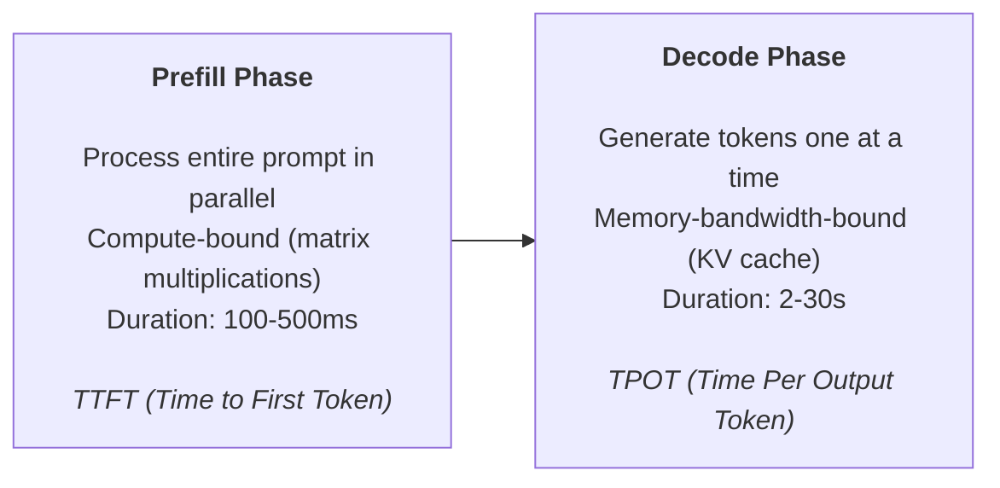
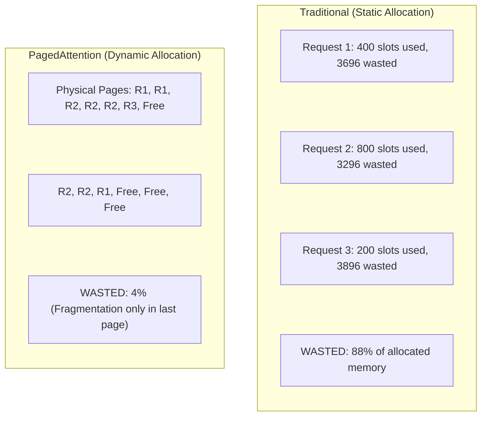
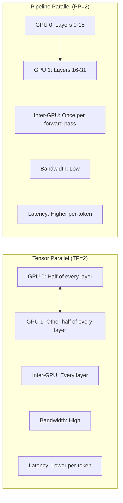

```mermaid
gantt
    title Continuous Batching (No waiting)
    dateFormat  X
    axisFormat %s
    
    section Slot 1
    Req A Processing :a1, 0, 8
    Req D Processing :d1, 8, 20
    Req F Processing :f1, 20, 24
    
    section Slot 2
    Req B Processing :b1, 0, 16
    Req E Processing :e1, 16, 36
    
    section Slot 3
    Req C Processing :c1, 0, 24
    Req G Processing :g1, 24, 32
```

> **Complexity**: `[COMPLEX]`
>
> **Time to Complete**: 4 hours
>
> **Prerequisites**: [Module 1.2: Advanced GPU Scheduling & Sharing](../module-1.2-gpu-scheduling/) (GPU allocation, topology awareness); Kubernetes Services, Deployments, HPA basics; [Module 1.4: High-Performance Storage for AI](../module-1.4-ai-storage/) (model weight loading); basic transformer architecture; and access to a cluster with at least one GPU with 16 GB or more of VRAM.

---

## What You'll Be Able to Do

After completing this module, you will be able to:

- **Implement LLM serving infrastructure using vLLM, TensorRT-LLM, Triton Inference Server, or Text Generation Inference on Kubernetes**
- **Design autoscaling policies for LLM inference that balance latency, throughput, queue depth, and GPU cost**
- **Configure batching, KV cache, model length, and quantization strategies that improve LLM serving efficiency**
- **Diagnose rollout, readiness, and graceful termination failures in long-running GPU inference Pods**
- **Evaluate when to use single-GPU, tensor-parallel, or pipeline-parallel inference for different model sizes**

## Why This Module Matters

Hypothetical scenario: your team has just moved a useful internal assistant from a notebook into a shared Kubernetes service. The demo looked fast with one user, but the first real traffic spike creates a confusing failure pattern: GPUs are full, CPU dashboards look calm, scale-up takes several minutes, and users see either a blank spinner or a response that stops halfway through. Nothing about that incident looks like a normal REST outage, because the bottleneck is not a saturated web thread pool. It is the interaction between model weights, KV cache memory, decode bandwidth, request queues, cold starts, and Kubernetes lifecycle behavior.

Training a model is an investment, but serving it is where the operational bill arrives every hour. A typical CRUD endpoint might complete in a few milliseconds and release its connection quickly. An LLM request can hold a GPU reservation for many seconds while it streams tokens, and the cost of each token depends on how efficiently the serving engine keeps the GPU occupied. If a single A100 is rented for several dollars per hour, then a deployment that handles five requests per second and a deployment that handles dozens of requests per second can have the same hardware cost but radically different unit economics.

This module teaches the production mechanics that make LLM serving practical on Kubernetes 1.35 and newer clusters. You will start by separating inference from training, then examine why engines such as vLLM and Hugging Face Text Generation Inference use PagedAttention and continuous batching. From there, you will connect those engine-level ideas to Kubernetes decisions: how to request GPUs, how to choose model length and tensor parallelism, how to scale on queue depth instead of CPU, and how to drain long-running requests during rollouts. The goal is not to memorize flags. The goal is to reason from workload physics to deployment design.

```
1 A100 at $3/hr serving Llama-3-8B:
  - Without optimization: 5 requests/second -> $0.17 per 1K requests
  - With vLLM + continuous batching: 40 requests/second -> $0.02 per 1K requests

That's an 8x cost difference from software optimization alone.
```

The simple cost sketch above is intentionally rough, but it captures the important lesson: serving efficiency is a first-class platform concern. If you treat an LLM server like a normal stateless HTTP app, you will probably scale late, terminate useful work during rollouts, and waste GPU memory on empty KV cache reservations. If you understand why those failures happen, the fixes become concrete: better serving engines, realistic sequence limits, request-aware batching, cached model weights, careful probes, and autoscaling signals that reflect what users are waiting on.

## Inference and Training Have Different Operating Shapes

Training and inference both use GPUs, but they stress the platform in different ways. Training jobs are usually planned, long-running, and throughput-oriented. A training cluster can run at high utilization for days because the batch size, tensor shapes, checkpoint cadence, and recovery model are known before the job starts. Inference is exposed to user traffic, so the platform sees bursts, uneven prompt lengths, strict latency expectations, and many small scheduling decisions that must happen while people wait.

| Property | Training | Inference |
|----------|----------|-----------|
| GPU utilization | 95%+ (constant compute) | 10-80% (bursty, depends on traffic) |
| Batch size | Large (64-4096) | Small (1-64, depends on concurrency) |
| Memory pattern | Predictable, static | Dynamic (KV cache grows with sequence) |
| Latency requirement | None (throughput matters) | Strict (users wait for responses) |
| Fault tolerance | Checkpoint + restart | Must not drop requests |
| Scaling unit | Fixed cluster for days/weeks | Elastic, minute-to-minute |
| Cost optimization | Maximize GPU utilization | Minimize cost per request |

The table is a useful warning against copying training assumptions into serving manifests. A training job can tolerate a restart if it has a good checkpoint, but a chat request cannot be reconstructed if the serving Pod is killed after producing half of the answer. A training batch can be deliberately large because it is assembled offline, while an inference batch is assembled from requests that arrive at different times and have different output lengths. This is why the platform has to think about queue depth, token latency, and graceful termination rather than only aggregate accelerator utilization.

LLM inference also has two phases with different performance characteristics. In the prefill phase, the server reads the whole prompt and builds the initial KV cache. That work is compute-heavy because the model can process many prompt tokens in parallel. In the decode phase, the model generates one token at a time, repeatedly reading model weights and the growing KV cache. Decode is often memory-bandwidth-bound, so a GPU can look busy while still being unable to reduce the queue quickly enough for users.



Time to first token, usually called TTFT, is the delay before the user sees the first streamed output. Time per output token, or TPOT, is the pace of the rest of the stream. Throughput is the total token production rate across all requests. These metrics can move in different directions: increasing batch size may improve throughput while harming TTFT, and a longer context window may improve product capability while reducing the number of concurrent requests a GPU can serve.

Pause and predict: if a normal web request holds a connection for 30 milliseconds, but an LLM request holds it for 30 seconds, what changes in your load balancer timeout, retry, and drain strategy? The answer should include both user experience and capacity math. Long-lived requests make accidental retries expensive, make abrupt Pod termination visible, and make stale endpoint routing more harmful because each bad routing decision occupies scarce GPU capacity for much longer than a normal HTTP error would.

## Serving Engines: vLLM, TGI, Triton, and TensorRT-LLM

The inference engine is the part of the stack that decides how prompts become GPU work. A basic Python script can load a model and generate text, but it will usually waste memory and leave throughput on the table because it lacks a production scheduler. Production engines add request admission, batching, KV cache management, metrics, OpenAI-compatible APIs, model parallelism, and health endpoints. Kubernetes decides where the Pod runs; the engine decides how well that Pod uses the GPU once requests arrive.

vLLM is widely deployed because it combines a familiar OpenAI-compatible API with a scheduler built around PagedAttention. Hugging Face Text Generation Inference, often shortened to TGI, provides similar production features and fits naturally into the Hugging Face model ecosystem. NVIDIA Triton Inference Server and TensorRT-LLM are important when teams need a broader inference platform or highly optimized NVIDIA-specific execution. You do not have to choose one engine forever, but you do need to choose one deliberately because its metrics, flags, batching model, and failure modes become part of your platform contract.

The KV cache problem explains why purpose-built engines matter. During generation, each new token attends to previous tokens, so the server stores key and value tensors for each layer and each generated position. That cache grows with sequence length and concurrency. If the engine reserves the maximum sequence length for every request up front, short prompts waste enormous amounts of VRAM, and the deployment reaches its concurrency limit even though most reserved cache slots are empty.

```
Llama-3-8B, sequence length 4096:
  KV cache per request = 2 x num_layers x hidden_dim x seq_len x 2 bytes
                       = 2 x 32 x 4096 x 4096 x 2
                       = ~2 GB per request

With 40GB GPU: max ~20 concurrent requests
```

Pause and predict: if every request reserves cache for the maximum possible context window, what happens when most users send short prompts and ask for short answers? The GPU appears full, but much of the fullness is reserved capacity that cannot be used by other requests. That is why a serving configuration copied from a model card's theoretical context length can be much worse than a configuration based on observed product traffic.

PagedAttention, introduced by the vLLM project, treats KV cache more like virtual memory than like one large contiguous allocation per request. The engine breaks cache into blocks and maps logical token positions to physical blocks. A request receives more blocks as it grows, and only the final partially filled block is likely to waste space. This does not make memory free, but it changes the dominant failure mode from huge static reservations to much smaller fragmentation.



The deployment below shows a typical vLLM Pod shape. Notice that the resource request uses `nvidia.com/gpu`, the model cache is mounted separately from the container image, `/dev/shm` is backed by memory for interprocess communication, and readiness is delayed because loading model weights into VRAM is not instant. Those Kubernetes details are not decorations. Without them, the scheduler may place the Pod correctly but the process may fail during startup, route traffic too early, or load the same model repeatedly on every scale event.

```yaml
apiVersion: apps/v1
kind: Deployment
metadata:
  name: vllm-llama3-8b
  namespace: inference
spec:
  replicas: 1
  selector:
    matchLabels:
      app: vllm-llama3-8b
  template:
    metadata:
      labels:
        app: vllm-llama3-8b
    spec:
      containers:
        - name: vllm
          image: vllm/vllm-openai:v0.6.5
          args:
            - --model=meta-llama/Llama-3.1-8B-Instruct
            - --tensor-parallel-size=1
            - --gpu-memory-utilization=0.90
            - --max-model-len=8192
            - --max-num-seqs=64
            - --enable-chunked-prefill
            - --disable-log-stats=false
            - --port=8000
          ports:
            - containerPort: 8000
              name: http
          env:
            - name: HUGGING_FACE_HUB_TOKEN
              valueFrom:
                secretKeyRef:
                  name: hf-token
                  key: token
          resources:
            limits:
              nvidia.com/gpu: 1
              cpu: "8"
              memory: 32Gi
          readinessProbe:
            httpGet:
              path: /health
              port: 8000
            initialDelaySeconds: 120    # Model loading takes time
            periodSeconds: 10
          livenessProbe:
            httpGet:
              path: /health
              port: 8000
            initialDelaySeconds: 180
            periodSeconds: 30
          volumeMounts:
            - name: model-cache
              mountPath: /root/.cache/huggingface
            - name: dshm
              mountPath: /dev/shm
      volumes:
        - name: model-cache
          persistentVolumeClaim:
            claimName: model-cache-pvc     # Pre-downloaded models
        - name: dshm
          emptyDir:
            medium: Memory
            sizeLimit: 8Gi
      terminationGracePeriodSeconds: 120   # Allow in-flight requests to finish
---
apiVersion: v1
kind: Service
metadata:
  name: vllm-llama3-8b
  namespace: inference
spec:
  ports:
    - port: 8000
      targetPort: 8000
      name: http
  selector:
    app: vllm-llama3-8b
```

The most dangerous vLLM flags are the ones that look harmless because they are just numbers. `--gpu-memory-utilization` decides how much VRAM can be used for cache after the model is loaded. `--max-model-len` sets the maximum total sequence length the scheduler allows, and it affects how many requests can fit. `--max-num-seqs` caps concurrency even when memory remains. A platform team should treat these values as capacity controls, test them with realistic prompts, and document why they match the product's actual traffic.

| Parameter | Description | Recommendation |
|-----------|-------------|----------------|
| `--gpu-memory-utilization` | Fraction of VRAM for KV cache (rest is model weights) | 0.85-0.95 (higher = more concurrent requests) |
| `--max-model-len` | Maximum sequence length | Set to your actual max, not the model's theoretical max |
| `--max-num-seqs` | Maximum concurrent requests | Start with 64, tune based on TPOT requirements |
| `--tensor-parallel-size` | Number of GPUs for tensor parallelism | 1 for 8B models; 2 for 70B; 4-8 for 405B |
| `--enable-chunked-prefill` | Process long prompts in chunks, interleaved with decode | Enable for mixed-length traffic |
| `--quantization` | Weight quantization (awq, gptq, fp8) | Use AWQ/GPTQ for 2x memory savings, ~5% quality loss |
| `--enforce-eager` | Disable CUDA graph caching | Use for debugging; disable in production |
| `--swap-space` | CPU RAM for swapping KV cache (GB) | 4-16 for handling burst traffic |

TGI has a similar production purpose but a different operational surface. It exposes its own flags for input limits, total token limits, prefill batching, and concurrency. That means a migration from vLLM to TGI is not only an image change; it is also a metrics and capacity-model change. If your platform abstracts inference behind a common service API, keep engine-specific settings visible in the deployment repository so reviewers can connect a latency regression to the scheduler behavior that changed.

```yaml
apiVersion: apps/v1
kind: Deployment
metadata:
  name: tgi-llama3-8b
  namespace: inference
spec:
  replicas: 1
  selector:
    matchLabels:
      app: tgi-llama3-8b
  template:
    metadata:
      labels:
        app: tgi-llama3-8b
    spec:
      containers:
        - name: tgi
          image: ghcr.io/huggingface/text-generation-inference:2.4
          args:
            - --model-id=meta-llama/Llama-3.1-8B-Instruct
            - --max-input-tokens=4096
            - --max-total-tokens=8192
            - --max-batch-prefill-tokens=16384
            - --max-concurrent-requests=64
            - --max-best-of=1
            - --port=8080
          ports:
            - containerPort: 8080
          env:
            - name: HUGGING_FACE_HUB_TOKEN
              valueFrom:
                secretKeyRef:
                  name: hf-token
                  key: token
          resources:
            limits:
              nvidia.com/gpu: 1
              cpu: "8"
              memory: 32Gi
          volumeMounts:
            - name: dshm
              mountPath: /dev/shm
      volumes:
        - name: dshm
          emptyDir:
            medium: Memory
            sizeLimit: 8Gi
```

The practical comparison is less about which engine is universally better and more about the workload you have to operate. vLLM is a strong default for OpenAI-compatible serving, high-throughput scheduling, prefix caching, and multi-LoRA patterns. TGI is attractive for teams already invested in Hugging Face deployment workflows. Triton and TensorRT-LLM become compelling when an organization wants standardized NVIDIA inference operations, model repositories, or deeper graph optimization. Whichever path you choose, keep the SLO written in user terms: TTFT, TPOT, error rate, and cost per useful token.

| Feature | vLLM | TGI |
|---------|------|-----|
| PagedAttention | Yes (inventor) | Yes (adopted) |
| Continuous batching | Yes | Yes |
| Tensor parallelism | Yes (1-8 GPUs) | Yes (1-8 GPUs) |
| Quantization | AWQ, GPTQ, FP8, GGUF | AWQ, GPTQ, BitsAndBytes |
| OpenAI-compatible API | Yes (native) | Yes (via flag) |
| Speculative decoding | Yes | Yes |
| Prefix caching | Yes | No |
| LoRA serving | Yes (multi-LoRA) | Yes |
| Community | Larger, faster-moving | Hugging Face ecosystem |

## Batching, Memory, and Multi-GPU Serving

Batching is the core reason a production LLM server can serve many users from one GPU. Static batching waits for a group of requests, processes them together, and finishes when the slowest request finishes. That works for uniform offline workloads, but chat traffic is not uniform. One user asks for a short answer, another asks for a long explanation, and a third sends a large prompt that takes longer to prefill. If all of them are locked into one static batch, shorter requests waste slots while the longest request completes.

```mermaid
gantt
    title Static Batching (Waits for longest request)
    dateFormat  X
    axisFormat %s
    
    section Request A (short)
    Processing :a1, 0, 8
    Waiting (Wasted GPU) :crit, w1, 8, 24
    
    section Request B (medium)
    Processing :b1, 0, 16
    Waiting (Wasted GPU) :crit, w2, 16, 24
    
    section Request C (long)
    Processing :c1, 0, 24
```



Continuous batching, sometimes called iteration-level batching, changes the scheduling unit from an entire request to a decode step. After each token step, the engine removes completed requests and inserts waiting requests into the freed capacity. This keeps the GPU doing useful work even when individual requests finish at different times. The tradeoff is scheduler complexity: the engine must manage dynamic KV cache blocks, fairness, admission limits, and prefill work without letting long prompts starve short interactions.



Before running a benchmark, what output do you expect if you mix short prompts with very long prompts on a server that does not use continuous batching? You should expect the short prompts to suffer because they sit behind longer generations inside the same batch. On a continuous batching engine, you should still watch TTFT for the long prompts, but completed short requests should free capacity quickly instead of waiting for the longest generation in their original group.

Model size decides whether one GPU is enough, but the answer depends on more than parameter count. You need room for weights, KV cache, runtime buffers, CUDA graphs, and the safety margin implied by your memory utilization target. Quantization can reduce weight memory, but it does not make long context free because KV cache still grows with active tokens. This is why a model that fits for a single request can still be a poor production fit if concurrency collapses under realistic context lengths.

| Model | Parameters | BF16 Size | Min VRAM (with KV cache) |
|-------|-----------|-----------|--------------------------|
| Llama-3.1-8B | 8B | 16 GB | 20 GB (1x A100-40GB) |
| Llama-3.1-70B | 70B | 140 GB | 160 GB (2x A100-80GB) |
| Llama-3.1-405B | 405B | 810 GB | 900 GB (12x A100-80GB) |
| Mixtral-8x22B | 141B (44B active) | 282 GB | 320 GB (4x A100-80GB) |

Tensor parallelism splits each layer across multiple GPUs, so every token step uses multiple accelerators together. This can reduce per-token latency for large models, but it depends heavily on fast interconnects such as NVLink because the GPUs must communicate during each layer. In Kubernetes terms, a tensor-parallel Pod is not just "two GPUs"; it is two GPUs that should be on the same suitable node, with enough shared memory and topology awareness to avoid turning the interconnect into the bottleneck.

```yaml
# Serving Llama-3.1-70B on 2x A100-80GB
apiVersion: apps/v1
kind: Deployment
metadata:
  name: vllm-llama3-70b
  namespace: inference
spec:
  replicas: 1
  selector:
    matchLabels:
      app: vllm-llama3-70b
  template:
    metadata:
      labels:
        app: vllm-llama3-70b
    spec:
      containers:
        - name: vllm
          image: vllm/vllm-openai:v0.6.5
          args:
            - --model=meta-llama/Llama-3.1-70B-Instruct
            - --tensor-parallel-size=2    # Split across 2 GPUs
            - --gpu-memory-utilization=0.92
            - --max-model-len=8192
            - --max-num-seqs=32
            - --port=8000
          resources:
            limits:
              nvidia.com/gpu: 2           # Request 2 GPUs
              cpu: "16"
              memory: 64Gi
          volumeMounts:
            - name: dshm
              mountPath: /dev/shm
      volumes:
        - name: dshm
          emptyDir:
            medium: Memory
            sizeLimit: 16Gi
      # Ensure both GPUs are on the same node with NVLink
      affinity:
        nodeAffinity:
          requiredDuringSchedulingIgnoredDuringExecution:
            nodeSelectorTerms:
              - matchExpressions:
                  - key: nvidia.com/gpu.count
                    operator: In
                    values: ["2", "4", "8"]
```

Pipeline parallelism splits layers across GPUs sequentially. It may help when model weights cannot fit otherwise or when interconnect bandwidth is weaker, but it often increases token latency because activations must move through stages. For serving, tensor parallelism is usually preferred inside one machine with fast GPU links, while pipeline parallelism is a fallback for larger models, constrained topologies, or specialized serving stacks. The right decision comes from measuring TTFT, TPOT, and cost per generated token rather than from choosing the largest model that can be made to start.



Quantization is another capacity lever, but it should be treated as a product and operations decision, not a magic switch. AWQ, GPTQ, FP8, and other formats can reduce model weight memory and make room for more cache or smaller GPUs. The risk is that quality, supported kernels, and numerical behavior vary by model family and serving engine. A careful rollout compares answer quality, TTFT, TPOT, and memory headroom side by side, then routes a limited percentage of traffic before promoting the quantized variant.

## Autoscaling, Lifecycle, and Observability

The standard Kubernetes HPA is valuable for many applications, but CPU and memory are weak signals for LLM serving. A GPU inference process may use little CPU while the GPU queue is overloaded. System memory may look steady while VRAM and KV cache are the true constraints. GPU utilization can also be ambiguous: a high number can mean efficient service, or it can mean the server is saturated while a request queue grows. The autoscaler needs a metric that reflects waiting work.

Pause and predict: if you autoscale on CPU utilization, what will happen when the GPU is fully saturated with queued requests but the CPU is mostly idle? The HPA may decide there is no reason to add replicas, so the queue grows and users wait longer even though the expensive resource is already overloaded. That failure is common because the metric is easy to collect but disconnected from the bottleneck that matters.

KEDA solves this by connecting Kubernetes scaling decisions to event and metric sources such as Prometheus, Redis, Kafka, and HTTP queues. For vLLM, a useful starting metric is `vllm:num_requests_waiting`, because it measures requests that are not yet being processed. Queue depth is not perfect, but it maps directly to user pain and scale-up urgency. A platform team can later combine it with P95 TPOT, request arrival rate, or model-specific SLOs once the basic scaling loop is stable.

```bash
# Install KEDA
helm repo add kedacore https://kedacore.github.io/charts
helm repo update

helm install keda kedacore/keda \
  --namespace keda \
  --create-namespace \
  --version 2.16.0
```

The ScaledObject below scales a vLLM Deployment based on average waiting requests. The polling interval and cooldown are intentionally conservative because LLM Pods are expensive and slow to start. Scaling up one Pod at a time prevents a sudden burst from consuming all available GPU nodes, while the longer scale-down window avoids removing capacity during short pauses in traffic. These values should be tuned against cold-start time, budget, and SLO, not copied blindly.

```yaml
apiVersion: keda.sh/v1alpha1
kind: ScaledObject
metadata:
  name: vllm-scaler
  namespace: inference
spec:
  scaleTargetRef:
    name: vllm-llama3-8b          # Deployment to scale
  minReplicaCount: 1               # Always keep 1 replica
  maxReplicaCount: 5               # Maximum 5 replicas (5 GPUs)
  pollingInterval: 15              # Check metrics every 15s
  cooldownPeriod: 300              # Wait 5 min before scaling down
  advanced:
    restoreToOriginalReplicaCount: false
    horizontalPodAutoscalerConfig:
      behavior:
        scaleUp:
          stabilizationWindowSeconds: 30
          policies:
            - type: Pods
              value: 1             # Add 1 pod at a time
              periodSeconds: 60    # At most every 60s
        scaleDown:
          stabilizationWindowSeconds: 300
          policies:
            - type: Pods
              value: 1
              periodSeconds: 120
  triggers:
    - type: prometheus
      metadata:
        serverAddress: http://kube-prometheus-prometheus.monitoring:9090
        query: |
          sum(vllm:num_requests_waiting{namespace="inference",pod=~"vllm-llama3-8b.*"})
          /
          count(vllm:num_requests_waiting{namespace="inference",pod=~"vllm-llama3-8b.*"})
        threshold: "5"             # Scale up when avg queue > 5 requests
        activationThreshold: "2"   # Only activate scaling when queue > 2
```

Latency-based scaling can be more precise when the product has a clear streaming SLO. P95 TPOT is useful because it measures how quickly users receive tokens after generation starts. However, latency metrics can lag behind demand because you only observe bad latency after users experience it. Queue depth often gives earlier warning, while TPOT confirms whether additional capacity actually improves the service. Mature platforms use both signals in dashboards even if only one controls the autoscaler at first.

```yaml
apiVersion: keda.sh/v1alpha1
kind: ScaledObject
metadata:
  name: vllm-latency-scaler
  namespace: inference
spec:
  scaleTargetRef:
    name: vllm-llama3-8b
  minReplicaCount: 1
  maxReplicaCount: 5
  triggers:
    - type: prometheus
      metadata:
        serverAddress: http://kube-prometheus-prometheus.monitoring:9090
        query: |
          histogram_quantile(0.95,
            sum(rate(vllm:time_per_output_token_seconds_bucket{namespace="inference"}[2m]))
            by (le)
          )
        threshold: "0.060"        # Scale up when P95 TPOT exceeds 60ms
        activationThreshold: "0.040"
```

Scale-to-zero is tempting for development models and rarely used internal tools, but it has a painful first-request cost. An LLM Pod may need to schedule onto a GPU node, mount or download weights, load them into VRAM, warm kernels, and pass readiness before it can answer. That can take minutes for large models. Scale-to-zero works best when callers can tolerate cold starts, when a queue protects the user experience, or when a warm pool handles interactive requests while dormant replicas serve batch or experimental traffic.

```yaml
apiVersion: keda.sh/v1alpha1
kind: ScaledObject
metadata:
  name: vllm-dev-scaler
  namespace: inference
spec:
  scaleTargetRef:
    name: vllm-dev-model
  minReplicaCount: 0               # Scale to zero!
  maxReplicaCount: 2
  idleReplicaCount: 0              # Idle = 0 replicas
  cooldownPeriod: 900              # Wait 15 min before scaling to zero
  triggers:
    - type: prometheus
      metadata:
        serverAddress: http://kube-prometheus-prometheus.monitoring:9090
        query: |
          sum(rate(vllm:request_success_total{namespace="inference",pod=~"vllm-dev.*"}[5m]))
        threshold: "0.1"           # Scale up on any traffic
```

Lifecycle behavior is just as important as scale-up behavior. During a rollout or scale-down, Kubernetes removes a Pod from Service endpoints and sends SIGTERM, but existing connections and upstream retries can still create visible user impact. For a normal web server, a default termination grace period may be enough. For an LLM server producing a long answer, the default can kill the response before completion. That turns a routine image update into a user-facing reliability event.

```
1. KEDA decides to scale down (or rolling update begins)
2. Kubernetes removes Pod from Service endpoints (no new traffic)
3. Kubernetes sends SIGTERM to Pod
4. vLLM catches SIGTERM:
   a. Stops accepting new requests
   b. Continues processing in-flight requests
   c. Waits until all in-flight requests complete
5. vLLM exits cleanly
6. If terminationGracePeriodSeconds expires: SIGKILL (forced)
```

The shutdown flow above only works if the serving process handles SIGTERM, the readiness path stops admitting new traffic, and the grace period matches realistic generation time. A Pod that advertises Ready while it is draining will receive new work during shutdown. A grace period shorter than long generations will still cut off users. A load balancer timeout shorter than the model's normal answer time can create retries that double the work. Draining is therefore an end-to-end design, not a single Kubernetes field.

```yaml
spec:
  template:
    spec:
      terminationGracePeriodSeconds: 180   # 3 minutes for in-flight requests
      containers:
        - name: vllm
          # vLLM handles SIGTERM gracefully by default
          lifecycle:
            preStop:
              exec:
                command:
                  - sh
                  - -c
                  - |
                    # Stop accepting new requests via readiness probe
                    # vLLM's /health endpoint will return 503 after SIGTERM
                    # Wait for in-flight requests to drain
                    sleep 5
```

Rolling updates need the same kind of capacity thinking. The default Deployment strategy can make sense for cheap stateless replicas, but it can reduce LLM serving capacity before replacement Pods are ready. A safer pattern is to add a new Pod first, wait for the model to load and pass readiness, and only then remove an old Pod. This costs temporary surge capacity, but it avoids creating an avoidable queue spike during a routine rollout.

```yaml
spec:
  strategy:
    type: RollingUpdate
    rollingUpdate:
      maxUnavailable: 0        # Never reduce below current capacity
      maxSurge: 1              # Add 1 new Pod before removing old one
```

Exercise scenario: a 70B model served with two A100-80GB GPUs takes several minutes to become Ready when a new replica starts. The delay comes from model weight movement, VRAM loading, and runtime warmup, not from Kubernetes being slow. If the autoscaler reacts only after the queue is already large, users pay that full startup delay as latency. The operational fix is layered: pre-cache weights on suitable storage, keep at least one warm replica for interactive models, set scale-up triggers early enough, and measure readiness time as a platform SLI.

## Patterns & Anti-Patterns

Pattern one is to design the serving contract around tokens, not requests. A request that produces ten tokens and a request that produces a thousand tokens are not equivalent, even if both count as one HTTP call. Good dashboards include TTFT, TPOT, output tokens per second, queue depth, request count, and error rate. Good SLOs describe what the user sees, such as "first token within two seconds for normal prompts" or "streaming token cadence stays under a defined P95 threshold," rather than only reporting whether Pods are Ready.

Pattern two is to make model loading a platform feature. Large weights should not be downloaded from the internet on every scale-up, because that makes capacity dependent on an external service and adds minutes to recovery. Use pre-populated PVCs, node-local caches, image layering only for small artifacts, or controlled init jobs that verify checksums and permissions. The exact storage design depends on your cluster, but the principle is consistent: scale-up should load from a predictable internal path, not repeat a fragile download workflow.

Pattern three is to keep serving configurations small enough to explain in review. A reviewer should be able to connect `--max-model-len`, `--max-num-seqs`, quantization, tensor parallelism, and GPU memory utilization to a benchmark result or SLO. If those flags drift across environments without explanation, capacity planning becomes guesswork. Treat engine flags like database connection pool settings: they are application behavior, not incidental deployment plumbing.

Anti-pattern one is scaling on whichever metric was easiest to graph. CPU, system memory, and even raw GPU utilization can hide user-visible queueing. The better alternative is to start with queue depth and latency metrics emitted by the inference engine, then correlate those values with accelerator telemetry. This makes scale decisions accountable: if queue depth crosses the threshold, the team can explain why another replica is needed and how long it should take to become useful.

Anti-pattern two is maximizing the context window because the model supports it. A theoretical maximum context length is a product feature, not a safe default for every deployment. If almost all user prompts fit inside a smaller limit, setting the production limit lower can dramatically improve concurrency and cost. Offer a separate endpoint or model variant for long-context use cases when they are truly needed, and price or quota them separately because they consume different capacity.

Anti-pattern three is treating rollouts as free because the Deployment controller handles them. Kubernetes can orchestrate the order of Pods, but it cannot make a 140 GB model load instantly or preserve a response after SIGKILL. The better pattern is to use `maxUnavailable: 0`, conservative readiness probes, sufficient termination grace, and release windows that account for warmup time. For high-traffic systems, route a small percentage to the new version first and watch token latency before widening traffic.

Anti-pattern four is hiding multiple model variants behind one service without clear routing rules. A quantized 8B model, an unquantized 70B model, and a long-context variant have different latency, cost, and failure profiles. If all traffic goes through one opaque endpoint, autoscaling and debugging become difficult because the queue contains mixed workloads. Use explicit routes, headers, or gateway policies so each class of request can be observed, limited, and scaled according to its own behavior.

## Decision Framework

Start by asking what the user is waiting for, because that decides the first SLO. If the product is interactive chat, TTFT and streaming cadence matter more than absolute batch throughput. If the workload is offline summarization, throughput per dollar may matter more than low first-token latency. If the model is a developer tool, long prompts and long outputs may dominate cache usage. The best engine and scaling policy are downstream of that workload shape, so the decision process should begin with traffic, not with a preferred serving project.

Next, choose the smallest model and context policy that satisfies the product requirement. Smaller models often have better operational characteristics because they fit on one GPU, recover faster, and leave more room for KV cache. If a larger model is required, decide whether tensor parallelism on one node is available; if not, evaluate whether the added latency and operational complexity are acceptable. Quantization should be tested whenever memory is the limiting factor, but it should be promoted only after quality checks match the product domain.

Then choose the scaling signal. Queue depth is the default starting point for interactive serving because it measures waiting work directly. P95 TPOT is useful when the stream cadence is the pain point, while request rate is useful for coarse planning but too indirect for final autoscaling. If cold starts are long, the threshold must fire before the queue becomes intolerable. If traffic is spiky, scale-down should be slow enough to avoid removing warm capacity between bursts.

Finally, design the lifecycle path before production traffic arrives. A serving Deployment is incomplete until you can answer four questions: how long does a new Pod take to become Ready, how does it stop accepting new work, how long can it drain existing work, and what happens to requests during a rolling update? If those answers are not measured, every release is an experiment on users. A strong platform makes those timings visible and tests them with load before treating the deployment as production-ready.

## Try This: Benchmark Your Inference Engine

The quickest way to make the ideas concrete is to run a small benchmark and watch both the user-facing latency and the engine metrics. A single request shows TTFT and basic correctness, while concurrent requests reveal queueing and batching behavior. Do not treat a curl loop as a full load test, but do use it to build intuition before running a more formal benchmark. If the metrics endpoint does not show queue and cache signals, fix observability before tuning flags.

```bash
# Port-forward to your vLLM service
kubectl port-forward -n inference svc/vllm-llama3-8b 8000:8000 &

# Single request (check latency)
time curl -s http://localhost:8000/v1/completions \
  -H "Content-Type: application/json" \
  -d '{
    "model": "meta-llama/Llama-3.1-8B-Instruct",
    "prompt": "Explain Kubernetes in one paragraph:",
    "max_tokens": 200,
    "temperature": 0.7
  }' | jq '.choices[0].text'

# Concurrent load test (check throughput)
for i in $(seq 1 20); do
  curl -s http://localhost:8000/v1/completions \
    -H "Content-Type: application/json" \
    -d '{
      "model": "meta-llama/Llama-3.1-8B-Instruct",
      "prompt": "Write a haiku about GPUs:",
      "max_tokens": 50,
      "temperature": 0.9
    }' > /dev/null &
done
wait

# Check vLLM metrics
curl -s http://localhost:8000/metrics | grep -E "vllm:(num_requests|avg_generation|gpu_cache)"
```

When you read the benchmark results, resist the urge to optimize one number in isolation. A very high throughput result may be unacceptable if TTFT is poor for interactive users. A low latency result may be too expensive if it comes from underfilled GPUs. A long context limit may look safe in a functional test and then collapse concurrency in production. The skill is to connect the numbers back to the product's tolerance for waiting, the platform's budget, and the model's memory behavior.

After the first benchmark run, split your observations into three buckets: admission, generation, and lifecycle. Admission covers whether requests enter the engine quickly or wait in a queue. Generation covers how fast tokens stream once a request is active. Lifecycle covers everything that happens when Pods start, become Ready, drain, and stop. This separation prevents a common debugging mistake where every symptom is blamed on the model. A slow first token might be caused by long prompt prefill, overloaded batching, cold model cache, or a load balancer timeout, and each cause requires a different fix.

The next useful experiment is to hold the model constant and vary only the request shape. Send one group of short prompts with small `max_tokens`, one group of short prompts with large `max_tokens`, and one group of long prompts with moderate output. Watch how queue depth and token cadence change. If long outputs dominate the queue, the decode phase is your expensive path. If long prompts delay everyone before streaming begins, prefill handling and chunked prefill deserve attention. If both patterns hurt, the deployment may need separate routes for short interactive traffic and heavier background work.

The third experiment is to lower `--max-model-len` in a non-production copy and repeat the load test. You are not trying to make the model less capable; you are testing whether the configured context window matches the workload. If concurrency improves dramatically and product prompts still fit, the original limit was acting like an invisible capacity tax. If important prompts fail, that tells you the product has a real long-context requirement and should receive explicit capacity planning. Either result is useful because it replaces guesswork with a measured tradeoff.

The fourth experiment is to compare a full-precision or BF16 deployment with a quantized deployment using the same prompt set. Record memory headroom, TTFT, TPOT, error rate, and a human or automated quality score for the answers. Quantization is attractive because it can make a model fit on cheaper hardware or leave more room for KV cache, but it is not universally safe. Domain-specific tasks, structured output, and code generation can expose quality regressions that a casual smoke test misses. A responsible platform rollout treats quantization as a candidate variant, not as an automatic upgrade.

The fifth experiment is to restart a serving Pod while a long request is running. This sounds destructive, so do it only in a lab namespace, but it teaches the lifecycle lesson better than a diagram. Watch whether the readiness endpoint stops receiving new traffic, whether the in-flight request completes, and whether Kubernetes waits for the grace period or forces termination. If the response is cut off, inspect the serving process signal handling and the termination settings. If the response completes but the upstream client still times out, the fix may live in the gateway or client timeout rather than the Pod spec.

The final experiment is to measure cold-start time as a number you can put in a runbook. Delete a replica, let the controller recreate it, and record the time from Pod creation to Ready. Then break that duration down by scheduling delay, image pull, volume attach, model download or cache hit, model load into VRAM, and readiness success. A scale policy that ignores this timing will always react late. A scale policy that knows this timing can trigger earlier, keep a warm floor, or route overflow to a smaller model while the larger one warms.

These experiments also prepare you for multi-model operations. Serving one model is mostly a capacity problem; serving many models is a routing and isolation problem. A small fast model may be appropriate for autocomplete, a larger model for complex reasoning, and a long-context model for document analysis. If those workloads share a queue, the heavy requests can damage the latency of lightweight requests. Use explicit routes, request classes, or gateway policies so the platform can observe each workload separately and apply different limits, scale thresholds, and fallback behavior.

Model routing should be boring from the user's perspective and explicit from the operator's perspective. The user should receive a stable API contract, while the platform records which model variant handled the request, how many tokens it consumed, and why that variant was selected. This metadata matters during incident response. If latency rises only for long-context traffic, you want to know that quickly instead of blaming every model. If a quantized variant creates quality complaints, you need a route-level rollback instead of a full platform rollback.

Capacity planning becomes clearer when you convert every request class into expected token work. Short chat, retrieval-augmented answers, summarization, code generation, and long-document analysis all consume GPU time differently. Counting HTTP requests alone hides that difference. Counting input tokens, output tokens, active sequences, and waiting requests gives you a more accurate picture of demand. Over time, those measurements let you reserve the right GPU type, choose the right minimum replica count, and explain why a product feature needs a different serving tier rather than simply "more Kubernetes."

The most important habit is to keep the feedback loop short. Change one serving parameter, run a realistic prompt mix, inspect engine metrics, and write down the operational effect. That habit builds a local performance model for your cluster, model family, and product traffic. Vendor benchmarks and model cards are useful starting points, but your real capacity comes from your prompts, your storage, your GPU topology, your gateway settings, and your users' patience. Production LLM serving gets easier when every tuning decision is tied to one of those observable facts.

That discipline also makes future incident reviews calmer because engineers can compare symptoms against known baseline behavior instead of debating guesses.

## Did You Know?

1. **PagedAttention was inspired by virtual memory in operating systems**. Just as an OS uses page tables to map virtual addresses to physical memory, PagedAttention uses block tables to map logical KV cache positions to physical GPU memory blocks. The vLLM paper reported that this design reduced memory waste enough to unlock much higher request throughput on the same hardware.

2. **The decode phase of LLM inference is often memory-bandwidth-bound, not compute-bound**. Generating each token repeatedly reads model weights and KV cache from high-bandwidth memory. That is why two GPUs with similar memory bandwidth can have similar decode cadence even when their VRAM capacities differ substantially.

3. **Speculative decoding can speed up inference without changing the target model's distribution when verification is implemented correctly**. A smaller draft model proposes several candidate tokens, and the larger model verifies them in a batched pass. The speedup depends on how often the draft model predicts tokens the larger model accepts.

4. **Kubernetes readiness is not the same as model readiness unless the probe checks the serving process after weights load**. A container can be running while the model is still moving into VRAM. For large models, that gap can be long enough to create visible errors if traffic is routed too early.

## Common Mistakes

| Mistake | Why It Happens | How to Fix It |
|---------|----------------|---------------|
| Scaling on CPU or system memory metrics | These metrics are familiar, but they do not reflect GPU queue state or KV cache pressure | Scale on `vllm:num_requests_waiting`, P95 TPOT, or another serving-engine metric tied to waiting users |
| Keeping `terminationGracePeriodSeconds` too short | Teams inherit web-service defaults even though LLM responses may stream for many seconds | Set a grace period that covers realistic long generations and verify the process drains on SIGTERM |
| Downloading model weights on every Pod start | It is convenient during development and invisible until scale-up or recovery happens | Use a PVC, node-local cache, or controlled preload job so replicas start from predictable storage |
| Setting `--max-model-len` to the theoretical maximum | The model card advertises a large context window, so operators assume it is a safe default | Set production limits from observed prompt and output lengths, and create separate long-context routes when needed |
| Not mounting `/dev/shm` for multi-GPU inference | The manifest requests GPUs but forgets the shared-memory path used by communication libraries | Mount an `emptyDir` with `medium: Memory` and size it for the engine and tensor-parallel configuration |
| Using `maxUnavailable: 1` during rolling updates | The default strategy works for cheap web replicas, so it gets copied into GPU serving | Use `maxUnavailable: 0` with controlled surge so replacement Pods become Ready before old Pods drain |
| Ignoring quantization as a capacity option | Teams fear quality loss and never measure it, or they assume all quantization behaves the same | Benchmark quality, TTFT, TPOT, and memory headroom for the specific model and engine before rollout |
| Probing readiness before the model is actually usable | A process-level health check can pass while weights are still loading or the engine is warming | Probe the serving health endpoint after model load, use realistic initial delays, and watch readiness duration |

## Quiz: Check Your Understanding

<details>
<summary>Question 1: You are reviewing a Grafana dashboard for a 7B model. VRAM is nearly full, compute utilization is low, and the server handles only a few concurrent requests through a naive script. What is likely happening, and how would vLLM help?</summary>

Traditional KV cache allocation is likely reserving memory for the maximum sequence length for every request, even when the real prompts and outputs are much shorter. That makes the GPU look full while much of the reserved cache is unused. vLLM's PagedAttention allocates KV cache in blocks as requests grow, which reduces waste and allows more concurrent requests to fit. The fix is not just "use vLLM"; it is also to set realistic model length and concurrency values so the scheduler can use the memory efficiently.
</details>

<details>
<summary>Question 2: Your team scales Llama serving Pods on 80% GPU utilization. During a traffic spike, users see long response times, but the autoscaler stops after adding one replica. What is flawed about the metric, and what should you use instead?</summary>

Raw GPU utilization does not tell you how many users are waiting or whether token streaming is meeting the SLO. A GPU can be highly utilized while serving efficiently, or it can be moderately utilized while a decode-bound workload builds a large queue. Queue depth, such as `vllm:num_requests_waiting`, is a better first scaling signal because it measures work that has not started. P95 TPOT can complement queue depth when the main user complaint is slow streaming after the first token appears.
</details>

<details>
<summary>Question 3: A developer sets `--max-model-len=32768` for safety, but the deployment queues after a small number of concurrent users. Actual prompts are much shorter. Why does lowering the limit improve capacity?</summary>

The maximum model length controls how much KV cache a request is allowed to consume, so an unnecessarily high limit can cap concurrency even when most users do not need that context. Lowering the limit to match real traffic leaves more cache capacity for other requests. This improves throughput and reduces queueing without changing the model weights. The correct approach is to measure prompt and output distributions, then provide a separate long-context path for requests that genuinely need it.
</details>

<details>
<summary>Question 4: A routine image update causes HTTP errors and long timeouts because the Deployment uses a default rolling strategy. Why is this workload more fragile than a normal web service, and what rollout settings help?</summary>

LLM serving Pods can take minutes to become useful because they must load large weights and warm the inference engine. If Kubernetes removes old Pods before new Pods are Ready, serving capacity drops during the rollout and the remaining Pods accumulate queues. `maxUnavailable: 0` and a small `maxSurge` let the platform add a replacement first, wait for readiness, and then drain an old Pod. The rollout also needs a termination grace period long enough for in-flight generations to finish.
</details>

<details>
<summary>Question 5: Server A waits for a fixed batch and returns all results together. Server B accepts new requests whenever earlier requests finish a decode step. Why does Server B achieve better throughput?</summary>

Server B is using continuous batching, which operates at the token iteration level rather than the whole-request level. Completed requests leave the batch immediately, and waiting requests fill the freed slots. That keeps the GPU doing useful work instead of making short requests wait for the longest request in a static batch. The tradeoff is that the engine needs a more sophisticated scheduler and cache manager, which is why production inference engines matter.
</details>

<details>
<summary>Question 6: Your quantized model passes a smoke test, but production users report worse answers on domain-specific prompts. What should the platform team do before rolling the quantized variant further?</summary>

A smoke test only proves that the endpoint responds; it does not prove that quantization preserved useful behavior for the product domain. The team should compare the quantized and unquantized variants on representative prompts, answer-quality checks, TTFT, TPOT, memory headroom, and error rate. If quality loss is unacceptable, use the quantized model only for lower-risk traffic or choose a different quantization format. If quality is acceptable, promote gradually with explicit routing and monitoring so rollback is straightforward.
</details>

<details>
<summary>Question 7: A new vLLM replica takes several minutes to become Ready, so scaling reacts too late during spikes. Which operational changes reduce the user impact?</summary>

First, measure the startup path so you know how much time is spent scheduling, loading weights, moving them into VRAM, and warming the engine. Pre-cache model weights on predictable storage and avoid downloading them from external services during scale-up. Trigger scale-up earlier by using queue depth thresholds that account for cold-start time, and keep a warm minimum replica count for interactive models. Also verify readiness probes so traffic is not routed until the model can actually answer.
</details>

## Hands-On Exercise: vLLM Serving with KEDA Autoscaling

In this exercise you will deploy vLLM, expose the OpenAI-compatible completions endpoint, configure KEDA to scale on request queue depth, and observe how the deployment behaves under concurrent load. The manifest uses TinyLlama so the workflow is practical on smaller GPUs, but the same structure applies to larger models after you adjust memory, model cache, and parallelism settings. Treat this as a controlled lab rather than a production template, because real clusters differ in storage class, GPU topology, Prometheus labels, and model access rules.

### Task 1: Install KEDA

```bash
helm repo add kedacore https://kedacore.github.io/charts
helm repo update

helm install keda kedacore/keda \
  --namespace keda \
  --create-namespace \
  --version 2.16.0

kubectl -n keda wait --for=condition=Ready pods --all --timeout=120s
```

<details>
<summary>Solution notes</summary>

KEDA installs a controller and metrics adapter that let Kubernetes scale workloads from external or custom metrics. If the wait command times out, inspect the KEDA namespace events and confirm your cluster can pull the controller images. Do not continue until the KEDA Pods are Ready, because the later ScaledObject depends on that controller loop.
</details>

### Task 2: Create the inference namespace and model cache

```bash
kubectl create namespace inference

# Create a secret for Hugging Face token (if using gated models)
kubectl -n inference create secret generic hf-token \
  --from-literal=token=hf_YOUR_TOKEN_HERE

# Create PVC for model cache (avoids re-downloading on scale-up)
cat <<'EOF' | kubectl apply -f -
apiVersion: v1
kind: PersistentVolumeClaim
metadata:
  name: model-cache-pvc
  namespace: inference
spec:
  accessModes:
    - ReadWriteMany          # Must be RWX for multiple replicas
  resources:
    requests:
      storage: 50Gi
EOF
```

<details>
<summary>Solution notes</summary>

The namespace isolates the exercise resources from other workloads, while the PVC gives replicas a place to reuse downloaded model files. Your storage class must support `ReadWriteMany` for this exact manifest. If it does not, use a storage option available in your cluster and document the consequence for multi-replica startup.
</details>

### Task 3: Deploy vLLM

```bash
# Using a smaller model for the exercise (works on 16GB VRAM)
cat <<'EOF' | kubectl apply -f -
apiVersion: apps/v1
kind: Deployment
metadata:
  name: vllm-serve
  namespace: inference
spec:
  replicas: 1
  selector:
    matchLabels:
      app: vllm-serve
  strategy:
    type: RollingUpdate
    rollingUpdate:
      maxUnavailable: 0
      maxSurge: 1
  template:
    metadata:
      labels:
        app: vllm-serve
      annotations:
        prometheus.io/scrape: "true"
        prometheus.io/port: "8000"
        prometheus.io/path: "/metrics"
    spec:
      terminationGracePeriodSeconds: 120
      containers:
        - name: vllm
          image: vllm/vllm-openai:v0.6.5
          args:
            - --model=TinyLlama/TinyLlama-1.1B-Chat-v1.0
            - --gpu-memory-utilization=0.85
            - --max-model-len=2048
            - --max-num-seqs=32
            - --port=8000
          ports:
            - containerPort: 8000
              name: http
          resources:
            limits:
              nvidia.com/gpu: 1
              cpu: "4"
              memory: 16Gi
          readinessProbe:
            httpGet:
              path: /health
              port: 8000
            initialDelaySeconds: 60
            periodSeconds: 10
          volumeMounts:
            - name: model-cache
              mountPath: /root/.cache/huggingface
            - name: dshm
              mountPath: /dev/shm
      volumes:
        - name: model-cache
          persistentVolumeClaim:
            claimName: model-cache-pvc
        - name: dshm
          emptyDir:
            medium: Memory
            sizeLimit: 4Gi
---
apiVersion: v1
kind: Service
metadata:
  name: vllm-serve
  namespace: inference
spec:
  ports:
    - port: 8000
      targetPort: 8000
  selector:
    app: vllm-serve
EOF

# Wait for the Pod to be Ready (model loading takes 1-3 minutes)
kubectl -n inference wait --for=condition=Ready pod -l app=vllm-serve --timeout=300s
```

<details>
<summary>Solution notes</summary>

The manifest includes the same lifecycle protections discussed earlier: a memory-backed `/dev/shm`, delayed readiness, a termination grace period, and a rolling strategy that avoids reducing capacity during updates. If the Pod remains Pending, check GPU availability and node labels. If it starts but never becomes Ready, inspect logs for model download, permission, or VRAM errors.
</details>

### Task 4: Create a ServiceMonitor for Prometheus

```bash
cat <<'EOF' | kubectl apply -f -
apiVersion: monitoring.coreos.com/v1
kind: ServiceMonitor
metadata:
  name: vllm-metrics
  namespace: inference
  labels:
    release: kube-prometheus
spec:
  selector:
    matchLabels:
      app: vllm-serve
  endpoints:
    - port: http
      path: /metrics
      interval: 15s
  namespaceSelector:
    matchNames:
      - inference
EOF
```

<details>
<summary>Solution notes</summary>

This step assumes the Prometheus Operator is installed and watches ServiceMonitor resources with the `release: kube-prometheus` label. If your Prometheus installation uses a different selector, change the label to match your environment. The important outcome is that Prometheus can query vLLM metrics, because KEDA will use Prometheus as the scaling signal source.
</details>

### Task 5: Configure KEDA ScaledObject

```bash
cat <<'EOF' | kubectl apply -f -
apiVersion: keda.sh/v1alpha1
kind: ScaledObject
metadata:
  name: vllm-scaler
  namespace: inference
spec:
  scaleTargetRef:
    name: vllm-serve
  minReplicaCount: 1
  maxReplicaCount: 3
  pollingInterval: 15
  cooldownPeriod: 120
  advanced:
    horizontalPodAutoscalerConfig:
      behavior:
        scaleUp:
          stabilizationWindowSeconds: 15
          policies:
            - type: Pods
              value: 1
              periodSeconds: 30
        scaleDown:
          stabilizationWindowSeconds: 120
          policies:
            - type: Pods
              value: 1
              periodSeconds: 60
  triggers:
    - type: prometheus
      metadata:
        serverAddress: http://kube-prometheus-prometheus.monitoring:9090
        query: |
          avg(vllm:num_requests_waiting{namespace="inference"})
        threshold: "3"
        activationThreshold: "1"
EOF
```

<details>
<summary>Solution notes</summary>

The ScaledObject creates an HPA managed by KEDA. The threshold is intentionally low for a lab so you can observe scale-up with a modest load. In production you would tune it against cold-start time, model size, expected concurrency, GPU budget, and the SLO for TTFT and TPOT.
</details>

### Task 6: Generate load and observe scaling

```bash
# In terminal 1: watch pod count
kubectl -n inference get pods -w

# In terminal 2: generate load
kubectl -n inference run loadgen --rm -it --restart=Never \
  --image=curlimages/curl -- sh -c '
  echo "Starting load test — sending 30 concurrent requests..."
  for i in $(seq 1 30); do
    curl -s http://vllm-serve:8000/v1/completions \
      -H "Content-Type: application/json" \
      -d "{
        \"model\": \"TinyLlama/TinyLlama-1.1B-Chat-v1.0\",
        \"prompt\": \"Write a detailed essay about the history of computing, covering mainframes, minicomputers, personal computers, and cloud computing. Include key dates and people.\",
        \"max_tokens\": 500,
        \"temperature\": 0.7
      }" > /dev/null 2>&1 &
  done
  echo "All requests dispatched. Waiting..."
  wait
  echo "All requests complete."
'

# In terminal 3: watch KEDA/HPA metrics
kubectl -n inference get hpa -w
```

<details>
<summary>Solution notes</summary>

You should see the original Pod accept work, queue depth rise, KEDA update the HPA, and additional Pods appear if the cluster has available GPUs. New replicas still need to load the model before they help, so the scale-up is not instantaneous. That delay is the point of the exercise: LLM autoscaling is about reacting early enough and avoiding unnecessary cold starts.
</details>

### Task 7: Verify scaling behavior

```bash
# Check that KEDA triggered scale-up
kubectl -n inference get scaledobject vllm-scaler
kubectl -n inference describe hpa keda-hpa-vllm-scaler

# Check Prometheus for queue depth
kubectl port-forward -n monitoring svc/kube-prometheus-prometheus 9090:9090 &
curl -s 'http://localhost:9090/api/v1/query?query=vllm:num_requests_waiting{namespace="inference"}' | jq .

# Wait for cool-down and verify scale-down
# (After 2 minutes of no load, replicas should decrease)
```

<details>
<summary>Solution notes</summary>

The HPA description should show the external metric and recent scaling events. The Prometheus query confirms that the scaling signal exists independently of KEDA. If replicas do not scale down, check the cooldown period, pending requests, and whether your load generator is still running.
</details>

### Task 8: Cleanup

```bash
kubectl delete namespace inference
```

<details>
<summary>Solution notes</summary>

Deleting the namespace removes the Deployment, Service, ServiceMonitor, ScaledObject, secret, and PVC created for the lab. Confirm whether your storage class deletes the backing volume automatically. In shared clusters, also check for leftover port-forward processes on your workstation.
</details>

### Success Criteria

You have completed this exercise when:

- [ ] vLLM Pod is Running and serving requests at `/v1/completions`
- [ ] ServiceMonitor is created and `vllm:num_requests_waiting` appears in Prometheus
- [ ] KEDA ScaledObject is active and HPA is created
- [ ] Under load, KEDA scales from 1 to 2 or 3 replicas
- [ ] New replicas become Ready and start serving requests
- [ ] After load stops, replicas scale back down to 1 within the cooldown period
- [ ] You can explain why queue depth is a better scaling metric than GPU utilization

## Sources

- [Kubernetes 1.35 documentation](https://kubernetes.io/docs/home/)
- [Kubernetes Deployments](https://kubernetes.io/docs/concepts/workloads/controllers/deployment/)
- [Kubernetes Pod lifecycle](https://kubernetes.io/docs/concepts/workloads/pods/pod-lifecycle/)
- [Kubernetes Horizontal Pod Autoscaling](https://kubernetes.io/docs/tasks/run-application/horizontal-pod-autoscale/)
- [Kubernetes GPU scheduling](https://kubernetes.io/docs/tasks/manage-gpus/scheduling-gpus/)
- [vLLM documentation](https://docs.vllm.ai/)
- [vLLM serving OpenAI-compatible server](https://docs.vllm.ai/en/latest/serving/openai_compatible_server.html)
- [vLLM metrics documentation](https://docs.vllm.ai/en/latest/usage/metrics.html)
- [Hugging Face Text Generation Inference documentation](https://huggingface.co/docs/text-generation-inference/index)
- [NVIDIA Triton Inference Server documentation](https://docs.nvidia.com/deeplearning/triton-inference-server/user-guide/docs/)
- [NVIDIA TensorRT-LLM documentation](https://nvidia.github.io/TensorRT-LLM/)
- [KEDA documentation](https://keda.sh/docs/)
- [KEDA Prometheus scaler](https://keda.sh/docs/latest/scalers/prometheus/)
- [Prometheus querying basics](https://prometheus.io/docs/prometheus/latest/querying/basics/)
- [Efficient Memory Management for Large Language Model Serving with PagedAttention](https://arxiv.org/abs/2309.06180)

## Next Module

Continue to [Module 1.6: Cost & Capacity Planning for AI](../module-1.6-ai-cost/) to learn how to optimize GPU spending with spot instances, Karpenter, Kueue, and utilization profiling.
