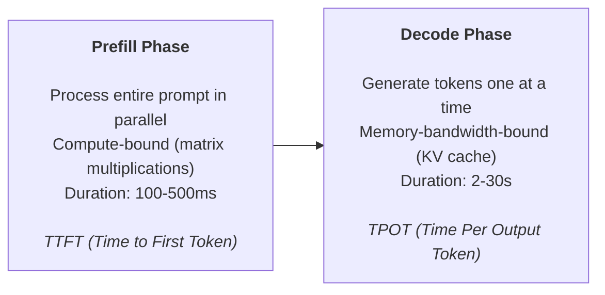
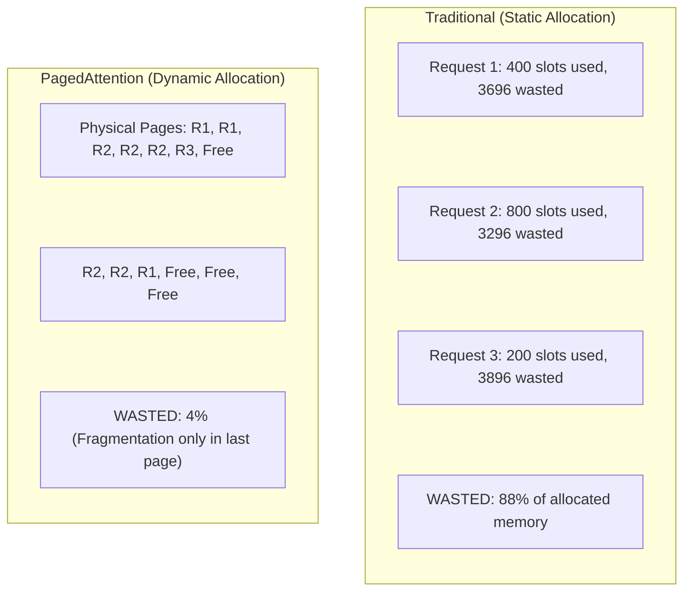
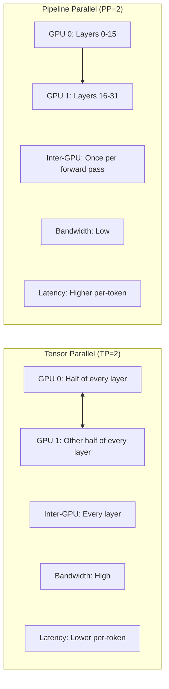

```mermaid
gantt
    title Static Batching (Waits for longest request)
    dateFormat  X
    axisFormat %s
    
    section Request A (short)
    Processing :a1, 0, 8
    Waiting (Wasted GPU) :crit, w1, 8, 24
    
    section Request B (medium)
    Processing :b1, 0, 16
    Waiting (Wasted GPU) :crit, w2, 16, 24
    
    section Request C (long)
    Processing :c1, 0, 24
```

> **Discipline Module** | Complexity: `[COMPLEX]` | Time: 4 hours

## Prerequisites

Before starting this module:
- **Required**: [Module 1.2: Advanced GPU Scheduling & Sharing](../module-1.2-gpu-scheduling/) — GPU allocation, topology awareness
- **Required**: Kubernetes Services, Deployments, HPA basics
- **Recommended**: [Module 1.4: High-Performance Storage for AI](../module-1.4-ai-storage/) — Model weight loading
- **Recommended**: Basic understanding of transformer architecture and language models
- **Recommended**: Access to a cluster with 1+ GPU that has at least 16GB VRAM

---

## What You'll Be Able to Do

After completing this module, you will be able to:

- **Implement LLM serving infrastructure using vLLM, TensorRT-LLM, or Triton Inference Server on Kubernetes**
- **Design autoscaling policies for LLM inference that balance latency, throughput, and GPU cost**
- **Configure batching and quantization strategies that optimize LLM serving efficiency**
- **Build model routing architectures that serve multiple LLM variants with traffic splitting and A/B testing**

## Why This Module Matters

Training a model is an investment. **Serving** it is where you earn the return.

And serving LLMs is nothing like serving a traditional web application. A typical REST API handles a request in 5-50 milliseconds. An LLM generating a 500-token response on an A100 takes 5-15 **seconds**. During that time, it holds a GPU hostage, consumes 10-40GB of VRAM, and the user is staring at a loading spinner.

Now multiply that by thousands of concurrent users. The economics get brutal fast:

```
1 A100 at $3/hr serving Llama-3-8B:
  - Without optimization: 5 requests/second → $0.17 per 1K requests
  - With vLLM + continuous batching: 40 requests/second → $0.02 per 1K requests

That's an 8x cost difference from software optimization alone.
```

This module covers the techniques that make LLM serving economically viable: inference engines that squeeze maximum throughput from each GPU, autoscaling that matches GPU capacity to demand, and graceful lifecycle management that keeps users happy during scale events.

---

## Inference vs Training: Different Worlds

Training and inference have fundamentally different resource profiles:

| Property | Training | Inference |
|----------|----------|-----------|
| GPU utilization | 95%+ (constant compute) | 10-80% (bursty, depends on traffic) |
| Batch size | Large (64-4096) | Small (1-64, depends on concurrency) |
| Memory pattern | Predictable, static | Dynamic (KV cache grows with sequence) |
| Latency requirement | None (throughput matters) | Strict (users wait for responses) |
| Fault tolerance | Checkpoint + restart | Must not drop requests |
| Scaling unit | Fixed cluster for days/weeks | Elastic, minute-to-minute |
| Cost optimization | Maximize GPU utilization | Minimize cost per request |

> **Stop and think**: Consider the lifecycle of a standard web request (e.g., retrieving a user profile). How does holding a connection open for 30 seconds while an LLM generates a response change how you must handle load balancing and timeouts?

### The Two Inference Phases

LLM inference has two distinct phases:



**TTFT** (Time to First Token): How long until the first token appears. Users perceive this as "responsiveness."

**TPOT** (Time Per Output Token): How fast subsequent tokens stream. Users perceive this as "generation speed."

**Throughput** (tokens/second across all requests): What determines your cost per request.

---

## Inference Engines

### vLLM

vLLM (Virtual Large Language Model) is the most widely deployed open-source LLM inference engine. Its key innovation is **PagedAttention**.

#### The KV Cache Problem

During generation, each token's attention computation needs the key-value pairs from all previous tokens. This "KV cache" grows linearly with sequence length:

```
Llama-3-8B, sequence length 4096:
  KV cache per request = 2 × num_layers × hidden_dim × seq_len × 2 bytes
                       = 2 × 32 × 4096 × 4096 × 2
                       = ~2 GB per request

With 40GB GPU: max ~20 concurrent requests
```

> **Pause and predict**: If we pre-allocate memory for the maximum possible sequence length for every request, what happens to our GPU's memory capacity when most users only send short prompts?

**The waste**: Traditional frameworks pre-allocate KV cache for the maximum sequence length, even if the actual sequence is much shorter. A request that generates 100 tokens wastes 97.5% of its pre-allocated 4096-token KV cache.

#### PagedAttention

PagedAttention (invented by the vLLM team at UC Berkeley) manages KV cache like an operating system manages virtual memory:



This simple change increases the number of concurrent requests a GPU can handle by **2-4x**.

#### Deploying vLLM on Kubernetes

```yaml
apiVersion: apps/v1
kind: Deployment
metadata:
  name: vllm-llama3-8b
  namespace: inference
spec:
  replicas: 1
  selector:
    matchLabels:
      app: vllm-llama3-8b
  template:
    metadata:
      labels:
        app: vllm-llama3-8b
    spec:
      containers:
        - name: vllm
          image: vllm/vllm-openai:v0.6.5
          args:
            - --model=meta-llama/Llama-3.1-8B-Instruct
            - --tensor-parallel-size=1
            - --gpu-memory-utilization=0.90
            - --max-model-len=8192
            - --max-num-seqs=64
            - --enable-chunked-prefill
            - --disable-log-stats=false
            - --port=8000
          ports:
            - containerPort: 8000
              name: http
          env:
            - name: HUGGING_FACE_HUB_TOKEN
              valueFrom:
                secretKeyRef:
                  name: hf-token
                  key: token
          resources:
            limits:
              nvidia.com/gpu: 1
              cpu: "8"
              memory: 32Gi
          readinessProbe:
            httpGet:
              path: /health
              port: 8000
            initialDelaySeconds: 120    # Model loading takes time
            periodSeconds: 10
          livenessProbe:
            httpGet:
              path: /health
              port: 8000
            initialDelaySeconds: 180
            periodSeconds: 30
          volumeMounts:
            - name: model-cache
              mountPath: /root/.cache/huggingface
            - name: dshm
              mountPath: /dev/shm
      volumes:
        - name: model-cache
          persistentVolumeClaim:
            claimName: model-cache-pvc     # Pre-downloaded models
        - name: dshm
          emptyDir:
            medium: Memory
            sizeLimit: 8Gi
      terminationGracePeriodSeconds: 120   # Allow in-flight requests to finish
---
apiVersion: v1
kind: Service
metadata:
  name: vllm-llama3-8b
  namespace: inference
spec:
  ports:
    - port: 8000
      targetPort: 8000
      name: http
  selector:
    app: vllm-llama3-8b
```

#### Key vLLM Parameters

| Parameter | Description | Recommendation |
|-----------|-------------|----------------|
| `--gpu-memory-utilization` | Fraction of VRAM for KV cache (rest is model weights) | 0.85-0.95 (higher = more concurrent requests) |
| `--max-model-len` | Maximum sequence length | Set to your actual max, not the model's theoretical max |
| `--max-num-seqs` | Maximum concurrent requests | Start with 64, tune based on TPOT requirements |
| `--tensor-parallel-size` | Number of GPUs for tensor parallelism | 1 for 8B models; 2 for 70B; 4-8 for 405B |
| `--enable-chunked-prefill` | Process long prompts in chunks, interleaved with decode | Enable for mixed-length traffic |
| `--quantization` | Weight quantization (awq, gptq, fp8) | Use AWQ/GPTQ for 2x memory savings, ~5% quality loss |
| `--enforce-eager` | Disable CUDA graph caching | Use for debugging; disable in production |
| `--swap-space` | CPU RAM for swapping KV cache (GB) | 4-16 for handling burst traffic |

### Text Generation Inference (TGI)

TGI is Hugging Face's production inference server. It implements many of the same optimizations as vLLM:

```yaml
apiVersion: apps/v1
kind: Deployment
metadata:
  name: tgi-llama3-8b
  namespace: inference
spec:
  replicas: 1
  selector:
    matchLabels:
      app: tgi-llama3-8b
  template:
    metadata:
      labels:
        app: tgi-llama3-8b
    spec:
      containers:
        - name: tgi
          image: ghcr.io/huggingface/text-generation-inference:2.4
          args:
            - --model-id=meta-llama/Llama-3.1-8B-Instruct
            - --max-input-tokens=4096
            - --max-total-tokens=8192
            - --max-batch-prefill-tokens=16384
            - --max-concurrent-requests=64
            - --max-best-of=1
            - --port=8080
          ports:
            - containerPort: 8080
          env:
            - name: HUGGING_FACE_HUB_TOKEN
              valueFrom:
                secretKeyRef:
                  name: hf-token
                  key: token
          resources:
            limits:
              nvidia.com/gpu: 1
              cpu: "8"
              memory: 32Gi
          volumeMounts:
            - name: dshm
              mountPath: /dev/shm
      volumes:
        - name: dshm
          emptyDir:
            medium: Memory
            sizeLimit: 8Gi
```

### vLLM vs TGI Comparison

| Feature | vLLM | TGI |
|---------|------|-----|
| PagedAttention | Yes (inventor) | Yes (adopted) |
| Continuous batching | Yes | Yes |
| Tensor parallelism | Yes (1-8 GPUs) | Yes (1-8 GPUs) |
| Quantization | AWQ, GPTQ, FP8, GGUF | AWQ, GPTQ, BitsAndBytes |
| OpenAI-compatible API | Yes (native) | Yes (via flag) |
| Speculative decoding | Yes | Yes |
| Prefix caching | Yes | No |
| LoRA serving | Yes (multi-LoRA) | Yes |
| Community | Larger, faster-moving | Hugging Face ecosystem |

---

## Continuous Batching

### The Problem with Static Batching

Traditional batching waits for N requests, then processes them together. The problem: all requests must wait for the longest one to finish.



### Continuous Batching (Iteration-Level Batching)

Continuous batching inserts and removes requests at every decode step:

```mermaid
gantt
    title Continuous Batching (No waiting)
    dateFormat  X
    axisFormat %s
    
    section Slot 1
    Req A Processing :a1, 0, 8
    Req D Processing :d1, 8, 20
    Req F Processing :f1, 20, 24
    
    section Slot 2
    Req B Processing :b1, 0, 16
    Req E Processing :e1, 16, 36
    
    section Slot 3
    Req C Processing :c1, 0, 24
    Req G Processing :g1, 24, 32
```



> **Stop and think**: How does continuous batching handle the fact that requests have different token lengths? What happens to the GPU slots when a short request finishes while a long request is still generating?

This is what makes vLLM and TGI dramatically faster than naive serving: the GPU is always doing useful work, and completed requests free resources immediately for waiting requests.

---

## Multi-GPU Inference

### When One GPU Is Not Enough

Model sizes vs GPU memory:

| Model | Parameters | BF16 Size | Min VRAM (with KV cache) |
|-------|-----------|-----------|--------------------------|
| Llama-3.1-8B | 8B | 16 GB | 20 GB (1x A100-40GB) |
| Llama-3.1-70B | 70B | 140 GB | 160 GB (2x A100-80GB) |
| Llama-3.1-405B | 405B | 810 GB | 900 GB (12x A100-80GB) |
| Mixtral-8x22B | 141B (44B active) | 282 GB | 320 GB (4x A100-80GB) |

### Tensor Parallelism for Inference

Tensor parallelism splits each layer across multiple GPUs. For inference, this reduces per-token latency (lower TPOT) because each GPU processes a smaller matrix:

```yaml
# Serving Llama-3.1-70B on 2x A100-80GB
apiVersion: apps/v1
kind: Deployment
metadata:
  name: vllm-llama3-70b
  namespace: inference
spec:
  replicas: 1
  selector:
    matchLabels:
      app: vllm-llama3-70b
  template:
    metadata:
      labels:
        app: vllm-llama3-70b
    spec:
      containers:
        - name: vllm
          image: vllm/vllm-openai:v0.6.5
          args:
            - --model=meta-llama/Llama-3.1-70B-Instruct
            - --tensor-parallel-size=2    # Split across 2 GPUs
            - --gpu-memory-utilization=0.92
            - --max-model-len=8192
            - --max-num-seqs=32
            - --port=8000
          resources:
            limits:
              nvidia.com/gpu: 2           # Request 2 GPUs
              cpu: "16"
              memory: 64Gi
          volumeMounts:
            - name: dshm
              mountPath: /dev/shm
      volumes:
        - name: dshm
          emptyDir:
            medium: Memory
            sizeLimit: 16Gi
      # Ensure both GPUs are on the same node with NVLink
      affinity:
        nodeAffinity:
          requiredDuringSchedulingIgnoredDuringExecution:
            nodeSelectorTerms:
              - matchExpressions:
                  - key: nvidia.com/gpu.count
                    operator: In
                    values: ["2", "4", "8"]
```

### Pipeline Parallelism for Inference

Pipeline parallelism splits layers across GPUs sequentially. It is less common for inference because it increases TTFT (the prompt must flow through all stages serially), but it uses less inter-GPU bandwidth than tensor parallelism:



Use tensor parallelism when GPUs are connected by NVLink (intra-node). Use pipeline parallelism when GPUs are on different nodes (slower interconnect).

---

## Autoscaling LLM Inference with KEDA

### Why HPA Is Not Enough

The standard Kubernetes HPA scales on CPU or memory utilization. For LLM inference, these metrics are useless:

- **CPU utilization**: GPU workloads barely touch the CPU
- **Memory utilization**: GPU VRAM is the constraint, not system RAM
- **GPU utilization**: A GPU at 90% utilization might be handling requests fine, or it might have a 30-second queue

The right metric is **queue depth** — how many requests are waiting to be processed.

> **Pause and predict**: If you autoscale based on CPU utilization, what will happen when your GPU is fully saturated with queued requests but the CPU is mostly idle?

### KEDA: Kubernetes Event-Driven Autoscaler

KEDA extends Kubernetes autoscaling with custom metric sources: Prometheus, Redis, RabbitMQ, Kafka, HTTP queues, and 60+ others.

```bash
# Install KEDA
helm repo add kedacore https://kedacore.github.io/charts
helm repo update

helm install keda kedacore/keda \
  --namespace keda \
  --create-namespace \
  --version 2.16.0
```

### Scaling vLLM on Queue Depth

vLLM exposes Prometheus metrics including `vllm:num_requests_waiting` — the number of requests queued for processing.

```yaml
apiVersion: keda.sh/v1alpha1
kind: ScaledObject
metadata:
  name: vllm-scaler
  namespace: inference
spec:
  scaleTargetRef:
    name: vllm-llama3-8b          # Deployment to scale
  minReplicaCount: 1               # Always keep 1 replica
  maxReplicaCount: 5               # Maximum 5 replicas (5 GPUs)
  pollingInterval: 15              # Check metrics every 15s
  cooldownPeriod: 300              # Wait 5 min before scaling down
  advanced:
    restoreToOriginalReplicaCount: false
    horizontalPodAutoscalerConfig:
      behavior:
        scaleUp:
          stabilizationWindowSeconds: 30
          policies:
            - type: Pods
              value: 1             # Add 1 pod at a time
              periodSeconds: 60    # At most every 60s
        scaleDown:
          stabilizationWindowSeconds: 300
          policies:
            - type: Pods
              value: 1
              periodSeconds: 120
  triggers:
    - type: prometheus
      metadata:
        serverAddress: http://kube-prometheus-prometheus.monitoring:9090
        query: |
          sum(vllm:num_requests_waiting{namespace="inference",pod=~"vllm-llama3-8b.*"})
          /
          count(vllm:num_requests_waiting{namespace="inference",pod=~"vllm-llama3-8b.*"})
        threshold: "5"             # Scale up when avg queue > 5 requests
        activationThreshold: "2"   # Only activate scaling when queue > 2
```

### Scaling on Custom Latency Targets

For latency-sensitive applications, scale based on P95 TPOT:

```yaml
apiVersion: keda.sh/v1alpha1
kind: ScaledObject
metadata:
  name: vllm-latency-scaler
  namespace: inference
spec:
  scaleTargetRef:
    name: vllm-llama3-8b
  minReplicaCount: 1
  maxReplicaCount: 5
  triggers:
    - type: prometheus
      metadata:
        serverAddress: http://kube-prometheus-prometheus.monitoring:9090
        query: |
          histogram_quantile(0.95,
            sum(rate(vllm:time_per_output_token_seconds_bucket{namespace="inference"}[2m]))
            by (le)
          )
        threshold: "0.060"        # Scale up when P95 TPOT exceeds 60ms
        activationThreshold: "0.040"
```

### Scale-to-Zero

For development or low-traffic models, KEDA can scale to zero replicas and spin up on first request. However, LLM cold-start is 1-5 minutes (model loading), so this requires careful consideration:

```yaml
apiVersion: keda.sh/v1alpha1
kind: ScaledObject
metadata:
  name: vllm-dev-scaler
  namespace: inference
spec:
  scaleTargetRef:
    name: vllm-dev-model
  minReplicaCount: 0               # Scale to zero!
  maxReplicaCount: 2
  idleReplicaCount: 0              # Idle = 0 replicas
  cooldownPeriod: 900              # Wait 15 min before scaling to zero
  triggers:
    - type: prometheus
      metadata:
        serverAddress: http://kube-prometheus-prometheus.monitoring:9090
        query: |
          sum(rate(vllm:request_success_total{namespace="inference",pod=~"vllm-dev.*"}[5m]))
        threshold: "0.1"           # Scale up on any traffic
```

---

## Graceful Termination

### Why It Matters for LLMs

When Kubernetes scales down or rolls out a new version, it sends SIGTERM to the Pod. For a web server, in-flight requests take milliseconds. For an LLM, a request generating a 2,000-token response takes 30-60 seconds. Killing that request means the user sees a truncated response or an error.

### The Graceful Shutdown Flow

```
1. KEDA decides to scale down (or rolling update begins)
2. Kubernetes removes Pod from Service endpoints (no new traffic)
3. Kubernetes sends SIGTERM to Pod
4. vLLM catches SIGTERM:
   a. Stops accepting new requests
   b. Continues processing in-flight requests
   c. Waits until all in-flight requests complete
5. vLLM exits cleanly
6. If terminationGracePeriodSeconds expires: SIGKILL (forced)
```

### Configuration

```yaml
spec:
  template:
    spec:
      terminationGracePeriodSeconds: 180   # 3 minutes for in-flight requests
      containers:
        - name: vllm
          # vLLM handles SIGTERM gracefully by default
          lifecycle:
            preStop:
              exec:
                command:
                  - sh
                  - -c
                  - |
                    # Stop accepting new requests via readiness probe
                    # vLLM's /health endpoint will return 503 after SIGTERM
                    # Wait for in-flight requests to drain
                    sleep 5
```

### Rolling Update Strategy

```yaml
spec:
  strategy:
    type: RollingUpdate
    rollingUpdate:
      maxUnavailable: 0        # Never reduce below current capacity
      maxSurge: 1              # Add 1 new Pod before removing old one
```

This ensures zero downtime: a new Pod becomes Ready (model loaded, health check passing) before the old Pod receives SIGTERM.

---

## Try This: Benchmark Your Inference Engine

Run a quick throughput test with a simple curl loop:

```bash
# Port-forward to your vLLM service
kubectl port-forward -n inference svc/vllm-llama3-8b 8000:8000 &

# Single request (check latency)
time curl -s http://localhost:8000/v1/completions \
  -H "Content-Type: application/json" \
  -d '{
    "model": "meta-llama/Llama-3.1-8B-Instruct",
    "prompt": "Explain Kubernetes in one paragraph:",
    "max_tokens": 200,
    "temperature": 0.7
  }' | jq '.choices[0].text'

# Concurrent load test (check throughput)
for i in $(seq 1 20); do
  curl -s http://localhost:8000/v1/completions \
    -H "Content-Type: application/json" \
    -d '{
      "model": "meta-llama/Llama-3.1-8B-Instruct",
      "prompt": "Write a haiku about GPUs:",
      "max_tokens": 50,
      "temperature": 0.9
    }' > /dev/null &
done
wait

# Check vLLM metrics
curl -s http://localhost:8000/metrics | grep -E "vllm:(num_requests|avg_generation|gpu_cache)"
```

---

## Did You Know?

1. **PagedAttention was inspired by virtual memory in operating systems**. Just as an OS uses page tables to map virtual addresses to physical memory, PagedAttention uses block tables to map logical KV cache positions to physical GPU memory blocks. The vLLM paper explicitly credits this analogy as the key insight that led to the 2-4x throughput improvement.

2. **The "decode" phase of LLM inference is memory-bandwidth-bound, not compute-bound**. Generating each token requires reading the entire model weights (16GB for an 8B model) from VRAM but performs relatively little computation. This means that for decode, an A100-40GB (2 TB/s HBM bandwidth) is only 25% slower than an A100-80GB (2 TB/s HBM bandwidth) despite having half the memory — because the bandwidth is the same.

3. **Speculative decoding can speed up inference by 2-3x** without changing the output quality. The trick: a small "draft" model (e.g., 1B parameters) generates 4-8 candidate tokens quickly. The large model then verifies all candidates in a single forward pass (batched verification is fast). If the draft model guessed correctly (which it does 60-80% of the time for common patterns), you get 4-8 tokens for the cost of ~1.5 forward passes.

---

## War Story: The Model That Took 7 Minutes to Start

A team deployed a 70B parameter model on 2x A100-80GB via vLLM in their production cluster. Everything worked — until they tried to scale from 1 to 3 replicas during a traffic spike.

The new replicas took **7 minutes** to become Ready. During those 7 minutes, the original replica was overwhelmed, P95 latency spiked to 45 seconds, and users saw timeouts.

> **Stop and think**: What happens to in-flight requests that take 45 seconds to generate if Kubernetes sends a SIGTERM and the default termination grace period is 30 seconds?

Investigation revealed three stacking delays:

1. **Model download** (3 min): The 140GB model was being downloaded from Hugging Face Hub on every scale-up. No PVC was caching the weights.
2. **Model loading into VRAM** (2.5 min): Loading 140GB from disk to 2 GPUs is slow, especially from network storage.
3. **CUDA compilation** (1.5 min): vLLM was not using the `--disable-custom-all-reduce` optimization, causing CUDA graph compilation on first request.

The fix:
1. **Pre-downloaded models on a shared PVC** (ReadWriteMany) — eliminated download time
2. **Local NVMe cache** for model weights — reduced load time from 2.5 min to 40 seconds
3. **Pre-compiled CUDA graphs** with `--enable-prefix-caching` — reduced warmup
4. **Proactive scaling**: KEDA trigger at queue depth 3 instead of 5, giving more lead time

New scale-up time: 90 seconds. Still not instant, but manageable with proactive scaling.

**Lesson**: LLM cold-start time is a first-class operational concern. Pre-cache model weights and scale proactively, not reactively.

---

## Common Mistakes

| Mistake | Problem | Solution |
|---------|---------|----------|
| Scaling on CPU/RAM metrics | These metrics don't reflect GPU or queue state | Scale on `vllm:num_requests_waiting` or custom latency metrics |
| `terminationGracePeriodSeconds: 30` | In-flight LLM requests take 30-60s; users get truncated responses | Set to 120-180 seconds for LLM serving Pods |
| Downloading model on every Pod start | 7B model = 14GB, 70B model = 140GB; startup takes minutes | Use a PVC with pre-downloaded weights or an init container that caches |
| Setting `--max-model-len` too high | Pre-allocates KV cache memory for max length; wastes VRAM | Set to your actual maximum expected sequence length |
| Not mounting `/dev/shm` | NCCL and tensor-parallel communication fails or is slow | Always mount `emptyDir: {medium: Memory, sizeLimit: 8Gi}` |
| Using `maxUnavailable: 1` for rolling updates | During rollout, one Pod is terminated before new one is ready — capacity drops | Use `maxUnavailable: 0, maxSurge: 1` for zero-downtime updates |
| Ignoring quantization | Running BF16 when AWQ/GPTQ provides near-identical quality at half memory | Use `--quantization awq` for 2x memory savings on inference |
| No readiness probe or wrong timing | Traffic routes to Pod still loading model; users get connection refused | `initialDelaySeconds: 120` minimum; probe `/health` endpoint |

---

## Quiz: Check Your Understanding

### Question 1
You are reviewing a Grafana dashboard for a deployment of a 7B parameter model. The GPU VRAM is 95% full, but you notice that the active computation utilization is extremely low, and the server is only handling 4 concurrent requests. The developer used a naive inference script instead of vLLM. What is likely happening in memory, and how would deploying vLLM (which uses PagedAttention) solve this bottleneck?

<details>
<summary>Show Answer</summary>

Traditional KV cache allocation reserves a contiguous block of GPU memory for the maximum sequence length for every request. If max_seq_len=4096 and a request only generates 200 tokens, 95% of the allocated memory is wasted. PagedAttention divides KV cache into fixed-size blocks (pages) and allocates them on demand as tokens are generated. Pages are stored non-contiguously in GPU memory and mapped via a block table (analogous to a page table in OS virtual memory). This reduces memory waste from ~60-90% (static allocation) to ~4% (only the last partially-filled page). The freed memory can hold KV cache for additional concurrent requests, effectively increasing the concurrency capacity of the GPU by 2-4x.
</details>

### Question 2
Your infrastructure team sets up an HPA to scale a cluster of Llama-3 nodes based on a target of 80% GPU utilization. During a sudden traffic spike, users complain of 45-second response times, but the HPA only added one additional replica and stopped scaling. What is the fundamental flaw in using GPU utilization for LLM autoscaling, and what metric should the team use instead?

<details>
<summary>Show Answer</summary>

GPU utilization measures compute usage but fundamentally fails to reflect the user experience for LLM workloads. A GPU at 95% utilization might be efficiently processing a batch of requests with low queue depth, while a GPU at 70% utilization during the memory-bandwidth-bound decode phase might have a massive queue of waiting requests. Furthermore, between requests, GPU utilization drops to 0%, then spikes to 100% during compute, making the average hide the burst pattern. Instead, teams should scale on queue depth (e.g., `vllm:num_requests_waiting`) because it directly measures how many users are waiting. Alternatively, latency-based metrics like P95 Time Per Output Token (TPOT) accurately reflect the user's perceived generation speed.
</details>

### Question 3
Your team deploys a coding assistant LLM on an A100-40GB. To be safe, a developer sets `--max-model-len=32768` (the model's theoretical maximum). However, the system starts queuing requests after just 8 concurrent users, even though the actual prompts being sent are only 500 tokens long. When the developer changes the parameter to `--max-model-len=4096`, the system handles 48 concurrent users seamlessly. Explain why this configuration change drastically increased the concurrency limit.

<details>
<summary>Show Answer</summary>

vLLM pre-allocates the KV cache pool based on `--gpu-memory-utilization` and the available GPU memory. The `--max-model-len` parameter sets the maximum sequence length the scheduler allows per request, which directly determines how much KV cache each concurrent request is permitted to consume. At 32768 tokens, each request can reserve up to ~4GB of KV cache, meaning a 32GB cache pool can only fit ~8 concurrent requests at maximum length. When reduced to 4096 tokens, each request reserves only up to ~0.5GB, allowing the same 32GB pool to theoretically accommodate 64 slots (or 48 practically). Setting `--max-model-len` to the actual expected maximum rather than the theoretical maximum prevents artificial capping of concurrency.
</details>

### Question 4
You trigger a routine image tag update for your LLM serving Deployment during business hours. The deployment uses Kubernetes' default rolling update strategy (`maxUnavailable: 25%, maxSurge: 25%`). Immediately, the on-call engineer gets paged for a spike in HTTP 503s and 60-second timeouts. Why did the default update strategy cause an outage for this specific workload, and what values should be used instead?

<details>
<summary>Show Answer</summary>

LLM inference Pods take 1-7 minutes to become Ready because they must load massive model weights into VRAM and compile CUDA graphs. During a rolling update with `maxUnavailable: 25%`, Kubernetes immediately terminates 25% of the active Pods while the new ones take minutes to start. For those several minutes, the deployment runs with 25% less capacity, which overwhelms the remaining Pods and causes severe latency spikes and timeouts. By configuring `maxUnavailable: 0` and `maxSurge: 1`, Kubernetes will create one new Pod and wait until it is fully Ready before terminating an old one. This ensures that the total serving capacity never drops below the original level, resulting in a zero-downtime update.
</details>

### Question 5
You are comparing two inference servers. Server A waits for 16 requests to arrive, processes them all together, and returns the results. Server B immediately begins processing requests as they arrive, and finishes them at different times, continually accepting new ones. Server B achieves 4x the total tokens-per-second throughput of Server A. What is the name of the technique Server B is using, and why does it result in such a dramatic throughput increase?

<details>
<summary>Show Answer</summary>

Static batching collects N requests and processes them together, forcing shorter requests to waste GPU cycles waiting for the longest request in the batch to finish. Continuous batching operates at the iteration (token) level, checking if any request has finished after each decode step. Completed requests are immediately removed from the batch, and waiting requests are instantly inserted into the freed slots. This ensures the GPU never idles and slots freed by completed requests are instantly reused. Because individual request latency is determined by its own length rather than the batch's longest request, total throughput dramatically increases by 2-5x.
</details>

---

## Hands-On Exercise: vLLM Serving with KEDA Autoscaling

### Objective

Deploy vLLM serving a model on Kubernetes, configure KEDA to autoscale from 1 to 3 replicas based on request queue depth, and observe the scaling behavior under load.

### Environment

- Kubernetes cluster with 1-3 GPU nodes (at least 16GB VRAM each)
- GPU Operator installed (Module 1.1)
- Prometheus + Grafana installed
- KEDA installed (or we install it in Step 1)

### Step 1: Install KEDA

```bash
helm repo add kedacore https://kedacore.github.io/charts
helm repo update

helm install keda kedacore/keda \
  --namespace keda \
  --create-namespace \
  --version 2.16.0

kubectl -n keda wait --for=condition=Ready pods --all --timeout=120s
```

### Step 2: Create Inference Namespace and Model Cache

```bash
kubectl create namespace inference

# Create a secret for Hugging Face token (if using gated models)
kubectl -n inference create secret generic hf-token \
  --from-literal=token=hf_YOUR_TOKEN_HERE

# Create PVC for model cache (avoids re-downloading on scale-up)
cat <<'EOF' | kubectl apply -f -
apiVersion: v1
kind: PersistentVolumeClaim
metadata:
  name: model-cache-pvc
  namespace: inference
spec:
  accessModes:
    - ReadWriteMany          # Must be RWX for multiple replicas
  resources:
    requests:
      storage: 50Gi
EOF
```

### Step 3: Deploy vLLM

```bash
# Using a smaller model for the exercise (works on 16GB VRAM)
cat <<'EOF' | kubectl apply -f -
apiVersion: apps/v1
kind: Deployment
metadata:
  name: vllm-serve
  namespace: inference
spec:
  replicas: 1
  selector:
    matchLabels:
      app: vllm-serve
  strategy:
    type: RollingUpdate
    rollingUpdate:
      maxUnavailable: 0
      maxSurge: 1
  template:
    metadata:
      labels:
        app: vllm-serve
      annotations:
        prometheus.io/scrape: "true"
        prometheus.io/port: "8000"
        prometheus.io/path: "/metrics"
    spec:
      terminationGracePeriodSeconds: 120
      containers:
        - name: vllm
          image: vllm/vllm-openai:v0.6.5
          args:
            - --model=TinyLlama/TinyLlama-1.1B-Chat-v1.0
            - --gpu-memory-utilization=0.85
            - --max-model-len=2048
            - --max-num-seqs=32
            - --port=8000
          ports:
            - containerPort: 8000
              name: http
          resources:
            limits:
              nvidia.com/gpu: 1
              cpu: "4"
              memory: 16Gi
          readinessProbe:
            httpGet:
              path: /health
              port: 8000
            initialDelaySeconds: 60
            periodSeconds: 10
          volumeMounts:
            - name: model-cache
              mountPath: /root/.cache/huggingface
            - name: dshm
              mountPath: /dev/shm
      volumes:
        - name: model-cache
          persistentVolumeClaim:
            claimName: model-cache-pvc
        - name: dshm
          emptyDir:
            medium: Memory
            sizeLimit: 4Gi
---
apiVersion: v1
kind: Service
metadata:
  name: vllm-serve
  namespace: inference
spec:
  ports:
    - port: 8000
      targetPort: 8000
  selector:
    app: vllm-serve
EOF

# Wait for the Pod to be Ready (model loading takes 1-3 minutes)
kubectl -n inference wait --for=condition=Ready pod -l app=vllm-serve --timeout=300s
```

### Step 4: Create a ServiceMonitor for Prometheus

```bash
cat <<'EOF' | kubectl apply -f -
apiVersion: monitoring.coreos.com/v1
kind: ServiceMonitor
metadata:
  name: vllm-metrics
  namespace: inference
  labels:
    release: kube-prometheus
spec:
  selector:
    matchLabels:
      app: vllm-serve
  endpoints:
    - port: http
      path: /metrics
      interval: 15s
  namespaceSelector:
    matchNames:
      - inference
EOF
```

### Step 5: Configure KEDA ScaledObject

```bash
cat <<'EOF' | kubectl apply -f -
apiVersion: keda.sh/v1alpha1
kind: ScaledObject
metadata:
  name: vllm-scaler
  namespace: inference
spec:
  scaleTargetRef:
    name: vllm-serve
  minReplicaCount: 1
  maxReplicaCount: 3
  pollingInterval: 15
  cooldownPeriod: 120
  advanced:
    horizontalPodAutoscalerConfig:
      behavior:
        scaleUp:
          stabilizationWindowSeconds: 15
          policies:
            - type: Pods
              value: 1
              periodSeconds: 30
        scaleDown:
          stabilizationWindowSeconds: 120
          policies:
            - type: Pods
              value: 1
              periodSeconds: 60
  triggers:
    - type: prometheus
      metadata:
        serverAddress: http://kube-prometheus-prometheus.monitoring:9090
        query: |
          avg(vllm:num_requests_waiting{namespace="inference"})
        threshold: "3"
        activationThreshold: "1"
EOF
```

### Step 6: Generate Load and Observe Scaling

```bash
# In terminal 1: watch pod count
kubectl -n inference get pods -w

# In terminal 2: generate load
kubectl -n inference run loadgen --rm -it --restart=Never \
  --image=curlimages/curl -- sh -c '
  echo "Starting load test — sending 30 concurrent requests..."
  for i in $(seq 1 30); do
    curl -s http://vllm-serve:8000/v1/completions \
      -H "Content-Type: application/json" \
      -d "{
        \"model\": \"TinyLlama/TinyLlama-1.1B-Chat-v1.0\",
        \"prompt\": \"Write a detailed essay about the history of computing, covering mainframes, minicomputers, personal computers, and cloud computing. Include key dates and people.\",
        \"max_tokens\": 500,
        \"temperature\": 0.7
      }" > /dev/null 2>&1 &
  done
  echo "All requests dispatched. Waiting..."
  wait
  echo "All requests complete."
'

# In terminal 3: watch KEDA/HPA metrics
kubectl -n inference get hpa -w
```

### Step 7: Verify Scaling Behavior

```bash
# Check that KEDA triggered scale-up
kubectl -n inference get scaledobject vllm-scaler
kubectl -n inference describe hpa keda-hpa-vllm-scaler

# Check Prometheus for queue depth
kubectl port-forward -n monitoring svc/kube-prometheus-prometheus 9090:9090 &
curl -s 'http://localhost:9090/api/v1/query?query=vllm:num_requests_waiting{namespace="inference"}' | jq .

# Wait for cool-down and verify scale-down
# (After 2 minutes of no load, replicas should decrease)
```

### Step 8: Cleanup

```bash
kubectl delete namespace inference
```

### Success Criteria

You have completed this exercise when:
- [ ] vLLM Pod is Running and serving requests at `/v1/completions`
- [ ] ServiceMonitor is created and `vllm:num_requests_waiting` appears in Prometheus
- [ ] KEDA ScaledObject is active and HPA is created
- [ ] Under load (30 concurrent requests), KEDA scales from 1 to 2 or 3 replicas
- [ ] New replicas become Ready and start serving requests
- [ ] After load stops, replicas scale back down to 1 within the cooldown period
- [ ] You can explain why queue depth is a better scaling metric than GPU utilization

---

## Key Takeaways

1. **LLM inference is fundamentally different from traditional serving** — seconds per request, GPU-bound, memory-limited by KV cache
2. **PagedAttention (vLLM)** eliminates KV cache waste, enabling 2-4x more concurrent requests per GPU
3. **Continuous batching** ensures GPUs never idle between requests, improving throughput 2-5x over static batching
4. **Scale on queue depth, not CPU/GPU utilization** — KEDA with Prometheus metrics gives you the right signal
5. **Cold-start time is critical** — pre-cache model weights on shared PVCs and scale proactively
6. **Graceful termination matters** — set `terminationGracePeriodSeconds: 120-180` and `maxUnavailable: 0` for zero-downtime updates
7. **Quantization is free money** — AWQ/GPTQ halves memory usage with <5% quality loss, doubling your requests per GPU

---

## Further Reading

**Documentation**:
- **vLLM**: docs.vllm.ai
- **TGI**: huggingface.co/docs/text-generation-inference
- **KEDA**: keda.sh/docs

**Papers**:
- **"Efficient Memory Management for Large Language Model Serving with PagedAttention"** — Kwon et al., 2023 (the vLLM paper)
- **"Orca: A Distributed Serving System for Transformer-Based Generative Models"** — Yu et al. (continuous batching)

**Talks**:
- **"vLLM: Easy, Fast, and Cheap LLM Serving"** — Woosuk Kwon, Ray Summit 2024
- **"Scaling LLM Inference on Kubernetes"** — KubeCon NA 2024

---

## Summary

Serving LLMs at scale requires purpose-built inference engines (vLLM, TGI) that implement PagedAttention and continuous batching to maximize GPU utilization. Autoscaling must be driven by request queue depth via KEDA, not by traditional CPU/memory metrics. Multi-GPU inference with tensor parallelism enables serving models larger than a single GPU. And graceful lifecycle management — from model pre-caching to termination grace periods — ensures users never experience service disruptions during scale events.

---

## Next Module

Continue to [Module 1.6: Cost & Capacity Planning for AI](../module-1.6-ai-cost/) to learn how to optimize GPU spending with spot instances, Karpenter, Kueue, and utilization profiling.

---

*"In LLM serving, every millisecond of latency is money, and every idle GPU-second is waste."* — Platform engineering proverb