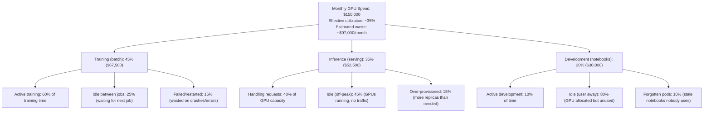
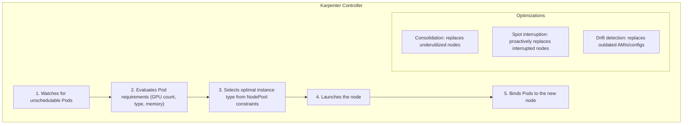
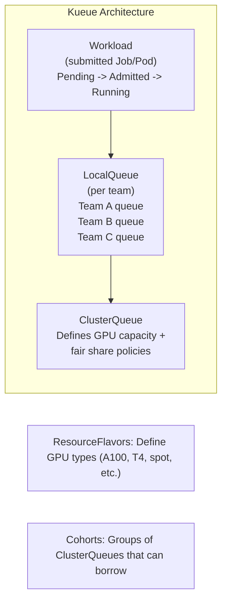

> **Complexity**: `[MEDIUM]`
>
> **Time to Complete**: 3 hours
>
> **Prerequisites**: [Module 1.1: GPU Provisioning & Device Plugins](../module-1.1-gpu-provisioning/), [Module 1.5: Serving LLMs at Scale](../module-1.5-llm-serving/), Kubernetes autoscaling concepts, and basic cloud billing familiarity

---

## What You'll Be Able to Do

After completing this module, you will be able to:

- **Implement GPU cost tracking and attribution across teams, projects, and workload types**
- **Design spot and preemptible instance strategies that reduce AI training cost while preserving recoverability**
- **Build cost optimization workflows for right-sizing, scheduling, preemption, and auto-shutdown in GPU clusters**
- **Evaluate reserved, on-demand, and interruptible capacity models for predictable AI infrastructure budgets**

## Why This Module Matters

Hypothetical scenario: your platform team opens the monthly cloud bill and finds that GPU spending has become larger than every other Kubernetes cost combined. The data science organization is not doing anything obviously reckless: training jobs are important, inference services have real users, and notebooks are part of daily development. The problem is that GPU infrastructure punishes small operational gaps. A few idle notebooks, a training cluster left warm between runs, and inference replicas sized for peak traffic can quietly turn into a budget line that grows faster than the business value it supports.

AI cost management is difficult because a GPU is both an expensive accelerator and a scarce scheduling resource. A CPU-heavy service can often be overprovisioned by a modest amount without changing the annual budget very much, but an eight-GPU node running around the clock can cost as much as a small engineering team. That is why this module treats cost as an engineering property rather than a finance afterthought. You will connect unit economics, workload interruption tolerance, Kubernetes scheduling, Karpenter provisioning, Kueue batch admission, and chargeback dashboards into one operating model.

The goal is not to make every workload cheap. Production inference may justify on-demand capacity, and a critical training run may deserve a reserved allocation during a launch window. The skill is knowing which workloads need that reliability, which can safely use spot capacity, which should wait in a queue, and which should disappear when nobody is using them. By the end, you should be able to explain a GPU bill in terms that both finance and engineering can act on: cost per epoch, cost per thousand requests, idle GPU-hours, spot ratio, queue wait time, and protected capacity for service-level commitments.

AI infrastructure is the most expensive line item in many organizations' cloud bills. The numbers are staggering:

| GPU Instance | Cloud Cost (on-demand) | Yearly Cost (1 node) |
|-------------|----------------------|---------------------|
| AWS p5.48xlarge (8x H100) | $98.32/hr | $861,283 |
| AWS p4d.24xlarge (8x A100) | $32.77/hr | $287,069 |
| GCP a3-megagpu-8g (8x H100) | $101.22/hr | $886,688 |
| Azure ND96amsr_A100_v4 (8x A100) | $32.77/hr | $287,069 |

A 32-node training cluster of H100s costs roughly $3.1 million per year at on-demand prices. The painful part is that much of this spend is not attached to useful model progress or reliable user traffic. Idle GPUs, over-provisioned replicas, failed experiments, unbounded notebooks, and poor queuing discipline can waste a large share of total spend while still leaving teams frustrated because the cluster feels full. That combination is the signal that capacity planning is missing a control loop.

## The Cost Anatomy of AI Workloads

The first step in AI cost planning is to stop treating a GPU-hour as the only unit that matters. A GPU-hour is the raw ingredient, but platform decisions are made around business and engineering outcomes: one training epoch, one experiment, one batch inference job, one thousand online requests, or one developer notebook session. When you translate infrastructure into units of work, a vague request such as "we need sixteen GPUs for a week" becomes a concrete question about whether an experiment is worth the budget it consumes and whether a smaller design would answer the same research question.

Cost anatomy also exposes why utilization alone is not enough. A production inference service with twenty percent average GPU utilization may be correctly sized if it absorbs bursts without violating latency objectives, while a notebook with the same utilization is probably wasteful because nobody notices when it waits a minute for a GPU to start. The platform team must therefore separate workload classes before applying optimization. Training wants recoverability and throughput, inference wants latency and availability, development wants convenience with guardrails, and batch preprocessing wants cheap idempotent execution.

Pause and predict: if your dashboard shows low GPU utilization across the fleet, what extra label would you need before deciding whether to terminate nodes, reduce replicas, or move jobs to spot capacity? The useful answer is usually a workload label such as `training`, `inference`, or `development`, because the same metric means different things under different service expectations. A cost dashboard without workload identity is like a power meter without room labels: it tells you electricity is being used, but not whether the refrigerator, the heater, or a forgotten lamp is responsible.

Break down a typical AI team's GPU spending:



This diagram is not a claim about every organization; it is a model for reasoning about where controls belong. Training waste is often solved with checkpointing, spot capacity, and a queue that prevents jobs from holding resources while waiting for peers. Inference waste is usually solved with autoscaling, model sharing, batching, and clear latency targets. Development waste is solved with auto-shutdown, quota, and a user experience that makes releasing GPUs normal rather than punitive. Treating all three classes the same creates either brittle production service or expensive research convenience.

Think in cost per unit of work, not cost per GPU-hour:

| Metric | Formula | Example |
|--------|---------|---------|
| Cost per training epoch | (GPUs x $/hr x hours per epoch) | 8 A100 x $3/hr x 4hr = $96/epoch |
| Cost per 1K inference requests | (GPU-hours per 1K requests x $/hr) | 0.007 GPU-hr x $3/hr = $0.02/1K |
| Cost per experiment | (GPU-hours x $/hr) | 1 A100 x $3/hr x 2hr = $6/experiment |
| Cost per idle hour (waste) | (Idle GPUs x $/hr) | 4 idle A100 x $3/hr = $12/hr waste |

The table gives you the vocabulary for a better conversation with model owners. A researcher may not know whether a week of sixteen GPUs is a large request in cloud terms, but they can usually explain what they expect from an experiment and how much accuracy improvement would justify it. An inference owner may not care about GPU-hours, but they can reason about cost per thousand requests against product margin or internal budget. Once you express costs this way, optimization stops being a generic mandate to spend less and becomes a choice between explicit tradeoffs.

Track these metrics in dashboards and reviews. When a scientist says "I need 16 GPUs for a week," translate that to $8,064 at $3 per GPU-hour and ask whether the experiment is worth that spend, whether a smaller pilot could reject the idea earlier, and whether spot capacity with checkpoints would reduce the risk. The point is not to interrogate every request. The point is to make invisible opportunity cost visible before the infrastructure platform silently accepts the most expensive possible version of the plan.

## Spot Instances for Interruptible Workloads

Spot and preemptible instances are the largest single lever for many AI platforms because training, hyperparameter search, batch inference, and data preprocessing are often interruption-tolerant when designed correctly. The cloud provider sells unused capacity at a discount, and your application accepts the risk that the capacity can be reclaimed. This is not free money; it is a contract. The workload must checkpoint, tolerate eviction, re-enter a queue, and avoid corrupting shared state when it is terminated.

The basic economic question is whether the cost of lost work is smaller than the savings from discounted capacity. For a well-checkpointed training job, the lost work after an interruption is usually half the checkpoint interval on average. If the job checkpoints every thirty minutes, an interruption wastes about fifteen minutes of computation, not the entire run. That is why checkpoint cadence is not merely a reliability setting. It is a cost-control parameter that determines how much of the spot discount you actually keep.

Pause and predict: if spot instances can be terminated with only a short warning, what specific training behavior makes a multi-day run economically safe on spot capacity? The answer is frequent, validated checkpointing to durable storage, combined with job logic that resumes from the newest complete checkpoint after eviction. Without that behavior, spot pricing turns into a gamble. With it, spot pricing becomes a controlled interruption model where lost work is bounded and measurable.

Cloud providers sell excess GPU capacity at large discounts as spot instances, preemptible VMs, or equivalent discounted capacity. The catch is that they can reclaim the instance with limited notice, and availability varies by region, zone, instance type, and time. For cost planning, this means you should diversify instance types where the workload allows it, keep capacity requirements flexible, and reserve on-demand fallback for workloads that cannot safely wait.

| Provider | GPU Instance | On-Demand | Spot Price | Savings |
|----------|-------------|-----------|------------|---------|
| AWS | p4d.24xlarge (8x A100) | $32.77/hr | $12.50/hr | 62% |
| AWS | g5.xlarge (1x A10G) | $1.01/hr | $0.35/hr | 65% |
| GCP | a2-highgpu-8g (8x A100) | $29.39/hr | $8.82/hr | 70% |
| Azure | NC24ads_A100_v4 (1x A100) | $3.67/hr | $1.46/hr | 60% |

The exact prices in this table should be replaced with the rates in your own region and contract, but the design lesson remains stable. The deeper discount belongs to workloads that can be interrupted, restarted, or delayed without user-visible harm. A training job with a clean checkpoint path is a strong candidate. A public inference endpoint with strict latency commitments is usually not, unless you have enough redundancy and fallback to absorb node loss without errors.

One practical way to de-risk spot adoption is to create a short approval checklist for each workload class. Training owners should show where checkpoints are stored, how restore is tested, and how many minutes of work the team is willing to lose. Batch inference owners should show idempotent input partitions and retry behavior. Development notebook owners should acknowledge that convenience is lower priority than preventing forgotten accelerators from running all weekend.

| Workload | Spot-Friendly? | Why |
|----------|---------------|-----|
| Training (with checkpointing) | Yes | Can resume from checkpoint after interruption |
| Hyperparameter search | Excellent | Individual trials are independent and short |
| Batch inference | Yes | Can re-queue interrupted batches |
| Data preprocessing | Yes | Stateless, idempotent |
| Interactive inference (serving) | No | Interruptions = user-facing errors |
| Jupyter notebooks | Risky | Users lose unsaved work |

For training jobs, the key is checkpoint frequency versus interruption frequency:

```
Interruption rate: ~1 per 4 hours (average for GPU spot on AWS)
Checkpoint frequency: every 30 minutes
Average work lost per interruption: 15 minutes (half a checkpoint interval)
Cost of lost work: 8 A100 x $1.56/hr (spot) x 0.25hr = $3.12

Savings from spot: 8 A100 x ($32.77 - $12.50) x 4hr = $648.64 per period
Net savings: $648.64 - $3.12 = $645.52 per 4-hour period (99.5% of potential savings captured)
```

The calculation demonstrates why interruption fear is often larger than interruption cost. If checkpointing is reliable, the wasted compute is a small adjustment to the effective hourly price. If checkpointing is unreliable, the calculation collapses because you may lose hours of progress, corrupt a run, or require manual cleanup. Before moving a training platform to spot, test checkpoint restore as a normal path, not as an emergency procedure that nobody rehearses.

When a spot instance is reclaimed, the cloud provider sends a termination notice, Kubernetes marks the node unschedulable or begins eviction, Pods receive termination signals, and the autoscaling layer must provision replacement capacity. The details differ by provider, but the platform pattern is consistent: detect interruption early, drain gracefully, write or preserve checkpoint state, and return work to the scheduler. A node termination handler does not make an unsafe workload safe by itself, but it gives safe workloads the time and signal they need to exit cleanly.

Install a handler that gracefully manages spot interruptions:

```bash
# AWS: Node Termination Handler
helm repo add eks https://aws.github.io/eks-charts
helm install aws-node-termination-handler eks/aws-node-termination-handler \
  --namespace kube-system \
  --set enableSpotInterruptionDraining=true \
  --set enableRebalanceMonitoring=true \
  --set enableScheduledEventDraining=true
```

```bash
# GCP: Uses native node auto-repair + preemptible handling
# No separate handler needed -- GKE handles it natively
```

The operational guardrail is to keep spot and on-demand expectations explicit in scheduling labels, queues, and dashboards. A team should not discover during an incident that its inference Pod landed on interruptible capacity because a generic node selector matched more than intended. Conversely, a training job should not silently fall back to expensive on-demand nodes just because spot capacity was temporarily unavailable, unless the owner made that budget choice in advance. Cost safety depends on scheduling intent being visible.

## Karpenter: Intelligent GPU Node Provisioning

Karpenter is valuable for GPU cost planning because it provisions nodes for pending Pods rather than scaling only predefined groups. Traditional node groups work well when most workloads fit a small set of instance shapes, but GPU fleets are rarely that tidy. One team may need an A100 with large memory, another may need a cheaper L4-class device for inference, and a batch queue may be able to use any of several spot pools. If those choices are encoded as rigid node groups, capacity planning becomes a guessing game that either strands expensive nodes or blocks useful work.

The cost advantage comes from matching the node to the Pod at scheduling time. Karpenter can consider instance type, zone, capacity type, taints, labels, and NodePool limits before creating a node. That lets you express policy as constraints: training may prefer spot A100 or H100 capacity across several zones, inference may require on-demand nodes, and development may have a hard GPU ceiling. The autoscaler is no longer merely making an existing pool bigger. It is selecting the cheapest acceptable shape for the work waiting in the queue.

Stop and think: the traditional Cluster Autoscaler scales predefined node groups, so why is that especially inefficient for a diverse fleet of expensive GPU instances? The answer is that every node group is a bet made before the workload arrives. If the bet is too small, jobs wait. If it is too large, the team pays for idle accelerators. If it is too narrow, a temporary capacity shortage in one instance type blocks work even when a compatible alternative exists.

The Cluster Autoscaler scales node groups, which are predefined pools of identical or similar instances. This model has several GPU-specific weaknesses: you often need different GPU types for different workloads, scale-up can be slower than the user expects, packing across instance choices is limited, and spot fallback requires careful group design. Karpenter provisions individual nodes based on Pod requirements and NodePool policy, which makes it better suited to cost-aware AI infrastructure where workload shape changes throughout the day.



The architecture in the diagram is simple, but the policy choices require care. For GPU training, aggressive consolidation can be harmful because moving a running job usually means terminating it and relying on checkpoint recovery. For development nodes, fast consolidation is desirable because forgotten notebooks are a common source of waste. For production inference, consolidation must respect disruption budgets and latency objectives. The same autoscaler feature can be a cost saver or an outage trigger depending on workload class.

The following NodePool expresses an intentionally narrow training pool. It allows only spot capacity, only selected high-end GPU instance types, and only specific zones. The taints prevent ordinary Pods from landing on expensive GPU nodes, while the pool-level GPU limit prevents a runaway queue or bad deployment from creating unbounded spend. Notice that the disruption policy uses `WhenEmpty`, which favors cost recovery after jobs finish without attempting to reshuffle live training workloads.

```yaml
apiVersion: karpenter.sh/v1
kind: NodePool
metadata:
  name: gpu-training-spot
spec:
  template:
    metadata:
      labels:
        workload-type: training
        capacity-type: spot
    spec:
      requirements:
        - key: karpenter.sh/capacity-type
          operator: In
          values: ["spot"]                    # Spot only
        - key: node.kubernetes.io/instance-type
          operator: In
          values:
            - p4d.24xlarge                    # 8x A100-40GB
            - p4de.24xlarge                   # 8x A100-80GB
            - p5.48xlarge                     # 8x H100-80GB
        - key: topology.kubernetes.io/zone
          operator: In
          values: ["us-east-1a", "us-east-1b", "us-east-1c"]
      nodeClassRef:
        group: karpenter.k8s.aws
        kind: EC2NodeClass
        name: gpu-training
      taints:
        - key: nvidia.com/gpu
          value: "true"
          effect: NoSchedule
        - key: workload-type
          value: training
          effect: NoSchedule
  disruption:
    consolidationPolicy: WhenEmpty       # Only remove when no GPU pods running
    consolidateAfter: 5m                 # Wait 5 min after last pod before removing
  limits:
    cpu: "512"
    memory: 4Ti
    nvidia.com/gpu: "64"                  # Max 64 GPUs total in this pool
  weight: 10                              # Prefer this pool (spot) over on-demand
```

Inference deserves a different pool because user-facing services should not be optimized with the same interruption assumptions as batch training. This example uses on-demand capacity and smaller GPU shapes that are more appropriate for serving workloads. The consolidation policy is more aggressive than the training pool, but it still needs to be paired with workload-level disruption controls, readiness gates, and replica design. The autoscaler can remove waste only after the application has enough redundancy to tolerate change.

```yaml
apiVersion: karpenter.sh/v1
kind: NodePool
metadata:
  name: gpu-inference-ondemand
spec:
  template:
    metadata:
      labels:
        workload-type: inference
        capacity-type: on-demand
    spec:
      requirements:
        - key: karpenter.sh/capacity-type
          operator: In
          values: ["on-demand"]              # On-demand for SLA-bound inference
        - key: node.kubernetes.io/instance-type
          operator: In
          values:
            - g5.xlarge                      # 1x A10G (24GB)
            - g5.2xlarge                     # 1x A10G (24GB) + more CPU
            - g6.xlarge                      # 1x L4 (24GB)
        - key: topology.kubernetes.io/zone
          operator: In
          values: ["us-east-1a", "us-east-1b"]
      nodeClassRef:
        group: karpenter.k8s.aws
        kind: EC2NodeClass
        name: gpu-inference
      taints:
        - key: nvidia.com/gpu
          value: "true"
          effect: NoSchedule
  disruption:
    consolidationPolicy: WhenEmptyOrUnderutilized
    consolidateAfter: 10m
  limits:
    nvidia.com/gpu: "32"
```

The NodeClass separates cloud-provider details from the scheduling policy. That boundary matters because cost and reliability decisions live in both places. The NodePool decides which jobs are allowed to create GPU nodes and how many GPUs they can create. The NodeClass decides how those nodes are built, which subnets and security groups they use, how much boot and data volume capacity they get, and how quickly they can become useful after launch.

```yaml
apiVersion: karpenter.k8s.aws/v1
kind: EC2NodeClass
metadata:
  name: gpu-training
spec:
  amiFamily: AL2023
  role: KarpenterNodeRole
  subnetSelectorTerms:
    - tags:
        karpenter.sh/discovery: ml-cluster
  securityGroupSelectorTerms:
    - tags:
        karpenter.sh/discovery: ml-cluster
  blockDeviceMappings:
    - deviceName: /dev/xvda
      ebs:
        volumeSize: 200Gi
        volumeType: gp3
        iops: 10000
        throughput: 500
    - deviceName: /dev/xvdb
      ebs:
        volumeSize: 1Ti             # Large local storage for model weights/data
        volumeType: gp3
        iops: 16000
        throughput: 1000
  userData: |
    #!/bin/bash
    # Install NVIDIA driver if not in AMI
    # GPU Operator handles this, but pre-baked AMIs are faster
```

Karpenter naturally enables scale-to-zero because GPU nodes do not need to exist before GPU Pods need them. This changes the budget conversation for development and batch training. Instead of asking whether a team should be trusted with a standing pool, you can ask whether their workloads have enough startup tolerance to wait for nodes. The tradeoff is cold-start time: saving money by deleting idle nodes means someone waits when work resumes, so the platform should document expected provisioning delays and keep production paths separate.

```
Without scale-to-zero:
  8 A100 nodes running 24/7 for training
  Active training: 10 hours/day
  Idle: 14 hours/day
  Monthly cost: 8 x $32.77/hr x 730hr = $191,376
  Effective cost: $191,376 (100%)

With Karpenter scale-to-zero:
  8 A100 nodes provisioned only during training
  Active: 10 hours/day x 30 days = 300 hours
  Monthly cost: 8 x $32.77/hr x 300hr = $78,648
  Savings: $112,728 (59%)

With Karpenter + spot:
  Active: 300 hours, spot price $12.50/hr
  Monthly cost: 8 x $12.50/hr x 300hr = $30,000
  Savings: $161,376 (84% vs always-on on-demand!)
```

Before running this in a real cluster, predict which number in the example will change most in your environment: hourly price, active hours, idle hours, or spot discount. Most teams discover that active and idle hours matter as much as the advertised GPU rate. A modest hourly discount is useful, but eliminating fourteen idle hours per day is often the cleaner win because it removes consumption entirely rather than making waste cheaper.

## Priority, Queues, and Fair GPU Sharing

Priority classes and Kueue solve different layers of the same problem. Kubernetes priority tells the scheduler which Pods are more important when capacity is scarce, while Kueue adds batch-aware admission, quota, borrowing, and orderly preemption. Native priority by itself can protect production inference from casual experiments, but it does not give research teams a fair queue or a clear way to borrow unused capacity. Kueue turns scarce GPU capacity into a managed shared resource instead of a race between whoever submits first.

Not all GPU workloads are equally important, so define a priority hierarchy before the cluster is full. Production inference should outrank training because users experience errors when serving fails. Training should outrank development because an organized run is usually more valuable than an idle notebook. Best-effort work should be explicitly marked as unable to preempt anything, which prevents low-value jobs from causing avoidable disruption while still allowing them to use spare capacity.

```yaml
# Critical production inference -- never preempted
apiVersion: scheduling.k8s.io/v1
kind: PriorityClass
metadata:
  name: gpu-production
value: 1000000
globalDefault: false
preemptionPolicy: PreemptLowerPriority
description: "Production inference services -- highest GPU priority"
---
# Training jobs -- can preempt dev but not production
apiVersion: scheduling.k8s.io/v1
kind: PriorityClass
metadata:
  name: gpu-training
value: 100000
globalDefault: false
preemptionPolicy: PreemptLowerPriority
description: "Training jobs -- preemptable by production only"
---
# Development and experimentation -- lowest priority
apiVersion: scheduling.k8s.io/v1
kind: PriorityClass
metadata:
  name: gpu-development
value: 10000
globalDefault: false
preemptionPolicy: PreemptLowerPriority
description: "Development workloads -- preempted by training and production"
---
# Best-effort -- preempted by everything
apiVersion: scheduling.k8s.io/v1
kind: PriorityClass
metadata:
  name: gpu-best-effort
value: 1000
globalDefault: false
preemptionPolicy: Never         # Cannot preempt anything
description: "Best-effort GPU access -- runs only when capacity is free"
```

Use in Pods:

```yaml
apiVersion: v1
kind: Pod
metadata:
  name: experiment-42
spec:
  priorityClassName: gpu-development   # Low priority -- can be preempted
  containers:
    - name: experiment
      image: nvcr.io/nvidia/pytorch:24.09-py3
      resources:
        limits:
          nvidia.com/gpu: 1
```

Priority alone is not enough for AI batch work because a pending Pod is not the same as an admitted job with a fair place in line. Training jobs often need a gang of workers, and starting only half of them can waste capacity or cause failures. Multiple teams may share one cluster, and each team needs a guaranteed share plus the ability to borrow idle capacity. These requirements are closer to high-performance computing schedulers than to ordinary web-service scheduling.

Stop and think: if a high-priority production job needs GPUs but the cluster is full of low-priority experiments, how should the system decide which experiments to terminate while ensuring resources are allocated fairly among research teams? The answer needs more information than Pod priority. It needs ownership, quota, queue order, borrowing policy, and a definition of which resources each workload can use. Kueue provides those concepts as Kubernetes-native APIs.

Kueue is designed for batch workloads that need queuing, fair sharing, preemption, quotas, and borrowing. Kubernetes services are usually meant to run forever and maintain replicas. AI training jobs are different: they enter the system, wait until enough resources are available, run to completion, and then leave. A platform that lacks admission control often lets jobs create Pods immediately, which fills the cluster with pending objects and gives users little insight into when their work will start.



The architecture introduces three operational handles. A `ResourceFlavor` describes the kind of capacity, such as A100 spot or A100 on-demand. A `ClusterQueue` describes quota, borrowing, and preemption policy for a shared pool. A `LocalQueue` gives a namespace or team a place to submit work. This separation keeps team workflows simple while allowing the platform team to manage scarce resources centrally.

Install Kueue:

```bash
kubectl apply --server-side -f https://github.com/kubernetes-sigs/kueue/releases/download/v0.9.1/manifests.yaml

# Verify
kubectl -n kueue-system get pods
```

The first configuration step is to define resource flavors. These labels must line up with node labels produced by your GPU device plugin, cloud provider integration, or autoscaler. If labels are wrong, Kueue can admit a workload to capacity that Kubernetes cannot actually provide. Treat label design as part of your cost model because it determines whether a job uses spot, on-demand, A100, T4, or another accelerator class.

```yaml
apiVersion: kueue.x-k8s.io/v1beta1
kind: ResourceFlavor
metadata:
  name: gpu-a100-spot
spec:
  nodeLabels:
    nvidia.com/gpu.product: NVIDIA-A100-SXM4-80GB
    karpenter.sh/capacity-type: spot
---
apiVersion: kueue.x-k8s.io/v1beta1
kind: ResourceFlavor
metadata:
  name: gpu-a100-ondemand
spec:
  nodeLabels:
    nvidia.com/gpu.product: NVIDIA-A100-SXM4-80GB
    karpenter.sh/capacity-type: on-demand
---
apiVersion: kueue.x-k8s.io/v1beta1
kind: ResourceFlavor
metadata:
  name: gpu-t4-spot
spec:
  nodeLabels:
    nvidia.com/gpu.product: Tesla-T4
    karpenter.sh/capacity-type: spot
```

The ClusterQueue is where budget policy becomes scheduling behavior. In this example, spot A100 capacity has a large nominal quota and a borrowing limit, on-demand A100 capacity is smaller and protected, and T4 spot capacity is available for workloads that can use it. Borrowing lets one team use another team's idle share, but preemption policies make sure borrowed resources can be reclaimed when the owner needs them back. This is how a shared GPU platform can be both efficient and fair.

```yaml
apiVersion: kueue.x-k8s.io/v1beta1
kind: ClusterQueue
metadata:
  name: gpu-cluster-queue
spec:
  cohort: ai-platform              # Cohort for borrowing
  preemption:
    reclaimWithinCohort: Any
    borrowWithinCohort:
      policy: LowerPriority
      maxPriorityThreshold: 100000  # Only borrow for training+ priority
    withinClusterQueue: LowerPriority
  resourceGroups:
    - coveredResources: ["cpu", "memory", "nvidia.com/gpu"]
      flavors:
        - name: gpu-a100-spot
          resources:
            - name: nvidia.com/gpu
              nominalQuota: 32         # 32 A100 spot GPUs total
              borrowingLimit: 16       # Can borrow 16 more from cohort
            - name: cpu
              nominalQuota: 512
            - name: memory
              nominalQuota: 2Ti
        - name: gpu-a100-ondemand
          resources:
            - name: nvidia.com/gpu
              nominalQuota: 8          # 8 on-demand A100s (for critical jobs)
              borrowingLimit: 0
            - name: cpu
              nominalQuota: 128
            - name: memory
              nominalQuota: 512Gi
        - name: gpu-t4-spot
          resources:
            - name: nvidia.com/gpu
              nominalQuota: 16
            - name: cpu
              nominalQuota: 64
            - name: memory
              nominalQuota: 256Gi
  fairSharing:
    weight: 1
```

LocalQueues keep team submission paths clean. A research namespace submits to its local queue, a platform namespace submits to its queue, and production has its own queue. The platform team can change the backing ClusterQueue policy without forcing every training script to learn the entire cluster budget. That is important for adoption because cost controls fail when they require every user to become a scheduler expert.

```yaml
apiVersion: kueue.x-k8s.io/v1beta1
kind: LocalQueue
metadata:
  name: ml-research-queue
  namespace: ml-research
spec:
  clusterQueue: gpu-cluster-queue
---
apiVersion: kueue.x-k8s.io/v1beta1
kind: LocalQueue
metadata:
  name: ml-platform-queue
  namespace: ml-platform
spec:
  clusterQueue: gpu-cluster-queue
---
apiVersion: kueue.x-k8s.io/v1beta1
kind: LocalQueue
metadata:
  name: ml-production-queue
  namespace: ml-production
spec:
  clusterQueue: gpu-cluster-queue
```

A submitted job identifies its queue using a label, then declares the GPUs, CPU, and memory it needs. Requests and limits should be deliberate here. If a job requests two GPUs per worker and four workers, the queue must account for eight GPUs before admitting it. This prevents the cluster from starting partial work that cannot complete, and it gives users a visible reason when a job is waiting.

```yaml
apiVersion: batch/v1
kind: Job
metadata:
  name: training-run-82
  namespace: ml-research
  labels:
    kueue.x-k8s.io/queue-name: ml-research-queue    # Which queue
spec:
  parallelism: 4                                       # 4 workers
  completions: 4
  template:
    spec:
      priorityClassName: gpu-training
      containers:
        - name: trainer
          image: my-registry/trainer:v2.1
          resources:
            requests:
              nvidia.com/gpu: 2                        # 2 GPUs per worker
              cpu: "16"
              memory: 64Gi
            limits:
              nvidia.com/gpu: 2
              cpu: "16"
              memory: 64Gi
      restartPolicy: OnFailure
```

Queue status should be part of the normal operating dashboard. Pending work is not automatically a problem; it may mean the platform is enforcing fair use and avoiding waste. The problem is unexplained or excessive wait time, especially when expensive nodes are idle or when production work waits behind development work. Queue metrics let you distinguish intentional backpressure from broken scheduling.

```bash
# View queue status
kubectl get clusterqueue gpu-cluster-queue -o wide

# NAME                COHORT       PENDING  ADMITTED  ACTIVE
# gpu-cluster-queue   ai-platform  3        5         5

# View workloads in a local queue
kubectl -n ml-research get workloads

# NAME                 QUEUE              ADMITTED  FINISHED  AGE
# training-run-82      ml-research-queue  True                2h
# training-run-83      ml-research-queue  True                1h
# experiment-99        ml-research-queue  False               10m  <- queued
```

When a high-priority job arrives and no GPUs are free:

```
1. Job "critical-inference" (priority: 1000000) submitted -> needs 4 GPUs
2. All 32 GPUs are busy with "experiment-*" jobs (priority: 10000)
3. Kueue identifies 4 GPUs occupied by lowest-priority workloads
4. Kueue evicts experiment-72, experiment-73 (freeing 4 GPUs)
5. critical-inference is admitted and starts running
6. experiment-72, experiment-73 return to the queue (pending)
7. When GPUs become available, experiments resume
```

The preemption flow should be communicated before users experience it. If researchers know that low-priority experiments may be suspended and returned to the queue, they can design runs with checkpoints and choose the right priority class. If preemption feels arbitrary, users will hoard resources, inflate priorities, or avoid the shared platform. Fairness is both a technical policy and a trust-building practice.

## Utilization Profiling, Quotas, and Chargeback

Cost visibility is the feedback loop that tells you whether scheduling policy is working. Without telemetry, spot adoption can look successful while teams quietly rerun failed jobs, scale-to-zero can look aggressive while cold starts harm productivity, and quotas can look fair while one namespace pays for most idle capacity. A useful dashboard connects Kubernetes labels, DCGM GPU metrics, Kueue queue state, node capacity type, and cloud pricing. It should answer who used capacity, what kind they used, whether it was busy, and what unit of work it produced.

Start with essential metrics and refine them over time. GPU utilization by namespace shows whether allocated devices are doing work. Allocated-versus-used comparisons reveal waste from idle notebooks or blocked training workers. Cost per namespace turns usage into budget language. Queue wait time tells you whether budget limits are constraining throughput. Spot ratio shows whether interruptible workloads are actually landing on the cheaper fleet rather than leaking into on-demand capacity.

Build a GPU cost dashboard with these Prometheus queries:

```yaml
# GPU utilization by team/namespace
avg(DCGM_FI_DEV_GPU_UTIL{}) by (namespace)

# Allocated vs used GPUs (waste detection)
# Allocated:
count(kube_pod_container_resource_limits{resource="nvidia_com_gpu"} > 0) by (namespace)
# Actually computing:
count(DCGM_FI_DEV_GPU_UTIL > 10) by (namespace)

# Cost per namespace per hour
(
  count(kube_pod_container_resource_limits{resource="nvidia_com_gpu"} > 0) by (namespace)
  * 3.06  # $/hr per GPU (adjust to your actual cost)
)

# Idle GPU hours per day (waste)
(
  count(DCGM_FI_DEV_GPU_UTIL < 5) by (namespace)
  * 3.06
)

# Kueue queue wait time
kueue_pending_workloads{cluster_queue="gpu-cluster-queue"}

# Spot vs on-demand ratio
count(kube_node_labels{label_karpenter_sh_capacity_type="spot"})
/
count(kube_node_labels{label_nvidia_com_gpu_present="true"})
```

Alerting should focus on actionable waste and scheduling pressure, not every fluctuation. An on-demand GPU idle for an hour is worth investigating because the burn rate is high and the owner can usually release it. Long queue waits may be acceptable during known budget caps, but they should be visible so platform owners can decide whether to buy capacity, adjust quotas, or steer jobs to cheaper shapes. A low spot ratio is a signal to check availability, labels, or fallback behavior.

```yaml
apiVersion: monitoring.coreos.com/v1
kind: PrometheusRule
metadata:
  name: gpu-cost-alerts
  namespace: monitoring
spec:
  groups:
    - name: gpu-cost.rules
      rules:
        - alert: GPUIdleForTooLong
          expr: |
            (DCGM_FI_DEV_GPU_UTIL < 5)
            * on(node) group_left()
            (kube_node_labels{label_karpenter_sh_capacity_type="on-demand"})
          for: 1h
          labels:
            severity: warning
          annotations:
            summary: "On-demand GPU {{ $labels.gpu }} on {{ $labels.node }} idle for 1h -- costing $3/hr"
            runbook: "Check if workload is stuck or notebook is abandoned. Consider scaling down."

        - alert: HighQueueWaitTime
          expr: |
            max(kueue_admission_wait_time_seconds{cluster_queue="gpu-cluster-queue"}) > 3600
          for: 10m
          labels:
            severity: info
          annotations:
            summary: "Jobs waiting >1hr in GPU queue -- consider increasing GPU budget"

        - alert: SpotCapacityLow
          expr: |
            count(kube_node_labels{label_karpenter_sh_capacity_type="spot",label_nvidia_com_gpu_present="true"})
            /
            count(kube_node_labels{label_nvidia_com_gpu_present="true"})
            < 0.4
          for: 30m
          labels:
            severity: info
          annotations:
            summary: "Spot GPUs are <40% of fleet -- check spot availability in your AZs"
```

Chargeback does not have to mean internal billing. In many organizations, a monthly report is enough to change behavior because it gives teams a mirror. The report should avoid shaming and focus on useful facts: GPU-hours by type, idle cost, efficiency score, spot ratio, and top consumers. When users see that one abandoned notebook costs more than several completed experiments, cleanup becomes a normal engineering habit rather than a finance complaint.

Implement chargeback so teams understand their spending:

```
Monthly GPU Report -- ML Research Team
━━━━━━━━━━━━━━━━━━━━━━━━━━━━━━━━━━━━
GPU-hours consumed:      2,846 hrs
  ├── A100 on-demand:      312 hrs x $3.06 =   $954.72
  ├── A100 spot:         1,934 hrs x $1.17 = $2,262.78
  └── T4 spot:             600 hrs x $0.35 =   $210.00
                                             ──────────
Total:                                        $3,427.50

Waste analysis:
  Idle GPU-hours:          423 hrs (14.9%)
  Idle cost:                                    $495.09

Efficiency score: 85.1% (target: >80%)
Spot ratio: 89.1% (target: >70%)

Top consumers:
  1. training-llama-ft-v3:   1,200 GPU-hrs  ($1,404.00)
  2. hyperparameter-sweep:     800 GPU-hrs  ($280.00)
  3. jupyter-alice:            400 GPU-hrs  ($140.00) <- 82% idle
```

Resource quotas are the hard boundary behind friendly reports. A quota prevents one namespace from monopolizing the cluster, and it protects the budget from accidental expansion. Quotas should reflect an agreed operating model: guaranteed team capacity, maximum burst, and a separate path for requesting exceptional capacity. They are not a substitute for Kueue, because quotas do not provide fair batch admission by themselves, but they are an important layer of defense.

Prevent any single team from monopolizing GPUs:

```yaml
apiVersion: v1
kind: ResourceQuota
metadata:
  name: gpu-quota
  namespace: ml-research
spec:
  hard:
    requests.nvidia.com/gpu: "16"     # Team can request max 16 GPUs
    limits.nvidia.com/gpu: "16"
    pods: "50"                         # Max 50 pods (prevent notebook sprawl)
```

LimitRanges set defaults and maximums for containers in a namespace. They are useful when users submit ad hoc Pods or notebooks, because a missing request can produce confusing scheduling behavior and an oversized limit can consume scarce GPUs unnecessarily. For serious training pipelines, prefer explicit resource requests in job templates. Defaults are guardrails for humans, not a replacement for deliberate workload specifications.

Prevent users from accidentally requesting too many GPUs:

```yaml
apiVersion: v1
kind: LimitRange
metadata:
  name: gpu-limits
  namespace: ml-research
spec:
  limits:
    - type: Container
      max:
        nvidia.com/gpu: "8"           # Single container max 8 GPUs
      default:
        nvidia.com/gpu: "1"           # Default: 1 GPU if not specified
      defaultRequest:
        nvidia.com/gpu: "1"
```

Which approach would you choose here and why: a hard namespace quota, a Kueue borrowing policy, or a monthly chargeback report? A mature platform usually needs all three, but each solves a different problem. The quota prevents runaway allocation, Kueue makes scarce capacity fair and efficient, and the report changes behavior by making cost legible. If you use only one, you will either block useful work, allow waste, or leave users confused about the consequences of their choices.

## Patterns & Anti-Patterns

Patterns are reusable operating choices, not magic defaults. The right pattern depends on whether the workload is interruptible, whether users experience latency, whether startup time is acceptable, and whether the organization values predictable budgets over opportunistic throughput. Use these patterns as a menu for designing a platform contract that teams can understand before they submit work.

| Pattern | When to Use | Why It Works | Scaling Consideration |
|---------|-------------|--------------|-----------------------|
| Spot-first training queue | Checkpointed training, hyperparameter search, and batch inference | Captures the largest discount while bounding lost work through checkpoint restore | Diversify instance types and zones, then monitor interruption-driven retry cost |
| On-demand inference pool | User-facing endpoints with latency or availability commitments | Separates reliability-sensitive serving from interruptible batch capacity | Pair with autoscaling, batching, and disruption budgets so on-demand spend stays justified |
| Scale-to-zero development GPUs | Notebooks, experiments, and sporadic exploratory work | Deletes idle accelerators instead of making forgotten sessions cheaper | Provide clear startup expectations and auto-save guidance for users |
| Queue-based fair sharing | Multi-team clusters with more demand than GPUs | Converts contention into visible admission, borrowing, and preemption policy | Review quota weights regularly as teams and priorities change |

Anti-patterns are common because they feel simpler at first. A standing all-purpose GPU pool avoids early scheduler design, but it hides cost until the bill arrives. Letting every team choose any priority avoids difficult policy conversations, but it turns incidents into political arguments. Moving everything to spot reduces the bill for a while, but the first serving interruption will teach users not to trust the platform. Cost design has to be explicit enough that users know what reliability they bought.

| Anti-Pattern | What Goes Wrong | Better Alternative |
|--------------|-----------------|--------------------|
| One shared GPU pool for every workload | Production, training, and notebooks compete with no visible reliability contract | Separate NodePools, labels, taints, and queues by workload class |
| Spot capacity without restore testing | Interruptions lose hours or require manual cleanup, erasing the discount | Make checkpoint restore part of normal CI or scheduled drills |
| Aggressive consolidation for live training | Autoscaler terminates useful work because the node looks underutilized | Use `WhenEmpty` for training pools and tune disruption by workload class |
| Chargeback without ownership labels | Reports show spend but cannot identify teams, projects, or services | Require namespace, team, workload type, and project labels at admission |

The safest way to adopt these patterns is to start with one workload class and one measurable outcome. For example, move checkpointed nightly training to a spot-first Kueue queue, measure effective cost per completed run for two weeks, and compare queue wait time against the old platform. Then expand the pattern to related workloads. This incremental rollout gives users proof that the system works and gives platform owners data before they change production or high-priority research paths.

## Decision Framework

A decision framework helps prevent every cost discussion from becoming an argument about the most recent incident. Instead of asking whether spot is good or bad in general, classify the workload by interruption tolerance, latency sensitivity, startup tolerance, and budget predictability. These questions map naturally to Kubernetes controls: capacity type, NodePool, queue, priority, quota, and dashboard. The framework should be written down because the cheapest option is not always the correct option.

Start with interruption tolerance. If the workload cannot tolerate interruption, use on-demand or reserved capacity and focus on right-sizing. If it can tolerate interruption and can restore automatically, use spot or preemptible capacity. If it can tolerate delay but not partial execution, put it behind Kueue so it waits until the full resource request is available. If it is interactive and sporadic, prioritize scale-to-zero and user experience because idle time dominates the cost curve.

```
Workload asks for GPUs
        |
        v
Can users tolerate interruption?
        |
   +----+----+
   |         |
  No        Yes
   |         |
Use on-   Can it restore from
demand    durable checkpoints?
or reserved      |
capacity   +-----+-----+
           |           |
          No          Yes
           |           |
   Fix resilience   Use spot or
   before spot      preemptible
                    capacity
                         |
                         v
              Does it need fair sharing?
                         |
                  +------+------+
                  |             |
                 No            Yes
                  |             |
          Karpenter only   Kueue + quotas
```

| Decision Question | Choose This | Avoid This | Reasoning |
|-------------------|-------------|------------|-----------|
| Is the workload user-facing with strict latency? | On-demand or reserved inference pool | Spot-only serving | User-visible errors cost more than the discount |
| Is the workload checkpointed and batch-oriented? | Spot-first Kueue queue | Always-on on-demand pool | Lost work is bounded and queueing improves utilization |
| Is usage sporadic and interactive? | Scale-to-zero development pool | Permanent notebook GPUs | Idle time dominates notebook cost |
| Does the team need guaranteed capacity? | Nominal quota plus borrowing policy | Informal first-come scheduling | Guarantees and borrowing make fairness explicit |
| Is monthly spend predictable and steady? | Reserved or committed capacity for the baseline | Buying all capacity on demand | Commitments can reduce known baseline cost while burst stays flexible |

Reserved capacity belongs in the framework, but it should not be the default answer. A commitment makes sense for a stable baseline that you expect to run regardless of queue behavior, such as production inference or a recurring training schedule with clear utilization. It is a poor fit for exploratory workloads whose demand may disappear, change GPU type, or shift region. A practical budget model often combines reserved or committed capacity for the predictable floor, on-demand for reliability-sensitive burst, and spot for recoverable batch work.

When you present this framework to stakeholders, lead with risk rather than discount. Finance needs to know which spend is committed, variable, and avoidable. Researchers need to know when work may wait or be preempted. Service owners need to know which capacity is protected. A good platform design makes those contracts visible in Kubernetes objects and cost reports instead of burying them in tribal knowledge.

The review cadence matters as much as the first decision. GPU prices, model architectures, queue pressure, and team priorities change over time, so a capacity plan should be revisited after meaningful usage shifts rather than treated as a one-time procurement answer. A monthly review can compare reserved baseline utilization, spot interruption cost, queue wait time, and idle spend. If the baseline is consistently full, increase committed capacity deliberately; if it is consistently idle, move that budget back to flexible capacity.

## Did You Know?

1. **A single eight-H100 on-demand node can cost more than $860,000 per year before storage, networking, or operational overhead.** That number is why GPU scale-to-zero deserves serious engineering attention even when the cluster feels small.

2. **Kueue brings queue semantics to Kubernetes batch workloads instead of making every training job compete as ordinary Pods.** That distinction matters because fair sharing, borrowing, and admission are scheduling features, not just dashboard labels.

3. **Egress can rival compute waste when every Pod downloads the same large model or dataset.** Caching model weights and datasets near the cluster often reduces both startup time and avoidable network spend.

4. **Checkpoint frequency is a cost parameter as much as a reliability parameter.** Halving the checkpoint interval can reduce lost spot work, but it may also increase storage writes, so the best value is workload-specific.

## Common Mistakes

| Mistake | Why It Happens | How to Fix It |
|---------|----------------|---------------|
| Running all GPU workloads on-demand | Teams optimize for reliability by default because interruption behavior is unclear | Use on-demand for serving, spot for checkpointed batch, and document the reliability contract |
| No scale-to-zero for development GPUs | Notebooks feel interactive, so teams leave accelerators attached for convenience | Use Karpenter consolidation, idle shutdown, and user-visible save behavior for notebooks |
| No resource quotas | A busy team can consume the entire cluster before anyone notices | Set namespace quotas and Kueue ClusterQueue limits that match agreed capacity shares |
| Checkpointing too infrequently on spot | Training code treats checkpointing as disaster recovery instead of normal control flow | Checkpoint often enough that expected lost work is small compared with the spot discount |
| Same priority for all workloads | It avoids early policy decisions but creates conflict during scarcity | Define production, training, development, and best-effort PriorityClasses with clear rules |
| Ignoring model and dataset transfer cost | Compute dominates attention while repeated downloads happen quietly | Cache shared artifacts on durable storage and include egress in cost dashboards |
| No ownership labels on GPU Pods | Metrics cannot connect spend to teams, services, or experiments | Enforce labels for team, project, workload type, and environment at admission |
| Karpenter NodePools without GPU limits | A broken queue or deployment can provision far more GPUs than planned | Set `limits.nvidia.com/gpu` and alert on rapid node creation |

## Quiz

<details>
<summary>Question 1: Your team wants to move a three-day training job to spot capacity. The model checkpoints every thirty minutes, and spot interruptions are expected several times during the run. What do you check before approving the move?</summary>

Check that the job can restore automatically from the newest complete checkpoint, that checkpoints are written to durable storage outside the interrupted node, and that the queue resubmits or resumes work without manual cleanup. The spot discount is only useful when lost work is bounded by the checkpoint interval. You should also estimate expected waste as roughly half a checkpoint interval per interruption and compare that cost with the on-demand premium. If restore has not been tested, the correct fix is to validate resilience before changing capacity type.
</details>

<details>
<summary>Question 2: Production inference and low-priority experiments are sharing one GPU pool. During a traffic spike, inference Pods wait behind experiments. What platform changes would you make first?</summary>

Separate the workload classes with labels, taints, PriorityClasses, and preferably distinct NodePools so inference has protected on-demand capacity. Kueue can manage batch experiments, but production serving should not rely on casual queue behavior during a spike. The experiments should use lower priority and interruption-tolerant design, while inference should have autoscaling and disruption controls. This fixes the core problem: the platform failed to encode different reliability contracts for different workloads.
</details>

<details>
<summary>Question 3: Two research teams each have a nominal quota of sixteen A100 GPUs. Team A is idle, and Team B has a deadline requiring more than its share. How can Kueue improve utilization without stealing Team A's guarantee?</summary>

Put the teams' ClusterQueues into a cohort and allow borrowing with an explicit borrowing limit and reclaim policy. Team B can temporarily use Team A's idle quota, which raises utilization while the capacity would otherwise sit unused. When Team A submits work again, Kueue can reclaim borrowed resources by preempting lower-priority borrowed workloads according to policy. This preserves the guarantee while avoiding the waste of rigid, unused partitions.
</details>

<details>
<summary>Question 4: A platform engineer proposes `WhenEmptyOrUnderutilized` consolidation for long-running distributed training nodes. Why might you reject that policy for the training pool?</summary>

Long-running GPU training jobs are expensive to interrupt because a move usually means terminating the worker, loading data and model state again, and relying on checkpoint recovery. A node can look underutilized during a phase of the training loop even though disrupting it would waste useful progress. For training pools, `WhenEmpty` is often the safer default because it still scales down after jobs finish without treating live workers as movable web replicas. More aggressive consolidation can be reserved for development or serving pools that have appropriate redundancy.
</details>

<details>
<summary>Question 5: A chargeback dashboard shows high GPU-hours for a namespace, but the team argues the spend was necessary. What extra measurements help decide whether the cost is justified?</summary>

Add utilization, workload type, cost per unit of work, idle GPU-hours, queue wait time, and top consumer labels. High GPU-hours alone do not prove waste because a valuable training run or busy inference service may legitimately consume capacity. Cost per epoch, cost per thousand requests, or completed experiments ties spend to output. Idle percentage and workload ownership show whether the team is buying useful work or paying for abandoned allocations.
</details>

<details>
<summary>Question 6: A notebook platform keeps one GPU attached to every user's server so notebooks open instantly. The monthly report shows most notebook GPUs are idle. What design would reduce cost while keeping the workflow usable?</summary>

Use scale-to-zero or detach-on-idle behavior for development GPUs, paired with clear user messaging and autosave expectations. Karpenter can provision GPU nodes when notebooks actually run GPU cells, and consolidation can remove nodes after the idle window expires. The tradeoff is startup delay, so the platform should document expected wait time and perhaps keep a small warm pool if productivity requires it. The key is to stop paying for accelerators during long periods when users are away.
</details>

<details>
<summary>Question 7: Finance asks whether the platform should buy reserved GPU capacity for the next year. What workload evidence would support a reserved baseline instead of spot or pure on-demand?</summary>

Reserved or committed capacity is reasonable when there is a predictable baseline with high utilization, stable GPU type requirements, and reliability needs that justify capacity guarantees. Production inference with steady traffic is a stronger candidate than exploratory research that changes shape every month. The platform should compare the committed baseline against actual historical usage, then keep bursty or recoverable work on on-demand or spot capacity. This avoids locking the organization into expensive resources that do not match future demand.
</details>

## Hands-On Exercise

In this exercise, you configure Karpenter to provision GPU spot nodes, deploy Kueue for batch job scheduling, submit jobs with different priorities, and observe preemption behavior. The manifests assume an AWS EKS cluster with Karpenter and Kubernetes 1.35 or newer, but the scheduling concepts transfer to GKE and AKS with provider-specific NodeClass changes. Use a non-production environment because the exercise intentionally creates and preempts GPU workloads.

Before you start, confirm that your cluster can provision at least one small GPU instance type, that `kubectl` points to the correct cluster, and that Helm is installed for the optional AWS interruption handler path earlier in the module. Replace placeholder cluster names and IAM role names before applying the Karpenter resources. If your cloud account does not have GPU quota, read through the commands and compare them with your platform's existing NodePools and Kueue queues instead of applying them.

### Step 1: Create GPU NodePool in Karpenter

This task creates a small spot-only GPU NodePool with a hard cap of four GPUs. The low limit is intentional: it protects the exercise from accidental spend while still giving Kueue enough capacity to demonstrate admission and preemption. The NodeClass contains placeholders for your cluster discovery tags and node role, so do not apply it unchanged to a shared environment.

```bash
cat <<'EOF' | kubectl apply -f -
apiVersion: karpenter.sh/v1
kind: NodePool
metadata:
  name: gpu-spot-exercise
spec:
  template:
    metadata:
      labels:
        exercise: ai-cost
    spec:
      requirements:
        - key: karpenter.sh/capacity-type
          operator: In
          values: ["spot"]
        - key: node.kubernetes.io/instance-type
          operator: In
          values: ["g5.xlarge", "g5.2xlarge", "g6.xlarge"]
      nodeClassRef:
        group: karpenter.k8s.aws
        kind: EC2NodeClass
        name: gpu-exercise
      taints:
        - key: nvidia.com/gpu
          value: "true"
          effect: NoSchedule
  disruption:
    consolidationPolicy: WhenEmpty
    consolidateAfter: 2m
  limits:
    nvidia.com/gpu: "4"            # Max 4 GPUs for the exercise
---
apiVersion: karpenter.k8s.aws/v1
kind: EC2NodeClass
metadata:
  name: gpu-exercise
spec:
  amiFamily: AL2023
  role: KarpenterNodeRole-YOUR-CLUSTER-NAME
  subnetSelectorTerms:
    - tags:
        karpenter.sh/discovery: YOUR-CLUSTER-NAME
  securityGroupSelectorTerms:
    - tags:
        karpenter.sh/discovery: YOUR-CLUSTER-NAME
  blockDeviceMappings:
    - deviceName: /dev/xvda
      ebs:
        volumeSize: 100Gi
        volumeType: gp3
EOF
```

<details>
<summary>Solution notes for Step 1</summary>

After applying the manifests, inspect the NodePool and NodeClass with `kubectl get nodepool gpu-spot-exercise -o yaml` and `kubectl get ec2nodeclass gpu-exercise -o yaml`. You should see spot capacity requirements, the GPU taint, and the four-GPU limit. If Karpenter rejects the resource, check whether your installed Karpenter version supports the `karpenter.sh/v1` API and whether the AWS-specific NodeClass group matches your installation.
</details>

### Step 2: Install Kueue

Kueue provides the admission controller and queue APIs used by the rest of the lab. The exercise uses the preserved upstream manifest URL from the original module, so review compatibility with your cluster policy before applying it in a managed environment. In production, you would pin versions through your normal deployment system rather than applying directly from a release URL.

```bash
kubectl apply --server-side -f https://github.com/kubernetes-sigs/kueue/releases/download/v0.9.1/manifests.yaml
kubectl -n kueue-system wait --for=condition=Ready pods --all --timeout=120s
```

<details>
<summary>Solution notes for Step 2</summary>

The wait command should finish only after Kueue controller Pods are ready. If it times out, inspect `kubectl -n kueue-system get pods` and `kubectl -n kueue-system describe pod` for image pull, admission webhook, or permission problems. Do not continue to the queue configuration until the controller is healthy, because workloads may otherwise be created without the expected admission behavior.
</details>

### Step 3: Configure Kueue Resources

This step creates two team namespaces, two priority classes, one ResourceFlavor, one ClusterQueue, and two LocalQueues. The nominal GPU quota is four, matching the Karpenter NodePool limit. That alignment is deliberate: Kueue should not admit more GPU work than the autoscaler is allowed to create for the exercise.

```bash
# Create namespaces
kubectl create namespace team-alpha
kubectl create namespace team-beta

# Priority classes
cat <<'EOF' | kubectl apply -f -
apiVersion: scheduling.k8s.io/v1
kind: PriorityClass
metadata:
  name: high-priority-gpu
value: 100000
preemptionPolicy: PreemptLowerPriority
---
apiVersion: scheduling.k8s.io/v1
kind: PriorityClass
metadata:
  name: low-priority-gpu
value: 10000
preemptionPolicy: PreemptLowerPriority
EOF

# ResourceFlavor
cat <<'EOF' | kubectl apply -f -
apiVersion: kueue.x-k8s.io/v1beta1
kind: ResourceFlavor
metadata:
  name: gpu-spot
spec:
  nodeLabels:
    karpenter.sh/capacity-type: spot
EOF

# ClusterQueue
cat <<'EOF' | kubectl apply -f -
apiVersion: kueue.x-k8s.io/v1beta1
kind: ClusterQueue
metadata:
  name: gpu-exercise-queue
spec:
  cohort: exercise
  preemption:
    withinClusterQueue: LowerPriority
    reclaimWithinCohort: Any
  resourceGroups:
    - coveredResources: ["cpu", "memory", "nvidia.com/gpu"]
      flavors:
        - name: gpu-spot
          resources:
            - name: nvidia.com/gpu
              nominalQuota: 4
            - name: cpu
              nominalQuota: 16
            - name: memory
              nominalQuota: 64Gi
EOF

# LocalQueues
cat <<'EOF' | kubectl apply -f -
apiVersion: kueue.x-k8s.io/v1beta1
kind: LocalQueue
metadata:
  name: team-alpha-queue
  namespace: team-alpha
spec:
  clusterQueue: gpu-exercise-queue
---
apiVersion: kueue.x-k8s.io/v1beta1
kind: LocalQueue
metadata:
  name: team-beta-queue
  namespace: team-beta
spec:
  clusterQueue: gpu-exercise-queue
EOF
```

<details>
<summary>Solution notes for Step 3</summary>

Run `kubectl get clusterqueue gpu-exercise-queue -o wide` and confirm that the queue exists with the expected resource groups. Then check `kubectl -n team-alpha get localqueue` and `kubectl -n team-beta get localqueue`. If workloads later remain pending even when quota appears available, compare the ResourceFlavor node labels with labels on the nodes Karpenter creates.
</details>

### Step 4: Submit Low-Priority Jobs

The first workload batch fills the exercise queue with low-priority GPU jobs. Each job asks for one GPU, so four jobs consume the whole nominal quota. This creates the condition needed to observe preemption when a higher-priority job arrives from another namespace.

```bash
# Submit 4 low-priority jobs (will fill all 4 GPU slots)
for i in 1 2 3 4; do
cat <<EOF | kubectl apply -f -
apiVersion: batch/v1
kind: Job
metadata:
  name: low-priority-job-$i
  namespace: team-alpha
  labels:
    kueue.x-k8s.io/queue-name: team-alpha-queue
spec:
  template:
    spec:
      priorityClassName: low-priority-gpu
      tolerations:
        - key: nvidia.com/gpu
          operator: Exists
          effect: NoSchedule
      containers:
        - name: gpu-workload
          image: nvcr.io/nvidia/cuda:12.5.0-base-ubuntu22.04
          command: ["sleep", "600"]
          resources:
            requests:
              nvidia.com/gpu: 1
              cpu: "2"
              memory: 8Gi
            limits:
              nvidia.com/gpu: 1
              cpu: "2"
              memory: 8Gi
      restartPolicy: Never
  backoffLimit: 0
EOF
done

# Wait for Karpenter to provision nodes and jobs to start
echo "Waiting for jobs to be admitted..."
sleep 30
kubectl -n team-alpha get jobs
kubectl get nodes -l exercise=ai-cost
```

<details>
<summary>Solution notes for Step 4</summary>

You should see Team Alpha jobs created, admitted by Kueue, and eventually scheduled onto nodes labeled for the exercise. If jobs are admitted but Pods stay pending, inspect the Pod events for taint, quota, or instance availability errors. If Karpenter does not create nodes, verify that the NodePool requirements match instance types available in your region and account quota.
</details>

### Step 5: Submit a High-Priority Job

The second workload submits a higher-priority job from Team Beta. Because the queue is already full, Kueue should choose lower-priority work to preempt according to the ClusterQueue policy. This is the moment where fair sharing becomes visible: the high-priority job gets capacity, and the preempted lower-priority work returns to the queue instead of disappearing from the system.

```bash
# Submit a high-priority job from Team Beta
cat <<'EOF' | kubectl apply -f -
apiVersion: batch/v1
kind: Job
metadata:
  name: high-priority-critical
  namespace: team-beta
  labels:
    kueue.x-k8s.io/queue-name: team-beta-queue
spec:
  template:
    spec:
      priorityClassName: high-priority-gpu
      tolerations:
        - key: nvidia.com/gpu
          operator: Exists
          effect: NoSchedule
      containers:
        - name: gpu-workload
          image: nvcr.io/nvidia/cuda:12.5.0-base-ubuntu22.04
          command: ["sh", "-c", "echo 'High priority job running!' && nvidia-smi && sleep 120"]
          resources:
            requests:
              nvidia.com/gpu: 1
              cpu: "2"
              memory: 8Gi
            limits:
              nvidia.com/gpu: 1
              cpu: "2"
              memory: 8Gi
      restartPolicy: Never
  backoffLimit: 0
EOF

# Observe preemption
echo "Watching for preemption..."
kubectl -n team-alpha get workloads -w &
kubectl -n team-beta get workloads -w &

# After ~30s, one low-priority job should be preempted
sleep 45
echo ""
echo "=== Team Alpha workloads ==="
kubectl -n team-alpha get workloads
echo ""
echo "=== Team Beta workloads ==="
kubectl -n team-beta get workloads
echo ""
echo "=== All pods ==="
kubectl get pods -n team-alpha -n team-beta
```

<details>
<summary>Solution notes for Step 5</summary>

Expect at least one Team Alpha workload to lose admission or return to pending while the Team Beta workload becomes admitted. Depending on timing and Kueue version, the visible state may move quickly, so use events and workload descriptions if a watch misses the transition. The important result is that priority changes admission in a controlled way rather than relying on users to manually delete lower-value work.
</details>

### Step 6: Verify and Observe

The verification commands connect Kueue behavior, Pod events, ClusterQueue state, and Karpenter logs. This is how you debug a real GPU scheduling issue: start from queue admission, then move to Pod scheduling, then node provisioning. Avoid jumping straight to cloud console capacity errors before you know whether Kubernetes admitted the workload in the first place.

```bash
# Check Kueue events
kubectl -n team-alpha describe workload | grep -A 5 "Events:"
kubectl -n team-beta describe workload | grep -A 5 "Events:"

# Check ClusterQueue status
kubectl get clusterqueue gpu-exercise-queue -o yaml | grep -A 10 "status:"

# Check Karpenter logs for node provisioning/termination
kubectl -n kube-system logs -l app.kubernetes.io/name=karpenter --tail=50 | grep -i "gpu\|provisioned\|terminated"
```

<details>
<summary>Solution notes for Step 6</summary>

Healthy output shows queue admission events, ClusterQueue status reflecting admitted and pending workloads, and Karpenter logs that explain node provisioning or termination decisions. If the queue admits work but Karpenter fails to provision, the likely problem is cloud capacity, quota, or NodePool requirements. If Kueue never admits the work, inspect ClusterQueue quota, ResourceFlavor matching, and workload labels.
</details>

### Step 7: Cleanup

Clean up promptly because the exercise creates cloud resources that can cost real money. The cleanup removes namespaces, Karpenter resources, Kueue queue objects, and priority classes. Confirm that GPU nodes terminate after workloads are gone, and check your cloud console if nodes remain.

```bash
kubectl delete namespace team-alpha team-beta
kubectl delete nodepool gpu-spot-exercise
kubectl delete ec2nodeclass gpu-exercise
kubectl delete clusterqueue gpu-exercise-queue
kubectl delete resourceflavor gpu-spot
kubectl delete priorityclass high-priority-gpu low-priority-gpu
```

<details>
<summary>Solution notes for Step 7</summary>

After cleanup, run `kubectl get nodes -l exercise=ai-cost` and confirm that exercise nodes disappear. If nodes remain, inspect finalizers, Karpenter logs, and cloud provider instance state. In a shared cluster, also verify that deleting the exercise PriorityClasses does not affect other workloads before running the command unchanged.
</details>

### Success Criteria

You have completed this exercise when:

- [ ] Karpenter provisions spot GPU nodes in response to pending Pods
- [ ] Four low-priority jobs are running on spot GPU nodes
- [ ] High-priority job submission triggers Kueue preemption of a low-priority job
- [ ] Preempted job returns to the queue and is visible as a pending workload
- [ ] High-priority job runs to completion
- [ ] After all jobs complete, Karpenter terminates idle GPU nodes through scale-to-zero behavior
- [ ] You can explain the cost advantage of spot pricing, scale-to-zero, and preemption using cost per unit of work

## Sources

- [AWS EKS charts for AWS Node Termination Handler](https://aws.github.io/eks-charts)
- [Kueue release manifest used in the exercise](https://github.com/kubernetes-sigs/kueue/releases/download/v0.9.1/manifests.yaml)
- [Karpenter documentation](https://karpenter.sh/docs/)
- [Karpenter NodePools](https://karpenter.sh/docs/concepts/nodepools/)
- [Karpenter NodeClasses](https://karpenter.sh/docs/concepts/nodeclasses/)
- [Karpenter disruption controls](https://karpenter.sh/docs/concepts/disruption/)
- [AWS EC2 Spot Instances](https://docs.aws.amazon.com/AWSEC2/latest/UserGuide/using-spot-instances.html)
- [AWS Spot Instance interruption notices](https://docs.aws.amazon.com/AWSEC2/latest/UserGuide/spot-instance-termination-notices.html)
- [Google Kubernetes Engine Spot VMs](https://cloud.google.com/kubernetes-engine/docs/concepts/spot-vms)
- [Azure Spot Virtual Machines in scale sets](https://learn.microsoft.com/en-us/azure/virtual-machine-scale-sets/use-spot)
- [Kueue documentation](https://kueue.sigs.k8s.io/docs/)
- [Kueue ClusterQueue concept](https://kueue.sigs.k8s.io/docs/concepts/cluster_queue/)
- [NVIDIA DCGM Exporter documentation](https://docs.nvidia.com/datacenter/cloud-native/gpu-telemetry/latest/dcgm-exporter.html)
- [Kubernetes Pod priority and preemption](https://kubernetes.io/docs/concepts/scheduling-eviction/pod-priority-preemption/)
- [Kubernetes ResourceQuota](https://kubernetes.io/docs/concepts/policy/resource-quotas/)

## Next Module

You have completed the AI/GPU Infrastructure sequence; continue into [Platform Engineering](/platform/disciplines/core-platform/platform-engineering/) to design the internal platforms that make these GPU cost controls usable by product and research teams.
