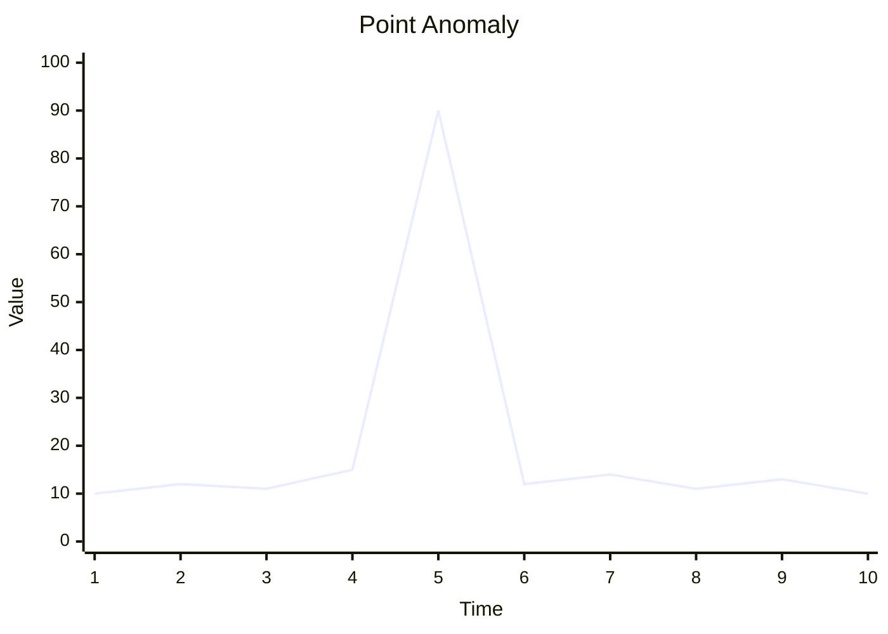
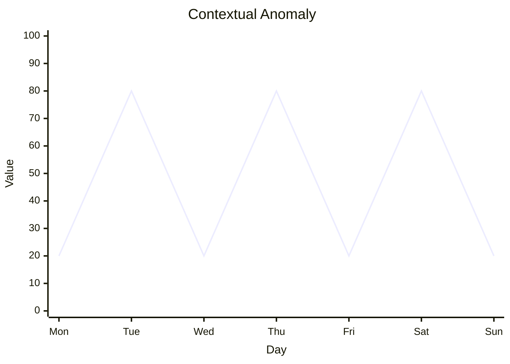
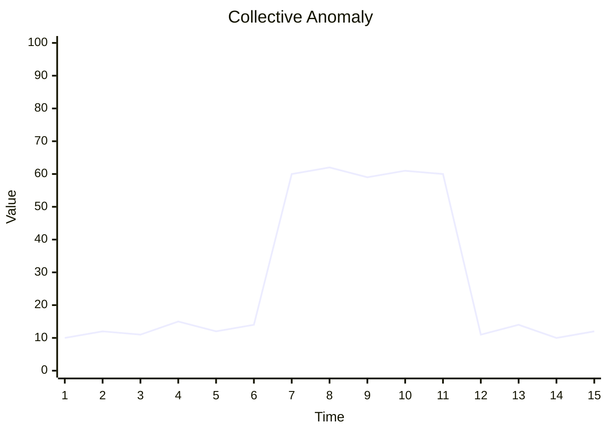
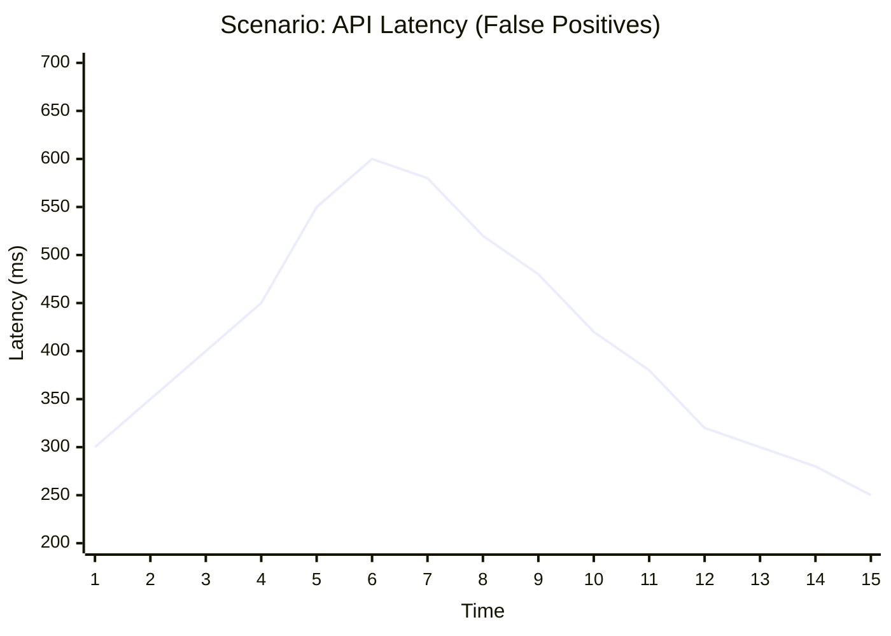
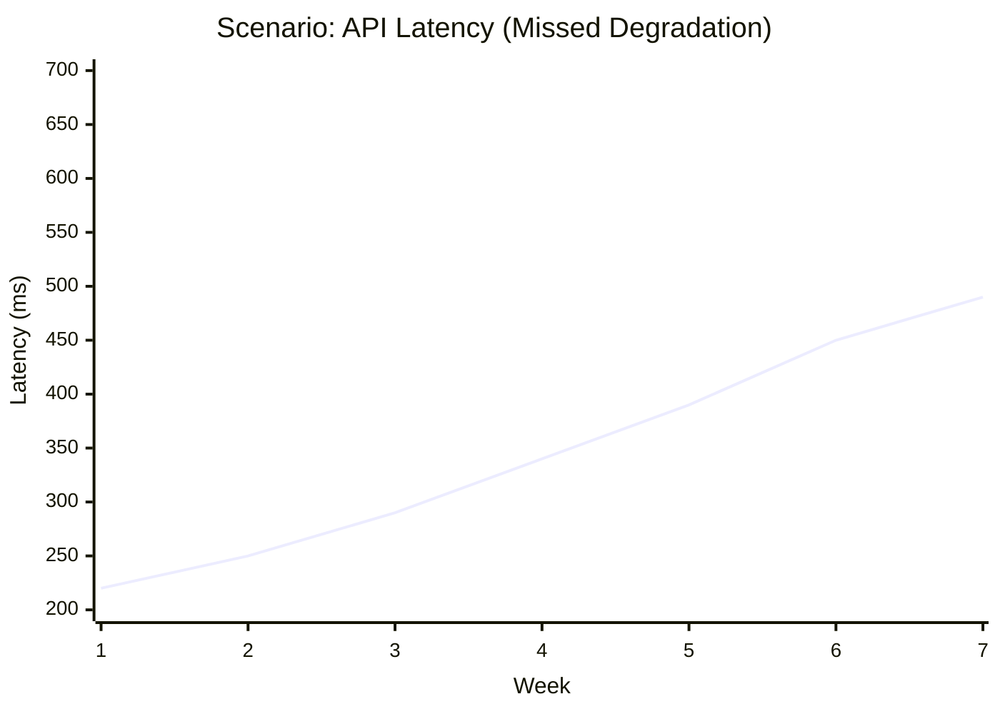
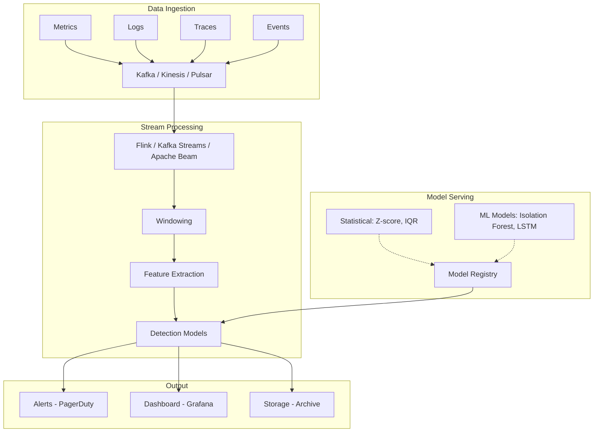

> **Discipline Track** | Complexity: `[COMPLEX]` | Time: 40-45 min

## Prerequisites

Before starting this module:
- [Module 6.1: AIOps Foundations](../module-6.1-aiops-foundations/) — Core AIOps concepts
- Basic statistics (mean, standard deviation, percentiles)
- Understanding of time series data
- Python basics (for exercises)

## What You'll Be Able to Do

After completing this module, you will be able to:

- **Implement anomaly detection models that identify unusual patterns in metrics, logs, and traces**
- **Design baseline learning algorithms that adapt to seasonal and trend-based operational patterns**
- **Configure alert thresholds using statistical methods that reduce false positives without missing real issues**
- **Evaluate anomaly detection approaches — statistical, ML-based, deep learning — against your data characteristics**

## Why This Module Matters

Traditional monitoring relies on static thresholds: "Alert if CPU > 80%." But what's normal? A 60% CPU spike at 3AM is concerning; the same spike during peak traffic is expected. Static thresholds generate noise during normal variations and miss gradual degradation.

Anomaly detection learns what "normal" looks like and alerts on deviations. It handles seasonality, trends, and the messy reality of production systems. This is the foundation of intelligent alerting—without it, you're either drowning in false positives or missing real problems.

## Did You Know?

- **Netflix's anomaly detection system** analyzes over 2 billion data points per minute across their streaming infrastructure
- **The first anomaly detection algorithms** date to the 1960s (Grubbs' test), but modern ML approaches enable real-time detection at scale
- **Facebook's Prophet** was open-sourced in 2017 and became the go-to tool for time series forecasting with seasonality
- **Concept drift**—when "normal" changes over time—is one of the hardest problems in anomaly detection and causes most production failures

## Understanding Anomalies

### Types of Anomalies


*A point anomaly represents a single, extreme outlier that deviates massively from the rest of the dataset.*


*A contextual anomaly occurs when a value might be normal in one context (e.g., peak hours) but is abnormal in another (e.g., occurring during a quiet weekend).*


*A collective anomaly is a sequence of values that are unusual together, even if the individual points might not be considered extreme outliers on their own.*

### When Static Thresholds Fail


*Problem 1: False Positives. If a static threshold is set at 500ms, natural traffic peaks will constantly trigger the alarm, even though this latency is completely normal for the service during peak hours.*


*Problem 2: Missed Degradation. With a static threshold of 500ms, a slow, steady degradation in performance creeps up over several weeks but never triggers the alert until it is too late.*

> **Stop and think**: Look at the "Missed Degradation" scenario. If you lowered the threshold to 300ms to catch the degradation earlier, what would happen to your alert volume during the normal daily peaks shown in the first scenario?

## Statistical Approaches

### Z-Score (Standard Deviation)

The simplest approach: how many standard deviations from the mean?

```python
import numpy as np

def zscore_anomaly(values, threshold=3):
    """
    Detect anomalies using Z-score.

    Z = (x - mean) / std

    Rule of thumb:
    - |Z| > 2: Unusual (5% of normal data)
    - |Z| > 3: Anomaly (0.3% of normal data)
    """
    mean = np.mean(values)
    std = np.std(values)

    anomalies = []
    for i, x in enumerate(values):
        z = (x - mean) / std
        if abs(z) > threshold:
            anomalies.append({
                'index': i,
                'value': x,
                'z_score': z
            })
    return anomalies

# Example
latencies = [100, 105, 98, 102, 95, 103, 500, 101, 99, 104]
anomalies = zscore_anomaly(latencies, threshold=3)
# Detects: 500ms as anomaly (Z ≈ 3.5)
```

**Limitations**: Assumes normal distribution, sensitive to outliers affecting mean/std.

> **Pause and predict**: A Z-score relies heavily on the mean. If a massive, prolonged outage drops your traffic to zero for three hours, how will this affect the mean, and what will happen to normal traffic alerts when the system suddenly recovers?

### Moving Average & Standard Deviation

Adapts to recent trends:

```python
import numpy as np
from collections import deque

class MovingAnomalyDetector:
    """
    Detect anomalies using moving statistics.

    Adapts to changing baselines while detecting
    sudden deviations.
    """
    def __init__(self, window_size=100, threshold=3):
        self.window = deque(maxlen=window_size)
        self.threshold = threshold

    def is_anomaly(self, value):
        if len(self.window) < 10:  # Need minimum data
            self.window.append(value)
            return False, 0

        mean = np.mean(self.window)
        std = np.std(self.window)

        # Prevent division by zero
        if std == 0:
            std = 0.001

        z = (value - mean) / std
        is_anomaly = abs(z) > self.threshold

        # Only add non-anomalies to window
        if not is_anomaly:
            self.window.append(value)

        return is_anomaly, z

# Usage
detector = MovingAnomalyDetector(window_size=100, threshold=3)
for latency in stream_of_latencies:
    is_anomaly, score = detector.is_anomaly(latency)
    if is_anomaly:
        alert(f"Anomaly detected: {latency}ms (score: {score})")
```

### Interquartile Range (IQR)

More robust to outliers than Z-score:

```python
import numpy as np

def iqr_anomaly(values, k=1.5):
    """
    Detect anomalies using IQR method.

    Bounds: [Q1 - k*IQR, Q3 + k*IQR]

    k=1.5: Standard outlier detection
    k=3.0: Extreme outlier detection
    """
    q1 = np.percentile(values, 25)
    q3 = np.percentile(values, 75)
    iqr = q3 - q1

    lower_bound = q1 - k * iqr
    upper_bound = q3 + k * iqr

    anomalies = []
    for i, x in enumerate(values):
        if x < lower_bound or x > upper_bound:
            anomalies.append({
                'index': i,
                'value': x,
                'bounds': (lower_bound, upper_bound)
            })
    return anomalies
```

## Handling Seasonality

Real systems have patterns: daily cycles, weekly cycles, monthly variations.

```mermaid
xychart-beta
    title "Daily Seasonality"
    x-axis "Hour" [00:00, 06:00, 12:00, 18:00, 23:59]
    y-axis "Requests/sec" 0 --> 1000
    line [100, 200, 900, 600, 150]
```
*Without seasonality awareness: 3AM traffic is considered normal, and peak hour traffic is considered normal. But if 3AM traffic suddenly spikes to peak levels, a static system won't catch it, whereas a seasonality-aware system will flag it as an anomaly!*

> **Stop and think**: Human operators naturally understand that a production system acts differently on a Tuesday afternoon than on a Sunday morning. How can a mathematical model learn this distinction without being explicitly programmed with complex calendar rules?

### Seasonal Decomposition

```python
from statsmodels.tsa.seasonal import seasonal_decompose
import pandas as pd
import numpy as np

def detect_with_seasonality(timeseries, period=24, threshold=3):
    """
    Detect anomalies accounting for seasonality.

    1. Decompose into trend + seasonal + residual
    2. Anomaly detection on residuals only
    """
    # Decompose
    decomposition = seasonal_decompose(
        timeseries,
        model='additive',
        period=period
    )

    # Detect anomalies in residuals
    residuals = decomposition.resid.dropna()
    mean = residuals.mean()
    std = residuals.std()

    z_scores = (residuals - mean) / std
    anomalies = abs(z_scores) > threshold

    return anomalies

# Example usage
# Daily data with hourly seasonality
df = pd.DataFrame({
    'timestamp': pd.date_range('2024-01-01', periods=168, freq='H'),
    'requests': daily_pattern_with_anomalies
})
df.set_index('timestamp', inplace=True)

anomalies = detect_with_seasonality(df['requests'], period=24)
```

### Prophet for Forecasting

Facebook's Prophet handles multiple seasonalities automatically:

```python
from prophet import Prophet
import pandas as pd

def prophet_anomaly_detection(df, sensitivity=0.95):
    """
    Use Prophet to detect anomalies.

    Prophet models:
    - Trend
    - Weekly seasonality
    - Daily seasonality
    - Holiday effects

    Anomalies = points outside confidence interval
    """
    # Prophet requires 'ds' (datestamp) and 'y' (value) columns
    model = Prophet(
        interval_width=sensitivity,  # Confidence interval
        daily_seasonality=True,
        weekly_seasonality=True
    )

    model.fit(df)

    # Predict on same data to get expected ranges
    forecast = model.predict(df)

    # Anomaly = actual outside confidence bounds
    df['yhat'] = forecast['yhat']
    df['yhat_lower'] = forecast['yhat_lower']
    df['yhat_upper'] = forecast['yhat_upper']

    df['anomaly'] = (df['y'] < df['yhat_lower']) | (df['y'] > df['yhat_upper'])

    return df

# Usage
df = pd.DataFrame({
    'ds': timestamps,
    'y': metric_values
})

results = prophet_anomaly_detection(df, sensitivity=0.99)
anomalies = results[results['anomaly']]
```

> **Pause and predict**: Statistical methods like IQR work great for single metrics (univariate data). If you have a service with 50 interdependent metrics (CPU, memory, threads, latency across different endpoints), why would drawing simple statistical boundaries around each metric individually fail to catch complex anomalies?

## Machine Learning Approaches

### Isolation Forest

Efficient for high-dimensional data:

```python
from sklearn.ensemble import IsolationForest
import numpy as np

def isolation_forest_detection(data, contamination=0.01):
    """
    Isolation Forest anomaly detection.

    Key insight: Anomalies are easier to isolate.
    - Normal points need many splits to isolate
    - Anomalies need few splits

    contamination: Expected fraction of anomalies
    """
    model = IsolationForest(
        contamination=contamination,
        random_state=42,
        n_estimators=100
    )

    # Fit and predict (-1 = anomaly, 1 = normal)
    predictions = model.fit_predict(data)

    # Get anomaly scores (lower = more anomalous)
    scores = model.score_samples(data)

    return predictions, scores

# Multi-dimensional example
# Detect anomalies considering latency AND error_rate together
data = np.column_stack([latencies, error_rates])
predictions, scores = isolation_forest_detection(data)

anomalies = data[predictions == -1]
```

### LSTM Autoencoders

For sequence patterns (time series):

```python
import numpy as np
from tensorflow.keras.models import Sequential, Model
from tensorflow.keras.layers import LSTM, Dense, RepeatVector, TimeDistributed

def create_lstm_autoencoder(sequence_length, n_features):
    """
    LSTM Autoencoder for time series anomaly detection.

    Architecture:
    1. Encoder: Compress sequence to latent representation
    2. Decoder: Reconstruct sequence from latent
    3. Anomaly = High reconstruction error
    """
    model = Sequential([
        # Encoder
        LSTM(64, activation='relu', input_shape=(sequence_length, n_features),
             return_sequences=True),
        LSTM(32, activation='relu', return_sequences=False),

        # Latent space
        RepeatVector(sequence_length),

        # Decoder
        LSTM(32, activation='relu', return_sequences=True),
        LSTM(64, activation='relu', return_sequences=True),
        TimeDistributed(Dense(n_features))
    ])

    model.compile(optimizer='adam', loss='mse')
    return model

def detect_anomalies(model, sequences, threshold_percentile=99):
    """
    Detect anomalies based on reconstruction error.
    """
    # Get reconstructions
    reconstructions = model.predict(sequences)

    # Calculate reconstruction error per sequence
    mse = np.mean(np.power(sequences - reconstructions, 2), axis=(1, 2))

    # Threshold based on training error distribution
    threshold = np.percentile(mse, threshold_percentile)

    anomalies = mse > threshold
    return anomalies, mse

# Usage
# Prepare sequences (sliding window)
sequence_length = 24  # e.g., 24 hours
sequences = create_sequences(timeseries_data, sequence_length)

# Train on normal data
model = create_lstm_autoencoder(sequence_length, n_features=1)
model.fit(sequences_train, sequences_train, epochs=50, batch_size=32)

# Detect
anomalies, scores = detect_anomalies(model, sequences_test)
```

> **Stop and think**: If your adaptive model constantly updates its baseline to accept recent data as the "new normal", what happens if your application introduces a slow, persistent memory leak over three months? How can you prevent the model from learning to ignore the leak?

## Handling Concept Drift

"Normal" changes over time. Traffic grows, code changes, user behavior evolves.

```mermaid
xychart-beta
    title "Concept Drift"
    x-axis "Month" [Jan, Feb, Mar, Apr, May, Jun]
    y-axis "Latency" 0 --> 100
    line [20, 22, 25, 45, 80, 85]
```
*WITHOUT drift handling: May traffic is flagged as anomalous because it deviates from the January baseline. WITH drift handling: The model adapts to the gradual drift, establishing a new normal, and only sudden changes will trigger alerts.*

### Adaptive Detection

```python
class AdaptiveAnomalyDetector:
    """
    Anomaly detector that adapts to concept drift.

    Strategies:
    1. Sliding window - only recent data matters
    2. Exponential decay - older data weighted less
    3. Explicit retraining - periodic model updates
    """
    def __init__(self,
                 window_days=7,
                 retrain_interval_hours=24,
                 threshold=3):
        self.window_days = window_days
        self.retrain_interval = retrain_interval_hours * 3600
        self.threshold = threshold
        self.last_retrain = None
        self.model = None
        self.data_buffer = []

    def maybe_retrain(self, current_time):
        """Retrain if enough time has passed."""
        if self.last_retrain is None:
            return True
        return (current_time - self.last_retrain) > self.retrain_interval

    def train(self, data, timestamp):
        """Train on recent data only."""
        # Filter to window
        cutoff = timestamp - (self.window_days * 86400)
        recent_data = [d for d in data if d['timestamp'] > cutoff]

        values = [d['value'] for d in recent_data]
        self.mean = np.mean(values)
        self.std = np.std(values)
        self.last_retrain = timestamp

    def is_anomaly(self, value, timestamp):
        """Check if value is anomalous, retraining if needed."""
        if self.maybe_retrain(timestamp):
            self.train(self.data_buffer, timestamp)

        if self.std == 0:
            return False, 0

        z = (value - self.mean) / self.std
        is_anomaly = abs(z) > self.threshold

        # Store for future training
        self.data_buffer.append({
            'value': value,
            'timestamp': timestamp,
            'anomaly': is_anomaly
        })

        # Trim old data
        cutoff = timestamp - (self.window_days * 2 * 86400)
        self.data_buffer = [
            d for d in self.data_buffer
            if d['timestamp'] > cutoff
        ]

        return is_anomaly, z
```

## Real-Time Detection Architecture



## Common Mistakes

| Mistake | Problem | Solution |
|---------|---------|----------|
| Ignoring seasonality | False positives during normal patterns | Use Prophet or seasonal decomposition |
| Training on anomalies | Model learns anomalies as normal | Filter anomalies from training data |
| Single threshold for all | Different metrics have different profiles | Per-metric or per-service thresholds |
| No concept drift handling | Model becomes stale, accuracy drops | Periodic retraining, sliding windows |
| Alerting on all anomalies | Not all anomalies matter | Correlation, severity scoring |
| Univariate only | Misses multi-variate patterns | Isolation Forest, multi-variate LSTM |

## Quiz

<details>
<summary>1. You've configured a static alert that triggers whenever database CPU utilization exceeds 85%. During your company's highly publicized Black Friday sale, CPU utilization hovers around 90% for six hours, triggering hundreds of paging alerts. The database performance remains completely stable and responsive throughout. Why did this static threshold fail your team?</summary>

**Answer**: This scenario perfectly illustrates the rigidity of static thresholds, which fail to account for context and seasonality. The static threshold was completely unaware that this was a planned, high-traffic event where elevated CPU is not just expected, but represents normal, healthy operation. Because the threshold cannot dynamically adapt to this "new normal" of Black Friday traffic, it generated severe alert fatigue (hundreds of false positives) while the system was actually functioning perfectly. An ML-based anomaly detection system would have analyzed historical trends or seasonal expectations, identified the 90% CPU as proportional to the corresponding massive increase in checkout requests, and suppressed the alert.
</details>

<details>
<summary>2. Your team needs to implement anomaly detection across 50 different microservices, analyzing a combined total of 1,200 independent metrics (CPU, memory, request rates, error rates) per minute. The primary goal is to identify points in time where a combination of these metrics behaves unusually, without needing to learn complex long-term sequential patterns. Which machine learning approach is most appropriate?</summary>

**Answer**: Isolation Forest is the ideal algorithm for this specific scenario. It excels at processing high-dimensional data, meaning it can easily evaluate the 1,200 independent metrics simultaneously to find multivariate point anomalies without excessive computational overhead. Because your goal is to identify points in time with unusual combinations of metrics rather than analyzing complex, sequential time-series patterns, the lightweight isolation mechanism will be much faster and easier to train than a deep learning approach. In contrast, an LSTM Autoencoder would be overkill here, requiring significantly more compute resources and training time to learn temporal sequences that you explicitly do not need.
</details>

<details>
<summary>3. Six months ago, your anomaly detection model perfectly identified unusual latency spikes in your checkout service. Recently, after a series of successful feature launches and organic user growth, the model has started sending false alerts every afternoon during normal peak hours. What phenomenon is occurring, and how should your system adapt?</summary>

**Answer**: Your anomaly detection system is experiencing "concept drift", which occurs when the fundamental definition of "normal" behavior changes over time due to system evolution or user growth. The model is still strictly evaluating traffic against the historical baseline from six months ago, failing to recognize that the recent feature launches have legitimately and permanently shifted the baseline latency and traffic volume upward. To resolve this, you must implement adaptive baseline techniques, such as sliding windows or periodic retraining (e.g., exponential decay), so the model continuously learns and accepts the new, heavier traffic patterns as the current normal state. By ensuring the model updates its definition of normal on a regular cadence, you will eliminate these false positives while retaining the ability to detect genuine, sudden deviations.
</details>

<details>
<summary>4. Your e-commerce platform sees a massive spike in traffic every morning at 9:00 AM when a daily flash sale begins. A basic Z-score anomaly detector constantly flags this 9:00 AM spike as a critical anomaly because it deviates significantly from the daily mean. What specific techniques should you implement to teach the detector that this spike is expected?</summary>

**Answer**: A basic Z-score detector fails here because it calculates a global mean and standard deviation, completely ignoring the temporal context of the data. To fix this, you need to implement seasonality awareness by utilizing algorithms like Facebook's Prophet or performing seasonal decomposition on the time series. These techniques separate the repeating daily patterns (the 9:00 AM spike) from the underlying trend and residual noise. By doing so, the anomaly detector will evaluate the 9:00 AM traffic against historical 9:00 AM traffic rather than the daily average, correctly identifying the flash sale spike as normal behavior and only alerting if the spike is missing or disproportionately large.
</details>

## Hands-On Exercise: Build an Anomaly Detector

Build a production-ready anomaly detector with seasonality awareness:

### Setup

```bash
mkdir anomaly-detector && cd anomaly-detector
python -m venv venv
source venv/bin/activate
pip install numpy pandas scikit-learn matplotlib
```

### Step 1: Generate Synthetic Data with Seasonality

```python
# generate_data.py
import numpy as np
import pandas as pd
from datetime import datetime, timedelta

def generate_realistic_metrics(days=30, points_per_day=24):
    """
    Generate realistic server metrics with:
    - Daily seasonality (business hours)
    - Weekly seasonality (weekdays vs weekends)
    - Trend (gradual growth)
    - Noise
    - Injected anomalies
    """
    np.random.seed(42)

    total_points = days * points_per_day
    timestamps = [
        datetime(2024, 1, 1) + timedelta(hours=i)
        for i in range(total_points)
    ]

    values = []
    anomaly_labels = []

    for i, ts in enumerate(timestamps):
        # Base value
        base = 100

        # Daily seasonality (peak at 14:00, low at 03:00)
        hour = ts.hour
        daily_factor = 50 * np.sin((hour - 6) * np.pi / 12)

        # Weekly seasonality (lower on weekends)
        weekday = ts.weekday()
        weekly_factor = -30 if weekday >= 5 else 0

        # Trend (1% growth per week)
        trend = i * 0.01

        # Noise
        noise = np.random.normal(0, 5)

        value = base + daily_factor + weekly_factor + trend + noise
        is_anomaly = False

        # Inject anomalies (2% of points)
        if np.random.random() < 0.02:
            # Spike anomaly
            value += np.random.choice([-1, 1]) * np.random.uniform(50, 100)
            is_anomaly = True

        values.append(max(0, value))  # No negative values
        anomaly_labels.append(is_anomaly)

    return pd.DataFrame({
        'timestamp': timestamps,
        'value': values,
        'is_anomaly': anomaly_labels
    })

if __name__ == "__main__":
    df = generate_realistic_metrics()
    df.to_csv('metrics.csv', index=False)
    print(f"Generated {len(df)} data points with {df['is_anomaly'].sum()} anomalies")
```

### Step 2: Build the Detector

```python
# detector.py
import numpy as np
import pandas as pd
from collections import deque

class SeasonalAnomalyDetector:
    """
    Anomaly detector with:
    - Hourly seasonality awareness
    - Adaptive baseline (sliding window)
    - Multiple detection methods
    """

    def __init__(self,
                 window_hours=168,  # 1 week
                 zscore_threshold=3,
                 iqr_multiplier=1.5):
        self.window_hours = window_hours
        self.zscore_threshold = zscore_threshold
        self.iqr_multiplier = iqr_multiplier

        # Store data by hour for seasonality
        self.hourly_data = {h: deque(maxlen=window_hours // 24) for h in range(24)}

    def _get_hourly_stats(self, hour):
        """Get statistics for specific hour."""
        data = list(self.hourly_data[hour])
        if len(data) < 3:
            return None, None
        return np.mean(data), np.std(data)

    def _zscore(self, value, mean, std):
        """Calculate Z-score."""
        if std == 0:
            return 0
        return (value - mean) / std

    def _iqr_bounds(self, hour):
        """Calculate IQR bounds for hour."""
        data = list(self.hourly_data[hour])
        if len(data) < 4:
            return None, None
        q1 = np.percentile(data, 25)
        q3 = np.percentile(data, 75)
        iqr = q3 - q1
        return q1 - self.iqr_multiplier * iqr, q3 + self.iqr_multiplier * iqr

    def detect(self, timestamp, value):
        """
        Detect if value is anomalous.

        Returns: (is_anomaly, score, reason)
        """
        hour = timestamp.hour

        # Get seasonal statistics
        mean, std = self._get_hourly_stats(hour)
        lower, upper = self._iqr_bounds(hour)

        is_anomaly = False
        score = 0
        reasons = []

        # Z-score check (if enough data)
        if mean is not None:
            z = self._zscore(value, mean, std)
            score = abs(z)
            if abs(z) > self.zscore_threshold:
                is_anomaly = True
                reasons.append(f"Z-score: {z:.2f}")

        # IQR check (if enough data)
        if lower is not None:
            if value < lower or value > upper:
                is_anomaly = True
                reasons.append(f"Outside IQR: [{lower:.1f}, {upper:.1f}]")

        # Update model (only with non-anomalies to avoid pollution)
        if not is_anomaly:
            self.hourly_data[hour].append(value)

        return is_anomaly, score, "; ".join(reasons) if reasons else "Normal"

    def warmup(self, df):
        """Warm up detector with historical data."""
        for _, row in df.iterrows():
            hour = row['timestamp'].hour
            self.hourly_data[hour].append(row['value'])

# Run detection
if __name__ == "__main__":
    df = pd.read_csv('metrics.csv', parse_dates=['timestamp'])

    # Split: first 2 weeks for warmup, rest for testing
    warmup_df = df[df['timestamp'] < df['timestamp'].min() + pd.Timedelta(days=14)]
    test_df = df[df['timestamp'] >= df['timestamp'].min() + pd.Timedelta(days=14)]

    detector = SeasonalAnomalyDetector()
    detector.warmup(warmup_df)

    # Test
    results = []
    for _, row in test_df.iterrows():
        is_anomaly, score, reason = detector.detect(row['timestamp'], row['value'])
        results.append({
            'timestamp': row['timestamp'],
            'value': row['value'],
            'actual_anomaly': row['is_anomaly'],
            'detected_anomaly': is_anomaly,
            'score': score,
            'reason': reason
        })

    results_df = pd.DataFrame(results)

    # Calculate metrics
    true_positives = ((results_df['actual_anomaly'] == True) &
                      (results_df['detected_anomaly'] == True)).sum()
    false_positives = ((results_df['actual_anomaly'] == False) &
                       (results_df['detected_anomaly'] == True)).sum()
    false_negatives = ((results_df['actual_anomaly'] == True) &
                       (results_df['detected_anomaly'] == False)).sum()

    precision = true_positives / (true_positives + false_positives) if (true_positives + false_positives) > 0 else 0
    recall = true_positives / (true_positives + false_negatives) if (true_positives + false_negatives) > 0 else 0

    print(f"Results:")
    print(f"  True Positives: {true_positives}")
    print(f"  False Positives: {false_positives}")
    print(f"  False Negatives: {false_negatives}")
    print(f"  Precision: {precision:.2%}")
    print(f"  Recall: {recall:.2%}")

    results_df.to_csv('detection_results.csv', index=False)
```

### Success Criteria

You've completed this exercise when:
- [ ] Generated synthetic metrics with seasonality
- [ ] Built detector with hourly baseline awareness
- [ ] Achieved > 50% precision (reduce false positives)
- [ ] Achieved > 60% recall (catch real anomalies)
- [ ] Understood trade-offs between precision and recall

## Key Takeaways

1. **Static thresholds don't scale**: Learn dynamic baselines instead
2. **Seasonality matters**: Compare to same hour/day, not global average
3. **Multiple methods**: Combine Z-score, IQR for robustness
4. **Adapt to drift**: Sliding windows, periodic retraining
5. **Start simple**: Statistical methods before ML; ML only when needed
6. **Precision vs. recall**: Optimize for your use case (alert fatigue vs. missed incidents)

## Further Reading

- [Facebook Prophet Paper](https://peerj.com/preprints/3190/) — Time series forecasting
- [Isolation Forest Paper](https://cs.nju.edu.cn/zhouzh/zhouzh.files/publication/icdm08b.pdf) — Original algorithm
- [Netflix Anomaly Detection](https://netflixtechblog.com/rad-outlier-detection-on-big-data-d6b0ff32fb44) — Scale challenges
- [Luminaire](https://github.com/zillow/luminaire) — Zillow's anomaly detection library

## Summary

Anomaly detection is the foundation of intelligent alerting. By learning what "normal" looks like—accounting for seasonality, trends, and drift—you can detect problems without predefined thresholds. Start with statistical methods (Z-score, IQR), add seasonality awareness, and only graduate to ML when patterns require it.

The goal isn't zero false positives—it's actionable alerts that surface real problems early.

---

## Next Module

Continue to [Module 6.3: Event Correlation](../module-6.3-event-correlation/) to learn how to group thousands of alerts into actionable incidents.