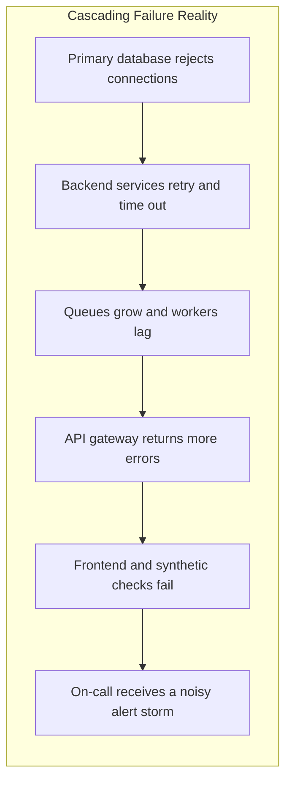
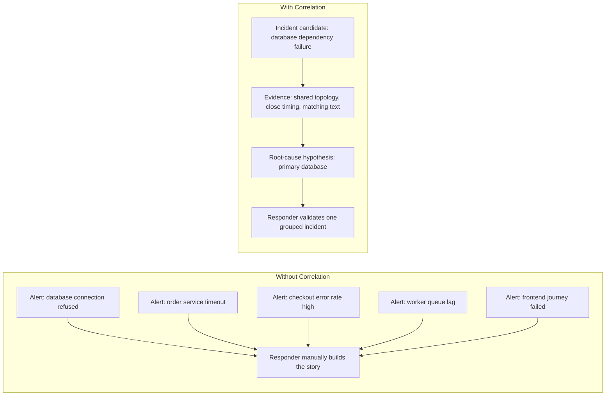
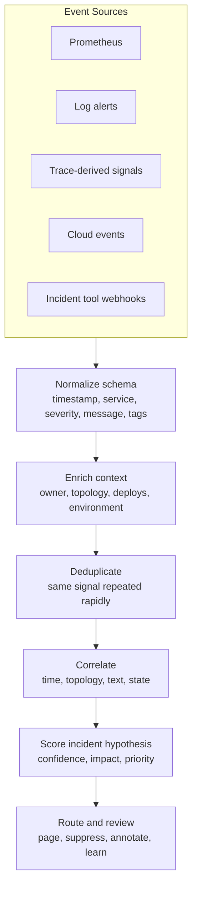
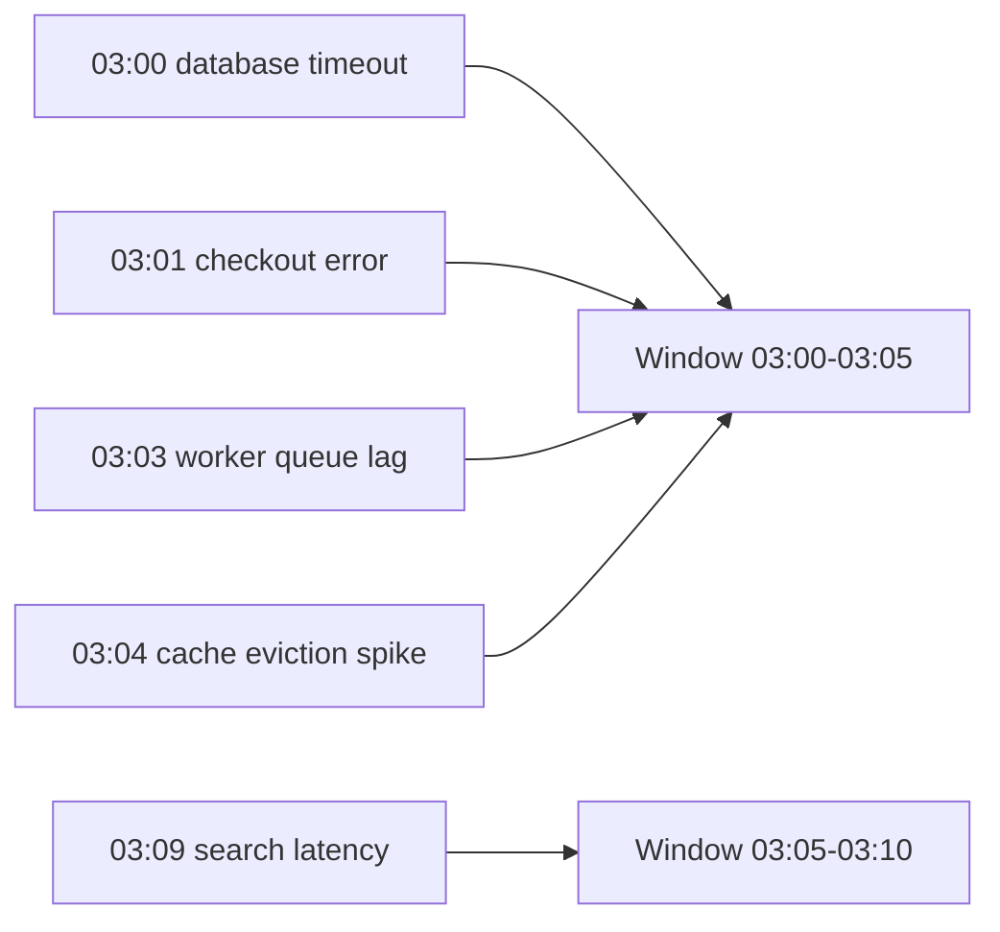
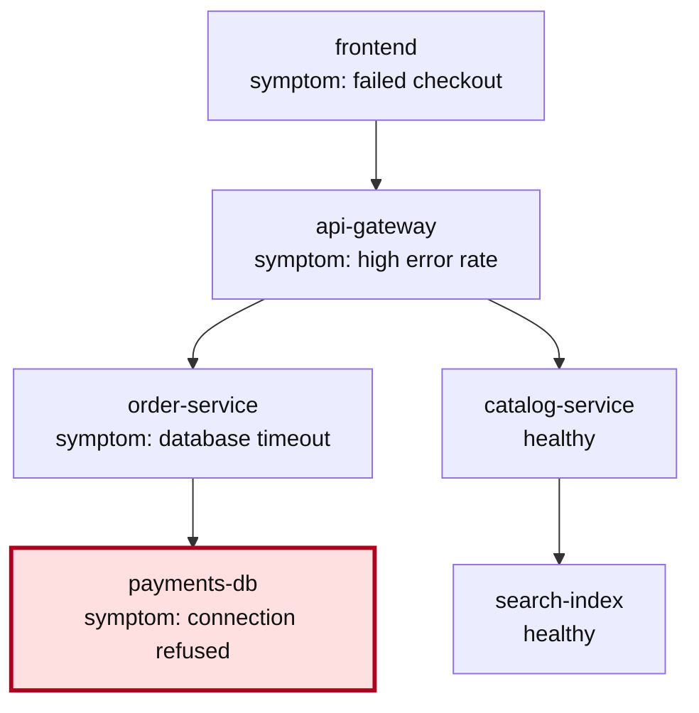
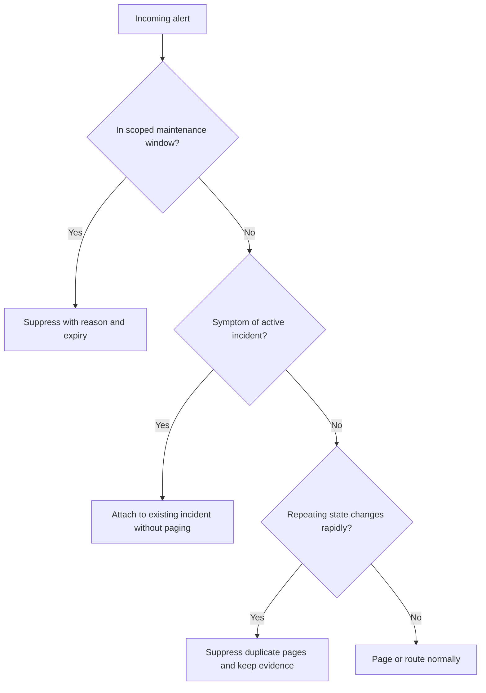
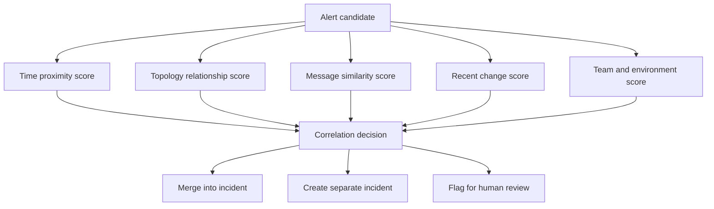
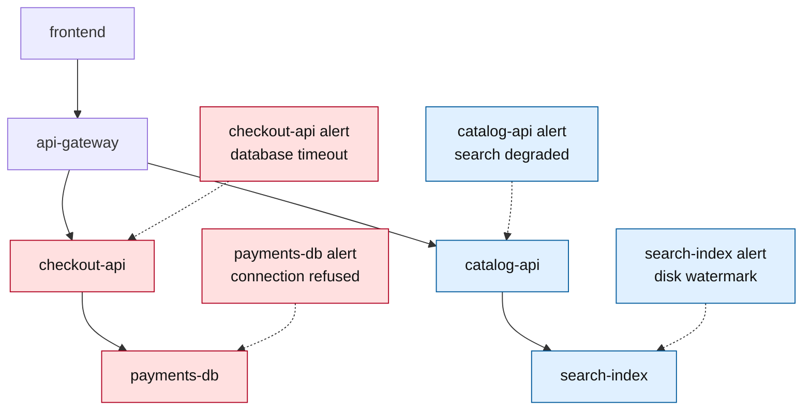

> **Discipline Track** | Complexity: `[COMPLEX]` | Time: 60-75 min

## Prerequisites

Before starting this module, you should be comfortable reading alert payloads, interpreting service dependency diagrams, and reasoning about cascading failures in distributed systems.

- [Module 6.1: AIOps Foundations](../module-6.1-aiops-foundations/) — why AIOps systems combine automation, operational context, and human review
- [Module 6.2: Anomaly Detection](../module-6.2-anomaly-detection/) — how unusual metric behavior becomes an alert candidate
- Understanding of service dependencies, upstream and downstream components, and incident response workflows
- Basic graph concepts such as nodes, edges, traversal, connected components, and cycles

## What You'll Be Able to Do

After completing this module, you will be able to:

- **Design** an event correlation pipeline that turns noisy alerts into incident candidates without hiding independent failures.
- **Implement** deduplication, time-window grouping, topology-aware grouping, and text-similarity checks using runnable Python examples.
- **Debug** incorrect correlations by distinguishing duplicate alerts, symptoms, shared-dependency failures, unrelated coincident failures, and biased training data.
- **Evaluate** correlation quality with compression, precision, recall, root-cause accuracy, and false-suppression review instead of relying on alert-count reduction alone.
- **Adapt** a correlation strategy to real operational constraints such as stale topology, skewed alert sources, maintenance windows, and team ownership boundaries.

## Why This Module Matters

At 03:08, a primary database starts rejecting connections after a storage controller stalls. The database alert is only the first signal. Seconds later, the order service reports connection failures, the user service reports latency, the API gateway reports elevated errors, the frontend reports failed checkouts, and the synthetic monitor reports the customer journey as broken. The on-call engineer does not experience one clean failure; they experience a screen full of competing claims about what is broken.

Event correlation is the discipline of converting that screen full of symptoms into a smaller set of incident hypotheses. A weak correlator says, "many alerts happened near the same time." A useful correlator says, "these alerts are probably symptoms of the same database dependency failure, these two are unrelated, and this low-confidence group needs human review." That difference matters because every extra page consumes attention, and every incorrectly suppressed alert can hide a second outage.

The senior skill in event correlation is not writing a clever grouping algorithm. The senior skill is deciding what evidence is strong enough to merge alerts, what evidence is weak enough to keep them separate, and how to measure whether the system is helping responders make better decisions. AIOps earns trust when it reduces noise while preserving the operational truth that failures can be concurrent, messy, and partially observed.

A practical analogy is a hospital triage desk during a major event. Ten patients may arrive with related symptoms, but the triage nurse should not assume every complaint has the same cause just because the arrivals are close together. The nurse combines time, symptoms, location, medical history, and severity. Event correlation does the same with alert time, service topology, message text, metadata, deployment context, and prior incidents.

## The Alert Storm Problem

Alert storms happen when one underlying fault causes many downstream systems to report their own local symptoms. In a microservices estate, every service is both a worker and an observer. When a dependency slows down, callers see timeouts, queues grow, retries amplify load, dashboards cross thresholds, and synthetic checks begin to fail. Each alert may be technically true, but the collection is not automatically useful.



The first mistake teams make is treating the alert storm as a notification-volume problem only. Volume is part of the pain, but the deeper problem is hypothesis management. The responder needs to know which alerts belong together, which alert represents the best starting point, which alerts are duplicates, and which signals should remain separate because they may represent a second incident.



Notice the word "candidate." Correlation should produce a claim with evidence and confidence, not an unquestionable verdict. A reliable system keeps enough detail for a responder to inspect the raw alerts, reverse a bad merge, and understand why the grouping happened. Hidden reasoning is dangerous because it prevents teams from improving the algorithm after a miss.

> **Active learning prompt:** Imagine the database alert arrives three minutes after the downstream timeout alerts because the database monitor polls slowly. Would a pure "first alert wins" root-cause rule still work? Explain what evidence you would use instead before reading the next section.

## Correlation Pipeline Anatomy

A production correlation pipeline is a sequence of narrowing and enrichment steps. The exact product names vary, but the shape is stable: normalize incoming events, remove true duplicates, enrich alerts with service and topology context, group related events, score the incident hypothesis, and route the result to humans or automation. Skipping a step usually pushes complexity into a later stage where it is harder to debug.



Normalization gives every alert the same basic shape. Without it, one source may call the affected component `service`, another may call it `app`, and a third may hide it in a label such as `kubernetes_namespace`. Correlation built on inconsistent metadata will either miss obvious relationships or invent relationships from misleading text. Good normalization is unglamorous, but it is the foundation that makes later intelligence possible.

Enrichment adds operational context that the alert source often does not know. A metrics rule may know that `checkout-api` has a high error rate, but it may not know that `checkout-api` depends on `payments-db`, belongs to the commerce team, was deployed eight minutes ago, and handles customer-facing traffic. Correlation improves when the system can combine raw symptoms with service ownership, dependency direction, environment, and recent change events.

Deduplication removes repeated copies of the same alert before grouping. This is not the same as correlation. If the same service emits the same "connection refused" alert every ten seconds, deduplication should collapse those repeats while preserving occurrence count. Correlation then decides whether that deduplicated alert is related to other alerts from different services.

Correlation produces incident candidates. A candidate should contain the grouped alerts, affected services, probable root cause, grouping evidence, confidence score, and any suppressions applied. The output should be inspectable because responders need to trust the result under pressure. When correlation fails, the incident record should contain enough evidence to tune rules, retrain models, or repair missing metadata.

## Strategy One: Time-Based Correlation

Time-based correlation groups alerts that occur within a window. It is the simplest useful strategy because cascading failures often produce symptoms close together. It also provides a fallback when topology or text metadata is missing. The danger is that time is only weak evidence. Two unrelated incidents can happen in the same five-minute period, and one slow-polling monitor can report the root signal after symptoms appear.



A time window is best treated as a candidate filter, not a final decision. It can quickly reduce the search space from "all alerts today" to "alerts that might be related to this one." A second strategy should then ask whether the services are connected, whether the messages describe similar failure modes, or whether a deployment or maintenance event explains the cluster.

The following worked example shows a minimal time-window correlator. It is intentionally small so you can inspect the behavior. It groups alerts by gaps between consecutive alert timestamps, which means a continuous stream can keep an incident open even if the total incident duration is longer than the window.

```python
from datetime import datetime, timedelta


class TimeWindowCorrelator:
    """Group alerts when each next alert arrives within the configured gap."""

    def __init__(self, window_seconds=300):
        self.window = timedelta(seconds=window_seconds)
        self.incidents = []
        self.current = None

    def correlate(self, alert):
        timestamp = alert["timestamp"]

        if self.current is None:
            self.current = self._new_incident(timestamp)

        if timestamp - self.current["last_seen"] > self.window:
            self.incidents.append(self.current)
            self.current = self._new_incident(timestamp)

        self.current["alerts"].append(alert)
        self.current["services"].add(alert["service"])
        self.current["last_seen"] = timestamp
        return self.current["id"]

    def _new_incident(self, timestamp):
        return {
            "id": len(self.incidents) + 1,
            "first_seen": timestamp,
            "last_seen": timestamp,
            "alerts": [],
            "services": set(),
        }

    def finish(self):
        if self.current is not None:
            self.incidents.append(self.current)
            self.current = None
        return self.incidents


if __name__ == "__main__":
    alerts = [
        {"timestamp": datetime(2026, 4, 26, 3, 0), "service": "payments-db"},
        {"timestamp": datetime(2026, 4, 26, 3, 1), "service": "checkout-api"},
        {"timestamp": datetime(2026, 4, 26, 3, 4), "service": "frontend"},
        {"timestamp": datetime(2026, 4, 26, 3, 12), "service": "search-api"},
    ]

    correlator = TimeWindowCorrelator(window_seconds=300)
    for alert in alerts:
        correlator.correlate(alert)

    for incident in correlator.finish():
        print(incident["id"], sorted(incident["services"]))
```

A five-minute gap groups the first three alerts and separates the fourth. That might be useful, but it can also be wrong. If the frontend alert is caused by a separate CDN problem, time alone has over-grouped. If the search alert is a late symptom of the original database failure, time alone has under-grouped. This is why time correlation should be combined with stronger evidence.

> **Active learning prompt:** In the code above, the window is measured from the previous alert, not from the first alert in the incident. What kind of long-running failure could keep extending the group too aggressively, and how would you cap that behavior?

## Strategy Two: Topology-Based Correlation

Topology-based correlation uses dependency relationships to ask whether alerting services are structurally connected. If the frontend depends on the API gateway, the API gateway depends on the order service, and the order service depends on the database, then simultaneous alerts across that chain are stronger evidence than simultaneous alerts from unrelated systems. Topology turns "these alerts happened together" into "these alerts could plausibly be symptoms of the same dependency failure."



The direction of the edge matters. If service A depends on service B, then a failure in B can cause symptoms in A. In diagrams, teams often draw requests from caller to dependency, but root-cause reasoning moves in the opposite direction: symptoms propagate upstream toward callers. A topology-aware correlator should be explicit about this direction so it does not mistake a noisy caller for the cause of a dependency failure.

A topology graph can come from service catalogs, tracing systems, Kubernetes labels, API gateway routes, infrastructure-as-code, or manual ownership maps. None of these sources is perfect. Traces may miss cold paths, service catalogs may be stale, and manual maps may omit third-party dependencies. A good correlator records topology freshness and confidence so a responder can tell whether a grouping rests on strong or weak structural evidence.

The next example adds topology reasoning to the time window. It finds services connected to an alerting service in both directions, then merges the alert into a recent incident if any existing incident service is connected. This is still a teaching implementation, but it demonstrates the core mechanism used by larger systems.

```python
from datetime import datetime, timedelta


DEPENDENCY_GRAPH = {
    "frontend": ["api-gateway"],
    "api-gateway": ["order-service", "catalog-service"],
    "order-service": ["payments-db", "kafka"],
    "catalog-service": ["search-index"],
    "payments-db": [],
    "kafka": [],
    "search-index": [],
}


class TopologyCorrelator:
    """Group alerts when their services are connected in the dependency graph."""

    def __init__(self, graph, window_seconds=300):
        self.graph = graph
        self.window = timedelta(seconds=window_seconds)
        self.incidents = {}
        self.next_id = 1

    def connected_services(self, service):
        connected = set()

        def visit(current):
            if current in connected:
                return
            connected.add(current)

            for dependency in self.graph.get(current, []):
                visit(dependency)

            for candidate, dependencies in self.graph.items():
                if current in dependencies:
                    visit(candidate)

        visit(service)
        return connected

    def dependency_depth(self, service):
        def depth(current, seen):
            if current in seen:
                return 0
            dependencies = self.graph.get(current, [])
            if not dependencies:
                return 1
            return 1 + max(depth(dep, seen | {current}) for dep in dependencies)

        return depth(service, set())

    def probable_root(self, services):
        known_services = [service for service in services if service in self.graph]
        if not known_services:
            return None
        return max(known_services, key=self.dependency_depth)

    def correlate(self, alert):
        service = alert["service"]
        timestamp = alert["timestamp"]
        connected = self.connected_services(service)
        match = None

        for incident in self.incidents.values():
            if timestamp - incident["last_seen"] > self.window:
                continue
            if incident["services"] & connected:
                match = incident
                break

        if match is None:
            match = {
                "id": self.next_id,
                "first_seen": timestamp,
                "last_seen": timestamp,
                "alerts": [],
                "services": set(),
                "root_cause": None,
            }
            self.incidents[self.next_id] = match
            self.next_id += 1

        match["alerts"].append(alert)
        match["services"].add(service)
        match["last_seen"] = timestamp
        match["root_cause"] = self.probable_root(match["services"])
        return match["id"], match["root_cause"]


if __name__ == "__main__":
    stream = [
        {"timestamp": datetime(2026, 4, 26, 3, 0), "service": "payments-db"},
        {"timestamp": datetime(2026, 4, 26, 3, 1), "service": "order-service"},
        {"timestamp": datetime(2026, 4, 26, 3, 2), "service": "api-gateway"},
        {"timestamp": datetime(2026, 4, 26, 3, 3), "service": "frontend"},
    ]

    correlator = TopologyCorrelator(DEPENDENCY_GRAPH)
    for alert in stream:
        incident_id, root = correlator.correlate(alert)
        print(f"incident={incident_id} service={alert['service']} probable_root={root}")
```

The root-cause heuristic in this example chooses the deepest alerting service in the dependency graph. That works for many dependency failures because leaf infrastructure failures create symptoms in callers. It is not universal. A bad frontend deployment can overload the API gateway; a retry storm in a caller can harm a dependency; a shared network issue can make unrelated branches fail. The heuristic should be treated as a hypothesis and combined with other signals such as deployment history, saturation metrics, and first-failure timing.

> **Active learning prompt:** Your graph contains `checkout-api -> fraud-vendor`, but the third-party fraud service does not emit alerts into your system. How could the correlator still represent that dependency, and what evidence would it need before blaming the external service?

## Strategy Three: Text and Entity Correlation

Text correlation groups alerts whose messages describe similar failures. It is valuable when topology is incomplete, when alerts come from systems not represented in the service catalog, or when several tools use different labels for the same incident. It is also risky because alert text often contains dynamic identifiers, timestamps, pod names, request IDs, and hostnames that can make similar messages look different.

Text correlation should start with normalization. Lowercase the message, remove volatile tokens, extract stable entities, and compare the remaining signal. A simple token-overlap approach can teach the mechanism before you introduce embeddings or model-based similarity. In production, teams may use TF-IDF, sentence embeddings, or vendor-specific event intelligence, but the same principle applies: compare meaningful failure semantics rather than raw strings.

```python
import re


VOLATILE_PATTERNS = [
    r"\b[a-f0-9]{8,}\b",
    r"\brequest_id=[^\s]+\b",
    r"\btrace_id=[^\s]+\b",
    r"\b\d{2}:\d{2}:\d{2}\b",
    r"\bpod-[a-z0-9-]+\b",
]


def normalize_message(message):
    normalized = message.lower()
    for pattern in VOLATILE_PATTERNS:
        normalized = re.sub(pattern, "<volatile>", normalized)
    normalized = re.sub(r"[^a-z0-9_<>\s-]", " ", normalized)
    normalized = re.sub(r"\s+", " ", normalized).strip()
    return normalized


def token_similarity(left, right):
    left_tokens = set(normalize_message(left).split())
    right_tokens = set(normalize_message(right).split())

    if not left_tokens or not right_tokens:
        return 0.0

    overlap = left_tokens & right_tokens
    union = left_tokens | right_tokens
    return len(overlap) / len(union)


if __name__ == "__main__":
    first = "request_id=abc123 Connection to payments-db refused at 03:00:01"
    second = "request_id=def456 connection to payments-db refused at 03:00:09"
    third = "search-index disk watermark exceeded"

    print(round(token_similarity(first, second), 2))
    print(round(token_similarity(first, third), 2))
```

Text similarity can catch related events even when service metadata is missing, but it should not override stronger contradictory evidence. Two alerts that both say "timeout" may describe unrelated systems. Two related alerts may use completely different words, such as "connection refused" from a caller and "max connections exceeded" from a database. Text is one evidence source, not a replacement for topology or metrics.

Text correlation also introduces fairness and bias concerns in operational data. If the historical alert corpus mostly contains database outages, a model may over-associate ambiguous timeout messages with database incidents. If one team emits rich structured alerts and another emits sparse messages, the model may appear more accurate for the well-instrumented team. That is algorithmic bias in an operations context: the system's confidence reflects data quality and frequency, not necessarily truth.

## Deduplication Before Correlation

Deduplication removes repeated copies of the same alert so the correlation engine does not count volume as independent evidence. A service that emits one identical alert every few seconds should not become more "root-cause-like" merely because it is noisy. The deduplicator should preserve the count and the last-seen time because those details are useful for severity and escalation, but the repeated copies should not flood grouping logic.

A fingerprint is the stable identity of an alert. It usually includes service, alert name, normalized message, environment, region, and sometimes severity. It should not include volatile values such as request IDs or exact timestamps. A bad fingerprint can either under-dedupe, leaving duplicates in the stream, or over-dedupe, merging distinct failures that happen to share a generic message.

```python
from datetime import datetime, timedelta
import re


def stable_message(message):
    message = message.lower()
    message = re.sub(r"\brequest_id=[^\s]+\b", "request_id=<volatile>", message)
    message = re.sub(r"\btrace_id=[^\s]+\b", "trace_id=<volatile>", message)
    message = re.sub(r"\s+", " ", message).strip()
    return message


class AlertDeduplicator:
    """Collapse repeated alerts while keeping occurrence counts."""

    def __init__(self, window_seconds=60):
        self.window = timedelta(seconds=window_seconds)
        self.recent = {}

    def fingerprint(self, alert):
        fields = [
            alert.get("environment", "unknown"),
            alert.get("service", "unknown"),
            alert.get("name", "unnamed"),
            stable_message(alert.get("message", "")),
        ]
        return "|".join(fields)

    def process(self, alert):
        fingerprint = self.fingerprint(alert)
        timestamp = alert["timestamp"]
        previous = self.recent.get(fingerprint)

        if previous and timestamp - previous["last_seen"] <= self.window:
            previous["count"] += 1
            previous["last_seen"] = timestamp
            return None

        enriched = dict(alert)
        enriched["dedupe_count"] = 1
        self.recent[fingerprint] = {"last_seen": timestamp, "count": 1}
        self.cleanup(timestamp)
        return enriched

    def cleanup(self, timestamp):
        expired = [
            fingerprint
            for fingerprint, state in self.recent.items()
            if timestamp - state["last_seen"] > self.window
        ]
        for fingerprint in expired:
            del self.recent[fingerprint]


if __name__ == "__main__":
    deduper = AlertDeduplicator(window_seconds=60)
    alerts = [
        {
            "timestamp": datetime(2026, 4, 26, 3, 0, 0),
            "environment": "prod",
            "service": "checkout-api",
            "name": "DependencyTimeout",
            "message": "request_id=a1 dependency payments-db timed out",
        },
        {
            "timestamp": datetime(2026, 4, 26, 3, 0, 20),
            "environment": "prod",
            "service": "checkout-api",
            "name": "DependencyTimeout",
            "message": "request_id=b2 dependency payments-db timed out",
        },
    ]

    for alert in alerts:
        result = deduper.process(alert)
        print("kept" if result else "deduped")
```

Deduplication should happen before correlation, but it should not erase all evidence of intensity. If one deduplicated alert represents hundreds of repeats, that count may affect priority. The incident object can store `dedupe_count`, rate, and last-seen time while still presenting one alert row to responders. Good systems reduce cognitive load without discarding operational signal.

## Suppression Is Not Correlation

Suppression decides not to notify for an alert under known conditions. It is useful during maintenance windows, during a known active incident, or when a service is flapping in a way that would otherwise page repeatedly. Suppression is dangerous when it is too broad, too long-lived, or poorly explained. A hidden suppression rule can turn a manageable outage into a mystery because responders never see the signal that would have revealed the failure.



A suppression decision should always have a scope, a reason, an owner, and an expiry. Scope defines the services, environments, severities, or alert names affected. Reason explains why the silence exists. Owner tells responders who approved it. Expiry prevents forgotten rules from hiding future failures. These fields make suppression auditable instead of magical.

Correlation and suppression often work together. Once a database incident is open, downstream timeout alerts can be attached to the incident without paging separate teams every minute. That is not the same as deleting those alerts. The incident timeline should still show that callers are failing, because that evidence helps responders evaluate blast radius and recovery progress.

> **Active learning prompt:** A service flaps every few minutes during peak traffic, and suppression prevents repeated pages. What signal would convince you the suppressed flapping is no longer "known noise" but a capacity problem that needs escalation?

## Hybrid Correlation and Confidence Scoring

Hybrid correlation combines time, topology, text, ownership, deployment history, maintenance state, and prior incidents. The goal is not to make every alert fit one giant model. The goal is to accumulate evidence and produce an explainable confidence score. When evidence is strong, the system can group automatically. When evidence conflicts, the system should preserve separation or ask for human review.



A weighted score is easier to reason about than a black-box merge. For example, topology proximity may be strong evidence, text similarity may be moderate evidence, and time proximity may be weak evidence. A recent deployment in one service may increase suspicion for that service but should not automatically override a database saturation signal. The weights should be tuned with incident history and reviewed after misses.

The table below shows how strategies behave under different conditions. The important lesson is that every strategy has a failure mode. Senior operators design correlation systems that make those failure modes visible and measurable.

| Strategy | Strong When | Weak When | Best Use |
|----------|-------------|-----------|----------|
| Time window | Cascades happen quickly and alert latency is consistent | Independent failures overlap or monitors report late | Candidate filtering and fallback grouping |
| Topology graph | Service dependencies are accurate and direction is known | Graph is stale, incomplete, or missing third-party services | Shared-dependency detection and blast-radius grouping |
| Text similarity | Messages describe the same failure with stable wording | Messages contain volatile tokens or generic phrases | Unknown service grouping and metadata repair clues |
| Deployment context | A recent change plausibly caused symptoms | Many changes happen together or deploy data is missing | Candidate ranking, not automatic blame |
| Ownership metadata | Routing should follow team responsibility | Shared platforms span many teams | Notification and escalation policy selection |
| Suppression state | Known incident or maintenance is already active | Rules are broad, expired, or undocumented | Reducing duplicate pages while preserving timeline evidence |

A hybrid system must also guard against data skew. If one platform team owns many foundational services, it may generate more alerts than application teams. A naive model may learn that platform-owned services are usually root causes, even when they are merely more observable. Similarly, a team with detailed alert messages may be grouped more accurately than a team with generic messages, making the algorithm appear less reliable for the poorly instrumented team. This is not just a data science concern; it changes who gets paged, who is blamed, and which incidents receive investment.

## Worked Example: Separating Two Overlapping Incidents

Consider a production hour where a payments database fails and, at nearly the same time, the search index hits a disk watermark. A pure time window may merge both into one incident because the alerts overlap. A topology-aware system should split them because the affected service sets belong to different branches of the graph. A text-only system may also split them because "connection refused" and "disk watermark" do not describe the same failure.



The correct result is not "one big incident because the timestamps overlap." The correct result is two incident candidates with separate evidence. Candidate A contains the database and checkout alerts, with the database as the probable root. Candidate B contains the search index and catalog alerts, with the search index as the probable root. The frontend and gateway may appear in both blast radii, so the correlator must avoid using shared upstream callers as proof that every downstream failure is the same incident.

This is a common source of over-correlation. Shared entry points such as gateways, frontends, and synthetic monitors observe many independent failures. If the correlator treats a shared caller as strong connectivity evidence, it may merge unrelated backend problems. A practical mitigation is to down-weight high-degree nodes, sometimes called hubs, because they connect to many services and carry less diagnostic specificity.

The same logic applies to Kubernetes clusters. A namespace-level alert, node pressure alert, or ingress alert may connect to many workloads. Those signals are useful for blast radius, but they should not automatically collapse unrelated workload incidents. Good correlation distinguishes evidence that explains causality from evidence that merely describes shared infrastructure.

## Measuring Correlation Quality

Alert reduction is an attractive metric because it is easy to count, but it can be misleading. A system that suppresses nearly everything has excellent reduction and terrible safety. A system that merges unrelated incidents has impressive compression and poor incident clarity. Measurement must include both how much noise was reduced and how often the grouping was correct.

| Metric | What It Measures | Failure It Catches |
|--------|------------------|--------------------|
| Compression ratio | Raw alerts divided by incident candidates | Whether grouping reduces responder workload |
| Precision | Of grouped alerts, how many truly belonged together | Over-correlation and unrelated merges |
| Recall | Of related alerts, how many were captured in the incident | Under-correlation and missed symptoms |
| Root-cause accuracy | How often the top hypothesis matches post-incident review | Bad ranking and misleading topology assumptions |
| False suppression rate | How often hidden alerts should have paged | Dangerous silences and broad maintenance rules |
| Time to useful incident | How long until responders see a coherent candidate | Delayed grouping and slow enrichment |
| Review override rate | How often humans split, merge, or relabel incidents | Trust gaps and tuning opportunities |

The metrics require ground truth, and ground truth usually comes from incident review. After an incident, responders can mark which alerts belonged, what the root cause was, which alerts were duplicates, and which suppressions were appropriate. That review data becomes the evaluation set for future changes. Without review labels, teams often optimize for the easiest number, which is alert reduction, and miss the harder question of whether responders made better decisions.

```python
class CorrelationMetrics:
    """Calculate basic correlation quality from reviewed incidents."""

    def __init__(self):
        self.raw_alerts = 0
        self.incident_candidates = 0
        self.true_grouped_pairs = 0
        self.predicted_grouped_pairs = 0
        self.actual_related_pairs = 0
        self.root_correct = 0
        self.root_reviewed = 0

    def compression_ratio(self):
        if self.incident_candidates == 0:
            return 0.0
        return self.raw_alerts / self.incident_candidates

    def precision(self):
        if self.predicted_grouped_pairs == 0:
            return 0.0
        return self.true_grouped_pairs / self.predicted_grouped_pairs

    def recall(self):
        if self.actual_related_pairs == 0:
            return 0.0
        return self.true_grouped_pairs / self.actual_related_pairs

    def root_cause_accuracy(self):
        if self.root_reviewed == 0:
            return 0.0
        return self.root_correct / self.root_reviewed


if __name__ == "__main__":
    metrics = CorrelationMetrics()
    metrics.raw_alerts = 120
    metrics.incident_candidates = 8
    metrics.true_grouped_pairs = 40
    metrics.predicted_grouped_pairs = 50
    metrics.actual_related_pairs = 60
    metrics.root_correct = 6
    metrics.root_reviewed = 8

    print(f"compression={metrics.compression_ratio():.1f}:1")
    print(f"precision={metrics.precision():.0%}")
    print(f"recall={metrics.recall():.0%}")
    print(f"root_accuracy={metrics.root_cause_accuracy():.0%}")
```

Precision and recall are especially useful because they expose the trade-off between over-grouping and under-grouping. High precision with low recall means the system is conservative and misses related symptoms. High recall with low precision means the system catches many related alerts but also merges unrelated ones. The right balance depends on operational risk, but the trade-off should be explicit.

## Operating Model for Event Correlation

Event correlation is not a one-time implementation. It is an operating model that needs ownership, feedback, and change control. Service topology changes whenever teams add dependencies, move workloads, change queues, or introduce third-party APIs. Alert text changes when teams rename alerts or migrate tooling. Suppression rules change during incidents and maintenance. A correlator that is not maintained will gradually become a source of false confidence.

A practical operating model assigns clear responsibilities. Platform teams usually own the correlation engine and shared topology integrations. Service teams own accurate service metadata, alert labels, and runbook links. Incident commanders own post-incident labels that say whether correlation helped or hurt. Without that division, every bad grouping becomes "the tool is wrong" rather than a fixable data, rule, or model problem.

The feedback loop should be short. If responders split a correlated incident during response, the system should record that override. If they manually merge two incidents, the system should capture the evidence that convinced them. If they change the root-cause hypothesis, the review should store the final cause and the reason the original hypothesis lost. These signals are the training and tuning data that make the system better.

Security and compliance also matter. Alert payloads may contain customer identifiers, internal hostnames, or sensitive operational details. Text-correlation pipelines should normalize or redact volatile and sensitive fields before storing examples for model training. This protects users and also improves model quality because stable failure semantics matter more than unique identifiers.

## Did You Know?

- **Alert storms often amplify themselves through retries**: a failing dependency can cause callers to retry aggressively, increasing load on the very component that is already struggling.
- **Topology freshness is a quality signal**: a graph built from recent traces is usually more trustworthy than a manually maintained map that has not been reviewed after several deployments.
- **Suppression rules need expiry as much as creation**: many dangerous silences come from old maintenance or incident rules that nobody removed after the original event ended.
- **Data skew can look like intelligence**: a model trained mostly on noisy platform alerts may over-predict platform root causes because those services appear more often in the historical data.

## Common Mistakes

| Mistake | Problem | Solution |
|---------|---------|----------|
| Treating time windows as proof | Unrelated incidents that overlap in time get merged, and responders chase only one failure | Use time as a candidate filter, then require topology, text, change, or ownership evidence before merging |
| Setting windows without alert-latency data | Slow-polling monitors and delayed log alerts split real cascades into separate incidents | Measure source-specific latency and tune windows by alert source and failure mode |
| Using stale topology | The correlator groups by old dependencies or misses new third-party services | Refresh topology from traces, service catalogs, and deployment metadata, then show freshness in the incident evidence |
| Over-weighting shared hubs | Gateways, frontends, clusters, and synthetic checks connect many unrelated failures | Down-weight high-degree nodes and use them for blast radius rather than root-cause proof |
| Fingerprinting raw messages | Request IDs, pod names, and timestamps prevent true duplicates from collapsing | Normalize volatile tokens before deduplication and store occurrence counts separately |
| Suppressing without scope or expiry | Real failures disappear behind broad silences that nobody remembers creating | Require owner, reason, affected services, severity scope, and expiration for every suppression rule |
| Ignoring algorithm bias and data skew | Teams with noisier or richer historical alerts dominate the model's assumptions | Evaluate by team, service tier, alert source, and incident type instead of only aggregate accuracy |
| Optimizing only for alert reduction | The system looks successful while merging unrelated incidents or hiding important symptoms | Track precision, recall, false suppression, root-cause accuracy, and human override rate together |

## Quiz

<details>
<summary>1. Scenario: Your team deploys a time-window correlator with a five-minute window. During a sale event, the payment database fails at the same time the search index hits a disk watermark. The system creates one incident containing checkout timeouts, payment database errors, catalog search errors, and search index disk alerts. What should you change first, and why?</summary>

**Answer**: Add topology-aware evidence before allowing the merge, and down-weight shared upstream services such as the gateway or frontend. The alerts overlap in time, but the payment database and search index live on different dependency branches. Time proximity is useful for candidate filtering, but it is too weak to prove one incident. A topology check would likely split the checkout and payment database alerts from the catalog and search index alerts, preserving two clearer incident hypotheses.
</details>

<details>
<summary>2. Scenario: A correlator frequently blames the API gateway as the root cause because almost every customer-facing incident includes gateway errors. Post-incident reviews show the gateway is usually only reporting downstream failures. How would you debug and improve the root-cause heuristic?</summary>

**Answer**: Inspect the topology graph and node degree, then reduce the diagnostic weight of high-degree shared callers. The gateway connects to many services, so its alerts are strong blast-radius evidence but weak root-cause evidence. The heuristic should prefer dependency direction, leaf saturation, first-failure evidence, and service-specific symptoms over a hub that observes many failures. Incident review labels should confirm whether the revised ranking improves root-cause accuracy.
</details>

<details>
<summary>3. Scenario: Two alert messages are identical except for request IDs, pod suffixes, and timestamps. They are not deduplicated, so the correlation engine treats them as many independent symptoms and raises incident priority. What implementation issue caused this, and what should the fingerprint include instead?</summary>

**Answer**: The fingerprint is using raw message text that contains volatile tokens. The deduplicator should normalize or remove request IDs, pod suffixes, timestamps, trace IDs, and similar values before creating the fingerprint. The stable fingerprint should include fields such as environment, service, alert name, normalized message, and possibly severity. Occurrence count should be preserved separately so repeated alerts still inform priority without inflating independent evidence.
</details>

<details>
<summary>4. Scenario: A maintenance rule suppresses all alerts from the payments namespace for two hours. Thirty minutes into maintenance, a shared database used by payments and subscriptions starts leaking memory. Subscription alerts still page, but payments alerts remain silent. How should the incident commander evaluate whether the suppression was safe?</summary>

**Answer**: The incident commander should check the suppression scope, reason, owner, expiry, and affected service list. The rule may be acceptable if it was intentionally limited to payments alerts while allowing shared dependency and other consumer alerts to page. It becomes unsafe if the payments silence hides evidence needed to understand blast radius or if it suppresses critical shared-database alerts. The better pattern is to attach known maintenance symptoms to the maintenance record while keeping shared dependency failures visible.
</details>

<details>
<summary>5. Scenario: A model trained on historical incidents predicts "database root cause" for most timeout alerts. The platform team later discovers that the training set contained many database incidents but very few third-party API failures because vendor alerts were not ingested until recently. What risk does this create, and how should the team validate the model?</summary>

**Answer**: This creates data skew that can bias the model toward database root causes even when another dependency is failing. The team should evaluate performance by incident type, service tier, dependency category, and alert source rather than relying on aggregate accuracy. They should add labeled examples for third-party failures, track confidence separately for underrepresented classes, and avoid automatic suppression or blame when the model is operating outside its historical coverage.
</details>

<details>
<summary>6. Scenario: Responders often manually merge two incident candidates that the correlator keeps separate. The alerts are from services with no declared dependency, but traces show they both call the same undocumented fraud vendor. What does this reveal about the system, and what fix improves future correlation?</summary>

**Answer**: The overrides reveal a topology gap. The services are related through a dependency that is missing from the graph, so the correlator lacks structural evidence to merge them. The fix is to represent the third-party fraud vendor as a dependency node, even if it cannot emit alerts directly, and enrich alerts with trace-derived calls to that dependency. Future grouping should cite the shared vendor dependency as evidence rather than relying only on responder memory.
</details>

<details>
<summary>7. Scenario: After enabling correlation, alert volume drops sharply and leaders call the project successful. On-call engineers report that incidents are now harder to resolve because unrelated alerts are often grouped together, and they spend time splitting incidents manually. Which metrics would better represent real quality?</summary>

**Answer**: Compression ratio alone is insufficient. The team should measure precision to catch unrelated merges, recall to catch missed related symptoms, root-cause accuracy to assess ranking quality, false suppression rate to detect hidden failures, and human override rate to reveal responder distrust. A useful system reduces workload while preserving correct incident boundaries. Manual split frequency is especially important because it shows where the correlator is creating work rather than removing it.
</details>

## Hands-On Exercise: Build and Tune a Correlation Engine

In this exercise, you will build a small event correlation engine from a partial implementation. The starter code intentionally leaves core decisions for you to complete. You will create a service topology, generate overlapping alert scenarios, implement deduplication and topology grouping, then evaluate whether the correlator separates related and unrelated incidents. The goal is not to copy a finished solution; the goal is to practice the reasoning that decides when alerts should merge.

### Step 1: Create the Exercise Workspace

Run these commands from the KubeDojo repository root so the project virtual environment can create a local exercise environment. The exercise uses only the Python standard library, so there are no package dependencies to install.

```bash
mkdir -p tmp/correlation-engine
cd tmp/correlation-engine
../../.venv/bin/python -m venv .venv
.venv/bin/python --version
```

### Step 2: Define the Service Topology

Create `topology.py` with a graph that includes two mostly separate business paths and one shared entry point. The shared entry point is important because it tests whether your correlator can avoid merging unrelated failures simply because both are visible at the gateway.

```python
# topology.py

DEPENDENCY_GRAPH = {
    "frontend": ["api-gateway"],
    "api-gateway": ["checkout-api", "catalog-api", "profile-api"],
    "checkout-api": ["payments-db", "kafka"],
    "catalog-api": ["search-index", "redis-cache"],
    "profile-api": ["user-db", "redis-cache"],
    "worker": ["kafka", "payments-db"],
    "payments-db": [],
    "kafka": [],
    "search-index": [],
    "redis-cache": [],
    "user-db": [],
}

SERVICE_METADATA = {
    "frontend": {"team": "web", "tier": "customer-facing"},
    "api-gateway": {"team": "platform", "tier": "critical"},
    "checkout-api": {"team": "commerce", "tier": "critical"},
    "catalog-api": {"team": "commerce", "tier": "high"},
    "profile-api": {"team": "identity", "tier": "high"},
    "worker": {"team": "commerce", "tier": "high"},
    "payments-db": {"team": "data", "tier": "critical"},
    "kafka": {"team": "platform", "tier": "critical"},
    "search-index": {"team": "search", "tier": "high"},
    "redis-cache": {"team": "platform", "tier": "high"},
    "user-db": {"team": "data", "tier": "high"},
}
```

### Step 3: Generate Overlapping Alert Scenarios

Create `generate_alerts.py`. This file gives you two related cascades and one overlapping independent failure. Read the timestamps before you run the correlator. The payment database and search index failures overlap in time, so a time-only strategy should struggle.

```python
# generate_alerts.py

from datetime import datetime, timedelta


def alert(offset_seconds, service, name, message, severity="high"):
    return {
        "timestamp": datetime(2026, 4, 26, 3, 0, 0) + timedelta(seconds=offset_seconds),
        "environment": "prod",
        "service": service,
        "name": name,
        "message": message,
        "severity": severity,
    }


def generate_test_alerts():
    alerts = [
        alert(0, "payments-db", "DatabaseUnavailable", "payments-db connection refused", "critical"),
        alert(20, "checkout-api", "DependencyTimeout", "request_id=a1 dependency payments-db timed out"),
        alert(35, "worker", "QueueProcessingFailed", "worker cannot write to payments-db"),
        alert(50, "api-gateway", "ElevatedErrors", "checkout route returning elevated errors"),
        alert(70, "frontend", "CheckoutFailed", "checkout journey failed for synthetic probe"),
        alert(90, "search-index", "DiskWatermark", "search-index disk watermark exceeded", "critical"),
        alert(110, "catalog-api", "DependencyDegraded", "catalog search dependency degraded"),
        alert(130, "api-gateway", "ElevatedErrors", "catalog route returning elevated errors"),
        alert(150, "frontend", "CatalogFailed", "catalog journey failed for synthetic probe"),
        alert(155, "checkout-api", "DependencyTimeout", "request_id=b2 dependency payments-db timed out"),
    ]

    alerts.sort(key=lambda item: item["timestamp"])
    return alerts


if __name__ == "__main__":
    for item in generate_test_alerts():
        print(item["timestamp"].time(), item["service"], item["message"])
```

Run the generator and confirm that the payment and search incidents overlap.

```bash
.venv/bin/python generate_alerts.py
```

### Step 4: Complete the Correlator Skeleton

Create `correlator.py` from the starter code below. The methods marked `TODO` are the build challenge. The file runs before you complete it, but it will not produce useful grouping until you implement the missing logic. Use the worked examples in the module as your guide, and keep the output explainable.

```python
# correlator.py

from datetime import timedelta
import re

from topology import DEPENDENCY_GRAPH


VOLATILE_PATTERNS = [
    r"\brequest_id=[^\s]+\b",
    r"\btrace_id=[^\s]+\b",
    r"\b\d{2}:\d{2}:\d{2}\b",
]


def normalize_message(message):
    normalized = message.lower()
    for pattern in VOLATILE_PATTERNS:
        normalized = re.sub(pattern, "<volatile>", normalized)
    normalized = re.sub(r"[^a-z0-9_<>\s-]", " ", normalized)
    normalized = re.sub(r"\s+", " ", normalized).strip()
    return normalized


class CorrelationEngine:
    def __init__(self, window_seconds=300):
        self.window = timedelta(seconds=window_seconds)
        self.graph = DEPENDENCY_GRAPH
        self.incidents = {}
        self.next_incident_id = 1
        self.recent_fingerprints = {}

    def fingerprint(self, alert):
        stable = [
            alert.get("environment", "unknown"),
            alert.get("service", "unknown"),
            alert.get("name", "unknown"),
            normalize_message(alert.get("message", "")),
        ]
        return "|".join(stable)

    def is_duplicate(self, alert):
        """Return True when the same stable alert repeats inside sixty seconds."""
        fingerprint = self.fingerprint(alert)
        timestamp = alert["timestamp"]
        previous_timestamp = self.recent_fingerprints.get(fingerprint)

        # TODO: If previous_timestamp exists and is within sixty seconds, return True.
        # TODO: Otherwise store timestamp for this fingerprint and return False.
        self.recent_fingerprints[fingerprint] = timestamp
        return False

    def connected_services(self, service):
        """Return services connected upstream or downstream from the given service."""
        connected = set()

        def visit(current):
            # TODO: Stop when current was already visited.
            # TODO: Add direct dependencies from self.graph[current].
            # TODO: Add reverse dependencies where current appears in another service's dependency list.
            connected.add(current)

        visit(service)
        return connected

    def dependency_depth(self, service):
        """Return a larger number for deeper dependencies."""
        def depth(current, seen):
            if current in seen:
                return 0

            dependencies = self.graph.get(current, [])
            if not dependencies:
                return 1

            # TODO: Return one plus the maximum depth of dependencies.
            return 1

        return depth(service, set())

    def probable_root(self, services):
        known = [service for service in services if service in self.graph]
        if not known:
            return None

        # TODO: Choose the known service with the greatest dependency_depth.
        return known[0]

    def should_merge(self, alert, incident):
        """Decide whether an alert belongs in an existing incident."""
        timestamp = alert["timestamp"]
        service = alert["service"]

        if timestamp - incident["last_seen"] > self.window:
            return False

        connected = self.connected_services(service)

        # TODO: Return True when incident services intersect connected services.
        # TODO: Add a guard so shared hubs such as frontend and api-gateway do not merge everything alone.
        return False

    def correlate(self, alert):
        if self.is_duplicate(alert):
            return None

        matching_incident = None
        for incident in self.incidents.values():
            if self.should_merge(alert, incident):
                matching_incident = incident
                break

        if matching_incident is None:
            matching_incident = {
                "id": self.next_incident_id,
                "first_seen": alert["timestamp"],
                "last_seen": alert["timestamp"],
                "alerts": [],
                "services": set(),
                "root_cause": None,
            }
            self.incidents[self.next_incident_id] = matching_incident
            self.next_incident_id += 1

        matching_incident["alerts"].append(alert)
        matching_incident["services"].add(alert["service"])
        matching_incident["last_seen"] = alert["timestamp"]
        matching_incident["root_cause"] = self.probable_root(matching_incident["services"])
        return matching_incident["id"]
```

### Step 5: Add a Test Driver

Create `run_correlation.py`. This file gives you feedback without revealing the full implementation. It expects the payment database alerts and search index alerts to become separate incident candidates, even though their timestamps overlap.

```python
# run_correlation.py

from correlator import CorrelationEngine
from generate_alerts import generate_test_alerts


def main():
    engine = CorrelationEngine(window_seconds=300)

    for alert in generate_test_alerts():
        incident_id = engine.correlate(alert)
        status = "deduped" if incident_id is None else f"incident={incident_id}"
        print(f"{alert['timestamp'].time()} {status} {alert['service']}")

    print("\n=== Incident Summary ===")
    for incident in engine.incidents.values():
        services = ", ".join(sorted(incident["services"]))
        print(f"Incident {incident['id']}")
        print(f"  alerts: {len(incident['alerts'])}")
        print(f"  services: {services}")
        print(f"  root_cause: {incident['root_cause']}")


if __name__ == "__main__":
    main()
```

Run the driver after each implementation change.

```bash
.venv/bin/python run_correlation.py
```

### Step 6: Tune and Explain Your Decision Rules

When the code runs, inspect whether `api-gateway` and `frontend` caused the payment and search failures to merge. If they did, adjust your `should_merge` logic so shared hubs are weak evidence. One simple approach is to require at least one non-hub service intersection, or to avoid merging when the only connection path is through a high-degree caller. The exact implementation is less important than the explanation: you should be able to describe why each incident boundary exists.

Write a short note in `notes.md` answering these questions:

- [ ] Which alerts were deduplicated, and which fields made the fingerprint stable?
- [ ] Which two incident candidates did your engine create from the overlapping stream?
- [ ] Which services acted as shared hubs, and how did your merge rule treat them?
- [ ] What probable root cause did the engine choose for each incident?
- [ ] What case would still fool your implementation, and what extra evidence would you add next?

### Step 7: Success Criteria

You've completed this exercise when:

- [ ] You defined a realistic topology with shared entry points and separate backend branches.
- [ ] You generated overlapping alert patterns that a pure time-window strategy could over-group.
- [ ] You implemented deduplication using normalized stable fingerprints rather than raw messages.
- [ ] You implemented topology traversal in both dependency directions.
- [ ] You prevented shared hubs from being the only reason unrelated incidents merge.
- [ ] You produced at least two incident candidates for the overlapping payment and search failures.
- [ ] You identified probable root causes and explained the evidence behind each one.
- [ ] You documented at least one remaining failure mode and one signal that would improve the engine.

## Key Takeaways

Event correlation is most useful when it produces fewer, clearer incident hypotheses without hiding the messy reality of distributed failures. Time proximity is a useful start, but it is not proof. Topology adds causal structure, text similarity helps when metadata is incomplete, deduplication prevents noisy services from dominating evidence, and suppression reduces repeated pages only when it is scoped and auditable.

The best correlation systems are explainable. They show which evidence caused a merge, which evidence was weak, and how confident the system is about the probable root cause. They also learn from responder overrides and post-incident review. A correlation engine that cannot be questioned will eventually lose trust, even if it reduces alert volume.

Senior practitioners treat algorithmic quality as an operational responsibility. They evaluate precision, recall, root-cause accuracy, false suppression, and data skew by service and team. They repair metadata, refresh topology, and review suppressions. The result is not perfect automation; it is a calmer incident workflow where responders see the story sooner and can challenge the story when reality disagrees.

## Further Reading

- [Moogsoft AIOps resources](https://www.moogsoft.com/resources/) — event correlation and noise-reduction patterns used in AIOps platforms
- [PagerDuty AIOps](https://www.pagerduty.com/platform/aiops/) — commercial event intelligence and incident-routing concepts

## Next Module

Continue to [Module 6.4: Root Cause Analysis](../module-6.4-root-cause-analysis/) to learn how to evaluate probable causes inside correlated incidents and decide which hypothesis deserves action first.
