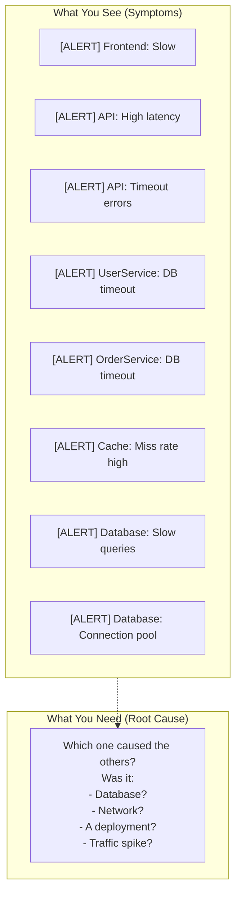
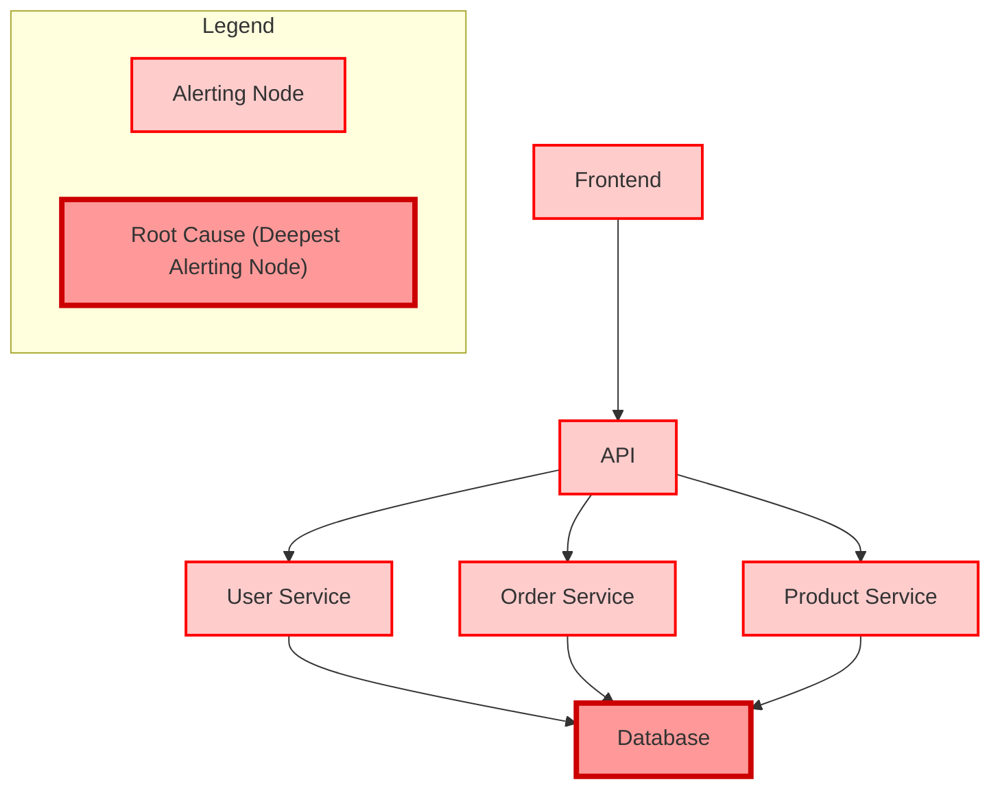
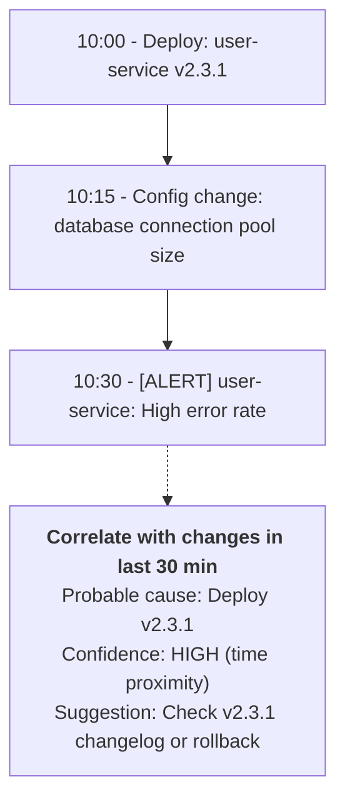
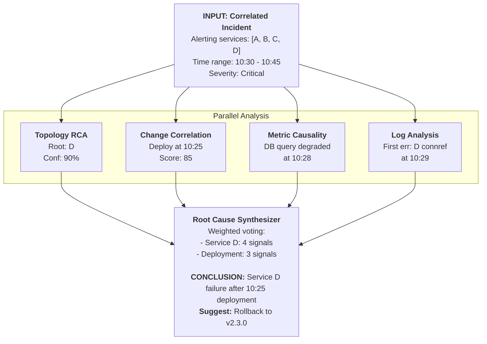

> **Discipline Track** | Complexity: `[COMPLEX]` | Time: 40-45 min

## Prerequisites

Before starting this module:
- [Module 6.3: Event Correlation](../module-6.3-event-correlation/) — Grouping related alerts
- Understanding of directed graphs and traversal
- Basic causal reasoning concepts
- Familiarity with distributed systems

## What You'll Be Able to Do

After completing this module, you will be able to:

- **Implement automated root cause analysis workflows that correlate symptoms across metrics, logs, and traces**
- **Design dependency graph analysis that traces failures from user-facing symptoms to infrastructure causes**
- **Build RCA playbooks that combine automated analysis with structured human investigation**
- **Evaluate causal inference techniques that distinguish root causes from correlated symptoms**

## Why This Module Matters

Correlation tells you alerts are related. Root Cause Analysis (RCA) tells you *why*. When 50 services alert simultaneously, which one actually failed? Is it the database, the network, or a misconfigured deployment?

Manual RCA is detective work—following logs, traces, and metrics across systems. AIOps automates this investigation, identifying probable causes in seconds instead of hours. For teams drowning in incidents, automated RCA is the difference between firefighting and actual engineering.

## Did You Know?

- **Average MTTR for complex incidents is 4+ hours**, with most time spent on investigation rather than remediation
- **Google's Monarch system** performs millions of RCA queries per second using precomputed dependency graphs
- **Causal inference in ML** (Pearl's do-calculus) is increasingly applied to systems—answering "what would happen if we did X"
- **Change correlation** identifies deployment-related issues 60% faster than traditional methods

## The RCA Challenge

### Symptoms vs Root Causes



Without RCA: Check each alert, correlate manually (hours)
With RCA: "Database slow queries caused cascade" (seconds)

> **Stop and think**: How much time does your team currently spend manually cross-referencing dashboards and logs during a major incident?

### Root Cause Categories

| Category | Examples | Detection Approach |
|----------|----------|-------------------|
| **Infrastructure** | Server down, disk full, network partition | Health checks, resource metrics |
| **Application** | Memory leak, infinite loop, deadlock | APM, profiling, error rates |
| **Data** | Corrupted data, schema change, volume spike | Data quality checks, query analysis |
| **Configuration** | Bad deployment, misconfigured service | Change correlation, config diff |
| **External** | Third-party outage, DNS issue, certificate expiry | External monitoring, dependency checks |
| **Capacity** | Traffic spike, resource exhaustion | Capacity metrics, forecasting |

## RCA Approaches

> **Pause and predict**: If service A calls service B, and both are alerting for high latency, which one is statistically more likely to be the actual cause of the delay?

### 1. Dependency Graph Analysis

Follow the dependency chain to find the deepest failure:



```python
from collections import defaultdict, deque

class DependencyRCA:
    """
    Root cause analysis using dependency graph traversal.

    Principle: Root cause is the deepest alerting service
    in the dependency chain (failures propagate upward).
    """
    def __init__(self, dependency_graph):
        """
        dependency_graph: dict mapping service -> list of dependencies
        """
        self.graph = dependency_graph
        self._build_reverse_graph()

    def _build_reverse_graph(self):
        """Build reverse graph for upstream traversal."""
        self.reverse_graph = defaultdict(list)
        for service, deps in self.graph.items():
            for dep in deps:
                self.reverse_graph[dep].append(service)

    def _depth_in_graph(self, service, visited=None):
        """Calculate depth (distance from leaf nodes)."""
        if visited is None:
            visited = set()
        if service in visited:
            return 0
        visited.add(service)

        deps = self.graph.get(service, [])
        if not deps:
            return 0  # Leaf node
        return 1 + max(self._depth_in_graph(d, visited.copy()) for d in deps)

    def _get_blast_radius(self, service):
        """Find all services affected by this service failing."""
        affected = set()
        queue = deque([service])

        while queue:
            current = queue.popleft()
            if current in affected:
                continue
            affected.add(current)

            # Add all services that depend on current
            for dependent in self.reverse_graph.get(current, []):
                queue.append(dependent)

        return affected

    def find_root_cause(self, alerting_services):
        """
        Find probable root cause among alerting services.

        Algorithm:
        1. Score each alerting service by depth
        2. Higher depth = more likely root cause
        3. Verify blast radius explains other alerts
        """
        if not alerting_services:
            return None, 0, set()

        candidates = []
        for service in alerting_services:
            depth = self._depth_in_graph(service)
            blast_radius = self._get_blast_radius(service)
            explained = alerting_services & blast_radius

            candidates.append({
                'service': service,
                'depth': depth,
                'blast_radius': blast_radius,
                'explained': explained,
                'explanation_ratio': len(explained) / len(alerting_services)
            })

        # Sort by: explanation_ratio desc, then depth desc
        candidates.sort(
            key=lambda c: (c['explanation_ratio'], c['depth']),
            reverse=True
        )

        best = candidates[0]
        return best['service'], best['explanation_ratio'], best['blast_radius']

# Usage
graph = {
    'frontend': ['api'],
    'api': ['user-svc', 'order-svc'],
    'user-svc': ['database', 'cache'],
    'order-svc': ['database', 'kafka'],
    'database': [],
    'cache': [],
    'kafka': []
}

rca = DependencyRCA(graph)
alerting = {'frontend', 'api', 'user-svc', 'order-svc', 'database'}
root, confidence, blast = rca.find_root_cause(alerting)
# root = 'database', confidence = 1.0 (explains all alerts)
```

> **Stop and think**: Think about the last three major incidents in your organization. How many of them were immediately preceded by a deployment or configuration change?

### 2. Change Correlation

Most incidents follow changes (deployments, config updates, traffic shifts):



```python
from datetime import timedelta

class ChangeCorrelationRCA:
    """
    Correlate incidents with recent changes.

    Changes include:
    - Deployments
    - Config changes
    - Infrastructure changes
    - Traffic pattern shifts
    """
    def __init__(self, lookback_minutes=60):
        self.lookback = timedelta(minutes=lookback_minutes)
        self.changes = []  # List of change events

    def record_change(self, change):
        """
        Record a change event.

        change = {
            'timestamp': datetime,
            'type': 'deployment' | 'config' | 'infrastructure',
            'service': str,
            'description': str,
            'user': str,
            'reversible': bool
        }
        """
        self.changes.append(change)

    def find_related_changes(self, incident_time, affected_services):
        """
        Find changes that might have caused the incident.
        """
        cutoff = incident_time - self.lookback

        related = []
        for change in self.changes:
            if change['timestamp'] < cutoff:
                continue
            if change['timestamp'] > incident_time:
                continue

            # Check if change affects any incident service
            service_match = change['service'] in affected_services
            time_proximity = (incident_time - change['timestamp']).total_seconds()

            # Score the change
            score = 0
            reasons = []

            if service_match:
                score += 50
                reasons.append(f"Affects {change['service']}")

            # Closer to incident = higher score
            if time_proximity < 300:  # 5 min
                score += 30
                reasons.append("Within 5 minutes of incident")
            elif time_proximity < 900:  # 15 min
                score += 20
                reasons.append("Within 15 minutes of incident")
            elif time_proximity < 1800:  # 30 min
                score += 10
                reasons.append("Within 30 minutes of incident")

            # Deployment changes are higher risk
            if change['type'] == 'deployment':
                score += 20
                reasons.append("Deployment change")
            elif change['type'] == 'config':
                score += 15
                reasons.append("Config change")

            if score > 0:
                related.append({
                    'change': change,
                    'score': score,
                    'reasons': reasons,
                    'suggestion': self._get_suggestion(change)
                })

        # Sort by score
        related.sort(key=lambda r: r['score'], reverse=True)
        return related

    def _get_suggestion(self, change):
        """Generate remediation suggestion for change."""
        if change['type'] == 'deployment' and change.get('reversible'):
            return f"Consider rollback: {change['description']}"
        elif change['type'] == 'config':
            return f"Review config change: {change['description']}"
        else:
            return f"Investigate change: {change['description']}"
```

### 3. Metric-Based Causal Analysis

Find metrics that changed before the incident:

### Metric Causality Analysis

**INCIDENT:** API latency spike at 10:30

| Metric | 10:00 | 10:15 | 10:30 | Verdict |
|--------|-------|-------|-------|---------|
| API latency (symptom) | 50ms | 55ms | 500ms | **← EFFECT** |
| Database query time | 10ms | 50ms | 400ms | **← CAUSE?** |
| Database connections | 50 | 80 | 100 | **← CAUSE?** |
| Request rate | 1000 | 1000 | 1000 | Stable |
| Memory usage | 60% | 61% | 62% | Stable |

**FINDING:** Database metrics degraded BEFORE API latency, suggesting the database is the root cause.

```python
import numpy as np
from datetime import timedelta

class MetricCausalityAnalyzer:
    """
    Analyze metrics to find causal relationships.

    Key principle: Causes precede effects.
    If metric A changes before metric B, A may cause B.
    """
    def __init__(self, lookback_minutes=30):
        self.lookback = timedelta(minutes=lookback_minutes)

    def analyze_causality(self, incident_time, metrics_data, symptom_metric):
        """
        Find metrics that changed before the symptom.

        metrics_data: dict of metric_name -> list of (timestamp, value)
        symptom_metric: the metric that alerted (effect)
        """
        # Find when symptom started degrading
        symptom_change_time = self._find_change_point(
            metrics_data[symptom_metric],
            incident_time
        )

        if symptom_change_time is None:
            return []

        # Find metrics that changed BEFORE symptom
        potential_causes = []
        for metric_name, data in metrics_data.items():
            if metric_name == symptom_metric:
                continue

            change_time = self._find_change_point(data, incident_time)
            if change_time is None:
                continue

            # Did this metric change before the symptom?
            if change_time < symptom_change_time:
                lead_time = (symptom_change_time - change_time).total_seconds()
                potential_causes.append({
                    'metric': metric_name,
                    'change_time': change_time,
                    'lead_time_seconds': lead_time,
                    'confidence': self._calculate_confidence(lead_time)
                })

        # Sort by confidence
        potential_causes.sort(key=lambda c: c['confidence'], reverse=True)
        return potential_causes

    def _find_change_point(self, data, reference_time):
        """
        Find when a metric started changing significantly.

        Uses simple rolling average comparison.
        """
        if len(data) < 10:
            return None

        # Filter to relevant time window
        cutoff = reference_time - self.lookback
        relevant = [(ts, val) for ts, val in data if ts >= cutoff]

        if len(relevant) < 5:
            return None

        values = [val for _, val in relevant]
        timestamps = [ts for ts, _ in relevant]

        # Calculate baseline (first 30%)
        baseline_end = len(values) // 3
        baseline_mean = np.mean(values[:baseline_end])
        baseline_std = np.std(values[:baseline_end])

        if baseline_std == 0:
            baseline_std = 0.01

        # Find first significant deviation
        for i in range(baseline_end, len(values)):
            z_score = abs(values[i] - baseline_mean) / baseline_std
            if z_score > 3:  # 3 sigma deviation
                return timestamps[i]

        return None

    def _calculate_confidence(self, lead_time_seconds):
        """
        Calculate confidence that this is a cause.

        Shorter lead times = higher confidence (more correlated).
        """
        if lead_time_seconds < 60:
            return 0.9
        elif lead_time_seconds < 300:
            return 0.7
        elif lead_time_seconds < 900:
            return 0.5
        else:
            return 0.3
```

### 4. Log-Based Analysis

Extract signals from log patterns:

```python
import re
from collections import Counter

class LogBasedRCA:
    """
    Analyze logs to identify root cause patterns.
    """
    # Common error patterns
    ERROR_PATTERNS = {
        'connection': [
            r'connection refused',
            r'connection timed out',
            r'no route to host',
            r'connection reset'
        ],
        'resource': [
            r'out of memory',
            r'disk full',
            r'too many open files',
            r'resource exhausted'
        ],
        'database': [
            r'deadlock detected',
            r'lock wait timeout',
            r'too many connections',
            r'query timeout'
        ],
        'authentication': [
            r'authentication failed',
            r'invalid credentials',
            r'token expired',
            r'unauthorized'
        ]
    }

    def analyze_logs(self, logs, incident_time, window_minutes=30):
        """
        Analyze logs around incident time for root cause signals.

        logs: list of {'timestamp': datetime, 'service': str, 'message': str}
        """
        cutoff_start = incident_time - timedelta(minutes=window_minutes)
        cutoff_end = incident_time + timedelta(minutes=5)

        relevant_logs = [
            log for log in logs
            if cutoff_start <= log['timestamp'] <= cutoff_end
        ]

        # Categorize errors
        error_categories = Counter()
        first_occurrences = {}
        service_errors = Counter()

        for log in relevant_logs:
            message = log['message'].lower()
            service = log['service']

            for category, patterns in self.ERROR_PATTERNS.items():
                for pattern in patterns:
                    if re.search(pattern, message, re.IGNORECASE):
                        error_categories[category] += 1
                        service_errors[service] += 1

                        # Track first occurrence
                        key = (service, category)
                        if key not in first_occurrences:
                            first_occurrences[key] = log['timestamp']
                        break

        # Find earliest error signals
        sorted_firsts = sorted(
            first_occurrences.items(),
            key=lambda x: x[1]
        )

        return {
            'error_categories': dict(error_categories),
            'service_errors': dict(service_errors),
            'timeline': [
                {
                    'service': key[0],
                    'category': key[1],
                    'first_seen': ts
                }
                for key, ts in sorted_firsts[:10]
            ],
            'probable_root': sorted_firsts[0] if sorted_firsts else None
        }
```

> **Pause and predict**: What happens if the topology analysis points to the database, but the change correlation points to a frontend deployment? How should the system resolve the conflict?

## Combining RCA Strategies



```python
class ComprehensiveRCA:
    """
    Combine multiple RCA strategies for higher accuracy.
    """
    def __init__(self, dependency_graph, change_tracker):
        self.topo_rca = DependencyRCA(dependency_graph)
        self.change_rca = ChangeCorrelationRCA()
        self.metric_rca = MetricCausalityAnalyzer()
        self.log_rca = LogBasedRCA()

    def analyze(self, incident):
        """
        Run all RCA strategies and synthesize results.

        incident = {
            'services': set of alerting services,
            'start_time': datetime,
            'metrics': dict of metrics data,
            'logs': list of log entries
        }
        """
        results = {}

        # 1. Topology analysis
        topo_root, topo_conf, _ = self.topo_rca.find_root_cause(
            incident['services']
        )
        results['topology'] = {
            'root': topo_root,
            'confidence': topo_conf
        }

        # 2. Change correlation
        changes = self.change_rca.find_related_changes(
            incident['start_time'],
            incident['services']
        )
        results['changes'] = changes[:3]  # Top 3 changes

        # 3. Metric causality
        if 'symptom_metric' in incident:
            causes = self.metric_rca.analyze_causality(
                incident['start_time'],
                incident['metrics'],
                incident['symptom_metric']
            )
            results['metrics'] = causes[:3]

        # 4. Log analysis
        if 'logs' in incident:
            log_results = self.log_rca.analyze_logs(
                incident['logs'],
                incident['start_time']
            )
            results['logs'] = log_results

        # Synthesize
        return self._synthesize(results)

    def _synthesize(self, results):
        """
        Combine results from all strategies.

        Uses voting + confidence weighting.
        """
        votes = Counter()

        # Topology vote (high weight)
        if results.get('topology', {}).get('root'):
            root = results['topology']['root']
            conf = results['topology']['confidence']
            votes[root] += conf * 3  # Weight 3x

        # Change correlation (if service specific)
        for change in results.get('changes', []):
            service = change['change']['service']
            score = change['score'] / 100  # Normalize to 0-1
            votes[service] += score * 2  # Weight 2x

        # Log analysis
        log_results = results.get('logs', {})
        if log_results.get('probable_root'):
            service = log_results['probable_root'][0][0]
            votes[service] += 1

        # Get winner
        if votes:
            root_cause = votes.most_common(1)[0][0]
            total_votes = sum(votes.values())
            confidence = votes[root_cause] / total_votes
        else:
            root_cause = None
            confidence = 0

        return {
            'root_cause': root_cause,
            'confidence': confidence,
            'evidence': results,
            'suggestion': self._get_suggestion(root_cause, results)
        }

    def _get_suggestion(self, root_cause, results):
        """Generate actionable suggestion."""
        suggestions = []

        # Check if deployment related
        for change in results.get('changes', []):
            if change['change']['type'] == 'deployment':
                suggestions.append(change['suggestion'])

        if not suggestions:
            suggestions.append(f"Investigate {root_cause} for root cause")

        return suggestions
```

## Common Mistakes

| Mistake | Problem | Solution |
|---------|---------|----------|
| Only using topology | Misses non-dependency causes | Add change correlation, metric analysis |
| Ignoring time ordering | Effects labeled as causes | Causes must precede effects |
| Stale dependency graph | Wrong root cause identification | Auto-update from traces |
| No change tracking | Can't correlate with deployments | Track all changes, including config |
| Single strategy | Lower accuracy | Combine multiple strategies with voting |
| Overfitting to patterns | Missing new failure modes | Include log/metric analysis for unknowns |

## Quiz

<details>
<summary>1. You are investigating a massive outage where the frontend, API gateway, user service, and database are all firing high-latency alerts simultaneously. The topology analyzer flags the database as the root cause because it is the "deepest alerting service." Why does this specific heuristic correctly point to the database in this scenario?</summary>

**Answer**: In service dependency graphs, failures inherently propagate upward from downstream dependencies to the upstream services that call them. If the database fails, it will cause the user service to time out, which cascades to the API gateway and finally the frontend. The deepest service in the dependency tree is the furthest from the user-facing leaf nodes. Therefore, if it is alerting, it almost certainly triggered the cascade of alerts in all the services positioned above it.
</details>

<details>
<summary>2. During a Black Friday traffic spike, your topology-based RCA correctly identifies the `checkout-service` as the root cause of a site-wide slowdown. However, your team still doesn't know what to fix until the change correlation engine points to a configuration update made ten minutes prior. How does change correlation complement the topology findings in this specific incident?</summary>

**Answer**: Topology-based RCA is excellent at finding *what* part of the system failed, but it cannot explain the underlying reason *why* it failed. In this scenario, knowing the `checkout-service` is broken doesn't provide a remediation path on its own. Change correlation bridges this gap by identifying the exact trigger—in this case, the recent configuration update. Together, they provide both the location of the failure and an immediate path to resolution, such as rolling back the bad config.
</details>

<details>
<summary>3. You are reviewing an incident report where an API latency spike triggered alerts at 10:30. The metric-based causal analyzer highlights that database query times began degrading at 10:28, while memory usage remained stable. What is the fundamental principle the analyzer is using to flag the database metrics over others?</summary>

**Answer**: The analyzer relies on the fundamental principle that causes must strictly precede their effects in time. If the database query times started degrading before the API latency spiked, it establishes a temporal ordering that strongly suggests causality. The analyzer finds the exact moment the symptom metric degraded and then looks backward for metrics that shifted beforehand. By ranking these preceding changes by lead time, it filters out concurrent symptoms and isolates the true trigger.
</details>

<details>
<summary>4. Your platform team initially deployed an RCA system that only used topology-based dependency tracing. While it worked well for cascading timeouts, it completely missed a recent outage caused by a misconfigured load balancer that didn't trigger dependency alerts. Why must a robust RCA system combine multiple analytical strategies to prevent blind spots like this?</summary>

**Answer**: Different failure modes manifest in entirely different ways that no single analytical strategy can capture completely. Topology analysis excels at tracking cascading timeouts but is blind to configuration issues or instant application crashes. Change correlation catches bad deployments but misses slow resource exhaustion, while log analysis finds application errors but might miss network partitions. By combining multiple strategies with a weighted voting mechanism, the system can cross-validate signals, cover each method's blind spots, and drastically increase overall diagnostic accuracy.
</details>

> **Stop and think**: When building your own RCA system, what signals are unique to your environment that off-the-shelf tools might miss?

## Hands-On Exercise: Build an RCA System

### Setup

```bash
mkdir rca-system && cd rca-system
python -m venv venv
source venv/bin/activate
pip install numpy pandas
```

### Step 1: Create Test Scenario

```python
# scenario.py
from datetime import datetime, timedelta
import random

def create_database_failure_scenario():
    """
    Simulate a database failure scenario with all data.
    """
    incident_time = datetime(2024, 1, 15, 10, 30, 0)

    # Dependency graph
    graph = {
        'frontend': ['api-gateway'],
        'api-gateway': ['user-service', 'order-service', 'product-service'],
        'user-service': ['postgres', 'redis'],
        'order-service': ['postgres', 'kafka'],
        'product-service': ['postgres', 'elasticsearch'],
        'postgres': [],
        'redis': [],
        'kafka': [],
        'elasticsearch': []
    }

    # Alerting services (cascade from postgres)
    alerting_services = {
        'postgres', 'user-service', 'order-service',
        'product-service', 'api-gateway', 'frontend'
    }

    # Changes (deployment 5 min before incident)
    changes = [
        {
            'timestamp': incident_time - timedelta(minutes=5),
            'type': 'deployment',
            'service': 'postgres',
            'description': 'postgres: Update to version 15.2',
            'user': 'deploy-bot',
            'reversible': True
        },
        {
            'timestamp': incident_time - timedelta(hours=2),
            'type': 'config',
            'service': 'api-gateway',
            'description': 'Increase timeout to 30s',
            'user': 'jane@example.com',
            'reversible': True
        }
    ]

    # Logs showing progression
    logs = []
    base_time = incident_time - timedelta(minutes=2)

    # First signal: postgres
    logs.append({
        'timestamp': base_time,
        'service': 'postgres',
        'message': 'FATAL: connection limit exceeded for non-superuser'
    })

    # Cascade
    for service in ['user-service', 'order-service', 'product-service']:
        logs.append({
            'timestamp': base_time + timedelta(seconds=30),
            'service': service,
            'message': 'Connection to postgres refused: too many connections'
        })

    logs.append({
        'timestamp': base_time + timedelta(seconds=60),
        'service': 'api-gateway',
        'message': 'Upstream service timeout: user-service'
    })

    logs.append({
        'timestamp': base_time + timedelta(seconds=90),
        'service': 'frontend',
        'message': 'API request failed: 504 Gateway Timeout'
    })

    return {
        'incident_time': incident_time,
        'graph': graph,
        'alerting_services': alerting_services,
        'changes': changes,
        'logs': logs,
        'expected_root_cause': 'postgres',
        'expected_change': 'postgres deployment'
    }
```

### Step 2: Implement RCA

Use the classes from this module to implement a complete RCA:

```python
# rca_runner.py
from scenario import create_database_failure_scenario
from datetime import timedelta
from collections import Counter, defaultdict, deque

# Include the class implementations from this module here
# (DependencyRCA, ChangeCorrelationRCA, LogBasedRCA)

class SimpleRCA:
    """Simplified comprehensive RCA for exercise."""

    def __init__(self, graph):
        self.graph = graph
        self.reverse_graph = defaultdict(list)
        for svc, deps in graph.items():
            for dep in deps:
                self.reverse_graph[dep].append(svc)

    def find_root_by_topology(self, alerting):
        """Find deepest alerting service."""
        def depth(service, visited=None):
            if visited is None:
                visited = set()
            if service in visited:
                return 0
            visited.add(service)
            deps = self.graph.get(service, [])
            if not deps:
                return 0
            return 1 + max(depth(d, visited.copy()) for d in deps)

        if not alerting:
            return None
        return max(alerting, key=depth)

    def correlate_changes(self, changes, incident_time, services):
        """Find changes related to incident."""
        relevant = []
        for change in changes:
            if change['timestamp'] > incident_time:
                continue
            if (incident_time - change['timestamp']) > timedelta(hours=1):
                continue

            score = 0
            if change['service'] in services:
                score += 50
            if (incident_time - change['timestamp']) < timedelta(minutes=15):
                score += 30
            if change['type'] == 'deployment':
                score += 20

            if score > 0:
                relevant.append({'change': change, 'score': score})

        return sorted(relevant, key=lambda x: x['score'], reverse=True)

    def analyze_logs(self, logs, incident_time):
        """Find first error signals in logs."""
        cutoff = incident_time - timedelta(minutes=10)
        relevant = [l for l in logs if l['timestamp'] >= cutoff]
        relevant.sort(key=lambda x: x['timestamp'])

        if relevant:
            first = relevant[0]
            return {
                'first_service': first['service'],
                'first_message': first['message'],
                'timestamp': first['timestamp']
            }
        return None

    def run_rca(self, scenario):
        """Run complete RCA."""
        results = {}

        # Topology
        root = self.find_root_by_topology(scenario['alerting_services'])
        results['topology_root'] = root

        # Changes
        changes = self.correlate_changes(
            scenario['changes'],
            scenario['incident_time'],
            scenario['alerting_services']
        )
        results['related_changes'] = changes

        # Logs
        log_analysis = self.analyze_logs(
            scenario['logs'],
            scenario['incident_time']
        )
        results['log_analysis'] = log_analysis

        # Synthesize
        votes = Counter()
        if root:
            votes[root] += 3

        for c in changes:
            votes[c['change']['service']] += c['score'] / 100 * 2

        if log_analysis:
            votes[log_analysis['first_service']] += 2

        if votes:
            winner = votes.most_common(1)[0]
            results['final_root_cause'] = winner[0]
            results['confidence'] = winner[1] / sum(votes.values())
        else:
            results['final_root_cause'] = None
            results['confidence'] = 0

        return results


def main():
    scenario = create_database_failure_scenario()

    rca = SimpleRCA(scenario['graph'])
    results = rca.run_rca(scenario)

    print("=== RCA Results ===")
    print(f"Topology root cause: {results['topology_root']}")
    print()

    print("Related changes:")
    for c in results['related_changes']:
        print(f"  - {c['change']['description']} (score: {c['score']})")
    print()

    if results['log_analysis']:
        print(f"First log signal: {results['log_analysis']['first_service']}")
        print(f"  Message: {results['log_analysis']['first_message']}")
    print()

    print(f"FINAL ROOT CAUSE: {results['final_root_cause']}")
    print(f"Confidence: {results['confidence']:.0%}")
    print()

    # Verify
    expected = scenario['expected_root_cause']
    if results['final_root_cause'] == expected:
        print(f"SUCCESS: Correctly identified {expected}")
    else:
        print(f"MISS: Expected {expected}, got {results['final_root_cause']}")


if __name__ == '__main__':
    main()
```

### Success Criteria

You've completed this exercise when:
- [ ] Created realistic failure scenario with all data types
- [ ] Implemented topology-based RCA
- [ ] Implemented change correlation
- [ ] Implemented log analysis
- [ ] Combined strategies with voting
- [ ] Correctly identified root cause in test scenario

## Key Takeaways

1. **Causes precede effects**: Use temporal ordering in all analysis
2. **Deepest service wins**: In topology analysis, root cause is deepest alerting node
3. **Change correlation is key**: Most incidents follow changes—track everything
4. **Combine strategies**: Multiple signals increase confidence
5. **Blast radius explains scope**: Root cause should explain all affected services
6. **Automate the detective work**: What humans do in hours, systems can do in seconds

## Further Reading

- [Pearl's Causal Inference](http://bayes.cs.ucla.edu/BOOK-2K/) — Theoretical foundation
- [Google's RCA at Scale](https://sre.google/sre-book/effective-troubleshooting/) — Practical approaches
- [Uber's Root Cause Analysis](https://www.uber.com/blog/microservice-architecture/) — Scale challenges
- [Observability Engineering (Book)](https://www.oreilly.com/library/view/observability-engineering/9781492076438/) — Debug methodology

## Summary

Root Cause Analysis automates the detective work of incident response. By combining dependency graph analysis, change correlation, metric causality, and log analysis, AIOps systems can identify probable causes in seconds instead of hours.

The key insight: different strategies catch different failure modes. Combine them with confidence-weighted voting for higher accuracy. And remember—always verify the blast radius explains all symptoms.

---

## Next Module

Continue to [Module 6.5: Predictive Operations](../module-6.5-predictive-operations/) to learn how to forecast problems before they impact users.