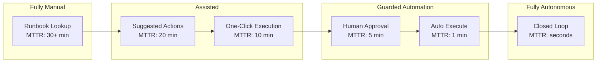
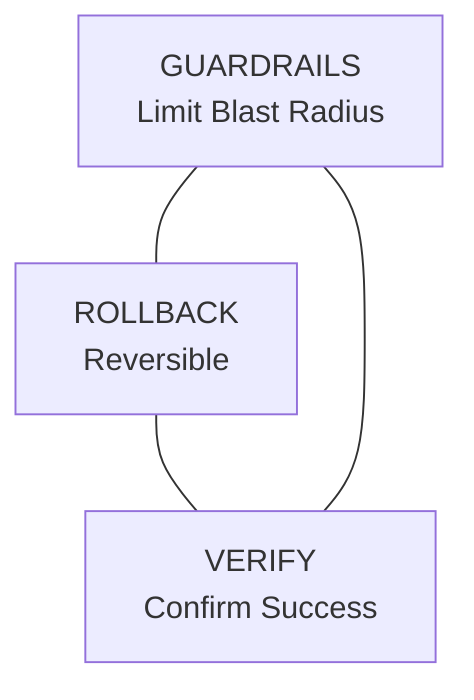
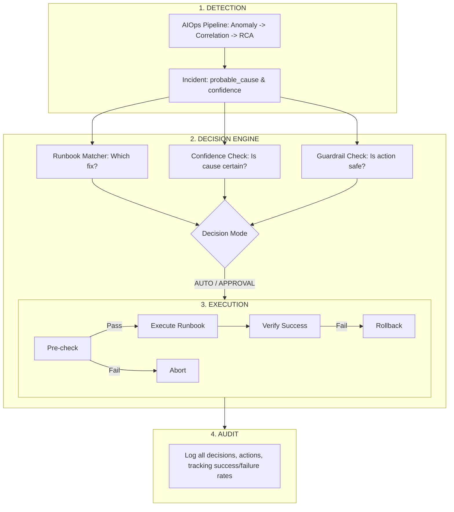

> **Discipline Track** | Complexity: `[COMPLEX]` | Time: 40-45 min

## Prerequisites

Before starting this module:
- [Module 6.4: Root Cause Analysis](../module-6.4-root-cause-analysis/) — Understanding probable causes
- [Module 6.5: Predictive Operations](../module-6.5-predictive-operations/) — Proactive detection
- Familiarity with runbook automation concepts
- Understanding of Kubernetes basics (for exercises)

## What You'll Be Able to Do

After completing this module, you will be able to:

- **Design auto-remediation workflows with appropriate safety guardrails and human approval gates**
- **Implement self-healing systems that automatically resolve common incident patterns**
- **Build remediation runbooks that can be executed both manually and by automated systems**
- **Evaluate remediation actions for blast radius and implement progressive rollout of automated fixes**

## Why This Module Matters

Detection is only half the battle. You've identified the problem—now what? Manual remediation means waiting for a human to wake up, understand the issue, find the runbook, and execute the fix. At 3AM, that's 15-45 minutes of user impact.

Auto-remediation executes predefined fixes automatically, reducing MTTR from minutes to seconds. But it must be done safely—automated mistakes happen at machine speed. This module teaches you to build systems that fix problems automatically while maintaining safety guardrails.

## Did You Know?

- **Google's self-healing systems** automatically drain unhealthy servers, rebalance load, and restart services without human intervention
- **Netflix's Chaos Monkey** inspired auto-remediation—if you know what breaks, you can automate the fix
- **75% of production incidents have known remediations** according to PagerDuty—these are prime candidates for automation
- **Human error causes 70% of remediation failures**—well-tested automation is often more reliable than tired humans at 3AM

## The Auto-Remediation Spectrum



Start left, move right as trust builds.

> **Pause and predict**: At which stage of the spectrum do you think most organizations experience the most cultural resistance from operations teams, and why?

## Safe Auto-Remediation Principles

### The Safety Triangle



Every auto-remediation MUST have:
1. **GUARDRAILS**: Limit blast radius
2. **ROLLBACK**: Ability to undo
3. **VERIFY**: Confirm success/failure

> **Stop and think**: If an automated action cannot be rolled back (e.g., dropping a corrupted database table), how should its execution be handled according to the safety triangle?

### Key Safety Rules

1. **Start small, expand slowly**: Begin with low-risk, high-confidence fixes
2. **Always verify**: Never assume the fix worked
3. **Limit blast radius**: Cap how much one action can affect
4. **Require rollback**: Don't automate irreversible actions
5. **Human-in-loop**: Keep approval gates for high-risk actions
6. **Circuit breakers**: Stop if remediation fails repeatedly

## Remediation Architecture



## Building Runbooks

### Runbook Structure

```python
from dataclasses import dataclass
from typing import List, Optional, Callable
from enum import Enum

class RiskLevel(Enum):
    LOW = 'low'         # Auto-execute
    MEDIUM = 'medium'   # Auto with guardrails
    HIGH = 'high'       # Requires approval

@dataclass
class Runbook:
    """
    Structured remediation runbook.
    """
    id: str
    name: str
    description: str
    risk_level: RiskLevel

    # Matching criteria
    root_causes: List[str]  # Which root causes this fixes
    symptoms: List[str]     # Pattern matching for symptoms
    min_confidence: float   # Minimum RCA confidence to trigger

    # Execution
    pre_checks: List[Callable]   # Safety checks before execution
    actions: List[Callable]       # Remediation steps
    post_checks: List[Callable]   # Verify success
    rollback: Optional[Callable]  # Undo if needed

    # Guardrails
    max_executions_per_hour: int = 3
    cooldown_minutes: int = 10
    blast_radius_limit: int = 1  # Max services affected

    # Metadata
    owner: str = ''
    last_updated: str = ''
    success_rate: float = 0.0


# Example runbook
pod_restart_runbook = Runbook(
    id='k8s-pod-restart',
    name='Restart Unhealthy Pod',
    description='Restart a pod that is in unhealthy state',
    risk_level=RiskLevel.LOW,

    root_causes=['pod_crash_loop', 'pod_oom_killed', 'health_check_failure'],
    symptoms=['CrashLoopBackOff', 'OOMKilled', 'Unhealthy'],
    min_confidence=0.8,

    pre_checks=[
        lambda ctx: ctx['pod_count'] > 1,  # Not the only replica
        lambda ctx: ctx['recent_restarts'] < 3,  # Not already restarting
    ],
    actions=[
        lambda ctx: kubectl_delete_pod(ctx['pod_name']),
    ],
    post_checks=[
        lambda ctx: wait_for_pod_ready(ctx['pod_name'], timeout=60),
    ],
    rollback=None,  # Pod deletion is self-healing

    max_executions_per_hour=5,
    cooldown_minutes=5,
    blast_radius_limit=1,

    owner='platform-team',
    success_rate=0.95
)
```

### Common Runbook Patterns

```python
# Collection of common remediation runbooks

RUNBOOKS = {
    # LOW RISK: Safe to auto-execute
    'restart-pod': {
        'risk': 'LOW',
        'triggers': ['CrashLoopBackOff', 'OOMKilled'],
        'action': 'kubectl delete pod {pod}',
        'verification': 'pod becomes Ready',
        'guardrails': ['replicas > 1', 'restarts_last_hour < 3']
    },

    'scale-up': {
        'risk': 'LOW',
        'triggers': ['high_cpu', 'high_memory', 'queue_backlog'],
        'action': 'kubectl scale deployment --replicas +1',
        'verification': 'new pods Ready, metrics improve',
        'guardrails': ['current_replicas < max_replicas', 'budget_available']
    },

    'clear-disk-cache': {
        'risk': 'LOW',
        'triggers': ['disk_usage > 85%'],
        'action': 'clear tmp files, rotate logs',
        'verification': 'disk_usage < 70%',
        'guardrails': ['only_safe_directories']
    },

    # MEDIUM RISK: Auto with extra checks
    'restart-service': {
        'risk': 'MEDIUM',
        'triggers': ['service_unhealthy', 'memory_leak'],
        'action': 'kubectl rollout restart deployment',
        'verification': 'all pods Ready, health checks pass',
        'guardrails': ['off_peak_hours', 'other_services_healthy']
    },

    'failover-database': {
        'risk': 'MEDIUM',
        'triggers': ['primary_unhealthy', 'replication_lag'],
        'action': 'promote replica to primary',
        'verification': 'new primary healthy, apps reconnected',
        'guardrails': ['replica_caught_up', 'human_notified']
    },

    # HIGH RISK: Requires human approval
    'rollback-deployment': {
        'risk': 'HIGH',
        'triggers': ['error_rate_spike_after_deploy'],
        'action': 'kubectl rollout undo deployment',
        'verification': 'error rate returns to baseline',
        'guardrails': ['human_approval_required']
    },

    'scale-to-zero': {
        'risk': 'HIGH',
        'triggers': ['security_incident', 'data_breach'],
        'action': 'kubectl scale deployment --replicas=0',
        'verification': 'no pods running',
        'guardrails': ['human_approval_required', 'incident_documented']
    }
}
```

## Implementing Guardrails

### Blast Radius Limiter

```python
class BlastRadiusLimiter:
    """
    Limit the scope of auto-remediation actions.
    """
    def __init__(self, max_concurrent_actions=3, max_affected_services=1):
        self.max_concurrent = max_concurrent_actions
        self.max_services = max_affected_services
        self.active_actions = {}
        self.affected_services = set()

    def can_execute(self, action_id, service):
        """
        Check if action is safe to execute.
        """
        # Check concurrent limit
        if len(self.active_actions) >= self.max_concurrent:
            return False, f"Max concurrent actions ({self.max_concurrent}) reached"

        # Check service limit
        if service not in self.affected_services:
            if len(self.affected_services) >= self.max_services:
                return False, f"Max services ({self.max_services}) already affected"

        return True, "OK"

    def start_action(self, action_id, service):
        """Register action as started."""
        self.active_actions[action_id] = {
            'service': service,
            'started_at': datetime.now()
        }
        self.affected_services.add(service)

    def end_action(self, action_id):
        """Register action as completed."""
        if action_id in self.active_actions:
            service = self.active_actions[action_id]['service']
            del self.active_actions[action_id]
            # Keep service in affected set for cooldown
```

### Rate Limiter

```python
from collections import defaultdict
from datetime import datetime, timedelta

class RemediationRateLimiter:
    """
    Rate limit remediation actions per runbook and service.
    """
    def __init__(self):
        self.executions = defaultdict(list)  # key -> [timestamps]

    def _cleanup(self, key, window_minutes):
        """Remove old executions."""
        cutoff = datetime.now() - timedelta(minutes=window_minutes)
        self.executions[key] = [
            ts for ts in self.executions[key]
            if ts > cutoff
        ]

    def can_execute(self, runbook_id, service, max_per_hour, cooldown_minutes):
        """
        Check if execution is allowed.
        """
        key = f"{runbook_id}:{service}"

        # Check rate limit
        self._cleanup(key, 60)  # 1 hour window
        if len(self.executions[key]) >= max_per_hour:
            return False, f"Rate limit exceeded ({max_per_hour}/hour)"

        # Check cooldown
        if self.executions[key]:
            last_execution = max(self.executions[key])
            cooldown_end = last_execution + timedelta(minutes=cooldown_minutes)
            if datetime.now() < cooldown_end:
                remaining = (cooldown_end - datetime.now()).seconds
                return False, f"Cooldown active ({remaining}s remaining)"

        return True, "OK"

    def record_execution(self, runbook_id, service):
        """Record an execution."""
        key = f"{runbook_id}:{service}"
        self.executions[key].append(datetime.now())
```

### Circuit Breaker

```python
class RemediationCircuitBreaker:
    """
    Stop auto-remediation if failures exceed threshold.

    States:
    - CLOSED: Normal operation
    - OPEN: Blocked (too many failures)
    - HALF_OPEN: Testing if recovered
    """
    def __init__(self, failure_threshold=3, recovery_timeout=300):
        self.failure_threshold = failure_threshold
        self.recovery_timeout = recovery_timeout
        self.states = {}  # runbook_id -> state
        self.failures = defaultdict(int)
        self.last_failure_time = {}

    def can_execute(self, runbook_id):
        """Check if circuit allows execution."""
        state = self.states.get(runbook_id, 'CLOSED')

        if state == 'CLOSED':
            return True, "OK"

        elif state == 'OPEN':
            # Check if recovery timeout passed
            last_failure = self.last_failure_time.get(runbook_id)
            if last_failure:
                elapsed = (datetime.now() - last_failure).seconds
                if elapsed >= self.recovery_timeout:
                    self.states[runbook_id] = 'HALF_OPEN'
                    return True, "Testing recovery"
            return False, "Circuit OPEN (too many failures)"

        elif state == 'HALF_OPEN':
            return True, "Testing recovery"

        return False, "Unknown state"

    def record_success(self, runbook_id):
        """Record successful execution."""
        self.failures[runbook_id] = 0
        self.states[runbook_id] = 'CLOSED'

    def record_failure(self, runbook_id):
        """Record failed execution."""
        self.failures[runbook_id] += 1
        self.last_failure_time[runbook_id] = datetime.now()

        if self.failures[runbook_id] >= self.failure_threshold:
            self.states[runbook_id] = 'OPEN'
            return True  # Circuit tripped
        return False
```

> **Stop and think**: How would a circuit breaker differentiate between a transient failure (which might succeed on retry) and a persistent failure (which should trip the breaker)?

## Execution Engine

```python
class AutoRemediationEngine:
    """
    Complete auto-remediation execution engine.
    """
    def __init__(self, runbooks: dict):
        self.runbooks = runbooks
        self.rate_limiter = RemediationRateLimiter()
        self.blast_limiter = BlastRadiusLimiter()
        self.circuit_breaker = RemediationCircuitBreaker()
        self.audit_log = []

    def handle_incident(self, incident):
        """
        Process an incident and execute remediation if appropriate.

        incident = {
            'id': str,
            'root_cause': str,
            'confidence': float,
            'services': set,
            'symptoms': list
        }
        """
        # Find matching runbook
        runbook = self._find_runbook(incident)
        if not runbook:
            self._log('NO_RUNBOOK', incident, None, "No matching runbook")
            return {'action': 'manual', 'reason': 'No matching runbook'}

        # Check confidence threshold
        if incident['confidence'] < runbook['min_confidence']:
            self._log('LOW_CONFIDENCE', incident, runbook,
                     f"Confidence {incident['confidence']} < {runbook['min_confidence']}")
            return {'action': 'manual', 'reason': 'Low confidence'}

        # Check guardrails
        service = list(incident['services'])[0]  # Primary service

        # Circuit breaker
        can_execute, reason = self.circuit_breaker.can_execute(runbook['id'])
        if not can_execute:
            self._log('CIRCUIT_OPEN', incident, runbook, reason)
            return {'action': 'blocked', 'reason': reason}

        # Rate limiter
        can_execute, reason = self.rate_limiter.can_execute(
            runbook['id'], service,
            runbook.get('max_per_hour', 3),
            runbook.get('cooldown_minutes', 10)
        )
        if not can_execute:
            self._log('RATE_LIMITED', incident, runbook, reason)
            return {'action': 'blocked', 'reason': reason}

        # Blast radius
        can_execute, reason = self.blast_limiter.can_execute(
            incident['id'], service
        )
        if not can_execute:
            self._log('BLAST_LIMITED', incident, runbook, reason)
            return {'action': 'blocked', 'reason': reason}

        # Determine execution mode based on risk
        risk = runbook.get('risk', 'HIGH')
        if risk == 'HIGH':
            self._log('APPROVAL_REQUIRED', incident, runbook, "High risk")
            return {
                'action': 'approval_required',
                'runbook': runbook,
                'suggested_action': runbook.get('action')
            }

        # Execute remediation
        return self._execute(incident, runbook, service)

    def _find_runbook(self, incident):
        """Find matching runbook for incident."""
        root_cause = incident['root_cause']
        symptoms = incident.get('symptoms', [])

        for runbook_id, runbook in self.runbooks.items():
            # Match by root cause
            if root_cause in runbook.get('triggers', []):
                return {**runbook, 'id': runbook_id}

            # Match by symptoms
            for symptom in symptoms:
                if symptom in runbook.get('triggers', []):
                    return {**runbook, 'id': runbook_id}

        return None

    def _execute(self, incident, runbook, service):
        """Execute remediation with safety checks."""
        action_id = f"{incident['id']}-{runbook['id']}"

        try:
            # Register execution
            self.blast_limiter.start_action(action_id, service)
            self.rate_limiter.record_execution(runbook['id'], service)

            # Pre-checks
            pre_checks = runbook.get('pre_checks', [])
            for check in pre_checks:
                if not self._run_check(check, incident):
                    self._log('PRE_CHECK_FAILED', incident, runbook, str(check))
                    return {'action': 'aborted', 'reason': 'Pre-check failed'}

            # Execute action
            action = runbook.get('action')
            self._log('EXECUTING', incident, runbook, action)

            # Simulate execution (in real system, run the actual command)
            success = self._run_action(action, incident)

            # Post-checks
            post_checks = runbook.get('post_checks', [])
            verified = all(
                self._run_check(check, incident)
                for check in post_checks
            )

            if success and verified:
                self.circuit_breaker.record_success(runbook['id'])
                self._log('SUCCESS', incident, runbook, None)
                return {'action': 'executed', 'success': True}
            else:
                # Rollback if available
                rollback = runbook.get('rollback')
                if rollback:
                    self._run_action(rollback, incident)
                    self._log('ROLLED_BACK', incident, runbook, None)

                self.circuit_breaker.record_failure(runbook['id'])
                self._log('FAILED', incident, runbook, "Verification failed")
                return {'action': 'executed', 'success': False, 'rolled_back': bool(rollback)}

        finally:
            self.blast_limiter.end_action(action_id)

    def _run_check(self, check, context):
        """Run a check function."""
        # In real implementation, execute the check
        return True  # Placeholder

    def _run_action(self, action, context):
        """Run a remediation action."""
        # In real implementation, execute the action
        print(f"Executing: {action}")
        return True  # Placeholder

    def _log(self, event_type, incident, runbook, details):
        """Log remediation event for audit."""
        entry = {
            'timestamp': datetime.now().isoformat(),
            'event_type': event_type,
            'incident_id': incident['id'],
            'runbook_id': runbook['id'] if runbook else None,
            'details': details
        }
        self.audit_log.append(entry)
        print(f"[{event_type}] {incident['id']}: {details}")
```

## Kubernetes Auto-Remediation Examples

### Pod Restart

```yaml
# Example: Auto-restart unhealthy pods using a CronJob + script
apiVersion: batch/v1
kind: CronJob
metadata:
  name: pod-health-remediation
spec:
  schedule: "*/5 * * * *"  # Every 5 minutes
  jobTemplate:
    spec:
      template:
        spec:
          serviceAccountName: remediation-sa
          containers:
          - name: remediation
            image: bitnami/kubectl:1.35
            command:
            - /bin/sh
            - -c
            - |
              # Find pods in CrashLoopBackOff for > 10 minutes
              kubectl get pods -A -o json | jq -r '
                .items[]
                | select(.status.containerStatuses[]?.state.waiting?.reason == "CrashLoopBackOff")
                | select(.status.containerStatuses[]?.restartCount > 5)
                | "\(.metadata.namespace)/\(.metadata.name)"
              ' | while read pod; do
                namespace=$(echo $pod | cut -d'/' -f1)
                name=$(echo $pod | cut -d'/' -f2)

                # Check if deployment has multiple replicas (safety)
                deployment=$(kubectl get pod $name -n $namespace -o jsonpath='{.metadata.ownerReferences[0].name}')
                replicas=$(kubectl get deployment $deployment -n $namespace -o jsonpath='{.spec.replicas}' 2>/dev/null || echo "1")

                if [ "$replicas" -gt "1" ]; then
                  echo "Deleting unhealthy pod: $pod"
                  kubectl delete pod $name -n $namespace
                else
                  echo "Skipping single replica pod: $pod"
                fi
              done
          restartPolicy: OnFailure
```

### Horizontal Pod Autoscaler Enhancement

```python
# Custom HPA logic with predictive scaling
from kubernetes import client, config

class PredictiveScaler:
    """
    Enhance HPA with predictive scaling.
    """
    def __init__(self, namespace, deployment):
        config.load_incluster_config()
        self.apps_v1 = client.AppsV1Api()
        self.namespace = namespace
        self.deployment = deployment

    def get_current_replicas(self):
        """Get current replica count."""
        deploy = self.apps_v1.read_namespaced_deployment(
            self.deployment, self.namespace
        )
        return deploy.spec.replicas

    def scale(self, replicas):
        """Scale deployment to desired replicas."""
        body = {'spec': {'replicas': replicas}}
        self.apps_v1.patch_namespaced_deployment_scale(
            self.deployment, self.namespace, body
        )

    def predictive_scale(self, predicted_load, current_load, max_replicas=10):
        """
        Scale based on predicted load.

        Args:
            predicted_load: Expected load in next period
            current_load: Current load
            max_replicas: Maximum allowed replicas
        """
        current_replicas = self.get_current_replicas()

        # Calculate needed replicas (assuming linear scaling)
        load_per_replica = current_load / current_replicas
        needed_replicas = int(predicted_load / load_per_replica) + 1

        # Apply limits
        target_replicas = max(1, min(needed_replicas, max_replicas))

        # Only scale up preemptively, not down
        if target_replicas > current_replicas:
            print(f"Scaling {self.deployment} from {current_replicas} to {target_replicas}")
            print(f"  Reason: Predicted load {predicted_load} > current {current_load}")
            self.scale(target_replicas)
            return {
                'action': 'scaled_up',
                'from': current_replicas,
                'to': target_replicas
            }

        return {'action': 'no_change'}
```

## Common Mistakes

| Mistake | Problem | Solution |
|---------|---------|----------|
| No verification | Don't know if fix worked | Always post-check, don't assume success |
| No rate limiting | Runaway automation | Limit executions per hour per service |
| No blast radius limit | One bug affects everything | Cap concurrent actions, affected services |
| Automating irreversible actions | Can't undo mistakes | Only automate what can be rolled back |
| No human notification | Team doesn't know what happened | Always notify, even on success |
| No circuit breaker | Failing remediation repeats forever | Stop after N failures |

## Quiz

<details>
<summary>1. Scenario: Your team wants to implement auto-remediation. They propose starting with a script that automatically fails over the primary database when latency spikes, arguing it will save the most MTTR. Why is this a dangerous starting point, and what should they automate first?</summary>

**Answer**: This is a dangerous starting point because database failover is a high-risk, potentially irreversible action that can cause data loss or split-brain scenarios if the automation misfires. When implementing auto-remediation, you must start with low-risk, easily reversible actions (like restarting stateless pods) to build trust in the detection and execution engines. Automating high-risk actions before the system has proven its reliability means that any false positive will execute a catastrophic change at machine speed. By starting small, you can safely tune confidence thresholds and test guardrails without risking critical infrastructure.
</details>

<details>
<summary>2. Scenario: An auto-remediation script detects a `CrashLoopBackOff` pod, successfully deletes it, and logs the action. However, the replacement pod immediately enters `CrashLoopBackOff` as well. The script runs again 5 minutes later, creating an endless loop. Which mandatory safety component is missing from this automation, and how would it prevent the loop?</summary>

**Answer**: This automation is missing a Circuit Breaker (or Rate Limiter) and proper Verification. A circuit breaker tracks consecutive failures of a remediation action; after a set threshold (e.g., 3 failures), it trips to an "OPEN" state and blocks further executions, alerting a human instead. Additionally, the lack of proper verification meant the script assumed success simply because the delete command succeeded, rather than verifying the new pod actually reached a `Ready` state. Implementing these guardrails ensures the system stops digging when it's in a hole, preventing runaway automation from masking persistent underlying issues.
</details>

<details>
<summary>3. Scenario: A new deployment introduces a memory leak, causing the OOMKilled auto-remediation runbook to trigger across 50 different microservices simultaneously. What specific guardrail failed or was missing in this scenario, and how does it protect the system?</summary>

**Answer**: A Blast Radius Limiter was either missing or configured incorrectly. A blast radius limiter caps the maximum number of concurrent remediation actions or the percentage of services that can be affected at the same time. In this scenario, a global issue triggered widespread automation, which could potentially take down the entire cluster if the remediation involves restarting all services at once. By enforcing a strict limit (e.g., "max 3 concurrent actions"), the system contains the impact of widespread anomalies and forces a human to evaluate macro-level incidents, rather than blindly executing dozens of simultaneous fixes.
</details>

<details>
<summary>4. Scenario: You are designing an auto-remediation runbook for scaling down deployments when CPU usage drops during off-peak hours. Should this action be fully autonomous or require human approval, and what factors determine this?</summary>

**Answer**: This action can be fully autonomous because it is a low-risk, reversible operation with a limited blast radius. The decision between auto-execution and human approval depends on the reversibility of the action, the historical success rate of the runbook, and the potential business impact if the automation misfires. Scaling down a deployment can easily be rolled back by scaling it back up if traffic suddenly spikes. Because the cost of a false positive is merely a temporary reduction in capacity (which can be quickly reversed or caught by an HPA), it is safe to execute without waking up an engineer for manual approval.
</details>

## Hands-On Exercise: Build Auto-Remediation

### Setup

```bash
mkdir auto-remediation && cd auto-remediation
python -m venv venv
source venv/bin/activate
pip install pyyaml
```

### Step 1: Define Runbooks

```yaml
# runbooks.yaml
runbooks:
  restart-pod:
    risk: LOW
    triggers:
      - CrashLoopBackOff
      - OOMKilled
    min_confidence: 0.8
    max_per_hour: 5
    cooldown_minutes: 5
    pre_checks:
      - replicas_greater_than_one
      - recent_restarts_less_than_three
    action: kubectl delete pod {pod_name} -n {namespace}
    post_checks:
      - pod_becomes_ready
    rollback: null  # Self-healing

  scale-up:
    risk: LOW
    triggers:
      - high_cpu
      - high_memory
      - queue_backlog
    min_confidence: 0.7
    max_per_hour: 3
    cooldown_minutes: 10
    pre_checks:
      - current_replicas_below_max
    action: kubectl scale deployment {deployment} --replicas={new_replicas} -n {namespace}
    post_checks:
      - metrics_improved
    rollback: kubectl scale deployment {deployment} --replicas={old_replicas} -n {namespace}

  rollback-deployment:
    risk: HIGH
    triggers:
      - error_rate_spike_after_deploy
    min_confidence: 0.9
    max_per_hour: 1
    cooldown_minutes: 30
    pre_checks:
      - deployment_exists
      - previous_revision_available
    action: kubectl rollout undo deployment {deployment} -n {namespace}
    post_checks:
      - error_rate_normalized
    rollback: kubectl rollout undo deployment {deployment} -n {namespace}  # Undo the undo
```

### Step 2: Implement Engine

```python
# engine.py
import yaml
from datetime import datetime, timedelta
from collections import defaultdict

class SimpleRemediationEngine:
    """Simplified remediation engine for exercise."""

    def __init__(self, runbooks_file):
        with open(runbooks_file) as f:
            self.config = yaml.safe_load(f)
        self.runbooks = self.config['runbooks']

        # Tracking
        self.executions = defaultdict(list)  # runbook -> [timestamps]
        self.failures = defaultdict(int)
        self.circuit_open = set()

    def handle_incident(self, incident):
        """
        Process incident and decide on remediation.

        incident = {
            'id': str,
            'root_cause': str,  # e.g., 'CrashLoopBackOff'
            'confidence': float,
            'service': str,
            'context': dict  # pod_name, namespace, etc.
        }
        """
        print(f"\n=== Processing Incident {incident['id']} ===")
        print(f"Root cause: {incident['root_cause']}")
        print(f"Confidence: {incident['confidence']:.0%}")

        # Find matching runbook
        runbook = self._find_runbook(incident['root_cause'])
        if not runbook:
            print("Result: NO_RUNBOOK - Manual intervention required")
            return {'action': 'manual', 'reason': 'No matching runbook'}

        runbook_id = runbook['id']
        print(f"Matched runbook: {runbook_id}")

        # Check confidence
        if incident['confidence'] < runbook['min_confidence']:
            print(f"Result: LOW_CONFIDENCE ({incident['confidence']} < {runbook['min_confidence']})")
            return {'action': 'manual', 'reason': 'Confidence too low'}

        # Check circuit breaker
        if runbook_id in self.circuit_open:
            print("Result: CIRCUIT_OPEN - Too many recent failures")
            return {'action': 'blocked', 'reason': 'Circuit breaker open'}

        # Check rate limit
        if not self._check_rate_limit(runbook_id, runbook):
            print("Result: RATE_LIMITED")
            return {'action': 'blocked', 'reason': 'Rate limit exceeded'}

        # Check risk level
        risk = runbook.get('risk', 'HIGH')
        if risk == 'HIGH':
            print(f"Result: APPROVAL_REQUIRED (risk={risk})")
            return {
                'action': 'approval_required',
                'runbook': runbook_id,
                'suggested_action': runbook['action']
            }

        # Execute
        return self._execute(incident, runbook)

    def _find_runbook(self, root_cause):
        """Find runbook matching root cause."""
        for runbook_id, config in self.runbooks.items():
            if root_cause in config.get('triggers', []):
                return {**config, 'id': runbook_id}
        return None

    def _check_rate_limit(self, runbook_id, runbook):
        """Check if within rate limits."""
        max_per_hour = runbook.get('max_per_hour', 3)
        cooldown = runbook.get('cooldown_minutes', 10)

        # Clean old executions
        cutoff = datetime.now() - timedelta(hours=1)
        self.executions[runbook_id] = [
            ts for ts in self.executions[runbook_id]
            if ts > cutoff
        ]

        # Check hourly limit
        if len(self.executions[runbook_id]) >= max_per_hour:
            return False

        # Check cooldown
        if self.executions[runbook_id]:
            last = max(self.executions[runbook_id])
            if (datetime.now() - last).seconds < cooldown * 60:
                return False

        return True

    def _execute(self, incident, runbook):
        """Execute remediation."""
        runbook_id = runbook['id']

        print(f"Executing: {runbook['action']}")

        # Pre-checks (simulated)
        for check in runbook.get('pre_checks', []):
            print(f"  Pre-check: {check} ... PASS")

        # Execute action (simulated)
        action = runbook['action'].format(**incident.get('context', {}))
        print(f"  Action: {action}")

        # Simulate success (90% of the time)
        import random
        success = random.random() < 0.9

        # Post-checks
        if success:
            for check in runbook.get('post_checks', []):
                print(f"  Post-check: {check} ... PASS")

        # Record execution
        self.executions[runbook_id].append(datetime.now())

        if success:
            self.failures[runbook_id] = 0
            print("Result: SUCCESS")
            return {'action': 'executed', 'success': True}
        else:
            self.failures[runbook_id] += 1
            if self.failures[runbook_id] >= 3:
                self.circuit_open.add(runbook_id)
                print("Circuit breaker TRIPPED!")

            # Rollback if available
            rollback = runbook.get('rollback')
            if rollback:
                print(f"  Rollback: {rollback}")

            print("Result: FAILED")
            return {'action': 'executed', 'success': False}


# Test
if __name__ == '__main__':
    engine = SimpleRemediationEngine('runbooks.yaml')

    # Test incidents
    incidents = [
        {
            'id': 'INC001',
            'root_cause': 'CrashLoopBackOff',
            'confidence': 0.95,
            'service': 'api-server',
            'context': {'pod_name': 'api-server-abc123', 'namespace': 'production'}
        },
        {
            'id': 'INC002',
            'root_cause': 'high_cpu',
            'confidence': 0.75,
            'service': 'worker',
            'context': {'deployment': 'worker', 'namespace': 'production',
                       'new_replicas': 5, 'old_replicas': 3}
        },
        {
            'id': 'INC003',
            'root_cause': 'error_rate_spike_after_deploy',
            'confidence': 0.92,
            'service': 'checkout',
            'context': {'deployment': 'checkout', 'namespace': 'production'}
        },
        {
            'id': 'INC004',
            'root_cause': 'unknown_issue',
            'confidence': 0.60,
            'service': 'auth',
            'context': {}
        }
    ]

    for incident in incidents:
        result = engine.handle_incident(incident)
```

### Success Criteria

You've completed this exercise when:
- [ ] Defined runbooks with different risk levels
- [ ] Implemented runbook matching
- [ ] Added rate limiting
- [ ] Added circuit breaker
- [ ] Tested with various incident types
- [ ] Observed appropriate responses (auto, approval, blocked)

## Key Takeaways

1. **Start small**: Low-risk first, expand as trust builds
2. **Safety triangle**: Guardrails + Rollback + Verification
3. **Never skip verification**: Don't assume the fix worked
4. **Rate limit everything**: Prevent runaway automation
5. **Circuit breakers save you**: Stop after repeated failures
6. **Always notify**: Humans should know what happened

## Further Reading

- [Google SRE Book - Automation](https://sre.google/sre-book/automation-at-google/) — Philosophy of safe automation
- [Netflix Chaos Engineering](https://netflixtechblog.com/tagged/chaos-engineering) — Auto-remediation inspiration
- [PagerDuty Runbook Automation](https://www.pagerduty.com/resources/learn/runbook-automation/) — Practical guides
- [Kubernetes Operators](https://kubernetes.io/docs/concepts/extend-kubernetes/operator/) — Pattern for auto-remediation

## Summary

Auto-remediation transforms operations from reactive to proactive—but only when done safely. The key is building trust incrementally: start with low-risk, high-confidence fixes, add guardrails (rate limits, blast radius, circuit breakers), always verify success, and maintain rollback capability.

Remember: automated mistakes happen at machine speed. Safety first, always.

---

## Track Complete!

Congratulations on completing the AIOps Discipline track. You now have the knowledge to:

1. Understand AIOps fundamentals and maturity levels
2. Implement anomaly detection with seasonality awareness
3. Correlate events to reduce alert noise
4. Perform automated root cause analysis
5. Forecast failures with predictive operations
6. Build safe auto-remediation with proper guardrails

**Next Steps**:
- [AIOps Tools Toolkit](/platform/toolkits/observability-intelligence/aiops-tools/) — Hands-on with Prophet, BigPanda, Datadog
- Apply these concepts in your organization
- Start with anomaly detection and correlation (biggest immediate value)
- Build auto-remediation gradually, with safety first

*"The goal isn't replacing humans—it's giving them superpowers."*