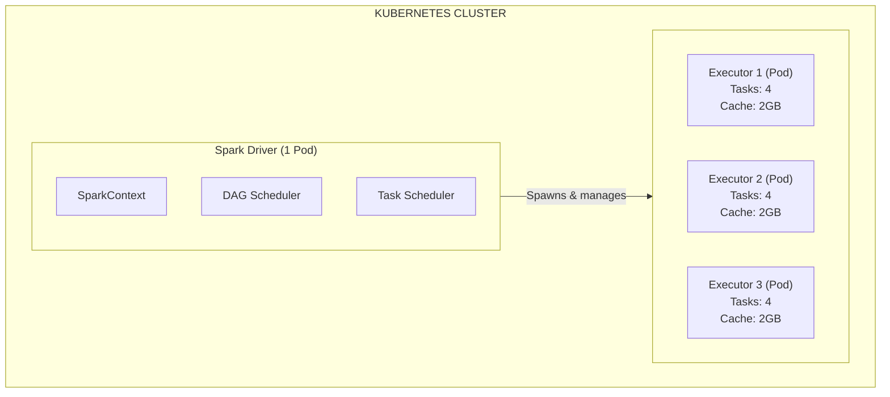
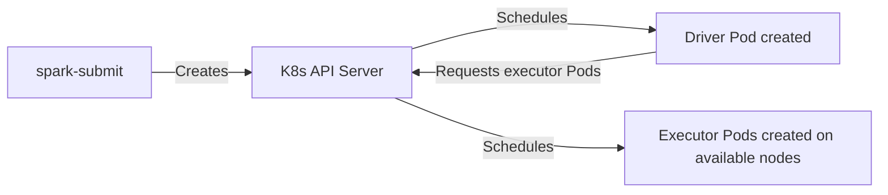
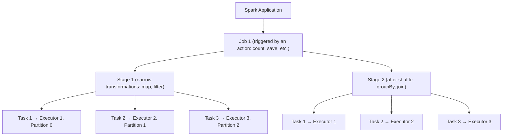
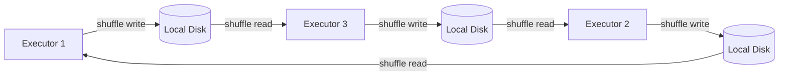
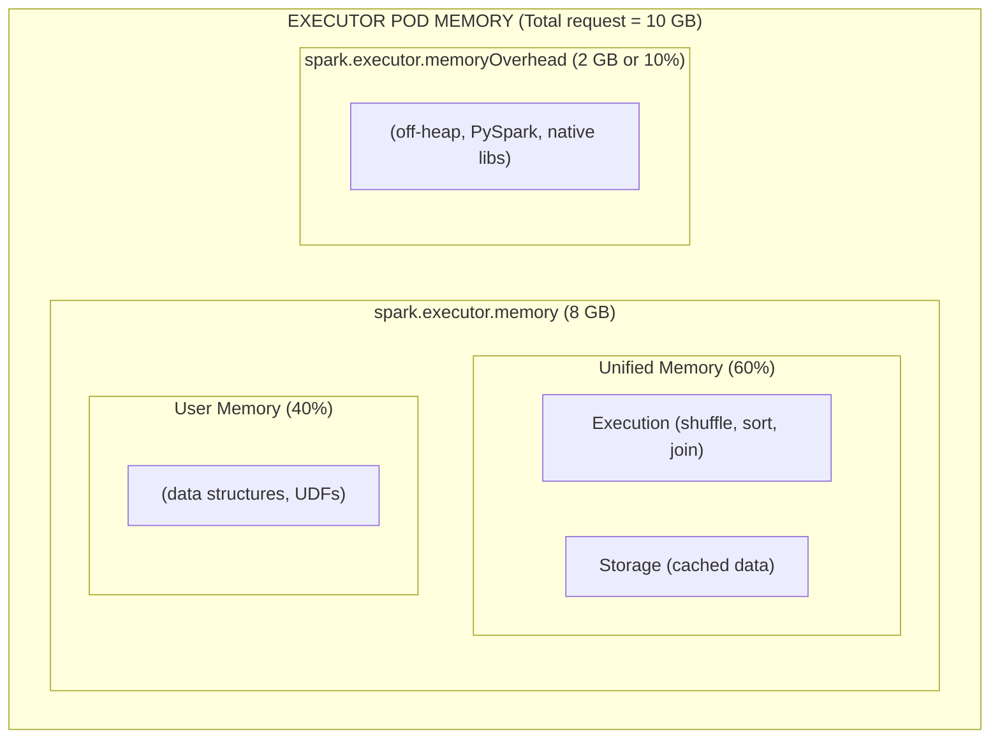

> **Discipline Module** | Complexity: `[MEDIUM]` | Time: 3 hours

## Prerequisites

Before starting this module:
- **Required**: Kubernetes Jobs and CronJobs — Understanding batch workloads on Kubernetes
- **Required**: Basic Python programming knowledge
- **Recommended**: [Module 1.1 — Stateful Workloads & Storage](../module-1.1-stateful-workloads/) — Storage fundamentals
- **Recommended**: Familiarity with SQL and data manipulation concepts

---

## What You'll Be Able to Do

After completing this module, you will be able to:

- **Implement Apache Spark on Kubernetes using spark-submit or the Spark Operator for batch and streaming jobs**
- **Design Spark cluster configurations that optimize executor sizing, memory allocation, and shuffle performance**
- **Configure dynamic allocation and autoscaling for Spark workloads to balance cost and performance**
- **Diagnose common Spark failures — OOM errors, shuffle spills, data skew — in Kubernetes environments**

## Why This Module Matters

Not everything needs to happen in real time.

Stream processing gets the hype, but the reality is that the vast majority of data processing work is still batch: nightly ETL jobs, monthly reports, model training data preparation, log compaction, data quality checks, regulatory exports. These jobs process terabytes of data, run for minutes to hours, and then shut down. They do not need millisecond latency — they need **throughput, reliability, and cost efficiency**.

Apache Spark is the undisputed king of batch processing. It processes petabytes of data at companies like Netflix, Apple, NASA, and the European Bioinformatics Institute. Since Spark 2.3, Kubernetes has been a first-class scheduler for Spark workloads, and since Spark 3.1, Kubernetes support reached general availability.

Running Spark on Kubernetes is a paradigm shift from the traditional Hadoop/YARN model. Instead of maintaining a permanent cluster that sits idle between jobs, you spin up ephemeral Spark clusters on demand, process your data, and release the resources. This aligns perfectly with Kubernetes' declarative model and cloud-native cost optimization.

This module teaches you how Spark works on Kubernetes, how to optimize it for real workloads, and how to operate it in production using the Spark Operator.

---

## Did You Know?

- **Spark was created at UC Berkeley's AMPLab in 2009** as a research project to address the inefficiency of MapReduce. The key insight: keeping intermediate data in memory instead of writing it to HDFS between stages made iterative algorithms 100x faster.
- **The world record for sorting 100 TB of data was set by Spark in 2014.** It used 206 machines and finished in 23 minutes — beating the previous Hadoop MapReduce record that used 2,100 machines. Spark used 10x fewer machines and was 3x faster.
- **Spark's native Kubernetes support was controversial.** The Spark community debated for years whether to add a third resource manager (after standalone and YARN). Kubernetes won because it eliminated the need for a separate, always-on cluster — Spark Pods start, run, and die like any other Kubernetes workload.

---

## Spark Architecture on Kubernetes

### The Driver and Executor Model

Every Spark application has two types of processes:



**Driver Pod**: Created first. Plans the execution, divides work into stages and tasks, distributes tasks to executors, collects results. If the driver dies, the entire job fails.

**Executor Pods**: Created by the driver via the Kubernetes API. Each executor runs multiple tasks in parallel, caches data in memory, and reports results back to the driver. When the job finishes, executors are terminated.

> **Stop and think**: If the driver Pod fails due to an Out Of Memory (OOM) error or node eviction, what happens to the executor Pods? Since the driver is the brain that coordinates everything, its failure terminates the entire Spark application, and all associated executor Pods will be cleaned up by Kubernetes.

### How Spark Submits Jobs to Kubernetes



Unlike YARN, where a permanent cluster manager allocates resources, Kubernetes IS the cluster manager. Spark talks directly to the Kubernetes API server to create and manage Pods. No YARN, no Mesos, no standalone cluster — just Kubernetes.

### The Execution Model: Jobs, Stages, Tasks



A **shuffle** is the most expensive operation — it redistributes data across executors. Shuffles happen during wide transformations (groupBy, join, repartition). Minimizing shuffles is the single most important Spark optimization.

---

## The Spark Operator

### Why Not Just Use spark-submit?

Running `spark-submit` directly works for ad-hoc jobs. But for production, you need:
- Scheduled recurring jobs
- Automatic retries on failure
- Monitoring and metrics
- Consistent configuration management
- GitOps-compatible declarative definitions

> **Pause and predict**: If `spark-submit` works fine from your local terminal, why might relying on it be dangerous for a production data pipeline running at 3 AM?

The Spark Operator (maintained by Kubeflow) wraps Spark jobs in a Kubernetes Custom Resource, giving you all of these capabilities declaratively.

### Installing the Spark Operator

```bash
# Add the Helm repository
helm repo add spark-operator https://kubeflow.github.io/spark-operator
helm repo update

# Install the operator
kubectl create namespace spark
helm install spark-operator spark-operator/spark-operator \
  --namespace spark \
  --set webhook.enable=true \
  --set sparkJobNamespaces[0]=spark \
  --set serviceAccounts.spark.create=true \
  --set serviceAccounts.spark.name=spark

kubectl -n spark wait --for=condition=Available \
  deployment/spark-operator-controller --timeout=120s
```

### SparkApplication Custom Resource

```yaml
# spark-etl-job.yaml
apiVersion: sparkoperator.k8s.io/v1beta2
kind: SparkApplication
metadata:
  name: daily-etl
  namespace: spark
spec:
  type: Python
  pythonVersion: "3"
  mode: cluster
  image: my-registry.io/spark-etl:v1.8.0
  imagePullPolicy: Always
  mainApplicationFile: local:///opt/spark/work-dir/etl.py
  arguments:
    - "--date"
    - "2026-03-24"
    - "--input"
    - "s3a://data-lake/raw/events/"
    - "--output"
    - "s3a://data-lake/processed/events/"
  sparkVersion: "3.5.4"
  restartPolicy:
    type: OnFailure
    onFailureRetries: 3
    onFailureRetryInterval: 60
    onSubmissionFailureRetries: 2
    onSubmissionFailureRetryInterval: 30
  sparkConf:
    spark.kubernetes.allocation.batch.size: "5"
    spark.sql.adaptive.enabled: "true"
    spark.sql.adaptive.coalescePartitions.enabled: "true"
    spark.sql.adaptive.skewJoin.enabled: "true"
    spark.serializer: org.apache.spark.serializer.KryoSerializer
    spark.hadoop.fs.s3a.impl: org.apache.hadoop.fs.s3a.S3AFileSystem
    spark.hadoop.fs.s3a.aws.credentials.provider: com.amazonaws.auth.WebIdentityTokenCredentialsProvider
  driver:
    cores: 2
    coreLimit: "2000m"
    memory: "4096m"
    labels:
      role: driver
    serviceAccount: spark
    env:
      - name: AWS_REGION
        value: us-east-1
  executor:
    cores: 2
    coreLimit: "2000m"
    memory: "8192m"
    memoryOverhead: "2048m"
    instances: 5
    labels:
      role: executor
    env:
      - name: AWS_REGION
        value: us-east-1
    volumeMounts:
      - name: spark-local-dir
        mountPath: /tmp/spark-local
  volumes:
    - name: spark-local-dir
      emptyDir:
        sizeLimit: 20Gi
```

### ScheduledSparkApplication for Recurring Jobs

```yaml
# scheduled-spark-job.yaml
apiVersion: sparkoperator.k8s.io/v1beta2
kind: ScheduledSparkApplication
metadata:
  name: nightly-etl
  namespace: spark
spec:
  schedule: "0 3 * * *"     # Every night at 3 AM
  concurrencyPolicy: Forbid  # Don't overlap runs
  successfulRunHistoryLimit: 5
  failedRunHistoryLimit: 10
  template:
    type: Python
    pythonVersion: "3"
    mode: cluster
    image: my-registry.io/spark-etl:v1.8.0
    mainApplicationFile: local:///opt/spark/work-dir/etl.py
    sparkVersion: "3.5.4"
    restartPolicy:
      type: OnFailure
      onFailureRetries: 3
      onFailureRetryInterval: 120
    driver:
      cores: 2
      memory: "4096m"
      serviceAccount: spark
    executor:
      cores: 2
      memory: "8192m"
      instances: 10
```

---

## Image Optimization

### The Problem with Spark Images

The default Spark Docker image is over 1 GB. When you spin up 50 executors, that is 50 GB of image pulls — which adds minutes to job startup.

> **Stop and think**: Why is downloading a 1 GB image on 50 nodes simultaneously a problem for a Kubernetes cluster? Consider the impact on the container runtime, network bandwidth, and the startup time of your data pipeline.

### Building Optimized Images

```dockerfile
# Dockerfile.spark
FROM apache/spark-py:3.5.4 AS base

# Stage 1: Add only the dependencies you need
FROM base AS deps
USER root
COPY requirements.txt /tmp/
RUN pip install --no-cache-dir -r /tmp/requirements.txt && \
    rm -rf /root/.cache/pip /tmp/requirements.txt

# Stage 2: Add application code
FROM deps AS app
COPY --chown=spark:spark etl.py /opt/spark/work-dir/
COPY --chown=spark:spark lib/ /opt/spark/work-dir/lib/

USER spark
WORKDIR /opt/spark/work-dir
```

**Image optimization strategies:**

| Strategy | Impact | How |
|----------|--------|-----|
| Multi-stage builds | 20-40% smaller | Separate build deps from runtime |
| Use Java 17 base image | 15% smaller | Java 17 has smaller default modules |
| Pre-install dependencies | Faster startup | Dependencies cached in image, not installed at runtime |
| Image caching on nodes | 10x faster pull | Use `imagePullPolicy: IfNotPresent` and pre-pull |
| Pin exact versions | Reproducible | Never use `latest` tags |

### Pre-pulling Images

For large clusters, pre-pull the Spark image on all nodes:

```yaml
# spark-image-prepull.yaml
apiVersion: apps/v1
kind: DaemonSet
metadata:
  name: spark-image-prepull
  namespace: spark
spec:
  selector:
    matchLabels:
      app: spark-prepull
  template:
    metadata:
      labels:
        app: spark-prepull
    spec:
      initContainers:
        - name: prepull
          image: my-registry.io/spark-etl:v1.8.0
          command: ["echo", "Image pulled successfully"]
          resources:
            requests:
              cpu: 10m
              memory: 16Mi
      containers:
        - name: pause
          image: registry.k8s.io/pause:3.10
          resources:
            requests:
              cpu: 10m
              memory: 16Mi
```

---

## Shuffle Data Management

### Why Shuffle Is Spark's Achilles Heel

During a shuffle (e.g., `groupBy`, `join`), every executor writes intermediate data to local disk, and every other executor reads from it. On Kubernetes, this means:



If an executor dies before the shuffle data is read, the entire stage must be recomputed. On Kubernetes, where Pods are ephemeral, this is a real risk.

### Solutions for Shuffle Data

**Option 1: emptyDir with SSD (simplest)**

```yaml
executor:
  volumeMounts:
    - name: spark-local
      mountPath: /tmp/spark-local
  volumes:
    - name: spark-local
      emptyDir:
        sizeLimit: 50Gi
sparkConf:
  spark.local.dir: /tmp/spark-local
```

**Option 2: hostPath with Local SSD (fastest)**

```yaml
executor:
  volumeMounts:
    - name: spark-local
      mountPath: /tmp/spark-local
  volumes:
    - name: spark-local
      hostPath:
        path: /mnt/spark-scratch
        type: DirectoryOrCreate
sparkConf:
  spark.local.dir: /tmp/spark-local
```

**Option 3: External Shuffle Service (most resilient)**

The external shuffle service stores shuffle data outside executor Pods, so if an executor dies, the shuffle data survives:

```yaml
sparkConf:
  spark.shuffle.service.enabled: "true"
  spark.kubernetes.shuffle.service.name: spark-shuffle
  spark.kubernetes.shuffle.service.port: "7337"
```

### Adaptive Query Execution (AQE)

Spark 3.0+ includes AQE, which optimizes shuffle at runtime:

```yaml
sparkConf:
  # Enable AQE (game-changer for shuffle optimization)
  spark.sql.adaptive.enabled: "true"

  # Automatically coalesce small partitions after shuffle
  spark.sql.adaptive.coalescePartitions.enabled: "true"
  spark.sql.adaptive.coalescePartitions.minPartitionSize: 64MB

  # Handle skewed data by splitting hot partitions
  spark.sql.adaptive.skewJoin.enabled: "true"
  spark.sql.adaptive.skewJoin.skewedPartitionFactor: "5"

  # Dynamically switch join strategies based on data size
  spark.sql.adaptive.localShuffleReader.enabled: "true"
```

> **Pause and predict**: If you are processing a dataset where 80% of the sales records belong to a single city, what will happen during a `groupBy("city")` operation without AQE enabled?

AQE is so effective that it should be enabled for every Spark 3+ job. It often eliminates the need for manual tuning of partition counts.

---

## Dynamic Executor Allocation

### The Problem with Fixed Executors

A Spark job's resource needs change over time. A narrow stage (map, filter) might need 5 executors, while a wide stage (join across 100 GB) might need 50. With fixed allocation, you either waste resources or lack them.

### Dynamic Allocation on Kubernetes

```yaml
sparkConf:
  # Enable dynamic allocation
  spark.dynamicAllocation.enabled: "true"
  spark.dynamicAllocation.shuffleTracking.enabled: "true"

  # Scaling parameters
  spark.dynamicAllocation.minExecutors: "2"
  spark.dynamicAllocation.maxExecutors: "50"
  spark.dynamicAllocation.initialExecutors: "5"

  # Scale-up: request new executors after 1 second of pending tasks
  spark.dynamicAllocation.schedulerBacklogTimeout: "1s"

  # Scale-down: remove idle executors after 60 seconds
  spark.dynamicAllocation.executorIdleTimeout: "60s"

  # Keep executors with cached data longer
  spark.dynamicAllocation.cachedExecutorIdleTimeout: "300s"
```

**How it works on Kubernetes:**

```mermaid
gantt
    title Dynamic Executor Allocation over Time
    dateFormat  s
    axisFormat %S
    
    section Stage 1 (narrow)
    2 executors : 0, 10s
    section Stage 2 (wide)
    20 executors (scaled up) : 10, 30s
    section Stage 3 (narrow)
    4 executors (scaled down) : 30, 45s
    section Stage 4 (output)
    2 executors (scaled down) : 45, 55s
```



The driver requests new executor Pods from Kubernetes when tasks are queued and removes idle Pods when work is done. `shuffleTracking.enabled: true` ensures executors with unrequested shuffle data are not removed prematurely.

---

## Memory Configuration

### Spark Memory Layout on Kubernetes



**Critical settings:**

| Setting | Default | Recommendation |
|---------|---------|---------------|
| `spark.executor.memory` | 1g | Set based on workload. 4-16 GB typical |
| `spark.executor.memoryOverhead` | max(384MB, 10% of memory) | For PySpark: set to 20-30% of executor memory |
| `spark.memory.fraction` | 0.6 | Increase to 0.7-0.8 for cache-heavy workloads |
| `spark.memory.storageFraction` | 0.5 | Increase for read-heavy, decrease for join-heavy |

**PySpark warning:** PySpark runs a Python process alongside the JVM in each executor. Python memory usage is NOT tracked by Spark's memory manager — it uses the memoryOverhead allocation. If you see OOMKilled errors with PySpark, increase `memoryOverhead`, not `memory`.

---

## Common Mistakes

| Mistake | Why It Happens | What To Do Instead |
|---------|---------------|-------------------|
| Not setting `memoryOverhead` for PySpark | Default 10% is enough for Scala | PySpark needs 20-30%. Python runs outside the JVM |
| Using too few or too many partitions | Not thinking about parallelism | Rule of thumb: 2-4 partitions per executor core. Use AQE to auto-tune |
| Not enabling AQE on Spark 3+ | Unaware of the feature | Always enable `spark.sql.adaptive.enabled=true`. It is free performance |
| Running the driver with too little memory | "The driver does not process data" | The driver collects results, tracks metadata, and plans queries. Give it 2-4 GB minimum |
| Using `collect()` on large datasets | Works in notebooks on small data | `collect()` pulls all data to the driver, causing OOM. Use `take()`, `show()`, or write to storage |
| Not configuring local scratch space | Default emptyDir is small | Configure emptyDir with `sizeLimit` or use hostPath for shuffle-heavy jobs |
| Ignoring data skew | "The data is evenly distributed" | Check partition sizes. One oversized partition can make one executor 100x slower than others. Enable AQE skew join handling |
| Using `latest` image tags | Convenience | Pin exact versions. A surprise image update can break your job in production |
| Not setting CPU limits | Following generic K8s advice | Spark NEEDS burst CPU. Set requests but consider omitting limits, or set limits = 2x requests |

---

## Quiz

**Question 1:** Your team is migrating a legacy Hadoop cluster to Kubernetes. A data engineer asks why they cannot just keep the YARN resource manager and run it inside Kubernetes, or how the architectural model actually changes when Spark runs natively on Kubernetes. Explain the key architectural differences they need to understand.

<details>
<summary>Show Answer</summary>

When moving from YARN to Kubernetes, the most fundamental shift is the elimination of a permanent, always-on cluster manager. On YARN, you maintain long-running NodeManager and ResourceManager processes that wait for jobs. On Kubernetes, Spark Pods are entirely ephemeral—the driver and executor Pods are created natively via the Kubernetes API only when a job is submitted, and they are destroyed immediately after completion. Furthermore, Kubernetes manages these resources alongside all other workloads (like web APIs and databases), whereas YARN isolates Hadoop workloads. Finally, YARN relies on a persistent external shuffle service built into the NodeManagers, while Kubernetes requires explicit configuration for shuffle data survival since executor Pods and their local storage disappear upon failure.

</details>

**Question 2:** You have deployed a PySpark ETL job on Kubernetes that joins two large datasets. The job consistently fails with an `OOMKilled` status on the executor Pods. You verify that `spark.executor.memory` is set to 16GB, which should be plenty for the dataset size. Why is the job still being killed, and how does `spark.executor.memoryOverhead` factor into the solution?

<details>
<summary>Show Answer</summary>

The job is failing because PySpark runs Python worker processes entirely outside the JVM heap, and these processes are exceeding the container's total memory limit. In Spark, `spark.executor.memory` only controls the JVM heap size, which does not account for memory used by pandas DataFrames, numpy arrays, or Python UDFs. The `spark.executor.memoryOverhead` setting defines the amount of off-heap memory allocated to the container to accommodate these non-JVM processes. By default, this is only 10% of the executor memory, which is notoriously insufficient for Python-heavy data processing. To fix the `OOMKilled` issue, you must significantly increase the memory overhead (typically to 20-30% or more) so Kubernetes provisions enough total container memory to support the Python runtime alongside the JVM.

</details>

**Question 3:** A data scientist submits a Spark 3.5 job that filters a massive dataset and then joins it with a lookup table. The job is painfully slow, and upon checking the Spark UI, you notice that the join stage consists of 10,000 tasks, but 9,998 of them finish in milliseconds while two tasks take 45 minutes. How can Adaptive Query Execution (AQE) automatically resolve this specific issue, and what other optimizations does it apply?

<details>
<summary>Show Answer</summary>

Adaptive Query Execution (AQE) resolves this exact scenario by applying runtime optimizations based on actual data statistics rather than flawed upfront estimates. The scenario describes severe data skew, which AQE handles by automatically detecting the oversized partitions and splitting them into smaller sub-partitions, allowing multiple executors to process the skewed data in parallel. Beyond skew join optimization, AQE dynamically coalesces small partitions after a shuffle, merging them to reduce the overhead of launching thousands of tiny tasks. Additionally, if AQE detects that a dataset has been filtered down to a small enough size, it can dynamically switch the join strategy from an expensive sort-merge join to a highly efficient broadcast hash join on the fly.

</details>

**Question 4:** During a heavy aggregation job running on your Kubernetes cluster, a node experiences CPU pressure and evicts one of the Spark executor Pods. Although the cluster has plenty of capacity to spin up a replacement executor, the Spark job suddenly drops back to a previous stage and begins recomputing hours of work. Why does this happen on Kubernetes, and how does it differ from the YARN environment your team used previously?

<details>
<summary>Show Answer</summary>

This cascading recomputation occurs because Spark executor Pods on Kubernetes are ephemeral, and their default local storage (`emptyDir`) is permanently deleted when the Pod is evicted. During a shuffle, executors write intermediate data to their local disks for other executors to read; if the Pod dies before the data is consumed, the entire upstream stage must be rerun to regenerate that lost shuffle data. In contrast, YARN runs a persistent external shuffle service on its long-running NodeManagers, meaning shuffle data safely survives the death of any individual executor process. To achieve similar resilience on Kubernetes, you must either deploy a dedicated external shuffle service, mount persistent volumes for scratch space, or enable shuffle tracking with dynamic allocation so the driver knows not to scale down executors holding unread shuffle files.

</details>

**Question 5:** An analyst complains that their scheduled PySpark job is taking 2 hours to process 100 GB of Parquet data using 10 executors (4 cores, 8 GB memory each). Historically, similar jobs finish in under 20 minutes. You are tasked with debugging the performance bottleneck in the production Kubernetes environment. What are the top three specific areas you would investigate in the Spark UI to diagnose the root cause?

<details>
<summary>Show Answer</summary>

First, you should investigate potential data skew by checking the "Stages" tab in the Spark UI; if the summary metrics show that the maximum task duration is vastly longer than the median, a few stranded tasks are holding up the entire job. Second, examine the shuffle volume (Shuffle Read/Write bytes) for each stage to see if the query plan is generating excessive network I/O, which often indicates missing filter pushdowns or unoptimized joins that require AQE intervention. Third, check the resource utilization and task concurrency; if the CPU usage is low but Garbage Collection (GC) time is high, the executors are experiencing memory pressure and need larger heap allocations. Alternatively, if tasks are simply waiting in the queue, you may need to increase the partition count to ensure all 40 available cores are fully utilized.

</details>

---

## Hands-On Exercise: PySpark Job Processing CSV Data on Kubernetes

### Objective

Deploy a PySpark job using the Spark Operator that reads CSV data, performs aggregations, and writes results in Parquet format. You will observe the Spark UI, understand executor behavior, and experiment with tuning parameters.

### Environment Setup

```bash
# Create the kind cluster
kind create cluster --name spark-lab

# Install the Spark Operator
kubectl create namespace spark
helm repo add spark-operator https://kubeflow.github.io/spark-operator
helm repo update
helm install spark-operator spark-operator/spark-operator \
  --namespace spark \
  --set webhook.enable=true \
  --set sparkJobNamespaces[0]=spark \
  --set serviceAccounts.spark.create=true \
  --set serviceAccounts.spark.name=spark

kubectl -n spark wait --for=condition=Available \
  deployment/spark-operator-controller --timeout=120s
```

### Step 1: Create Sample Data

```bash
# Create a ConfigMap with a Python script that generates sample CSV data
kubectl -n spark create configmap data-generator --from-literal=generate.py='
import csv
import random
import io
import os

random.seed(42)
cities = ["New York", "Los Angeles", "Chicago", "Houston", "Phoenix",
          "Philadelphia", "San Antonio", "San Diego", "Dallas", "Austin"]
categories = ["Electronics", "Clothing", "Food", "Books", "Sports",
              "Home", "Garden", "Automotive", "Health", "Toys"]

output_dir = "/data/input"
os.makedirs(output_dir, exist_ok=True)

# Generate 3 CSV files with 50,000 rows each
for file_num in range(3):
    filepath = f"{output_dir}/sales_{file_num}.csv"
    with open(filepath, "w", newline="") as f:
        writer = csv.writer(f)
        writer.writerow(["order_id", "city", "category", "amount", "quantity", "date"])
        for i in range(50000):
            order_id = f"ORD-{file_num}-{i:06d}"
            city = random.choice(cities)
            category = random.choice(categories)
            amount = round(random.uniform(5.0, 500.0), 2)
            quantity = random.randint(1, 20)
            day = random.randint(1, 28)
            month = random.randint(1, 12)
            date = f"2025-{month:02d}-{day:02d}"
            writer.writerow([order_id, city, category, amount, quantity, date])
    print(f"Generated {filepath}")

print("Data generation complete: 150,000 rows across 3 files")
'

# Run the generator
kubectl -n spark run data-gen --rm -it --restart=Never \
  --image=python:3.12-slim \
  --overrides='{
    "spec": {
      "containers": [{
        "name": "data-gen",
        "image": "python:3.12-slim",
        "command": ["python", "/scripts/generate.py"],
        "volumeMounts": [
          {"name": "scripts", "mountPath": "/scripts"},
          {"name": "data", "mountPath": "/data"}
        ]
      }],
      "volumes": [
        {"name": "scripts", "configMap": {"name": "data-generator"}},
        {"name": "data", "persistentVolumeClaim": {"claimName": "spark-data"}}
      ]
    }
  }'
```

But first, create the PVC:

```yaml
# spark-data-pvc.yaml
apiVersion: v1
kind: PersistentVolumeClaim
metadata:
  name: spark-data
  namespace: spark
spec:
  accessModes:
    - ReadWriteOnce
  resources:
    requests:
      storage: 5Gi
```

```bash
kubectl apply -f spark-data-pvc.yaml

# Now run the data generator (repeat the run command above)
```

### Step 2: Create the PySpark Application

```bash
# Create a ConfigMap with the PySpark ETL script
kubectl -n spark create configmap spark-etl --from-literal=etl.py='
from pyspark.sql import SparkSession
from pyspark.sql import functions as F

spark = SparkSession.builder \
    .appName("SalesETL") \
    .getOrCreate()

print("Reading CSV data...")
df = spark.read.csv("/data/input/*.csv", header=True, inferSchema=True)
print(f"Total records: {df.count()}")

# Aggregation 1: Revenue by city
city_revenue = df.groupBy("city") \
    .agg(
        F.sum("amount").alias("total_revenue"),
        F.avg("amount").alias("avg_order_value"),
        F.count("*").alias("total_orders"),
        F.sum("quantity").alias("total_items")
    ) \
    .orderBy(F.desc("total_revenue"))

print("\n=== Revenue by City ===")
city_revenue.show(10, truncate=False)

# Aggregation 2: Top categories by month
monthly_categories = df \
    .withColumn("month", F.month(F.to_date("date"))) \
    .groupBy("month", "category") \
    .agg(
        F.sum("amount").alias("revenue"),
        F.count("*").alias("orders")
    ) \
    .orderBy("month", F.desc("revenue"))

print("\n=== Monthly Category Performance ===")
monthly_categories.show(20, truncate=False)

# Aggregation 3: City + Category cross-tabulation
cross_tab = df.groupBy("city", "category") \
    .agg(F.sum("amount").alias("revenue")) \
    .orderBy(F.desc("revenue"))

# Write results as Parquet
print("Writing results to Parquet...")
city_revenue.write.mode("overwrite").parquet("/data/output/city_revenue")
monthly_categories.write.mode("overwrite").parquet("/data/output/monthly_categories")
cross_tab.write.mode("overwrite").parquet("/data/output/cross_tab")

print("ETL job complete!")
spark.stop()
'
```

### Step 3: Submit the Spark Job

```yaml
# spark-etl-app.yaml
apiVersion: sparkoperator.k8s.io/v1beta2
kind: SparkApplication
metadata:
  name: sales-etl
  namespace: spark
spec:
  type: Python
  pythonVersion: "3"
  mode: cluster
  image: apache/spark-py:3.5.4
  imagePullPolicy: IfNotPresent
  mainApplicationFile: local:///scripts/etl.py
  sparkVersion: "3.5.4"
  restartPolicy:
    type: OnFailure
    onFailureRetries: 2
    onFailureRetryInterval: 30
  sparkConf:
    spark.sql.adaptive.enabled: "true"
    spark.sql.adaptive.coalescePartitions.enabled: "true"
    spark.serializer: org.apache.spark.serializer.KryoSerializer
    spark.ui.prometheus.enabled: "true"
  driver:
    cores: 1
    coreLimit: "1200m"
    memory: "1024m"
    serviceAccount: spark
    labels:
      role: driver
    volumeMounts:
      - name: etl-script
        mountPath: /scripts
      - name: data
        mountPath: /data
  executor:
    cores: 1
    coreLimit: "1200m"
    memory: "1024m"
    memoryOverhead: "512m"
    instances: 2
    labels:
      role: executor
    volumeMounts:
      - name: data
        mountPath: /data
  volumes:
    - name: etl-script
      configMap:
        name: spark-etl
    - name: data
      persistentVolumeClaim:
        claimName: spark-data
```

```bash
kubectl apply -f spark-etl-app.yaml

# Watch the job progress
kubectl -n spark get sparkapplication sales-etl -w

# Check driver logs for output
kubectl -n spark logs -f -l spark-role=driver,sparkoperator.k8s.io/app-name=sales-etl
```

### Step 4: Access the Spark UI

```bash
# Port-forward to the Spark UI (while the job is running)
kubectl -n spark port-forward svc/sales-etl-ui-svc 4040:4040 &

# Open http://localhost:4040 in your browser
# Explore:
# - Jobs tab: see all Spark jobs triggered
# - Stages tab: see individual stages and task distribution
# - Storage tab: see cached data
# - Environment tab: see all Spark configuration
# - SQL tab: see query plans for DataFrame operations
```

### Step 5: Verify Results

```bash
# Check the output files
kubectl -n spark run verify --rm -it --restart=Never \
  --image=python:3.12-slim \
  --overrides='{
    "spec": {
      "containers": [{
        "name": "verify",
        "image": "python:3.12-slim",
        "command": ["sh", "-c", "ls -la /data/output/ && ls -la /data/output/city_revenue/ && echo Done"],
        "volumeMounts": [
          {"name": "data", "mountPath": "/data"}
        ]
      }],
      "volumes": [
        {"name": "data", "persistentVolumeClaim": {"claimName": "spark-data"}}
      ]
    }
  }'

# You should see Parquet files in each output directory
```

### Step 6: Clean Up

```bash
kubectl -n spark delete sparkapplication sales-etl
kubectl -n spark delete pvc spark-data
kubectl -n spark delete configmap data-generator spark-etl
helm -n spark uninstall spark-operator
kubectl delete namespace spark
kind delete cluster --name spark-lab
```

### Success Criteria

You have completed this exercise when you:
- [ ] Installed the Spark Operator on Kubernetes
- [ ] Generated 150,000 rows of sample CSV data
- [ ] Submitted a PySpark job via SparkApplication CR
- [ ] Viewed aggregation results in driver logs (city revenue, monthly categories)
- [ ] Verified Parquet output files were written
- [ ] Explored the Spark UI (Jobs, Stages, SQL tabs)

---

## Key Takeaways

1. **Spark on Kubernetes eliminates permanent clusters** — Executor Pods are created on demand and destroyed after the job finishes, saving resources and simplifying operations.
2. **The Spark Operator makes Spark a Kubernetes-native workload** — SparkApplication CRs enable declarative job management, scheduling, retries, and GitOps workflows.
3. **AQE is a must-enable feature** — Adaptive Query Execution optimizes shuffles, handles data skew, and switches join strategies at runtime with zero code changes.
4. **Memory configuration is critical for PySpark** — Python runs outside the JVM, so `memoryOverhead` must be sized appropriately or OOMKilled errors will plague your jobs.
5. **Dynamic allocation scales executors with demand** — Combined with Kubernetes autoscaling, this ensures you pay only for the compute you actually use.

---

## Further Reading

**Books:**
- **"Learning Spark" (2nd edition)** — Jules Damji, Brooke Wenig, Tathagata Das, Denny Lee (O'Reilly)
- **"Spark: The Definitive Guide"** — Bill Chambers, Matei Zaharia (O'Reilly)

**Articles:**
- **"Running Apache Spark on Kubernetes"** — Apache Spark documentation (spark.apache.org/docs/latest/running-on-kubernetes.html)
- **"Spark Operator Documentation"** — Kubeflow (github.com/kubeflow/spark-operator)

**Talks:**
- **"Apache Spark on Kubernetes: Best Practices"** — Holden Karau, Spark Summit (YouTube)
- **"Deep Dive into Spark on Kubernetes"** — Ilan Filonenko, KubeCon NA 2023 (YouTube)

---

## Summary

Apache Spark on Kubernetes brings cloud-native principles to batch processing: ephemeral compute, declarative configuration, and efficient resource utilization. The Spark Operator bridges the gap between Spark's execution model and Kubernetes' orchestration capabilities, enabling teams to run Spark jobs alongside their streaming, web, and database workloads on a single platform.

The key to success is understanding Spark's memory model, shuffle behavior, and the differences from the YARN world. With AQE enabled, proper memory configuration, and dynamic allocation, Spark on Kubernetes delivers excellent performance without the overhead of maintaining a dedicated Hadoop cluster.

---

## Next Module

Continue to [Module 1.5: Data Orchestration with Apache Airflow](../module-1.5-airflow/) to learn how to schedule, orchestrate, and monitor complex data pipelines that tie Spark, Flink, and other tools together.

---

*"Spark is the Swiss Army knife of big data. It does not do everything perfectly, but it does everything well enough that you rarely need another tool for batch."* — Reynold Xin, Spark co-creator