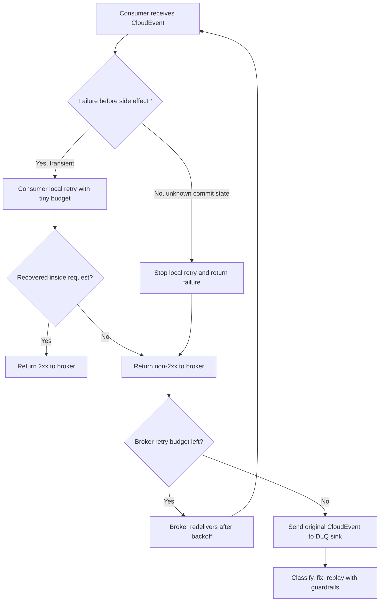

> **Complexity**: Advanced
>
> **Time to Complete**: 3.5 hours
>
> **Prerequisites**: [Module 1.2 - Apache Kafka on Kubernetes](../module-1.2-kafka/), [Module 1.7 - Event Streaming Fundamentals](../module-1.7-event-streaming-fundamentals/), Kubernetes Services and Deployments, HTTP request troubleshooting, and basic Redis familiarity

---

## What You'll Be Able to Do

After completing this module, you will be able to:

- **Design** a CloudEvents v1.0 event contract that separates routing metadata, payload schema, ordering hints, and trace context.
- **Compare** HTTP, Kafka, AMQP, NATS, and MQTT CloudEvents transport bindings against latency, throughput, ordering, and operational constraints.
- **Implement** Knative Eventing Broker, Trigger, Channel, and Subscription resources with retry, dead-letter, and Kafka-backed delivery settings.
- **Debug** duplicate event delivery by applying an idempotency window with Redis `SET NX` and clear retry behavior.
- **Evaluate** production risks in event-driven systems, including schema evolution, downstream amplification, trace propagation, and replay safety.

## Why This Module Matters

The checkout team shipped a harmless improvement.

Instead of calling inventory, billing, fraud, email, loyalty, analytics, and fulfillment directly, the service now emits one `order-placed` event.
The architecture diagram looks clean.
The checkout API is faster.
The teams are finally decoupled.

Then the first flash sale starts.

Inventory receives the same event twice and reserves two items.
Email retries a transient failure and sends customers duplicate receipts.
Fraud adds a new field to the payload and the fulfillment consumer crashes because its JSON parser rejects unknown fields.
Analytics replays a week of historical orders and accidentally triggers live loyalty credits.
The trace in the API gateway ends at the broker, so nobody can see which consumer introduced the delay.

Nothing in that failure requires Kafka to be broken.
Nothing requires Kubernetes to be unhealthy.
The system fails because the event contract did not carry enough meaning, the delivery path did not have a failure policy, and the consumers were not safe to run more than once.

CloudEvents fixes the first part by standardizing the envelope.
Knative Eventing fixes much of the Kubernetes wiring.
Idempotent consumer design fixes the uncomfortable truth that event-driven systems usually deliver at least once, not exactly once.

This module assumes you already understand the streaming mental model from Module 1.7: logs, partitions, retention, backpressure, and replay.
Here we move one layer up.
We design the event contract and the Kubernetes delivery path that make those streaming mechanics usable across teams.

> **Stop and think**: If a broker retries an event after a network timeout, how can the consumer know whether the first attempt failed before the business action or after it committed the business action?

## The Contract: CloudEvents as the Envelope

An event-driven architecture needs two contracts:

1. The **payload contract** describes the business data.
2. The **envelope contract** describes the event itself.

Teams often start with only the payload:

```json
{
  "orderId": "ord-1001",
  "customerId": "cus-9001",
  "total": 129.90,
  "currency": "USD"
}
```

That object is useful, but middleware cannot safely route it without understanding your business schema.
A broker does not know whether `orderId` is an idempotency key, a subject, or just a field.
A tracing system cannot infer the parent trace.
A schema registry cannot tell whether this payload is compatible with the previous version.

CloudEvents adds a small, standard envelope:

```json
{
  "specversion": "1.0",
  "id": "evt-20260518-000001",
  "source": "/checkout/orders",
  "type": "com.acme.orders.order-placed.v1",
  "subject": "orders/ord-1001",
  "time": "2026-05-18T09:15:30Z",
  "datacontenttype": "application/json",
  "dataschema": "https://schemas.acme.example/orders/order-placed/v1.json",
  "traceparent": "00-1af7651916cd43dd8448eb211c80319c-b9c7c989f97918e1-01",
  "partitionkey": "ord-1001",
  "sequence": "0000000000001001",
  "data": {
    "orderId": "ord-1001",
    "customerId": "cus-9001",
    "total": 129.90,
    "currency": "USD",
    "lines": [
      {
        "sku": "sku-wooden-train",
        "quantity": 1,
        "unitPrice": 129.90
      }
    ]
  }
}
```

CloudEvents does not force one broker, one language, or one payload format.
It gives every hop a shared vocabulary:

```text
+---------------- CloudEvents context ----------------+
| id              Unique event instance                |
| source          Producer or source scope             |
| specversion     CloudEvents spec version             |
| type            Event kind and semantic version      |
| subject         Business object within the source    |
| time            Occurrence timestamp                 |
| datacontenttype Payload media type                   |
| dataschema      Payload schema identifier            |
| extensions      Trace, partition, sequence, policy   |
+---------------------- data --------------------------+
| Domain payload: order fields, invoice fields, etc.   |
+------------------------------------------------------+
```

The separation matters because brokers and platform tools can route, filter, trace, and dead-letter events without opening the payload.
Consumers can evolve payload parsing without changing transport code.
Operators can inspect failed events and know where they came from.

### Required CloudEvents v1.0 Attributes

Every CloudEvent v1.0 must include four context attributes.

| Attribute | Type | What it means | Operator check |
|-----------|------|---------------|----------------|
| `id` | String | Unique identifier for the event within the producer's `source` scope | Use `source + id` as the deduplication identity |
| `source` | URI-reference | The context in which the event happened | Keep it stable when the same producer changes deployment names |
| `specversion` | String | The CloudEvents specification version | Use `1.0` unless you are intentionally testing a newer draft |
| `type` | String | The semantic event type | Version the meaning, not the transport |

The most important subtlety is `id`.
It is not required to be globally unique by itself.
It is unique in combination with `source`.
That means two producers may both emit `id: "123"`, but `source: "/checkout/orders"` and `source: "/billing/invoices"` make them different event identities.

Use `source + id` for deduplication.
Do not use only the payload's business ID.
One order can produce multiple legitimate events: placed, authorized, packed, shipped, refunded.

### Optional Core Attributes

Most production systems should use more than the required four.

| Attribute | Use it when | Common mistake |
|-----------|-------------|----------------|
| `datacontenttype` | The payload has a known media type such as `application/json` or `application/avro` | Omitting it and forcing every consumer to guess |
| `dataschema` | Consumers need a stable schema reference or registry lookup | Treating schema compatibility as a wiki convention |
| `subject` | You need to filter or troubleshoot by the business object | Hiding all identity inside `data` |
| `time` | Consumers need occurrence time, not broker arrival time | Setting it inconsistently across producers |

`subject` is not a replacement for the payload.
It is a routing and observability hint.
For an order system, `subject: "orders/ord-1001"` lets a generic trigger select a specific order family without parsing the JSON body.

`dataschema` should point to a durable schema identifier.
That can be an HTTPS URL, a schema registry URI, or an internal catalog path.
The important behavior is that incompatible changes get a different schema identifier.

### Extension Attributes That Matter in Production

CloudEvents extensions let you attach additional context attributes while keeping the same envelope model.
The extensions below are especially useful on Kubernetes.

| Extension | Type | Why it matters |
|-----------|------|----------------|
| `traceparent` | String | Carries W3C trace context across broker and consumer boundaries |
| `tracestate` | String | Carries vendor-specific trace state when your tracing system needs it |
| `partitionkey` | String | Communicates the key that should preserve per-entity ordering in partitioned transports |
| `sequence` | String | Communicates relative ordering within a source-defined sequence |

`traceparent` does not replace protocol headers.
For a direct HTTP hop, you normally send the W3C `traceparent` HTTP header and the CloudEvents `traceparent` extension when your event may cross transports.
When the event moves through Kafka or another broker, the CloudEvents extension keeps the original trace context with the event.

`partitionkey` is not magic ordering.
It is a hint that must be mapped into the transport.
For Kafka, it should become the record key.
For NATS JetStream, it may become a subject segment or message header depending on your design.
For HTTP, it is only metadata unless the receiver forwards it into a partitioned system.

`sequence` is also a hint.
If you need strict order, you still need a single ordered stream for that entity and consumers that process one event at a time for that key.
The sequence value helps detect gaps, stale updates, or replay mistakes.

> **Pause and predict**: A consumer sees `sequence: "0000000000001003"` for `subject: "orders/ord-1001"` but never saw sequence `0000000000001002`. Should it process immediately, wait, or alert? What changes if the consumer is an email sender versus an inventory projector?

## Transport Bindings: Same Event, Different Wire

CloudEvents has event formats and protocol bindings.
The event format describes how the event is serialized.
The protocol binding describes how CloudEvents attributes map onto a transport.

The same event can move as:

- HTTP headers plus a JSON body.
- Kafka headers plus record value.
- AMQP message properties plus body.
- NATS message headers plus body.
- MQTT user properties plus payload.

The binding choice is an operational decision.
It should follow workload shape, not fashion.

| Binding | Best fit | Latency posture | Throughput posture | Ordering posture | Kubernetes operator concern |
|---------|----------|-----------------|--------------------|------------------|-----------------------------|
| HTTP | Webhooks, Knative sinks, simple producer-to-broker ingress | Very low per hop, but request timeout bounded | Moderate unless fronted by queues | No inherent ordering | Backpressure appears as request failures and retries |
| Kafka | High-volume durable streams, replay, fan-out, analytics | Low to moderate depending on batching | Very high with partitions | Per partition when keying is correct | Partition count, retention, ISR health, consumer lag |
| AMQP | Enterprise messaging, routing keys, broker-mediated queues | Low in LAN deployments | High but broker topology dependent | Queue order can hold until redelivery or competing consumers interfere | Exchange and queue policy drift |
| NATS | Low-latency service events, edge control planes, JetStream durability | Very low for core NATS; JetStream adds durability cost | High for small messages | Subject and stream configuration dependent | Retention, ack wait, and subject hierarchy design |
| MQTT | IoT, unreliable networks, device telemetry | Low over constrained links | Moderate; optimized for many small device messages | Topic and QoS dependent, not a global log | Session state, retained messages, and device auth |

HTTP is the easiest way into Knative Eventing because Knative sinks receive CloudEvents over HTTP POST.
That does not mean HTTP should be your durable event store.
It means HTTP is a clean ingress and delivery shape.

Kafka is usually the durable backbone when the workload needs replay and high fan-out.
The tradeoff is operational: keys, partitions, retention, and consumer groups become part of your platform contract.

AMQP is often strong when routing topology is rich and messages are work items.
It is less natural as a long-term analytical event log.

NATS is excellent when the subject namespace is the architecture.
Core NATS favors speed and simplicity; JetStream adds persistence and replay.
Do not assume those modes have the same failure behavior.

MQTT shines when the producers are devices.
CloudEvents over MQTT can normalize device events before they enter the rest of the platform.

### Binary Versus Structured Mode

CloudEvents bindings often support two modes:

| Mode | Description | Example use |
|------|-------------|-------------|
| Binary | CloudEvents attributes map to transport metadata; payload stays as the body | HTTP `ce-type` headers plus JSON body |
| Structured | The whole CloudEvent, including `data`, is serialized as one envelope | A JSON CloudEvent stored as a message body |

Binary mode is ergonomic when the transport has good metadata support.
HTTP and Kafka both fit this pattern well.

Structured mode is easier to store, replay, and inspect as a single object.
It can be useful for DLQs because the failed event remains self-contained.

In practice, many platforms accept both at boundaries but choose one internally.
For the worked example in this module, we use HTTP binary mode at the Knative ingress because that is how most Knative sinks are exercised.

## Knative Eventing Primitives

Knative Eventing gives Kubernetes-native objects for event routing.
It does not remove the need to understand the broker underneath.
It gives platform teams a standard API surface.

```text
Producer
   |
   | CloudEvents over HTTP
   v
+--------+       +---------+       +----------+
| Broker | ----> | Trigger | ----> | Consumer |
+--------+       +---------+       +----------+
   |
   | optional channel-backed delivery
   v
+---------+      +--------------+
| Channel | ---> | Subscription |
+---------+      +--------------+
```

The four primitives in this module are:

| Primitive | What it represents | Use it when |
|-----------|--------------------|-------------|
| `Broker` | A named event pool that accepts CloudEvents | Producers should not know every consumer |
| `Trigger` | A filter and subscriber attached to a Broker | Consumers want selected event types |
| `Channel` | A brokerable event stream with subscriptions | You need explicit channel topology |
| `Subscription` | A Channel-to-subscriber binding | You want fan-out from a Channel |

### Broker With Kafka-Backed Delivery

This ConfigMap tells the channel-based Broker to use KafkaChannel as its backing channel.
Your cluster must have the Knative Kafka channel implementation installed.

```yaml
apiVersion: v1
kind: ConfigMap
metadata:
  name: kafka-channel
  namespace: knative-eventing
  annotations:
    platform.kubedojo.io/purpose: "default channel template for commerce brokers"
data:
  channel-template-spec: |
    apiVersion: messaging.knative.dev/v1beta1
    kind: KafkaChannel
    spec:
      numPartitions: 12
      replicationFactor: 3
```

Now create the Broker in the application namespace.

```yaml
apiVersion: eventing.knative.dev/v1
kind: Broker
metadata:
  name: commerce
  namespace: commerce
  annotations:
    eventing.knative.dev/broker.class: MTChannelBasedBroker
    platform.kubedojo.io/owner: "platform-events"
    platform.kubedojo.io/replay-policy: "dlq-reviewed-only"
spec:
  config:
    apiVersion: v1
    kind: ConfigMap
    name: kafka-channel
    namespace: knative-eventing
  delivery:
    retry: 5
    backoffPolicy: exponential
    backoffDelay: PT1S
    deadLetterSink:
      ref:
        apiVersion: v1
        kind: Service
        name: order-dlq
        namespace: commerce
```

This Broker accepts CloudEvents.
The `delivery` section is the broker-level safety net.
It does not make consumers idempotent.
It only controls how Knative retries failed delivery attempts and where it sends the event after the retry budget is exhausted.

### Trigger for a Specific Event Type

A Trigger selects events from a Broker and sends them to one subscriber.

```yaml
apiVersion: eventing.knative.dev/v1
kind: Trigger
metadata:
  name: order-placed-to-fulfillment
  namespace: commerce
  annotations:
    platform.kubedojo.io/team: "fulfillment"
    platform.kubedojo.io/runbook: "https://runbooks.acme.example/events/order-placed"
spec:
  broker: commerce
  filter:
    attributes:
      type: com.acme.orders.order-placed.v1
      source: /checkout/orders
  subscriber:
    ref:
      apiVersion: v1
      kind: Service
      name: idempotent-order-consumer
      namespace: commerce
  delivery:
    retry: 3
    backoffPolicy: exponential
    backoffDelay: PT0.5S
    deadLetterSink:
      ref:
        apiVersion: v1
        kind: Service
        name: order-dlq
        namespace: commerce
```

The Trigger filter uses CloudEvents attributes.
It does not inspect `data`.
That keeps routing fast, generic, and independent of payload parser changes.

### Channel for Explicit Fan-Out

A Channel is useful when the topology itself is part of the design.
For example, a platform team may expose an `order-audit` channel that multiple teams subscribe to.

```yaml
apiVersion: messaging.knative.dev/v1
kind: Channel
metadata:
  name: order-audit
  namespace: commerce
  annotations:
    platform.kubedojo.io/backing-store: "kafka"
    platform.kubedojo.io/retention: "7d"
spec:
  channelTemplate:
    apiVersion: messaging.knative.dev/v1beta1
    kind: KafkaChannel
    spec:
      numPartitions: 12
      replicationFactor: 3
  delivery:
    retry: 4
    backoffPolicy: exponential
    backoffDelay: PT1S
    deadLetterSink:
      ref:
        apiVersion: v1
        kind: Service
        name: order-dlq
        namespace: commerce
```

Broker and Channel are not interchangeable words.
A Broker is the common decoupling API for producers and consumers.
A Channel is a lower-level stream abstraction that Subscriptions attach to.
Some broker implementations use channels internally.

### Subscription From Channel to Consumer

A Subscription connects a Channel to a subscriber.

```yaml
apiVersion: messaging.knative.dev/v1
kind: Subscription
metadata:
  name: order-audit-to-warehouse-loader
  namespace: commerce
  annotations:
    platform.kubedojo.io/team: "data-platform"
    platform.kubedojo.io/slo: "events-visible-within-5m"
spec:
  channel:
    apiVersion: messaging.knative.dev/v1
    kind: Channel
    name: order-audit
  subscriber:
    ref:
      apiVersion: v1
      kind: Service
      name: warehouse-loader
      namespace: commerce
  reply:
    ref:
      apiVersion: messaging.knative.dev/v1
      kind: Channel
      name: order-audit-replies
      namespace: commerce
  delivery:
    retry: 3
    backoffPolicy: exponential
    backoffDelay: PT2S
    deadLetterSink:
      ref:
        apiVersion: v1
        kind: Service
        name: order-dlq
        namespace: commerce
```

Use Broker and Trigger for most application eventing.
Use Channel and Subscription when you intentionally manage the stream topology.

## Dead-Letter Queue Design

Dead-letter queues are not trash cans.
They are evidence.
They hold events that could not be delivered or processed within the allowed retry budget.

The central question is not "Do we need a DLQ?"
The central question is "Which component owns each retry?"



### Retry Ownership

| Retry layer | Good for | Bad for | Budget rule |
|-------------|----------|---------|-------------|
| Consumer retry | Short-lived dependency blips inside one request | Long outages, unknown commit state | Milliseconds to a few seconds |
| Broker retry | Subscriber unavailable, network timeout, cold start | Business validation failures | Small count with exponential backoff |
| DLQ replay | Fixed bugs, restored downstream service, manual remediation | Blind automatic reprocessing | Human or runbook gated |

Consumer retries should be tiny.
If the consumer retries for minutes, the broker sees one long request and cannot route the event elsewhere.
Long consumer retries also tie up pods and hide backpressure.

Broker retries should handle delivery failures.
They should not compensate for non-idempotent consumers.
If the consumer commits a side effect and then returns `500`, the broker cannot know that the side effect happened.

DLQ replay should be explicit.
The replay tool should preserve the original CloudEvents context unless you intentionally create a new event.
Add a replay marker such as `replayattempt` or `replayreason` if your platform standard allows it.

### DLQ Sink Shape

The DLQ sink can be a Knative Service, a Kafka topic, a Channel, or another addressable sink.
For teaching clarity, this module uses a Kubernetes Service.
In production, many teams store DLQ events in a durable topic or object store after the DLQ service receives them.

```yaml
apiVersion: v1
kind: Service
metadata:
  name: order-dlq
  namespace: commerce
  annotations:
    platform.kubedojo.io/purpose: "capture failed order events for review"
spec:
  selector:
    app: order-dlq
  ports:
    - name: http
      port: 80
      targetPort: 8080
```

```yaml
apiVersion: apps/v1
kind: Deployment
metadata:
  name: order-dlq
  namespace: commerce
spec:
  replicas: 2
  selector:
    matchLabels:
      app: order-dlq
  template:
    metadata:
      labels:
        app: order-dlq
    spec:
      containers:
        - name: sink
          image: ghcr.io/acme/order-dlq-sink:1.0.0
          ports:
            - containerPort: 8080
          env:
            - name: DLQ_BUCKET
              value: s3://commerce-event-dlq
            - name: REQUIRE_REPLAY_APPROVAL
              value: "true"
```

The DLQ service should store:

- The complete CloudEvent.
- Delivery metadata such as received time and failing sink.
- The HTTP status or error category when available.
- The consumer version that failed, if the sink reports it.
- A replay status: new, classified, fixed, replayed, ignored.

## Idempotent Consumers With Redis `SET NX`

At-least-once delivery means duplicates are normal.
They are not rare edge cases.
Every consumer that performs side effects must decide how it behaves when the same CloudEvent arrives again.

The baseline key is:

```text
idempotency key = "ce:" + source + ":" + id
```

Use the CloudEvents identity, not the payload identity.
The payload's `orderId` may be reused across different event types.
The CloudEvents `source + id` identifies one event occurrence.

### Worked Example: Lock Then Mark Done

The safest simple Redis pattern uses two keys:

```text
done key = ce:done:/checkout/orders:evt-20260518-000001
lock key = ce:lock:/checkout/orders:evt-20260518-000001
```

Flow:

1. If the done key exists, return success immediately.
2. Try to create the lock key with `SET lock value NX EX 60`.
3. If the lock already exists, return a retryable failure so the broker tries later.
4. Perform the business transaction.
5. Set the done key with a long expiry window.
6. Delete the lock key.

This separates "another pod is processing it" from "this event has already completed."

```python
import json
import os
from typing import Any

from cloudevents.http import from_http
from flask import Flask, Response, request
from redis import Redis

app = Flask(__name__)

redis_client = Redis.from_url(
    os.environ.get("REDIS_URL", "redis://redis:6379/0"),
    decode_responses=True,
)

PROCESSING_LOCK_SECONDS = int(os.environ.get("PROCESSING_LOCK_SECONDS", "60"))
IDEMPOTENCY_WINDOW_SECONDS = int(
    os.environ.get("IDEMPOTENCY_WINDOW_SECONDS", "604800")
)


def event_identity(event: Any) -> str:
    source = event["source"]
    event_id = event["id"]
    return f"{source}:{event_id}"


def parse_payload(event: Any) -> dict[str, Any]:
    data = event.data
    if isinstance(data, bytes):
        return json.loads(data.decode("utf-8"))
    if isinstance(data, str):
        return json.loads(data)
    return data


def reserve_inventory(payload: dict[str, Any]) -> None:
    order_id = payload["orderId"]
    for line in payload["lines"]:
        print(f"reserve {line['quantity']} of {line['sku']} for {order_id}")


@app.post("/")
def receive_order_event() -> Response:
    event = from_http(request.headers, request.get_data())
    identity = event_identity(event)
    done_key = f"ce:done:{identity}"
    lock_key = f"ce:lock:{identity}"

    if redis_client.exists(done_key):
        return Response(status=204)

    locked = redis_client.set(
      lock_key,
      "processing",
      nx=True,
      ex=PROCESSING_LOCK_SECONDS,
    )
    if not locked:
        return Response("duplicate in flight", status=409)

    try:
        payload = parse_payload(event)
        reserve_inventory(payload)
        redis_client.set(done_key, "done", ex=IDEMPOTENCY_WINDOW_SECONDS)
        return Response(status=204)
    except Exception:
        redis_client.delete(lock_key)
        raise
    finally:
        if redis_client.get(lock_key) == "processing":
            redis_client.delete(lock_key)


if __name__ == "__main__":
    app.run(host="0.0.0.0", port=8080)
```

Run it locally with the repository virtual environment style:

```bash
.venv/bin/python -m pip install flask redis cloudevents
REDIS_URL=redis://127.0.0.1:6379/0 .venv/bin/python app.py
```

Test a duplicate:

```bash
curl -i -X POST http://127.0.0.1:8080/ \
  -H "content-type: application/json" \
  -H "ce-specversion: 1.0" \
  -H "ce-id: evt-20260518-000001" \
  -H "ce-source: /checkout/orders" \
  -H "ce-type: com.acme.orders.order-placed.v1" \
  -H "ce-subject: orders/ord-1001" \
  -H "ce-partitionkey: ord-1001" \
  -d '{"orderId":"ord-1001","lines":[{"sku":"sku-wooden-train","quantity":1}]}'
```

Send the same command again.
The consumer should return `204` without repeating the side effect because the done key exists.

### Choosing the Idempotency Window

The window must outlive the longest plausible duplicate.

| Workload | Suggested window | Why |
|----------|------------------|-----|
| Webhook fan-out | 1 to 7 days | Retries and manual replays usually happen quickly |
| Financial side effects | 30 to 90 days | Duplicates may appear during reconciliation |
| Analytics projection | Retention length | Replay can cover the full retained log |
| Device telemetry | Short window or sequence check | High volume may make long dedup storage too expensive |

If the event log can be replayed for seven days, a one-hour idempotency window is a bug.
The consumer will treat older replayed duplicates as new work.

## End-to-End Worked Example: Order Placed

Now combine the pieces.

Goal:

```text
Checkout HTTP source
  -> CloudEvents HTTP request
  -> Knative Broker named commerce
  -> Kafka-backed channel inside the broker
  -> Trigger for order-placed events
  -> Idempotent consumer
  -> DLQ after retry budget
  -> Reviewed replay procedure
```

### Step 1: Namespace and Broker

```bash
kubectl create namespace commerce
```

From here on, this module uses `k` as the common alias for `kubectl`.
If your shell does not have it, run `alias k=kubectl` or keep typing `kubectl`.

```bash
k apply -f kafka-channel-config.yaml
k apply -f commerce-broker.yaml
k -n commerce get broker commerce
```

Expected state:

```text
NAME       URL                                                                      AGE   READY   REASON
commerce   http://broker-ingress.knative-eventing.svc.cluster.local/commerce/...    1m    True
```

### Step 2: Idempotent Consumer Service

The Service exposes the consumer to Knative Eventing.

```yaml
apiVersion: v1
kind: Service
metadata:
  name: idempotent-order-consumer
  namespace: commerce
  annotations:
    platform.kubedojo.io/consumer-kind: "side-effecting"
spec:
  selector:
    app: idempotent-order-consumer
  ports:
    - name: http
      port: 80
      targetPort: 8080
```

The Deployment configures Redis and an explicit idempotency window.

```yaml
apiVersion: apps/v1
kind: Deployment
metadata:
  name: idempotent-order-consumer
  namespace: commerce
spec:
  replicas: 3
  selector:
    matchLabels:
      app: idempotent-order-consumer
  template:
    metadata:
      labels:
        app: idempotent-order-consumer
      annotations:
        instrumentation.opentelemetry.io/inject-python: "true"
    spec:
      containers:
        - name: app
          image: ghcr.io/acme/idempotent-order-consumer:1.0.0
          ports:
            - containerPort: 8080
          env:
            - name: REDIS_URL
              value: redis://redis.commerce.svc.cluster.local:6379/0
            - name: PROCESSING_LOCK_SECONDS
              value: "60"
            - name: IDEMPOTENCY_WINDOW_SECONDS
              value: "604800"
```

The OpenTelemetry annotation is intentionally shown because event-driven tracing must be designed.
Instrumentation alone is not enough if the `traceparent` extension is dropped at the broker boundary.

### Step 3: Trigger Routes Only Order-Placed Events

```bash
k apply -f order-placed-trigger.yaml
k -n commerce get trigger order-placed-to-fulfillment
```

Send a CloudEvent into the Broker.
In a real cluster, the checkout service would post to the Broker URL from inside the cluster or through an ingress policy.

```bash
k -n knative-eventing port-forward svc/broker-ingress 8080:80
```

```bash
curl -i -X POST http://127.0.0.1:8080/commerce/commerce \
  -H "content-type: application/json" \
  -H "ce-specversion: 1.0" \
  -H "ce-id: evt-20260518-000001" \
  -H "ce-source: /checkout/orders" \
  -H "ce-type: com.acme.orders.order-placed.v1" \
  -H "ce-subject: orders/ord-1001" \
  -H "ce-time: 2026-05-18T09:15:30Z" \
  -H "ce-dataschema: https://schemas.acme.example/orders/order-placed/v1.json" \
  -H "ce-traceparent: 00-1af7651916cd43dd8448eb211c80319c-b9c7c989f97918e1-01" \
  -H "ce-partitionkey: ord-1001" \
  -H "ce-sequence: 0000000000001001" \
  -d '{"orderId":"ord-1001","customerId":"cus-9001","total":129.90,"currency":"USD","lines":[{"sku":"sku-wooden-train","quantity":1,"unitPrice":129.90}]}'
```

Inspect the consumer logs:

```bash
k -n commerce logs deploy/idempotent-order-consumer
```

Send the same curl command again.
The consumer should return success without repeating the side effect.
That is idempotency doing useful work.

### Step 4: Force a Failure and Observe DLQ

Temporarily configure the consumer to reject a specific order.
For example, set an environment variable that makes the app return `500` for `ord-1001`.

```bash
k -n commerce set env deploy/idempotent-order-consumer FAIL_ORDER_ID=ord-1001
k -n commerce rollout status deploy/idempotent-order-consumer
```

Send a new event ID for the same order:

```bash
curl -i -X POST http://127.0.0.1:8080/commerce/commerce \
  -H "content-type: application/json" \
  -H "ce-specversion: 1.0" \
  -H "ce-id: evt-20260518-000002" \
  -H "ce-source: /checkout/orders" \
  -H "ce-type: com.acme.orders.order-placed.v1" \
  -H "ce-subject: orders/ord-1001" \
  -H "ce-partitionkey: ord-1001" \
  -d '{"orderId":"ord-1001","customerId":"cus-9001","total":129.90,"currency":"USD","lines":[{"sku":"sku-wooden-train","quantity":1,"unitPrice":129.90}]}'
```

Watch the DLQ sink:

```bash
k -n commerce logs deploy/order-dlq
```

The DLQ entry should contain the original CloudEvent, not a new event invented by the broker.
That distinction matters for replay.

### Step 5: Replay Procedure

Do not replay everything.
Replay only after classification.

```text
1. Confirm the consumer bug or dependency outage is fixed.
2. Confirm the event type and dataschema are still supported.
3. Confirm the consumer is replay safe for this side effect.
4. Preserve source, id, type, subject, and data.
5. Add replay metadata if your platform standard supports it.
6. Send the event back to the Broker or to a dedicated replay Broker.
7. Record the replay result on the DLQ item.
```

A minimal replay command can read a stored structured CloudEvent and send it back:

```bash
curl -i -X POST http://127.0.0.1:8080/commerce/commerce \
  -H "content-type: application/cloudevents+json" \
  --data-binary @dlq-events/evt-20260518-000002.json
```

Use a dedicated replay Broker when live consumers cannot distinguish live traffic from replay traffic.
For side-effecting consumers, a replay Broker with narrower Triggers is often safer than replaying into the main Broker.

## Production Gotchas

### Schema Evolution

`dataschema` is only useful when it points to something governed.
A link to a deleted Git branch is not a schema strategy.

A good schema evolution policy includes:

- Compatibility rules: backward, forward, full, or none.
- A registry or catalog that keeps old schema versions available.
- A rule that incompatible payload changes create a new `type` or `dataschema`.
- Consumer tests that load real historical events.
- A deprecation window for old event types.

Prefer additive changes for a stable event type.
Adding `discountCode` to an order event is usually safe.
Changing `total` from a number to a string is not.

### Downstream Amplification

One event can trigger many consumers.
Each consumer can call multiple services.
One `order-placed` event can become inventory reservation, email, fraud scoring, loyalty, billing, search indexing, warehouse loading, and analytics writes.

Amplification is not automatically bad.
It is the point of event-driven architecture.
It becomes bad when platform teams do not model the blast radius.

Ask:

- How many consumers receive this event type?
- Which consumers call external providers?
- Which consumers perform irreversible side effects?
- What happens during replay?
- What happens if the producer emits ten times the normal rate?

Use quotas and admission rules for high-fan-out event types.
A new Trigger for a critical event should be reviewed like a new public API consumer.

### Traceparent Propagation

Distributed tracing across events is easy to break.
Common failure points are:

- The HTTP ingress receives a `traceparent` header but does not copy it to the CloudEvents extension.
- The Broker forwards CloudEvents attributes but the consumer instrumentation starts a new root trace.
- A replay tool emits the event without the original trace context or a replay span.
- A Kafka bridge maps payload but drops headers.

Your standard should say exactly where trace context lives at each boundary.
For HTTP to Knative, use protocol headers and CloudEvents extensions.
For Kafka, map the CloudEvents tracing extension to record headers when your SDK supports it.
For replay, create a new replay trace while preserving the original event context in event metadata.

### Replay Safety

Replay is the feature that turns an event log into an operational tool.
Replay is also the feature that can send duplicate emails, double-charge accounts, or recreate deleted state.

Classify consumers:

| Consumer class | Replay posture | Example |
|----------------|----------------|---------|
| Pure projection | Usually replay safe | Rebuild search index |
| Idempotent side effect | Replay safe within window | Inventory reservation with event dedup |
| Non-idempotent side effect | Replay only through compensating workflow | Customer email |
| External money movement | Do not replay blindly | Payment capture |

Every Trigger should have a replay classification.
If you cannot state how a consumer handles replay, assume it is unsafe.

## Did You Know?

- CloudEvents v1.0 standardizes event metadata, not your business payload, so teams can use JSON, Avro, Protobuf, or another payload format behind the same envelope.
- Knative Eventing routes events by CloudEvents attributes such as `type` and `source`, which lets filters work without payload parsing.
- A Kafka-backed Knative path still requires good Kafka design: partition keys, retention, replication, and consumer lag remain real operational concerns.
- DLQs are most valuable when they preserve the original event and enough failure context to support a controlled replay decision.

## Common Mistakes

| Mistake | Why it hurts | Better practice |
|---------|--------------|-----------------|
| Deduplicating only by `id` | Different sources can reuse IDs | Deduplicate by `source + id` |
| Hiding event type inside `data` | Brokers and Triggers cannot filter generically | Put semantic type in `type` |
| Treating `partitionkey` as an ordering guarantee | The transport must actually use the key | Map it to Kafka key or equivalent |
| Retrying inside the consumer for minutes | The broker cannot observe backpressure | Keep local retries tiny and return failure |
| Sending invalid business events to DLQ | DLQ fills with events that will never succeed | Validate at producer or route to rejection workflow |
| Replaying DLQ blindly | Side effects may run again | Classify, fix, and replay with guardrails |
| Dropping `traceparent` at bridges | Traces end at the broker | Preserve trace context across protocol mappings |
| Changing payload shape without changing schema | Consumers fail at runtime | Govern `dataschema` and compatibility rules |

## Quiz

### 1. Duplicate delivery after a timeout

Your inventory consumer reserves stock in PostgreSQL, then the HTTP response to Knative times out before the consumer returns `204`.
Knative redelivers the same CloudEvent.
What should the consumer check before reserving stock again?

<details>
<summary>Answer</summary>

It should check an idempotency record keyed by `source + id`.
The payload `orderId` is useful business context, but the CloudEvents identity tells the consumer whether this exact event occurrence has already completed.
If the event is marked done inside the same transaction as the reservation or immediately after the durable side effect, the duplicate can return success without reserving again.
</details>

### 2. Schema change breaks one consumer

The checkout team changes `total` from a number to an object with `amount` and `currency`.
Most consumers tolerate it, but the warehouse loader crashes.
The event still uses the same `type` and `dataschema`.
What failed in the event contract?

<details>
<summary>Answer</summary>

The producer made an incompatible payload change without changing the schema identity or event type.
The fix is to publish a new schema URI and, for a semantic breaking change, usually a new event type such as `com.acme.orders.order-placed.v2`.
Consumers should test against the schema registry and real historical events before the old type is retired.
</details>

### 3. Ordering bug by customer

A loyalty projector receives `points-earned` and `points-reversed` events out of order for the same customer.
The producer includes `partitionkey: customer-9001`, but the Kafka records are written with random keys.
Where is the bug?

<details>
<summary>Answer</summary>

The bug is in the transport mapping.
`partitionkey` is metadata until the Kafka producer or bridge maps it to the Kafka record key.
Without that mapping, events for the same customer can land on different partitions and lose per-key ordering.
</details>

### 4. DLQ volume spikes during an outage

A payment provider is down for ten minutes.
The payment consumer returns `500`.
Broker retries exhaust and thousands of payment events land in the DLQ.
Should the team replay the whole DLQ immediately after the provider recovers?

<details>
<summary>Answer</summary>

No.
Payment is a high-risk side effect.
The team should classify the DLQ entries, confirm which payment attempts committed or failed, verify idempotency with the payment provider, and replay only through the approved payment recovery workflow.
Blind replay can double-charge customers.
</details>

### 5. Trace ends at the broker

An API request emits a CloudEvent with the HTTP `traceparent` header.
The downstream consumer trace starts as a new root span.
What should you inspect?

<details>
<summary>Answer</summary>

Inspect the bridge from HTTP to the Broker and the consumer instrumentation.
The system should preserve trace context in protocol headers where applicable and in the CloudEvents `traceparent` extension when the event can cross transports.
The consumer should extract that context instead of starting a fresh root trace.
</details>

### 6. Replay corrupts analytics

Analytics replays a week of `order-placed` events to rebuild a projection.
The email consumer also receives the replay and sends duplicate receipts.
What design boundary was missing?

<details>
<summary>Answer</summary>

The replay path was not isolated from side-effecting consumers.
The platform should use a dedicated replay Broker, replay-specific Triggers, or consumer replay classifications so projection consumers can rebuild while email and other non-idempotent side effects are excluded.
</details>

### 7. Broker retry versus consumer retry

A consumer calls Redis and gets a connection refused error.
The developer adds a loop that retries for five minutes inside the HTTP request.
What operational problem does this create?

<details>
<summary>Answer</summary>

It hides backpressure from the broker and ties up consumer pods.
A small local retry is reasonable for a short blip, but long recovery should be handled by broker retries and DLQ policy.
The consumer should fail fast enough for Knative delivery controls to work.
</details>

## Hands-On Exercise

Build a small CloudEvents path for `order-placed` events in a Kubernetes 1.35+ cluster with Knative Eventing installed.

### Part 1: Contract

- [ ] Define an `order-placed` CloudEvent with `id`, `source`, `specversion`, `type`, `subject`, `time`, `datacontenttype`, and `dataschema`.
- [ ] Add `traceparent`, `partitionkey`, and `sequence` extension attributes.
- [ ] Write down the deduplication key and idempotency window.

### Part 2: Knative Routing

- [ ] Create the `commerce` namespace.
- [ ] Apply a Kafka-backed Broker configuration or document the Broker class your cluster provides.
- [ ] Create a Broker named `commerce`.
- [ ] Create a Trigger that filters only `com.acme.orders.order-placed.v1`.
- [ ] Confirm the Trigger subscriber is a Kubernetes Service or Knative Service that can receive HTTP CloudEvents.

### Part 3: Consumer Safety

- [ ] Implement Redis `SET NX` locking for in-flight events.
- [ ] Mark completed events with a longer Redis TTL.
- [ ] Prove that sending the same CloudEvent twice does not repeat the side effect.
- [ ] Return a retryable non-2xx status when another pod is already processing the event.

### Part 4: DLQ and Replay

- [ ] Configure Broker or Trigger delivery retries with exponential backoff.
- [ ] Configure a DLQ sink that stores the complete CloudEvent.
- [ ] Force one event into the DLQ by making the consumer return `500`.
- [ ] Classify the failed event and explain whether replay is safe.
- [ ] Replay one fixed event through the Broker or a dedicated replay Broker.

### Success Criteria

- [ ] You can explain why CloudEvents `source + id` is the idempotency identity.
- [ ] You can show the Trigger filter and identify which CloudEvents attributes it uses.
- [ ] You can show one DLQ entry that preserves the original CloudEvent.
- [ ] You can demonstrate duplicate delivery without duplicate side effects.
- [ ] You can describe how `partitionkey` maps to Kafka ordering behavior.
- [ ] You can trace one event from producer to consumer using `traceparent`.

## Further Reading

- [CloudEvents specification](https://github.com/cloudevents/spec/blob/main/cloudevents/spec.md)
- [Knative Eventing overview](https://knative.dev/docs/eventing/)
- [Knative Broker configuration and delivery](https://knative.dev/docs/eventing/configuration/broker-configuration/)
- [Knative Subscriptions](https://knative.dev/docs/eventing/channels/subscriptions/)

## Next Module

You've completed the Data Engineering track. Continue to the [MLOps discipline](../../mlops/) — [Module 5.1 — MLOps Fundamentals](../../mlops/module-5.1-mlops-fundamentals/) builds on these event-driven foundations when ML pipelines need to react to data-arrival events and emit prediction-emitted CloudEvents downstream. If you want to revisit stateful stream processing with the contracts from this module, return to [Module 1.3 — Stream Processing with Flink](../module-1.3-flink/).
