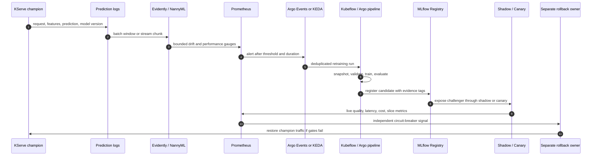

> **Discipline Track** | Complexity: `[COMPLEX]` | Time: 60-70 min
>
> **Prerequisites**: [Module 5.5: Model Monitoring & Observability](../module-5.5-model-monitoring/), [Module 5.6: ML Pipelines & Automation](../module-5.6-ml-pipelines/), [Module 5.8: Great Expectations Data Quality](../module-5.8-great-expectations-data-quality/), and [Module 5.10: Production Model-Serving Traffic Patterns](../module-5.10-model-serving-traffic-patterns/)

---

## Prerequisites

Before starting this module, make sure you can connect the earlier MLOps
pieces into one operational story rather than treating monitoring, pipelines,
data gates, and serving rollout as isolated tools:

- [Module 5.5: Model Monitoring & Observability](../module-5.5-model-monitoring/) for drift vocabulary, delayed-label monitoring, Prometheus metrics, and alert-response design
- [Module 5.6: ML Pipelines & Automation](../module-5.6-ml-pipelines/) for Kubeflow Pipelines, Argo Workflows, idempotency, checkpoints, resource controls, and promotion gates
- [Module 5.8: Great Expectations Data Quality](../module-5.8-great-expectations-data-quality/) for data-quality checks before training and reviewed baselines instead of auto-accepted profiles
- [Module 5.10: Production Model-Serving Traffic Patterns](../module-5.10-model-serving-traffic-patterns/) for KServe canary, shadow, rollback, and traffic-split machinery
- KServe, Argo Workflows, Argo Events, Kubeflow Pipelines, and MLflow basics
- Comfort reading Kubernetes manifests with custom resources, service accounts, RBAC, and ConfigMaps
- Comfort reading Prometheus PromQL, Alertmanager webhooks, and metric labels

## Learning Outcomes

After completing this module, you will be able to make and defend production
decisions about when retraining should start, when it should stop, and when a
candidate model should reach users:

- **Analyze** drift, delayed-label, calibration, and business-performance signals to decide whether a retraining run is justified or whether investigation should stop earlier.
- **Design** a Kubernetes trigger path that converts Prometheus, Kafka, or scheduled evidence into a deduplicated retraining workflow without flooding the cluster.
- **Implement** a continuous-training DAG that snapshots data, validates it with Great Expectations, trains a challenger, registers it in MLflow, and sends it through shadow or canary gates.
- **Evaluate** candidate models against production champions using holdout deltas, slice guarantees, shadow comparison, KServe smoke tests, latency, cost, and human approval policy.
- **Estimate** the cost and rollback risk of retraining frequency, GPU capacity, retained data snapshots, cross-region feature-store reads, and failed promotion attempts.

## Why This Module Matters

Hypothetical scenario: the following situation is invented to show the
operational stakes clearly; it is not a claim about a specific company or
public incident.

A subscription business runs a churn model that still returns low-latency
predictions, still serves through KServe, and still has a green dashboard.
No deployment failed. The API error rate is flat. The p99 latency sits below
the objective. The team therefore assumes the model is healthy until monthly
finance reporting shows that retention offers went to the wrong customers for
almost three weeks. The model did not crash. The customer population changed,
the old training window stopped representing current behavior, and the
monitoring system never connected drift evidence to a governed retraining loop.

That is the expensive failure this module addresses. [Module 5.5](../module-5.5-model-monitoring/)
gave you the vocabulary for feature drift, label drift, concept drift, delayed
labels, proxy metrics, and Prometheus alerting. [Module 5.6](../module-5.6-ml-pipelines/)
showed why an ML pipeline must preserve evidence instead of hiding training
inside notebooks or cron scripts. [Module 5.8](../module-5.8-great-expectations-data-quality/)
made data validation a gate, not a dashboard decoration. [Module 5.10](../module-5.10-model-serving-traffic-patterns/)
showed how a candidate reaches production through shadow, canary, and rollback
controls instead of a full-traffic leap of faith.

Auto-retraining is where those pieces meet. It is tempting to describe it as
"monitoring triggers training," but that phrase hides the hard part. A drift
score is not a root cause. A training run is not a promotion decision. A better
offline metric is not permission to replace the champion. A successful
Workflow is not proof that the new model is stable under live traffic. The
closed loop must observe, detect, trigger, train, validate, promote, and
rollback with separate evidence at each boundary.

This module treats automated retraining as a control loop, not a magic button.
You will design the trigger path, the training path, and the promotion path as
separate pieces with clear ownership. You will see how Evidently can compute
drift scores, how NannyML can estimate performance when labels arrive late,
how Prometheus and Alertmanager can fire a signal, how Argo Events or KEDA can
turn the signal into work, how Kubeflow Pipelines and Argo Workflows can run
the work, and how MLflow plus KServe can hold the candidate until it earns
traffic.

## 1. The Closed Retraining Lifecycle

Automated retraining begins with a simple loop, but the loop only stays safe
when each step has a different responsibility. Observability watches the
serving world. Detection summarizes evidence. Trigger plumbing decides whether
the evidence deserves work. The training pipeline produces a challenger.
Validation decides whether the challenger deserves exposure. Promotion changes
traffic. Rollback remains available after promotion because the first minutes
or hours of production exposure are still evidence, not a victory lap.



The three trigger flavors have different jobs. A schedule is a guardrail that
checks whether the world has changed on a known cadence, such as nightly or
weekly. A drift signal starts work because current data no longer resembles the
reference window closely enough. A performance gate starts work because the
model appears worse, either through realized labels, estimated performance, or
trusted business proxies. In a mature platform these triggers coexist, but they
should not all mean "train immediately and promote automatically."

Scheduled retraining is easy to reason about and easy to budget. It is useful
for seasonal models, batch recommendations, and teams that want a predictable
window for fresh data, GPU reservations, review, and release notes. Its
weakness is latency: the model may decay hours after the scheduled window, and
the platform will wait until the next run unless monitoring also pages or
opens a ticket. The schedule is a seatbelt, not the whole safety system.

Drift-triggered retraining is more responsive but also noisier. A feature can
drift because the population changed, because a data pipeline broke, because a
promotion campaign brought new traffic, because an upstream team changed an
encoding, or because the baseline window is wrong. Retaining the lesson from
[Module 5.5](../module-5.5-model-monitoring/), drift is a symptom. The trigger
should start a decision pipeline that validates data and trains a challenger
only when the evidence survives additional gates.

Performance-triggered retraining is the strongest signal when labels are
available quickly and accurately. If the champion's realized F1, calibration,
or business outcome falls below a threshold, a challenger should usually be
prepared. The challenge is delay. Fraud labels may arrive days later. Churn
labels may arrive after a billing cycle. Loan defaults may arrive much later.
That is why the loop often combines realized labels with NannyML-style
estimated performance, prediction-distribution shifts, and business proxies.

Think of the loop as a series of locks. One key opens the training run. Another
key opens registry promotion. Another key opens live traffic. A different key
closes traffic again if the candidate behaves badly. When one service controls
every key, the system becomes brittle; the thing being evaluated can also hide
or delay the decision that should stop it.

```text
+-------------------+      +--------------------+      +------------------+
| observe           |----->| detect             |----->| trigger          |
| logs, labels,     |      | drift, estimates,  |      | schedule, drift, |
| business metrics  |      | realized outcomes  |      | performance gate |
+-------------------+      +--------------------+      +---------+--------+
                                                                    |
                                                                    v
+-------------------+      +--------------------+      +------------------+
| rollback          |<-----| promote            |<-----| validate         |
| split traffic,    |      | shadow, canary,    |      | GE, holdout,    |
| restore champion  |      | registry stage     |      | slices, cost    |
+-------------------+      +--------------------+      +---------+--------+
                                                                    ^
                                                                    |
                                                         +----------+-------+
                                                         | train challenger |
                                                         | fresh snapshot,  |
                                                         | reproducible DAG |
                                                         +------------------+
```

The diagram deliberately does not show a direct arrow from "detect" to
"promote." A detector can be wrong. A retrained model can be worse. A fresh
training dataset can contain corrupted labels. A training image can pull a
different dependency. A candidate can pass holdout evaluation and then fail on
premium users under shadow comparison. The loop is useful because it turns
these risks into named gates rather than because it eliminates risk.

> **Pause and predict:** A detector reports PSI above `0.2` on a high-importance
> feature for ten minutes, but the Great Expectations checkpoint fails because
> the same feature has a sudden null-rate spike. Should the platform train on
> the fresh data, open an upstream-data incident, or do both? What evidence
> would you require before allowing training to continue?

The conservative answer is to halt training and treat the failing data-quality
gate as an upstream incident until proven otherwise. A drift trigger can create
an investigation workflow, but [Module 5.8](../module-5.8-great-expectations-data-quality/)
exists because training on malformed data often turns a recoverable data
incident into a new bad model. The loop may still snapshot the data for
forensics, but it should not register a candidate from data that violates a
critical validation rule.

## 2. Drift Signals Worth Retraining On

Not all drift deserves retraining. A categorical browser-version feature can
shift because a new mobile release rolled out. A timestamp-derived feature can
shift every weekend. A feature with low model importance can move without
changing model decisions. A feature with high importance can move because the
business successfully entered a new market. The retraining loop must separate
"the world is different" from "the model is probably less trustworthy" and
"the data is broken."

Covariate drift, also called feature distribution shift, means the input
distribution `P(x)` changed. Population Stability Index, the Kolmogorov-Smirnov
test, Wasserstein distance, and Jensen-Shannon distance are common ways to
compare current and reference windows. PSI is popular in regulated tabular
workflows because it is easy to review, but it depends on binning choices and
can hide segment-specific movement. KS works well for continuous one-dimensional
features, Wasserstein gives a distance-like view of numeric movement, and
Jensen-Shannon is useful for probability-like distributions because it is
symmetric and bounded.

Label drift means the target distribution changed. A fraud model can see the
share of confirmed fraud rise. A churn model can see cancellations fall after a
pricing change. Label drift is often more meaningful than feature drift, but it
arrives late when labels are delayed. It also does not tell you whether the
relationship between features and target changed; it may reflect a real
business shift that the current model can still rank well.

Concept drift means `P(y|x)` changed. The same feature vector now implies a
different target probability than it did during training. This is the hardest
production case because it is usually invisible from inputs alone. A model can
receive stable-looking features and stable-looking prediction volumes while the
meaning of behavior changes underneath it. You detect concept drift through
realized performance, delayed labels, calibrated probabilities, segment
outcomes, or trusted proxies.

Performance regression is the clearest retraining signal when labels exist.
The champion is no longer meeting its quality objective. In a classification
model, that might be precision, recall, ROC AUC, F1, calibration error, or
business value. In a ranking model, it might be NDCG or click-through-rate by
cohort. In a regression model, it might be RMSE or MAE. The retraining loop
should compare the candidate to the current champion, not merely to a fixed
minimum threshold, because a model can pass an old threshold and still be worse
than production.

Calibration drift deserves its own mention because many automated decisions
depend on probability quality, not only class choice. A model that says "0.8"
should be correct roughly eight times out of ten over a calibrated window. If
the probabilities become overconfident, downstream thresholds, risk tiers,
queues, and human review policies may all become unsafe even when raw accuracy
appears acceptable. Calibration drift is also a warning sign for NannyML CBPE
because CBPE relies on useful confidence information.

The next snippet shows a pragmatic Evidently workflow for producing a drift
report and computing PSI per feature for the trigger path. The Evidently report
is the human and machine-readable evaluation. The small PSI function is included
because many teams still emit one bounded gauge per monitored feature to
Prometheus, and that metric must remain stable even if report JSON structure
changes between library versions.

```python
# drift_window.py
from __future__ import annotations

import json
from pathlib import Path

import numpy as np
import pandas as pd
from evidently import Report
from evidently.presets import DataDriftPreset


FEATURES = ["age_days", "orders_30d", "avg_cart_value"]


def psi(reference: pd.Series, current: pd.Series, bins: int = 10) -> float:
    """Compute population stability index for one numeric feature."""
    quantiles = np.linspace(0, 1, bins + 1)
    edges = np.unique(reference.quantile(quantiles).to_numpy())
    if len(edges) < 3:
        edges = np.linspace(reference.min(), reference.max(), bins + 1)
    ref_counts, _ = np.histogram(reference, bins=edges)
    cur_counts, _ = np.histogram(current, bins=edges)
    ref_pct = np.maximum(ref_counts / max(ref_counts.sum(), 1), 1e-6)
    cur_pct = np.maximum(cur_counts / max(cur_counts.sum(), 1), 1e-6)
    return float(np.sum((cur_pct - ref_pct) * np.log(cur_pct / ref_pct)))


def main() -> None:
    reference = pd.read_parquet("reference.parquet")
    current = pd.read_parquet("current.parquet")

    report = Report([DataDriftPreset(method="psi")])
    evaluation = report.run(current_data=current, reference_data=reference)
    evaluation.save_json("evidently-data-drift.json")

    scores = {
        feature: round(psi(reference[feature], current[feature]), 6)
        for feature in FEATURES
    }
    Path("psi_scores.json").write_text(json.dumps(scores, indent=2), encoding="utf-8")
    print(json.dumps(scores, indent=2))


if __name__ == "__main__":
    main()
```

That file uses Evidently's current report API, where a `Report` receives a
`DataDriftPreset` and `run()` compares current data to reference data. The
custom PSI function is intentionally small and reviewable. In production you
would pin the Evidently version, test the extraction format, and store the full
JSON report as an artifact beside the trigger decision so an engineer can
explain why the workflow ran.

Prometheus should receive bounded, low-cardinality metrics. Do not label
metrics by request ID, customer ID, raw feature value, or model input hash.
Those belong in logs or object storage. The trigger metric needs stable labels
such as model name, model version, feature name, segment, and window. This is
the same cardinality discipline from [Module 5.5](../module-5.5-model-monitoring/),
now used to start work rather than only show a dashboard.

```python
# export_drift_metrics.py
from __future__ import annotations

import json
import time
from pathlib import Path

from prometheus_client import Gauge, start_http_server


PSI_SCORE = Gauge(
    "ml_feature_psi_score",
    "Population stability index for a model feature window",
    ["model_name", "model_version", "feature_name", "segment"],
)

DATASET_DRIFT = Gauge(
    "ml_dataset_drift_detected",
    "Dataset-level drift decision for the current monitoring window",
    ["model_name", "model_version", "segment"],
)


def publish(scores: dict[str, float]) -> None:
    model_name = "churn"
    model_version = "champion-2026-05-01"
    segment = "all"
    drifted = 0
    for feature_name, score in scores.items():
        PSI_SCORE.labels(model_name, model_version, feature_name, segment).set(score)
        if score > 0.2:
            drifted += 1
    DATASET_DRIFT.labels(model_name, model_version, segment).set(1 if drifted >= 2 else 0)


def main() -> None:
    start_http_server(9108)
    while True:
        scores = json.loads(Path("psi_scores.json").read_text(encoding="utf-8"))
        publish(scores)
        time.sleep(30)


if __name__ == "__main__":
    main()
```

The corresponding PromQL should require duration and context. A single scrape
above threshold is a clue, not a trigger. A sustained PSI score on one
high-importance feature might open a human investigation. A sustained score on
multiple important features plus prediction-distribution movement might start
the retraining workflow. A sustained score plus a failed data-quality gate
should start an upstream incident instead.

```promql
max_over_time(
  ml_feature_psi_score{
    model_name="churn",
    segment="all",
    feature_name=~"orders_30d|avg_cart_value"
  }[5m]
) > 0.2
```

Delayed labels require a different technique. NannyML's CBPE estimates
classification performance from prediction confidence when ground truth is not
available yet, and DLE estimates regression loss through an auxiliary model.
These estimates do not replace realized performance; they buy time while the
truth is delayed. The loop should treat estimated performance as a signal that
can start a challenger, then require realized or shadow evidence before broad
promotion when the model is high stakes.

```python
# nannyml_performance_windows.py
from __future__ import annotations

import nannyml as nml


def estimate_classification_performance() -> None:
    reference_df, analysis_df, analysis_targets_df = nml.load_synthetic_car_loan_dataset()

    estimator = nml.CBPE(
        y_pred_proba="y_pred_proba",
        y_pred="y_pred",
        y_true="repaid",
        timestamp_column_name="timestamp",
        metrics=["roc_auc", "f1"],
        chunk_size=5000,
        problem_type="classification_binary",
    )
    estimator.fit(reference_df)
    estimated = estimator.estimate(analysis_df)
    print("Estimated Performance (CBPE)")
    print(estimated.filter(period="analysis").to_df().tail(3))

    with_targets = analysis_df.merge(analysis_targets_df, left_index=True, right_index=True)
    calculator = nml.PerformanceCalculator(
        y_pred_proba="y_pred_proba",
        y_pred="y_pred",
        y_true="repaid",
        timestamp_column_name="timestamp",
        metrics=["roc_auc", "f1"],
        chunk_size=5000,
        problem_type="classification_binary",
    )
    calculator.fit(reference_df)
    realized = calculator.calculate(with_targets)
    print("Realized Performance")
    print(realized.filter(period="analysis").to_df().tail(3))


def estimate_regression_performance() -> None:
    reference_df, analysis_df, _ = nml.load_synthetic_car_price_dataset()
    estimator = nml.DLE(
        feature_column_names=[
            "car_age",
            "km_driven",
            "price_new",
            "accident_count",
            "door_count",
            "fuel",
            "transmission",
        ],
        y_pred="y_pred",
        y_true="y_true",
        timestamp_column_name="timestamp",
        metrics=["rmse", "mae"],
        chunk_size=6000,
    )
    estimator.fit(reference_df)
    estimated = estimator.estimate(analysis_df)
    print("Estimated Performance (DLE)")
    print(estimated.filter(period="analysis").to_df().tail(3))


if __name__ == "__main__":
    estimate_classification_performance()
    estimate_regression_performance()
```

The NannyML output is useful because it gives you rows by time chunk, metric,
estimated value, thresholds, and alert flags. The retraining loop can translate
those rows into Prometheus gauges or directly into a workflow parameter. The
important design point is that CBPE and DLE are not "autopromote" evidence.
They are early warning signals, especially valuable when the cost of waiting
for labels is high and the cost of a challenger training run is acceptable.

Seldon Alibi Detect is another useful library when you need specialized drift
detectors, such as KS tests, maximum mean discrepancy, classifier-based drift,
or detectors for images and embeddings. In this module, Evidently is the
primary reporting layer because it integrates naturally with tabular reports
and automated checks. Alibi Detect is a strong alternative when the detector
itself is the main engineering problem, especially for non-tabular features.

## 3. Trigger Plumbing on Kubernetes

Once the signal exists, the platform has to start exactly the right amount of
work. Trigger plumbing is easy to underestimate because the YAML looks smaller
than the model code. In practice it is where many retraining systems fail. A
single drift spike can fire repeated Alertmanager notifications, a Kafka topic
can contain many messages for the same model window, and a scheduled workflow
can overlap with a drift-triggered workflow. Without debounce and deduplication,
the platform can launch a dozen expensive training runs for one incident.

The canonical stack in this module uses Prometheus and Alertmanager for the
signal, Argo Events for webhook-to-WorkflowTemplate triggering, KEDA ScaledJob
as an alternative queue-less trigger, and Argo CronWorkflow as a scheduled
guardrail. The same pattern works with Kafka if your prediction logs or drift
events already land on a topic. The goal is not to crown one trigger tool. The
goal is to make trigger ownership explicit and keep training idempotent.

Argo Events has three moving pieces. An `EventSource` receives events, such as
an Alertmanager webhook. A `Sensor` filters or transforms the event. A trigger
creates a Kubernetes resource, often an Argo Workflow derived from a
WorkflowTemplate. The EventSource should not contain training logic. The Sensor
should not decide promotion. It should submit a workflow with enough parameters
for the pipeline to fetch evidence, claim a deduplication key, and make the
next decision.

```yaml
apiVersion: argoproj.io/v1alpha1
kind: EventSource
metadata:
  name: drift-alert-webhook
  namespace: mlops
spec:
  service:
    ports:
      - port: 12000
        targetPort: 12000
  webhook:
    drift:
      port: "12000"
      endpoint: /drift
      method: POST
```

Alertmanager can send drift alerts to the EventSource service. In production,
you would authenticate this path through network policy, a private service, or
a gateway that verifies a shared secret. The example keeps the URL boring on
purpose so no realistic secret appears in the curriculum.

```yaml
apiVersion: v1
kind: ConfigMap
metadata:
  name: alertmanager-drift-route
  namespace: monitoring
data:
  alertmanager.yml: |
    route:
      receiver: argo-events-drift
      group_by: ["alertname", "model_name", "segment"]
      group_wait: 30s
      group_interval: 10m
      repeat_interval: 2h
    receivers:
      - name: argo-events-drift
        webhook_configs:
          - url: http://drift-alert-webhook-eventsource-svc.mlops.svc:12000/drift
            send_resolved: false
```

The Sensor below submits a Workflow that references a `WorkflowTemplate`. It
passes the model name, segment, trigger source, and a deduplication key. The
deduplication key should be derived from stable fields such as model, segment,
alert name, and monitoring-window start. Do not use the webhook delivery time
as the only key, because every retry would look unique.

```yaml
apiVersion: argoproj.io/v1alpha1
kind: Sensor
metadata:
  name: drift-retraining-sensor
  namespace: mlops
spec:
  template:
    serviceAccountName: operate-workflows
  dependencies:
    - name: drift-alert
      eventSourceName: drift-alert-webhook
      eventName: drift
  triggers:
    - template:
        name: submit-retraining-workflow
        k8s:
          operation: create
          source:
            resource:
              apiVersion: argoproj.io/v1alpha1
              kind: Workflow
              metadata:
                generateName: drift-retrain-
                namespace: mlops
                labels:
                  app.kubernetes.io/name: drift-retraining
              spec:
                workflowTemplateRef:
                  name: drift-retraining-template
                arguments:
                  parameters:
                    - name: model-name
                      value: churn
                    - name: segment
                      value: all
                    - name: trigger-source
                      value: prometheus-alertmanager
                    - name: dedupe-key
                      value: churn-all-drift-window
          parameters:
            - src:
                dependencyName: drift-alert
                dataKey: body.alerts.0.labels.model_name
              dest: spec.arguments.parameters.0.value
            - src:
                dependencyName: drift-alert
                dataKey: body.alerts.0.labels.segment
              dest: spec.arguments.parameters.1.value
            - src:
                dependencyName: drift-alert
                dataKey: body.groupKey
              dest: spec.arguments.parameters.3.value
```

The Sensor is intentionally small because the WorkflowTemplate should own the
retraining decision. A team that embeds all decision logic in Sensor
transformations will eventually create a trigger layer that is hard to test,
hard to version, and hard to replay. Keep Sensor logic at the edge: receive,
filter, pass evidence, and create work.

KEDA gives another pattern when you want a Kubernetes-native job to appear only
while a Prometheus query remains above threshold. A `ScaledJob` is especially
useful for small retraining decision jobs, such as "claim the incident and
submit a proper workflow." It is less expressive than Argo Events for webhook
payloads, but it is simple and works well for metrics-driven work.

```yaml
apiVersion: keda.sh/v1alpha1
kind: ScaledJob
metadata:
  name: drift-retraining-trigger
  namespace: mlops
spec:
  pollingInterval: 30
  successfulJobsHistoryLimit: 3
  failedJobsHistoryLimit: 5
  maxReplicaCount: 1
  jobTargetRef:
    backoffLimit: 1
    template:
      metadata:
        labels:
          app.kubernetes.io/name: drift-retraining-trigger
      spec:
        serviceAccountName: submit-retraining
        restartPolicy: Never
        containers:
          - name: submit
            image: ghcr.io/example/mlops-trigger:0.1.0
            imagePullPolicy: IfNotPresent
            env:
              - name: MODEL_NAME
                value: churn
              - name: SEGMENT
                value: all
            command:
              - /bin/sh
              - -c
              - |
                argo submit \
                  --from workflowtemplate/drift-retraining-template \
                  -n mlops \
                  -p model-name="${MODEL_NAME}" \
                  -p segment="${SEGMENT}" \
                  -p trigger-source="keda-prometheus" \
                  -p dedupe-key="${MODEL_NAME}-${SEGMENT}-prometheus"
  triggers:
    - type: prometheus
      metadata:
        serverAddress: http://prometheus-operated.monitoring.svc:9090
        metricName: churn_feature_psi_above_threshold
        query: |
          max_over_time(ml_feature_psi_score{model_name="churn",segment="all"}[5m])
        threshold: "0.2"
```

The `maxReplicaCount: 1` setting is not a complete debounce strategy, but it
prevents a single scaler from creating several simultaneous jobs. You still
need an idempotent claim inside the workflow because another trigger source can
submit the same work. The retraining system should assume events can be
delivered at least once and workflows can be retried.

Argo CronWorkflow is the guardrail. It runs on a cadence, inspects recent
monitoring windows, and may decide to train or to exit cleanly. The schedule is
valuable even when drift triggers exist because it catches missed alerts,
recovers from monitor downtime, and gives operators a predictable daily
evidence artifact.

```yaml
apiVersion: argoproj.io/v1alpha1
kind: CronWorkflow
metadata:
  name: nightly-drift-check
  namespace: mlops
spec:
  schedule: "15 2 * * *"
  timezone: Etc/UTC
  concurrencyPolicy: Forbid
  successfulJobsHistoryLimit: 3
  failedJobsHistoryLimit: 3
  workflowSpec:
    workflowTemplateRef:
      name: drift-retraining-template
    arguments:
      parameters:
        - name: model-name
          value: churn
        - name: segment
          value: all
        - name: trigger-source
          value: cron-guardrail
        - name: dedupe-key
          value: churn-all-nightly
```

The WorkflowTemplate should own deduplication. Argo Workflows supports
`synchronization.mutex`, which prevents two workflows with the same mutex from
running the critical section concurrently. That is necessary but not sufficient
for long debounce windows. A mutex stops overlap; a sentinel claim says "we
already handled this drift window recently." A ConfigMap, Lease, database row,
or small internal API can hold that sentinel.

```yaml
apiVersion: argoproj.io/v1alpha1
kind: WorkflowTemplate
metadata:
  name: drift-retraining-template
  namespace: mlops
spec:
  entrypoint: retrain-or-exit
  synchronization:
    mutex:
      name: churn-retraining-mutex
  arguments:
    parameters:
      - name: model-name
      - name: segment
      - name: trigger-source
      - name: dedupe-key
  templates:
    - name: retrain-or-exit
      dag:
        tasks:
          - name: claim-window
            template: claim-window
          - name: run-retraining
            dependencies:
              - claim-window
            when: "{{tasks.claim-window.outputs.parameters.claimed}} == true"
            template: run-retraining
    - name: claim-window
      container:
        image: bitnami/kubectl:1.35
        command:
          - /bin/sh
          - -c
        args:
          - |
            key="{{workflow.parameters.dedupe-key}}"
            cm="drift-claim-${key}"
            if kubectl get configmap "${cm}" -n mlops >/dev/null 2>&1; then
              echo -n false > /tmp/claimed
              exit 0
            fi
            kubectl create configmap "${cm}" \
              -n mlops \
              --from-literal=createdAt="$(date -u +%Y-%m-%dT%H:%M:%SZ)" \
              --from-literal=model="{{workflow.parameters.model-name}}" \
              --from-literal=segment="{{workflow.parameters.segment}}"
            echo -n true > /tmp/claimed
      outputs:
        parameters:
          - name: claimed
            valueFrom:
              path: /tmp/claimed
    - name: run-retraining
      container:
        image: ghcr.io/example/retraining-runner:0.1.0
        command:
          - /app/run-retraining
        args:
          - --model-name
          - "{{workflow.parameters.model-name}}"
          - --segment
          - "{{workflow.parameters.segment}}"
          - --trigger-source
          - "{{workflow.parameters.trigger-source}}"
```

This ConfigMap claim is deliberately simple so the moving parts are visible.
Production teams often use a database or a service because they need expiry,
multi-cluster coordination, richer state, and audit. The principle is the
same: a trigger must be safe to deliver twice, and a workflow must be safe to
retry without creating a second candidate for the same window.

## 4. The Retraining Pipeline Itself

The retraining pipeline is not "train on latest data." It is a reproducible
candidate factory. It fetches fresh data, saves an immutable snapshot, validates
that snapshot, trains a challenger, evaluates it against the champion, registers
the candidate, runs shadow or canary checks, and promotes or discards the
candidate. Each step should leave evidence. If a candidate wins, you need to
explain why. If it loses, you need to know whether it lost because data was
bad, training was unstable, evaluation was too strict, or production behavior
diverged.

```text
+------------------+     +------------------+     +------------------+
| fetch fresh data |---->| DVC snapshot     |---->| GX checkpoint    |
| logs, labels,    |     | immutable hash,  |     | schema, nulls,   |
| feature store    |     | training window  |     | ranges, meaning  |
+------------------+     +------------------+     +--------+---------+
                                                            |
                                                            v
+------------------+     +------------------+     +------------------+
| promote/discard  |<----| shadow/canary    |<----| train + evaluate |
| MLflow stage,    |     | paired outputs,  |     | champion delta,  |
| KServe split     |     | latency, slices  |     | slices, cost     |
+------------------+     +------------------+     +------------------+
```

The DVC step connects directly to [Module 5.7](../module-5.7-dvc-data-versioning/).
Even though that module is not one of the prerequisite links in the metadata,
the data snapshot matters here. A drift-triggered run that trains on "whatever
the warehouse returned at 03:12" is difficult to reproduce. A snapshot with a
DVC hash, query version, feature-store read time, label cutoff, and code commit
can be reviewed, retrained, compared, and retained for rollback analysis.

The Great Expectations step connects directly to [Module 5.8](../module-5.8-great-expectations-data-quality/).
The trigger might be a drift score, but training should still fail if required
columns are missing, null rates exceed reviewed limits, categorical values are
outside approved sets, or timestamp ranges do not match the intended window.
Drift tells you data moved. GX tells you whether the new data is usable enough
to train on. Those are different checks.

Kubeflow Pipelines is a good authoring layer for the candidate factory because
it makes the DAG visible and compiles the workflow into a package. The example
below uses lightweight components that pass paths and scalar values. In a real
platform, each component image would be pinned, resource requests would be set,
and artifact storage would be configured by the cluster profile.

```python
# retraining_pipeline.py
from __future__ import annotations

from kfp import compiler, dsl


@dsl.component(base_image="python:3.12", packages_to_install=["pandas==2.2.3"])
def fetch_fresh_data(model_name: str, output_path: dsl.OutputPath(str)) -> None:
    from pathlib import Path

    Path(output_path).write_text(f"snapshot for {model_name}\n", encoding="utf-8")


@dsl.component(base_image="python:3.12", packages_to_install=["great-expectations==1.5.11"])
def validate_with_gx(snapshot_path: dsl.InputPath(str), validation_flag: dsl.OutputPath(str)) -> None:
    from pathlib import Path

    # In production this runs a named GX Checkpoint from reviewed configuration.
    text = Path(snapshot_path).read_text(encoding="utf-8")
    if "snapshot" not in text:
        raise ValueError("fresh data snapshot did not pass the minimal exercise gate")
    Path(validation_flag).write_text("passed", encoding="utf-8")


@dsl.component(base_image="python:3.12", packages_to_install=["scikit-learn==1.5.2"])
def train(validation_flag: dsl.InputPath(str), model_uri: dsl.OutputPath(str)) -> None:
    from pathlib import Path

    if Path(validation_flag).read_text(encoding="utf-8") != "passed":
        raise ValueError("training blocked by data validation")
    Path(model_uri).write_text("runs:/candidate/model", encoding="utf-8")


@dsl.component(base_image="python:3.12")
def evaluate(model_uri: dsl.InputPath(str), accuracy_delta: dsl.OutputPath(float)) -> None:
    from pathlib import Path

    _ = Path(model_uri).read_text(encoding="utf-8")
    Path(accuracy_delta).write_text("0.018", encoding="utf-8")


@dsl.component(base_image="python:3.12", packages_to_install=["mlflow==2.17.2"])
def register_candidate(model_uri: dsl.InputPath(str), accuracy_delta: dsl.InputPath(float)) -> None:
    from pathlib import Path

    print("registering", Path(model_uri).read_text(encoding="utf-8").strip())
    print("accuracy_delta", Path(accuracy_delta).read_text(encoding="utf-8").strip())


@dsl.component(base_image="python:3.12")
def run_shadow() -> str:
    return "shadow_passed"


@dsl.component(base_image="python:3.12")
def promote_or_discard(shadow_status: str) -> None:
    if shadow_status != "shadow_passed":
        print("discard candidate")
        return
    print("promote candidate after registry and traffic gates")


@dsl.pipeline(name="drift-triggered-retraining")
def drift_retraining_pipeline(model_name: str = "churn") -> None:
    fetched = fetch_fresh_data(model_name=model_name)
    validated = validate_with_gx(snapshot_path=fetched.output)
    trained = train(validation_flag=validated.output)
    evaluated = evaluate(model_uri=trained.output)
    registered = register_candidate(
        model_uri=trained.output,
        accuracy_delta=evaluated.output,
    )
    shadow = run_shadow().after(registered)
    promote_or_discard(shadow_status=shadow.output)


if __name__ == "__main__":
    compiler.Compiler().compile(
        pipeline_func=drift_retraining_pipeline,
        package_path="drift-retraining-pipeline.yaml",
    )
```

The important shape is the DAG, not the toy training logic. The validation task
must precede training. Evaluation must compare against the champion. Registry
registration must include evidence tags. Shadow or canary must run before live
promotion. Promotion must be able to discard a candidate cleanly. That is the
pipeline vocabulary from [Module 5.6](../module-5.6-ml-pipelines/) applied to
a drift-triggered lifecycle.

MLflow Model Registry gives the candidate a lifecycle separate from the
training run. Many teams still model the path as `None -> Staging -> Production`
and attach tags that prove validation happened. Newer MLflow usage may prefer
aliases and richer tags for some workflows, but the core rule is unchanged:
the registry should record what evidence allowed the model to move.

```python
# promote_candidate.py
from __future__ import annotations

import mlflow
from mlflow import MlflowClient


def promote_candidate(
    registered_model_name: str,
    run_id: str,
    model_artifact_path: str,
    accuracy_delta: float,
    shadow_windows_passed: int,
) -> None:
    client = MlflowClient()
    model_uri = f"runs:/{run_id}/{model_artifact_path}"
    result = mlflow.register_model(model_uri, registered_model_name)

    client.set_model_version_tag(
        name=registered_model_name,
        version=result.version,
        key="validation.accuracy_delta",
        value=f"{accuracy_delta:.4f}",
    )
    client.set_model_version_tag(
        name=registered_model_name,
        version=result.version,
        key="validation.shadow_windows_passed",
        value=str(shadow_windows_passed),
    )
    client.set_model_version_tag(
        name=registered_model_name,
        version=result.version,
        key="validation.signature_checked",
        value="true",
    )

    if accuracy_delta <= 0 or shadow_windows_passed < 3:
        client.set_model_version_tag(
            name=registered_model_name,
            version=result.version,
            key="promotion.decision",
            value="discarded",
        )
        return

    client.transition_model_version_stage(
        name=registered_model_name,
        version=result.version,
        stage="Staging",
        archive_existing_versions=False,
    )
    client.set_model_version_tag(
        name=registered_model_name,
        version=result.version,
        key="promotion.decision",
        value="ready_for_canary",
    )
```

Champion/challenger continuous training keeps the current production model
serving while a challenger trains on fresh data. The challenger wins only if it
beats the champion by a defined amount over a defined number of evaluation
windows. The threshold should be larger than noise. A candidate that improves
global accuracy by a tiny amount while degrading a critical segment is not a
winner. A candidate that wins once and loses the next two windows is not stable
enough for full promotion.

This pattern is different from online learning. Champion/challenger continuous
training produces new batch-trained artifacts and promotes them through gates.
Online learning updates the model continuously or near-continuously as events
arrive. Online learning can be powerful for domains with rapid feedback and
low-stakes corrections, but it is harder to audit, harder to roll back, and
harder to reproduce. Most Kubernetes platform teams should master governed
challenger promotion before allowing online mutation of production models.

## 5. Validation Gates Before Promotion

Validation before promotion is the second-most-important part of the loop after
the trigger itself. A drift trigger tells you that the champion may be stale.
It does not tell you that the challenger is better. The challenger must pass
offline evidence, data evidence, serving evidence, slice evidence, cost
evidence, and sometimes human review before it earns production traffic. This
is where automated retraining becomes engineering discipline rather than
training enthusiasm.

The first gate is holdout delta against the current production model. Do not
evaluate only against an absolute threshold such as "accuracy greater than
0.8." A stale threshold can let worse candidates pass. Compare the challenger
and champion on the same holdout window, record the metric delta, and require a
minimum improvement or a documented reason to accept parity. For imbalanced
classification, use metrics that match business risk, such as recall at a
precision floor or cost-weighted business value.

The second gate is slice and segment guarantees. A challenger that improves the
global metric while hurting a small but important segment is not safe. Define
the segments before training: region, product, tenant tier, language, device,
risk band, class label, or protected category where legally and ethically
appropriate. The gate should say something like "no critical slice may regress
by more than two percent relative unless a human approves the exception with
context."

The third gate is shadow traffic comparison, forward-linked to [Module 5.10](../module-5.10-model-serving-traffic-patterns/).
Shadow mode sends the same production request to the challenger while the
champion still serves the answer. The challenger response is logged and
discarded. This catches feature encoding, serving-runtime, latency, output
shape, and offline-online divergence before users depend on the response. It
also adds cost, so shadow windows should be sampled and time-bounded.

The fourth gate is a smoke test against the KServe predictor with synthetic
inputs. This is not model validation. It checks that the model loads, accepts
the production request shape, returns the expected response shape, respects
timeouts, and records the expected metadata. Smoke tests should run before
shadow and canary so you do not spend live comparison budget on a broken
container, missing runtime, or invalid model signature.

```bash
kubectl -n ml-serving get inferenceservice churn-challenger

SERVICE_HOSTNAME="$(kubectl -n ml-serving get inferenceservice churn-challenger \
  -o jsonpath='{.status.url}' | sed 's#https\?://##')"

kubectl -n istio-system port-forward svc/istio-ingressgateway 8080:80
```

```bash
curl -sS \
  -H "Host: ${SERVICE_HOSTNAME}" \
  -H "Content-Type: application/json" \
  http://127.0.0.1:8080/v1/models/churn-challenger:predict \
  -d '{
    "instances": [
      {
        "age_days": 183,
        "orders_30d": 4,
        "avg_cart_value": 38.5
      }
    ]
  }'
```

The fifth gate is latency and cost regression. A challenger can be more
accurate and still unacceptable if it doubles GPU memory, increases p99 beyond
the objective, calls a remote feature store in another region, or requires a
larger serving node pool. The validation report should include both model
quality and operational cost. This is especially important when drift-triggered
workflows can run outside ordinary release windows and when the cost owner is
not the data scientist who started the run.

The sixth gate is human approval when consequences justify it. Regulated
domains, high-stakes models, legal exposure, safety decisions, protected-class
impact, and ambiguous slice results should require a person to review evidence
before production promotion. Low-stakes, well-instrumented models can skip
manual approval when the trigger, validation, shadow, canary, rollback, and
retention policies are mature. The decision should be in policy, not improvised
at 02:00 during an alert.

```yaml
apiVersion: argoproj.io/v1alpha1
kind: WorkflowTemplate
metadata:
  name: promotion-gated-retraining
  namespace: mlops
spec:
  entrypoint: gated-promotion
  templates:
    - name: gated-promotion
      steps:
        - - name: evaluate-offline
            template: evaluate-offline
        - - name: run-shadow
            template: run-shadow
            when: "{{steps.evaluate-offline.outputs.parameters.offline-pass}} == true"
        - - name: approval
            template: human-approval
            when: "{{steps.run-shadow.outputs.parameters.needs-approval}} == true"
        - - name: promote
            template: promote
            when: "{{steps.run-shadow.outputs.parameters.shadow-pass}} == true"
    - name: human-approval
      suspend: {}
    - name: evaluate-offline
      container:
        image: ghcr.io/example/model-evaluator:0.1.0
        command: ["/app/evaluate"]
      outputs:
        parameters:
          - name: offline-pass
            valueFrom:
              path: /tmp/offline-pass
    - name: run-shadow
      container:
        image: ghcr.io/example/shadow-evaluator:0.1.0
        command: ["/app/shadow"]
      outputs:
        parameters:
          - name: shadow-pass
            valueFrom:
              path: /tmp/shadow-pass
          - name: needs-approval
            valueFrom:
              path: /tmp/needs-approval
    - name: promote
      container:
        image: ghcr.io/example/model-promoter:0.1.0
        command: ["/app/promote"]
```

> **Before running this in a real cluster:** Which gate would fail first if the
> challenger was trained on a valid snapshot but its serving image expected a
> different JSON field name than the champion? Which logs and artifacts would
> you inspect before blaming the model weights?

The smoke test and shadow comparison should fail before broad traffic moves.
The model weights may be perfectly reasonable; the serving wrapper, feature
transformer, model signature, or request encoder may be wrong. This is why
promotion gates must test the deployed predictor and not only a notebook or
training container.

## 6. Rollback, Circuit-Breakers, and Forensic Evidence

Rollback cannot be owned by the retraining service alone. A failing retraining
service may be unavailable, overloaded, or convinced its candidate is fine
because the same flawed metrics fed both promotion and rollback. The rollback
signal should live in a separate Argo Workflow, GitOps controller, feature flag
system, platform API, or KServe traffic-split operation. [Module 5.10](../module-5.10-model-serving-traffic-patterns/)
called out the anti-pattern directly: the candidate model must not control the
only kill switch that can remove it from traffic.

Auto-rollback triggers should combine infrastructure and model behavior. Error
rate jumps, p99 latency jumps, pod restarts, queue depth, and GPU memory
pressure are serving-health signals. Calibration-drift jumps, prediction
distribution shifts, champion/challenger disagreement, slice regression, and
business-metric movement are model-health signals. A severe infrastructure
failure can roll back immediately. A model-quality signal may first pause
traffic expansion, hold canary percentage steady, or require human review,
depending on stakes and confidence.

```yaml
apiVersion: argoproj.io/v1alpha1
kind: Workflow
metadata:
  generateName: rollback-churn-
  namespace: mlops
spec:
  entrypoint: rollback
  serviceAccountName: traffic-operator
  arguments:
    parameters:
      - name: inferenceservice
        value: churn-router
      - name: namespace
        value: ml-serving
  templates:
    - name: rollback
      container:
        image: bitnami/kubectl:1.35
        command:
          - /bin/sh
          - -c
        args:
          - |
            kubectl patch inferenceservice "{{workflow.parameters.inferenceservice}}" \
              -n "{{workflow.parameters.namespace}}" \
              --type merge \
              -p '{"spec":{"predictor":{"canaryTrafficPercent":0}}}'
            kubectl annotate inferenceservice "{{workflow.parameters.inferenceservice}}" \
              -n "{{workflow.parameters.namespace}}" \
              "mlops.kubedojo.dev/rollback-at=$(date -u +%Y-%m-%dT%H:%M:%SZ)" \
              --overwrite
```

The rollback window is a policy decision. A low-stakes recommender may declare
a model stable after several hours of canary traffic and a full business cycle
of sampled shadow comparison. A fraud model may need multiple delayed-label
windows. A regulated credit model may need formal review before and after
promotion. The window should be long enough to observe the metrics that can
actually move and short enough that old rollback artifacts are still warm,
valid, and affordable.

Forensic evidence is not optional. Keep the champion and challenger model
versions, training data snapshot IDs, validation reports, drift report, feature
schema, label cutoff, code commit, image digest, KServe revision, traffic split
history, canary cohorts, paired shadow outputs, and rollback decision. This
evidence lets the team answer whether the candidate was bad, the data was bad,
the gate was weak, the trigger was noisy, or the business changed faster than
the model lifecycle.

The retraining loop should also have a "stop training" circuit-breaker. If
three consecutive retraining runs fail data validation, do not keep launching
GPU jobs. If two candidates lose to the champion in the same drift incident,
stop and escalate to data science review. If the feature store is cross-region
and egress cost spikes, pause non-urgent retraining. A circuit-breaker protects
both reliability and budget.

## 7. Cost Lens for Closed-Loop Retraining

Automated retraining has a direct cost and an opportunity cost. The direct cost
is compute, storage, orchestration, monitoring, duplicated serving, registry
artifacts, and engineer review. The opportunity cost is model staleness:
wrong predictions, missed conversions, unnecessary retention offers, fraud
loss, manual review load, or user harm. A serious design compares those costs
instead of assuming "fresh is always better."

Consider a small worked example. A training run uses one on-demand GPU node
that costs `2.40 USD` per hour and runs for three hours. Validation and shadow
comparison add `1.10 USD` in CPU, storage, and duplicated inference. One run
therefore costs about `8.30 USD` before human review. Daily retraining costs
about `249 USD` in a 30-day month. Hourly retraining would cost about `5,976
USD` before failed runs and shadow traffic. If the stale model costs about
`3,000 USD` per month in measurable business loss, hourly retraining is hard
to justify unless it prevents rare but severe incidents.

Now invert the example. A fraud model's stale recall can allow `15,000 USD` of
avoidable loss during one high-risk weekend. A weekend drift-triggered training
run plus shadow comparison that costs `60 USD` is easy to justify if the
validation gates are strong and rollback is ready. The economics are not
"training is expensive" or "training is cheap." The economics are frequency,
trigger precision, model stakes, and how much value a fresh candidate can
capture before the world changes again.

Use spot or preemptible GPU instances for training when the pipeline supports
checkpointing and retries. Use on-demand capacity for serving paths where
eviction would violate availability or latency objectives. Keep the old
champion warm during the rollback window if rollback time matters. That costs
money, but cold rollback can cost more when users wait for image pulls, model
downloads, GPU allocation, or cache warming during an incident.

Retraining frequency should follow drift tolerance. Some models can tolerate
small feature shifts for weeks because the business process is stable and the
model has margin. Some models need daily windows because the population changes
quickly. Some models should train only when performance or drift evidence
crosses a threshold. A daily schedule that always trains even when drift is
flat can cost more than the degradation it prevents, and it can create review
fatigue that weakens real promotion decisions.

Storage costs matter because reproducibility requires retention. Data
snapshots, model artifacts, reports, paired shadow outputs, and feature logs
can grow quickly. Retain enough evidence to debug, audit, and roll back. Tier
old artifacts to cheaper storage after the rollback and review window closes.
Do not keep every raw feature vector forever unless policy requires it and the
privacy model supports it. The evidence plan should name retention duration,
compression, partitioning, and deletion ownership.

Cross-region egress is a quiet cost multiplier. A feature store in one region
and a training cluster in another can turn every retraining run into a network
bill and a latency problem. The first fix is architectural: train near the data
or replicate approved snapshots intentionally. The second fix is operational:
cache immutable snapshots, avoid repeated full reads during retries, and make
egress visible in the candidate run summary.

### Operational Budget Guardrails

Cost control belongs in the workflow, not only in a quarterly platform review.
Add a budget check near the beginning of the decision pipeline that reads the
month-to-date training spend, the number of candidates already trained for the
model, and the current severity of the drift or performance signal. A low
severity event can open a ticket when the budget is nearly exhausted, while a
high severity event can consume an emergency allowance and record the reason.

The budget check should distinguish candidate creation from candidate exposure.
Training a small challenger may be cheap enough to run during a drift incident,
but shadowing every production request against a larger model can dominate the
bill. That is why the validation report should include a serving-cost estimate
before the shadow window starts. A candidate that is affordable to train may
still be too expensive to serve at the desired latency and scale.

Resource requests are part of the cost policy. If a training workflow requests
a full GPU for a preprocessing step, the cluster scheduler will reserve scarce
capacity for work that could run on CPU. If a workflow omits requests entirely,
the job may be evicted, starve other tenants, or run on an expensive node by
accident. The pipeline owner should set explicit CPU, memory, GPU, and ephemeral
storage requests per task, then review actual usage from completed runs.

Spot and preemptible capacity should be paired with checkpoints. A retraining
job that can resume after preemption is a good candidate for cheaper capacity.
A job that must restart a six-hour training run from the beginning after every
eviction may burn more money than it saves. The checkpoint interval should be
short enough to preserve progress and long enough that checkpoint writes do not
dominate training time or object-store costs.

The storage plan should split retention by evidence type. Keep raw training
snapshots long enough to reproduce candidates during the rollback and audit
window. Keep compact drift summaries and validation reports longer because they
are cheaper and useful for trend analysis. Keep paired shadow outputs only as
long as policy allows, because they can contain sensitive features,
predictions, and business outcomes. Deletion should be automated and logged.

Finally, make "do nothing" visible. A decision pipeline that exits because
drift was transient, labels contradicted the proxy signal, or the budget gate
blocked non-urgent training should still write a small evidence record. Those
records prevent future teams from asking why no candidate exists for a known
alert. They also help tune thresholds because false positives become measurable
instead of disappearing into chat history.

### Governance and Ownership Boundaries

Closed-loop retraining crosses team boundaries, so ownership must be explicit
before autonomy increases. The platform team usually owns the trigger path,
orchestrator reliability, namespace policy, service accounts, and rollback
mechanics. The data team owns source freshness, feature definitions, data
quality suites, and snapshot retention. The modeling team owns training code,
evaluation metrics, challenger design, and slice analysis. The product or risk
owner owns business thresholds and human approval policy.

Those boundaries should appear in the runbook. A drift alert caused by missing
feature values routes to the data owner. A candidate that wins offline but
fails KServe smoke tests routes to the platform and modeling owners together.
A candidate that improves global metrics but regresses a protected or critical
segment routes to the risk owner before any broader exposure. Routing rules
reduce confusion when an automated loop pauses and asks for human judgment.

Access boundaries matter as much as ownership. The component that reads raw
training data does not need permission to patch KServe traffic. The component
that patches traffic does not need permission to read raw labels. The Sensor
that receives Alertmanager webhooks does not need registry write access. Narrow
permissions limit blast radius when a container image, workflow parameter, or
service account is misconfigured.

Audit language should be plain enough for an incident review. Instead of
recording "workflow succeeded," record "drift signal for `orders_30d` exceeded
the threshold for five minutes, data validation passed, challenger version `18`
beat champion version `16` by `0.018` accuracy globally, no critical slice
regressed beyond policy, shadow ran for three windows, and canary promotion
started at ten percent." That sentence is longer, but it is evidence.

That same evidence sentence should appear in the pull-request comment, model
registry tags, or incident timeline that humans already review. Autonomy is
easier to trust when the machine leaves a trail in the places operators
actually inspect.

## Patterns and Anti-Patterns

The patterns below are the production shapes that keep a drift-triggered loop
useful after the demo. Each pattern separates evidence from action. Each
anti-pattern collapses evidence and action into one fragile step.

| Pattern | When to Use | Why It Works | Scaling Consideration |
|---|---|---|---|
| Decision pipeline before training | Drift alerts are noisy, labels are delayed, or upstream data quality can fail | The trigger starts evidence collection before spending GPU time | Keep the decision step cheap and idempotent |
| Champion/challenger with shadow first | Candidate behavior must be compared on real requests before users see answers | The champion stays live while the challenger proves serving compatibility | Sample shadow traffic and set an exit date |
| Data-quality gate before training | Fresh data comes from mutable pipelines, vendors, or feature stores | Bad data is stopped before it becomes a bad model | Own GX suites as reviewed code, not auto-generated noise |
| Registry tags as promotion evidence | Multiple teams train, review, serve, and audit models | MLflow records why a candidate moved stages | Enforce required tags in CI or a registry wrapper |
| Separate rollback workflow | A candidate can fail after promotion or during canary | Rollback does not depend on the service being evaluated | Practice rollback and keep old artifacts warm long enough |

| Anti-Pattern | What Goes Wrong | Why Teams Fall Into It | Better Alternative |
|---|---|---|---|
| Retrain on every drift alert | GPU spend spikes and candidates train on temporary or broken data | Drift feels objective because it has a number | Require sustained drift plus quality and context gates |
| Promote from the training job | A successful train becomes a production change without live evidence | Teams confuse pipeline success with model success | Register a candidate, then shadow or canary through serving gates |
| Let the retraining service own rollback | A failing system may be unable or unwilling to stop itself | It is convenient to keep all logic in one service | Put rollback in KServe traffic split, ArgoCD, or a separate workflow |
| Compare candidate only to a fixed threshold | A model can pass the threshold while losing to the champion | Old thresholds are easy to encode and forget | Compare challenger and champion on the same windows and slices |
| Ignore delayed labels | The loop optimizes proxy metrics that may not match outcomes | Immediate metrics are easier to automate | Use CBPE or DLE for early warning and realized labels for final evidence |
| Keep all snapshots forever | Storage and privacy risk grow without improving decisions | Reproducibility gets interpreted as infinite retention | Set retention tiers for rollback, audit, and deletion windows |

## Decision Framework

Choosing a retraining strategy starts with two questions: how quickly the world
changes and how expensive a wrong update would be. A model with slow drift and
low serving stakes can use scheduled retraining. A model with fast drift and
clear monitoring can use drift-triggered challengers. A model with reliable
labels can use performance-triggered training. A model with high traffic and
fast feedback can use champion/challenger continuous training. A model that
must adapt within seconds or minutes may need online learning, but that choice
raises audit and rollback complexity.

| Strategy | Use When | Avoid When | Primary Evidence | Promotion Posture |
|---|---|---|---|---|
| Scheduled retraining | Drift is predictable, compute windows are planned, and review capacity is limited | The model can decay badly between schedules | Nightly or weekly validation summary | Batch candidate, ordinary review |
| Drift-triggered retraining | Feature or prediction drift is measurable and staleness cost is meaningful | Baselines are noisy or data quality often fails | Sustained PSI, KS, Wasserstein, JS, prediction shift | Train challenger, require validation |
| Performance-triggered retraining | Labels or trusted business outcomes arrive quickly enough | Labels are delayed, sparse, biased, or unjoined | Realized metric regression | Train challenger, compare to champion |
| Champion/challenger continuous training | Fresh data is valuable and candidate comparison is routine | Traffic is too small for stable windows | Holdout, shadow, canary, slice win-rate | Promote only after repeated wins |
| Online learning | Feedback is immediate, low-risk, and model mutation is auditable | Regulated, high-stakes, or hard-to-reproduce decisions | Streaming loss or reward | Use strict guardrails and rollback design |

```text
Start
  |
  +-- Are labels reliable within the decision window?
  |       |
  |       +-- yes --> Use performance-triggered training as the main signal.
  |       |
  |       +-- no --> Use drift, estimated performance, and proxy metrics.
  |
  +-- Is staleness cost higher than routine training cost?
  |       |
  |       +-- no --> Prefer scheduled checks and human review.
  |       |
  |       +-- yes --> Allow drift-triggered challenger creation.
  |
  +-- Can the candidate be compared safely on live requests?
  |       |
  |       +-- yes --> Shadow, then canary or A/B promotion.
  |       |
  |       +-- no --> Require stronger offline gates and human approval.
  |
  +-- Does the model need continuous mutation to be useful?
          |
          +-- yes --> Consider online learning only with audit and rollback.
          |
          +-- no --> Use champion/challenger continuous training.
```

When in doubt, choose the less autonomous option first. A scheduled
check-and-maybe-train workflow is easier to audit than a fully autonomous
drift-to-production loop. You can add autonomy after the evidence is boring:
few false triggers, stable validation, reliable labels, practiced rollback,
and cost within the budget.

## Did You Know?

- Evidently's current documentation describes more than `100` evaluation metrics and more than `40 million` downloads for the open-source library.
- KEDA `2.16` documents a Prometheus scaler that can drive a `ScaledJob` from a PromQL query and threshold.
- Argo CronWorkflow schedules use standard cron expressions such as `15 2 * * *`, giving teams a predictable guardrail beside event-driven triggers.
- MLflow Model Registry stage workflows commonly use `None`, `Staging`, `Production`, and `Archived`, but production teams should still attach explicit validation tags.

## Common Mistakes

| Mistake | Why It Happens | How to Fix It |
|---|---|---|
| Treating drift as proof that retraining is safe | Drift is a symptom, not a root cause | Run data-quality and root-cause checks before training |
| Training on mutable "latest" data | It is easy to query and hard to reproduce later | Snapshot data with DVC or immutable object paths and record the query |
| Skipping champion comparison | Teams focus on a minimum metric threshold | Compare the candidate and champion on identical holdout and slice windows |
| Ignoring calibration drift | Accuracy stays acceptable while probabilities become misleading | Track calibration error and threshold behavior by segment |
| Launching duplicate workflows | Alertmanager retries, Kafka replay, and schedules overlap | Use debounce windows, sentinel claims, and Argo mutexes |
| Promoting without shadow or canary evidence | Offline validation feels complete | Use KServe smoke tests, shadow comparison, and bounded canary exposure |
| Letting retraining own rollback | One service is easier to build than two control paths | Put rollback in an independent workflow or traffic control plane |
| Forgetting cost and retention | The first demo is small and cheap | Budget GPU hours, shadow duplication, egress, and artifact retention |

## Quiz

<details>
<summary>1. A drift alert fires for a high-importance feature, but the Great Expectations checkpoint fails on the same dataset because nulls jumped above the reviewed limit. What should the retraining loop do first?</summary>

The loop should stop before training and treat the situation as a data-quality
or upstream-data incident. Drift shows that the data moved, but the failed
checkpoint says the data may not be trustworthy enough for training. The
workflow can retain the snapshot and drift report for analysis, but it should
not register a candidate trained on data that violates a critical validation
gate.
</details>

<details>
<summary>2. Your fraud model has delayed labels that arrive two days after prediction. The drift score is stable, calibration looks worse, and NannyML CBPE estimates that ROC AUC is falling. How should you analyze drift, delayed-label, calibration, and business-performance signals before deciding whether retraining is justified?</summary>

It should not wait passively if the cost of staleness is meaningful. CBPE can
start a challenger-training decision while the realized labels are delayed, but
the candidate should still pass data-quality, holdout, slice, shadow, and
eventual realized-performance review before broad promotion. Estimated
performance is early warning evidence, not final proof.
</details>

<details>
<summary>3. A scheduled nightly retraining run and an Alertmanager drift webhook submit workflows for the same model and segment within five minutes. What design prevents two expensive candidates from training?</summary>

The trigger path should use both concurrency control and a deduplication claim.
Argo `synchronization.mutex` can prevent overlapping critical sections, while a
sentinel ConfigMap, Lease, or database row can record that a specific
model-segment-window was already claimed. The training tasks must also be
idempotent so a retry does not overwrite or confuse artifacts from the first
run.
</details>

<details>
<summary>4. A challenger improves global accuracy by one percent but reduces recall for a regulated segment by four percent. The product team wants to promote because the overall metric is green. What should the gate do?</summary>

The gate should block automatic promotion and require either discard, redesign,
or explicit human approval with documented rationale. Global improvement does
not erase a critical slice regression, especially in regulated or high-stakes
settings. A mature gate defines slice limits before training so teams cannot
reinterpret the result after seeing a convenient global win.
</details>

<details>
<summary>5. A KServe canary for the retrained model shows stable accuracy proxies but p99 latency doubles and GPU memory pressure rises. Is this a model-quality issue or a promotion issue?</summary>

It is a promotion-blocking serving issue even if model quality appears better.
The candidate may be too expensive, too slow, or packaged with a runtime that
does not meet the serving objective. The canary should stop expanding, and the
team should inspect model size, runtime image, batching, feature-store calls,
and GPU allocation before deciding whether to optimize or discard the
candidate.
</details>

<details>
<summary>6. A team wants the retraining service to patch its own KServe traffic split back to the champion if it detects failure. Why is that risky?</summary>

The failing service might be unavailable, overloaded, or using the same flawed
metrics that allowed the bad candidate to promote. Rollback should be owned by
a separate workflow, GitOps controller, platform API, or traffic-control layer
with its own permissions and audit. The retraining service can emit evidence,
but it should not be the only actor able to remove its candidate from traffic.
</details>

<details>
<summary>7. Your team retrains daily because it is easy, but each run costs about `8 USD` and almost every candidate loses to the champion. What should change?</summary>

The team should move from unconditional daily training to a scheduled
check-and-maybe-train posture or a drift/performance-triggered challenger. The
schedule can still run monitoring and validation, but GPU training should
require evidence that staleness risk is higher than routine training cost. The
candidate-loss history is itself evidence that the trigger threshold is too
eager or the data window is not adding value.
</details>

## Hands-On Exercise: Build a Minimal Closed-Loop Retraining Demo

Exercise scenario: this lab uses a local churn model to practice the same
closed-loop boundaries you would use in production, while keeping the data and
promotion decision small enough to inspect by hand.

You operate a small churn model on a local kind or minikube cluster. The
champion model is served through KServe. Recent prediction logs are summarized
by an Evidently job that emits `ml_feature_psi_score` to Prometheus. When PSI
stays above `0.2` for five minutes, Alertmanager sends a webhook to Argo
Events. The Sensor submits an Argo Workflow. The Workflow validates fresh data
with a Great Expectations checkpoint, trains a candidate, registers it in
MLflow Staging, runs a shadow comparison, and promotes only when
`accuracy_delta > 0`.

This lab is intentionally small, but it uses the same control points as a real
platform. Required steps are marked as required. Optional cost steps use extra
compute or install heavier components. If you do not have a cluster with KServe
and Argo installed, read the manifests and compare them to your platform's
equivalents; the expected output blocks show the pinned versions used for the
exercise.

### Exercise Versions

Use these pinned versions so your local exercise matches the manifests and
expected output shown below. Newer versions may work, but verify CRD fields,
CLI flags, and Python APIs before changing the pinned set.

```text
Kubernetes: 1.35+
KServe: 0.15.x
Argo Workflows: 3.6.x
Argo Events: 1.9.x
KEDA: 2.16.x
MLflow: 2.17.x
Great Expectations: 1.5.x
Evidently: 0.7.x
```

### Task 1: Create the Namespace and Local Tooling

This task is required because the namespaces separate serving, monitoring, and
workflow responsibilities. Keeping those resources separate makes RBAC,
cleanup, and troubleshooting easier during the rest of the exercise.

```bash
kubectl create namespace mlops
kubectl create namespace ml-serving
kubectl create namespace monitoring
```

```bash
mkdir -p drift-loop-demo
cd drift-loop-demo
.venv/bin/python -m pip install \
  evidently==0.7.15 \
  great-expectations==1.5.11 \
  mlflow==2.17.2 \
  nannyml==0.13.1 \
  pandas==2.2.3 \
  prometheus-client==0.21.0 \
  scikit-learn==1.5.2
```

The expected output is abbreviated to the resource names and success messages
that prove the namespaces and Python packages are available for later steps.
Exact package resolver lines can vary by platform.

```text
namespace/mlops created
namespace/ml-serving created
namespace/monitoring created
Successfully installed evidently great-expectations mlflow nannyml pandas prometheus-client scikit-learn
```

### Task 2: Deploy a Baseline KServe InferenceService

This task is required when KServe is installed because the rest of the loop
needs a champion endpoint to protect. If your local cluster lacks KServe, use a
small HTTP model server and keep the same champion/challenger traffic idea.

Use an MLflow model artifact that your local cluster can reach. In a quick
exercise, a PVC, MinIO bucket, or local model server can hold the artifact. The
important field is `storageUri`: the retraining workflow later registers a
candidate and updates traffic rather than overwriting the champion artifact.

```yaml
apiVersion: serving.kserve.io/v1beta1
kind: InferenceService
metadata:
  name: churn-router
  namespace: ml-serving
  annotations:
    serving.kserve.io/deploymentMode: Serverless
spec:
  predictor:
    minReplicas: 1
    model:
      modelFormat:
        name: sklearn
      storageUri: pvc://ml-models/churn/champion
      resources:
        requests:
          cpu: "500m"
          memory: 1Gi
        limits:
          cpu: "1"
          memory: 2Gi
```

```bash
kubectl apply -f kserve-churn-champion.yaml
kubectl wait --for=condition=Ready inferenceservice/churn-router \
  -n ml-serving \
  --timeout=300s
```

The expected output confirms that the `InferenceService` resource exists and
that KServe marked it ready. If readiness times out, inspect predictor pods,
storage access, and ServingRuntime availability before continuing.

```text
inferenceservice.serving.kserve.io/churn-router created
inferenceservice.serving.kserve.io/churn-router condition met
```

### Task 3: Run Evidently and Export PSI to Prometheus

This task is required because the trigger path needs a metric, not just a
notebook report. The generated drift is intentionally obvious so you can test
the loop before tuning realistic thresholds.

Create a tiny data generator and drift exporter. In a production system this
job reads prediction logs, request features, model version, and segment labels.
For the lab it writes reference and current data locally so the drift is
controlled and easy to verify.

```python
# make_drift_data.py
from __future__ import annotations

import numpy as np
import pandas as pd


rng = np.random.default_rng(20260511)
reference = pd.DataFrame(
    {
        "age_days": rng.normal(180, 30, 1000),
        "orders_30d": rng.poisson(3, 1000),
        "avg_cart_value": rng.normal(42, 8, 1000),
    }
)
current = pd.DataFrame(
    {
        "age_days": rng.normal(220, 35, 1000),
        "orders_30d": rng.poisson(7, 1000),
        "avg_cart_value": rng.normal(51, 12, 1000),
    }
)
reference.to_parquet("reference.parquet")
current.to_parquet("current.parquet")
```

```bash
.venv/bin/python make_drift_data.py
.venv/bin/python drift_window.py
.venv/bin/python export_drift_metrics.py
```

In another terminal, scrape the exporter directly before you wire it into
Prometheus. This isolates Python metric generation from Kubernetes service
discovery and keeps the first debugging step small.

```bash
curl -sS http://127.0.0.1:9108/metrics | grep ml_feature_psi_score
```

The expected output should contain one Prometheus gauge per monitored feature
with bounded labels. The exact PSI values depend on the random sample, but the
shifted features should exceed the alert threshold.

```text
ml_feature_psi_score{feature_name="age_days",model_name="churn",model_version="champion-2026-05-01",segment="all"} 0.2...
ml_feature_psi_score{feature_name="orders_30d",model_name="churn",model_version="champion-2026-05-01",segment="all"} 0.2...
```

### Task 4: Configure Prometheus Alerting and Argo Events

This task is required when Prometheus, Alertmanager, and Argo Events are
installed because it converts the monitoring signal into workflow submission.
If those controllers are absent, read the manifests and use the manual submit
command in the next task.

The Prometheus rule requires drift to remain above threshold for five minutes.
That duration is the first debounce layer. The Argo Events Sensor and workflow
claim are the second layer.

```yaml
apiVersion: monitoring.coreos.com/v1
kind: PrometheusRule
metadata:
  name: churn-drift-alert
  namespace: monitoring
spec:
  groups:
    - name: churn-drift.rules
      rules:
        - alert: ChurnFeatureDriftHigh
          expr: |
            max_over_time(ml_feature_psi_score{model_name="churn",segment="all"}[5m]) > 0.2
          for: 5m
          labels:
            severity: warning
            model_name: churn
            segment: all
          annotations:
            summary: Churn model feature drift remained above threshold
            description: Drift should start a deduplicated retraining decision workflow.
```

```bash
kubectl apply -f prometheus-drift-rule.yaml
kubectl apply -f argo-events-eventsource.yaml
kubectl apply -f argo-events-sensor.yaml
```

The expected output confirms that the alert rule, EventSource, and Sensor were
accepted by the Kubernetes API. Controller readiness and webhook delivery are
cluster-specific, so inspect controller logs if events do not arrive.

```text
prometheusrule.monitoring.coreos.com/churn-drift-alert configured
eventsource.argoproj.io/drift-alert-webhook created
sensor.argoproj.io/drift-retraining-sensor created
```

### Task 5: Create the Retraining Workflow

This task is required because it defines the retraining action that every
trigger source calls. The template is intentionally compact, but the ordering
matches the production loop: validate, train, register, shadow, and promote.

The lab WorkflowTemplate is compact. It validates data, trains a candidate,
registers it as MLflow Staging, runs a shadow comparison, and promotes only
when `accuracy_delta > 0`. The container images are placeholders because every
local cluster packages training differently; the command shape and parameters
are the important part.

```yaml
apiVersion: argoproj.io/v1alpha1
kind: WorkflowTemplate
metadata:
  name: churn-closed-loop-retraining
  namespace: mlops
spec:
  entrypoint: closed-loop
  synchronization:
    mutex:
      name: churn-closed-loop
  arguments:
    parameters:
      - name: model-name
        value: churn
      - name: dedupe-key
        value: churn-all-demo
  templates:
    - name: closed-loop
      dag:
        tasks:
          - name: validate-fresh-data
            template: gx-checkpoint
          - name: train-candidate
            dependencies:
              - validate-fresh-data
            template: train
          - name: register-staging
            dependencies:
              - train-candidate
            template: register
          - name: run-shadow
            dependencies:
              - register-staging
            template: shadow
          - name: promote
            dependencies:
              - run-shadow
            when: "{{tasks.run-shadow.outputs.parameters.accuracy-delta}} > 0"
            template: promote
    - name: gx-checkpoint
      container:
        image: ghcr.io/example/gx-runner:0.1.0
        command: ["/app/run-checkpoint"]
        args:
          - --checkpoint
          - churn_fresh_data
    - name: train
      container:
        image: ghcr.io/example/churn-trainer:0.1.0
        command: ["/app/train"]
        args:
          - --model-name
          - "{{workflow.parameters.model-name}}"
    - name: register
      container:
        image: ghcr.io/example/mlflow-register:0.1.0
        command: ["/app/register"]
        args:
          - --stage
          - Staging
    - name: shadow
      container:
        image: ghcr.io/example/shadow-compare:0.1.0
        command: ["/app/compare"]
      outputs:
        parameters:
          - name: accuracy-delta
            valueFrom:
              path: /tmp/accuracy-delta
    - name: promote
      container:
        image: ghcr.io/example/kserve-promote:0.1.0
        command: ["/app/promote"]
```

```bash
kubectl apply -f churn-closed-loop-workflowtemplate.yaml
argo submit \
  --from workflowtemplate/churn-closed-loop-retraining \
  -n mlops \
  -p model-name=churn \
  -p dedupe-key=churn-all-manual-test
```

The expected output shows both the template creation and a submitted workflow.
If the workflow stays pending, inspect service account permissions, image pull
events, and Argo controller logs before editing the model code.

```text
workflowtemplate.argoproj.io/churn-closed-loop-retraining created
Name:                churn-closed-loop-retraining-...
Namespace:           mlops
ServiceAccount:      unset
Status:              Pending
```

### Task 6: Inject Drift and Watch the Loop

This task is required because it proves the loop reacts to a known data shift.
The manual checks also teach where to look when an alert fires but no workflow
appears.

Increase the current-window shift, restart the exporter, and let Prometheus
scrape the new scores. Then watch the alert, Sensor, and Workflow. In a real
cluster, you would inspect Alertmanager and Argo Events logs; in the exercise,
the manual `argo submit` command proves the workflow path while the alerting
manifests show the automated path.

```bash
.venv/bin/python make_drift_data.py
.venv/bin/python drift_window.py

kubectl -n monitoring get prometheusrule churn-drift-alert
kubectl -n mlops get eventsources
kubectl -n mlops get sensors
argo list -n mlops
argo watch -n mlops @latest
```

The expected output shows that the Prometheus rule and Argo Events resources
exist. A live cluster should also show an alert notification and a workflow
submission after the five-minute threshold window.

```text
NAME                AGE
churn-drift-alert   1m
NAME                  AGE
drift-alert-webhook   1m
NAME                      AGE
drift-retraining-sensor   1m
```

### Task 7: Confirm Promotion or Discard

This task is required because promotion is the point where the loop can create
user impact. A successful training run is not enough; the workflow must either
promote with evidence or leave the champion untouched.

The candidate promotes only when the shadow comparison writes an
`accuracy_delta` greater than zero. If the candidate fails, the workflow should
leave the champion serving and record the discard reason. If it passes, the
promotion step updates MLflow and KServe traffic according to your local
implementation.

```bash
argo get -n mlops @latest
kubectl -n ml-serving describe inferenceservice churn-router
```

The expected output is intentionally minimal because local promotion mechanics
vary. Your evidence should show a succeeded workflow and either a promotion
decision or a discard reason tied to `accuracy_delta`.

```text
Phase: Succeeded
promotion.decision: promoted
```

### Optional Task: Try KEDA Instead of Argo Events

This task is optional because KEDA adds another controller path and can create
jobs while the metric remains above threshold. Use it when you want to compare
metric-driven jobs with webhook-driven Argo Events.

Apply the `ScaledJob` from the trigger section and point it at your Prometheus
service. Keep `maxReplicaCount: 1` and keep the workflow-level dedupe claim.
Then raise and lower the PSI metric to verify that the job appears only while
the threshold is exceeded.

```bash
kubectl apply -f keda-scaledjob-drift-trigger.yaml
kubectl -n mlops get scaledjob drift-retraining-trigger
kubectl -n mlops get jobs -l app.kubernetes.io/name=drift-retraining-trigger
```

The expected output confirms that KEDA accepted the `ScaledJob`. Job creation
depends on the Prometheus query result, polling interval, and whether the
metric remains above threshold long enough for the scaler to react.

```text
scaledjob.keda.sh/drift-retraining-trigger created
```

### Success Criteria

- [ ] A baseline KServe `InferenceService` exists for the champion model or you can explain which local serving substitute you used.
- [ ] Evidently produces a drift report and a per-feature PSI JSON file for reference and current windows.
- [ ] Prometheus can scrape `ml_feature_psi_score` with bounded labels.
- [ ] Alertmanager or a manual equivalent submits an Argo Workflow through the retraining template.
- [ ] The Workflow validates fresh data before training the candidate.
- [ ] MLflow receives a Staging candidate with validation tags or you can show the equivalent registry metadata.
- [ ] Shadow comparison records `accuracy_delta`, and promotion happens only when the delta is positive.
- [ ] You can describe the rollback actor and show that it is separate from the retraining service.

## Sources

- [Evidently Data Drift Preset](https://docs.evidentlyai.com/metrics/preset_data_drift)
- [Evidently Report API](https://docs.evidentlyai.com/docs/library/report)
- [Evidently Output Formats](https://docs.evidentlyai.com/docs/library/output_formats)
- [NannyML Performance Estimation](https://nannyml.readthedocs.io/en/stable/how_it_works/performance_estimation.html)
- [NannyML Comparing Estimated and Realized Performance](https://nannyml.readthedocs.io/en/stable/tutorials/compare_estimated_and_realized_performance.html)
- [Argo Events](https://argoproj.github.io/argo-events/)
- [Argo Events Workflow Trigger](https://argoproj.github.io/argo-events/sensors/triggers/argo-workflow/)
- [Argo Events Webhook EventSource](https://argoproj.github.io/argo-events/eventsources/setup/webhook/)
- [KEDA Prometheus Scaler](https://keda.sh/docs/2.16/scalers/prometheus/)
- [Argo Workflows CronWorkflows](https://argo-workflows.readthedocs.io/en/latest/cron-workflows/)
- [Argo Workflows WorkflowTemplates](https://argo-workflows.readthedocs.io/en/latest/workflow-templates/)
- [Kubeflow Pipelines](https://www.kubeflow.org/docs/components/pipelines/)
- [MLflow Model Registry](https://mlflow.org/docs/latest/model-registry/)
- [Seldon Alibi Detect](https://docs.seldon.io/projects/alibi-detect/)
- [Prometheus Alertmanager](https://prometheus.io/docs/alerting/latest/alertmanager/)
- [Prometheus Exposition Formats](https://prometheus.io/docs/instrumenting/exposition_formats/)
- [Great Expectations Core Introduction](https://docs.greatexpectations.io/docs/core/introduction/try_gx/)
- [KServe Canary Rollout Strategy](https://kserve.github.io/website/docs/model-serving/predictive-inference/rollout-strategies/canary)

## Next Module

[Module 5.12: CML for ML CI](../module-5.12-cml-for-ml-ci/) is in progress; it will show how to bring model tests, reports, metrics, and reviewer evidence into pull-request automation.
