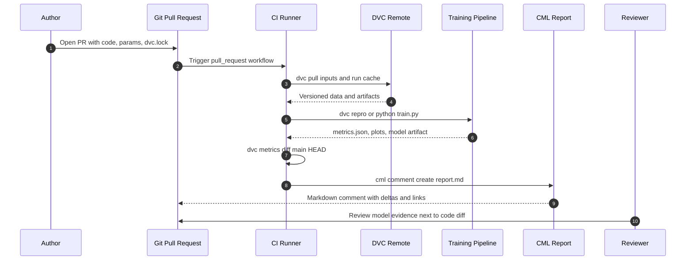
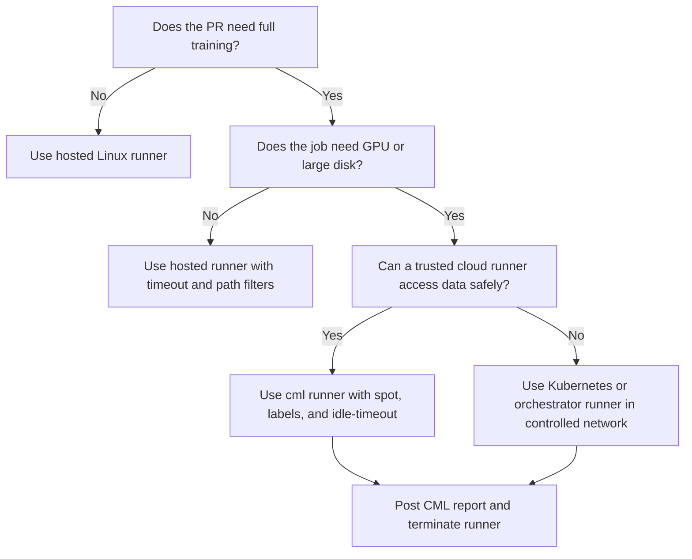

> **Discipline Track** | Complexity: `[COMPLEX]` | Time: 55-60 min
>
> **Prerequisites**: [Module 5.6: ML Pipelines & Automation](../module-5.6-ml-pipelines/), [Module 5.7: Data Versioning with DVC](../module-5.7-dvc-data-versioning/), [Module 5.8: Great Expectations Data Quality](../module-5.8-great-expectations-data-quality/), [Module 5.10: Production Model-Serving Traffic Patterns](../module-5.10-model-serving-traffic-patterns/), and [Module 5.11: Drift-Triggered Auto-Retraining Loop](../module-5.11-drift-triggered-retraining/)

---

## Prerequisites

Before starting this module, make sure you can connect the earlier MLOps
pieces into one review workflow rather than treating CI, data versioning,
validation, serving, and retraining as separate chores:

- [Module 5.6: ML Pipelines & Automation](../module-5.6-ml-pipelines/) for pipeline DAGs, idempotent stages, promotion gates, and resource boundaries
- [Module 5.7: Data Versioning with DVC](../module-5.7-dvc-data-versioning/) for Git-plus-DVC metadata, `dvc.lock`, remotes, metrics, plots, and reproducible data snapshots
- [Module 5.8: Great Expectations Data Quality](../module-5.8-great-expectations-data-quality/) for Checkpoints, Data Docs, validation failure handling, and reviewed data-quality rules
- [Module 5.10: Production Model-Serving Traffic Patterns](../module-5.10-model-serving-traffic-patterns/) for KServe canaries, shadow comparisons, traffic splits, and rollback boundaries
- [Module 5.11: Drift-Triggered Auto-Retraining Loop](../module-5.11-drift-triggered-retraining/) for candidate factories, MLflow evidence, retraining triggers, and promotion policy
- GitHub Actions or GitLab CI/CD basics, including pull request or merge request triggers
- Comfort reading YAML workflows, environment variables, job permissions, and artifact paths

## Learning Outcomes

After completing this module, you will be able to turn a model pull request
into a reviewable engineering artifact instead of a guess about a training
script:

- **Analyze** an ML pull request and identify which evidence reviewers need: metric deltas, parameter deltas, data-validation status, prediction-distribution movement, serving-health checks, and cost impact.
- **Design** a CML report workflow that pulls DVC data, reproduces a pipeline, compares metrics and plots against `main`, and posts one stable pull-request comment.
- **Implement** GitHub Actions and GitLab CI jobs that run CML, DVC, Great Expectations, MLflow tagging, and KServe shadow checks with explicit permissions and artifacts.
- **Evaluate** when hosted runners, CML-launched cloud runners, Kubernetes runners, or heavier orchestrators are the right execution layer for a model-review job.
- **Diagnose and estimate** failed or expensive ML CI runs by separating data-auth failures, missing DVC objects, validation failures, training regressions, report-publishing failures, runner-capacity problems, idle time, and artifact retention.

## Why This Module Matters

Hypothetical scenario: a pull request proposes a new churn model. The diff shows
that `model.py` changed, `params.yaml` changed, `dvc.lock` changed, and a new
plot appeared under `reports/`. The reviewer is a strong platform engineer but
not the person who trained the model. They cannot tell from the code diff
whether recall improved, whether precision fell, whether a critical customer
segment regressed, whether a Great Expectations checkpoint passed, or whether
the new model doubles inference cost. The only way to know is to run the
pipeline manually, hunt through artifacts, and ask the author for screenshots.

That is not code review. That is trust review. Software CI learned long ago
that reviewers should not have to run every test locally before seeing a green
or red signal. ML needs the same discipline, but the signal is richer than a
unit-test status. A model change needs data identity, parameter movement,
metric deltas, validation status, drift snapshots, representative plots, and
deployment smoke results. Those signals must be visible where the decision is
made: the pull request or merge request.

CML, Continuous Machine Learning, sits in that review layer. It does not replace
DVC, Great Expectations, MLflow, KServe, Argo Workflows, Kubeflow Pipelines, or
monitoring. It makes their evidence visible in the Git conversation. The
reviewer sees a comment that says: this exact DVC snapshot was pulled; this
pipeline reproduced; this validation failed or passed; this metric changed by
this amount; this residual plot moved this way; this KServe shadow comparison
won or lost; this run cost approximately this much. That comment lives beside
the diff, works on a phone, does not require a new dashboard login, and remains
part of the review history.

This is the final module of the MLOps Discipline because it ties the whole
arc together. [Module 5.5](../module-5.5-model-monitoring/) gave you the
monitoring vocabulary. [Module 5.6](../module-5.6-ml-pipelines/) gave you
automation. [Module 5.7](../module-5.7-dvc-data-versioning/) gave you data
identity. [Module 5.8](../module-5.8-great-expectations-data-quality/) gave you
data-quality gates. [Module 5.9](../module-5.9-ml-repository-hygiene/) gave you
repository boundaries. [Module 5.10](../module-5.10-model-serving-traffic-patterns/)
gave you production comparison patterns. [Module 5.11](../module-5.11-drift-triggered-retraining/)
gave you a retraining loop. CML is the feedback surface over all of it.

## 1. The ML CI Problem CML Solves

Code review for ML looks familiar until the reviewer asks the question that
matters most: "Is this model better?" A normal application diff can show a
changed branch condition, a new API route, or a refactored database query.
Reviewers can often reason from the source text to the behavior. ML diffs do
not work that way. A two-line change in `params.yaml` can move a decision
boundary across thousands of examples. A harmless-looking preprocessing edit
can leak labels into training. A model class change can improve global accuracy
while hurting a critical slice. The source diff is necessary evidence, but it
is not sufficient evidence.

The reviewer needs a bundle of signals. They need the metric delta against the
current baseline, not just the latest absolute score. They need a parameter
delta so they can see what changed in the training recipe. They need a
prediction-distribution comparison so they can see whether the model started
making very different decisions. They need a data-validation result so they
know the training input was not broken before training began. They need a cost
delta because an offline metric win can be operationally unacceptable if it
requires a larger GPU node pool or a slower inference runtime. For production
promotion, they also need smoke tests and shadow comparison results.

Pull request comments are the right default surface for that evidence. They
are visible where the code review already happens. They are attached to the
branch that produced the evidence. They are easy to discuss linearly with the
author. They do not require the reviewer to open a separate experiment-tracker
tab just to learn whether the candidate is worth a deeper look. A dashboard is
still useful for exploration. A pull-request comment is useful for decisions.

The weak alternative is pasting a screenshot from a notebook into the pull
request description. That screenshot is hard to reproduce, often detached from
the Git commit, and easy to forget when the author pushes a new commit. It also
turns the notebook state into unreviewed authority. CML makes the report part
of CI. The report is generated from the branch, under workflow permissions, from
declared commands, with artifacts that can be inspected after the run. It is
not a replacement for scientific judgment. It is a way to put repeatable
evidence in front of that judgment.

The basic flow is simple:



Notice the boundary. The CI runner does not become the model registry, the
feature store, or the serving platform. It is a controlled reviewer assistant.
It gathers the evidence the reviewer would otherwise ask the author to gather
manually. The workflow can be small for early projects and deeper for mature
platforms. The important move is to make model evidence appear automatically
when a branch asks for review.

The feedback layer should be humble. It should say "this candidate improved
ROC AUC by 0.012 on the reviewed holdout and increased p95 latency by 18 ms,"
not "ship it." It should say "the validation checkpoint failed before
training," not "the model is bad." It should say "shadow win rate was 53.4
percent over 8,000 paired requests," not "production-safe forever." Good ML CI
reduces ambiguity. It does not pretend that model governance has become a
single green check.

> **Pause and predict:** if a workflow posts only the latest accuracy score,
> what question will the reviewer still have to answer manually before
> approving the model?

The missing question is "compared to what?" Absolute scores are rarely enough.
A candidate with 0.884 accuracy may be excellent if the champion is 0.861 and
poor if the champion is 0.902. The review needs the delta, the evaluation
window, the data snapshot, and the cost context.

## 2. CML Commands and Report Shape

CML is a command-line tool that runs inside ordinary CI systems. In GitHub
Actions it is commonly installed with `iterative/setup-cml`. In GitLab CI it is
often used through the `iterativeai/cml` image. The central idea is not exotic:
write Markdown to a file, attach images and links when useful, and ask CML to
post that Markdown back to the pull request, merge request, commit, or issue.

The commands you will see most often are small enough to remember, but the
important part is how they fit into a report-building workflow.

| Command | What It Does | Use It When |
|---|---|---|
| `cml comment create report.md` | Posts a Markdown report as a PR, MR, issue, or commit comment | A CI run produced review evidence that should be visible in Git |
| `cml comment update report.md` | Updates the last matching CML comment | You want one stable report comment per workflow instead of comment spam |
| `cml publish plot.png --md` | Uploads an image and returns Markdown | A plot needs to render inside the report rather than remain a hidden artifact |
| `cml runner launch ...` | Starts a cloud, Kubernetes, or local self-hosted runner | Training needs GPU, disk, memory, warm cache, or network access unavailable on hosted runners |
| `cml pr create pathspec...` | Commits files to a branch and opens a PR or MR | A retraining loop generates reviewed metadata instead of pushing directly to main |
| `cml tensorboard connect ...` | Creates a TensorBoard.dev link and returns Markdown | A deep-learning run needs training curves visible from the report |

Older examples may use binary-style aliases such as `cml-send-comment`,
`cml-publish`, `cml-pr`, or `cml-tensorboard-dev`. Some prose also shortens
those names to forms such as `cml send-comment`. Treat those as legacy naming.
For new workflows, prefer the current subcommands: `cml comment create`,
`cml publish`, `cml pr create`, and `cml tensorboard connect`. That translation
matters during maintenance because old snippets still appear in issue threads,
academic papers, and archived examples.

The report should be boring and structured. A reviewer should not have to infer
which run produced which result. Put the commit, data snapshot, validation
status, metrics, plots, and decision notes under stable headings. Do not bury
the important delta beneath raw logs. Logs belong in CI artifacts. The PR
comment should carry the summary that makes the review possible.

Think of the CML comment as the first page of an incident handoff, except the
incident has not happened yet. The reviewer needs enough evidence to decide
whether the branch deserves deeper attention, not every byte produced by the
training job. A good first page names the candidate, the baseline, the data
window, the evaluation window, and the decision pressure. It should be possible
to read the comment in less than a minute and know whether the next action is
approval, request changes, run a heavier check, or bring in a model owner.

The report should separate facts from interpretation. The metric table is a
fact if it was generated by `dvc metrics diff` from committed metadata. The
statement "the candidate is acceptable" is an interpretation. Keep the factual
evidence close to the top and keep the interpretation explicit. That makes it
easier for another reviewer to disagree productively. They can say "the metric
delta is real, but the latency tradeoff is unacceptable" instead of arguing
about whether the report was assembled honestly.

The report should also name the scope of the evidence. If the workflow trained
on a sampled dataset, say that. If the Great Expectations checkpoint covered
schema and null checks but not distribution drift, say that. If the KServe
shadow comparison replayed redacted traffic from one region, say that. Good
comments make limitations visible. Bad comments hide limitations behind a
single green badge, which pushes the reviewer to over-trust a narrow signal.

Use stable headings because humans scan repeated reports by position. Put
"Metric delta" in the same place every time. Put "Data validation" in the same
place every time. Put "Cost and serving impact" in the same place every time.
After a few reviews, the team learns where to look. That consistency matters
more than a clever layout. Model review is already cognitively expensive; the
report should not add a new navigation problem on every branch.

The report should explain missing evidence rather than silently omitting it. If
the branch did not touch serving files, it is reasonable for the KServe section
to say "not run because no serving path changed." If the branch is a draft, it
is reasonable for the full training section to say "skipped until the PR is
ready for review." If DVC pull failed, the report should say the run is
inconclusive rather than leaving reviewers to infer that no metrics means no
change. Silence creates false confidence.

Treat comment updates as part of the reader experience. A model author may push
several commits while tuning a candidate. The latest report should be easy to
find, but older evidence may still be useful when debugging why the candidate
changed direction. One common pattern is a stable top-level CML comment for the
current state and CI artifacts for historical details. Another pattern is a
short summary comment on every run plus a longer artifact link, but that only
works when the team is disciplined about closing stale threads.

Finally, make the report resilient to partial failure. A validation failure is
still useful evidence. A missing DVC object is useful evidence. A runner launch
timeout is useful evidence. The workflow should try to post a concise failure
summary before exiting whenever it can do so safely. This is not about making
failed runs look successful. It is about giving the reviewer a precise next
step without requiring them to open raw CI logs first.

```markdown
## ML CI report

Commit: `8f2c1ab`
Base: `origin/main`
Data snapshot: `dvc.lock` changed for `data/processed/train.parquet`
Validation: Great Expectations checkpoint passed

### Metric delta

| Metric | main | PR | Delta |
|---|---:|---:|---:|
| recall_at_precision_90 | 0.712 | 0.739 | +0.027 |
| roc_auc | 0.884 | 0.891 | +0.007 |
| p95_latency_ms | 42 | 51 | +9 |

### Review note

The candidate improves recall on the reviewed holdout, but latency increased.
Approve only if the serving budget can absorb the p95 change or the model
serving profile is adjusted before promotion.
```

The simplest GitHub Actions version looks like this. It intentionally fetches
`main` so DVC can compare the branch against the baseline. It grants
`pull-requests: write` because posting a comment requires write permission to
the pull request conversation. It also uses path filters so documentation-only
edits do not spend training budget.

```yaml
name: train

on:
  pull_request:
    branches:
      - main
    paths:
      - ".github/workflows/train.yml"
      - "dvc.yaml"
      - "dvc.lock"
      - "params.yaml"
      - "requirements.txt"
      - "src/**"
      - "data/**/*.dvc"
      - "gx/**"

permissions:
  contents: read
  pull-requests: write

jobs:
  train:
    runs-on: ubuntu-latest
    timeout-minutes: 45

    steps:
      - uses: actions/checkout@v4
        with:
          fetch-depth: 0

      - uses: actions/setup-python@v5
        with:
          python-version: "3.12"

      - uses: iterative/setup-cml@v3

      - uses: iterative/setup-dvc@v1

      - name: Install dependencies
        run: |
          python -m pip install --upgrade pip
          python -m pip install -r requirements.txt

      - name: Fetch base branch for DVC diff
        run: git fetch origin main:main

      - name: Pull DVC data and run cache
        env:
          AWS_REGION: us-east-1
        run: dvc pull --run-cache

      - name: Train candidate
        run: python train.py

      - name: Build report
        run: |
          {
            echo "## ML CI report"
            echo
            echo "Commit: \`${GITHUB_SHA}\`"
            echo
            echo "### Metric delta"
            dvc metrics diff main HEAD --md
            echo
            echo "### Parameter delta"
            dvc params diff main HEAD --md
          } > metrics.md

      - name: Publish report
        env:
          REPO_TOKEN: ${{ secrets.GITHUB_TOKEN }}
        run: cml comment create metrics.md
```

That workflow is intentionally modest. It does not launch a GPU runner, does
not register a model, and does not deploy to KServe. It answers the first
review question: "what changed in model behavior?" Once that is green, you can
add data validation, plots, MLflow links, and serving checks.

The equivalent GitLab CI shape uses job `script:` blocks and the CML image.
GitLab merge request comments require a personal or project access token stored
as a masked CI/CD variable such as `REPO_TOKEN`. The image already carries CML,
and the DVC-enabled image makes the example shorter.

```yaml
stages:
  - train

variables:
  PIP_CACHE_DIR: "$CI_PROJECT_DIR/.cache/pip"

train-and-report:
  stage: train
  image: iterativeai/cml:0-dvc2-base1
  rules:
    - if: '$CI_PIPELINE_SOURCE == "merge_request_event"'
      changes:
        - dvc.yaml
        - dvc.lock
        - params.yaml
        - requirements.txt
        - src/**/*
        - data/**/*.dvc
        - gx/**/*
    - when: never
  cache:
    key: "$CI_COMMIT_REF_SLUG"
    paths:
      - .cache/pip
  script:
    - pip install --upgrade pip
    - pip install -r requirements.txt
    - git fetch origin main:main
    - dvc pull --run-cache
    - python train.py
    - |
      {
        echo "## ML CI report"
        echo
        echo "Commit: \`${CI_COMMIT_SHA}\`"
        echo
        echo "### Metric delta"
        dvc metrics diff main HEAD --md
        echo
        echo "### Parameter delta"
        dvc params diff main HEAD --md
      } > metrics.md
    - cml comment create metrics.md
  artifacts:
    when: always
    expire_in: 14 days
    paths:
      - metrics.md
      - reports/
      - metrics.json
```

Two details deserve attention. First, the report is written by normal shell
commands, not hidden inside CML. CML transports the report to the Git surface.
You own the content. Second, CML comments are not a substitute for artifacts.
The comment should summarize. Artifacts should retain raw validation JSON,
plots, logs, model signatures, and any debug files needed after the CI job
finishes.

Images are where `cml publish` becomes useful. Markdown can reference a local
image, and `cml comment create --publish` can upload local images by default,
but explicit publish steps make reports clearer when you combine generated
plots and hand-built text.

```bash
mkdir -p reports

dvc plots diff \
  --target reports/residuals.csv \
  --template scatter \
  --out reports/residuals.html \
  main HEAD

.venv/bin/python scripts/render_residuals_png.py \
  --input reports/residuals.csv \
  --output reports/residuals.png

{
  echo "## Regression candidate report"
  echo
  echo "### Residual plot"
  cml publish reports/residuals.png --md --title "Residuals: main vs PR"
} > report.md
```

TensorBoard is similar. A long training job may produce many scalar curves that
do not belong as static screenshots. In that case, publish a link and include
the run metadata in the report. The CML command returns Markdown when `--md` is
set, so it can be appended directly.

```bash
{
  echo "## Deep learning training report"
  echo
  echo "### TensorBoard"
  cml tensorboard connect \
    --logdir ./runs \
    --name "PR ${GITHUB_HEAD_REF:-local} training curves" \
    --title "Training curves" \
    --md
} > report.md
```

Use `cml pr create` carefully. It is valuable for retraining loops because an
automated workflow can produce a candidate update without pushing directly to
`main`. For example, a scheduled retraining job can update `dvc.lock`,
`metrics.json`, and `model-card.md`, then open a PR. The next CML job can
evaluate that PR like any human-authored change. That keeps the retraining loop
inside review.

```bash
dvc repro
dvc metrics show --json > reports/latest-metrics.json

git add dvc.lock metrics.json reports/latest-metrics.json model-card.md

cml pr create \
  dvc.lock metrics.json reports/latest-metrics.json model-card.md \
  --title "retrain: update churn candidate from scheduled run" \
  --body "Automated retraining output. Review CML metrics before merge."
```

> **Before running this:** what would happen if the training workflow used
> `cml comment create` on every commit without `comment update` or a stable
> report title?

The pull request would collect a new report comment for every run. That may be
acceptable for a small branch, but it becomes noise during active tuning. For
long-lived model PRs, prefer `cml comment update` with a watermark title for
the main report and use artifacts for detailed history.

## 3. Self-Hosted GPU Runners with CML Runner

Hosted CI runners are excellent for linting, unit tests, metadata checks,
small data validation, and lightweight training. They are usually the wrong
place for serious model training. The common reasons are predictable: no GPU
or limited GPU choice, limited disk, cold caches, job time limits, network
distance from the DVC remote, package-install overhead, and expensive minute
pricing for long runs. A tabular model may train happily on a hosted Linux
runner. A computer-vision candidate, embedding model, or large feature matrix
often needs a runner that looks more like your training environment.

CML runner launch gives a CI job a way to register temporary compute as a
self-hosted runner. The first job starts the machine. The second job targets
the label on that machine. After the runner sits idle for the configured
timeout, CML terminates it. This is powerful because the review workflow can
scale out only when needed. It is risky because the workflow now creates cloud
compute, consumes secrets, and may touch training data. Treat it as
infrastructure automation, not as a casual script.

The AWS example below launches a spot `g5.xlarge` runner with an idle timeout.
The exact instance type is only an example. Use the smallest GPU type that
meets the model's memory and runtime requirements.

```yaml
name: gpu-train

on:
  pull_request:
    branches:
      - main
    types:
      - labeled
      - synchronize
      - opened

permissions:
  contents: read
  pull-requests: write

jobs:
  launch-runner:
    if: contains(github.event.pull_request.labels.*.name, 'run-ml-ci')
    runs-on: ubuntu-latest
    timeout-minutes: 10
    steps:
      - uses: actions/checkout@v4

      - uses: iterative/setup-cml@v3

      - name: Launch AWS spot GPU runner
        env:
          REPO_TOKEN: ${{ secrets.CML_RUNNER_PAT }}
          AWS_ACCESS_KEY_ID: ${{ secrets.AWS_ACCESS_KEY_ID }}
          AWS_SECRET_ACCESS_KEY: ${{ secrets.AWS_SECRET_ACCESS_KEY }}
          AWS_REGION: us-east-1
        run: |
          cml runner launch \
            --cloud aws \
            --cloud-region us-east-1 \
            --cloud-type g5.xlarge \
            --cloud-hdd-size 128 \
            --cloud-spot \
            --idle-timeout 300 \
            --labels cml-gpu

  train-on-gpu:
    needs: launch-runner
    runs-on:
      - self-hosted
      - cml-gpu
    timeout-minutes: 90
    steps:
      - uses: actions/checkout@v4
        with:
          fetch-depth: 0

      - uses: iterative/setup-cml@v3

      - uses: iterative/setup-dvc@v1

      - uses: actions/setup-python@v5
        with:
          python-version: "3.12"

      - name: Train candidate on GPU runner
        env:
          REPO_TOKEN: ${{ secrets.GITHUB_TOKEN }}
        run: |
          python -m pip install -r requirements.txt
          git fetch origin main:main
          dvc pull --run-cache
          python train.py --device cuda
          dvc metrics diff main HEAD --md > report.md
          nvidia-smi >> report.md
          cml comment create report.md
```

The key flags are worth reading as infrastructure design:

| Flag | Meaning | Review Question |
|---|---|---|
| `--cloud aws` | Use AWS as the compute provider | Does the workflow have only the IAM permissions needed to create and delete this runner? |
| `--cloud-type g5.xlarge` | Request a native GPU instance type | Is the GPU memory enough, and is the instance over-sized for the PR job? |
| `--cloud-spot` | Use spot capacity instead of on-demand | Can the job tolerate interruption and resume from DVC run cache or checkpoints? |
| `--cloud-hdd-size 128` | Allocate enough disk for data, cache, and artifacts | Will the DVC pull and training outputs fit without filling the root volume? |
| `--idle-timeout 300` | Terminate after 300 idle seconds | Does the timeout prevent idle spend while leaving enough time for the next job to attach? |
| `--labels cml-gpu` | Register the runner under a target label | Can only approved workflows schedule onto this expensive runner class? |

GCP and Azure follow the same shape. The native machine names and GPU naming
change, but the engineering questions do not. Validate exact CML provider
support against the version you pin, because cloud APIs and machine families
change faster than curriculum pages.

```bash
cml runner launch \
  --cloud gcp \
  --cloud-region us-central1-a \
  --cloud-type n1-standard-4 \
  --cloud-gpu t4 \
  --cloud-hdd-size 128 \
  --cloud-spot \
  --idle-timeout 300 \
  --labels cml-gpu
```

```bash
cml runner launch \
  --cloud azure \
  --cloud-region eastus \
  --cloud-type Standard_NC4as_T4_v3 \
  --cloud-hdd-size 128 \
  --cloud-spot \
  --idle-timeout 300 \
  --labels cml-gpu
```

Kubernetes-backed runners are useful when the organization already has a GPU
cluster, image policy, network policy, and data access model. In that design,
CML does not create a cloud VM. It registers runner capacity inside the
cluster. This can reduce cloud sprawl, make DVC cache locality better, and keep
training jobs close to internal feature stores. It also moves the security
problem into Kubernetes: Pod isolation, service accounts, image admission,
egress policy, and namespace quotas must be correct.

```yaml
apiVersion: batch/v1
kind: Job
metadata:
  name: cml-kubernetes-runner
  namespace: ml-ci
spec:
  ttlSecondsAfterFinished: 600
  template:
    spec:
      restartPolicy: Never
      serviceAccountName: cml-runner-launcher
      containers:
        - name: launcher
          image: iterativeai/cml:0-dvc2-base1
          env:
            - name: REPO_TOKEN
              valueFrom:
                secretKeyRef:
                  name: cml-runner-token
                  key: token
          command:
            - /bin/bash
            - -lc
          args:
            - |
              cml runner launch \
                --cloud kubernetes \
                --cloud-type m+tesla \
                --cloud-kubernetes-namespace ml-ci \
                --cloud-kubernetes-node-selector gpu=infer \
                --cloud-hdd-size 128 \
                --idle-timeout 300 \
                --labels cml-gpu-k8s
```

For on-prem or Kubernetes runners, apply the same isolation thinking you would
apply to any CI system that can execute untrusted branch code. Do not let forked
pull requests run on internal GPU nodes with production data access. Use
protected branches, trusted labels, required approval for external PRs, and
separate tokens for comment publishing versus cloud provisioning. If a runner
can read the DVC remote, launch cloud compute, or reach the model registry, it
is a sensitive actor.

The economics are also real. At verification time in this session, GitHub's
Actions runner pricing page listed the Linux four-core GPU larger runner at
`$0.052` per minute. AWS's public spot price data returned `g5.xlarge` Linux
spot in `us-east-1` at `$0.5978` per hour, which is about `$0.009963` per
minute before storage, network transfer, image pulls, and operational overhead.
AWS on-demand pricing for the same instance family in `us-east-1` is commonly
listed at `$1.006` per hour, about `$0.01677` per minute. Those numbers do not
mean self-hosted is always cheaper. They mean the cost model has to include
idle time, cache warmth, interruptions, secrets management, runner maintenance,
and the price of debugging your own fleet.

The `--idle-timeout` flag is the cost-control knob teams forget. A spot runner
that trains for 18 minutes and idles for 72 minutes was not an 18-minute run.
It was a 90-minute bill. A timeout of 300 seconds keeps the runner alive long
enough for the dependent job to arrive, then tears it down when the review work
is done. For bigger workflows, use labels and job dependencies carefully so the
runner is not launched before prerequisites such as linting and data validation
have passed.

Do not train on every pull request by default. Use draft PRs, path filters,
manual dispatch, or labels such as `run-ml-ci` to gate expensive runs. A
lightweight job can always check YAML, import paths, DVC metadata, and Great
Expectations configuration. Full training should start when the branch is
ready for review or when the changed paths justify it. This is not stinginess.
It is how you keep model feedback fast enough that people actually use it.

## 4. CML and DVC: Reproducible Review Evidence

DVC gives CML the material to report. Without DVC, a CML comment can still post
metrics, but the reviewer cannot easily tie those metrics back to a data
snapshot. With DVC, the report can say: these inputs came from these object
hashes; this pipeline ran from this `dvc.yaml`; this `dvc.lock` records the
result; these metrics changed relative to `main`; these plots show the output
movement. The comment becomes a readable window into reproducibility.

The canonical pattern is:

1. `dvc pull` brings data, models, and run-cache entries to the runner.
2. `dvc repro` runs the declared pipeline stages that are out of date.
3. `dvc metrics diff main HEAD --md` creates a Markdown metric comparison.
4. `dvc params diff main HEAD --md` shows the training-recipe change.
5. `dvc plots diff main HEAD` generates visual evidence.
6. `cml comment create report.md` posts the summary to the pull request.

That sequence is stronger than "run training and paste the score" because it
forces the pipeline to declare its dependencies and outputs. If a data file is
not listed as a dependency, `dvc repro` may not rerun when it changes. If a
metric file is not declared, `dvc metrics diff` may not show the number the
reviewer expects. If a plot file is not declared, the report may describe a
visual that cannot be reproduced. ML CI exposes those gaps early.

Here is a worked regression example. The project trains a small model, records
metrics, and writes residuals. The report includes metric delta, parameter
delta, and a residual plot in one pull-request comment.

```yaml
# dvc.yaml
stages:
  train:
    cmd: .venv/bin/python src/train.py
    deps:
      - data/processed/train.parquet
      - src/train.py
    params:
      - model.max_depth
      - model.min_samples_leaf
      - model.random_state
    outs:
      - models/regressor.joblib
      - reports/residuals.csv
    metrics:
      - metrics.json:
          cache: false
    plots:
      - reports/residuals.csv:
          x: prediction
          y: residual
```

```yaml
# params.yaml
model:
  max_depth: 8
  min_samples_leaf: 12
  random_state: 42
```

```python
# src/train.py
from __future__ import annotations

import json
from pathlib import Path

import joblib
import pandas as pd
import yaml
from sklearn.ensemble import RandomForestRegressor
from sklearn.metrics import mean_absolute_error, r2_score
from sklearn.model_selection import train_test_split


ROOT = Path(__file__).resolve().parents[1]


def main() -> None:
    params = yaml.safe_load((ROOT / "params.yaml").read_text(encoding="utf-8"))
    model_params = params["model"]

    frame = pd.read_parquet(ROOT / "data/processed/train.parquet")
    target = frame.pop("target")
    train_x, test_x, train_y, test_y = train_test_split(
        frame,
        target,
        test_size=0.25,
        random_state=model_params["random_state"],
    )

    model = RandomForestRegressor(
        max_depth=model_params["max_depth"],
        min_samples_leaf=model_params["min_samples_leaf"],
        random_state=model_params["random_state"],
        n_estimators=120,
        n_jobs=-1,
    )
    model.fit(train_x, train_y)
    predictions = model.predict(test_x)

    metrics = {
        "r2": r2_score(test_y, predictions),
        "mae": mean_absolute_error(test_y, predictions),
        "rows_train": int(train_x.shape[0]),
        "rows_test": int(test_x.shape[0]),
    }

    (ROOT / "models").mkdir(exist_ok=True)
    (ROOT / "reports").mkdir(exist_ok=True)
    joblib.dump(model, ROOT / "models/regressor.joblib")
    (ROOT / "metrics.json").write_text(
        json.dumps(metrics, indent=2, sort_keys=True),
        encoding="utf-8",
    )
    residuals = pd.DataFrame(
        {
            "prediction": predictions,
            "actual": test_y.to_numpy(),
            "residual": test_y.to_numpy() - predictions,
        }
    )
    residuals.to_csv(ROOT / "reports/residuals.csv", index=False)


if __name__ == "__main__":
    main()
```

The report-building step can then combine DVC output and CML publishing. It is
normal to render plots with a small project script because teams often want a
specific visual style, slice selection, or annotation.

```yaml
- name: Reproduce DVC pipeline
  run: dvc repro

- name: Render residual image
  run: |
    .venv/bin/python scripts/render_residuals.py \
      --input reports/residuals.csv \
      --output reports/residuals.png

- name: Build CML report
  run: |
    {
      echo "## Regression model review"
      echo
      echo "### Metrics"
      dvc metrics diff main HEAD --md
      echo
      echo "### Parameters"
      dvc params diff main HEAD --md
      echo
      echo "### Residual plot"
      cml publish reports/residuals.png --md --title "Residuals"
      echo
      echo "### DVC status"
      dvc status
    } > report.md

- name: Post CML report
  env:
    REPO_TOKEN: ${{ secrets.GITHUB_TOKEN }}
  run: cml comment create report.md
```

The reviewer sees one comment, but the evidence came from several layers:
`dvc.lock` ties the run to data hashes, `params.yaml` explains the recipe,
`metrics.json` captures scalar results, `reports/residuals.csv` captures visual
data, and CI artifacts retain the raw files. CML is the delivery surface.

There is an important failure mode here. A branch may change `params.yaml`, run
training locally, and commit `metrics.json` without updating `dvc.lock`. The
workflow should run `dvc repro` in CI and fail if the pipeline produces a dirty
workspace that the author did not commit. Otherwise the PR comment may show
fresh CI metrics while the Git diff still contains stale pipeline metadata.

```bash
dvc repro

if ! git diff --quiet -- dvc.lock metrics.json reports/; then
  echo "DVC pipeline outputs changed during CI."
  echo "Run dvc repro locally, review the outputs, and commit the updated files."
  git diff -- dvc.lock metrics.json reports/
  exit 1
fi
```

This check is not busywork. It keeps the review evidence durable. If the report
shows a metric improvement but the branch does not contain the DVC metadata
that produced it, the evidence evaporates after CI logs expire.

## 5. Great Expectations as the First CI Gate

Training on broken data is a waste of compute and a dangerous source of false
confidence. Great Expectations should run before expensive training. If the
checkpoint fails, the workflow should fail early and post enough context for
the author to fix the input. The report can link to Data Docs or attach a
short Markdown summary, but the job should not continue to produce a model
from data that did not satisfy the reviewed validation rules.

The pattern is the same on GitHub and GitLab:

1. Pull the data snapshot or sample needed for validation.
2. Run the named Great Expectations checkpoint.
3. Convert the validation result into a small Markdown summary.
4. Fail the job when the checkpoint reports failure.
5. Skip training unless validation passed.

The validation wrapper below is intentionally explicit. It exits with a nonzero
status when the checkpoint fails, but still writes `gx-report.md` so CI can
upload it as an artifact or CML can post it before failure handling stops the
job.

```python
# scripts/run_gx_checkpoint.py
from __future__ import annotations

import json
from pathlib import Path

import great_expectations as gx


ROOT = Path(__file__).resolve().parents[1]


def main() -> None:
    context = gx.get_context(context_root_dir=ROOT / "gx")
    checkpoint = context.checkpoints.get("training_data_checkpoint")
    result = checkpoint.run()

    summary = {
        "success": bool(result.success),
        "checkpoint": "training_data_checkpoint",
        "run_id": str(result.run_id),
        "validation_count": len(result.run_results),
    }
    (ROOT / "reports").mkdir(exist_ok=True)
    (ROOT / "reports/gx-result.json").write_text(
        json.dumps(summary, indent=2, sort_keys=True),
        encoding="utf-8",
    )

    lines = [
        "## Data validation",
        "",
        f"Checkpoint: `{summary['checkpoint']}`",
        f"Run ID: `{summary['run_id']}`",
        f"Validations: `{summary['validation_count']}`",
        f"Success: `{summary['success']}`",
        "",
    ]
    if summary["success"]:
        lines.append("Training may proceed.")
    else:
        lines.append("Training is blocked until the data-quality failure is fixed.")

    (ROOT / "reports/gx-report.md").write_text("\n".join(lines), encoding="utf-8")

    if not summary["success"]:
        raise SystemExit(1)


if __name__ == "__main__":
    main()
```

The GitHub Actions step can post the validation summary even when validation
fails, then stop before training. The `if: always()` guard is useful for
artifacts and comments, but training itself must depend on success.

```yaml
- name: Pull validation data
  run: dvc pull data/processed/train.parquet

- name: Run Great Expectations checkpoint
  id: gx
  run: .venv/bin/python scripts/run_gx_checkpoint.py

- name: Post validation report on failure
  if: failure() && steps.gx.outcome == 'failure'
  env:
    REPO_TOKEN: ${{ secrets.GITHUB_TOKEN }}
  run: cml comment create reports/gx-report.md

- name: Train only after validation
  if: success()
  run: dvc repro train
```

GitLab can express the same control flow with separate jobs. The training job
uses `needs:` so it will not run if validation fails. Artifacts keep the
validation report available for the merge request.

```yaml
stages:
  - validate
  - train

validate-data:
  stage: validate
  image: iterativeai/cml:0-dvc2-base1
  script:
    - pip install -r requirements.txt
    - dvc pull data/processed/train.parquet
    - .venv/bin/python scripts/run_gx_checkpoint.py
  after_script:
    - |
      if [ -f reports/gx-report.md ]; then
        cml comment create reports/gx-report.md || true
      fi
  artifacts:
    when: always
    expire_in: 14 days
    paths:
      - reports/gx-report.md
      - reports/gx-result.json

train-model:
  stage: train
  image: iterativeai/cml:0-dvc2-base1
  needs:
    - job: validate-data
      artifacts: true
  script:
    - pip install -r requirements.txt
    - dvc pull --run-cache
    - dvc repro train
    - dvc metrics diff main HEAD --md > report.md
    - cml comment create report.md
```

Do not auto-update the expectation suite from the branch data in CI. That
would turn validation into acceptance. CI should enforce the reviewed suite.
When a branch legitimately changes data meaning, the suite diff and the data
snapshot diff should be reviewed together, just as [Module 5.8](../module-5.8-great-expectations-data-quality/)
showed. CML can make that review easier by putting the validation status and
the suite diff summary in the comment, but it should not silently approve a new
baseline.

## 6. CML with MLflow, KServe, and Retraining PRs

The pull-request comment can carry more than training metrics. In a mature
platform, it should link the candidate to the experiment tracker, registry
metadata, and deployment checks. MLflow answers "which run and model version
produced this candidate?" KServe answers "can the candidate serve production
request shapes, and how does it behave under shadow traffic?" CML answers
"what does the reviewer need to see right now?"

The MLflow part should be a link and a summary, not a dump of every parameter.
The report should include the run ID, registered model name, candidate version,
alias or stage, and a short list of tags that prove gates ran. If your MLflow
deployment uses aliases instead of legacy stages, name the alias explicitly.
If it still uses Staging and Production stages, state that clearly and plan the
migration when your registry policy changes.

```python
# scripts/write_mlflow_summary.py
from __future__ import annotations

import os
from pathlib import Path

from mlflow import MlflowClient


def main() -> None:
    run_id = os.environ["MLFLOW_RUN_ID"]
    model_name = os.environ["REGISTERED_MODEL_NAME"]
    model_version = os.environ["MODEL_VERSION"]
    tracking_uri = os.environ["MLFLOW_TRACKING_URI"].rstrip("/")

    client = MlflowClient(tracking_uri=tracking_uri)
    version = client.get_model_version(model_name, model_version)
    tags = {tag.key: tag.value for tag in version.tags}

    report = [
        "### MLflow candidate",
        "",
        f"Run ID: `{run_id}`",
        f"Run URL: {tracking_uri}/#/experiments/0/runs/{run_id}",
        f"Registered model: `{model_name}`",
        f"Version: `{model_version}`",
        f"Current status: `{version.current_stage}`",
        "",
        "| Gate tag | Value |",
        "|---|---|",
        f"| `validation.gx_passed` | `{tags.get('validation.gx_passed', 'missing')}` |",
        f"| `validation.metric_delta` | `{tags.get('validation.metric_delta', 'missing')}` |",
        f"| `serving.shadow_win_rate` | `{tags.get('serving.shadow_win_rate', 'missing')}` |",
    ]
    Path("reports/mlflow-summary.md").write_text("\n".join(report), encoding="utf-8")


if __name__ == "__main__":
    main()
```

The KServe part should first smoke-test the candidate predictor. A smoke test
does not prove model quality. It proves the candidate loads, accepts the
request shape, returns the expected response shape, and emits useful metadata.
That prevents a common failure where offline training looks good but serving
fails because the model signature, feature names, runtime image, or request
schema changed.

```bash
kubectl -n ml-serving get inferenceservice churn-candidate

SERVICE_HOSTNAME="$(kubectl -n ml-serving get inferenceservice churn-candidate \
  -o jsonpath='{.status.url}' | sed 's#https\?://##')"

kubectl -n istio-system port-forward svc/istio-ingressgateway 8080:80 &
PORT_FORWARD_PID="$!"
trap 'kill "${PORT_FORWARD_PID}"' EXIT
sleep 5

curl -sS \
  -H "Host: ${SERVICE_HOSTNAME}" \
  -H "Content-Type: application/json" \
  http://127.0.0.1:8080/v1/models/churn-candidate:predict \
  -d '{
    "instances": [
      {
        "age_days": 183,
        "orders_30d": 4,
        "avg_cart_value": 38.5,
        "support_tickets_30d": 1
      }
    ]
  }' > reports/kserve-smoke.json
```

A shadow comparison is deeper. It compares the candidate against the champion
on paired production-like requests while the champion remains authoritative.
The CI workflow can trigger a short shadow run in a staging namespace, replay a
sample of recent redacted requests, or read the result of an already-running
shadow window. The report should include the win rate, disagreement rate,
latency delta, policy failures, and sample size. It should not claim that a
shadow win proves user impact; [Module 5.10](../module-5.10-model-serving-traffic-patterns/)
explained why shadow mode does not measure user reaction.

The workflow below is a promotion-style example. It assumes data validation and
training already produced a candidate, then runs KServe smoke and shadow
comparison before posting one CML report.

```yaml
# .github/workflows/promote-candidate.yml
name: promote-candidate

on:
  pull_request:
    branches:
      - main
    paths:
      - "models/**"
      - "serving/**"
      - "dvc.lock"
      - "metrics.json"
      - ".github/workflows/promote-candidate.yml"
  workflow_dispatch:

permissions:
  contents: read
  pull-requests: write

jobs:
  promote-candidate:
    runs-on: ubuntu-latest
    timeout-minutes: 60
    steps:
      - uses: actions/checkout@v4
        with:
          fetch-depth: 0

      - uses: actions/setup-python@v5
        with:
          python-version: "3.12"

      - uses: azure/setup-kubectl@v4
        with:
          version: "v1.35.0"

      - uses: iterative/setup-cml@v3

      - uses: iterative/setup-dvc@v1

      - name: Install project tools
        run: |
          python -m pip install --upgrade pip
          python -m pip install -r requirements.txt

      - name: Pull candidate artifacts
        run: dvc pull models metrics.json

      - name: Run data validation summary
        run: .venv/bin/python scripts/run_gx_checkpoint.py

      - name: Register MLflow summary
        env:
          MLFLOW_TRACKING_URI: ${{ secrets.MLFLOW_TRACKING_URI }}
          MLFLOW_RUN_ID: ${{ vars.MLFLOW_RUN_ID }}
          REGISTERED_MODEL_NAME: churn
          MODEL_VERSION: ${{ vars.MODEL_VERSION }}
        run: .venv/bin/python scripts/write_mlflow_summary.py

      - name: Deploy candidate to staging namespace
        run: kubectl apply -n ml-serving-staging -f serving/churn-candidate.yaml

      - name: Wait for candidate readiness
        run: |
          kubectl wait \
            --for=condition=Ready \
            --timeout=300s \
            -n ml-serving-staging \
            inferenceservice/churn-candidate

      - name: Run KServe smoke test
        run: .venv/bin/python scripts/kserve_smoke.py \
          --namespace ml-serving-staging \
          --service churn-candidate \
          --output reports/kserve-smoke.md

      - name: Run shadow comparison
        run: .venv/bin/python scripts/kserve_shadow_compare.py \
          --champion churn-champion \
          --candidate churn-candidate \
          --namespace ml-serving-staging \
          --sample requests/redacted-shadow-sample.jsonl \
          --output reports/shadow-summary.md

      - name: Build promotion report
        run: |
          {
            echo "## Candidate promotion evidence"
            echo
            cat reports/gx-report.md
            echo
            cat reports/mlflow-summary.md
            echo
            echo "### DVC metrics"
            dvc metrics diff main HEAD --md
            echo
            cat reports/kserve-smoke.md
            echo
            cat reports/shadow-summary.md
          } > promotion-report.md

      - name: Post CML promotion report
        env:
          REPO_TOKEN: ${{ secrets.GITHUB_TOKEN }}
        run: cml comment create promotion-report.md
```

The matching shadow summary can be small and review-focused:

```markdown
### KServe shadow comparison

| Signal | Champion | Candidate | Delta |
|---|---:|---:|---:|
| paired_requests | 8000 | 8000 | 0 |
| win_rate | 0.500 | 0.534 | +0.034 |
| disagreement_rate | 0.000 | 0.118 | +0.118 |
| p95_latency_ms | 41 | 58 | +17 |
| policy_failures | 0 | 0 | 0 |

Decision note: candidate quality improved on the replay sample, but p95 latency
exceeds the serving budget by 8 ms. Do not promote without either reducing
model cost or raising the documented serving budget.
```

The CML report should link to MLflow when the reviewer needs deeper run
metadata. It should not duplicate the entire MLflow UI. Likewise, it should
link to KServe logs or CI artifacts for raw request-level comparison. The PR
comment is a decision page, not a data lake.

Iterative Studio can also provide hosted views over DVC and CML-style reports.
That can help teams that want a richer experiment comparison surface without
making every reviewer parse raw CLI output. Use it as a supporting view. The
merge request still needs enough summary evidence that a reviewer can decide
whether to approve, request changes, or ask for a deeper model review.

## 7. Cost Lens for ML CI

ML CI cost has three parts: runner minutes, data movement, and retained
artifacts. Runner minutes are obvious because hosted CI bills by time and
self-hosted cloud runners bill by instance lifetime. Data movement is less
obvious because `dvc pull` may read hundreds of gigabytes from object storage
or across regions. Retained artifacts are easy to miss because every report,
plot, model, and log file can be stored by the CI provider, DVC remote, MLflow
backend, object store, or all of them.

The cost model starts with one question: which PRs deserve expensive training?
Not every branch does. A README edit should not train a model. A small
preprocessing refactor may need only unit tests and a sampled DVC pipeline. A
hyperparameter PR may need full training. A candidate promotion PR may need
KServe shadow comparison. The workflow should encode those tiers so the team
does not depend on authors remembering to save money.

| Trigger | Runner | Typical Work | Cost Control |
|---|---|---|---|
| Any PR touching ML repo metadata | Hosted Linux | YAML parse, imports, `dvc status`, tiny tests | Always on, short timeout |
| PR touching data validation or schemas | Hosted Linux | DVC pull sample, GX checkpoint | Path filters and sampled data |
| PR labeled `run-ml-ci` | Hosted GPU or CML runner | Full training, metrics, plots | Label gate and `idle-timeout` |
| PR labeled `shadow-check` | Self-hosted or staging cluster | KServe smoke, replay, shadow comparison | Bounded sample and namespace quota |
| Scheduled retraining PR | CML runner or orchestrator | Full candidate factory | Budget window and automatic PR instead of merge |

Use labels when human intent matters. Use path filters when file paths are a
good proxy. Use draft PRs when early branches are noisy. Use workflow dispatch
for rare expensive checks. Use concurrency groups to cancel stale runs when a
new commit arrives on the same branch. A model branch that receives five quick
commits should not finish five obsolete GPU jobs.

```yaml
concurrency:
  group: ml-ci-${{ github.workflow }}-${{ github.event.pull_request.number }}
  cancel-in-progress: true

on:
  pull_request:
    types:
      - opened
      - synchronize
      - ready_for_review
      - labeled

jobs:
  full-train:
    if: >
      github.event.pull_request.draft == false &&
      contains(github.event.pull_request.labels.*.name, 'run-ml-ci')
    runs-on: ubuntu-latest
    steps:
      - run: echo "expensive training starts only for ready, labeled PRs"
```

Storage deserves the same discipline. A warm DVC cache on a self-hosted runner
can save minutes and object-store reads, but it can also leak data across jobs
if the runner is reused unsafely. A cache on an ephemeral cloud VM is safer but
usually cold. An S3-backed DVC remote centralizes object storage, but a runner
in the wrong region can pay latency and transfer penalties. For public or
forked PRs, prefer small public fixtures or synthetic data. For private
branches, prefer identity-based access to the DVC remote and minimum-scoped
credentials.

Artifact retention should be intentional. Keep `report.md`, validation JSON,
plots, and model metadata long enough to support review and rollback analysis.
Do not retain raw training data in CI artifacts if it already lives in the DVC
remote. Do not upload model binaries both to CI artifacts and MLflow unless
there is a clear retention reason. Large model files should have one owner:
DVC, a model registry, or an artifact store with lifecycle policy.

The budget policy can be simple:

```yaml
# .github/workflows/ml-ci-budget.yml
name: ml-ci-budget

on:
  pull_request:
    types:
      - opened
      - synchronize
      - labeled
      - ready_for_review

jobs:
  decide:
    runs-on: ubuntu-latest
    outputs:
      run_full_train: ${{ steps.plan.outputs.run_full_train }}
    steps:
      - id: plan
        run: |
          if [[ "${{ github.event.pull_request.draft }}" == "true" ]]; then
            echo "run_full_train=false" >> "$GITHUB_OUTPUT"
            exit 0
          fi
          if [[ "${{ contains(github.event.pull_request.labels.*.name, 'run-ml-ci') }}" == "true" ]]; then
            echo "run_full_train=true" >> "$GITHUB_OUTPUT"
          else
            echo "run_full_train=false" >> "$GITHUB_OUTPUT"
          fi
```

At team scale, publish a monthly ML CI budget in plain terms. For example:
"Every model team gets 30 full GPU PR runs per month, each capped at 90
minutes; extra runs need a label from the platform owner." The exact number is
less important than the norm. If the budget is invisible, CI costs become a
surprise. If the budget is visible, engineers can choose cheaper feedback
earlier and reserve full training for review-ready changes.

## Patterns and Anti-Patterns

Good CML workflows are not complicated for their own sake. They are structured
so a reviewer can answer specific questions without becoming the author of the
pipeline. The patterns below are the ones that survive repeated use.

| Pattern | When to Use It | Why It Works | Scaling Consideration |
|---|---|---|---|
| Tiered ML CI | Most repositories | Cheap checks run always; expensive checks run only when paths, labels, or review state justify them | Keep label policy clear so authors know how to request full training |
| DVC-first report | Any workflow with versioned data | Metrics are tied to data hashes, not just branch state | Cache strategy and DVC remote region matter as data grows |
| One stable CML summary | Active model branches | Reviewers see the current state without scrolling through stale report comments | Use `cml comment update` or stable report titles for long-lived PRs |
| Validation before training | Any data-dependent model | Broken data fails quickly before spending GPU minutes | Keep validation reports small enough for PR comments and full details in artifacts |
| Promotion evidence bundle | Candidate promotion PRs | MLflow, DVC, GX, and KServe evidence appear in one decision surface | Do not turn the PR comment into a raw log dump |
| CML PR for retraining | Scheduled retraining loops | Automated candidates enter human review instead of bypassing Git | Add loop guards so bot-created PRs do not trigger infinite PR creation |

Anti-patterns usually begin as attempts to save time. They end by making review
less trustworthy.

| Anti-Pattern | What Goes Wrong | Better Alternative |
|---|---|---|
| Notebook screenshot in PR description | The screenshot is detached from the commit and stale after the next push | Generate the report from CI with CML |
| Full GPU training on every push | Draft branches burn budget and queue capacity | Use path filters, labels, draft-state checks, and concurrency cancellation |
| Report without baseline delta | Reviewers see a score but cannot judge improvement or regression | Use `dvc metrics diff main HEAD --md` and include champion context |
| CI updates validation suites automatically | New data silently becomes accepted data | Fail validation and review suite diffs separately |
| Self-hosted runner with broad secrets | Branch code can reach data, registry, or cloud APIs it should not touch | Use protected labels, scoped credentials, and isolated runner groups |
| CML comment as artifact storage | Comments become huge and hard to read | Summarize in the comment; attach raw files as artifacts or registry metadata |
| Training job writes directly to main | Retraining bypasses review and rollback evidence | Use `cml pr create` to open a reviewed candidate PR |
| Permanent shadow checks in CI namespace | GPU and network spend continue after the review question is answered | Bound samples, time windows, and teardown steps |

## Decision Framework

CML is one part of the ML delivery system. Use it when the decision is a Git
review decision. Use other surfaces when the decision is exploratory,
operational, or platform-wide.

| Decision | Prefer CML | Prefer GitHub Actions Matrix | Prefer Argo Workflows or Kubeflow | Prefer MLflow or W&B UI |
|---|---|---|---|---|
| Reviewer needs metric delta on one PR | Yes | Sometimes, for small parameter sweeps | No, unless the pipeline already runs there | Link out for details |
| Team wants to test Python versions or small dependency sets | Maybe | Yes | No | No |
| Candidate factory runs multi-step training, validation, and promotion | Report summary only | No | Yes | Registry details |
| Long GPU training with checkpoints | Report summary and runner launch | No | Yes, if cluster-native scheduling matters | Training curves and experiment comparison |
| Comparing dozens of experiments interactively | No | No | Maybe for execution | Yes |
| Deployment health from KServe shadow run | Yes, as decision summary | No | Yes, if the run is orchestrated | Maybe, as linked evidence |
| Auto-generated retraining change needs review | Yes, with `cml pr create` | No | Yes, for the retraining DAG | Yes, for model metadata |

Use CML when:

- The reviewer must approve a Git change and needs ML evidence beside the diff.
- The report can be summarized as Markdown with links and artifacts.
- The workflow runs inside GitHub Actions, GitLab CI, or a compatible runner.
- The evidence is branch-specific and should remain attached to the PR or MR.
- The cost of running the evidence is acceptable under CI policy.

Use a GitHub Actions matrix when the question is a compact CI dimension such as
Python version, dependency version, small model variant, or operating-system
compatibility. A matrix is not a model orchestrator. It is useful for parallel
checks that are similar in shape and bounded in runtime. If each matrix cell
needs a different data snapshot, GPU type, and promotion policy, you are
probably designing an orchestrator workflow inside CI.

Use Argo Workflows or Kubeflow Pipelines when the job is a real ML pipeline:
multiple containerized steps, large artifacts, GPU scheduling, retries,
lineage, workflow templates, approval gates, or cluster-local data movement.
CML can still post the summary after the orchestrator finishes. In that design,
CML is the messenger and the orchestrator is the execution engine.

Use MLflow, Weights & Biases, or Iterative Studio when the question is
exploratory comparison across many runs. A pull-request comment should not
become a miniature experiment tracker. It should carry the current branch's
decision evidence and link to richer UIs when deeper analysis is needed. This
keeps reviewers from drowning in experiment metadata while still giving model
owners the depth they need.

Hosted versus self-hosted runner choice follows a separate path:



The rule of thumb is: keep feedback near the decision, but keep execution near
the data and hardware. CML helps with the first half. Runner choice and
orchestrator choice handle the second half.

## Did You Know?

- GitHub's 2026 Actions runner pricing page lists `linux_4_core_gpu` at `$0.052` per minute, while standard `actions_linux` two-core runners are listed at `$0.006` per minute.
- AWS's public spot price data is updated every 5 minutes; during source verification for this module, `g5.xlarge` Linux spot in `us-east-1` returned `$0.5978` per hour.
- CML runner's documented default idle timeout is `300` seconds, which means an unclaimed launched runner should terminate after five idle minutes unless you override it.
- GitHub Actions workflow syntax documents `360` minutes as the default maximum job runtime, so explicit shorter `timeout-minutes` values are a real cost and queue-control tool.

## Common Mistakes

| Mistake | Why It Happens | How to Fix It |
|---|---|---|
| Posting only the latest metric | Authors think a high score explains itself | Always include `main` versus PR deltas and the evaluation window |
| Forgetting `git fetch origin main:main` | The CI checkout has only the PR commit | Fetch the base branch before `dvc metrics diff main HEAD` |
| Training before data validation | The training script is copied from local experimentation | Run the GX checkpoint first and fail before GPU work begins |
| Letting forked PRs use internal runners | It is easy to reuse one workflow for all contributors | Require approval, trusted labels, and restricted runner groups |
| Pulling the full DVC remote for small checks | Teams use `dvc pull` without targets | Pull only required targets for validation and metadata checks |
| Treating CML as the experiment tracker | A Markdown report feels convenient at first | Keep the PR summary small and link to MLflow, W&B, or Studio for deep exploration |
| Leaving spot runners idle | The launch job succeeds but the dependent job never arrives | Use `needs`, runner labels, concurrency cancellation, and short `idle-timeout` values |
| Hiding report generation in opaque scripts | Reviewers cannot audit how the comment was built | Keep report assembly readable in workflow steps or small reviewed scripts |

## Quiz

<details>
<summary>Your PR improves global accuracy but the CML report shows worse recall for a high-risk slice. What should the reviewer ask before approving?</summary>

The reviewer should ask whether the slice regression violates a pre-defined
promotion rule and whether the metric aligns with the model's business risk.
Global improvement is not enough when a critical segment regresses. The author
should provide slice-level evidence, explain the tradeoff, and either adjust
the model or request a documented exception from the model owner. Approval
should not rely on the global metric alone.
</details>

<details>
<summary>A CML workflow fails at `dvc pull` before training. What do you diagnose first?</summary>

Start with data access and DVC metadata, not model code. Check whether the CI
runner has credentials for the DVC remote, whether the changed `dvc.lock`
points to objects that were pushed, whether the remote region or path is
correct, and whether the workflow pulled the right target. A missing DVC object
means the report cannot be trusted because the runner did not reproduce the
branch's declared data state.
</details>

<details>
<summary>A reviewer sees ten CML comments on one PR, each with a different metric table. What workflow change would you make?</summary>

Use `cml comment update` with a stable watermark for the primary report, or
structure the workflow so only the final report is posted. CI artifacts can
retain historical report files if the team needs run-by-run debugging. The PR
conversation should show the current decision state clearly rather than asking
reviewers to infer which comment is still relevant.
</details>

<details>
<summary>Your hosted runner takes 35 minutes to install packages and pull data before a 6-minute training job. What design change is most useful?</summary>

Move repeated heavy work closer to a warm cache. Options include a self-hosted
runner with a controlled DVC cache, a prebuilt CI image, narrower DVC pull
targets, or an orchestrator job in the same network as the data. The goal is
not simply to buy a faster runner; it is to remove cold-start and data-movement
cost from every review run.
</details>

<details>
<summary>A scheduled retraining job creates a better candidate. Why should it use `cml pr create` instead of pushing directly to `main`?</summary>

The candidate still needs review. `cml pr create` turns generated changes such
as `dvc.lock`, metrics, model cards, and validation summaries into a normal
pull request. That lets the same CML report, review policy, and rollback
evidence apply to automated retraining as to human-authored changes. Direct
pushes skip the decision surface.
</details>

<details>
<summary>A KServe shadow report shows a candidate win rate above 50 percent but a p95 latency increase. How should the PR comment frame that result?</summary>

It should frame the result as a tradeoff, not a simple pass. Shadow win rate
suggests the candidate performed better on paired requests, but latency is a
serving constraint and may affect user experience or cost. The report should
show sample size, latency delta, policy failures, and the documented serving
budget. Promotion should wait if the latency budget is exceeded.
</details>

<details>
<summary>Your ML CI run is both failed and expensive: validation and training finished, but CML report publishing failed after the self-hosted runner idled for a long time. How do you diagnose and estimate the issue?</summary>

Diagnose the failed run by separating the successful gates from the failure
point: data-auth and DVC object access passed, validation passed, and training
completed, so the next checks are token permissions, PR write permissions, CML
driver detection, and network access to the Git provider. Estimate the cost by
including training time plus idle time, not only model runtime. Then fix the
workflow with a shorter `idle-timeout`, a clear dependency between launch and
training jobs, and a report-publishing smoke check that fails quickly when the
comment token cannot write.
</details>

<details>
<summary>A team wants to compare 40 experiments interactively inside every PR comment. What alternative surface is better?</summary>

Use MLflow, Weights & Biases, or Iterative Studio for broad interactive
experiment comparison, then link the relevant run from a short CML comment.
The PR comment should answer the current review question, not recreate the
entire experiment UI. This keeps the Git conversation readable and sends deep
analysis to a tool built for exploration.
</details>

## Hands-On Exercise

Exercise scenario: you are creating a small, reviewable ML repository where a
hyperparameter change opens a pull request and the reviewer sees the metric
delta in a CML comment. The model is intentionally small so the workflow can
run on a hosted runner. The optional bonus shows how the same project can
request a one-off GPU runner when the model becomes expensive.

The end-state layout will look like this:

```text
ml-ci-demo/
|-- .github/
|   `-- workflows/
|       `-- train.yml
|-- .gitignore
|-- .dvc/
|   `-- config
|-- data/
|   `-- raw/
|       `-- iris.csv
|-- dvc.yaml
|-- dvc.lock
|-- metrics.json
|-- models/
|   `-- iris.joblib
|-- params.yaml
|-- reports/
|   |-- confusion.csv
|   `-- confusion.png
|-- requirements.txt
|-- scripts/
|   `-- render_confusion.py
`-- src/
    `-- train.py
```

### Task 1: Create the project and dependencies

Start from an empty local repository or a public GitHub repository where you
are allowed to run Actions.

```bash
mkdir ml-ci-demo
cd ml-ci-demo
git init

python -m venv .venv
.venv/bin/python -m pip install --upgrade pip

cat > requirements.txt <<'EOF'
dvc[s3]==3.59.1
joblib==1.4.2
matplotlib==3.9.2
pandas==2.2.3
pyyaml==6.0.2
scikit-learn==1.5.2
EOF

.venv/bin/python -m pip install -r requirements.txt
```

Create a `.gitignore` that keeps payloads and local runtime output out of Git.
DVC and the workflow will track the reviewable metadata.

```bash
cat > .gitignore <<'EOF'
.venv/
.dvc/cache/
__pycache__/
*.pyc
models/
reports/*.png
data/raw/*.csv
EOF
```

### Task 2: Add a small dataset, params, and training code

The dataset is generated from scikit-learn so the exercise does not depend on
external downloads.

```bash
mkdir -p data/raw src scripts models reports

cat > scripts/create_data.py <<'PY'
from __future__ import annotations

from pathlib import Path

import pandas as pd
from sklearn.datasets import load_iris

root = Path(__file__).resolve().parents[1]
iris = load_iris(as_frame=True)
frame = iris.frame
frame.to_csv(root / "data/raw/iris.csv", index=False)
PY

.venv/bin/python scripts/create_data.py

cat > params.yaml <<'EOF'
model:
  max_depth: 3
  random_state: 42
EOF
```

Add the training script. It writes scalar metrics, a model artifact, and a
confusion-matrix table that the report renderer will turn into an image.

```bash
cat > src/train.py <<'PY'
from __future__ import annotations

import json
from pathlib import Path

import joblib
import pandas as pd
import yaml
from sklearn.metrics import accuracy_score, confusion_matrix, f1_score
from sklearn.model_selection import train_test_split
from sklearn.tree import DecisionTreeClassifier

ROOT = Path(__file__).resolve().parents[1]


def main() -> None:
    params = yaml.safe_load((ROOT / "params.yaml").read_text(encoding="utf-8"))
    model_params = params["model"]

    frame = pd.read_csv(ROOT / "data/raw/iris.csv")
    target = frame.pop("target")
    train_x, test_x, train_y, test_y = train_test_split(
        frame,
        target,
        test_size=0.30,
        random_state=model_params["random_state"],
        stratify=target,
    )

    model = DecisionTreeClassifier(
        max_depth=model_params["max_depth"],
        random_state=model_params["random_state"],
    )
    model.fit(train_x, train_y)
    predictions = model.predict(test_x)

    metrics = {
        "accuracy": accuracy_score(test_y, predictions),
        "macro_f1": f1_score(test_y, predictions, average="macro"),
        "rows_train": int(train_x.shape[0]),
        "rows_test": int(test_x.shape[0]),
    }
    (ROOT / "models").mkdir(exist_ok=True)
    (ROOT / "reports").mkdir(exist_ok=True)
    joblib.dump(model, ROOT / "models/iris.joblib")
    (ROOT / "metrics.json").write_text(
        json.dumps(metrics, indent=2, sort_keys=True),
        encoding="utf-8",
    )

    matrix = confusion_matrix(test_y, predictions)
    pd.DataFrame(matrix).to_csv(ROOT / "reports/confusion.csv", index=False)


if __name__ == "__main__":
    main()
PY
```

Add a small renderer for the CML image report.

```bash
cat > scripts/render_confusion.py <<'PY'
from __future__ import annotations

from pathlib import Path

import matplotlib.pyplot as plt
import pandas as pd

ROOT = Path(__file__).resolve().parents[1]

matrix = pd.read_csv(ROOT / "reports/confusion.csv")

fig, ax = plt.subplots(figsize=(4, 4))
image = ax.imshow(matrix.to_numpy(), cmap="Blues")
ax.set_title("Confusion matrix")
ax.set_xlabel("Predicted")
ax.set_ylabel("Actual")
for row in range(matrix.shape[0]):
    for col in range(matrix.shape[1]):
        ax.text(col, row, int(matrix.iloc[row, col]), ha="center", va="center")
fig.colorbar(image, ax=ax, fraction=0.046, pad=0.04)
fig.tight_layout()
(ROOT / "reports").mkdir(exist_ok=True)
fig.savefig(ROOT / "reports/confusion.png", dpi=140)
PY
```

### Task 3: Initialize DVC and reproduce the pipeline

Use a local filesystem DVC remote for the exercise. In a real project, this
would usually be S3, GCS, Azure Blob Storage, SSH, or another shared remote.

```bash
dvc init
mkdir -p ../ml-ci-demo-dvc-remote
dvc remote add -d localremote ../ml-ci-demo-dvc-remote

dvc stage add \
  -n train \
  -d data/raw/iris.csv \
  -d src/train.py \
  -p model.max_depth,model.random_state \
  -o models/iris.joblib \
  -o reports/confusion.csv \
  -M metrics.json \
  .venv/bin/python src/train.py

dvc repro
.venv/bin/python scripts/render_confusion.py
dvc push

git add .gitignore .dvc/config dvc.yaml dvc.lock metrics.json params.yaml requirements.txt scripts src
git commit -m "feat: add DVC-backed iris training pipeline"
```

Check the current metric before changing anything:

```bash
dvc metrics show
```

### Task 4: Add the GitHub Actions workflow

Create the workflow that runs on pull requests, sets up CML and DVC, reproduces
the pipeline, and posts the report.

```bash
mkdir -p .github/workflows

cat > .github/workflows/train.yml <<'YAML'
name: train

on:
  pull_request:
    branches:
      - main
    paths:
      - ".github/workflows/train.yml"
      - "dvc.yaml"
      - "dvc.lock"
      - "params.yaml"
      - "requirements.txt"
      - "src/**"
      - "scripts/**"
      - "data/**/*.dvc"

permissions:
  contents: read
  pull-requests: write

jobs:
  train:
    runs-on: ubuntu-latest
    timeout-minutes: 30

    steps:
      - uses: actions/checkout@v4
        with:
          fetch-depth: 0

      - uses: actions/setup-python@v5
        with:
          python-version: "3.12"

      - uses: iterative/setup-cml@v3

      - uses: iterative/setup-dvc@v1

      - name: Install dependencies
        run: |
          python -m pip install --upgrade pip
          python -m pip install -r requirements.txt

      - name: Fetch base branch
        run: git fetch origin main:main

      - name: Pull DVC inputs
        run: dvc pull --run-cache

      - name: Reproduce pipeline
        run: dvc repro

      - name: Render confusion matrix
        run: python scripts/render_confusion.py

      - name: Build CML report
        run: |
          {
            echo "## Iris model review"
            echo
            echo "### Metric delta"
            dvc metrics diff main HEAD --md
            echo
            echo "### Parameter delta"
            dvc params diff main HEAD --md
            echo
            echo "### Confusion matrix"
            cml publish reports/confusion.png --md --title "Confusion matrix"
          } > report.md

      - name: Post CML report
        env:
          REPO_TOKEN: ${{ secrets.GITHUB_TOKEN }}
        run: cml comment create report.md
YAML

git add .github/workflows/train.yml
git commit -m "ci: add CML pull request training report"
```

Push the repository to GitHub and set `main` as the default branch before
opening the exercise PR. The local filesystem DVC remote will not be available
to GitHub-hosted runners, so for a real public GitHub exercise use one of
these options:

- Use a real shared DVC remote and configure CI credentials.
- Use `dvc remote add -d localremote ./dvc-remote` only for a local runner demo.
- Skip DVC remote access for the hosted demo by committing the tiny generated
  dataset pointer and using a small public fixture.

For a production-style workflow, prefer a real object-storage remote with
identity-based authentication.

### Task 5: Open a PR that changes a hyperparameter

Create a branch that changes `model.max_depth`, reproduce the pipeline, push
DVC objects, and open a PR.

```bash
git checkout -b tune/max-depth-5

.venv/bin/python - <<'PY'
from pathlib import Path

path = Path("params.yaml")
text = path.read_text(encoding="utf-8")
path.write_text(text.replace("max_depth: 3", "max_depth: 5"), encoding="utf-8")
PY

dvc repro
.venv/bin/python scripts/render_confusion.py
dvc push

git add params.yaml dvc.lock metrics.json
git commit -m "tune: increase decision tree depth"
git push -u origin tune/max-depth-5
```

Open the pull request in GitHub. The workflow should post a comment containing
metric delta, parameter delta, and the confusion-matrix image. If it fails,
debug in this order:

1. Did the runner install CML and DVC?
2. Did `git fetch origin main:main` succeed?
3. Can the runner read the DVC remote?
4. Did `dvc repro` change files that were not committed?
5. Did `cml comment create` have pull-request write permission?

### Optional Task: Launch a one-off GPU runner

Only do this in a repository and cloud account where you are authorized to
create compute. The following pattern launches a spot GPU runner and directs
the next job to it. Use a small timeout while learning.

```yaml
name: optional-gpu-runner

on:
  workflow_dispatch:

permissions:
  contents: read

jobs:
  launch:
    runs-on: ubuntu-latest
    steps:
      - uses: actions/checkout@v4

      - uses: iterative/setup-cml@v3

      - name: Launch one-off spot GPU runner
        env:
          REPO_TOKEN: ${{ secrets.CML_RUNNER_PAT }}
          AWS_ACCESS_KEY_ID: ${{ secrets.AWS_ACCESS_KEY_ID }}
          AWS_SECRET_ACCESS_KEY: ${{ secrets.AWS_SECRET_ACCESS_KEY }}
        run: |
          cml runner launch \
            --cloud aws \
            --cloud-region us-east-1 \
            --cloud-type g5.xlarge \
            --cloud-spot \
            --idle-timeout 120 \
            --labels cml-gpu-once

  verify:
    needs: launch
    runs-on:
      - self-hosted
      - cml-gpu-once
    steps:
      - run: nvidia-smi
```

The success signal is not "the cloud console shows an instance." The success
signal is that the `verify` job lands on the self-hosted runner, prints GPU
information, and the runner terminates after the idle timeout.

### Success Criteria

- [ ] The repository contains `params.yaml`, `dvc.yaml`, `dvc.lock`, `metrics.json`, training code, and a CML workflow.
- [ ] `dvc repro` runs locally and updates metrics from declared dependencies.
- [ ] `dvc metrics diff main HEAD --md` produces a Markdown table on the hyperparameter branch.
- [ ] The pull request workflow installs CML, pulls DVC inputs, trains, renders a plot, and posts one CML comment.
- [ ] The CML comment shows metric delta, parameter delta, and a rendered image.
- [ ] The workflow fails before training if a required DVC object or validation input is missing.
- [ ] Optional: the one-off `cml runner launch --cloud aws --cloud-spot --idle-timeout 120` job registers a runner and the next job lands on it.
- [ ] You can explain when this lightweight CML workflow should hand off to Argo Workflows, Kubeflow Pipelines, MLflow, or a hosted experiment UI.

## Sources

- [CML Command Reference](https://cml.dev/doc/ref)
- [CML comment command](https://cml.dev/doc/ref/comment)
- [CML publish command](https://cml.dev/doc/ref/publish)
- [CML runner command](https://cml.dev/doc/ref/runner)
- [CML pr command](https://cml.dev/doc/ref/pr)
- [CML tensorboard command](https://cml.dev/doc/ref/tensorboard)
- [CML GitLab start guide](https://cml.dev/doc/start/gitlab)
- [setup-cml v3 branch](https://github.com/iterative/setup-cml/tree/v3)
- [DVC pull command](https://doc.dvc.org/command-reference/pull)
- [DVC repro command](https://doc.dvc.org/command-reference/repro)
- [DVC metrics diff command](https://doc.dvc.org/command-reference/metrics/diff)
- [DVC params diff command](https://doc.dvc.org/command-reference/params/diff)
- [DVC plots diff command](https://doc.dvc.org/command-reference/plots/diff)
- [GitHub Actions workflow syntax](https://docs.github.com/en/actions/reference/workflows-and-actions/workflow-syntax)
- [GitHub Actions runner pricing](https://docs.github.com/en/billing/reference/actions-runner-pricing)
- [GitLab CI/CD YAML reference](https://docs.gitlab.com/ci/yaml/)
- [Great Expectations checkpoint actions](https://docs.greatexpectations.io/docs/core/trigger_actions_based_on_results/create_a_checkpoint_with_actions/)
- [MLflow Model Registry workflow](https://mlflow.org/docs/latest/ml/model-registry/workflow/)
- [KServe canary rollout strategy](https://kserve.github.io/website/docs/model-serving/predictive-inference/rollout-strategies/canary)
- [AWS EC2 Spot pricing](https://aws.amazon.com/ec2/spot/pricing/)
- [AWS public spot pricing JSON](https://website.spot.ec2.aws.a2z.com/spot.json)
- [AWS EC2 On-Demand pricing](https://aws.amazon.com/ec2/pricing/on-demand/)
- [Iterative Studio sign-in](https://studio.datachain.ai/auth/sign-in)

## Next Module

[Track Complete: ML Platforms Toolkit](../../../toolkits/data-ai-platforms/ml-platforms/) continues from MLOps discipline into hands-on platform implementations for Kubeflow, MLflow, KServe, Seldon, BentoML, and bare-metal AI infrastructure.
