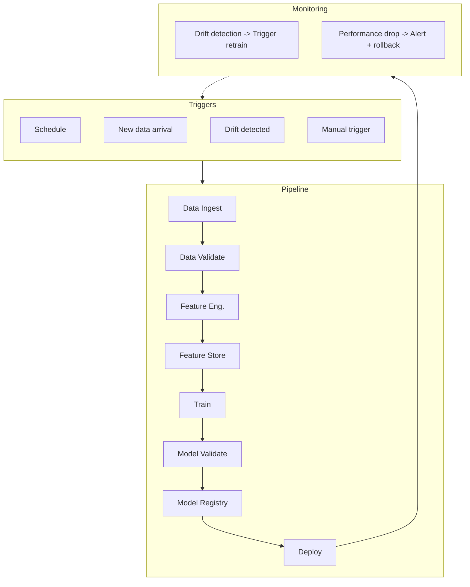
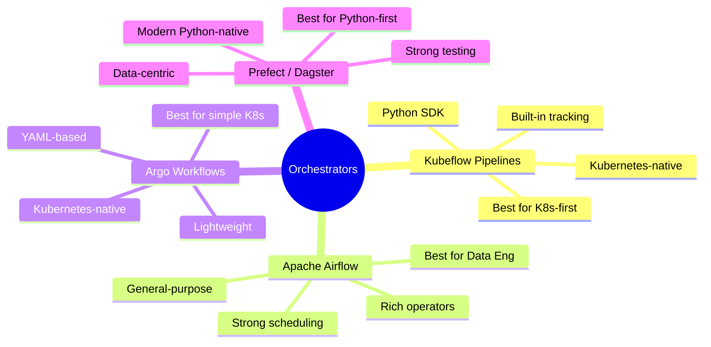
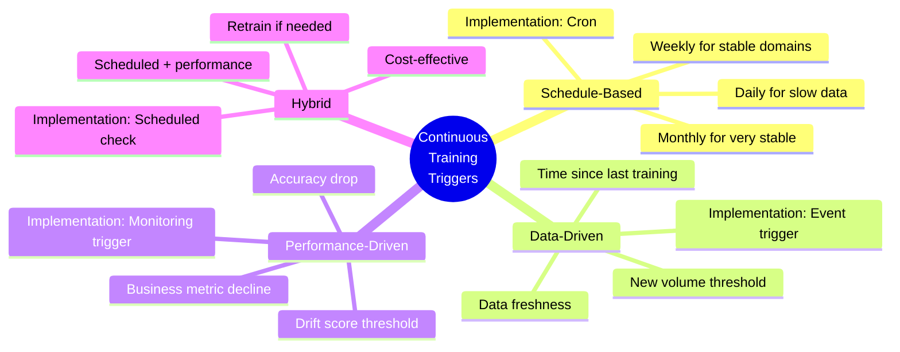
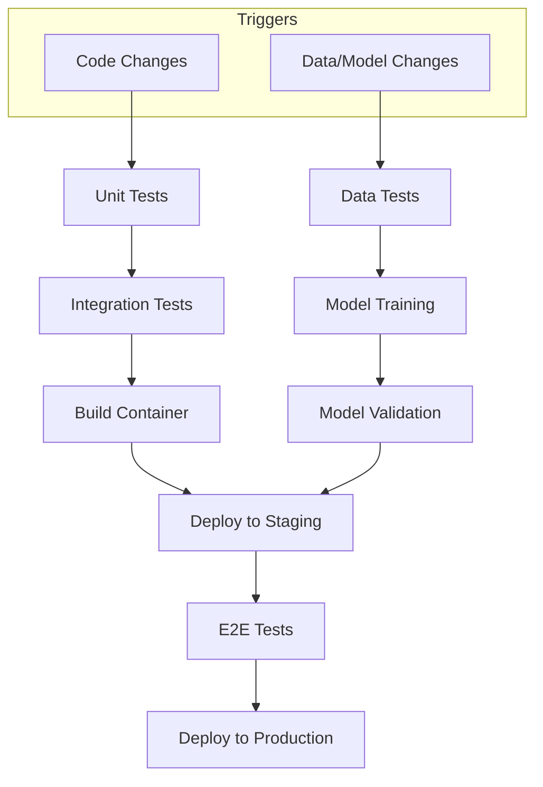

> **Discipline Track** | Complexity: `[COMPLEX]` | Time: 40-45 min

## Prerequisites

Before starting this module:
- [Module 5.5: Model Monitoring & Observability](../module-5.5-model-monitoring/)
- Understanding of CI/CD concepts
- Basic Kubernetes knowledge
- Familiarity with DAGs (Directed Acyclic Graphs)

## What You'll Be Able to Do

After completing this module, you will be able to:

- **Design end-to-end ML pipelines that orchestrate data preparation, training, evaluation, and deployment**
- **Implement pipeline DAGs using Kubeflow Pipelines, Argo Workflows, or Airflow on Kubernetes**
- **Build pipeline versioning and reproducibility practices that enable reliable model iteration**
- **Configure pipeline triggers that automate retraining based on data changes, schedule, or performance alerts**

## Why This Module Matters

Manual ML workflows don't scale. Running notebooks by hand, copying models to S3, updating serving configs—it's error-prone, slow, and doesn't work when you have 100 models in production.

ML pipelines automate the entire lifecycle: data ingestion, validation, training, evaluation, deployment, and monitoring. A change to training code triggers a pipeline that delivers a validated, tested model to production—without human intervention.

This is where MLOps maturity reaches Level 3: continuous training and automated everything.

## Did You Know?

- **Kubeflow Pipelines handles 50,000+ ML jobs daily** at Google, showing that pipeline orchestration scales to enterprise level
- **The concept of ML pipelines** was pioneered at Google with TFX (TensorFlow Extended) starting in 2017, but the ideas date back to Netflix's 2014 ML platform
- **Automated retraining reduces model staleness by 80%** according to research—fresh models perform better
- **Most ML teams spend 25% of their time on pipeline maintenance**—investing in good pipeline design pays dividends

## ML Pipeline Architecture

### End-to-End Pipeline



### Pipeline Components

| Component | Purpose | Tools |
|-----------|---------|-------|
| **Orchestrator** | Schedule, manage DAGs | Kubeflow, Airflow, Argo |
| **Data Validation** | Quality checks | Great Expectations, TFDV |
| **Feature Engineering** | Transform data | Feast, custom code |
| **Training** | Model training | Any ML framework |
| **Model Validation** | Quality gates | Custom metrics |
| **Registry** | Version, stage models | MLflow, Vertex AI |
| **Deployment** | Serve models | KServe, Seldon |
| **Monitoring** | Detect issues | Evidently, custom |

## Pipeline Orchestrators

> **Stop and think**: If your team is already heavily invested in Kubernetes and uses Argo CD for standard application deployments, which ML orchestrator might offer the lowest operational overhead and learning curve for your platform team?

### Tool Comparison



### War Story: The 3AM Pager

A team ran their ML pipeline with cron jobs. Data ingestion at 1AM, training at 2AM, deployment at 4AM. One night, data ingestion failed silently. Training started on stale data. The model deployed was garbage.

3AM pager: "Revenue down 40%." The model was recommending random products.

With a proper orchestrator: Data validation would have failed, stopping the pipeline. No bad model deployed. Team sleeps through the night.

## Kubeflow Pipelines

### Pipeline Definition

```python
# pipeline.py
from kfp import dsl
from kfp.dsl import component, Input, Output, Dataset, Model, Metrics

@component(base_image="python:3.10", packages_to_install=["pandas", "scikit-learn"])
def load_data(output_data: Output[Dataset]):
    """Load and prepare data."""
    import pandas as pd
    from sklearn.datasets import load_iris

    iris = load_iris()
    df = pd.DataFrame(iris.data, columns=iris.feature_names)
    df['target'] = iris.target
    df.to_csv(output_data.path, index=False)

@component(base_image="python:3.10", packages_to_install=["pandas", "great_expectations"])
def validate_data(input_data: Input[Dataset], validated_data: Output[Dataset]):
    """Validate data quality."""
    import pandas as pd

    df = pd.read_csv(input_data.path)

    # Validation checks
    assert len(df) > 100, "Not enough data"
    assert df.isnull().sum().sum() == 0, "Missing values detected"
    assert df['target'].nunique() == 3, "Expected 3 classes"

    df.to_csv(validated_data.path, index=False)
    print(f"Data validated: {len(df)} rows, {len(df.columns)} columns")

@component(base_image="python:3.10", packages_to_install=["pandas", "scikit-learn", "joblib"])
def train_model(
    input_data: Input[Dataset],
    n_estimators: int,
    max_depth: int,
    output_model: Output[Model],
    metrics: Output[Metrics]
):
    """Train model."""
    import pandas as pd
    from sklearn.ensemble import RandomForestClassifier
    from sklearn.model_selection import train_test_split
    from sklearn.metrics import accuracy_score, f1_score
    import joblib

    df = pd.read_csv(input_data.path)
    X = df.drop('target', axis=1)
    y = df['target']

    X_train, X_test, y_train, y_test = train_test_split(X, y, test_size=0.2, random_state=42)

    model = RandomForestClassifier(n_estimators=n_estimators, max_depth=max_depth, random_state=42)
    model.fit(X_train, y_train)

    predictions = model.predict(X_test)
    accuracy = accuracy_score(y_test, predictions)
    f1 = f1_score(y_test, predictions, average='weighted')

    # Log metrics
    metrics.log_metric("accuracy", accuracy)
    metrics.log_metric("f1_score", f1)

    # Save model
    joblib.dump(model, output_model.path)
    print(f"Model trained: accuracy={accuracy:.4f}, f1={f1:.4f}")

@component(base_image="python:3.10")
def validate_model(
    model: Input[Model],
    metrics: Input[Metrics],
    min_accuracy: float
) -> bool:
    """Validate model meets quality bar."""
    accuracy = metrics.metadata.get('accuracy', 0)

    if accuracy >= min_accuracy:
        print(f"Model passed validation: accuracy={accuracy:.4f} >= {min_accuracy}")
        return True
    else:
        print(f"Model failed validation: accuracy={accuracy:.4f} < {min_accuracy}")
        return False

@dsl.pipeline(name="ml-training-pipeline", description="End-to-end ML training pipeline")
def ml_pipeline(
    n_estimators: int = 100,
    max_depth: int = 10,
    min_accuracy: float = 0.9
):
    """ML pipeline definition."""
    # Step 1: Load data
    load_task = load_data()

    # Step 2: Validate data
    validate_task = validate_data(input_data=load_task.outputs['output_data'])

    # Step 3: Train model
    train_task = train_model(
        input_data=validate_task.outputs['validated_data'],
        n_estimators=n_estimators,
        max_depth=max_depth
    )

    # Step 4: Validate model
    validate_model_task = validate_model(
        model=train_task.outputs['output_model'],
        metrics=train_task.outputs['metrics'],
        min_accuracy=min_accuracy
    )
```

### Compiling and Running

```python
from kfp import compiler
from kfp.client import Client

# Compile pipeline
compiler.Compiler().compile(ml_pipeline, 'pipeline.yaml')

# Submit to Kubeflow
client = Client(host='https://kubeflow.example.com')
run = client.create_run_from_pipeline_func(
    ml_pipeline,
    arguments={
        'n_estimators': 200,
        'max_depth': 15,
        'min_accuracy': 0.9,
    },
    experiment_name='iris-training'
)

print(f"Run submitted: {run.run_id}")
```

## Continuous Training

### Trigger Strategies



### Automated Retraining Pipeline

```python
@dsl.pipeline(name="continuous-training-pipeline")
def continuous_training_pipeline(
    model_name: str,
    drift_threshold: float = 0.25,
    min_accuracy: float = 0.9
):
    """Pipeline with drift-triggered retraining."""

    # Step 1: Check for drift
    drift_check = check_drift(
        model_name=model_name,
        threshold=drift_threshold
    )

    # Step 2: Conditional training
    with dsl.Condition(drift_check.outputs['drift_detected'] == True):
        # Load fresh data
        data = load_fresh_data()

        # Validate data
        validated = validate_data(data.outputs['data'])

        # Train new model
        trained = train_model(validated.outputs['data'])

        # Validate model
        validation = validate_model(
            trained.outputs['model'],
            min_accuracy=min_accuracy
        )

        # Deploy if valid
        with dsl.Condition(validation.outputs['passed'] == True):
            deploy_model(
                model=trained.outputs['model'],
                model_name=model_name
            )
```

## CI/CD for ML

> **Pause and predict**: How would an ML CI/CD pipeline handle a scenario where the codebase hasn't changed at all, but the statistical distribution of the incoming data has shifted significantly over the weekend?

### ML CI/CD Pipeline



### GitHub Actions for ML

```yaml
# .github/workflows/ml-pipeline.yaml
name: ML Pipeline

on:
  push:
    branches: [main]
    paths:
      - 'src/**'
      - 'data/**'
      - 'models/**'
  schedule:
    - cron: '0 0 * * 0'  # Weekly
  workflow_dispatch:
    inputs:
      force_retrain:
        description: 'Force model retraining'
        required: false
        default: 'false'

jobs:
  test:
    runs-on: ubuntu-latest
    steps:
      - uses: actions/checkout@v4

      - name: Set up Python
        uses: actions/setup-python@v5
        with:
          python-version: '3.10'

      - name: Install dependencies
        run: pip install -r requirements.txt

      - name: Run unit tests
        run: pytest tests/unit/

      - name: Run data validation
        run: python scripts/validate_data.py

  train:
    needs: test
    runs-on: ubuntu-latest
    steps:
      - uses: actions/checkout@v4

      - name: Set up Python
        uses: actions/setup-python@v5
        with:
          python-version: '3.10'

      - name: Install dependencies
        run: pip install -r requirements.txt

      - name: Check for drift
        id: drift
        run: |
          python scripts/check_drift.py
          echo "drift_detected=$(cat drift_result.txt)" >> $GITHUB_OUTPUT

      - name: Train model
        if: steps.drift.outputs.drift_detected == 'true' || github.event.inputs.force_retrain == 'true'
        run: |
          python scripts/train.py
          python scripts/validate_model.py

      - name: Upload model artifact
        if: steps.drift.outputs.drift_detected == 'true' || github.event.inputs.force_retrain == 'true'
        uses: actions/upload-artifact@v4
        with:
          name: model
          path: models/

  deploy-staging:
    needs: train
    runs-on: ubuntu-latest
    environment: staging
    steps:
      - uses: actions/checkout@v4

      - name: Download model
        uses: actions/download-artifact@v4
        with:
          name: model
          path: models/

      - name: Deploy to staging
        run: |
          python scripts/deploy.py --env staging

      - name: Run integration tests
        run: pytest tests/integration/ --env staging

  deploy-production:
    needs: deploy-staging
    runs-on: ubuntu-latest
    environment: production
    steps:
      - uses: actions/checkout@v4

      - name: Download model
        uses: actions/download-artifact@v4
        with:
          name: model
          path: models/

      - name: Deploy to production
        run: |
          python scripts/deploy.py --env production --canary 10

      - name: Monitor canary
        run: |
          sleep 300  # Wait 5 minutes
          python scripts/check_canary.py

      - name: Promote canary
        run: |
          python scripts/deploy.py --env production --canary 100
```

## Pipeline Best Practices

### 1. Idempotency

```python
# BAD: Not idempotent
def train():
    data = load_latest_data()  # Data changes between runs
    model = train(data)
    save(model, "model.pkl")  # Overwrites previous

# GOOD: Idempotent
def train(data_version: str, run_id: str):
    data = load_data(version=data_version)  # Fixed version
    model = train(data)
    save(model, f"models/{run_id}/model.pkl")  # Unique path
```

### 2. Checkpointing

```python
@component(base_image="python:3.10")
def train_with_checkpoints(
    data: Input[Dataset],
    checkpoint_dir: str,
    model: Output[Model]
):
    """Training with resume capability."""
    import os

    # Check for existing checkpoint
    checkpoint_path = os.path.join(checkpoint_dir, "checkpoint.pt")
    if os.path.exists(checkpoint_path):
        print(f"Resuming from checkpoint: {checkpoint_path}")
        model_state = load_checkpoint(checkpoint_path)
        start_epoch = model_state['epoch']
    else:
        model_state = None
        start_epoch = 0

    # Training loop with checkpoints
    for epoch in range(start_epoch, total_epochs):
        train_epoch(model, data)

        # Save checkpoint
        save_checkpoint({
            'epoch': epoch,
            'model_state': model.state_dict(),
            'optimizer_state': optimizer.state_dict(),
        }, checkpoint_path)

    # Save final model
    save_model(model, model.path)
```

### 3. Resource Management

```yaml
# Kubeflow component with resources
apiVersion: argoproj.io/v1alpha1
kind: Workflow
spec:
  templates:
    - name: train
      container:
        image: training-image:latest
        command: [python, train.py]
        resources:
          requests:
            memory: "4Gi"
            cpu: "2"
            nvidia.com/gpu: "1"
          limits:
            memory: "8Gi"
            cpu: "4"
            nvidia.com/gpu: "1"
      nodeSelector:
        gpu-type: v100
```

### 4. Failure Handling

```python
@dsl.pipeline
def robust_pipeline():
    """Pipeline with error handling."""

    # Training with retry
    train_task = train_model().set_retry(
        num_retries=3,
        backoff_duration="60s",
        backoff_factor=2.0
    )

    # Validation gate
    validate_task = validate_model(train_task.outputs['model'])

    # Conditional deployment
    with dsl.Condition(validate_task.outputs['passed'] == True):
        deploy_model(train_task.outputs['model'])

    # Notification on any failure
    with dsl.ExitHandler(notify_failure()):
        pass  # Exit handler runs on pipeline failure
```

## Common Mistakes

| Mistake | Problem | Solution |
|---------|---------|----------|
| No data versioning | Can't reproduce | Version data in pipeline |
| Missing validation gates | Bad models deploy | Add quality checks |
| Hard-coded parameters | Can't tune | Parameterize everything |
| No failure handling | Pipeline breaks silently | Add retries, alerts |
| Monolithic pipelines | Hard to debug | Modular components |
| No resource limits | Runaway costs | Set CPU/memory/GPU limits |

## Quiz

Test your understanding:

<details>
<summary>1. Your team currently triggers a nightly model retraining script via a simple Linux cron job. Last week, the database connection failed, but the script continued and trained a model on empty data, overwriting production. Why is migrating to a dedicated ML orchestrator like Kubeflow or Airflow the correct architectural response?</summary>

**Answer**: A cron job only provides time-based scheduling without any awareness of the underlying task dependencies or state. An orchestrator manages the entire Directed Acyclic Graph (DAG) of your ML process, ensuring that downstream tasks (like training) only execute if upstream tasks (like data extraction and validation) succeed. If a failure occurs, the orchestrator halts the pipeline, prevents bad models from deploying, and can automatically trigger alerts or retries. This dependency management and state awareness are critical for preventing catastrophic production failures in automated ML systems.
</details>

<details>
<summary>2. An e-commerce platform deployed a new recommendation model that performed well initially. Two months later, marketing launched a massive campaign in a new country, drastically changing user behavior patterns. The model's click-through rate plummeted, but no retraining was triggered because the weekly schedule wasn't due for another five days. What retraining trigger strategy would have prevented this degradation?</summary>

**Answer**: The team should have implemented a performance-driven or data-driven trigger strategy alongside their scheduled retraining. Performance-driven triggers constantly monitor operational metrics (like click-through rate or prediction drift) and automatically initiate a pipeline run when these metrics breach a predefined threshold. Data-driven triggers watch for significant shifts in input data volume or distribution. By relying solely on a rigid time-based schedule, the system was blind to real-world context changes; a hybrid approach ensures models remain fresh exactly when business conditions demand it.
</details>

<details>
<summary>3. A DevOps engineer moving to the ML platform team sets up a standard CI/CD pipeline that runs unit tests, builds a Docker container, and deploys to staging whenever a pull request is merged. However, the data scientists complain that broken models are reaching production despite the tests passing. What key differences between traditional CI/CD and ML CI/CD is the engineer missing?</summary>

**Answer**: Traditional CI/CD focuses almost entirely on code correctness, whereas ML CI/CD must validate code, data, and the model artifact itself. The engineer's pipeline is missing data validation gates (checking for schema changes or null values) and model validation gates (evaluating accuracy, F1 score, or fairness metrics against a baseline). Furthermore, in ML systems, a deployment shouldn't just be triggered by code changes; it must also be triggered by data changes or model degradation. Ignoring these ML-specific dimensions allows mathematically flawed but syntactically correct models to pass traditional quality checks.
</details>

<details>
<summary>4. A data scientist is debugging a Kubeflow pipeline that failed during the deployment step. They re-run the exact same pipeline execution, but this time the model validation step fails because the training step produced a slightly different model. Upon inspection, the data loading component pulls `SELECT * FROM table ORDER BY date DESC LIMIT 1000`. Why does this violate pipeline best practices, and how should it be fixed?</summary>

**Answer**: The pipeline lacks idempotency, meaning identical inputs do not consistently produce identical outputs across multiple runs. Because the data loading query fetches the "latest" 1000 rows, any new data inserted between pipeline runs changes the underlying training set, making the process impossible to reproduce or debug reliably. To fix this, the pipeline must use strict versioning for all inputs, such as querying data up to a specific, immutable timestamp or referencing a version-controlled dataset hash. Idempotency guarantees that re-running a failed DAG will process the exact same state, which is foundational for reliable MLOps.
</details>

## Hands-On Exercise: Build an End-to-End Pipeline

Create a complete ML pipeline with validation and deployment:

### Setup

```bash
mkdir ml-pipeline && cd ml-pipeline
python -m venv venv
source venv/bin/activate
pip install kfp pandas scikit-learn mlflow
```

### Step 1: Create Pipeline Components

```python
# components.py
from kfp import dsl
from kfp.dsl import component, Input, Output, Dataset, Model, Metrics

@component(base_image="python:3.10", packages_to_install=["pandas", "scikit-learn"])
def load_data(output_data: Output[Dataset], data_version: str = "v1"):
    """Load data with version tracking."""
    import pandas as pd
    from sklearn.datasets import make_classification

    X, y = make_classification(
        n_samples=1000,
        n_features=10,
        n_informative=5,
        random_state=42
    )

    df = pd.DataFrame(X, columns=[f'feature_{i}' for i in range(10)])
    df['target'] = y
    df.to_csv(output_data.path, index=False)

    print(f"Data loaded: version={data_version}, shape={df.shape}")

@component(base_image="python:3.10", packages_to_install=["pandas"])
def validate_data(
    input_data: Input[Dataset],
    validated_data: Output[Dataset],
    min_rows: int = 100
) -> bool:
    """Validate data quality."""
    import pandas as pd

    df = pd.read_csv(input_data.path)

    # Validation checks
    checks = {
        "min_rows": len(df) >= min_rows,
        "no_nulls": df.isnull().sum().sum() == 0,
        "target_exists": 'target' in df.columns,
    }

    all_passed = all(checks.values())

    print(f"Validation results: {checks}")
    print(f"All passed: {all_passed}")

    if all_passed:
        df.to_csv(validated_data.path, index=False)

    return all_passed

@component(
    base_image="python:3.10",
    packages_to_install=["pandas", "scikit-learn", "joblib", "mlflow"]
)
def train_model(
    input_data: Input[Dataset],
    n_estimators: int,
    max_depth: int,
    output_model: Output[Model],
    metrics: Output[Metrics]
):
    """Train model with experiment tracking."""
    import pandas as pd
    from sklearn.ensemble import RandomForestClassifier
    from sklearn.model_selection import train_test_split
    from sklearn.metrics import accuracy_score, f1_score, roc_auc_score
    import joblib
    import mlflow

    df = pd.read_csv(input_data.path)
    X = df.drop('target', axis=1)
    y = df['target']

    X_train, X_test, y_train, y_test = train_test_split(
        X, y, test_size=0.2, random_state=42
    )

    # Train
    model = RandomForestClassifier(
        n_estimators=n_estimators,
        max_depth=max_depth,
        random_state=42
    )
    model.fit(X_train, y_train)

    # Evaluate
    predictions = model.predict(X_test)
    proba = model.predict_proba(X_test)[:, 1]

    accuracy = accuracy_score(y_test, predictions)
    f1 = f1_score(y_test, predictions)
    auc = roc_auc_score(y_test, proba)

    # Log metrics
    metrics.log_metric("accuracy", accuracy)
    metrics.log_metric("f1_score", f1)
    metrics.log_metric("auc", auc)
    metrics.log_metric("n_estimators", n_estimators)
    metrics.log_metric("max_depth", max_depth)

    # Save model
    joblib.dump(model, output_model.path)

    print(f"Model trained: accuracy={accuracy:.4f}, f1={f1:.4f}, auc={auc:.4f}")

@component(base_image="python:3.10")
def validate_model(
    metrics: Input[Metrics],
    min_accuracy: float,
    min_f1: float
) -> bool:
    """Validate model meets quality threshold."""
    accuracy = metrics.metadata.get('accuracy', 0)
    f1 = metrics.metadata.get('f1_score', 0)

    passed = accuracy >= min_accuracy and f1 >= min_f1

    print(f"Model validation:")
    print(f"  Accuracy: {accuracy:.4f} (min: {min_accuracy})")
    print(f"  F1: {f1:.4f} (min: {min_f1})")
    print(f"  Passed: {passed}")

    return passed

@component(base_image="python:3.10", packages_to_install=["mlflow"])
def register_model(
    model: Input[Model],
    metrics: Input[Metrics],
    model_name: str
):
    """Register model in MLflow registry."""
    import mlflow
    import shutil
    import os

    # Copy model to temp location for MLflow
    temp_path = "/tmp/model.joblib"
    shutil.copy(model.path, temp_path)

    # Log to MLflow
    mlflow.set_experiment("pipeline-models")

    with mlflow.start_run():
        mlflow.log_artifact(temp_path, "model")
        mlflow.log_metrics(metrics.metadata)

        # Register model
        model_uri = f"runs:/{mlflow.active_run().info.run_id}/model"
        mlflow.register_model(model_uri, model_name)

    print(f"Model registered: {model_name}")
```

### Step 2: Define Pipeline

```python
# pipeline.py
from kfp import dsl
from components import load_data, validate_data, train_model, validate_model, register_model

@dsl.pipeline(
    name="end-to-end-ml-pipeline",
    description="Complete ML pipeline with validation and registration"
)
def ml_pipeline(
    data_version: str = "v1",
    n_estimators: int = 100,
    max_depth: int = 10,
    min_accuracy: float = 0.85,
    min_f1: float = 0.85,
    model_name: str = "classifier"
):
    """End-to-end ML pipeline."""

    # Step 1: Load data
    load_task = load_data(data_version=data_version)

    # Step 2: Validate data
    validate_data_task = validate_data(
        input_data=load_task.outputs['output_data'],
        min_rows=100
    )

    # Step 3: Train model (only if data is valid)
    with dsl.Condition(validate_data_task.output == True):
        train_task = train_model(
            input_data=validate_data_task.outputs['validated_data'],
            n_estimators=n_estimators,
            max_depth=max_depth
        )

        # Step 4: Validate model
        validate_model_task = validate_model(
            metrics=train_task.outputs['metrics'],
            min_accuracy=min_accuracy,
            min_f1=min_f1
        )

        # Step 5: Register model (only if validation passes)
        with dsl.Condition(validate_model_task.output == True):
            register_task = register_model(
                model=train_task.outputs['output_model'],
                metrics=train_task.outputs['metrics'],
                model_name=model_name
            )

if __name__ == "__main__":
    from kfp import compiler
    compiler.Compiler().compile(ml_pipeline, 'pipeline.yaml')
    print("Pipeline compiled to pipeline.yaml")
```

### Step 3: Run Locally (Testing)

```python
# test_pipeline.py
"""Test pipeline components locally."""
import tempfile
import os

# Test data loading
from components import load_data, validate_data, train_model, validate_model

def test_pipeline_locally():
    """Run pipeline components locally for testing."""

    with tempfile.TemporaryDirectory() as tmpdir:
        # Test load_data
        data_path = os.path.join(tmpdir, "data.csv")
        # Simulate component execution
        print("Testing load_data...")

        from sklearn.datasets import make_classification
        import pandas as pd

        X, y = make_classification(n_samples=1000, n_features=10, random_state=42)
        df = pd.DataFrame(X, columns=[f'feature_{i}' for i in range(10)])
        df['target'] = y
        df.to_csv(data_path, index=False)
        print(f"  Data shape: {df.shape}")

        # Test validation
        print("Testing validate_data...")
        assert len(df) >= 100
        assert df.isnull().sum().sum() == 0
        print("  Validation passed")

        # Test training
        print("Testing train_model...")
        from sklearn.ensemble import RandomForestClassifier
        from sklearn.model_selection import train_test_split
        from sklearn.metrics import accuracy_score

        X = df.drop('target', axis=1)
        y = df['target']
        X_train, X_test, y_train, y_test = train_test_split(X, y, test_size=0.2)

        model = RandomForestClassifier(n_estimators=100, max_depth=10, random_state=42)
        model.fit(X_train, y_train)

        accuracy = accuracy_score(y_test, model.predict(X_test))
        print(f"  Accuracy: {accuracy:.4f}")

        # Test model validation
        print("Testing validate_model...")
        assert accuracy >= 0.85, f"Accuracy {accuracy} below threshold 0.85"
        print("  Model validation passed")

        print("\nAll tests passed!")

if __name__ == "__main__":
    test_pipeline_locally()
```

### Success Criteria

You've completed this exercise when you can:
- [ ] Define pipeline components with inputs/outputs
- [ ] Create a pipeline with conditional logic
- [ ] Compile pipeline to YAML
- [ ] Test components locally
- [ ] Understand how to submit to Kubeflow

## Key Takeaways

1. **Orchestrators manage complexity**: Dependencies, retries, monitoring
2. **Validation gates are essential**: Stop bad data/models from deploying
3. **Continuous training keeps models fresh**: Trigger on drift or schedule
4. **CI/CD for ML is different**: Test data and models, not just code
5. **Idempotency enables reproducibility**: Same inputs → same outputs

## Further Reading

- [Kubeflow Pipelines Documentation](https://www.kubeflow.org/docs/components/pipelines/) — Pipeline orchestration
- [MLOps Principles](https://ml-ops.org/) — MLOps best practices
- [Continuous Delivery for Machine Learning](https://martinfowler.com/articles/cd4ml.html) — Martin Fowler's guide
- [TFX User Guide](https://www.tensorflow.org/tfx/guide) — Google's ML pipelines

## Summary

ML pipelines automate the entire lifecycle from data to deployment. Orchestrators like Kubeflow manage dependencies, failures, and resources. Continuous training keeps models fresh through scheduled or drift-triggered retraining. CI/CD for ML tests both code and models before deployment. Well-designed pipelines are idempotent, modular, and include validation gates at every step.

---

## Track Complete!

Congratulations on completing the MLOps Discipline! You now understand:
- MLOps fundamentals and maturity levels
- Feature stores for training/serving consistency
- Experiment tracking and hyperparameter optimization
- Model serving patterns and deployment strategies
- Drift detection and model monitoring
- Pipeline orchestration and automation

Next, explore the [ML Platforms Toolkit](/platform/toolkits/data-ai-platforms/ml-platforms/) for hands-on implementations with Kubeflow, MLflow, and other tools.
---