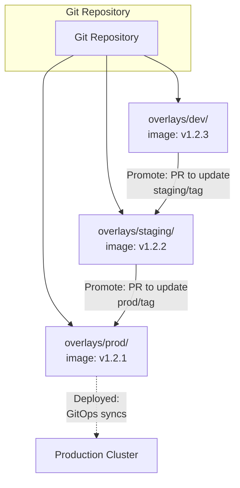
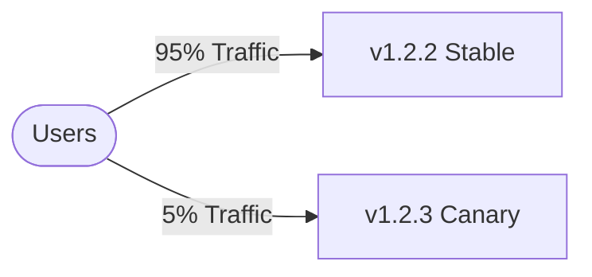
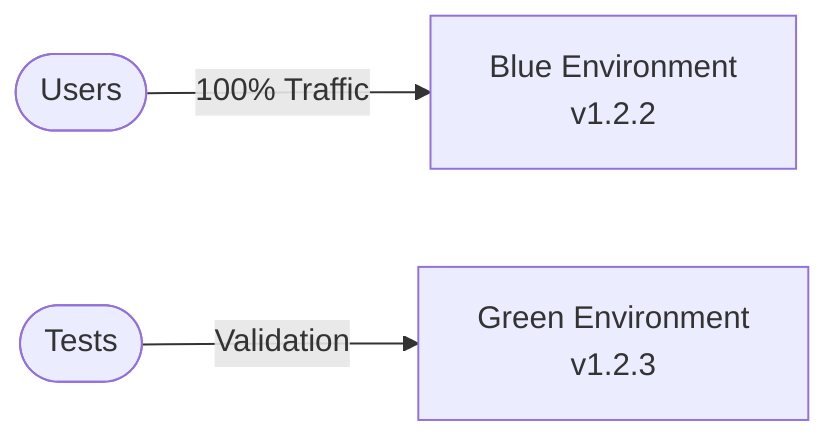

> **Discipline Module** | Complexity: `[MEDIUM]` | Time: 30-35 min

## Prerequisites

Before starting this module:
- **Required**: [Module 3.2: Repository Strategies](../module-3.2-repository-strategies/) — Repository structure
- **Required**: [Module 3.1: What is GitOps?](../module-3.1-what-is-gitops/) — GitOps fundamentals
- **Recommended**: Experience with multi-environment deployments

---

## What You'll Be Able to Do

After completing this module, you will be able to:

- **Design environment promotion pipelines that move changes safely from dev through staging to production**
- **Implement automated promotion gates with testing, approval, and rollback capabilities**
- **Build promotion strategies that handle dependencies between microservices during coordinated releases**
- **Evaluate promotion patterns — image tag updates, Kustomize overlays, Helm value overrides — for your context**

## Why This Module Matters

Your new feature works in dev. Now what?

The journey from dev to production is where most deployment problems occur:
- "It worked in staging!" (but prod is different)
- "Who promoted this?" (no audit trail)
- "Can we roll back?" (unclear what to roll back to)

**Good promotion strategy means:**
- Changes are tested before reaching users
- Promotions are auditable and reversible
- The path to production is clear and consistent

This module teaches you how to promote changes safely through environments using GitOps.

---

> **Stop and think**: How many manual steps exist in your current deployment process? Every manual step is an opportunity for human error or config drift between environments.

## The Promotion Problem

In traditional deployments, promotion often means:
1. Run CI/CD pipeline for staging
2. Wait for manual approval
3. Run CI/CD pipeline for prod
4. Hope nothing is different

**What can go wrong:**
- Different pipeline runs = potentially different results
- Config drift between environments
- Manual steps introduce errors
- No clear record of what was promoted

GitOps changes this by making promotion a **Git operation**.

---

## Directory-Based Promotion

The simplest and most common GitOps promotion pattern.

### The Structure

```
my-service/
├── base/
│   ├── deployment.yaml
│   ├── service.yaml
│   └── kustomization.yaml
└── overlays/
    ├── dev/
    │   └── kustomization.yaml     # image: v1.2.3
    ├── staging/
    │   └── kustomization.yaml     # image: v1.2.2
    └── prod/
        └── kustomization.yaml     # image: v1.2.1
```

### Promotion = Update Image Tag

```yaml
# overlays/dev/kustomization.yaml
apiVersion: kustomize.config.k8s.io/v1beta1
kind: Kustomization
resources:
  - ../../base
images:
  - name: my-service
    newTag: v1.2.3  # Latest in dev

# overlays/staging/kustomization.yaml
apiVersion: kustomize.config.k8s.io/v1beta1
kind: Kustomization
resources:
  - ../../base
images:
  - name: my-service
    newTag: v1.2.2  # Promoted from dev

# overlays/prod/kustomization.yaml
apiVersion: kustomize.config.k8s.io/v1beta1
kind: Kustomization
resources:
  - ../../base
images:
  - name: my-service
    newTag: v1.2.1  # Promoted from staging
```

### The Promotion Flow



### Manual Promotion

```bash
# Promote v1.2.3 from dev to staging
cd config-repo

# Update staging overlay
yq eval '.images[0].newTag = "v1.2.3"' -i overlays/staging/kustomization.yaml

# Commit and push
git add overlays/staging/
git commit -m "Promote my-service v1.2.3 to staging"
git push origin main

# GitOps agent syncs staging cluster
```

### Automated Promotion

```yaml
# GitHub Action for auto-promotion
name: Promote to Staging

on:
  workflow_dispatch:
    inputs:
      version:
        description: 'Version to promote'
        required: true

jobs:
  promote:
    runs-on: ubuntu-latest
    steps:
      - uses: actions/checkout@v4

      - name: Update staging image tag
        run: |
          yq eval '.images[0].newTag = "${{ inputs.version }}"' \
            -i overlays/staging/kustomization.yaml

      - name: Create PR
        uses: peter-evans/create-pull-request@v5
        with:
          title: "Promote my-service ${{ inputs.version }} to staging"
          branch: promote-staging-${{ inputs.version }}
          body: |
            Promoting my-service to staging.

            **Version**: ${{ inputs.version }}
            **Source**: dev environment

            Please review and merge to complete promotion.
```

---

## Try This: Trace a Promotion

Think about a recent deployment to production:

```
1. What version/commit was promoted? _________________
2. When did it reach each environment?
   - Dev: _________________
   - Staging: _________________
   - Prod: _________________
3. Who approved each promotion? _________________
4. What testing happened between environments? _________________
5. How would you roll back? _________________
```

If you can't answer these easily, your promotion process needs work.

---

> **Pause and predict**: If you use the `latest` tag in your deployment files, how does the cluster know when the image has actually changed in the registry?

## Image Tag Promotion

The most common artifact to promote is the container image tag.

### Why Image Tags?

```
Image tag represents:
- Specific code version
- Built artifact
- Immutable (if using proper tagging)

Promoting an image tag = deploying exact same artifact
```

### Tag Strategies

**Semantic Versioning:**
```
my-service:v1.2.3
my-service:v1.2.4
my-service:v2.0.0
```
- Clear version progression
- Works well with release processes
- Requires version management

**Git SHA:**
```
my-service:abc123f
my-service:def456g
```
- Directly traceable to code
- No version management needed
- Less human-readable

**Git SHA + Build Number:**
```
my-service:abc123f-42
my-service:def456g-43
```
- Traceable + ordering
- Useful for debugging

**Avoid:**
```
my-service:latest    # Mutable, ambiguous
my-service:staging   # Which version?
```

### Promotion Script Example

```bash
#!/bin/bash
# promote.sh - Promote image tag through environments

set -e

VERSION=$1
FROM_ENV=$2
TO_ENV=$3

if [ -z "$VERSION" ] || [ -z "$FROM_ENV" ] || [ -z "$TO_ENV" ]; then
  echo "Usage: ./promote.sh <version> <from-env> <to-env>"
  echo "Example: ./promote.sh v1.2.3 dev staging"
  exit 1
fi

echo "Promoting $VERSION from $FROM_ENV to $TO_ENV"

# Verify version exists in source environment
CURRENT=$(yq eval '.images[0].newTag' overlays/$FROM_ENV/kustomization.yaml)
if [ "$CURRENT" != "$VERSION" ]; then
  echo "Warning: $FROM_ENV has $CURRENT, not $VERSION"
  read -p "Continue anyway? (y/n) " -n 1 -r
  echo
  if [[ ! $REPLY =~ ^[Yy]$ ]]; then
    exit 1
  fi
fi

# Update target environment
yq eval ".images[0].newTag = \"$VERSION\"" -i overlays/$TO_ENV/kustomization.yaml

# Show diff
git diff overlays/$TO_ENV/

# Commit
git add overlays/$TO_ENV/
git commit -m "Promote my-service $VERSION to $TO_ENV

Promoted from: $FROM_ENV
Previous version: $(git show HEAD^:overlays/$TO_ENV/kustomization.yaml | yq '.images[0].newTag')"

echo "Committed. Push to deploy."
```

---

> **Stop and think**: If a new deployment introduces a subtle memory leak, how long does it take for your current monitoring to catch it, and how many users are affected in the meantime?

## Progressive Delivery

Beyond simple environment promotion, progressive delivery gradually shifts traffic.

### Canary Deployments



Monitor canary for errors...

If OK:   Increase to 25%, 50%, 100%
If bad:  Roll back canary

**GitOps Canary with Flagger:**

```yaml
apiVersion: flagger.app/v1beta1
kind: Canary
metadata:
  name: my-service
spec:
  targetRef:
    apiVersion: apps/v1
    kind: Deployment
    name: my-service
  progressDeadlineSeconds: 60
  service:
    port: 80
  analysis:
    interval: 30s
    threshold: 5
    maxWeight: 50
    stepWeight: 10
    metrics:
      - name: request-success-rate
        thresholdRange:
          min: 99
        interval: 1m
      - name: request-duration
        thresholdRange:
          max: 500
        interval: 30s
```

### Blue-Green Deployments



Test Green environment...

If OK:   Switch traffic: Blue=0%, Green=100%
If bad:  Keep traffic on Blue

**GitOps Blue-Green with Argo Rollouts:**

```yaml
apiVersion: argoproj.io/v1alpha1
kind: Rollout
metadata:
  name: my-service
spec:
  replicas: 5
  strategy:
    blueGreen:
      activeService: my-service
      previewService: my-service-preview
      autoPromotionEnabled: false  # Manual promotion
  template:
    spec:
      containers:
        - name: my-service
          image: my-service:v1.2.3
```

### When to Use Progressive Delivery

| Scenario | Strategy |
|----------|----------|
| Low risk, fast feedback | Direct promotion |
| Medium risk, need validation | Canary (gradual) |
| High risk, need full testing | Blue-green (parallel) |
| Critical services | Canary with automated rollback |

---

## Did You Know?

1. **Facebook deploys code to 2% of users first**, then gradually rolls out. They call this "gatekeeper" and have done it for over a decade.

2. **"GitOps promotion" is fundamentally different from "CI/CD promotion"**. In CI/CD, the pipeline pushes. In GitOps, the change is a Git commit and the cluster pulls.

3. **Some teams use "promotion bots"** that automatically promote after tests pass and a timer expires. No human approval needed for staging, human approval only for prod.

4. **LinkedIn's deployment system** promotes changes through 5 stages before reaching all users: canary → early adopters → first tier → second tier → full rollout. Each stage has automated health checks that can halt the promotion.

---

> **Pause and predict**: Think of the last "emergency hotfix" your team deployed. Did the rush to fix the problem introduce any new, unexpected issues?

## War Story: The Promotion That Skipped Staging

A team I worked with had an "emergency fix":

**The Situation:**
- Bug in production causing customer issues
- Developer had a fix ready
- "We don't have time for staging!"

**What They Did:**
```bash
# Direct to prod (bad idea!)
git checkout main
yq eval '.images[0].newTag = "hotfix-123"' -i overlays/prod/kustomization.yaml
git commit -m "Emergency fix for customer issue"
git push
```

**What Happened:**

The fix worked for the original bug. But the hotfix image:
- Had a different config dependency
- Config existed in dev (where it was developed)
- Config didn't exist in prod
- New bug: service crashed on startup

**Impact:**
- 15 minutes of downtime
- Customer issue now worse
- Emergency rollback
- 3 AM debugging session

**The Root Cause:**

The fix wasn't tested in an environment that matched prod. Skipping staging meant skipping validation.

**The Better Approach:**

```bash
# Even for emergencies:
1. Deploy to staging first (10 min)
2. Quick smoke test (5 min)
3. Deploy to prod
4. Total: 15 min delayed, hours of debugging saved
```

**Policy Change:**

They implemented:
1. No direct-to-prod promotions, ever
2. "Emergency" staging = fast track, not skip
3. Automated smoke tests in staging
4. Alert if prod has version not in staging

**Lesson:** Emergencies don't justify skipping environments. They justify faster promotion through environments.

---

## Approval Workflows

Promotion often requires human approval, especially for production.

### Pull Request Approvals

```yaml
# GitHub branch protection for config repo
# main branch rules:
- Require pull request before merging
- Require 1 approval for overlays/staging/
- Require 2 approvals for overlays/prod/
- Require status checks to pass
```

### GitOps Tool Integration

**ArgoCD Sync Windows:**
```yaml
apiVersion: argoproj.io/v1alpha1
kind: AppProject
metadata:
  name: production
spec:
  syncWindows:
    - kind: allow
      schedule: '0 10-16 * * 1-5'  # Weekdays 10am-4pm
      duration: 6h
      applications:
        - '*'
    - kind: deny
      schedule: '0 0 * * 0'  # No Sunday deploys
      duration: 24h
```

**Flux Notifications:**
```yaml
apiVersion: notification.toolkit.fluxcd.io/v1beta2
kind: Alert
metadata:
  name: production-promotions
spec:
  providerRef:
    name: slack
  eventSeverity: info
  eventSources:
    - kind: Kustomization
      name: '*'
      namespace: flux-system
  inclusionList:
    - ".*overlays/prod.*"
```

### Approval Patterns

| Pattern | How It Works | Best For |
|---------|--------------|----------|
| PR approval | Human approves PR | Most teams |
| Scheduled windows | Auto-approve during windows | Controlled deployments |
| Test gates | Auto-approve if tests pass | High automation |
| Change advisory | External approval system | Enterprise/compliance |

---

## Common Mistakes

| Mistake | Problem | Solution |
|---------|---------|----------|
| Skipping environments | Bugs reach prod untested | Always promote through all envs |
| Manual copy-paste | Errors, inconsistency | Use scripts/automation |
| No approval for prod | Risky changes slip through | Require PR approval |
| Same image tag, different configs | Works in staging, fails in prod | Include config in testing |
| No rollback plan | Stuck with broken deploy | Always know how to roll back |
| Promote on Friday | Weekend incidents | Freeze before weekends |

---

## Quiz: Check Your Understanding

### Question 1
**Scenario:** Your team is moving to GitOps and a developer suggests using the `latest` tag for the production image so that the cluster always pulls the most recent build automatically. What is the critical flaw in this approach for a GitOps workflow?

<details>
<summary>Show Answer</summary>

Using the `latest` tag breaks the core GitOps principle of immutability and reproducibility. Because the `latest` tag constantly points to different image digests over time, you cannot guarantee what exact artifact is running in your cluster just by looking at the Git repository. Furthermore, if a deployment fails, rolling back becomes dangerous and unpredictable because the previous "latest" state is no longer explicitly defined or easily retrievable. Instead, you should always promote immutable artifacts, such as semantic versions (e.g., `v1.2.3`) or Git SHA tags, ensuring that what is tested in staging is the exact identical image deployed to production.

</details>

### Question 2
**Scenario:** A newly promoted version of the `checkout-service` (v2.1.0) is crashing in the production environment. Your GitOps controller (like Argo CD or Flux) is actively syncing the `prod` overlay from your Git repository. What is the safest and most idiomatic GitOps way to restore the service to the previous working version?

<details>
<summary>Show Answer</summary>

The most idiomatic GitOps rollback is to use `git revert` on the commit that promoted the broken version, or to manually update the image tag back to the previous stable version in your Git repository and commit the change. By changing the desired state in Git, you maintain a single source of truth and a clear audit trail of the incident and resolution. If you were to manually use `kubectl rollout undo` or a tool's CLI to force a rollback, the GitOps controller would detect the cluster drift and likely overwrite your fix with the broken state still defined in Git. Reverting in Git ensures the automated controller itself safely applies the rollback.

</details>

### Question 3
**Scenario:** Your organization has suffered multiple production outages because developers are merging hotfixes directly into the `prod` branch without testing them in `staging`. You need to implement an automated mechanism to prevent this bypass. How do you ensure staging is always tested before prod?

<details>
<summary>Show Answer</summary>

To prevent skipping environments, you should implement branch protection rules and CI pipeline checks that enforce the promotion path. Your CI system can run a check on any Pull Request targeting the production overlay to verify that the exact same image tag or artifact already exists and has successfully passed tests in the staging overlay. Additionally, you can configure your GitOps controllers to only sync production from a specific branch that requires approvals from QA or automated test suites. By embedding these checks directly into the Git repository's merge conditions, you physically prevent untested code from reaching the production environment.

</details>

### Question 4
**Scenario:** You are deploying a massive architectural update to a legacy monolithic application. The application takes several minutes to start up, and any failure would impact all active users immediately. Which progressive delivery strategy should you use, and why?

<details>
<summary>Show Answer</summary>

For a high-risk, slow-starting application where you need comprehensive testing before any user impact, a Blue-Green deployment is the most appropriate strategy. A Blue-Green deployment provisions an entirely separate environment (the "Green" environment) running the new version, allowing you to run full integration and smoke tests without routing any real user traffic to it. Once the Green environment is fully validated and warmed up, traffic is switched over instantaneously via a load balancer or ingress change. This provides a zero-downtime deployment and an immediate, simple rollback mechanism (switching traffic back to the "Blue" environment) if issues are discovered post-launch.

</details>

---

## Hands-On Exercise: Design Promotion Pipeline

Design a complete promotion pipeline for a service.

### Scenario

- **Service**: `order-service`
- **Environments**: dev, staging, prod
- **Requirements**:
  - Auto-deploy to dev on merge to main
  - Manual promotion to staging
  - Approval required for prod
  - Ability to roll back any environment

### Part 1: Repository Structure

```markdown
## Repository Structure

config-repo/
├── order-service/
│   ├── base/
│   │   ├── deployment.yaml
│   │   ├── service.yaml
│   │   └── kustomization.yaml
│   └── overlays/
│       ├── dev/
│       │   └── kustomization.yaml
│       ├── staging/
│       │   └── kustomization.yaml
│       └── prod/
│           └── kustomization.yaml
```

### Part 2: Promotion Commands

Define the exact commands/steps:

```markdown
## Promotion Steps

### Dev (automatic)
Trigger: Merge to main in app repo
Steps:
1. CI builds image: order-service:<git-sha>
2. CI updates: _______________
3. GitOps agent syncs

### Staging (manual trigger)
Trigger: Developer initiates promotion
Steps:
1. _______________
2. _______________
3. _______________

### Prod (with approval)
Trigger: Release manager initiates
Steps:
1. _______________
2. _______________
3. _______________
```

### Part 3: Rollback Procedure

```markdown
## Rollback Procedure

### If bad deployment detected:

**Step 1**: Identify the bad version
```bash
# Command to see current deployed version:
_______________
```

**Step 2**: Find previous good version
```bash
# Command to see version history:
_______________
```

**Step 3**: Roll back
```bash
# Commands to roll back:
_______________
_______________
```

**Step 4**: Verify
```bash
# How to verify rollback successful:
_______________
```
```

### Part 4: Approval Configuration

```markdown
## Approval Configuration

### Staging
- Required approvals: ___
- Who can approve: _______________

### Prod
- Required approvals: ___
- Who can approve: _______________
- Deployment windows: _______________
- Blackout periods: _______________
```

### Success Criteria

- [ ] Defined promotion steps for all three environments
- [ ] Specified how auto-deploy to dev works
- [ ] Created rollback procedure with actual commands
- [ ] Documented approval requirements
- [ ] Included deployment windows/blackouts for prod

---

## Key Takeaways

1. **Promotion = Git commit**: Change the image tag in the environment directory
2. **Never skip environments**: Even emergencies go through staging (just faster)
3. **Use immutable image tags**: semver or git SHA, never `latest`
4. **Progressive delivery**: Consider canary/blue-green for production
5. **Approval gates**: PR approvals, sync windows, test gates

---

## Further Reading

**Books**:
- **"GitOps and Kubernetes"** — Chapter on Environment Promotion
- **"Continuous Delivery"** — Jez Humble (foundational)

**Articles**:
- **"Progressive Delivery"** — RedMonk
- **"Canary Deployments with Flagger"** — Flux docs

**Tools**:
- **Flagger**: Progressive delivery for Kubernetes
- **Argo Rollouts**: Advanced deployment strategies
- **Kustomize**: Base/overlay pattern

---

## Summary

Environment promotion in GitOps is a Git operation:
- Update the image tag in the environment's directory
- Create a PR (for approval)
- Merge to deploy

This provides:
- Clear audit trail
- Easy rollback (git revert)
- Consistent process
- Approval integration

The key insight: promotion is declaring "this environment should have this version." The GitOps agent makes it so.

---

## Next Module

Continue to [Module 3.4: Drift Detection and Remediation](../module-3.4-drift-detection/) to learn how to detect and handle when cluster state doesn't match Git.

---

*"The best promotion is the one you can roll back in 30 seconds."* — GitOps Wisdom