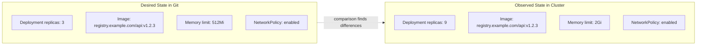
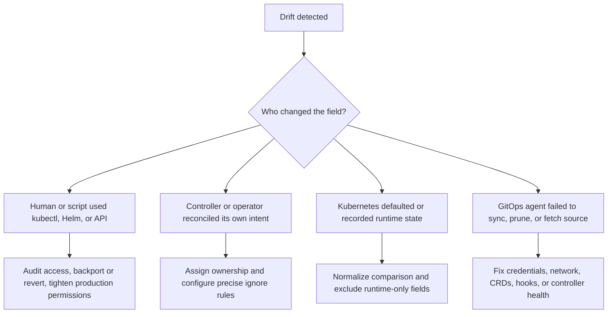
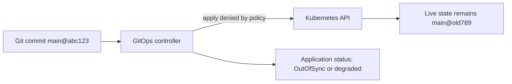
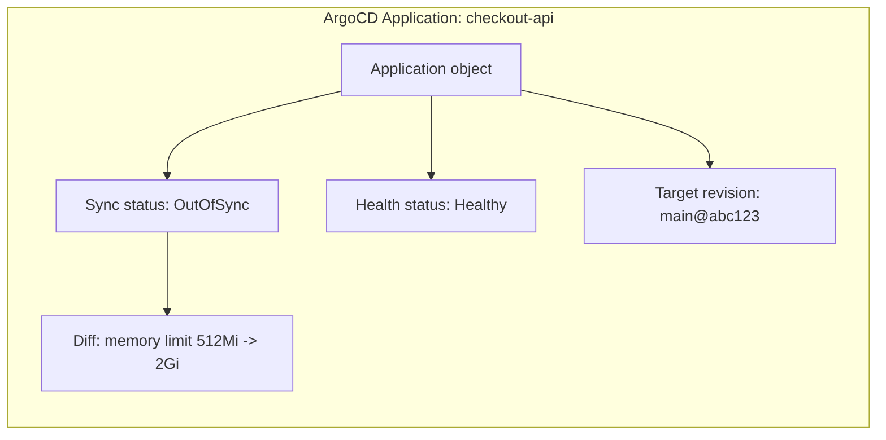
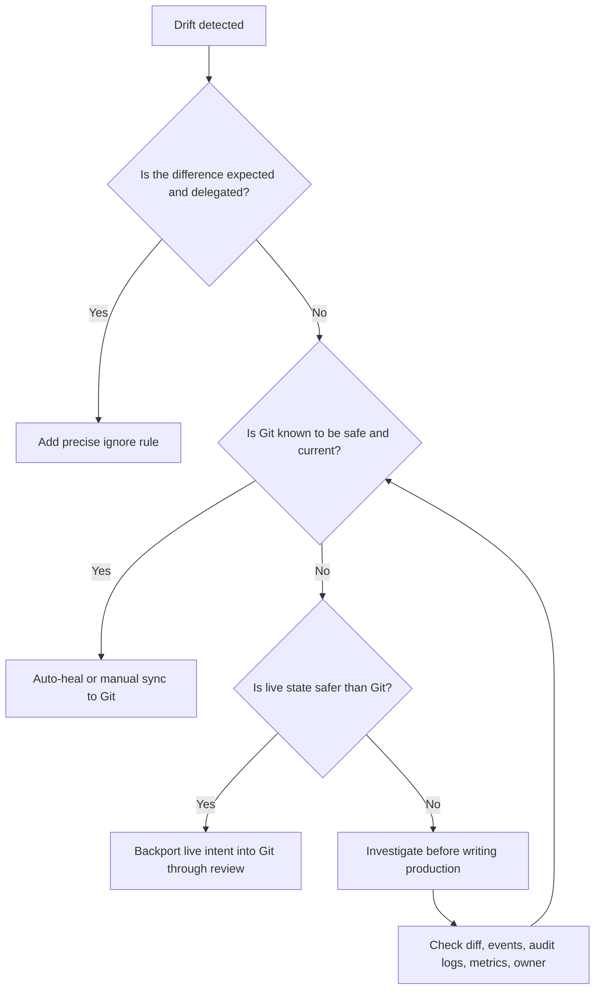

# Module 3.4: Drift Detection and Remediation

> **Discipline Module** | Complexity: `[MEDIUM]` | Time: 35-45 min | Track: Platform Engineering / GitOps

## Prerequisites

Before starting this module, you should already be comfortable with the GitOps loop from [Module 3.1: What is GitOps?](../module-3.1-what-is-gitops/) and the promotion patterns from [Module 3.3: Environment Promotion](../module-3.3-environment-promotion/). You should also be able to inspect Kubernetes workloads with `kubectl`; after this module introduces the common Kubernetes shorthand, examples may use `k` as the same command.

This module assumes Kubernetes 1.35+ behavior for server-side defaults, controller reconciliation, managed fields, and autoscaling resources. The examples focus on ArgoCD and Flux because those are common GitOps controllers, but the diagnostic method applies to any reconciler that compares desired state with observed state.

## Learning Outcomes

After completing this module, you will be able to:

- **Analyze** the difference between harmful drift, expected controller-managed variance, and harmless runtime metadata changes in Kubernetes resources.
- **Design** drift detection signals that separate urgent production risk from normal autoscaler, webhook, and status-field behavior.
- **Debug** an out-of-sync GitOps application by comparing desired manifests, live resources, controller events, and ownership metadata.
- **Evaluate** whether to auto-heal, alert, ignore, or backport a drifted change into Git based on operational risk and source-of-truth confidence.
- **Build** a remediation runbook that preserves GitOps discipline while still allowing controlled emergency response.

## Why This Module Matters

A platform team believed Git described production, so every incident review started by reading the repository. During one outage, the repository said the checkout service had conservative CPU limits, but production was running with much higher limits that had been added during a previous emergency. The team spent hours tuning database pools and retry logic before realizing that the real workload shape did not match the file everyone trusted.

That failure was not just a missing commit; it was a broken source-of-truth contract. GitOps gives teams a powerful promise: if the repository is reviewed, versioned, and reconciled, then production should be explainable from code. Drift breaks that promise quietly. The cluster may keep serving traffic, dashboards may remain green, and deployments may continue, while the system becomes harder to reason about each day.

Drift detection is the practice that keeps GitOps honest. It is not only a tool feature that marks an application `OutOfSync`; it is a discipline for deciding which differences matter, which differences are expected, and which differences prove that the operating model has been bypassed. Senior platform engineers do not chase every diff blindly. They classify drift, design tolerances, preserve auditability, and choose the least dangerous correction.

This module teaches drift as an operational decision problem rather than a simple equality check. You will learn how to compare Git and cluster state, how controllers create legitimate differences, how ArgoCD and Flux report divergence, and how to decide whether the right answer is sync, alert, ignore, or commit the live change back to Git.

## Core Content

## 1. Drift Is a Broken Agreement, Not Just a Diff

Drift occurs when the desired state declared in Git differs from the actual state running in the cluster. That definition sounds simple, but the engineering challenge is deciding whether the difference represents danger, normal Kubernetes behavior, or a missing rule in the GitOps configuration. A useful drift process starts with intent: what should Git own, what should a controller own, and what should nobody edit directly?



The example above has two differences, but they should not be treated the same. Replica count may be owned by a HorizontalPodAutoscaler during a traffic surge, while memory limits are usually part of the deployment contract and should remain under Git review. Treating both as equally urgent creates alert fatigue; treating both as harmless creates hidden production risk.

A GitOps controller usually compares rendered manifests with live objects, then reports whether the application is synchronized. The rendered manifest may come from plain YAML, Kustomize, Helm, Jsonnet, or another generator, but the comparison problem stays the same. The controller asks, "If I applied what Git currently declares, would the cluster change?"

```ascii
+----------------------+      render       +----------------------+
| Git repository       |------------------>| Desired manifest set |
| branch, commit, path |                   | normalized YAML      |
+----------------------+                   +----------+-----------+
                                                      |
                                                      | compare
                                                      v
+----------------------+      observe      +----------+-----------+
| Kubernetes API       |------------------>| Live resource state  |
| objects and fields   |                   | selected fields      |
+----------------------+                   +----------------------+
```

The comparison is not a plain text diff between files. Kubernetes adds fields such as `uid`, `resourceVersion`, `generation`, timestamps, status, and managed ownership details after an object is created. Admission webhooks may also default or mutate fields before storage. A drift detector that treats every runtime field as an application defect will be noisy enough that humans stop trusting it.

The better mental model is ownership. Git should own the fields that define application intent, such as images, ports, policies, resource requests, and most environment variables. Kubernetes should own identity and status fields. Autoscalers, operators, and admission controllers may own specific fields when the platform has intentionally delegated that responsibility.

> **Pause and predict:** A deployment is declared in Git with `replicas: 3`, an HPA targets the deployment with a maximum of `15`, and live state shows `replicas: 11`. Before reading further, decide whether a GitOps controller should auto-heal this difference. Your answer should mention who owns the replica field during normal traffic and what outage could happen if the controller wins the field fight.

A field fight happens when two controllers believe they own the same field and keep overwriting each other. In a GitOps environment, strict self-healing may set replicas back to `3` every reconciliation interval, while the HPA scales back to `11` based on metrics. The cluster can appear healthy in brief snapshots but still oscillate under load, which is worse than a clean failure because it hides the cause inside competing automation.

Drift detection therefore requires an ownership map. The map does not need to be a separate system at first; it can be encoded as ignore rules, policies, alerts, and runbooks. The important step is making ownership explicit enough that drift signals mean something actionable.

| Drift category | Typical owner | Example difference | Default response |
|---|---|---|---|
| Desired configuration drift | Git and review process | Image tag, resource limit, env var, security context changed live | Investigate quickly, then sync to Git or backport to Git |
| Runtime metadata drift | Kubernetes API server | `uid`, `resourceVersion`, `creationTimestamp`, `status` | Exclude from comparison and do not alert |
| Controller-managed drift | HPA, VPA, operator, webhook | Replica count, injected annotation, generated secret reference | Ignore specific fields only when ownership is intentional |
| Orphan resource drift | GitOps inventory and pruning policy | Live object remains after deletion from Git | Prune automatically where safe, alert in sensitive namespaces |
| Sync availability drift | GitOps controller and infrastructure | Agent cannot fetch Git or cannot apply manifests | Alert on controller health before changing application state |

This table is the first decision filter. It prevents a common beginner mistake: assuming that every `OutOfSync` result means the cluster is wrong. Sometimes Git is stale, sometimes the cluster has a manual change, and sometimes the comparison rules are incomplete. The job is to prove which case you are in before remediation changes production.

## 2. Why Drift Happens in Real Clusters

Drift is usually caused by one of four mechanisms: manual intervention, another controller, Kubernetes defaulting, or reconciliation failure. Each mechanism leaves different evidence, so the fastest debugging path starts by identifying the likely source. When you know the mechanism, you can decide whether the fix belongs in Git, RBAC, ignore rules, controller configuration, or incident process.



Manual drift is the most culturally dangerous source because it trains teams to bypass the delivery path. A person runs `kubectl edit`, `kubectl scale`, `kubectl set image`, or a one-off Helm command directly against production. The change may be rational during an incident, but if it is not backported into Git or reverted deliberately, the repository stops describing reality.

```bash
kubectl scale deployment checkout-api --replicas=8 -n prod
kubectl set image deployment/checkout-api app=registry.example.com/checkout:v1.2.4-hotfix -n prod
kubectl edit configmap checkout-settings -n prod
```

Those commands are not inherently evil; they are dangerous when they become invisible. In a mature platform, emergency manual changes are either blocked by RBAC, routed through an audited break-glass role, or followed by a required backport task. Drift detection gives the team evidence that the contract was bypassed, but policy and process decide whether the bypass happens again.

Controller drift happens when another reconciler is supposed to modify a field. HPAs adjust replica counts, cert-manager writes certificate status and secret data, service meshes inject sidecars or annotations, and operators manage child objects from higher-level custom resources. If GitOps owns the parent object while an operator owns generated children, the comparison must respect that boundary.

```yaml
apiVersion: apps/v1
kind: Deployment
metadata:
  name: checkout-api
  namespace: prod
spec:
  replicas: 3
  selector:
    matchLabels:
      app: checkout-api
  template:
    metadata:
      labels:
        app: checkout-api
    spec:
      containers:
        - name: app
          image: registry.example.com/checkout:v1.2.3
          resources:
            requests:
              cpu: 250m
              memory: 256Mi
            limits:
              cpu: 1000m
              memory: 512Mi
```

If this deployment is paired with an HPA, the `replicas` field becomes conditional. Git may still set the initial replica count, but day-to-day scaling belongs to the autoscaler. A precise drift configuration ignores only `/spec/replicas` for this workload, not the entire deployment, because the image, resources, selector, and security fields still matter.

Kubernetes internal changes are the least interesting but the most common source of noisy diffs. The API server writes object identity, versioning, timestamps, managed fields, and status. Controllers update observed generation, conditions, and readiness data. These fields belong in live state; they do not belong in Git for ordinary application manifests.

```yaml
metadata:
  name: checkout-api
  namespace: prod
  uid: 6f6a6f5c-2b55-4b1e-9a0e-21a8f0b98c52
  resourceVersion: "826103"
  generation: 6
  creationTimestamp: "2026-04-26T08:10:00Z"
status:
  observedGeneration: 6
  replicas: 8
  readyReplicas: 8
```

Sync availability drift is different because the cluster may not have been changed by anyone. If the GitOps controller cannot reach the repository, authenticate to Git, render Kustomize, apply a CRD, or pass an admission policy, the desired state may advance in Git while the cluster remains on an older revision. In that case, the drift is a delivery failure rather than an unauthorized edit.



A production-grade drift program monitors both application drift and controller health. If the controller is down, a clean sync status is not reassuring because no one is comparing the current commit to the cluster. If the controller is healthy but one resource is out of sync, the investigation narrows to ownership, failed apply, or intentional mutation.

| Cause | Evidence to inspect | Likely fix | Risk if ignored |
|---|---|---|---|
| Manual production change | Audit logs, events, `kubectl.kubernetes.io/last-applied-configuration`, user reports | Revert or backport, then restrict direct write paths | Git becomes a suggestion instead of the source of truth |
| Autoscaler field ownership | HPA object, metrics, deployment replica diff only | Ignore `/spec/replicas` for that managed workload | Self-healing may fight autoscaling during traffic spikes |
| Admission mutation | Diff shows injected labels, annotations, defaults, sidecars | Configure targeted ignore rules or move defaults into Git | Endless sync loops and noisy alerts reduce trust |
| Operator reconciliation | Owner references, custom resources, generated children | Manage the parent resource and exclude operator-owned children | GitOps may delete or rewrite resources the operator needs |
| Git or render failure | Controller logs, source revision, auth errors, dry-run output | Fix credentials, dependencies, CRDs, or rendering inputs | New Git commits do not reach production |
| Prune disabled or blocked | Resource exists live but not in rendered manifests | Enable prune where safe, or document retained resources | Old objects keep affecting traffic, policy, or cost |

This cause table is also a prioritization tool. Drift caused by a stale `status` field is not a pager. Drift caused by a production image changed outside review may be an urgent security and audit issue. Drift caused by a failed Git fetch may block every future deployment, even if the running workload looks fine right now.

## 3. A Worked Example: Debugging a Drift Alert Without Guessing

The safest way to debug drift is to compare desired state, live state, ownership, and recent events in that order. Jumping directly to "sync" is tempting because GitOps tools make it easy, but a sync is a write operation against production. Before writing, prove whether Git is right, the cluster is right, or both are incomplete.

Assume the platform receives an alert: `checkout-api` has been out of sync for more than ten minutes. The service is healthy, but a diff shows that production has a higher memory limit than Git. A junior operator wants to click self-heal immediately. A senior operator slows the process down because resource limits can crash a service if reverted blindly.

First, render the desired state from Git. The exact renderer depends on your repository, but the goal is to inspect what the GitOps controller should apply. This example uses Kustomize because it is common in GitOps repositories.

```bash
mkdir -p /tmp/kubedojo-drift-demo/desired
cat > /tmp/kubedojo-drift-demo/desired/deployment.yaml <<'YAML'
apiVersion: apps/v1
kind: Deployment
metadata:
  name: checkout-api
  namespace: prod
spec:
  replicas: 3
  selector:
    matchLabels:
      app: checkout-api
  template:
    metadata:
      labels:
        app: checkout-api
    spec:
      containers:
        - name: app
          image: registry.example.com/checkout:v1.2.3
          resources:
            requests:
              cpu: 250m
              memory: 256Mi
            limits:
              cpu: 1000m
              memory: 512Mi
YAML

cat > /tmp/kubedojo-drift-demo/desired/kustomization.yaml <<'YAML'
resources:
  - deployment.yaml
YAML

kubectl kustomize /tmp/kubedojo-drift-demo/desired
```

Next, inspect the live object. In a real cluster, you would run `kubectl get deployment checkout-api -n prod -o yaml`. For a local learning exercise, the following command creates a live-state file that mirrors the kind of difference you might see in production.

```bash
mkdir -p /tmp/kubedojo-drift-demo/live
cat > /tmp/kubedojo-drift-demo/live/deployment.yaml <<'YAML'
apiVersion: apps/v1
kind: Deployment
metadata:
  name: checkout-api
  namespace: prod
  uid: 6f6a6f5c-2b55-4b1e-9a0e-21a8f0b98c52
  resourceVersion: "826103"
  generation: 6
  creationTimestamp: "2026-04-26T08:10:00Z"
spec:
  replicas: 3
  selector:
    matchLabels:
      app: checkout-api
  template:
    metadata:
      labels:
        app: checkout-api
    spec:
      containers:
        - name: app
          image: registry.example.com/checkout:v1.2.3
          resources:
            requests:
              cpu: 250m
              memory: 256Mi
            limits:
              cpu: 1000m
              memory: 2Gi
status:
  observedGeneration: 6
  replicas: 3
  readyReplicas: 3
YAML
```

A raw diff will show both meaningful and meaningless differences. Runtime metadata and status are expected, while the memory limit deserves investigation. Normalization removes fields that Kubernetes owns so the remaining diff is easier to reason about.

```bash
yq eval 'del(.metadata.uid, .metadata.resourceVersion, .metadata.generation, .metadata.creationTimestamp, .status)' \
  /tmp/kubedojo-drift-demo/live/deployment.yaml \
  > /tmp/kubedojo-drift-demo/live/normalized.yaml

kubectl kustomize /tmp/kubedojo-drift-demo/desired \
  > /tmp/kubedojo-drift-demo/desired/rendered.yaml

diff -u /tmp/kubedojo-drift-demo/desired/rendered.yaml /tmp/kubedojo-drift-demo/live/normalized.yaml
```

The meaningful diff is the memory limit. At this point, the wrong question is "How do I make the diff disappear?" The right question is "Which state is safe and intended?" If Git says `512Mi` but production has survived for weeks on `2Gi`, syncing to Git might reintroduce OOM kills. If the production value was an accidental edit, leaving it live makes future deployments unpredictable.

Now inspect who or what could have changed the field. Kubernetes events may not retain old history long enough, but they are still a useful first check. If audit logs are enabled, they are stronger evidence because they can identify the actor and API verb.

```bash
kubectl describe deployment checkout-api -n prod
kubectl get events -n prod --field-selector involvedObject.name=checkout-api --sort-by=.lastTimestamp
kubectl auth can-i update deployments -n prod --as=alice@example.com
```

If your shell defines `alias k=kubectl`, the same checks can be shorter: `k describe deployment checkout-api -n prod` and `k get events -n prod --field-selector involvedObject.name=checkout-api --sort-by=.lastTimestamp`. The alias is convenient during incident work, but runbooks should define it once so responders do not wonder whether `k` is a custom tool.

A careful remediation record includes the observed diff, the suspected cause, the risk of each response, and the chosen action. If the higher memory limit was necessary, the team should update Git through review and annotate the incident or pull request. If the higher value was an unauthorized change, the team should sync to Git, then adjust RBAC or break-glass controls to prevent recurrence.

> **What would happen if:** You clicked "Sync" immediately after seeing the memory drift, and the live `2Gi` limit was an uncommitted production hotfix for repeated OOM kills. Write down the blast radius before continuing: which pods restart, which SLOs might burn, which dashboards would confirm the rollback was unsafe, and which team should own the follow-up commit?

The worked example shows why drift detection is not a button-clicking exercise. A reconciler can restore Git quickly, but it cannot decide whether Git is stale, unsafe, or incomplete. Human judgment is still required when the difference affects capacity, security, traffic routing, data retention, or identity.

## 4. Reading Drift Signals in ArgoCD and Flux

ArgoCD usually presents drift through sync status. An application can be `Synced` or `OutOfSync`, and it can separately be `Healthy`, `Progressing`, `Degraded`, or another health state. That distinction matters because an application may be healthy while drifted, or synchronized while unhealthy. Drift answers "does live match desired," while health answers "is the workload behaving."



Use the ArgoCD CLI to read status before writing changes. The first command tells you which resources are out of sync, the second shows the diff, and the third filters the portfolio for applications that need attention. In production, pair these commands with the UI, alerts, and controller logs so the investigation is not dependent on one interface.

```bash
argocd app get checkout-api
argocd app diff checkout-api
argocd app list --sync-status OutOfSync
argocd app history checkout-api
```

ArgoCD also exposes metrics that can feed Prometheus alerts. A useful alert should wait long enough to avoid transient reconciliation noise but not so long that drift becomes normal. The labels in your environment may differ by chart and version, so confirm metric names from your running controller before making the alert a paging rule.

```yaml
groups:
  - name: gitops-drift
    rules:
      - alert: ArgoCDApplicationOutOfSync
        expr: argocd_app_info{sync_status="OutOfSync"} == 1
        for: 10m
        labels:
          severity: warning
          team: platform
        annotations:
          summary: "ArgoCD application is out of sync"
          description: "Application {{ $labels.name }} has reported OutOfSync for more than ten minutes."
```

Flux reports reconciliation through Kubernetes custom resources and status conditions. A `Kustomization` or `HelmRelease` has conditions such as `Ready`, `Reconciling`, and failure reasons. Flux is CLI-first, but the diagnostic question is the same: what revision did it try, what revision is applied, and which object blocked convergence?

```bash
flux get kustomizations --all-namespaces
flux get helmreleases --all-namespaces
kubectl get kustomization checkout-api -n flux-system -o yaml
kubectl describe kustomization checkout-api -n flux-system
```

A healthy Flux status includes the last attempted and last applied revision. If those revisions differ, Flux may be unable to apply the current Git state. If they match but live resources differ, a controller, manual edit, or ignored field may be involved. Read conditions closely because "ready" and "applied latest commit" are related but not identical ideas.

```yaml
apiVersion: kustomize.toolkit.fluxcd.io/v1
kind: Kustomization
metadata:
  name: checkout-api
  namespace: flux-system
spec:
  interval: 5m
  path: ./apps/checkout/overlays/prod
  prune: true
  sourceRef:
    kind: GitRepository
    name: platform-config
status:
  conditions:
    - type: Ready
      status: "True"
      reason: ReconciliationSucceeded
      message: "Applied revision: main@sha1:abc123"
  lastAppliedRevision: main@sha1:abc123
  lastAttemptedRevision: main@sha1:abc123
```

Flux alerting often focuses on controller conditions rather than a single "sync status" label. You can watch `gotk_reconcile_condition` metrics, Kubernetes events, or notification-controller messages. The key design choice is to alert on persistent failure and meaningful drift, not every short reconciliation attempt.

```yaml
groups:
  - name: flux-reconciliation
    rules:
      - alert: FluxKustomizationNotReady
        expr: gotk_reconcile_condition{kind="Kustomization",type="Ready",status="False"} == 1
        for: 10m
        labels:
          severity: warning
          team: platform
        annotations:
          summary: "Flux Kustomization is not ready"
          description: "Kustomization {{ $labels.name }} in {{ $labels.namespace }} has not reconciled successfully."
```

| Signal | ArgoCD example | Flux example | Interpretation |
|---|---|---|---|
| Desired revision | Target revision in application details | `lastAttemptedRevision` | What Git state the controller tried to apply |
| Applied revision | Sync history and live object tracking | `lastAppliedRevision` | What Git state appears to be applied successfully |
| Drift flag | `OutOfSync` | Not-ready condition, diff tooling, inventory mismatch | Live state does not match desired or reconciliation failed |
| Workload health | ArgoCD health assessment | Kubernetes readiness and custom health checks | Application behavior may be good or bad independent of drift |
| Controller health | Repo server, application controller, Redis, API access | source-controller, kustomize-controller, helm-controller | Drift signals are trustworthy only if controllers are running |
| Diff detail | `argocd app diff` | `flux diff`, `kubectl diff`, rendered manifest comparison | The exact fields that changed and need classification |

The senior-level habit is to separate signal layers. Do not page an application team because the GitOps controller restarted once. Do not ignore an application image drift just because pods are currently ready. Do not let a false-positive annotation diff train responders to mute all GitOps alerts. A drift signal is useful only when it points to an expected decision.

## 5. Designing the Response: Auto-Heal, Alert, Ignore, or Backport

Every drift response chooses a source of truth. Auto-heal says Git is correct and the cluster should be rewritten. Alert-only says the difference requires human judgment before changing state. Ignore says the difference is expected and should not be considered drift. Backport says the live cluster change is correct and Git must be updated to restore the source-of-truth contract.



Auto-healing is powerful when the team has high confidence that Git is reviewed, tested, and current. It is appropriate for many stateless application fields, policy resources, and lower-risk environments. It is dangerous when Git lags behind emergency fixes, when another controller legitimately owns a field, or when an automated rollback could cause a larger incident than the drift itself.

```yaml
apiVersion: argoproj.io/v1alpha1
kind: Application
metadata:
  name: checkout-api
  namespace: argocd
spec:
  project: default
  source:
    repoURL: https://git.example.com/platform/apps.git
    targetRevision: main
    path: apps/checkout/overlays/prod
  destination:
    server: https://kubernetes.default.svc
    namespace: prod
  syncPolicy:
    automated:
      prune: true
      selfHeal: true
      allowEmpty: false
```

Pruning deserves special attention. `selfHeal` reverts live changes to tracked objects, while `prune` deletes live objects that are no longer declared. Pruning is essential for preventing orphaned services, policies, and roles, but it can be destructive when ownership is unclear. Mature teams use pruning broadly after inventory is clean, while protecting shared namespaces and generated resources with explicit ownership rules.

Flux uses reconciliation intervals and pruning behavior rather than the same ArgoCD sync policy model. A Kustomization with `prune: true` will remove objects previously applied by that Kustomization when they disappear from source. The controller should be given a clear inventory boundary so it does not fight other systems.

```yaml
apiVersion: kustomize.toolkit.fluxcd.io/v1
kind: Kustomization
metadata:
  name: checkout-api
  namespace: flux-system
spec:
  interval: 5m
  path: ./apps/checkout/overlays/prod
  prune: true
  sourceRef:
    kind: GitRepository
    name: platform-config
  targetNamespace: prod
```

Alert-only mode is not a weak GitOps posture when used deliberately. Some production changes should not be rewritten automatically because the cost of a wrong revert is high. Databases, traffic routing, identity providers, network policies, and emergency resource tuning often deserve human confirmation even when the eventual answer is to restore Git.

```yaml
groups:
  - name: gitops-critical-drift
    rules:
      - alert: CriticalApplicationDrift
        expr: argocd_app_info{sync_status="OutOfSync",project="critical"} == 1
        for: 5m
        labels:
          severity: page
          response: human-review-required
        annotations:
          summary: "Critical GitOps application drift requires review"
          description: "Application {{ $labels.name }} is out of sync and belongs to a critical project."
```

Ignore rules are safe only when they are narrow. Ignoring all differences on a deployment because an HPA changes replicas hides image changes, environment changes, security-context changes, and accidental edits. A good ignore rule names the group, kind, optional object name, and exact JSON pointer or expression for the delegated field.

```yaml
apiVersion: argoproj.io/v1alpha1
kind: Application
metadata:
  name: checkout-api
  namespace: argocd
spec:
  project: default
  source:
    repoURL: https://git.example.com/platform/apps.git
    targetRevision: main
    path: apps/checkout/overlays/prod
  destination:
    server: https://kubernetes.default.svc
    namespace: prod
  ignoreDifferences:
    - group: apps
      kind: Deployment
      name: checkout-api
      namespace: prod
      jsonPointers:
        - /spec/replicas
    - group: autoscaling
      kind: HorizontalPodAutoscaler
      name: checkout-api
      namespace: prod
      jqPathExpressions:
        - .status
```

Some differences should be moved into Git instead of ignored. If an admission webhook always adds a label that your organization requires, it may be better to add that label to the manifest so reviewers see it. If a mutating webhook injects a runtime-only timestamp, an ignore rule is better. The design question is whether the field carries intentional configuration or operational bookkeeping.

| Response | Choose it when | Avoid it when | Verification |
|---|---|---|---|
| Auto-heal | Git is trusted, tested, and should override direct edits | Another controller owns the field or Git may be stale | Diff clears, rollout remains healthy, no repeated field fight |
| Alert-only | Human judgment is required before writing production | The drift is routine and safe to fix automatically | Alert includes resource, diff, owner, and runbook link |
| Ignore | A specific field is intentionally managed outside Git | The ignore hides broad configuration or security changes | Only the expected field disappears from drift reports |
| Backport to Git | Live state is correct and Git is incomplete | Live state is accidental, unreviewed, or unsafe | Pull request explains evidence and future desired state |
| Prune | Live orphan resources are within GitOps ownership | Shared or generated resources may be deleted incorrectly | Inventory confirms resource was formerly managed by the app |
| Escalate | Ownership, safety, or impact is unclear | A low-risk automated policy already covers the case | Incident notes identify the decision maker and next action |

Backporting is often the most overlooked response. Engineers sometimes treat "cluster differs from Git" as proof that the cluster must be wrong. In real incidents, the cluster may contain a necessary emergency fix that never made it back to code. Backporting restores GitOps by turning a live discovery into a reviewed change, not by pretending the emergency never happened.

## 6. Preventing Recurrence With Policy, Runbooks, and Feedback Loops

Drift detection is reactive; drift prevention changes how teams operate. The prevention layer includes access control, admission policy, controller configuration, emergency workflow, and periodic review. Without those controls, the same alert will recur and responders will waste time rediscovering the same cause.

Start with RBAC. Most developers do not need write access to production Deployments, ConfigMaps, Services, or RBAC objects if GitOps is the delivery path. They may need read access, logs, port-forwarding in limited namespaces, or a break-glass role. The fewer direct write paths exist, the less manual drift you need to explain later.

```yaml
apiVersion: rbac.authorization.k8s.io/v1
kind: Role
metadata:
  name: production-readonly
  namespace: prod
rules:
  - apiGroups: ["", "apps", "batch", "networking.k8s.io", "autoscaling"]
    resources: ["pods", "services", "configmaps", "deployments", "jobs", "networkpolicies", "horizontalpodautoscalers"]
    verbs: ["get", "list", "watch"]
```

RBAC alone is not enough because automation accounts, CI jobs, and operators may still write resources. Admission policy can require ownership labels, block direct changes to protected resources, or allow writes only from known service accounts. The goal is not to make incidents impossible to handle; it is to make exceptional writes visible, intentional, and reviewable.

A practical runbook should make the first five minutes of drift response boring. It should tell responders where to find the diff, how to identify the owner, which fields are expected, how to decide between sync and backport, and when to page an application team. Boring runbooks reduce panic-driven syncs.

```ascii
+-------------------+     +-------------------+     +-------------------+
| 1. Read alert     | --> | 2. Classify diff  | --> | 3. Check owner    |
| app, resource     |     | harmful/expected  |     | Git/controller    |
+-------------------+     +-------------------+     +-------------------+
          |                         |                         |
          v                         v                         v
+-------------------+     +-------------------+     +-------------------+
| 4. Choose action  | --> | 5. Verify result  | --> | 6. Prevent again |
| sync/backport/etc |     | health and diff   |     | RBAC/rule/process|
+-------------------+     +-------------------+     +-------------------+
```

Periodic drift review catches weak patterns before they become incidents. A weekly review might look at the number of out-of-sync applications, repeated ignored fields, manual production writes, prune candidates, and alerts that were acknowledged but not resolved. The value is not the meeting; the value is turning noisy signals into better ownership rules.

| Prevention control | What it prevents | Implementation hint | Failure mode to watch |
|---|---|---|---|
| Production read-only RBAC | Casual `kubectl edit` and `kubectl scale` changes | Grant write access only to GitOps controllers and break-glass roles | Teams create shadow automation with broad credentials |
| Break-glass workflow | Invisible emergency edits | Require ticket, expiration, audit log, and backport decision | The process is too slow, so responders bypass it |
| Precise ignore catalog | Repeated false-positive drift alerts | Store ignore rules near the application or platform policy | Broad ignores hide real configuration drift |
| Drift alert routing | Unowned alerts and delayed response | Route by application label, project, or namespace owner | Every alert goes to platform, creating bottlenecks |
| Prune inventory review | Orphan services, roles, and policies | Enable prune after confirming ownership boundaries | Shared objects are deleted because inventory was unclear |
| Post-incident backport check | Production fixes missing from Git | Add a drift item to incident closure criteria | Incidents close before configuration truth is restored |
| Controller health monitoring | Silent loss of reconciliation | Alert on GitOps controller readiness and source fetch failures | Teams trust stale sync status while controllers are down |

There is one final senior-level nuance: the goal is not mathematically zero drift at every instant. Kubernetes is a reconciled system, so short-lived differences can happen during rollouts, autoscaling, admission, and controller restarts. The goal is known drift with explicit ownership, fast detection of harmful divergence, and reliable restoration of the source-of-truth contract.

## Did You Know?

1. **Autoscaling creates intentional field movement.** A HorizontalPodAutoscaler does not violate GitOps simply because the live replica count changes; it violates GitOps only if the platform never declared that the autoscaler owns that field.

2. **A synchronized application can still be broken.** Sync status compares desired and live configuration, while health depends on runtime behavior such as readiness, error rates, dependencies, and capacity.

3. **Orphaned resources are drift too.** A Service, RoleBinding, or NetworkPolicy left behind after deletion from Git can keep affecting traffic or permissions even when the main workload looks clean.

4. **Backporting can be remediation.** If production was manually changed for a valid emergency reason, the correct fix may be a reviewed Git commit that captures the new intent rather than an automatic rollback.

## Common Mistakes

| Mistake | Why it hurts | Better practice |
|---|---|---|
| Treating every `OutOfSync` result as an emergency | Teams page on harmless status or metadata differences and eventually ignore real drift | Classify by ownership, field, resource criticality, and duration before choosing severity |
| Enabling self-heal without ignore rules for autoscaled workloads | The GitOps controller can fight HPA or VPA behavior during peak traffic | Ignore only the delegated fields, then verify the application still reports meaningful drift |
| Ignoring entire resources to silence noisy diffs | Image, security, policy, or environment changes can hide behind a broad ignore rule | Use object-specific JSON pointers or expressions and review ignores periodically |
| Clicking sync before investigating long-lived production drift | Git may be stale, and reverting live state can reintroduce an old outage | Compare metrics, events, incidents, and ownership before deciding whether to sync or backport |
| Monitoring application drift but not controller health | A failed GitOps controller can make stale state look stable because no reconciliation is happening | Alert on controller readiness, source fetch failures, apply failures, and queue backlog |
| Leaving manual emergency changes outside Git | Future deploys become unpredictable and incident reviews lose the real configuration history | Require a post-incident decision to revert, backport, or document the exception |
| Disabling prune everywhere out of fear | Deleted services, roles, policies, and ingresses can keep affecting production after Git cleanup | Enable prune with clear ownership boundaries and protect shared generated resources explicitly |
| Routing all drift alerts to the platform team | Application owners lose accountability for their own desired state and platform becomes a bottleneck | Route alerts using labels, projects, namespaces, and service ownership metadata |

## Quiz: Check Your Understanding

### Question 1

Your team deploys `orders-api` with ArgoCD. Git declares `replicas: 3`, live state shows `replicas: 12`, and an HPA exists with `minReplicas: 3` and `maxReplicas: 20`. The application is healthy, traffic is elevated, and the only diff is `/spec/replicas`. What should you do?

<details>
<summary>Show Answer</summary>

Do not auto-heal the deployment back to three replicas. The HPA is intentionally managing the replica field during the traffic spike, so the correct response is to configure a precise ignore rule for `/spec/replicas` on that autoscaled deployment. You should still verify that the HPA object is expected, metrics are healthy, and no other fields have drifted. A broad ignore on the whole deployment would be unsafe because it could hide image, resource, or security-context drift.

</details>

### Question 2

A payment service has been stable for six weeks with a live memory limit of `2Gi`, but Git still declares `512Mi`. ArgoCD reports the application as `OutOfSync`, and a teammate suggests pressing "Sync" because Git is supposed to be the source of truth. How should you proceed?

<details>
<summary>Show Answer</summary>

Investigate before syncing because the live value may be an uncommitted emergency fix. Compare recent incidents, OOM kill history, performance metrics, deployment events, and audit logs to determine why the limit changed. If the higher limit is required, open a reviewed Git change that updates the manifest and explains the evidence. If the live value is accidental or unsafe, sync back to Git and then address the access path that allowed the drift.

</details>

### Question 3

Flux reports a `Kustomization` as not ready after a Git commit, and live objects remain on the previous image tag. No one edited the deployment manually. The Flux status shows `lastAttemptedRevision` at the new commit, while `lastAppliedRevision` is still the old commit. What is the most likely class of drift, and where do you look first?

<details>
<summary>Show Answer</summary>

This is most likely reconciliation or apply failure rather than manual configuration drift. Flux attempted the new revision but did not successfully apply it, so you should inspect the `Kustomization` conditions, controller logs, rendered manifests, missing CRDs, admission denials, and Kubernetes events. The fix is probably in source rendering, permissions, policy, or dependencies, not in reverting a manual cluster edit.

</details>

### Question 4

A third-party operator is installed through GitOps. After every sync, ArgoCD reports differences on generated child resources that have owner references pointing to the operator's custom resource. The operator immediately recreates those fields when ArgoCD removes them. What design change should you make?

<details>
<summary>Show Answer</summary>

Manage the operator's intended parent custom resource through Git and stop trying to own the operator-generated child fields directly. Depending on the tool and object model, configure ignore rules for operator-owned generated fields or exclude generated children from GitOps ownership. The goal is to avoid a controller fight while still keeping the declarative parent configuration reviewed in Git.

</details>

### Question 5

A namespace contains several Services that were removed from Git months ago, but prune was disabled during the original migration. One old Service still selects pods from a current deployment and exposes an unintended internal endpoint. What kind of drift is this, and how should remediation be planned?

<details>
<summary>Show Answer</summary>

This is orphan resource drift. The live resource remains after its declaration disappeared from Git, and it still changes system behavior. You should identify which resources are within GitOps ownership, verify that deleting them will not break shared dependencies, then enable or perform pruning in a controlled change. After cleanup, keep prune enabled where ownership boundaries are clear so deleted Git resources do not silently remain active.

</details>

### Question 6

A mutating admission webhook injects a required compliance label into every Deployment. ArgoCD shows the injected label as drift because the label is missing from Git. Should you ignore the label or add it to Git?

<details>
<summary>Show Answer</summary>

It depends on whether the label represents intentional configuration that reviewers should see. If the label is stable compliance intent and belongs to the application contract, add it to Git so the repository shows the full desired configuration. If the webhook writes runtime bookkeeping or values that change per cluster, use a narrow ignore rule. The important distinction is whether the field is meaningful desired state or operational mutation.

</details>

### Question 7

A production team repeatedly uses a break-glass role to patch environment variables directly during incidents, then forgets to open follow-up pull requests. Drift alerts are accurate, but they keep recurring. What should the platform team change?

<details>
<summary>Show Answer</summary>

The issue is no longer detection; it is recurrence prevention. Keep the break-glass path for real incidents, but require an expiring role, an incident or change record, audit logging, and a closure step that decides whether to revert or backport the live change. You can also route repeated drift alerts to service ownership and review RBAC scope. The goal is to preserve emergency response while restoring Git as the reviewed source of truth after the incident.

</details>

## Hands-On Exercise: Build a Drift Detection and Remediation Plan

In this exercise, you will create a small drift plan for a GitOps-managed application. You do not need a live cluster to complete the design portions, but the commands are written so you can run the comparison workflow locally if you have `kubectl`, `yq`, and either ArgoCD or Flux available. The goal is to practice classification and response, not to memorize tool flags.

### Scenario

You own a production application called `checkout-api`. It is deployed from Git into the `prod` namespace, uses an HPA, receives injected annotations from a platform webhook, and has recently triggered drift alerts. Your task is to design the ignore rules, alerting policy, diagnostic commands, and remediation runbook that an on-call engineer should follow.

### Part 1: Inventory Expected and Unexpected Drift

Start by listing fields that may differ between Git and the cluster. Do not mark a field as expected just because it is noisy. A field is expected only when you can name the controller or platform component that owns it.

| Resource | Field | Expected owner | Drift classification | Planned action |
|---|---|---|---|---|
| Deployment `checkout-api` | `/spec/replicas` | HorizontalPodAutoscaler | Expected controller-managed drift | Ignore this exact field |
| Deployment `checkout-api` | Container image | Git review process | Harmful configuration drift | Alert and sync or backport after investigation |
| Deployment `checkout-api` | Memory limits | Git review process | Harmful configuration drift | Investigate before sync because capacity changes can be risky |
| Deployment `checkout-api` | Platform webhook annotations | Admission webhook | Expected mutation if documented | Ignore exact annotation prefix or move stable labels into Git |
| Service `checkout-api` | `/spec/clusterIP` | Kubernetes API server | Expected runtime assignment | Exclude from comparison |
| Any managed object | `/status` | Kubernetes controllers | Expected runtime status | Exclude from comparison |
| Old Service not in Git | Entire object | No current owner | Orphan resource drift | Prune after ownership review |

Success criteria for this part:

- [ ] You identified at least three expected drift scenarios and named the component that owns each one.
- [ ] You identified at least two harmful drift scenarios that should not be ignored.
- [ ] You included at least one orphan-resource scenario rather than focusing only on field-level drift.
- [ ] You avoided broad language such as "ignore metadata" unless you can narrow the exact field or prefix.

### Part 2: Configure Precise Ignore Rules

Write ignore rules for expected drift only. The following ArgoCD example ignores HPA-managed replicas and status fields while preserving drift detection on images, resources, environment variables, security context, and policies.

```yaml
apiVersion: argoproj.io/v1alpha1
kind: Application
metadata:
  name: checkout-api
  namespace: argocd
spec:
  project: prod
  source:
    repoURL: https://git.example.com/platform/apps.git
    targetRevision: main
    path: apps/checkout/overlays/prod
  destination:
    server: https://kubernetes.default.svc
    namespace: prod
  ignoreDifferences:
    - group: apps
      kind: Deployment
      name: checkout-api
      namespace: prod
      jsonPointers:
        - /spec/replicas
    - group: "*"
      kind: "*"
      jqPathExpressions:
        - .status
    - group: apps
      kind: Deployment
      name: checkout-api
      namespace: prod
      jqPathExpressions:
        - .metadata.annotations | select(. != null) | with_entries(select(.key | startswith("platform.example.com/injected-")))
```

If you use Flux, field-level comparison behavior is often handled through the manifests you apply, controller ownership, server-side apply behavior, and policy around generated resources. You may still use patches to avoid declaring fields that another controller owns, but be careful not to remove fields that should be reviewed in Git.

```yaml
apiVersion: kustomize.config.k8s.io/v1beta1
kind: Kustomization
resources:
  - deployment.yaml
patches:
  - target:
      group: apps
      version: v1
      kind: Deployment
      name: checkout-api
    patch: |-
      - op: remove
        path: /spec/replicas
```

Success criteria for this part:

- [ ] Your ignore rule is scoped to a resource kind, name, namespace, or exact field where possible.
- [ ] Your configuration does not ignore the whole Deployment just to silence one field.
- [ ] Your comments or surrounding documentation explain why another controller owns the ignored field.
- [ ] You can describe which harmful drift would still be detected after the ignore rule is applied.

### Part 3: Configure Drift Alerts With Actionable Context

Create at least one warning alert for persistent application drift and one higher-severity route for critical projects. Alerts should include the application name, duration, owner or team labels if available, and a runbook link. A good alert tells the responder where to start instead of merely saying something is wrong.

```yaml
groups:
  - name: checkout-gitops-drift
    rules:
      - alert: CheckoutApplicationOutOfSync
        expr: argocd_app_info{name="checkout-api",sync_status="OutOfSync"} == 1
        for: 10m
        labels:
          severity: warning
          service: checkout-api
          team: payments
        annotations:
          summary: "checkout-api is out of sync with Git"
          description: "checkout-api has reported OutOfSync for more than ten minutes. Review the diff before syncing."
          runbook_url: "https://runbooks.example.com/gitops/drift"

      - alert: CriticalGitOpsProjectOutOfSync
        expr: argocd_app_info{project="critical",sync_status="OutOfSync"} == 1
        for: 5m
        labels:
          severity: page
          team: platform
        annotations:
          summary: "Critical GitOps application drift"
          description: "Application {{ $labels.name }} in a critical project is out of sync and requires human review."
          runbook_url: "https://runbooks.example.com/gitops/critical-drift"
```

Success criteria for this part:

- [ ] Your alert waits long enough to avoid transient reconciliation noise.
- [ ] Your alert includes labels that support routing to the right owner.
- [ ] Your alert description instructs responders to inspect the diff before writing changes.
- [ ] Your higher-severity alert is based on business criticality, not merely the existence of any diff.

### Part 4: Practice the Manual Diff Workflow

Use the worked example pattern to compare desired and live YAML after removing runtime-only fields. If you have a real cluster, replace the sample file with `kubectl get deployment checkout-api -n prod -o yaml`. If you do not have a cluster, the sample files still let you practice normalization and classification.

```bash
mkdir -p /tmp/kubedojo-drift-lab/git /tmp/kubedojo-drift-lab/live

cat > /tmp/kubedojo-drift-lab/git/deployment.yaml <<'YAML'
apiVersion: apps/v1
kind: Deployment
metadata:
  name: checkout-api
  namespace: prod
spec:
  replicas: 3
  selector:
    matchLabels:
      app: checkout-api
  template:
    metadata:
      labels:
        app: checkout-api
    spec:
      containers:
        - name: app
          image: registry.example.com/checkout:v1.2.3
          resources:
            limits:
              cpu: 1000m
              memory: 512Mi
YAML

cat > /tmp/kubedojo-drift-lab/live/deployment.yaml <<'YAML'
apiVersion: apps/v1
kind: Deployment
metadata:
  name: checkout-api
  namespace: prod
  uid: aaaaaaaa-bbbb-4ccc-8ddd-eeeeeeeeeeee
  resourceVersion: "912300"
  creationTimestamp: "2026-04-26T10:00:00Z"
  annotations:
    platform.example.com/injected-policy: baseline
spec:
  replicas: 9
  selector:
    matchLabels:
      app: checkout-api
  template:
    metadata:
      labels:
        app: checkout-api
    spec:
      containers:
        - name: app
          image: registry.example.com/checkout:v1.2.3
          resources:
            limits:
              cpu: 1000m
              memory: 2Gi
status:
  replicas: 9
  readyReplicas: 9
YAML

yq eval 'del(.metadata.uid, .metadata.resourceVersion, .metadata.creationTimestamp, .metadata.annotations."platform.example.com/injected-policy", .status)' \
  /tmp/kubedojo-drift-lab/live/deployment.yaml \
  > /tmp/kubedojo-drift-lab/live/normalized.yaml

diff -u /tmp/kubedojo-drift-lab/git/deployment.yaml /tmp/kubedojo-drift-lab/live/normalized.yaml
```

Success criteria for this part:

- [ ] You can identify which remaining diff is HPA-managed and which diff affects application capacity.
- [ ] You can explain why deleting runtime metadata made the diff easier to read.
- [ ] You can name at least one piece of evidence needed before reverting the memory limit.
- [ ] You can state whether the injected annotation should be ignored or moved into Git.

### Part 5: Write the Remediation Runbook

Create a short runbook that a responder can follow during an alert. The runbook must force a decision instead of ending with "sync the app." Use the checklist below as a minimum.

```markdown
## Drift Remediation Runbook: checkout-api

### Step 1: Acknowledge and scope the alert
- [ ] Identify the GitOps application, namespace, resource kind, and field that drifted.
- [ ] Check whether the application is healthy or degraded separately from sync status.
- [ ] Confirm the GitOps controller is healthy enough for drift status to be trustworthy.

### Step 2: Inspect the diff
- [ ] Run `argocd app diff checkout-api` or the equivalent Flux and `kubectl diff` workflow.
- [ ] Normalize runtime-only fields such as status, UID, resourceVersion, and timestamps.
- [ ] Compare the remaining diff against the expected drift inventory.

### Step 3: Identify ownership and cause
- [ ] Check for HPA, VPA, operator, webhook, or generated-resource ownership.
- [ ] Check Kubernetes events and audit logs for direct production writes.
- [ ] Check recent incidents and changes for emergency patches that were not backported.

### Step 4: Choose the response
- [ ] If Git is correct and safe, sync or allow auto-heal to restore desired state.
- [ ] If live state is correct, open a pull request that backports the desired live intent into Git.
- [ ] If the difference is expected, add or refine a narrow ignore rule.
- [ ] If ownership is unclear, escalate to the service owner before writing production.

### Step 5: Verify and prevent recurrence
- [ ] Confirm the diff cleared or was intentionally ignored.
- [ ] Confirm workload health, error rate, latency, and saturation remain acceptable.
- [ ] Record whether RBAC, webhook defaults, prune policy, or break-glass process needs improvement.
```

Success criteria for this part:

- [ ] Your runbook distinguishes sync, backport, ignore, prune, and escalation.
- [ ] Your runbook checks workload health after remediation, not only GitOps status.
- [ ] Your runbook includes a prevention step so the same drift does not recur silently.
- [ ] Your runbook is specific enough that a new on-call engineer can follow it under pressure.

### Part 6: Senior Review Questions for Your Design

Before calling the exercise complete, challenge your own plan. A drift system that looks correct on paper can still fail under pressure if it hides ownership, alerts the wrong team, or automates a risky rollback. Use these questions to find weak spots before production does.

- [ ] Which field in your plan is most likely to be incorrectly ignored, and what real drift would that hide?
- [ ] Which field in your plan is most dangerous to auto-heal, and what metric would reveal harm quickly?
- [ ] Which team owns the application diff, and which team owns the GitOps controller health signal?
- [ ] What evidence would convince you that live state should be backported into Git instead of reverted?
- [ ] Which resources can be pruned automatically, and which resources need an ownership review first?
- [ ] How will break-glass changes be connected to follow-up pull requests after an incident?
- [ ] How will you detect that the GitOps controller itself is unhealthy and drift signals may be stale?

## Next Module

Continue to [Module 3.5: Secrets in GitOps](../module-3.5-secrets/) to learn how to manage sensitive values without breaking the GitOps source-of-truth model.
