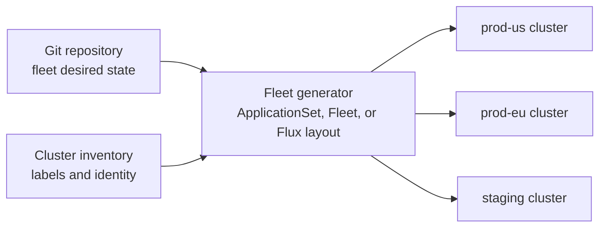
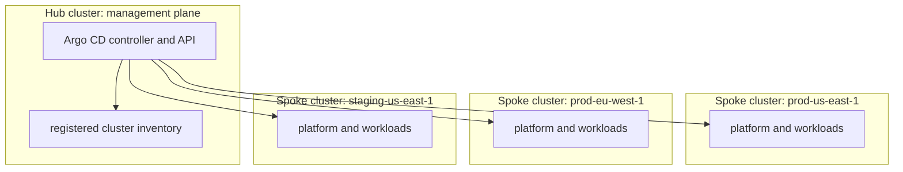
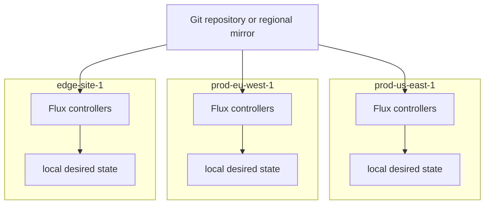
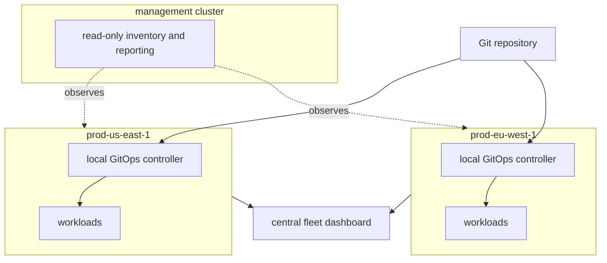
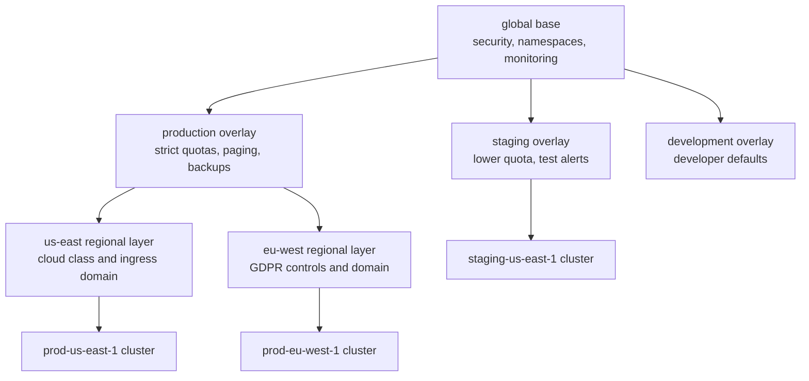
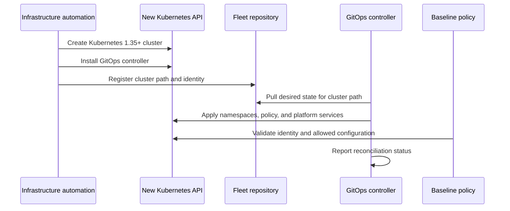

> **Discipline Module** | Complexity: `[COMPLEX]` | Time: 55-65 min

## Prerequisites

Before starting this module, you should be comfortable with the GitOps workflow from [Module 3.1: What is GitOps?](../module-3.1-what-is-gitops/), repository layout decisions from [Module 3.2: Repository Strategies](../module-3.2-repository-strategies/), drift response from [Module 3.4: Drift Detection](../module-3.4-drift-detection/), and secret delivery patterns from [Module 3.5: Secrets in GitOps](../module-3.5-secrets/). You do not need to have operated a large fleet before, but you should understand why a Git repository can act as a control surface for Kubernetes desired state.

If you use `kubectl` during the exercise, this module will shorten later commands to `k` after explaining the alias once. You can create it with `alias k=kubectl` in your shell, or you can read every `k` command as the longer `kubectl` form.

---

## Learning Outcomes

After completing this module, you will be able to:

- **Design** a multi-cluster GitOps architecture that separates global, environment, region, and cluster-specific configuration without creating copy-paste drift.
- **Evaluate** hub-spoke, mesh, and hybrid GitOps topologies against failure domains, network constraints, audit needs, and operational ownership.
- **Implement** fleet targeting with ApplicationSet, Flux Kustomization, or fleet-manager patterns while preserving explicit cluster identity and blast-radius controls.
- **Debug** a multi-cluster rollout where the wrong cluster receives the wrong configuration by tracing selectors, overlays, generated applications, and identity data.
- **Create** a bootstrap sequence that brings a new Kubernetes 1.35+ cluster from empty control plane to policy-compliant fleet member with minimal manual intervention.

## Why This Module Matters

A platform team at a payments company adds a new European production cluster on a Friday afternoon. The cluster joins the fleet, receives the usual ingress controller and monitoring stack, and looks healthy on the dashboard. Two hours later, a data-residency alert fires because a shared ApplicationSet matched only `env=production` and deployed the United States payment-routing ConfigMap into the European cluster. Nobody touched the cluster manually. The failure came from automation doing exactly what it was told, at fleet scale, faster than a human could notice.

That is the central tension of multi-cluster GitOps: it gives you enormous leverage, and leverage multiplies both good architecture and weak assumptions. A single commit can patch every cluster before attackers exploit a vulnerability, but the same commit can break every region if targeting rules are careless. A clean inheritance model can make a fleet understandable, while a messy one turns incident response into a search through repeated YAML fragments.

Multi-cluster GitOps is not just "Argo CD or Flux, but pointed at more clusters." It is a design discipline for deciding which configuration belongs everywhere, which configuration belongs only in one environment, which configuration is tied to geography or compliance, and which configuration must remain unique to a specific cluster. Senior platform engineers treat that design as production infrastructure, because the repository hierarchy becomes part of the reliability model.

In this module, you will build from the simple case to the senior case. First you will reason about why fleets become hard. Then you will compare control topologies, design inheritance, bootstrap new clusters, add guardrails, and troubleshoot a realistic targeting incident. The goal is not to memorize a particular tool's syntax. The goal is to develop the judgment needed to operate many clusters without losing track of what each cluster is supposed to be.

---

## 1. From One Cluster to a Fleet

A single-cluster GitOps setup is usually easy to explain: a controller watches Git, renders manifests, compares them to the Kubernetes API, and reconciles drift. The control loop is local enough that you can inspect one repository path, one controller, and one cluster state. When the system fails, the blast radius is understandable because there is only one cluster receiving one stream of desired state.

A fleet changes the problem because the question is no longer "what should this cluster run?" The question becomes "which clusters should receive which parts of this desired state, under which conditions, in which order, and with what proof that the result is correct?" That extra targeting layer is where many production incidents begin, because it is easy to confuse a working single-cluster pattern with a safe fleet pattern.

```ascii
+----------------------+        +----------------------+        +----------------------+
| Single-cluster model |        | Desired state in Git |        | One workload cluster |
|                      |        |                      |        |                      |
|  One controller      +------->|  apps/               +------->|  namespaces          |
|  One target          |        |  platform/           |        |  policies            |
|  One failure domain  |        |  infrastructure/     |        |  workloads           |
+----------------------+        +----------------------+        +----------------------+
```

The simple model is still useful, but only as the foundation. A multi-cluster design adds grouping, identity, inheritance, and rollout strategy. Each new layer should answer a specific operational question. Grouping answers "which clusters are similar?" Identity answers "what is this cluster allowed to receive?" Inheritance answers "where should shared configuration live?" Rollout strategy answers "how quickly should change move through the fleet?"

```ascii
+-------------------------+       +---------------------------+       +--------------------------+
| Multi-cluster questions |       | GitOps design mechanism   |       | Operational result       |
+-------------------------+       +---------------------------+       +--------------------------+
| Which clusters match?   | ----> | labels and generators     | ----> | controlled targeting     |
| What is shared?         | ----> | base and overlays         | ----> | less duplication         |
| What is unique?         | ----> | cluster identity data     | ----> | explicit exceptions      |
| What fails together?    | ----> | topology and rollout plan | ----> | bounded blast radius     |
+-------------------------+       +---------------------------+       +--------------------------+
```

Organizations use multiple clusters for reasons that are usually legitimate. Production and development often need separate failure domains. Different regions may need local ingress, storage classes, and compliance controls. Business units may need isolated clusters because chargeback, data sensitivity, or reliability requirements differ. A multi-cluster platform should make these differences visible rather than hiding them behind clever templates.

```ascii
+----------------------+    +----------------------+    +----------------------+
| Environment boundary |    | Geography boundary   |    | Ownership boundary   |
+----------------------+    +----------------------+    +----------------------+
| dev                  |    | us-east-1            |    | platform team        |
| staging              |    | eu-west-1            |    | payments team        |
| production           |    | ap-southeast-2       |    | analytics team       |
+----------------------+    +----------------------+    +----------------------+
```

The common beginner mistake is to treat every difference as a new copy of the same manifest. That works for the first few clusters because copying YAML feels faster than designing hierarchy. It breaks later when a security policy must change everywhere, because now the team must find every duplicated copy, verify which ones are intentional exceptions, and avoid touching unrelated customizations.

The senior move is to make sameness the default and difference explicit. Shared security controls belong in a global base. Production-only hardening belongs in a production overlay. Regional values belong in a region layer or cluster identity object. One-off exceptions belong near the cluster that needs them, with a comment or issue reference explaining why the exception exists and when it should be removed.

> **Active learning prompt:** Imagine a fleet with six clusters: `dev-us`, `dev-eu`, `staging-us`, `staging-eu`, `prod-us`, and `prod-eu`. Before reading further, decide which configuration should be global, which should be environment-specific, and which should be region-specific for a default-deny NetworkPolicy, a PagerDuty integration, a GDPR retention policy, and a cloud storage class.

The answer should not be a list of tool commands. The default-deny NetworkPolicy is probably global because every cluster benefits from a secure baseline. PagerDuty integration is probably production-specific because development alerts should not wake responders. GDPR retention belongs to the European region, and storage class may be regional or cluster-specific depending on the cloud provider. This kind of classification is the real work behind a good multi-cluster repository.

| Configuration type | Typical scope | Example | Why it belongs there |
|---|---|---|---|
| Global baseline | Every cluster | Namespace labels, Pod Security Admission labels, default NetworkPolicy | The organization wants the behavior everywhere unless an exception is approved. |
| Environment overlay | Dev, staging, or production | Replica count, alerting destination, resource quota strength | The environment changes operational intent more than geography does. |
| Regional overlay | Geographic or regulatory boundary | GDPR retention, region-specific ingress domain, local cloud class | The region changes compliance, latency, or provider integration. |
| Cluster override | One named cluster | Temporary canary version, dedicated tenant configuration, hardware-specific setting | The change is intentionally narrow and should not leak into peer clusters. |

A useful mental model is "policy above, identity below." The higher levels of the hierarchy declare broad intent, while the lower levels identify the cluster and narrow the final rendered output. If a low-level cluster folder contains a complete copy of every resource, the hierarchy is not doing its job. If a high-level global folder contains cluster names and regional secrets, the hierarchy is also leaking responsibilities.

The N-by-M problem appears when you multiply clusters by applications, environments, and regions. Ten applications across twelve clusters sounds like one hundred twenty deployment targets, but the real count is higher once you include policy, observability, ingress, secrets, and add-ons. GitOps does not remove that complexity by magic; it gives you a place to model the complexity explicitly and review it before controllers apply it.

```yaml
# Example classification document kept beside the fleet repository.
global:
  required:
    - namespaces
    - pod-security-admission
    - default-network-policy
    - baseline-monitoring-agent
production:
  required:
    - pagerduty-routing
    - strict-resource-quotas
    - backup-policy
regions:
  eu-west:
    required:
      - gdpr-retention-policy
      - eu-ingress-domain
clusters:
  prod-eu-west-1:
    allowed_exceptions:
      - prometheus-canary-until-2026-05-15
```

This classification file is not a substitute for rendered manifests, but it helps reviewers understand intent. During incident response, it also gives responders a fast way to distinguish "this cluster is different because the architecture says so" from "this cluster is different because drift or a bad generator changed it." That distinction is especially important when a fleet is large enough that nobody can personally remember every cluster's purpose.

---

## 2. Fleet Management Patterns

Fleet management means you manage groups of clusters through declared intent instead of treating each cluster as a one-off target. The pattern is similar across tools even though the resources differ. You define cluster inventory, attach labels or metadata, generate per-cluster desired state, and let a controller reconcile each target. The controller may live in a hub cluster, inside each workload cluster, or in a hybrid arrangement.



The tool names matter less than the contract they implement. Argo CD ApplicationSet generates Argo CD Applications from cluster inventory or lists. Rancher Fleet watches GitRepo resources and targets clusters by label. Flux often uses a more decentralized approach where each cluster runs its own controllers and reconciles its own path. Each can be valid when the topology matches the organization's constraints.

```yaml
# Argo CD ApplicationSet example: generate one platform Application per production cluster.
apiVersion: argoproj.io/v1alpha1
kind: ApplicationSet
metadata:
  name: production-platform
  namespace: argocd
spec:
  generators:
    - clusters:
        selector:
          matchLabels:
            environment: production
  template:
    metadata:
      name: '{{name}}-platform'
    spec:
      project: platform
      source:
        repoURL: https://github.com/example/fleet-config
        targetRevision: main
        path: clusters/{{name}}
      destination:
        server: '{{server}}'
        namespace: platform-system
      syncPolicy:
        automated:
          prune: true
          selfHeal: true
```

This ApplicationSet is concise, but concision is not the same as safety. The selector matches every registered cluster with `environment=production`. If production has multiple regulatory regions, this generator may be too broad unless the cluster-specific path protects regional differences. A senior review asks what happens when a new cluster joins with the correct environment label but missing region labels, because the generator will not wait for your mental model to catch up.

```yaml
# Rancher Fleet example: target production clusters in one region with explicit labels.
apiVersion: fleet.cattle.io/v1alpha1
kind: GitRepo
metadata:
  name: eu-production-platform
  namespace: fleet-default
spec:
  repo: https://github.com/example/fleet-config
  branch: main
  paths:
    - platform/base
    - platform/regions/eu-west
  targets:
    - name: eu-production
      clusterSelector:
        matchLabels:
          environment: production
          region: eu-west
```

Fleet managers are powerful because they separate "what should be deployed" from "where it should be deployed." That separation is also the main source of mistakes. If the target selector is too wide, a change escapes its intended audience. If the target selector is too narrow, a cluster silently misses a required baseline. The repository should therefore include tests or preview commands that show exactly which clusters match a change before it reaches production.

```yaml
# Flux example: a per-cluster Kustomization pulls a path from a shared repository.
apiVersion: kustomize.toolkit.fluxcd.io/v1
kind: Kustomization
metadata:
  name: platform-config
  namespace: flux-system
spec:
  interval: 10m
  sourceRef:
    kind: GitRepository
    name: fleet-config
  path: ./clusters/prod-eu-west-1
  prune: true
  wait: true
  postBuild:
    substituteFrom:
      - kind: ConfigMap
        name: cluster-identity
```

Flux's decentralized style often feels less dramatic because there is no single generator creating a large list of Applications. The fleet still exists, but the inventory is expressed through repository paths, bootstrap configuration, and cluster-local Kustomizations. That can be more resilient across unreliable networks, but it means the team needs separate visibility tooling to answer "which clusters are currently reconciled to this commit?"

> **Active learning prompt:** You add a new cluster called `prod-eu-west-2`, but it accidentally receives only `environment=production` and no `region` label. Predict what happens under the broad ApplicationSet selector above, then predict what happens under the narrower Rancher Fleet selector. Which failure mode is easier to detect before deployment?

The broad ApplicationSet selector deploys the production platform because the environment label is enough to match. Whether the cluster receives correct regional configuration depends on the path and templates behind `clusters/{{name}}`. The narrower selector does not target the cluster until the region label exists, which may leave the cluster incomplete but avoids accidentally applying region-sensitive configuration. Neither behavior is automatically "correct"; the safer choice depends on whether missing baseline or wrong baseline is the greater risk.

A good fleet design includes a preview habit. Reviewers should see generated application names, target clusters, and rendered paths before approving a pull request. For Argo CD, teams often use ApplicationSet controller dry-runs or policy tests around the cluster secret inventory. For Flux and Kustomize, teams can run `kustomize build` for each cluster path and compare expected labels. For any tool, the important practice is to make targeting observable before reconciliation.

```bash
# Validate a simple cluster inventory file without contacting a Kubernetes cluster.
# This command assumes yq is installed and cluster inventory lives in clusters.yaml.
yq '.clusters[] | select(.labels.environment == "production") | .name' clusters.yaml
```

A small inventory file might look like this during local design review. Real installations often store the same information in Argo CD cluster Secrets, Cluster API objects, cloud tags, or a platform inventory service. The format is less important than the discipline of making identity explicit and testable.

```yaml
clusters:
  - name: prod-us-east-1
    labels:
      environment: production
      region: us-east
      compliance: pci
  - name: prod-eu-west-1
    labels:
      environment: production
      region: eu-west
      compliance: gdpr
  - name: staging-us-east-1
    labels:
      environment: staging
      region: us-east
      compliance: internal
```

| Tool or approach | Control style | Best fit | Primary risk to manage |
|---|---|---|---|
| Argo CD ApplicationSet | Hub-generated Applications from cluster inventory | Teams that want central UI, reviewable generated Applications, and mature sync controls | Selectors or templates that target more clusters than intended. |
| Rancher Fleet | Fleet-native GitRepo targeting by cluster labels | Organizations already using Rancher or managing many edge clusters | Label hygiene and dependency on Fleet's inventory model. |
| Flux per-cluster controllers | Each cluster pulls its own path from Git | Air-gapped, decentralized, or network-constrained environments | Fleet-wide visibility and consistent bootstrap enforcement. |
| Cluster API plus GitOps | Cluster lifecycle objects trigger bootstrap and configuration | Platform teams that create clusters as products | Race conditions between cluster readiness and add-on reconciliation. |
| Crossplane plus GitOps | Composed infrastructure and app configuration through control planes | Teams building higher-level platform abstractions | Hidden coupling between infrastructure composition and application rollout. |

At senior level, the decision is not "which tool is best?" It is "which failure mode do we want to own?" A centralized hub makes audit and operator experience easier, but the hub becomes part of the critical path. A mesh makes cluster autonomy stronger, but fleet-wide visibility must be built separately. A hybrid can give the best of both, but it adds coordination cost and must be documented clearly.

---

## 3. Topologies: Hub-Spoke, Mesh, and Hybrid

Topology describes where reconciliation decisions happen and which network paths are required. This is a reliability decision before it is a tooling decision. If a central controller must reach every cluster API server, then hub-to-spoke connectivity is part of your deployment system. If each cluster pulls from Git, then repository availability and local controller health become the main dependencies.

Hub-spoke places a management cluster at the center. The hub runs Argo CD or another controller that knows about many target clusters. Operators get a central interface, central RBAC, and central audit trail. The price is that the hub must be protected like production infrastructure, because a bad hub upgrade or network outage can degrade reconciliation across the fleet.



```yaml
# Argo CD cluster registration Secret, simplified for teaching.
apiVersion: v1
kind: Secret
metadata:
  name: prod-eu-west-1
  namespace: argocd
  labels:
    argocd.argoproj.io/secret-type: cluster
    environment: production
    region: eu-west
    compliance: gdpr
type: Opaque
stringData:
  name: prod-eu-west-1
  server: https://prod-eu-west-1.example.com:6443
  config: |
    {
      "bearerToken": "REPLACE_WITH_TOKEN",
      "tlsClientConfig": {
        "insecure": false,
        "caData": "REPLACE_WITH_BASE64_CA"
      }
    }
```

The registration Secret is a cluster identity source and a credential source, which means it deserves strong change control. If someone changes the labels, targeting changes. If someone changes the server endpoint, reconciliation points somewhere else. If someone changes credentials incorrectly, the hub may lose the ability to detect drift. Treat these Secrets as fleet control-plane data, not as incidental Argo CD plumbing.

Mesh places a GitOps controller inside every cluster. Each controller reads the repository or a local mirror and reconciles its own cluster. A mesh is attractive for remote sites, regulated environments, and organizations where clusters must keep operating even when central management is unavailable. The trade-off is that no single controller naturally knows the whole fleet's state.



```bash
# Example Flux bootstrap command for one cluster path.
# Replace the owner and repository values before running in a real environment.
flux bootstrap github \
  --owner=example \
  --repository=fleet-config \
  --branch=main \
  --path=clusters/prod-eu-west-1 \
  --personal
```

The command installs Flux controllers, creates a GitRepository source, creates a Kustomization for the selected path, and commits bootstrap manifests back to the repository when configured to do so. It is powerful because it makes the cluster self-reconciling. It is risky if run with the wrong path, because the new cluster will faithfully become whatever that path describes.

> **Active learning prompt:** In a mesh topology, the central Git service is unavailable for one hour. Do existing workloads stop running, do GitOps controllers delete resources, or do clusters continue with the last reconciled state? Explain the mechanism before checking the answer in your own words.

Existing workloads continue running because Kubernetes does not depend on Git availability after resources are created. GitOps controllers may report source fetch failures and stop applying new changes, but they should not delete healthy workloads just because the source is temporarily unreachable. The operational problem is delayed reconciliation and reduced visibility, not immediate workload termination. That distinction matters during incident communication because "GitOps is degraded" is not the same as "production workloads are down."

Hybrid topologies combine central visibility with local reconciliation. For example, each cluster may run Flux for writes, while a central dashboard observes repository state, cluster health, and drift signals. Another pattern uses Argo CD in the hub for standard connected clusters and Flux in disconnected sites. Hybrid designs are common because organizational reality rarely matches one clean diagram.



The hybrid diagram looks reassuring, but senior engineers ask who is allowed to write. A read-only hub should not quietly become a second reconciliation path. If Flux and Argo CD both attempt to manage the same namespace, the cluster can enter a controller fight where each tool reverts the other's changes. The architecture should document ownership boundaries at the resource, namespace, or application level.

```ascii
+----------------------+---------------------------+------------------------------+
| Topology             | Strongest property        | Cost you must actively own   |
+----------------------+---------------------------+------------------------------+
| Hub-spoke            | Central control and audit | Hub availability and scaling |
| Mesh                 | Cluster autonomy          | Fleet-wide visibility        |
| Hybrid               | Flexible failure domains  | Clear write ownership        |
+----------------------+---------------------------+------------------------------+
```

A practical topology decision starts with failure scenarios. If the hub cluster is down during a security patch, can the fleet still apply the patch? If the Git service is unreachable, how long can clusters safely operate on the last known commit? If a region is isolated, can local teams still deploy emergency fixes? If the answer to any question is unclear, the topology diagram is not complete enough for production.

| Decision question | Hub-spoke implication | Mesh implication | Hybrid implication |
|---|---|---|---|
| Do operators need one central UI for every deployment? | Strong fit because the hub owns generated Applications and sync status. | Requires additional aggregation or observability tooling. | Possible if the hub observes but does not necessarily write. |
| Are clusters frequently disconnected from central networks? | Weak fit unless connectivity is engineered carefully. | Strong fit because each cluster can reconcile from a local mirror. | Good fit when connected clusters use hub workflows and disconnected sites self-manage. |
| Is central RBAC required for every deployment action? | Strong fit because access can be enforced at the hub. | Harder because each cluster has its own controller and local permissions. | Requires clear policy about which actions are central and which are local. |
| Is hub outage acceptable during reconciliation? | Risky because the hub is on the write path. | Less risky because local controllers continue operating. | Depends on whether the hub is write-capable or observe-only. |

The senior answer is often boring: choose the simplest topology that matches the network and ownership model, then test its failure modes. Do not choose mesh because it sounds resilient if your organization cannot observe mesh health. Do not choose hub-spoke because the UI is convenient if the hub cannot be operated with the same discipline as other production control planes.

---

## 4. Configuration Inheritance and Cluster Identity

Configuration inheritance is the technique that lets a fleet share most of its desired state while keeping intentional differences small and visible. Kustomize bases and overlays are the most common teaching example, but the same principle applies to Helm values, Jsonnet libraries, Cue packages, Crossplane compositions, and custom platform APIs. The key is to model the business and reliability boundaries before writing templates.



The inheritance hierarchy should have a small number of levels, and each level should have a clear reason to exist. Too few levels lead to duplication because every cluster folder must repeat environment and regional differences. Too many levels make the rendered output hard to reason about because a value may be changed in several places before it reaches the cluster.

```ascii
fleet-config/
+-- base/
|   +-- security/
|   +-- monitoring/
|   +-- networking/
|   +-- kustomization.yaml
+-- environments/
|   +-- dev/
|   +-- staging/
|   +-- production/
+-- regions/
|   +-- us-east/
|   +-- eu-west/
+-- clusters/
    +-- prod-us-east-1/
    +-- prod-eu-west-1/
    +-- staging-us-east-1/
```

In this layout, `base` should not know about production, Europe, or a named cluster. The `production` overlay should not know about a specific cloud availability zone unless every production cluster shares it. The `eu-west` regional overlay should not contain a special override for only one team. The cluster folder should be mostly identity, final composition, and carefully documented exceptions.

```yaml
# fleet-config/base/kustomization.yaml
apiVersion: kustomize.config.k8s.io/v1beta1
kind: Kustomization
resources:
  - security/default-deny-networkpolicy.yaml
  - monitoring/namespace.yaml
  - networking/ingress-namespace.yaml
commonLabels:
  app.kubernetes.io/managed-by: gitops
```

```yaml
# fleet-config/environments/production/kustomization.yaml
apiVersion: kustomize.config.k8s.io/v1beta1
kind: Kustomization
resources:
  - ../../base
commonLabels:
  platform.example.com/environment: production
commonAnnotations:
  platform.example.com/oncall: pagerduty
patches:
  - target:
      kind: Namespace
      name: monitoring
    patch: |
      - op: add
        path: /metadata/labels/platform.example.com~1critical
        value: "true"
```

```yaml
# fleet-config/regions/eu-west/kustomization.yaml
apiVersion: kustomize.config.k8s.io/v1beta1
kind: Kustomization
resources:
  - ../../environments/production
commonLabels:
  platform.example.com/region: eu-west
  platform.example.com/compliance: gdpr
configMapGenerator:
  - name: regional-settings
    namespace: kube-system
    literals:
      - REGION=eu-west-1
      - DATA_RESIDENCY=eu
```

```yaml
# fleet-config/clusters/prod-eu-west-1/kustomization.yaml
apiVersion: kustomize.config.k8s.io/v1beta1
kind: Kustomization
resources:
  - ../../regions/eu-west
commonLabels:
  platform.example.com/cluster: prod-eu-west-1
configMapGenerator:
  - name: cluster-identity
    namespace: kube-system
    literals:
      - CLUSTER_NAME=prod-eu-west-1
      - ENVIRONMENT=production
      - REGION=eu-west-1
      - COMPLIANCE=gdpr
generatorOptions:
  disableNameSuffixHash: true
```

The `cluster-identity` ConfigMap deserves special attention. It is not only a convenient set of variables; it is a declaration of what the cluster believes it is. Workloads, policies, admission checks, and observability pipelines can use that identity to verify that the rendered configuration matches the intended target. Without this identity layer, a bad selector can make the cluster accept a configuration meant for another region.

Flux post-build substitution is one way to use identity values safely, as long as the source of substitution is controlled. The controller renders manifests, replaces variables from trusted ConfigMaps or Secrets, and applies the final output. This can remove repetition, but it should not become an unreviewed runtime templating system where any cluster-local operator can change identity values and redirect workloads.

```yaml
# Flux Kustomization using cluster identity values for substitution.
apiVersion: kustomize.toolkit.fluxcd.io/v1
kind: Kustomization
metadata:
  name: applications
  namespace: flux-system
spec:
  interval: 10m
  sourceRef:
    kind: GitRepository
    name: fleet-config
  path: ./apps
  prune: true
  wait: true
  postBuild:
    substituteFrom:
      - kind: ConfigMap
        name: cluster-identity
```

```yaml
# A deployment fragment that receives identity during post-build substitution.
apiVersion: apps/v1
kind: Deployment
metadata:
  name: regional-api
  namespace: payments
  labels:
    platform.example.com/cluster: ${CLUSTER_NAME}
    platform.example.com/region: ${REGION}
spec:
  replicas: 3
  selector:
    matchLabels:
      app: regional-api
  template:
    metadata:
      labels:
        app: regional-api
    spec:
      containers:
        - name: api
          image: ghcr.io/example/regional-api:1.35.2
          env:
            - name: CLUSTER_NAME
              value: ${CLUSTER_NAME}
            - name: REGION
              value: ${REGION}
```

A worked example shows why the hierarchy matters. Suppose all production clusters run Prometheus `v2.55.1`, but one staging cluster needs to test `v2.56.0` for a retention bug fix. A weak design edits the staging environment overlay, unintentionally changing every staging cluster. A better design applies the version override only in the named cluster folder and adds a removal date.

```yaml
# fleet-config/clusters/staging-data-1/kustomization.yaml
apiVersion: kustomize.config.k8s.io/v1beta1
kind: Kustomization
resources:
  - ../../environments/staging
images:
  - name: quay.io/prometheus/prometheus
    newTag: v2.56.0
commonAnnotations:
  platform.example.com/exception: "PROM-2187 test retention fix until 2026-05-20"
```

This is a small example, but it demonstrates a senior habit: exceptions are allowed, but they are narrow, named, and reviewable. The repository should make it obvious that `staging-data-1` differs from other staging clusters. If the exception later becomes the standard, the team can promote the version to the staging overlay and delete the cluster override.

```bash
# Render one cluster path locally to inspect the final result before a PR is approved.
kustomize build fleet-config/clusters/staging-data-1 | yq 'select(.kind == "Deployment" and .metadata.name == "prometheus") | .spec.template.spec.containers[].image'
```

If the command prints the canary image only for the intended cluster, the override is scoped correctly. If the same image appears in every staging cluster, the change was applied too high in the hierarchy. That is why local rendering and review are part of the teaching flow, not optional polish.

```ascii
+-----------------------+       +--------------------------+       +--------------------------+
| Where change is made  |       | Who receives it          |       | Review question          |
+-----------------------+       +--------------------------+       +--------------------------+
| base                  | ----> | every cluster            | ----> | Should this be universal?|
| environment/staging   | ----> | every staging cluster    | ----> | Is staging-wide intended?|
| region/eu-west        | ----> | every EU production path | ----> | Is this regional policy? |
| cluster/staging-data  | ----> | one cluster              | ----> | Is exception documented? |
+-----------------------+       +--------------------------+       +--------------------------+
```

The same thinking applies to secrets from the previous module. A secret delivery mechanism may be global, while secret values are environment-specific or cluster-specific. A production ExternalSecret store should not accidentally be inherited by development clusters. A regional encryption key should not be referenced by the wrong region. Multi-cluster GitOps makes these boundaries easier to review only when the hierarchy reflects them.

---

## 5. Bootstrapping and Progressive Rollout

Bootstrapping is the transition from "Kubernetes API exists" to "this cluster is a managed member of the fleet." It includes installing the GitOps controller, connecting it to the correct repository path, applying baseline policy, installing platform services, and proving that the cluster identity matches the intended target. A manual bootstrap sequence is risky because people forget steps, copy old commands, or use the wrong context under pressure.



A good bootstrap has a small trusted imperative step followed by a large declarative reconciliation step. The imperative step may be a Terraform module, a Cluster API template, a cloud-init script, or a runbook command. It should do only what is necessary to install the controller and point it at Git. Everything after that should be declared in the fleet repository so future changes are reviewed and replayable.

```bash
# Example bootstrap wrapper. It validates required input before running Flux bootstrap.
# Save as bootstrap-cluster.sh and run with: bash bootstrap-cluster.sh prod-eu-west-1 production eu-west-1
set -euo pipefail

cluster_name="${1:?cluster name required}"
environment="${2:?environment required}"
region="${3:?region required}"

case "$environment" in
  dev|staging|production)
    ;;
  *)
    echo "unsupported environment: $environment" >&2
    exit 1
    ;;
esac

case "$region" in
  us-east-1|eu-west-1)
    ;;
  *)
    echo "unsupported region: $region" >&2
    exit 1
    ;;
esac

flux bootstrap github \
  --owner=example \
  --repository=fleet-config \
  --branch=main \
  --path="clusters/${cluster_name}" \
  --personal

echo "bootstrapped ${cluster_name} for ${environment} in ${region}"
```

The wrapper is intentionally conservative. It does not infer production from a name substring, and it does not accept arbitrary regions. In a real platform, the allowed values might come from a cluster inventory service or a pull request template. The important principle is that bootstrap input becomes fleet identity, so it deserves validation before the controller starts reconciling.

```yaml
# Cluster API object carrying labels that a bootstrap controller or fleet manager can use.
apiVersion: cluster.x-k8s.io/v1beta1
kind: Cluster
metadata:
  name: prod-eu-west-1
  labels:
    platform.example.com/environment: production
    platform.example.com/region: eu-west
    platform.example.com/compliance: gdpr
  annotations:
    platform.example.com/gitops-path: clusters/prod-eu-west-1
spec:
  clusterNetwork:
    services:
      cidrBlocks:
        - 10.96.0.0/12
    pods:
      cidrBlocks:
        - 192.168.0.0/16
  controlPlaneRef:
    apiVersion: controlplane.cluster.x-k8s.io/v1beta1
    kind: KubeadmControlPlane
    name: prod-eu-west-1
  infrastructureRef:
    apiVersion: infrastructure.cluster.x-k8s.io/v1beta1
    kind: AWSCluster
    name: prod-eu-west-1
```

Zero-touch provisioning does not mean "no control." It means the controls are encoded before the cluster is created. The Cluster API object, bootstrap token handling, GitOps path, cluster labels, and baseline policy must line up. If they do not, the automation should stop or quarantine the cluster rather than guessing which configuration is probably correct.

Rollout strategy matters after bootstrap because fleet-wide change is where leverage becomes dangerous. Updating every cluster at once is tempting when a patch is urgent, but not every change should move with the same speed. A security fix for an exploited vulnerability may justify rapid global rollout. A new ingress controller major version probably deserves canary clusters, then staging, then one production region, then the rest of production.

```ascii
+----------------------+     +----------------------+     +----------------------+
| Canary cluster       | --> | Staging fleet        | --> | Production wave 1    |
| one low-risk target  |     | realistic traffic    |     | one region or slice  |
+----------------------+     +----------------------+     +----------------------+
                                                                  |
                                                                  v
                                                       +----------------------+
                                                       | Production wave 2    |
                                                       | remaining clusters   |
                                                       +----------------------+
```

A progressive rollout in GitOps can be modeled with branches, directories, labels, or explicit generator lists. The mechanism is less important than the reviewability of the wave boundary. If nobody can tell which clusters are in wave one by reading the pull request, the rollout is too implicit.

```yaml
# ApplicationSet list generator for an explicit production wave.
apiVersion: argoproj.io/v1alpha1
kind: ApplicationSet
metadata:
  name: ingress-controller-wave-1
  namespace: argocd
spec:
  generators:
    - list:
        elements:
          - cluster: prod-us-east-1
            server: https://prod-us-east-1.example.com:6443
          - cluster: prod-eu-west-1
            server: https://prod-eu-west-1.example.com:6443
  template:
    metadata:
      name: '{{cluster}}-ingress'
    spec:
      project: platform
      source:
        repoURL: https://github.com/example/fleet-config
        targetRevision: main
        path: addons/ingress-controller
      destination:
        server: '{{server}}'
        namespace: ingress-nginx
      syncPolicy:
        automated:
          prune: true
          selfHeal: true
```

Explicit lists are verbose, but they are excellent during risky changes because reviewers can see the blast radius. Selector-based waves are more scalable, but they depend on accurate labels. A mature platform often supports both: selectors for routine baselines, explicit waves for dangerous upgrades, and policy checks that reject selectors that match unexpected clusters.

```bash
# Preview clusters selected for a rollout wave from an inventory file.
yq '.clusters[] | select(.labels.rollout_wave == "one") | [.name, .labels.region] | @tsv' clusters.yaml
```

The output should be boring and predictable. If an unexpected cluster appears, the change should stop before it reaches the GitOps controller. This is where GitOps earns trust: the commit history shows not only what changed, but also the intended audience of the change.

---

## 6. Guardrails and Troubleshooting

Multi-cluster GitOps failures often look confusing because the symptom appears in one cluster while the cause lives in inventory, generator logic, repository hierarchy, or bootstrap metadata. A production cluster may show the wrong ConfigMap, but the bug may be an ApplicationSet selector. A staging cluster may miss a policy, but the bug may be a label that kept it out of the target set. Troubleshooting requires following the desired-state path from intent to rendered resource.

```ascii
+------------------+     +------------------+     +------------------+     +------------------+
| Human intent     | --> | Git change       | --> | Generator output | --> | Rendered YAML    |
| PR and review    |     | paths and values |     | target clusters  |     | final manifests  |
+------------------+     +------------------+     +------------------+     +------------------+
                                                                            |
                                                                            v
                                                                  +------------------+
                                                                  | Cluster state    |
                                                                  | applied objects  |
                                                                  +------------------+
```

A useful debugging routine starts by refusing to trust the dashboard alone. Dashboards summarize state, but they may hide which selector matched, which overlay patched a field, or which controller last wrote a resource. You need to inspect the chain: the cluster's identity, the generator's match result, the rendered manifests, the controller sync status, and the live object in the cluster.

```bash
# Check the identity ConfigMap in the target cluster.
# This uses k as the kubectl alias explained in the prerequisites section.
k -n kube-system get configmap cluster-identity -o yaml
```

```bash
# Inspect labels on an Argo CD cluster Secret from the hub cluster.
k -n argocd get secret prod-eu-west-1 -o jsonpath='{.metadata.labels}'
```

```bash
# Render the intended cluster path locally before blaming the controller.
kustomize build fleet-config/clusters/prod-eu-west-1 > /tmp/prod-eu-west-1.yaml
yq 'select(.kind == "ConfigMap" and .metadata.name == "regional-settings")' /tmp/prod-eu-west-1.yaml
```

```bash
# Compare the live object with the rendered object by focusing on labels and data.
k -n kube-system get configmap regional-settings -o yaml
```

The comparison tells you which class of failure you are investigating. If the rendered output is wrong, the bug is in Git hierarchy, patches, values, or templates. If the rendered output is right but the live object is wrong, the bug may be sync failure, controller ownership conflict, admission rejection, or manual drift. If the object is right but the application behavior is wrong, the problem may be outside the GitOps layer.

A senior troubleshooting question is "which controller owns this field?" Kubernetes managed fields, labels, annotations, and GitOps controller status can help. Controller fights are common when two GitOps systems manage overlapping resources during migrations. If Argo CD and Flux both reconcile the same Namespace, one may remove a label that the other adds, causing a persistent drift loop.

```bash
# Inspect field managers for a live object.
k -n monitoring get namespace monitoring -o yaml | yq '.metadata.managedFields[].manager' | sort -u
```

Guardrails reduce the chance that bad targeting reaches the cluster. Some guardrails run before merge, such as policy checks that validate inventory labels or reject wildcard production selectors. Some guardrails run during sync, such as Argo CD sync windows, sync waves, or admission policies. Some guardrails run after sync, such as drift detection and compliance alerts.

```yaml
# Kyverno ClusterPolicy example: require cluster identity on production namespaces.
apiVersion: kyverno.io/v1
kind: ClusterPolicy
metadata:
  name: require-production-identity-labels
spec:
  validationFailureAction: Enforce
  background: true
  rules:
    - name: require-environment-and-region
      match:
        any:
          - resources:
              kinds:
                - Namespace
              selector:
                matchLabels:
                  platform.example.com/environment: production
      validate:
        message: "production namespaces must include cluster and region identity labels"
        pattern:
          metadata:
            labels:
              platform.example.com/cluster: "?*"
              platform.example.com/region: "?*"
```

This policy does not prove that every value is correct, but it rejects incomplete identity. That is useful because many fleet incidents start with missing metadata rather than obviously wrong metadata. Stronger policies can compare values against an allowed list, but even simple presence checks catch mistakes earlier than a human scanning a dashboard after the fact.

```yaml
# Argo CD sync window example: block automated production syncs outside an approved window.
apiVersion: argoproj.io/v1alpha1
kind: AppProject
metadata:
  name: platform
  namespace: argocd
spec:
  sourceRepos:
    - https://github.com/example/fleet-config
  destinations:
    - namespace: '*'
      server: '*'
  syncWindows:
    - kind: deny
      schedule: '0 18 * * 1-5'
      duration: 12h
      applications:
        - '*production*'
      manualSync: true
```

Sync windows are not a substitute for good targeting. They are a timing guardrail, not a correctness guardrail. They help when a change should not auto-apply during low-staffing periods, but they do not know whether `prod-eu-west-1` should receive a United States routing table. Use timing guardrails with identity and rendering checks, not instead of them.

A realistic incident ties these ideas together. A fintech company runs a hub-spoke Argo CD model for four regions. An engineer adds a new `prod-eu-west-2` cluster and copies labels from a United States cluster, forgetting to change `region=us-east` to `region=eu-west`. The ApplicationSet selector matches production clusters and renders a region-specific path using the label, so the new European cluster receives the wrong payment routing ConfigMap.

```yaml
# Broken cluster Secret labels.
metadata:
  name: prod-eu-west-2
  labels:
    argocd.argoproj.io/secret-type: cluster
    environment: production
    region: us-east
    compliance: gdpr
```

The dashboard shows the Application as healthy because the controller successfully applied what it was asked to apply. The cluster is not "drifted" from Git; it is faithfully wrong. This is the hardest class of GitOps incident for beginners because the usual health signals are green. You must compare cluster identity against external truth, such as the cluster name, cloud region, Cluster API object, or platform inventory system.

```yaml
# Safer generator pattern: require environment, region, and compliance to line up.
apiVersion: argoproj.io/v1alpha1
kind: ApplicationSet
metadata:
  name: eu-production-payments
  namespace: argocd
spec:
  generators:
    - clusters:
        selector:
          matchLabels:
            environment: production
            region: eu-west
            compliance: gdpr
  template:
    metadata:
      name: '{{name}}-payments'
    spec:
      project: payments
      source:
        repoURL: https://github.com/example/fleet-config
        targetRevision: main
        path: apps/payments/overlays/eu-west
      destination:
        server: '{{server}}'
        namespace: payments
```

The fix has two parts. The immediate repair is to correct the cluster labels, force regeneration, and verify the rendered ConfigMap before syncing. The systemic repair is to prevent label mismatch from recurring. That may mean bootstrap validation, inventory tests, admission policy requiring identity labels, and pull request checks that compare cluster name patterns with region labels.

```bash
# Example inventory consistency check using yq for a local clusters.yaml file.
# It fails if any cluster name containing "-eu-" is not labeled with an eu-west region.
bad_clusters="$(yq -r '.clusters[] | select(.name | test("-eu-")) | select(.labels.region != "eu-west") | .name' clusters.yaml)"

if [ -n "$bad_clusters" ]; then
  echo "clusters with inconsistent EU identity:"
  echo "$bad_clusters"
  exit 1
fi
```

Troubleshooting multi-cluster GitOps is easier when each layer has an observable artifact. Inventory files or cluster Secrets show target metadata. Generated Applications show where the controller intends to sync. Rendered manifests show final desired state. Controller status shows reconciliation health. Live Kubernetes objects show what actually exists. If a design hides any layer, incidents take longer because responders must infer intent from side effects.

---

## Did You Know?

1. **ApplicationSet and Fleet-style generators are not just convenience features; they are policy surfaces.** A selector that matches clusters is effectively deciding where production code and platform policy can go, so generator changes deserve the same review seriousness as application code changes.

2. **A healthy GitOps sync can still represent a bad production state.** GitOps health usually means the live cluster matches the declared desired state, not that the desired state was appropriate for that cluster, region, customer, or compliance boundary.

3. **Decentralized GitOps does not remove the need for central inventory.** Mesh topologies reduce write-path dependency on a hub, but teams still need a trustworthy way to answer which clusters exist, what commit they run, and which policy baseline they should inherit.

4. **Bootstrap is part of the fleet control plane.** The first command or automation that points a cluster at a repository path determines its identity, baseline, and future reconciliation behavior, so bootstrap code should be versioned and reviewed like production deployment code.

---

## Common Mistakes

| Mistake | Why It Fails in a Fleet | What To Do Instead |
|---|---|---|
| Matching clusters only by `environment=production` | Regional, compliance, tenant, and blast-radius differences disappear behind one broad selector. | Match on the smallest safe set of identity labels, and preview the target list before syncing. |
| Copying full manifests into every cluster folder | Shared changes become search-and-edit work, and intentional exceptions are hard to distinguish from stale copies. | Put common resources in a base, use overlays for environment and region, and keep cluster folders narrow. |
| Treating bootstrap as a manual runbook | Human operators eventually use the wrong context, path, branch, or region during a rushed cluster launch. | Automate bootstrap with validated inputs, version the script or module, and reconcile the rest from Git. |
| Assuming GitOps health means business correctness | A controller can be healthy while applying the wrong regional routing, secret reference, or policy level. | Validate cluster identity and rendered output against an inventory source, not only controller health. |
| Letting two controllers own the same resources | Argo CD, Flux, Helm operators, or scripts can fight over labels, annotations, pruning, and generated objects. | Define ownership boundaries by namespace, resource, or application, and inspect managed fields during migrations. |
| Rolling out every fleet change at once | A template error, controller bug, or incompatible add-on version can hit all clusters before feedback arrives. | Use canary clusters, explicit waves, sync windows, and automated checks for high-risk changes. |
| Hiding exceptions inside shared overlays | A one-cluster workaround silently becomes a default for peer clusters that did not need it. | Place exceptions in the named cluster folder with an issue reference and a removal condition. |

---

## Quiz

### Question 1

Your team manages twenty production clusters across the United States and Europe. A pull request changes the base ingress controller version from `1.35.1` to `1.35.2` because of a critical vulnerability. The change would affect every cluster that inherits from `base/networking`. How should you decide whether to merge it as one global change or roll it out in waves?

<details>
<summary>Show Answer</summary>

You should evaluate both urgency and compatibility risk. If the vulnerability is actively exploitable and the version change is a small patch with strong confidence, a global base change may be justified because the security risk of waiting is higher than the rollout risk. If the controller has provider-specific behavior, admission webhook changes, or ingress class changes, you should use canary and production waves even though the change is security-related. The key is that the decision should be explicit in the pull request: target scope, previewed clusters, rollback plan, and the reason the chosen speed is acceptable.

</details>

### Question 2

A new `prod-eu-west-2` cluster appears in Argo CD and the generated Application is healthy, but the live `regional-settings` ConfigMap contains `REGION=us-east-1`. The cluster Secret has labels `environment=production`, `region=us-east`, and `compliance=gdpr`. What do you check first, and why is the Application health status misleading?

<details>
<summary>Show Answer</summary>

You should first check the cluster identity source used by the generator, which in this case is the Argo CD cluster Secret labels. The Application is healthy because Argo CD successfully rendered and applied the desired state selected by those labels. Health does not prove that the labels describe the real cluster correctly. After correcting the label to the European region, you should preview the generated Application path or rendered manifests, then sync and verify the live ConfigMap. The systemic fix is to add bootstrap or inventory validation that rejects inconsistent cluster names, regions, and compliance labels.

</details>

### Question 3

Your company operates remote manufacturing sites where network links to the central office fail several times per month. Each site must continue reconciling local safety monitoring workloads even when disconnected from the central management cluster. Which topology would you recommend, and what operational capability must you add because of that choice?

<details>
<summary>Show Answer</summary>

A mesh topology is the better fit because each cluster can run its own GitOps controller and reconcile from a local repository mirror or reachable source without depending on a central hub. That design protects local reconciliation during network isolation. The capability you must add is fleet-wide visibility, because decentralized controllers do not automatically provide one central view of commit versions, sync health, and drift across all sites. A hybrid model may also be appropriate if a central system observes cluster status without becoming the write path.

</details>

### Question 4

A staging data-science cluster needs to test Prometheus `v2.56.0`, while every other staging cluster should remain on `v2.55.1`. A teammate proposes editing the shared `environments/staging` overlay and adding a note in the pull request. What is wrong with that approach, and where should the change live?

<details>
<summary>Show Answer</summary>

Editing the shared staging overlay changes every cluster inheriting from staging, so the exception would leak to clusters that did not request or validate the new Prometheus version. The change should live in the named cluster folder, such as `clusters/staging-data-1`, using a Kustomize image override or targeted patch. The cluster-specific override should include an annotation or comment with the issue reference and removal condition. If the test later becomes the default, the team can promote the version to the shared staging overlay and delete the exception.

</details>

### Question 5

During a migration, Flux manages namespaces and Argo CD manages applications inside those namespaces. You notice the `monitoring` Namespace repeatedly flips a label between two values, and both tools report drift at different times. How do you debug and resolve the conflict?

<details>
<summary>Show Answer</summary>

You should inspect the live Namespace's managed fields, labels, and annotations to identify which controllers are writing the conflicting field. Then compare the Flux Kustomization path and Argo CD Application path to find overlapping ownership. The resolution is not to ignore drift; it is to define a clear boundary. Flux might own the Namespace object and baseline labels, while Argo CD owns Deployments and Services inside the namespace. Alternatively, one controller can fully own that namespace and the other must stop managing it. After changing ownership, render both desired states and confirm the conflicting label is declared in only one place.

</details>

### Question 6

A platform engineer wants zero-touch provisioning for new clusters. Their first design creates the Kubernetes cluster with Terraform, then sends a Slack message asking an operator to install the GitOps controller and choose the correct repository path. What part of zero-touch provisioning is missing, and what risk does the manual step introduce?

<details>
<summary>Show Answer</summary>

The design is missing automated GitOps bootstrap. Zero-touch provisioning should connect infrastructure creation to controller installation, cluster identity, and the correct repository path without waiting for an operator to remember the sequence. The manual step introduces the risk of choosing the wrong context, wrong path, wrong branch, or wrong regional identity. A better design validates environment and region input, installs the controller, points it at `clusters/<cluster-name>`, and lets the repository apply baseline policy and platform services.

</details>

### Question 7

A reviewer sees an ApplicationSet with a selector that matches `environment=production` and a template path of `apps/payments/overlays/{{metadata.labels.region}}`. The author says it is safe because every production cluster has a region label. What failure case should the reviewer ask about before approving?

<details>
<summary>Show Answer</summary>

The reviewer should ask what happens when a production cluster has a missing, misspelled, stale, or incorrect region label. Template paths based on labels are only as safe as the identity source. A missing label may generate an invalid path and fail to sync, while an incorrect label may generate a valid path for the wrong region and apply bad configuration while appearing healthy. The pull request should include a target preview or policy check proving that every matched production cluster has an allowed region value and that the generated paths exist.

</details>

---

## Hands-On Exercise: Design and Validate a Six-Cluster Fleet

### Objective

You will create a local fleet repository for six hypothetical Kubernetes clusters, render each cluster's desired state, and verify that global, environment, regional, and cluster-specific configuration land in the correct places. This exercise does not require access to a real Kubernetes cluster because the main skill is designing and validating the GitOps hierarchy before a controller applies it.

### Scenario

You are the platform engineer for an organization with two environments and three regions. The organization has `dev-us-east-1`, `dev-eu-west-1`, `staging-us-east-1`, `staging-eu-west-1`, `prod-us-east-1`, and `prod-eu-west-1`. Every cluster needs a default-deny NetworkPolicy and a monitoring namespace. Production clusters need stricter labels. European clusters need GDPR identity. The production European cluster also needs a cluster-specific identity ConfigMap that proves it is both production and European.

### Part 1: Create the Repository Skeleton

Run these commands in a temporary working directory. They create a repository layout that separates base, environment, region, and cluster layers.

```bash
mkdir -p fleet-config/base/security
mkdir -p fleet-config/base/monitoring
mkdir -p fleet-config/environments/dev
mkdir -p fleet-config/environments/staging
mkdir -p fleet-config/environments/production
mkdir -p fleet-config/regions/us-east
mkdir -p fleet-config/regions/eu-west
mkdir -p fleet-config/clusters/dev-us-east-1
mkdir -p fleet-config/clusters/dev-eu-west-1
mkdir -p fleet-config/clusters/staging-us-east-1
mkdir -p fleet-config/clusters/staging-eu-west-1
mkdir -p fleet-config/clusters/prod-us-east-1
mkdir -p fleet-config/clusters/prod-eu-west-1
```

### Part 2: Add the Global Base

Create a default-deny NetworkPolicy and a monitoring Namespace. These resources represent configuration that every cluster should inherit.

```yaml
# fleet-config/base/security/default-deny-networkpolicy.yaml
apiVersion: networking.k8s.io/v1
kind: NetworkPolicy
metadata:
  name: default-deny-all
  namespace: default
spec:
  podSelector: {}
  policyTypes:
    - Ingress
    - Egress
---
# fleet-config/base/monitoring/namespace.yaml
apiVersion: v1
kind: Namespace
metadata:
  name: monitoring
  labels:
    platform.example.com/purpose: observability
---
# fleet-config/base/kustomization.yaml
apiVersion: kustomize.config.k8s.io/v1beta1
kind: Kustomization
resources:
  - security/default-deny-networkpolicy.yaml
  - monitoring/namespace.yaml
commonLabels:
  app.kubernetes.io/managed-by: gitops
```

### Part 3: Add Environment Overlays

Create environment overlays that inherit from the base. Production receives stricter labels and annotations, while dev and staging remain lighter.

```yaml
# fleet-config/environments/dev/kustomization.yaml
apiVersion: kustomize.config.k8s.io/v1beta1
kind: Kustomization
resources:
  - ../../base
commonLabels:
  platform.example.com/environment: dev
---
# fleet-config/environments/staging/kustomization.yaml
apiVersion: kustomize.config.k8s.io/v1beta1
kind: Kustomization
resources:
  - ../../base
commonLabels:
  platform.example.com/environment: staging
---
# fleet-config/environments/production/kustomization.yaml
apiVersion: kustomize.config.k8s.io/v1beta1
kind: Kustomization
resources:
  - ../../base
commonLabels:
  platform.example.com/environment: production
commonAnnotations:
  platform.example.com/oncall: pagerduty
patches:
  - target:
      kind: Namespace
      name: monitoring
    patch: |
      - op: add
        path: /metadata/labels/platform.example.com~1critical
        value: "true"
```

### Part 4: Add Regional Layers

Create regional overlays. The United States layer inherits production in this simplified exercise, and the European layer adds GDPR identity. In a larger repository, you might separate regional layers by environment too, but this structure is enough to practice the mechanism.

```yaml
# fleet-config/regions/us-east/kustomization.yaml
apiVersion: kustomize.config.k8s.io/v1beta1
kind: Kustomization
resources:
  - ../../environments/production
commonLabels:
  platform.example.com/region: us-east
configMapGenerator:
  - name: regional-settings
    namespace: kube-system
    literals:
      - REGION=us-east-1
---
# fleet-config/regions/eu-west/kustomization.yaml
apiVersion: kustomize.config.k8s.io/v1beta1
kind: Kustomization
resources:
  - ../../environments/production
commonLabels:
  platform.example.com/region: eu-west
  platform.example.com/compliance: gdpr
configMapGenerator:
  - name: regional-settings
    namespace: kube-system
    literals:
      - REGION=eu-west-1
      - COMPLIANCE=gdpr
```

### Part 5: Add Cluster-Specific Composition

Create cluster folders. The production folders inherit regional production overlays. The dev and staging folders inherit their environment overlays directly and add their own identity data. This mixed approach is intentional: it forces you to notice which layers each cluster receives.

```yaml
# fleet-config/clusters/prod-us-east-1/kustomization.yaml
apiVersion: kustomize.config.k8s.io/v1beta1
kind: Kustomization
resources:
  - ../../regions/us-east
commonLabels:
  platform.example.com/cluster: prod-us-east-1
configMapGenerator:
  - name: cluster-identity
    namespace: kube-system
    literals:
      - CLUSTER_NAME=prod-us-east-1
      - ENVIRONMENT=production
      - REGION=us-east-1
generatorOptions:
  disableNameSuffixHash: true
---
# fleet-config/clusters/prod-eu-west-1/kustomization.yaml
apiVersion: kustomize.config.k8s.io/v1beta1
kind: Kustomization
resources:
  - ../../regions/eu-west
commonLabels:
  platform.example.com/cluster: prod-eu-west-1
configMapGenerator:
  - name: cluster-identity
    namespace: kube-system
    literals:
      - CLUSTER_NAME=prod-eu-west-1
      - ENVIRONMENT=production
      - REGION=eu-west-1
      - COMPLIANCE=gdpr
generatorOptions:
  disableNameSuffixHash: true
```

```yaml
# fleet-config/clusters/dev-us-east-1/kustomization.yaml
apiVersion: kustomize.config.k8s.io/v1beta1
kind: Kustomization
resources:
  - ../../environments/dev
commonLabels:
  platform.example.com/cluster: dev-us-east-1
  platform.example.com/region: us-east
configMapGenerator:
  - name: cluster-identity
    namespace: kube-system
    literals:
      - CLUSTER_NAME=dev-us-east-1
      - ENVIRONMENT=dev
      - REGION=us-east-1
generatorOptions:
  disableNameSuffixHash: true
---
# fleet-config/clusters/dev-eu-west-1/kustomization.yaml
apiVersion: kustomize.config.k8s.io/v1beta1
kind: Kustomization
resources:
  - ../../environments/dev
commonLabels:
  platform.example.com/cluster: dev-eu-west-1
  platform.example.com/region: eu-west
  platform.example.com/compliance: gdpr
configMapGenerator:
  - name: cluster-identity
    namespace: kube-system
    literals:
      - CLUSTER_NAME=dev-eu-west-1
      - ENVIRONMENT=dev
      - REGION=eu-west-1
      - COMPLIANCE=gdpr
generatorOptions:
  disableNameSuffixHash: true
```

```yaml
# fleet-config/clusters/staging-us-east-1/kustomization.yaml
apiVersion: kustomize.config.k8s.io/v1beta1
kind: Kustomization
resources:
  - ../../environments/staging
commonLabels:
  platform.example.com/cluster: staging-us-east-1
  platform.example.com/region: us-east
configMapGenerator:
  - name: cluster-identity
    namespace: kube-system
    literals:
      - CLUSTER_NAME=staging-us-east-1
      - ENVIRONMENT=staging
      - REGION=us-east-1
generatorOptions:
  disableNameSuffixHash: true
---
# fleet-config/clusters/staging-eu-west-1/kustomization.yaml
apiVersion: kustomize.config.k8s.io/v1beta1
kind: Kustomization
resources:
  - ../../environments/staging
commonLabels:
  platform.example.com/cluster: staging-eu-west-1
  platform.example.com/region: eu-west
  platform.example.com/compliance: gdpr
configMapGenerator:
  - name: cluster-identity
    namespace: kube-system
    literals:
      - CLUSTER_NAME=staging-eu-west-1
      - ENVIRONMENT=staging
      - REGION=eu-west-1
      - COMPLIANCE=gdpr
generatorOptions:
  disableNameSuffixHash: true
```

### Part 6: Render and Inspect the Fleet

Run `kustomize build` for each cluster path. If you do not have standalone Kustomize installed, recent `kubectl` versions can also run `kubectl kustomize fleet-config/clusters/prod-eu-west-1`.

```bash
for cluster in dev-us-east-1 dev-eu-west-1 staging-us-east-1 staging-eu-west-1 prod-us-east-1 prod-eu-west-1; do
  echo "=== ${cluster} ==="
  kustomize build "fleet-config/clusters/${cluster}" > "/tmp/${cluster}.yaml"
  yq 'select(.kind == "ConfigMap" and .metadata.name == "cluster-identity") | .data' "/tmp/${cluster}.yaml"
done
```

Now verify that production labels are present only on production clusters and GDPR identity is present only on European clusters.

```bash
echo "production monitoring labels:"
yq 'select(.kind == "Namespace" and .metadata.name == "monitoring") | .metadata.labels' /tmp/prod-eu-west-1.yaml

echo "dev monitoring labels:"
yq 'select(.kind == "Namespace" and .metadata.name == "monitoring") | .metadata.labels' /tmp/dev-eu-west-1.yaml

echo "European cluster identity:"
yq 'select(.kind == "ConfigMap" and .metadata.name == "cluster-identity") | .data' /tmp/prod-eu-west-1.yaml

echo "United States cluster identity:"
yq 'select(.kind == "ConfigMap" and .metadata.name == "cluster-identity") | .data' /tmp/prod-us-east-1.yaml
```

### Part 7: Add an Intentional Exception

Add a cluster-specific annotation to `prod-eu-west-1` that marks a temporary compliance audit. Keep it in the cluster folder so the exception does not leak to every European cluster.

```yaml
# Add this to fleet-config/clusters/prod-eu-west-1/kustomization.yaml.
commonAnnotations:
  platform.example.com/audit-window: "GDPR-2026-Q2"
```

Render the cluster again and confirm the annotation appears only in `/tmp/prod-eu-west-1.yaml` after rebuilding that file. Then decide whether the annotation belongs in the cluster folder, the region layer, or the production overlay. The correct answer depends on whether the audit applies to one cluster, every European cluster, or all production clusters.

### Success Criteria

- [ ] All six cluster paths render successfully with `kustomize build` or `kubectl kustomize`.
- [ ] Every rendered cluster includes the default-deny NetworkPolicy from the global base.
- [ ] Production clusters include the `platform.example.com/critical` label on the monitoring Namespace.
- [ ] European clusters include GDPR identity, and United States clusters do not.
- [ ] Every cluster has a `cluster-identity` ConfigMap with a unique `CLUSTER_NAME`.
- [ ] The intentional audit exception is scoped to the correct layer and does not leak to unrelated clusters.
- [ ] You can explain which file you would edit for a global policy change, a production-only change, a European compliance change, and a one-cluster exception.

### Bonus Challenge

Create a `clusters.yaml` inventory file for the six clusters, then write a shell check that fails if any cluster name containing `eu` lacks `platform.example.com/compliance=gdpr`. This turns the lesson's identity reasoning into an automated pre-merge guardrail.

```yaml
clusters:
  - name: prod-us-east-1
    labels:
      platform.example.com/environment: production
      platform.example.com/region: us-east
  - name: prod-eu-west-1
    labels:
      platform.example.com/environment: production
      platform.example.com/region: eu-west
      platform.example.com/compliance: gdpr
```

```bash
bad_clusters="$(yq -r '.clusters[] | select(.name | test("eu")) | select(.labels."platform.example.com/compliance" != "gdpr") | .name' clusters.yaml)"

if [ -n "$bad_clusters" ]; then
  echo "European clusters missing GDPR compliance label:"
  echo "$bad_clusters"
  exit 1
fi

echo "cluster inventory identity check passed"
```

---

## Next Module

[Module 4.1: DevSecOps Fundamentals](../../reliability-security/devsecops/module-4.1-devsecops-fundamentals/)
